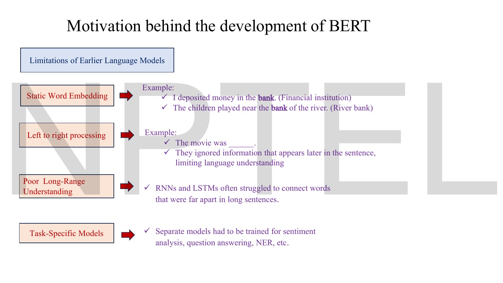
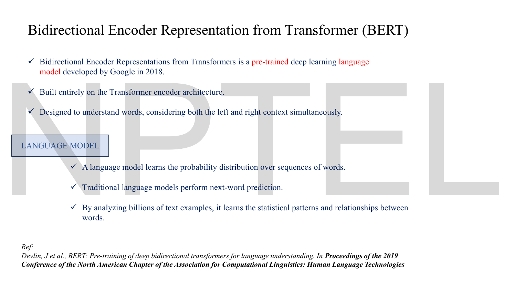
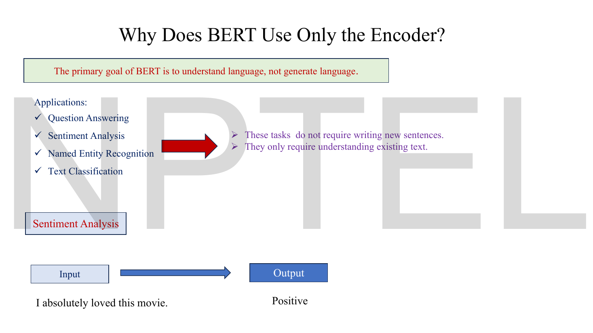
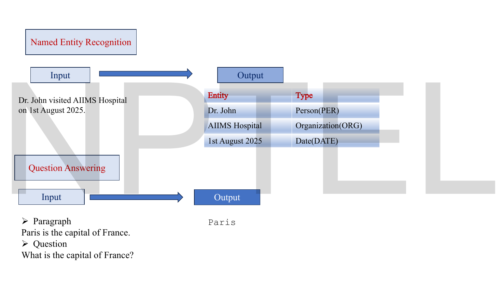
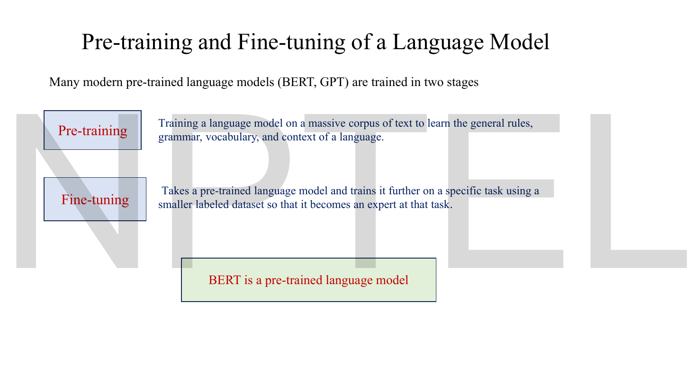
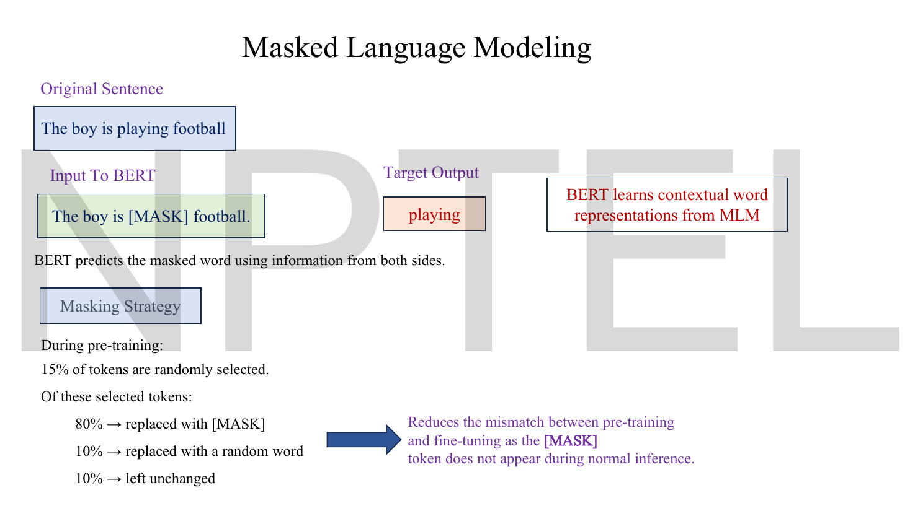
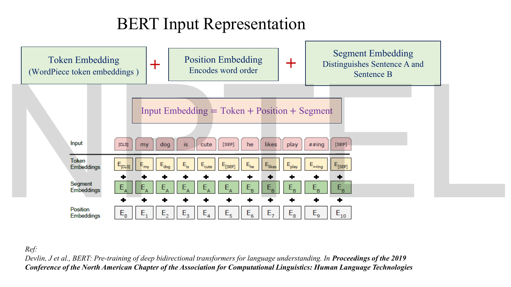
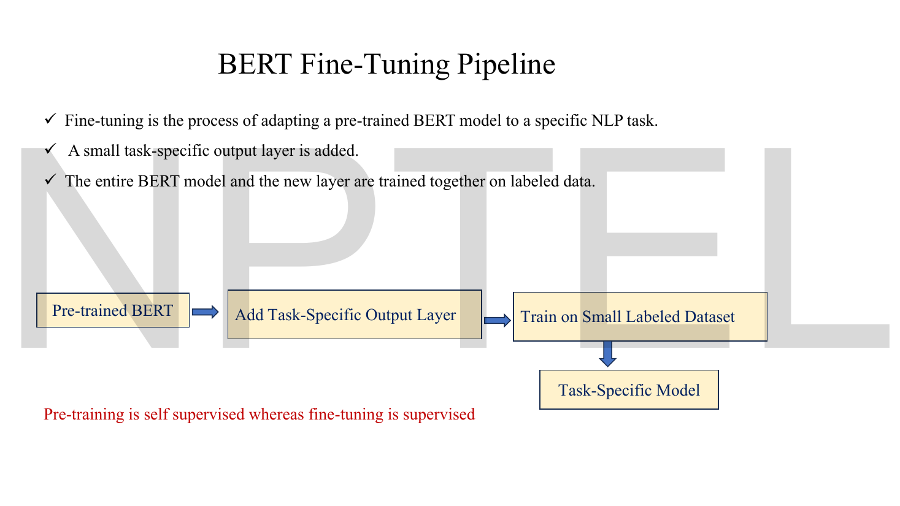
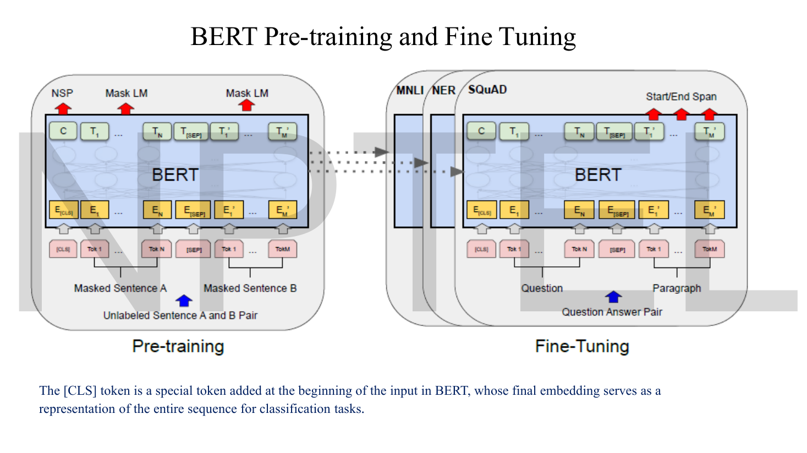
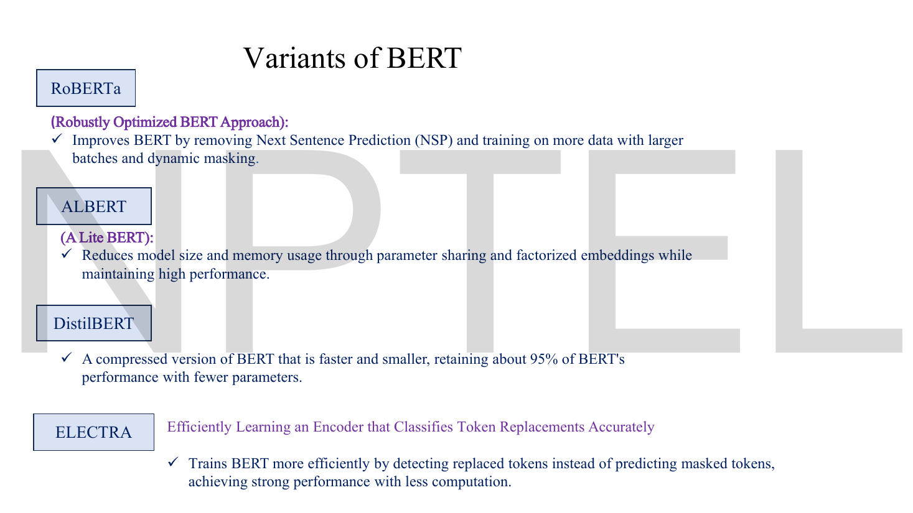

# Lec 60 — BERT (Bidirectional Encoder Representations from Transformers)

> **Source:** `Lec 60.pdf` (17 pages) · **Week 10** · **Playlist:** Lec 60
> **Prereqs:** [Lec 54 — Foundations of NLP](54-nlp-foundations.md), [Lec 56 — Evolution From LSTMs to Transformers](56-lstm-to-transformer.md), [Lec 57 — Transformer Encoder](57-transformer-encoder.md), [Lec 59 — Transformer Decoder](59-transformer-decoder.md)
> **Feeds into:** [Lec 61 — GPT](61-gpt.md), [Lec 62 — Prompt Engineering Basics](62-prompt-engineering.md), [Lec 63 — Hands-on on LLM](63-llm-handson.md)

## Why this lecture exists

[Lec 57](57-transformer-encoder.md) built an encoder block and [Lec 59](59-transformer-decoder.md) built a decoder, but neither said what to *train* them on. The original Transformer was trained on translation, which needs paired sentences in two languages — expensive, scarce, and useless for the other hundred things you want a language model to do.

BERT answers a narrower question: if you only want to *understand* text, not produce it, you can throw the decoder away, keep the encoder, and let every word see every other word. That freedom is also the problem. A model that can see the whole sentence cannot be trained to predict the next word, because the next word is already on its input. So bidirectionality forces a different training objective, and most of this lecture is that objective: mask some words out and make the model guess them. The rest is the two-stage habit — pre-train once on raw text, fine-tune cheaply per task — that the whole LLM half of the course now runs on.

## The ideas

### The four limitations BERT was built against


*Fig. — Read it as a checklist that the rest of the lecture ticks off: the first two limitations are answered by bidirectionality, the third by self-attention, the fourth by pre-train-then-fine-tune. Page 3.*

**1. Static word embeddings.** Word2Vec and GloVe give each word *type* exactly one vector. The deck's example is the cleanest version of the complaint:

- "I deposited money in the **bank**." (financial institution)
- "The children played near the **bank** of the river." (river bank)

One vector has to serve both senses, so it ends up being an average of them and is a good representation of neither. This is the thread [Lec 54](54-nlp-foundations.md) opened and dropped, and it is closed in the next subsection.

**2. Left-to-right processing.** Given "The movie was \_\_\_\_\_", a left-to-right model has only four words of evidence. If the sentence continues "…, I walked out after twenty minutes", the answer flips from *great* to *terrible* — and a left-to-right model never sees that continuation. The deck's own wording: such models "ignored information that appears later in the sentence, limiting language understanding."

**3. Poor long-range understanding.** RNNs and LSTMs "struggled to connect words that were far apart in long sentences" — the vanishing-gradient and fixed-thought-vector arguments of [Lec 55](55-rnn-lstm.md) and [Lec 56](56-lstm-to-transformer.md). Self-attention's $O(1)$ path length between any two positions is the fix, and it is already yours from [Lec 57](57-transformer-encoder.md).

**4. Task-specific models.** "Separate models had to be trained for sentiment analysis, question answering, NER, etc." Each needed its own labelled dataset. Pre-training amortises one expensive training run across all of them.

### Static versus contextual embeddings — the distinction the course has been dodging

This is the most important sentence in the chapter, so it gets its own box.

> **Word2Vec and GloVe produce one vector per word *type*. BERT and GPT produce one vector per word *occurrence*.** They are not two flavours of the same object. A Word2Vec model is a lookup table you can print; a BERT "embedding" only exists once you have supplied a whole sentence and run a forward pass.

[Lec 54](54-nlp-foundations.md) page 11 lists BERT and GPT in the same column as Word2Vec and GloVe, which invites the reading that BERT is a better Word2Vec. It is not. Concretely:

| | Word2Vec / GloVe | BERT / GPT |
|---|---|---|
| What it is | a $\lvert V\rvert \times d$ matrix | a neural network |
| How you get a vector | index into a row | run the sentence through the model |
| Vectors for *bank* in the two sentences above | **one** vector, identical | **two** vectors, different |
| Depends on neighbouring words? | only during training | at every use |
| Name | **static** embedding | **contextual** embedding |

The two *bank* vectors are different because self-attention mixes each token with its neighbours: [Lec 57](57-transformer-encoder.md)'s $\mathbf{c}_i = \sum_j \alpha_{ij}\mathbf{v}_j$ makes the output at position $i$ a function of the whole sentence. Change "money" to "river" and the $\alpha_{ij}$ change, so $\mathbf{c}_i$ changes. N5 puts numbers on it.

> **Notation.** $\mathbf{c}_t$ here is the attention context vector of CONTRACT §3, **not** an LSTM cell state. The LSTM cell state is $\mathbf{C}_t$, capital. The collision is real and appears on this lecturer's own slides ([Lec 55](55-rnn-lstm.md) p-10 against [Lec 56](56-lstm-to-transformer.md) p-6); do not let it back in.

### What BERT is


*Fig. — Two claims to carry into the exam: "built entirely on the Transformer encoder architecture", and "considering both the left and right context simultaneously". The word simultaneously is doing real work — it rules out running two one-directional models and concatenating. Page 4.*

The deck's definition, assembled:

- **Bidirectional Encoder Representations from Transformers**, Google, **2018** (Devlin et al.; the paper appeared at NAACL **2019**, which is the date printed on the slide's reference line).
- Built **entirely on the Transformer encoder**. No decoder, no cross-attention, no output-side mask.
- Designed to understand words **considering both left and right context simultaneously**.

The deck also pauses to define **language model**: a model that "learns the probability distribution over sequences of words". It notes that *traditional* language models do next-word prediction, which is exactly the thing BERT cannot do — see the next subsection.

> **Expand the acronym correctly.** The deck's title slide writes "…from **Transformer**" (singular); page 4 and the paper write "…from **Transformers**" (plural). Plural is the official expansion. An MCQ asking what the B, E, R and T stand for wants *Bidirectional, Encoder, Representations, Transformers*.

### Why encoder-only, and what that costs


*Fig. — The argument is one line: these four tasks "do not require writing new sentences", they "only require understanding existing text". Every structural choice in BERT follows from that. Page 5.*

The deck's reasoning:

> The primary goal of BERT is to **understand** language, not **generate** language.

Its four applications — question answering, sentiment analysis, named entity recognition, text classification — all map text to a *label* or a *span*, never to a new sentence. The input is given in full before the model runs, so there is no reason to hide the right-hand context, and every reason not to.


*Fig. — Both outputs are selections, not compositions. NER labels tokens that are already there; QA returns a span of the paragraph. Notice the QA answer "Paris" is copied, not written — this is extractive QA, and it is all an encoder can do. Page 6.*

The cost is absolute and worth stating plainly, because the exam will test it: **BERT cannot generate text.** There is no mechanism by which it could. It has no causal mask, so it has no notion of "what comes next", and its training objective never asked it to continue a sequence. That is [Lec 61](61-gpt.md)'s job.

### Where the encoder block went

BERT's body is literally the stack of [Lec 57](57-transformer-encoder.md): $N$ identical blocks, each one multi-head self-attention → add & norm → position-wise feed-forward → add & norm. Nothing in the block is changed. What changes is everything around it:

| | Original Transformer encoder (Lec 57) | BERT |
|---|---|---|
| Position information | **sinusoidal**, fixed, computed from a formula | **learned** position embeddings, one row per slot |
| Input embedding | token + positional | token + positional + **segment** |
| What sits on top | a decoder stack | a task head |
| Trained on | translation pairs | raw text, no labels |

> **The positional-encoding switch is not on the slides and is a live MCQ.** [Lec 57](57-transformer-encoder.md) derives the sinusoidal $\sin/\cos$ formula; BERT discards it and learns a $512 \times d_{\text{model}}$ table instead. That is why BERT has a hard 512-token ceiling — there is no row 513 — whereas a sinusoidal encoding is defined for every integer position. The deck's page-11 and page-12 boxes say "Position Embedding", never "positional encoding", and the difference between those two words is exactly this.

### Pre-training and fine-tuning


*Fig. — The deck's own definitions, worth quoting verbatim in an exam. Note the asymmetry it builds in: massive-and-unlabelled against smaller-and-labelled. Page 7.*

The deck's two definitions:

- **Pre-training** — "training a language model on a massive corpus of text to learn the general rules, grammar, vocabulary, and context of a language."
- **Fine-tuning** — "takes a pre-trained language model and trains it further on a specific task using a smaller labeled dataset so that it becomes an expert at that task."

And the one-line discrimination, printed in red on page 13 and near-certain to be set:

> **Pre-training is self-supervised; fine-tuning is supervised.**

**Self-supervised** means the labels are manufactured from the raw text itself — you hide a word you already have and ask the model for it — so no human annotation is needed and the corpus can be the size of Wikipedia. **Supervised** means a human wrote the labels, so the dataset is small and the training is short.

### Masked language modelling


*Fig. — The whole objective on one page. The right-hand red box is the claim being justified: BERT learns contextual word representations from MLM. The percentages at the bottom are the most examinable numbers in the lecture. Page 9.*

The problem, stated exactly: a bidirectional model cannot be trained on next-word prediction, because predicting token $t$ from a representation that already attended to token $t$ is not a prediction. The deck's phrasing of the two halves:

> Traditional language models predict the next word, which limits them to left-to-right context. BERT instead learns by predicting **randomly masked words**, allowing it to use both left and right context.

**The task.** Take "The boy is playing football". Replace one token to get the input "The boy is `[MASK]` football." Ask the model to output *playing* at that position. The model sees "The boy is" on the left *and* "football" on the right, and both narrow the answer — that is bidirectionality cashing out.

**The masking strategy.** During pre-training:

- **15% of tokens are randomly selected.** These, and only these, contribute to the loss.
- Of the selected tokens:
  - **80% → replaced with `[MASK]`**
  - **10% → replaced with a random word**
  - **10% → left unchanged**

**Why the split exists.** The deck gives the reason and it is the "why" the assignment hangs on:

> Reduces the mismatch between pre-training and fine-tuning as the `[MASK]` token **does not appear during normal inference**.

Unpack that. `[MASK]` is an artificial token invented for pre-training. When you later fine-tune on sentiment analysis, or run the model on a real review, there is no `[MASK]` anywhere in the input. If the model had only ever been trained with `[MASK]` present, it would have learned the shortcut "produce a careful contextual representation *at `[MASK]` positions*, and coast everywhere else" — and at fine-tuning time every position is an "everywhere else". That is a **train/test mismatch**: the input distribution at training time differs systematically from the input distribution at use time.

The 10%-random and 10%-unchanged buckets break the shortcut, and they do it in two different ways:

- The **10% unchanged** bucket means that sometimes the model is asked to predict a token that is sitting right in front of it, unmarked. Since it cannot tell which unmarked tokens are being scored, it must build a good representation of *every* token, not just the flagged ones.
- The **10% random** bucket means the visible token is sometimes a lie. The model cannot simply copy the input; it has to check whether the token is consistent with its context. This is where a little of the noise-robustness idea from [Lec 13](13-denoising-ae.md) reappears — corrupt the input, demand the clean version back.

> **The distinction the trap will turn on: 15% of tokens are *predicted*, but only 13.5% of them are *altered*.** $0.15 \times 0.8 = 12\%$ become `[MASK]`, $0.15 \times 0.1 = 1.5\%$ become a random word, so $13.5\%$ of the input is corrupted. The remaining $1.5\%$ are scored while looking exactly like ordinary text. Worked in N1.

**The loss.** Only the 15% selected positions are scored. At each, the model's final hidden vector is pushed through a linear layer to $\lvert V\rvert$ logits and a softmax, and the loss is ordinary cross-entropy against the true token:

$$\mathcal{L}_{\text{MLM}} = -\frac{1}{\lvert M\rvert}\sum_{i \in M} \log P(x_i \mid \mathbf{x}_{\setminus M})$$

where $M$ is the set of masked positions and $\mathbf{x}_{\setminus M}$ is the corrupted sequence. This is the sparse categorical cross-entropy of [Lec 02](02-activations-and-losses.md) with integer token labels. Natural log throughout, as everywhere in this book. Worked in N2.

> **Why only 15%?** The deck does not say, and it is worth knowing. Mask too few and each forward pass yields almost no training signal, so pre-training takes forever — at 15% you get roughly 77 supervised predictions out of a 512-token sequence. Mask too many and too little context survives to make the prediction possible. 15% is the paper's empirical compromise, not a derived constant.

### Next sentence prediction


*Fig. — A binary classification task bolted on top of MLM. The 50/50 split is the number to remember, and it matters: a balanced dataset means the useless constant classifier scores exactly 50%. Page 10.*

MLM teaches BERT about words. NSP teaches it about *sentences*. The deck's motivation is a list of tasks that need a relation between two pieces of text:

- Question answering (does this paragraph answer this question?)
- Natural language inference (does the hypothesis follow from the premise?)
- Document retrieval

**The task.** Show the model two sentences, A and B, and ask a yes/no question: does B follow A?

| Sentence A | Sentence B | Label |
|---|---|---|
| Rahul went to the grocery store | He bought some milk. | **IsNext** |
| Rahul went to the grocery store. | The Eiffel Tower is in Paris. | **NotNext** |

**The training process.** During pre-training, **50%** of pairs are genuine consecutive sentences (IsNext) and **50%** are a sentence paired with a randomly drawn one from elsewhere in the corpus (NotNext). The deck's conclusion: "From NSP BERT learns sentence-level relationships."

**Where the prediction comes from.** The `[CLS]` token's final vector — see the next subsection — is fed to a two-way softmax. The loss is binary cross-entropy, the one from [Lec 11](11-reconstruction-loss.md), with one term per pair. The two objectives are trained **together**: page 11's pipeline shows MLM **+** NSP feeding one pre-trained model, so

$$\mathcal{L}_{\text{pre-train}} = \mathcal{L}_{\text{MLM}} + \mathcal{L}_{\text{NSP}}$$

with no weighting coefficient. Worked in N3.

> **NSP is the part of BERT that did not survive.** RoBERTa — on this deck's own page 15 — removes NSP entirely and gets *better* results. The task is too easy: a randomly drawn sentence usually comes from a different document and so differs in topic, which a model can detect from vocabulary alone without learning anything about discourse. Know the task for the exam; know that it was dropped for the discussion.

### The special tokens and the three-way input


*Fig. — Count the rows: three embeddings are added, not concatenated, so the sum has the same width as each addend. Count the segment row: six E sub A then five E sub B, and the first SEP belongs to segment A. Page 12.*

$$\text{Input embedding} = \text{Token embedding} + \text{Position embedding} + \text{Segment embedding}$$

All three are $d_{\text{model}}$-dimensional and they are **summed**, not concatenated — so the input to block 1 is $d_{\text{model}}$ wide, exactly as [Lec 57](57-transformer-encoder.md) assumed.

| Component | What it encodes | Table size |
|---|---|---|
| **Token embedding** | which WordPiece token this is | $\lvert V\rvert \times d_{\text{model}}$ |
| **Position embedding** | which slot in the sequence | $512 \times d_{\text{model}}$, learned |
| **Segment embedding** | sentence A or sentence B | $2 \times d_{\text{model}}$ |

The segment embedding is new — the original Transformer had no such thing, because it never saw two sentences packed into one input. It is a two-row table: every token in sentence A adds row $\mathbf{E}_A$, every token in B adds row $\mathbf{E}_B$.

**The two special tokens.**

- **`[CLS]`** — *classification*. Always the **first** token of every input, always. It has no meaning of its own; it is a scratchpad. Because self-attention lets it attend to the entire sequence, its final-layer vector is a representation of the *whole input*, and that is what the NSP head and every sequence-classification head read. The deck states this explicitly on page 14: "The `[CLS]` token is a special token added at the beginning of the input in BERT, whose final embedding serves as a representation of the entire sequence for classification tasks."
- **`[SEP]`** — *separator*. Marks the end of a segment. In a two-sentence input it appears **twice**: once between A and B, once at the very end. The slide's example makes this concrete: `[CLS] my dog is cute [SEP] he likes play ##ing [SEP]`.

Two details from that example worth noticing. `playing` is tokenised as `play` + `##ing` — that is **WordPiece**, whose merge rule is owned by [Lec 59](59-transformer-decoder.md) (WordPiece maximises corpus likelihood; BPE merges by raw frequency). And the position embeddings run $\mathbf{E}_0$ to $\mathbf{E}_{10}$, so position indexing is **0-based** and the special tokens occupy real positions and consume real budget. N4(b) does that accounting.

> **The first `[SEP]` is part of segment A.** On the slide, the segment row reads $\mathbf{E}_A$ six times (`[CLS]`, my, dog, is, cute, `[SEP]`) and then $\mathbf{E}_B$ five times (he, likes, play, ##ing, `[SEP]`). So `[CLS]` is in segment A and the separator closing a segment belongs to the segment it closes.

### The pre-training pipeline end to end


*Fig. — The plus sign between the two objective boxes is the point: MLM and NSP are trained jointly in one run, not in sequence. The red dashed ellipse is the lecturer flagging input construction as the step expanded at the bottom. Page 11.*

1. **Training data** — BooksCorpus + Wikipedia. Raw text, no labels.
2. **WordPiece tokenization** — the subword scheme of [Lec 59](59-transformer-decoder.md).
3. **Input construction** — token + segment + position embeddings, with `[CLS]` and `[SEP]` inserted.
4. **MLM + NSP** — the two objectives, jointly.
5. **Pre-trained BERT.**

### The fine-tuning pipeline


*Fig. — The middle box is small by design and the third bullet is the one people get wrong: the entire BERT model and the new layer are trained together, not just the new layer. Page 13.*

The deck's three bullets:

- Fine-tuning adapts a pre-trained BERT to a specific NLP task.
- **A small task-specific output layer is added.**
- **The entire BERT model and the new layer are trained together** on labelled data.

That third bullet rules out the obvious alternative — freezing BERT and training only the head, which is *feature extraction*, a different and generally weaker technique. In BERT fine-tuning every one of the ~110 M parameters is updated, with a small learning rate, for two or three epochs.


*Fig. — The dotted arrows carry one set of weights into three different tasks. Everything below the BERT box is identical across all four panels; only the arrows out of the top change. That is the whole economic argument for pre-training. Page 14.*

The head depends on what the task reads:

| Task | What the head reads | Output |
|---|---|---|
| Sentence classification (sentiment, MNLI) | final vector of `[CLS]` | one softmax over classes |
| Token classification (NER) | final vector of **every** token | one softmax per token |
| Extractive QA (SQuAD) | final vector of every token | two scores per token: start and end |

The SQuAD head is the "Start/End Span" label on the figure: two learned vectors are dotted with every token's final representation, giving a start distribution and an end distribution over the paragraph, and the predicted answer is the span between the argmaxes. That is how "Paris" gets returned on page 6 without a single word being generated.

### Variants of BERT


*Fig. — Each variant changes exactly one thing, and the exam will ask which. RoBERTa changes the training recipe, ALBERT the parameter layout, DistilBERT the size, ELECTRA the objective. Page 15.*

| Variant | Expansion | What it changes | Memorable number |
|---|---|---|---|
| **RoBERTa** | Robustly Optimized BERT Approach | **Removes NSP**; more data, larger batches, **dynamic masking** | — |
| **ALBERT** | A Lite BERT | **Parameter sharing** across layers + **factorized embeddings** | — |
| **DistilBERT** | — | Compressed: smaller and faster | retains about **95%** of BERT's performance |
| **ELECTRA** | Efficiently Learning an Encoder that Classifies Token Replacements Accurately | **Detects replaced tokens** instead of predicting masked ones | — |

**Dynamic masking** is worth one line because it is a natural MCQ. BERT masks each sequence once, during data preparation, so the model sees the same mask pattern in every epoch. RoBERTa re-draws the mask each time the sequence is served, so the model sees many different masks of the same sentence. Same 15% rate, different bookkeeping.

**ELECTRA's objective** is the interesting one. Instead of predicting the identity of 15% of tokens, it asks a binary question at *every* token — "was this token replaced?" — which means 100% of positions contribute to the loss instead of 15%. That is where its efficiency comes from.

> **Compression (CONTRACT §5).** The companion course develops BERT at `../../DLforNLP/notes/week-06/27-bert-masked-lm.md`, including ELMo's two-one-directional-models predecessor, the BIO subword-alignment problem for NER, and which layer's vectors to extract for feature-based use. None of that is on *this* deck, and this exam is set from this deck. What this lecturer does differently: he leads with the four limitations, gives the `[MASK]`-mismatch justification in his own words, and spends a full page on the four variants — which the companion treats in passing.

## Worked numericals

**The deck contains no worked arithmetic whatsoever.** Its only numbers are the masking percentages on page 9, the 50/50 split on page 10, and DistilBERT's 95% on page 15. All six numericals below are constructed; N1 and N3 are built directly on the deck's own percentages, N5 is built on the deck's own *bank* sentences, N4 reuses the parameter machinery carried from [Lec 57](57-transformer-encoder.md), and N6 reuses that chapter's verified attention example. Logarithms are natural throughout and the base is stated in every answer.

### N1. The 15% / 80-10-10 recipe, counted out

**Given:** a packed input sequence of 1,000 WordPiece tokens, with BERT's standard masking strategy.
**Find:** how many tokens are scored, how many are shown as `[MASK]`, how many are corrupted in total, and what fraction of the input is untouched.

1. **Tokens selected as prediction targets:** $0.15 \times 1000 = 150$.
2. **Split the 150 three ways:**
   - `[MASK]`: $0.80 \times 150 = 120$
   - random word: $0.10 \times 150 = 15$
   - unchanged: $0.10 \times 150 = 15$
   - Check: $120 + 15 + 15 = 150$. ✓
3. **As a fraction of the whole sequence:**
   - shown as `[MASK]`: $0.15 \times 0.80 = 0.12 = 12\%$
   - shown as a random word: $0.15 \times 0.10 = 0.015 = 1.5\%$
   - shown unchanged but still scored: $0.015 = 1.5\%$
   - not selected at all: $1 - 0.15 = 0.85 = 85\%$
4. **Corrupted input tokens** (the ones whose surface form is wrong): $120 + 15 = 135$, i.e. $0.15 \times 0.90 = 13.5\%$.
5. **Positions contributing to the loss:** all 150, i.e. $15\%$ — including the 15 that were never altered.

**Answer:** 150 scored, 120 masked, 15 randomised, 15 left alone; **13.5% of the input is corrupted while 15% of it is predicted**, and 85% of tokens are neither.

The gap between 13.5% and 15% is the whole point of the recipe. From the model's point of view, 1.5% of the sequence looks completely ordinary and is nevertheless being graded, and it has no way to tell which 1.5%. The only safe strategy is to compute a good contextual representation at every position — which is precisely the behaviour fine-tuning needs.

### N2. MLM cross-entropy at one masked position

**Given:** the deck's sentence, input "The boy is `[MASK]` football.", gold token *playing*. At the masked position the output layer produces these logits over a five-word candidate set:

| token | *playing* | *kicking* | *watching* | *eating* | *the* |
|---|---|---|---|---|---|
| logit $z$ | 3.2 | 2.1 | 1.5 | 0.4 | $-0.6$ |

**Find:** the softmax probabilities and the MLM loss at this position.

1. **Exponentiate.** $e^{3.2} = 24.532530$, $e^{2.1} = 8.166170$, $e^{1.5} = 4.481689$, $e^{0.4} = 1.491825$, $e^{-0.6} = 0.548812$.
2. **Sum:** $24.532530 + 8.166170 + 4.481689 + 1.491825 + 0.548812 = 39.221026$.
3. **Divide:**

| token | probability |
|---|---|
| *playing* | $24.532530/39.221026 = 0.625494$ |
| *kicking* | $8.166170/39.221026 = 0.208209$ |
| *watching* | $4.481689/39.221026 = 0.114268$ |
| *eating* | $1.491825/39.221026 = 0.038036$ |
| *the* | $0.548812/39.221026 = 0.013993$ |

   Check: the five sum to $1.000000$. ✓
4. **Loss** $= -\log P(\text{playing}) = -\log(0.625494) = 0.469213$.

**Answer:** $\mathcal{L} = \mathbf{0.469213}$ **nats** (natural log). In $\log_{10}$ the same quantity is $0.203777$; in bits it is $0.676936$. The per-position perplexity is $e^{0.469213} = 1.598735$ — the model is behaving as if choosing between about 1.6 equally good options.

> Notice that *kicking* and *watching* together take 32% of the mass. Both are grammatical and both are plausible; a loss of 0.47 nats is a model that is right but not certain, which is what a well-calibrated MLM looks like on a genuinely ambiguous blank.

### N3. The joint pre-training loss, MLM + NSP

**Given:** one training example consisting of a sentence pair with 8 masked positions. The per-position MLM losses are $0.47, 1.22, 0.08, 2.65, 0.91, 0.33, 1.74, 0.60$ nats. The NSP head outputs a logit $z = 1.8$ for IsNext, and the true label **is** IsNext.
**Find:** $\mathcal{L}_{\text{MLM}}$, $\mathcal{L}_{\text{NSP}}$ and the total.

1. **MLM:** sum the eight, $0.47 + 1.22 + 0.08 + 2.65 + 0.91 + 0.33 + 1.74 + 0.60 = 8.00$, then average over the 8 masked positions: $8.00/8 = 1.000000$ nats.
2. **NSP, forward:** $\sigma(1.8) = \dfrac{1}{1+e^{-1.8}} = \dfrac{1}{1+0.165299} = 0.858149$.
3. **NSP loss**, binary cross-entropy with $y = 1$: $-\log(0.858149) = 0.152978$ nats.
4. **Total:** $\mathcal{L} = \mathcal{L}_{\text{MLM}} + \mathcal{L}_{\text{NSP}} = 1.000000 + 0.152978$.

**Answer:** $\mathcal{L}_{\text{MLM}} = 1.000000$, $\mathcal{L}_{\text{NSP}} = 0.152978$, **total $= 1.152978$ nats** (natural log). The two terms are added with **no weighting coefficient** — this is not a $\beta$-VAE-style trade-off, both objectives carry weight 1.

Counterfactual worth carrying: had the true label been NotNext with the same logit, the loss would be $-\log(1 - 0.858149) = -\log(0.141851) = 1.952978$ nats — thirteen times larger, and that is the gradient signal that teaches the `[CLS]` vector to carry sentence-pair information at all.

### N4. BERT-base, counted from parts — and what fits inside it

**Part (a) — the parameter count.**

**Given:** BERT-base: $N = 12$ encoder blocks, $d_{\text{model}} = 768$, $h = 12$ heads, $d_{\text{ff}} = 3072$, WordPiece vocabulary $\lvert V\rvert = 30{,}522$, maximum sequence length 512, 2 segments. Biases on the feed-forward network and layer norms counted; attention projection biases counted separately at the end.
**Find:** the total parameter count.

1. **One attention sublayer** $= 4d_{\text{model}}^2 = 4 \times 768^2 = 2{,}359{,}296$. By [Lec 57](57-transformer-encoder.md) N4 this is the count **for any $h$** — the 12 heads are free, because splitting one $768\times768$ projection into 12 slices of width 64 moves no parameters.
2. **Feed-forward network** $= 768 \times 3072 + 3072 + 3072 \times 768 + 768 = 2{,}359{,}296 + 3072 + 2{,}359{,}296 + 768 = 4{,}722{,}432$.
3. **Two layer norms** $= 2 \times 2 \times 768 = 3{,}072$ (a gain and a bias per feature, per norm).
4. **One encoder block** $= 2{,}359{,}296 + 4{,}722{,}432 + 3{,}072 = 7{,}084{,}800$.
5. **Twelve blocks** $= 12 \times 7{,}084{,}800 = 85{,}017{,}600$.
6. **Embeddings:**
   - token: $30{,}522 \times 768 = 23{,}440{,}896$
   - position: $512 \times 768 = 393{,}216$
   - segment: $2 \times 768 = 1{,}536$
   - embedding layer norm: $2 \times 768 = 1{,}536$
   - total $= 23{,}837{,}184$
7. **Pooler** (the dense + tanh that turns the `[CLS]` vector into the NSP input) $= 768 \times 768 + 768 = 590{,}592$.
8. **Running total** $= 85{,}017{,}600 + 23{,}837{,}184 + 590{,}592 = 109{,}445{,}376$.
9. **Add the attention projection biases**, $4 \times 768$ per block $\times 12 = 36{,}864$: $109{,}445{,}376 + 36{,}864 = 109{,}482{,}240$.

**Answer:** **109,482,240 parameters ≈ 110 M** — the published figure for BERT-base, reproduced exactly.

Two readings. The embedding table alone is 23.8 M, **22%** of the model, and 98% of that is the token table — vocabulary size is an expensive hyperparameter. And the 12 blocks cost 85.0 M against a 768-dimensional model, so depth is where the money goes. (BERT-large is $N=24$, $d_{\text{model}}=1024$, $h=16$, $d_{\text{ff}}=4096$, ≈340 M; neither configuration is on this deck.)

**Part (b) — special-token accounting and the 512-token ceiling.**

**Given:** the same model, and a two-sentence input in which sentence A tokenises to 230 WordPiece tokens and sentence B to 288.
**Find:** whether the pair fits, and what the budget is in general.

1. **Special tokens required:** one `[CLS]` at the front, one `[SEP]` after A, one `[SEP]` after B — **three**.
2. **Total length** $= 230 + 288 + 3 = 521$.
3. **Ceiling:** the position embedding table has 512 rows ($\mathbf{E}_0$ through $\mathbf{E}_{511}$), so 512 is a hard limit — there is no row 512 to look up. $521 > 512$, so the pair does **not** fit; 9 tokens must be truncated.
4. **General budget** for a sentence pair: $\text{len}(A) + \text{len}(B) \le 512 - 3 = \mathbf{509}$.
5. **General budget** for a single sequence (`[CLS]` … `[SEP]`, two specials): $512 - 2 = \mathbf{510}$.

**Answer:** it does not fit — 521 against a ceiling of 512. The usable budget is **509 content tokens for a pair, 510 for a single sequence.**

The ceiling is architectural, not a safety limit. It exists because BERT *learns* its position embeddings rather than computing them from the sinusoidal formula of [Lec 57](57-transformer-encoder.md), and you cannot look up a row you never trained. A sinusoidal encoding would extrapolate; a learned table cannot.

### N5. One vector per type against one per occurrence

**Given:** the deck's own two sentences, with 4-dimensional vectors for illustration.

- Word2Vec's single entry for *bank*: $(0.50,\ 0.30,\ -0.20,\ 0.40)$
- BERT's output for *bank* in "I deposited money in the bank": $(0.80,\ 0.10,\ -0.50,\ 0.20)$
- BERT's output for *bank* in "The children played near the bank of the river": $(-0.10,\ 0.70,\ 0.30,\ 0.60)$

**Find:** the cosine similarity between the two occurrences under each model.

1. **Word2Vec.** There is only one vector, so the two occurrences are compared with themselves: $\cos(\mathbf{v},\mathbf{v}) = 1.000000$ **by construction**, for every sentence pair, always. No computation is needed and none is possible.
2. **BERT, dot product:** $(0.80)(-0.10) + (0.10)(0.70) + (-0.50)(0.30) + (0.20)(0.60)$
   $= -0.08 + 0.07 - 0.15 + 0.12 = -0.04$.
3. **Norms:** $\lVert\mathbf{c}_{\text{money}}\rVert = \sqrt{0.64 + 0.01 + 0.25 + 0.04} = \sqrt{0.94} = 0.969536$;
   $\lVert\mathbf{c}_{\text{river}}\rVert = \sqrt{0.01 + 0.49 + 0.09 + 0.36} = \sqrt{0.95} = 0.974679$.
4. **Cosine:** $-0.04 / (0.969536 \times 0.974679) = -0.04/0.945013 = -0.042329$.

**Answer:** **1.000000 under Word2Vec, $-0.042329$ under BERT.** The static model asserts the two *bank*s are the same word; the contextual model places them essentially orthogonal — as unrelated as two randomly chosen words.

This is the whole of errata item 26 in one number. "BERT is a better word embedding" is the wrong mental model. BERT does not *have* embeddings for *bank*; it has a function that maps (word, sentence) to a vector.

### N6. How much of a BERT token's representation comes from its right-hand context

**Given:** the carried three-token example of [Lec 57](57-transformer-encoder.md) N2 — $d_{\text{model}} = 4$, $d_k = 2$, tokens "the / cat / sat" — whose first attention row is

$$\boldsymbol{\alpha}_1 = (0.045388,\ 0.767918,\ 0.186694)$$

and, under [Lec 59](59-transformer-decoder.md)'s causal mask, becomes $(1, 0, 0)$.
**Find:** the share of token 1's output drawn from tokens to its *right*, in each regime.

1. **Bidirectional (BERT):** tokens 2 and 3 are both to the right of token 1, so their combined weight is $0.767918 + 0.186694 = 0.954612$.
2. **Share on itself:** $0.045388$.
3. **Causal (GPT):** the mask zeroes both future entries, so right-hand share $= 0$ and self-share $= 1$ exactly.
4. **Token 2, bidirectionally,** draws $0.186694$ from token 3; **masked,** $0$.
5. **Token 3** is the last position, so masking changes nothing: $(1/3, 1/3, 1/3)$ either way.

**Answer:** token 1's representation is **95.46% right-hand context** under bidirectional attention and **0%** under a causal mask. Summed over the whole sequence, bidirectional attention places **1.141306** units of attention mass on future positions; the causal model places **exactly 0**.

That 0.954612 is the number to attach to the word "bidirectional". It also explains the training-objective constraint from the other direction: if 95% of token 1's representation is built from the tokens after it, you obviously cannot ask that representation to *predict* the token after it.

## Code

Three things the deck asserts but never shows: that the 80/10/10 recipe leaves a sliver of unaltered-but-scored tokens, what an MLM loss actually is, and what "contextual" buys you numerically.

```python
import numpy as np
rng = np.random.default_rng(0)

# --- 1. The 15% / 80-10-10 recipe applied to a 1000-token sequence --------
n = 1000
sel = rng.random(n) < 0.15                      # 15% chosen as PREDICTION targets
draw = rng.random(n)                            # second draw decides what the input shows
to_mask      = sel & (draw < 0.80)              # 80% -> [MASK]
to_random    = sel & (draw >= 0.80) & (draw < 0.90)   # 10% -> random word
to_unchanged = sel & (draw >= 0.90)             # 10% -> left alone
print("targets scored by the loss :", sel.sum())
print("  shown as [MASK]          :", to_mask.sum())
print("  shown as a random word   :", to_random.sum())
print("  shown unchanged          :", to_unchanged.sum())
print("input tokens actually altered:", to_mask.sum() + to_random.sum(),
      "= %.1f%% of the sequence" % (100*(to_mask.sum()+to_random.sum())/n))

# --- 2. MLM cross-entropy at one masked position -------------------------
vocab  = ["playing", "kicking", "watching", "eating", "the"]
logits = np.array([3.2, 2.1, 1.5, 0.4, -0.6])
p = np.exp(logits) / np.exp(logits).sum()
for w, q in zip(vocab, p):
    print(f"  P({w:9s}) = {q:.6f}")
loss = -np.log(p[0])                            # gold token is "playing"
print("MLM loss at this position = %.6f nats  (perplexity %.6f)" % (loss, np.exp(loss)))

# --- 3. static vs contextual: one vector per TYPE vs one per OCCURRENCE ---
cos = lambda a, b: float(a @ b / (np.linalg.norm(a) * np.linalg.norm(b)))
static_bank = np.array([0.50, 0.30, -0.20, 0.40])          # Word2Vec: ONE vector
bert_bank_money = np.array([0.80, 0.10, -0.50, 0.20])      # "deposited money in the bank"
bert_bank_river = np.array([-0.10, 0.70, 0.30, 0.60])      # "near the bank of the river"
print("Word2Vec  bank vs bank  cos = %.6f  (same vector, by construction)"
      % cos(static_bank, static_bank))
print("BERT      bank vs bank  cos = %.6f  (two different vectors)"
      % cos(bert_bank_money, bert_bank_river))
```

```
targets scored by the loss : 131
  shown as [MASK]          : 109
  shown as a random word   : 12
  shown unchanged          : 10
input tokens actually altered: 121 = 12.1% of the sequence
  P(playing  ) = 0.625494
  P(kicking  ) = 0.208209
  P(watching ) = 0.114268
  P(eating   ) = 0.038036
  P(the      ) = 0.013993
MLM loss at this position = 0.469213 nats  (perplexity 1.598735)
Word2Vec  bank vs bank  cos = 1.000000  (same vector, by construction)
BERT      bank vs bank  cos = -0.042329  (two different vectors)
```

Three readings. The sampled counts (131 / 109 / 12 / 10) land near but not on the expected 150 / 120 / 15 / 15 — masking is a *random* process per sequence, and over a 1,000-token sample the sampling noise is several percent. The MLM loss reproduces N2 exactly. And the third block is the chapter's thesis in two lines: the static model's self-similarity is 1.000000 because there is literally nothing else to compare, while the contextual model's two vectors for the same spelling are essentially orthogonal.

## Exam pack

### Must-memorise

| Item | Exactly this |
|---|---|
| BERT expands to | **B**idirectional **E**ncoder **R**epresentations from **T**ransformers |
| Origin | Google, **2018** (paper published NAACL **2019**, Devlin et al.) |
| Architecture | **encoder-only** — the [Lec 57](57-transformer-encoder.md) stack, no decoder, no cross-attention |
| Primary goal | understand language, **not** generate language |
| Pre-training objectives | **MLM + NSP**, trained jointly |
| MLM selection rate | **15%** of tokens |
| MLM 80/10/10 | 80% → `[MASK]`, 10% → random word, 10% → unchanged |
| Reason for 80/10/10 | `[MASK]` never appears at fine-tuning or inference time — reduce the train/test mismatch |
| MLM loss | $\mathcal{L}_{\text{MLM}} = -\frac{1}{\lvert M\rvert}\sum_{i\in M}\log P(x_i \mid \mathbf{x}_{\setminus M})$ |
| NSP split | **50% IsNext / 50% NotNext** |
| NSP head reads | the final vector of `[CLS]` |
| Joint loss | $\mathcal{L} = \mathcal{L}_{\text{MLM}} + \mathcal{L}_{\text{NSP}}$, no weighting |
| `[CLS]` | first token of every input; its final embedding represents the whole sequence |
| `[SEP]` | segment separator; appears **twice** in a two-sentence input |
| Input embedding | **token + position + segment**, summed |
| Tokenizer | **WordPiece** ([Lec 59](59-transformer-decoder.md)) |
| Pre-training corpus | **BooksCorpus + Wikipedia** |
| Pre-training vs fine-tuning | pre-training is **self-supervised**, fine-tuning is **supervised** |
| What fine-tuning updates | a small new output layer **and the entire BERT model**, together |
| Static vs contextual | one vector per word **type** vs one per word **occurrence** |

### Numbers worth knowing

| Quantity | Value |
|---|---|
| Tokens selected for prediction | 15% |
| Of those: `[MASK]` / random / unchanged | **80% / 10% / 10%** (must sum to 100%) |
| Fraction of the whole input shown as `[MASK]` | $0.15\times0.80 = 12\%$ |
| Fraction of the input **corrupted** | $0.15\times0.90 = 13.5\%$ |
| Fraction of the input **scored** | 15% |
| Fraction untouched | 85% |
| NSP IsNext / NotNext | 50% / 50% |
| BERT-base | $N=12$, $d_{\text{model}}=768$, $h=12$, $d_{\text{ff}}=3072$, **109,482,240 ≈ 110 M** |
| BERT-base encoder block | **7,084,800** parameters |
| BERT-base attention sublayer | $4d_{\text{model}}^2 = 2{,}359{,}296$, **for any $h$** |
| BERT-base embedding table | 23,837,184 (22% of the model) |
| BERT-large | $N=24$, $d_{\text{model}}=1024$, $h=16$, $d_{\text{ff}}=4096$, ≈340 M (off-slide) |
| WordPiece vocabulary | 30,522 |
| Maximum sequence length | **512** tokens (hard — learned position table) |
| Usable content tokens, sentence pair | $512-3 = 509$ |
| Usable content tokens, single sequence | $512-2 = 510$ |
| DistilBERT retention | about **95%** of BERT's performance |
| N2's MLM loss | 0.469213 nats |
| Carried example: token 1's right-hand share | 0.954612 bidirectional, 0 causal |

### Likely MCQ traps

- **"BERT masks 15% of tokens with `[MASK]`."** No. 15% are *selected*; only 80% of those (12% of the sequence) become `[MASK]`. The other 3% are a random word or the original token.
- **"The 10%-unchanged tokens are not used in training."** They are. All 15% of selected positions contribute to the loss, including the ones whose input was never altered — that is the entire reason the bucket exists.
- **"80/10/10 exists to add noise / regularise."** The deck's stated reason is narrower and is the one to give: **`[MASK]` does not appear during normal inference**, so training only on `[MASK]` creates a pre-train/fine-tune mismatch.
- **"BERT can generate text."** It cannot, and it is not a matter of being bad at it. It has no causal mask and no next-token objective. Generation is [Lec 61](61-gpt.md).
- **BERT is encoder-only, so it has no mask.** Careful: BERT has no *causal* mask. The `[MASK]` **token** and the causal **attention mask** are completely different objects that share a word. BERT has the first and not the second; GPT has the second and not the first.
- **"BERT uses sinusoidal positional encoding."** The original Transformer does ([Lec 57](57-transformer-encoder.md)); BERT uses a **learned** 512-row position embedding table. That is why 512 is a hard ceiling.
- **Confusing the three embeddings.** Token = which word. Position = which slot. Segment = sentence A or B. They are **added**, not concatenated, so the input width stays $d_{\text{model}}$.
- **Counting one `[SEP]`.** A two-sentence input has three special tokens: `[CLS]`, `[SEP]`, `[SEP]`. A single-sequence input has two.
- **"Fine-tuning trains only the new head."** The deck is explicit: the entire model and the new layer train together. Freezing the body is *feature extraction*, a different technique.
- **"Pre-training is unsupervised."** It is **self-supervised** — labels exist, they are just manufactured from the text itself. This lecturer says "self supervised" in red; say it back.
- **Mixing up the variants.** RoBERTa = removes NSP + dynamic masking. ALBERT = parameter sharing + factorized embeddings (smaller). DistilBERT = distilled/compressed (95%). ELECTRA = replaced-token *detection* instead of masked-token prediction.
- **"BERT gives better word embeddings than Word2Vec."** Category error. Word2Vec *is* an embedding table; BERT is a network that computes a different vector per occurrence. See N5.
- **Log base.** Every loss here is in **nats**. $\log_{10}$ scales each by $1/2.3026$; bits scale by $1/0.6931$.

### Self-test

1. BERT is bidirectional. State precisely why that makes next-word prediction unusable as a pre-training objective.
2. A 2,000-token sequence is prepared for MLM. How many tokens are scored, how many are shown as `[MASK]`, and what fraction of the input is corrupted?
3. Give the deck's reason for the 80/10/10 split, in one sentence.
4. What does the `[CLS]` token's final vector represent, and which head consumes it?
5. How many `[SEP]` tokens appear in the input "`[CLS]` my dog is cute `[SEP]` he likes play ##ing `[SEP]`", and which segment does the first one belong to?
6. At a masked position the model assigns 0.40 to the gold token. Give the loss and state the base.
7. Name the three embeddings summed to form BERT's input and say what each encodes.
8. Which BERT variant removes NSP, and which replaces masked-token prediction with replaced-token detection?
9. Why is BERT limited to 512 tokens, when the sinusoidal encoding of Lec 57 has no such limit?
10. Compute the number of parameters in one BERT-base encoder block.

<details><summary>Answers</summary>

1. Because the representation of position $t$ has already attended to token $t$ itself and to everything after it. Asking that representation to output token $t+1$ is not prediction — the answer is already inside the input to the layer that produces it. In the carried example (N6), 95.46% of token 1's representation is drawn from tokens to its right. So a bidirectional model needs an objective where the target is *removed* from the input: masking.
2. Scored: $0.15 \times 2000 = 300$. Shown as `[MASK]`: $0.80 \times 300 = 240$. Corrupted: $240 + 30 = 270$, i.e. $13.5\%$ of the input. (30 are a random word, 30 are unchanged.)
3. The `[MASK]` token never appears at fine-tuning or inference time, so a model trained only with `[MASK]` present would face a train/test mismatch; the random and unchanged buckets force it to build a good representation at every position regardless of what the surface token looks like.
4. A representation of the **entire input sequence**, because self-attention lets `[CLS]` attend to every token. It feeds the NSP head during pre-training and every sequence-classification head during fine-tuning.
5. **Two.** The first belongs to **segment A** — on the slide the segment row shows $\mathbf{E}_A$ for `[CLS]`, my, dog, is, cute and the first `[SEP]` (six positions), then $\mathbf{E}_B$ for the remaining five.
6. $-\log(0.40) = 0.916291$ **nats** (natural log). In $\log_{10}$: $0.397940$; in bits: $1.321928$.
7. **Token embedding** (which WordPiece token), **position embedding** (which slot, learned, 512 rows), **segment embedding** (sentence A or B, 2 rows). All three are $d_{\text{model}}$-wide and are added.
8. **RoBERTa** removes NSP (and adds dynamic masking and more data). **ELECTRA** replaces masked-token prediction with replaced-token detection.
9. Because BERT **learns** its position embeddings as a $512 \times d_{\text{model}}$ table. Position 512 has no row, and there is nothing to interpolate from. A sinusoidal encoding is a closed-form function of the index and is therefore defined at every position.
10. Attention $4\times768^2 = 2{,}359{,}296$; FFN $768\cdot3072 + 3072 + 3072\cdot768 + 768 = 4{,}722{,}432$; two layer norms $= 3{,}072$. Block $= \mathbf{7{,}084{,}800}$. (Add $4\times768 = 3{,}072$ if you count attention projection biases.)

</details>

## Beyond the slides

**Gap: the deck gives no BERT configuration at all — no $L$, $H$, $A$, no parameter count.**
**Why it matters:** "BERT-base has 110 M parameters, 12 layers, $d_{\text{model}} = 768$, 12 heads" is the single most likely numerical MCQ about this model, and a reader of these slides alone could not answer it. N4 derives 109,482,240 from parts using [Lec 57](57-transformer-encoder.md)'s machinery, which also lets you re-derive BERT-large (24 / 1024 / 16, ≈340 M) if the exam swaps the configuration.

**Gap: the deck never says BERT's position embeddings are learned rather than sinusoidal.**
**Why it matters:** it is a direct contradiction of [Lec 57](57-transformer-encoder.md)'s only numerical, and it is the reason for the 512-token ceiling that *is* examinable. The two words the decks use — "positional encoding" (Lec 57) and "position embedding" (Lec 60 pp. 11–12) — are not synonyms, and the distinction between a computed function and a learned table is worth one sentence in any answer about BERT's input.

**Gap: nothing is said about *why* 15%, or what the knob trades off.**
**Why it matters:** masking rate is a real hyperparameter and an obvious "what if" question. Too low and each 512-token forward pass yields too few supervised targets, so pre-training compute is wasted; too high and there is not enough surviving context to make the prediction learnable. 15% is empirical. Later work (notably on larger models) found rates up to 40% can work, which is useful to know if a question frames 15% as a theoretical optimum — it is not.

**Gap: NSP is taught as a load-bearing component, and it is not.**
**Why it matters:** this deck's own page 15 says RoBERTa removes NSP and improves on BERT. That is a contradiction left standing on the slides. The resolution: NSP is too easy, because a randomly drawn negative usually comes from a different document and is detectable from topic words alone, so the model learns topic matching rather than discourse coherence. ALBERT replaced it with *sentence-order prediction* (same two sentences, correct or swapped order), which removes the topic shortcut. Answer "MLM and NSP" for what BERT was trained on; know the critique for anything that asks whether NSP helped.

**Gap: the deck never mentions that `[MASK]` positions are the *only* ones scored, nor what that costs.**
**Why it matters:** BERT extracts a learning signal from 15% of its tokens; GPT ([Lec 61](61-gpt.md)) extracts one from 100%, because every position predicts the next. That is a roughly 6.7× difference in supervision density per forward pass and it is a large part of why decoder-only models scaled better. ELECTRA, on this deck's page 15, exists precisely to fix it — replaced-token detection scores every position. The efficiency argument is the thread connecting ELECTRA, GPT and the whole post-2020 shift to decoder-only models.

## Cut from the slides

Pages 1, 2, 16 and 17 are the title, the contents list, a bare "Summary" title card with no summary on it (this lecturer's template — confirmed on a dozen decks and recorded in errata batch 11 item 13) and the next-session pointer; nothing was lost. Page 6's two task examples (NER on "Dr. John visited AIIMS Hospital on 1st August 2025" and extractive QA returning "Paris") are embedded as a figure and used to make the extractive-versus-generative point, rather than re-narrated line by line, since the mapping they illustrate is stated on page 5. Page 8's bullets — that MLM and NSP are "self-supervised learning objectives that BERT solves while learning from a large amount of unlabeled text", and that NSP serves QA, natural language inference and document retrieval — are folded into the two objective subsections rather than given a page of their own. The deck's phrase "Bidirectional Encoder Representation**s** from Transformer" (singular Transformer, page 1 title) is corrected to the paper's plural and the discrepancy is flagged once. The lecturer's red-box assertions ("BERT learns contextual word representations from MLM", "From NSP BERT learns sentence-level relationships") are reproduced as the claims their subsections justify. Everything else on pages 3 through 15 is reproduced in full, and the parameter counts, the learned-position-embedding correction, the 512-token arithmetic and the whole static-versus-contextual contrast are added as clearly-labelled off-slide content.
