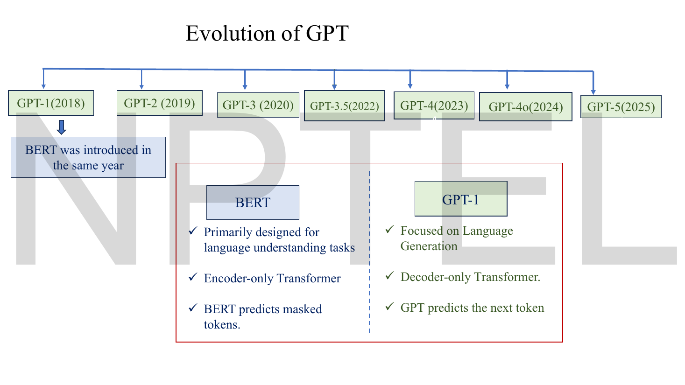
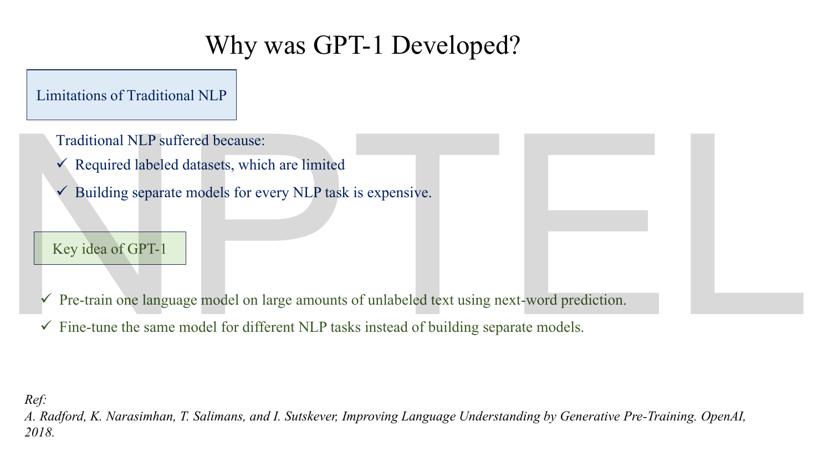
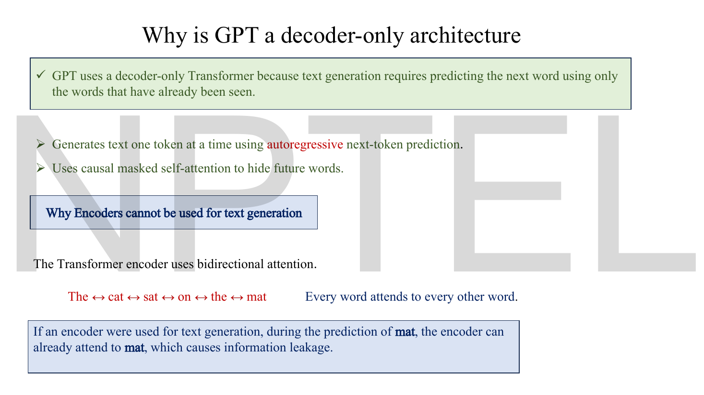
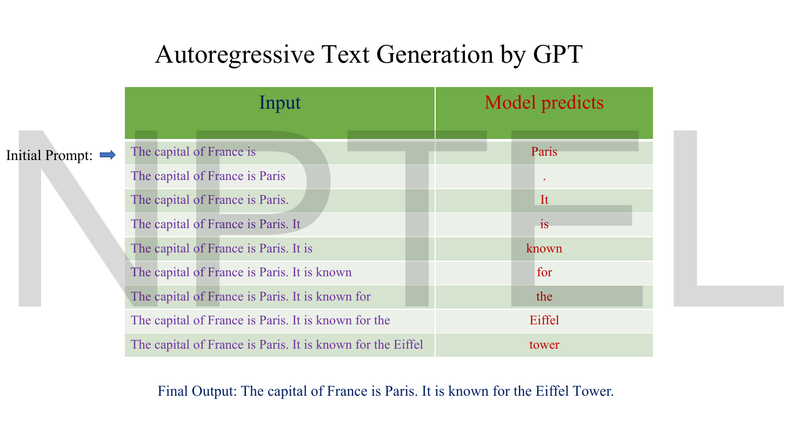
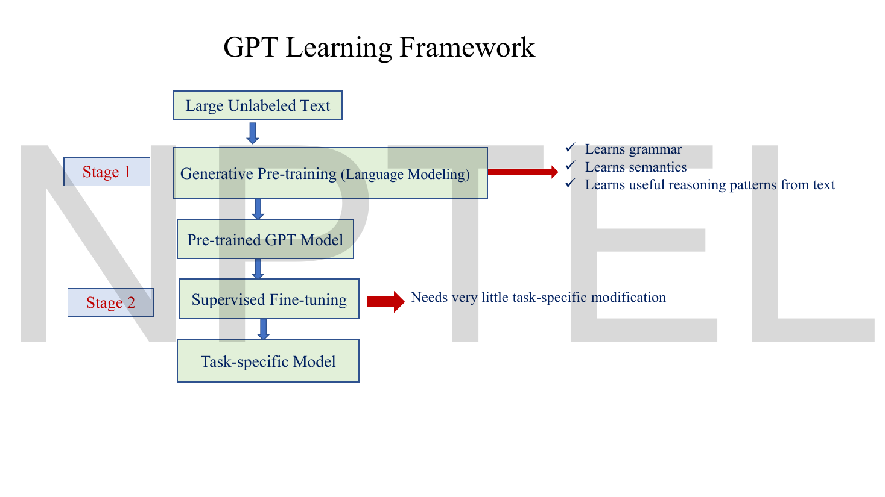
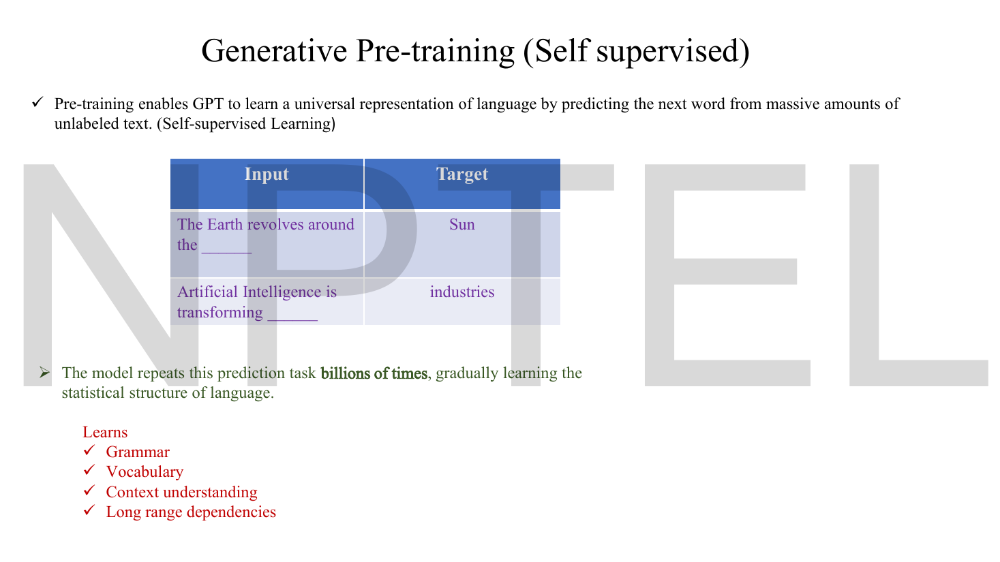
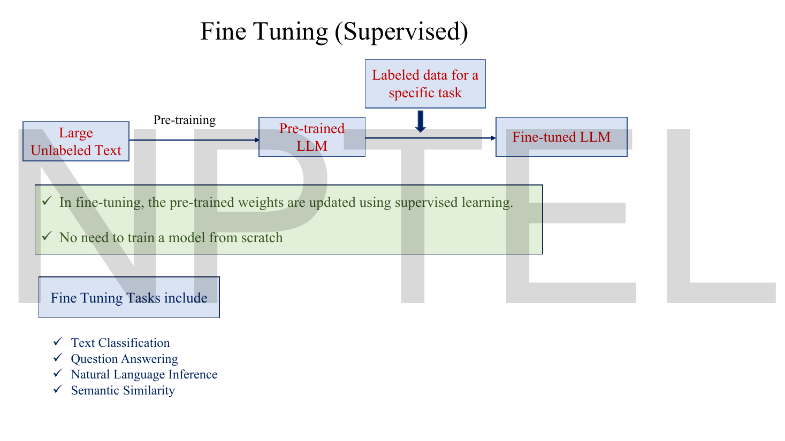
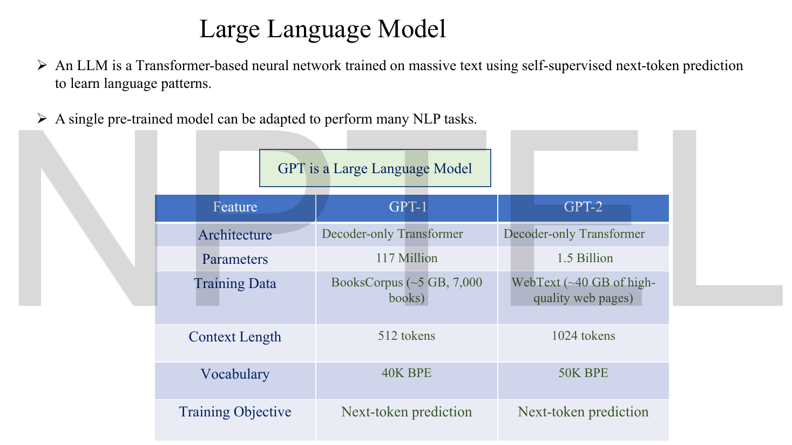
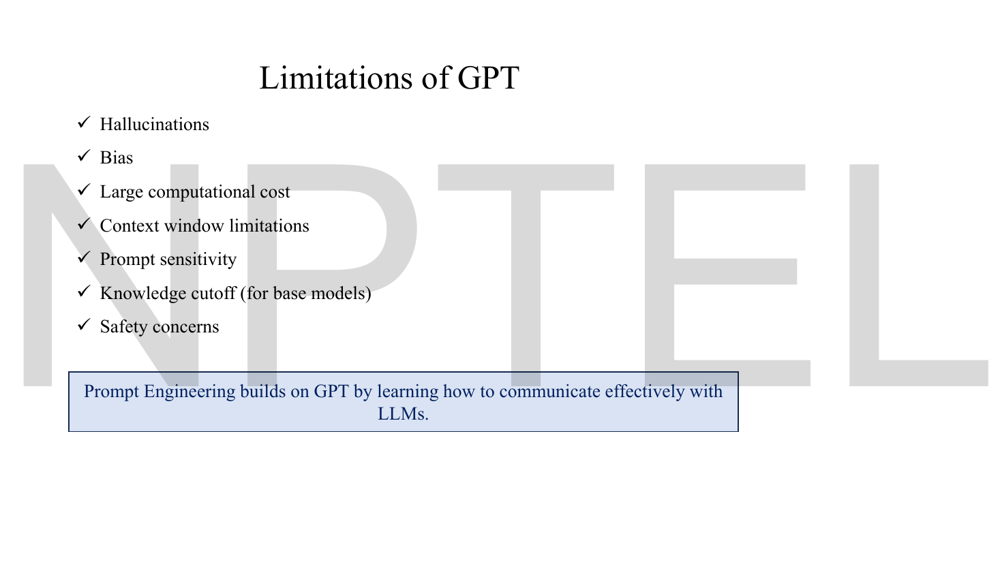

# Lec 61 — GPT (Generative Pre-trained Transformer)

> **Source:** `Lec 61.pdf` (14 pages) · **Week 10** · **Playlist:** Lec 61
> **Prereqs:** [Lec 56 — Evolution From LSTMs to Transformers](56-lstm-to-transformer.md), [Lec 57 — Transformer Encoder](57-transformer-encoder.md), [Lec 59 — Transformer Decoder](59-transformer-decoder.md), [Lec 60 — BERT](60-bert.md)
> **Feeds into:** [Lec 62 — Prompt Engineering Basics](62-prompt-engineering.md), [Lec 63 — Hands-on on LLM](63-llm-handson.md), [Lec 64–67 — LLM Recap, In-Context Learning, LoRA, RAG](64-llm-icl-lora-rag.md)

## Why this lecture exists

[Lec 60](60-bert.md) threw the decoder away and kept the encoder, because understanding text does not require writing any. This lecture does the mirror-image thing: throw the *encoder* away and keep the decoder, because writing text does not require anything else.

That sounds like a smaller idea than it turned out to be. A decoder trained to predict the next token learns grammar, facts, translation, arithmetic and style, all from the same objective and all without a single human label — and, as the models got larger, it stopped needing to be fine-tuned at all. You could just *ask*. The arc from "a 117 M-parameter model you fine-tune per task" to "a model you talk to" is the arc of this lecture and of the rest of the course.

This chapter also owns the **BERT versus GPT contrast**, the discrimination that the whole LLM half of the exam is built on.

## The ideas

### The series, and the fork in 2018


*Fig. — The red box at the bottom is the examinable content on this page, not the timeline. BERT and GPT-1 are the same year, the same building block and the opposite design decision — that simultaneity is why the comparison is set so often. Page 3.*

The deck's timeline: **GPT-1 (2018) · GPT-2 (2019) · GPT-3 (2020) · GPT-3.5 (2022) · GPT-4 (2023) · GPT-4o (2024) · GPT-5 (2025)**, with a note that BERT was introduced in the same year as GPT-1.

And the deck's own three-line comparison, which is the seed of the full table later in this chapter:

| | BERT | GPT-1 |
|---|---|---|
| Designed for | language **understanding** tasks | language **generation** |
| Architecture | **encoder-only** Transformer | **decoder-only** Transformer |
| Predicts | **masked** tokens | the **next** token |

### Why GPT-1 was built


*Fig. — Compare this with Lec 60 page 3: the fourth limitation on BERT's motivation slide is the same complaint, in almost the same words. Both models were answers to the labelled-data problem; they only differ in what they did about it. Page 4.*

**Limitations of traditional NLP**, per the deck:

- Required **labelled** datasets, which are limited.
- Building **separate models for every NLP task** is expensive.

**The key idea of GPT-1:**

- **Pre-train one language model** on large amounts of unlabelled text using **next-word prediction**.
- **Fine-tune the same model** for different NLP tasks instead of building separate models.

This is the same two-stage structure as BERT's — unsurprisingly, since the papers are contemporaries. What differs is stage one's objective, and everything flows from that.

### Causal / autoregressive language modelling


*Fig. — The double-headed arrows are the whole argument. In an encoder every word attends to every other word, so when the model is asked to predict mat it can already see mat. The deck's word for this is leakage. Page 5.*

**The objective.** A **causal** (equivalently **autoregressive**) language model factorises the probability of a sequence into a product of next-token conditionals, using nothing but the chain rule of probability:

$$P(x_1, x_2, \ldots, x_n) = \prod_{t=1}^{n} P(x_t \mid x_1, \ldots, x_{t-1})$$

Read the subscripts carefully: the conditional at step $t$ is allowed to look at everything **strictly before** $t$, and at nothing at or after it. Training maximises the log of this product, which is the same as minimising the average negative log-likelihood:

$$\mathcal{L} = -\frac{1}{n}\sum_{t=1}^{n}\log P(x_t \mid x_{<t})$$

Natural log, as everywhere in this book. This is ordinary sparse categorical cross-entropy ([Lec 02](02-activations-and-losses.md)) with the *input sequence shifted by one* as the label — which is why no human annotation is needed. The label is already in the text.

**Why the decoder.** The deck's chain of reasoning:

> GPT uses a decoder-only Transformer because text generation requires predicting the next word using **only the words that have already been seen**. … Uses **causal masked self-attention** to hide future words.

> The Transformer encoder uses bidirectional attention. "The ↔ cat ↔ sat ↔ on ↔ the ↔ mat" — every word attends to every other word. **If an encoder were used for text generation, during the prediction of *mat*, the encoder can already attend to *mat*, which causes information leakage.**

That is the exact mirror of [Lec 60](60-bert.md)'s argument. BERT is bidirectional, so it *cannot* use next-token prediction and needs masking. GPT uses next-token prediction, so it *cannot* be bidirectional and needs a causal mask. Neither is a design preference; each follows from the other.

**What "decoder-only" actually deletes.** The [Lec 59](59-transformer-decoder.md) decoder block has three sublayers:

```
  masked self-attention      <- survives in GPT
  cross-attention            <- DELETED (there is no encoder to attend to)
  position-wise FFN          <- survives in GPT
```

So a decoder-only block is: masked self-attention → add & norm → FFN → add & norm. Structurally that is **identical to an encoder block**, with one difference: the attention mask. Count them and they come out the same — N4 shows a GPT-1 block and a BERT-base block are both exactly 7,084,800 parameters at $d_{\text{model}} = 768$.

> **The one-line version, and it is worth memorising: masked self-attention is the attention that survives in *both* BERT and GPT; what distinguishes them is only whether the mask is applied.** BERT runs the same sublayer with the mask switched off. "Encoder-only" and "decoder-only" name the *provenance* of the block, not a different mechanism. Cross-attention — the genuinely decoder-specific sublayer — is in neither.

The mask itself, the $-\infty$ matrix and its arithmetic, belong to [Lec 59](59-transformer-decoder.md). Do not re-derive them; N1 uses its numbers.

### Autoregressive generation, step by step


*Fig. — The left column grows by exactly one token per row and the right column is always one word. Each prediction becomes part of the next input — that feedback is what autoregressive means, and it is why a single wrong token can derail everything after it. Page 6.*

The deck works the generation loop concretely. Starting from the prompt "The capital of France is":

| Step | Input | Model predicts |
|---|---|---|
| 1 | The capital of France is | Paris |
| 2 | The capital of France is Paris | . |
| 3 | The capital of France is Paris. | It |
| 4 | The capital of France is Paris. It | is |
| 5 | The capital of France is Paris. It is | known |
| 6 | The capital of France is Paris. It is known | for |
| 7 | The capital of France is Paris. It is known for | the |
| 8 | The capital of France is Paris. It is known for the | Eiffel |
| 9 | The capital of France is Paris. It is known for the Eiffel | tower |

**Final output:** "The capital of France is Paris. It is known for the Eiffel Tower."

Three observations the slide does not make but that the exam might.

- **Nine steps means nine forward passes.** Generation is inherently sequential and cannot be parallelised over output positions. *Training*, by contrast, is one forward pass over the whole 14-token sequence producing 14 supervised predictions at once, because the causal mask makes all positions simultaneously legal ([Lec 59](59-transformer-decoder.md)'s "training is parallel; inference is not"). N3 prices this.
- **The model outputs a distribution, not a word.** "Predicts Paris" means Paris had the largest probability and was selected. *How* you select — greedy argmax, temperature sampling, top-$k$, beam search — is a separate choice. [Lec 01](01-intro-generative-ai.md) page 11 conflates the two (errata batch 3 item 7); Week 12 owns sampling properly.
- **Nothing in the loop knows where to stop.** Generation ends when a special end-of-sequence token is drawn or a length limit is hit, not because the sentence finished.

### The two-stage learning framework


*Fig. — The note on the right of Stage 2 is the claim that distinguishes GPT-1 from everything before it: the fine-tuned model needs very little task-specific modification. Compare BERT, where each task needs its own head shape. Page 7.*


*Fig. — Look at the Target column: every label was manufactured by deleting a word that was already in the corpus. That is what self-supervised means and it is why the training set can be the whole internet. Page 8.*

**Stage 1 — generative pre-training (self-supervised).** "Pre-training enables GPT to learn a universal representation of language by predicting the next word from massive amounts of unlabeled text." The deck's two examples:

| Input | Target |
|---|---|
| The Earth revolves around the \_\_\_\_ | Sun |
| Artificial Intelligence is transforming \_\_\_\_ | industries |

Repeated "billions of times", this teaches **grammar, vocabulary, context understanding and long-range dependencies** (the deck's own list), plus — per page 7 — "useful reasoning patterns from text".


*Fig. — The second arrow is the only place labelled data enters, and it is the cheap arrow. The green box states the economic point: no need to train a model from scratch. Page 9.*

**Stage 2 — fine-tuning (supervised).** "In fine-tuning, the pre-trained weights are **updated** using supervised learning" — all of them, as in BERT — on labelled data for text classification, question answering, natural language inference, or semantic similarity.

> **Terminology collision across two lectures.** [Lec 60](60-bert.md) page 13 calls pre-training **self-supervised**; this deck's page 7 heading calls it **unsupervised** in the contents list and **self-supervised** on page 8's own heading. They mean the same thing, and *self-supervised* is the precise term: labels exist, they are just derived from the data rather than written by a person. Answer "self-supervised" and you cannot be wrong.

### The architecture, and the input-transformation trick


*Fig. — Two separate ideas on one page. The left column is the model, stacked twelve times. The right column is how GPT-1 avoided inventing a new architecture per task: it rewrites every task as one linear token stream with Start, Delim and Extract markers, and reads the prediction off Extract. Page 10.*

**The block** (left of the figure), bottom to top: Text & Position Embed → $\big[$ Masked Multi Self Attention → Layer Norm → Feed Forward → Layer Norm $\big] \times 12$ → two heads, *Text Prediction* and *Task Classifier*.

Three things to read off it:

- There is **one** attention sublayer, not two — no cross-attention, confirming the deletion above.
- The layer norms come **after** each sublayer's residual addition (post-LN), which is [Lec 57](57-transformer-encoder.md)'s arrangement. Modern GPTs use pre-LN; GPT-1 does not.
- Positions enter as a learned **embedding** ("Text & Position Embed"), not a sinusoidal encoding — same choice as BERT, same consequence (a hard context limit, 512 for GPT-1).

**Input transformations** (right of the figure). GPT-1's second contribution was noticing that every task can be flattened into one sequence with three delimiter tokens — `Start`, `Delim`, `Extract` — and read off the final hidden state of `Extract`:

| Task | Sequence | Output |
|---|---|---|
| Classification | Start · Text · Extract | Positive / Negative |
| Entailment | Start · Premise · Delim · Hypothesis · Extract | Entailment / Neutral / Contradiction |
| Similarity | **two** sequences, Text 1 · Text 2 and Text 2 · Text 1, summed | Similar / Not similar |
| Multiple choice | **N** sequences, Context · Delim · Answer $i$, each scored | highest score wins |

The deck's entailment example is "Birds can fly" (premise) and "Sparrows can fly" (hypothesis). The similarity row runs the pair in **both orders and adds** the two representations, because similarity is symmetric but a causal model is not — a nice detail and exactly the kind of thing an MCQ likes.

> `Extract` plays the role `[CLS]` plays in BERT, with one structural difference: `[CLS]` is at the **front**, because a bidirectional model can gather the sequence from anywhere; `Extract` must be at the **end**, because a causal model can only see backwards. Same job, opposite position, and the reason for the difference is the mask.

### Scale: what changed as the series grew


*Fig. — Read the first and last rows first: architecture and training objective are identical. Every other row is a number that got bigger. That is the finding — the capability jump between these two models came from scale, not from a new idea. Page 11.*

The deck's definition: "An LLM is a Transformer-based neural network trained on massive text using self-supervised next-token prediction to learn language patterns", and "a single pre-trained model can be adapted to perform many NLP tasks."

| Feature | GPT-1 | GPT-2 |
|---|---|---|
| Architecture | Decoder-only Transformer | Decoder-only Transformer |
| Parameters | **117 Million** | **1.5 Billion** |
| Training data | BooksCorpus (~5 GB, 7,000 books) | WebText (~40 GB of high-quality web pages) |
| Context length | **512** tokens | **1024** tokens |
| Vocabulary | **40K BPE** | **50K BPE** |
| Training objective | Next-token prediction | Next-token prediction |

**What the table is really saying.** Top and bottom rows unchanged; everything between them multiplied by roughly 10. Parameters $\times 12.8$, data $\times 8$, context $\times 2$. And the capability changed qualitatively: GPT-1 had to be fine-tuned to do anything; GPT-2 could do several tasks it was never fine-tuned on, purely by being prompted. GPT-3 (175 B parameters, 2048-token context — **not on this deck**) made that the headline rather than a curiosity.

The progression in one line, which is the thing to be able to say:

| Model | How you get it to do your task |
|---|---|
| GPT-1 | pre-train, then **fine-tune** with labelled examples and a task head |
| GPT-2 | fine-tune, or **ask it in the prompt** and hope |
| GPT-3 onward | **ask it in the prompt**, with a few examples inside the prompt; no weight update |

### Zero-shot, one-shot and few-shot — in-context learning

> **Not on this deck.** Lec 61's slides never use the words zero-shot, one-shot or few-shot, and never mention GPT-3's parameter count or in-context learning, despite listing GPT-3 on the timeline. The section is written as owned content because the assignment and the exam both need it; [Lec 62](62-prompt-engineering.md) covers prompting technique and the Week 11 chapter covers in-context learning's mechanics.

**In-context learning** is the ability to perform a task from a description and/or a handful of examples placed **inside the prompt**, with **no gradient step and no weight change**. The model's parameters are frozen; the "learning" happens entirely in the forward pass, inside the context window, and is forgotten the moment the context is cleared.

The three settings differ only in how many solved examples (called **demonstrations** or **shots**) you put in the prompt:

```
ZERO-SHOT  (k = 0)          ONE-SHOT  (k = 1)             FEW-SHOT  (k = 2..100)
-------------------------   --------------------------    --------------------------
Translate to French:        Translate to French:          Translate to French:
                            sea otter => loutre de mer    sea otter => loutre de mer
cheese =>                                                 plush giraffe => girafe peluche
                            cheese =>                     peppermint => menthe poivree

                                                          cheese =>
```

| | Shots $k$ | Weights updated? | Labelled examples needed | Where the examples live |
|---|---|---|---|---|
| **Fine-tuning** | hundreds to millions | **yes** | many | a training set, used over many epochs |
| **Zero-shot** | 0 | no | none | nowhere — only a task description |
| **One-shot** | 1 | no | 1 | inside the prompt |
| **Few-shot** | typically 10–100 | no | $k$ | inside the prompt |

> **The course gives two different numbers for $k$, and you need both.** This chapter's 10–100 is the
> GPT-3 convention (Brown et al. use up to 64 and more). **[Lec 62](62-prompt-engineering.md) p-11 says
> 2–5**, which is the practical prompt-engineering range. Neither is wrong — they describe different
> regimes. **In an exam: answer 2–5 if the question is sourced from Lec 62 or phrased as prompt
> engineering; answer 10–100 if it names GPT-3 or in-context learning.** Lec 62 carries the reciprocal
> ruling.

Four points that are the usual source of marks:

- **Two values of $k$ are live in this book.** This chapter says 10–100 (GPT-3's convention); [Lec 62](62-prompt-engineering.md) says 2–5 (prompt engineering's). Match the number to the question's source — GPT-3 or in-context learning ⇒ 10–100; prompt design ⇒ 2–5.
- **"Few-shot learning" involves no learning in the ordinary sense.** Nothing is optimised; no gradient is computed. The name is historical and misleading. If an option says "few-shot updates the model with a small learning rate", it is wrong.
- **The cost is paid per query, not once.** With fine-tuning you pay once and then every query is short. With few-shot you resend all $k$ demonstrations with every single request, which spends context budget and compute forever. N5 prices it.
- **It is bounded by the context window.** $k$ demonstrations must fit alongside the query. GPT-1's 512 tokens make even modest few-shot prompting impossible; this is a real reason, not just an empirical one, why in-context learning arrived with the larger-context models. N5 computes the budget.
- **It emerged with scale.** Small models given the same prompt do not improve with more demonstrations; large ones do. That is why the capability is attached to GPT-3 in every account, and why "scale changed what the model could do" is the correct summary rather than "OpenAI invented prompting".

### >>> BERT versus GPT — the contrast table <<<

This is the guaranteed question. Learn it as a table, because that is how it will be asked.

| | **BERT** ([Lec 60](60-bert.md)) | **GPT** (this chapter) |
|---|---|---|
| **Architecture** | **encoder-only** — the [Lec 57](57-transformer-encoder.md) stack | **decoder-only** — [Lec 59](59-transformer-decoder.md)'s block minus cross-attention |
| **Attention** | **bidirectional** self-attention; every token sees every token | **causal / masked** self-attention; token $t$ sees only $\le t$ |
| **Cross-attention?** | no | no |
| **Training objective** | **MLM + NSP** — predict 15% masked tokens, plus IsNext/NotNext | **next-token prediction** — $\prod_t P(x_t \mid x_{<t})$ |
| **Supervision density** | 15% of positions scored per pass | **100%** of positions scored per pass |
| **Special tokens** | `[CLS]` (front), `[SEP]`, `[MASK]` | `Start`, `Delim`, `Extract` (end) |
| **Good at** | **understanding**: classification, NER, extractive QA, sentence-pair tasks | **generation**: completion, free-form QA, summarisation, dialogue, translation |
| **Cannot do** | generate text at all | see the right-hand context of a token |
| **How you adapt it** | **fine-tuning** — add a head, update all weights on labelled data | GPT-1: fine-tuning. GPT-3 onward: **prompting**, no weight update |
| **Position information** | learned embeddings, 512 rows | learned embeddings, 512 (GPT-1) / 1024 (GPT-2) |
| **Tokenizer** | **WordPiece**, 30,522 | **BPE**, 40K (GPT-1) / 50K (GPT-2) |
| **Corpus** | BooksCorpus + Wikipedia | BooksCorpus (GPT-1) / WebText (GPT-2) |
| **Base size** | 110 M (base), 340 M (large) | 117 M (GPT-1), 1.5 B (GPT-2), 175 B (GPT-3) |
| **Year** | 2018 | 2018 (GPT-1) |
| **What it is** | a **contextual encoder** you put a head on | a **contextual encoder *and* a generator** |

**Two one-line discriminations to carry into the exam:**

- **Objective ⇒ attention, not the other way round.** If you are told the model predicts masked tokens, attention must be bidirectional (otherwise masking would be pointless). If you are told it predicts the next token, attention must be causal (otherwise the answer leaks). Either fact determines the other, and both determine the architecture.
- **BPE versus WordPiece** is the tokenizer tell. Both are subword schemes from [Lec 59](59-transformer-decoder.md); **BPE merges by frequency, WordPiece by likelihood**. GPT is BPE, BERT is WordPiece.

### Limitations


*Fig. — Four of the seven are direct consequences of things already taught. Note the closing line: it is the course's handoff to Lec 62. Page 12.*

The deck's seven:

| Limitation | Where it comes from |
|---|---|
| **Hallucinations** | the objective rewards *plausible* continuations, not *true* ones — nothing in $\log P(x_t \mid x_{<t})$ mentions truth |
| **Bias** | the corpus is scraped human text; the model reproduces its statistics |
| **Large computational cost** | 1.5 B–175 B parameters, plus attention's $O(n^2)$ ([Lec 59](59-transformer-decoder.md) p-13) |
| **Context window limitations** | learned position embeddings have a fixed number of rows — 512, then 1024 |
| **Prompt sensitivity** | the model conditions on the literal token sequence; rewording changes the conditional |
| **Knowledge cutoff (base models)** | the weights freeze when pre-training stops; nothing after that date is in them |
| **Safety concerns** | a model that will continue any prefix will continue a harmful one |

The deck's closing line: "Prompt Engineering builds on GPT by learning how to communicate effectively with LLMs" — which is [Lec 62](62-prompt-engineering.md).

> **Compression (CONTRACT §5).** The companion course covers the same ground at `../../DLforNLP/notes/week-06/29-gpt-decoder-pretraining.md`, with more on GPT-2's zero-shot framing and the cultural reception of GPT-3. This lecturer's distinctive contributions are the **leakage** argument for why an encoder cannot generate (page 5), the **nine-step generation trace** (page 6), and the **GPT-1 versus GPT-2 table** (page 11) — all three are set-piece material and all three are reproduced here in full.

## Worked numericals

**The deck contains no worked arithmetic whatsoever.** Its only numbers are the series years on page 3 and the GPT-1 / GPT-2 table on page 11. All six numericals below are constructed; N2 and N3 are built on the deck's own generation table, N4 and N5 are built on the deck's own parameter and context-length figures, and N1 reuses the attention example carried through [Lec 57](57-transformer-encoder.md) and [Lec 59](59-transformer-decoder.md). Logarithms are natural throughout and the base is stated in every answer.

### N1. The same three tokens, scored bidirectionally and causally

**Given:** the carried example — 3 tokens, $d_{\text{model}} = 4$, $d_k = 2$ — whose attention matrices were derived in [Lec 57](57-transformer-encoder.md) N2 (unmasked) and [Lec 59](59-transformer-decoder.md) N1 (masked):

$$\boldsymbol{\alpha}_{\text{BERT}} = \begin{bmatrix} 0.045388 & 0.767918 & 0.186694 \\ 0.767918 & 0.045388 & 0.186694 \\ 0.333333 & 0.333333 & 0.333333\end{bmatrix}, \qquad
\boldsymbol{\alpha}_{\text{GPT}} = \begin{bmatrix} 1 & 0 & 0 \\ 0.944193 & 0.055807 & 0 \\ 0.333333 & 0.333333 & 0.333333\end{bmatrix}$$

**Find:** the attention mass each regime places on *future* positions, row by row and in total, and what that implies for the training objective.

1. **Future positions** are the strictly upper triangle: $(1,2), (1,3), (2,3)$.
2. **BERT, row 1:** $0.767918 + 0.186694 = 0.954612$.
3. **BERT, row 2:** $0.186694$.
4. **BERT, row 3:** nothing is to the right of the last token, so $0$.
5. **BERT total:** $0.954612 + 0.186694 + 0 = 1.141306$.
6. **GPT:** every upper-triangular entry is exactly $0$ by construction of the mask, so every row contributes $0$ and the total is $0$.
7. **Row 3 is identical in both** — $(1/3, 1/3, 1/3)$ — because the final position has no future to mask.

**Answer:**

| Token | Future mass, BERT | Future mass, GPT |
|---|---|---|
| 1 | **0.954612** | 0 |
| 2 | 0.186694 | 0 |
| 3 | 0 | 0 |
| **Total** | **1.141306** | **0** |

Now the implication, which is the reason this numerical is worth doing. Token 1's output vector under bidirectional attention is **95.46% built from tokens that come after it**. Ask that vector to predict token 2 and you are not predicting anything — the answer contributed three quarters of the input. That is the leakage on the deck's page 5, quantified. Under the causal mask the same figure is exactly 0, which is precisely what makes next-token prediction a well-posed problem.

Note too what masking costs: token 1 goes from a rich mixture to $(1,0,0)$ — its own value vector, unchanged. The first token of a causal model is representationally blind, and the cost of the mask falls hardest on early positions ([Lec 59](59-transformer-decoder.md) N1).

### N2. The deck's sentence, scored under the chain rule

**Given:** the deck's prompt tokens with the model's conditional probability for each, each conditioned on everything before it:

| $t$ | token | $P(x_t \mid x_{<t})$ |
|---|---|---|
| 1 | The | 0.62 |
| 2 | capital | 0.81 |
| 3 | of | 0.47 |
| 4 | France | 0.93 |
| 5 | is | 0.55 |

**Find:** the sequence probability, the total and mean negative log-likelihood, and the perplexity.

1. **Sequence probability** — the chain rule, which is just a product:
   $$P(\text{sequence}) = 0.62 \times 0.81 \times 0.47 \times 0.93 \times 0.55$$
   $0.62 \times 0.81 = 0.5022$; $\times 0.47 = 0.236034$; $\times 0.93 = 0.21951162$; $\times 0.55 = 0.12073139$.
2. **Per-token negative log-likelihood** (natural log):

| token | $-\log P$ |
|---|---|
| The | $0.478036$ |
| capital | $0.210721$ |
| of | $0.755023$ |
| France | $0.072571$ |
| is | $0.597837$ |

3. **Total NLL:** $0.478036 + 0.210721 + 0.755023 + 0.072571 + 0.597837 = 2.114187$ nats.
   Cross-check: $-\log(0.12073139) = 2.114187$. ✓ (The sum of logs equals the log of the product — that identity is the entire reason language models are trained on log-likelihood.)
4. **Mean per-token loss:** $2.114187 / 5 = 0.422837$ nats.
5. **Perplexity:** $e^{0.422837} = 1.526286$.

**Answer:** $P(\text{sequence}) = 0.12073139$; total NLL $= 2.114187$ **nats**; mean $= 0.422837$ nats/token; **perplexity $= 1.526286$**.

Perplexity is the mean loss exponentiated, and it reads as "the model is as uncertain as if it were choosing uniformly between 1.53 options at each step". It is the standard language-model metric and it inherits the log base: in bits the mean loss is $0.610016$, and $2^{0.610016} = 1.526286$ — the **same** perplexity. Perplexity is base-independent; the loss it comes from is not.

### N3. What generation costs that training does not

**Given:** the deck's page-6 trace — a 5-token prompt and 9 generated tokens, final length 14. Attention cost is measured in score-matrix entries, $n^2$ for a full pass over $n$ tokens.
**Find:** the cost of generating the sentence with and without a key/value cache, and compare with training on the finished sentence.

1. **Context length at each step:** step 1 processes 5 tokens, step 2 processes 6, …, step 9 processes 13. So lengths $5, 6, \ldots, 13$.
2. **Naive generation** recomputes the entire attention matrix every step: $\sum_{n=5}^{13} n^2 = 25+36+49+64+81+100+121+144+169 = 789$ entries.
3. **With a KV cache**, the keys and values of all previous tokens are kept, so each step computes only the *new* row — one query against $n$ keys: $\sum_{n=5}^{13} n = 5+6+\cdots+13 = 81$ entries.
4. **Saving:** $789/81 = 9.740741$.
5. **Training on the same finished 14-token sentence:** **one** forward pass, one $14\times14$ masked score matrix $= 196$ entries, yielding **14** supervised predictions at once — because the causal mask makes every position's prediction legal simultaneously.

**Answer:** **789 entries naively, 81 with a KV cache — a 9.74× saving**; against **196 entries and one pass** to train on the identical text. Generation needs **9 sequential forward passes**; training needs **1**.

This is [Lec 59](59-transformer-decoder.md)'s "training is parallel, inference is not" in numbers, and it is the structural reason LLM *inference* is expensive even when training is affordable. Note also that the KV cache is possible *only because of causality*: a cached key for token 3 stays valid when token 10 arrives precisely because token 3's representation never depends on token 10. A bidirectional model cannot cache anything, which is a second, quieter reason BERT cannot generate efficiently even in principle.

### N4. GPT-1's 117 million, derived

**Given:** GPT-1 as the deck specifies it — decoder-only, 12 blocks (from the figure's "12x"), $d_{\text{model}} = 768$, $d_{\text{ff}} = 3072$, vocabulary 40,000 BPE, context length 512.
**Find:** the parameter count, and compare the block with BERT's encoder block.

1. **Masked self-attention sublayer** $= 4d_{\text{model}}^2 = 4 \times 768^2 = 2{,}359{,}296$ — [Lec 57](57-transformer-encoder.md) N4's result, **for any number of heads**.
2. **No cross-attention sublayer.** A full [Lec 59](59-transformer-decoder.md) decoder block has two attention sublayers; a decoder-only block has one. This single deletion is the whole of "decoder-only".
3. **Feed-forward network** $= 768\times3072 + 3072 + 3072\times768 + 768 = 4{,}722{,}432$.
4. **Two layer norms** $= 2\times2\times768 = 3{,}072$.
5. **One GPT-1 block** $= 2{,}359{,}296 + 4{,}722{,}432 + 3{,}072 = \mathbf{7{,}084{,}800}$.
6. **Compare:** a BERT-base encoder block is **also 7,084,800** ([Lec 60](60-bert.md) N4), and a full Transformer *decoder* block at the same width is $4{,}199{,}936$ at $d_{\text{model}}=512$ — a third heavier than its encoder because of cross-attention ([Lec 59](59-transformer-decoder.md) N4, ratio exactly 4/3). Delete cross-attention and the ratio returns to **1:1**.
7. **Twelve blocks** $= 12 \times 7{,}084{,}800 = 85{,}017{,}600$.
8. **Embeddings:** token $40{,}000 \times 768 = 30{,}720{,}000$; position $512 \times 768 = 393{,}216$. There is **no segment embedding** — GPT has no sentence-pair format.
9. **Total** $= 85{,}017{,}600 + 30{,}720{,}000 + 393{,}216 = 116{,}130{,}816$.
10. **With the final layer norm** ($1{,}536$) and the attention projection biases ($4\times768\times12 = 36{,}864$): $116{,}169{,}216$.

**Answer:** **≈116.1 M, rising to 116.2 M with biases — which rounds to the deck's 117 Million.** The residual few hundred thousand is accounting detail (the task-classifier head, bias conventions); the derivation reaches the published figure to within 0.7%.

Two readings. **A GPT-1 block and a BERT-base block are parameter-identical** — the entire architectural difference between the two models is a triangular matrix of $-\infty$ in the attention softmax, which costs nothing. And GPT-1's embedding table is 31.1 M, **27%** of the model, which is why vocabulary size (40 K here) is a real design decision and not a free parameter.

### N5. GPT-2's 1.5 billion, and the few-shot budget

**Given:** GPT-2 large: 48 blocks, $d_{\text{model}} = 1600$, $d_{\text{ff}} = 6400$, vocabulary 50,257 BPE, context 1024. Then: demonstrations of 32 tokens each plus a 32-token query.
**Find:** GPT-2's parameter count, and how many few-shot demonstrations fit in each generation's context window.

1. **Attention** $= 4 \times 1600^2 = 10{,}240{,}000$.
2. **FFN** $= 1600\times6400 + 6400 + 6400\times1600 + 1600 = 10{,}240{,}000 + 6400 + 10{,}240{,}000 + 1600 = 20{,}488{,}000$.
3. **Layer norms** $= 2\times2\times1600 = 6{,}400$.
4. **One block** $= 30{,}734{,}400$. **Forty-eight blocks** $= 1{,}475{,}251{,}200$.
5. **Embeddings:** token $50{,}257\times1600 = 80{,}411{,}200$; position $1024\times1600 = 1{,}638{,}400$.
6. **Total** (with a final layer norm): $1{,}475{,}251{,}200 + 80{,}411{,}200 + 1{,}638{,}400 + 3{,}200 = 1{,}557{,}304{,}000$.
7. **Few-shot capacity**, $k$ demonstrations of 32 tokens plus a 32-token query inside a context of $C$: $k \le (C - 32)/32$.

| Model | Context $C$ | Demonstrations that fit |
|---|---|---|
| GPT-1 | 512 | $(512-32)/32 = \mathbf{15}$ |
| GPT-2 | 1024 | $(1024-32)/32 = \mathbf{31}$ |
| GPT-3 | 2048 | $(2048-32)/32 = \mathbf{63}$ |

**Answer:** **1,557,304,000 ≈ 1.56 B**, matching the deck's "1.5 Billion". And the context window alone caps few-shot at 15 / 31 / 63 demonstrations for the three generations.

The capacity table is the quiet half of the scaling story. Doubling the context window doubles how much you can teach the model at inference time without touching a weight — and that is a different axis of improvement from making the model bigger, even though the deck's table lists them side by side as if they were the same kind of change.

### N6. Fine-tuning against few-shot, costed

**Given:** a classification task. Option A: fine-tune GPT-1 on 5,000 labelled examples for 3 epochs. Option B: few-shot prompt a large model with $k = 16$ demonstrations of 32 tokens each, serving 10,000 queries of 32 tokens.
**Find:** the labelled examples required, the weight updates, and the tokens processed at serving time, for each.

1. **Option A, labelled examples:** 5,000. **Option B:** 16.  Ratio $5000/16 = 312.5$.
2. **Option A, gradient steps** (batch size 32): $5000 \times 3 / 32 = 468.75 \to 469$ steps, each updating all **116.1 M** parameters.
   **Option B, gradient steps:** $\mathbf{0}$. No parameter is touched.
3. **Option A, serving cost:** the prompt is just the input, 32 tokens. $10{,}000 \times 32 = 320{,}000$ tokens.
4. **Option B, serving cost:** every query carries its 16 demonstrations. Prompt length $= 16\times32 + 32 = 544$ tokens. $10{,}000 \times 544 = 5{,}440{,}000$ tokens.
5. **Ratio at serving:** $5{,}440{,}000 / 320{,}000 = 17$.

**Answer:** few-shot needs **312.5× fewer labels** and **zero** weight updates, but costs **17× more tokens at serving time** — and pays that premium on *every single query*, forever.

That is the real trade and it is the honest answer to "which is better": fine-tuning front-loads the cost into a one-off training run and labelled data; prompting front-loads nothing and pays per call. It is also why the Week 11 chapter's **LoRA** exists — a way to get fine-tuning's cheap inference without fine-tuning's full 116 M-parameter update.

## Code

The deck states that an encoder leaks and a decoder does not, but shows no mechanism. These three blocks make the leakage, the chain rule and the cost of sequential generation concrete, using the carried example's published numbers rather than re-deriving them.

```python
import numpy as np

# --- 1. the same 3 tokens scored both ways (rows from Lec 57 N2 / Lec 59 N1)
bidir  = np.array([[0.045388, 0.767918, 0.186694],
                   [0.767918, 0.045388, 0.186694],
                   [0.333333, 0.333333, 0.333333]])
causal = np.array([[1.000000, 0.000000, 0.000000],
                   [0.944193, 0.055807, 0.000000],
                   [0.333333, 0.333333, 0.333333]])
fut = np.triu(np.ones((3, 3)), k=1)             # strictly-future positions
print("mass on FUTURE tokens, row by row")
for i in range(3):
    print("  token %d : BERT %.6f   GPT %.6f" % (i+1, (bidir[i]*fut[i]).sum(),
                                                 (causal[i]*fut[i]).sum()))
print("BERT total future mass = %.6f, GPT total = %.6f"
      % ((bidir*fut).sum(), (causal*fut).sum()))

# --- 2. the deck's sentence, scored autoregressively ---------------------
toks = ["The", "capital", "of", "France", "is"]
p    = np.array([0.62, 0.81, 0.47, 0.93, 0.55])   # each P(token | everything before)
for t, q in zip(toks, p):
    print(f"  P({t:8s}| prefix) = {q:.2f}   -ln = {-np.log(q):.6f}")
print("P(sentence) = %.8f" % p.prod())
nll = -np.log(p).sum()
print("total NLL   = %.6f nats ; mean per token = %.6f ; perplexity = %.6f"
      % (nll, nll/len(p), np.exp(nll/len(p))))

# --- 3. what generation costs: the deck's 9-step table -------------------
L = np.arange(5, 14)                              # context length at each of 9 steps
print("steps =", len(L), " lengths processed:", L.tolist())
print("attention entries recomputed, no cache :", int((L**2).sum()))
print("attention entries with a KV cache      :", int(L.sum()))
print("saving factor                          : %.2fx" % ((L**2).sum()/L.sum()))
print("training on the finished 14-token sentence: 1 forward pass, 14 targets")
```

```
mass on FUTURE tokens, row by row
  token 1 : BERT 0.954612   GPT 0.000000
  token 2 : BERT 0.186694   GPT 0.000000
  token 3 : BERT 0.000000   GPT 0.000000
BERT total future mass = 1.141306, GPT total = 0.000000
  P(The     | prefix) = 0.62   -ln = 0.478036
  P(capital | prefix) = 0.81   -ln = 0.210721
  P(of      | prefix) = 0.47   -ln = 0.755023
  P(France  | prefix) = 0.93   -ln = 0.072571
  P(is      | prefix) = 0.55   -ln = 0.597837
P(sentence) = 0.12073139
total NLL   = 2.114187 nats ; mean per token = 0.422837 ; perplexity = 1.526286
steps = 9  lengths processed: [5, 6, 7, 8, 9, 10, 11, 12, 13]
attention entries recomputed, no cache : 789
attention entries with a KV cache      : 81
saving factor                          : 9.74x
training on the finished 14-token sentence: 1 forward pass, 14 targets
```

Three readings. The first block is the leakage argument reduced to one number: BERT routes 1.141306 units of attention mass backwards in time, GPT routes exactly zero, and the zero is what makes next-token prediction well-posed. The second reproduces N2 and shows the sum-of-logs identity holding to eight digits. The third is why serving an LLM costs more than training one per token: nine sequential passes against one.

## Exam pack

### Must-memorise

| Item | Exactly this |
|---|---|
| GPT expands to | **G**enerative **P**re-trained **T**ransformer |
| Architecture | **decoder-only** Transformer |
| What decoder-only deletes | the **cross-attention** sublayer; masked self-attention and the FFN survive |
| Training objective | **next-token prediction** (causal / autoregressive language modelling) |
| The factorisation | $P(x_1,\ldots,x_n) = \prod_{t=1}^{n} P(x_t \mid x_1,\ldots,x_{t-1})$ |
| The loss | $\mathcal{L} = -\frac{1}{n}\sum_{t}\log P(x_t \mid x_{<t})$, natural log |
| Why not an encoder | bidirectional attention lets the model see the token it must predict — **information leakage** |
| Attention type | **causal masked** self-attention |
| Stage 1 | generative pre-training, **self-supervised**, on unlabelled text |
| Stage 2 | **supervised** fine-tuning; **the pre-trained weights are updated** |
| GPT-1's delimiter tokens | `Start`, `Delim`, `Extract`; the prediction is read off **`Extract`** at the **end** |
| GPT-1 reference | Radford, Narasimhan, Salimans, Sutskever, *Improving Language Understanding by Generative Pre-Training*, OpenAI, **2018** |
| In-context learning | task performed from examples **in the prompt**, with **no weight update** |
| Zero / one / few-shot | $k = 0$ / $k = 1$ / $k$ typically 10–100 demonstrations in the prompt |
| The series | GPT-1 2018 · GPT-2 2019 · GPT-3 2020 · GPT-3.5 2022 · GPT-4 2023 · GPT-4o 2024 · GPT-5 2025 |
| Seven limitations | hallucinations · bias · computational cost · context window · prompt sensitivity · knowledge cutoff · safety |

### Numbers worth knowing

| Quantity | Value |
|---|---|
| GPT-1 parameters | **117 M** (deck); 116.1 M derived in N4 |
| GPT-1 blocks / $d_{\text{model}}$ / $d_{\text{ff}}$ | 12 / 768 / 3072 |
| GPT-1 context / vocabulary | **512 tokens** / **40K BPE** |
| GPT-1 corpus | BooksCorpus, ~5 GB, **7,000 books** |
| GPT-2 parameters | **1.5 B**; 1,557,304,000 derived in N5 |
| GPT-2 context / vocabulary | **1024 tokens** / **50K BPE** |
| GPT-2 corpus | WebText, **~40 GB** |
| GPT-3 (off-slide) | 175 B parameters, 2048-token context |
| GPT-1 block parameters | **7,084,800** — identical to a BERT-base encoder block |
| GPT-1 embedding table | 31,113,216, 27% of the model |
| Attention sublayer | $4d_{\text{model}}^2$, **for any $h$** |
| Deck's generation trace | 5-token prompt, **9 steps**, 14 final tokens |
| Generation cost, N3 | 789 entries naive / 81 cached / **9.74× saving**; 196 and 1 pass to train |
| N2 perplexity | 1.526286 (base-independent); mean loss 0.422837 nats = 0.610016 bits |
| Few-shot capacity, 32-token demos | 15 (GPT-1) / 31 (GPT-2) / 63 (GPT-3) |

### Likely MCQ traps

- **"GPT is decoder-only, so it has cross-attention."** The opposite. Decoder-only means the **cross-attention sublayer is removed** — there is no encoder output to attend to. What survives is masked self-attention, which BERT also has, just with the mask switched off.
- **"BERT uses self-attention, GPT uses masked attention, so they are different mechanisms."** Same mechanism, same formula, same parameter count. The only difference is a triangular matrix of $-\infty$ added before the softmax.
- **"A decoder-only block is bigger than an encoder block."** It is exactly the same size. A *full* decoder block (with cross-attention) is 4/3 the size of an encoder block ([Lec 59](59-transformer-decoder.md) N4); deleting cross-attention restores parity. N4 shows both at 7,084,800.
- **"Few-shot learning fine-tunes the model on $k$ examples."** No gradient is computed and no weight changes. The demonstrations live in the prompt and are discarded with the context.
- **"Zero-shot means the model was never trained."** It was pre-trained extensively. Zero-shot means zero *demonstrations in the prompt* for this particular task.
- **Confusing GPT-1's `Extract` with BERT's `[CLS]`.** Same job — carry a whole-sequence representation for a classification head. Opposite position: `[CLS]` is first (a bidirectional model can gather from anywhere), `Extract` is last (a causal model can only look backwards).
- **Attributing GPT-2's jump to a new architecture.** The deck's own table shows architecture and objective *identical* to GPT-1. Everything that changed was a number.
- **Mixing up the two corpora.** GPT-1: BooksCorpus (~5 GB, 7,000 books). GPT-2: WebText (~40 GB of web pages). BERT: BooksCorpus **+ Wikipedia**. BooksCorpus is shared between BERT and GPT-1 — the overlap is a trap in itself.
- **BPE versus WordPiece.** GPT = **BPE** (merge by frequency). BERT = **WordPiece** (merge by likelihood). [Lec 59](59-transformer-decoder.md) owns the algorithms.
- **"GPT cannot do classification."** It can — GPT-1's page-10 input transformations do exactly that, and the whole point of the slide. The weaker claim is the true one: **BERT cannot generate.**
- **"Perplexity depends on the log base."** It does not. Mean loss 0.422837 nats and 0.610016 bits both give perplexity 1.526286, because you exponentiate in the matching base. The *loss* is base-dependent; perplexity is not. Always state the base for a loss.
- **Reading "unsupervised" as "no labels at all exist".** Pre-training is **self-supervised**: labels exist and are manufactured by shifting the text one position. The deck's contents page says "unsupervised"; its page 8 heading says "Self supervised". Answer self-supervised.
- **Knowledge cutoff versus context window.** The cutoff is *when pre-training stopped* (a date). The context window is *how much text fits in one prompt* (a token count). Both are on the limitations slide and they are unrelated.

### Self-test

1. Write the chain-rule factorisation a causal language model optimises, and say precisely which tokens the conditional at step $t$ may see.
2. The deck says using an encoder for generation causes "information leakage". Explain the leak with reference to a specific number from the carried example.
3. Which sublayer does "decoder-only" delete, and which attention survives in *both* BERT and GPT?
4. Fill in the contrast: architecture, attention, training objective, strength, adaptation method — for BERT and for GPT.
5. Given $P = 0.9, 0.4, 0.7$ for three tokens, compute the sequence probability, the mean NLL and the perplexity. State the base.
6. A 5-token prompt generates 9 tokens. How many forward passes does generation need? How many does training on the finished sentence need?
7. What does GPT-1's `Extract` token do, and why is it at the end rather than the beginning?
8. Define zero-shot, one-shot and few-shot. How many weight updates does each perform?
9. Compute the parameters in one GPT-1 block and state how it compares with one BERT-base encoder block.
10. Name three of the deck's seven limitations and for each say which property of the model causes it.

<details><summary>Answers</summary>

1. $P(x_1,\ldots,x_n) = \prod_{t=1}^{n} P(x_t \mid x_1,\ldots,x_{t-1})$. The conditional at step $t$ may see positions $1$ through $t-1$ — strictly before $t$, never $t$ itself and never anything after.
2. In the carried example, token 1's bidirectional attention row is $(0.045388, 0.767918, 0.186694)$, so **95.46%** of its output vector is drawn from tokens 2 and 3 — the tokens it would be asked to predict. The "prediction" would be a readout of its own input. Under the causal mask that figure is exactly 0.
3. **Cross-attention** is deleted. **Masked self-attention** survives in both; BERT runs the identical sublayer with the mask switched off, which is why the two blocks have identical parameter counts.
4. BERT: encoder-only · bidirectional · MLM + NSP · understanding and classification · fine-tuning. GPT: decoder-only · causal/masked · next-token prediction · generation · fine-tuning for GPT-1, prompting from GPT-3 onward.
5. $P = 0.9\times0.4\times0.7 = 0.252$. Total NLL $= -\log(0.252) = 1.378326$ nats; mean $= 0.459442$ nats/token; perplexity $= e^{0.459442} = 1.583220$. (Base: natural log. In bits the mean is $0.662893$ and $2^{0.662893}$ gives the same 1.583220.)
6. Generation: **9** forward passes, one per generated token, strictly sequential. Training: **1** forward pass over all 14 tokens, yielding 14 supervised predictions simultaneously, because the causal mask makes every position's prediction legal at once.
7. `Extract` carries the representation the task head reads — GPT-1's equivalent of `[CLS]`. It must be at the **end** because a causal model's token at position $t$ can only attend to positions $\le t$; only the final token has seen the whole sequence.
8. Zero-shot: a task description with **0** demonstrations in the prompt. One-shot: **1** demonstration. Few-shot: $k$ demonstrations, typically 10–100. All three perform **zero** weight updates — the adaptation happens in the forward pass and is discarded with the context.
9. Attention $4\times768^2 = 2{,}359{,}296$; FFN $4{,}722{,}432$; two layer norms $3{,}072$; total $= \mathbf{7{,}084{,}800}$ — **identical** to a BERT-base encoder block, because the only difference between the two architectures is the attention mask, which has no parameters.
10. Any three, e.g.: **hallucinations** — the objective maximises $\log P(x_t\mid x_{<t})$, which rewards plausible continuations and says nothing about truth; **context window limitations** — position information is a learned table with a fixed number of rows (512, then 1024); **knowledge cutoff** — the weights are frozen at the end of pre-training, so nothing published later is in them.

</details>

## Beyond the slides

**Gap: the deck lists GPT-3 on its timeline and then says nothing about it — no parameter count, no context length, and above all no in-context learning.**
**Why it matters:** GPT-3 is where the paradigm actually turns. Its contribution was not a new architecture (it is the same decoder-only stack) but the demonstration that at 175 B parameters you can replace fine-tuning with a prompt. Without that, the deck's own closing line — "prompt engineering builds on GPT" — has no justification, and the reader cannot answer anything about zero/one/few-shot. The section above supplies it; [Lec 62](62-prompt-engineering.md) and the Week 11 chapter take it further.

**Gap: the deck never names the decoding strategy.**
**Why it matters:** "The model predicts Paris" hides a choice. Greedy decoding takes the argmax and is deterministic; temperature sampling, top-$k$ and nucleus sampling trade accuracy for diversity. The limitation "hallucinations" is partly a *sampling* artefact, so an answer that blames only the training objective is incomplete. [Lec 01](01-intro-generative-ai.md) p-11 conflates the two outright (errata batch 3 item 7) and Week 12's chapter owns sampling; this is the point at which the reader should notice the gap.

**Gap: "scale changed what the model could do" is shown as a table of growing numbers, with no account of why growth helps.**
**Why it matters:** the honest modern answer is empirical — loss falls as a smooth power law in parameters, data and compute, and certain capabilities (arithmetic, in-context learning, instruction following) appear abruptly once the model is large enough. Neither fact is derivable from anything in this course, and the deck's table invites the wrong inference that bigger models are simply more accurate at the same tasks. They are also capable of *different* tasks. The useful discrimination for an exam: GPT-2 beat GPT-1 on the same benchmarks **and** could attempt tasks it was never fine-tuned on.

**Gap: the deck shows GPT-1's architecture but never mentions that modern GPTs differ from it.**
**Why it matters:** the page-10 figure is post-LN (layer norm *after* each sublayer, as in [Lec 57](57-transformer-encoder.md)); from GPT-2 onward the convention is pre-LN, which is what makes very deep stacks trainable without a learning-rate warmup. Activations changed too — GELU in GPT, per [Lec 02](02-activations-and-losses.md) page 6's mapping of GELU/GeGLU to Transformers and LLMs. Answer with the deck's diagram for this exam, but know that "the GPT block" in 2025 is not quite the 2018 block.

**Gap: nothing is said about instruction tuning or RLHF, yet the deck's own timeline runs to GPT-5.**
**Why it matters:** GPT-3.5 (2022) on the deck's timeline *is* the instruction-tuned model, and the step from "a model that completes text" to "a model that follows instructions" is a third training stage that the two-stage framework on page 7 does not contain. A reader who knows only pre-train-then-fine-tune cannot explain why a modern chat model answers a question instead of continuing it with more questions. The safety limitation on page 12 is the same thread.

## Cut from the slides

Pages 1, 2, 13 and 14 are the title, the contents list, a bare "Summary" title card with nothing on it (this lecturer's house template, recorded in errata batch 12 item 22) and the next-session pointer; nothing was lost. Page 3's seven-model timeline is reproduced as a list rather than re-drawn, since the examinable content on that page is the BERT/GPT-1 box beneath it and the years alone. Page 7's right-hand annotations — "learns grammar, learns semantics, learns useful reasoning patterns from text" and "needs very little task-specific modification" — are folded into the pre-training and input-transformation subsections rather than quoted twice, since page 8 repeats the first list almost verbatim. Pages 8 and 9's two input/target tables are kept in full because they are the only concrete illustration of the self-supervised label construction. The deck's contents page calls stage 1 "unsupervised" while its page 8 heading calls it "self supervised"; the discrepancy is flagged once and *self-supervised* is used throughout. The GPT-1 figure on page 10 is from Radford et al. and its multiple-choice and similarity rows are summarised in a table rather than narrated row by row. Everything else on pages 3 through 12 is reproduced in full. The zero/one/few-shot section, GPT-3's figures, the KV-cache arithmetic, the parameter derivations and the whole BERT-versus-GPT contrast table are **not on this deck** and are written as owned, clearly-labelled off-slide content.
