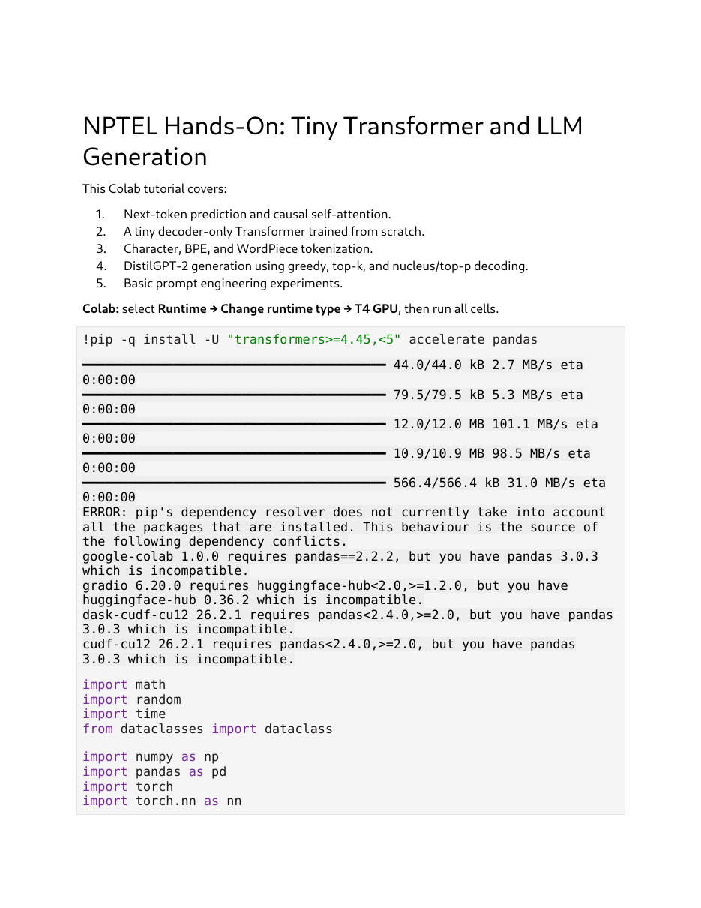
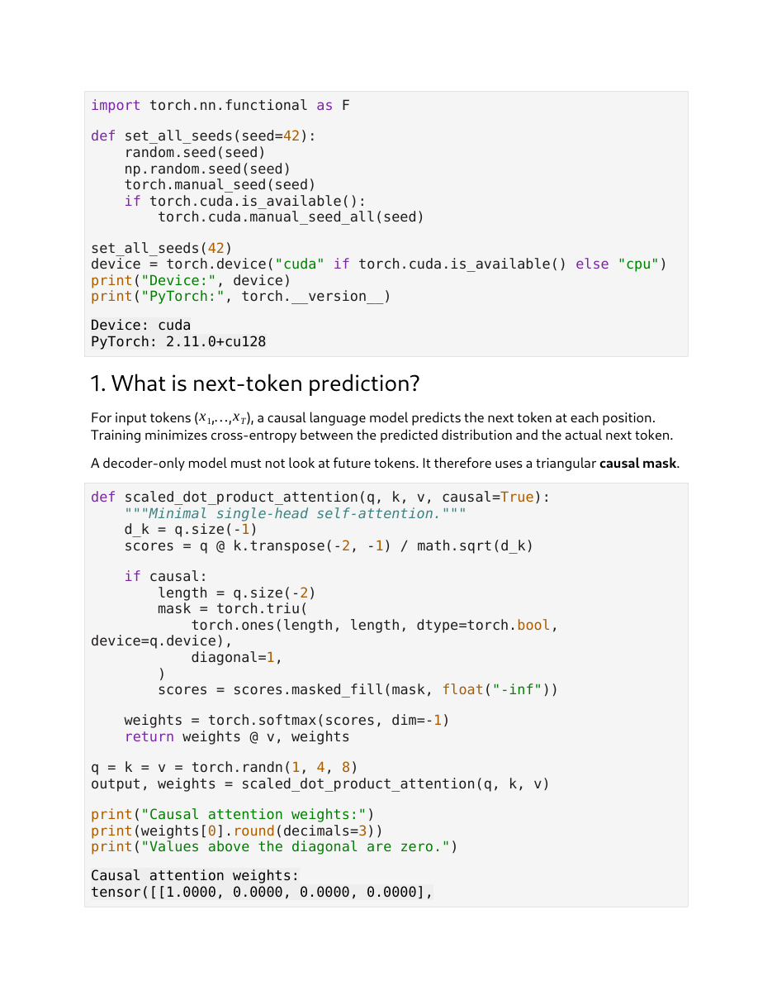
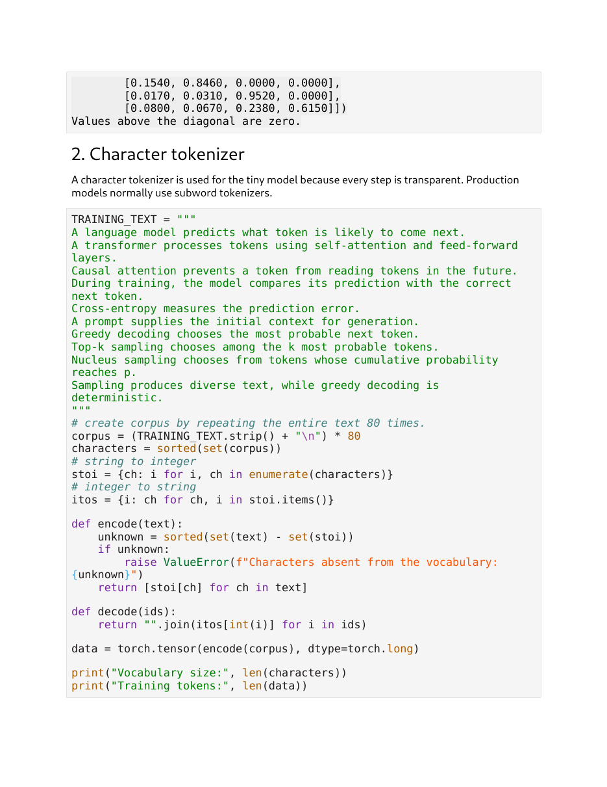
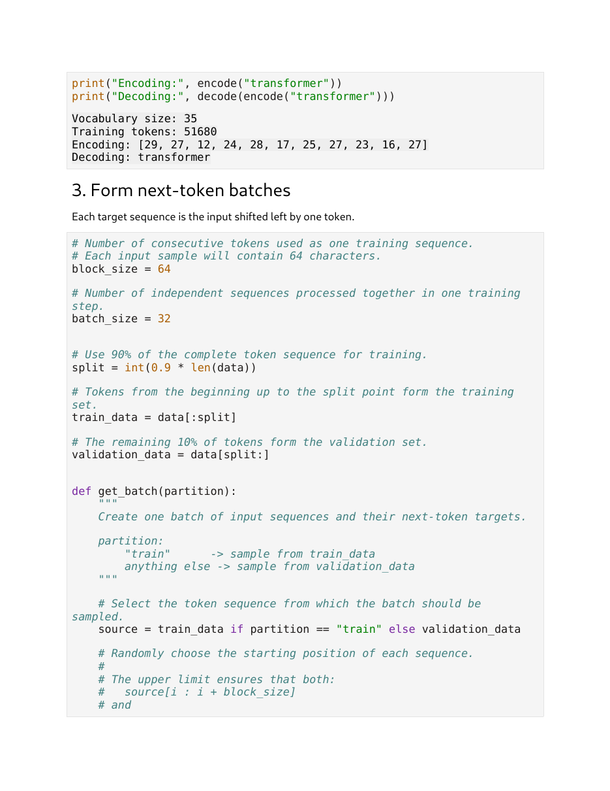
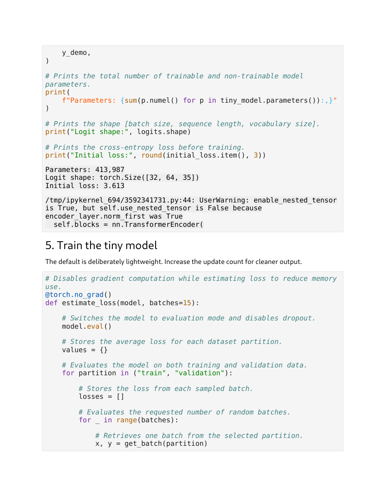
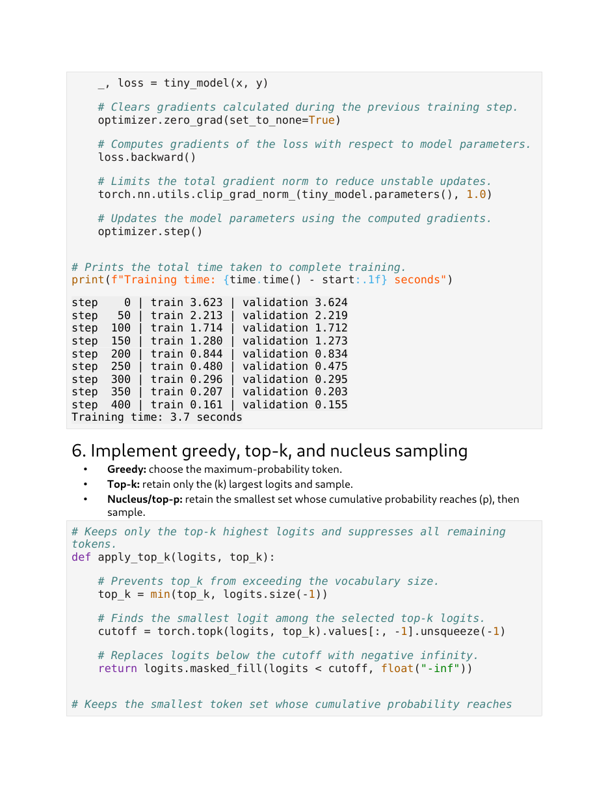
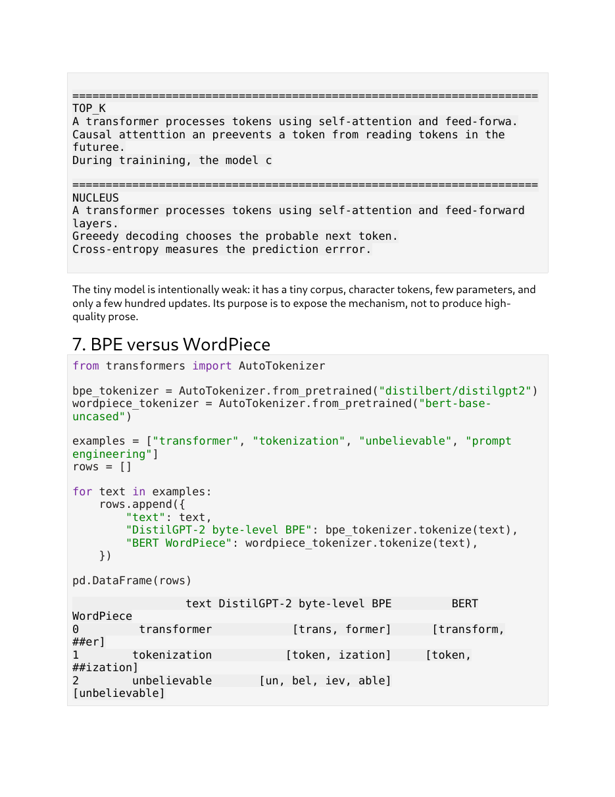
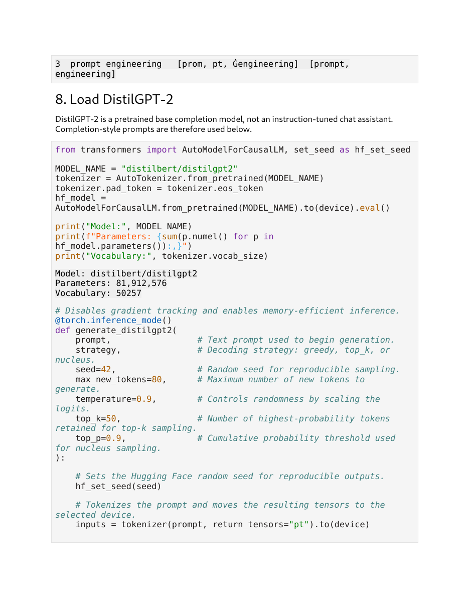
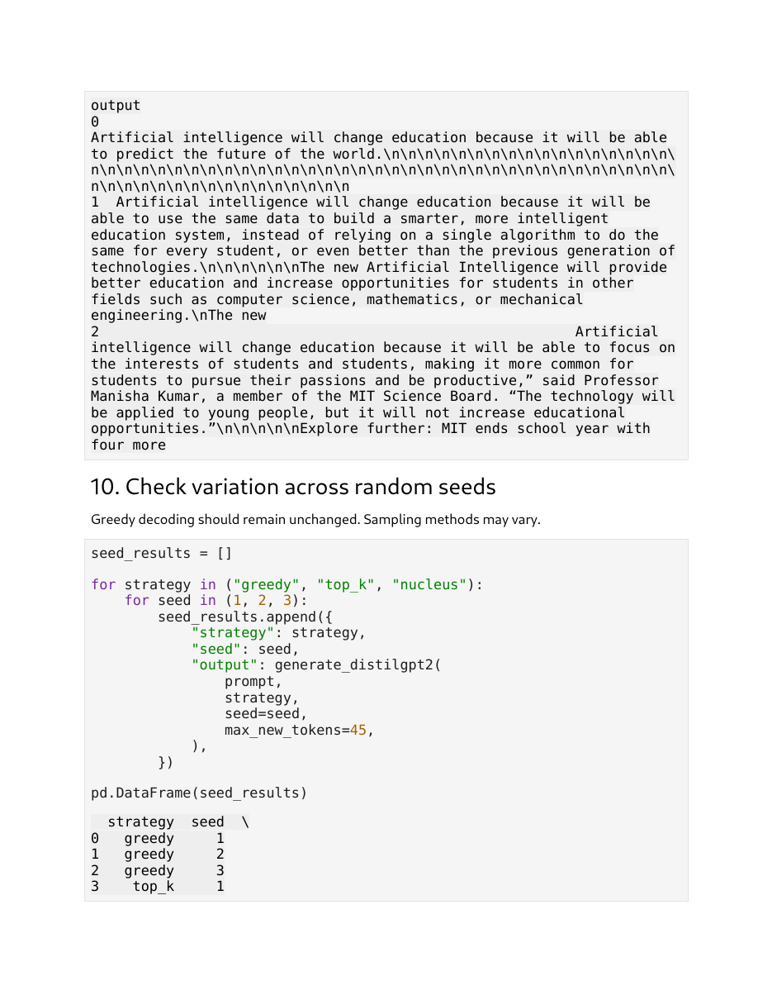
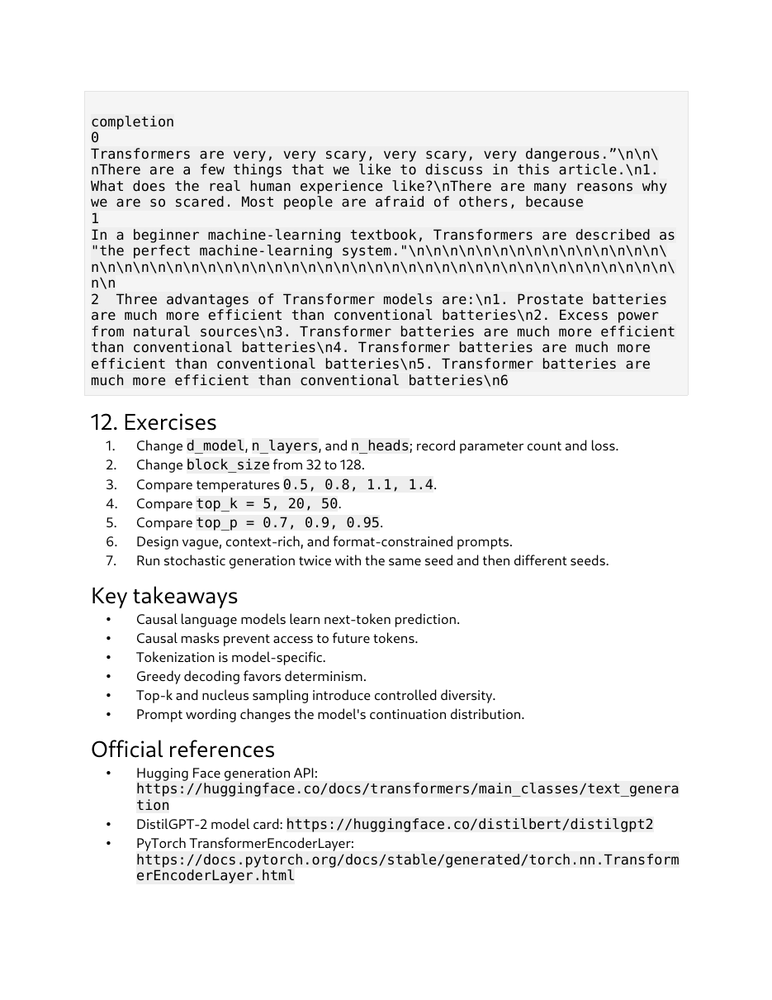

# Lec 63 — Hands-on on LLM

> **Source:** `Lec 63.pdf` (23 pages) · **Week 10** · **Playlist:** Lec 63
> **Prereqs:** [Lec 59 — Transformer Decoder](59-transformer-decoder.md), [Lec 61 — GPT](61-gpt.md), [Lec 62 — Prompt Engineering Basics](62-prompt-engineering.md)
> **Feeds into:** [Lec 64–67 — LLM Recap, In-Context Learning, LoRA, RAG](64-llm-icl-lora-rag.md), [Lec 70–71 — LLMs for Text Generation and Multimodal](70-llm-generation-multimodal.md)

## Why this lecture exists

Weeks 9 and 10 built a decoder-only transformer out of mathematics: masked self-attention, positional embeddings, a next-token objective, a prompt that conditions the continuation. Every one of those is a formula. None of them is a program, and several questions that the mathematics can ignore become unavoidable the moment you type code — what exactly is the training target, how long is the context, what does the model emit at the final position, and how do you turn one probability vector into one actual token.

This notebook answers them twice: once on a 414-thousand-parameter model you train from scratch in under four seconds, and once on an 82-million-parameter pretrained DistilGPT-2. The genuinely new content is the last part — **decoding**. Greedy, top-$k$ and nucleus sampling, with temperature on top, are the knobs that turn a probability distribution into text, and this is where the course teaches them with running code.

## The ideas

### What this deck actually is

It is not a slide deck. It is a printed Colab notebook, *NPTEL Hands-On: Tiny Transformer and LLM Generation*, twelve numbered sections plus exercises, key takeaways and references. It is the third hands-on of the course, after [Lec 48](48-forward-diffusion-handson.md) and [Lec 53](53-reverse-diffusion-handson.md), and it shares their export defects. Its own contents list:

1. Next-token prediction and causal self-attention
2. A tiny decoder-only Transformer trained from scratch
3. Character, BPE, and WordPiece tokenization
4. DistilGPT-2 generation using greedy, top-$k$, and nucleus/top-$p$ decoding
5. Basic prompt engineering experiments

Three things to know before reading the pages.

**The LaTeX did not render.** Section 6's bullets print *"retain only the (k) largest logits"* and *"whose cumulative probability reaches (p)"* — those parentheses are `\(k\)` and `\(p\)`, unrendered inline maths, the same export failure flagged on [Lec 48](48-forward-diffusion-handson.md) and [Lec 53](53-reverse-diffusion-handson.md). The symbols are $k$ and $p$. Nothing is missing; it just reads as nonsense on the page.

**Cell outputs are truncated mid-line.** Page 2 ends `tensor([[1.0000, 0.0000, 0.0000, 0.0000],` and page 3 resumes with the remaining rows; page 15's greedy sample stops at `During training, the model com`. The notebook printed complete outputs; the PDF page break cut them. This chapter stitches them back together.

**DataFrames print as wrapped text.** Sections 7, 9, 10 and 11 end in `pd.DataFrame(...)`, and the PDF prints the plain-text `repr` with columns wrapped across lines rather than the rendered table. Unlike [Lec 48](48-forward-diffusion-handson.md) p-13 — which exported raw metadata JSON and lost the data entirely — **here the values survive**, just badly laid out. Every table in this chapter is a re-laid-out version of what the notebook actually printed, with nothing invented.

**Environment:** Colab, Runtime → Change runtime type → **T4 GPU**. `PyTorch 2.11.0+cu128`, `Device: cuda`, `transformers>=4.45,<5`. Every seed is set through one helper, `set_all_seeds(42)`, covering `random`, `numpy` and `torch` (including CUDA).


*Fig. — The five-item contents list is the chapter plan. Notice the red `ERROR: pip's dependency resolver…` block underneath: four packages complain about pandas 3.0.3. The notebook runs anyway — these are warnings about *other* preinstalled Colab packages, not about anything this notebook imports. Page 1.*

### Section 1 — next-token prediction and the causal mask

The notebook's own framing: "For input tokens $(x_1,\ldots,x_T)$, a causal language model predicts the next token at each position. Training minimizes cross-entropy between the predicted distribution and the actual next token. A decoder-only model must not look at future tokens. It therefore uses a triangular **causal mask**."

Then it implements scaled dot-product attention in eleven lines — the formula [Lec 57](57-transformer-encoder.md) owns, as code:

```keras
def scaled_dot_product_attention(q, k, v, causal=True):
    """Minimal single-head self-attention."""
    d_k = q.size(-1)
    scores = q @ k.transpose(-2, -1) / math.sqrt(d_k)

    if causal:
        length = q.size(-2)
        mask = torch.triu(
            torch.ones(length, length, dtype=torch.bool, device=q.device),
            diagonal=1,
        )
        scores = scores.masked_fill(mask, float("-inf"))

    weights = torch.softmax(scores, dim=-1)
    return weights @ v, weights

q = k = v = torch.randn(1, 4, 8)
output, weights = scaled_dot_product_attention(q, k, v)
```

Three details worth pinning:

- `diagonal=1` in `torch.triu` keeps the diagonal *unmasked*. Position $t$ may attend to itself and everything before it — strictly future positions only are hidden. Using `diagonal=0` would mask the diagonal too and the first row would have no legal keys at all.
- The mask is applied **before** the softmax, as $-\infty$ on the scores, so $e^{-\infty} = 0$ and the masked entries contribute nothing to the normaliser. Masking *after* the softmax would leave rows that no longer sum to 1.
- $\sqrt{d_k}$ is the [Lec 57](57-transformer-encoder.md) scaling. Here $d_k = 8$, so the divisor is $2.8284$.


*Fig. — The whole of causal attention in eleven lines. The printed first row is 1.0000 followed by three zeros — position 1 has exactly one legal key, itself, so the softmax over a single finite score is forced to 1 no matter what the weights are. Page 2.*

The full printed matrix, stitched across the page break:

| query position | key 1 | key 2 | key 3 | key 4 |
|---|---|---|---|---|
| 1 | **1.0000** | 0.0000 | 0.0000 | 0.0000 |
| 2 | 0.1540 | **0.8460** | 0.0000 | 0.0000 |
| 3 | 0.0170 | 0.0310 | **0.9520** | 0.0000 |
| 4 | 0.0800 | 0.0670 | 0.2380 | **0.6150** |

Every row sums to exactly 1.000 and everything above the diagonal is zero, which is the notebook's printed verdict: *"Values above the diagonal are zero."* Row 1 is the structurally forced case. N1 checks the sums.

### Section 2 — a character tokenizer you can see through

"A character tokenizer is used for the tiny model because every step is transparent. Production models normally use subword tokenizers."

The training corpus is ten self-describing sentences about language models, repeated 80 times:

```keras
TRAINING_TEXT = """
A language model predicts what token is likely to come next.
A transformer processes tokens using self-attention and feed-forward layers.
Causal attention prevents a token from reading tokens in the future.
During training, the model compares its prediction with the correct next token.
Cross-entropy measures the prediction error.
A prompt supplies the initial context for generation.
Greedy decoding chooses the most probable next token.
Top-k sampling chooses among the k most probable tokens.
Nucleus sampling chooses from tokens whose cumulative probability reaches p.
Sampling produces diverse text, while greedy decoding is deterministic.
"""
corpus = (TRAINING_TEXT.strip() + "\n") * 80
characters = sorted(set(corpus))
stoi = {ch: i for i, ch in enumerate(characters)}     # string to integer
itos = {i: ch for ch, i in stoi.items()}              # integer to string

def encode(text):
    return [stoi[ch] for ch in text]

def decode(ids):
    return "".join(itos[int(i)] for i in ids)

data = torch.tensor(encode(corpus), dtype=torch.long)
```


*Fig. — The corpus is self-describing: every sentence in it is a true statement about the model being trained on it. Notice `encode` raises a `ValueError` for any character outside the vocabulary — a closed vocabulary has no fallback, which is precisely what subword tokenizers fix. Page 3.*

Printed output:

```
Vocabulary size: 35
Training tokens: 51680
Encoding: [29, 27, 12, 24, 28, 17, 25, 27, 23, 16, 27]
Decoding: transformer
```

The 35-symbol vocabulary, in `sorted` order (which is why the integer IDs are what they are): newline, space, comma, hyphen, period, then `A C D G N S T` and then `a b c d e f g h i k l m n o p r s t u v w x y`. **The alphabet is incomplete on purpose** — `j`, `q` and `z` never occur in the ten sentences, so they are not in the vocabulary, and `encode` raises `ValueError: Characters absent from the vocabulary` if you feed it one. That is the honest face of a closed vocabulary, and it is the entire motivation for subword tokenizers (section 7).

N2 reconstructs all three numbers from the text itself.


*Fig. — Encoding "transformer" gives 11 integers for 11 characters: a character tokenizer has a fixed one-to-one ratio, unlike the subword tokenizers of section 7. Note `t` appears three times and gets the same ID, 27, each time. Page 4.*

### Section 3 — next-token batches

"Each target sequence is the input shifted left by one token."

```keras
block_size = 64          # tokens per training sequence
batch_size = 32          # independent sequences per step
split = int(0.9 * len(data))
train_data = data[:split]
validation_data = data[split:]

def get_batch(partition):
    source = train_data if partition == "train" else validation_data
    starts = torch.randint(0, len(source) - block_size - 1, (batch_size,))
    x = torch.stack([source[i : i + block_size] for i in starts])
    y = torch.stack([source[i + 1 : i + block_size + 1] for i in starts])
    return x.to(device), y.to(device)
```

Printed output, with the page break closed:

```
Input shape:  torch.Size([32, 64])
Target shape: torch.Size([32, 64])

Input:
 model compares its prediction with the correct nex

Target:
odel compares its prediction with the correct next
```

Read the two strings against each other character by character. The target is the input slid one place left. That is the **entire supervision signal** of a causal language model: at every one of the $32\times64 = 2048$ positions in the batch, the label is the character that actually came next in the corpus. No human labelled anything.

The split: $\lfloor 0.9 \times 51680 \rfloor = 46{,}512$ training tokens and $5{,}168$ validation tokens. Note what this validation set *is* — the corpus is ten sentences repeated 80 times, so the validation tail is text the model has seen 72 times already in the training portion. The train and validation curves therefore track each other almost exactly (3.623/3.624 at step 0, 0.161/0.155 at step 400). **This notebook's validation loss does not measure generalisation.** It is a sanity check that the training loop works, and the notebook's own closing note says the model's "purpose is to expose the mechanism, not to produce high-quality prose".

### Section 4 — the tiny decoder-only Transformer

The configuration, with the notebook's own comments:

```keras
@dataclass
class TinyLMConfig:
    vocab_size: int                # number of unique tokens in the vocabulary
    block_size: int = 64           # maximum number of tokens processed at once
    d_model: int = 128             # size of each token and position embedding
    n_heads: int = 4               # number of self-attention heads
    n_layers: int = 2              # number of Transformer layers
    dropout: float = 0.1           # fraction of activations randomly dropped
```

and the model:

```keras
self.token_embedding    = nn.Embedding(config.vocab_size, config.d_model)
self.position_embedding = nn.Embedding(config.block_size, config.d_model)
layer = nn.TransformerEncoderLayer(
    d_model=config.d_model,
    nhead=config.n_heads,
    dim_feedforward=4 * config.d_model,     # 512
    dropout=config.dropout,
    activation="gelu",
    batch_first=True,
    norm_first=True,
)
self.blocks     = nn.TransformerEncoder(layer, num_layers=config.n_layers)
self.final_norm = nn.LayerNorm(config.d_model)
self.lm_head    = nn.Linear(config.d_model, config.vocab_size)
```

Five decisions here connect straight back to earlier lectures:

| Choice | Value | Where it comes from |
|---|---|---|
| Position embedding | **learned** `nn.Embedding(64, 128)` | *not* the sinusoidal formula [Lec 57](57-transformer-encoder.md) teaches — the same learned-vs-sinusoidal split flagged between [Lec 48](48-forward-diffusion-handson.md) and [Lec 49](49-unet.md) |
| FFN width | $4d_{\text{model}} = 512$ | the position-wise FFN of [Lec 57](57-transformer-encoder.md) |
| Activation | GELU | [Lec 02](02-activations-and-losses.md)'s table: GELU → Transformers and LLMs |
| $d_k$ | $d_{\text{model}}/h = 128/4 = \mathbf{32}$ | implied by `nhead=4`; no slide in this course states the formula |
| Norm placement | `norm_first=True` (pre-LN) | [Lec 57](57-transformer-encoder.md) draws post-LN; modern code uses pre-LN |

> **>>> The learned position table IS the context window. <<<** `nn.Embedding(block_size, d_model)` is a lookup table with exactly `block_size = 64` rows, indexed by position. The notebook's own `forward` makes the consequence explicit two lines later:
> ```keras
> if length > self.config.block_size:
>     raise ValueError("Sequence exceeds block size.")
> ```
> **Position 64 has no row to fetch, so the model raises rather than degrades.** That is the real mechanism behind every context-length limit you have heard of — GPT-1's 512, GPT-2's and DistilGPT-2's 1024 — and both [Lec 60](60-bert.md) and [Lec 61](61-gpt.md) confirm that BERT and GPT use learned tables too (their decks write "Position Embedding", never "positional encoding"). It directly contradicts [Lec 57](57-transformer-encoder.md)'s sinusoidal formula, which is defined for *every* integer position and would simply extrapolate past the training length. When asked why a prompt cannot exceed the context window, say **"the position-embedding table has no row for that index"**, not "memory" or "a design choice".

> **The deck is explicit about an apparent contradiction, and you should be able to repeat its answer.** The model is built from `nn.Transformer**Encoder**Layer`, yet the notebook calls it decoder-only. Its words: *"`TransformerEncoderLayer` is used only as a reusable self-attention block. Supplying a causal mask makes the complete network decoder-only; there is no encoder–decoder cross-attention."* **Encoder-vs-decoder is about the mask and the cross-attention, not about the class name.** A near-certain MCQ.
>
> The parameter arithmetic settles it. A self-attention sublayer costs $4d_{\text{model}}^2$ weights **for any number of heads**, and a decoder-only block that has dropped cross-attention is therefore **parameter-identical to an encoder block** — GPT-1 and BERT-base blocks are both exactly $7{,}084{,}800$ at $d_{\text{model}} = 768$ (see [Lec 60](60-bert.md), [Lec 61](61-gpt.md); that figure counts attention and FFN weights, and adding the block's two LayerNorms gives the $7{,}087{,}872$ of N7). **The entire architectural difference between an encoder and a decoder is a triangular matrix of $-\infty$, which costs nothing.**

The forward pass adds token and position embeddings, builds the causal mask, runs the blocks, normalises, projects to vocabulary logits, and — if targets are supplied — computes the loss:

```keras
hidden = self.token_embedding(token_ids) + self.position_embedding(positions)
causal_mask = torch.triu(torch.ones(length, length, dtype=torch.bool, device=...), diagonal=1)
hidden = self.blocks(hidden, mask=causal_mask)
logits = self.lm_head(self.final_norm(hidden))
loss = None
if targets is not None:
    loss = F.cross_entropy(logits.reshape(-1, logits.size(-1)), targets.reshape(-1))
```

Printed output:

```
Parameters: 413,987
Logit shape: torch.Size([32, 64, 35])
Initial loss: 3.613
```

`logits.reshape(-1, 35)` flattens $32\times64 = 2048$ positions into 2048 independent classification problems over 35 classes, and `F.cross_entropy` averages their negative log-likelihoods — **natural log**, which is PyTorch's convention everywhere. N3 derives the parameter count exactly and N4 explains why 3.613 is the number you should have expected.


*Fig. — Three numbers to memorise. The logit shape is batch × sequence × vocabulary — the model emits a full distribution at **every** position, not just the last one, which is exactly why one forward pass gives 2048 training signals. Page 10.*

### Section 5 — training

```keras
optimizer = torch.optim.AdamW(tiny_model.parameters(), lr=3e-4)
training_steps = 400 if device.type == "cuda" else 180
...
loss.backward()
torch.nn.utils.clip_grad_norm_(tiny_model.parameters(), 1.0)
optimizer.step()
```

Losses are estimated every 50 steps by averaging 15 random batches from each partition under `@torch.no_grad()` and `model.eval()` (which disables dropout), then `model.train()` restores training mode. The printed trace:

| step | train | validation |
|---|---|---|
| 0 | 3.623 | 3.624 |
| 50 | 2.213 | 2.219 |
| 100 | 1.714 | 1.712 |
| 150 | 1.280 | 1.273 |
| 200 | 0.844 | 0.834 |
| 250 | 0.480 | 0.475 |
| 300 | 0.296 | 0.295 |
| 350 | 0.207 | 0.203 |
| **400** | **0.161** | **0.155** |

**Training time: 3.7 seconds.**


*Fig. — Train and validation never diverge by more than 0.010 across the whole run, which is the signature of memorising a repeated corpus rather than learning language. Below the trace, note the three decoding bullets printing "(k)" and "(p)" — unrendered inline LaTeX. Page 12.*

Three readings. The trace is **monotone and gap-free** — train and validation never separate by more than 0.010 — which is what memorising a 646-character text repeated 80 times looks like, not what learning language looks like. $400$ steps $\times\,2048$ tokens $= 819{,}200$ tokens processed, or **17.6 passes over the 46,512-token training set** at 221,000 tokens per second. And `clip_grad_norm_(..., 1.0)` is the standard LLM-training safeguard: if the global gradient norm exceeds 1.0 it is rescaled down to exactly 1.0, which bounds the step size without touching $\eta$ (see [Lec 04](04-optimizers-b.md) for AdamW's update itself).

### Section 6 — greedy, top-$k$ and nucleus decoding

This is the part of the notebook you are here for. Everything up to now was a model that outputs a probability vector; this is how a vector becomes a token.

The notebook's three definitions, with the broken inline maths repaired:

- **Greedy:** choose the maximum-probability token.
- **Top-$k$:** retain only the $k$ largest logits and sample.
- **Nucleus / top-$p$:** retain the smallest set whose cumulative probability reaches $p$, then sample.

#### Temperature

Before any truncation, the logits are divided by a **temperature** $T$:

$$P_T(v) \;=\; \frac{\exp(z_v / T)}{\sum_{u \in \mathcal{V}} \exp(z_u / T)}$$

where $z_v$ is the raw logit for token $v$. **The exponential is natural (base $e$) and the resulting entropies below are in nats** — stated explicitly because this course mixes log bases freely (errata batch 4), and a temperature question answered in bits is wrong by a factor of $\ln 2 = 0.6931$.

Why dividing by $T$ does what it does: a softmax depends only on logit *differences*. Dividing every logit by $T$ scales every difference by $1/T$.

| $T$ | Effect on differences | Distribution | Limit |
|---|---|---|---|
| $T \to 0$ | magnified without bound | all mass on the argmax | **greedy decoding** |
| $T < 1$ | magnified | sharper, more confident | more repetitive |
| $T = 1$ | unchanged | the model's own distribution | — |
| $T > 1$ | shrunk | flatter, more uniform | more diverse, more errors |
| $T \to \infty$ | → 0 | uniform over $\mathcal{V}$ | pure noise |

N5 works all of this on concrete numbers, including the entropies.

> **A code detail that is a real exam discriminator.** In the notebook's `generate_tiny`, the temperature division sits **inside the `else:` branch** — the one reached only when the strategy is *not* greedy:
> ```keras
> if strategy == "greedy":
>     next_id = torch.argmax(next_logits, dim=-1, keepdim=True)
> else:
>     next_logits = next_logits / temperature
>     ...
> ```
> So `generate_tiny(model, prompt, strategy="greedy", temperature=0.9)` **ignores the temperature entirely**. That is correct behaviour, not a bug: dividing by any positive $T$ cannot change which logit is the largest, so temperature is a no-op under argmax. The same holds in the Hugging Face path, where `greedy` sets `do_sample=False` and never passes `temperature` at all.

#### Top-$k$

```keras
def apply_top_k(logits, top_k):
    top_k = min(top_k, logits.size(-1))
    cutoff = torch.topk(logits, top_k).values[:, -1].unsqueeze(-1)
    return logits.masked_fill(logits < cutoff, float("-inf"))
```

Take the $k$-th largest logit as a cutoff and send everything strictly below it to $-\infty$; softmax then renormalises over the survivors. Note `logits < cutoff` is a **strict** inequality, so if several tokens tie at exactly the cutoff value they all survive and more than $k$ tokens are kept. The notebook's defaults are `top_k=10` for the tiny model and `top_k=50` for DistilGPT-2.

**The weakness of top-$k$ is that $k$ is fixed while the distribution is not.** If the model is nearly certain, $k=50$ drags in 49 tokens it had almost ruled out. If the model is genuinely uncertain across 200 plausible tokens, $k=50$ throws away 150 of them. The fix is the next method.

#### Nucleus (top-$p$)

```keras
def apply_top_p(logits, top_p):
    sorted_logits, sorted_indices = torch.sort(logits, descending=True, dim=-1)
    cumulative = torch.cumsum(torch.softmax(sorted_logits, dim=-1), dim=-1)
    sorted_remove = cumulative > top_p
    sorted_remove[:, 1:] = sorted_remove[:, :-1].clone()   # keep the crossing token
    sorted_remove[:, 0] = False                            # always keep the top token
    remove = torch.zeros_like(sorted_remove).scatter(1, sorted_indices, sorted_remove)
    return logits.masked_fill(remove, float("-inf"))
```

Sort descending, accumulate probability, and cut once the running total passes $p$. Two guard lines carry all the subtlety:

- **The right-shift.** Without `sorted_remove[:, 1:] = sorted_remove[:, :-1]`, the first token whose cumulative total *exceeds* $p$ would itself be deleted, and the kept set would sum to *less* than $p$. The shift keeps that boundary token, so the nucleus is the **smallest set whose cumulative probability reaches at least $p$** — exactly the notebook's wording.
- **The forced keep.** `sorted_remove[:, 0] = False` protects the top token. Without it, a distribution whose single most likely token already exceeds $p$ (say $P = 0.95$ with $p = 0.9$) would have *everything* removed and sampling would fail.

The nucleus size **adapts**: when the model is confident the set shrinks to one or two tokens, and when it is unsure the set grows. That is the whole argument for top-$p$ over top-$k$. N6 computes the nucleus at three values of $p$ on one distribution and shows it changing size from 2 to 4.

#### The generation loop

```keras
ids = torch.tensor([encode(prompt)], dtype=torch.long, device=device)
for _ in range(max_new_tokens):
    context = ids[:, -model.config.block_size:]     # sliding window
    logits, _ = model(context)
    next_logits = logits[:, -1, :]                  # LAST position only
    ...
    probabilities = torch.softmax(next_logits, dim=-1)
    next_id = torch.multinomial(probabilities, 1)
    ids = torch.cat([ids, next_id], dim=1)
return decode(ids[0].cpu())
```

Four things to extract:

1. **`logits[:, -1, :]`** — the model produced a distribution at *every* position, but generation uses only the last. The other 63 were useful during training and are discarded here.
2. **`ids[:, -block_size:]`** is the sliding context window, and it exists *because* the position table has only `block_size` rows. Once generation passes 64 tokens, the earliest tokens *fall out of the prompt entirely* — the loop truncates rather than letting `forward` raise. A character model with `block_size=64` cannot remember anything from 65 characters ago. This is the hands-on face of the context-length limit, and the limit itself is a lookup-table row count.
3. **The prompt is prepended and never removed** — `ids` starts as the encoded prompt and the function returns the decode of the *whole* sequence, prompt included. That is why every printed output below begins with the prompt text.
4. Generation is **autoregressive and serial**: $m$ new tokens cost $m$ forward passes. Training was one pass for 2048 supervised positions; generation is 2048 passes for 2048 tokens. Decoding, not training, is what makes LLM inference expensive.

The tiny model's outputs with `prompt="A transformer"`, each strategy reseeded to 7:

```
GREEDY
A transformer processes tokens using self-attention and feed-forward layers.
Causal attten prevents a token from reading tokens in the future.
During training, the model com

TOP_K
A transformer processes tokens using self-attention and feed-forwa.
Causal attenttion an preevents a token from reading tokens in the futuree.
During traininng, the model c

NUCLEUS
A transformer processes tokens using self-attention and feed-forward layers.
Greeedy decoding chooses the probable next token.
Cross-entropy measures the prediction errror.
```

All three reproduce the training corpus almost verbatim — the model memorised it. The informative difference is the **spelling**: greedy makes one slip (`attten`), top-$k$ at $T=0.9$ makes five (`attenttion an preevents`, `futuree`, `traininng`), nucleus three (`Greeedy`, `errror`). Because the vocabulary is characters, sampling noise shows up as doubled letters. **Sampling buys diversity and pays in errors, and here you can count both.** Note also that nucleus jumped from the "feed-forward layers" sentence to the "Greedy decoding" sentence — a recombination greedy could never produce, which is the diversity the errors bought.


*Fig. — Count the doubled letters: `attenttion`, `futuree`, `traininng`, `Greeedy`, `errror`. Each one is a sampling step that drew a non-argmax character. The notebook's own caveat sits between the two blocks: the model "is intentionally weak… its purpose is to expose the mechanism". Page 16.*

### Section 7 — BPE versus WordPiece, on real strings

[Lec 59](59-transformer-decoder.md) owns the algorithms (BPE merges by **frequency**, WordPiece by **likelihood**). This notebook just runs them, which is worth seeing because the outputs are concrete:

```keras
bpe_tokenizer       = AutoTokenizer.from_pretrained("distilbert/distilgpt2")
wordpiece_tokenizer = AutoTokenizer.from_pretrained("bert-base-uncased")
```

| text | DistilGPT-2 byte-level BPE | BERT WordPiece |
|---|---|---|
| `transformer` | `trans`, `former` | `transform`, `##er` |
| `tokenization` | `token`, `ization` | `token`, `##ization` |
| `unbelievable` | `un`, `bel`, `iev`, `able` | `unbelievable` |
| `prompt engineering` | `prom`, `pt`, `Ġengineering` | `prompt`, `engineering` |

Four things this table teaches that no diagram can:

- **Tokenization is model-specific.** The same string splits differently in two tokenizers, so a token count is meaningless without naming the model.
- **The `##` prefix** marks a WordPiece continuation; `Ġ` marks a *leading space* in GPT-2's byte-level BPE. Both encode "this piece is not word-initial", by opposite conventions.
- **Neither is more "correct".** `unbelievable` is one WordPiece token and four BPE tokens; `transformer` is two of each but split in different places. Frequency in the training corpus decides, not morphology.
- **`prompt` is not a GPT-2 token** — it becomes `prom` + `pt`. A word you consider basic may not be in the vocabulary at all.

### Section 8 — loading a real pretrained LLM

```keras
MODEL_NAME = "distilbert/distilgpt2"
tokenizer = AutoTokenizer.from_pretrained(MODEL_NAME)
tokenizer.pad_token = tokenizer.eos_token
hf_model = AutoModelForCausalLM.from_pretrained(MODEL_NAME).to(device).eval()
```

```
Model: distilbert/distilgpt2
Parameters: 81,912,576
Vocabulary: 50257
```

Three loading details that matter in practice. `AutoModelForCausalLM` picks the *causal LM* head — the next-token projection of [Lec 61](61-gpt.md) — rather than a classification head; `.eval()` disables dropout, which must be off for deterministic greedy decoding; and `tokenizer.pad_token = tokenizer.eos_token` exists because GPT-2 was trained with no padding token at all, so one has to be borrowed before `generate` will batch.

The notebook also states something that governs every prompt in sections 9–11: **"DistilGPT-2 is a pretrained base completion model, not an instruction-tuned chat assistant. Completion-style prompts are therefore used below."** N7 derives the 81,912,576.

| | tiny model | DistilGPT-2 |
|---|---|---|
| Parameters | 413,987 | 81,912,576 (**198×**) |
| Vocabulary | 35 characters | 50,257 byte-level BPE |
| Context | 64 | 1024 |
| $d_{\text{model}}$ / layers / heads | 128 / 2 / 4 | 768 / 6 / 12 |
| Trained on | 646 characters × 80 | OpenWebText (distilled from GPT-2) |
| Training time here | 3.7 s | not trained here |


*Fig. — Two numbers to carry: 81,912,576 parameters and a 50,257-token vocabulary. The note above them is the one that governs sections 9 to 11 — DistilGPT-2 is a **base completion model**, not an instruction-tuned assistant, so prompts must be written as the start of a document rather than as a request. Page 17.*

### Sections 9 and 10 — the three strategies, and determinism

Same prompt, same seed 42, 80 new tokens, `temperature=0.9`, `top_k=50`, `top_p=0.9`:

```keras
prompt = "Artificial intelligence will change education because"
```

| strategy | continuation (abridged; `\n` shown as printed) |
|---|---|
| **greedy** | *"…it will be able to predict the future of the world."* then `\n` repeated ~45 times to the token limit |
| **top_k** | *"…it will be able to use the same data to build a smarter, more intelligent education system, instead of relying on a single algorithm to do the same for every student, or even better than the previous generation of technologies."* |
| **nucleus** | *"…it will be able to focus on the interests of students and students, making it more common for students to pursue their passions and be productive," said Professor Manisha Kumar, a member of the MIT Science Board…* |


*Fig. — Row 0 is greedy. Read along it: one complete sentence, then `\n` repeated until the 80-token budget runs out. Rows 1 and 2, sampled, keep producing content. This single page is the strongest argument in the notebook against greedy decoding. Page 20.*

**The greedy row is the lesson.** It produces one short sentence and then collapses into an unbroken run of newline characters for the remaining ~45 tokens. This is **degenerate repetition**, and it is the standard failure of greedy decoding: once `\n` becomes the single most probable token, it is deterministically chosen, which makes `\n` even more probable at the next step, and the loop is closed. Greedy has no mechanism to escape. Sampling does — any token with non-zero probability can break the cycle. **"Greedy decoding is deterministic and therefore safe" is exactly backwards for long generations.**

Section 10 then proves the determinism claim properly, running each strategy at seeds 1, 2 and 3:

| strategy | seed 1 | seed 2 | seed 3 |
|---|---|---|---|
| **greedy** | *"…predict the future of the world."* + newline run | **identical** | **identical** |
| **top_k** | *"…because of the potential, as shown in the experiment."* | *"…because the internet speeds of computers are being slowed…"* | *"…it will solve more problems across the world."* |
| **nucleus** | *"…because of the potential benefits."* + a paragraph about Princeton | *"…because the internet is dominated by white people and black people."* + newline run | *"…it will solve more problems, it will make the teacher more trustworthy and more accountable," he said.* |

Greedy's three rows are character-for-character identical; the six sampled rows are all different. The notebook's framing is exactly right: *"Greedy decoding should remain unchanged. Sampling methods may vary."*

> Two things worth flagging from this table. The nucleus seed-2 output (*"the internet is dominated by white people and black people"*) is a bias artefact of the pretraining corpus surfacing in a teaching notebook — Week 12 takes up bias and safety directly. And nucleus seed 1 *also* ends in a newline run, so degeneration is not unique to greedy; it is just guaranteed there.

### Section 11 — the prompt-engineering experiment

Three prompts of increasing structure, all run with `strategy="nucleus"`, `seed=10`, `max_new_tokens=60`, `temperature=0.8`, `top_p=0.9`. The notebook's instruction for a base model: **"write the prompt as the beginning of the desired document."**

| prompt | what it adds | completion (abridged) |
|---|---|---|
| `"Transformers are"` | nothing — vague | *"very, very scary, very scary, very dangerous." … "There are a few things that we like to discuss in this article."* |
| `"In a beginner machine-learning textbook, Transformers are described as"` | audience + context | *"the perfect machine-learning system."* then a long newline run |
| `"Three advantages of Transformer models are:\n1."` | an **output indicator** | *"Prostate batteries are much more efficient than conventional batteries\n2. Excess power from natural sources\n3. Transformer batteries are much more efficient…\n4. …\n5. …\n6"* |

This is [Lec 62](62-prompt-engineering.md)'s theory with the receipts attached, and it cuts both ways.

**Format control works, exactly as predicted.** Prompt 3 ends in `\n1.` — an output indicator — and the model produced a numbered list running to item 6 without being told to. Nothing in the prompt said "produce a list"; the prefix simply made list-shaped continuations overwhelmingly probable. That is prefix conditioning doing precisely what [Lec 62](62-prompt-engineering.md) says it does.

**Content control does not.** The list is about *batteries*, item 1 is "Prostate batteries", and items 3, 4 and 5 are near-verbatim repeats of each other. An 82-million-parameter base model has no knowledge of Transformer architectures to retrieve, so the prompt steered a distribution that had nothing good in it. **Prompt engineering changes which part of the model's distribution you sample from; it cannot add mass that was never there.** This is the same lesson as [Lec 62](62-prompt-engineering.md)'s page-15 JSON defect — shape yes, truth no — and here it is demonstrated rather than asserted.

Prompt 2 is worth one more look: adding audience and context made the completion *shorter and then degenerate*, not better. The lecture-slide claim "better prompts lead to better responses" is a tendency over a distribution, not a guarantee on any single draw.

### The notebook's own exercises and takeaways


*Fig. — Exercises 3, 4 and 5 are the sweeps worth actually running: temperature 0.5/0.8/1.1/1.4, top-k 5/20/50, top-p 0.7/0.9/0.95. N5 and N6 work exactly those values by hand so you can predict the answers before you run them. Page 23.*

**Exercises:** (1) change `d_model`, `n_layers`, `n_heads` and record parameter count and loss · (2) change `block_size` *"from 32 to 128"* · (3) compare temperatures `0.5, 0.8, 1.1, 1.4` · (4) compare `top_k = 5, 20, 50` · (5) compare `top_p = 0.7, 0.9, 0.95` · (6) design vague, context-rich and format-constrained prompts · (7) run stochastic generation twice with the same seed, then with different seeds.

> **Deck defect.** Exercise 2 says "change `block_size` from 32 to 128", but `block_size` is **64** in the notebook. 32 is the `batch_size`. The two were swapped when the exercise was written.

**Key takeaways, verbatim:** causal language models learn next-token prediction · causal masks prevent access to future tokens · tokenization is model-specific · greedy decoding favors determinism · top-$k$ and nucleus sampling introduce controlled diversity · prompt wording changes the model's continuation distribution.

### Where Week 12 takes over

Sampling is taught twice in this course, deliberately. **This chapter owns the hands-on treatment** — the code, the defaults, the arithmetic above. Week 12's §2.1 ("tokenizers and sampling") owns the conceptual treatment and is a different lecturer with different notation ([Lec 70–71](70-llm-generation-multimodal.md)). Expect symbol drift: $k$ and $p$ are stable, but temperature appears as $T$ here and as $\tau$ in much of the literature, and some treatments apply temperature to the *probabilities* ($p_v^{1/T}$ renormalised) rather than the logits. Those two are algebraically identical for a softmax; the difference is only where in the pipeline you put the division. **Answer with this notebook's version — divide the logits, before truncation.**

## Worked numericals

The notebook prints no hand-worked arithmetic, but it prints **eleven concrete quantities**, every one of which is reproducible from first principles. These six numericals reproduce all eleven.

### N1. The causal attention matrix is a valid probability table

**Given:** the printed attention weights from section 1.
**Find:** confirm each row is a probability distribution and explain row 1.

1. Row 1: $1.0000 + 0 + 0 + 0 = 1.0000$. ✓
2. Row 2: $0.1540 + 0.8460 = 1.0000$. ✓
3. Row 3: $0.0170 + 0.0310 + 0.9520 = 1.0000$. ✓
4. Row 4: $0.0800 + 0.0670 + 0.2380 + 0.6150 = 1.0000$. ✓
5. Row 1 is not a coincidence. After masking, position 1 has one finite score $s_{11}$ and three $-\infty$. The softmax gives $e^{s_{11}}/(e^{s_{11}} + 0 + 0 + 0) = 1$ for any value of $s_{11}$.

**Answer:** all four rows sum to exactly 1.0000, and **row 1 is forced to $(1,0,0,0)$ regardless of the weights or the input.** Corollary worth carrying: the first token's output in a causal model is a function of that token alone — no amount of training changes it. (The matrix is $4\times4$ because the demo input was `torch.randn(1, 4, 8)`: one sequence, 4 positions, $d_k = 8$, so the scaling divisor is $\sqrt{8} = 2.8284$.)

### N2. Rebuilding the character vocabulary and corpus size

**Given:** the ten-line `TRAINING_TEXT`, `corpus = (TRAINING_TEXT.strip() + "\n") * 80`.
**Find:** vocabulary size, token count, and `encode("transformer")`.

1. After `.strip()` the text is 645 characters; `+ "\n"` makes **646 per repeat**.
2. Token count: $646 \times 80 = \mathbf{51{,}680}$. Matches the printed `Training tokens: 51680`. ✓
3. `sorted(set(corpus))` gives 35 distinct characters: 5 punctuation/whitespace (`\n`, space, `,`, `-`, `.`), 7 capitals (`A C D G N S T`), 23 lowercase (`a b c d e f g h i k l m n o p r s t u v w x y`). $5+7+23 = \mathbf{35}$. Matches `Vocabulary size: 35`. ✓
4. The IDs are the positions in that sorted list, so `t` → 29, `r` → 27, `a` → 12, `n` → 24, `s` → 28, `f` → 17, `o` → 25, `m` → 23, `e` → 16.
5. `encode("transformer")` = `t r a n s f o r m e r` = $29, 27, 12, 24, 28, 17, 25, 27, 23, 16, 27$.

**Answer:** 35, 51,680, and $(29, 27, 12, 24, 28, 17, 25, 27, 23, 16, 27)$ — **all three match the notebook exactly.** Note $23 < 24$ confirms `j` is absent (`m`=23 is immediately followed by `n`=24), and the gap between `o`=25 and `r`=27 is `p`=26, with `q` missing. Three ASCII letters — `j`, `q`, `z` — are not in the vocabulary at all.

Downstream: $\lfloor 0.9 \times 51680\rfloor = 46{,}512$ training tokens, $5{,}168$ validation tokens, and $46512 - 64 - 1 = 46{,}447$ legal starting positions for a batch.

### N3. The tiny model's 413,987 parameters, derived

**Given:** $V = 35$, block $= 64$, $d_{\text{model}} = 128$, $h = 4$, $L = 2$, $d_{\text{ff}} = 4 \times 128 = 512$.
**Find:** the total parameter count.

1. Token embedding: $V \times d = 35 \times 128 = 4{,}480$.
2. Position embedding: $64 \times 128 = 8{,}192$.
3. Self-attention, per layer. PyTorch packs $\mathbf{Q},\mathbf{K},\mathbf{V}$ into one matrix: $3d^2 + 3d = 3(16384) + 384 = 49{,}536$. Output projection: $d^2 + d = 16384 + 128 = 16{,}512$. Subtotal $66{,}048$.
   *(Note this is independent of $h$ — splitting 128 channels into 4 heads of $d_k = 32$ re-shapes the same weights. The weight total is exactly $4d_{\text{model}}^2 = 4\times16384 = 65{,}536$ plus $4d_{\text{model}} = 512$ biases, **for any $h$**. Multi-head is free, as [Lec 57](57-transformer-encoder.md) says.)*
4. FFN, per layer: $d \times d_{\text{ff}} + d_{\text{ff}} = 65536 + 512 = 66{,}048$, then $d_{\text{ff}} \times d + d = 65536 + 128 = 65{,}664$. Subtotal $131{,}712$.
5. Two LayerNorms per layer, each $2d$: $4 \times 128 = 512$.
6. Per layer: $66048 + 131712 + 512 = 198{,}272$. Two layers: $396{,}544$.
7. Final LayerNorm: $2 \times 128 = 256$.
8. LM head: $d \times V + V = 128 \times 35 + 35 = 4{,}515$.
9. Total: $4480 + 8192 + 396544 + 256 + 4515$.

**Answer:** $\mathbf{413{,}987}$ — **exactly the notebook's printed figure.** The split is instructive: $95.8\%$ of the parameters are in the two transformer blocks, while the **token embedding table is only $4{,}480$ — $1.1\%$ of the model**. For DistilGPT-2 (N7) that ratio inverts completely.

### N4. Why the initial loss had to be about 3.56

**Given:** `Initial loss: 3.613` at step 0 with an untrained model over $V = 35$ classes; the training trace prints 3.623 at step 0.
**Find:** the expected initial loss and the implied perplexity.

1. An untrained network's logits are near-identical across classes (weights drawn from $\mathcal{N}(0, 0.02^2)$), so the softmax is near-uniform: $\hat p_v \approx 1/V$ for all $v$.
2. Cross-entropy of a uniform prediction, in **nats** (PyTorch's `F.cross_entropy` uses natural log): $\mathcal{L} = -\log(1/V) = \log V = \log 35 = 3.5553$.
3. The printed 3.613 exceeds this by $3.613 - 3.5553 = 0.0577$, i.e. $1.6\%$ — the $\sigma = 0.02$ initialisation is not *exactly* uniform, and any departure from uniform costs you, because uniform is the minimum-loss guess when you know nothing.
4. Perplexity $= e^{\mathcal{L}}$: initial $e^{3.623} = 37.45$ — slightly **worse than guessing uniformly among 35 characters**. Final $e^{0.161} = 1.175$ on train, $e^{0.155} = 1.168$ on validation.

**Answer:** expected $\log 35 = \mathbf{3.5553}$ nats, observed $3.613$; perplexity falls from $\mathbf{37.45}$ to $\mathbf{1.175}$ over 400 steps. In base 2 those losses would be $3.5553/\ln 2 = 5.129$ bits and $0.161/\ln 2 = 0.232$ bits — **state the base or the mark is lost.** A final perplexity of 1.175 means the model is, on average, choosing between barely more than one character: it has memorised the corpus, which is exactly what ten sentences repeated 80 times invites.

### N5. Temperature on a concrete distribution

**Given:** logits $\mathbf{z} = (3.0,\ 2.0,\ 1.0,\ 0.5,\ 0.0,\ -1.0)$ over a 6-token vocabulary. **Natural exponentials; entropies in nats.**
**Find:** the distribution at $T = 0.5,\ 1.0,\ 1.4$ — three of the notebook's exercise-3 values.

1. **$T = 1.0$.** $e^{3} = 20.0855$, $e^{2} = 7.3891$, $e^{1} = 2.7183$, $e^{0.5} = 1.6487$, $e^{0} = 1.0000$, $e^{-1} = 0.3679$. Sum $= 33.2095$.
   $P = (0.60481,\ 0.22250,\ 0.08185,\ 0.04965,\ 0.03011,\ 0.01108)$.
2. **$T = 0.5$.** Divide the logits by 0.5, i.e. double them: $(6, 4, 2, 1, 0, -2)$. Exponentials $403.4288,\ 54.5982,\ 7.3891,\ 2.7183,\ 1.0000,\ 0.1353$; sum $469.2696$.
   $P = (0.85970,\ 0.11635,\ 0.01575,\ 0.00579,\ 0.00213,\ 0.00029)$.
3. **$T = 1.4$.** Logits become $(2.14286, 1.42857, 0.71429, 0.35714, 0, -0.71429)$; exponentials $8.5238,\ 4.1727,\ 2.0427,\ 1.4292,\ 1.0000,\ 0.4895$; sum $17.6580$.
   $P = (0.48271,\ 0.23631,\ 0.11568,\ 0.08094,\ 0.05663,\ 0.02772)$.
4. Entropies $-\sum_v P_v \log P_v$: $0.4909$, $1.1478$, $1.4075$ nats respectively (equivalently $0.7082$, $1.6559$, $2.0306$ bits).

**Answer:** $P(\text{top token})$ moves $0.85970 \to 0.60481 \to 0.48271$ as $T$ goes $0.5 \to 1.0 \to 1.4$, and the entropy rises monotonically $0.4909 \to 1.1478 \to 1.4075$ **nats**. Note the *least* likely token's probability rises by a factor of $0.02772/0.00029 = 95.6$ between $T=0.5$ and $T=1.4$ — low temperature's main effect is not on the winner but on crushing the tail, which is why low $T$ produces repetitive but clean text and high $T$ produces creative but error-prone text (and the tiny model's doubled letters in section 6).

### N6. Top-$k$ and the nucleus on the same distribution

**Given:** the $T = 1.0$ distribution from N5, cumulative from the top: $0.60481,\ 0.82731,\ 0.90916,\ 0.95881,\ 0.98892,\ 1.00000$.
**Find:** the kept set and renormalised probabilities for $k = 3$ and for $p = 0.7,\ 0.9,\ 0.95$ — the notebook's exercise-5 values.

1. **$k = 3$:** keep the three largest logits. Surviving exponentials sum to $20.0855 + 7.3891 + 2.7183 = 30.1929$.
   $P' = (20.0855/30.1929,\ 7.3891/30.1929,\ 2.7183/30.1929) = (0.66524,\ 0.24473,\ 0.09003)$.
2. **$p = 0.9$:** the first cumulative value exceeding 0.9 is $0.90916$ at rank 3. The right-shift keeps that token, so the nucleus is ranks 1–3 — **the same three tokens as $k=3$**, same renormalised values.
3. **$p = 0.7$:** $0.60481 < 0.7 \le 0.82731$, so the nucleus is ranks 1–2. Sum $= 27.4746$; $P' = (0.73106,\ 0.26894)$.
4. **$p = 0.95$:** $0.90916 < 0.95 \le 0.95881$, so ranks 1–4. Sum $= 31.8416$; $P' = (0.63080,\ 0.23206,\ 0.08537,\ 0.05178)$.

**Answer:** nucleus size $= \mathbf{2,\ 3,\ 4}$ tokens at $p = 0.7,\ 0.9,\ 0.95$; $k=3$ coincides exactly with $p = 0.9$ **on this distribution only**. That coincidence is the point of the comparison: top-$k$ fixes the *count* and lets the covered probability float; top-$p$ fixes the *coverage* and lets the count float. Sharpen the distribution (take $T=0.5$, where the top token alone has $0.85970$) and $p=0.9$ keeps **2** tokens while $k=3$ still keeps 3. The notebook's defaults combine them: `top_k=50, top_p=0.9` means *at most 50 tokens, and only as many of those as are needed to cover 90%* — whichever bites first.

### N7. DistilGPT-2's 81,912,576 parameters, derived

**Given:** DistilGPT-2 — $V = 50{,}257$, $n_{\text{pos}} = 1024$, $d = 768$, $L = 6$, $d_{\text{ff}} = 3072$, 12 heads.
**Find:** the total parameter count, and the comparison with the tiny model.

1. Token embedding `wte`: $50257 \times 768 = 38{,}597{,}376$.
2. Position embedding `wpe`: $1024 \times 768 = 786{,}432$.
3. Per block: two LayerNorms $2 \times 2 \times 768 = 3{,}072$; packed QKV $768 \times 2304 + 2304 = 1{,}771{,}776$; attention output $768^2 + 768 = 590{,}592$; FFN up $768 \times 3072 + 3072 = 2{,}362{,}368$; FFN down $3072 \times 768 + 768 = 2{,}360{,}064$. Subtotal $7{,}087{,}872$.
4. Six blocks: $6 \times 7{,}087{,}872 = 42{,}527{,}232$.
5. Final LayerNorm: $1{,}536$.
6. Total: $38597376 + 786432 + 42527232 + 1536$.

**Answer:** $\mathbf{81{,}912{,}576}$ — **exactly the notebook's printed figure.** Now compare the structure: in DistilGPT-2 the token embedding alone is $38.6$M of $81.9$M, i.e. **47.1%** of the whole model, where the tiny model's token embedding was **1.1%**. That inversion is entirely the vocabulary: 50,257 rows versus 35. It is also why the output head is *tied* to the input embedding in GPT-2 — untying it would add another 38.6M parameters for no measured gain. (DistilGPT-2 is $198\times$ the tiny model's parameter count on a $1436\times$ larger vocabulary.)

## Code

The notebook's three decoding functions are PyTorch and need a GPU session to be interesting. Here they are in pure NumPy, implementing **exactly** the notebook's semantics — including the strict `<` in top-$k$ and both guard lines in top-$p$ — reproducing N5 and N6 so you can check every number above.

```python
import numpy as np

LOGITS = np.array([3.0, 2.0, 1.0, 0.5, 0.0, -1.0])   # 6-token toy vocabulary
NAMES  = ["cat", "dog", "fish", "bird", "ant", "eel"]

def softmax(z):
    z = z - np.max(z)                 # stabilise; probabilities unchanged
    e = np.exp(z)                     # natural exponential throughout
    return e / e.sum()

def apply_temperature(logits, T):
    return logits / T                 # the notebook divides the LOGITS, not the probs

def apply_top_k(logits, k):
    k = min(k, logits.size)
    cutoff = np.sort(logits)[-k]      # k-th largest logit
    out = logits.copy()
    out[out < cutoff] = -np.inf       # strict '<', so ties at the cutoff survive
    return out

def apply_top_p(logits, p):
    order = np.argsort(-logits)                  # descending
    cum = np.cumsum(softmax(logits[order]))
    remove = cum > p                             # mark everything past the threshold
    remove[1:] = remove[:-1].copy()              # shift right: keep the crossing token
    remove[0] = False                            # always keep the top token
    out = logits.copy()
    out[order[remove]] = -np.inf
    return out

def show(tag, logits):
    p = softmax(logits)
    kept = int(np.sum(np.isfinite(logits)))
    H = -np.sum(p[p > 0] * np.log(p[p > 0]))     # NATS: np.log is the natural log
    print(f"{tag:<16} kept={kept}  " + " ".join(f"{n}={q:.5f}" for n, q in zip(NAMES, p))
          + f"  H={H:.4f} nats")

print("probabilities at four temperatures")
for T in (0.5, 0.8, 1.0, 1.4):
    show(f"T={T}", apply_temperature(LOGITS, T))

print("\ncumulative probability at T=1.0 (sorted descending)")
print("  ", np.round(np.cumsum(softmax(LOGITS)), 5))

print("\ntruncation at T=1.0")
show("top-k k=3", apply_top_k(LOGITS, 3))
show("top-p p=0.9", apply_top_p(LOGITS, 0.9))
show("top-p p=0.7", apply_top_p(LOGITS, 0.7))
show("top-p p=0.95", apply_top_p(LOGITS, 0.95))

print("\ngreedy is the T -> 0 limit of sampling")
for T in (1.0, 0.1, 0.01):
    print(f"  T={T:<5} argmax={NAMES[int(np.argmax(softmax(apply_temperature(LOGITS, T))))]}"
          f"  P(top)={softmax(apply_temperature(LOGITS, T)).max():.6f}")
```

```
probabilities at four temperatures
T=0.5            kept=6  cat=0.85970 dog=0.11635 fish=0.01575 bird=0.00579 ant=0.00213 eel=0.00029  H=0.4909 nats
T=0.8            kept=6  cat=0.69311 dog=0.19858 fish=0.05689 bird=0.03045 ant=0.01630 eel=0.00467  H=0.9367 nats
T=1.0            kept=6  cat=0.60481 dog=0.22250 fish=0.08185 bird=0.04965 ant=0.03011 eel=0.01108  H=1.1478 nats
T=1.4            kept=6  cat=0.48271 dog=0.23631 fish=0.11568 bird=0.08094 ant=0.05663 eel=0.02772  H=1.4075 nats

cumulative probability at T=1.0 (sorted descending)
   [0.60481 0.82731 0.90916 0.95881 0.98892 1.     ]

truncation at T=1.0
top-k k=3        kept=3  cat=0.66524 dog=0.24473 fish=0.09003 bird=0.00000 ant=0.00000 eel=0.00000  H=0.8324 nats
top-p p=0.9      kept=3  cat=0.66524 dog=0.24473 fish=0.09003 bird=0.00000 ant=0.00000 eel=0.00000  H=0.8324 nats
top-p p=0.7      kept=2  cat=0.73106 dog=0.26894 fish=0.00000 bird=0.00000 ant=0.00000 eel=0.00000  H=0.5822 nats
top-p p=0.95     kept=4  cat=0.63080 dog=0.23206 fish=0.08537 bird=0.05178 ant=0.00000 eel=0.00000  H=0.9930 nats

greedy is the T -> 0 limit of sampling
  T=1.0   argmax=cat  P(top)=0.604813
  T=0.1   argmax=cat  P(top)=0.999955
  T=0.01  argmax=cat  P(top)=1.000000
```

The last block is the cleanest statement of how the four methods relate. **Greedy is not a separate algorithm — it is sampling at $T \to 0$.** At $T = 0.01$ the top token already has probability $1.000000$ to six decimals, so `multinomial` and `argmax` return the same thing. Everything in this section is one family: pick a truncation (none, top-$k$, top-$p$), pick a temperature, sample. Greedy is the corner where truncation is total and the temperature is zero.

## Exam pack

### Must-memorise

| Item | Exactly this |
|---|---|
| Causal LM objective | predict $x_{t+1}$ at every position $t$; loss is cross-entropy, **natural log** |
| Target construction | target $=$ input **shifted left by one token** |
| Causal mask | `torch.triu(ones, diagonal=1)` → $-\infty$ **before** the softmax |
| Why `diagonal=1` | position $t$ may attend to itself; only strictly future positions are hidden |
| Encoder layer, decoder model | `TransformerEncoderLayer` + causal mask + no cross-attention $=$ decoder-only |
| Attention sublayer cost | $4d_{\text{model}}^2$ weights $+\,4d_{\text{model}}$ biases, **independent of $h$** |
| Context-window mechanism | learned `nn.Embedding(block_size, d)` — **no row beyond `block_size`**, so it raises |
| Temperature | $P_T(v) = \exp(z_v/T)\big/\sum_u \exp(z_u/T)$, applied to **logits**, **before** truncation |
| $T<1$ / $T>1$ | sharper, more repetitive / flatter, more diverse |
| Greedy | $\arg\max$ over logits; the $T\to0$ limit; **deterministic** |
| Top-$k$ | keep the $k$ largest logits, set the rest to $-\infty$, renormalise, sample |
| Top-$p$ (nucleus) | keep the **smallest set whose cumulative probability reaches $p$**, renormalise, sample |
| top-$k$ vs top-$p$ | fixed **count**, floating coverage · fixed **coverage**, floating count |
| Generation uses | `logits[:, -1, :]` — the **last** position only |
| Context window | `ids[:, -block_size:]` — a sliding window; older tokens are dropped |
| FFN width | $d_{\text{ff}} = 4\,d_{\text{model}}$ |
| $d_k$ | $d_{\text{model}}/h = 128/4 = 32$ |
| Perplexity | $e^{\mathcal{L}}$ when $\mathcal{L}$ is in nats |
| Uniform-guess loss | $\log V$ nats |
| Byte-level BPE marker · WordPiece marker | `Ġ` = leading space · `##` = word continuation |
| BPE vs WordPiece merge criterion | **frequency** vs **likelihood** (see [Lec 59](59-transformer-decoder.md)) |

### Numbers worth knowing

| Quantity | Value |
|---|---|
| Character vocabulary | **35** (`j`, `q`, `z` absent) |
| Training tokens | **51,680** = 646 × 80 |
| Train / validation split | 46,512 / 5,168 (90/10) |
| `block_size` / `batch_size` | **64 / 32** |
| Tokens per batch | $32\times64 = 2{,}048$ |
| $d_{\text{model}}$ / $h$ / $L$ / $d_{\text{ff}}$ / dropout | 128 / 4 / 2 / 512 / 0.1 |
| $d_k$ | 32 |
| **Tiny model parameters** | **413,987** |
| Logit shape | `torch.Size([32, 64, 35])` |
| Initial loss (printed) | **3.613** (expected $\log 35 = 3.5553$ nats) |
| Final train / validation loss | **0.161 / 0.155** |
| Perplexity, start → end | 37.45 → 1.175 |
| Optimizer / lr / grad clip | AdamW / $3\times10^{-4}$ / 1.0 |
| Training steps (GPU / CPU) | 400 / 180 |
| Training time | **3.7 seconds** |
| Weight init | $\mathcal{N}(0, 0.02^2)$, biases zero |
| `generate_tiny` defaults | 160 tokens, $T=0.9$, $k=10$, $p=0.9$ |
| **DistilGPT-2 parameters** | **81,912,576** |
| **DistilGPT-2 vocabulary** | **50,257** |
| DistilGPT-2 geometry | $d=768$, $L=6$, $h=12$, context 1024 |
| `generate_distilgpt2` defaults | seed 42, 80 tokens, $T=0.9$, $k=50$, $p=0.9$ |
| Exercise sweeps | $T \in \{0.5,0.8,1.1,1.4\}$ · $k \in \{5,20,50\}$ · $p \in \{0.7,0.9,0.95\}$ |
| Nucleus size at $p=0.7/0.9/0.95$ (N6) | 2 / 3 / 4 tokens |

### Likely MCQ traps

- **"The model is built from `TransformerEncoderLayer`, so it is an encoder."** No. The notebook says so explicitly: the class is a reusable self-attention block, and the **causal mask plus the absence of cross-attention** is what makes the network decoder-only.
- **"Temperature changes greedy decoding."** It cannot. Dividing all logits by any $T>0$ preserves their order, so $\arg\max$ is unchanged — and the notebook's code does not even apply it in the greedy branch.
- **Applying temperature after truncation.** The notebook divides first, then filters. Order matters for top-$p$: a lower $T$ makes the distribution sharper, so the nucleus at the same $p$ contains **fewer** tokens.
- **"Top-$p$ keeps tokens until the cumulative probability is just below $p$."** The right-shift in the code keeps the boundary token, so the kept mass **reaches or exceeds** $p$. Off by one token if you get this wrong.
- **"Greedy decoding is safest for long text."** Page 20 refutes it on the slide: greedy produced one sentence and then ~45 consecutive newlines. Determinism and quality are different properties; greedy is the method most prone to degenerate repetition.
- **Confusing $k$ and $p$ semantics.** $k$ is a **count** of tokens; $p$ is a **probability mass**. $k=50$ and $p=0.9$ are not comparable scales. Setting `top_k=0` disables top-$k$; setting `top_p=1.0` disables top-$p$ — which is exactly how the notebook isolates each one.
- **Initial loss "should be 0" or "should be random".** It should be $\log V$ nats for a $V$-way uniform guess: $\log 35 = 3.5553$ against a printed 3.613.
- **Log base.** All losses here are **nats** (PyTorch's `cross_entropy` and `np.log`). Dividing by $\ln 2 = 0.6931$ gives bits: 3.5553 nats $=$ 5.129 bits.
- **"Multi-head attention costs more parameters than single-head."** It does not. $h$ never appears in N3's attention count — the sublayer is $4d_{\text{model}}^2$ for any $h$, and 128 channels split 4 ways is the same weight matrix, reshaped.
- **"Positions are encoded with the sinusoidal formula."** Not here, and not in BERT or GPT. This notebook uses a **learned** `nn.Embedding(64, 128)`; [Lec 57](57-transformer-encoder.md)'s sinusoids are the original Transformer's. The practical difference: sinusoids extrapolate to unseen positions, a learned table cannot — which is why `forward` raises `ValueError("Sequence exceeds block size.")`.
- **"A decoder block has more parameters than an encoder block."** With cross-attention removed they are **identical** — the only difference is a mask of $-\infty$, which has no parameters.
- **"The validation loss shows the model generalises."** The validation tail is the same ten sentences the training portion repeats 72 times. The 0.155 is memorisation, not generalisation.
- **"Prompt engineering fixed the content."** Section 11's format-constrained prompt produced a perfectly shaped numbered list about *batteries*. It controlled the shape, not the facts — the same lesson as [Lec 62](62-prompt-engineering.md)'s JSON slide.
- **Token-count claims without a model.** `unbelievable` is 1 WordPiece token and 4 BPE tokens. "How many tokens is this word?" has no answer until you name the tokenizer.

### Self-test

1. The target sequence in this notebook is built how, from the input? Why does that give $32\times64$ supervised predictions from one batch?
2. Explain why the first row of a causal attention matrix is always $(1, 0, 0, \ldots)$, whatever the weights.
3. Derive the tiny model's parameter count from $V=35$, $d=128$, $L=2$, $d_{\text{ff}}=512$, context 64.
4. An untrained model over a 35-symbol vocabulary should print what initial cross-entropy? State the base. What perplexity is that?
5. Logits are $(3.0, 2.0, 1.0, 0.5, 0.0, -1.0)$. Give the probability of the top token at $T=1.0$ and at $T=0.5$.
6. For the same logits at $T=1.0$, how many tokens are in the nucleus at $p=0.7$, $p=0.9$ and $p=0.95$? Give the renormalised probabilities for $p=0.7$.
7. Why does `generate_tiny(..., strategy="greedy", temperature=0.2)` behave identically to `temperature=5.0`?
8. The notebook's greedy DistilGPT-2 output ends in roughly 45 consecutive newline characters. Name the failure and explain why sampling does not suffer it in the same way.
9. The model is assembled from `nn.TransformerEncoderLayer`. In one sentence, why is it still a decoder-only language model?
10. Why does DistilGPT-2 keep 47% of its parameters in one embedding table while the tiny model keeps only 1%?

<details><summary>Answers</summary>

1. The target is the input **shifted left by one token**: `y[i] = source[i+1 : i+block_size+1]`. Because the model emits a distribution at *every* position (logit shape $32\times64\times35$), each of the $32\times64 = 2048$ positions has its own label — the character that actually came next — so one forward pass yields 2048 cross-entropy terms, which `F.cross_entropy` averages.
2. After masking with `diagonal=1`, position 1 has exactly one finite score and the rest are $-\infty$. The softmax is then $e^{s_{11}}/e^{s_{11}} = 1$, independent of $s_{11}$. Consequence: the first token's representation is a function of that token alone.
3. $35\cdot128 = 4480$ (token emb) $+\ 64\cdot128 = 8192$ (pos emb) $+\ 2\times[\,(3\cdot128^2{+}384) + (128^2{+}128) + (128\cdot512{+}512) + (512\cdot128{+}128) + 4\cdot128\,] = 2\times198{,}272 = 396{,}544$ (blocks) $+\ 256$ (final LN) $+\ (128\cdot35{+}35) = 4515$ (head) $= \mathbf{413{,}987}$.
4. $\mathcal{L} = \log V = \log 35 = \mathbf{3.5553}$ **nats** (natural log — PyTorch's convention; in bits it would be 5.129). Perplexity $= e^{3.5553} = 35$, i.e. the vocabulary size, which is the definition of knowing nothing. The notebook printed 3.613, 1.6% high because the $\sigma=0.02$ init is not exactly uniform.
5. $T=1.0$: $e^3 = 20.0855$ over a sum of $33.2095$, so $\mathbf{0.60481}$. $T=0.5$: logits double to $(6,4,2,1,0,-2)$, $e^6 = 403.4288$ over $469.2696$, so $\mathbf{0.85970}$.
6. Cumulative from the top: $0.60481, 0.82731, 0.90916, 0.95881, \ldots$ — so **2, 3 and 4** tokens respectively. At $p=0.7$: $(20.0855, 7.3891)$ over $27.4746$ gives $(\mathbf{0.73106},\ \mathbf{0.26894})$.
7. Because temperature only rescales logit differences and cannot reorder them, so $\arg\max$ is invariant — and in this notebook the division is inside the non-greedy branch, so it is never even executed for greedy.
8. **Degenerate repetition.** Greedy always takes the argmax, so once `\n` is the most likely token, choosing it makes the context more newline-like and `\n` more likely still — a closed loop with no escape. Sampling assigns non-zero probability to every surviving token, so any draw can break the cycle. (It is not immune: the nucleus seed-1 output degenerates too — just not deterministically.)
9. Because "decoder" is defined by the **causal mask** (future positions set to $-\infty$) and the **absence of encoder–decoder cross-attention**, not by the class name; `TransformerEncoderLayer` is being used purely as a self-attention + FFN block.
10. Because the embedding table is $V \times d$ and the vocabulary dominates: $50257\times768 = 38.6$M against a total of $81.9$M. The tiny model's $V$ is 35, so its table is $35\times128 = 4480$ against $413{,}987$. Large vocabularies push a disproportionate share of parameters into the embedding, which is why GPT-2 ties the input embedding to the output head rather than paying for it twice.

</details>

## Beyond the slides

**Gap: the notebook never says that greedy is the $T\to0$ limit of sampling.**
**Why it matters:** presented as three separate `if` branches, greedy, top-$k$ and nucleus look like three algorithms to memorise. They are one algorithm with three settings — truncate (nothing / $k$ / $p$), scale by $T$, sample. The Code section demonstrates the limit numerically ($P(\text{top}) = 1.000000$ at $T = 0.01$). Holding the family view means you can answer a question about any combination, including ones the notebook never runs, such as $k=1$ (which *is* greedy, with sampling still formally switched on).

**Gap: there is no `repetition_penalty`, no `no_repeat_ngram_size`, and no beam search.**
**Why it matters:** the notebook *shows* degenerate repetition on page 20 and offers no fix. The standard production fixes are a repetition penalty (divide the logits of already-emitted tokens by a factor $>1$ before the softmax) and n-gram blocking (set the logit to $-\infty$ for any token completing a repeated $n$-gram). Beam search — keeping the $b$ highest-probability *sequences* rather than the single highest-probability *token* — is the other classic decoder, and it is absent from this entire course. If an exam option lists beam search among decoding strategies, it is real; it is just not on this deck.

**Gap: no EOS handling.**
**Why it matters:** `generate_tiny` runs for exactly `max_new_tokens` and stops, with no early exit when the model emits an end-of-sequence token — the character vocabulary has none. The Hugging Face path has `tokenizer.eos_token_id` as the padding token but never sets a stopping criterion, which is why section 9's greedy output pads out with 45 newlines instead of halting. In real use, generation stops at EOS, at a stop string, or at a token budget, and which one fired matters when you debug a truncated answer.

**Gap: the context-window consequence is implemented but never discussed.**
**Why it matters:** `ids[:, -block_size:]` silently drops the oldest tokens once generation exceeds 64 characters. For the tiny model that means the *prompt itself scrolls out of the window*, so a 160-token generation spends most of its life unable to see what it was asked. Every conversation-length limit, every "the model forgot what I said at the start", and the whole motivation for retrieval augmentation ([Lec 64–67](64-llm-icl-lora-rag.md)) is this one line of code.

**Gap: "sampling trades quality for diversity" is asserted but never measured.**
**Why it matters:** the tiny model's three outputs make it measurable — one spelling error under greedy, five under top-$k$, three under nucleus, on comparable lengths. That is the trade-off in countable form, and it generalises: the knobs that raise entropy (higher $T$, larger $k$, larger $p$) raise both the interestingness *and* the error rate of the output. There is no setting that gives you one without the other; what the methods buy you is control over *where* on that curve you sit.

## Cut from the slides

This is a 23-page notebook of which perhaps 80% is code, so the compression here is heavier than for a slide deck. Boilerplate is dropped: the `pip install` cell and its five progress bars and four pandas dependency-conflict errors (page 1), the import block, `set_all_seeds`, and the `UserWarning` about `enable_nested_tensor` that `norm_first=True` triggers (page 10) — none affects any result. The `get_batch` body is given in compressed form without its 20 lines of inline comments; the `_initialize` static method is described ($\mathcal{N}(0, 0.02^2)$ weights, zero biases) rather than transcribed; `estimate_loss` is described rather than transcribed, as is the body of `generate_distilgpt2`, whose three `arguments.update(...)` branches are summarised in the defaults table. Section 9 and 10's generated texts are abridged — the full newline runs are indicated rather than reproduced, and each continuation is cut at the point where it stops being informative; nothing was paraphrased, only truncated, and the truncation points are marked. The notebook's three documentation URLs are not reproduced as links per CONTRACT §4, but they are the Hugging Face text-generation API, the DistilGPT-2 model card, and the PyTorch `TransformerEncoderLayer` page. Every printed number, every tensor shape, every hyperparameter default and both complete tokenizer tables are reproduced in full.
</content>
