# Lec 64 — LLM Recap, In-Context Learning, LoRA, and the RAG Principle

> **Source:** `Foundations-of-LLM-Lecture1-parta.pdf` (33 pages) · **Week 11** · **Playlist:** Lec 64–67
> **Prereqs:** [Lec 57 — Transformer Encoder](57-transformer-encoder.md), [Lec 59 — Transformer Decoder](59-transformer-decoder.md), [Lec 61 — GPT](61-gpt.md), [Lec 62 — Prompt Engineering Basics](62-prompt-engineering.md)
> **Feeds into:** [Lec 68 — Retrieval Augmented Generation: advances](68-rag-advances.md), [Lec 70 — LLMs for Text Generation and Multimodal](70-llm-generation-multimodal.md)

## Why this lecture exists

You have a pretrained decoder-only model with billions of frozen parameters and a new task it was never trained on. There are exactly three things you can do, and this lecture names all three. You can leave the weights alone and put examples in the prompt — **in-context learning**. You can leave the weights alone and train a tiny bolt-on — **low-rank adaptation**. Or you can leave the weights alone and hand the model facts it does not contain — **retrieval augmented generation**.

Notice what every option has in common: nobody retrains the base model. Full fine-tuning of a 70-billion-parameter model is out of reach for almost everyone, so the entire practical craft of using LLMs is the craft of *not* touching $\mathbf{W}_0$. This lecture is the course's first systematic treatment of that craft, and it is delivered by a different lecturer with different notation, which is itself examinable.

## The ideas

> **>>> NEW LECTURER, NEW SYMBOLS. <<<** Weeks 11 and 12 are taught by Sriram Ganapathy (Electrical Engineering, IISc / TANUH AI-CoE), not the lecturer of Lec 01–63. His two Week-11 decks do not even match each other in design: **part-a is black with orange headings and a blue-green rule; part-b is the purple-and-yellow deck** the ownership map describes. His symbols differ from this book's in a dozen places, and the exam is set from both lecturers. The full translation table is at the end of this section — read it before the exam.

### What the deck actually contains, and where the sections break

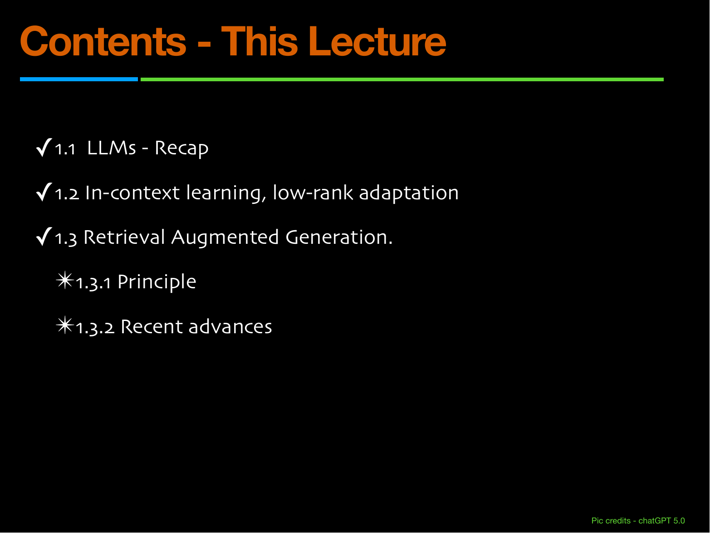
*Fig. — The promised plan. **Section 1.3 never arrives.** This deck's last content page is LoRA; there is no RAG slide anywhere in its 33 pages. The whole of §1.3 — principle and advances both — lives in the part-b deck, taught in [Lec 68](68-rag-advances.md). Page 2.*

The real page map:

| Pages | Section | Content |
|---|---|---|
| 1–2 | — | Title, contents |
| 3–18 | **§1.1 LLMs — Recap** | Attention, self-attention, Q/K/V, multi-head, the processing layer, decoder-only models, the LLM recipe |
| 19 | — | "Time for some… Q & A" divider |
| 20–21 | — | Contents, repeated twice (p-21 greys out §1.3) |
| 22–27 | **§1.2a In-context learning** | Foundation-model framing, ICL, the three types, why it works |
| 28–31 | **§1.2b Low-rank adaptation** | The LoRA paper, $\Delta\mathbf{W} = \mathbf{B}\mathbf{A}$, parameter saving, where it is inserted |
| 32–33 | — | Q & A, Thank You |

So §1.1 is 16 pages and §1.2 is 10. That is the whole deck.

### §1.1 — the recap, compressed

You have had the Transformer twice already, so this goes fast. Three slides are worth your time because the lecturer's *symbols* differ from yours; the rest is [Lec 57](57-transformer-encoder.md) and [Lec 59](59-transformer-decoder.md) restated.

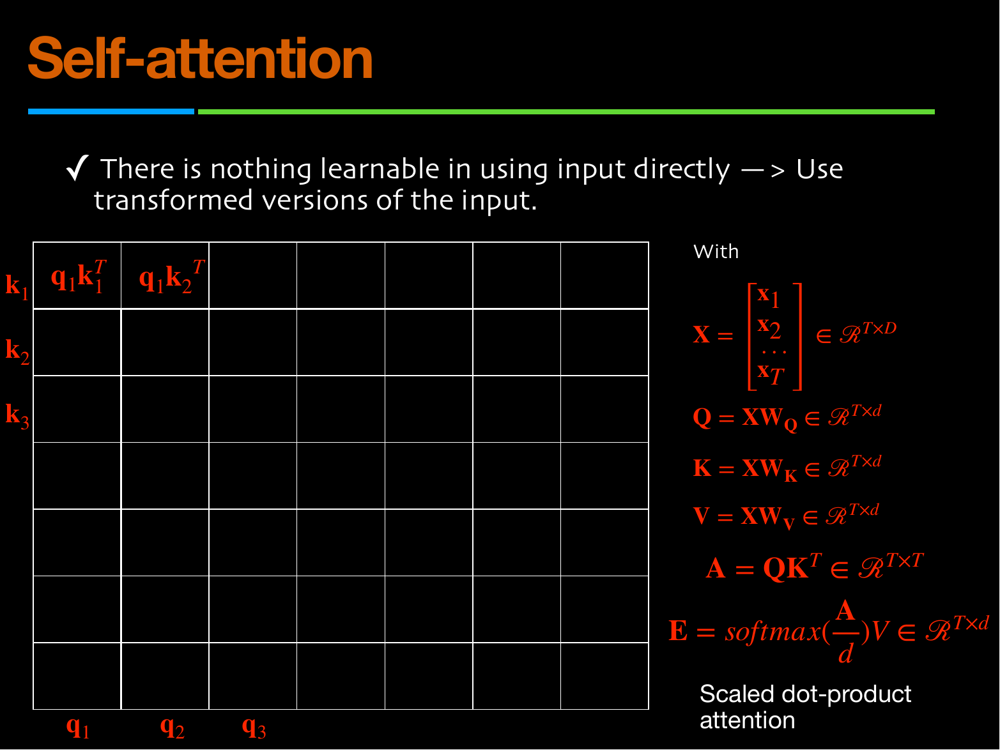
*Fig. — Every symbol on the right differs from yours. $T$ is the sequence length (you write $n$), $D$ the embedding width (you write $d_{\text{model}}$), $d$ the projected width (you write $d_k$), $\mathbf{A}$ the raw score matrix **before** softmax, $\mathbf{E}$ the attention output. And look at the denominator: it is $d$, not $\sqrt{d}$. Page 6.*

The lecturer's self-attention, written out:

$$\mathbf{Q} = \mathbf{X}\mathbf{W}_Q,\quad \mathbf{K} = \mathbf{X}\mathbf{W}_K,\quad \mathbf{V} = \mathbf{X}\mathbf{W}_V, \qquad \mathbf{X}\in\mathcal{R}^{T\times D},\ \ \mathbf{Q},\mathbf{K},\mathbf{V}\in\mathcal{R}^{T\times d}$$

$$\mathbf{A} = \mathbf{Q}\mathbf{K}^\top \in \mathcal{R}^{T\times T}, \qquad \mathbf{E} = \mathrm{softmax}\!\left(\frac{\mathbf{A}}{d}\right)\mathbf{V} \in \mathcal{R}^{T\times d}$$

> **Deck defect, and it is on two separate slides.** The scaling must be $\sqrt{d_k}$, not $d_k$. Pages 6 and 13 both print the bare dimension. [Lec 57](57-transformer-encoder.md) derives why the square root is the right thing (dot products of $d_k$ independent unit-variance terms have standard deviation $\sqrt{d_k}$, so you divide by the standard deviation, not the variance). At $d_k = 64$ the two choices differ by a factor of 8 inside the exponent, which is the difference between a peaked distribution and a nearly uniform one — N2 prices it. **Answer $\sqrt{d_k}$ in the exam.**

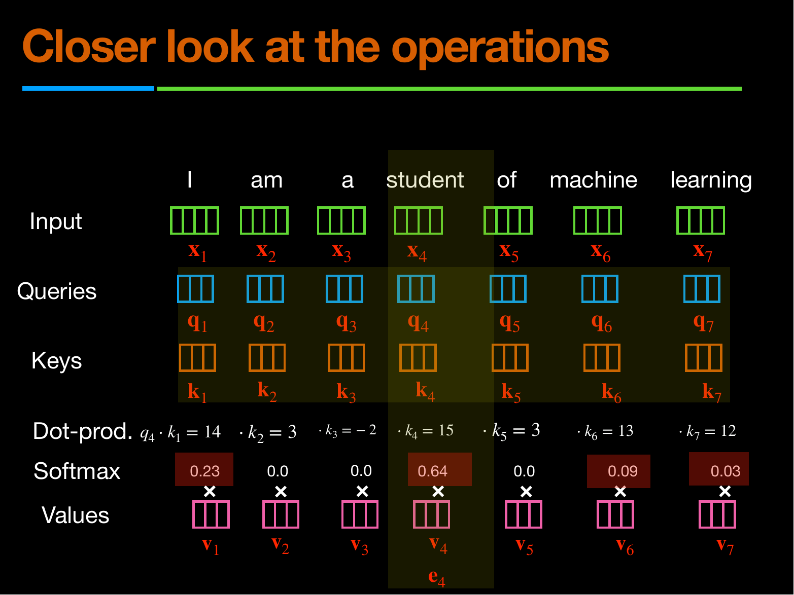
*Fig. — The only worked arithmetic in the whole deck. The query is $\mathbf{q}_4$ ("student"); the seven dot products against $\mathbf{k}_1 \ldots \mathbf{k}_7$ are shown, then softmaxed, then used to weight $\mathbf{v}_1 \ldots \mathbf{v}_7$ into $\mathbf{e}_4$. The highlight column shows the output belongs to position 4. Notice the four displayed weights sum to 0.99, not 1.00 — N1 finds the missing hundredth. Page 9.*

Three things this example teaches that no earlier chapter made concrete. The softmax is applied **across the row**, one row per query. The dot products are not scaled here at all, so $\mathrm{softmax}$ is taken of the raw integers. And the output $\mathbf{e}_4$ is a convex combination of the $\mathbf{v}_j$ — the weights are non-negative and sum to one, which is what makes attention an *averaging* operation rather than an arbitrary linear map.

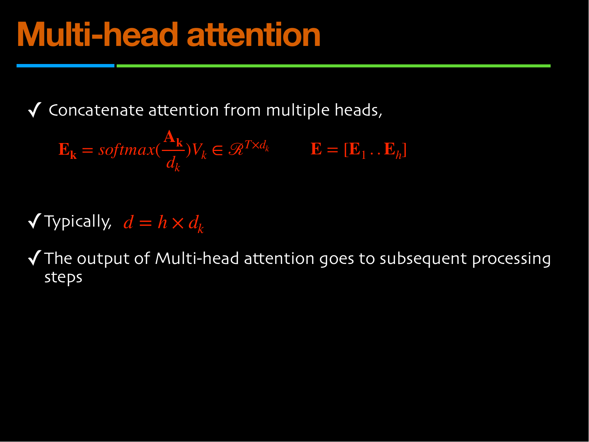
*Fig. — The head-count relation, inverted relative to your notation. This lecturer writes $d = h \times d_k$; [Lec 57](57-transformer-encoder.md) writes $d_k = d_{\text{model}}/h$. **Same equation, read in opposite directions** — and the deck's word is "typically", not "necessarily". Page 13.*

The three pages before this (10–12) build multi-head attention entirely by picture: "I kicked the ball", with one head answering *Who*, a second answering *Did what?*, and a third answering *To whom?*. That is the whole argument for multiple heads — one attention distribution can only express one relation at a time, so you run $h$ of them in parallel and concatenate. [Lec 57](57-transformer-encoder.md) owns the mechanics and the parameter count; [Lec 59](59-transformer-decoder.md) p-7 settles that the heads live inside a *single* sublayer, not stacked sublayers.

Page 14 is the single processing layer — self-attention, Add & Normalize, feed-forward, Add & Normalize — with two definitions worth quoting because they are tight:

> **Layer norm** — "a normalization for each vector, rescales and recenters the activations **across the feature dimension(s)**."
> **Residual connections** — "increases the gradient flow and stability."

"Across the feature dimension" is the whole discrimination against batch norm, which normalises across the *batch*. [Lec 42](42-stylegan2.md) owns the residual block $y = F(x) + x$ itself.

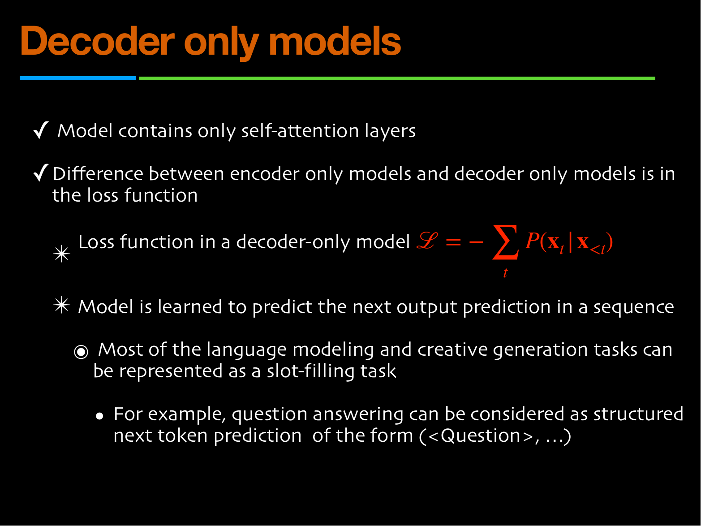
*Fig. — The deck's headline claim: "the difference between encoder-only models and decoder-only models is in the loss function." The boxed loss is **missing its logarithm** — see the warning below. Page 16.*

The deck's decoder-only loss, as printed:

$$\mathcal{L} = -\sum_t P(\mathbf{x}_t \mid \mathbf{x}_{<t}) \qquad \text{(as on the slide)}$$

$$\mathcal{L} = -\sum_t \log P(\mathbf{x}_t \mid \mathbf{x}_{<t}) \qquad \text{(correct — this is what you answer)}$$

> **Deck defect, p-16: the $\log$ is missing.** Without it the quantity is a sum of probabilities, is bounded in $[-T, 0]$, and is minimised by making every token *impossible* rather than certain — it has the wrong sign behaviour entirely. The correct objective is the negative log-likelihood, which is exactly the sparse categorical cross-entropy of [Lec 02](02-activations-and-losses.md) summed over positions. Natural log, as everywhere in this book. N3 shows the two forms disagreeing on real numbers.

Two more claims from p-15/16 worth keeping:

- **"Model contains only self-attention layers."** No cross-attention, because there is no encoder to attend to. That is the architectural difference [Lec 59](59-transformer-decoder.md) owns.
- **"Most language modeling and creative generation tasks can be represented as a slot-filling task"**, e.g. question answering as structured next-token prediction of the form `(<Question>, ...)`. This is the framing that makes everything downstream — ICL, RAG, instruction following — a single mechanism.

> **Careful with the deck's "the difference is in the loss function."** It is the *pedagogically* important difference but not the only one: a decoder-only model also uses a **causal mask** so position $t$ cannot see $t+1$, whereas BERT's encoder is bidirectional. The mask and the loss are two faces of the same decision — you cannot train next-token prediction without the mask, or the task is trivial — but an MCQ asking "what distinguishes GPT from BERT?" has two correct-sounding options and both are right. [Lec 61](61-gpt.md) owns that contrast table.

Pages 17–18 close the recap with the LLM recipe, and it is worth memorising as a four-step list because Week 12 refers back to it: **(1)** extend self-supervision; **(2)** mine lots of text, audio and visual data, crawled from the web; **(3)** design a model with large capacity, millions $\to$ billions of parameters; **(4)** pre-train with MLM / next-token-prediction losses at high compute cost, then fine-tune the final model for supervised tasks by loading the parameters as initialisation.

### §1.2 — the two frozen-weight routes

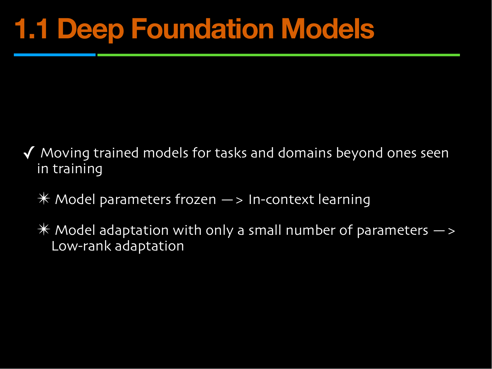
*Fig. — The whole of §1.2 in one slide: "moving trained models for tasks and domains beyond ones seen in training" splits exactly two ways. Note the heading says **1.1** where the contents page says 1.2 — a numbering slip, since p-21 has already greyed §1.3 out and ticked 1.2. Page 22.*

A **foundation model** is a large model pretrained once on broad data and then re-used across many downstream tasks it was never specifically trained for. The deck's framing of adaptation:

| Route | What changes | What is frozen | Cost paid |
|---|---|---|---|
| **In-context learning** | the *prompt* | all parameters | context length, every single query |
| **Low-rank adaptation** | a small new parameter set | $\mathbf{W}_0$, i.e. the whole base model | one training run, then nothing |

(The third route, retrieval, is below — the deck never reaches it.)

### In-context learning

**In-context learning (ICL)** is a frozen model learning a task from examples placed in its prompt. Nothing is stored, no gradient is computed, and the effect disappears the moment you delete the examples.

> **>>> THIS DECK IS THE COURSE'S ONLY ON-SLIDE SOURCE FOR IN-CONTEXT LEARNING. <<<**
> [Lec 61](61-gpt.md)'s deck lists GPT-3 on its timeline and then says nothing about it — it never uses the words zero-shot, one-shot or few-shot, and never gives GPT-3 a parameter count. That chapter's taxonomy is written as clearly-labelled off-slide content. **Pages 23–27 here are where a student actually sees ICL on a slide**, which makes them the likeliest source of any exam question on few-shot prompting. The division of labour: [Lec 61](61-gpt.md) owns the *settings* ($k = 0$ / $1$ / typically 10–100, the fine-tuning comparison, and the context-window budget), and this chapter owns the deck's own framing — the three-row table, the Federer examples, and the mechanistic answer on page 27. Read both; neither is complete alone.

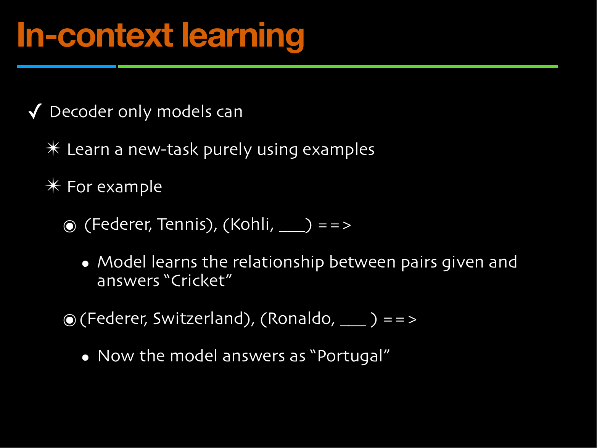
*Fig. — The lecturer's own demonstration, and it is sharper than it looks. **The same first element, Federer, appears in both prompts and the model answers differently** — "Cricket" in one, "Portugal" in the other. The pair itself, not the entity, defines the task. Page 24.*

That pair of examples is the best one-line argument for ICL in the course. The model is not retrieving a fact about Federer; it is inferring *which relation* the prompt is asking about — sport, or nationality — from the single demonstration it was given, and then applying that relation to a new entity.

The deck's formal statement (p-25). The input is a sequence of pairs with a truncated final one:

$$(\mathcal{X}_1, \mathcal{Y}_1), (\mathcal{X}_2, \mathcal{Y}_2), \ldots, (\mathcal{X}_n, \mathcal{Y}_n), (\mathcal{X}_{n+1}, \cdots)$$

and "the model learns the mapping function $f(\mathcal{X}) \to \mathcal{Y}$" while **"the weights of the model are frozen."** The deck's three-bullet answer to *how*:

1. "Each transformer layer builds an internal representation of the examples in the context."
2. "The self-attention mechanism allows the model to dynamically **retrieve** relevant examples when processing a new query token."
3. "This leads to behavior resembling **few-shot learning** — i.e., learning from a few examples."

Bullet 2 is the load-bearing one. Attention is already a content-addressed lookup over the context — that is literally what $\mathrm{softmax}(\mathbf{Q}\mathbf{K}^\top)\mathbf{V}$ computes — so a demonstration sitting in the context is, mechanically, a retrievable memory. ICL needs no new machinery; it is attention used on the prompt rather than on a sentence.

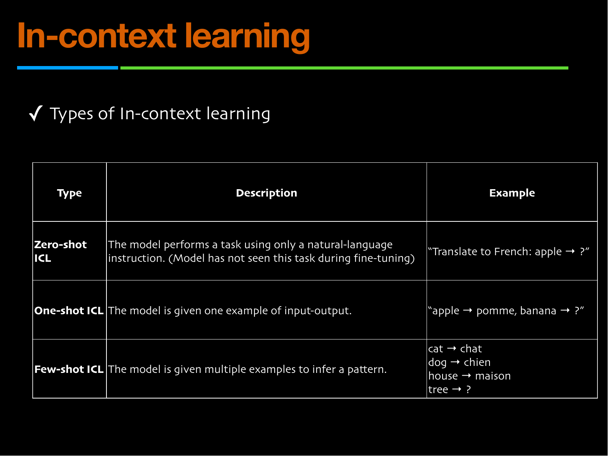
*Fig. — The deck's taxonomy. Memorise the **count of demonstrations**, which is the only thing separating the three rows. The zero-shot row's parenthesis is the subtle part. Page 26.*

| Type | Demonstrations | Deck's description | Deck's example |
|---|---|---|---|
| **Zero-shot ICL** | 0 | "performs a task using only a natural-language instruction. (Model has not seen this task during fine-tuning)" | "Translate to French: apple → ?" |
| **One-shot ICL** | 1 | "given one example of input-output" | "apple → pomme, banana → ?" |
| **Few-shot ICL** | several | "given multiple examples to infer a pattern" | cat → chat, dog → chien, house → maison, tree → ? |

> **Trap: this deck calls zero-shot a *type of* in-context learning**, even though it contains no examples at all. Several textbooks reserve "in-context learning" for the $k \geq 1$ cases and call $k=0$ plain "instruction following". **Follow the deck.** Its parenthetical is the real content: zero-shot ICL means the model has not seen *this task* during fine-tuning either — otherwise the instruction is just invoking a learned capability.

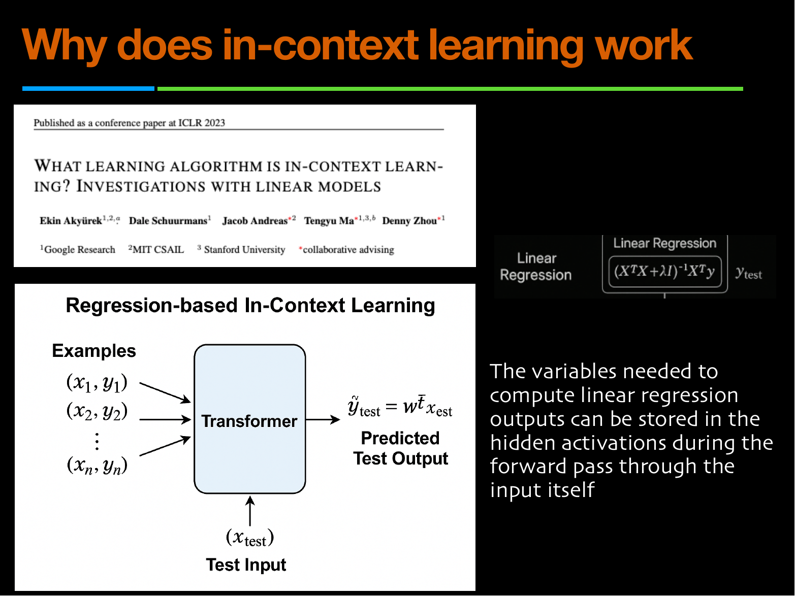
*Fig. — The deck's mechanistic answer. The transformer, fed $(x_1,y_1)\ldots(x_n,y_n)$ and then $x_{\text{test}}$, behaves as if it had **fitted a regression on the demonstrations inside the forward pass**. The boxed closed form is ridge regression. Page 27.*

The deck's quoted explanation is one sentence and it is the examinable one:

> "The variables needed to compute linear regression outputs can be stored in the hidden activations during the forward pass through the input itself."

Unpack it. Given demonstrations $(x_i, y_i)$ the linear-model answer is the ridge-regression estimate

$$\hat{\mathbf{w}} = (\mathbf{X}^\top\mathbf{X} + \lambda\mathbf{I})^{-1}\mathbf{X}^\top\mathbf{y}, \qquad \hat{y}_{\text{test}} = \hat{\mathbf{w}}^\top x_{\text{test}}$$

Every quantity in that formula is a function of the demonstrations alone. A transformer deep enough to compute $\mathbf{X}^\top\mathbf{X}$, $\mathbf{X}^\top\mathbf{y}$ and an approximate inverse in its activations can therefore *implement* the estimator without ever changing a weight. Akyürek et al. show empirically that trained transformers match ridge regression's predictions on linear-regression tasks. N4 works the arithmetic for two demonstrations.

Three consequences you should hold onto:

- **ICL is temporary and per-query.** Remove the demonstrations and the behaviour is gone. There is nothing to save, nothing to ship.
- **ICL is paid for in context length, on every call.** Four 30-token demonstrations are 120 tokens prepended to every request, forever. Since attention costs $O(T^2)$ ([Lec 59](59-transformer-decoder.md) p-13), that is not a linear surcharge — N5 prices it at $16\times$. And the context length is a **hard** ceiling, not a soft one: BERT and GPT both use **learned position embeddings**, a lookup table with a fixed number of rows (512 for GPT-1, 1024 for GPT-2), so there is simply no row 513 to fetch. No deck in Weeks 9–11 says this — they all write "Position Embedding" and move on — and it contradicts [Lec 57](57-transformer-encoder.md)'s sinusoidal numerical, which *would* extrapolate to any length. [Lec 60](60-bert.md) and [Lec 61](61-gpt.md) both flag it. Demonstrations that do not fit are not slow; they are impossible.
- **ICL is sensitive to things that should not matter.** Example order, formatting and label wording move accuracy. This deck does not say so; the companion course's [Lec 42](../../DLforNLP/notes/week-09/42-why-icl-works.md) makes it the headline result, and it is flagged in *Beyond the slides*.

### Low-rank adaptation

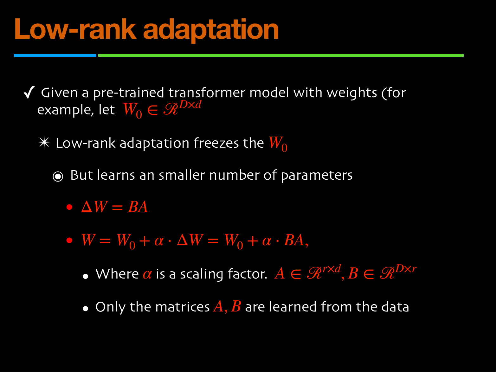
*Fig. — The whole method in four lines. Check the shapes against each other: $\mathbf{B}$ is $D\times r$ and $\mathbf{A}$ is $r\times d$, so $\mathbf{B}\mathbf{A}$ is $D\times d$ — exactly $\mathbf{W}_0$'s shape, which is what lets you add them. Page 29.*

Start from the one observation LoRA rests on. Full fine-tuning computes an update $\Delta\mathbf{W}$ for a $D\times d$ weight matrix, and $\Delta\mathbf{W}$ has $Dd$ free entries. LoRA's bet is that the *useful* update does not need all of them — that a task-specific change to a pretrained representation is **low-rank**. So constrain $\Delta\mathbf{W}$ to be a product of two thin matrices and train those instead:

$$\Delta\mathbf{W} = \mathbf{B}\mathbf{A}, \qquad \mathbf{A}\in\mathcal{R}^{r\times d},\quad \mathbf{B}\in\mathcal{R}^{D\times r},\quad r \ll \min(D, d)$$

$$\mathbf{W} = \mathbf{W}_0 + \alpha\cdot\Delta\mathbf{W} = \mathbf{W}_0 + \alpha\cdot\mathbf{B}\mathbf{A}$$

"$\mathbf{W}_0$ is frozen"; "only the matrices $\mathbf{A}, \mathbf{B}$ are learned from the data"; $\alpha$ is "a scaling factor".

Why this is a *constraint* and not a reparameterisation: a product of a $D\times r$ and an $r\times d$ matrix has rank at most $r$. You have not found a clever factorisation of an arbitrary $\Delta\mathbf{W}$ — you have declared in advance that $\Delta\mathbf{W}$ shall live in a rank-$r$ subspace, and you are hoping that is enough. The Code section verifies the rank bound numerically.

> **Notation clash, flagged twice.** (i) $\alpha$ is this deck's LoRA scale. In [Lec 04](04-optimizers-b.md) $\alpha$ is the AdaGrad accumulator, in [Lec 28](28-latent-interpolation.md) the interpolation parameter, in [Lec 46](46-ddpm-forward.md) the diffusion schedule, and CONTRACT §3 reserves $\alpha_{ij}$ for attention weights. Five live meanings in one book. (ii) $D$ and $d$ have *already been used* on p-6 of this same deck for the embedding width and the head width; here they are the output and input dimensions of one weight matrix. Read shapes off the equation in front of you.

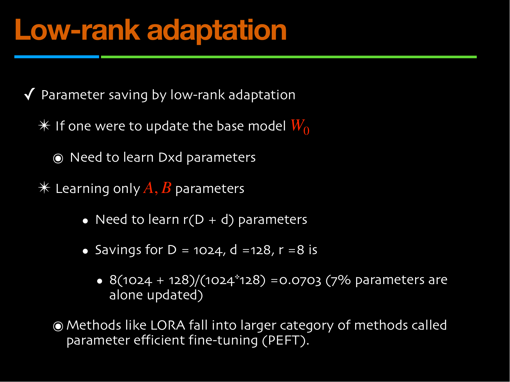
*Fig. — The deck's only numerical in §1.2, and the entire selling point. **$r(D+d)$ against $Dd$** — a sum against a product. That is why the saving is dramatic. Page 30.*

The counting argument, which you must be able to do from memory:

$$\text{full update: } Dd \text{ parameters} \qquad\text{LoRA: } r(D + d) \text{ parameters}$$

$$\text{fraction trained} \;=\; \frac{r(D+d)}{Dd} \;=\; r\left(\frac{1}{d} + \frac{1}{D}\right)$$

The second form is the one to carry into an exam: the fraction is the rank times the sum of the reciprocal dimensions. It falls as the matrices get *bigger*, which is why LoRA gets better the larger the model is.

The deck's worked case — $D = 1024$, $d = 128$, $r = 8$ — gives $8(1024+128)/(1024\times128) = 9216/131072 = 0.0703$, i.e. "7% parameters are alone updated". Verified in N6; the slide's arithmetic is exactly right.

The deck closes with the category name: **"Methods like LoRA fall into [the] larger category of methods called parameter efficient fine-tuning (PEFT)."** The companion course's [Lec 46](../../DLforNLP/notes/week-10/46-peft-adapters-prefix.md) covers the other PEFT families (adapters, prefix-tuning) that this deck does not name.


*Fig. — Where the adapters go, and why it works. **Q and V, not K and not O** — that choice is from the LoRA paper's ablation and it is the most likely MCQ in this half of the deck. Page 31.*

Two facts to memorise verbatim:

- **Where.** "LoRA is typically inserted into linear projection layers of transformer blocks: **Query (Q) and Value (V) projection matrices** in self-attention layers. Rarely also in feedforward networks."
- **Why it works.** "Because downstream tasks often require **specific but limited shifts** in representation space, not a complete re-learning of all features."

The second quote is the intuition behind the rank constraint, stated in English. A task does not need a new model; it needs a nudge, and a nudge is low-rank.

The companion notebook confirms the Q/V choice in code: PEFT is configured with `target_modules=["q", "v"]` on FLAN-T5-small, and the result is **344,064 trainable parameters out of 77,305,216 — 0.4451%**. N7 reconstructs that number from the shapes.

> **>>> THE $\alpha$-SCALING DISCREPANCY — the deck and its own notebook disagree. <<<**
> The slide writes $\mathbf{W} = \mathbf{W}_0 + \alpha\,\mathbf{B}\mathbf{A}$. The LoRA paper, every library, and **this course's own Week-11 notebook** write $\mathbf{W}_{\text{eff}} = \mathbf{W}_0 + \frac{\alpha}{r}\mathbf{B}\mathbf{A}$. The notebook's `LoraConfig` sets `r=8, lora_alpha=16`, so its effective scale is $\alpha/r = 2$ while the slide's would be $16$ — **eight times larger, i.e. a factor of $r$.** The division by $r$ exists so that you can change the rank without retuning the learning rate. N7 and the Code section both quantify it. **For this exam quote the deck's $\alpha$; for any real code remember the $/r$.**

### The three adaptation routes, side by side

The deck names ICL and LoRA and then stops. RAG is the missing third column, and the comparison is the single most useful table in Week 11 — so here it is in full, assembled from both decks. [Lec 68](68-rag-advances.md) owns RAG's mechanics; what follows is the *principle*, which this chapter owns.

| | In-context learning | LoRA | Retrieval augmented generation |
|---|---|---|---|
| **What changes** | the prompt | a new $\mathbf{B}\mathbf{A}$ per task | the prompt, with fetched text |
| **Base weights $\mathbf{W}_0$** | frozen | frozen | frozen |
| **Training needed** | none | one short run | none (index build only) |
| **Persists after the call?** | no | yes, as a small file | no |
| **Cost per query** | extra context tokens, $O(T^2)$ | none once merged | a retrieval + extra context |
| **Teaches new *facts*?** | only those pasted in | poorly — weights are a bad database | **yes, this is the point** |
| **Teaches new *behaviour* / format?** | weakly, temporarily | **yes, this is the point** | no |
| **Can you cite a source?** | no | no | **yes** |
| **Update when the world changes** | re-paste | retrain the adapter | edit the index |

### RAG's principle, and why you need it

> **Not on this deck.** Part-a stops at LoRA. The principle below is reconstructed as owned content so the three-route picture is complete; the slides supporting it are in the part-b deck and are taught in [Lec 68](68-rag-advances.md).

The problem is **parametric memory** — knowledge baked into $\mathbf{W}_0$ during pretraining. It has four defects, and they are the reason retrieval exists:

1. **It is frozen at training time.** The model is not aware of anything that happened after the crawl. Updating it means retraining or fine-tuning, which is expensive and which [Lec 68](68-rag-advances.md)'s own recap slide says "can't easily be [done] without retraining".
2. **It cannot cite.** There is no pointer from an output token back to a source document, so you cannot check an answer.
3. **It hallucinates.** A model that has compressed a fact imperfectly will still produce a fluent, confident, wrong sentence, because fluency and factuality are separately learned.
4. **Its capacity is fixed and finite.** Parameters are a lossy compression of the corpus; rare facts seen a handful of times are not reliably stored at any size.

**The principle, in three steps.** Keep the frozen model, and give it a second memory it can read at query time:

```
                   +-------------------+
   user query x -->|     retriever     |--> top-k documents d_1 .. d_k
                   +-------------------+
                             ^ |
                 query       | | top-k
                             | v
                   +-------------------+
                   |  knowledge base   |   <-- editable, outside the weights
                   +-------------------+

   augmented prompt = [ d_1 .. d_k ] + x   -->  frozen LLM  -->  grounded answer
```

1. **Retrieve.** Score every document in a corpus against the query and keep the best $k$.
2. **Augment.** Concatenate those documents into the prompt, ahead of the user's question.
3. **Generate.** Run the ordinary frozen LLM on the augmented prompt, instructing it to answer *from the supplied text*.

Every defect above is addressed by construction. The knowledge base is **non-parametric memory**: you can add, delete and correct entries with no gradient step, so it is never stale; the retrieved chunks carry identifiers, so the answer can cite them; the model is told to ground on provided text, which bounds hallucination; and the corpus can be arbitrarily large because it is not being squeezed into weights.

And notice what RAG *is*, mechanically: it is in-context learning where the context is chosen by a search engine instead of by you. Same frozen model, same prompt channel — only the author of the prompt has changed. That is why both ideas live in one lecture.

### Notation: this lecturer against Lec 01–63

| Quantity | Lec 01–63 / CONTRACT §3 | Week 11 (Ganapathy) | Note |
|---|---|---|---|
| sequence length | $n$ tokens | $T$ | also $T$ for diffusion timesteps in Week 7 |
| embedding width | $d_{\text{model}}$ | $D$ (part-a p-5/6) | but $D$ = *output* rows in LoRA p-29 |
| per-head width | $d_k$ | $d$ (p-6), $d_k$ (p-13) | and $d$ = *input* cols in LoRA p-29 |
| head relation | $d_k = d_{\text{model}}/h$ | $d = h\times d_k$ | same equation, inverted |
| raw scores | (unnamed) | $\mathbf{A} = \mathbf{Q}\mathbf{K}^\top$ | **$\mathbf{A}$ is pre-softmax**, and collides with LoRA's $\mathbf{A}$ |
| attention weights | $\alpha_{ij}$ | (unnamed) | |
| attention output | $\mathrm{head}_i$, context $\mathbf{c}_t$ | $\mathbf{E}$, token-wise $\mathbf{e}_t$ | |
| scaling | $\sqrt{d_k}$ | $d$ / $d_k$ — **no square root** | deck defect, pp. 6 and 13 |
| the reals | $\mathbb{R}$ | $\mathcal{R}$ (script) in part-a, $\mathbb{R}$ in part-b | cosmetic |
| loss | $\mathcal{L}$ | $\mathcal{L}$ | agrees |
| NLL | $-\sum\log P$ | $-\sum P$ — **no log** | deck defect, p-16 |
| LoRA scale | — | $\alpha$ | paper and notebook use $\alpha/r$ |
| learning rate | $\eta$ | — | but part-b uses $\eta$ for **retriever parameters** |
| ICL pairs | — | $(\mathcal{X}_i, \mathcal{Y}_i)$ script capitals | |

## Worked numericals

### N1. The deck's attention softmax, finished and checked

**Given:** page 8's dot products for the query $\mathbf{q}_4$ ("student") against the seven keys: $14,\ 3,\ -2,\ 15,\ 3,\ 13,\ 12$. The slide applies softmax with no scaling.
**Find:** the attention weights, and whether the slide's four displayed values are right.

1. Exponentiate (natural base, as softmax always is):
$e^{14} = 1\,202\,604.28$, $e^{3} = 20.0855$, $e^{-2} = 0.135335$, $e^{15} = 3\,269\,017.37$, $e^{3} = 20.0855$, $e^{13} = 442\,413.39$, $e^{12} = 162\,754.79$.
2. Sum: $1\,202\,604.28 + 20.09 + 0.14 + 3\,269\,017.37 + 20.09 + 442\,413.39 + 162\,754.79 = 5\,076\,830.15$.
3. Divide:

| $j$ | score | weight | slide |
|---|---|---|---|
| 1 | 14 | $0.236881$ | 0.23 |
| 2 | 3 | $0.000004$ | 0.0 |
| 3 | $-2$ | $0.00000003$ | 0.0 |
| 4 | 15 | $0.643909$ | 0.64 |
| 5 | 3 | $0.000004$ | 0.0 |
| 6 | 13 | $0.087144$ | 0.09 |
| 7 | 12 | $0.032058$ | 0.03 |

4. Check the displayed values sum to one: $0.23 + 0.64 + 0.09 + 0.03 = 0.99$.

5. Two further readings off the same row. Positions 4 and 1 carry $0.6439 + 0.2369 = 0.8808$ of the mass, so $\mathbf{e}_4$ is 88.1% a blend of just $\mathbf{v}_4$ and $\mathbf{v}_1$. And scores 15 and 14 differ by 1, giving a weight ratio of $e^{15}/e^{14} = e = 2.71828$ — one unit of raw dot product is worth a factor of $e$.

**Answer:** $\boldsymbol\alpha_4 = (0.2369,\ 0.0000,\ 0.0000,\ 0.6439,\ 0.0000,\ 0.0871,\ 0.0321)$ — and **the slide's 0.23 should be 0.24**. The exact value is 0.236881, which *rounds* to 0.24; the slide truncated. That one hundredth is exactly the missing mass in step 4. Every other displayed figure is correct to two places. The exponential sensitivity in step 5 is precisely why the $\sqrt{d_k}$ scaling matters: unscaled, dot products grow with $d_k$ and the softmax saturates to a hard argmax.

### N2. What the deck's missing square root costs

**Given:** the same scores, now treated as a genuine $d_k = 64$ attention row.
**Find:** the weight on position 4 under the deck's $\mathbf{A}/d_k$, under the correct $\mathbf{A}/\sqrt{d_k}$, and unscaled.

1. **Unscaled** (what p-8 actually does): $\alpha_4 = 0.6439$ (N1).
2. **Correct, $\div\sqrt{64} = 8$:** scores become $1.750,\ 0.375,\ -0.250,\ 1.875,\ 0.375,\ 1.625,\ 1.500$. Exponentiating and normalising gives $(0.2255,\ 0.0570,\ 0.0305,\ 0.2555,\ 0.0570,\ 0.1990,\ 0.1756)$.
3. **Deck's, $\div 64$:** scores become $0.2188,\ 0.0469,\ -0.0313,\ 0.2344,\ 0.0469,\ 0.2031,\ 0.1875$, giving $(0.1555,\ 0.1309,\ 0.1211,\ 0.1579,\ 0.1309,\ 0.1531,\ 0.1507)$.

**Answer:** the peak weight is $0.6439$ unscaled, $\mathbf{0.2555}$ under $\sqrt{d_k}$, and $\mathbf{0.1579}$ under the deck's $d_k$. Uniform over seven positions would be $1/7 = 0.1429$ — so dividing by $d_k$ has flattened attention to **very nearly no attention at all**. The slide's denominator does not merely rescale; it destroys the mechanism.

### N3. The deck's loss function with and without the logarithm

**Given:** a 3-token sequence where the model assigns $P(\mathbf{x}_1) = 0.5$, $P(\mathbf{x}_2\mid\mathbf{x}_1) = 0.1$, $P(\mathbf{x}_3\mid\mathbf{x}_{<3}) = 0.8$.
**Find:** the loss under the slide's formula and under the correct one, and which is minimised by a better model.

1. **Slide's form**, $\mathcal{L} = -\sum_t P$: $-(0.5 + 0.1 + 0.8) = -1.4$.
2. **Correct form**, $\mathcal{L} = -\sum_t \log P$ (natural log): $-(\ln 0.5 + \ln 0.1 + \ln 0.8) = -(-0.693147 - 2.302585 - 0.223144) = 3.218876$ nats.
3. Now suppose training improves the model to $P = (0.9,\ 0.7,\ 0.95)$. Slide's form: $-2.55$. Correct form: $-(\ln 0.9 + \ln 0.7 + \ln 0.95) = 0.105361 + 0.356675 + 0.051293 = 0.513329$ nats.

**Answer:** correct form $3.2189 \to 0.5133$ nats, **falling** as the model improves, as a loss must. The slide's form $-1.4 \to -2.55$, also falling — but it is minimised at $P = 1$ for every token only because it is unbounded below by $-T$; it has **no curvature where it matters** and its gradient with respect to a logit is $-P(1-P)$ rather than $(P - 1)$, so it vanishes on confidently-wrong tokens exactly as MSE does in [Lec 11](11-reconstruction-loss.md). All values in nats (natural log); in bits, divide by $\ln 2 = 0.693147$, giving $4.6439$ and $0.7406$ bits.

### N4. In-context learning as ridge regression

**Given:** two demonstrations $(x_1, y_1) = (2, 6)$ and $(x_2, y_2) = (4, 12)$, a one-dimensional model $\hat y = wx$ with no intercept, ridge penalty $\lambda = 0.1$, and a test input $x_{\text{test}} = 5$.
**Find:** the prediction the ridge estimator makes, which is what the deck claims the transformer computes in its activations.

1. $\mathbf{X} = \begin{pmatrix} 2 \\ 4\end{pmatrix}$, $\mathbf{y} = \begin{pmatrix} 6 \\ 12\end{pmatrix}$.
2. $\mathbf{X}^\top\mathbf{X} = 2^2 + 4^2 = 4 + 16 = 20$.
3. $\mathbf{X}^\top\mathbf{y} = 2(6) + 4(12) = 12 + 48 = 60$.
4. $\hat w = (20 + 0.1)^{-1}(60) = 60/20.1 = 2.985075$.
5. $\hat y_{\text{test}} = 2.985075 \times 5 = 14.925373$.
6. With $\lambda = 0$ (ordinary least squares): $\hat w = 60/20 = 3$ exactly, $\hat y_{\text{test}} = 15$.

**Answer:** $\hat y_{\text{test}} = \mathbf{14.9254}$ with $\lambda = 0.1$, versus $15$ with no regularisation. Two demonstrations were enough to pin the mapping $x \mapsto 3x$ — and nothing was trained. The $\lambda$ is what keeps the estimate finite when the demonstrations are collinear or too few, which is exactly the regime ICL operates in.

### N5. What four demonstrations cost, every single call

**Given:** a query of 40 tokens, four demonstrations of 30 tokens each, attention cost $O(T^2)$ ([Lec 59](59-transformer-decoder.md) p-13), and a service answering 1 million queries.
**Find:** the per-call and total overhead.

1. Zero-shot context: $T = 40$ tokens. Attention work $\propto 40^2 = 1600$.
2. Four-shot context: $T = 40 + 4(30) = 160$ tokens. Attention work $\propto 160^2 = 25\,600$.
3. Ratio: $25\,600/1600 = 16$.
4. Extra tokens over a million calls: $4 \times 30 \times 10^6 = 1.2\times10^8$ tokens.

**Answer:** four demonstrations make the attention cost of every call **16× larger** — the square of the $4\times$ length increase, not $4\times$ — and bill 120 million extra tokens per million queries. LoRA pays its cost once, in one short training run, and then **nothing**: once $\mathbf{W}_0 + \alpha\mathbf{B}\mathbf{A}$ is merged into a single matrix, inference is byte-for-byte the cost of the base model. That contrast is the whole engineering case for LoRA over few-shot prompting when the task is stable.

### N6. The deck's LoRA saving, verified

**Given:** $D = 1024$, $d = 128$, $r = 8$, as on page 30.
**Find:** the full and LoRA parameter counts and the fraction trained.

1. Full update: $Dd = 1024 \times 128 = 131\,072$.
2. LoRA: $\mathbf{A}$ is $r\times d = 8\times128 = 1024$ entries; $\mathbf{B}$ is $D\times r = 1024\times8 = 8192$ entries; total $r(D+d) = 8(1024+128) = 8 \times 1152 = 9216$.
3. Fraction: $9216 / 131\,072 = 0.0703125$.
4. Check with the reciprocal form: $r(1/d + 1/D) = 8(1/128 + 1/1024) = 8(0.0078125 + 0.0009766) = 8 \times 0.0087891 = 0.0703125$. ✓
5. Now anchor it against a whole model, using [Lec 61](61-gpt.md)'s verified counts. Take GPT-1: $d_{\text{model}} = 768$, 12 blocks, **116,169,216** parameters, with an attention sublayer of exactly $4d_{\text{model}}^2 = 2{,}359{,}296$ per block and a whole block of $7{,}084{,}800$. LoRA at $r = 8$ on **Q and V only** trains $2\times8(768+768) = 24{,}576$ per block, so $12\times24{,}576 = 294{,}912$ in total.
6. Express that three ways: against the Q and V matrices it replaces ($2\times589{,}824 = 1{,}179{,}648$) it is $2.08\%$; against the full attention sublayer ($12\times2{,}359{,}296 = 28{,}311{,}552$) it is $1.04\%$ — exactly half, because only two of $\{\mathbf{Q},\mathbf{K},\mathbf{V},\mathbf{O}\}$ are adapted; and against the whole 116 M model it is $294{,}912/116{,}169{,}216 = \mathbf{0.2539\%}$.

**Answer:** $\mathbf{0.0703}$, i.e. **7.03%** of the parameters are trained — the slide's figure, **and the slide's arithmetic is exactly right** to all four printed digits. The deck's phrasing "7% parameters are alone updated" is correct. Scaled up to a real model, the number gets far more dramatic: **294,912 trainable parameters against GPT-1's 116,169,216, or 0.25%.** Note the deck's $Dd$ is one matrix, not one model, so a question quoting 7% and a question quoting 0.25% can both be right — read whether the denominator is a matrix, a sublayer or a checkpoint.

### N7. The notebook's FLAN-T5 count, reconstructed from shapes

**Given:** FLAN-T5-small — $d_{\text{model}} = 512$, 6 heads of width 64 so each attention projection is $512 \to 384$; 8 encoder blocks and 8 decoder blocks; decoder blocks have *two* attention sublayers (self and cross). LoRA with $r = 8$ on `target_modules=["q","v"]`.
**Find:** the trainable parameter count, and check it against the notebook's printed `trainable params: 344,064 || all params: 77,305,216 || trainable%: 0.4451`.

1. Per adapted matrix ($D = 384$ out, $d = 512$ in): $\mathbf{A}$ is $8\times512 = 4096$, $\mathbf{B}$ is $384\times8 = 3072$. Total $r(D+d) = 8(384+512) = 8\times896 = 7168$.
2. Count the adapted matrices. Encoder: $8 \text{ blocks} \times 2 \ (\mathbf{q},\mathbf{v}) = 16$. Decoder: $8 \text{ blocks} \times 2 \text{ attention sublayers} \times 2 = 32$. Total $48$.
3. $48 \times 7168 = 344\,064$. ✓
4. Fraction of the whole model: $344\,064 / 77\,305\,216 = 0.00445072 = 0.4451\%$. ✓
5. On disk at fp32: $344\,064 \times 4 = 1\,376\,256$ bytes $= 1.3125$ MiB, against $77\,305\,216\times4 = 309\,220\,864$ bytes $= 294.94$ MiB for the full checkpoint.
6. Now price the two $\alpha$ conventions on this same configuration ($r = 8$, `lora_alpha` $= 16$). Slide p-29: effective scale $\alpha = 16$. Paper and notebook: effective scale $\alpha/r = 16/8 = 2$. Ratio $\alpha\big/(\alpha/r) = r = 8$, and the relative size of the disagreement is $\|\mathbf{W}_{\text{slide}} - \mathbf{W}_{\text{paper}}\|_F \big/ \|\mathbf{W}_{\text{paper}} - \mathbf{W}_0\|_F = (\alpha - \alpha/r)/(\alpha/r) = r - 1 = 7$.

**Answer:** **344,064 trainable parameters, 0.4451% of the model**, shipping as a **1.31 MiB** adapter instead of a 295 MiB checkpoint. The notebook's numbers reproduce exactly from the shapes — nothing is approximate here. That 225× shrink in what you have to store *per task* is why one base model can serve hundreds of fine-tunes. And on the same configuration the slide's update would be **$r = 8$ times larger** than the library's, a disagreement worth **7×** the intended update itself; the ratio is $r$ and does *not* depend on $\alpha$, which is exactly the point of the $/r$ — it decouples the update's scale from the rank so that changing $r$ does not force you to retune $\eta$. Verified in the Code section.

### N8. Picking a rank: when does LoRA stop saving anything?

**Given:** a square $768\times768$ projection ($D = d = 768$).
**Find:** the fraction trained at several ranks, and the rank at which LoRA costs as much as full fine-tuning.

1. Fraction $= r(D+d)/(Dd) = r(1536)/589\,824 = r/384$.

| $r$ | LoRA params | % of full |
|---|---|---|
| 1 | 1 536 | 0.26 |
| 4 | 6 144 | 1.04 |
| 8 | 12 288 | 2.08 |
| 16 | 24 576 | 4.17 |
| 32 | 49 152 | 8.33 |
| 64 | 98 304 | 16.67 |
| **384** | **589 824** | **100** |

2. Break-even: set $r(D+d) = Dd$, so $r^\star = Dd/(D+d)$. For $D = d = 768$: $r^\star = 589\,824/1536 = 384 = d/2$.
3. For the deck's rectangular case $D = 1024$, $d = 128$: $r^\star = 131\,072/1152 = 113.78$, so from $r = 114$ upward LoRA costs *more* than simply training $\Delta\mathbf{W}$ directly.

**Answer:** at $r = 8$ a $768\times768$ matrix trains **2.08%** of its entries; LoRA breaks even at $r^\star = Dd/(D+d)$, which is **384** for a square matrix (half its side) and **113.78** for the deck's $1024\times128$. Typical ranks in practice are 4–64, far below break-even — and note that rank also caps *expressiveness*, so the choice of $r$ is a capacity knob, not just a budget knob.

## Code

The deck asserts that $\mathbf{B}\mathbf{A}$ is a cheap low-rank update and that the softmax row on page 8 is correct. Both are checkable in twenty lines of NumPy, and checking them exposes the two defects at once.

```python
import numpy as np
rng = np.random.default_rng(0)

# --- 1. The deck's page-8 attention row, reproduced exactly (no scaling at all)
scores = np.array([14., 3., -2., 15., 3., 13., 12.])     # q4 . k_j for j = 1..7
w = np.exp(scores - scores.max()); w /= w.sum()
print("deck row (unscaled):", np.round(w, 4), " sum =", round(w.sum(), 6))

# What the SAME scores give under the two scalings. d_k = 64.
for name, denom in (("divide by d_k    ", 64.0), ("divide by sqrt d_k", np.sqrt(64.0))):
    z = scores / denom
    p = np.exp(z - z.max()); p /= p.sum()
    print(f"{name}:", np.round(p, 4), " max =", round(p.max(), 4))

# --- 2. LoRA: Delta_W = B A is at most rank r, whatever its D x d shape
D, d, r, alpha = 1024, 128, 8, 16
B = rng.normal(0, 0.02, (D, r))           # D x r,  random at init
A = np.zeros((r, d))                      # r x d,  ZERO at init -> Delta_W = 0
print("\nrank of B@A at init:", np.linalg.matrix_rank(B @ A))
A = rng.normal(0, 0.02, (r, d))           # after one training step A is non-zero
dW = B @ A
print("Delta_W shape:", dW.shape, " rank:", np.linalg.matrix_rank(dW), " <= r =", r)

full, lora = D * d, r * (D + d)
print(f"full update {full} params, LoRA {lora} params, ratio {lora/full:.4f}")
print("break-even rank r* = D*d/(D+d) =", round(D * d / (D + d), 2))

# --- 3. The two scaling conventions disagree by exactly a factor of r
W0 = rng.normal(0, 0.02, (D, d))
slide = W0 + alpha * dW                   # deck p-29:  W0 + alpha . BA
paper = W0 + (alpha / r) * dW             # paper and notebook:  W0 + (alpha/r) BA
print("||slide - paper||_F / ||paper - W0||_F =",
      round(np.linalg.norm(slide - paper) / np.linalg.norm(paper - W0), 4))
```

```
deck row (unscaled): [0.2369 0.     0.     0.6439 0.     0.0871 0.0321]  sum = 1.0
divide by d_k    : [0.1555 0.1309 0.1211 0.1579 0.1309 0.1531 0.1507]  max = 0.1579
divide by sqrt d_k: [0.2255 0.057  0.0305 0.2555 0.057  0.199  0.1756]  max = 0.2555

rank of B@A at init: 0
Delta_W shape: (1024, 128)  rank: 8  <= r = 8
full update 131072 params, LoRA 9216 params, ratio 0.0703
break-even rank r* = D*d/(D+d) = 113.78
```
```
||slide - paper||_F / ||paper - W0||_F = 7.0
```

Four readings. The first line reproduces the slide and shows 0.2369 where it printed 0.23. The next two lines show the deck's $\div d_k$ flattening the row to near-uniform (peak 0.1579 against a uniform 0.1429) while the correct $\div\sqrt{d_k}$ keeps a usable peak of 0.2555. The rank line proves the constraint is real: $\mathbf{B}\mathbf{A}$ is a $1024\times128$ matrix with rank exactly 8. And **the rank at initialisation is 0**, because $\mathbf{A}$ starts at zero in the LoRA paper — the adapted model is *identical* to the base model before the first gradient step, which is why attaching LoRA never degrades a working model. The last line is N7 step 6: the two $\alpha$ conventions differ by $r - 1 = 7$ times the size of the update.

For completeness, here is the deck's method as the companion notebook configures it with Hugging Face PEFT. It needs `transformers`, `peft` and a downloaded checkpoint, so it is not runnable here — read it, do not execute it.

```keras
from peft import LoraConfig, TaskType, get_peft_model

lora_configuration = LoraConfig(
    task_type=TaskType.SEQ_2_SEQ_LM,
    r=8,                        # the rank  r  in  Delta_W = B A
    lora_alpha=16,              # alpha; the EFFECTIVE scale is alpha / r = 2
    lora_dropout=0.0,
    target_modules=["q", "v"],  # the deck's "Query (Q) and Value (V) projections"
    bias="none",
)
lora_model = get_peft_model(base_model, lora_configuration)
lora_model.print_trainable_parameters()
# trainable params: 344,064 || all params: 77,305,216 || trainable%: 0.4451
```

The notebook then trains for 60 steps at $\eta = 2\times10^{-3}$ with AdamW on twelve examples, taking **5.6 seconds on CPU**, and held-out routing accuracy goes from **0.50 to 1.00**. It also asserts, after training, that a frozen tensor is bit-identical to its value before training — a direct demonstration that $\mathbf{W}_0$ never moved.

## Exam pack

### Must-memorise

| Item | Exactly this |
|---|---|
| Deck's self-attention | $\mathbf{A} = \mathbf{Q}\mathbf{K}^\top$, $\mathbf{E} = \mathrm{softmax}(\mathbf{A}/d)\mathbf{V}$ (**slide**); correct is $/\sqrt{d_k}$ |
| Deck's head relation | $d = h\times d_k$ |
| Deck's decoder-only loss | $\mathcal{L} = -\sum_t P(\mathbf{x}_t\mid\mathbf{x}_{<t})$ (**slide**); correct is $-\sum_t \log P(\mathbf{x}_t\mid\mathbf{x}_{<t})$ |
| Encoder-only vs decoder-only | "the difference is in the loss function" (plus the causal mask) |
| Layer norm | normalises **across the feature dimension(s)** |
| Residual connections | "increases the gradient flow and stability" |
| The two frozen-weight routes | parameters frozen → ICL; small number of new parameters → LoRA |
| ICL input form | $(\mathcal{X}_1,\mathcal{Y}_1),\ldots,(\mathcal{X}_n,\mathcal{Y}_n),(\mathcal{X}_{n+1},\cdots)$; model learns $f(\mathcal{X})\to\mathcal{Y}$; **weights frozen** |
| Three ICL types | zero-shot (instruction only) · one-shot (1 example) · few-shot (several) |
| Why ICL works | each layer builds an internal representation of the context; self-attention "dynamically retrieves" relevant examples |
| ICL ≈ which algorithm | ridge regression, $\hat{\mathbf{w}} = (\mathbf{X}^\top\mathbf{X}+\lambda\mathbf{I})^{-1}\mathbf{X}^\top\mathbf{y}$ |
| LoRA decomposition | $\Delta\mathbf{W} = \mathbf{B}\mathbf{A}$, $\mathbf{A}\in\mathcal{R}^{r\times d}$, $\mathbf{B}\in\mathcal{R}^{D\times r}$, $r\ll\min(D,d)$ |
| LoRA update | $\mathbf{W} = \mathbf{W}_0 + \alpha\cdot\mathbf{B}\mathbf{A}$ (**slide**); $\mathbf{W}_0 + \frac{\alpha}{r}\mathbf{B}\mathbf{A}$ (paper, notebook) |
| LoRA parameter counts | full $Dd$; LoRA $r(D+d)$; fraction $r(1/d + 1/D)$ |
| Where LoRA goes | **Query and Value** projections of self-attention; rarely feed-forward |
| Why LoRA works | downstream tasks need "specific but limited shifts in representation space" |
| LoRA's category | parameter efficient fine-tuning (**PEFT**) |
| RAG principle | retrieve top-$k$ → augment the prompt → generate grounded; non-parametric memory beside frozen parametric memory |

### Numbers worth knowing

| Quantity | Value |
|---|---|
| Deck's attention scores (p-8) | $14,\,3,\,-2,\,15,\,3,\,13,\,12$ |
| Their softmax | $0.2369,\ \approx 0,\ \approx 0,\ 0.6439,\ \approx 0,\ 0.0871,\ 0.0321$ |
| Slide's printed first weight | **0.23** (should be 0.24; the four shown sum to 0.99) |
| Peak weight, $\div d_k$ vs $\div\sqrt{d_k}$ | $0.1579$ vs $0.2555$ (uniform would be $0.1429$) |
| Deck's LoRA case | $D=1024$, $d=128$, $r=8$ |
| Its parameter counts | full $131\,072$; LoRA $9216$ |
| Its ratio | $0.0703$ — "7% parameters are alone updated" |
| Break-even rank | $r^\star = Dd/(D+d)$; $113.78$ here, $384$ for $768\times768$ |
| $768\times768$ at $r=8$ | $12\,288$ params, $2.08\%$ |
| GPT-1, LoRA $r=8$ on Q and V, 12 blocks | $294\,912$ trainable of $116\,169\,216$ — $\mathbf{0.2539\%}$ |
| Same, against the attention sublayers | $1.04\%$ (half of $2.08\%$: 2 of $\mathbf{Q},\mathbf{K},\mathbf{V},\mathbf{O}$) |
| Attention sublayer size | $4d_{\text{model}}^2$ — **the same for any $h$** |
| Reference full-model counts ([Lec 61](61-gpt.md)) | BERT-base $109\,482\,240$ · GPT-1 $116\,169\,216$ · GPT-2 $1\,557\,304\,000$ |
| One transformer block at $d_{\text{model}}=768$ | $7\,084\,800$, encoder or decoder-only alike |
| Context-window ceiling | learned position embeddings: 512 rows (GPT-1), 1024 (GPT-2) — hard, not soft |
| Notebook: FLAN-T5-small | $77\,305\,216$ params total |
| Notebook: LoRA $r=8$ on q,v | $344\,064$ trainable, $\mathbf{0.4451\%}$, 48 adapted matrices |
| Notebook adapter on disk (fp32) | $1.31$ MiB vs $294.94$ MiB |
| Notebook `lora_alpha` / `r` | $16 / 8$, effective scale $2$ |
| Slide-vs-paper scale ratio | exactly $r$ (here $8$); disagreement is $r-1 = 7$ updates |
| Notebook training | 60 steps, $\eta = 2\times10^{-3}$, 5.6 s CPU, accuracy $0.50 \to 1.00$ |
| 4-shot context overhead | $4\times$ tokens, $16\times$ attention cost |
| Rank of $\mathbf{B}\mathbf{A}$ at init | $0$ (because $\mathbf{A} = \mathbf{0}$) |

### Likely MCQ traps

- **"LoRA trains $r \times D \times d$ parameters."** No. It trains $r(D+d)$ — a **sum**, not a product. The product form is the thing LoRA avoids. If an option multiplies the two dimensions together, it is the full-fine-tuning count wearing a disguise.
- **"LoRA is applied to all weight matrices."** The deck is specific: **Query and Value projections** of self-attention; "rarely also in feedforward networks". Not Key, not the output projection, not by default the FFN.
- **$\alpha$ versus $\alpha/r$.** The slide says $\mathbf{W}_0 + \alpha\mathbf{B}\mathbf{A}$; every implementation says $\mathbf{W}_0 + (\alpha/r)\mathbf{B}\mathbf{A}$. They differ by a factor of $r$. **Quote the deck for this exam**; know the $/r$ exists.
- **"LoRA makes inference faster."** It does not. It makes *training* cheap in parameters and optimiser state. Once merged, inference costs exactly what the base model costs — no more, no less. Unmerged, it costs slightly *more* (two extra matrix products per adapted layer).
- **"LoRA is how you give a model new facts."** No — that is RAG. LoRA changes behaviour, style and output format; weights are a poor and expensive database. The notebook makes this explicit.
- **Rank $r$ confused with $r^\star$ or with the matrix dimensions.** $r$ is a chosen hyperparameter, typically 4–64. $r^\star = Dd/(D+d)$ is where the saving vanishes.
- **$\mathbf{A}$ the LoRA factor versus $\mathbf{A}$ the attention score matrix.** Both appear on this one deck, pages 6 and 29. Read the shape: $r\times d$ means LoRA, $T\times T$ means attention.
- **"The softmax denominator is $d_k$."** It is $\sqrt{d_k}$. The deck prints the bare $d_k$ on pages 6 and 13 and it is wrong both times.
- **"The decoder-only loss is $-\sum_t P$."** The slide omits the logarithm. It is $-\sum_t \log P(\mathbf{x}_t\mid\mathbf{x}_{<t})$, natural log.
- **Zero-shot "isn't ICL".** On *this* deck it is: zero-shot ICL is the first row of the p-26 table. Count demonstrations to tell the three apart: 0 / 1 / several.
- **"In-context learning updates the weights a little."** It updates nothing. The notebook asserts bit-equality of a parameter slice before and after ICL inference.
- **$d = h\times d_k$ read backwards.** It is the same relation as $d_k = d_{\text{model}}/h$. If a question gives $d_{\text{model}} = 512$ and $h = 8$, then $d_k = 64$ either way.
- **Confusing "parameter-efficient" with "memory-efficient at inference".** PEFT is about *trainable* parameters and the size of what you ship. Activation memory during the forward pass is unchanged.

### Self-test

1. Write the deck's self-attention equations with its own symbols, then translate every symbol into this book's notation.
2. A LoRA adapter has $D = 4096$, $d = 4096$, $r = 16$. How many parameters does it train, what fraction of the full update is that, and at what rank would it stop saving?
3. State the three types of in-context learning and the one quantity that separates them.
4. The deck writes the decoder-only loss as $-\sum_t P(\mathbf{x}_t\mid\mathbf{x}_{<t})$. What is wrong, and what is the correct expression?
5. Compute the softmax of the scores $(2, 0, 1)$ with no scaling, to 4 d.p. State the log base you used.
6. Why is $\mathbf{A}$ initialised to zero in LoRA, and what is the rank of $\Delta\mathbf{W}$ at that moment?
7. Your model must answer questions about a document set that changes weekly. Would you reach for ICL, LoRA, or RAG, and why are the other two wrong?
8. According to this deck, which projection matrices does LoRA go into, and what is the stated reason the method works at all?
9. A four-shot prompt triples the context length relative to zero-shot. By what factor does attention cost grow, and why is it not three?
10. What learning algorithm does the deck claim in-context learning implements, and where are that algorithm's intermediate quantities stored?

<details><summary>Answers</summary>

1. $\mathbf{Q} = \mathbf{X}\mathbf{W}_Q$, $\mathbf{K} = \mathbf{X}\mathbf{W}_K$, $\mathbf{V} = \mathbf{X}\mathbf{W}_V$ with $\mathbf{X}\in\mathcal{R}^{T\times D}$ and $\mathbf{Q},\mathbf{K},\mathbf{V}\in\mathcal{R}^{T\times d}$; $\mathbf{A} = \mathbf{Q}\mathbf{K}^\top\in\mathcal{R}^{T\times T}$; $\mathbf{E} = \mathrm{softmax}(\mathbf{A}/d)\mathbf{V}$. Translation: $T \to n$ (sequence length), $D \to d_{\text{model}}$, $d \to d_k$, $\mathbf{A} \to$ the unnamed pre-softmax score matrix, $\mathbf{E} \to$ the attention output (per-token context). And the denominator should be $\sqrt{d_k}$.
2. $r(D+d) = 16(4096+4096) = 16\times8192 = 131\,072$ parameters, against a full update of $4096^2 = 16\,777\,216$ — a fraction of $131\,072/16\,777\,216 = 0.0078125$, i.e. **0.78%**. Break-even $r^\star = 4096^2/8192 = 2048$.
3. Zero-shot, one-shot, few-shot. The separating quantity is the **number of input–output demonstrations in the prompt**: 0, 1, several.
4. The logarithm is missing. Correct: $\mathcal{L} = -\sum_t \log P(\mathbf{x}_t\mid\mathbf{x}_{<t})$, the negative log-likelihood (natural log), which is sparse categorical cross-entropy summed over positions.
5. $e^2 = 7.389056$, $e^0 = 1$, $e^1 = 2.718282$; sum $= 11.107338$. Weights $= (0.6652,\ 0.0900,\ 0.2447)$. Natural base — softmax is always $\exp$, so the "base" is $e$; the equivalent statement in base 2 would use $2^{x/\ln 2}$ and give the same answer.
6. So that $\Delta\mathbf{W} = \mathbf{B}\mathbf{A} = \mathbf{0}$ at step zero and the adapted model is **exactly** the pretrained model — attaching an adapter can never make a working model worse before training. The rank of $\Delta\mathbf{W}$ at that moment is **0**. ($\mathbf{B}$ is the one initialised randomly; if both were zero no gradient would flow.)
7. **RAG.** The facts live outside the weights in an index you can edit weekly with no training at all, and the answer can cite its source. ICL is wrong because you would have to paste the whole document set into every prompt, which does not fit and costs $O(T^2)$. LoRA is wrong because retraining an adapter every week is expensive, weights are a lossy store for facts, and it still cannot cite.
8. The **Query (Q) and Value (V)** projection matrices in self-attention layers, rarely also the feed-forward networks. It works "because downstream tasks often require specific but limited shifts in representation space, not a complete re-learning of all features" — i.e. the needed update is low-rank.
9. **$9\times$**, because attention is $O(T^2)$ and $3^2 = 9$. Linear layers do scale linearly with $T$, so the overall slowdown lies between 3 and 9 depending on how attention-dominated the model is at that length.
10. **Ridge (regularised linear) regression**, $\hat{\mathbf{w}} = (\mathbf{X}^\top\mathbf{X}+\lambda\mathbf{I})^{-1}\mathbf{X}^\top\mathbf{y}$. Its intermediate quantities are stored "in the hidden activations during the forward pass through the input itself" — not in any weight, which is why nothing is learned in the ordinary sense.

</details>

## Beyond the slides

**Gap: the deck never says that ICL is brittle to things that should not matter.**
**Why it matters:** example *order* can swing few-shot accuracy from near-state-of-the-art to near-chance, and replacing every demonstration label with a *random* one often barely hurts — which suggests demonstrations teach format and label-space more than input–output mapping. The companion course's [Lec 42](../../DLforNLP/notes/week-09/42-why-icl-works.md) makes both results its headline, and names the mechanistic story (induction heads) that this deck's "self-attention dynamically retrieves" is gesturing at. If an MCQ offers "few-shot accuracy is insensitive to demonstration order", it is false.

**Gap: LoRA's merge property is never stated, and it is the reason the method won.**
**Why it matters:** because $\mathbf{W}_0 + \alpha\mathbf{B}\mathbf{A}$ is a single matrix of the original shape, you can **fold the adapter into the weights after training** and ship a model that is byte-for-byte the same architecture, with zero added inference latency. That is exactly what adapters and prefix-tuning cannot do — an adapter is an extra sequential module forever, and a prefix permanently eats context. It also means you can keep one base model in memory and hot-swap kilobyte-scale adapters per user or per task. The companion [Lec 47](../../DLforNLP/notes/week-10/47-lora-and-variants.md) builds its whole case on this; this deck omits it entirely.

**Gap: nothing is said about how to choose $r$, or what you lose by choosing it small.**
**Why it matters:** $r$ is not only a budget knob, it is a **capacity ceiling** — no amount of training can make $\Delta\mathbf{W}$ express a rank-$(r{+}1)$ change. Practice uses $r = 4$–$64$; the LoRA paper found $r = 1$ or $2$ sufficient for many GLUE tasks, which is strong evidence that the low-rank hypothesis is true rather than merely convenient. N8 gives the arithmetic. The paired question — "how big must $\alpha$ be?" — is why the $/r$ convention exists: with $\alpha/r$, doubling $r$ leaves the update's scale untouched.

**Gap: the deck gives no quantitative comparison of ICL against LoRA, so the choice looks like taste.**
**Why it matters:** it is not taste, it is arithmetic. Few-shot prompting costs $O(T^2)$ on *every* request forever (N5: $16\times$ for four demonstrations); LoRA costs one 5.6-second training run and then nothing (N7, from the notebook). Conversely ICL needs no training data beyond the handful you paste, works instantly, and is the only option on a closed API you cannot fine-tune. The rule of thumb the slides never state: **ICL for exploration and low volume; LoRA for a stable task at scale; RAG whenever the answer depends on facts.**

**Gap: nothing warns that "parameter-efficient" does not mean "memory-efficient".**
**Why it matters:** LoRA shrinks the *trainable* parameter count and therefore the optimiser state — Adam keeps two moments per trainable parameter, so 344,064 trainable parameters need roughly 2.6 MiB of optimiser state instead of 590 MiB. But the frozen base model still occupies full memory and every activation still has to be stored for the backward pass. QLoRA, which quantises $\mathbf{W}_0$ to 4 bits to attack precisely that remaining cost, is covered at [Lec 48](../../DLforNLP/notes/week-10/48-quantization-qlora-1.md) in the companion course and is not on this deck.

## Cut from the slides

Pages 1, 19, 20, 21, 32 and 33 are the title card, two "Time for some… Q & A" dividers, two repeats of the contents page, and the Thank You — six of 33 pages carry no content, and this lecturer, like the first one, delivers his summary verbally. Page 3 is a scan of the *Attention Is All You Need* title block (Neurips 2017) and pages 23 and 28 are the title blocks of *Language Models are Few-Shot Learners* and the LoRA paper; they are cited in the prose rather than embedded, since a reproduced author list teaches nothing. Pages 4, 5, 7, 14, 15, 17 and 18 are taught in compressed form under CONTRACT §5 because they restate [Lec 56](56-lstm-to-transformer.md), [Lec 57](57-transformer-encoder.md), [Lec 59](59-transformer-decoder.md) and [Lec 61](61-gpt.md) — the "I am a student of machine learning" embedding strip (p-5), the queries-and-keys strip (p-7), the Add-and-Normalize block diagram (p-14, borrowed from jalammar.github.io) and the decoder-only redraw of the same diagram (p-15) are all figures the reader has met, so only p-6, p-9, p-13 and p-16 are embedded, chosen because each carries a symbol or a defect the exam can key on. Pages 10–12's three-stage "I kicked the ball" multi-head cartoon is described in two sentences rather than embedded as three near-identical images. Everything in §1.2 (pages 22, 24, 25, 26, 27, 29, 30, 31) is reproduced in full and every one of them is either embedded or quoted verbatim. The largest deliberate addition is the RAG principle, which **is not on this deck at all** — §1.3 is promised on the contents page and never delivered — and the three-route comparison table, both written as owned content and flagged as such; [Lec 68](68-rag-advances.md) carries the slides. The companion course covers the same three ideas at [Lec 42](../../DLforNLP/notes/week-09/42-why-icl-works.md), [Lec 47](../../DLforNLP/notes/week-10/47-lora-and-variants.md) and [Lec 55](../../DLforNLP/notes/week-11/55-retrieval-augmented-generation.md); this chapter is written standalone regardless, because the exam is set from *this* lecturer's $\Delta\mathbf{W} = \mathbf{B}\mathbf{A}$, his $D{=}1024/d{=}128/r{=}8$ arithmetic and his three-row ICL table.
