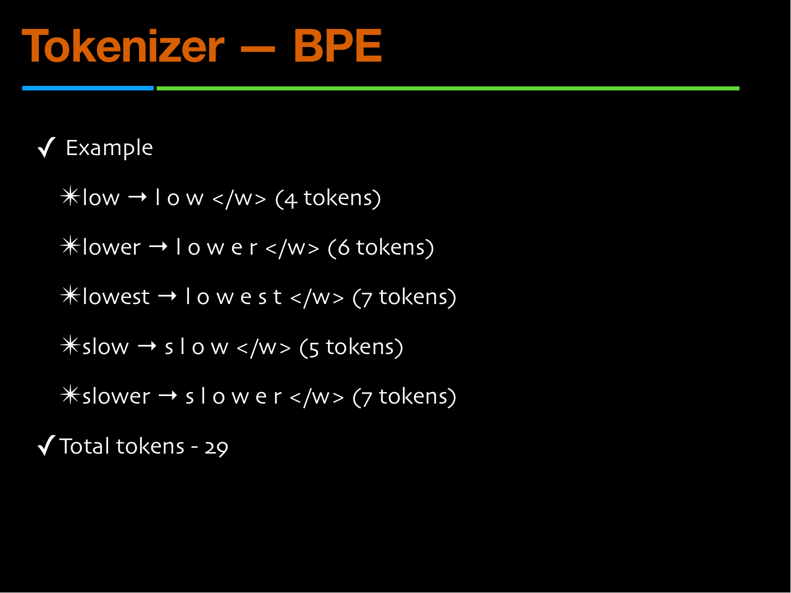

# Lec 70–71 — LLMs for Text Generation and Multimodal Alignment

> **Source:** `Week12-notes.pdf` (38 pages; this chapter covers **pp. 1–23**, deck sections 2.1 and 2.2) · **Week 12** · **Playlist:** Lec 70–71
> **Prereqs:** [Lec 54 — Foundations of NLP](54-nlp-foundations.md), [Lec 57 — Transformer Encoder](57-transformer-encoder.md), [Lec 59 — Transformer Decoder](59-transformer-decoder.md), [Lec 61 — GPT](61-gpt.md)
> **Feeds into:** [Lec 72–73 — Size, Benchmarking, Bias and Safety](72-benchmarking-bias-safety.md)

## Why this lecture exists

Every architecture lecture so far stopped at the softmax. [Lec 59](59-transformer-decoder.md) built the decoder, [Lec 61](61-gpt.md) made it causal, and both ended with a probability vector over the vocabulary — and then said nothing about what you *do* with it. That gap is the whole of this lecture.

A probability distribution is not a sentence. Turning one into the other is called **decoding**, and the rule you choose changes the output more visibly than any architectural detail: the same frozen model is a deterministic question-answerer or a chaotic poet depending on one scalar. This lecture makes that scalar numerical. It also closes the input side — what a token actually *is*, and how a picture becomes one — which is the bridge to the multimodal models that [Lec 52](52-stable-diffusion.md) kept deferring.

## The ideas

### A new lecturer, and the symbols that moved

Weeks 11 and 12 are delivered by **Sriram Ganapathy** (Electrical Engineering, IISc / TANUH AI-CoE), not the lecturer of Lec 01–63. The deck is visually different — black ground, orange titles, a blue-and-green rule under every heading, no NPTEL watermark — and more importantly the symbols moved. The exam draws on both halves of the course, so learn the translation now.

| This deck writes | It means | In Lec 01–63 / CONTRACT §3 that symbol means |
|---|---|---|
| $x$ | the **input prompt** (the conditioning text) | $\mathbf{x}$ — a data vector; in [Lec 39](39-pix2pix.md) the *source image* |
| $y$, $y_t$ | the **output token sequence** and its $t$-th token | a class label ([Lec 38](38-conditional-gan.md)) or a target image ([Lec 39](39-pix2pix.md)) |
| $y_{<t}$ | everything generated before step $t$ | new symbol |
| $z_i$ | a **logit** — one pre-softmax score for vocabulary item $i$ | $\mathbf{z}$ was the VAE latent ([Lec 21](21-vae-encoder.md)), the GAN noise ([Lec 32](32-gan-architecture.md)) and the Stable Diffusion latent ([Lec 52](52-stable-diffusion.md)) |
| $T$ | **temperature**, a positive real scalar | the number of diffusion timesteps ([Lec 46](46-ddpm-forward.md), [Lec 47](47-ddpm-reverse.md)) |
| $U$ | a draw from $\mathrm{Uniform}[0,1)$ | new symbol |
| $p(i)$ | the softmax probability of item $i$ | [Lec 02](02-activations-and-losses.md) wrote the same quantity $\hat{y}_i$ |
| $k$ (in top-$k$) | how many tokens survive truncation | the latent dimension (errata ruling, Week 3) |

> **The $z$ collision is the dangerous one.** For eight weeks $\mathbf{z}$ has meant "the thing you sample from a prior". Here $z_i$ is a *logit* — an unnormalised score, not a latent, not noise. If a question mixes Week 7 and Week 12 vocabulary, read the subscript: $z_i$ with a vocabulary index is a logit; $\mathbf{z}$ bold with a timestep or a prior is a latent.

Two further typographic facts about this deck. It uses **no bold and no vector notation at all** — every quantity is typeset as a plain scalar, even when it is a vector over the vocabulary. And its contents page **skips §2.4 entirely**: it reads 2.1, 2.2, 2.3, 2.5, 2.6. There is no missing content, just a numbering slip the lecturer never corrected.

### The big picture, and where this lecture sits in it


*Fig. — Read the diagram as a sandwich. The middle — embedding matrix, positional encoding, the transformer stack — is Weeks 9 and 10 and is not re-taught here. The two slices are this lecture: the **tokenizer** at the top and the step from **softmax to output tokens** at the bottom. Notice the deck draws only ONE arrow out of the softmax and labels it "output tokens / probabilities"; choosing between those two readings is exactly what decoding is. Page 3.*

The deck's own framing: an LLM "builds upon the transformer architecture", input text or multimodal data is converted to tokens by a tokenizer, an embedding matrix maps the large vocabulary to real-valued vectors, and after the stack a **linear + softmax layer generates the output tokens**, whose values are then "derived using sampling techniques".

### What a token is

A **token** is the basic unit of text a language model reads and processes. The deck is emphatic that it is *not* a word. A token can be:

- a whole word,
- a sub-word (a partial word),
- a punctuation mark or special symbol.

The slide illustrates it with `"I am a student of machine learning."` colour-coded into pieces that do not align with word boundaries.


*Fig. — The two numbers on this slide are the examinable ones: **one English token is typically 4–5 characters**, and the method is **byte-pair encoding**. The phrase "variable length segmentation" is this lecturer's, and it is the precise description — a token is not a fixed-width unit, and the tokenizer learns the widths from data. Page 5.*

Four properties, in the deck's order:

1. **A consistent vocabulary.** Fixed and known before training. The summary slide gives the scale: **10k – 100k – 1M** entries.
2. **Rare words handled by splitting.** Nothing is ever out-of-vocabulary, because every unseen word decomposes into pieces that are.
3. **Common phrases compressed into fewer tokens.** This is the point of the whole exercise, and §N1 below measures it.
4. **Data-driven, not hand-written.** The segmentation is learned from a corpus.

> **Owned elsewhere.** Tokenization *as a concept* — the four granularities, word vs sentence vs subword vs character — belongs to [Lec 54](54-nlp-foundations.md). The **BPE and WordPiece algorithms**, with a hand-run merge trace and the `BPE = frequency, WordPiece = likelihood` discrimination, belong to [Lec 59](59-transformer-decoder.md). Go there for the mechanism. What *this* deck adds, and what is taught below, is the **token-count ledger** — BPE scored as a compression ratio, merge by merge — and that is a different exam question.

### BPE as a compression measurement

This deck runs BPE on a corpus of five words — `low`, `lower`, `lowest`, `slow`, `slower` — and, uniquely in this course, **counts the tokens after every merge**. (Note that Lec 59's deck uses a *different* corpus, `low / lower / lowest / new / newer`, and reports a vocabulary rather than a count. Both traces are live; do not mix them.)

Every word is first split into characters and given an end-of-word marker `</w>`, which counts as a token:


*Fig. — The starting state. Count `lowest` yourself: l, o, w, e, s, t and the end-of-word marker is seven tokens for a six-letter word — character-level encoding costs you one token *more* than the word has letters. The 29 at the bottom is the number the next three slides drive down. Page 7.*

The deck's goal statement for BPE is worth keeping verbatim, because its three clauses are three separate MCQ options: frequent words become single tokens or a few tokens; rare or unseen words can still be represented as sequences of subwords; and the overall sequence length in tokens is reduced compared to pure character-level.

Then three merges, each taking the most frequent adjacent pair:

| Step | Merge | Pair frequency | Corpus tokens |
|---|---|---|---|
| 0 | characters only | — | **29** |
| 1 | `l` + `o` → `lo` | 5 | **24** |
| 2 | `lo` + `w` → `low` | 5 | **19** |
| 3 | `low` + `e` → `lowe` | 3 | **16** |


*Fig. — Three merges took 29 tokens to 16, a 44.8% reduction, and the vocabulary grew by exactly three entries. The green line at the bottom is the lecturer's bridge to §2.2: **"the same process can be repeated on any sequence of discrete inputs"** — which is how a picture gets tokenized later in this chapter. Page 10.*

**The rule the deck leaves implicit, and the one worth memorising:** merging a pair that occurs $f$ times removes exactly $f$ tokens from the corpus, because each occurrence of two symbols becomes one. Check it against the table — 29−24 = 5 = the frequency of `l`+`o`; 24−19 = 5; 19−16 = 3. So BPE is a greedy compressor: *at every step it takes the merge that saves the most tokens*, and the saving per merge falls monotonically. That is why the curve flattens and why vocabulary size has diminishing returns.

### Decoding: the choice the softmax does not make for you


*Fig. — The running distribution for the rest of §2.1. Notice the deck deliberately includes two bad options — "car" is not an animal and "quantum" is not even a noun phrase that fits — so you can see what a non-zero probability on nonsense costs you when temperature rises. Also notice it sums to exactly 1.00. Page 11.*

The deck defines the term precisely: **"generating outputs from LLMs is called decoding."** And it states the trade-off that organises everything after it — *if we choose the argmax token at each step, you get the same response every time; to get multiple different responses, resort to sampling.*

That one sentence contains the whole design space. Determinism and diversity are in direct opposition, and every decoder below is a different point on the line between them.

### Greedy decoding


*Fig. — The deck's only displayed equation in §2.1. Read the conditioning bar carefully: the distribution depends on **both** the prompt $x$ **and** every token already emitted, $y_{<t}$. That dependence is what makes decoding a sequence problem rather than $n$ independent classifications. Page 12.*

$$y_t = \arg\max_{i}\; p\big(y_t = i \mid y_{<t},\, x\big)$$

At every step, take the single most probable token, append it, and re-run the model. On the deck's distribution the answer is "cat", every time, from every seed.

Three consequences, only the first of which the deck states:

- **It is deterministic.** Same prompt, same output, forever. That is a feature for extraction, classification and code, and a defect for anything creative.
- **It is myopic.** Greedy maximises $p(y_t)$ at each step; it does not maximise $p(y_1,\dots,y_n)$ over the whole sequence. A token that looks second-best now can open a much better continuation. §N5 builds a two-step example where greedy's sequence is 1.6× less probable than the best one.
- **It degenerates.** Greedy decoding on an open-ended prompt falls into repetition loops, because once the model enters a repeated phrase, the phrase is its own strongest evidence. [Lec 63](63-llm-handson.md) catches this on a real model: DistilGPT-2 under greedy decoding produces one sentence and then emits a newline about forty-five times until the token budget runs out.

> **Division of labour with [Lec 63](63-llm-handson.md).** That chapter owns the *implementation* — `apply_top_k`, the nucleus right-shift, PyTorch masking, and three real generations from DistilGPT-2 side by side. This chapter owns the *concepts and the arithmetic*: the ratio identity, the inverse-CDF sampler, worked probabilities at three temperatures, and beam search, which Lec 63's notebook never runs. Read Lec 63 for what the code does; read this for what an exam will ask you to compute.

### Beam search — not on this deck, but on the syllabus

**Not one slide in this deck mentions beam search.** It is written here as owned content because it is the standard fix for greedy's myopia and appears in every LLM decoding question bank.

**Beam search** keeps the $B$ highest-scoring *partial sequences* (the "beams") instead of one. At each step it expands every beam by every vocabulary item, scores the $B \times |V|$ candidates by total sequence log-probability, and keeps the best $B$. At the end it returns the single best complete sequence.

$$\text{score}(y_{1:t}) = \sum_{s=1}^{t} \log p\big(y_s \mid y_{<s},\, x\big)$$

Work in **log**-probabilities, not probabilities: a 200-token sequence has a probability around $10^{-150}$, which underflows to zero in floating point, whereas its log is a comfortable $-350$.

| | Greedy | Beam search ($B$) | Sampling |
|---|---|---|---|
| Deterministic? | yes | yes | no |
| Cost per step | 1 forward pass | $B$ forward passes | 1 forward pass |
| Optimises | $p(y_t)$ | $\sum\log p$ over the beam | nothing — it draws |
| $B = 1$ reduces to | — | **greedy** | — |
| Typical use | code, extraction | translation, summarization | chat, stories |

Beam search's own failure is the mirror of greedy's: it over-prefers *short, bland, high-probability* sequences, because every extra token adds a negative log-term. Implementations divide the score by length (or $\text{length}^\alpha$) to compensate. Note the identity worth memorising: **beam search with $B = 1$ is exactly greedy decoding.**

### Sampling, done the deck's way

The deck defines sampling as drawing "from a multinomial distribution", where "in LLMs these are the soft-max outputs". Then it does something unusually useful: it shows you how a computer actually *performs* that draw, rather than treating it as a black box.


*Fig. — The cumulative bar is the whole algorithm drawn. Segment widths are the probabilities; a uniform draw lands in a segment with probability equal to its width, which is the proof that the method is correct. Watch the ordering trap: this slide reorders the table to car, dog, cat, quantum so the **index** 3 belongs to "cat", not to "car". Page 13.*

The procedure, in the deck's two steps:

1. Pick a random number $U$ from a uniform generator on $[0, 1)$.
2. Convert the model's probabilities into **cumulative** probabilities, and return the first token whose cumulative value exceeds $U$.

Formally, with tokens indexed $1 \ldots V$ and $F_j = \sum_{i \le j} p(i)$, return the smallest $j$ with $U < F_j$. The deck runs it twice: with $U = 0.57$ the output is "cat"; "with another seed", $U = 0.32$ gives "dog". Same model, same prompt, same distribution — different token, because a different number came out of the generator.

> **The point of showing two seeds.** The randomness is *entirely* in $U$. The network is deterministic; it emits the same four numbers every time. Everything people describe as an LLM "being creative" or "being inconsistent" is one uniform draw per token. Set the seed and the output is reproducible to the bit.

### Temperature


*Fig. — $T$ divides the logits, it does not multiply the probabilities. That distinction is the single most common error on this topic: halving $T$ does not halve anything, it **squares** every probability ratio. Page 15.*

$$p(i) = \frac{\exp\!\big(z_i / T\big)}{\sum_{j} \exp\!\big(z_j / T\big)}$$

where $z_i$ is the logit of vocabulary item $i$ and $T > 0$. **All exponentials and logarithms in this chapter are natural (base $e$)** — the formula is $\exp$ and $\ln$ throughout, and this course mixes three log bases elsewhere, so state the base in every answer.

The deck's three cases:

- $T = 1$ — the normal softmax, unchanged.
- $T < 1$ — the distribution becomes **sharper** (more peaked).
- $T > 1$ — the distribution becomes **flatter** (more uniform).

**Why dividing sharpens.** Take any two tokens $i$ and $j$. Their probability ratio is

$$\frac{p(i)}{p(j)} = \frac{\exp(z_i/T)}{\exp(z_j/T)} = \exp\!\left(\frac{z_i - z_j}{T}\right)$$

The normalising sum cancels, so the ratio depends only on the **logit gap** $z_i - z_j$ and on $T$. Halving $T$ doubles the exponent, which *squares* the ratio. Doubling $T$ halves the exponent, which takes its square root. Push $T \to 0^+$ and every ratio involving the top token blows up to infinity: **temperature-zero sampling is greedy decoding**. Push $T \to \infty$ and every exponent goes to 0, every ratio to 1: the distribution becomes uniform over the whole vocabulary and the model is a random token generator.

![Output generation temperature sampling slide with the pre-softmax outputs cat five, dog four and car one, showing at T equal to one the unnormalised values approximately 148.4, 54.6 and 2.7 with a bar, and at T equal to two the values approximately 12.2, 7.4 and 1.6 with a visibly more even bar, beside a column of behavioural consequences of high temperature including more randomness and diversity, exploration of unusual words, falling factual correctness, more self-contradiction, weaker long-range coherence, good for brainstorming and poetry, and bad for code, maths or precise instructions](../assets/pages/w12_Week12-notes/p-16.png)
*Fig. — Compare the two coloured bars, not the numbers: the pink segment shrinks and the green and blue segments grow. The deck stops at **unnormalised** exponentials and never divides through, so the actual probabilities — 0.7214/0.2654/0.0132 at $T=1$ against 0.5741/0.3482/0.0777 at $T=2$ — are not on any slide. N2 supplies them. Page 16.*

The deck's behavioural list for **high** temperature, in its own order: more randomness and diversity; the model explores more unusual words and phrases; factual correctness tends to drop; the model may contradict itself more; long-range coherence can suffer; more creative but also more chaotic; good for brainstorming, story generation and poetry; **bad for code, maths, or precise instructions**.

### Top-$k$ and top-$p$ (nucleus) sampling

The deck names both on its summary slide — *"multiple approaches to sampling: temperature, top-K, top-p, or a combination of these"* — and **teaches neither**. Both are written here as owned content, because the combination slide is exactly the kind of thing an MCQ keys on.

The problem both solve is the **tail**. On the deck's own distribution, "quantum" has probability 0.05. Over a 200-token answer, a 5%-per-step chance of emitting nonsense is a near-certainty of emitting it at least once. Temperature cannot fix this: lowering $T$ shrinks the tail but also kills the diversity you wanted, and raising $T$ makes it worse. Truncation fixes it directly — **delete the tail, then renormalise**.

**Top-$k$ sampling.** Keep the $k$ highest-probability tokens, set the rest to zero, divide by the surviving mass, and sample. With $k = 2$ on the deck's distribution: keep cat 0.60 and dog 0.25, divide by 0.85, giving 0.7059 and 0.2941.

**Top-$p$ (nucleus) sampling.** Sort descending, take the *smallest* set whose cumulative probability reaches $p$, renormalise, sample. With $p = 0.90$: the cumulative run is 0.60, 0.85, 0.95 — so you need three tokens to reach 0.90, and the nucleus is {cat, dog, car}, renormalised to 0.6316 / 0.2632 / 0.1053.

| | Top-$k$ | Top-$p$ (nucleus) |
|---|---|---|
| Fixes | the **number** of candidates | the **probability mass** of candidates |
| Candidate-set size | always exactly $k$ | varies from step to step |
| On a confident step (one token at 0.99) | still keeps $k$ tokens, including junk | keeps **one** token — behaves like greedy |
| On a flat step (1000 near-equal tokens) | keeps only $k$, may over-truncate | widens automatically |
| Disables with | $k$ set to the vocabulary size, or $k=0$ in most libraries | $p = 1.0$ |
| Reduces to greedy at | $k = 1$ | $p \to 0^+$ |

That third row is the argument for nucleus sampling and the usual exam answer: **top-$p$ adapts its candidate set to the model's confidence; top-$k$ does not.**

**Order of operations matters, and libraries fix it.** The standard pipeline is **temperature first, then top-$k$, then top-$p$, then sample** — temperature reshapes the distribution, the truncations then operate on the reshaped version. Applying a high temperature *after* truncation would be a different (and much safer) model, which is why "temperature 2.0 with top-p 0.9" is far less chaotic than temperature 2.0 alone.

### Putting the decoders side by side

| Decoder | Deterministic | One knob | What it is good for | Characteristic failure |
|---|---|---|---|---|
| Greedy | yes | — | extraction, classification, code | repetition loops; myopia |
| Beam search $B$ | yes | $B$ | translation, summarization | short, bland, generic output |
| Pure sampling | no | — | nothing, in practice | emits the tail; incoherence |
| Temperature $T$ | no | $T$ | the global diversity dial | $T$ high ⇒ factual errors |
| Top-$k$ | no | $k$ | cheap tail removal | wrong $k$ on confident steps |
| Top-$p$ | no | $p$ | the modern default | still needs $T$ for shape |

### §2.2 — Multimodal alignment

The deck's second section is titled **"LLM pre-training"** on its slides but **"Multimodal alignment"** on the contents page. It is short — four content pages — and it is entirely about one question: *how does a non-text input become something a text model can read?*

Its one-line premise: multi-modal LLMs train on a **mixture of text, audio, speech, images and video data**, and can also include other data such as finance or biomedical records.


*Fig. — Three boxes, and the exam question is which one is novel. Box 1 is a vision or audio model you did not train here. Box 3 is the **same next-token prediction objective** as [Lec 61](61-gpt.md) — nothing changes. Box 2 is the only new idea in the section, and the deck gives it the least space. Page 21.*

**Step 1 — a modality-specific encoder.** One per modality, each turning raw signal into a sequence of vectors:


*Fig. — Six rows, and every one of them ends in the word "tokens" or "embedding". That is the design principle: whatever the modality, the encoder's contract is to emit a **sequence of vectors** the transformer stack can consume, because a transformer has no idea what a pixel is. Page 22.*

| Modality | Encoder the deck names | Output |
|---|---|---|
| Images | Vision transformer — **ViT / SigLIP / EVA** | visual tokens |
| Audio | **EnCodec, BEATS**, or a spectrogram encoder | acoustic tokens |
| Video | **space-time ViT** | video tokens |
| 3D | point encoder / voxel encoder | — |
| Speech | **Whisper-like encoder** | — |
| Structured data | **embedding table** | — |

Two things to notice. The *embedding table* row is the one you already know: it is the same `nn.Embedding` object the course has been using since Week 6, and [Lec 54](54-nlp-foundations.md)'s word embeddings are the text instance of it. And the audio row names EnCodec, which is a **discrete** codec — it produces integer codes, not continuous vectors — which is the clue to how step 2 can be made trivial.

**Step 2 — modality alignment.** The encoder's output lives in the wrong space: a ViT's 1024-dimensional patch features are not the LLM's 4096-dimensional token embeddings, and nothing makes them comparable. Alignment is the operation that fixes that. The deck draws it as an arrow and does not say how it works, so here are the three mechanisms actually in use, cheapest first:

1. **A linear projector (an adapter).** One learned matrix $\mathbf{W}_{\text{proj}}$ mapping encoder features to the LLM's embedding dimension; the projected vectors are then **concatenated into the token sequence** as if they were words. This is the LLaVA design and by far the most common. If the ViT emits $n$ patch vectors of dimension $d_v$ and the LLM uses $d_{\text{model}}$, the projector is $d_v \times d_{\text{model}}$ parameters and *nothing else is trained* in the cheapest recipe — the vision encoder is frozen and the LLM is frozen.
2. **Cross-attention.** Insert cross-attention sublayers into the LLM that attend from text positions to the encoder's output, exactly as [Lec 52](52-stable-diffusion.md)'s U-Net attends to CLIP text embeddings. More expressive, more parameters, and it keeps the context window free of image tokens.
3. **Discrete visual tokens.** Quantise the encoder's output into integers from a learned codebook, extend the LLM's vocabulary by those integers, and the problem disappears entirely — an image is now literally a sequence of token IDs. This is what the deck's final slide shows.

> **The concatenation-vs-cross-attention switch** was settled for images in [Lec 52](52-stable-diffusion.md) (errata batch 12 item 6): spatial conditions get concatenated, text gets cross-attention. The multimodal-LLM literature inverts the emphasis — it concatenates *image* tokens into a *text* stream — because the backbone here is a language model, not a U-Net. Same two mechanisms, opposite default.

**Step 3 — pre-training with the next-token prediction objective.** This is the punchline and it deserves emphasis: **the loss does not change.** Once every modality is a token, a multimodal LLM is trained exactly as [Lec 61](61-gpt.md)'s GPT is, with the cross-entropy of the next token given the prefix — or, with integer labels, the **sparse categorical cross-entropy** [Lec 02](02-activations-and-losses.md) owns. No contrastive term, no reconstruction term, no adversarial term. All the multimodality lives in the *input pipeline*.

![Modality encoder with LLM example slide reproducing the LaVIT figure, showing on the left a pre-training panel where two photographs pass through a visual tokenizer and two captions pass through a text tokenizer, both producing interleaved purple visual tokens and green textual tokens delimited by image and end of image markers that feed a multimodal language model trained for next image or text token prediction, and on the right an inference panel showing understanding, where an image and a question yield a text answer, and generation, where an image and a caption yield visual tokens that decode to a new image, credited to Jin and colleagues at ICLR 2024](../assets/pages/w12_Week12-notes/p-23.png)
*Fig. — This is mechanism 3 drawn in full. Count the delimiters: an image is a run of $T_1$ visual tokens wrapped in markers, dropped into the same stream as the text. That wrapping is the entire interface. The right panel shows the payoff of symmetry — because images are tokens the model can **emit** as well as read, the same network does understanding (image in, text out) and generation (text in, image out) with one objective. Page 23.*

> **A symbol warning on this figure:** $T_1$ and $T_2$ here are **token counts** for the two images. They are not diffusion timesteps and not temperature. This is the third meaning of $T$ live in the book.

### CLIP-style contrastive alignment — the method this deck leaves out

**No slide in this deck mentions CLIP, contrastive learning, or an image–text similarity objective.** That is a real gap, because [Lec 52](52-stable-diffusion.md) explicitly deferred CLIP's mechanism to "the multimodal material in Week 12", and because "how are image and text brought into a shared space?" is a standard question whose standard answer is contrastive training. It is written here as owned, clearly-off-slide content.

**CLIP** (Contrastive Language–Image Pre-training) trains two encoders at once — an image encoder $f$ and a text encoder $g$ — on a batch of $N$ image–caption pairs. Both outputs are L2-normalised to unit length, so the dot product of any pair is a **cosine similarity** in $[-1, 1]$. Form the $N \times N$ matrix of similarities between every image and every caption, divide by a learned temperature $\tau$, and apply the ordinary cross-entropy of [Lec 02](02-activations-and-losses.md) **twice** — once across each row (which caption goes with this image?) and once down each column (which image goes with this caption?):

$$\mathcal{L}_{\text{CLIP}} = \tfrac{1}{2}\Big[\mathcal{L}_{\text{CE}}(\text{rows}) + \mathcal{L}_{\text{CE}}(\text{columns})\Big], \qquad \text{logits}_{ij} = \frac{f(\mathbf{v}_i)^{\top} g(\mathbf{t}_j)}{\tau}$$

The $N$ diagonal entries are the true pairs; the $N^2 - N$ off-diagonal entries are the negatives, generated for free by the batch. Minimising this pulls each image toward its own caption and pushes it away from the other $N-1$ — which is exactly "a shared space", defined operationally.

Three things worth knowing about it:

- **The temperature is the same object as §2.1's.** CLIP divides logits by a learned $\tau$ before softmax, for the same reason: it sets how sharply the model must separate the true pair from the hardest negative.
- **Batch size is a hyperparameter of the loss, not just of the optimiser.** Bigger batches mean more negatives per positive, so CLIP trains at batch sizes in the tens of thousands. [Lec 03](03-optimizers-a.md)'s framing of batch size as a pure speed/noise trade-off does not apply here.
- **Contrastive and generative alignment are different animals, and this is the discrimination.** CLIP gives you *one vector per image* in a text-aligned space — perfect for retrieval, zero-shot classification and conditioning a diffusion model ([Lec 52](52-stable-diffusion.md)), and useless for answering a question about the image, because a single vector cannot be attended to word by word. The deck's projector/token route gives you *a sequence of vectors* that an LLM can read — which is why modern vision-language models use a CLIP-style encoder for the **features** and then a projector for the **interface**. The two are complements, not rivals.

## Worked numericals

### N1. The deck's BPE token ledger, verified merge by merge

**Given:** the corpus `low`, `lower`, `lowest`, `slow`, `slower`, each split into characters plus an `</w>` marker.
**Find:** the token total after 0, 1, 2 and 3 merges, and the saving attributable to each merge.

1. **Initial counts.** `low` → l, o, w, `</w>` = 4. `lower` → 6. `lowest` → 7. `slow` → 5. `slower` → 7.
   $$4 + 6 + 7 + 5 + 7 = 29 \quad\checkmark\ \text{(the slide's 29)}$$
2. **Merge 1: the pair `l`+`o`.** It occurs once in each of the five words, so frequency 5 — the slide says "appears 5 times". New counts: 3, 5, 6, 4, 6.
   $$3 + 5 + 6 + 4 + 6 = 24 \quad\checkmark\ \text{(the slide's 24)}$$
3. **Merge 2: the pair `lo`+`w`.** Again once per word, frequency 5. New counts: 2, 4, 5, 3, 5.
   $$2 + 4 + 5 + 3 + 5 = 19 \quad\checkmark\ \text{(the slide's 19)}$$
4. **Merge 3: the pair `low`+`e`.** Check that this really is the most frequent pair at this point. The candidates are `low`+`</w>` (in `low`, `slow`) = 2, `low`+`e` (in `lower`, `lowest`, `slower`) = **3**, `e`+`r` = 2, `s`+`low` = 2, and `e`+`s`, `s`+`t`, `t`+`</w>`, `r`+`</w>` smaller. So `low`+`e` at 3 is the unique maximum — the deck's choice is correct. New counts: 2, 3, 4, 3, 4.
   $$2 + 3 + 4 + 3 + 4 = 16 \quad\checkmark\ \text{(the slide's 16)}$$
5. **Savings per merge:** $29-24 = 5$, $24-19 = 5$, $19-16 = 3$ — identical to the three pair frequencies.
6. **Total compression:** $(29 - 16)/29 = 13/29 = 0.4483$.

**Answer:** 29 → 24 → 19 → 16 tokens. **All four of the deck's figures are correct**, and all three merges are the genuinely most-frequent pair. Three merges buy a **44.83% reduction** in sequence length at a cost of three vocabulary entries, and each merge saves exactly as many tokens as its pair's frequency.

### N2. Temperature, worked to actual probabilities — $T = 0.5$, $1$, $2$

The deck stops at unnormalised exponentials. This completes it, and adds the $T = 0.5$ case it omits.

**Given:** logits $z = (z_{\text{cat}}, z_{\text{dog}}, z_{\text{car}}) = (5, 4, 1)$, from page 16.
**Find:** $p(i)$ at $T = 0.5$, $T = 1$ and $T = 2$. **All logs and exponentials natural (base $e$).**

1. **$T = 1$.** Scaled logits are $5, 4, 1$.
   $$e^{5} = 148.4132,\quad e^{4} = 54.5982,\quad e^{1} = 2.7183$$
   (the slide's 148.4, 54.6, 2.7 — correct). Sum $= 148.4132 + 54.5982 + 2.7183 = 205.7296$.
   $$p = \tfrac{148.4132}{205.7296},\ \tfrac{54.5982}{205.7296},\ \tfrac{2.7183}{205.7296} = 0.7214,\ 0.2654,\ 0.0132$$
2. **$T = 2$.** Scaled logits are $2.5, 2, 0.5$.
   $$e^{2.5} = 12.1825,\quad e^{2} = 7.3891,\quad e^{0.5} = 1.6487$$
   (the slide's 12.2, 7.4, 1.6 — correct; 1.6487 rounds to 1.6 at one decimal). Sum $= 21.2203$.
   $$p = 0.5741,\ 0.3482,\ 0.0777$$
3. **$T = 0.5$.** Scaled logits are $10, 8, 2$.
   $$e^{10} = 22026.4658,\quad e^{8} = 2980.9580,\quad e^{2} = 7.3891$$
   Sum $= 25014.8128$.
   $$p = 0.8805,\ 0.1192,\ 0.000295$$

| | $T = 0.5$ | $T = 1$ | $T = 2$ |
|---|---|---|---|
| $p(\text{cat})$ | 0.880537 | 0.721399 | 0.574097 |
| $p(\text{dog})$ | 0.119168 | 0.265388 | 0.348207 |
| $p(\text{car})$ | 0.000295 | 0.013213 | 0.077696 |
| ratio cat : dog | 7.3891 | 2.7183 | 1.6487 |
| entropy | 0.5308 bits | 0.9303 bits | 1.2760 bits |

**Answer:** the probabilities above. Three readings, each examinable:

- The **ratio row is exactly $e^{1/T}$** — $e^{2} = 7.389$, $e^{1} = 2.718$, $e^{0.5} = 1.649$ — because the cat/dog logit gap is 1. Squaring at half the temperature, square-rooting at double it, as derived above.
- **"car" is the story.** Its probability goes 0.0003 → 0.0132 → 0.0777, a **263× swing** across the range. A token the model considers implausible at $T=0.5$ is sampled roughly one time in thirteen at $T=2$. That is the deck's "factual correctness tends to drop", quantified.
- **Entropy (base 2, stated explicitly)** rises monotonically: 0.5308 → 0.9303 → 1.2760 bits. In nats the same three numbers are 0.3679, 0.6448, 0.8845. Report the base or lose the mark.

### N3. The deck's two uniform draws, and the probability each token is chosen

**Given:** the page-13 table, in the deck's own index order — car (index 1) 0.10, dog (2) 0.25, cat (3) 0.60, quantum (4) 0.05.
**Find:** the cumulative boundaries, the token returned by $U = 0.57$ and $U = 0.32$, and the long-run frequency of each.

1. **Cumulative probabilities:** $F_1 = 0.10$; $F_2 = 0.10 + 0.25 = 0.35$; $F_3 = 0.35 + 0.60 = 0.95$; $F_4 = 0.95 + 0.05 = 1.00$. These are the slide's tick marks 0.1, 0.35, 0.95, 1.0.
2. **Intervals:** car $[0, 0.10)$, dog $[0.10, 0.35)$, cat $[0.35, 0.95)$, quantum $[0.95, 1.00)$.
3. **$U = 0.57$:** $0.35 \le 0.57 < 0.95$ → **cat** $\checkmark$ (the slide's answer).
4. **$U = 0.32$:** $0.10 \le 0.32 < 0.35$ → **dog** $\checkmark$ (the slide's answer).
5. **Long-run frequency** = interval width = the original probability, by construction. $P(\text{cat}) = 0.95 - 0.35 = 0.60$.
6. **Three independent draws all "cat":** $0.60^3 = 0.216$. All three *different* tokens is far less likely; the chance of at least one "quantum" in 20 steps is $1 - 0.95^{20} = 1 - 0.3585 = 0.6415$.

**Answer:** cat and dog, matching both slides. The useful extra number is step 6: **sample "pure", and a 5%-probability junk token appears at least once in a 20-token answer with probability 0.6415.** That single figure is the entire argument for top-$k$ and top-$p$.

### N4. Truncating the same distribution — top-$k$ against top-$p$

**Given:** $p = (0.60, 0.25, 0.10, 0.05)$ for (cat, dog, car, quantum).
**Find:** the renormalised distribution under $k=2$, under $p=0.90$, and under $p=0.80$.

1. **Top-$k$, $k = 2$.** Survivors cat 0.60, dog 0.25. Surviving mass $0.60 + 0.25 = 0.85$.
   $$0.60/0.85 = 0.705882,\qquad 0.25/0.85 = 0.294118$$
2. **Top-$p$, $p = 0.90$.** Cumulative run: 0.60 (< 0.90), 0.85 (< 0.90), 0.95 ($\ge$ 0.90). The smallest set reaching 0.90 therefore has **three** members: cat, dog, car. Surviving mass 0.95.
   $$0.60/0.95 = 0.631579,\quad 0.25/0.95 = 0.263158,\quad 0.10/0.95 = 0.105263$$
3. **Top-$p$, $p = 0.80$.** Cumulative 0.60 (< 0.80), 0.85 ($\ge$ 0.80) → two members, identical to $k=2$: 0.705882 / 0.294118.
4. **Check both remove "quantum" entirely.** Under every setting above $p(\text{quantum}) = 0$ exactly, so the 0.6415 risk from N3 falls to **zero**.

**Answer:** $k=2$ gives (0.7059, 0.2941, 0, 0); $p=0.90$ gives (0.6316, 0.2632, 0.1053, 0); $p=0.80$ gives the same as $k=2$. The trap worth rehearsing is step 2: **$p = 0.90$ keeps three tokens, not two**, because the rule is "the smallest set whose cumulative mass *reaches* $p$", and two tokens only reach 0.85. Choosing the set that *stays under* $p$ is the standard wrong answer.

### N5. Greedy is not the most probable sequence — a two-step beam search

**Given:** a toy model. At step 1, $p(A) = 0.5$, $p(B) = 0.4$, $p(C) = 0.1$. At step 2 the conditionals are

| prefix | $\to X$ | $\to Y$ | $\to Z$ |
|---|---|---|---|
| $A$ | 0.40 | 0.35 | 0.25 |
| $B$ | **0.80** | 0.15 | 0.05 |

**Find:** the greedy output and the beam-2 output, with their sequence probabilities.

1. **Greedy, step 1:** $\arg\max\{0.5, 0.4, 0.1\} = A$. Commit to $A$; $B$ and $C$ are gone forever.
2. **Greedy, step 2:** from $A$, $\arg\max\{0.40, 0.35, 0.25\} = X$. Output $AX$.
   $$p(AX) = 0.5 \times 0.40 = 0.20, \qquad \log p = \ln 0.20 = -1.609438$$
3. **Beam-2, step 1:** keep the top two prefixes, $A$ (0.5) and $B$ (0.4).
4. **Beam-2, step 2:** score all six continuations.
   $$p(AX) = 0.20,\ p(AY) = 0.175,\ p(AZ) = 0.125,\ p(BX) = 0.4\times0.80 = \mathbf{0.32},\ p(BY) = 0.06,\ p(BZ) = 0.02$$
5. **Best sequence:** $BX$ at 0.32, with $\log p = \ln 0.32 = -1.139434$.
6. **Ratio:** $0.32 / 0.20 = 1.6$.

**Answer:** greedy returns $AX$ with $p = 0.20$; beam-2 returns $BX$ with $p = 0.32$ — **1.6× more probable**, and greedy can never find it, because it discarded $B$ at step 1 on a 0.1 difference that step 2 repaid five times over. (Natural logs: $-1.6094$ and $-1.1394$ nats.) This is the complete case for beam search in six lines, and the reason "greedy decoding maximises the probability of the output sequence" is **false**.

### N6. Token budget from the deck's 4–5 characters per token

**Given:** the deck's rule that one English token is typically 4–5 characters, and a 1,000-word document at an average of 5.5 characters per word including the following space.
**Find:** the token count, and what it costs in a 4,096-token context window.

1. **Characters:** $1000 \times 5.5 = 5500$.
2. **At 5 characters per token:** $5500 / 5 = 1100$ tokens.
3. **At 4 characters per token:** $5500 / 4 = 1375$ tokens.
4. **Tokens per word:** between $1100/1000 = 1.10$ and $1375/1000 = 1.375$.
5. **Context budget:** a 4,096-token window holds between $4096/1.375 = 2979$ and $4096/1.10 = 3724$ English words, before leaving any room for the answer.

**Answer:** roughly **1,100–1,375 tokens**, i.e. **1.1–1.4 tokens per English word**. The handy rule of thumb that falls out, and the one an MCQ is likely to want: **≈ 750 words per 1,000 tokens**. Note this is an *English* figure — languages the tokenizer saw less of during training fragment into many more tokens per word, which is a real and measurable cost borne unequally, and a theme [Lec 72–73](72-benchmarking-bias-safety.md) picks up.

## Code

The deck shows unnormalised exponentials and stops; the companion notebook (`assets/notebooks/week12.ipynb`, §1.3) plots the same logits $(5, 4, 1)$ at $T = 0.5, 1.0, 2.0$ but reports two decimal places. This reproduces every number in N2–N5 to six, and adds the two truncations and the beam search the slides never work.

```python
import numpy as np

TOKENS = ["cat", "dog", "car"]
LOGITS = np.array([5.0, 4.0, 1.0])          # the deck's page-16 pre-softmax scores

def softmax_T(z, T):
    """Temperature softmax. Natural exponential throughout; T > 0."""
    s = (z / T)
    s = s - s.max()                          # shift for numerical safety; p is unchanged
    e = np.exp(s)
    return e / e.sum()

print("logits:", {t: float(z) for t, z in zip(TOKENS, LOGITS)})
for T in (0.5, 1.0, 2.0):
    p = softmax_T(LOGITS, T)
    H = -(p * np.log(p)).sum()               # entropy in NATS
    print(f"T={T:<4} p={np.round(p, 6)}  ratio cat:dog={p[0]/p[1]:7.4f}"
          f"  H={H:.4f} nats = {H/np.log(2):.4f} bits")

# --- truncation on the deck's page-11 distribution -------------------------
VOCAB = ["cat", "dog", "car", "quantum"]
P = np.array([0.60, 0.25, 0.10, 0.05])

def top_k(p, k):
    q = np.zeros_like(p); idx = np.argsort(p)[::-1][:k]
    q[idx] = p[idx]; return q / q.sum()

def top_p(p, thresh):
    order = np.argsort(p)[::-1]
    keep = order[:np.searchsorted(np.cumsum(p[order]), thresh) + 1]
    q = np.zeros_like(p); q[keep] = p[keep]; return q / q.sum()

print("\nbase    ", np.round(P, 6))
print("top-k=2 ", np.round(top_k(P, 2), 6))
print("top-p=.9", np.round(top_p(P, 0.90), 6))
print("top-p=.8", np.round(top_p(P, 0.80), 6))

# --- the deck's inverse-CDF sampler, pages 13 and 14 -----------------------
ORDER = ["car", "dog", "cat", "quantum"]     # the deck's index 1..4 ordering
PROBS = np.array([0.10, 0.25, 0.60, 0.05])
cdf = np.cumsum(PROBS)
for U in (0.57, 0.32, 0.09, 0.97):
    print(f"U={U:.2f} -> {ORDER[int(np.searchsorted(cdf, U, side='right'))]}")

# --- greedy versus beam search, width 2 ------------------------------------
step1 = {"A": 0.5, "B": 0.4, "C": 0.1}
step2 = {"A": {"X": 0.40, "Y": 0.35, "Z": 0.25},
         "B": {"X": 0.80, "Y": 0.15, "Z": 0.05}}
beams = sorted(step1.items(), key=lambda kv: -kv[1])[:2]
cands = [(a + b, pa * pb) for a, pa in beams for b, pb in step2[a].items()]
cands.sort(key=lambda kv: -kv[1])
print("\ngreedy :", "A" + max(step2["A"], key=step2["A"].get),
      "p =", round(0.5 * 0.40, 4))
print("beam-2 :", cands[0][0], "p =", round(cands[0][1], 4),
      " log p =", round(np.log(cands[0][1]), 6))
```

```
logits: {'cat': 5.0, 'dog': 4.0, 'car': 1.0}
T=0.5  p=[8.80537e-01 1.19168e-01 2.95000e-04]  ratio cat:dog= 7.3891  H=0.3679 nats = 0.5308 bits
T=1.0  p=[0.721399 0.265388 0.013213]  ratio cat:dog= 2.7183  H=0.6448 nats = 0.9303 bits
T=2.0  p=[0.574097 0.348207 0.077696]  ratio cat:dog= 1.6487  H=0.8845 nats = 1.2760 bits

base     [0.6  0.25 0.1  0.05]
top-k=2  [0.705882 0.294118 0.       0.      ]
top-p=.9 [0.631579 0.263158 0.105263 0.      ]
top-p=.8 [0.705882 0.294118 0.       0.      ]
U=0.57 -> cat
U=0.32 -> dog
U=0.09 -> car
U=0.97 -> quantum

greedy : AX p = 0.2
beam-2 : BX p = 0.32  log p = -1.139434
```

Three readings. The `ratio cat:dog` column is $e^{1/T}$ to four places, which is the ratio identity confirmed numerically rather than algebraically. The `top-p=.8` line is **identical** to `top-k=2`, which is the clean demonstration that the two rules are not different *kinds* of thing — they are different parameterisations of the same truncation, and they coincide whenever the cumulative mass happens to land between the same two tokens. And the two extra draws in the sampler block, $U = 0.09$ and $U = 0.97$, hit the two tokens the deck never demonstrates, confirming the boundary handling at both ends of the unit interval.

The companion notebook goes further than any slide in one respect worth knowing: it runs all four decoders (`greedy`, `temperature 0.7`, `top-k 20`, `top-p 0.90`) against the *same* prompt on a real 0.5-billion-parameter model, which is the only place in the course you can see the outputs side by side. Its framework calls are the Hugging Face `generate` API:

```keras
# transcribed from assets/notebooks/week12.ipynb, section 1.3 — needs transformers + a checkpoint
generation_settings = [
    {"name": "greedy",          "kwargs": {"do_sample": False}},
    {"name": "temperature 0.7", "kwargs": {"do_sample": True, "temperature": 0.7, "top_k": 0, "top_p": 1.0}},
    {"name": "top-k 20",        "kwargs": {"do_sample": True, "temperature": 1.0, "top_k": 20, "top_p": 1.0}},
    {"name": "top-p 0.90",      "kwargs": {"do_sample": True, "temperature": 1.0, "top_k": 0, "top_p": 0.90}},
]
```

Read the `kwargs` as a specification, because they encode the disabling conventions the table above lists: `do_sample=False` *is* greedy, `top_k=0` means "top-$k$ off", and `top_p=1.0` means "top-$p$ off". Every row isolates exactly one knob.

## Exam pack

### Must-memorise

| Item | Exactly this |
|---|---|
| Decoding | generating outputs from an LLM |
| Greedy decoding | $y_t = \arg\max_i p(y_t = i \mid y_{<t}, x)$ |
| Beam-search score | $\sum_{s=1}^{t}\log p(y_s \mid y_{<s}, x)$ |
| Beam search at $B=1$ | **is greedy decoding** |
| Temperature softmax | $p(i) = \dfrac{\exp(z_i/T)}{\sum_j \exp(z_j/T)}$ |
| $T<1$ / $T=1$ / $T>1$ | sharper / unchanged / flatter |
| $T \to 0^+$ | becomes greedy decoding |
| Probability ratio under $T$ | $p(i)/p(j) = \exp\big((z_i - z_j)/T\big)$ |
| Multinomial sampling | draw $U \sim \mathrm{Uniform}[0,1)$, return the first token whose **cumulative** probability exceeds $U$ |
| Top-$k$ | keep the $k$ most probable tokens, renormalise, sample |
| Top-$p$ (nucleus) | keep the **smallest** set whose cumulative probability **reaches** $p$, renormalise, sample |
| Pipeline order | temperature → top-$k$ → top-$p$ → sample |
| BPE merge saving | a pair of frequency $f$ removes exactly $f$ tokens |
| English token length | **4–5 characters** |
| Multimodal three steps | modality-specific encoder → modality alignment → pre-training by **next-token prediction** |
| Multimodal objective | unchanged next-token cross-entropy — no new loss term |
| CLIP loss | symmetric cross-entropy over an $N\times N$ cosine-similarity matrix, both rows and columns |

### Numbers worth knowing

| Quantity | Value |
|---|---|
| Deck's BPE ledger | 29 → 24 → 19 → 16 tokens over three merges |
| Its three merge frequencies | 5, 5, 3 |
| BPE compression after 3 merges | 44.83% |
| Deck's running distribution | cat 0.60, dog 0.25, car 0.10, quantum 0.05 |
| Its cumulative boundaries | 0.10, 0.35, 0.95, 1.00 |
| Deck's two draws | $U = 0.57 \Rightarrow$ cat; $U = 0.32 \Rightarrow$ dog |
| Deck's logits | cat 5, dog 4, car 1 |
| $e^5, e^4, e^1$ | 148.4132, 54.5982, 2.7183 (slide: 148.4, 54.6, 2.7) |
| $e^{2.5}, e^{2}, e^{0.5}$ | 12.1825, 7.3891, 1.6487 (slide: 12.2, 7.4, 1.6) |
| $p$ at $T = 1$ | 0.7214, 0.2654, 0.0132 |
| $p$ at $T = 2$ | 0.5741, 0.3482, 0.0777 |
| $p$ at $T = 0.5$ | 0.8805, 0.1192, 0.000295 |
| Entropy at $T = 0.5/1/2$ | 0.5308 / 0.9303 / 1.2760 **bits** |
| Top-$k$ = 2 renormalised | 0.7059, 0.2941 |
| Top-$p$ = 0.9 renormalised | 0.6316, 0.2632, 0.1053 (**three** tokens) |
| Vocabulary scale | 10k – 100k – 1M |
| Tokens per English word | 1.1 – 1.4 (≈ 750 words per 1,000 tokens) |
| Image encoders named | ViT, SigLIP, EVA |
| Audio encoders named | EnCodec, BEATS, spectrogram |
| Speech encoder named | Whisper-like |

### Likely MCQ traps

- **"Temperature multiplies the probabilities."** It **divides the logits**, before the softmax. The consequence is that $T = 0.5$ *squares* every probability ratio and $T = 2$ *square-roots* it. A question offering "$T = 0.5$ halves the gap" is testing exactly this.
- **Confusing the direction of $T$.** $T < 1$ is **sharper**, $T > 1$ is **flatter**. The intuition "hot means more energetic means more spread out" gets you there; "high temperature means high confidence" does not.
- **"Greedy decoding returns the most probable sequence."** False — it returns the sequence of most probable *tokens*. N5 gives a case where the best sequence is 1.6× more probable and greedy cannot reach it.
- **Top-$p$ off-by-one.** $p = 0.90$ on (0.60, 0.25, 0.10, 0.05) keeps **three** tokens, because two only reach 0.85. The rule is the smallest set that *reaches* $p$, not the largest that stays below it.
- **Mixing up what $k$ and $p$ fix.** $k$ fixes the **count** of survivors; $p$ fixes their **mass**. Only top-$p$ adapts its set size to the model's confidence.
- **Reading the deck's exponentials as probabilities.** 148.4 is not a probability. The slide stops before normalising; the probability is 0.7214.
- **The index reordering between pages 11 and 13.** Page 11 lists cat first; page 13 lists car first and assigns index 3 to **cat**. A question quoting "index 3" means cat.
- **Believing a multimodal LLM has a special loss.** It does not. The deck's step 3 is the **ordinary next-token prediction objective** — identical to [Lec 61](61-gpt.md). What changes is the input pipeline.
- **"CLIP is how the lecture aligns image and text."** CLIP appears nowhere on this deck. The deck's alignment route is encoder → projection/tokenisation → one token stream. CLIP is the *contrastive* alternative and is the right answer only if the question asks about a shared embedding space for retrieval or zero-shot classification.
- **$z$ as a latent.** In this deck $z_i$ is a **logit**. It is not the VAE latent, the GAN noise or the Stable Diffusion latent, all of which were also $\mathbf{z}$.
- **$T$ as a timestep.** Here $T$ is the **temperature**. In Weeks 7–8 it was the number of diffusion steps, and on page 23's figure $T_1$, $T_2$ are **token counts**.
- **"BPE needs a dictionary."** It needs a *corpus*. The merges are chosen by frequency, data-driven, which is why `lowe` — not a word — becomes a token.

### Self-test

1. Write greedy decoding as an equation, naming every symbol, and say in one clause why it gives the same answer every time.
2. A model's logits are $(2, 0)$ over two tokens. Give $p$ at $T = 1$ and at $T = 0.5$, stating the log base you used.
3. On (0.60, 0.25, 0.10, 0.05), give the surviving set and the renormalised probabilities for top-$k$ with $k = 3$ and for top-$p$ with $p = 0.70$.
4. A uniform draw returns $U = 0.94$. Which of car / dog / cat / quantum does the deck's sampler emit, and why?
5. BPE merges a pair that occurs 7 times in a corpus currently encoded in 250 tokens. How many tokens remain, and what rule did you use?
6. State the three steps of multimodal pre-training on this deck, and say which of the three introduces a new loss function.
7. Why does beam search score in log-probabilities rather than probabilities?
8. A 2,400-word English essay is fed to a model. Estimate its token count using the deck's own rule, and show the arithmetic.
9. Name one thing CLIP-style contrastive alignment can do that a linear projector cannot, and one thing the projector can do that CLIP cannot.
10. Your model emits plausible but repetitive text under greedy decoding and incoherent text at $T = 1.5$. Name two settings that would fix both, and say in one clause what each does.

<details><summary>Answers</summary>

1. $y_t = \arg\max_i p(y_t = i \mid y_{<t}, x)$, where $x$ is the prompt, $y_{<t}$ the tokens already generated, and $i$ ranges over the vocabulary. It is deterministic because $\arg\max$ of a fixed distribution is a fixed value — the network introduces no randomness, so without a sampling step there is nothing to vary.
2. **Natural logs/exponentials throughout.** $T=1$: $e^2 = 7.3891$, $e^0 = 1$, sum $8.3891$, so $p = (0.8808, 0.1192)$. $T=0.5$: $e^4 = 54.5982$, $e^0 = 1$, sum $55.5982$, so $p = (0.9820, 0.0180)$. The ratio goes from $e^2 = 7.389$ to $e^4 = 54.598$ — squared, as expected.
3. **Top-$k$, $k=3$:** keep cat, dog, car; mass 0.95; renormalised $0.6316,\ 0.2632,\ 0.1053$ — identical to top-$p$ = 0.90. **Top-$p$, $p=0.70$:** cumulative 0.60 (< 0.70), 0.85 ($\ge$ 0.70) → keep cat and dog; mass 0.85; renormalised $0.7059,\ 0.2941$.
4. **cat.** The intervals are car $[0, 0.10)$, dog $[0.10, 0.35)$, cat $[0.35, 0.95)$, quantum $[0.95, 1.00)$, and $0.94 < 0.95$. It is a near miss — 0.95 exactly would have given quantum.
5. **243.** Each occurrence of the pair turns two symbols into one, so a pair of frequency $f$ removes exactly $f$ tokens: $250 - 7 = 243$.
6. (1) a **modality-specific encoder** per non-text modality; (2) **modality alignment** into the LLM's representation space; (3) **pre-training with the next-token prediction objective**. **None of them introduces a new loss** — step 3 is the same cross-entropy as a text-only LLM, which is the point of the design.
7. Because sequence probabilities are products of many factors below 1 and underflow to 0 in floating point — a 200-token sequence sits around $10^{-150}$. Logs turn the product into a sum that stays in a representable range, and $\log$ is monotonic so the ranking is unchanged.
8. At ~5.5 characters per word including spaces, $2400 \times 5.5 = 13{,}200$ characters. At 4–5 characters per token that is $13200/5 = 2640$ to $13200/4 = 3300$ tokens — about **2,600–3,300 tokens**, or 1.1–1.4 tokens per word.
9. CLIP puts an image and a caption **in one shared space**, so you can compare them by cosine similarity — that gives you retrieval and zero-shot classification, which a projector cannot do because its output is meaningless outside the LLM that consumes it. The projector produces a **sequence** of vectors the LLM can attend to position by position, which supports question answering and captioning; CLIP's single pooled vector cannot, because there is nothing to attend over.
10. **Moderate temperature plus nucleus sampling** — e.g. $T \approx 0.7$ with $p = 0.9$. Temperature above 0 restores the randomness greedy lacked, which breaks repetition loops; top-$p$ deletes the low-probability tail that made $T = 1.5$ incoherent, adapting the cut to how confident the model is at each step. (A repetition penalty is a legitimate third answer for the loop specifically.)

</details>

## Beyond the slides

**Gap: the deck never once mentions beam search.**
**Why it matters:** it is the standard answer to greedy's myopia and it is the default decoder in every machine-translation and summarization system the course has discussed. More pointedly, the deck's own framing — "argmax at each step" versus "sampling" — presents a false binary, because beam search is deterministic *and* better than greedy at the thing greedy is supposed to be good at. Any question offering a deterministic non-greedy option wants beam search, and the identity $B = 1 \Rightarrow$ greedy is the cleanest thing to know about it.

**Gap: top-$k$ and top-$p$ are named on the summary slide and never defined.**
**Why it matters:** they are the modern default — nobody ships pure temperature sampling — and they are the only mechanism that removes the tail *exactly*. The deck's own numbers make the case: N3 shows a 64% chance of emitting "quantum" over 20 steps under pure sampling, and N4 shows both truncations drive that to zero. The discrimination "$k$ fixes the count, $p$ fixes the mass, only $p$ adapts" is close to a guaranteed question, and a reader who only had the slides would meet it cold.

**Gap: CLIP and contrastive alignment are absent, though [Lec 52](52-stable-diffusion.md) explicitly forwarded them here.**
**Why it matters:** Stable Diffusion's text conditioning *is* a frozen CLIP encoder, and the reason it works at all is the contrastive objective that put captions and images in one space. Without it, "how does a text prompt steer an image model?" has no answer anywhere in this book. The symmetric row-and-column cross-entropy, the free in-batch negatives and the learned temperature are all worth the half-page they cost, and the complementarity with the projector route — contrastive gives *features*, projection gives an *interface* — is the frame that makes modern vision-language models make sense.

**Gap: the deck shows unnormalised exponentials and never divides by the sum.**
**Why it matters:** it leaves the most examinable quantities in the lecture uncomputed. A student who memorises the slide carries away "148.4 and 54.6" rather than "0.7214 and 0.2654", and will fail any question that asks for a probability. Worse, the visual comparison the slide invites — two coloured bars — hides the fact that the *interesting* movement is in the small third segment, whose probability changes by a factor of 263 across the slide's own range.

**Gap: nothing is said about how multimodal tokens interact with the context window or with position.**
**Why it matters:** a single 336×336 image at 14×14 patches is 576 visual tokens — more than half a 1,024-token window, spent before the user's question is read. That is the dominant practical constraint on vision-language models and the reason for every pooling, resampling and token-merging trick in the literature (the companion notebook silently does its own version, resizing the longest edge to 512 and calling it "a tutorial trade-off"). It also raises a question the deck's "same process on any sequence of discrete inputs" line glosses over: positional encoding ([Lec 57](57-transformer-encoder.md)) assumes a one-dimensional order, and an image is two-dimensional, so some choice about raster order or 2-D position embeddings has to be made and is never mentioned.

## Cut from the slides

Pages 1, 2, 17, 18 and 19 are the title card, the contents page, the "Summary thus far" recap, a bare `Q & A` divider and the second contents page; their content is distributed through the chapter rather than embedded, except that the summary's two facts not stated elsewhere — the **10k/100k/1M vocabulary scale** and the naming of **top-K and top-p** — are carried into the body and the Numbers table. Pages 8 and 9 (BPE steps 1 and 2) are not embedded as figures because they are layout-identical to pages 7 and 10, differing only in the right-hand count column; all four of their token totals are reproduced and independently verified in N1, which is the examinable content. Page 14 is not embedded for the same reason — it is page 13 with a different $U$ — but both of its numbers are worked in N3. Page 20 (the one-line "multi-modal LLMs use a mixture of text, audio, speech, images and video") is reproduced as prose rather than as a figure, since it carries a single sentence. Page 4's colour-coded sentence is quoted but not embedded, because [Lec 54](54-nlp-foundations.md) owns the "what is a token" taxonomy and the figure would duplicate its page 7. Nothing else on pages 3 through 23 is omitted. Material deliberately **not** re-taught per CONTRACT §6: the transformer stack itself ([Lec 57](57-transformer-encoder.md), [Lec 59](59-transformer-decoder.md)), the BPE and WordPiece algorithms and the `BPE = frequency / WordPiece = likelihood` discrimination ([Lec 59](59-transformer-decoder.md)), tokenization's four granularities ([Lec 54](54-nlp-foundations.md)), the softmax and cross-entropy ([Lec 02](02-activations-and-losses.md)), cross-attention mechanics ([Lec 52](52-stable-diffusion.md)), and the PyTorch implementations of top-$k$ and nucleus masking together with the DistilGPT-2 generations that demonstrate them ([Lec 63](63-llm-handson.md)). The companion course covers adjacent ground at `../../DLforNLP/notes/week-05/24-decoder-and-transformer-lm.md` and `../../DLforNLP/notes/week-01/02-text-processing-tokenization.md`; this chapter is written standalone regardless, because the exam is set from *this* lecturer's logits, his uniform draws and his token ledger.
