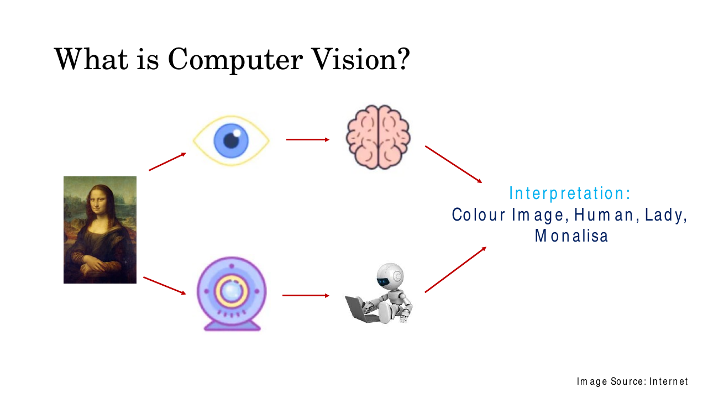
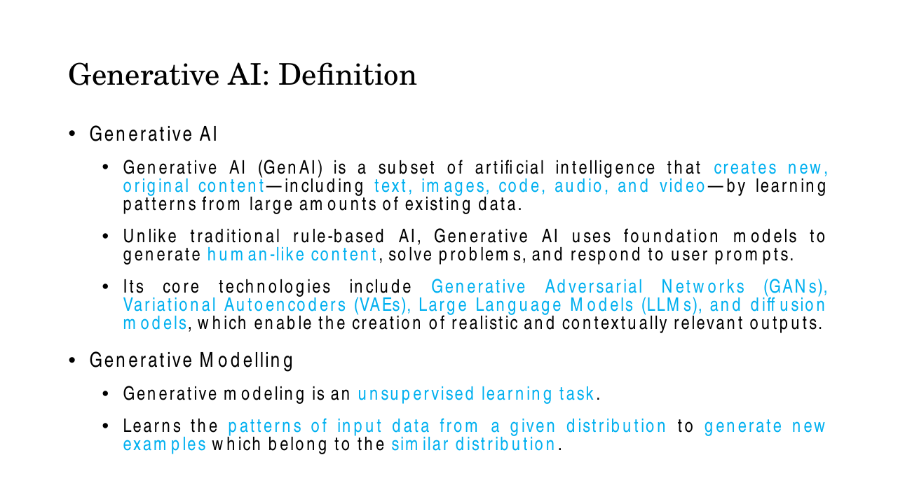
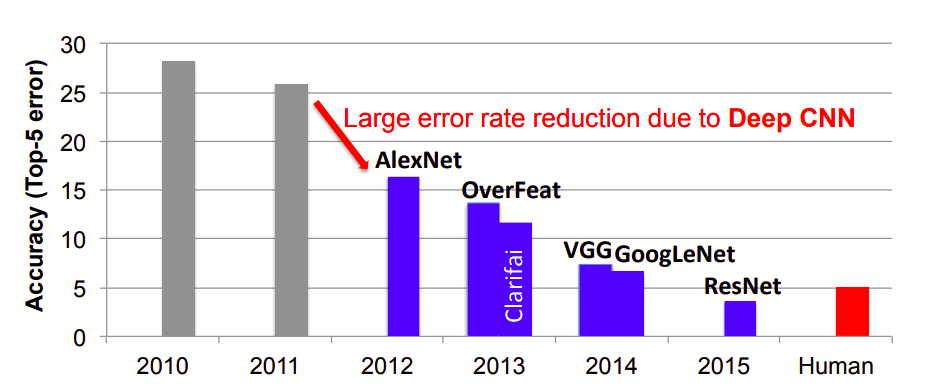
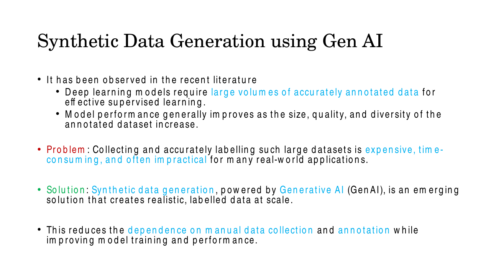
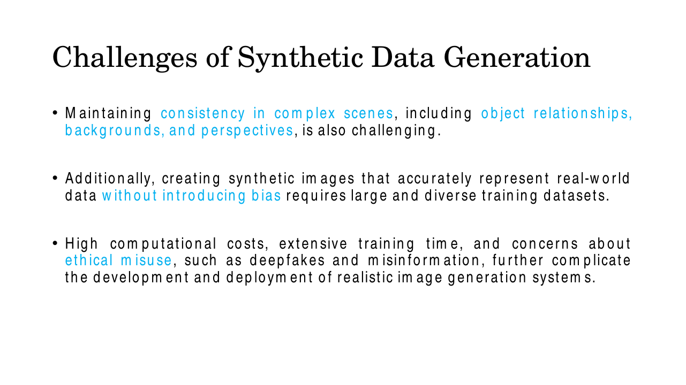
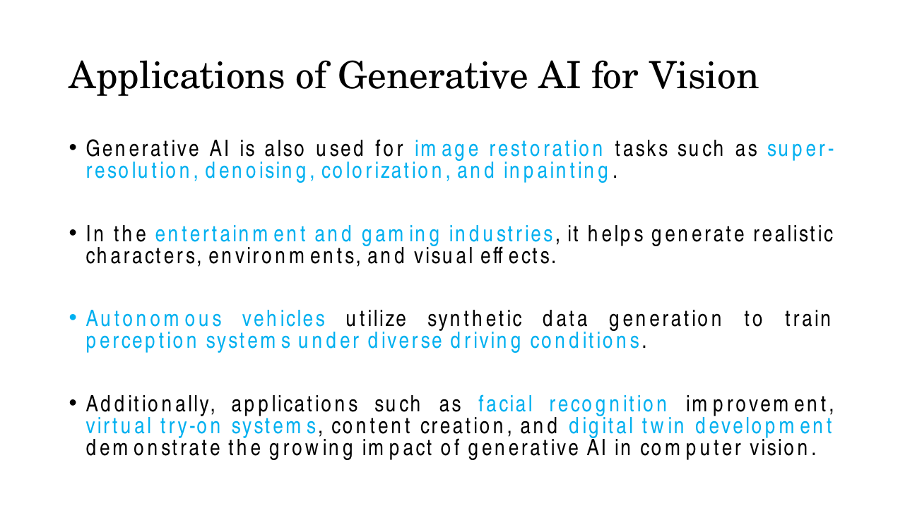

 # Lec 1 — Introduction: Computer Vision and Generative AI

> **Deck:** `L1P1_Introduction.pptx` · **Week 1** · **Playlist:** Lec 1
> **Prereqs:** none
> **Feeds into:** [Lec 2 — Generative vs Discriminative](02-generative-vs-discriminative.md), [Lec 20 — GenAI Vision Tasks I](../week-05/20-genai-vision-tasks-1.md)

## Why this lecture exists

This is the first chapter, so nothing precedes it — but something does motivate it. A course called
"Generative AI for Computer Vision" has to answer an obvious objection before it can start: computer
vision already works. Networks classify images better than people do. So why spend twelve weeks
learning to *make* images instead of *reading* them?

The lecture answers that in one move. It shows you a chart of ImageNet error rates falling from 28.2%
to 3.6% in five years, points out that there is almost nothing left to win there, and then names the
thing that is actually scarce: not models, not compute, but **labelled data**. Generation is how you
manufacture the data that supervised learning is starving for. Everything else in the course is
machinery for that claim.

## The ideas

### What computer vision is

**Computer vision** is the field that gets a machine to extract meaning from visual data. The deck
frames it as a deliberate parallel with human sight, and the parallel is the whole definition.


*Fig. — Two sensors, two processors, one output. The target is not the pixels, it is the list of statements on the right. Slide 3.*

Read the two rows:

| | Sensor | Processor | Output |
|---|---|---|---|
| Human | eye | brain | interpretation |
| Machine | camera | computer | interpretation |

Both paths end at the same place — the **interpretation**, which for the Mona Lisa the deck writes
out as *"Colour Image, Human, Lady, Monalisa"*. Notice that this is a list, and notice the order. It
runs from the cheapest fact to the most expensive one:

- *Colour image* — a property of the raw signal. Three channels, not one.
- *Human* — object category. A classifier gets this.
- *Lady* — a finer attribute of the detected object.
- *Monalisa* — identity. This needs world knowledge no single image contains.

That ladder is the point. The camera gives you a grid of numbers; everything above "colour image" is inference the machine has to *add*. Computer vision is the business of climbing that ladder, and the rungs get harder as you go up. Hold on to the framing, because the course is about to invert it:
having spent decades going image → interpretation, generative models run the arrow backwards, interpretation → image.

### Generative AI, defined

Slide 4 gives the course's own definition. Learn it in these words — the exam will use them.


*Fig. — Two separate definitions on one slide. "Generative AI" is the field; "generative modelling" is the learning task. Do not merge them. Slide 4.*

> **Generative AI (GenAI)** is a subset of artificial intelligence that creates new, original
> content — including **text, images, code, audio, and video** — by learning patterns from large
> amounts of existing data.

Three load-bearing phrases. *Subset of artificial intelligence* — GenAI is a part of AI, not a rival
to it. *New, original content* — the output did not exist in the training set; this is what separates
generation from retrieval. *By learning patterns from existing data* — it is learned, not programmed,
which is exactly how the deck contrasts it with **traditional rule-based AI**. GenAI instead uses
**foundation models** to generate human-like content, solve problems and respond to user prompts.

The deck names four **core technologies**: GANs, VAEs, LLMs and diffusion models. Memorise that
four-item list; "which of these is *not* listed as a core technology of GenAI" is a free mark. The
model zoo itself belongs to [Lec 3](03-generative-vision-models.md).

The second definition is narrower and more technical:

> **Generative modelling** is an **unsupervised** learning task. It learns the patterns of input data
> from a given distribution to generate new examples which belong to a **similar** distribution.

Two traps live in that sentence. First, *unsupervised* — generative modelling needs no labels, which
is precisely why it can relieve the labelling bottleneck. Second, *similar*, not *identical*: a
generator that reproduced its training images exactly would have memorised, not learned. The formal
version of "learns the distribution" — $p(\mathbf{x})$ versus $p(y \mid \mathbf{x})$ — is
[Lec 2](02-generative-vs-discriminative.md)'s to derive.

### Why now: supervised classification is largely solved


*Fig. — The red bar is the human benchmark at 5.1%. The 2015 bar is below it. Note the y-axis is mislabelled "Accuracy (Top-5 error)" — the bars are **error**, so lower is better. Slide 5.*

Read the bars:

| Year | Winner | Top-5 error (%) |
|---|---|---|
| 2010 | shallow (hand-crafted features) | 28.2 |
| 2011 | shallow | 25.8 |
| 2012 | **AlexNet** — first deep CNN | 16.4 |
| 2013 | OverFeat 13.6 / **Clarifai** 11.7 | 11.7 |
| 2014 | VGG 7.3 / **GoogLeNet** 6.7 | 6.7 |
| 2015 | **ResNet** | 3.6 |
| — | **human** | 5.1 |

**Top-5 error** is the fraction of test images whose true label is not among the model's five highest-
scoring guesses. The grey bars are pre-deep-learning; the blue bars are CNNs; the red bar is a human.

Three readings matter. The **2011 → 2012 cliff** is the arrival of deep CNNs: 25.8 to 16.4, a 36.4%
relative cut in one year, and the red arrow on the slide is pointing at exactly this. The **2015
crossing** puts ResNet at 3.6% against a human's 5.1% — the machine is now 29.4% *better* than the
person. And the **headroom** is gone: 24.6 of the original 28.2 points have already been taken, so no
amount of further work on classification can buy more than 3.6 points.

That is the argument for the course. When a task is solved, the frontier moves. It moves to the
things supervision cannot do — and to the resource that made supervision work in the first place.
The full year-by-year ILSVRC timeline is [Lec 14](../week-04/14-resnet.md)'s.

### The synthetic-data argument


*Fig. — The deck's own problem/solution framing. Reproduce this three-beat structure in a short-answer question and you have the marks. Slide 6.*

The chain has three links.

**Observation.** Deep models require *large volumes of accurately annotated data*. Performance
generally improves as the **size, quality and diversity** of the annotated set increase — three
properties, all needed, and an MCQ will drop one.

**Problem.** Collecting and accurately labelling such datasets is **expensive, time-consuming, and
often impractical**. Note which word is doing the work: *annotated*. Raw images are nearly free — a
dashcam produces thousands an hour. Pixel-accurate segmentation masks for those images are not. N2
below prices this out.

**Solution.** **Synthetic data generation**, powered by GenAI, creates realistic, **labelled** data at
scale, reducing dependence on manual collection and annotation.

The word that justifies the whole field is *labelled*. When a generator draws a car, it already knows
where the car is — the label falls out of the generative process for free. You are not just
manufacturing images, you are manufacturing *supervision*, and supervision was the bottleneck.

### Challenges of synthetic data generation

Slides 9–10 list seven. Learn all seven as a set; this is the deck's most MCQ-dense content.


*Fig. — The second half of the challenges list. The last bullet bundles three distinct items — cost, training time, and ethical misuse. Slide 10.*

| # | Challenge | What exactly goes wrong |
|---|---|---|
| 1 | **Visual fidelity** | Fine details, textures and natural lighting are not preserved |
| 2 | **Artifacts and distortions** | Unrealistic features that cut image quality (the classic six-fingered hand) |
| 3 | **Mode collapse** | The model generates limited variations — diversity fails, not realism |
| 4 | **Scene consistency** | Object relationships, backgrounds and perspectives stop agreeing in complex scenes |
| 5 | **Bias** | Representing real-world data faithfully requires a large *and diverse* training set |
| 6 | **Computational cost** | High compute and extensive training time |
| 7 | **Ethical misuse** | Deepfakes and misinformation |

Separate 1–2 from 3 carefully, because the exam does. Fidelity and artifacts are about whether *one*
image looks real. **Mode collapse** is about whether a *set* of images is varied: a generator stuck
producing the same convincing face a thousand times has perfect fidelity and has failed completely.
N4 measures it. And note the pairing in row 5 — bias is not cured by *more* data, it is cured by more
*diverse* data.

### Applications

A preview only; [Lec 20](../week-05/20-genai-vision-tasks-1.md) and
[Lec 21](../week-05/21-genai-vision-tasks-2.md) treat these properly.


*Fig. — The second applications slide. Super-resolution, denoising, colorization and inpainting are grouped under one umbrella term: image restoration. Slide 12.*

- **Image synthesis** — realistic images from text descriptions or existing visual inputs.
- **Medical imaging** — reconstruction, enhancement, and synthetic medical data for training diagnostic systems.
- **Data augmentation** — artificial images that improve model performance and robustness.
- **Image restoration** — the umbrella term for super-resolution, denoising, colorization and inpainting.
- **Entertainment and gaming** — characters, environments, visual effects.
- **Autonomous vehicles** — synthetic training data for perception under diverse driving conditions.
- **Facial recognition improvement**, **virtual try-on**, **content creation**, **digital twins**.

The deck separately names four transformed industries: **healthcare, autonomous driving,
entertainment, surveillance**.

## Worked numericals

This lecture carries no equations, so the exam's numerical questions here are arithmetic on the chart
and on the labelling-cost argument. All four below use numbers the deck either shows or implies.

### N1. Relative error reduction between two ILSVRC years
**Given:** top-5 error of 25.8% (2011) and 16.4% (2012, AlexNet), from slide 5.
**Find:** the absolute and relative reductions; repeat for 2010 → 2015.

1. Absolute reduction $= 25.8 - 16.4 = 9.4$ percentage points.
2. Relative reduction $= \dfrac{25.8 - 16.4}{25.8} = \dfrac{9.4}{25.8} = 0.3643 \to 36.4\%$.
3. For 2010 → 2015: $28.2 \to 3.6$, so absolute $= 24.6$ points.
4. Relative $= \dfrac{24.6}{28.2} = 0.8723 \to 87.2\%$.
5. As a factor: $28.2 / 3.6 = 7.83$ — error fell $7.8\times$.
6. Headroom remaining after 2015: only $3.6$ of the original $28.2$ points, i.e. $12.8\%$ of the problem is left.

**Answer:** AlexNet cut error by **9.4 points = 36.4% relative**; 2010→2015 cut it by
**24.6 points = 87.2% relative (7.8× lower)**, leaving 3.6 points of headroom. Always state *which*
reduction you computed — the absolute and relative numbers differ and only one is being asked for.

### N2. Annotation cost of a segmentation dataset
**Given:** 50,000 images; pixel-accurate polygon annotation takes 12 min/image; annotators cost
₹250 per hour; a team of 10 works 6 productive hours a day.
**Find:** total annotator-hours, cost, and calendar time.

1. Total minutes $= 50{,}000 \times 12 = 600{,}000$ min.
2. Hours $= 600{,}000 / 60 = 10{,}000$ annotator-hours.
3. Cost $= 10{,}000 \times 250 = ₹25{,}00{,}000$ (₹2.5 million).
4. Team throughput $= 10 \times 6 = 60$ hours/day.
5. Calendar time $= 10{,}000 / 60 = 166.7 \approx \mathbf{167}$ working days ($\approx$ 8 months).
6. Compare image-level classification labels at 10 s each: $50{,}000 \times 10 = 500{,}000$ s $= 138.9$ h, costing ₹34,722.

**Answer:** **10,000 hours, ₹25 lakh, ~167 working days.** Segmentation labels cost
$10{,}000 / 138.9 = \mathbf{72\times}$ more than classification labels on the same images — which is
why the label bottleneck bites hardest exactly where the task is hardest.

### N3. Break-even point for synthetic data
**Given:** training a generator takes 500 GPU-hours at ₹150/GPU-hour; sampling takes 0.8 s of GPU time
per image. Manual annotation costs as in N2.
**Find:** per-image costs and the break-even dataset size.

1. Fixed cost $= 500 \times 150 = ₹75{,}000$ (paid once, regardless of how many images you draw).
2. Marginal synthetic cost $= 0.8 \times 150/3600 = ₹0.0333$ per image.
3. Marginal manual cost $= 12 \times 250/60 = ₹50.00$ per image.
4. Break-even: $75{,}000 = N\,(50.00 - 0.0333) \implies N = 75{,}000/49.967 = 1501$ images.
5. At the N2 scale: synthetic total $= 75{,}000 + 50{,}000(0.0333) = ₹76{,}667$ versus ₹25,00,000 manual.

**Answer:** Break-even at **~1,500 images**; at 50,000 images synthetic data is
$25{,}00{,}000 / 76{,}667 = \mathbf{32.6\times}$ cheaper. The structural point: manual labelling has a
cost **linear in $N$**, generation has a large fixed cost and a near-zero marginal cost. That is the
entire economic case for the field.

### N4. Quantifying mode collapse
**Given:** a 10-class problem. Real data is uniform (0.10 per class). A collapsed generator produces
class proportions $[0.46, 0.46, 0.01, 0.01, \ldots]$ (eight classes at 0.01).
**Find:** the entropy of each and the effective number of modes, $2^{H}$.

1. Real: $H = -\sum_i p_i\log_2 p_i = -10(0.1)\log_2 0.1 = \log_2 10 = 3.322$ bits.
2. Effective modes $= 2^{3.322} = 10.0$. ✓ — matches the 10 true classes.
3. Generated, heavy terms: $-2 \times 0.46\log_2 0.46 = 2 \times 0.46 \times 1.1203 = 1.0307$.
4. Light terms: $-8 \times 0.01\log_2 0.01 = 8 \times 0.01 \times 6.6439 = 0.5315$.
5. $H = 1.0307 + 0.5315 = 1.562$ bits.
6. Effective modes $= 2^{1.562} = 2.95$.

**Answer:** The generator covers **~3.0 of 10 modes** — a 70% loss of diversity, with every single
sample still potentially photorealistic. This is the number that proves fidelity and diversity are
independent failures.

## Code

```python
import numpy as np

# --- 1. ILSVRC top-5 error, read off the slide-5 bar chart ---------------
err = {"2010": 28.2, "2011": 25.8, "2012": 16.4, "2013": 11.7,
       "2014": 6.7,  "2015": 3.6,  "human": 5.1}

def rel_drop(a, b):           # percentage reduction going from a to b
    return (a - b) / a * 100.0

print(f"2011->2012 absolute : {err['2011']-err['2012']:.1f} points")
print(f"2011->2012 relative : {rel_drop(err['2011'], err['2012']):.1f} %")
print(f"2010->2015 relative : {rel_drop(err['2010'], err['2015']):.1f} %")
print(f"2010/2015 ratio     : {err['2010']/err['2015']:.2f}x")
print(f"ResNet vs human     : {rel_drop(err['human'], err['2015']):.1f} % below human")
# 2011->2012 absolute : 9.4 points
# 2011->2012 relative : 36.4 %
# 2010->2015 relative : 87.2 %
# 2010/2015 ratio     : 7.83x
# ResNet vs human     : 29.4 % below human

# --- 2. labelling cost, and the synthetic break-even ---------------------
N, min_per_im, rate = 50_000, 12.0, 250.0
hours = N * min_per_im / 60.0
print(f"\nannotator-hours {hours:,.0f}  cost {hours*rate:,.0f}  "
      f"days {hours/(10*6):.1f}")
# annotator-hours 10,000  cost 2,500,000  days 166.7

fixed      = 500 * 150.0            # GPU-hours to train the generator
per_syn    = 0.8 * 150.0 / 3600.0   # 0.8 s of GPU time per sample
per_manual = min_per_im * rate / 60.0
print(f"break-even at {fixed/(per_manual-per_syn):.0f} images; "
      f"{N} synthetic cost {fixed + N*per_syn:,.0f}")
# break-even at 1501 images; 50000 synthetic cost 76,667

# --- 3. mode collapse as a drop in effective mode count ------------------
H = lambda p: -np.sum(p * np.log2(p))
p_real = np.full(10, 0.10)
p_gen  = np.array([0.46, 0.46] + [0.01] * 8)
for name, p in [("real", p_real), ("collapsed", p_gen)]:
    print(f"{name:>9}: H = {H(p):.3f} bits -> {2**H(p):.2f} effective modes")
#      real: H = 3.322 bits -> 10.00 effective modes
# collapsed: H = 1.562 bits -> 2.95 effective modes
```

## Exam pack

### Must-memorise

| Item | Exactly this |
|---|---|
| Computer vision | Extracting interpretation from visual data; camera + computer mirrors eye + brain |
| Slide-3 interpretation | "Colour Image, Human, Lady, Monalisa" |
| **Generative AI** | A **subset of AI** that creates **new, original content** — text, images, code, audio, video — by **learning patterns from large amounts of existing data** |
| GenAI vs traditional AI | Traditional AI is **rule-based**; GenAI uses **foundation models** |
| Core technologies (4) | **GANs, VAEs, LLMs, diffusion models** |
| **Generative modelling** | An **unsupervised** learning task; learns patterns of input data from a given distribution to generate new examples belonging to a **similar** distribution |
| Data observation | Performance improves with **size, quality and diversity** of the annotated dataset |
| The Problem | Collecting and labelling large datasets is **expensive, time-consuming, often impractical** |
| The Solution | **Synthetic data generation** creates realistic, **labelled** data **at scale** |
| Challenges (7) | fidelity · artifacts/distortions · **mode collapse** · scene consistency · bias · compute cost & training time · ethical misuse (deepfakes, misinformation) |
| Mode collapse | The model generates **limited variations** of outputs — a **diversity** failure, not a realism failure |
| Industries transformed (4) | healthcare, autonomous driving, entertainment, surveillance |

### Numbers worth knowing

| Quantity | Value |
|---|---|
| ILSVRC top-5 error 2010 | 28.2% |
| ILSVRC top-5 error 2011 | 25.8% |
| 2012 — AlexNet | 16.4% |
| 2013 — OverFeat / Clarifai | 13.6% / 11.7% |
| 2014 — VGG / GoogLeNet | 7.3% / 6.7% |
| 2015 — ResNet | 3.6% |
| Human benchmark | 5.1% |
| First year a CNN won | 2012 (AlexNet) |
| First year the winner beat the human | 2015 (3.6% < 5.1%) |
| 2011→2012 relative error cut | 36.4% |
| 2010→2015 relative error cut | 87.2% (7.8×) |
| Core GenAI technologies listed | 4 |
| Challenges listed | 7 |

### Likely MCQ traps

- **"Top-5 error of 3.6% means 3.6% accuracy."** No — it is *error*, so accuracy is 96.4%. The slide's
  y-axis says "Accuracy (Top-5 error)", which is a genuine mislabel on the deck; the bars go **down**
  over time, so they are error. Lower is better.
- **Top-5 vs top-1.** Top-5 error counts an image wrong only if the true label is absent from all five
  top guesses. Top-5 error is always $\le$ top-1 error for the same model.
- **"Generative modelling is supervised."** The deck says **unsupervised**, explicitly. The confusion
  comes from the fact that its *output* is used for supervised training.
- **"Generative AI reproduces the training distribution exactly."** The wording is **similar**
  distribution, and the content is **new, original**. Exact reproduction is memorisation.
- **Mode collapse confused with artifacts.** Artifacts = each image looks wrong. Mode collapse = all
  images look the same. A model can have zero artifacts and total mode collapse.
- **"Bias is fixed by collecting more data."** The slide says large **and diverse**. More of the same
  skewed data makes the bias worse, not better.
- **"Reinforcement learning / expert systems is a core GenAI technology."** The listed four are GANs,
  VAEs, LLMs, diffusion models. Anything else in the options is the distractor.
- **"The bottleneck is collecting images."** It is **annotating** them. Raw image capture is cheap;
  accurate labels are not (N2: 72× difference between mask and class labels).
- **"Super-resolution is a separate application from image restoration."** The deck groups
  super-resolution, denoising, colorization and inpainting *under* restoration.
- **"The human bar is the best bar on the chart."** It is 5.1%, which ResNet's 3.6% beats.

### Self-test

1. State the course's definition of Generative AI verbatim, including the five content types.
2. Which four core technologies does the deck name?
3. Is generative modelling supervised or unsupervised? Why does this matter for the data-bottleneck argument?
4. Give the top-5 error for 2010, 2012 and 2015, and name the 2012 and 2015 winners.
5. Compute the relative error reduction from 2013 (11.7%) to 2014 (6.7%).
6. State the Problem and the Solution from slide 6 in the deck's own terms.
7. List all seven challenges of synthetic data generation.
8. A generator produces photorealistic images but 95% of them are the same breed of dog. Which challenge is this, and which two is it *not*?
9. Three properties of an annotated dataset are said to drive performance. Name them.
10. Why does "supervised classification is largely solved" argue *for* studying generation?

<details><summary>Answers</summary>

1. A subset of artificial intelligence that creates new, original content — text, images, code, audio, and video — by learning patterns from large amounts of existing data.
2. GANs, VAEs, LLMs, diffusion models.
3. Unsupervised. It needs no labels to train, yet produces labelled output — so it adds supervision to the system without consuming any.
4. 2010: 28.2%. 2012: 16.4%, AlexNet. 2015: 3.6%, ResNet.
5. $(11.7-6.7)/11.7 = 5.0/11.7 = 0.4274 \to 42.7\%$.
6. Problem: collecting and accurately labelling large datasets is expensive, time-consuming and often impractical. Solution: synthetic data generation powered by GenAI creates realistic, labelled data at scale.
7. Visual fidelity; artifacts/distortions; mode collapse; scene consistency; bias; computational cost and training time; ethical misuse (deepfakes, misinformation).
8. Mode collapse. Not visual fidelity and not artifacts — each individual image is fine.
9. Size, quality, diversity.
10. Because the remaining headroom on classification is 3.6 of 28.2 points, while the input that made those gains possible — labelled data — is still expensive. Generation attacks the bottleneck rather than the solved task.

</details>

## Beyond the slides

**Gap:** The deck never defines **top-5 error**, yet the entire motivating chart is plotted in it.
**Why it matters:** Without the definition you cannot read the chart, and you will fall for the
accuracy-vs-error trap. Top-5 error is the fraction of test images whose true label is not among the
model's five highest-scoring predictions.

**Gap:** The y-axis of the slide-5 chart is labelled "Accuracy (Top-5 error)" — a mislabel the course
carries over from its source.
**Why it matters:** Treat the bars as error, always. The caption underneath ("Top-5 classification
error in test set") is the correct reading, and the downward trend confirms it.

**Gap:** The deck asserts that synthetic data improves performance but never mentions the
**sim-to-real gap** or **model collapse** from training on generated output.
**Why it matters:** Synthetic data is not free accuracy. A generator trained on $\mathcal{D}$ cannot
add information that is not in $\mathcal{D}$; train repeatedly on your own output and quality degrades.
Synthetic data buys *coverage and balance*, especially of rare cases — not new information.

**Gap:** "GenAI is unsupervised" sits unreconciled next to "it creates labelled data".
**Why it matters:** These are different stages. *Training* the generator is unsupervised. *Using* it,
you condition on a label or read the label off the generative process, so the output arrives
pre-annotated. Both statements are true at once, and an exam may try to set them against each other.

## Cut from the slides

Dropped the title slide (1), the "Content" roadmap (2), the identical "Summary" slide (13) and the
"Next" slide (14) — pure navigation, and slides 2 and 13 are the same four bullets twice. Slides 7–8
are a two-slide prose block on "Generative AI for Computer Vision" that restates slide 4's definition
plus slide 6's synthetic-data claim and then previews the applications of slides 11–12; its only
non-duplicated content — the four transformed industries and the "improves accuracy and robustness
while reducing the need for large labeled datasets" claim — has been folded into the synthetic-data
and applications sections rather than reproduced. Slides 9 and 10 are one continuous challenges list
split across two slides and are merged into a single seven-row table. Slides 11 and 12 are likewise
one applications list and are merged; per the ownership map each entry stays a one-liner, with the
per-task treatment left to [Lec 20](../week-05/20-genai-vision-tasks-1.md) and
[Lec 21](../week-05/21-genai-vision-tasks-2.md). The four decorative icons extracted from slide 3
(eye, brain, webcam, robot) are not embedded individually — the whole slide carries the diagram.
Nothing conceptual was dropped.
