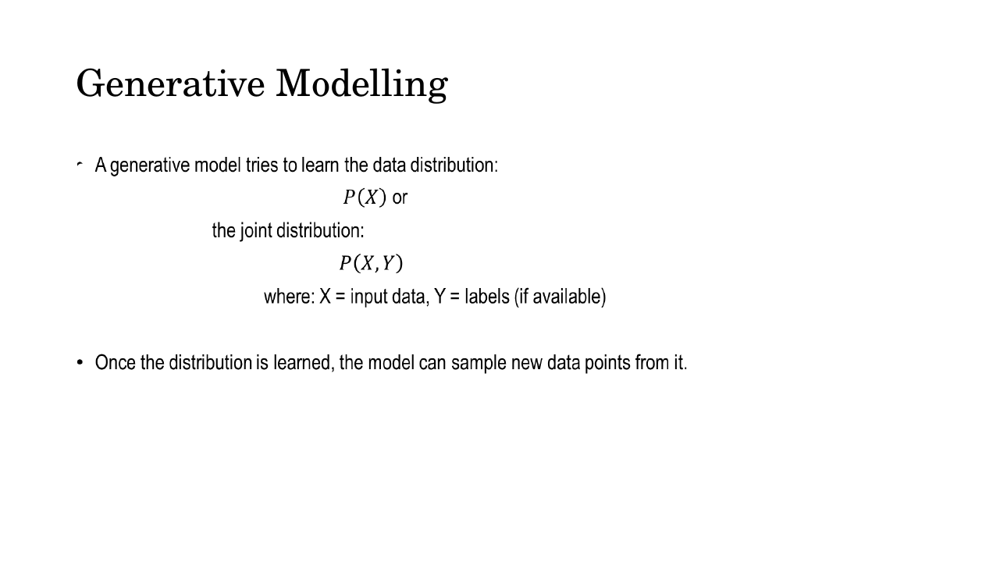
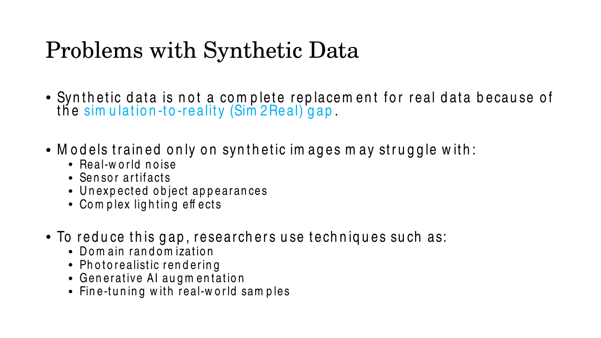
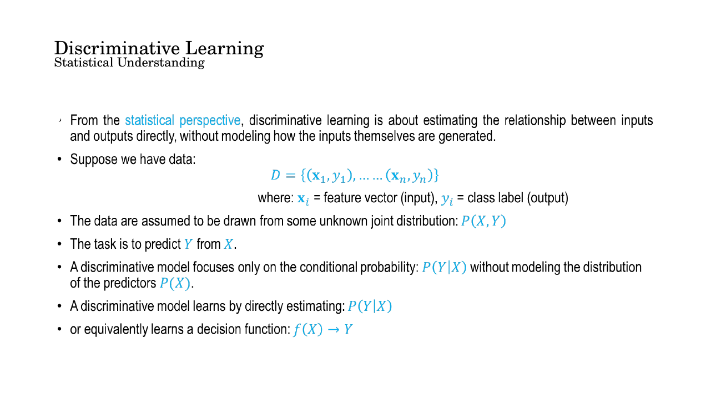
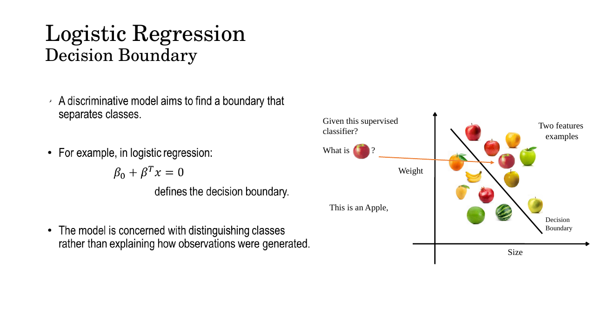
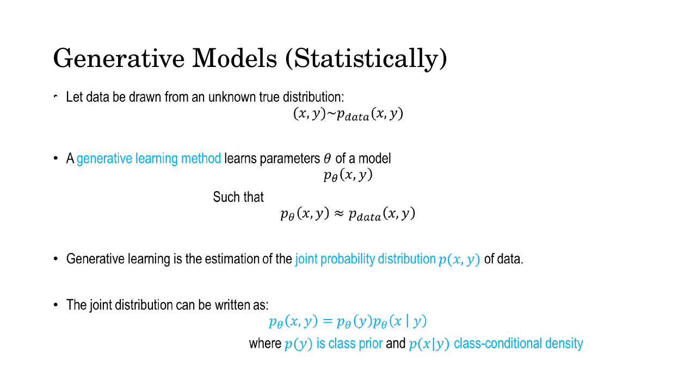
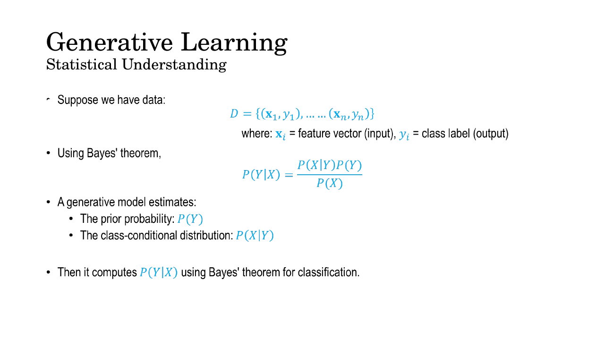
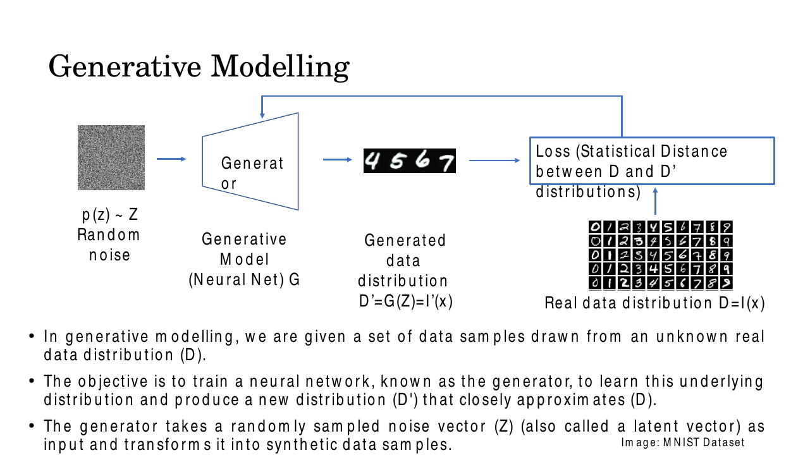
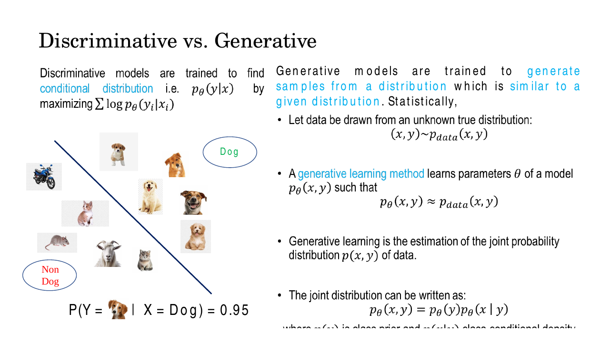

# Lec 2 — Generative Modelling: Generative vs Discriminative Learning

> **Deck:** `L1P2_Generative Modelling.pptx` · **Week 1** · **Playlist:** Lec 2
> **Prereqs:** [Lec 1 — Introduction to CV and Generative AI](01-intro-cv-and-genai.md)
> **Feeds into:** [Lec 3 — Generative Vision Models](03-generative-vision-models.md), [Lec 22 — Generative Taxonomy and MLE](../week-06/22-generative-taxonomy-and-mle.md)

## Why this lecture exists

Lecture 1 told you that generative AI for vision is a field. This lecture tells you what the word
*generative* actually means, and it does so by contrast: there is another way to learn from labelled
data, and almost everything you have met before — the classifier you trained with `sklearn`, logistic
regression, a CNN that outputs "cat" — belongs to that other way. The split between the two is the
single most examinable idea in the course, because every model family in weeks 6 to 12 sits on one
side of it. The lecture also answers a question you should be asking: why bother *making* images at
all, when the point of computer vision is to understand them? The answer is that labelled real data is
expensive, biased, dangerous to collect and legally fraught, and synthetic data fixes all four.

## The ideas

### What generative modelling is

The deck's own definition, worth having verbatim:

> **Generative Modelling** is a branch of machine learning that focuses on learning the underlying
> probability distribution of data so that new, realistic samples can be generated.

Unpack it with the deck's example. You have thousands of photographs of cats. A generative model
learns the *patterns, structure and variations* in those images — what fur looks like, that eyes come
in pairs, how a cat's silhouette bends. After training it can produce entirely new cat images that
were never in the dataset. A discriminative model given the same photographs plus some dog photographs
learns only to tell the two apart; it can never draw a cat.

Formally, a generative model learns either the data distribution $p(\mathbf{x})$ or the joint
distribution $p(\mathbf{x}, y)$ of data and labels, and **once the distribution is learned, the model
can sample new data points from it**. That last clause is the whole point: a distribution you can
sample from is a machine for making data.


*Fig. — Note the "(if available)" next to labels. Generative models are, in the deck's words, **generally unsupervised in nature** — they can be trained on unlabelled images alone, learning $p(\mathbf{x})$. That is why they scale to data that no one has annotated. Slide 4.*

### Why synthetic images are needed at all

Supervised vision works. It works *given* large, accurately annotated image datasets — and that
condition is where the cost lives. Collecting and labelling real visual data is expensive, slow,
difficult, and sometimes impossible. The deck gives six reasons synthetic data earns its place, plus
one workflow that combines synthetic and real.

**1. It reduces data-collection and annotation cost.** The labelling work is measured in thousands of
human hours: drawing bounding boxes around pedestrians across millions of video frames, labelling lane
markings for autonomous driving, segmenting organs in medical scans. A renderer, by contrast, *already
knows* where every object is, so it emits the labels for free at render time.


*Fig. — Every one of these boxes was dragged by a human. Multiply by millions of frames; numerical N1 puts a price on it. Slide 6.*


*Fig. — Organ segmentation needs a radiologist, not a crowdworker — the same labour argument but with a far higher hourly rate. Slide 6.*

**2. It provides perfect ground truth.** When a scene is generated in a simulator, the exact object
locations, object identities, depth, surface normals, segmentation masks and camera poses are *already
known* — they are inputs to the renderer, not estimates from it. Depth and surface normals in
particular are nearly impossible to annotate accurately by hand on real images.

**3. It solves rare-event problems.** Some situations matter enormously and occur almost never: car
accidents, a pedestrian suddenly stepping into the road, industrial equipment failures, severe
weather. You cannot wait for them, and you certainly cannot stage them. A synthetic environment
generates thousands of such scenarios on demand.

**4. It improves diversity and mitigates bias.** Real datasets over-represent whichever geographic
region, weather, lighting and demographic the collection team had access to. Synthetic generation lets
you *systematically vary* rain, fog and snow; time of day; camera viewpoint; object appearance. The
variation is controlled rather than hoped for, which is what makes models generalise.

**5. It enables safe training for dangerous applications.** Autonomous-vehicle crashes, military
reconnaissance, disaster-response robotics, drone emergency landings — collecting this data in reality
risks lives and equipment. Simulation generates it safely.

**6. It helps when privacy is a concern.** Healthcare, surveillance and retail-analytics images
contain identifiable people. Synthetic data can mimic the *statistical properties* of the real data
without exposing any actual individual, which sidesteps the consent and regulation problem entirely.

**Plus: domain adaptation.** The deck names the standard workflow that glues synthetic and real
together — *train on a large synthetic dataset, then fine-tune on a smaller real one*. This reduces
the amount of real labelled data you need while keeping performance high, and it is how synthetic data
is actually used in practice. You almost never train on synthetic data alone.

### Where synthetic data breaks: the Sim2Real gap

Synthetic data is **not** a complete replacement for real data, and the reason has a name: the
**simulation-to-reality (Sim2Real) gap**. A model trained only on rendered images has never seen real
sensor noise, sensor artefacts, unexpected object appearances, or genuinely complex lighting — so it
fails on exactly those. The renderer's world is too clean.

Four mitigations, all named on the slide:

| Technique | What it does |
|---|---|
| **Domain randomization** | Deliberately randomise textures, lighting, colours and object placement so wildly that the real world looks like just another random sample. The model stops relying on simulator-specific cues. |
| **Photorealistic rendering** | Push the simulator towards reality — ray tracing, physically-based materials, simulated sensor noise — so the gap is smaller to begin with. |
| **Generative AI augmentation** | Use a generative model (the subject of the rest of this course) to make synthetic images look real, or to translate rendered frames into photographic ones. |
| **Fine-tuning with real-world samples** | The domain-adaptation workflow above: a small real dataset at the end anchors the model to reality. |

Notice that domain randomization and photorealistic rendering pull in *opposite directions* — one
makes the simulator less realistic on purpose, the other more realistic at great cost. Both work, for
different reasons. That contrast is good MCQ bait.


*Fig. — Memorise the four mitigations as a set; the exam is likelier to ask "which of these is **not** a Sim2Real mitigation" than to ask what any one of them does. Slide 11.*

### Two kinds of learning model

There are two types of learning model, and the difference is *what quantity they estimate*.

- A **discriminative learning model** learns by discrimination — the boundary or relationship between
  input features and output labels. It does not model how the data was generated; it directly predicts
  the target class from the observed data.
- A **generative learning model** learns *how the data is generated*. Instead of only learning the
  input–label relationship, it learns the underlying probability distribution of the data.

Everything below makes those two sentences precise.

### Discriminative learning, formally

Start with the setup both sides share. You have a dataset

$$\mathcal{D} = \{(\mathbf{x}_1, y_1), \ldots, (\mathbf{x}_n, y_n)\}$$

where $\mathbf{x}_i$ is a feature vector (the input) and $y_i$ is a class label (the output). The data
are assumed drawn from some unknown joint distribution $p(\mathbf{x}, y)$. The task is to predict $y$
from $\mathbf{x}$.

A discriminative model **focuses only on the conditional probability $p(y \mid \mathbf{x})$, without
modelling the distribution of the predictors $p(\mathbf{x})$.** It learns by directly estimating

$$p(Y = y \mid X = \mathbf{x})$$

from the training data, or equivalently by learning a decision function $f(\mathbf{x}) \to y$.


*Fig. — The load-bearing phrase is "**without modeling the distribution of the predictors $p(X)$**". That omission is the definition of discriminative, and it is also exactly why such a model cannot generate. Slide 14.*

The deck's worked case is **logistic regression**. A discriminative model aims to find a *boundary*
that separates classes, and in logistic regression that boundary is the set of points where

$$\beta_0 + \boldsymbol{\beta}^\top\mathbf{x} = 0$$

Everything on one side is class 1, everything on the other is class 0. The model is concerned with
distinguishing the classes rather than explaining how the observations were generated.


*Fig. — Two features (size, weight), one line. Asked "what is this?" about the new red fruit, the model answers "an Apple" by checking which side of the line it fell on. It has no opinion whatsoever about where fruits **tend** to lie — only about where the line goes. Slide 15.*

The deck also offers **linear regression** as the simplest discriminative example: data pairs drawn
from an unknown $p(\mathbf{x}, y)$, and a hypothesis function $h$ fitted so that $h(\mathbf{x})
\approx y$ for new pairs. Same philosophy, continuous output. Discriminative learning is supervised by
construction — it needs the labels, because $p(y\mid\mathbf{x})$ is meaningless without them.

### Generative learning, formally

Same dataset $\mathcal{D}$, same unknown $p_{\text{data}}(\mathbf{x}, y)$. A generative learning method
learns parameters $\theta$ of a model $p_\theta(\mathbf{x}, y)$ such that

$$p_\theta(\mathbf{x}, y) \approx p_{\text{data}}(\mathbf{x}, y)$$

That is the entire objective: **generative learning is the estimation of the joint probability
distribution $p(\mathbf{x}, y)$ of the data.** The joint factorises as

$$p_\theta(\mathbf{x}, y) = p_\theta(y)\,p_\theta(\mathbf{x} \mid y)$$

where $p(y)$ is the **class prior** (how common each class is) and $p(\mathbf{x}\mid y)$ is the
**class-conditional density** (what the data looks like *given* the class). So a generative classifier
estimates two things from the training data — the prior and the class-conditional — and then recovers
the prediction.


*Fig. — $p_\theta(\mathbf{x},y) = p_\theta(y)\,p_\theta(\mathbf{x}\mid y)$ is just the product rule, but reading it left to right is a recipe for sampling: pick a class from the prior, then draw an image from that class's density. Slide 19.*

### Bayes' theorem is the bridge

A generative model does not estimate $p(y\mid\mathbf{x})$. So how does it classify? It *inverts* what
it has, using **Bayes' theorem**:

$$p(y \mid \mathbf{x}) = \frac{p(\mathbf{x} \mid y)\,p(y)}{p(\mathbf{x})}$$

with the denominator obtained by summing the numerator over all classes,
$p(\mathbf{x}) = \sum_{y'} p(\mathbf{x}\mid y')p(y')$. Read the three pieces: the **likelihood**
$p(\mathbf{x}\mid y)$ and the **prior** $p(y)$ are what the generative model learned; $p(\mathbf{x})$
is a normaliser that makes the posterior sum to 1 — and since it does not depend on $y$, you can skip
it entirely if you only need the *argmax*.


*Fig. — This is the single most important slide in the lecture. Both model families end up producing $p(y\mid\mathbf{x})$; the discriminative one estimates it directly, the generative one **assembles** it from $p(\mathbf{x}\mid y)$ and $p(y)$. Slide 18.*

So the two routes to the same prediction are:

```
discriminative:   data  ──────────────────────────────▶  p(y | x)
generative:       data  ──▶  p(y) and p(x | y)  ──Bayes──▶  p(y | x)
                                   │
                                   └──▶  sample new x    ◀── only this route can do it
```

The generative route takes a detour, and the detour is the payoff: having $p(\mathbf{x}\mid y)$ in
hand, you can *draw from it*. The discriminative model has nothing to draw from.

### The two sides, with model names

| | **Discriminative** | **Generative** |
|---|---|---|
| Learns | $p(y\mid\mathbf{x})$, or a decision function $f(\mathbf{x})\to y$ | $p(\mathbf{x}, y)$, or $p(\mathbf{x})$ alone |
| Models $p(\mathbf{x})$? | No | Yes |
| Geometric picture | the **decision boundary** | the **density** of each class |
| Objective | maximise $\sum_i \log p_\theta(y_i\mid\mathbf{x}_i)$ | make $p_\theta(\mathbf{x},y) \approx p_{\text{data}}(\mathbf{x},y)$ |
| Needs labels? | Always (supervised) | Not necessarily — generally unsupervised |
| Can generate new data? | **No** | **Yes** |
| Typical models | logistic regression, linear regression, SVM, a standard CNN classifier, random forest | naive Bayes, Gaussian mixture model (GMM), VAE, GAN, autoregressive models, diffusion models |

The model-name row is where MCQs live. The discriminator that sits *inside* a GAN is itself a
discriminative classifier — the GAN as a whole is generative because of its generator. A CNN is not
inherently either; a CNN *classifier* is discriminative, a CNN *decoder* inside a VAE is part of a
generative model. The architecture does not decide; the quantity being modelled does.

[Lec 3](03-generative-vision-models.md) surveys the generative families (VAE, GAN, autoregressive,
diffusion, flows) and [Lec 22](../week-06/22-generative-taxonomy-and-mle.md) builds the formal taxonomy
with the maximum-likelihood objective — do not expect either here.

### The generator: noise in, distribution out

The deck's operational picture of a generative model. You are given a set of data samples drawn from
an unknown real data distribution, written $D$ on the slide — I will write $p_{\text{data}}$. The
objective is to train a neural network, the **generator** $G$, to learn that distribution and produce
a new distribution $D' = G(\mathbf{z})$ (I will write $p_g$) that closely approximates it.

The generator takes a randomly sampled **noise vector** $\mathbf{z} \sim p(\mathbf{z})$ — also called
a **latent vector** — and transforms it into synthetic data samples.

```
   z ~ p(z)              G                    D' = G(z)                  D
 ┌───────────┐    ┌─────────────┐      ┌──────────────────┐    ┌──────────────────┐
 │  random   │───▶│  generator  │─────▶│ generated data   │    │ real data        │
 │  noise    │    │ (neural net)│      │ distribution     │    │ distribution     │
 └───────────┘    └─────────────┘      └────────┬─────────┘    └────────┬─────────┘
                         ▲                      │                       │
                         │                      ▼                       ▼
                         │            ┌──────────────────────────────────────────┐
                         └────────────│  Loss = statistical distance(D, D')      │
                            gradients │  e.g. an L1 or L2 norm                   │
                                      └──────────────────────────────────────────┘
```

During training the network is optimised so that the **difference between the real distribution $D$
and the generated distribution $D'$ is minimised**, and the deck says this difference is measured
using *statistical distance metrics such as the L1 norm or L2 norm*. (The norms themselves are
[Lec 4](04-linear-algebra.md)'s material.) As training progresses the generator produces increasingly
realistic samples; after convergence it can generate new samples that follow $p_{\text{data}}$ closely
**while being novel — not identical to any training sample**. That last qualifier matters: a generator
that memorised the training set would score a perfect distance and be worthless.


*Fig. — Follow the arrows: noise → generator → fake digits → loss ← real digits, and the loop back into $G$. Only the generator has trainable weights; the loss block just measures. Slides 20–21.*


*Fig. — The output end of the pipeline: samples of $p_g$, produced from noise, resembling MNIST but drawn by nobody. Slide 20.*

### "0.95 that it's a dog" versus "here is a dog"

The deck's closing contrast, and the cleanest one-line test you can apply in an exam.

- **Discriminative.** Trained to find the conditional distribution $p_\theta(y\mid\mathbf{x})$ by
  maximising $\sum_i \log p_\theta(y_i \mid \mathbf{x}_i)$. Given a photograph, it outputs a number:
  $P(Y = \text{dog} \mid X = \mathbf{x}) = 0.95$. It draws a line between Dog and Non-Dog and reports
  which side you landed on, with what confidence.
- **Generative.** Trained to generate samples from a distribution similar to a given distribution.
  Given the *class* dog, it outputs a photograph: $\mathbf{x} \sim p(\mathbf{x}\mid y=\text{dog})$.

One consumes an image and emits a probability; the other consumes a class (or pure noise) and emits an
image. The conditioning bar runs the opposite way.


*Fig. — The slide writes the discriminative output as "$P(Y = \text{🐕} \mid X = \text{Dog}) = 0.95$", which is a typo on the deck: the thing you condition on is the **image**, and the thing you predict is the **label**, so it should read $P(Y=\text{dog}\mid X=\mathbf{x})=0.95$. Slide 22.*

## Worked numericals

### N1. What annotation actually costs, versus rendering it
**Given:** a pedestrian-detection dataset of 50,000 video frames with an average of 4 pedestrians per
frame. A human annotator takes 7 s to draw and verify one bounding box and is paid ₹250 per hour. The
same 50,000 frames rendered in a simulator take 0.8 s each on a GPU costing ₹120 per hour, and the
simulator emits boxes for free.
**Find:** total labelling cost each way, and the ratio.

1. Boxes needed: $50{,}000 \times 4 = 200{,}000$.
2. Human time: $200{,}000 \times 7\ \text{s} = 1{,}400{,}000\ \text{s}$.
3. In hours: $1{,}400{,}000 / 3600 = 388.89\ \text{h}$.
4. Human cost: $388.89 \times 250 = ₹97{,}222$.
5. GPU time: $50{,}000 \times 0.8\ \text{s} = 40{,}000\ \text{s} = 40{,}000/3600 = 11.11\ \text{h}$.
6. GPU cost: $11.11 \times 120 = ₹1{,}333$.
7. Ratio: $97{,}222 / 1{,}333 = 72.9$.

**Answer:** ₹97,222 real versus ₹1,333 synthetic — about **73× cheaper**, i.e. ₹1.94 per frame against
₹0.027 per frame. And the synthetic boxes are pixel-exact, where the human boxes are not.

### N2. Generative route — naive Bayes classification by hand
**Given:** 12 fruits, each described by two binary features, $x_1 = 1$ if red, $x_2 = 1$ if smooth.

| Class | count | $(1,1)$ | $(1,0)$ | $(0,1)$ | $(0,0)$ |
|---|---|---|---|---|---|
| Apple ($y=1$) | 6 | 4 | 1 | 1 | 0 |
| Orange ($y=0$) | 6 | 0 | 0 | 2 | 4 |

A new fruit arrives with $\mathbf{x} = (x_1{=}0,\ x_2{=}1)$ — not red, smooth.
**Find:** $p(\text{Apple}\mid\mathbf{x})$ by estimating the prior and class-conditionals, then
inverting with Bayes. Assume the two features are conditionally independent given the class (that is
the "naive" assumption).

1. **Priors.** $p(\text{Apple}) = 6/12 = 0.5$, $p(\text{Orange}) = 6/12 = 0.5$.
2. **Class-conditionals for Apple.** Red in 5 of 6 apples $\Rightarrow p(x_1{=}1\mid A) = 5/6$, so
   $p(x_1{=}0\mid A) = 1/6$. Smooth in 5 of 6 $\Rightarrow p(x_2{=}1\mid A) = 5/6$.
3. $p(\mathbf{x}\mid A) = \tfrac16 \times \tfrac56 = \tfrac{5}{36} = 0.1389$.
4. **Class-conditionals for Orange.** Red in 0 of 6 $\Rightarrow p(x_1{=}0\mid O) = 1$. Smooth in 2 of
   6 $\Rightarrow p(x_2{=}1\mid O) = 2/6 = 1/3$.
5. $p(\mathbf{x}\mid O) = 1 \times \tfrac13 = 0.3333$.
6. **Joints.** $p(\mathbf{x}, A) = 0.5 \times \tfrac{5}{36} = \tfrac{5}{72}$;
   $p(\mathbf{x}, O) = 0.5 \times \tfrac13 = \tfrac{1}{6} = \tfrac{12}{72}$.
7. **Evidence.** $p(\mathbf{x}) = \tfrac{5}{72} + \tfrac{12}{72} = \tfrac{17}{72} = 0.2361$.
8. **Posterior.** $p(A\mid\mathbf{x}) = \dfrac{5/72}{17/72} = \dfrac{5}{17} = 0.2941$, so
   $p(O\mid\mathbf{x}) = \dfrac{12}{17} = 0.7059$.

**Answer:** $p(\text{Apple}\mid\mathbf{x}) = 5/17 \approx 0.294$ → **predict Orange.** Note what you had
to estimate: six numbers describing *what fruits look like*, which is why the same model can be run
backwards to invent a plausible orange.

### N3. Discriminative route — logistic regression on the identical data
**Given:** the same 12 fruits. An L2-regularised logistic regression fitted to them (the code block
below reproduces this exactly) gives $\beta_0 = -0.9750$, $\beta_1 = 1.3887$, $\beta_2 = 0.6975$, where
the positive class is Apple.
**Find:** $p(\text{Apple}\mid\mathbf{x})$ for the same query $\mathbf{x} = (0, 1)$.

1. Linear score: $z = \beta_0 + \beta_1 x_1 + \beta_2 x_2 = -0.9750 + 1.3887(0) + 0.6975(1) = -0.2775$.
2. Sigmoid: $\sigma(z) = \dfrac{1}{1 + e^{-z}} = \dfrac{1}{1 + e^{0.2775}}$.
3. $e^{0.2775} = 1.3198$, so $\sigma(z) = \dfrac{1}{2.3198} = 0.4311$.
4. Decision: $0.4311 < 0.5$, so the point is on the Orange side of the boundary
   $\beta_0 + \boldsymbol{\beta}^\top\mathbf{x} = 0$.

**Answer:** $p(\text{Apple}\mid\mathbf{x}) = 0.431$ → **predict Orange.** The *same answer as N2 by
completely different machinery*: three numbers defining a line, no description of what a fruit looks
like anywhere in the model. The posteriors differ (0.294 vs 0.431) because the two models encode
different assumptions, and nothing about this model can be run backwards to produce a fruit.

### N4. Bayes inversion — why a 98%-accurate rare-event detector still mostly cries wolf
**Given:** an emergency-braking event occurs in $0.2\%$ of driving clips, so $p(E) = 0.002$. A detector
fires on $98\%$ of true emergencies, $p(\text{alarm}\mid E) = 0.98$, and false-alarms on $3\%$ of
normal clips, $p(\text{alarm}\mid \neg E) = 0.03$.
**Find:** $p(E \mid \text{alarm})$.

1. Numerator: $p(\text{alarm}\mid E)\,p(E) = 0.98 \times 0.002 = 0.00196$.
2. Other term: $p(\text{alarm}\mid \neg E)\,p(\neg E) = 0.03 \times 0.998 = 0.02994$.
3. Evidence: $p(\text{alarm}) = 0.00196 + 0.02994 = 0.03190$.
4. Posterior: $p(E\mid\text{alarm}) = 0.00196 / 0.03190 = 0.0614$.
5. Now suppose synthetic rare-event training cuts the false-alarm rate to $0.5\%$:
   $0.005 \times 0.998 = 0.00499$; $p(\text{alarm}) = 0.00196 + 0.00499 = 0.00695$;
   posterior $= 0.00196/0.00695 = 0.2820$.

**Answer:** $p(E\mid\text{alarm}) = 6.1\%$ — an alarm is wrong 15 times out of 16, despite $98\%$
sensitivity, because the prior is tiny. Cutting false alarms to $0.5\%$ raises it to $28.2\%$, a $4.6×$
improvement. This is both the Bayes-inversion drill the exam wants and the quantitative case for
generating rare events synthetically: $p(\mathbf{x}\mid y)$ and $p(y)$ are *not* $p(y\mid\mathbf{x})$,
and confusing them is the single most common probability error.

## Code

**Both routes to the same prediction, on the data from N2 and N3.**

```python
import numpy as np

# 12 fruits, two binary features: x1 = is_red, x2 = is_smooth.  y = 1 (apple), 0 (orange)
X = np.array([[1,1]]*4 + [[1,0]] + [[0,1]] + [[0,0]]*4 + [[0,1]]*2, dtype=float)
y = np.array([1.]*6 + [0.]*6)
q = np.array([0., 1.])                      # query fruit: not red, smooth

# ---- GENERATIVE route: naive Bayes -> p(y), p(x|y), then Bayes' rule -------
post = {}
for c in (1., 0.):
    Xc    = X[y == c]
    prior = len(Xc) / len(X)                                        # p(y)
    lik   = np.prod(np.where(q == 1, Xc.mean(0), 1 - Xc.mean(0)))   # p(x|y), features independent
    post[c] = prior * lik                                           # unnormalised p(x, y)
Z = sum(post.values())                                              # p(x) = sum_y p(x, y)
print(f"generative : p(apple|x) = {post[1.]/Z:.4f}   p(orange|x) = {post[0.]/Z:.4f}")

# ---- DISCRIMINATIVE route: logistic regression -> p(y|x) directly ----------
Xb, beta, C = np.hstack([np.ones((12,1)), X]), np.zeros(3), 1.0
for _ in range(200000):                     # L2-regularised gradient descent (bias unpenalised)
    p = 1 / (1 + np.exp(-Xb @ beta))
    beta -= 0.01 * (C * (Xb.T @ (p - y)) + np.array([0., beta[1], beta[2]]))
z = beta[0] + beta[1]*q[0] + beta[2]*q[1]
print(f"beta = {np.round(beta,4)}   z = {z:.4f}")
print(f"discrim.   : p(apple|x) = {1/(1+np.exp(-z)):.4f}   p(orange|x) = {1-1/(1+np.exp(-z)):.4f}")

# ---- only the generative model can be run backwards -----------------------
rng = np.random.default_rng(1)
pa  = X[y == 0].mean(0)                     # p(x1=1|orange), p(x2=1|orange)
print("sampled oranges:", (rng.random((5,2)) < pa).astype(int).tolist())
```

```
generative : p(apple|x) = 0.2941   p(orange|x) = 0.7059
beta = [-0.975   1.3887  0.6975]   z = -0.2776
discrim.   : p(apple|x) = 0.4311   p(orange|x) = 0.5689
sampled oranges: [[0, 0], [0, 0], [0, 0], [0, 0], [0, 1]]
```

The last line is the whole lecture in one output. The naive Bayes model, asked to *invent* oranges,
produces mostly not-red-and-rough fruit with the occasional smooth one — which is what the training
oranges looked like. Ask `beta` to invent a fruit and there is nothing to ask.

**The slide-20 training loop, in miniature.** A generator $G(z) = az + b$ maps noise to a 1-D
"image", trained to minimise an L2 statistical distance against the real distribution.

```python
import numpy as np
rng = np.random.default_rng(0)

real = rng.normal(5.0, 2.0, size=2000)       # real distribution D: mean 5, sd 2
a, b = 1.0, 0.0                              # generator G(z) = a*z + b, deliberately wrong
eta  = 0.05

for step in range(3001):
    z     = rng.normal(0.0, 1.0, size=2000)  # z ~ p(z): the latent noise vector
    fake  = a * z + b                        # D' = G(z)
    rs, fs = np.sort(real), np.sort(fake)    # compare the two distributions, not paired samples
    order = np.argsort(fake)                 # map each sorted fake back to the z that made it
    diff  = fs - rs
    loss  = np.mean(diff ** 2)               # L2 statistical distance between D and D'
    a -= eta * 2 * np.mean(diff * z[order])  # dLoss/da
    b -= eta * 2 * np.mean(diff)             # dLoss/db
    if step % 1000 == 0:
        print(f"step {step:4d}  loss {loss:7.4f}   a {a:6.3f}  b {b:6.3f}")

samp = a * rng.normal(0, 1, 2000) + b
print(f"real  mean {real.mean():.3f}  sd {real.std():.3f}")
print(f"fake  mean {samp.mean():.3f}  sd {samp.std():.3f}")
```

```
step    0  loss 25.4797   a  1.099  b  0.495
step 1000  loss  0.0080   a  2.001  b  4.950
step 2000  loss  0.0072   a  1.999  b  4.944
step 3000  loss  0.0117   a  2.004  b  4.938
real  mean 4.944  sd 2.000
fake  mean 4.954  sd 1.957
```

The generator discovered $a \approx 2$, $b \approx 5$ — it recovered the real distribution's standard
deviation and mean *without ever being told them*, purely by shrinking a statistical distance. Swap
the two scalars for a convolutional network and the 1-D samples for images, and that is the whole idea
behind every model in this course.

## Exam pack

### Must-memorise

| Item | Exactly this |
|---|---|
| Generative modelling (definition) | learning the underlying probability distribution of data so that new, realistic samples can be generated |
| Discriminative model learns | $p(y\mid\mathbf{x})$ directly, or a decision function $f(\mathbf{x})\to y$ |
| Discriminative model does **not** model | $p(\mathbf{x})$, the distribution of the predictors |
| Generative model learns | $p(\mathbf{x})$, or the joint $p(\mathbf{x}, y)$ |
| Generative objective | find $\theta$ with $p_\theta(\mathbf{x},y) \approx p_{\text{data}}(\mathbf{x},y)$ |
| Joint factorisation | $p_\theta(\mathbf{x},y) = p_\theta(y)\,p_\theta(\mathbf{x}\mid y)$ — prior × class-conditional |
| Bayes' theorem | $p(y\mid\mathbf{x}) = \dfrac{p(\mathbf{x}\mid y)\,p(y)}{p(\mathbf{x})}$ |
| Evidence | $p(\mathbf{x}) = \sum_{y'} p(\mathbf{x}\mid y')\,p(y')$ |
| Discriminative objective | maximise $\sum_i \log p_\theta(y_i \mid \mathbf{x}_i)$ |
| Logistic-regression boundary | $\beta_0 + \boldsymbol{\beta}^\top\mathbf{x} = 0$ |
| Generator | $\mathbf{z}\sim p(\mathbf{z})$ → $G$ → $D' = G(\mathbf{z})$, minimise statistical distance to $D$ |
| Distance metrics the deck names | L1 norm, L2 norm |
| Sim2Real mitigations (4) | domain randomization; photorealistic rendering; generative AI augmentation; fine-tuning with real samples |
| Domain-adaptation workflow | train on large synthetic set → fine-tune on small real set |

### Numbers worth knowing

| Quantity | Value |
|---|---|
| Reasons synthetic data is needed, per the deck | **6** (cost, perfect ground truth, rare events, diversity, safety, privacy) + domain adaptation |
| Sim2Real mitigation techniques | **4** |
| Types of learning model on slide 12 | **2** |
| Deck's discriminative output example | $P(Y=\text{dog}\mid X) = 0.95$ |
| Deck's generative pipeline symbols | $D$ = real distribution, $D' = G(Z) = I'(x)$ = generated, $p(z)$ = noise prior |
| Dataset shown in the generator figure | MNIST |
| Features in the fruit decision-boundary example | **2** (size, weight) |
| Perfect-ground-truth quantities a simulator knows | object locations, identities, depth, surface normals, segmentation masks, camera poses |

### Likely MCQ traps

- **"Which of these is a generative model?"** Generative: naive Bayes, GMM, VAE, GAN, autoregressive
  models (PixelRNN/PixelCNN), diffusion models, normalizing flows, hidden Markov models.
  Discriminative: logistic regression, linear regression, SVM, standard CNN/ResNet classifiers,
  random forests, conditional random fields. The test is *does it model $p(\mathbf{x})$* — not whether
  it is a neural network and not whether it is deep.
- **"A GAN's discriminator makes the GAN discriminative."** No. The discriminator is a discriminative
  classifier used as a *training signal*; the deliverable is the generator, so the GAN is generative.
- **"Generative models are supervised."** The deck says the opposite: generative models are *generally
  unsupervised in nature* — they can learn $p(\mathbf{x})$ from unlabelled images. Discriminative
  learning is always supervised, because $p(y\mid\mathbf{x})$ needs labels.
- **$p(y\mid\mathbf{x})$ confused with $p(\mathbf{x}\mid y)$.** The conditioning bar's direction *is*
  the exam question. "Probability this image is a dog" is $p(y\mid\mathbf{x})$; "what dog images look
  like" is $p(\mathbf{x}\mid y)$. N4 shows the two differ by more than an order of magnitude.
- **"Generative models cannot classify."** They can — via Bayes' theorem. That is exactly what naive
  Bayes does. What discriminative models cannot do is generate.
- **"Synthetic data replaces real data."** The deck explicitly says it is *not a complete replacement*,
  because of the Sim2Real gap. The standard workflow is synthetic pretrain + real fine-tune.
- **Domain randomization vs photorealistic rendering.** Randomization makes the simulator *less*
  realistic on purpose (so the real world is just one more random sample); photorealistic rendering
  makes it *more* realistic. Both are listed mitigations; they are not the same idea.
- **"A generative model reproduces the training images."** After convergence it produces samples that
  follow $D$ closely *while being novel and not identical to any training sample*. Memorisation is a
  failure mode, not the goal.
- **The decision boundary belongs to the generative model.** No — the boundary is the discriminative
  picture; the *density per class* is the generative picture. A generative model has an implied
  boundary (where the posteriors cross), but it never fits one directly.
- **Forgetting the prior in Bayes.** $p(y\mid\mathbf{x}) \propto p(\mathbf{x}\mid y)$ only when the
  classes are equally likely. Drop an unequal prior and your posterior is wrong.

### Self-test

1. State, in one clause each, what a discriminative model and a generative model estimate.
2. Which of these can generate new images: SVM, VAE, random forest, GAN, logistic regression?
3. Write Bayes' theorem and name every one of its four terms.
4. A class-conditional gives $p(\mathbf{x}\mid A) = 0.2$, $p(\mathbf{x}\mid B) = 0.6$, with priors
   $p(A) = 0.9$, $p(B) = 0.1$. Which class wins, and what is $p(A\mid\mathbf{x})$?
5. Name the six reasons the deck gives for needing synthetic data.
6. What is the Sim2Real gap, and name its four mitigations.
7. What does the generator take as input, and what does the loss measure? Which two norms does the
   deck name as the distance?
8. Why is a generative model able to classify but a discriminative model unable to generate?
9. True or false: a convolutional neural network is a generative model.
10. In the 12-fruit dataset of N2, what is $p(x_2{=}1 \mid \text{Orange})$, and why can you not read
    $p(\text{Orange}\mid x_2{=}1)$ off it directly?

<details><summary>Answers</summary>

1. Discriminative: $p(y\mid\mathbf{x})$, the conditional of label given input (equivalently a decision
   function $f(\mathbf{x})\to y$). Generative: $p(\mathbf{x})$ or the joint $p(\mathbf{x},y)$.
2. VAE and GAN only. SVM, random forest and logistic regression are discriminative — no $p(\mathbf{x})$,
   nothing to sample.
3. $p(y\mid\mathbf{x}) = p(\mathbf{x}\mid y)p(y)/p(\mathbf{x})$. Posterior = likelihood (class-conditional)
   × prior ÷ evidence (marginal).
4. $p(\mathbf{x},A) = 0.2\times0.9 = 0.18$; $p(\mathbf{x},B) = 0.6\times0.1 = 0.06$; $p(\mathbf{x}) = 0.24$;
   $p(A\mid\mathbf{x}) = 0.18/0.24 = 0.75$. **A wins**, despite the much larger likelihood for B — the
   prior decided it.
5. Reduces data-collection/annotation cost; provides perfect ground truth; solves rare-event problems;
   improves diversity (mitigates bias); enables safe training for dangerous applications; helps with
   privacy. (Domain adaptation is the seventh bullet, a workflow rather than a reason.)
6. The simulation-to-reality gap: models trained only on synthetic images struggle with real-world
   noise, sensor artefacts, unexpected object appearances and complex lighting. Mitigations: domain
   randomization, photorealistic rendering, generative AI augmentation, fine-tuning with real samples.
7. Input: a randomly sampled noise/latent vector $\mathbf{z}\sim p(\mathbf{z})$. The loss measures the
   statistical distance between the real distribution $D$ and the generated distribution $D' = G(\mathbf{z})$.
   The deck names the **L1** and **L2** norms.
8. The generative model has $p(\mathbf{x}\mid y)$ and $p(y)$, which Bayes converts into
   $p(y\mid\mathbf{x})$ — classification. The discriminative model has only $p(y\mid\mathbf{x})$, and
   there is no rule that turns that alone into $p(\mathbf{x}\mid y)$ without also knowing
   $p(\mathbf{x})$, which it never modelled.
9. False as stated — a CNN is an architecture, not a model class. A CNN *classifier* is discriminative;
   a CNN used as a VAE decoder or GAN generator is part of a generative model.
10. $p(x_2{=}1\mid\text{Orange}) = 2/6 = 1/3$. That is a likelihood; converting it to a posterior needs
    the prior $p(\text{Orange})$ and the evidence $p(x_2{=}1) = (5/6)(0.5) + (1/3)(0.5) = 0.5833$, giving
    $p(\text{Orange}\mid x_2{=}1) = (1/3 \times 0.5)/0.5833 = 0.286$.

</details>

## Beyond the slides

**Gap:** The deck says the generator loss is "a statistical distance such as the L1 or L2 norm" but
never says what that means for *distributions*. An L2 norm compares two vectors, not two clouds of
samples.
**Why it matters:** You cannot subtract one distribution from another pixel-by-pixel unless the samples
are paired, and generated samples are not paired with real ones. In practice the distance is either an
adversarial estimate (a GAN's discriminator), a likelihood (autoregressive models and VAEs), or an
optimal-transport cost. L1/L2 is the slide's simplification; the code block above uses the
sorted-sample version, which is a genuine distribution distance in 1-D. Expect
[Lec 22](../week-06/22-generative-taxonomy-and-mle.md) to replace it with maximum likelihood.

**Gap:** Naive Bayes is the obvious generative classifier but the deck never names it, leaving
"generative model" attached only to image generators.
**Why it matters:** Without a small, fully computable generative classifier, Bayes' theorem on slide 18
stays abstract. N2 is the concrete version, and an MCQ asking "which is a generative model" will list
naive Bayes far more often than it lists a GAN.

**Gap:** No mention of which family wins when. The deck presents the split as a taxonomy, not a
trade-off.
**Why it matters:** The practical rule: with plenty of labelled data a discriminative model usually
gives better classification accuracy, because it spends all its capacity on the boundary rather than
on modelling $p(\mathbf{x})$ as well. Generative models win when labels are scarce, when you need to
sample, when you want to detect anomalies (low $p(\mathbf{x})$ means "unlike anything I was trained
on"), or when you want to inject prior knowledge.

**Gap:** Slide 22 writes $P(Y = \text{dog}\mid X = \text{Dog}) = 0.95$ — both sides are the class.
**Why it matters:** You are reading these notes instead of the lecture, and a mis-copied conditional
will cost you marks. The intended statement is $P(Y = \text{dog}\mid X = \mathbf{x}) = 0.95$: condition
on the **image**, predict the **label**.

## Cut from the slides

Dropped slides 1, 2, 23 and 24 — the title slide, the "Content" list, the identically-worded "Summary"
list, and the "Next: Generative Vision Models" pointer. Slides 13, 14 and 15 are the discriminative
build-up and slides 17, 18 and 19 the generative one; within each run the opening slide repeats the
previous slide's text almost verbatim, so each run is compressed to one explanation plus the two
figures that carry new content. Slides 20 and 21 are the *same* generator diagram under two different
paragraphs of body text — merged into one figure with both paragraphs' content folded in, as the
assignment's labelled diagram. Slide 16 (linear regression as a discriminative example) is kept but
reduced to two sentences, because the deck's only new claim there is "linear regression is a simple
example of discriminative learning", which the logistic-regression treatment already establishes.
Slides 5 and 6 both open the synthetic-data argument with overlapping prose about annotation cost;
they are merged into reason 1. Nothing conceptual was dropped.
