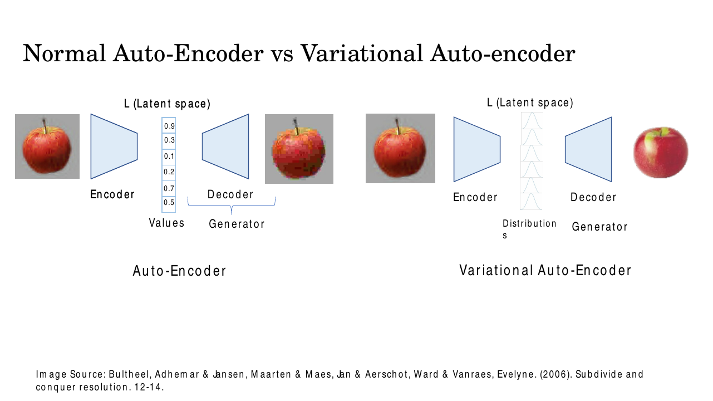
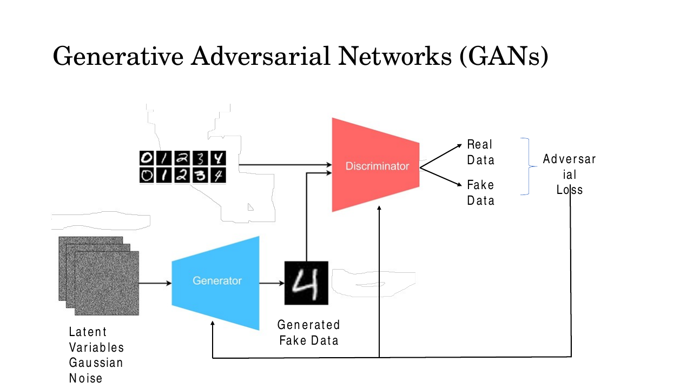
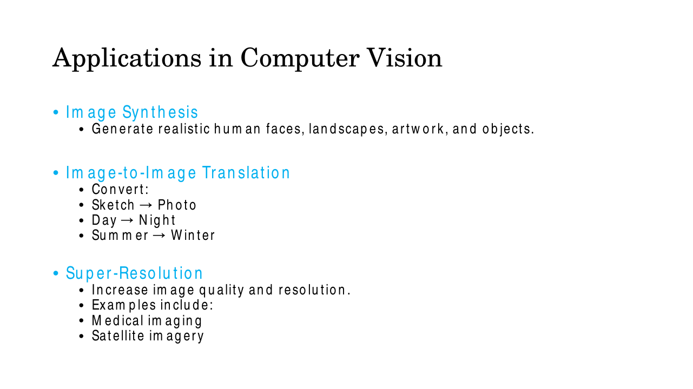

# Lec 3 — Generative Vision Models: The Landscape

> **Deck:** `L1P3_Generative Vision Models.pptx` · **Week 1** · **Playlist:** Lec 3
> **Prereqs:** [Lec 2 — Generative vs Discriminative](02-generative-vs-discriminative.md)
> **Feeds into:** [Lec 22 — Generative Taxonomy and MLE](../week-06/22-generative-taxonomy-and-mle.md), [Lec 23 — Autoregressive: PixelRNN and PixelCNN](../week-06/23-autoregressive-pixelrnn-pixelcnn.md), [Lec 29 — Autoencoders to VAE](../week-08/29-autoencoders-to-vae.md)

## Why this lecture exists

The previous lecture established *what* a generative model is: something that learns $p(\mathbf{x})$
rather than $p(y \mid \mathbf{x})$, so that you can sample new images instead of only labelling
existing ones. That leaves an obvious question hanging — nobody can actually write down the
probability distribution of all 196,608 numbers in a 256×256 colour photograph, so how does anyone
build such a thing in practice?

The answer is that there are five families of trick, and they are genuinely different tricks, not
variations on one. This lecture is the map. It names all five, says what each one's core move is,
and shows where each one shines and where it falls over. Nothing here is derived — every family gets
its own chapter later. Read this so that when Week 6 opens with autoregressive models and Week 8 with
VAEs, you already know which country you are standing in.

## The ideas

### The one question all five families answer

Every generative vision model is doing the same thing: turning an easy random number into a hard one.
Sampling from a Gaussian is trivial; sampling from "the distribution of realistic photographs" is
not. So you learn a map from the easy distribution to the hard one.


*Fig. — The framing slide. Notice the phrase "learns the probability distribution $P(X)$ of data": the five families differ almost entirely in whether they write that distribution down explicitly, approximate it, or never represent it at all. Slide 3.*

The five families the deck names:

| Family | The one-line move |
|---|---|
| **Variational Autoencoder (VAE)** | Encode each image to a *distribution* over a latent code; decode samples from it |
| **Generative Adversarial Network (GAN)** | Train a forger against a detective until the forgeries pass |
| **Autoregressive model** | Factor the image into a chain of conditionals and emit one piece at a time |
| **Diffusion model** | Learn to undo noise, then run that undoing from pure noise |
| **Normalizing flow** | Build an exactly invertible map from a Gaussian to the data |

Two questions separate them, and they are the questions Lec 22 will formalise: *does the model give
you a number for $p(\mathbf{x})$?* and *does it produce an image in one shot or in many steps?*

### Variational Autoencoders

A **variational autoencoder** is an encoder–decoder network that learns a compressed, *continuous*
representation of data and can sample new data from it. The encoder squeezes an image into a
low-dimensional **latent space** (the compressed code space); the decoder — also called the
generator — rebuilds an image from a point in that space.

Exactly one thing separates a VAE from a plain autoencoder, and it is worth more than every other
sentence here:

> A standard autoencoder maps an input to a **single point** in latent space. A VAE maps an input to
> a **probability distribution** over latent space (in practice a Gaussian).


*Fig. — Left: the autoencoder's latent code is the literal list 0.9, 0.3, 0.1, 0.2, 0.7, 0.5 — six numbers, one point. Right: the VAE's latent code is six little bell curves. That swap from "Values" to "Distributions" is the whole difference, and it is what makes the right-hand reconstruction a clean apple rather than a blocky one. Slide 6.*

Why the swap matters: if a point is all you have, the space *between* two training codes is
meaningless — decode a point you never trained on and you get garbage, so the model compresses but
cannot generate. Force every image to claim a whole fuzzy region instead, the regions overlap and
tile the space, and every point decodes to something plausible. That is the difference between a
compressor and a generator. The machinery that enforces it (ELBO, KL term, reparameterization trick)
is derived in [Lec 29](../week-08/29-autoencoders-to-vae.md) and
[Lec 30](../week-08/30-elbo-and-reparameterization.md).

Vision tasks the deck lists for VAEs: generating new images and video frames, learning meaningful
latent representations, interpolating between image samples, image compression, anomaly detection.
**Good at:** fast one-pass sampling, a navigable latent space, stable training. **Bad at:**
sharpness — VAE samples are famously blurry, for the reason the next section explains.

### Generative Adversarial Networks

A GAN is two networks in competition. The deck's analogy is the one to remember:

- The **generator** $G$ is a *skilled forger*. It takes a random vector $\mathbf{z}$, usually drawn
  from a Gaussian or uniform distribution, and transforms it into a synthetic sample
  $G(\mathbf{z})$ — an image. The deck's picture: an artist starting with random scribbles and
  refining them into a convincing masterpiece.
- The **discriminator** $D$ is a *skilled detective*. It receives a sample — real from the training
  set, or fake from $G$ — and outputs a probability $D(\mathbf{x})$ that the sample is genuine.
  $D(\mathbf{x})$ near 1 means "real", near 0 means "fake". The deck's picture: an art expert
  judging whether a painting is an original.


*Fig. — Follow the arrows at the bottom: the adversarial loss flows back into **both** networks. $D$ is pushed to separate the two input streams; $G$ is pushed to make its stream indistinguishable from the real one. One loss, two opposed gradients. Slide 11.*

Note what $G$ never sees: a real image. It only ever receives the discriminator's verdict on its own
output. The minimax objective that makes this work is derived in the GAN chapters (covered in
Lec 31–34); for now hold the loop, the analogy, and the two symbols $G(\mathbf{z})$ and
$D(\mathbf{x})$.

#### Why GANs make sharp images — the examinable argument

This is the most heavily examined idea on the deck, and it is a comparison, so learn it as one.

Most earlier generative models — including plain autoencoders and early VAEs — are trained to
reconstruct every pixel, by minimising a pixel-wise loss such as mean squared error. Think about what
MSE rewards. Suppose a half-occluded face could plausibly be completed with the mouth open or closed,
both equally likely. The output minimising expected squared error is neither one — it is **their
average**, and averaging two sharp images gives a smeared one. A model trained on MSE is
systematically pushed toward the mean of all plausible outputs, and the mean of many sharp things is
blurry. The blur is not a bug in the optimiser; it is the correct answer to the question MSE asked.

GANs never ask that question. The generator is not told "match this pixel"; it is told "fool a
network that has learned what real images look like". The discriminator learns the features that
separate real from fake — texture statistics, edge coherence, lighting consistency — and the
generator is pushed to match *those features*. That is optimising **perceptual realism** rather than
pixel accuracy. An average of two plausible faces is a face the discriminator rejects instantly, so
hedging is punished and the generator must commit to one sharp output.

Three consequences the deck spells out:

- **Learns complex distributions without modelling probabilities.** Images have structure at every
  level — objects, shapes, colours, textures, spatial relationships. GANs capture it *implicitly*:
  there is no $p(\mathbf{x})$ anywhere in a GAN, only a sampler. (This is what Lec 22 will call an
  **implicit density** model.)
- **Generates high-frequency detail.** Hair strands, skin texture, fur, grass, fine edges. These are
  exactly the content that reconstruction losses smear away, because their precise placement is
  unpredictable and therefore gets averaged out.
- **Continuous latent space.** Nearby $\mathbf{z}$ vectors decode to similar images. Walk a straight
  line from one $\mathbf{z}$ to another and the image morphs smoothly, which buys you image
  interpolation, attribute manipulation and style transfer: expression, age, hair colour and pose can
  be changed by moving in latent space rather than by editing pixels. Numerical N2 computes such a
  walk.

**Bad at:** training stability. Two networks chasing each other can oscillate, and the generator can
collapse onto a handful of outputs that happen to fool $D$ (**mode collapse**), throwing away the
diversity of the data. A GAN also gives you no likelihood and, in its basic form, no encoder — there
is no way to ask "what $\mathbf{z}$ produced *this* photograph".

### Autoregressive models

The autoregressive move is to stop treating an image as one object and treat it as a *sequence*.
Order the pixels (say raster-scan, top-left to bottom-right) and apply the chain rule of probability:


*Fig. — The factorization is exact, not an approximation: any joint distribution can be written this way. That is why autoregressive models get **exact** likelihoods for free. The price is in the "one step at a time" bullet above it. Slide 14 (the deck's text is an embedded image, invisible to the text dump).*

Each conditional is a classification problem — "given everything so far, what is the next pixel
value?" — so training is ordinary cross-entropy and is extremely stable. The depth of this is
[Lec 23](../week-06/23-autoregressive-pixelrnn-pixelcnn.md)'s; here is the roll-call the deck gives.

| Model | Contribution |
|---|---|
| **PixelRNN** | Earliest of these: generates pixel by pixel with RNNs. Captures complex spatial dependencies, but is computationally expensive because it is inherently sequential. |
| **PixelCNN** | Replaces the recurrence with **masked convolutions** — the mask hides future pixels — so training parallelises. Generation is still one pixel at a time. |
| **PixelCNN++** | Variant improving image quality and training stability. |
| **Vision Transformer** | Applies the Transformer to images by treating them as sequences of pixels or **patches**; self-attention models long-range dependencies better than convolution. Architecture in [Lec 28](../week-08/28-vit-detr-swin.md). |
| **VQ-VAE + Transformer** | Compresses images into **discrete latent codes**, then models those codes autoregressively with a Transformer. High quality at much lower compute, because the sequence is short. |
| **DALL·E (original)** | Transformer-based autoregressive text-to-image: images become sequences of discrete visual tokens, predicted one at a time conditioned on the text and the tokens so far. |
| **Parti** | Large-scale autoregressive Transformer for text-to-image; sequential token generation, strong on detailed and complex prompts. |

Read that table as one story: the family's problem is that generation is serial and therefore slow,
and every entry after PixelRNN is an attack on that cost — parallelise the *training* (PixelCNN),
then shorten the *sequence* (VQ-VAE, patches). Numerical N1 puts numbers on why they bothered.

**Good at:** exact tractable likelihood, very stable training, excellent at coherent long-range
structure. **Bad at:** sampling speed, and the arbitrariness of imposing a 1-D ordering on a 2-D
image.

### Diffusion models

A diffusion model learns to generate by learning to **reverse a gradual noise-adding process**. Two
processes, in opposite directions:

- **Forward process:** take a real image and add Gaussian noise gradually, over many time steps,
  until it is essentially pure noise. This has no learned parameters — it is a fixed schedule.
- **Backward (reverse) process:** remove the noise step by step. The deck specifies the sampling
  method by name: the noise is removed **by sampling using annealed Langevin dynamics**, so that the
  image gradually appears out of the Gaussian noise.


*Fig. — One strip, two readings. Left-to-right is the fixed forward corruption used during training; right-to-left is the learned generative process used at sampling time. Training teaches the model one thing only: given a noisy frame, predict a slightly less noisy one. Slide 19.*

"Annealed" means the noise level is turned down on a schedule as sampling proceeds — large steps
through the coarse structure first, fine steps for the detail at the end. **Langevin dynamics** is
the sampling rule that walks uphill on the learned density while injecting a little fresh noise, so
that you explore the distribution rather than collapsing onto one peak. Both terms are examinable as
names; the mathematics is covered in Lec 31–34.

**Good at:** state-of-the-art sample quality *and* diversity, and an extremely stable training
objective (it is essentially regression onto the added noise — no adversary to fight).
**Bad at:** sampling speed. One image costs as many forward passes as there are timesteps.

### Normalizing flows

A **normalizing flow** learns complex data distributions by applying a sequence of **invertible and
differentiable** transformations to a simple base distribution, typically a Gaussian. Every layer can
be run backwards; stack enough of them and a Gaussian blob is kneaded into the shape of the data
distribution.


*Fig. — Read it in both directions. Left-to-right is **inference**: push data through $f$ to get its latent code and, with it, its exact density. Right-to-left is **generation**: sample $\mathbf{z}$ from the Gaussian and push it through $f^{-1}$. One network, both jobs, no approximation. Slide 20.*

Invertibility buys the property that makes this family unique. Because each transformation is
reversible and differentiable, you can track exactly how it stretches and squeezes probability mass,
using the **change-of-variables formula** — in one dimension, $p_x(x) = p_z(z)\,|dz/dx|$. Carry that
bookkeeping through every layer and you get an **exact likelihood** for any image. Not a bound, not
an estimate: the number. Numerical N3 does the one-dimensional case by hand.

Training follows directly: flows are **trained by minimising the negative log-likelihood** of the
data, as the deck states. **Good at:** exact density estimation, exactly invertible
latent codes, one-pass sampling, and tasks where a real probability number is the product — anomaly
detection, density estimation. **Bad at:** sample quality on images, and the architectural
straitjacket — every layer must be invertible with a cheaply computable Jacobian determinant, which
rules out most of the layers you would otherwise want and forces the latent space to have exactly the
same dimension as the data (no compression).

### The comparison the deck never draws

Four questions discriminate the five families. Learn this table; it answers most MCQs about the
landscape in one lookup.

| | **VAE** | **GAN** | **Autoregressive** | **Diffusion** | **Normalizing flow** |
|---|---|---|---|---|---|
| **Likelihood** | approximate (lower bound) | none — implicit | **exact**, tractable | approximate (bound) | **exact**, tractable |
| **Sample quality** | moderate, blurry | very sharp | high | very high + diverse | moderate |
| **Sample speed** | 1 pass — fast | 1 pass — fastest | slowest, $O(D)$ sequential | slow, $T$ passes | 1 pass — fast |
| **Training stability** | stable | **unstable** (mode collapse) | very stable | very stable | stable |
| **Latent space** | low-dim, continuous, semantic | continuous, no encoder | none | the noise itself; not semantic | same dimension as data, invertible |
| **Main weakness** | blur | mode collapse, no likelihood | sampling cost | sampling cost | restricted architectures |

Two patterns to carry away. First, **nobody gets everything** — the field's history is a tour of
which corner of this table you are willing to lose. Second, the two families with exact likelihoods
(autoregressive, flows) pay for it in either speed or architectural freedom, which is precisely the
trade-off [Lec 22](../week-06/22-generative-taxonomy-and-mle.md) formalises.

### Applications in computer vision

The deck closes with the application list. These recur throughout the course, so know the names.


*Fig. — Note that super-resolution and inpainting are *conditional* generation: the model samples $p(\mathbf{x} \mid \text{what you already have})$, not $p(\mathbf{x})$. Slide 21.*

| Application | What it means |
|---|---|
| **Image synthesis** | Generate realistic faces, landscapes, artwork, objects from scratch |
| **Image-to-image translation** | Sketch → photo, day → night, summer → winter |
| **Super-resolution** | Increase resolution and quality; medical imaging, satellite imagery |
| **Image inpainting** | Fill missing or damaged regions |
| **Data augmentation** | Synthesise extra training samples for small datasets |
| **Video generation** | Realistic video from text prompts or images |
| **3D generation** | 3D objects, **neural radiance fields** (NeRF), virtual environments |

## Worked numericals

### N1. Sampling cost for one 256×256 image
**Given:** a 256×256 RGB image. Autoregressive models emit one sub-pixel (one colour channel of one
pixel) per network forward pass. A DDPM-style diffusion model uses $T = 1000$ denoising steps, one
forward pass each. GAN, VAE and flow decoders produce the image in a single forward pass. Assume
20 ms per forward pass.
**Find:** forward passes and wall-clock time for each, and the ratios.

1. Pixels: $256 \times 256 = 65{,}536$.
2. Sub-pixels (RGB): $65{,}536 \times 3 = 196{,}608$. This is the autoregressive pass count.
3. Autoregressive time: $196{,}608 \times 0.020 = 3932.16$ s $= 65.5$ minutes.
4. Diffusion: 1000 passes $\Rightarrow 1000 \times 0.020 = 20.0$ s.
5. GAN / VAE / flow: 1 pass $\Rightarrow 0.020$ s.
6. Ratio autoregressive : diffusion $= 196{,}608 / 1000 = \mathbf{196.6\times}$.
7. Ratio autoregressive : GAN $= 196{,}608 / 1 = \mathbf{196{,}608\times}$.
8. Now the VQ-VAE trick: compress to a $32 \times 32$ grid of discrete tokens instead of raw pixels.
   Token count $= 32 \times 32 = 1024$ passes $= 20.5$ s — a $196{,}608/1024 = 192\times$ speed-up,
   and now comparable to diffusion.

**Answer:** 196,608 passes (65.5 min) autoregressive, 1000 passes (20 s) diffusion, 1 pass (0.02 s)
GAN/VAE/flow. Autoregressive sampling is ~197× slower than diffusion and ~196,608× slower than a
GAN. Tokenising to a 32×32 grid cuts the autoregressive cost 192×, which is exactly why
VQ-VAE+Transformer and DALL·E exist.

### N2. Latent-space interpolation between two faces
**Given:** two latent codes $\mathbf{z}_A = [2, -1, 0, 3]$ and $\mathbf{z}_B = [-2, 3, 4, 1]$ in a
GAN's latent space.
**Find:** the interpolated codes $\mathbf{z}(\alpha) = (1-\alpha)\mathbf{z}_A + \alpha\mathbf{z}_B$
at $\alpha = 0.25, 0.5, 0.75$, and their norms.

1. $\alpha = 0.25$, component 1: $0.75(2) + 0.25(-2) = 1.5 - 0.5 = 1.0$.
   Component 2: $0.75(-1) + 0.25(3) = -0.75 + 0.75 = 0$.
   Component 3: $0.75(0) + 0.25(4) = 1.0$. Component 4: $0.75(3) + 0.25(1) = 2.25 + 0.25 = 2.5$.
   So $\mathbf{z}(0.25) = [1, 0, 1, 2.5]$.
2. $\alpha = 0.5$: $[0, 1, 2, 2]$ (each component is the plain average).
3. $\alpha = 0.75$: $[0.25(2) + 0.75(-2),\ 0.25(-1)+0.75(3),\ 3,\ 0.25(3)+0.75(1)] = [-1, 2, 3, 1.5]$.
4. Norms: $\|\mathbf{z}_A\| = \sqrt{4+1+0+9} = \sqrt{14} = 3.742$;
   $\|\mathbf{z}_B\| = \sqrt{4+9+16+1} = \sqrt{30} = 5.477$;
   $\|\mathbf{z}(0.5)\| = \sqrt{0+1+4+4} = \sqrt{9} = 3.000$.
5. The midpoint norm 3.000 is *below both* endpoints, and well below their mean
   $(3.742+5.477)/2 = 4.610$.

**Answer:** $\mathbf{z}(0.25) = [1, 0, 1, 2.5]$, $\mathbf{z}(0.5) = [0, 1, 2, 2]$,
$\mathbf{z}(0.75) = [-1, 2, 3, 1.5]$. Decoding this sequence gives a smooth morph — this is how
attribute manipulation works. Watch step 5: straight-line interpolation shrinks the norm, so the
midpoint sits closer to the origin than typical Gaussian samples do, and its decoded image can look
washed out. That is why practitioners use spherical interpolation, which keeps $\|\mathbf{z}\|$
constant.

### N3. Exact density under a change of variables (1-D flow)
**Given:** base variable $z \sim \mathrm{Uniform}(0,1)$, so $p_z(z) = 1$ on $(0,1)$. The flow is the
invertible, differentiable map $x = f(z) = z^2$, which sends $(0,1)$ onto $(0,1)$.
**Find:** $p_x(x)$, then evaluate it at $x = 0.25$ and $x = 0.81$, and verify it integrates to 1.

1. Invert: $z = f^{-1}(x) = \sqrt{x}$.
2. Differentiate the inverse: $\dfrac{dz}{dx} = \dfrac{1}{2\sqrt{x}}$.
3. Change of variables: $p_x(x) = p_z(z)\left|\dfrac{dz}{dx}\right| = 1 \cdot \dfrac{1}{2\sqrt{x}}$.
4. At $x = 0.25$: $\sqrt{0.25} = 0.5$, so $p_x = \dfrac{1}{2(0.5)} = \mathbf{1.0}$.
5. At $x = 0.81$: $\sqrt{0.81} = 0.9$, so $p_x = \dfrac{1}{2(0.9)} = \dfrac{1}{1.8} = \mathbf{0.5556}$.
6. Check: $\int_0^1 \frac{1}{2\sqrt{x}}\,dx = \left[\sqrt{x}\right]_0^1 = 1 - 0 = 1$. ✓

**Answer:** $p_x(x) = \dfrac{1}{2\sqrt{x}}$; $p_x(0.25) = 1.0$, $p_x(0.81) = 0.5556$. A uniform input
became a non-uniform output, and the density is **exact** — no bound, no sampling. The
$|dz/dx|$ factor is the whole mechanism: where $f$ stretches, density thins; where it squeezes,
density piles up. In $d$ dimensions that factor becomes $|\det(\partial f^{-1}/\partial \mathbf{x})|$,
and making that determinant cheap to compute is the entire design problem of normalizing flows.

## Code

```python
import numpy as np

# --- N1: what sampling one 256x256 image actually costs --------------------
H, W, C = 256, 256, 3
subpixels = H * W * C                       # autoregressive: one pass per sub-pixel
ms = 20.0                                   # 20 ms per forward pass

cost = {"Autoregressive (raw sub-pixels)": subpixels,
        "Autoregressive (32x32 VQ tokens)": 32 * 32,
        "Diffusion (DDPM, T=1000)":        1000,
        "Diffusion (DDIM, T=50)":            50,
        "GAN / VAE / Flow":                   1}
for name, passes in cost.items():
    print(f"{name:34s} {passes:7d} passes  {passes*ms/1000:8.2f} s")
# Autoregressive (raw sub-pixels)     196608 passes   3932.16 s
# Autoregressive (32x32 VQ tokens)      1024 passes     20.48 s
# Diffusion (DDPM, T=1000)              1000 passes     20.00 s
# Diffusion (DDIM, T=50)                  50 passes      1.00 s
# GAN / VAE / Flow                         1 passes      0.02 s
print("AR is", subpixels // 1000, "x slower than DDPM")   # AR is 196 x slower than DDPM
```

```python
import numpy as np

# --- N2: latent interpolation, and the norm-shrinkage trap -----------------
zA = np.array([ 2., -1., 0., 3.])
zB = np.array([-2.,  3., 4., 1.])
for a in [0.0, 0.25, 0.5, 0.75, 1.0]:
    z = (1 - a) * zA + a * zB
    print(f"alpha={a:.2f}  z={z}  ||z||={np.linalg.norm(z):.3f}")
# alpha=0.00  z=[ 2. -1.  0.  3.]   ||z||=3.742
# alpha=0.25  z=[1.  0.  1.  2.5]   ||z||=2.872
# alpha=0.50  z=[0. 1. 2. 2.]       ||z||=3.000   <- below BOTH endpoints
# alpha=0.75  z=[-1.   2.   3.  1.5] ||z||=4.031
# alpha=1.00  z=[-2.  3.  4.  1.]   ||z||=5.477

# --- N3: change of variables, checked empirically --------------------------
rng = np.random.default_rng(0)
z = rng.random(1_000_000)        # z ~ Uniform(0,1),  p_z(z) = 1
x = z ** 2                       # the invertible flow  x = f(z)
for xq in (0.25, 0.81):
    formula   = 1 / (2 * np.sqrt(xq))                 # p_x(x) = |dz/dx| = 1/(2*sqrt(x))
    empirical = np.mean(np.abs(x - xq) < 0.005) / 0.01  # histogram density in a width-0.01 bin
    print(f"x={xq}:  formula {formula:.4f}   empirical {empirical:.4f}")
# x=0.25:  formula 1.0000   empirical 0.9972
# x=0.81:  formula 0.5556   empirical 0.5491
```

The second block is the whole of normalizing flows in six lines: push samples through an invertible
map, and the Jacobian factor predicts the new density exactly.

## Exam pack

### Must-memorise

| Item | Exactly this |
|---|---|
| The five families | VAE, GAN, Autoregressive, Diffusion, Normalizing Flows |
| AE vs VAE | AE maps input to a **single point** in latent space; VAE maps it to a **probability distribution** (typically Gaussian) |
| GAN generator | $G$ = forger; takes noise $\mathbf{z}$ (Gaussian or uniform), outputs $G(\mathbf{z})$ |
| GAN discriminator | $D$ = detective; outputs $D(\mathbf{x})$ = probability the sample is **real**; ≈1 real, ≈0 fake |
| Why VAEs/AEs blur | MSE-style pixel reconstruction **averages multiple plausible outputs** |
| Why GANs are sharp | They optimise **perceptual realism**, not pixel error |
| Autoregressive factorization | $p(x_1,\dots,x_n) = p(x_1)p(x_2\mid x_1)p(x_3\mid x_1,x_2)\cdots$ |
| Diffusion forward process | Gradually **add Gaussian noise** over many time steps until pure noise; fixed, not learned |
| Diffusion backward process | Noise **gradually removed by sampling using annealed Langevin dynamics** |
| Normalizing flow definition | Sequence of **invertible and differentiable** transformations of a simple (Gaussian) base distribution |
| Flow's unique property | **Exact** likelihood, via the change-of-variables formula $p_x(x) = p_z(z)\,\lvert dz/dx\rvert$ |
| Flow training objective | Minimise the **negative log-likelihood** |

### Numbers worth knowing

| Quantity | Value |
|---|---|
| Families on the deck | 5 |
| Networks in a GAN | 2 |
| $D(\mathbf{x})$ for a confidently real sample | ≈ 1 |
| $D(\mathbf{x})$ for a confidently fake sample | ≈ 0 |
| Sub-pixels in a 256×256 RGB image | 196,608 |
| Typical DDPM sampling steps $T$ | ~1000 |
| Forward passes per image: GAN / VAE / flow | 1 |
| Deck's AE latent code (slide 6) | 0.9, 0.3, 0.1, 0.2, 0.7, 0.5 — six values |
| Autoregressive models named | PixelRNN, PixelCNN, PixelCNN++, Vision Transformer, VQ-VAE+Transformer, DALL·E, Parti |
| Applications listed | 7 (synthesis, i2i translation, super-resolution, inpainting, augmentation, video, 3D) |

### Likely MCQ traps

- **"A VAE is just an autoencoder with more layers."** No. The distinguishing fact is point versus
  distribution in the latent space. Depth is irrelevant.
- **"$D(\mathbf{x})$ outputs the probability the sample is fake."** It outputs the probability it is
  **real**. Near 1 = real. The deck states this explicitly, so it is fair game.
- **"The generator sees real images during training."** It does not — only the discriminator's
  verdict on the generator's own output.
- **"GANs are sharp because they use a better reconstruction loss."** They are sharp because they use
  **no** pixel reconstruction loss. The absence is the mechanism.
- **"The diffusion forward process is learned."** It is a fixed noise schedule. Only the **reverse**
  process is learned.
- **"Diffusion adds uniform/salt-and-pepper noise."** **Gaussian** noise, specifically.
- **"Normalizing flows give an approximate likelihood like VAEs."** The opposite — exact likelihood
  is the entire point. VAEs give a lower bound; GANs give nothing.
- **"PixelCNN generates faster than PixelRNN."** PixelCNN **trains** faster (masked convolutions
  parallelise). Generation is still one pixel at a time for both.
- **Confusing VQ-VAE+Transformer with a VAE.** Its *generator* is autoregressive; the VQ-VAE only
  supplies the discrete token vocabulary. It belongs to the autoregressive family.
- **"Mode collapse means the model overfits."** It means the generator produces only a few distinct
  outputs — a loss of **diversity**, not of training accuracy.
- **"Langevin dynamics is the forward process."** It is the **reverse/sampling** rule, and the deck
  qualifies it as *annealed*.

### Self-test

1. State in one sentence the only difference between an autoencoder and a VAE.
2. What does $D(\mathbf{x}) = 0.03$ tell you?
3. Explain in two sentences why a mean-squared-error reconstruction loss produces blurry images.
4. Which two families give exact likelihoods? What does each pay for it?
5. How many network forward passes does a pixel-level autoregressive model need for a 128×128 RGB image?
6. Name the sampling procedure the deck specifies for the diffusion reverse process.
7. Which family has a latent space with exactly the same dimensionality as the data, and why must it?
8. Which family suffers from mode collapse, and what is mode collapse?
9. Order the five families from fastest to slowest at generating one image.
10. VQ-VAE + Transformer belongs to which family, and what problem does the "VQ" part solve?

<details><summary>Answers</summary>

1. An autoencoder encodes an input to a single point in latent space; a VAE encodes it to a probability distribution (typically Gaussian) over latent space.
2. The discriminator is 97% confident this sample is **fake** — $D$ outputs the probability of being real.
3. When several different outputs are equally plausible for the same input, the output minimising expected squared error is their average. Averaging several sharp images produces a smeared one, so MSE systematically rewards blur.
4. Autoregressive models and normalizing flows. Autoregressive models pay in sampling speed (one forward pass per element); flows pay in architectural freedom — every layer must be invertible with a cheap Jacobian determinant, and the latent cannot compress.
5. $128 \times 128 \times 3 = 49{,}152$ passes.
6. Annealed Langevin dynamics.
7. Normalizing flows — the map must be invertible, and an invertible map cannot change dimensionality.
8. GANs. The generator settles on a small set of outputs that reliably fool the discriminator, so sample diversity collapses even though each sample may look fine.
9. GAN ≈ VAE ≈ flow (1 pass) → diffusion ($T$ passes, ~1000) → autoregressive (one pass per pixel/token).
10. Autoregressive. Vector quantisation compresses the image into a short sequence of discrete tokens, so the sequential generation loop runs over ~1000 tokens instead of ~200,000 sub-pixels.

</details>

## Beyond the slides

**Gap:** The deck lists the five families but never compares them on a common set of axes.
**Why it matters:** Nearly every MCQ about the landscape is a comparison question — "which family has
exact likelihood", "which is slowest to sample", "which is unstable to train". The table in *The
comparison the deck never draws* is built for exactly that, and it is the single most useful thing on
this page.

**Gap:** The deck praises GANs at length and never names their failure mode.
**Why it matters:** **Mode collapse** and training instability are the reason diffusion displaced GANs
after 2021. A chapter that only lists GAN strengths leaves you unable to answer why the field moved
on.

**Gap:** Sampling cost is described qualitatively ("computationally expensive due to its sequential
nature") but never quantified.
**Why it matters:** Numerical N1 turns that phrase into 196,608 versus 1000 versus 1, which is the
difference between an hour and a fiftieth of a second. Without the numbers the whole post-PixelRNN
history — masked convolutions, patches, discrete tokens — looks like fashion rather than necessity.

**Gap:** The deck shows the full Transformer architecture diagram (slide 17) without explanation,
inside the autoregressive section.
**Why it matters:** It is there to say "the sequence model in these systems is a Transformer, not an
RNN". Treat it as a forward reference only; the architecture is built properly across
[Lec 25](../week-07/25-qkv-and-self-attention.md)–[Lec 27](../week-07/27-decoder-and-full-transformer.md).

## Cut from the slides

Dropped the title slide (1), the content slide (2), the summary slide (23) which simply repeats
slide 2's three bullets, and the "next lecture" slide (24). Slides 9 and 10 are two full paragraphs of
prose giving the forger and detective analogies; both are compressed to their load-bearing content
(the analogy, $G(\mathbf{z})$, $D(\mathbf{x})$, and the 0/1 reading) rather than reproduced. Slides 12
and 13 share one heading, "Why GAN is good for image generation?", and are merged into a single
argument with its three consequences, since they are one continuous list split across a page break.
Slide 17's unlabelled reproduction of the Vaswani *Attention is All You Need* architecture figure is
noted but not reproduced here — it is a forward reference to Week 7 and is reproduced and dissected
there. Slides 15 and 16 are merged into one roll-call table. Slide 5's prose definition of a VAE is
folded into the VAE subsection. Nothing conceptual was dropped; note that slides 3 and 14 carry their
entire body text as embedded images, so the extracted text file shows them as blank — both were read
from the renders and are covered in full.
