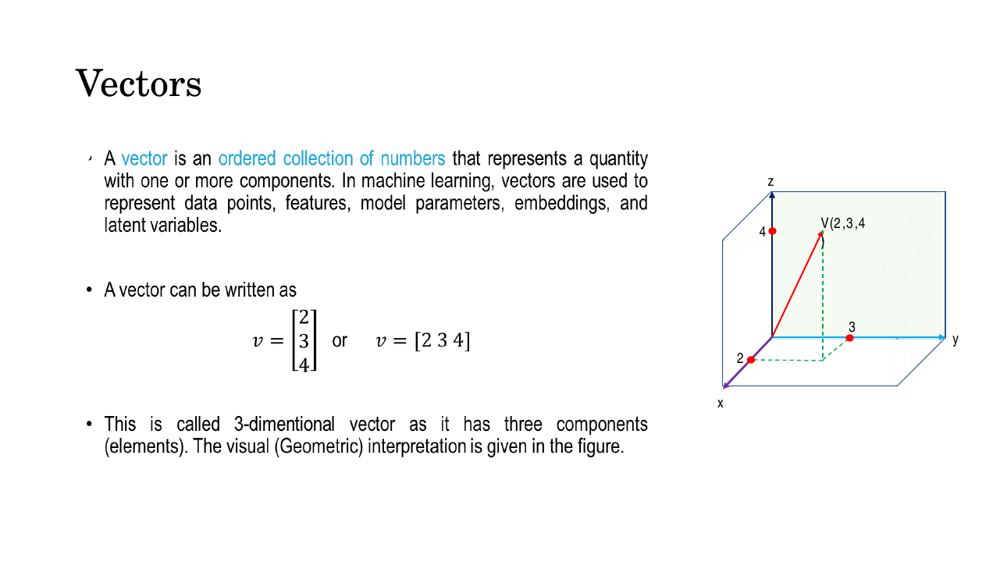
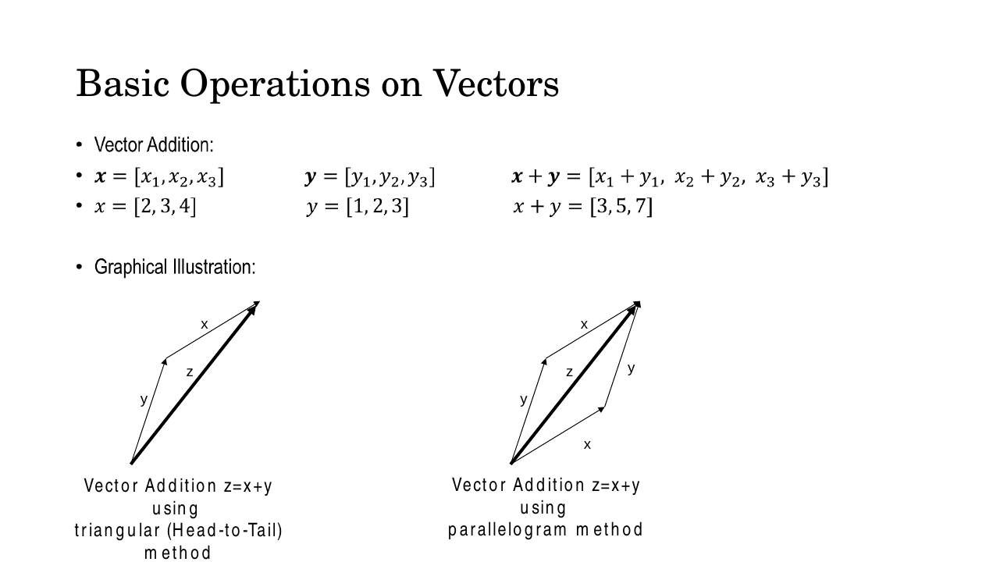
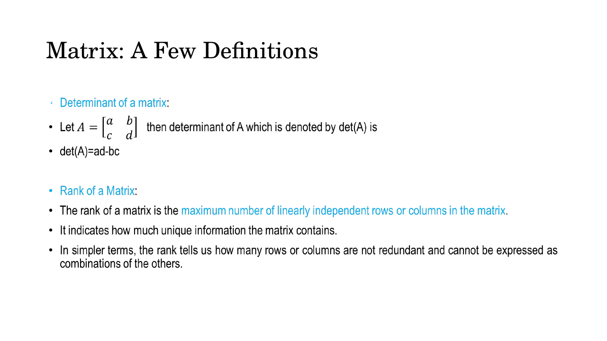
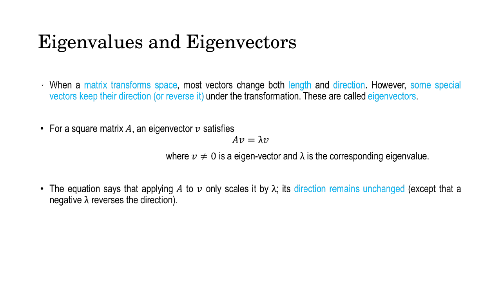
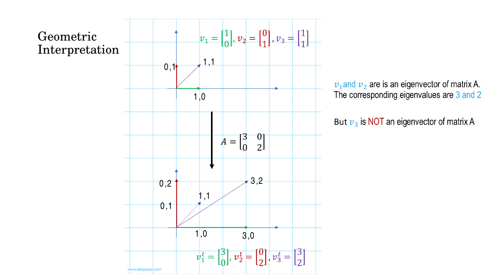

# Lec 4 — Mathematical Preliminaries I: Linear Algebra

> **Deck:** `L2P1_Linear_Algebra.pptx` · **Week 1** · **Playlist:** Lec 4
> **Prereqs:** none
> **Feeds into:** [Lec 5 — Probability I](05-probability-1.md), [Lec 8 — MLP and Activations](../week-02/08-mlp-and-activations.md), [Lec 25 — Q/K/V and Self-Attention](../week-07/25-qkv-and-self-attention.md), [Lec 30 — ELBO and Reparameterization](../week-08/30-elbo-and-reparameterization.md)

## Why this lecture exists

Everything after this point in the course is linear algebra wearing a costume. A neural network layer
is a matrix multiply. An image is a vector. Attention is a pile of dot products divided by a square
root. A latent space is a low-dimensional vector space you are trying to map onto a high-dimensional
one. If you can multiply matrices and say what an eigenvector is without hesitating, the rest of the
course is about *which* matrices and *why* — which is the interesting part. If you cannot, every
later lecture will feel like memorisation.

The deck is a refresher, so it moves fast and states results without proof. This chapter restates them
with the reasoning attached, because an exam will ask you to *apply* them, not recite them.

## The ideas

### Vectors: the container everything travels in

A **vector** is an ordered list of numbers. Write it in bold lowercase: $\mathbf{v} = [2, 3, 4]$.
Geometrically it is an arrow from the origin to the point $(2,3,4)$; the numbers are its
**components** along each axis.


*Fig. — A vector is simultaneously a list of numbers and an arrow. You will switch between these two readings constantly: "list" when you code it, "arrow" when you reason about it. Slide 3.*

The two readings matter because of what vectors *represent* in this course:

| In the world | As a vector |
|---|---|
| A grayscale $28\times28$ image | A point in $\mathbb{R}^{784}$ (flatten the pixels) |
| A word in a transformer | A point in $\mathbb{R}^{512}$ (its embedding) |
| The latent code of a VAE | A point in $\mathbb{R}^{128}$, usually |
| The noise you feed a generator | A random point $\mathbf{z} \sim \mathcal{N}(\mathbf{0}, \mathbf{I})$ |

That third and fourth row are the whole premise of generative modelling: *similar things sit near each
other in some vector space, and if you can learn that space you can walk around in it and generate new
things.* Keep this picture — it is the one the course keeps returning to.

The **magnitude** (length, or $\ell_2$ norm) of $\mathbf{v} = [v_1, v_2, \dots, v_n]$ is

$$\|\mathbf{v}\| = \sqrt{v_1^2 + v_2^2 + \cdots + v_n^2}$$

which is just Pythagoras in $n$ dimensions. A **unit vector** has $\|\mathbf{v}\| = 1$; you make one
by dividing a vector by its own magnitude, which is called **normalising**.

### Operations on vectors

**Addition** is component-wise: $\mathbf{x} + \mathbf{y} = [x_1+y_1,\ x_2+y_2,\ x_3+y_3]$. Both
vectors must have the same number of components. Geometrically there are two equivalent pictures —
the parallelogram rule and the head-to-tail (triangle) rule — and they give the same answer.


*Fig. — Head-to-tail is the one to remember: slide $\mathbf{y}$ so its tail sits on $\mathbf{x}$'s head, and the sum runs from the original tail to the final head. Slide 5.*

**Scalar multiplication** scales every component: $\delta\mathbf{x} = [\delta x_1, \delta x_2, \delta x_3]$.
This stretches the arrow by $\delta$ without rotating it — unless $\delta < 0$, which flips it to point
the other way. Hold on to that fact; it is exactly what an eigenvector does under its matrix, and it is
why a negative eigenvalue means "reversed".

**The dot (inner) product** is the important one:

$$\mathbf{x} \cdot \mathbf{y} = x_1y_1 + x_2y_2 + \cdots + x_ny_n = \sum_{i=1}^{n} x_i y_i$$

Multiply component-wise, then add everything up. **The result is a single scalar, not a vector** — the
most common slip on this topic. There is a second, geometric expression for the same quantity:

$$\mathbf{x} \cdot \mathbf{y} = \|\mathbf{x}\|\,\|\mathbf{y}\|\cos\theta$$

![Slide showing scalar multiplication and the dot product, with the worked example [1,2,3]·[4,5,6] = 32 and the geometric form u·v = ||u|| ||v|| cos θ](../../assets/slides/W1_L2P1_Linear_Algebra/s-06.png)
*Fig. — The two formulas for the dot product are the single most useful identity in the course. Setting them equal gives you the angle between any two vectors. Slide 6.*

Setting the two expressions equal and solving for the angle gives **cosine similarity**:

$$\cos\theta = \frac{\mathbf{x} \cdot \mathbf{y}}{\|\mathbf{x}\|\,\|\mathbf{y}\|}$$

This is why the deck calls the dot product a **similarity measure**, and why it says it is "used
throughout neural networks and transformers". Read the sign off it directly:

| $\mathbf{x}\cdot\mathbf{y}$ | $\theta$ | Meaning |
|---|---|---|
| large positive | near $0°$ | pointing the same way — very similar |
| zero | $90°$ | **orthogonal** — unrelated |
| large negative | near $180°$ | pointing opposite ways |

When you reach [Lec 25](../week-07/25-qkv-and-self-attention.md) and meet
$\mathrm{softmax}(\mathbf{Q}\mathbf{K}^\top/\sqrt{d_k})\mathbf{V}$, that $\mathbf{Q}\mathbf{K}^\top$ is
nothing but a grid of dot products — every query against every key — asking *how similar is this word
to that word*. You already know what it computes.

### Matrices

A **matrix** is a rectangular grid of numbers, written bold uppercase. An $m \times n$ matrix has $m$
rows and $n$ columns — **rows first, always**. The entry in row $i$, column $j$ is $a_{ij}$.

**Addition and subtraction** are element-wise and require *identical* dimensions.

**Multiplication** is the one with a rule worth internalising. For $\mathbf{C} = \mathbf{A}\mathbf{B}$:

$$c_{ij} = \sum_{k} a_{ik} b_{kj}$$

Entry $(i,j)$ of the product is *the dot product of row $i$ of $\mathbf{A}$ with column $j$ of
$\mathbf{B}$*. For this to be defined, the **inner dimensions must match**:

$$\underbrace{\mathbf{A}}_{m \times \mathbf{n}} \cdot \underbrace{\mathbf{B}}_{\mathbf{n} \times p} = \underbrace{\mathbf{C}}_{m \times p}$$

The deck's example: $\mathbf{A}$ is $[3\times4]$, $\mathbf{B}$ is $[4\times5]$, so $\mathbf{AB}$ is
$[3\times5]$. The inner 4s cancel; the outer dimensions survive. If the inner dimensions disagree, the
product simply does not exist.

Two consequences you will use constantly:

- **Matrix multiplication is not commutative.** $\mathbf{AB} \neq \mathbf{BA}$ in general — often
  $\mathbf{BA}$ is not even a legal shape. This is a favourite MCQ.
- **It is associative and distributive**: $(\mathbf{AB})\mathbf{C} = \mathbf{A}(\mathbf{BC})$ and
  $\mathbf{A}(\mathbf{B}+\mathbf{C}) = \mathbf{AB}+\mathbf{AC}$.

Every forward pass of every network in this course is $\mathbf{z} = \mathbf{W}\mathbf{x} + \mathbf{b}$.
When you see a layer "with 128 units taking 784 inputs", you are being told $\mathbf{W}$ is
$128 \times 784$ — and from that alone you can count its parameters.

### Transpose and the identity

The **transpose** $\mathbf{A}^\top$ flips a matrix across its main diagonal: row $i$ becomes column $i$,
so an $m \times n$ matrix becomes $n \times m$, and $(\mathbf{A}^\top)_{ij} = a_{ji}$.

Properties worth memorising, because they get examined directly:

$$(\mathbf{A}^\top)^\top = \mathbf{A}, \qquad (\mathbf{A}+\mathbf{B})^\top = \mathbf{A}^\top + \mathbf{B}^\top, \qquad (\mathbf{A}\mathbf{B})^\top = \mathbf{B}^\top\mathbf{A}^\top$$

**The order reverses in that last one.** A matrix with $\mathbf{A}^\top = \mathbf{A}$ is **symmetric**
(necessarily square). Covariance matrices, which you meet in [Lec 6](06-probability-2.md), are always
symmetric.

The **identity matrix** $\mathbf{I}$ is square with 1s on the main diagonal and 0s elsewhere. It is the
multiplicative "do nothing": $\mathbf{A}\mathbf{I} = \mathbf{I}\mathbf{A} = \mathbf{A}$. It plays the
role that the number 1 plays for scalars, and it is what makes the definition of an inverse possible.

### Determinant, rank, and singularity — one idea in three costumes

The **determinant** of a $2\times2$ matrix is

$$\mathbf{A} = \begin{bmatrix} a & b \\ c & d \end{bmatrix}, \qquad \det(\mathbf{A}) = ad - bc$$

Defined only for square matrices. Geometrically, $|\det(\mathbf{A})|$ is the factor by which $\mathbf{A}$
scales areas (in 2-D) or volumes (in 3-D). A determinant of 3 means the transform triples every area; a
determinant of 0 means it *flattens everything to zero area*.

The **rank** is the maximum number of linearly independent rows (equivalently, columns). It counts how
much genuinely non-redundant information the matrix carries. A $3\times3$ matrix whose third row is the
sum of the first two has rank 2, not 3: that row told you nothing new.


*Fig. — Determinant and rank are introduced separately but measure the same failure from two directions. Slide 12.*

A **singular** matrix is a square matrix with $\det(\mathbf{A}) = 0$. These three statements are
equivalent, and knowing they are equivalent is worth more than knowing any one of them:

$$\det(\mathbf{A}) = 0 \iff \text{rank} < n \iff \mathbf{A}^{-1} \text{ does not exist}$$

Why they are the same thing: if the rows are linearly dependent, the transform squashes
$n$-dimensional space into fewer than $n$ dimensions — a plane onto a line, say. That collapse destroys
area, so the determinant is 0. And because many different input points get mapped onto the same output
point, you cannot run the map backwards: information was *lost*, so no inverse can exist. The deck's
bonus slide 23 makes this geometric point explicitly, and it is worth absorbing.

That bonus slide also lists when singular matrices actually show up in ML, which is the practically
useful part:

- features are highly correlated (**multicollinearity**),
- duplicate features exist,
- more features than samples ($p > n$),
- computing $(\mathbf{X}^\top\mathbf{X})^{-1}$ in linear regression.

The standard fixes — regularisation, matrix factorisation, the Moore–Penrose pseudo-inverse — exist
precisely because real data matrices are so often singular or nearly so.

### The inverse

$\mathbf{A}^{-1}$ is the matrix that undoes $\mathbf{A}$: $\mathbf{A}\mathbf{A}^{-1} = \mathbf{A}^{-1}\mathbf{A} = \mathbf{I}$.
For $2\times2$ there is a closed form worth memorising outright:

$$\mathbf{A}^{-1} = \frac{1}{ad-bc}\begin{bmatrix} d & -b \\ -c & a \end{bmatrix}$$

Swap the diagonal entries, negate the off-diagonal entries, divide by the determinant. The division is
where singularity bites: $\det = 0$ means dividing by zero, so no inverse.

For larger matrices the deck uses the **adjugate** route:

$$\mathbf{A}^{-1} = \frac{1}{\det(\mathbf{A})}\,\mathrm{adj}(\mathbf{A}), \qquad \mathrm{adj}(\mathbf{A}) = \mathbf{C}^\top$$

where $\mathbf{C}$ is the **cofactor matrix**, $C_{ij} = (-1)^{i+j} M_{ij}$, and the **minor** $M_{ij}$
is the determinant of the matrix left after deleting row $i$ and column $j$. The $(-1)^{i+j}$ makes a
checkerboard of signs starting with $+$ at the top left. Note the transpose — adjugate is the
*transposed* cofactor matrix, and forgetting it is the classic error.

### Eigenvalues and eigenvectors

Apply a matrix to a vector and in general you get a vector pointing somewhere else, with a different
length. But for any square matrix there exist special directions that only get *stretched*, never
rotated. Those are the **eigenvectors**, and the stretch factors are the **eigenvalues**:

$$\mathbf{A}\mathbf{v} = \lambda\mathbf{v}, \qquad \mathbf{v} \neq \mathbf{0}$$


*Fig. — Note the condition $\mathbf{v} \neq \mathbf{0}$. Without it the equation is trivially satisfied by the zero vector for every $\lambda$, and the definition would be useless. Slide 17.*

The condition $\mathbf{v} \neq \mathbf{0}$ is doing real work, and it is what drives the whole solution
method. A negative $\lambda$ means the eigenvector gets flipped as well as scaled — direction is
preserved only up to sign, which is exactly the scalar-multiplication behaviour from earlier.

**Finding them.** Rearranging the definition:

$$\mathbf{A}\mathbf{v} = \lambda\mathbf{v} = \lambda\mathbf{I}\mathbf{v} \implies (\mathbf{A} - \lambda\mathbf{I})\mathbf{v} = \mathbf{0}$$

Now the logic. We need a *non-zero* $\mathbf{v}$ that $(\mathbf{A} - \lambda\mathbf{I})$ sends to zero.
A matrix can only crush a non-zero vector to zero if it collapses space — that is, if it is **singular**.
So:

$$\boxed{\ \det(\mathbf{A} - \lambda\mathbf{I}) = 0\ }$$

This is the **characteristic equation**. Solve it for $\lambda$ to get the eigenvalues, then substitute
each $\lambda$ back into $(\mathbf{A} - \lambda\mathbf{I})\mathbf{v} = \mathbf{0}$ and solve for
$\mathbf{v}$. The deck works exactly this for $\mathbf{A} = \begin{bmatrix}3&0\\0&2\end{bmatrix}$,
getting $\lambda_1 = 3, \lambda_2 = 2$ with eigenvectors $[1,0]^\top$ and $[0,1]^\top$ — see
numerical N4 below for a harder, non-diagonal case, which is what an exam will actually give you.

![Slide deriving the characteristic equation det(A − λI) = 0 and working the example A = [[3,0],[0,2]] to eigenvalues 3 and 2 with eigenvectors [1,0] and [0,1]](../../assets/slides/W1_L2P1_Linear_Algebra/s-20.png)
*Fig. — The chain to remember: $\mathbf{Av}=\lambda\mathbf{v}$ → $(\mathbf{A}-\lambda\mathbf{I})\mathbf{v}=\mathbf{0}$ → $\mathbf{v}\neq\mathbf{0}$ forces singularity → $\det(\mathbf{A}-\lambda\mathbf{I})=0$. Slide 20.*

**Geometric reading.** The deck shows a unit square being transformed and asks which arrows keep their
direction. Under a shear or stretch, most arrows tilt; the eigenvectors are the axes along which the
transformation is *pure scaling*. They are the natural coordinate system of the matrix — the directions
in which it is simplest to describe.


*Fig. — The arrows along the axes are only stretched; a diagonal arrow like $(1,1)$ tilts, because it is a mix of two eigendirections with different eigenvalues. Slide 19.*

Eigenvectors matter later because they are how you find **the directions of greatest variance** in data.
The eigenvectors of a covariance matrix, ranked by eigenvalue, are the principal components — the axes
along which your data actually spreads. That is the intuition behind every "learn a low-dimensional
latent space" claim in this course.

## Worked numericals

### N1. Dot product, magnitudes, and the angle between two vectors
**Given:** $\mathbf{x} = [1, 2, 3]$, $\mathbf{y} = [4, 5, 6]$.
**Find:** $\mathbf{x}\cdot\mathbf{y}$, both magnitudes, and $\cos\theta$.

1. Dot product: $(1)(4) + (2)(5) + (3)(6) = 4 + 10 + 18 = 32$.
2. $\|\mathbf{x}\| = \sqrt{1^2+2^2+3^2} = \sqrt{1+4+9} = \sqrt{14} \approx 3.742$.
3. $\|\mathbf{y}\| = \sqrt{4^2+5^2+6^2} = \sqrt{16+25+36} = \sqrt{77} \approx 8.775$.
4. $\cos\theta = \dfrac{32}{\sqrt{14}\sqrt{77}} = \dfrac{32}{\sqrt{1078}} = \dfrac{32}{32.833} \approx 0.9746$.
5. $\theta = \arccos(0.9746) \approx 12.9°$.

**Answer:** $\mathbf{x}\cdot\mathbf{y} = 32$, $\cos\theta \approx 0.975$, so the vectors are nearly
parallel — highly similar.

### N2. Matrix multiplication, with the shape check first
**Given:** $\mathbf{A} = \begin{bmatrix}1&2\\3&4\end{bmatrix}$ ($2\times2$), $\mathbf{B} = \begin{bmatrix}5&6&7\\8&9&10\end{bmatrix}$ ($2\times3$).
**Find:** $\mathbf{AB}$, and state whether $\mathbf{BA}$ exists.

1. Shapes: $[2\times \mathbf{2}]\cdot[\mathbf{2}\times3]$. Inner dimensions both 2 — legal. Result is $2\times3$.
2. $c_{11} = (1)(5)+(2)(8) = 5+16 = 21$
3. $c_{12} = (1)(6)+(2)(9) = 6+18 = 24$
4. $c_{13} = (1)(7)+(2)(10) = 7+20 = 27$
5. $c_{21} = (3)(5)+(4)(8) = 15+32 = 47$
6. $c_{22} = (3)(6)+(4)(9) = 18+36 = 54$
7. $c_{23} = (3)(7)+(4)(10) = 21+40 = 61$
8. For $\mathbf{BA}$: $[2\times\mathbf{3}]\cdot[\mathbf{2}\times2]$ — inner dimensions 3 and 2 disagree.

**Answer:** $\mathbf{AB} = \begin{bmatrix}21&24&27\\47&54&61\end{bmatrix}$. $\mathbf{BA}$ is undefined —
a concrete demonstration that matrix multiplication does not commute.

### N3. Determinant, singularity, and inverse
**Given:** $\mathbf{A} = \begin{bmatrix}4&7\\2&6\end{bmatrix}$ and $\mathbf{S} = \begin{bmatrix}2&4\\1&2\end{bmatrix}$.
**Find:** both determinants; invert whichever is invertible.

1. $\det(\mathbf{A}) = (4)(6) - (7)(2) = 24 - 14 = 10$. Non-zero, so $\mathbf{A}$ is invertible.
2. $\mathbf{A}^{-1} = \frac{1}{10}\begin{bmatrix}6&-7\\-2&4\end{bmatrix} = \begin{bmatrix}0.6&-0.7\\-0.2&0.4\end{bmatrix}$.
3. Check: $\begin{bmatrix}4&7\\2&6\end{bmatrix}\begin{bmatrix}0.6&-0.7\\-0.2&0.4\end{bmatrix}$ — top-left entry is $(4)(0.6)+(7)(-0.2) = 2.4-1.4 = 1$. ✓
4. $\det(\mathbf{S}) = (2)(2) - (4)(1) = 4 - 4 = 0$. Singular.
5. Confirming by rank: row 2 of $\mathbf{S}$ is exactly $\tfrac12 \times$ row 1, so the rows are linearly dependent and rank $= 1 < 2$.

**Answer:** $\det(\mathbf{A}) = 10$, $\mathbf{A}^{-1} = \begin{bmatrix}0.6&-0.7\\-0.2&0.4\end{bmatrix}$.
$\mathbf{S}$ is singular ($\det = 0$, rank 1) and has no inverse.

### N4. Eigenvalues and eigenvectors of a non-diagonal matrix
**Given:** $\mathbf{A} = \begin{bmatrix}4&1\\2&3\end{bmatrix}$.
**Find:** both eigenvalues and one eigenvector for each.

1. Form $\mathbf{A}-\lambda\mathbf{I} = \begin{bmatrix}4-\lambda&1\\2&3-\lambda\end{bmatrix}$.
2. Characteristic equation: $(4-\lambda)(3-\lambda) - (1)(2) = 0$.
3. Expand: $12 - 4\lambda - 3\lambda + \lambda^2 - 2 = \lambda^2 - 7\lambda + 10 = 0$.
4. Factor: $(\lambda - 5)(\lambda - 2) = 0 \implies \lambda_1 = 5,\ \lambda_2 = 2$.
5. For $\lambda_1 = 5$: $\begin{bmatrix}-1&1\\2&-2\end{bmatrix}\begin{bmatrix}v_1\\v_2\end{bmatrix} = \mathbf{0}$. Row 1 gives $-v_1 + v_2 = 0$, so $v_1 = v_2$.
6. Take $\mathbf{v}_1 = [1, 1]^\top$. Check: $\begin{bmatrix}4&1\\2&3\end{bmatrix}\begin{bmatrix}1\\1\end{bmatrix} = \begin{bmatrix}5\\5\end{bmatrix} = 5\begin{bmatrix}1\\1\end{bmatrix}$. ✓
7. For $\lambda_2 = 2$: $\begin{bmatrix}2&1\\2&1\end{bmatrix}\begin{bmatrix}v_1\\v_2\end{bmatrix} = \mathbf{0}$. Row 1 gives $2v_1 + v_2 = 0$, so $v_2 = -2v_1$.
8. Take $\mathbf{v}_2 = [1, -2]^\top$. Check: $\begin{bmatrix}4&1\\2&3\end{bmatrix}\begin{bmatrix}1\\-2\end{bmatrix} = \begin{bmatrix}2\\-4\end{bmatrix} = 2\begin{bmatrix}1\\-2\end{bmatrix}$. ✓

**Answer:** $\lambda_1 = 5$ with $\mathbf{v}_1 = [1,1]^\top$; $\lambda_2 = 2$ with $\mathbf{v}_2 = [1,-2]^\top$.
Eigenvectors are only defined up to scale — $[2,2]^\top$ is equally valid for $\lambda_1$.

### N5. Two free checks on your eigenvalue answer
**Given:** the same $\mathbf{A} = \begin{bmatrix}4&1\\2&3\end{bmatrix}$, with $\lambda_1 = 5, \lambda_2 = 2$.
**Find:** verify using trace and determinant.

1. **Trace** (sum of the diagonal) $= 4 + 3 = 7$. Sum of eigenvalues $= 5 + 2 = 7$. ✓
2. **Determinant** $= (4)(3) - (1)(2) = 10$. Product of eigenvalues $= 5 \times 2 = 10$. ✓

**Answer:** $\sum\lambda_i = \mathrm{tr}(\mathbf{A})$ and $\prod\lambda_i = \det(\mathbf{A})$. Both hold.
Use this in the exam — it catches arithmetic slips in seconds and can let you pick the right MCQ option
without solving the quadratic at all.

## Code

```python
import numpy as np

# --- dot product as similarity -----------------------------------------
x = np.array([1., 2., 3.])
y = np.array([4., 5., 6.])

dot  = x @ y                               # @ is matrix-multiply; for 1-D it's the dot product
cos  = dot / (np.linalg.norm(x) * np.linalg.norm(y))
print(f"dot = {dot:.0f}   |x| = {np.linalg.norm(x):.3f}   cos = {cos:.4f}")
# dot = 32   |x| = 3.742   cos = 0.9746

# orthogonal vectors have zero dot product, hence cos = 0
a, b = np.array([1., 0.]), np.array([0., 1.])
print("orthogonal dot:", a @ b)            # orthogonal dot: 0.0

# --- shapes are the whole game -----------------------------------------
A = np.array([[1., 2.], [3., 4.]])         # 2x2
B = np.array([[5., 6., 7.], [8., 9., 10.]])  # 2x3
print("A@B shape:", (A @ B).shape)         # A@B shape: (2, 3)
print(A @ B)
# [[21. 24. 27.]
#  [47. 54. 61.]]
try:
    B @ A                                  # inner dims 3 vs 2 -> illegal
except ValueError as e:
    print("B@A failed:", str(e)[:40])      # B@A failed: matmul: Input operand 1 has a mismatch

# --- determinant, singularity, inverse ---------------------------------
M = np.array([[4., 7.], [2., 6.]])
S = np.array([[2., 4.], [1., 2.]])         # row2 = 0.5 * row1  -> singular
print(f"det(M) = {np.linalg.det(M):.1f}   rank(M) = {np.linalg.matrix_rank(M)}")
print(f"det(S) = {np.linalg.det(S):.1f}   rank(S) = {np.linalg.matrix_rank(S)}")
# det(M) = 10.0   rank(M) = 2
# det(S) = 0.0    rank(S) = 1
print(np.linalg.inv(M))
# [[ 0.6 -0.7]
#  [-0.2  0.4]]

# --- eigen, plus the trace/determinant sanity checks --------------------
E = np.array([[4., 1.], [2., 3.]])
vals, vecs = np.linalg.eig(E)
print("eigenvalues:", np.round(vals, 4))           # eigenvalues: [5. 2.]
print("eigenvectors (columns):\n", np.round(vecs, 4))
# [[ 0.7071 -0.4472]
#  [ 0.7071  0.8944]]        <- these are [1,1] and [1,-2], normalised to unit length
print("trace", np.trace(E), "== sum", vals.sum())  # trace 7.0 == sum 7.0
print("det", round(np.linalg.det(E)), "== prod", round(vals.prod()))  # det 10 == prod 10
```

Note what NumPy returns for the eigenvectors: `[0.7071, 0.7071]` is $[1,1]^\top$ divided by $\sqrt{2}$.
NumPy always normalises to unit length, and it stores eigenvectors as **columns**. Hand-computed answers
will differ from library output by a scale factor, and both are correct.

## Exam pack

### Must-memorise

| Item | Exactly this |
|---|---|
| Dot product | $\mathbf{x}\cdot\mathbf{y} = \sum_i x_i y_i$ — a **scalar** |
| Geometric dot product | $\mathbf{x}\cdot\mathbf{y} = \|\mathbf{x}\|\|\mathbf{y}\|\cos\theta$ |
| Cosine similarity | $\cos\theta = \dfrac{\mathbf{x}\cdot\mathbf{y}}{\|\mathbf{x}\|\|\mathbf{y}\|}$ |
| Magnitude | $\|\mathbf{v}\| = \sqrt{\sum_i v_i^2}$ |
| Multiplication rule | $[m\times n]\cdot[n\times p] = [m\times p]$; inner dims must match |
| Product entry | $c_{ij} = \sum_k a_{ik}b_{kj}$ = (row $i$ of $\mathbf{A}$) · (col $j$ of $\mathbf{B}$) |
| Transpose of a product | $(\mathbf{AB})^\top = \mathbf{B}^\top\mathbf{A}^\top$ — **order reverses** |
| $2\times2$ determinant | $\det = ad - bc$ |
| $2\times2$ inverse | $\mathbf{A}^{-1} = \frac{1}{ad-bc}\begin{bmatrix}d&-b\\-c&a\end{bmatrix}$ |
| General inverse | $\mathbf{A}^{-1} = \frac{1}{\det(\mathbf{A})}\mathrm{adj}(\mathbf{A})$, $\mathrm{adj} = $ cofactor matrix **transposed** |
| Singular | $\det = 0 \iff$ rank $< n \iff$ no inverse |
| Rank | max number of linearly independent rows (= columns) |
| Eigen definition | $\mathbf{A}\mathbf{v} = \lambda\mathbf{v}$, $\mathbf{v} \neq \mathbf{0}$ |
| Characteristic equation | $\det(\mathbf{A} - \lambda\mathbf{I}) = 0$ |
| Trace identity | $\sum_i \lambda_i = \mathrm{tr}(\mathbf{A})$ |
| Determinant identity | $\prod_i \lambda_i = \det(\mathbf{A})$ |

### Numbers worth knowing

| Quantity | Value |
|---|---|
| Deck's dot-product example $[1,2,3]\cdot[4,5,6]$ | 32 |
| Deck's eigen example $\begin{bmatrix}3&0\\0&2\end{bmatrix}$ | $\lambda = 3, 2$; $\mathbf{v} = [1,0]^\top, [0,1]^\top$ |
| Eigenvalues of any diagonal matrix | its diagonal entries, read off directly |
| Eigenvalues of $\mathbf{I}_n$ | all $= 1$ |
| Number of eigenvalues of an $n\times n$ matrix | exactly $n$, counting multiplicity (complex ones allowed) |
| Dot product of orthogonal vectors | 0 |
| Deck's shape example $[3\times4]\cdot[4\times5]$ | $[3\times5]$ |

### Likely MCQ traps

- **"The dot product of two vectors is a vector."** False — it is a scalar. The *cross* product gives a
  vector, and only in 3-D. The deck states this explicitly because it is examined.
- **$(\mathbf{AB})^\top = \mathbf{A}^\top\mathbf{B}^\top$.** False. The order reverses:
  $\mathbf{B}^\top\mathbf{A}^\top$. Same trap applies to inverses: $(\mathbf{AB})^{-1} = \mathbf{B}^{-1}\mathbf{A}^{-1}$.
- **"$\mathbf{AB}$ exists, therefore $\mathbf{BA}$ exists."** False — see N2. Even when both exist they
  are usually unequal, and they need not even have the same shape.
- **Determinant of a non-square matrix.** Does not exist. Determinants, inverses, eigenvalues and the
  trace are **square-only**. Rank and transpose work for any shape.
- **"Zero is not a valid eigenvalue."** It is. $\lambda = 0$ is perfectly legal and means precisely that
  the matrix is singular. What is *not* allowed is the zero **vector** as an eigenvector.
- **Forgetting the transpose in the adjugate.** $\mathrm{adj}(\mathbf{A}) = \mathbf{C}^\top$, not
  $\mathbf{C}$. Harmless for symmetric matrices, wrong everywhere else.
- **Reading dimensions as columns×rows.** Always rows×columns. A "$3\times4$ matrix" has 3 rows.
- **"Eigenvectors are unique."** No — any non-zero scalar multiple of an eigenvector is also an
  eigenvector for the same $\lambda$. If an MCQ's option looks like twice your answer, it is still correct.
- **Confusing "singular" with "square".** Every singular matrix is square, but most square matrices are
  not singular.

### Self-test

1. $\mathbf{A}$ is $5\times3$ and $\mathbf{B}$ is $3\times7$. What are the shapes of $\mathbf{AB}$ and $\mathbf{BA}$?
2. Compute $[2,-1,3]\cdot[1,4,0]$. Are the vectors orthogonal?
3. For $\mathbf{A} = \begin{bmatrix}3&8\\4&6\end{bmatrix}$, find $\det(\mathbf{A})$ and $\mathbf{A}^{-1}$.
4. Why does a singular matrix have no inverse? Answer geometrically in one sentence.
5. Find the eigenvalues of $\begin{bmatrix}2&2\\1&3\end{bmatrix}$.
6. A $4\times4$ matrix has eigenvalues $1, 2, 2, 5$. What are its trace and determinant?
7. True or false: if $\det(\mathbf{A}) = 0$ then $\mathbf{A}$ has at least one zero eigenvalue.
8. A layer maps 784 inputs to 256 units. What is the shape of $\mathbf{W}$, and how many parameters does the layer have including biases?
9. Simplify $(\mathbf{A}\mathbf{B}\mathbf{C})^\top$.
10. The rows of a $3\times3$ matrix are $[1,2,3]$, $[2,4,6]$, $[1,0,1]$. What is its rank?

<details><summary>Answers</summary>

1. $\mathbf{AB}$ is $5\times7$. $\mathbf{BA}$ does not exist (inner dims 7 and 5 disagree).
2. $(2)(1)+(-1)(4)+(3)(0) = 2-4+0 = -2$. Not orthogonal — orthogonality requires exactly 0.
3. $\det = (3)(6)-(8)(4) = 18-32 = -14$. $\mathbf{A}^{-1} = \frac{1}{-14}\begin{bmatrix}6&-8\\-4&3\end{bmatrix} = \begin{bmatrix}-3/7&4/7\\2/7&-3/14\end{bmatrix}$.
4. It collapses space to a lower dimension, so distinct inputs land on the same output and the mapping cannot be reversed.
5. $(2-\lambda)(3-\lambda)-2 = \lambda^2-5\lambda+4 = (\lambda-4)(\lambda-1)$, so $\lambda = 4, 1$. Check: trace $5 = 4+1$ ✓, det $4 = 4\times1$ ✓.
6. Trace $= 1+2+2+5 = 10$. Determinant $= 1\times2\times2\times5 = 20$.
7. True. $\det(\mathbf{A}) = \prod\lambda_i = 0$ forces at least one factor to be zero.
8. $\mathbf{W}$ is $256\times784$. Parameters $= 256\times784 + 256 = 200{,}704 + 256 = 200{,}960$.
9. $\mathbf{C}^\top\mathbf{B}^\top\mathbf{A}^\top$ — the order fully reverses.
10. Rank 2. Row 2 $= 2\times$ row 1, so it is redundant; rows 1 and 3 are independent.

</details>

## Beyond the slides

**Gap:** The deck never states the trace and determinant identities $\sum\lambda_i = \mathrm{tr}(\mathbf{A})$
and $\prod\lambda_i = \det(\mathbf{A})$.
**Why it matters:** They verify any eigenvalue computation in about five seconds, and on a multiple-choice
paper they often identify the right option without solving anything. Highest value-per-word item on this page.

**Gap:** Orthogonality is implied by the $\cos\theta$ formula but never named, and orthonormal matrices
($\mathbf{Q}^\top\mathbf{Q} = \mathbf{I}$) are not mentioned.
**Why it matters:** "Orthogonal" appears throughout the later lectures — orthogonal initialisation,
orthogonal attention heads, independent latent dimensions. It only means "dot product zero".

**Gap:** Norms other than $\ell_2$ are absent.
**Why it matters:** [Lec 10](../week-02/10-overfitting-and-regularization.md) is built on
$\ell_1$ ($\|\mathbf{v}\|_1 = \sum_i |v_i|$) versus $\ell_2$ regularisation, and
[Lec 2](02-generative-vs-discriminative.md) describes generator losses as "L1 or L2 distance". You need
both before then.

**Gap:** The deck mentions eigenvectors geometrically but never connects them to covariance or PCA.
**Why it matters:** This is the bridge to latent-space reasoning. "The eigenvectors of the covariance
matrix are the directions of maximum variance" is the one sentence that makes every later latent-space
claim intuitive rather than magical.

**Gap:** Matrix calculus — $\partial(\mathbf{W}\mathbf{x})/\partial\mathbf{x} = \mathbf{W}^\top$ — is not here.
**Why it matters:** [Lec 9](../week-02/09-backpropagation.md) needs it immediately. You do not need the
general theory, only that differentiating a linear map transposes its matrix.

## Cut from the slides

Dropped the title slide (1), the content slide (2), the summary slide (21), and the "next lecture"
slide (22) — pure navigation. Slides 3 and 4 are the same 3-D vector figure under two headings
("Vectors" / "Use of vectors"), so they are merged into one figure. Slides 15 and 16 both read
"Matrix Inversion — For larger matrices" and together present one cofactor/adjugate procedure; they
are compressed into a single formula with the method stated once rather than reproduced step by step,
since the exam is overwhelmingly more likely to give you a $2\times2$. Slide 7 is a list of what the
Matrices section will contain, which the structure of this chapter already conveys. Slide 23, the
"Extra Slide" on singular matrices in ML, is **kept in full** and folded into the singularity section —
it is the most practically useful slide in the deck. Nothing mathematical was dropped.
