# Lec 5 — Mathematical Preliminaries II: Basic Probability I

> **Deck:** `L2P2_Probability-1.pptx` · **Week 1** · **Playlist:** Lec 5
> **Prereqs:** [Lec 4 — Linear Algebra](04-linear-algebra.md)
> **Feeds into:** [Lec 6 — Probability II](06-probability-2.md), [Lec 22 — Generative Taxonomy and MLE](../week-06/22-generative-taxonomy-and-mle.md), [Lec 30 — ELBO and Reparameterization](../week-08/30-elbo-and-reparameterization.md)

## Why this lecture exists

Linear algebra gave you the containers — vectors, matrices, the spaces data lives in. It cannot tell
you which points in those spaces are *likely*. That is the entire job of a generative model: not to
draw a boundary between cats and dogs, but to say how probable any particular image is, and then to
sample new ones from that judgement. Every object in the second half of this course is a probability
distribution wearing a neural network. $p(\mathbf{x})$, $p(y \mid \mathbf{x})$,
$q_\phi(\mathbf{z} \mid \mathbf{x})$, $p(\mathbf{z})$ — you will not survive a single slide of the VAE
lectures if the vertical bar in those expressions is not completely automatic.

The deck is a refresher and states results without motivation. This chapter supplies the motivation,
because the exam asks you to compute with these rules, not recite them.

## The ideas

### Sample space, events, and the classical definition

A **random experiment** is any procedure whose outcome you cannot predict. The **sample space** is the
set of all possible outcomes, written $S$ or $\Omega$:

- toss a coin: $S = \{H, T\}$
- roll a die: $S = \{1,2,3,4,5,6\}$

An **event** is any subset of the sample space — "the die shows an odd number" is the event
$A = \{1,3,5\}$. The **probability of an event** $P(E)$ measures the chance it occurs. When every
outcome is **equally likely**, this is just counting:

$$P(E) = \frac{\text{number of favourable outcomes}}{\text{total number of possible outcomes}}$$

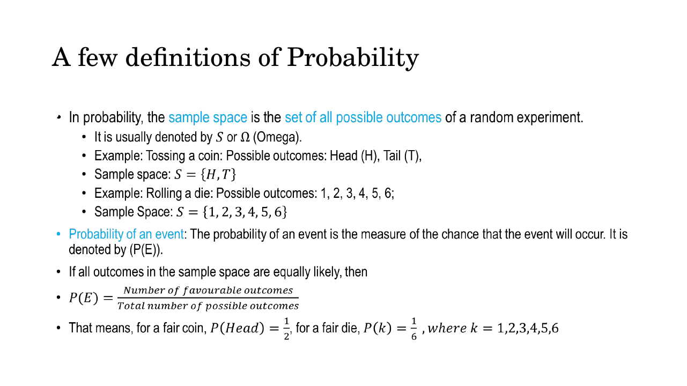
*Fig. — The "equally likely" clause is a genuine condition, not decoration. Drop it and the counting formula is simply wrong — a loaded die still has six outcomes. Slide 3.*

So $P(\text{Head}) = \tfrac12$ and $P(k) = \tfrac16$ for a fair die, $k = 1,\dots,6$.

The deck also gives the **frequentist** reading: run the experiment many times and

$$P(A) = \frac{\#(A)}{\#(\Omega)}$$

the count of times $A$ happened over the total number of trials. This is the definition that matters
for machine learning: a dataset of 50,000 images *is* a pile of empirical counts standing in for true
probabilities you cannot access.

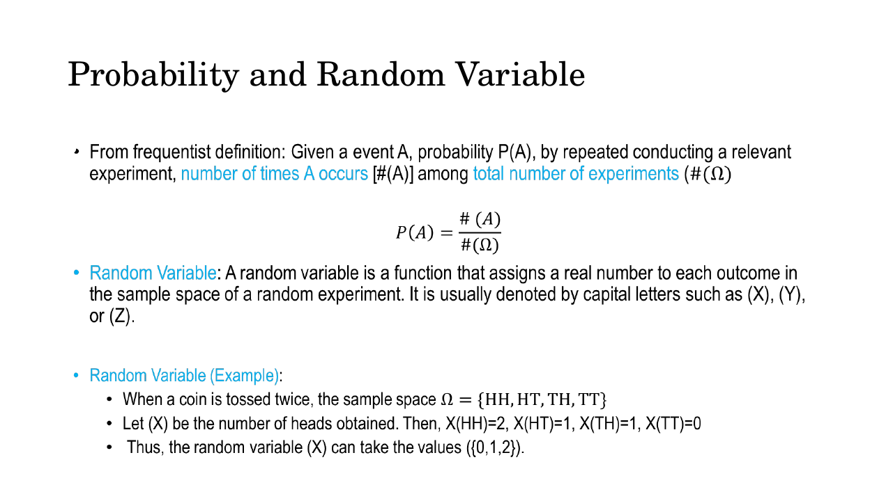
*Fig. — Two definitions of the same symbol: classical (count the sample space) and frequentist (count the experiments). Slide 4.*

Three facts follow immediately and are examined constantly:

| Rule | Statement |
|---|---|
| Range | $0 \le P(E) \le 1$ for every event |
| Certainty | $P(S) = 1$, $P(\emptyset) = 0$ |
| Complement | $P(\bar{A}) = 1 - P(A)$ |

The complement rule is the cheapest trick in probability. "At least one" problems are almost always
faster as $1 - P(\text{none})$.

### The addition rule, and mutual exclusivity

For the probability that **at least one** of two events occurs:

$$P(A \cup B) = P(A) + P(B) - P(A \cap B)$$

You subtract $P(A \cap B)$ because the outcomes in both events got counted twice, once in $P(A)$ and
once in $P(B)$. The quantity $P(A \cap B)$ — the probability that $A$ **and** $B$ both happen — is the
**joint probability**, and it is the central object of generative modelling: a model of $p(\mathbf{x}, y)$
is a generative model, a model of $p(y \mid \mathbf{x})$ is a discriminative one
([Lec 2](02-generative-vs-discriminative.md)).

Two events are **mutually exclusive** (disjoint) if they cannot both happen: $A \cap B = \emptyset$,
so $P(A \cap B) = 0$ and the correction term vanishes:

$$P(A \cup B) = P(A) + P(B) \qquad \text{(mutually exclusive only)}$$

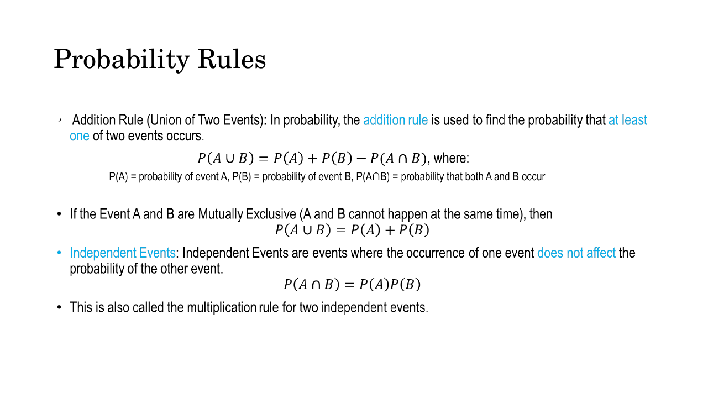
*Fig. — Two different special cases on one slide, and the deck does not warn you that they are different. Mutual exclusivity simplifies the **union**; independence simplifies the **intersection**. Slide 5.*

### Conditional probability

This is the idea the rest of the course is built on. **Conditional probability** is the probability of
an event *given that another event has already occurred*:

$$P(B \mid A) = \frac{P(A \cap B)}{P(A)}, \qquad \text{provided } P(A) \neq 0$$

Read it as a *rescaling*. Learning that $A$ happened means the sample space is no longer $S$, it is
$A$. So you ask how much of $A$ also lies in $B$ — that is $P(A \cap B)$ — and divide by the size of
the new universe, $P(A)$. The division is why $P(A) \neq 0$ is required: you cannot condition on
something impossible.

The deck's example: roll a fair die, $A = \{1,3,5\}$ (odd), $B = \{1\}$. Then

$$P(B \mid A) = \frac{n(A \cap B)}{n(A)} = \frac{1}{3} = \frac{P(A \cap B)}{P(A)} = \frac{1/6}{1/2} = \frac{1}{3}$$

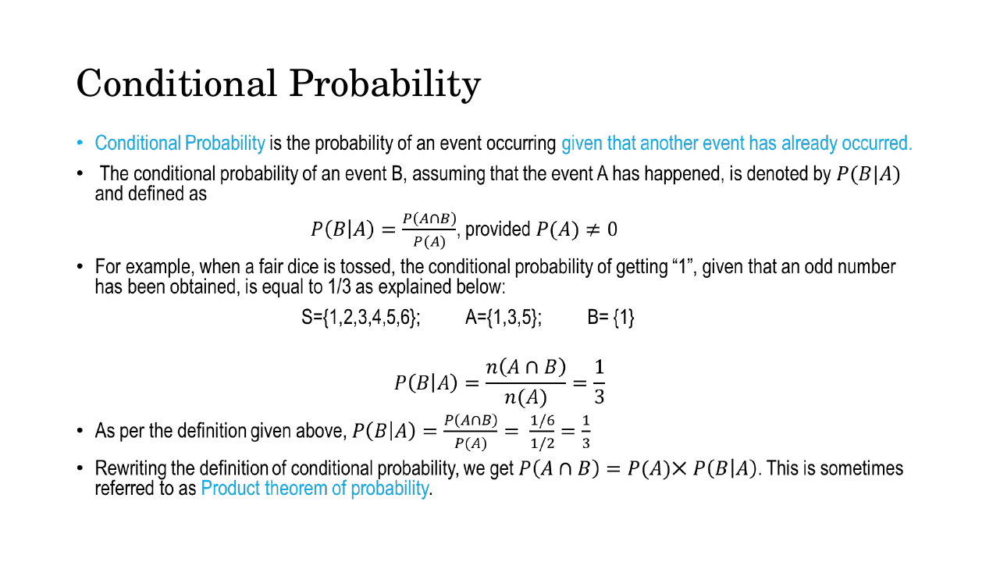
*Fig. — Both routes give 1/3: count outcomes inside the restricted space, or divide probabilities. Use whichever the question hands you. Slide 6.*

Note that $P(B\mid A) = 1/3$ while $P(B) = 1/6$: conditioning *changed* the probability. Information
moved the number. That is the whole mechanism by which a neural network "learns from evidence".

Rearranging the definition gives the **multiplication rule** (the deck calls it the **product theorem
of probability**):

$$P(A \cap B) = P(A) \times P(B \mid A) = P(B) \times P(A \mid B)$$

A joint probability is always a marginal times a conditional, and you may factor it in either order.
Applied repeatedly to $n$ variables this becomes the **chain rule**,
$p(x_1,\dots,x_n) = \prod_i p(x_i \mid x_1,\dots,x_{i-1})$ — the identity that autoregressive models
are built from. [Lec 6](06-probability-2.md) derives it and
[Lec 23](../week-06/23-autoregressive-pixelrnn-pixelcnn.md) turns it into a model that generates
images one pixel at a time.

### Independence — and why it is not mutual exclusivity

Events are **independent** when the occurrence of one does not affect the probability of the other.
Formally, if $A$ and $B$ are independent then

$$P(B \mid A) = P(B)$$

and substituting into the multiplication rule collapses it to a plain product:

$$P(A \cap B) = P(A)\,P(B)$$

The converse also holds, so $P(A \cap B) = P(A)P(B)$ is the *definition* you test numerically. For $n$
events the deck extends it to **total independence**:

$$P(A_1 \cap A_2 \cap \cdots \cap A_n) = P(A_1)\,P(A_2)\cdots P(A_n)$$

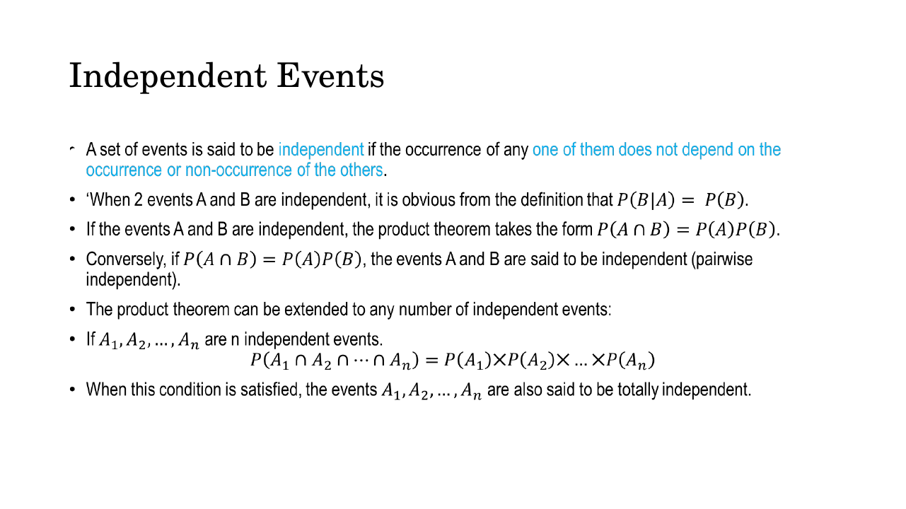
*Fig. — "Independent" is defined by a formula, not by intuition. Two events can feel unrelated and still be dependent; test the product. Slide 7.*

This is why latent priors in a VAE are chosen as $p(\mathbf{z}) = \mathcal{N}(\mathbf{0}, \mathbf{I})$:
a diagonal covariance makes the latent dimensions independent, so an $n$-dimensional density is just a
product of $n$ one-dimensional densities and nothing has to be learned about how they interact.

**The trap.** Mutually exclusive and independent are opposites far more often than they are the same
thing, and NPTEL asks about this almost every year:

| | Mutually exclusive | Independent |
|---|---|---|
| Definition | $P(A \cap B) = 0$ | $P(A \cap B) = P(A)P(B)$ |
| About | the **union** rule | the **intersection** rule |
| Knowing $A$ happened | tells you $B$ did **not** — maximum information | tells you nothing about $B$ |
| Can both hold? | only if $P(A) = 0$ or $P(B) = 0$ | same |

If $A$ and $B$ are mutually exclusive with non-zero probabilities, they are **necessarily dependent**:
$P(B \mid A) = 0 \neq P(B)$. Knowing one occurred is the strongest possible evidence about the other.

### The law of total probability

Suppose $B_1, B_2, \dots, B_n$ are **mutually exclusive and exhaustive** — they do not overlap and
together they cover the whole sample space. Then any event $A$ can be sliced across them:

$$P(A) = \sum_{i=1}^{n} P(B_i)\,P(A \mid B_i)$$

The reasoning is: exactly one $B_i$ must occur, so $A$ happens via exactly one of the routes
$A \cap B_i$. Add up the routes. Each route's probability is $P(B_i)P(A \mid B_i)$ by the
multiplication rule. This is how you compute $P(A)$ when nobody gives it to you directly, and it is
the denominator of Bayes' theorem.

Both conditions matter. If the $B_i$ overlap you double-count; if they do not cover $S$ you miss
routes and the total comes out too small.

### Bayes' theorem

Conditional probability runs in one direction; Bayes' theorem reverses it. Start from the
multiplication rule written both ways, $P(B_i \cap A) = P(B_i)P(A \mid B_i) = P(A)P(B_i \mid A)$, divide
by $P(A)$, and substitute the law of total probability for $P(A)$:

$$P(B_i \mid A) = \frac{P(B_i)\,P(A \mid B_i)}{P(A)} = \frac{P(B_i)\,P(A \mid B_i)}{\sum_{j=1}^{n} P(B_j)\,P(A \mid B_j)}$$

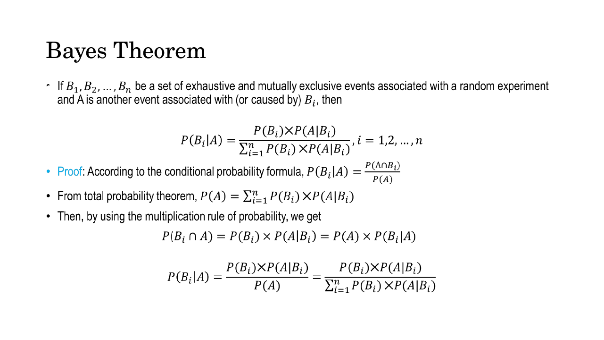
*Fig. — The proof is three lines and worth reproducing from memory: definition of conditional probability, then total probability for the denominator, then the multiplication rule for the numerator. Slide 8.*

Every term has a name, and the names are examined:

$$\underbrace{P(A \mid B)}_{\text{posterior}} = \frac{\overbrace{P(B \mid A)}^{\text{likelihood}}\;\overbrace{P(A)}^{\text{prior}}}{\underbrace{P(B)}_{\text{evidence}}}$$

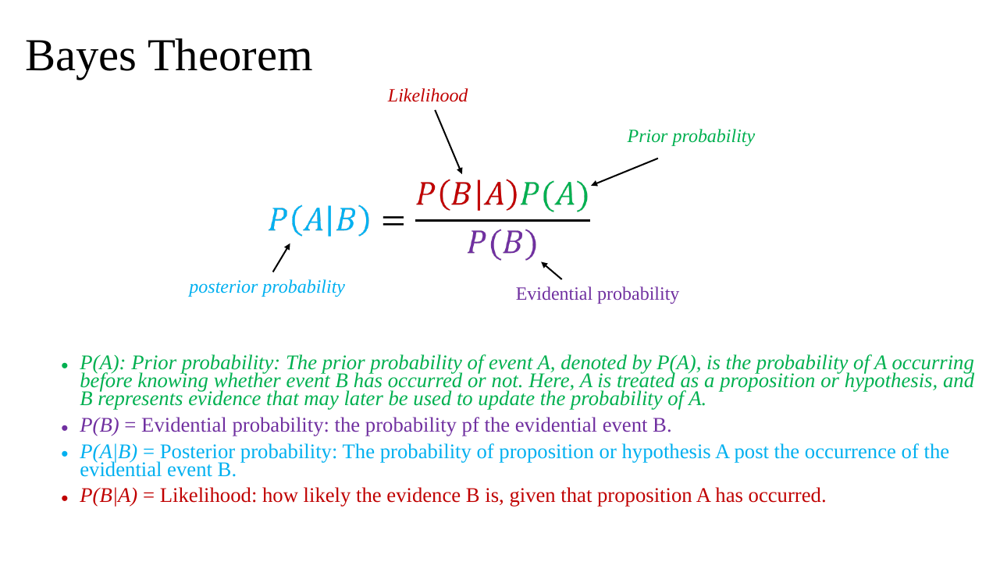
*Fig. — Memorise this diagram as a picture. $A$ is the hypothesis, $B$ is the evidence; the prior is what you believed before seeing $B$, the posterior is what you believe after. Slide 10.*

| Term | Symbol | Meaning |
|---|---|---|
| Prior | $P(A)$ | belief in hypothesis $A$ **before** seeing evidence |
| Likelihood | $P(B \mid A)$ | how probable the evidence is **if** $A$ is true |
| Evidence / evidential probability | $P(B)$ | total probability of seeing that evidence at all |
| Posterior | $P(A \mid B)$ | updated belief in $A$ **after** seeing evidence $B$ |

Three places this returns:

- **Generative vs discriminative.** A discriminative model learns $p(y \mid \mathbf{x})$ directly. A
  generative classifier learns $p(\mathbf{x} \mid y)$ and $p(y)$ and uses Bayes to get
  $p(y \mid \mathbf{x}) \propto p(\mathbf{x}\mid y)p(y)$. That one equation is the whole distinction
  ([Lec 2](02-generative-vs-discriminative.md)).
- **MLE and MAP.** Maximising the likelihood versus maximising the posterior differ by exactly the
  prior factor ([Lec 6](06-probability-2.md), [Lec 22](../week-06/22-generative-taxonomy-and-mle.md)).
- **The VAE.** The posterior $p_\theta(\mathbf{z} \mid \mathbf{x}) = p_\theta(\mathbf{x}\mid\mathbf{z})p(\mathbf{z})/p_\theta(\mathbf{x})$
  is unavailable because the evidence $p_\theta(\mathbf{x}) = \int p_\theta(\mathbf{x}\mid\mathbf{z})p(\mathbf{z})\,d\mathbf{z}$
  is an intractable integral. The encoder $q_\phi(\mathbf{z}\mid\mathbf{x})$ exists purely to
  approximate it ([Lec 30](../week-08/30-elbo-and-reparameterization.md)).

The deck's application is a lab test for gluten allergy, worked in N1 below.

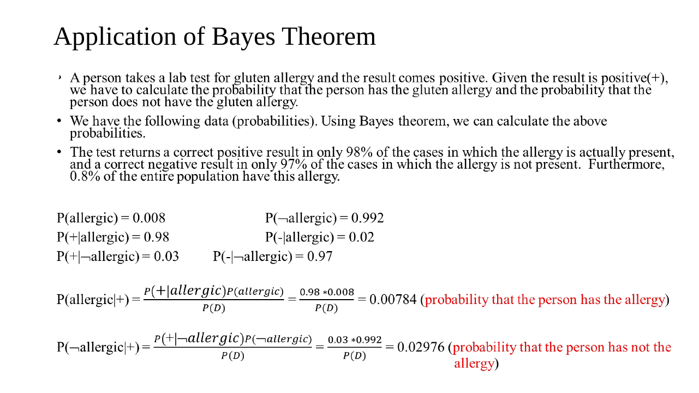
*Fig. — Careful: the deck leaves $P(D)$ un-evaluated, so 0.00784 and 0.02976 are **unnormalised numerators**, not probabilities — they do not sum to 1. N1 finishes the job. Slide 9.*

### Random variables

A **random variable** is a *function* that assigns a real number to each outcome in the sample space.
Written with capitals: $X$, $Y$, $Z$. It is the bridge from "the coin showed heads" to arithmetic.

The deck's example: toss a coin twice, $\Omega = \{HH, HT, TH, TT\}$, and let $X$ be the number of
heads. Then $X(HH) = 2$, $X(HT) = 1$, $X(TH) = 1$, $X(TT) = 0$, so $X$ takes values in $\{0, 1, 2\}$.
Notice that two different outcomes map to the same value — a random variable is allowed to lose
information, and that is usually the point.

Two types:

| Type | Takes | Examples |
|---|---|---|
| **Discrete** | finitely many or countably many values | number of heads in three tosses, a class label, a pixel's 0–255 intensity |
| **Continuous** | any value in an interval | height, weight, temperature, a VAE latent coordinate |

### Discrete random variables and the PMF

If $X$ takes values $x_1, x_2, \dots$ with $P(X = x_i) = p_i$, then $p_i$ is the **probability function**,
also called the **probability mass function (PMF)**. It is valid exactly when

$$p_i \ge 0 \ \text{ for all } i, \qquad \sum_i p_i = 1$$

The collection of pairs $\{x_i, p_i\}$ is the **probability distribution** of $X$, usually drawn as a
two-column table.

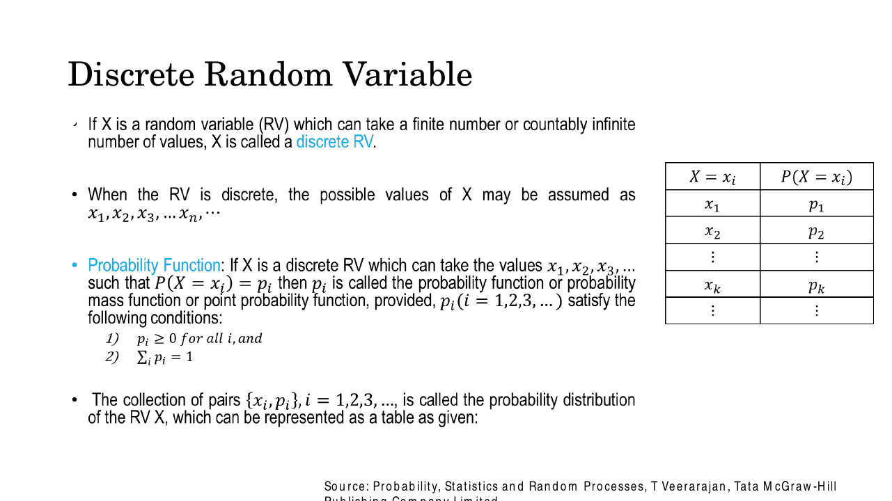
*Fig. — The two conditions are the whole definition. Any exam question of the form "find $k$ such that this is a valid distribution" is solved by setting the column sum to 1. Slide 12.*

For a discrete variable, $P(X = x_i)$ is a genuine probability and can never exceed 1.

### Continuous random variables and the PDF

For a continuous $X$ there are uncountably many possible values, so $P(X = x) = 0$ for every single
$x$ — individual points have no probability mass. What exists instead is **density**. The deck defines
the **probability density function** $f(x)$ through an infinitesimal window:

$$P\left\{x - \tfrac{1}{2}dx \le X \le x + \tfrac{1}{2}dx\right\} = f(x)\,dx$$

$f(x)$ is a probability *per unit $x$*; only after multiplying by a width does it become a probability.
Validity conditions mirror the discrete ones, with the sum becoming an integral:

$$f(x) \ge 0 \ \text{ for all } x \in R_x, \qquad \int_{R_x} f(x)\,dx = 1$$

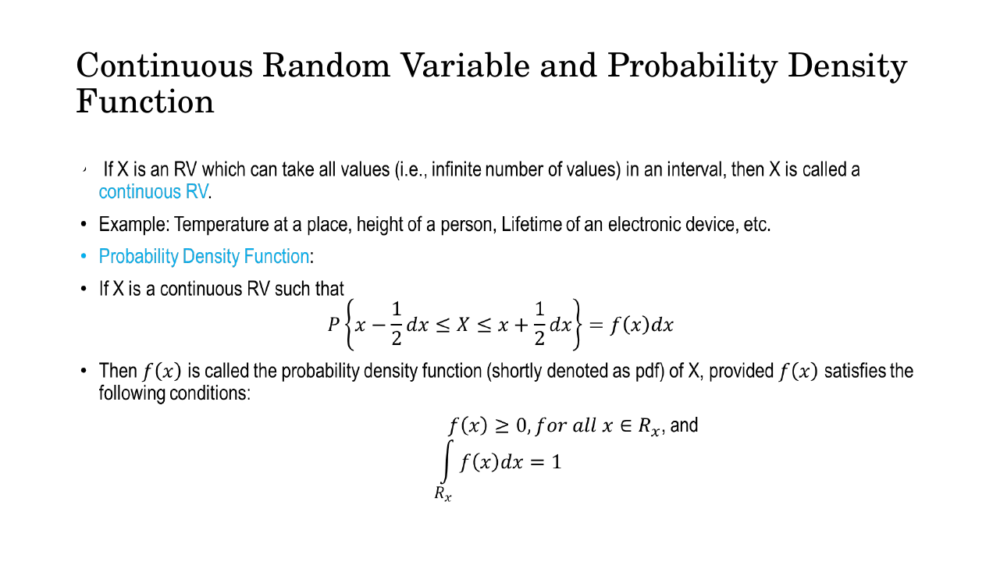
*Fig. — The $dx$ on the right-hand side is doing all the work. Without it, $f(x)$ is not a probability and is not bounded by 1. Slide 13.*

Probability over an interval is the **area under the curve**:

$$P(a \le X \le b) = \int_a^b f(x)\,dx$$

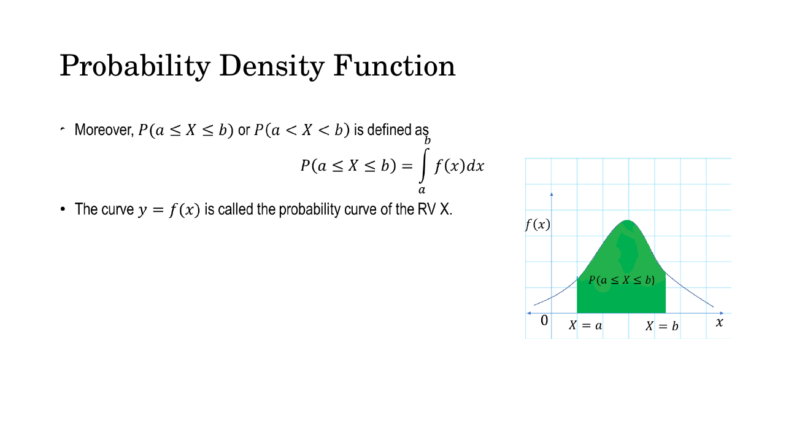
*Fig. — Because single points carry zero probability, $P(a \le X \le b)$ and $P(a < X < b)$ are **equal** for a continuous variable. The deck writes both deliberately. Slide 14.*

**A PDF value may be greater than 1.** This is the single most reliable MCQ trap in this lecture.
A uniform density on $[0, 0.5]$ has $f(x) = 2$ everywhere on that interval, and the area is still
$2 \times 0.5 = 1$. What must never exceed 1 is the *integral*, not the height. For a PMF the heights
are probabilities and are capped at 1; for a PDF they are densities and are not.

### The cumulative distribution function

The **CDF** works for discrete and continuous variables alike:

$$F(x) = P(X \le x)$$

$$F(x) = \sum_{j\,:\,x_j \le x} p_j \quad \text{(discrete)}, \qquad F(x) = \int_{-\infty}^{x} f(t)\,dt \quad \text{(continuous)}$$

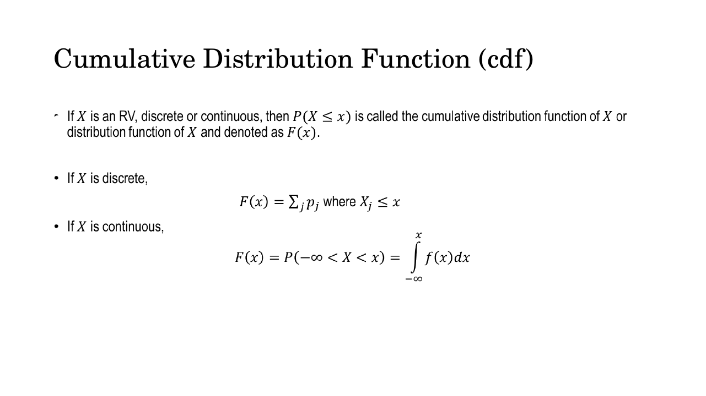
*Fig. — One definition, two mechanics. The CDF is always non-decreasing, runs from 0 to 1, and is a **step function** in the discrete case and continuous in the continuous case. Slide 15.*

Properties worth having automatic: $F(-\infty) = 0$, $F(\infty) = 1$, $F$ never decreases, and
$P(a \le X \le b) = F(b) - F(a)$. In the continuous case differentiating recovers the density,
$f(x) = dF/dx$ — PDF and CDF are derivative and integral of each other.

### Two densities the course actually uses

The deck closes the density material with the two PDFs you will meet again.

**Uniform.** $f(x) = \dfrac{1}{b-a}$ for $a \le x \le b$, zero elsewhere — a rectangle of height
$1/(b-a)$ and width $b-a$, so area 1 by construction. This is what a random number generator produces.

**Gaussian (normal).** For $-\infty < X < \infty$,

$$f(x) = \frac{1}{\sigma\sqrt{2\pi}}\,e^{-(x-\mu)^2/2\sigma^2}, \qquad X \sim \mathcal{N}(\mu, \sigma)$$

with $\mu$ the mean (where the peak sits) and $\sigma$ the standard deviation (how wide it is).

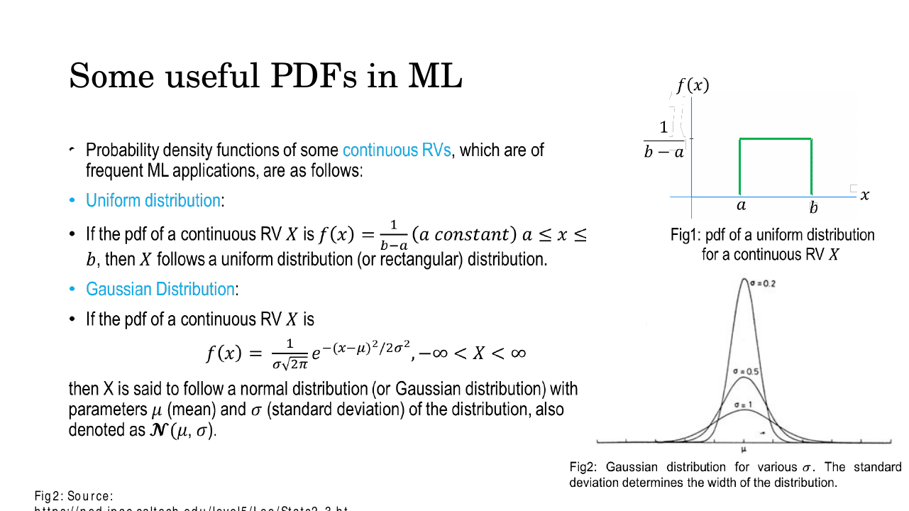
*Fig. — Note the deck writes $\mathcal{N}(\mu, \sigma)$ with the **standard deviation** as the second argument. Much of the literature — and the VAE lectures — write $\mathcal{N}(\mu, \sigma^2)$ with the variance. Always check which. Slide 16.*

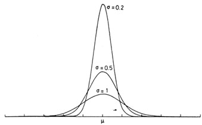
*Fig. — Area is fixed at 1, so narrower means taller. The $\sigma = 0.2$ curve peaks above 2 — a direct demonstration that a density value is not a probability. Slide 16, Fig 2.*

The multivariate form, the covariance matrix, and why $\mathcal{N}(\mathbf{0},\mathbf{I})$ is the
default latent prior belong to [Lec 6](06-probability-2.md) and
[Lec 30](../week-08/30-elbo-and-reparameterization.md).

### Mean and variance

The **mathematical expectation** (mean, arithmetic mean) of a random variable is the probability-weighted
average of its values:

$$\mu = \mathbb{E}[X] = \sum_i x_i p_i \quad \text{(discrete)}, \qquad \mu = \mathbb{E}[X] = \int_{R_x} x f(x)\,dx \quad \text{(continuous)}$$

The **variance** measures how far values spread around the mean:

$$\mathrm{Var}(X) = \mathbb{E}\big[(X - \mu)^2\big] = \sum_i (x_i - \mu)^2 p_i = \int_{-\infty}^{\infty} (x-\mu)^2 f(x)\,dx$$

![Slide defining expectation E(X) = Σ x_i p_i and the integral form, then variance as E[(X − μ)²]](../../assets/slides/W1_L2P2_Probability-1/s-17.png)
*Fig. — The deck writes $E(X)$; this book writes $\mathbb{E}[X]$. Same object. Slide 17.*

The squaring is what makes positive and negative deviations both count as spread rather than
cancelling. The **standard deviation** $\sigma = \sqrt{\mathrm{Var}(X)}$ puts the number back in the
original units. In practice always compute variance with the shortcut

$$\mathrm{Var}(X) = \mathbb{E}[X^2] - \mu^2$$

which is algebraically identical and needs one pass instead of two. [Lec 6](06-probability-2.md)
extends this to covariance between two variables.

## Worked numericals

### N1. Bayes with a medical test — the counterintuitive one
**Given:** (the deck's gluten-allergy test) prevalence $P(A) = 0.008$; sensitivity
$P(+ \mid A) = 0.98$; false-positive rate $P(+ \mid \bar{A}) = 0.03$.
**Find:** $P(A \mid +)$, the probability the person actually has the allergy given a positive test.

1. Complement: $P(\bar{A}) = 1 - 0.008 = 0.992$.
2. Numerator (allergic branch): $P(+\mid A)P(A) = 0.98 \times 0.008 = 0.00784$.
3. Other branch: $P(+\mid \bar{A})P(\bar{A}) = 0.03 \times 0.992 = 0.02976$.
4. Evidence by total probability: $P(+) = 0.00784 + 0.02976 = 0.03760$.
5. $P(A \mid +) = \dfrac{0.00784}{0.03760} = 0.2085$.
6. $P(\bar{A} \mid +) = \dfrac{0.02976}{0.03760} = 0.7915$. Check: $0.2085 + 0.7915 = 1$ ✓.

**Answer:** $P(A \mid +) \approx \mathbf{0.209}$, about **21%**. A test that is 98% sensitive and 97%
specific still leaves a positive result about 79% likely to be a false alarm, because the disease is
rare: there are 124 times more healthy people, and 3% of a huge group beats 98% of a tiny one. The
deck stops at steps 2 and 3 and never divides — those two figures are numerators, not probabilities.

### N2. Law of total probability, then Bayes in reverse
**Given:** three machines produce a factory's output. $M_1$: 50% of items, 3% defective.
$M_2$: 30% of items, 4% defective. $M_3$: 20% of items, 5% defective.
**Find:** (a) $P(D)$, the chance a random item is defective; (b) given a defective item, which machine
most likely made it.

1. The $M_i$ are mutually exclusive and exhaustive: $0.5 + 0.3 + 0.2 = 1$ ✓. Total probability applies.
2. Route 1: $P(M_1)P(D\mid M_1) = 0.50 \times 0.03 = 0.0150$.
3. Route 2: $P(M_2)P(D\mid M_2) = 0.30 \times 0.04 = 0.0120$.
4. Route 3: $P(M_3)P(D\mid M_3) = 0.20 \times 0.05 = 0.0100$.
5. $P(D) = 0.0150 + 0.0120 + 0.0100 = 0.0370$.
6. $P(M_1 \mid D) = 0.0150/0.0370 = 0.4054$.
7. $P(M_2 \mid D) = 0.0120/0.0370 = 0.3243$.
8. $P(M_3 \mid D) = 0.0100/0.0370 = 0.2703$. Sum $= 1.0000$ ✓.

**Answer:** $P(D) = \mathbf{0.037}$ (3.7%). Most likely culprit is $\mathbf{M_1}$ at **40.5%**, even
though it is the *least* defect-prone machine — it simply makes the most items. Compare with the raw
defect rates (3%, 4%, 5%), whose ranking is reversed: that reversal is the point of the question.

### N3. Conditional probabilities from a joint table, plus two independence checks
**Given:** two binary variables with joint distribution

| | $B=0$ | $B=1$ | **row total** |
|---|---|---|---|
| $A=0$ | 0.30 | 0.20 | **0.50** |
| $A=1$ | 0.12 | 0.38 | **0.50** |
| **col total** | **0.42** | **0.58** | **1.00** |

**Find:** $P(A=1 \mid B=1)$, $P(B=1 \mid A=1)$; are $A$ and $B$ independent? mutually exclusive?

1. The **marginals** are the row and column sums: $P(A=1) = 0.12 + 0.38 = 0.50$, $P(B=1) = 0.20 + 0.38 = 0.58$.
2. Grand total $= 0.30+0.20+0.12+0.38 = 1.00$ ✓, so the table is a valid distribution.
3. $P(A=1 \mid B=1) = \dfrac{P(A=1, B=1)}{P(B=1)} = \dfrac{0.38}{0.58} = 0.6552$.
4. $P(B=1 \mid A=1) = \dfrac{P(A=1, B=1)}{P(A=1)} = \dfrac{0.38}{0.50} = 0.7600$.
5. Independence test: $P(A=1)P(B=1) = 0.50 \times 0.58 = 0.29$, but the joint is $0.38$. $0.29 \neq 0.38$.
6. Mutual exclusivity test: $P(A=1, B=1) = 0.38 \neq 0$.

**Answer:** $P(A=1\mid B=1) = \mathbf{0.655}$ and $P(B=1\mid A=1) = \mathbf{0.760}$ — **same numerator,
different denominator, different answers.** $A$ and $B$ are **not independent** ($0.29 \neq 0.38$) and
**not mutually exclusive** ($0.38 \neq 0$). Both tests fail, which is the normal state of affairs.

### N4. Finding the normalising constant of a PDF
**Given:** $f(x) = c\,x^2$ for $0 \le x \le 2$, and $f(x) = 0$ elsewhere.
**Find:** $c$; then $P(1 \le X \le 2)$; then $F(x)$; then $f(2)$.

1. Normalisation: $\displaystyle\int_0^2 c x^2\,dx = c\left[\frac{x^3}{3}\right]_0^2 = c\cdot\frac{8}{3} = 1$.
2. So $c = \dfrac{3}{8} = 0.375$. (Non-negative on $[0,2]$, so the other condition holds too.)
3. $P(1 \le X \le 2) = \displaystyle\int_1^2 \frac{3}{8}x^2\,dx = \frac{3}{8}\left[\frac{x^3}{3}\right]_1^2 = \frac{1}{8}(8-1) = \frac{7}{8} = 0.875$.
4. CDF: $F(x) = \displaystyle\int_0^x \frac{3}{8}t^2\,dt = \frac{x^3}{8}$ for $0 \le x \le 2$ (0 below, 1 above).
5. Cross-check: $F(2) - F(1) = \dfrac{8}{8} - \dfrac{1}{8} = \dfrac{7}{8}$ ✓.
6. Density at the right endpoint: $f(2) = \dfrac{3}{8}(4) = 1.5$.

**Answer:** $c = \mathbf{3/8}$, $P(1\le X\le 2) = \mathbf{7/8} = 0.875$, $F(x) = x^3/8$ on $[0,2]$.
And note step 6: $f(2) = \mathbf{1.5 > 1}$ for a perfectly valid density. Heights are not probabilities.

### N5. PMF, CDF, mean and variance of a discrete variable
**Given:** three fair coins are tossed; $X$ = number of heads. All 8 outcomes equally likely.
**Find:** the PMF, the CDF at each value, $\mathbb{E}[X]$ and $\mathrm{Var}(X)$.

1. Count outcomes: $X=0$: $TTT$ (1 way). $X=1$: $HTT, THT, TTH$ (3). $X=2$: $HHT, HTH, THH$ (3). $X=3$: $HHH$ (1).
2. PMF: $p_0 = 1/8$, $p_1 = 3/8$, $p_2 = 3/8$, $p_3 = 1/8$. Check $\sum p_i = (1+3+3+1)/8 = 1$ ✓.
3. CDF: $F(0) = 1/8 = 0.125$, $F(1) = 4/8 = 0.5$, $F(2) = 7/8 = 0.875$, $F(3) = 8/8 = 1$. Non-decreasing, ends at 1 ✓.
4. $\mathbb{E}[X] = 0(\tfrac18) + 1(\tfrac38) + 2(\tfrac38) + 3(\tfrac18) = \dfrac{0 + 3 + 6 + 3}{8} = \dfrac{12}{8} = 1.5$.
5. $\mathbb{E}[X^2] = 0(\tfrac18) + 1(\tfrac38) + 4(\tfrac38) + 9(\tfrac18) = \dfrac{0+3+12+9}{8} = \dfrac{24}{8} = 3$.
6. $\mathrm{Var}(X) = \mathbb{E}[X^2] - \mu^2 = 3 - (1.5)^2 = 3 - 2.25 = 0.75$.
7. Direct check: $\sum (x_i-\mu)^2 p_i = \dfrac{2.25 + 0.75 + 0.75 + 2.25}{8} = \dfrac{6}{8} = 0.75$ ✓.

**Answer:** $\mathbb{E}[X] = \mathbf{1.5}$, $\mathrm{Var}(X) = \mathbf{0.75}$, $\sigma \approx 0.866$.
The mean 1.5 is a value $X$ can never actually take — an expectation is an average, not a prediction.

## Code

```python
import numpy as np

# --- N1: Bayes for the gluten-allergy test ------------------------------
p_A      = 0.008          # prior: prevalence
p_pos_A  = 0.98           # likelihood: sensitivity
p_pos_nA = 0.03           # false-positive rate
num_A  = p_pos_A  * p_A            # 0.00784  <- the deck stops here
num_nA = p_pos_nA * (1 - p_A)      # 0.02976
p_pos  = num_A + num_nA            # evidence, by total probability
print(f"P(+) = {p_pos:.5f}   P(allergic|+) = {num_A/p_pos:.4f}")
# P(+) = 0.03760   P(allergic|+) = 0.2085

# --- N2: total probability over three machines, then reverse ------------
prior  = np.array([0.50, 0.30, 0.20])     # share of output
defect = np.array([0.03, 0.04, 0.05])     # P(defective | machine)
p_D    = prior @ defect                   # law of total probability
post   = prior * defect / p_D             # Bayes, all three at once
print(f"P(D) = {p_D:.4f}   posteriors = {np.round(post, 4)}")
# P(D) = 0.0370   posteriors = [0.4054 0.3243 0.2703]

# --- N3: marginals, conditionals and independence from a joint table ----
J = np.array([[0.30, 0.20],      # rows: A=0,1   cols: B=0,1
              [0.12, 0.38]])
pA, pB = J.sum(axis=1), J.sum(axis=0)         # marginals = row / col sums
print("P(A=1|B=1) =", round(J[1,1]/pB[1], 4)) # P(A=1|B=1) = 0.6552
print("P(B=1|A=1) =", round(J[1,1]/pA[1], 4)) # P(B=1|A=1) = 0.76
print("independent?", np.allclose(J, np.outer(pA, pB)))   # independent? False

# --- N4: normalising a density, numerically -----------------------------
x  = np.linspace(0, 2, 200_001)
c  = 1.0 / np.trapezoid(x**2, x)              # solve  int c x^2 dx = 1
f  = c * x**2
print(f"c = {c:.4f}   f(2) = {f[-1]:.2f}")    # c = 0.3750   f(2) = 1.50
mask = x >= 1
print("P(1<=X<=2) =", round(float(np.trapezoid(f[mask], x[mask])), 4))
# P(1<=X<=2) = 0.875

# --- N5: PMF, mean and variance of 3 coin tosses ------------------------
vals = np.array([0, 1, 2, 3])
pmf  = np.array([1, 3, 3, 1]) / 8
mu   = (vals * pmf).sum()
var  = ((vals**2) * pmf).sum() - mu**2        # E[X^2] - mu^2
print(f"CDF = {np.round(pmf.cumsum(), 3)}  mean = {mu}  var = {var}")
# CDF = [0.125 0.5   0.875 1.   ]  mean = 1.5  var = 0.75
```

(On NumPy older than 2.0, use `np.trapz` instead of `np.trapezoid`.)

## Exam pack

### Must-memorise

| Item | Exactly this |
|---|---|
| Classical probability | $P(E) = \dfrac{\text{favourable outcomes}}{\text{total outcomes}}$, **equally likely only** |
| Frequentist probability | $P(A) = \#(A)/\#(\Omega)$ |
| Range | $0 \le P(E) \le 1$; $P(S)=1$; $P(\emptyset)=0$ |
| Complement | $P(\bar{A}) = 1 - P(A)$ |
| Addition rule | $P(A\cup B) = P(A)+P(B)-P(A\cap B)$ |
| Mutually exclusive | $P(A\cap B)=0 \Rightarrow P(A\cup B)=P(A)+P(B)$ |
| Conditional probability | $P(B\mid A) = \dfrac{P(A\cap B)}{P(A)}$, $P(A)\neq 0$ |
| Multiplication / product theorem | $P(A\cap B)=P(A)P(B\mid A)=P(B)P(A\mid B)$ |
| Independence | $P(A\cap B)=P(A)P(B)$, equivalently $P(B\mid A)=P(B)$ |
| $n$-event independence | $P(A_1\cap\cdots\cap A_n)=\prod_i P(A_i)$ |
| Law of total probability | $P(A)=\sum_{i} P(B_i)P(A\mid B_i)$, $B_i$ exhaustive **and** mutually exclusive |
| Bayes' theorem | $P(B_i\mid A)=\dfrac{P(B_i)P(A\mid B_i)}{\sum_j P(B_j)P(A\mid B_j)}$ |
| Bayes vocabulary | posterior $=\dfrac{\text{likelihood}\times\text{prior}}{\text{evidence}}$ |
| Random variable | a **function** from sample space to $\mathbb{R}$ |
| PMF validity | $p_i\ge 0$ and $\sum_i p_i = 1$ |
| PDF validity | $f(x)\ge 0$ and $\int_{R_x} f(x)dx = 1$ |
| Interval probability | $P(a\le X\le b)=\int_a^b f(x)dx$ |
| CDF | $F(x)=P(X\le x)$; $=\sum_{x_j\le x}p_j$ or $\int_{-\infty}^x f(t)dt$ |
| CDF ↔ PDF | $f(x)=dF/dx$; $P(a\le X\le b)=F(b)-F(a)$ |
| Uniform pdf | $f(x)=\dfrac{1}{b-a}$ on $[a,b]$ |
| Gaussian pdf | $f(x)=\dfrac{1}{\sigma\sqrt{2\pi}}e^{-(x-\mu)^2/2\sigma^2}$ |
| Expectation | $\mathbb{E}[X]=\sum_i x_ip_i$ or $\int x f(x)dx$ |
| Variance | $\mathrm{Var}(X)=\mathbb{E}[(X-\mu)^2]=\mathbb{E}[X^2]-\mu^2$ |

### Numbers worth knowing

| Quantity | Value |
|---|---|
| Deck's die example $P(\{1\} \mid \text{odd})$ | $1/3$ (vs unconditional $1/6$) |
| Deck's gluten test: prevalence / sensitivity / false-positive | 0.008 / 0.98 / 0.03 |
| Deck's gluten test: specificity $P(-\mid\bar{A})$ | 0.97 |
| Deck's quoted numerators | 0.00784 and 0.02976 — **not** probabilities |
| Completed posterior $P(\text{allergic}\mid +)$ | 0.209 (≈21%) |
| Two coin tosses, $X$ = heads | $\Omega=\{HH,HT,TH,TT\}$, $X\in\{0,1,2\}$ |
| Three coin tosses, $X$ = heads | PMF $(1,3,3,1)/8$; mean 1.5; variance 0.75 |
| $P(X=x)$ for continuous $X$ | exactly 0, for every $x$ |
| Max value of a PDF | unbounded — may exceed 1 |
| Max value of a PMF entry | 1 |
| Gaussian parameters in the deck's notation | $\mathcal{N}(\mu, \sigma)$ — second argument is the **standard deviation** |

### Likely MCQ traps

- **$P(A\mid B)$ confused with $P(B\mid A)$.** They share the numerator $P(A\cap B)$ but divide by
  different things, so they are almost never equal. In N3, $0.655$ versus $0.760$. In a medical test,
  $P(+\mid\text{disease}) = 0.98$ while $P(\text{disease}\mid +) = 0.21$ — a factor of five apart.
  Read which event is *given* before touching the arithmetic.
- **"Mutually exclusive means independent."** The near-universal trap. Mutually exclusive means
  $P(A\cap B)=0$; independent means $P(A\cap B)=P(A)P(B)$. If both $P(A)>0$ and $P(B)>0$, mutually
  exclusive events are **maximally dependent**, because $P(B\mid A)=0 \neq P(B)$. Disjointness is a
  statement about the *union* rule; independence is about the *intersection* rule.
- **"A PDF value cannot exceed 1."** False. $f(x)$ is a density. Uniform on $[0,0.5]$ has $f=2$;
  N4 has $f(2)=1.5$. Only the integral is capped at 1. For a **PMF** the cap does apply.
- **"$P(X = x) > 0$ for a continuous variable."** It is exactly 0. Hence $P(a\le X\le b) = P(a<X<b)$
  for continuous variables — endpoints contribute nothing. For a **discrete** variable they do, and
  the two differ.
- **Applying $P(A\cup B)=P(A)+P(B)$ without checking disjointness.** Only valid when
  $P(A\cap B)=0$. Otherwise you over-count and can produce a "probability" above 1.
- **Applying $P(A\cap B)=P(A)P(B)$ without checking independence.** The general rule is
  $P(A)P(B\mid A)$. The product form is a special case, not the definition.
- **Forgetting the denominator in Bayes.** The deck itself leaves $P(D)$ symbolic; numerators that do
  not sum to 1 are not probabilities. If your posteriors across an exhaustive set do not total 1, you
  skipped the normalisation.
- **Using the law of total probability on overlapping or incomplete partitions.** The $B_i$ must be
  both mutually exclusive *and* exhaustive. Check $\sum_i P(B_i)=1$ first.
- **"A random variable is a variable."** It is a *function* from the sample space to the reals. The
  deck says so explicitly, which usually means it is examined.
- **Confusing prior with posterior.** $P(A)$ is before evidence, $P(A\mid B)$ is after. Likelihood is
  $P(B\mid A)$ — evidence given hypothesis, i.e. the reverse direction from the posterior.
- **Reading $\mathcal{N}(\mu,\sigma)$ as variance.** This deck's second argument is the standard
  deviation. Later lectures use $\mathcal{N}(\mu,\sigma^2)$. Check the square.

### Self-test

1. A fair die is rolled. $A$ = "even", $B$ = "greater than 3". Find $P(A\cup B)$.
2. Are $A$ and $B$ from question 1 independent?
3. $P(A)=0.4$, $P(B)=0.5$, $P(A\cap B)=0.2$. Find $P(A\mid B)$ and $P(B\mid A)$.
4. Two events have $P(A)=0.3$ and $P(B)=0.4$ and are mutually exclusive. What is $P(A\mid B)$? Are they independent?
5. A bag has 60% red and 40% blue balls. 10% of red and 25% of blue are cracked. A ball is cracked — what is $P(\text{blue}\mid\text{cracked})$?
6. $f(x) = kx$ on $[0,3]$, zero elsewhere. Find $k$ and $P(X \le 1)$.
7. True or false: if $f(1.4) = 2.1$ then $f$ is not a valid PDF.
8. $X$ has PMF $P(0)=0.2$, $P(1)=0.5$, $P(2)=0.3$. Find $\mathbb{E}[X]$ and $\mathrm{Var}(X)$.
9. A spam filter: 20% of mail is spam; "free" appears in 60% of spam and 5% of ham. An email contains "free". Is it more likely spam or ham?
10. Write $P(x_1,x_2,x_3)$ as a product of three factors using the multiplication rule twice.

<details><summary>Answers</summary>

1. $A=\{2,4,6\}$, $B=\{4,5,6\}$, $A\cap B=\{4,6\}$. $P = \tfrac36+\tfrac36-\tfrac26 = \tfrac46 = \tfrac23$.
2. $P(A)P(B) = \tfrac12\cdot\tfrac12 = \tfrac14$, but $P(A\cap B)=\tfrac26=\tfrac13$. $\tfrac14\neq\tfrac13$, so **not** independent.
3. $P(A\mid B)=0.2/0.5=0.4$; $P(B\mid A)=0.2/0.4=0.5$. Note $P(A\mid B)=P(A)=0.4$, so here they *are* independent.
4. $P(A\mid B)=P(A\cap B)/P(B)=0/0.4=0$. Not independent — independence would require $P(A\mid B)=0.3$. Mutually exclusive events with non-zero probabilities are always dependent.
5. $P(\text{cr}) = 0.6(0.10)+0.4(0.25) = 0.06+0.10 = 0.16$. $P(\text{blue}\mid\text{cr}) = 0.10/0.16 = 0.625$.
6. $\int_0^3 kx\,dx = k\cdot\tfrac92 = 1 \Rightarrow k = \tfrac29$. $P(X\le1) = \int_0^1 \tfrac29 x\,dx = \tfrac29\cdot\tfrac12 = \tfrac19 \approx 0.111$.
7. **False.** A density may exceed 1 at a point; only $\int f = 1$ is required.
8. $\mathbb{E}[X] = 0(0.2)+1(0.5)+2(0.3) = 1.1$. $\mathbb{E}[X^2] = 0+0.5+4(0.3) = 1.7$. $\mathrm{Var} = 1.7-1.21 = 0.49$.
9. $P(\text{free}) = 0.2(0.6)+0.8(0.05) = 0.12+0.04 = 0.16$. $P(\text{spam}\mid\text{free}) = 0.12/0.16 = 0.75$. **Spam**, three times out of four.
10. $P(x_1,x_2,x_3) = P(x_1)\,P(x_2\mid x_1)\,P(x_3\mid x_1,x_2)$ — the chain rule, generalised in [Lec 6](06-probability-2.md).

</details>

## Beyond the slides

**Gap:** The deck's Bayes application (slide 9) never evaluates $P(D)$, so it reports 0.00784 and
0.02976 as if they were answers.
**Why it matters:** Those are unnormalised numerators and sum to 0.0376, not 1. The actual posterior is
0.209. Writing an un-normalised number on an exam loses the mark, and the *point* of the example — that
a rare condition makes most positives false — is invisible until you divide.

**Gap:** The law of total probability appears only inside the Bayes proof, never as a named result with
its own conditions.
**Why it matters:** It is examined on its own ("what fraction of output is defective?"), and its two
preconditions — mutually exclusive *and* exhaustive — are exactly what a trick question violates.

**Gap:** The deck never states that mutually exclusive and independent are different, despite putting
both formulas on slide 5.
**Why it matters:** This is the most reliably examined confusion in elementary probability. Disjoint
events with non-zero probability are maximally dependent.

**Gap:** Nothing says a PDF value may exceed 1, and the deck's own $\sigma=0.2$ Gaussian plot peaks
near 2 without comment.
**Why it matters:** "Which of these cannot be a valid PDF?" is a standard MCQ, and the wrong instinct
("the one that goes above 1") is the trap being baited.

**Gap:** The shortcut $\mathrm{Var}(X) = \mathbb{E}[X^2] - \mu^2$ is absent; only the definitional form
is given.
**Why it matters:** It is faster, less error-prone by hand, and the form every library and every later
derivation actually uses.

## Cut from the slides

Dropped the title slide (1), the outline slide (2), the summary slide (19) and the "next lecture"
slide (20) — pure navigation, and slides 2 and 19 are identical lists. Slides 4 and 11 share the
heading "Probability and Random Variable" and are merged: slide 4 gives the frequentist definition and
the random-variable definition, slide 11 only adds the discrete/continuous split, so they are taught as
one block. Slides 13 and 14 together define the PDF and then its interval integral; both are kept but
presented as a single development. Slides 17 and 18 both read "Mean and Variance" and state the
discrete and continuous forms of the same two quantities, so they are compressed into one subsection
with a single figure rather than two near-identical renders. The decorative uniform-distribution
fragment in `assets/figures/` duplicates what slide 16 already shows in context, so slide 16 is used
instead. Nothing mathematical was dropped.
