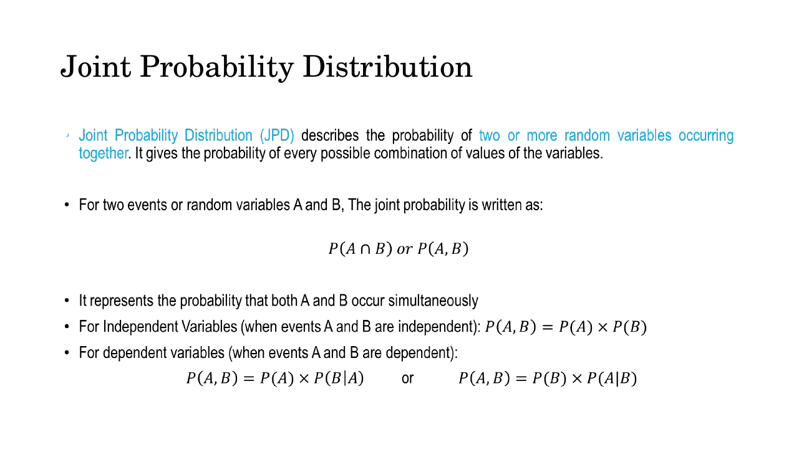
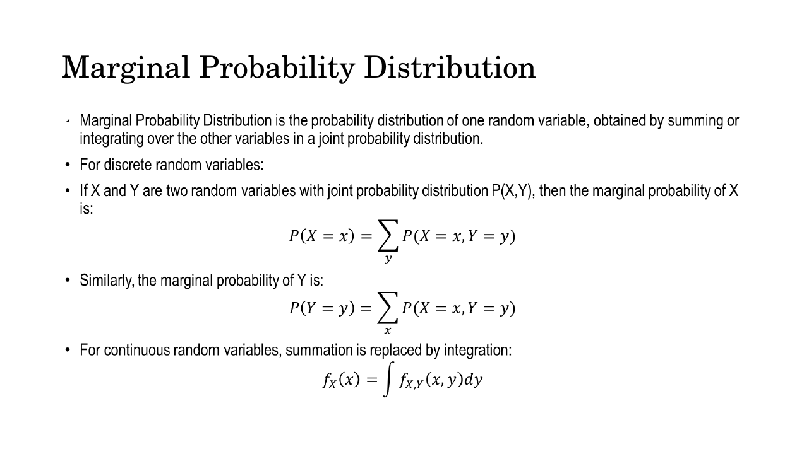
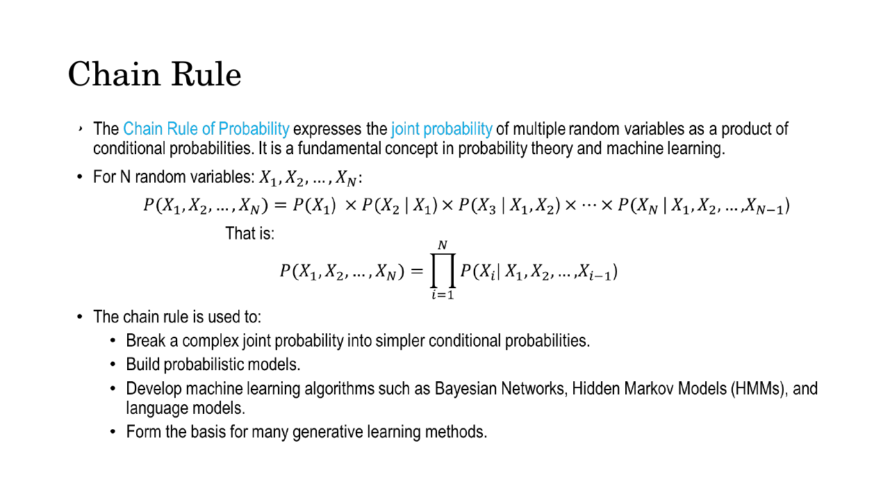
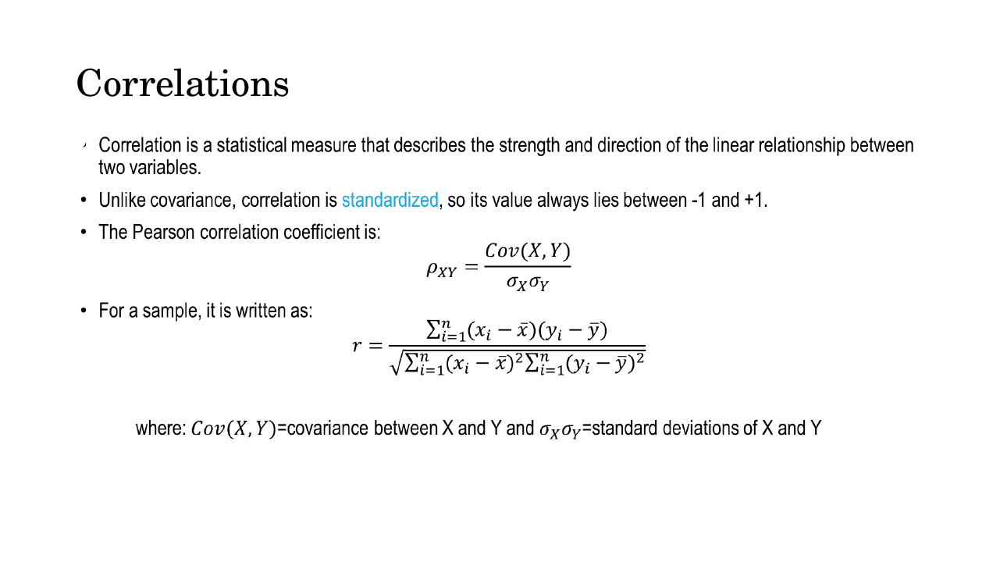
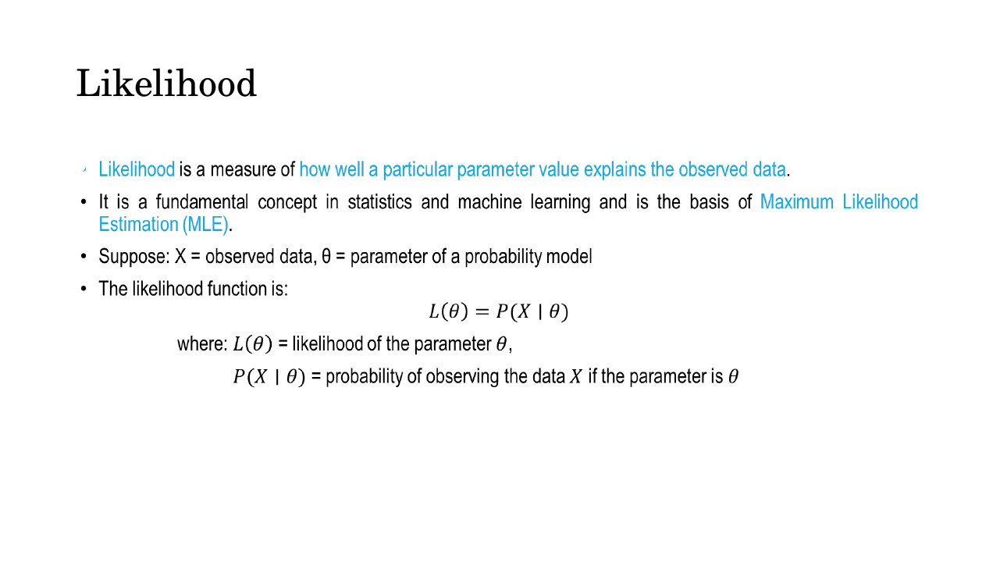
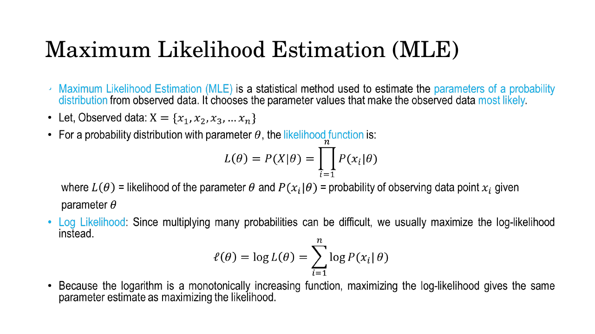
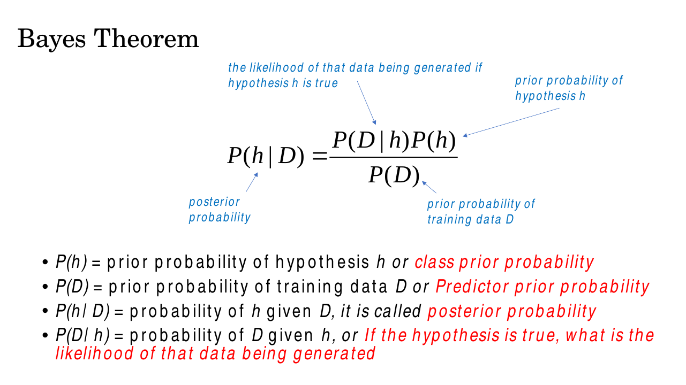
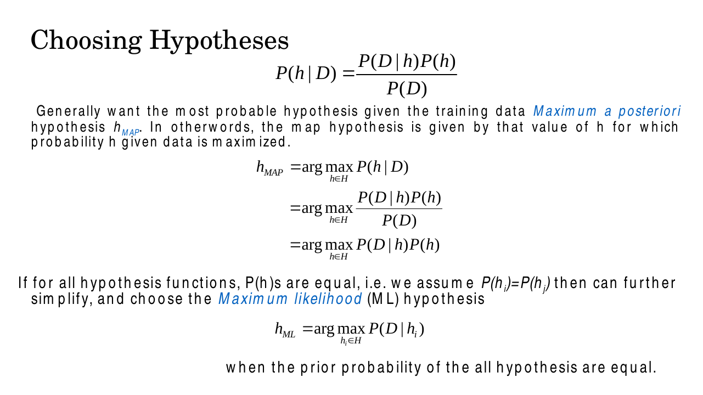
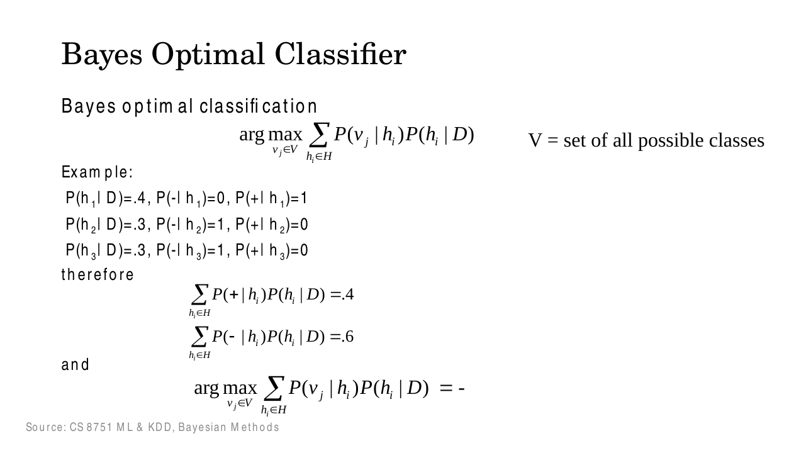

# Lec 6 — Mathematical Preliminaries II: Basic Probability II

> **Deck:** `L2P3_Probability-2.pptx` · **Week 1** · **Playlist:** Lec 6
> **Prereqs:** [Lec 5 — Probability I](05-probability-1.md)
> **Feeds into:** [Lec 22 — Generative Taxonomy and MLE](../week-06/22-generative-taxonomy-and-mle.md), [Lec 30 — ELBO and Reparameterization](../week-08/30-elbo-and-reparameterization.md), [Lec 10 — Overfitting and Regularization](../week-02/10-overfitting-and-regularization.md)

## Why this lecture exists

Lec 5 gave you one random variable at a time: its PMF, its PDF, its mean, its variance. That is not
enough to do anything. An image is not one random variable, it is hundreds of thousands of them, all
tangled together, and a *generative model* is precisely a claim about how they are tangled. This
lecture supplies the two things you need to make that claim. First, the language of several random
variables at once — joint, marginal, chain rule, covariance — which is how you say "these pixels are
related". Second, the machinery for *fitting* such a claim to data: likelihood, maximum likelihood,
and the Bayesian alternatives MAP and the Bayes optimal classifier. Every objective function in the
remaining 24 lectures is one of these two things wearing a different name.

## The ideas

### Joint probability distribution

A **joint probability distribution** gives the probability of every possible *combination* of values
of two or more random variables. For two variables you write it $P(A \cap B)$ or, more usually in
this course, $P(A, B)$: the probability that $A$ and $B$ both happen.


*Fig. — The two bottom lines are the whole lecture in miniature: the product form $P(A)P(B)$ only holds under independence; the general form always carries a conditional. Slide 3.*

The deck splits this into two cases, and the split is examined constantly:

| Case | Joint probability |
|---|---|
| $A$ and $B$ **independent** | $P(A,B) = P(A)\,P(B)$ |
| $A$ and $B$ **dependent** (general) | $P(A,B) = P(A)\,P(B\mid A) = P(B)\,P(A\mid B)$ |

The second line is always true. The first is a *special case* of it — when $B$ is independent of $A$,
$P(B \mid A) = P(B)$ and the conditional collapses. Never use the product rule unless you have been
told, or have checked, that the variables are independent.

In practice a joint distribution arrives as a table: for two binary variables, a $2\times2$ grid of
four numbers summing to 1. For a $256\times256$ RGB image it is a function on $\mathbb{R}^{196608}$ —
which is why the rest of the course approximates it rather than writing it down.

### Marginal distribution: summing a variable away

Given the joint, you recover the distribution of *one* variable on its own by **summing over every
value of the other**:

$$P(X = x) = \sum_{y} P(X = x,\, Y = y), \qquad P(Y = y) = \sum_{x} P(X = x,\, Y = y)$$

and for continuous variables the sum becomes an integral:

$$f_X(x) = \int f_{X,Y}(x, y)\, dy$$


*Fig. — Notice which variable the sum runs over: to get the marginal of $X$ you sum out $y$. The name comes from writing the row and column totals in the margins of the joint table. Slide 4.*

This operation is called **marginalisation**, and it is the thing that makes latent-variable models
hard. A VAE defines a joint $p_\theta(\mathbf{x}, \mathbf{z})$ over data and a hidden code, but the
quantity it actually wants is the marginal $p_\theta(\mathbf{x}) = \int p_\theta(\mathbf{x} \mid
\mathbf{z})\,p(\mathbf{z})\,d\mathbf{z}$ — and that integral has no closed form. The entire ELBO
derivation in [Lec 30](../week-08/30-elbo-and-reparameterization.md) is a workaround for this one
integral. You are meeting the problem here, in its harmless two-variable form.

### The chain rule

Apply $P(A,B) = P(A)P(B \mid A)$ repeatedly and you can factor a joint over any number of variables
into a product of conditionals:

$$P(X_1, X_2, \dots, X_N) = P(X_1)\,P(X_2 \mid X_1)\,P(X_3 \mid X_1, X_2)\cdots P(X_N \mid X_1,\dots,X_{N-1}) = \prod_{i=1}^{N} P(X_i \mid X_1, \dots, X_{i-1})$$


*Fig. — The last bullet is the one to underline: the chain rule "forms the basis for many generative learning methods". Slide 5.*

The decomposition is **exact** — no approximation, no independence assumption — and it holds for *any*
ordering of the variables. That is what makes it so useful: an impossible joint over $N$ variables
becomes $N$ manageable conditional problems.

This is the definition of an **autoregressive** generative model. PixelRNN and PixelCNN
([Lec 23](../week-06/23-autoregressive-pixelrnn-pixelcnn.md)) order the pixels raster-scan and model
$p(\mathbf{x}) = \prod_i p(x_i \mid x_1, \dots, x_{i-1})$ — each pixel conditioned on every pixel
before it; a language model does the same over tokens. The families the deck lists (Bayesian networks,
HMMs, language models) differ only in *which conditionals they drop*.

### Expectation — the notation you must read fluently

Covariance is built out of expectations, so fix the notation now. The **expected value** of $X$ is its
probability-weighted average, $\mathbb{E}[X] = \sum_x x\,p(x)$ for a discrete variable and
$\int x\,f(x)\,dx$ for a continuous one. ([Lec 5](05-probability-1.md) owns mean and variance proper;
this is the working subset.)

Three properties carry all the weight:

- **Linearity:** $\mathbb{E}[aX + bY + c] = a\,\mathbb{E}[X] + b\,\mathbb{E}[Y] + c$. This holds
  *always* — independence is not required.
- **Variance identity:** $\mathrm{Var}(X) = \mathbb{E}[X^2] - (\mathbb{E}[X])^2$.
- **Affine variance:** $\mathrm{Var}(aX + b) = a^2\,\mathrm{Var}(X)$. The shift $b$ vanishes (sliding
  a distribution does not change its spread); the scale $a$ comes out **squared**.

When you later read a loss written $\mathcal{L}(\theta) = \mathbb{E}_{p(\mathbf{x})}\!\left[-\log
p_\theta(\mathbf{x})\right]$, read it as: "draw $\mathbf{x}$ from the data distribution, compute the
bracket, average". In code that average is always over a minibatch. Every objective in this course has
that shape.

### Covariance

**Covariance** measures how two random variables move *together*:

$$\mathrm{Cov}(X,Y) = \mathbb{E}\big[(X - \mu_X)(Y - \mu_Y)\big]$$

![Slide defining covariance as E[(X−μx)(Y−μy)], with the sign interpretation and the sample formula divided by n−1](../../assets/slides/W1_L2P3_Probability-2/s-06.png)
*Fig. — The sample version divides by $n-1$, not $n$. That is Bessel's correction, and the deck states it without comment; an MCQ will. Slide 6.*

Read the sign directly: **positive** means they rise and fall together, **negative** means one rises as
the other falls, **approximately zero** means no consistent linear relationship. Expanding the product
gives the computational form

$$\mathrm{Cov}(X,Y) = \mathbb{E}[XY] - \mathbb{E}[X]\,\mathbb{E}[Y]$$

which makes two facts obvious. First, $\mathrm{Cov}(X,X) = \mathbb{E}[X^2] - (\mathbb{E}[X])^2 =
\mathrm{Var}(X)$ — variance is just covariance with itself. Second, $\mathbb{E}[XY] =
\mathbb{E}[X]\mathbb{E}[Y]$ **only when the covariance is zero**, which independence guarantees but
nothing else does.

For a sample of $n$ paired observations the deck gives

$$\mathrm{Cov}(X,Y) = \frac{\sum_{i=1}^{n}(x_i - \bar{x})(y_i - \bar{y})}{n - 1}$$

### The covariance matrix, and why diagonal is special

With $d$ variables you get a $d \times d$ **covariance matrix** $\boldsymbol{\Sigma}$ whose entry
$\Sigma_{ij} = \mathrm{Cov}(X_i, X_j)$. The diagonal holds the variances; the off-diagonal holds the
pairwise covariances. Because $\mathrm{Cov}(X_i,X_j) = \mathrm{Cov}(X_j,X_i)$, the matrix is always
**symmetric** — which is exactly the property [Lec 4](04-linear-algebra.md) flagged, and it means
$\boldsymbol{\Sigma}$ has real eigenvalues and orthogonal eigenvectors. Those eigenvectors are the
**principal directions** of the data: the axes along which it actually spreads, ranked by eigenvalue.

| $\boldsymbol{\Sigma}$ | Shape of the cloud | Meaning |
|---|---|---|
| Full (off-diagonals $\neq 0$) | tilted ellipse | dimensions are correlated |
| **Diagonal** (off-diagonals $= 0$) | **axis-aligned ellipse** | dimensions uncorrelated, different spreads |
| Isotropic $\sigma^2\mathbf{I}$ | circle / sphere | uncorrelated, equal spread in every direction |

The diagonal case is the one the course lives in. A VAE encoder does not emit a full $d\times d$
covariance; it emits $d$ means and $d$ variances, i.e. a **diagonal** $\boldsymbol{\Sigma}$.
Geometrically that asserts the latent dimensions are uncorrelated, so the ellipse lines up with the
axes and each dimension can be reasoned about alone. Computationally it collapses $O(d^2)$ numbers to
$O(d)$, turns the determinant into a product of $d$ terms instead of an $O(d^3)$ computation, and makes
every formula factorise into a sum over dimensions. The VAE prior $p(\mathbf{z}) =
\mathcal{N}(\mathbf{0}, \mathbf{I})$ is the isotropic row of that table, and a diffusion model's
forward process adds $\mathcal{N}(\mathbf{0},\sigma^2\mathbf{I})$ noise for the same reason.

### Correlation: covariance with the units divided out

Covariance has a defect: its magnitude depends on the units. Measure height in metres instead of
centimetres and the covariance changes by a factor of 100, while nothing about the relationship has
changed. **Correlation** fixes this by dividing out both standard deviations:

$$\rho_{XY} = \frac{\mathrm{Cov}(X,Y)}{\sigma_X \sigma_Y}, \qquad\quad r = \frac{\sum_i (x_i-\bar{x})(y_i-\bar{y})}{\sqrt{\sum_i (x_i-\bar{x})^2 \sum_i (y_i-\bar{y})^2}}$$


*Fig. — "Standardized, so its value always lies between −1 and +1." Covariance has no such bound — that contrast is the examinable point. Slide 7.*

So $\rho \in [-1, +1]$ always, it is unitless, and $|\rho| = 1$ means the points lie exactly on a
straight line. Note the sample formula has no $n-1$: the correction cancels between numerator and
denominator.

The word doing the work in the deck's definition is **linear**. Correlation detects *linear*
relationships only. If $Y = X^2$ with $X$ symmetric about 0, then $X$ and $Y$ are about as dependent as
two variables can be, and yet $\rho = 0$. **Zero correlation does not imply independence.**
Independence implies zero correlation; the converse is false. (The one exception worth knowing: for
*jointly Gaussian* variables the two really are equivalent, which is part of why Gaussians are so
convenient.)

### Likelihood

Flip the conditional around. Given a model with parameter $\theta$ and observed data $X$, the
**likelihood** is

$$L(\theta) = P(X \mid \theta)$$


*Fig. — Same expression as a conditional probability, but read as a function of $\theta$ with $X$ held fixed. Slide 8.*

This is the same arithmetic expression as a probability, but a different *function*. A probability
fixes $\theta$ and varies the data; a likelihood fixes the **data** and varies $\theta$. Consequently
$L(\theta)$ is **not** a probability distribution over $\theta$ — it does not integrate to 1, and it is
free to exceed 1 when the model is continuous.

### Maximum likelihood estimation

If some $\theta$ makes the observed data more probable than any other, pick it. For $n$ data points
assumed independent and identically distributed, the joint factorises into a product:

$$L(\theta) = P(X \mid \theta) = \prod_{i=1}^{n} P(x_i \mid \theta)$$


*Fig. — The product-to-sum move is not a convenience, it is a numerical necessity: a product of 50,000 probabilities underflows to exactly 0 in float32. Slide 9.*

Multiplying thousands of numbers below 1 underflows, and products are awkward to differentiate, so we
take logs. The **log-likelihood** turns the product into a sum:

$$\ell(\theta) = \log L(\theta) = \sum_{i=1}^{n} \log P(x_i \mid \theta)$$

and because $\log$ is **monotonically increasing**, the $\theta$ that maximises $\ell$ is the same
$\theta$ that maximises $L$. The values differ; the *argmax* does not. Then

$$\hat{\theta}_{\mathrm{MLE}} = \arg\max_\theta \ \sum_{i=1}^{n} \log P(x_i \mid \theta)$$

Negate it and you have the **negative log-likelihood**, which is what optimisers minimise. For a
classifier with a softmax output this expression *is* the cross-entropy loss you will meet from
[Lec 8](../week-02/08-mlp-and-activations.md) onward; for a generative model it is the training
objective that [Lec 22](../week-06/22-generative-taxonomy-and-mle.md) builds its whole taxonomy around.
Maximising likelihood is also equivalent to minimising
$D_{\mathrm{KL}}(p_{\text{data}} \,\|\, p_\theta)$, the **KL divergence** — the non-negative,
*non-symmetric* measure of how far one distribution sits from another,
$D_{\mathrm{KL}}(q\,\|\,p) = \sum_x q(x)\log\frac{q(x)}{p(x)}$. [Lec 30](../week-08/30-elbo-and-reparameterization.md)
owns its closed form for diagonal Gaussians and its role in the VAE loss; here it is enough to know the
definition and that $D_{\mathrm{KL}}(q\|p) \neq D_{\mathrm{KL}}(p\|q)$.

### Bayes applied to hypotheses: MAP

The deck now re-reads Bayes' theorem with hypotheses in place of events:

$$P(h \mid \mathcal{D}) = \frac{P(\mathcal{D} \mid h)\,P(h)}{P(\mathcal{D})}$$


*Fig. — Memorise the four names in these positions; NPTEL asks for them directly. The deck writes the dataset as $D$; this book writes $\mathcal{D}$. Slide 10.*

| Term | Name | Reading |
|---|---|---|
| $P(h)$ | **prior** (class prior) | belief in $h$ before seeing data |
| $P(\mathcal{D} \mid h)$ | **likelihood** | how probable the data is if $h$ is true |
| $P(\mathcal{D})$ | **evidence** (predictor prior) | probability of the data overall |
| $P(h \mid \mathcal{D})$ | **posterior** | belief in $h$ after seeing data |

The **maximum a posteriori (MAP)** hypothesis is the most probable hypothesis given the data:

$$h_{\mathrm{MAP}} = \arg\max_{h \in H} P(h \mid \mathcal{D}) = \arg\max_{h \in H} \frac{P(\mathcal{D}\mid h)P(h)}{P(\mathcal{D})} = \arg\max_{h \in H} P(\mathcal{D} \mid h)\,P(h)$$


*Fig. — Two separate moves. Dropping $P(\mathcal{D})$ is always legal (it does not depend on $h$). Dropping $P(h)$ is legal **only** under equal priors. Slide 12.*

$P(\mathcal{D})$ is dropped because it is the same constant for every hypothesis and therefore cannot
change which one wins. If in addition every hypothesis has the same prior, $P(h_i) = P(h_j)$, then
$P(h)$ is also a constant and drops out, leaving the **maximum likelihood (ML) hypothesis**:

$$h_{\mathrm{ML}} = \arg\max_{h_i \in H} P(\mathcal{D} \mid h_i)$$

So **ML is MAP with a uniform prior.** That one sentence is the most examinable line in the lecture.
It also explains [Lec 10](../week-02/10-overfitting-and-regularization.md): adding $\log P(h)$ to the
objective is exactly what L2 regularisation does, so weight decay *is* MAP estimation with a Gaussian
prior on the weights.

### The Bayes optimal classifier

MAP and ML answer "what is the most probable *hypothesis*?" That is not the same question as "what is
the most probable *classification of a new instance*?" — and the two answers can differ.

The **Bayes optimal classifier** does not commit to one hypothesis. It asks every hypothesis for its
prediction and averages the votes, weighted by each hypothesis's posterior:

$$v_{\text{best}} = \arg\max_{v_j \in V} \sum_{h_i \in H} P(v_j \mid h_i)\,P(h_i \mid \mathcal{D})$$

where $V$ is the set of possible class labels.


*Fig. — The MAP hypothesis $h_1$ votes "+", yet the classifier outputs "−". MAP-on-hypotheses and optimal-on-predictions are genuinely different procedures. Slide 16.*

No classifier using the same hypothesis space and prior does better on average — it minimises expected
prediction error. The cost is evaluating *every* hypothesis for *every* prediction, so it is a
theoretical benchmark rather than an algorithm you run; ensembles and model averaging approximate it.

## Worked numericals

### N1. Marginals, conditionals, independence, and $\mathbb{E}[XY]$ from a joint table
**Given:** $X$ = rain (0/1), $Y$ = heavy traffic (0/1), with joint
$P(0,0)=0.4$, $P(0,1)=0.1$, $P(1,0)=0.2$, $P(1,1)=0.3$.
**Find:** both marginals, $P(Y{=}1 \mid X{=}1)$, whether $X \perp Y$, and $\mathrm{Cov}(X,Y)$.

1. Check validity: $0.4+0.1+0.2+0.3 = 1.0$ ✓
2. Marginal of $X$: $P(X{=}0) = 0.4+0.1 = 0.5$; $P(X{=}1) = 0.2+0.3 = 0.5$.
3. Marginal of $Y$: $P(Y{=}0) = 0.4+0.2 = 0.6$; $P(Y{=}1) = 0.1+0.3 = 0.4$.
4. Conditional: $P(Y{=}1\mid X{=}1) = \dfrac{P(1,1)}{P(X{=}1)} = \dfrac{0.3}{0.5} = 0.6$.
5. Chain-rule check: $P(X{=}1)P(Y{=}1\mid X{=}1) = 0.5 \times 0.6 = 0.3 = P(1,1)$ ✓
6. Independence test: $P(X{=}1)P(Y{=}1) = 0.5 \times 0.4 = 0.20 \neq 0.30$. **Not independent.**
7. $\mathbb{E}[X] = 0.5$, $\mathbb{E}[Y] = 0.4$, and $\mathbb{E}[XY] = (1)(1)(0.3) = 0.3$ (all other terms have a zero factor).
8. $\mathrm{Cov}(X,Y) = 0.3 - (0.5)(0.4) = 0.3 - 0.2 = 0.1$.

**Answer:** Marginals $(0.5, 0.5)$ and $(0.6, 0.4)$; $P(Y{=}1\mid X{=}1) = 0.6$; dependent;
$\mathrm{Cov}(X,Y) = 0.1 > 0$. Note $\mathbb{E}[XY] = 0.3 \neq 0.2 = \mathbb{E}[X]\mathbb{E}[Y]$ —
the equality fails precisely because they are dependent.

### N2. $\mathbb{E}[X]$, $\mathrm{Var}(X)$ two ways, and $\mathrm{Var}(aX+b)$
**Given:** $X \in \{1,2,3,4\}$ with $p = 0.1,\ 0.2,\ 0.4,\ 0.3$.
**Find:** $\mathbb{E}[X]$, $\mathrm{Var}(X)$ by both formulas, $\sigma_X$, and $\mathbb{E}[2X+3]$, $\mathrm{Var}(2X+3)$.

1. $\mathbb{E}[X] = (1)(0.1)+(2)(0.2)+(3)(0.4)+(4)(0.3) = 0.1+0.4+1.2+1.2 = 2.9$.
2. $\mathbb{E}[X^2] = (1)(0.1)+(4)(0.2)+(9)(0.4)+(16)(0.3) = 0.1+0.8+3.6+4.8 = 9.3$.
3. Identity: $\mathrm{Var}(X) = 9.3 - (2.9)^2 = 9.3 - 8.41 = 0.89$.
4. Direct: $\sum p(x)(x-2.9)^2 = (3.61)(0.1)+(0.81)(0.2)+(0.01)(0.4)+(1.21)(0.3)$
   $= 0.361 + 0.162 + 0.004 + 0.363 = 0.890$ ✓ identical.
5. $\sigma_X = \sqrt{0.89} = 0.9434$.
6. $\mathbb{E}[2X+3] = 2(2.9) + 3 = 8.8$ (linearity).
7. $\mathrm{Var}(2X+3) = 2^2 \times 0.89 = 4 \times 0.89 = 3.56$ — the $+3$ contributes nothing.

**Answer:** $\mathbb{E}[X] = 2.9$, $\mathrm{Var}(X) = 0.89$, $\sigma_X \approx 0.943$;
$\mathbb{E}[2X+3] = 8.8$, $\mathrm{Var}(2X+3) = 3.56$.

### N3. Covariance, correlation, and the covariance matrix from paired data
**Given:** $n = 5$ pairs — $x = (2,4,6,8,10)$, $y = (3,7,5,11,14)$.
**Find:** $\mathrm{Cov}(x,y)$, $r$, and the $2\times2$ sample covariance matrix.

1. $\bar{x} = 30/5 = 6$; $\bar{y} = 40/5 = 8$.
2. Deviations $d_x = (-4,-2,0,2,4)$, $d_y = (-5,-1,-3,3,6)$.
3. Products $d_xd_y = (20,\ 2,\ 0,\ 6,\ 24)$, sum $= 52$.
4. $\sum d_x^2 = 16+4+0+4+16 = 40$; $\sum d_y^2 = 25+1+9+9+36 = 80$.
5. Sample covariance: $\mathrm{Cov} = 52/(5-1) = 52/4 = 13$.
6. Sample variances: $s_x^2 = 40/4 = 10$, $s_y^2 = 80/4 = 20$; so $s_x = 3.1623$, $s_y = 4.4721$.
7. $r = \dfrac{52}{\sqrt{40 \times 80}} = \dfrac{52}{\sqrt{3200}} = \dfrac{52}{56.5685} = 0.91924$.
8. Cross-check via the ratio form: $13 / (3.1623 \times 4.4721) = 13/14.1421 = 0.91924$ ✓
9. Covariance matrix: $\boldsymbol{\Sigma} = \begin{bmatrix} 10 & 13 \\ 13 & 20 \end{bmatrix}$ — symmetric, variances on the diagonal.
10. Its eigenvalues (trace $= 30$, $\det = 200-169 = 31$): $\lambda = \tfrac{30 \pm \sqrt{900-124}}{2} = \tfrac{30 \pm 27.86}{2} \Rightarrow 28.93,\ 1.07$.

**Answer:** $\mathrm{Cov} = 13$, $r \approx 0.9192$ (strong positive linear relation).
$\boldsymbol{\Sigma} = \begin{bmatrix}10&13\\13&20\end{bmatrix}$, whose leading eigenvalue carries
$28.93/30 = 96\%$ of the total variance — the data is nearly one-dimensional.

### N4. MLE for a Bernoulli parameter
**Given:** 10 independent coin flips, 7 heads and 3 tails. Model: $P(\text{head}) = \theta$.
**Find:** $\hat{\theta}_{\mathrm{MLE}}$, and confirm it beats $\theta = 0.5$.

1. Likelihood: $L(\theta) = \theta^{7}(1-\theta)^{3}$.
2. Log-likelihood: $\ell(\theta) = 7\log\theta + 3\log(1-\theta)$.
3. Differentiate: $\dfrac{d\ell}{d\theta} = \dfrac{7}{\theta} - \dfrac{3}{1-\theta}$.
4. Set to zero: $7(1-\theta) = 3\theta \Rightarrow 7 = 10\theta \Rightarrow \hat{\theta} = 0.7$.
5. Value there: $L(0.7) = (0.7)^7 (0.3)^3 = 0.0823543 \times 0.027 = 0.0022236$.
6. Compare $\theta = 0.5$: $L(0.5) = (0.5)^{10} = 0.0009766$ — about 2.3× smaller.
7. Compare $\theta = 0.8$: $L(0.8) = (0.8)^7(0.2)^3 = 0.2097152 \times 0.008 = 0.0016777$ — also smaller.

**Answer:** $\hat{\theta}_{\mathrm{MLE}} = 7/10 = 0.7$, i.e. the observed proportion. In general
$\hat{\theta} = k/n$ for $k$ successes in $n$ trials.

### N5. ML hypothesis vs MAP hypothesis vs Bayes optimal classifier
**Given (a):** two hypotheses with priors $P(h_1) = 0.2$, $P(h_2) = 0.8$ and likelihoods
$P(\mathcal{D}\mid h_1) = 0.6$, $P(\mathcal{D}\mid h_2) = 0.3$.
**Find:** $h_{\mathrm{ML}}$, $h_{\mathrm{MAP}}$, and the normalised posteriors.

1. $h_{\mathrm{ML}} = \arg\max P(\mathcal{D}\mid h)$: $0.6 > 0.3 \Rightarrow h_1$.
2. $h_{\mathrm{MAP}} = \arg\max P(\mathcal{D}\mid h)P(h)$: $h_1 \to (0.6)(0.2) = 0.12$; $h_2 \to (0.3)(0.8) = 0.24$. So $h_2$.
3. Evidence: $P(\mathcal{D}) = 0.12 + 0.24 = 0.36$.
4. Posteriors: $P(h_1\mid\mathcal{D}) = 0.12/0.36 = 1/3$; $P(h_2\mid\mathcal{D}) = 0.24/0.36 = 2/3$.

**Given (b)** (the deck's own example): $P(h_1\mid\mathcal{D}) = 0.4$, $P(h_2\mid\mathcal{D}) = 0.3$,
$P(h_3\mid\mathcal{D}) = 0.3$, with $h_1(x) = +$, $h_2(x) = -$, $h_3(x) = -$.
**Find:** the MAP prediction and the Bayes optimal prediction.

5. MAP hypothesis is $h_1$ (posterior 0.4 is the largest), so the MAP prediction is $+$.
6. $\sum_i P(+\mid h_i)P(h_i\mid\mathcal{D}) = (1)(0.4) + (0)(0.3) + (0)(0.3) = 0.4$.
7. $\sum_i P(-\mid h_i)P(h_i\mid\mathcal{D}) = (0)(0.4) + (1)(0.3) + (1)(0.3) = 0.6$.
8. $\arg\max$ over $\{+,-\}$: $0.6 > 0.4$, so the Bayes optimal classification is $-$.

**Answer:** (a) $h_{\mathrm{ML}} = h_1$ but $h_{\mathrm{MAP}} = h_2$ — the prior flips the decision.
(b) MAP predicts $+$, the Bayes optimal classifier predicts $-$. Both disagreements are the point: ML
ignores the prior, and MAP ignores every hypothesis but the winner.

## Code

```python
import numpy as np

# --- joint table -> marginals, conditional, covariance -------------------
# rows = X (rain 0/1), cols = Y (traffic 0/1)
J = np.array([[0.4, 0.1],
              [0.2, 0.3]])
px = J.sum(axis=1)          # marginal of X: sum OUT y (across columns)
py = J.sum(axis=0)          # marginal of Y: sum OUT x (across rows)
print("P(X) =", px, " P(Y) =", py)        # P(X) = [0.5 0.5]  P(Y) = [0.6 0.4]
print("P(Y=1|X=1) =", J[1, 1] / px[1])    # P(Y=1|X=1) = 0.6
print("independent?", np.allclose(J, np.outer(px, py)))   # independent? False

vals = np.array([0, 1])
EX, EY = vals @ px, vals @ py
EXY = sum(x * y * J[i, j] for i, x in enumerate(vals) for j, y in enumerate(vals))
print(f"E[XY]={EXY:.2f}  E[X]E[Y]={EX*EY:.2f}  Cov={EXY-EX*EY:.2f}")
# E[XY]=0.30  E[X]E[Y]=0.20  Cov=0.10

# --- expectation and variance from a PMF --------------------------------
x, p = np.array([1., 2., 3., 4.]), np.array([0.1, 0.2, 0.4, 0.3])
EX  = x @ p
EX2 = (x**2) @ p
print(f"E[X]={EX:.2f}  E[X^2]={EX2:.2f}  Var={EX2-EX**2:.4f}")
# E[X]=2.90  E[X^2]=9.30  Var=0.8900
a, b = 2., 3.
print("Var(aX+b) =", round(a**2 * (EX2 - EX**2), 4))   # Var(aX+b) = 3.56  (b is gone, a is squared)

# --- covariance matrix and correlation ----------------------------------
xs = np.array([2., 4., 6., 8., 10.])
ys = np.array([3., 7., 5., 11., 14.])
C = np.cov(xs, ys)                 # numpy defaults to ddof=1, i.e. /(n-1)
print(C)                           # [[10. 13.] [13. 20.]]
print("r =", round(np.corrcoef(xs, ys)[0, 1], 4))        # r = 0.9192
print("eigvals:", np.round(np.linalg.eigvalsh(C), 2))    # eigvals: [ 1.07 28.93]

# zero correlation does NOT mean independent:  y = x**2 on a symmetric grid
z = np.array([-2., -1., 0., 1., 2.])
print("r(z, z^2) =", round(np.corrcoef(z, z**2)[0, 1], 10))   # r(z, z^2) = 0.0

# --- MLE for a Bernoulli, by brute force --------------------------------
heads, n = 7, 10
grid = np.linspace(0.01, 0.99, 99)
ll = heads * np.log(grid) + (n - heads) * np.log(1 - grid)
print("theta_hat =", round(grid[ll.argmax()], 2))        # theta_hat = 0.7

# --- Bayes optimal classifier (deck's example) --------------------------
post  = np.array([0.4, 0.3, 0.3])                 # P(h_i | D)
votes = np.array([[1., 0.],                       # h1: P(+)=1, P(-)=0
                  [0., 1.],                       # h2
                  [0., 1.]])                      # h3
scores = post @ votes
print("P(+)=%.1f  P(-)=%.1f  ->" % tuple(scores), "+-"[scores.argmax()])
# P(+)=0.4  P(-)=0.6  -> -
```

## Exam pack

### Must-memorise

| Item | Exactly this |
|---|---|
| Joint, general | $P(A,B) = P(A)P(B\mid A) = P(B)P(A\mid B)$ |
| Joint, independent | $P(A,B) = P(A)P(B)$ — **only** under independence |
| Marginal (discrete) | $P(X{=}x) = \sum_y P(X{=}x, Y{=}y)$ |
| Marginal (continuous) | $f_X(x) = \int f_{X,Y}(x,y)\,dy$ |
| Chain rule | $P(X_1,\dots,X_N) = \prod_{i=1}^{N} P(X_i \mid X_1,\dots,X_{i-1})$ |
| Linearity of expectation | $\mathbb{E}[aX+bY+c] = a\mathbb{E}[X]+b\mathbb{E}[Y]+c$, always |
| Variance identity | $\mathrm{Var}(X) = \mathbb{E}[X^2] - (\mathbb{E}[X])^2$ |
| Affine variance | $\mathrm{Var}(aX+b) = a^2\mathrm{Var}(X)$ |
| Covariance | $\mathrm{Cov}(X,Y) = \mathbb{E}[(X-\mu_X)(Y-\mu_Y)] = \mathbb{E}[XY]-\mathbb{E}[X]\mathbb{E}[Y]$ |
| Sample covariance | $\sum_i (x_i-\bar{x})(y_i-\bar{y}) / (n-1)$ |
| Correlation | $\rho_{XY} = \mathrm{Cov}(X,Y)/(\sigma_X\sigma_Y) \in [-1,+1]$ |
| Covariance matrix | $\Sigma_{ij} = \mathrm{Cov}(X_i,X_j)$; **symmetric**; eigenvectors = principal directions |
| Likelihood | $L(\theta) = P(X\mid\theta)$ — a function of $\theta$, not a distribution over $\theta$ |
| Log-likelihood | $\ell(\theta) = \sum_{i=1}^{n}\log P(x_i\mid\theta)$ |
| MLE | $\hat\theta = \arg\max_\theta \ell(\theta)$ |
| Bayes (hypothesis form) | $P(h\mid\mathcal{D}) = P(\mathcal{D}\mid h)P(h)/P(\mathcal{D})$ |
| MAP | $h_{\mathrm{MAP}} = \arg\max_h P(\mathcal{D}\mid h)P(h)$ |
| ML hypothesis | $h_{\mathrm{ML}} = \arg\max_h P(\mathcal{D}\mid h)$ (equal priors) |
| Bayes optimal | $\arg\max_{v_j\in V}\sum_{h_i\in H} P(v_j\mid h_i)P(h_i\mid\mathcal{D})$ |
| KL divergence | $D_{\mathrm{KL}}(q\,\|\,p) = \sum_x q(x)\log\frac{q(x)}{p(x)} \ge 0$, not symmetric |

### Numbers worth knowing

| Quantity | Value |
|---|---|
| Range of a correlation coefficient | $[-1, +1]$ |
| Range of a covariance | unbounded, $(-\infty, +\infty)$ |
| Sample covariance denominator | $n - 1$ (deck's formula) |
| Deck's Bayes-optimal example posteriors | $P(h_1\mid\mathcal{D}){=}0.4$, $P(h_2\mid\mathcal{D}){=}0.3$, $P(h_3\mid\mathcal{D}){=}0.3$ |
| …its weighted votes | $P(+) = 0.4$, $P(-) = 0.6$ → answer $-$ |
| …its MAP hypothesis | $h_1$, which predicts $+$ — the opposite |
| Parameters in a diagonal $d$-dim covariance | $d$ (vs $d(d+1)/2$ for a full one) |
| MLE of a Bernoulli from $k$ of $n$ | $\hat\theta = k/n$ |
| Four Bayes terms | prior, likelihood, evidence, posterior |

### Likely MCQ traps

- **$\mathrm{Var}(aX+b) = a\,\mathrm{Var}(X) + b$.** False twice over. The $b$ **vanishes** and the $a$
  is **squared**: $a^2\mathrm{Var}(X)$. Contrast with $\mathbb{E}[aX+b] = a\mathbb{E}[X]+b$, where the
  $b$ survives and the $a$ does not square.
- **$\mathbb{E}[XY] = \mathbb{E}[X]\mathbb{E}[Y]$ always.** False. It holds only when
  $\mathrm{Cov}(X,Y) = 0$, which independence guarantees. By contrast $\mathbb{E}[X+Y] =
  \mathbb{E}[X]+\mathbb{E}[Y]$ **is** unconditional — linearity never needs independence.
- **"Zero correlation implies independence."** False. Correlation only detects *linear* relationships;
  $Y = X^2$ on data symmetric about 0 gives $\rho = 0$ with total dependence. The implication runs one
  way only: independent $\Rightarrow$ uncorrelated. (Equivalent only for jointly Gaussian variables.)
- **"A PDF value cannot exceed 1."** It can. A PDF is a *density*, not a probability; only the area
  under it must equal 1. $\mathrm{Uniform}(0, 0.5)$ has $f(x) = 2$ everywhere on its support. The same
  applies to a likelihood built from densities.
- **Confusing covariance with correlation.** Covariance is unbounded and unit-dependent; correlation is
  standardised to $[-1,1]$ and unitless. "Which of these is always between −1 and 1?" is a real question.
- **MAP vs ML.** ML is MAP with a **uniform prior**. If an MCQ says "the priors are equal", MAP and ML
  give the same answer; otherwise they can differ (N5a).
- **MAP vs Bayes optimal classifier.** MAP picks the best *hypothesis*; Bayes optimal picks the best
  *label* by weighting all hypotheses. They can disagree, and the deck's own example is built to show it.
- **Dropping $P(\mathcal{D})$ vs dropping $P(h)$.** Dropping the evidence $P(\mathcal{D})$ is always
  valid. Dropping the prior $P(h)$ needs equal priors. Only one is free.
- **"Marginalising $X$ means summing over $x$."** Backwards. To get the marginal **of** $X$ you sum
  **over the other** variable, $y$.
- **"Taking the log changes the answer."** It changes $L$'s value but not its $\arg\max$, because
  $\log$ is monotonically increasing.
- **"Likelihood is a probability distribution over $\theta$."** No — $\int L(\theta)d\theta \neq 1$ in
  general. The posterior is a distribution over $\theta$; the likelihood is not.
- **"$D_{\mathrm{KL}}(q\|p) = D_{\mathrm{KL}}(p\|q)$."** False — KL is not symmetric and is therefore
  not a distance metric, though it is always $\ge 0$ and $= 0$ only when $q = p$.

### Self-test

1. Write the chain rule for $P(A,B,C)$.
2. $\mathrm{Var}(X) = 4$. What is $\mathrm{Var}(3X - 7)$?
3. $\mathbb{E}[X]=2$, $\mathbb{E}[X^2]=9$. Find $\mathrm{Var}(X)$ and $\sigma_X$.
4. $\mathrm{Cov}(X,Y) = 6$, $\sigma_X = 2$, $\sigma_Y = 5$. Find $\rho_{XY}$.
5. Give a concrete pair of variables with $\rho = 0$ that are nevertheless dependent.
6. A coin lands heads 30 times in 50 flips. What is $\hat\theta_{\mathrm{MLE}}$?
7. Under what condition does $h_{\mathrm{MAP}} = h_{\mathrm{ML}}$?
8. Posteriors $0.5, 0.3, 0.2$ with predictions $+, -, -$. What does the MAP classifier say, and what does the Bayes optimal classifier say?
9. Why do we maximise the log-likelihood instead of the likelihood? Give two reasons.
10. What does a **diagonal** covariance matrix assert about the dimensions, and why does a VAE encoder use one?

<details><summary>Answers</summary>

1. $P(A,B,C) = P(A)\,P(B\mid A)\,P(C\mid A,B)$ (any ordering is valid).
2. $3^2 \times 4 = 36$. The $-7$ contributes nothing.
3. $\mathrm{Var} = 9 - 2^2 = 5$; $\sigma_X = \sqrt{5} \approx 2.236$.
4. $\rho = 6/(2 \times 5) = 0.6$.
5. $X$ uniform on $\{-2,-1,0,1,2\}$ and $Y = X^2$. $\rho = 0$ but $Y$ is a deterministic function of $X$.
6. $30/50 = 0.6$.
7. When all hypotheses have equal prior probability, $P(h_i) = P(h_j)$ for all $i,j$.
8. MAP hypothesis is the first (0.5), so MAP predicts $+$. Bayes optimal: $P(+) = 0.5$, $P(-) = 0.3+0.2 = 0.5$ — a tie, so either label is optimal here.
9. (i) A product of many probabilities underflows to zero in floating point; a sum of logs does not. (ii) Sums are far easier to differentiate than products. The argmax is unchanged because $\log$ is monotonically increasing.
10. That the dimensions are mutually uncorrelated, so the probability-density ellipse is axis-aligned. The encoder uses one because it needs only $d$ variances instead of $d(d+1)/2$ covariances, every formula factorises into a per-dimension sum, and the resulting KL term against $\mathcal{N}(\mathbf{0},\mathbf{I})$ has a closed form ([Lec 30](../week-08/30-elbo-and-reparameterization.md)).

</details>

## Beyond the slides

**Gap:** The deck gives covariance for two variables and stops; it never introduces the covariance
**matrix**.
**Why it matters:** Everything downstream is multivariate. The symmetry of $\boldsymbol{\Sigma}$, the
meaning of its eigenvectors (see [Lec 4](04-linear-algebra.md)), and especially the *diagonal* case are
the direct prerequisites for the VAE encoder's output and the Gaussian noise fed to every generator and
diffusion model.

**Gap:** The deck states $\mathrm{Cov}(X,Y) \approx 0$ for "no consistent relationship" but never warns
that zero covariance does **not** imply independence.
**Why it matters:** This is the single most frequently examined subtlety in the topic, and the error is
invisible if you only ever see the slide's wording.

**Gap:** MLE is presented as a formula with no worked instance; the deck never actually maximises a
likelihood.
**Why it matters:** The exam asks for a number. N4 does the Bernoulli case, which generalises to
$\hat\theta = k/n$ and is the only closed-form MLE you are likely to be asked for by hand.

**Gap:** No mention that MAP's prior term $\log P(h)$ is what regularisation is.
**Why it matters:** It converts [Lec 10](../week-02/10-overfitting-and-regularization.md) from a bag of
tricks into one idea — L2 weight decay is a Gaussian prior on the weights, L1 is a Laplace prior.

**Gap:** No entropy, cross-entropy or KL divergence anywhere on either probability deck.
**Why it matters:** The classification loss from [Lec 8](../week-02/08-mlp-and-activations.md) onward is
cross-entropy, which is exactly the negative log-likelihood above; and half the VAE loss in
[Lec 30](../week-08/30-elbo-and-reparameterization.md) is a KL term. Carry forward the three facts in
the Must-memorise table: KL is $\sum q\log(q/p)$, it is non-negative, and it is not symmetric.

## Cut from the slides

Dropped slide 1 (title), slide 2 (outline), slide 17 (summary, identical to the outline) and slide 18
("next lecture") — pure navigation. Slide 11 ("Can Bayes theorem be applied to find the suitable
hypothesis? … MAP is a probabilistic framework that finds the most probable hypothesis") is a one-line
teaser for slide 12 and is folded into the MAP subsection rather than figured separately. Slides 13 and
14 are prose restatements of material the formulas on slides 12 and 16 already carry — slide 13 recaps
Bayes → MAP → Bayes optimal in paragraph form, slide 14 contrasts "most probable hypothesis" with
"most probable classification" — so their content is compressed into the Bayes optimal classifier
subsection and the MAP-vs-Bayes-optimal trap, with no loss. Slide 15 is the text of the Bayes-optimal
example and slide 16 is the same example with the arithmetic; only slide 16 is shown, and the example
is worked in full as N5(b). The extracted figures in `assets/figures/W1_L2P3_Probability-2/` are crops
of these same slide bodies, so the whole-slide renders are used throughout for their titles. Nothing
mathematical was dropped. Note the scope seam: mean, variance, PDF/CDF and the named distributions
(including the Gaussian) are on the Lec 5 deck, not this one, and belong to
[Lec 5](05-probability-1.md); the expectation subsection here is only the toolkit covariance needs.
