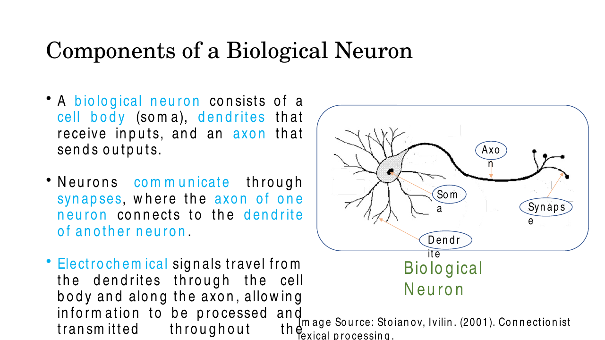
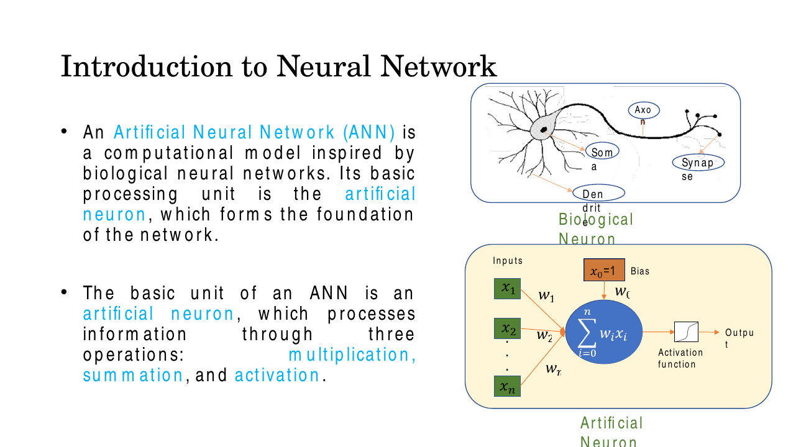
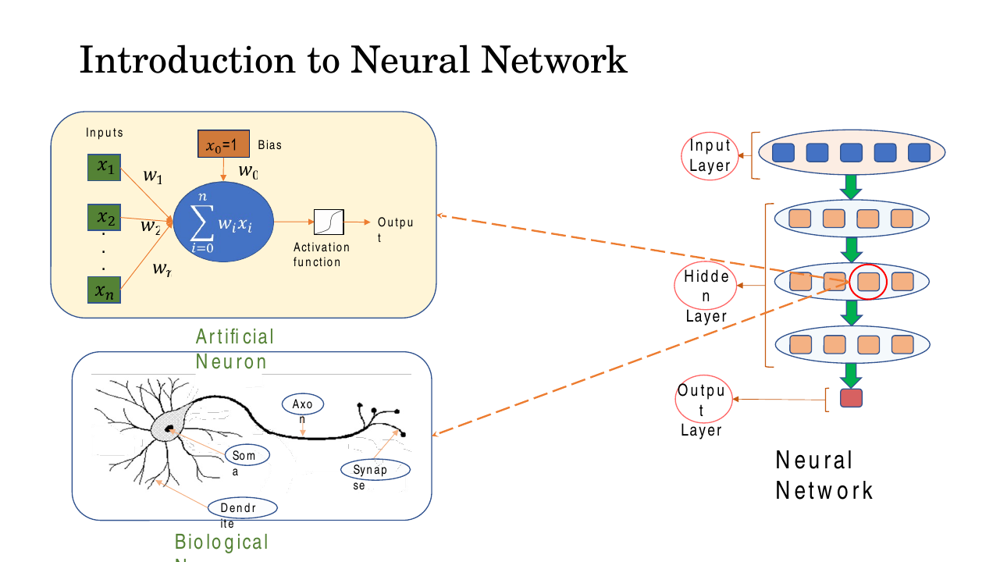
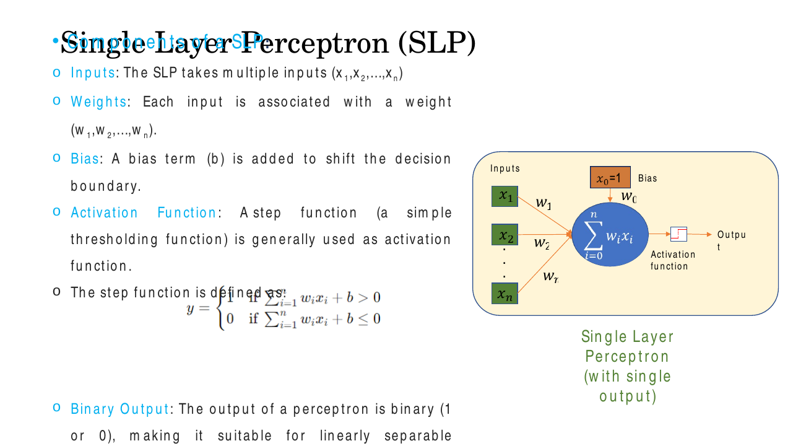
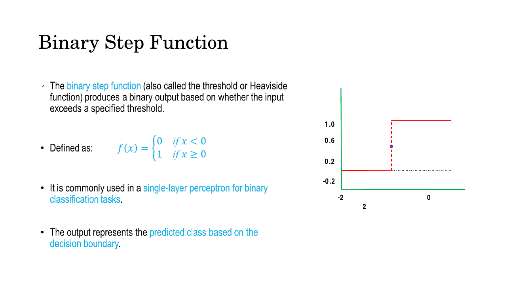
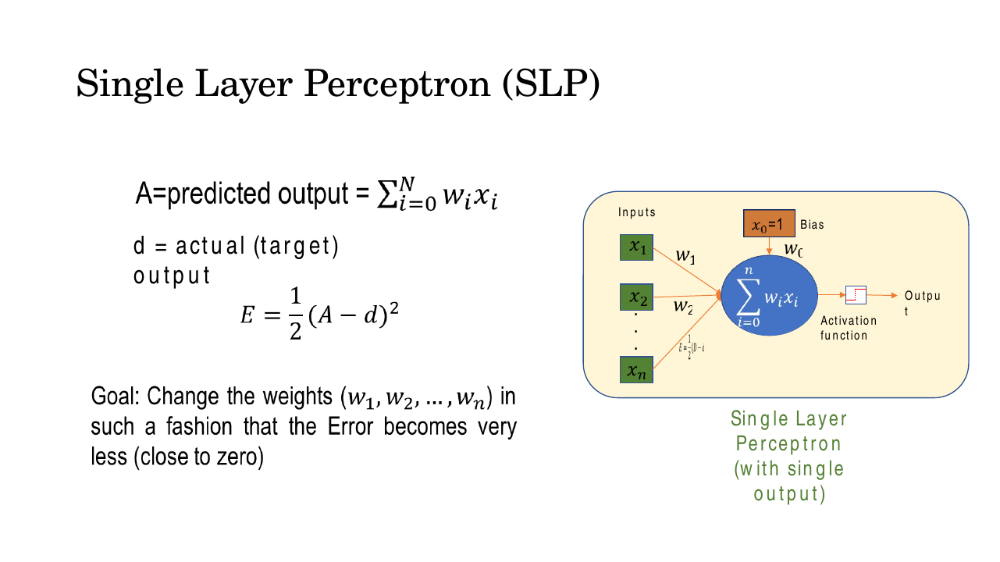
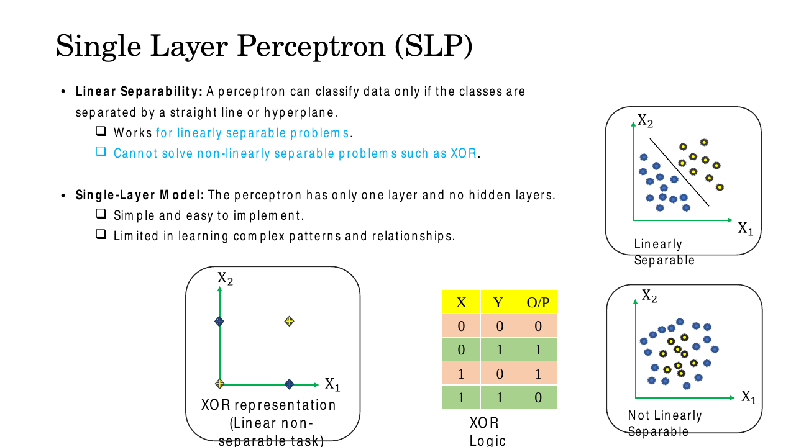

# Lec 7 — Neural Network Fundamentals: the Perceptron

> **Deck:** `W2L3_P1_NNFundamentals.pptx` · **Week 2** · **Playlist:** Lec 7
> **Prereqs:** [Lec 4 — Linear Algebra](../week-01/04-linear-algebra.md)
> **Feeds into:** [Lec 8 — MLP and Activations](08-mlp-and-activations.md), [Lec 9 — Backpropagation](09-backpropagation.md)

## Why this lecture exists

You now know that a dot product measures similarity and that $\mathbf{W}\mathbf{x}+\mathbf{b}$ is the
only operation a linear layer performs. This lecture spends that knowledge: it builds the smallest
object in the whole course that *learns* — one neuron, a handful of weights, and a rule for nudging
them when the answer comes out wrong. Everything later is this unit repeated, stacked, and
differentiated.

It also fails, on purpose. The perceptron cannot learn XOR, and the failure is not a bug or a
tuning problem — it is a theorem. Seeing exactly *why* a single line cannot carve up four points is
what makes the hidden layer of [Lec 8](08-mlp-and-activations.md) feel inevitable rather than
arbitrary. The deck's last content slide is that failure. Treat it as the setup for the next chapter.

## The ideas

### The biological neuron, and the four-part analogy

A biological neuron has three structures the deck names. **Dendrites** are branching fibres that
receive incoming signals. The **soma** (cell body) pools those signals. The **axon** is the single
long fibre that carries the neuron's output away. Neurons talk to each other at **synapses**, the
junctions where one neuron's axon meets another's dendrite, and the signals travelling this path are
**electrochemical**.


*Fig. — Information flows one way: dendrites → soma → axon → synapse. The artificial neuron copies exactly this direction, which is why a forward pass is called "forward". Slide 3.*

The artificial neuron is a four-line translation of that picture, and the mapping is standard MCQ bait:

| Biological part | Artificial counterpart | What it does |
|---|---|---|
| Dendrite | input $x_i$ | receives a signal |
| Synapse | weight $w_i$ | scales the signal — *how much this input matters* |
| Soma | summation $\sum_i w_i x_i + b$ | pools all the scaled signals into one number |
| Axon | output $y$ (after activation) | emits the single result |


*Fig. — Note the orange box: the deck draws the bias as an extra input $x_0 = 1$ carrying its own weight $w_0$, so the sum runs from $i=0$, not $i=1$. That trick means the bias is learned by exactly the same rule as every other weight. Slide 5.*

An **Artificial Neural Network (ANN)** is a computational model inspired by this, whose basic
processing unit is the artificial neuron. The deck insists on three operations, in this order:
**multiplication, summation, activation**. It restates them as three "levels":

- **Input level** — each input value is multiplied by its weight; the weight encodes how important
  that input is.
- **Body level** — all weighted inputs are added together, along with a bias, giving the weighted sum.
- **Output level** — the weighted sum is pushed through an activation function to produce the output.

Wire many such neurons into an input layer, one or more **hidden layers**, and an output layer and
you have a neural network — but multi-layer architecture is [Lec 8](08-mlp-and-activations.md)'s
subject, not this chapter's.


*Fig. — The dashed lines make the central claim of the week: every single circle in the network on the right is one copy of the neuron on the left. Slide 4.*

### Where neural networks earn their keep

The deck gives five problem classes, each with examples. This is a pure recall slide — learn the
five headings and one example each.

| Class | Why a network suits it | Deck's examples |
|---|---|---|
| **Data-rich problems** | lots of labelled or unlabelled data to train on | recommendation systems, sentiment analysis, customer-behaviour prediction |
| **Pattern recognition** | finds features and regularities in large complex data | face recognition, handwritten digit recognition, object detection |
| **No explicit algorithm** | no clear rule set exists to hand-code | machine translation, emotion detection, speech understanding |
| **Noisy / uncertain data** | tolerates incomplete, noisy, inconsistent inputs | sensor data analysis, medical diagnosis, fault detection |
| **Non-linear / complex** | input–output relation is non-linear or ill-defined | image classification, speech recognition |

### The Single Layer Perceptron

A **Single Layer Perceptron (SLP)** is one artificial neuron with a step activation. Its components,
as the deck lists them: inputs $x_1,\dots,x_n$; a weight $w_i$ per input; a **bias** $b$ that shifts
the decision boundary; a step activation; and a **binary output**, 0 or 1, which is why it is a
binary classifier.

The **pre-activation** (the weighted sum, also called the net input or logit) is

$$z = \sum_{i=1}^{n} w_i x_i + b = \mathbf{w}^\top\mathbf{x} + b$$

That is a dot product plus an offset — the similarity measure from [Lec 4](../week-01/04-linear-algebra.md)
with a threshold bolted on. The output is then

$$y = \begin{cases} 1 & \text{if } \sum_{i=1}^{n} w_i x_i + b > 0 \\ 0 & \text{if } \sum_{i=1}^{n} w_i x_i + b \le 0 \end{cases}$$


*Fig. — Read the inequality carefully: the deck's perceptron fires on $z$ **strictly greater** than 0, and outputs 0 when $z = 0$ exactly. Slide 8.*

**The bias is a threshold in disguise.** Rearrange the firing condition: $\mathbf{w}^\top\mathbf{x} > -b$.
The neuron fires when the weighted evidence exceeds $-b$, so $-b$ *is* the threshold and $b$ is the
negative of it. Geometrically, $\mathbf{w}^\top\mathbf{x} + b = 0$ is a straight line in 2-D (a
**hyperplane** in $n$-D). The weights set its orientation; the bias slides it away from the origin.
Without a bias, every decision boundary would be forced through the origin — a severe and arbitrary
restriction.

### The binary step function, and the crack in it

The **binary step function** (also called the threshold or **Heaviside** function) outputs a binary
value depending on whether its input clears a threshold. The deck's standalone definition is

$$f(x) = \begin{cases} 0 & \text{if } x < 0 \\ 1 & \text{if } x \ge 0 \end{cases}$$


*Fig. — The jump is instantaneous. Everywhere else the curve is perfectly flat, which is the whole problem: a flat curve has zero slope, so it carries no information about which way to move the weights. Slide 9.*

Two things to notice, and one is a defect in the deck.

**The deck contradicts itself at $z=0$.** Slide 8 says output 0 when the sum is $\le 0$; slide 9 says
output 1 when $x \ge 0$. Both conventions exist in the literature. Pick the slide-8 version for
perceptron questions (fires only on strictly positive $z$), and if an exam question lands exactly on
$z=0$, state the convention you are using. All numericals below use slide 8's.

**The step function is non-differentiable at 0, and has zero derivative everywhere else.** At the
jump the left and right limits of the slope disagree, so no derivative exists; away from the jump
$f'(x) = 0$. This is fatal for gradient-based learning. [Backpropagation](09-backpropagation.md)
works by multiplying derivatives along a chain, and multiplying by zero destroys the signal
completely — the network would learn nothing. That is precisely why
[Lec 8](08-mlp-and-activations.md) replaces the step with smooth activations such as the sigmoid,
and why [Lec 13](../week-03/13-vanishing-gradients-activations.md) then analyses their gradients in
detail. The perceptron escapes this trap only because its learning rule, below, never differentiates
the activation at all.

### The perceptron learning rule

The deck sets up learning on slide 10 with three objects: the predicted output $A = \sum_{i=0}^{N} w_i x_i$,
the **desired (target) output** $d$, and the squared error

$$\mathcal{L} = \tfrac{1}{2}(A - d)^2$$

with the stated goal: *change the weights $w_1,\dots,w_n$ so that the error becomes very small (close
to zero)*. (The deck writes the loss as $E$ and the prediction as $A$; this book writes $\mathcal{L}$
and $y$.)


*Fig. — The $\tfrac12$ is not cosmetic: it cancels the 2 that falls out when you differentiate the square, leaving a clean update. Slide 10.*

Differentiate that error with respect to one weight. Since $A = \sum_i w_i x_i$, we have
$\partial A/\partial w_i = x_i$, and by the chain rule

$$\frac{\partial \mathcal{L}}{\partial w_i} = (A - d)\,x_i$$

Stepping downhill — subtracting $\eta$ times the gradient — gives the update, which is the heart of
this lecture:

$$\boxed{\ w_i \leftarrow w_i + \eta\,(d - y)\,x_i\ }\qquad\text{and}\qquad b \leftarrow b + \eta\,(d - y)$$

The bias update is the same rule with $x_0 = 1$ substituted, which is exactly why the deck draws the
bias as an input pinned at 1. Each piece earns its place:

- **$(d - y)$, the error.** With binary $d$ and $y$ it takes only three values. If the prediction is
  right, $d - y = 0$ and *nothing changes* — a correctly classified point never disturbs the weights.
  If $d=1, y=0$ (fired too weakly) the error is $+1$ and weights go up, raising $z$. If $d=0, y=1$
  (fired when it should not) the error is $-1$ and weights go down. The sign always pushes $z$ toward
  the correct side of the threshold.
- **$\times\, x_i$, credit assignment.** Only inputs that were actually active get their weight
  changed, and in proportion to how active they were. If $x_i = 0$ that input contributed nothing to
  the mistake, so its weight is left alone. This single factor is what makes the rule *local* and is
  the ancestor of every gradient term you will meet later.
- **$\eta$, the learning rate.** A positive scalar, typically $0 < \eta \le 1$, controlling step size:
  large means fast but jumpy, small means slow and smooth. Curiously, for a perceptron started from
  $\mathbf{w}=\mathbf{0}$, $\eta$ merely rescales the whole weight vector, so it changes neither which
  points are misclassified nor the number of epochs to convergence. That is special to the perceptron.

One pass over all training patterns is an **epoch**. You keep sweeping until an entire epoch produces
zero updates.

### Linear separability, convergence, and the XOR wall

**Linear separability:** a perceptron can classify data only if the classes can be separated by a
straight line (in 2-D) or a hyperplane (in $n$-D). This is not a limitation of the training
algorithm; it is a limitation of the model. The output depends on the input only through the single
number $z = \mathbf{w}^\top\mathbf{x}+b$, so the set of points it calls "1" is always exactly one
side of one flat boundary. No amount of training changes the *shape* of that boundary — only its
position and tilt.


*Fig. — In the XOR plot bottom-left, the two "1" points sit on the axes and the two "0" points sit at opposite corners — diagonally interleaved. Any line you draw cuts one diagonal, never both. Slide 11.*

The **perceptron convergence theorem** is the good news. If the training set is linearly separable,
the learning rule is guaranteed to find a separating hyperplane in a **finite** number of updates,
for any learning rate and any initialisation. It promises nothing about *which* separator (not
necessarily the widest-margin one) or *how many* steps. The bad news is the converse: on
non-separable data the rule never terminates — it cycles indefinitely with no warning. In practice
you cap the epoch count, which means a non-converged perceptron and a slow one look identical from
the outside.

**XOR** is the canonical non-separable case:

| $x_1$ | $x_2$ | XOR |
|---|---|---|
| 0 | 0 | 0 |
| 0 | 1 | 1 |
| 1 | 0 | 1 |
| 1 | 1 | 0 |

```
 x2
  1 |  (0,1)=1          (1,1)=0
    |
    |
  0 |  (0,0)=0          (1,0)=1
    +---------------------------- x1
       0                 1
```

Each class occupies one diagonal of the square, and the two diagonals cross. A straight line splits
the plane into two half-planes; to succeed it would have to put both ends of one diagonal on one side
and both ends of the crossing diagonal on the other — impossible, because the diagonals intersect.
Numerical N3 turns that picture into four mutually contradictory inequalities, which is the form an
exam wants.

Compare AND, which *is* separable: its single 1 at $(1,1)$ is lopped off by the line
$x_1 + x_2 = 1.5$. Same four input points, one target pattern learnable and the other not — the
difference is pure geometry. Adding a hidden layer fixes it, and that is where
[Lec 8](08-mlp-and-activations.md) picks up.

## Worked numericals

### N1. Forward pass of a perceptron through the step function
**Given:** $\mathbf{w} = [0.4,\ -0.3,\ 0.1]$, $b = -0.2$, step convention $y=1$ iff $z>0$.
**Find:** the output for $\mathbf{x}^{(1)} = [0.5, -1.0, 2.0]$, $\mathbf{x}^{(2)} = [1.0, 2.0, -1.0]$,
and $\mathbf{x}^{(3)} = [0, 0, 2.0]$.

1. $z^{(1)} = (0.4)(0.5) + (-0.3)(-1.0) + (0.1)(2.0) + (-0.2)$
2. $\quad = 0.20 + 0.30 + 0.20 - 0.20 = 0.50$. Since $0.50 > 0$, $y^{(1)} = 1$.
3. $z^{(2)} = (0.4)(1.0) + (-0.3)(2.0) + (0.1)(-1.0) + (-0.2)$
4. $\quad = 0.40 - 0.60 - 0.10 - 0.20 = -0.50$. Since $-0.50 \le 0$, $y^{(2)} = 0$.
5. $z^{(3)} = 0 + 0 + (0.1)(2.0) + (-0.2) = 0.20 - 0.20 = 0.00$ — exactly on the boundary.
6. Under slide 8's rule ($>0$ fires) $y^{(3)} = 0$; under slide 9's rule ($\ge 0$ fires) it would be 1.

**Answer:** $y^{(1)} = 1$, $y^{(2)} = 0$, $y^{(3)} = 0$ (slide-8 convention; the tie case is
convention-dependent and you should say so).

### N2. Complete perceptron training trace on the AND gate
**Given:** AND targets $d = 0,0,0,1$ for $(x_1,x_2) = (0,0),(0,1),(1,0),(1,1)$. Initialise
$b = w_1 = w_2 = 0$, $\eta = 1$, $y = 1$ iff $z > 0$.
**Find:** the weights after every update, and the converged separating line.

Each row: compute $z = b + w_1x_1 + w_2x_2$, threshold it, form $e = d - y$, then apply
$b \mathrel{+}= \eta e$, $w_1 \mathrel{+}= \eta e x_1$, $w_2 \mathrel{+}= \eta e x_2$.

| Ep | $(x_1,x_2)$ | $d$ | $z$ | $y$ | $e=d-y$ | $(b,w_1,w_2)$ after |
|---|---|---|---|---|---|---|
| 1 | (0,0) | 0 | $0$ | 0 | 0 | $(0,0,0)$ |
| 1 | (0,1) | 0 | $0$ | 0 | 0 | $(0,0,0)$ |
| 1 | (1,0) | 0 | $0$ | 0 | 0 | $(0,0,0)$ |
| 1 | (1,1) | 1 | $0$ | 0 | **+1** | $(1,1,1)$ |
| 2 | (0,0) | 0 | $1$ | 1 | **−1** | $(0,1,1)$ |
| 2 | (0,1) | 0 | $0+0+1=1$ | 1 | **−1** | $(-1,1,0)$ |
| 2 | (1,0) | 0 | $-1+1+0=0$ | 0 | 0 | $(-1,1,0)$ |
| 2 | (1,1) | 1 | $-1+1+0=0$ | 0 | **+1** | $(0,2,1)$ |
| 3 | (0,0) | 0 | $0$ | 0 | 0 | $(0,2,1)$ |
| 3 | (0,1) | 0 | $0+0+1=1$ | 1 | **−1** | $(-1,2,0)$ |
| 3 | (1,0) | 0 | $-1+2+0=1$ | 1 | **−1** | $(-2,1,0)$ |
| 3 | (1,1) | 1 | $-2+1+0=-1$ | 0 | **+1** | $(-1,2,1)$ |
| 4 | (0,0) | 0 | $-1$ | 0 | 0 | $(-1,2,1)$ |
| 4 | (0,1) | 0 | $-1+0+1=0$ | 0 | 0 | $(-1,2,1)$ |
| 4 | (1,0) | 0 | $-1+2+0=1$ | 1 | **−1** | $(-2,1,1)$ |
| 4 | (1,1) | 1 | $-2+1+1=0$ | 0 | **+1** | $(-1,2,2)$ |
| 5 | (0,0) | 0 | $-1$ | 0 | 0 | $(-1,2,2)$ |
| 5 | (0,1) | 0 | $-1+0+2=1$ | 1 | **−1** | $(-2,2,1)$ |
| 5 | (1,0) | 0 | $-2+2+0=0$ | 0 | 0 | $(-2,2,1)$ |
| 5 | (1,1) | 1 | $-2+2+1=1$ | 1 | 0 | $(-2,2,1)$ |
| 6 | (0,0) | 0 | $-2$ | 0 | 0 | $(-2,2,1)$ |
| 6 | (0,1) | 0 | $-2+0+1=-1$ | 0 | 0 | $(-2,2,1)$ |
| 6 | (1,0) | 0 | $-2+2+0=0$ | 0 | 0 | $(-2,2,1)$ |
| 6 | (1,1) | 1 | $-2+2+1=1$ | 1 | 0 | $(-2,2,1)$ |

Epoch 6 produces zero updates, so training stops. Total: 8 weight updates over 6 epochs.

Verify the final weights on all four patterns: $(0,0)\to -2 \le 0 \to 0$ ✓;
$(0,1) \to -1 \le 0 \to 0$ ✓; $(1,0) \to 0 \le 0 \to 0$ ✓; $(1,1) \to 1 > 0 \to 1$ ✓.

**Answer:** converged weights $b = -2$, $w_1 = 2$, $w_2 = 1$. The decision boundary is
$2x_1 + x_2 - 2 = 0$, i.e. the line $x_2 = 2 - 2x_1$, which passes through $(1,0)$ and $(0,2)$ and
leaves only $(1,1)$ on the firing side.

### N3. Proving XOR is impossible — four inequalities, one contradiction
**Given:** a perceptron $y = \text{step}(w_1x_1 + w_2x_2 + b)$ with $y=1$ iff $z>0$, required to
reproduce XOR.
**Find:** show no $(w_1, w_2, b)$ exists.

1. $(0,0) \to 0$ requires $z = b \le 0$. — **(i)**
2. $(0,1) \to 1$ requires $z = w_2 + b > 0$, i.e. $w_2 > -b$. — **(ii)**
3. $(1,0) \to 1$ requires $z = w_1 + b > 0$, i.e. $w_1 > -b$. — **(iii)**
4. $(1,1) \to 0$ requires $z = w_1 + w_2 + b \le 0$, i.e. $w_1 + w_2 \le -b$. — **(iv)**
5. Add (ii) and (iii): $w_1 + w_2 > -2b$.
6. Chain that with (iv): $-2b < w_1 + w_2 \le -b$, so $-2b < -b$.
7. Add $2b$ to both sides: $0 < b$.
8. But (i) says $b \le 0$. The two cannot both hold.

**Answer:** The four XOR constraints force $b > 0$ and $b \le 0$ simultaneously — a contradiction.
**No weight vector exists**, so no training procedure can ever succeed. The perceptron does not fail
to find the answer; there is no answer to find. (Running the learning rule on XOR therefore loops
forever — see the Code section, where it still makes 4 errors on epoch 10.)

### N4. Reading a decision boundary off trained weights
**Given:** the converged AND perceptron from N2, $b = -2$, $\mathbf{w} = [2, 1]$.
**Find:** the boundary line, the classification of the new point $(0.9, 0.5)$, and the effect of
changing $b$ to $-3$.

1. Boundary: set $z = 0 \Rightarrow 2x_1 + x_2 - 2 = 0 \Rightarrow x_2 = 2 - 2x_1$. Slope $-2$,
   intercept 2.
2. For $(0.9, 0.5)$: $z = 2(0.9) + 1(0.5) - 2 = 1.8 + 0.5 - 2 = 0.3 > 0 \Rightarrow y = 1$.
3. With $b = -3$: $z = 1.8 + 0.5 - 3 = -0.7 \le 0 \Rightarrow y = 0$. The same point flips class.
4. The new boundary is $x_2 = 3 - 2x_1$ — same slope, intercept moved from 2 to 3.

**Answer:** $x_2 = 2 - 2x_1$; the point $(0.9,0.5)$ is class 1. Making $b$ more negative raises the
threshold $-b$ and slides the line outward **parallel to itself**, so the point becomes class 0. The
bias translates the boundary; only the weights rotate it.

## Code

```python
import numpy as np

def step(z):                       # deck slide 8: fires only on a STRICTLY positive sum
    return 1 if z > 0 else 0

def train(X, d, eta=1.0, max_epochs=10, name=""):
    w = np.zeros(X.shape[1])       # w = [w1, w2], initialised at zero
    b = 0.0                        # bias = the deck's w0, paired with x0 = 1
    print(f"--- {name} ---")
    for ep in range(1, max_epochs + 1):
        errors = 0
        for xi, di in zip(X, d):
            y = step(np.dot(w, xi) + b)
            e = di - y             # the error term (d - y): 0, +1 or -1
            if e != 0:             # a correct prediction changes nothing
                w += eta * e * xi  # credit goes only to inputs that were ON
                b += eta * e       # same rule with x0 = 1
                errors += 1
        print(f"epoch {ep}: b={b:+.0f} w={w}  updates={errors}")
        if errors == 0:
            print(f"converged after {ep} epochs: b={b:+.0f}, w={w}\n")
            return w, b
    print(f"NO CONVERGENCE in {max_epochs} epochs\n")
    return w, b

X = np.array([[0.,0.], [0.,1.], [1.,0.], [1.,1.]])
train(X, np.array([0, 0, 0, 1]), name="AND")   # linearly separable
train(X, np.array([0, 1, 1, 0]), name="XOR")   # not linearly separable
```

```text
--- AND ---
epoch 1: b=+1 w=[1. 1.]  updates=1
epoch 2: b=+0 w=[2. 1.]  updates=3
epoch 3: b=-1 w=[2. 1.]  updates=3
epoch 4: b=-1 w=[2. 2.]  updates=2
epoch 5: b=-2 w=[2. 1.]  updates=1
epoch 6: b=-2 w=[2. 1.]  updates=0
converged after 6 epochs: b=-2, w=[2. 1.]

--- XOR ---
epoch 1: b=+0 w=[-1.  0.]  updates=2
epoch 2: b=+1 w=[-1.  0.]  updates=3
epoch 3: b=+1 w=[-1.  0.]  updates=4
epoch 4: b=+1 w=[-1.  0.]  updates=4
...
epoch 10: b=+1 w=[-1.  0.]  updates=4
NO CONVERGENCE in 10 epochs
```

The AND run reproduces N2's table exactly: 8 updates, final $(b, w_1, w_2) = (-2, 2, 1)$. The XOR run
locks into a cycle from epoch 3 — the weights return to the same values every epoch and it gets all
four patterns wrong, forever. Only the `max_epochs` cap stops it. This is what "does not converge"
looks like in practice: not an error message, just a loop.

## Exam pack

### Must-memorise

| Item | Exactly this |
|---|---|
| Biological ↔ artificial map | dendrite→input, synapse→weight, soma→summation, axon→output |
| Three neuron operations | multiplication, summation, activation (in that order) |
| Weighted sum | $z = \sum_{i=1}^{n} w_i x_i + b = \mathbf{w}^\top\mathbf{x} + b$ |
| Bias-as-input form | $z = \sum_{i=0}^{n} w_i x_i$ with $x_0 = 1$, $w_0 = b$ |
| Step activation (deck, slide 8) | $y = 1$ if $z > 0$; $y = 0$ if $z \le 0$ |
| Step activation (deck, slide 9) | $f(x) = 0$ if $x < 0$; $1$ if $x \ge 0$ — other name: **Heaviside** / threshold |
| Deck's error | $\mathcal{L} = \tfrac12(A - d)^2$, $A$ = predicted, $d$ = desired (target) |
| **Perceptron learning rule** | $w_i \leftarrow w_i + \eta(d - y)x_i$, $\;b \leftarrow b + \eta(d-y)$ |
| Threshold reading of the bias | fires when $\mathbf{w}^\top\mathbf{x} > -b$; threshold is $-b$ |
| Decision boundary | $\mathbf{w}^\top\mathbf{x} + b = 0$ — a line in 2-D, hyperplane in $n$-D |
| Convergence theorem | linearly separable $\Rightarrow$ converges in finite updates; otherwise loops forever |
| Linear separability | classes separable by one straight line / hyperplane |

### Numbers worth knowing

| Quantity | Value |
|---|---|
| Perceptron output alphabet | $\{0, 1\}$ — binary |
| Number of layers in an SLP | one (no hidden layers) |
| Values $(d - y)$ can take | $-1, 0, +1$ only |
| Derivative of the step function | $0$ everywhere except $x=0$, where it is undefined |
| Deck's application classes | 5 (data-rich, pattern recognition, no explicit algorithm, noisy data, non-linear) |
| AND trained from $\mathbf{0}$, $\eta=1$ | converges at epoch 6; $b=-2$, $w_1=2$, $w_2=1$; 8 updates |
| XOR errors per epoch, once cycling | 4 out of 4 |
| XOR truth table outputs | $0,1,1,0$ for $(0,0),(0,1),(1,0),(1,1)$ |
| Minimum layers needed for XOR | 2 (one hidden layer) — see Lec 8 |

### Likely MCQ traps

- **"The perceptron cannot learn XOR because training is too slow / needs more data."** No — N3 proves
  the weights *do not exist*. It is a representational impossibility, not an optimisation one.
- **"XOR is not learnable by neural networks."** Wrong scope. XOR is not learnable by a *single-layer*
  perceptron. One hidden layer solves it ([Lec 8](08-mlp-and-activations.md)).
- **Error written as $(y - d)$ instead of $(d - y)$.** The sign flips, so the update must become a
  subtraction. Memorise one form — $w_i \leftarrow w_i + \eta(d-y)x_i$ — and do not mix them.
- **"Every misclassified pattern changes every weight."** Only weights whose $x_i \neq 0$ change,
  because of the $\times x_i$ factor. The bias always changes, because its input is pinned at 1.
- **"A correct prediction still nudges the weights slightly."** No. $d - y = 0$ makes the whole update
  identically zero. This is what distinguishes the perceptron rule from gradient descent on a smooth
  loss, which keeps moving even when the class is right.
- **Step function derivative.** It is 0 almost everywhere and *undefined* at 0 — not 1, not infinite.
  That is the reason backprop cannot be used with it.
- **"The bias rotates the decision boundary."** It translates it. The **weights** set the orientation.
- **AND vs OR vs XOR separability.** AND, OR, NAND, NOR are all linearly separable and learnable by one
  perceptron. XOR and XNOR are not.
- **"Convergence is guaranteed."** Only under linear separability. The theorem has a hypothesis; an
  MCQ that drops it is false.
- **"The SLP is the same as logistic regression."** Same linear boundary, different output: logistic
  regression emits a probability through a smooth sigmoid; the SLP emits a hard 0 or 1.

### Self-test

1. Map dendrite, synapse, soma and axon onto the four parts of an artificial neuron.
2. A perceptron has $\mathbf{w} = [2, -1]$, $b = -0.5$. What is its output for $\mathbf{x} = [1, 1]$?
3. Write the perceptron learning rule and say what happens to the weights when the prediction is correct.
4. Why is the bias drawn as an input $x_0 = 1$ with weight $w_0$?
5. A perceptron predicts $y=0$ when $d=1$, with $\eta = 0.5$ and $\mathbf{x} = [2, 0, -1]$. Give the three weight changes and the bias change.
6. State the perceptron convergence theorem including its hypothesis, and say what happens when the hypothesis fails.
7. Prove in four inequalities that no perceptron computes XOR.
8. Give the derivative of the binary step function and explain why that blocks backpropagation.
9. The trained AND perceptron has $b=-2$, $\mathbf{w}=[2,1]$. Write its decision boundary as a line and classify $(0.4, 1.0)$.
10. Which of AND, OR, XOR, NAND can a single-layer perceptron learn?

<details><summary>Answers</summary>

1. Dendrite → input $x_i$; synapse → weight $w_i$; soma → the summation $\sum w_ix_i + b$; axon → the output $y$.
2. $z = (2)(1) + (-1)(1) - 0.5 = 2 - 1 - 0.5 = 0.5 > 0$, so $y = 1$.
3. $w_i \leftarrow w_i + \eta(d-y)x_i$. If correct, $d-y=0$, so the update is exactly zero — nothing changes.
4. So the bias is updated by the identical rule: $\Delta b = \eta(d-y)x_0 = \eta(d-y)$. It also makes the whole neuron one dot product, $\sum_{i=0}^n w_ix_i$.
5. $e = d-y = 1$. $\Delta w_1 = (0.5)(1)(2) = +1.0$; $\Delta w_2 = (0.5)(1)(0) = 0$; $\Delta w_3 = (0.5)(1)(-1) = -0.5$; $\Delta b = (0.5)(1) = +0.5$.
6. If the training data is linearly separable, the rule converges to a separating hyperplane in finitely many updates, for any $\eta$ and any initialisation. If it is not separable, the rule never terminates — it cycles indefinitely.
7. $b \le 0$; $w_2 + b > 0$; $w_1 + b > 0$; $w_1 + w_2 + b \le 0$. Adding the middle two gives $w_1+w_2 > -2b$; combined with the last, $-2b < -b$, so $b > 0$, contradicting the first.
8. $f'(x) = 0$ for all $x \ne 0$, undefined at $x=0$. Backprop multiplies derivatives along the chain, so a factor of 0 (or an undefined one) kills the gradient and no weight ever updates.
9. $2x_1 + x_2 - 2 = 0$, i.e. $x_2 = 2 - 2x_1$. For $(0.4, 1.0)$: $z = 0.8 + 1.0 - 2 = -0.2 \le 0$, so $y = 0$.
10. AND, OR and NAND — all linearly separable. XOR is not.

</details>

## Beyond the slides

**Gap:** The deck writes a squared error $\mathcal{L} = \tfrac12(A-d)^2$ and the goal "make the error
small", but never states the weight-update rule itself.
**Why it matters:** The update $w_i \leftarrow w_i + \eta(d-y)x_i$ is the single most examinable
formula in this lecture, and it is not on any slide — you have to differentiate the deck's error to
get it. This chapter derives it above; memorise it.

**Gap:** The learning rate $\eta$ is never mentioned at all.
**Why it matters:** Every later optimiser is parameterised by it, and numericals routinely specify
$\eta = 0.1$ or $\eta = 1$ and expect you to multiply. Without it the update rule is incomplete.

**Gap:** The deck gives two incompatible step functions ($z > 0$ fires on slide 8, $x \ge 0$ fires on
slide 9) and never flags the clash.
**Why it matters:** Any numerical that lands exactly on $z = 0$ gives a different answer under each.
State your convention in the exam; it costs one line and protects the mark.

**Gap:** "Cannot solve XOR" is asserted, never argued.
**Why it matters:** The argument *is* the exam question. An assertion you cannot justify is worth
nothing on a short-answer paper — N3 is the four-line proof to reproduce.

**Gap:** The convergence theorem is absent, as is any statement that non-separable data makes training
loop forever.
**Why it matters:** "Guaranteed to converge" with no qualifier is a classic false MCQ option. The
hypothesis — linear separability — is the whole point.

## Cut from the slides

Dropped the title slide (1), the agenda slide (2), the summary slide (12) which repeats the agenda
verbatim, and the "next lecture" slide (13) — pure navigation. Slides 4, 5 and 6 all carry the same
artificial-neuron diagram under the same heading "Introduction to Neural Network"; the diagram is shown
once and the three slides' distinct text (the ANN definition, the biological analogy, the
input/body/output levels) is merged into one subsection. Slide 7's five application classes are
compressed from prose into a table with no content lost. The *catalogue* of alternative activation
functions is deliberately not here — this deck only has the step function, and sigmoid/tanh/ReLU/softmax
belong to [Lec 8](08-mlp-and-activations.md), with their gradient behaviour in
[Lec 13](../week-03/13-vanishing-gradients-activations.md). Nothing mathematical was dropped; the
learning rule, the convergence theorem and the XOR proof are all *additions*, because the deck states
the conclusions without the arguments.
