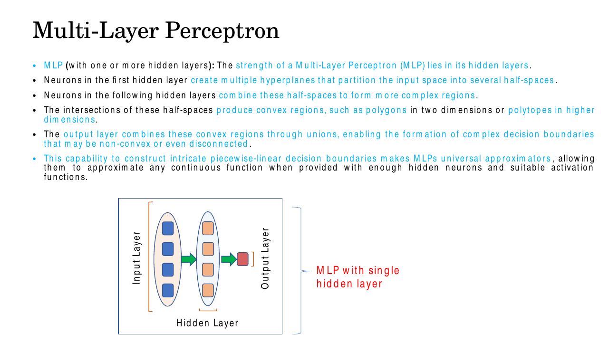
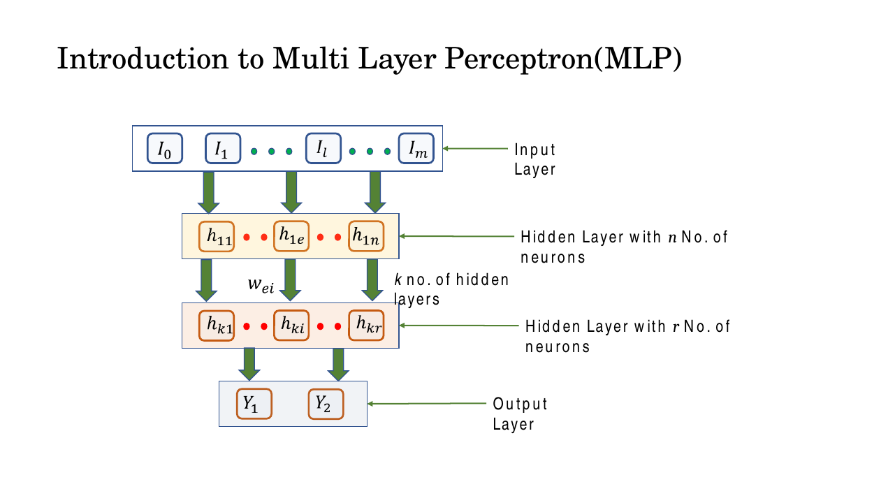
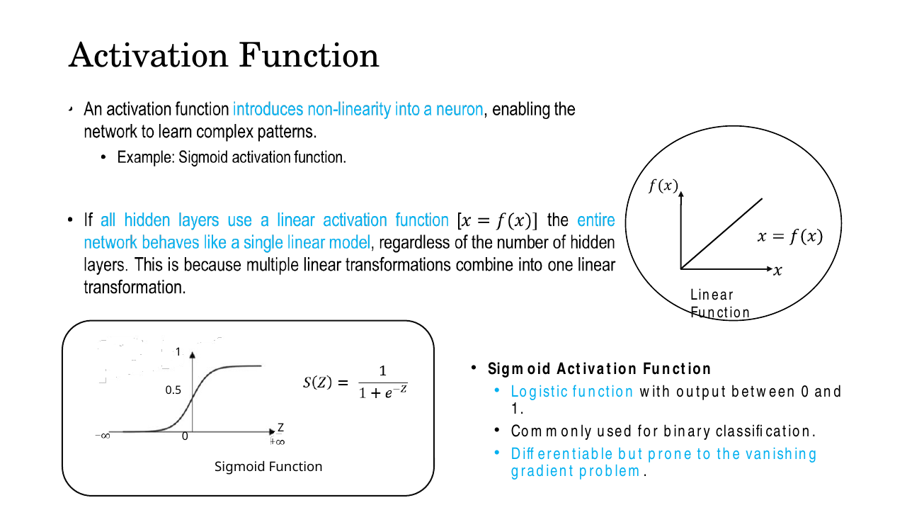
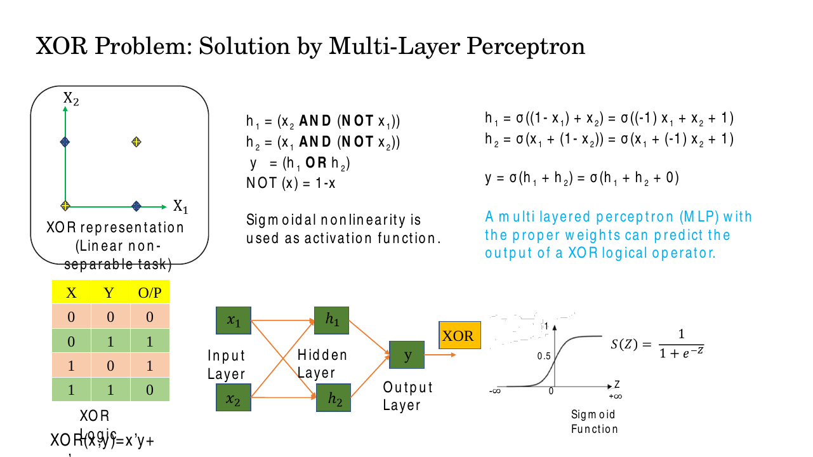
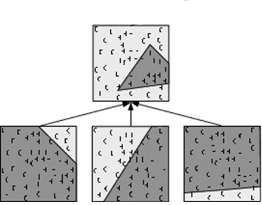
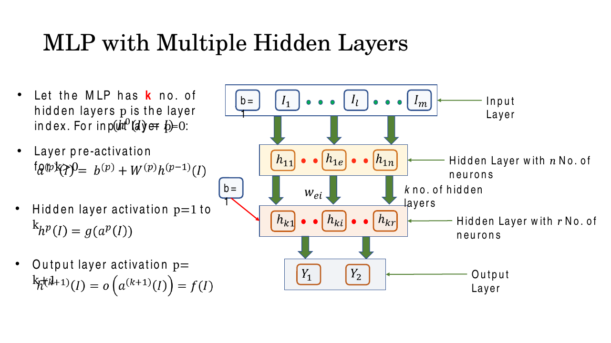
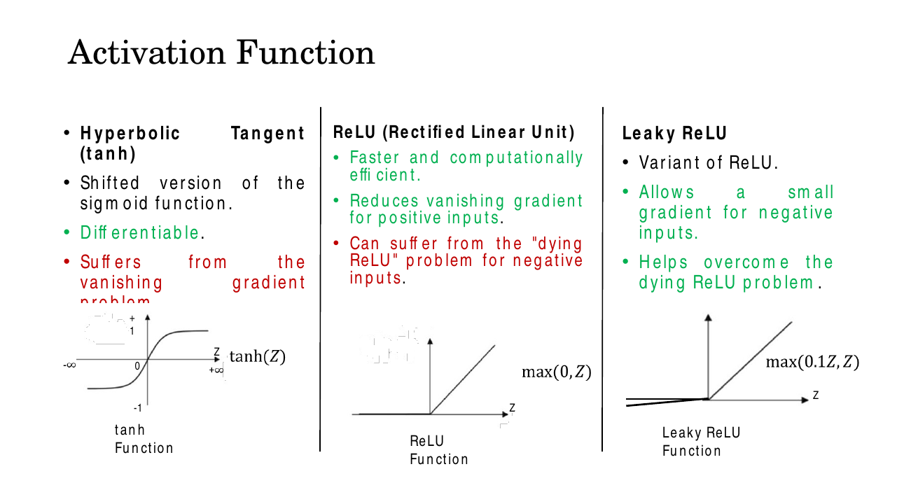
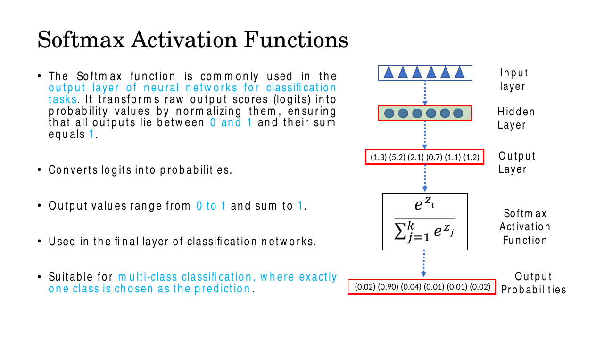

# Lec 8 — Multi-Layer Perceptron and Activation Functions

> **Deck:** `W2L3_P2_MLP.pptx` · **Week 2** · **Playlist:** Lec 8
> **Prereqs:** [Lec 7 — Neural Network Fundamentals: the Perceptron](07-perceptron.md), [Lec 4 — Linear Algebra](../week-01/04-linear-algebra.md)
> **Feeds into:** [Lec 9 — Backpropagation](09-backpropagation.md), [Lec 13 — Vanishing Gradients and Activations](../week-03/13-vanishing-gradients-activations.md)

## Why this lecture exists

The previous lecture ended on a wall. A single perceptron draws exactly one straight line through the
input space, and XOR's four points cannot be split by any straight line. That is not a small failure
— it is a proof that a single-layer model is permanently blind to any pattern that is not linearly
separable, and almost nothing in vision is.

This lecture pays off that cliffhanger. Insert one layer of units *between* the input and the output,
give each a non-linear squashing function, and the network can draw several lines and then combine
the regions they carve out. XOR falls immediately; so does, in principle, any continuous function.
What follows is the architecture, the exact weights that solve XOR, the proof that the non-linearity
is doing all the work, and softmax — the output activation every classifier in the rest of the course
ends with.

## The ideas

### The architecture: three kinds of layer

A **multi-layer perceptron (MLP)** is a stack of layers of neurons, where every neuron in one layer
connects to every neuron in the next. Such a layer is called **fully-connected** or **dense** — "dense"
because the weight matrix has no zeros structurally forced on it, every input touches every output.


*Fig. — The deck's framing to hold on to: hidden units cut the input space into half-spaces, their intersections make convex regions, and the output layer takes unions of those regions. Everything below is that sentence made precise. Slide 4.*

| Layer | What it does | Computation? |
|---|---|---|
| **Input layer** | Entry point. Receives the raw feature vector and forwards it unchanged. | **None.** It holds values; it does not compute. |
| **Hidden layer(s)** | Learns intermediate features — the "half-spaces". Called *hidden* because its values are never observed in the data, only the inputs and the targets are. | Weighted sum + activation |
| **Output layer** | Combines hidden features into the prediction, in the shape the task needs (one unit for regression, $K$ units + softmax for $K$-class classification). | Weighted sum + output activation |

A standard counting convention, and a standard exam trap: **the input layer is not counted as a layer.**
A network described as "2-3-1" or "a one-hidden-layer MLP" has two layers *of weights*. The deck's
general picture has $k$ hidden layers with layer index $p$ running $0$ (input) to $k+1$ (output).


*Fig. — Different hidden layers may have different widths ($n$ then $r$). The weight $w_{ei}$ carries a pair of indices because it belongs to a matrix, not a list. Slide 6.*

### The forward pass, with the shapes

Write $n_l$ for the number of units in layer $l$, with $n_0$ the input dimension. The whole network is
two lines, applied for $l = 1, 2, \dots, L$:

$$\mathbf{z}^{(l)} = \mathbf{W}^{(l)}\mathbf{a}^{(l-1)} + \mathbf{b}^{(l)}, \qquad \mathbf{a}^{(l)} = f\!\left(\mathbf{z}^{(l)}\right)$$

with $\mathbf{a}^{(0)} = \mathbf{x}$ (the input layer is just the name for the input vector) and
$\hat{\mathbf{y}} = \mathbf{a}^{(L)}$. The deck writes this as
$a^{(p)}(I) = b^{(p)} + W^{(p)}h^{(p-1)}(I)$ and $h^{(p)}(I) = g(a^{(p)}(I))$ — its $a$ is our
$\mathbf{z}$ (pre-activation) and its $h$ is our $\mathbf{a}$ (activation). Translate carefully; the
clash is easy to trip over.

$\mathbf{z}^{(l)}$ is the **pre-activation** (also "logit" at the output layer, or "net input"), and
$f$ is applied **element-wise** — each unit squashes its own number, independently of its neighbours.
Softmax, below, is the one exception.

Now cash in [Lec 4](../week-01/04-linear-algebra.md). For the multiply $\mathbf{W}^{(l)}\mathbf{a}^{(l-1)}$
to be legal, the inner dimensions must match, which pins every shape:

| Object | Shape | Read it as |
|---|---|---|
| $\mathbf{a}^{(l-1)}$ | $n_{l-1} \times 1$ | the previous layer's output |
| $\mathbf{W}^{(l)}$ | $n_l \times n_{l-1}$ | **rows = units in this layer, columns = units in the previous one** |
| $\mathbf{b}^{(l)}$ | $n_l \times 1$ | one bias per unit in this layer |
| $\mathbf{z}^{(l)},\ \mathbf{a}^{(l)}$ | $n_l \times 1$ | this layer's output |

So row $j$ of $\mathbf{W}^{(l)}$ is the full weight vector of unit $j$, and $z_j^{(l)}$ is the dot
product of that row with the incoming activation vector — a similarity score between what unit $j$
is looking for and what it received. The parameter count of layer $l$ is $n_l n_{l-1} + n_l$; the
$+n_l$ is the biases, and forgetting it is the single most common arithmetic slip on this topic
(see N5).

For a **batch** of $B$ examples stacked as rows in $\mathbf{X}$ ($B \times n_0$), frameworks compute
$\mathbf{Z}^{(l)} = \mathbf{A}^{(l-1)}\mathbf{W}^{(l)\top} + \mathbf{b}^{(l)\top}$ instead, so the
weight matrix appears transposed. Same arithmetic, different layout convention — do not let it
confuse you when you read PyTorch code.

### Why the non-linearity is not optional

Take a two-layer network and make the hidden activation the identity, $f(x) = x$ — the "linear
activation function" the deck draws. Then:

$$\mathbf{a}^{(2)} = \mathbf{W}^{(2)}\!\left(\mathbf{W}^{(1)}\mathbf{x} + \mathbf{b}^{(1)}\right) + \mathbf{b}^{(2)} = \underbrace{\left(\mathbf{W}^{(2)}\mathbf{W}^{(1)}\right)}_{\tilde{\mathbf{W}}}\mathbf{x} + \underbrace{\left(\mathbf{W}^{(2)}\mathbf{b}^{(1)} + \mathbf{b}^{(2)}\right)}_{\tilde{\mathbf{b}}}$$

$\tilde{\mathbf{W}}$ is $[n_2 \times n_1][n_1 \times n_0] = [n_2 \times n_0]$ — exactly the shape of a
*single* layer mapping $n_0$ inputs to $n_2$ outputs, and $\tilde{\mathbf{b}}$ is $n_2 \times 1$.
Induct on this and a 100-layer linear network is still $\tilde{\mathbf{W}}\mathbf{x} + \tilde{\mathbf{b}}$.

**Depth with linear activations buys you literally nothing.** Not a worse model, not a slower one —
the exact same function class, a perceptron, with more parameters to fit it. Worse: since
$\mathrm{rank}(\tilde{\mathbf{W}}) \le \min_l \mathrm{rank}(\mathbf{W}^{(l)})$, a narrow linear hidden
layer can only *restrict* what the stack can express. The non-linear $f$ is the thing that makes a
second layer mean something.


*Fig. — The two halves of this slide are one argument: the right-hand straight line is what you get without $f$, the bottom-left S-curve is the cheapest way to break it. Slide 8.*

### XOR, solved

Recall the problem. XOR outputs 1 when the inputs differ and 0 when they agree:

| $x_1$ | $x_2$ | XOR |
|---|---|---|
| 0 | 0 | 0 |
| 0 | 1 | 1 |
| 1 | 0 | 1 |
| 1 | 1 | 0 |

The two zeros sit at $(0,0)$ and $(1,1)$, both on the diagonal $x_2 = x_1$. The two ones sit at
$(0,1)$ and $(1,0)$, on **opposite sides** of that diagonal. A single line has one "positive side",
so it can never claim both $(0,1)$ and $(1,0)$ while rejecting the points between them. That is the
whole impossibility argument from [Lec 7](07-perceptron.md).

But two *parallel* lines can. Bracket the diagonal with a line just above it and a line just below
it, and the plane falls into three strips: the two outer strips hold exactly the positive points, the
middle strip holds exactly the negative points. **Give each line its own hidden unit, and have the
output unit OR them.**

The deck reaches the same place through Boolean algebra, $\text{XOR}(x,y) = x'y + xy'$:

$$h_1 = x_2 \wedge \neg x_1, \qquad h_2 = x_1 \wedge \neg x_2, \qquad y = h_1 \vee h_2$$

Translating each gate into a weighted sum with a hard threshold at 0 — AND$(a,b)$ fires when
$a + b - 1.5 > 0$, OR$(a,b)$ when $a + b - 0.5 > 0$, and $\neg x = 1 - x$:

$$z_{h_1} = -x_1 + x_2 - 0.5, \qquad z_{h_2} = x_1 - x_2 - 0.5, \qquad z_y = h_1 + h_2 - 0.5$$

Those are the two parallel lines, slope $+1$, offset $\pm 0.5$ from the diagonal:

```
     x2
    1 |  ●(0,1)=1          ○(1,1)=0
      |        \         \
      |      A  \       B \        A:  x2 = x1 + 0.5   h1 fires ABOVE A
      |          \         \       B:  x2 = x1 - 0.5   h2 fires BELOW B
    0 |  ○(0,0)=0 \         \ ●(1,0)=1
      +-------------------------------- x1
         0                      1

   above A   -> h1=1, h2=0  -> y = 1     holds (0,1)
   between   -> h1=0, h2=0  -> y = 0     holds (0,0) and (1,1)
   below B   -> h1=0, h2=1  -> y = 1     holds (1,0)
```

Verify all four rows with the threshold at zero:

| $x_1$ | $x_2$ | $z_{h_1}=-x_1{+}x_2{-}0.5$ | $h_1$ | $z_{h_2}=x_1{-}x_2{-}0.5$ | $h_2$ | $z_y=h_1{+}h_2{-}0.5$ | $y$ | XOR |
|---|---|---|---|---|---|---|---|---|
| 0 | 0 | $-0.5$ | 0 | $-0.5$ | 0 | $-0.5$ | 0 | 0 ✓ |
| 0 | 1 | $+0.5$ | 1 | $-1.5$ | 0 | $+0.5$ | 1 | 1 ✓ |
| 1 | 0 | $-1.5$ | 0 | $+0.5$ | 1 | $+0.5$ | 1 | 1 ✓ |
| 1 | 1 | $-0.5$ | 0 | $-0.5$ | 0 | $-0.5$ | 0 | 0 ✓ |

In matrix form, this MLP is exactly

$$\mathbf{W}^{(1)} = \begin{bmatrix}-1 & 1\\ 1 & -1\end{bmatrix},\quad \mathbf{b}^{(1)} = \begin{bmatrix}-0.5\\-0.5\end{bmatrix},\quad \mathbf{W}^{(2)} = \begin{bmatrix}1 & 1\end{bmatrix},\quad b^{(2)} = -0.5$$


*Fig. — The 2-2-1 network at the bottom is the smallest thing that solves XOR: two inputs, **two** hidden units (one per line), one output. One hidden unit is not enough — you need two lines. Slide 3.*

**A correction you need.** The slide's sigmoid version writes $h_1 = \sigma(-x_1 + x_2 + 1)$ and
$y = \sigma(h_1 + h_2 + 0)$. Those biases are wrong: with $+1$, $h_1$ and $h_2$ never switch off, and
all four inputs give $y \approx 0.80$. The AND threshold of $-1.5$ has gone missing. Use $-0.5$ as
above, and scale the weights up so the sigmoid saturates. Numerical N1 does this in full.

**Why this generalises.** Each hidden unit is still a perceptron, so each still draws one hyperplane
and reports which side you are on — a half-space. What is new is that the output unit no longer sees
$\mathbf{x}$; it sees $(h_1, h_2)$, a *re-coded* version of the input in which the problem has become
linearly separable. Intersecting half-spaces gives convex regions (polygons in 2-D, polytopes in
higher dimensions); a further layer takes unions of those, giving regions that may be non-convex or
even disconnected.


*Fig. — Three hidden units, three lines, one triangle. The output node ANDs the three half-spaces; a second hidden layer could then OR several such triangles into any shape you like. Slide 5.*

### Universal approximation, honestly

The deck's claim: *MLPs are universal approximators, able to approximate any continuous function
given enough hidden neurons and suitable activation functions.* The precise statement (Cybenko 1989,
Hornik 1991) is that for any continuous $g$ on a compact domain and any $\varepsilon > 0$, there
exists a **one-hidden-layer** network with a non-polynomial activation whose output is within
$\varepsilon$ of $g$ everywhere on that domain.

Four things the theorem does **not** say, and the exam likes all four:

- The weights **exist**; it says nothing about gradient descent finding them.
- No bound on the **width**. "Enough neurons" can mean exponentially many in the input dimension.
- Approximation **on the training domain**, not generalisation to new data.
- It needs a non-linear activation — with $f$ linear the earlier proof kills it outright.

This is why the course does not stop at one hidden layer. Depth is a *width-efficiency* argument:
many functions needing exponentially many units in one layer need only polynomially many when you
stack layers, because each layer composes features built by the one below (edges → corners → parts →
objects, as in [Lec 11](../week-03/11-cnn-basics.md)).


*Fig. — Note that hidden layers use activation $g$ while the output layer uses a different function $o$ — sigmoid or softmax for classification, identity for regression. The $b=1$ boxes are the bias-as-an-extra-input trick from Lec 7. Slide 11.*

### The activation catalogue

These are **choices** you make per layer. Shape and range are what you memorise here; what their
*derivatives* do to training is the subject of
[Lec 13](../week-03/13-vanishing-gradients-activations.md), and it matters enormously once networks
get deep.

| Activation | Formula | Range | Shape | Typical use |
|---|---|---|---|---|
| **Linear / identity** | $f(z) = z$ | $(-\infty,\infty)$ | straight line | Output layer of a **regression** net only. Never in a hidden layer — see the collapse proof. |
| **Sigmoid** (logistic) | $\sigma(z) = \dfrac{1}{1+e^{-z}}$ | $(0,1)$ | S-curve, $\sigma(0)=0.5$ | Output unit for **binary** classification; reads as a probability |
| **tanh** | $\tanh(z) = \dfrac{e^z - e^{-z}}{e^z + e^{-z}}$ | $(-1,1)$ | S-curve, **zero-centred** | Hidden layers in older nets and in RNNs/LSTMs ([Lec 18](../week-05/18-lstm.md)) |
| **ReLU** | $\max(0, z)$ | $[0,\infty)$ | flat then $45°$ ramp, kink at 0 | **Default** for hidden layers in CNNs and MLPs |
| **Leaky ReLU** | $\max(0.1z,\ z)$ | $(-\infty,\infty)$ | shallow ramp then steep ramp | Drop-in for ReLU when units stop responding |
| **Softmax** | $\dfrac{e^{z_i}}{\sum_j e^{z_j}}$ | $(0,1)$, sums to 1 | — (vector-valued) | Output layer for **multi-class** classification |


*Fig. — The Leaky ReLU slope is $0.1$ on this deck; many texts use $0.01$. Memorise the deck's number for the exam and note the discrepancy. Slide 9.*

Two relations worth knowing cold. tanh is a **rescaled, shifted sigmoid**, which is what "shifted
version of the sigmoid" on the deck means:

$$\tanh(z) = 2\sigma(2z) - 1$$

And ReLU is the only one here that is not differentiable everywhere — the kink at $z = 0$ has no
derivative. In practice libraries just define $\text{ReLU}'(0) = 0$, which costs nothing because
$z$ is exactly zero with probability zero.

The deck's one-line gradient notes — sigmoid and tanh "suffer from the vanishing gradient problem",
ReLU "reduces vanishing gradient for positive inputs" but "can suffer from the dying ReLU problem",
Leaky ReLU "allows a small gradient for negative inputs" — are the entire subject of
[Lec 13](../week-03/13-vanishing-gradients-activations.md), where they are derived rather than
asserted. Take them on trust until then.

### Softmax

Sigmoid gives you one probability. For $K$ mutually exclusive classes you need a whole probability
*distribution*: $K$ numbers, each in $[0,1]$, summing to 1. **Softmax** is the standard way to turn a
vector of $K$ unconstrained real scores — **logits** — into exactly that:

$$\sigma(\mathbf{z})_i = \frac{e^{z_i}}{\sum_{j=1}^{K} e^{z_j}}, \qquad i = 1,\dots,K$$

Why it works, in two steps. $e^{z}$ is **strictly positive** for every real $z$, which handles
non-negativity and preserves order ($z_i > z_j \implies e^{z_i} > e^{z_j}$). Dividing by the sum of
all the exponentials then forces

$$\sum_{i=1}^{K}\sigma(\mathbf{z})_i = \frac{\sum_i e^{z_i}}{\sum_j e^{z_j}} = 1$$

It is "soft" max because the largest logit gets the largest probability but the others are not zeroed
— unlike `argmax`, it is differentiable, which is the whole reason it can sit inside a network.

**It generalises sigmoid.** With $K = 2$:

$$\sigma(\mathbf{z})_1 = \frac{e^{z_1}}{e^{z_1}+e^{z_2}} = \frac{1}{1 + e^{-(z_1-z_2)}} = \sigma(z_1 - z_2)$$

Two-class softmax *is* the logistic sigmoid applied to the difference of the logits.

**Shift invariance and the stability trick.** For any constant $c$,

$$\sigma(\mathbf{z} + c\mathbf{1})_i = \frac{e^{z_i + c}}{\sum_j e^{z_j + c}} = \frac{e^{c}e^{z_i}}{e^{c}\sum_j e^{z_j}} = \sigma(\mathbf{z})_i$$

Softmax only cares about *differences* between logits — which is the licence to pick
$c = -\max_i z_i$ before exponentiating. Every exponent then lies in $(-\infty, 0]$, so every
$e^{z_i - \max}$ lies in $(0, 1]$: no overflow possible, and the denominator is at least 1, so no
division by zero either. Compute $e^{1000}$ directly and you get `inf`, then `inf/inf = nan`. Always
subtract the max. N4 shows both routes landing on the same numbers.

**Its derivative**, which [Lec 9](09-backpropagation.md) will need: writing $p_i = \sigma(\mathbf{z})_i$,

$$\frac{\partial p_i}{\partial z_j} = p_i(\delta_{ij} - p_j) = \begin{cases} p_i(1-p_i) & i = j\\ -p_i p_j & i \neq j\end{cases}$$

Unlike every other activation here, softmax is a **vector-to-vector** function, so its derivative is a
full $K \times K$ Jacobian, not a single number per unit. Changing one logit changes *all* the
probabilities, because they must keep summing to 1.

**Pairing with cross-entropy.** Softmax is almost always trained against the **cross-entropy loss**.
With a one-hot target $\mathbf{y}$ whose correct class is $c$:

$$\mathcal{L} = -\sum_{i=1}^{K} y_i \log p_i = -\log p_c$$

Only the true class's probability appears. Push $p_c \to 1$ and $\mathcal{L}\to 0$; let $p_c \to 0$
and the loss blows up — the $\log$ punishes confident mistakes very hard. The reason this pairing is
universal is what happens when you compose the two derivatives:

$$\frac{\partial \mathcal{L}}{\partial z_i} = p_i - y_i$$

The messy Jacobian cancels entirely and the gradient at the logits is just *predicted minus true*.
This is why frameworks ship a fused `softmax_cross_entropy` op rather than two separate ones.


*Fig. — Check the deck's own numbers: they sum to 1.00, and the largest logit 5.2 takes 0.90 of the mass. Softmax exaggerates gaps because the exponential is convex — a logit gap of 3.1 became a probability ratio of 49:1. Slide 10.*

Softmax reappears in [Lec 25](../week-07/25-qkv-and-self-attention.md) inside
$\mathrm{softmax}(\mathbf{Q}\mathbf{K}^\top/\sqrt{d_k})\mathbf{V}$, where it turns similarity scores
into attention weights that sum to 1. Same function, same shift-invariance, different name for the
inputs.

## Worked numericals

### N1. XOR through a 2-2-1 sigmoid MLP — all four cases
**Given:** $\mathbf{W}^{(1)} = \begin{bmatrix}-10&10\\10&-10\end{bmatrix}$, $\mathbf{b}^{(1)} = \begin{bmatrix}-5\\-5\end{bmatrix}$, $\mathbf{W}^{(2)} = \begin{bmatrix}10&10\end{bmatrix}$, $b^{(2)} = -5$, sigmoid everywhere.
**Find:** the output for all four XOR inputs. (These are the threshold weights of the previous section scaled by 10 so the sigmoid saturates.)

Useful values: $\sigma(5) = 0.9933$, $\sigma(-5) = 0.0067$, $\sigma(-15) = 3.06\times10^{-7}$.

1. $\mathbf{x} = [0,0]$: $z_1 = 0 + 0 - 5 = -5 \Rightarrow h_1 = 0.0067$; $z_2 = -5 \Rightarrow h_2 = 0.0067$.
   $z_y = 10(0.0067) + 10(0.0067) - 5 = 0.0669 + 0.0669 - 5 = -4.866 \Rightarrow y = \sigma(-4.866) = 0.0076$.
2. $\mathbf{x} = [0,1]$: $z_1 = 0 + 10 - 5 = 5 \Rightarrow h_1 = 0.9933$; $z_2 = 0 - 10 - 5 = -15 \Rightarrow h_2 \approx 0$.
   $z_y = 9.933 + 0.000 - 5 = 4.933 \Rightarrow y = \sigma(4.933) = 0.9928$.
3. $\mathbf{x} = [1,0]$: by symmetry $h_1 \approx 0$, $h_2 = 0.9933$, $z_y = 4.933 \Rightarrow y = 0.9928$.
4. $\mathbf{x} = [1,1]$: $z_1 = -10+10-5 = -5 \Rightarrow h_1 = 0.0067$; $z_2 = 10-10-5 = -5 \Rightarrow h_2 = 0.0067$.
   $z_y = -4.866 \Rightarrow y = 0.0076$.

**Answer:** $y = 0.008,\ 0.993,\ 0.993,\ 0.008$ for $(0,0), (0,1), (1,0), (1,1)$. Rounding at 0.5
gives $0,1,1,0$ — **XOR, solved by one hidden layer.** Note $h_1$ and $h_2$ are never both on; the
middle strip is what the hidden layer bought you.

### N2. Full forward pass through a 2-3-1 MLP
**Given:** $\mathbf{x} = [1.0,\ 0.5]^\top$, sigmoid in both layers, and

$$\mathbf{W}^{(1)} = \begin{bmatrix}0.2&-0.3\\0.4&0.1\\-0.5&0.2\end{bmatrix},\ \mathbf{b}^{(1)} = \begin{bmatrix}0.1\\-0.2\\0.3\end{bmatrix},\ \mathbf{W}^{(2)} = \begin{bmatrix}0.6&-0.4&0.5\end{bmatrix},\ b^{(2)} = -0.1$$

**Find:** the network output $\hat{y}$.

1. Shape check: $\mathbf{W}^{(1)}$ is $3\times2$, $\mathbf{x}$ is $2\times1$ — legal, gives $3\times1$. Then $[1\times3][3\times1] = [1\times1]$. ✓
2. $z^{(1)}_1 = (0.2)(1.0) + (-0.3)(0.5) + 0.1 = 0.2 - 0.15 + 0.1 = 0.15$
3. $z^{(1)}_2 = (0.4)(1.0) + (0.1)(0.5) - 0.2 = 0.4 + 0.05 - 0.2 = 0.25$
4. $z^{(1)}_3 = (-0.5)(1.0) + (0.2)(0.5) + 0.3 = -0.5 + 0.1 + 0.3 = -0.10$
5. $a^{(1)}_1 = \sigma(0.15) = 1/(1 + e^{-0.15}) = 1/(1+0.8607) = 1/1.8607 = 0.5374$
6. $a^{(1)}_2 = \sigma(0.25) = 1/(1+0.7788) = 1/1.7788 = 0.5622$
7. $a^{(1)}_3 = \sigma(-0.10) = 1/(1+1.1052) = 1/2.1052 = 0.4750$
8. $z^{(2)} = (0.6)(0.5374) + (-0.4)(0.5622) + (0.5)(0.4750) - 0.1$
   $= 0.3225 - 0.2249 + 0.2375 - 0.1 = 0.2351$
9. $\hat{y} = \sigma(0.2351) = 1/(1 + e^{-0.2351}) = 1/(1 + 0.7905) = 1/1.7905 = 0.5585$

**Answer:** $\hat{y} \approx 0.5585$. As a binary classifier at threshold 0.5 this predicts class 1,
but only barely — a near-coin-flip, which is what untrained small weights produce.

### N3. Softmax on a logit vector
**Given:** logits $\mathbf{z} = [2.0,\ 1.0,\ 0.1]$.
**Find:** the softmax probabilities.

1. $e^{2.0} = 7.3891$
2. $e^{1.0} = 2.7183$
3. $e^{0.1} = 1.1052$
4. Denominator $= 7.3891 + 2.7183 + 1.1052 = 11.2126$
5. $p_1 = 7.3891/11.2126 = 0.6590$
6. $p_2 = 2.7183/11.2126 = 0.2424$
7. $p_3 = 1.1052/11.2126 = 0.0986$
8. Check: $0.6590 + 0.2424 + 0.0986 = 1.0000$ ✓

**Answer:** $\mathbf{p} = [0.659,\ 0.242,\ 0.099]$. A logit gap of only 1.0 between classes 1 and 2
became a probability ratio of $2.72{:}1$ — exactly $e^{1}$, because the ratio
$p_i/p_j = e^{z_i - z_j}$ depends only on the logit difference.

### N4. Softmax with the max-subtraction stability trick
**Given:** logits $\mathbf{z} = [1000,\ 1001,\ 1002]$, where $e^{1000}$ overflows a 64-bit float.
**Find:** the probabilities, and confirm the shifted computation agrees with N3's method.

1. Naively: $e^{1000} = \texttt{inf}$, so every $p_i = \texttt{inf}/\texttt{inf} = \texttt{nan}$. Unusable.
2. Subtract $\max(\mathbf{z}) = 1002$: shifted logits $= [-2,\ -1,\ 0]$.
3. $e^{-2} = 0.1353$, $e^{-1} = 0.3679$, $e^{0} = 1.0000$. Sum $= 1.5032$.
4. $p_1 = 0.1353/1.5032 = 0.0900$; $p_2 = 0.3679/1.5032 = 0.2447$; $p_3 = 1.0000/1.5032 = 0.6652$. Sum $= 1.0000$ ✓
5. Cross-check the invariance on N3's vector: shift $[2.0, 1.0, 0.1]$ by $-2.0$ to $[0,\ -1.0,\ -1.9]$.
   $e^0 = 1$, $e^{-1.0} = 0.3679$, $e^{-1.9} = 0.1496$; sum $= 1.5175$.
   $p = [1/1.5175,\ 0.3679/1.5175,\ 0.1496/1.5175] = [0.6590,\ 0.2424,\ 0.0986]$ — **identical to N3.**

**Answer:** $\mathbf{p} = [0.090,\ 0.245,\ 0.665]$, and the shift changes nothing, because only logit
*differences* survive the normalisation.

### N5. Parameter count of a 784-128-64-10 MLP
**Given:** an MLP for MNIST: input 784, hidden layers of 128 and 64, output 10. Every layer has biases.
**Find:** the total number of learnable parameters.

1. Layer 1 weights: $\mathbf{W}^{(1)}$ is $128 \times 784 = 100{,}352$. Biases: $128$. Subtotal $= 100{,}480$.
2. Layer 2 weights: $\mathbf{W}^{(2)}$ is $64 \times 128 = 8{,}192$. Biases: $64$. Subtotal $= 8{,}256$.
3. Layer 3 weights: $\mathbf{W}^{(3)}$ is $10 \times 64 = 640$. Biases: $10$. Subtotal $= 650$.
4. Total $= 100{,}480 + 8{,}256 + 650 = 109{,}386$.

**Answer:** **109,386 parameters.** Note that 92% of them live in the first layer — fully-connected
layers blow up with input dimension, which is the entire motivation for convolution in
[Lec 11](../week-03/11-cnn-basics.md). Dropping the biases gives 109,184; the difference of 202 is
the usual MCQ discriminator.

## Code

```python
import numpy as np

def sigmoid(z):
    return 1.0 / (1.0 + np.exp(-z))

def stable_softmax(z):
    z = z - np.max(z)            # shift-invariance: softmax(z + c) == softmax(z)
    e = np.exp(z)                # every exponent now <= 0, so every e in (0, 1]
    return e / e.sum()

# --- N2: forward pass through a 2-3-1 MLP -------------------------------
x  = np.array([1.0, 0.5])
W1 = np.array([[0.2, -0.3], [0.4, 0.1], [-0.5, 0.2]])   # (3, 2) = n1 x n0
b1 = np.array([0.1, -0.2, 0.3])                          # (3,)
W2 = np.array([[0.6, -0.4, 0.5]])                        # (1, 3) = n2 x n1
b2 = np.array([-0.1])

z1 = W1 @ x + b1;  a1 = sigmoid(z1)
z2 = W2 @ a1 + b2; yhat = sigmoid(z2)
print("z1   =", np.round(z1, 4))      # z1   = [ 0.15  0.25 -0.1 ]
print("a1   =", np.round(a1, 4))      # a1   = [0.5374 0.5622 0.475 ]
print("yhat =", np.round(yhat, 4))    # yhat = [0.5585]

# --- N1: XOR with one hidden layer --------------------------------------
Wx1 = np.array([[-10., 10.], [10., -10.]]); bx1 = np.array([-5., -5.])
Wx2 = np.array([[10., 10.]]);               bx2 = np.array([-5.])
for xi in [[0, 0], [0, 1], [1, 0], [1, 1]]:
    h = sigmoid(Wx1 @ np.array(xi, float) + bx1)
    y = sigmoid(Wx2 @ h + bx2)[0]
    print(f"XOR{tuple(xi)} -> h={np.round(h,4)} y={y:.4f} -> {int(y > 0.5)}")
# XOR(0, 0) -> h=[0.0067 0.0067] y=0.0076 -> 0
# XOR(0, 1) -> h=[0.9933 0.    ] y=0.9928 -> 1
# XOR(1, 0) -> h=[0.     0.9933] y=0.9928 -> 1
# XOR(1, 1) -> h=[0.0067 0.0067] y=0.0076 -> 0

# --- N3/N4: softmax, and why you subtract the max ------------------------
print(np.round(stable_softmax(np.array([2.0, 1.0, 0.1])), 4))   # [0.659  0.2424 0.0986]
big = np.array([1000., 1001., 1002.])
naive = np.exp(big) / np.exp(big).sum()                          # overflow -> nan
print("naive :", naive)                                          # naive : [nan nan nan]
print("stable:", np.round(stable_softmax(big), 4))               # stable: [0.09   0.2447 0.6652]

# --- parameter count, N5 -------------------------------------------------
dims = [784, 128, 64, 10]
total = sum(dims[i] * dims[i+1] + dims[i+1] for i in range(len(dims) - 1))
print("parameters:", total)                                      # parameters: 109386
```

The `naive` line emits a RuntimeWarning about overflow before printing `nan` — that warning in a
training log is almost always an unstable softmax.

## Exam pack

### Must-memorise

| Item | Exactly this |
|---|---|
| Pre-activation | $\mathbf{z}^{(l)} = \mathbf{W}^{(l)}\mathbf{a}^{(l-1)} + \mathbf{b}^{(l)}$ |
| Activation | $\mathbf{a}^{(l)} = f(\mathbf{z}^{(l)})$, applied element-wise, $\mathbf{a}^{(0)} = \mathbf{x}$ |
| Weight shape | $\mathbf{W}^{(l)}$ is $n_l \times n_{l-1}$ (rows = this layer) |
| Params in layer $l$ | $n_l n_{l-1} + n_l$ |
| Linear collapse | $\mathbf{W}^{(2)}(\mathbf{W}^{(1)}\mathbf{x}+\mathbf{b}^{(1)})+\mathbf{b}^{(2)} = \tilde{\mathbf{W}}\mathbf{x}+\tilde{\mathbf{b}}$ |
| Sigmoid | $\sigma(z) = \dfrac{1}{1+e^{-z}}$, range $(0,1)$ |
| tanh | $\tanh(z) = \dfrac{e^z-e^{-z}}{e^z+e^{-z}} = 2\sigma(2z)-1$, range $(-1,1)$ |
| ReLU | $\max(0,z)$, range $[0,\infty)$ |
| Leaky ReLU | $\max(0.1z, z)$ (deck's slope) |
| Softmax | $\sigma(\mathbf{z})_i = \dfrac{e^{z_i}}{\sum_{j=1}^{K} e^{z_j}}$ |
| Softmax shift invariance | $\sigma(\mathbf{z} + c\mathbf{1}) = \sigma(\mathbf{z})$; use $c = -\max_i z_i$ |
| Softmax Jacobian | $\partial p_i/\partial z_j = p_i(\delta_{ij} - p_j)$ |
| Cross-entropy | $\mathcal{L} = -\sum_i y_i\log p_i = -\log p_c$ |
| Softmax + CE gradient | $\partial\mathcal{L}/\partial z_i = p_i - y_i$ |
| Universal approximation | one hidden layer, enough units, non-linear $f$ ⟹ approximates any continuous function on a compact set |

### Numbers worth knowing

| Quantity | Value |
|---|---|
| Hidden units needed to solve XOR | **2** (a 2-2-1 network) |
| Deck's XOR decomposition | $\text{XOR}(x,y) = x'y + xy'$ |
| Correct XOR hidden biases | $-0.5$ (AND-style), **not** the deck's $+1$ |
| Deck's softmax example | logits $(1.3, 5.2, 2.1, 0.7, 1.1, 1.2)$ → $(0.02, 0.90, 0.04, 0.01, 0.01, 0.02)$ |
| $\sigma(0)$ | $0.5$ |
| $\tanh(0)$ | $0$ |
| softmax$([2.0, 1.0, 0.1])$ | $[0.659, 0.242, 0.099]$ |
| Params in 784-128-64-10 with biases | $109{,}386$ |
| Leaky ReLU slope on this deck | $0.1$ |
| Layers of weights in "one hidden layer" | 2 |

### Likely MCQ traps

- **"An MLP with linear activations and 5 hidden layers is more powerful than a perceptron."** False —
  it collapses to $\tilde{\mathbf{W}}\mathbf{x}+\tilde{\mathbf{b}}$, one linear map. Depth without
  non-linearity buys nothing.
- **Counting the input layer.** A "3-layer network" normally means 3 layers *of weights*, i.e. 2
  hidden layers. The input layer performs no computation and is conventionally not counted.
- **Forgetting biases in a parameter count.** $784\times128$ is $100{,}352$; the layer has $100{,}480$.
- **$\mathbf{W}^{(l)}$ shape reversed.** It is $n_l \times n_{l-1}$ — rows index the *current* layer.
  $n_{l-1} \times n_l$ will not multiply with $\mathbf{a}^{(l-1)}$.
- **"Softmax outputs sum to 1, therefore they are independent probabilities."** No — exactly the
  opposite. The constraint couples them: raising one lowers the rest. Use $K$ independent
  **sigmoids** for multi-label problems where several classes may be true at once.
- **"Softmax and sigmoid are unrelated."** For $K=2$, $\sigma(\mathbf{z})_1 = \sigma(z_1 - z_2)$ —
  softmax is the multi-class generalisation.
- **"Subtracting $\max(\mathbf{z})$ is an approximation."** It is exactly invariant: $e^c$ cancels.
  And softmax is *not* element-wise — it needs the whole logit vector, which is why its derivative
  is a matrix.
- **One hidden unit for XOR.** Insufficient — one unit is one line, and XOR needs two.
- **"Universal approximation means one hidden layer is enough in practice."** It guarantees existence
  only, with no bound on width and no promise that training finds the weights.
- **ReLU's range.** $[0,\infty)$ — zero *is* included. Sigmoid's $(0,1)$ is open at both ends; it
  never exactly reaches 0 or 1.

### Self-test

1. An MLP is 10-20-15-3. Give the shape of each weight matrix and the total parameter count including biases.
2. Why can a hidden layer with *linear* activations not solve XOR?
3. Compute softmax$([1, 1, 1])$. Now compute softmax$([101, 101, 101])$.
4. A hidden unit has weights $[0.5, -1.0]$ and bias $0.2$. Input $[2, 1]$. Give its output under (a) sigmoid, (b) ReLU.
5. In a 2-2-1 XOR solver with the step weights given in this chapter, what are $(h_1, h_2)$ for input $(1,1)$, and why is that the key case?
6. True or false: softmax can output exactly $[1, 0, 0]$.
7. A classifier's logits are $[3.0, 3.0]$. What is the cross-entropy loss if the true class is the first?
8. Why is $\partial\mathcal{L}/\partial z_i = p_i - y_i$ convenient?
9. Your network's loss becomes `nan` right after the output layer. Name the most likely cause and the one-line fix.
10. State the output range of sigmoid, tanh, ReLU and Leaky ReLU.

<details><summary>Answers</summary>

1. $\mathbf{W}^{(1)}: 20\times10$, $\mathbf{W}^{(2)}: 15\times20$, $\mathbf{W}^{(3)}: 3\times15$. Params $= (200{+}20) + (300{+}15) + (45{+}3) = 220 + 315 + 48 = 583$.
2. Because the whole network then collapses to a single linear map, which draws one line — and no single line separates XOR's points.
3. Both give $[1/3, 1/3, 1/3] \approx [0.333, 0.333, 0.333]$. Identical, by shift invariance.
4. $z = (0.5)(2) + (-1.0)(1) + 0.2 = 1 - 1 + 0.2 = 0.2$. (a) $\sigma(0.2) = 1/(1+0.8187) = 0.5498$. (b) $\max(0, 0.2) = 0.2$.
5. $z_{h_1} = -1+1-0.5 = -0.5 \Rightarrow h_1 = 0$; $z_{h_2} = 1-1-0.5 = -0.5 \Rightarrow h_2 = 0$; so $y = 0$. It is the key case because $(1,1)$ is the point a single OR-style line always gets wrong.
6. No. $e^{z}>0$ always, so every probability is strictly between 0 and 1. It can get arbitrarily close.
7. $p = [0.5, 0.5]$, so $\mathcal{L} = -\log 0.5 = 0.693$ nats.
8. The softmax Jacobian and the $\log$ derivative cancel, so backprop at the output layer is a single subtraction — no matrix multiply, and it is numerically stable.
9. An unstable softmax overflowing on large logits. Subtract $\max_i z_i$ from the logits before exponentiating (or use the framework's fused `log_softmax` / `cross_entropy`).
10. Sigmoid $(0,1)$; tanh $(-1,1)$; ReLU $[0,\infty)$; Leaky ReLU $(-\infty,\infty)$.

</details>

## Beyond the slides

**Gap:** The deck's sigmoid XOR weights do not work. $h_1 = \sigma(-x_1 + x_2 + 1)$ with bias $+1$
never switches off, and all four inputs produce $y \approx 0.80$.
**Why it matters:** This is the deck's flagship example and a near-certain exam question. The AND
gate needs a threshold of $-1.5$ on $(\neg x_1) + x_2$, giving a bias of $-0.5$ once the $+1$ from
$\neg x_1 = 1-x_1$ is folded in. Memorise the corrected weights in N1, not the slide's.

**Gap:** The deck never states which activation goes in which layer.
**Why it matters:** The rule is short and gets examined: hidden layers → ReLU (or tanh in RNNs);
output layer → identity for regression, sigmoid for binary, softmax for multi-class, $K$ independent
sigmoids for multi-label. Choosing softmax for a multi-label problem is a real mistake, not a trick
question.

**Gap:** Cross-entropy is never mentioned, even though softmax is useless without it.
**Why it matters:** Softmax appears as the output activation but the deck gives no loss to train it
against. $\mathcal{L} = -\log p_c$ and the clean gradient $p_i - y_i$ are the reason the pairing is
standard, and [Lec 9](09-backpropagation.md) assumes you have it.

**Gap:** Softmax **temperature** is absent: $\sigma(\mathbf{z}/T)_i$.
**Why it matters:** $T<1$ sharpens the distribution toward one-hot, $T>1$ flattens it toward uniform.
It is the sampling knob behind every "creativity" setting in generative models, and it reappears
implicitly as the $\sqrt{d_k}$ divisor in [Lec 25](../week-07/25-qkv-and-self-attention.md).

**Gap:** How weights are **initialised** is never raised.
**Why it matters:** Initialise all weights to the same value and every hidden unit in a layer computes
the identical function and receives the identical gradient forever — the symmetry never breaks, and a
width-128 layer behaves as if it had one unit. Random initialisation is not a detail; it is a
correctness requirement.

## Cut from the slides

Dropped slides 1 (title), 2 (contents), 12 (summary, identical to slide 2) and 13 ("next lecture") —
pure navigation. Slides 4 and 5 both show the same "MLP with single hidden layer" block diagram;
slide 4 is kept for the architecture discussion, and from slide 5 only its genuinely new content —
the half-space partitioning figure — is used, at native resolution from the extracted-figure pool.
Slides 6 and 11 are the same layered diagram, slide 11 adding bias units and the layer-index
equations; both are kept because slide 6 reads more clearly for per-layer widths. Slide 7's prose
list of what each layer does is compressed into the three-row table. The deck's per-activation
gradient remarks (vanishing gradient, dying ReLU) are deliberately *not* expanded — they belong to
[Lec 13](../week-03/13-vanishing-gradients-activations.md). Nothing mathematical was dropped, and one
thing was added: the correction to the deck's XOR biases.
