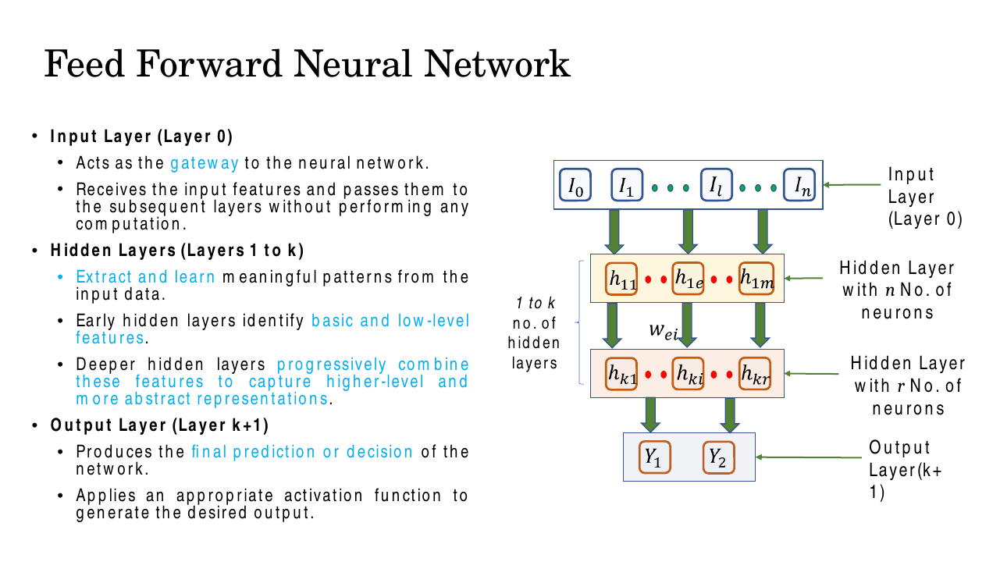
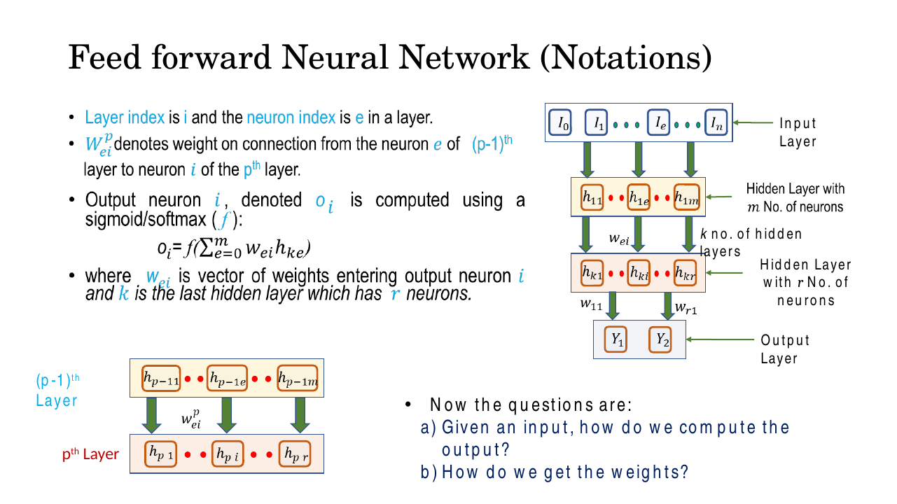
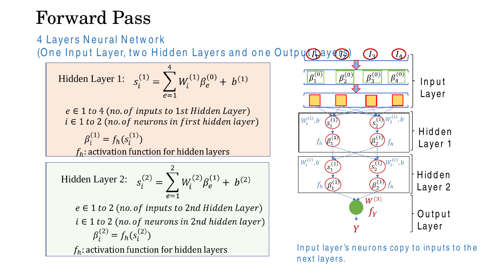
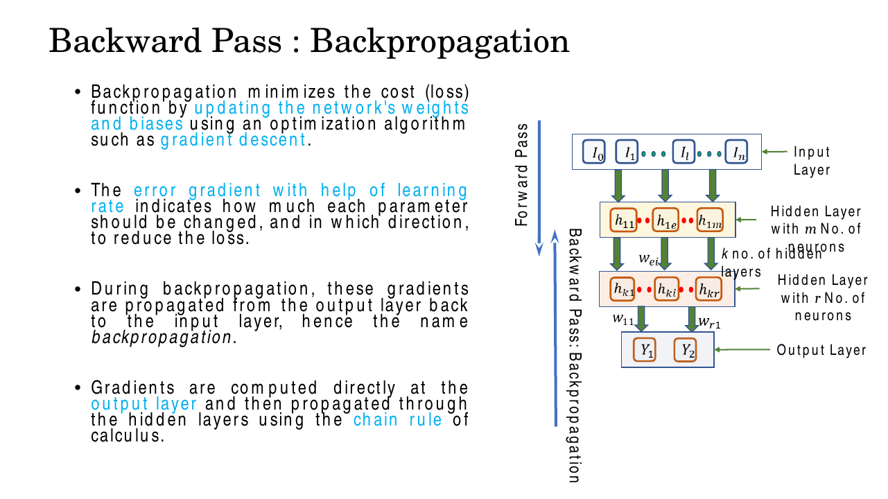
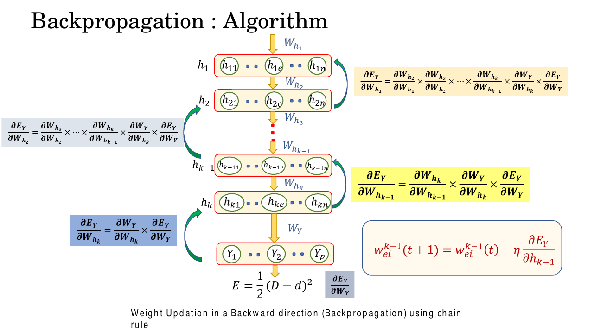
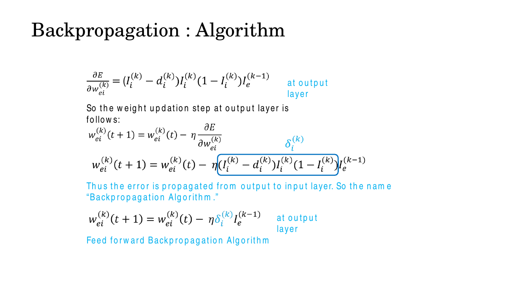
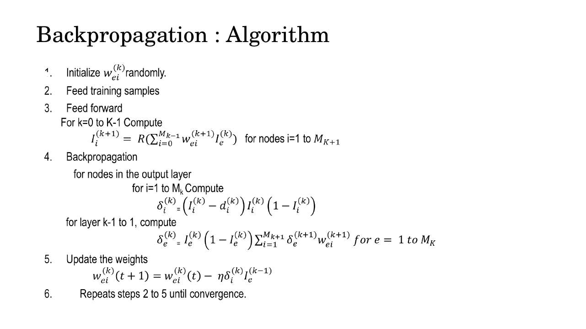
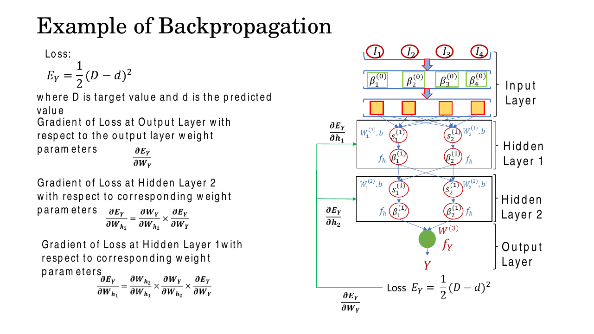
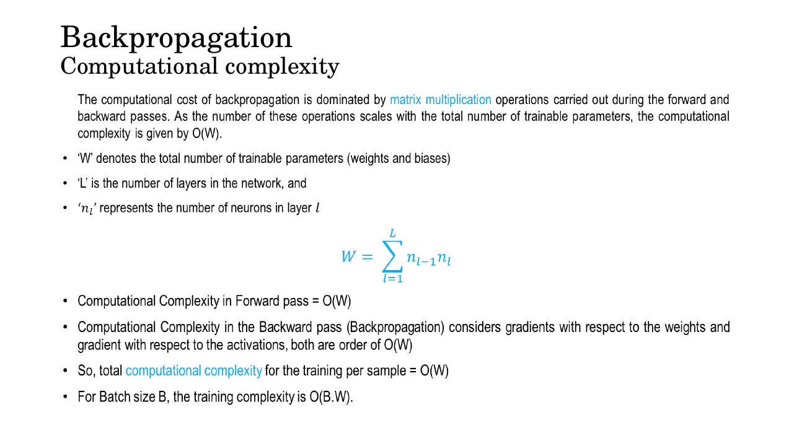
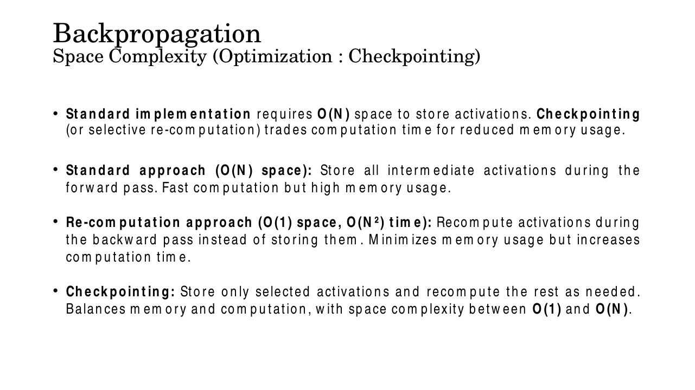

# Lec 9 — Backpropagation

> **Deck:** `W2L3_P3_BackProp.pptx` · **Week 2** · **Playlist:** Lec 9
> **Prereqs:** [Lec 8 — MLP and Activations](08-mlp-and-activations.md), [Lec 4 — Linear Algebra](../week-01/04-linear-algebra.md)
> **Feeds into:** [Lec 13 — Vanishing Gradients and Activations](../week-03/13-vanishing-gradients-activations.md), [Lec 17 — Backpropagation Through Time](../week-05/17-bptt.md)

## Why this lecture exists

Lec 8 gave you a network that *can* represent a complicated function, but said nothing about how to
find the weights that make it represent the *right* one. A perceptron was easy: one layer, and the
update rule $w \leftarrow w + \eta(d-y)x$ falls straight out of "if the answer is too small, push the
weight up". A hidden layer destroys that argument, because nobody tells you what a hidden unit was
*supposed* to output. There is no target for $h_1$. The deck puts it as two questions on slide 4:
given an input, how do we compute the output — and *how do we get the weights?*

Backpropagation is the answer, and it is the mechanism every remaining lecture in this course runs
on. CNNs, RNNs, transformers, VAEs: all of them are trained by exactly the procedure below. Learn it
once, properly, by hand.

## The ideas

### The deck's network and its notation

A **feed-forward network** has an input layer (layer 0, which computes nothing and just copies values
forward), $k$ hidden layers, and an output layer. Information moves one way: layer $p-1$ → layer $p$,
never backwards, never sideways.


*Fig. — Early hidden layers learn low-level features; deeper ones recombine them into abstract ones. Keep the layer numbering in mind: input is **layer 0**, output is **layer $k+1$**. Slide 3.*

Slide 4 defines the symbols, and one of them is a trap:


*Fig. — Read the weight subscript carefully: $w_{ei}^{(p)}$ goes **from** $e$ **to** $i$. Source index first. Most textbooks do the opposite. Slide 4.*

| Symbol | Means | Translation used here |
|---|---|---|
| $w_{ei}^{(p)}$ | weight **from** neuron $e$ of layer $p-1$ **to** neuron $i$ of layer $p$ | kept as-is |
| $I_e^{(p)}$ / $\beta_e^{(p)}$ | output (activation) of neuron $e$ in layer $p$ | $a_e^{(p)}$ |
| $s_i^{(p)}$ | weighted sum before the activation | $z_i^{(p)}$ |
| $R(\cdot)$, $f_h$, $f_Y$ | the activation function (sigmoid here) | $\sigma(\cdot)$ |
| $E$, $E_Y$ | the loss | $\mathcal{L}$ |
| $d_i$ (slides 14–16) | the **target** value | $d_i$ |
| $M_k$ | number of neurons in layer $k$ | $M_k$ |

Two translations are forced by the book-wide notation table: the deck's $E$ becomes $\mathcal{L}$, and
its $I$/$\beta$ for an activation becomes $a$. **The deck is also internally inconsistent in one place**:
slides 14–16 use $d$ for the *desired* (target) value, but slide 17 writes $E_Y = \tfrac12(D-d)^2$
"where $D$ is target and $d$ is predicted". Since the loss is squared the swap does not change
$\mathcal{L}$, but it *does* flip the sign of every gradient. Ours: **$d_i$ is the target, $a_i$ is the
prediction.**

So the forward rule for any layer $p$ is

$$z_i^{(p)} = \sum_{e} w_{ei}^{(p)}\, a_e^{(p-1)} + b_i^{(p)}, \qquad a_i^{(p)} = \sigma\!\left(z_i^{(p)}\right)$$

In matrix form, collect $w_{ei}^{(p)}$ into $\mathbf{W}^{(p)}$ with $e$ indexing **columns** and $i$
indexing **rows**, and this is just $\mathbf{z}^{(p)} = \mathbf{W}^{(p)}\mathbf{a}^{(p-1)} + \mathbf{b}^{(p)}$ —
the matrix multiply from [Lec 4](../week-01/04-linear-algebra.md).


*Fig. — The same two lines repeat per layer, only the index ranges change ($e \in 1..4$ then $e \in 1..2$). That repetition is the whole reason backprop can be written as one recursion. Slide 9.*

### Two phases

Training is a loop over two phases (slide 6):

| Phase | Direction | Computes | Must remember |
|---|---|---|---|
| **Forward pass** | input → output | every $z^{(p)}$, every $a^{(p)}$, finally $\mathcal{L}$ | all activations, for the backward pass |
| **Backward pass** | output → input | $\partial\mathcal{L}/\partial w$ for *every* weight | — |


*Fig. — Gradients are computed **directly** at the output layer, then **propagated** back through the hidden layers by the chain rule. That split — one direct computation, then a recursion — is the structure of the whole algorithm. Slide 11.*

### The chain rule, from scratch

Suppose turning a dial $w$ changes a quantity $z$, and $z$ changes $a$, and $a$ changes the loss
$\mathcal{L}$. You want to know: if I nudge $w$ by a tiny amount, how much does $\mathcal{L}$ move?

Do it with plain numbers. Say nudging $w$ up by 1 raises $z$ by 3; raising $z$ by 1 raises $a$ by 2;
raising $a$ by 1 raises $\mathcal{L}$ by 5. Then nudging $w$ by 1 raises $\mathcal{L}$ by
$3 \times 2 \times 5 = 30$. **Sensitivities multiply along a chain.** That is the entire content of
the chain rule:

$$\frac{\partial \mathcal{L}}{\partial w} = \frac{\partial \mathcal{L}}{\partial a}\cdot\frac{\partial a}{\partial z}\cdot\frac{\partial z}{\partial w}$$

Each factor is a **local** derivative — it only involves one step of the computation, so you can work
it out without knowing anything about the rest of the network. That locality is why backprop scales.

One more rule, and it is the one people forget. If $w$ reaches the loss by **several routes** — a
hidden unit feeding three output units, say — the total sensitivity is the **sum over routes** of the
product along each route. Multiply *along* a path, add *across* paths. The $\sum$ that appears in the
hidden-layer formula later is exactly this, nothing more.


*Fig. — Each layer's gradient is the layer below it's gradient times **one extra factor**. Nothing is recomputed from scratch; that reuse is why backprop costs about one forward pass. Slide 12.*

### The sigmoid derivative identity

The deck gives slide 13 entirely to this, because every single delta below contains it.

![Slide showing R(S) = 1/(1+e^-S), ∂R/∂S = R(S)[1−R(S)], the S-shaped sigmoid curve, and the K-layer MLP recursion I_i^(k+1) = R(Σ w_ei I_e^(k))](../../assets/slides/W2_W2L3_P3_BackProp/s-13.png)
*Fig. — The derivative of the sigmoid is expressed **in terms of the sigmoid itself**. You already computed $\sigma(z)$ in the forward pass, so the derivative is free. Slide 13.*

Derive it, do not memorise it. Write $\sigma(z) = (1+e^{-z})^{-1}$ and use the power and chain rules:

$$\frac{d\sigma}{dz} = -1\cdot(1+e^{-z})^{-2}\cdot\frac{d}{dz}(1+e^{-z}) = -\frac{-e^{-z}}{(1+e^{-z})^2} = \frac{e^{-z}}{(1+e^{-z})^2}$$

Now the trick: split the fraction, and write $e^{-z} = (1+e^{-z}) - 1$:

$$\frac{e^{-z}}{(1+e^{-z})^2} = \frac{1}{1+e^{-z}}\cdot\frac{e^{-z}}{1+e^{-z}} = \frac{1}{1+e^{-z}}\cdot\frac{(1+e^{-z})-1}{1+e^{-z}} = \sigma(z)\bigl(1-\sigma(z)\bigr)$$

$$\boxed{\ \sigma'(z) = \sigma(z)\bigl(1-\sigma(z)\bigr) = a(1-a)\ }$$

Two facts to carry forward. Its maximum is at $z=0$, where $\sigma = 0.5$ and $\sigma' = 0.25$ — so
**$\sigma'(z) \le 0.25$ always**. And it goes to zero at both ends: at $z = 6$, $\sigma' = 0.0025$.
Deltas multiply one such factor per layer, so a deep stack multiplies many numbers $\le 0.25$
together. That product going to zero is the vanishing-gradient problem, owned by
[Lec 13](../week-03/13-vanishing-gradients-activations.md).

### The loss

Slide 14 and slide 17 both use **half the squared error**:

$$\mathcal{L} = \frac{1}{2}\sum_{i=1}^{M_k}\left(a_i^{(k)} - d_i\right)^2, \qquad \frac{\partial \mathcal{L}}{\partial a_i^{(k)}} = a_i^{(k)} - d_i$$

The $\tfrac12$ exists purely so the 2 from differentiating the square cancels. It changes nothing
about where the minimum is. The derivative is **prediction minus target** — get that order right, it
sets the sign of every update that follows.

### The output-layer delta

Take one output unit $i$ and one weight $w_{ei}^{(k)}$ feeding it. Three links in the chain:

$$\frac{\partial\mathcal{L}}{\partial w_{ei}^{(k)}} = \underbrace{\left(a_i^{(k)} - d_i\right)}_{\partial\mathcal{L}/\partial a_i}\cdot\underbrace{a_i^{(k)}\bigl(1-a_i^{(k)}\bigr)}_{\partial a_i/\partial z_i}\cdot\underbrace{a_e^{(k-1)}}_{\partial z_i/\partial w_{ei}}$$

The last factor is the easy one: $z_i = \sum_e w_{ei}a_e + b_i$, so differentiating with respect to one
particular $w_{ei}$ leaves just $a_e^{(k-1)}$ — the activation sitting at the *input end* of that wire.

![Slide: Error E = ½Σ(I−d)², ∂E/∂w = (I−d)[∂I/∂w], and after algebraic manipulation = I(1−I)I^(k−1)](../../assets/slides/W2_W2L3_P3_BackProp/s-14.png)
*Fig. — The deck's "after some algebraic manipulations" is just the sigmoid identity substituted in. Slide 14.*

The deck names the first two factors together as the **delta** of the unit:

$$\delta_i^{(k)} = \left(a_i^{(k)} - d_i\right) a_i^{(k)}\bigl(1-a_i^{(k)}\bigr)$$

so that $\partial\mathcal{L}/\partial w_{ei}^{(k)} = \delta_i^{(k)}\,a_e^{(k-1)}$. Read $\delta_i$ as
**the sensitivity of the loss to unit $i$'s pre-activation** — "how wrong is this unit, scaled by how
responsive it is". Every weight gradient in the network has the same shape: *delta at the destination
end × activation at the source end.*

### Gradient descent and the update step


*Fig. — The boxed term is $\delta_i^{(k)}$. This slide is the single most examinable line in the deck. Slide 15.*

$$\boxed{\ w_{ei}^{(k)}(t+1) = w_{ei}^{(k)}(t) - \eta\,\frac{\partial\mathcal{L}}{\partial w_{ei}^{(k)}} = w_{ei}^{(k)}(t) - \eta\,\delta_i^{(k)}\,a_e^{(k-1)}\ }$$

The **minus** sign is the whole idea: $\partial\mathcal{L}/\partial w$ points in the direction that
*increases* the loss, so you step the other way. The **learning rate** $\eta$ sets the step size — and
only the size, never the direction. Too small and training crawls; too large and you overshoot the
valley and the loss oscillates or diverges. Typical values are $10^{-1}$ to $10^{-4}$. Biases follow
the same rule with $a_e^{(k-1)}$ replaced by 1, since $\partial z_i/\partial b_i = 1$:
$b_i^{(k)} \leftarrow b_i^{(k)} - \eta\,\delta_i^{(k)}$.

### The hidden-layer delta: the backward recursion

A hidden unit $e$ in layer $k$ has no target of its own. But it feeds every unit $i$ of layer $k+1$,
and we already know how sensitive the loss is to each of *those* — that is what $\delta_i^{(k+1)}$
means. So apply "multiply along paths, add across paths":

$$\delta_e^{(k)} = \underbrace{a_e^{(k)}\bigl(1-a_e^{(k)}\bigr)}_{\text{local slope}} \; \sum_{i=1}^{M_{k+1}} \underbrace{\delta_i^{(k+1)}\,w_{ei}^{(k+1)}}_{\text{blame arriving from unit } i}$$

This is the heart of the algorithm. Each downstream unit sends back its own delta, weighted by the
wire that connects them — a unit connected by a big weight gets a big share of the blame — and the
local sigmoid slope gates the total. Note that it has **exactly the same shape** as the output-layer
delta, with $(a_i - d_i)$ replaced by $\sum_i \delta_i^{(k+1)} w_{ei}^{(k+1)}$. The error signal
travels backwards through the *same* weights it travelled forwards through. That is the entire reason
the algorithm is called back-*propagation*.


*Fig. — Learn this slide. One caution: the deck writes $\delta_e^{(k+1)}$ inside the hidden-delta sum, but it must be $\delta_i^{(k+1)}$ — the sum runs over $i$, the downstream units. Slide 16.*

The complete algorithm, as the deck states it:

1. Initialise $w_{ei}^{(k)}$ randomly (never all-zero — identical weights give identical deltas and the units never differentiate).
2. Feed a training sample.
3. **Forward:** for $k = 0$ to $K-1$, compute $a_i^{(k+1)} = \sigma\!\left(\sum_e w_{ei}^{(k+1)}a_e^{(k)}\right)$.
4. **Backward:** output deltas $\delta_i^{(k)} = (a_i^{(k)} - d_i)a_i^{(k)}(1-a_i^{(k)})$; then for layers $k-1$ down to 1, $\delta_e^{(k)} = a_e^{(k)}(1-a_e^{(k)})\sum_i \delta_i^{(k+1)}w_{ei}^{(k+1)}$.
5. **Update:** $w_{ei}^{(k)}(t+1) = w_{ei}^{(k)}(t) - \eta\,\delta_i^{(k)} a_e^{(k-1)}$.
6. Repeat 2–5 until convergence.


*Fig. — The nesting made explicit: layer 2's gradient is the output gradient times one factor; layer 1's is layer 2's times one more. Each step back costs one multiplication, not a fresh derivation. Slide 17.*

### Computational complexity


*Fig. — The headline result: the backward pass costs the **same order** as the forward pass. Slide 18.*

Let $W$ be the total number of trainable parameters, $L$ the number of layers and $n_l$ the neurons in
layer $l$. The deck counts the weights as

$$W = \sum_{l=1}^{L} n_{l-1}\,n_l$$

(biases add another $\sum_l n_l$, which the formula omits). Everything is dominated by matrix
multiplies, and every weight is touched a constant number of times:

| Stage | Cost |
|---|---|
| Forward pass | $O(W)$ — one multiply–add per weight |
| Backward pass | $O(W)$ — one gradient per weight, plus one per activation |
| **Total, per sample** | $O(W)$ |
| Mini-batch of size $B$ | $O(B\cdot W)$ |

The thing worth internalising: **backprop is not expensive**. The naive alternative — nudge each weight
and re-run the forward pass — costs $O(W)$ per weight, so $O(W^2)$ in total. Backprop gets all $W$
gradients for the price of roughly two forward passes, by reusing each layer's delta for the layer below.

### Space complexity and checkpointing

Memory, unlike time, is where backprop actually hurts. Slide 19 breaks it into three pieces:

| Stored | Size | Why |
|---|---|---|
| Parameters (weights + biases) | $O(W)$ | they are the model |
| Gradients | $O(W)$ | one per parameter |
| Intermediate activations | grows linearly with layers × neurons | needed in the backward pass |

That third row is the one that bites. Look again at $\partial\mathcal{L}/\partial w_{ei} = \delta_i a_e$:
the gradient needs the forward activation $a_e$, so every activation computed on the way forward must be
**cached** until the backward pass reaches it. Overall space is $O(W)$ plus that cache — and the cache
scales with $B$ too, which is why "reduce the batch size" is the first response to an out-of-memory error.


*Fig. — Three points on one trade-off curve. Checkpointing is the practical middle: store every $\sqrt{N}$-th layer and recompute the rest. Slide 20.*

With $N$ layers, the deck gives three options:

| Strategy | Space | Time | Idea |
|---|---|---|---|
| Standard | $O(N)$ | $O(N)$ | store every activation |
| Full re-computation | $O(1)$ | $O(N^2)$ | store nothing, recompute from the input each time |
| **Checkpointing** | between $O(1)$ and $O(N)$ | modest extra | store selected activations, recompute the rest from the nearest stored one |

Checkpointing (also "gradient checkpointing") buys memory with compute — typically ~30% more time for
a large memory saving. It is how very deep models and long transformer contexts fit on one GPU.

## Worked numericals

The network for N1–N3: **2 inputs → 2 hidden (sigmoid) → 1 output (sigmoid)**, half-squared-error
loss, learning rate $\eta = 0.5$. Weight $w_{ei}^{(l)}$ runs *from* unit $e$ of layer $l-1$ *to* unit
$i$ of layer $l$, as in the deck.

**Given (used by all three):**
$\mathbf{x} = (x_1, x_2) = (1.0,\ 0.5)$, target $d = 1.0$.
Layer 1: $w_{11}^{(1)}=0.2$, $w_{12}^{(1)}=0.1$, $w_{21}^{(1)}=-0.3$, $w_{22}^{(1)}=0.4$, $b_1^{(1)}=0.1$, $b_2^{(1)}=-0.2$.
Layer 2: $w_{11}^{(2)}=0.5$, $w_{21}^{(2)}=-0.4$, $b_1^{(2)}=0.3$.

### N1. Forward pass and the loss
**Find:** $z^{(1)}, a^{(1)}, z^{(2)}, a^{(2)}, \mathcal{L}$.

1. $z_1^{(1)} = w_{11}^{(1)}x_1 + w_{21}^{(1)}x_2 + b_1^{(1)} = (0.2)(1.0) + (-0.3)(0.5) + 0.1 = 0.2 - 0.15 + 0.1 = 0.15$
2. $a_1^{(1)} = \sigma(0.15) = \dfrac{1}{1+e^{-0.15}} = \dfrac{1}{1+0.860708} = \dfrac{1}{1.860708} = 0.537430$
3. $z_2^{(1)} = w_{12}^{(1)}x_1 + w_{22}^{(1)}x_2 + b_2^{(1)} = (0.1)(1.0) + (0.4)(0.5) - 0.2 = 0.1 + 0.2 - 0.2 = 0.10$
4. $a_2^{(1)} = \sigma(0.10) = \dfrac{1}{1+0.904837} = \dfrac{1}{1.904837} = 0.524979$
5. $z_1^{(2)} = (0.5)(0.537430) + (-0.4)(0.524979) + 0.3 = 0.268715 - 0.209992 + 0.3 = 0.358723$
6. $a_1^{(2)} = \sigma(0.358723) = \dfrac{1}{1+0.698568} = \dfrac{1}{1.698568} = 0.588731 = \hat{y}$
7. $\mathcal{L} = \tfrac12(\hat{y} - d)^2 = \tfrac12(0.588731 - 1.0)^2 = \tfrac12(-0.411269)^2 = \tfrac12(0.169142)$

**Answer:** $\hat{y} = 0.588731$, $\ \mathcal{L} = 0.084571$.

### N2. Backward pass — every delta and every gradient
**Find:** $\delta^{(2)}$, both $\delta^{(1)}_e$, and all nine partial derivatives.

1. Output slope: $\sigma'(z^{(2)}) = a^{(2)}(1-a^{(2)}) = (0.588731)(0.411269) = 0.242120$
2. Loss derivative: $\partial\mathcal{L}/\partial a^{(2)} = \hat{y} - d = 0.588731 - 1.0 = -0.411269$
3. Output delta: $\delta^{(2)} = (-0.411269)(0.242120) = -0.099579$
4. $\dfrac{\partial\mathcal{L}}{\partial w_{11}^{(2)}} = \delta^{(2)}a_1^{(1)} = (-0.099579)(0.537430) = -0.053517$
5. $\dfrac{\partial\mathcal{L}}{\partial w_{21}^{(2)}} = \delta^{(2)}a_2^{(1)} = (-0.099579)(0.524979) = -0.052277$
6. $\dfrac{\partial\mathcal{L}}{\partial b_1^{(2)}} = \delta^{(2)} = -0.099579$
7. Hidden slope 1: $a_1^{(1)}(1-a_1^{(1)}) = (0.537430)(0.462570) = 0.248599$
8. Blame reaching hidden 1: $\delta^{(2)}w_{11}^{(2)} = (-0.099579)(0.5) = -0.049789$
9. $\delta_1^{(1)} = (0.248599)(-0.049789) = -0.012378$
10. Hidden slope 2: $a_2^{(1)}(1-a_2^{(1)}) = (0.524979)(0.475021) = 0.249376$
11. Blame reaching hidden 2: $\delta^{(2)}w_{21}^{(2)} = (-0.099579)(-0.4) = +0.039832$
12. $\delta_2^{(1)} = (0.249376)(0.039832) = +0.009933$
13. $\dfrac{\partial\mathcal{L}}{\partial w_{11}^{(1)}} = \delta_1^{(1)}x_1 = (-0.012378)(1.0) = -0.012378$
14. $\dfrac{\partial\mathcal{L}}{\partial w_{21}^{(1)}} = \delta_1^{(1)}x_2 = (-0.012378)(0.5) = -0.006189$
15. $\dfrac{\partial\mathcal{L}}{\partial w_{12}^{(1)}} = \delta_2^{(1)}x_1 = (0.009933)(1.0) = +0.009933$
16. $\dfrac{\partial\mathcal{L}}{\partial w_{22}^{(1)}} = \delta_2^{(1)}x_2 = (0.009933)(0.5) = +0.004967$
17. $\dfrac{\partial\mathcal{L}}{\partial b_1^{(1)}} = -0.012378$, $\quad\dfrac{\partial\mathcal{L}}{\partial b_2^{(1)}} = +0.009933$

**Answer:** $\delta^{(2)} = -0.099579$; $\delta_1^{(1)} = -0.012378$; $\delta_2^{(1)} = +0.009933$.
Notice the hidden deltas are **~8× smaller** than the output delta — one layer back, one factor of
$\sigma' \approx 0.25$ already. Also notice $\delta_2^{(1)}$ is *positive* while $\delta^{(2)}$ is
negative: the wire $w_{21}^{(2)} = -0.4$ flipped the sign of the blame.

### N3. Update the weights, then prove the loss fell
**Find:** all nine updated parameters with $\eta = 0.5$, and the new loss.

1. $w_{11}^{(2)} \leftarrow 0.5 - (0.5)(-0.053517) = 0.5 + 0.026758 = 0.526758$
2. $w_{21}^{(2)} \leftarrow -0.4 - (0.5)(-0.052277) = -0.4 + 0.026138 = -0.373862$
3. $b_1^{(2)} \leftarrow 0.3 + (0.5)(0.099579) = 0.349790$
4. $w_{11}^{(1)} \leftarrow 0.2 + (0.5)(0.012378) = 0.206189$
5. $w_{21}^{(1)} \leftarrow -0.3 + (0.5)(0.006189) = -0.296906$
6. $w_{12}^{(1)} \leftarrow 0.1 - (0.5)(0.009933) = 0.095033$
7. $w_{22}^{(1)} \leftarrow 0.4 - (0.5)(0.004967) = 0.397517$
8. $b_1^{(1)} \leftarrow 0.1 + 0.006189 = 0.106189$, $\quad b_2^{(1)} \leftarrow -0.2 - 0.004967 = -0.204967$
9. Re-run forward. $z_1^{(1)} = 0.206189 - 0.148453 + 0.106189 = 0.163925 \Rightarrow a_1^{(1)} = \sigma(0.163925) = 0.540890$
10. $z_2^{(1)} = 0.095033 + 0.198758 - 0.204967 = 0.088825 \Rightarrow a_2^{(1)} = \sigma(0.088825) = 0.522192$
11. $z_1^{(2)} = (0.526758)(0.540890) + (-0.373862)(0.522192) + 0.349790 = 0.284918 - 0.195228 + 0.349790 = 0.439480$
12. $\hat{y}_{\text{new}} = \sigma(0.439480) = 0.608135$
13. $\mathcal{L}_{\text{new}} = \tfrac12(0.608135 - 1.0)^2 = \tfrac12(0.153558) = 0.076779$

**Answer:** $\mathcal{L}: 0.084571 \to 0.076779$, a drop of $0.007792$ (9.2%), and the prediction moved
from $0.5887$ toward the target: $0.6081$. **One backprop step, and the network is measurably better.**

### N4. The sigmoid-derivative identity
**Given:** $z = 2.0$.
**Find:** $\sigma(2.0)$, $\sigma'(2.0)$, and the maximum possible value of $\sigma'$.

1. $\sigma(2.0) = \dfrac{1}{1+e^{-2}} = \dfrac{1}{1+0.135335} = \dfrac{1}{1.135335} = 0.880797$
2. $\sigma'(2.0) = \sigma(1-\sigma) = (0.880797)(0.119203) = 0.104994$
3. $\sigma'$ is a downward parabola in $\sigma$: $f(\sigma) = \sigma - \sigma^2$, maximised at $\sigma = 0.5$.
4. $\sigma = 0.5$ happens at $z = 0$, giving $\sigma'(0) = (0.5)(0.5) = 0.25$.
5. Check the symmetry: $\sigma(-2.0) = 0.119203$, so $\sigma'(-2.0) = (0.119203)(0.880797) = 0.104994$ — identical.

**Answer:** $\sigma'(2.0) = 0.104994$; $\max_z \sigma'(z) = 0.25$ at $z=0$; $\sigma'$ is even about $z=0$.
Four sigmoid layers can shrink a gradient by at most $0.25^4 = 0.0039$ from the activation terms alone.

### N5. Counting parameters and gradient computations
**Given:** a 784–128–64–10 MLP (three weight layers, biases on every non-input layer), batch size $B = 32$.
**Find:** $W$ by the deck's formula, the true parameter count, the number of gradients backprop computes per sample, and the activation-cache size.

1. $W = \sum_l n_{l-1}n_l = (784)(128) + (128)(64) + (64)(10) = 100{,}352 + 8{,}192 + 640 = 109{,}184$
2. Biases: $128 + 64 + 10 = 202$. True trainable total $= 109{,}184 + 202 = 109{,}386$.
3. Backprop produces **one gradient per trainable parameter** = $109{,}386$ numbers per sample.
4. Cost: forward $O(W)$, backward $O(W)$, so $\approx 2 \times 109{,}184 \approx 2.2\times10^5$ multiply–adds per sample.
5. For $B = 32$: $O(B\cdot W) = 32 \times 109{,}184 \approx 3.49\times10^6$ multiply–adds per batch.
6. Activation cache per sample: $784 + 128 + 64 + 10 = 986$ activations; for $B=32$, $31{,}552$ floats $= 126{,}208$ bytes $\approx 123$ KB at fp32.
7. Contrast with finite differences: $O(W^2) \approx 1.19\times10^{10}$ — about **55,000×** slower.

**Answer:** $W = 109{,}184$ weights ($109{,}386$ with biases); $109{,}386$ gradients per sample;
$\approx 3.5$ million multiply–adds per batch of 32; $\approx 123$ KB of cached activations.

## Code

```python
import numpy as np

def sigmoid(z): return 1.0 / (1.0 + np.exp(-z))

x, d, eta = np.array([1.0, 0.5]), 1.0, 0.5      # input, target, learning rate
W1 = np.array([[0.2, 0.1], [-0.3, 0.4]])        # W1[e, i]: from input e to hidden i
b1 = np.array([0.1, -0.2])
W2 = np.array([[0.5], [-0.4]])                  # from hidden e to output i
b2 = np.array([0.3])

def forward(x, W1, b1, W2, b2):
    z1 = x @ W1 + b1;  a1 = sigmoid(z1)         # hidden pre-activation, activation
    z2 = a1 @ W2 + b2; a2 = sigmoid(z2)         # output pre-activation, prediction
    return a1, a2

for step in range(1, 401):
    a1, a2 = forward(x, W1, b1, W2, b2)                 # ---- forward pass
    loss = 0.5 * (a2[0] - d) ** 2
    delta2 = (a2 - d) * a2 * (1 - a2)                   # ---- output delta
    delta1 = a1 * (1 - a1) * (W2 @ delta2)              # ---- backward recursion
    if step == 1:                                       # compare with N1-N3 by hand
        print(f"a1 = {np.round(a1, 6)}  y_hat = {a2[0]:.6f}  loss = {loss:.6f}")
        print(f"delta2 = {delta2[0]:.6f}  delta1 = {np.round(delta1, 6)}")
        print(f"dL/dW2 = {np.round(np.outer(a1, delta2).ravel(), 6)}")
    W2 -= eta * np.outer(a1, delta2); b2 -= eta * delta2   # ---- gradient descent
    W1 -= eta * np.outer(x,  delta1); b1 -= eta * delta1
    if step in (1, 2, 10, 50, 100, 200, 400):
        print(f"step {step:4d}  loss {loss:.6f}  y_hat {a2[0]:.6f}")
```

```text
a1 = [0.53743  0.524979]  y_hat = 0.588731  loss = 0.084571
delta2 = -0.099579  delta1 = [-0.012378  0.009933]
dL/dW2 = [-0.053517 -0.052277]
step    1  loss 0.084571  y_hat 0.588731
step    2  loss 0.076779  y_hat 0.608135
step   10  loss 0.039803  y_hat 0.717856
step   50  loss 0.008388  y_hat 0.870475
step  100  loss 0.003749  y_hat 0.913408
step  200  loss 0.001671  y_hat 0.942181
step  400  loss 0.000756  y_hat 0.961121
```

Every step-1 number matches N1–N3 exactly. To convince yourself the analytic gradient is right, check
it numerically — nudge one weight and watch the loss:

```python
eps = 1e-6
a1, a2 = forward(x, np.array([[0.2,0.1],[-0.3,0.4]]), np.array([0.1,-0.2]),
                 np.array([[0.5],[-0.4]]), np.array([0.3]))
L0 = 0.5*(a2[0]-d)**2
_, a2p = forward(x, np.array([[0.2,0.1],[-0.3,0.4]]), np.array([0.1,-0.2]),
                 np.array([[0.5+eps],[-0.4]]), np.array([0.3]))
print("finite difference:", (0.5*(a2p[0]-d)**2 - L0)/eps)   # -0.05351679
print("analytic         : -0.05351680")
```

Agreement to seven decimals. This **gradient check** is the standard way to debug a hand-written
backward pass.

## Exam pack

### Must-memorise

| Item | Exactly this |
|---|---|
| Forward (one layer) | $z_i^{(p)} = \sum_e w_{ei}^{(p)}a_e^{(p-1)} + b_i^{(p)}$, $\ a_i^{(p)} = \sigma(z_i^{(p)})$ |
| Deck's weight index | $w_{ei}^{(p)}$ = **from** $e$ in layer $p-1$ **to** $i$ in layer $p$ |
| Loss | $\mathcal{L} = \tfrac12\sum_i(a_i^{(k)} - d_i)^2$ |
| Loss derivative | $\partial\mathcal{L}/\partial a_i = a_i - d_i$ (prediction − target) |
| Sigmoid | $\sigma(z) = 1/(1+e^{-z})$ |
| Sigmoid derivative | $\sigma'(z) = \sigma(z)(1-\sigma(z)) = a(1-a)$ |
| Output delta | $\delta_i^{(k)} = (a_i^{(k)} - d_i)\,a_i^{(k)}(1-a_i^{(k)})$ |
| Hidden delta | $\delta_e^{(k)} = a_e^{(k)}(1-a_e^{(k)})\sum_i \delta_i^{(k+1)}w_{ei}^{(k+1)}$ |
| Weight gradient | $\partial\mathcal{L}/\partial w_{ei}^{(k)} = \delta_i^{(k)}\,a_e^{(k-1)}$ |
| Bias gradient | $\partial\mathcal{L}/\partial b_i^{(k)} = \delta_i^{(k)}$ |
| Update | $w_{ei}^{(k)}(t+1) = w_{ei}^{(k)}(t) - \eta\,\delta_i^{(k)}a_e^{(k-1)}$ |
| Chain rule | multiply **along** a path, add **across** paths |
| Parameter count | $W = \sum_{l=1}^{L} n_{l-1}n_l$ (+ $\sum_l n_l$ biases) |

### Numbers worth knowing

| Quantity | Value |
|---|---|
| $\max_z \sigma'(z)$ | $0.25$, attained at $z = 0$ |
| $\sigma(0)$ | $0.5$ |
| $\sigma'(2) = \sigma'(-2)$ | $0.104994$ |
| $\sigma'(6)$ | $0.002467$ — effectively dead |
| Forward-pass complexity | $O(W)$ |
| Backward-pass complexity | $O(W)$ |
| Total per sample | $O(W)$; per batch $O(B\cdot W)$ |
| Overall space complexity | $O(W)$ + activation cache |
| Standard activation storage | $O(N)$ space, $O(N)$ time |
| Full re-computation | $O(1)$ space, $O(N^2)$ time |
| Checkpointing | between $O(1)$ and $O(N)$ space |
| Naive finite-difference gradients | $O(W^2)$ |

### Likely MCQ traps

- **"The backward pass is much more expensive than the forward pass."** False. Both are $O(W)$; backprop is
  roughly the cost of one to two forward passes. What *is* expensive is memory, not time.
- **$\partial\mathcal{L}/\partial a = d - a$.** Wrong sign. For $\mathcal{L} = \tfrac12(a-d)^2$ it is
  $a - d$, prediction minus target. Flip it and your weights move away from the answer.
- **Dropping the sigmoid factor in the hidden delta.** $\delta_e^{(k)}$ has *three* parts: local slope
  $a_e(1-a_e)$, the downstream deltas, and the weights. Forgetting the first is the most common error.
- **Using $w_{ie}$ instead of $w_{ei}$.** In this deck the *source* index comes first. In the hidden-delta
  sum you need the weights leaving unit $e$ — the same ones used in the forward pass, read in the same order.
- **$\sigma'(z) = \sigma(z)(1-\sigma(z))$ applied to $z$ instead of $a$.** The identity is in terms of the
  *output* $a = \sigma(z)$. Writing $z(1-z)$ is wrong.
- **"$\eta$ changes the direction of the update."** No. The gradient fixes the direction; $\eta$ scales
  only the magnitude.
- **"Initialise all weights to zero."** Then every unit in a layer gets the same delta forever and the
  layer behaves like a single unit. Random initialisation breaks that symmetry.
- **Confusing $O(W)$ with $O(W^2)$ for backprop.** $O(W^2)$ is the naive per-weight finite-difference method
  that backprop exists to avoid.
- **"Checkpointing saves time."** It *costs* time and saves memory. Full re-computation is $O(1)$ space but
  $O(N^2)$ time.
- **Counting layers off by one.** The deck's input layer is layer 0 and performs no computation; a
  "4-layer network" on slide 8 means input + 2 hidden + output, i.e. **three** weight matrices.

### Self-test

1. State the sigmoid derivative identity and derive it in two lines.
2. A unit has $a = 0.8$. What is $\sigma'$ at that point?
3. Why is there no target value for a hidden unit, and what replaces it in the delta formula?
4. Write $\partial\mathcal{L}/\partial w_{ei}^{(k)}$ in terms of a delta and an activation.
5. A hidden unit feeds three output units with deltas $0.1, -0.2, 0.05$ through weights $0.5, 1.0, -2.0$. Its own activation is $0.6$. Find its delta.
6. Given $\delta_i^{(k)} = 0.04$, $a_e^{(k-1)} = 0.9$, $w = 0.3$, $\eta = 0.1$, find the updated weight.
7. A network has layers 100–50–20–5. How many weights? How many biases?
8. For that network, state the per-sample time and space complexity of training.
9. Your loss oscillates wildly and then diverges. Which hyperparameter is the first suspect, and which way do you move it?
10. What exactly does checkpointing trade for what?

<details><summary>Answers</summary>

1. $\sigma'(z) = \sigma(z)(1-\sigma(z))$. From $\sigma = (1+e^{-z})^{-1}$, $\sigma' = e^{-z}/(1+e^{-z})^2$; split as $\frac{1}{1+e^{-z}}\cdot\frac{(1+e^{-z})-1}{1+e^{-z}} = \sigma(1-\sigma)$.
2. $(0.8)(0.2) = 0.16$.
3. Nothing in the data says what a hidden unit should output. The term $(a_i - d_i)$ is replaced by $\sum_i \delta_i^{(k+1)}w_{ei}^{(k+1)}$ — blame routed back from the units it feeds.
4. $\partial\mathcal{L}/\partial w_{ei}^{(k)} = \delta_i^{(k)}\,a_e^{(k-1)}$ — delta at the destination × activation at the source.
5. Sum $= (0.1)(0.5) + (-0.2)(1.0) + (0.05)(-2.0) = 0.05 - 0.2 - 0.1 = -0.25$. Slope $= (0.6)(0.4) = 0.24$. $\delta = (0.24)(-0.25) = -0.06$.
6. Gradient $= (0.04)(0.9) = 0.036$. $w \leftarrow 0.3 - (0.1)(0.036) = 0.3 - 0.0036 = 0.2964$.
7. Weights $= 100(50) + 50(20) + 20(5) = 5000 + 1000 + 100 = 6100$. Biases $= 50 + 20 + 5 = 75$. Total 6175.
8. Time $O(W) \approx O(6100)$ per sample, forward and backward each $O(W)$. Space $O(W)$ for parameters and gradients, plus an activation cache of $100+50+20+5 = 175$ values.
9. The learning rate $\eta$ — decrease it. Too large a step overshoots the minimum and amplifies each time.
10. It trades **extra computation time** (recomputing activations) for **reduced memory**, landing between $O(1)$ and $O(N)$ space.

</details>

## Beyond the slides

**Gap:** The deck never says explicitly that the **bias** gradient is $\partial\mathcal{L}/\partial b_i = \delta_i$.
**Why it matters:** Biases are trainable parameters and appear in the deck's own forward equations
($s_i^{(1)} = \sum W\beta + b^{(1)}$ on slide 9), but every backward formula shown is for weights only.
Since $\partial z_i/\partial b_i = 1$, the bias update is just the weight update with the input
activation replaced by 1. A numerical that omits bias updates gets the wrong answer.

**Gap:** No mention of **gradient checking** — comparing the analytic gradient against
$(\mathcal{L}(w+\epsilon)-\mathcal{L}(w-\epsilon))/2\epsilon$.
**Why it matters:** It is the only reliable way to tell a correct backward pass from a plausible-looking
wrong one, and it is five lines of code (shown above). Also a fair short-answer question.

**Gap:** The deck's algorithm updates after **every single sample** (step 5 sits inside the per-sample
loop), which is *stochastic* gradient descent, but never names it or contrasts it with batch/mini-batch.
**Why it matters:** The complexity slide then quotes $O(B\cdot W)$ for "batch size $B$" without having
introduced $B$. In practice gradients are averaged over a mini-batch before one update.

**Gap:** Squared-error loss is used throughout, even with a sigmoid output.
**Why it matters:** For classification, cross-entropy is the standard choice, and with a sigmoid output
it produces the much cleaner $\delta^{(k)} = a - d$ — the $\sigma'$ factor cancels, so the output layer
never saturates. The deck mentions cross-entropy once on slide 6 and never uses it.

**Gap:** "Repeat until convergence" (step 6) is left undefined.
**Why it matters:** What stops training, and how you detect overfitting while it runs, is
[Lec 10](10-overfitting-and-regularization.md)'s subject — early stopping on a validation curve.

## Cut from the slides

Dropped slide 1 (title), slide 2 (contents), slide 21 (summary, a verbatim repeat of slide 2) and
slide 22 (next-lecture teaser) — pure navigation. Slides 8, 9 and 10 are one build-up animation of the
same 4-layer forward pass, with the right-hand diagram identical on all three; they are collapsed into
the single forward rule plus one figure (slide 9, the frame that carries the equations). Slide 7
repeats the slide-3/4 architecture diagram under the heading "Computation of the MLP Output" and adds
a pseudo-code box whose content is the forward rule already stated, so only the rule is kept. The
extracted-figure pool for this deck contains no diagrams — every `imageNN.png` in it is a cropped
screenshot of a text block already reproduced here — so all figures come from the rendered-slide pool.
Nothing mathematical was dropped: slides 12–20 are reproduced in full, including both complexity
slides and the checkpointing trade-off table.
