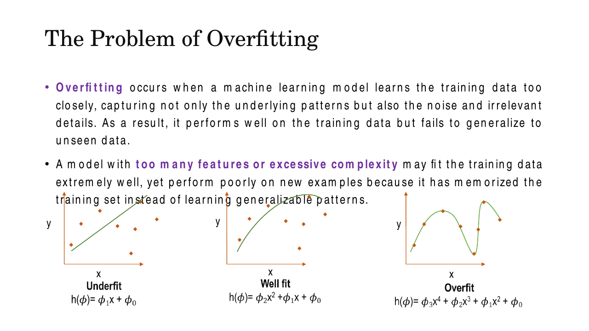
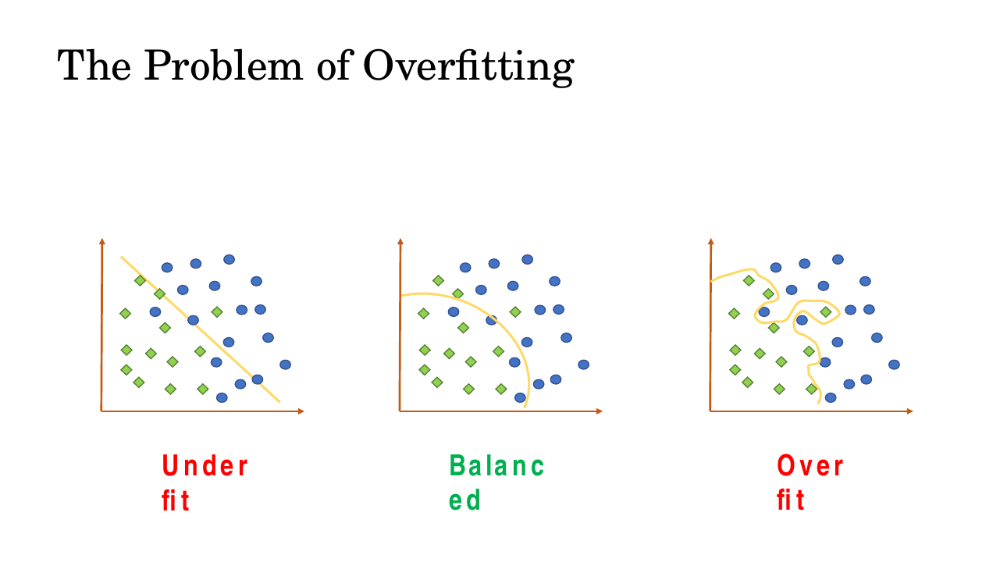
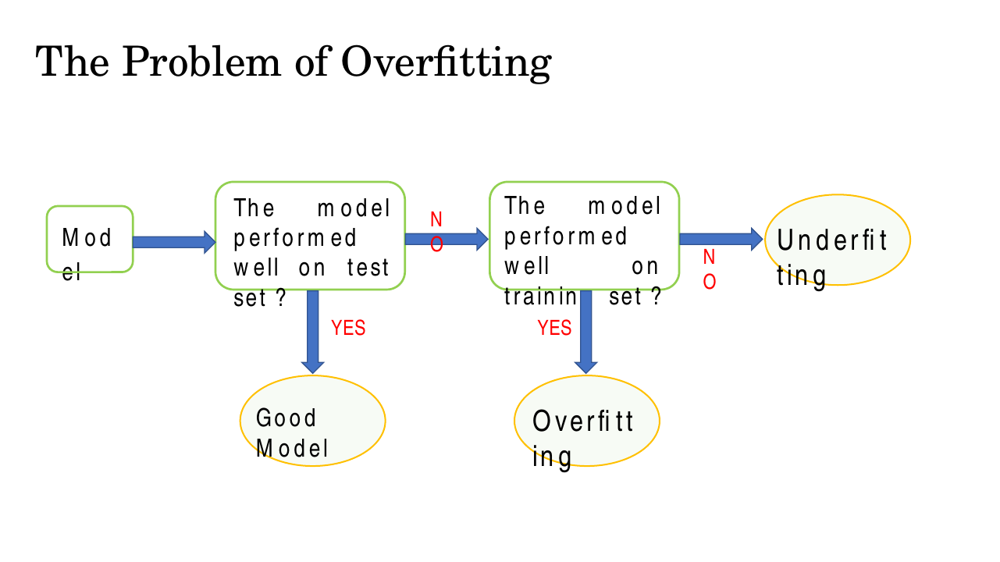
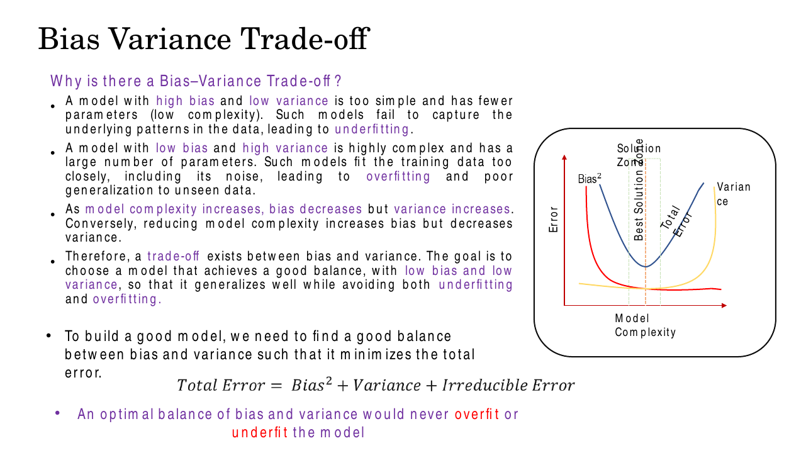
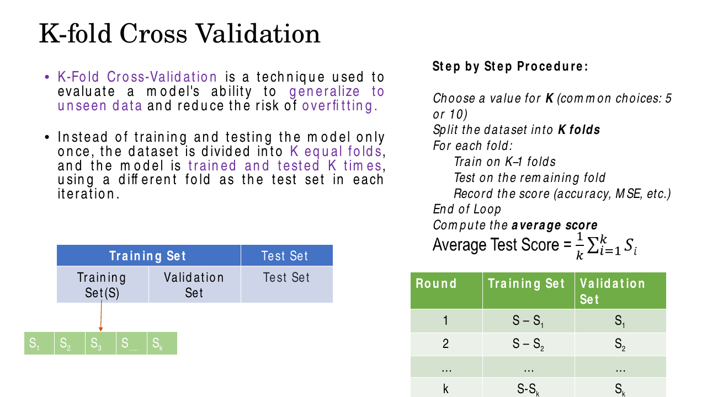
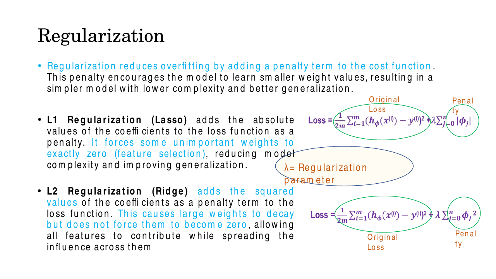
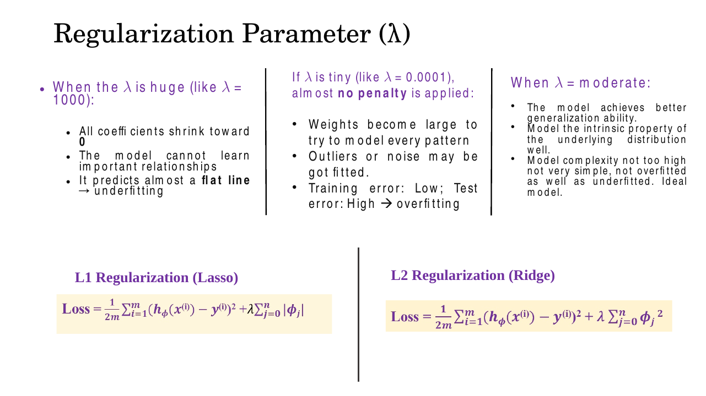
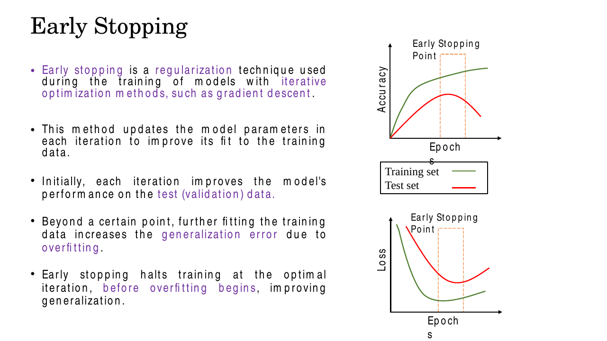

# Lec 10 — Overfitting, Bias–Variance, and Regularization

> **Deck:** `W2L3_P4_Overfitting.pptx` · **Week 2** · **Playlist:** Lec 10
> **Prereqs:** [Lec 9 — Backpropagation](09-backpropagation.md)
> **Feeds into:** [Lec 13 — Vanishing Gradients and Activations](../week-03/13-vanishing-gradients-activations.md), [Lec 14 — ResNet](../week-04/14-resnet.md)

## Why this lecture exists

You can now build a network and train it: forward pass, loss, backprop, update. Backprop is a machine
for driving the *training* loss to zero, and it is very good at its job. That is exactly the problem.
Nobody pays you for low training loss — the training labels are already known. What you are actually
buying is performance on data the model has never seen, and those two things come apart. Push training
loss hard enough and the network starts memorising the noise in your particular sample rather than the
structure in the world.

This lecture is the whole of generalization in this book: how to recognise that failure, how to name
its two components (bias and variance), how to measure it honestly (cross-validation), and how to fight
it (regularization, early stopping). Every later architecture — ResNet, dropout-laden transformers,
augmented VAE training — is partly an answer to this lecture.

## The ideas

### Overfitting, defined precisely

The deck gives the formal definition, and it is worth having verbatim because it is MCQ-shaped. Let
$\mathcal{D}$ be the entire data distribution and $T \subset \mathcal{D}$ the training set. A hypothesis
$h$ **overfits** if there exists another hypothesis $h'$ with

$$\text{Error}_T(h) < \text{Error}_T(h') \quad \text{but} \quad \text{Error}_\mathcal{D}(h) > \text{Error}_\mathcal{D}(h')$$

Read it as: $h$ wins on the training set and loses in the real world. Note what the definition does
*not* say — it says nothing about $h$ being large, or about the training error being zero. Overfitting
is a *comparative* statement about two hypotheses and two error measurements.

Since $\mathcal{D}$ is unknown, you estimate $\text{Error}_\mathcal{D}$ using a held-out **test set**
that took no part in training. This is the single sentence that justifies the whole train/test ritual:
**test error is an estimate of generalization error**, and training error is not a predictor of it at all.

Two things cause it, per the deck:

- **Noise in the training data.** The model dutifully learns the noise, which does not recur.
- **Too small a training set.** A small sample is unrepresentative of $\mathcal{D}$, so fitting it
  exactly fits the wrong thing.


*Fig. — The dial is the degree of the polynomial. Left: $h = \phi_1x + \phi_0$ is too rigid to bend to the data. Right: $h = \phi_3x^4 + \phi_2x^3 + \phi_1x^2 + \phi_0$ has enough freedom to pass near every point, including the noise. Middle is the one that generalizes. Slide 5.*

The same story shows up for classification as the shape of the decision boundary: a straight line that
cuts through both classes (underfit), a smooth curve (balanced), or a boundary that snakes around every
individual training point to capture it (overfit).


*Fig. — The overfit boundary has zero training error and no chance of transferring. Complexity is visible here as *wiggliness*. Slide 6.*

**Underfitting** is the opposite failure: the model is too simple to represent the pattern at all, so it
does badly on training *and* test data. Between the two sits **model capacity** — the richness of the
function family you let the model choose from. Polynomial degree, number of layers, number of units,
number of features: all of them are the same dial.

The diagnosis is purely mechanical, and the deck draws it as a flowchart. Memorise this table instead;
it is the same information and it is what the exam asks:

| Training performance | Test performance | Diagnosis |
|---|---|---|
| Poor | Poor | **Underfitting** (high bias) |
| Good | Poor | **Overfitting** (high variance) |
| Good | Good | **Good model** |
| Poor | Good | Essentially impossible — suspect a bug or a leak |


*Fig. — Test performance is checked first. Only if test performance is bad does the training score tell you which failure you have. Slide 7.*

### Why the deck calls it the most common pitfall

Slide 8 gives three reasons, and they are psychological as much as mathematical. **The split is
lopsided:** most data goes to training, so the test set is small and your estimate of generalization
error is itself noisy. **We reach for complexity by default:** bigger models fit training data better,
so "bigger is better" feels true while you are watching the training curve. **It is invisible from
where you are standing:** high training accuracy is already hard-won, so attention stops there, and
nothing about a beautiful training curve announces that the model memorised rather than learned.

### Bias and variance

These are the two components of generalization error, and the deck defines them precisely.

**Bias** is the error caused by incorrect or overly simplistic assumptions in the model — the gap
between the model's predicted output and the true target. High bias means the model is too simple to
capture the pattern, so it **underfits**, and the error is high on *both* training and test data.

**Variance** is the error caused by the model being too sensitive to the particular training set. High
variance means the model is complex enough to track the training data closely, noise included, so it
**overfits**: very low training error, high test error.

The picture everyone remembers is the four-quadrant dartboard. Each white dot is the model you would
get from one training set; the bullseye is the truth. Bias is *how far the cluster sits from the
centre*; variance is *how spread out the cluster is*.


*Fig. — Read it as accuracy (bias) versus consistency (variance). Panel 2 — tight but off-target — is **underfitting**, and panel 3 — centred but scattered — is **overfitting**. Students invert these constantly. Slide 10.*

| Quadrant | Cluster looks like | Train error | Test error | Name |
|---|---|---|---|---|
| Low bias, low variance | tight, on the bullseye | low | low | the ideal |
| High bias, low variance | tight, off-centre | high | high | **underfitting** |
| Low bias, high variance | scattered, centred | very low | high | **overfitting** |
| High bias, high variance | scattered, off-centre | high | high | worst case |

### The bias–variance trade-off

You cannot minimise both at once, because they move in opposite directions along the complexity dial.
A simple model has few parameters: it cannot chase the data, so variance is low and bias is high. A
complex model has many parameters: it chases the data, so bias is low and variance is high. The deck
states the decomposition:

$$\text{Total Error} = \text{Bias}^2 + \text{Variance} + \text{Irreducible Error}$$

The third term is the noise in the data itself. No model, however good, removes it — which is why
chasing zero test error is a category error, not an engineering challenge.


*Fig. — Bias² falls monotonically and variance rises monotonically, so their sum is U-shaped. The optimum is the bottom of the U, not the left or right end. Note the squared bias — variance is **not** squared. Slide 11.*

Everything in the rest of this chapter is a tool for moving along this curve, or for finding where on
it you currently are.

### K-fold cross-validation

A single train–test split gives you one number, and that number depends on which rows happened to land
in the test set. **K-fold cross-validation** removes that dependence by rotating the test set.

The procedure, exactly as the deck gives it:

1. Choose $k$ (common choices: 5 or 10).
2. Split the dataset $S$ into $k$ equal, disjoint folds $S_1, S_2, \dots, S_k$.
3. For each round $i = 1 \dots k$: train on $S - S_i$, test on $S_i$, record the score $s_i$.
4. Average: $\bar{s} = \frac{1}{k}\sum_{i=1}^{k} s_i$.

| Round | Training set | Validation set |
|---|---|---|
| 1 | $S - S_1$ | $S_1$ |
| 2 | $S - S_2$ | $S_2$ |
| $\vdots$ | $\vdots$ | $\vdots$ |
| $k$ | $S - S_k$ | $S_k$ |


*Fig. — The folds come out of the **training** portion; a final untouched test set still sits to the right. Average Test Score $= \frac{1}{k}\sum_{i=1}^{k} S_i$. Slide 13.*

Why it beats one split: every data point is validated exactly once and trained on exactly $k-1$ times,
so no row is wasted and no single unlucky split can dominate. Averaging over $k$ folds reduces the
variance of the performance *estimate*, and a model that must score well on $k$ different held-out
subsets cannot have got lucky on one.

**Choosing $k$.** Larger $k$ gives more training data per round (less pessimistic estimate) at the cost
of $k$ full training runs. Smaller $k$ is cheap but each model sees less data. $k=5$ and $k=10$ are the
standard compromises. The extreme $k=n$, one sample per fold, is **leave-one-out cross-validation
(LOOCV)**: maximum training data, nearly unbiased, and $n$ training runs — hence unusable on large
datasets.

Be clear about one thing: cross-validation **does not prevent overfitting**. It is a measurement
device — it *detects* overfitting and lets you choose between models honestly. The fix is still
regularization, more data, or less capacity.

### Regularization: the general idea

If complexity is the disease, penalise complexity directly. Add a term to the cost that grows with the
size of the weights:

$$\mathcal{L}_{\text{total}} = \mathcal{L}_{\text{original}} + \lambda \times \text{Penalty}$$

Gradient descent now has two jobs that pull against each other: fit the data, and keep the weights
small. $\lambda$ is the **regularization parameter** setting the exchange rate between them — larger
$\lambda$ → simpler model, smaller $\lambda$ → more flexible model. The deck notes this discourages
large weight values, using too many features, and overly flexible models all at once, because all three
show up as large coefficients.

The deck writes both variants over a mean-squared-error base. Using $\phi_j$ for the model's weights
(the deck's symbol; everywhere else in this book they are $\theta$ or $\mathbf{W}$):

$$\mathcal{L}_{L1} = \underbrace{\frac{1}{2m}\sum_{i=1}^{m}\left(h_\phi(x^{(i)}) - y^{(i)}\right)^2}_{\text{original loss}} + \underbrace{\lambda\sum_{j=0}^{n}|\phi_j|}_{\text{penalty}}$$

$$\mathcal{L}_{L2} = \underbrace{\frac{1}{2m}\sum_{i=1}^{m}\left(h_\phi(x^{(i)}) - y^{(i)}\right)^2}_{\text{original loss}} + \underbrace{\lambda\sum_{j=0}^{n}\phi_j^2}_{\text{penalty}}$$


*Fig. — The only difference between the two lines is $|\phi_j|$ versus $\phi_j^2$. That one change produces every behavioural difference below. Slide 16.*

Those penalties are the $\ell_1$ and $\ell_2$ norms of the weight vector; if the norms themselves are
unfamiliar, see [Lec 4](../week-01/04-linear-algebra.md).

### L1 regularization (Lasso)

Penalty $\lambda\sum_j |\phi_j|$. Its defining behaviour: **it drives some weights to exactly zero**.

Why exactly zero and not merely small? Look at the gradient. The derivative of $|\phi_j|$ is
$\text{sign}(\phi_j)$ — it is $+\lambda$ for any positive weight and $-\lambda$ for any negative one,
*independent of how small the weight already is*. So L1 subtracts a fixed quantity $\eta\lambda$ from
each weight every step, and a weight that is smaller than that step simply crosses zero and stops. The
pull never weakens, so it finishes the job.

A weight of exactly zero means the corresponding feature is multiplied by nothing and has no effect on
the output. L1 has therefore performed **automatic feature selection**, producing a **sparse** model.

- **Use it when:** the data are high-dimensional; many features are irrelevant; you want a simpler,
  more interpretable model.
- **Avoid it when:** features are highly correlated — L1 will arbitrarily keep one of a correlated
  group and zero the rest, and which one it keeps is unstable.

The deck's example: predicting house prices from {size, rooms, location, distance to city centre, age,
noise level, many postal-code dummies, random weak features}. L1 zeroes the junk; the final model is
{size, number of rooms, location} — fewer features, more interpretable, better generalization.

### L2 regularization (Ridge, weight decay)

Penalty $\lambda\sum_j \phi_j^2$. Squaring makes large weights disproportionately expensive — a weight
of 10 costs 100 while a weight of 1 costs 1 — so L2 attacks extreme coefficients hardest and encourages
the model to spread influence evenly across features rather than betting everything on a few.

Its defining behaviour: **it shrinks weights smoothly toward zero but never to exactly zero**. Again,
look at the gradient. The derivative of $\phi_j^2$ is $2\lambda\phi_j$, which is *proportional to the
weight itself*. As the weight shrinks, the pull shrinks with it, so the weight approaches zero
asymptotically and never arrives. L2 therefore keeps every feature and does **no** feature selection.

It also improves numerical stability under multicollinearity (highly correlated features) — exactly the
situation that makes $(\mathbf{X}^\top\mathbf{X})$ singular, see
[Lec 4](../week-01/04-linear-algebra.md) — yielding smoother, more stable solutions. The deck's
example: predicting rainfall from {pressure, humidity, dew point, temperature, wind speed, cloud cover,
radar}, all correlated and all informative. L2 shrinks them proportionally so every variable still
contributes, and the model never overreacts to a single metric.

**Why "weight decay".** This is the derivation that explains the name. Take the L2-regularized cost
with the convention $\mathcal{L} = \mathcal{L}_0 + \frac{\lambda}{2}\sum_j w_j^2$ (the $\tfrac12$ is
there purely to cancel the 2 from differentiating), and apply the gradient-descent update from
[Lec 9](09-backpropagation.md):

$$w \leftarrow w - \eta\frac{\partial \mathcal{L}}{\partial w} = w - \eta\left(\frac{\partial \mathcal{L}_0}{\partial w} + \lambda w\right)$$

Group the $w$ terms:

$$\boxed{\ w \leftarrow (1 - \eta\lambda)\,w - \eta\frac{\partial \mathcal{L}_0}{\partial w}\ }$$

Every single step, *before* the data term does anything, the weight is multiplied by the shrink factor
$(1 - \eta\lambda) < 1$. The weight decays geometrically toward zero, and only a persistent gradient
signal from the data keeps it alive. That is the name. With the deck's convention
$\lambda\sum_j \phi_j^2$ (no $\tfrac12$), the factor is $(1 - 2\eta\lambda)$ instead — same mechanism,
$\lambda$ rescaled by 2.

### Choosing λ

| $\lambda$ | What happens | Result |
|---|---|---|
| Tiny (e.g. $0.0001$) | Almost no penalty. Weights grow large to model every pattern; outliers and noise get fitted. Train error low, test error high | **Overfitting** — high variance |
| Moderate | Model captures the intrinsic structure of the distribution; complexity neither too high nor too low | **Ideal** |
| Huge (e.g. $1000$) | All coefficients shrink toward 0; the model cannot learn important relationships; it predicts almost a flat line | **Underfitting** — high bias |


*Fig. — The λ axis is the complexity axis from the trade-off curve, read backwards: increasing λ moves you left, decreasing λ moves you right. Slide 23.*

Say this in bias–variance language, because that is how it gets examined: **increasing $\lambda$
increases bias and decreases variance.** $\lambda$ is a hyperparameter — you do not learn it by
gradient descent, you select it by cross-validation, which is why the two halves of this lecture belong
together.

### L1 versus L2

| | **L1 (Lasso)** | **L2 (Ridge / weight decay)** |
|---|---|---|
| Penalty | $\lambda\sum_j\lvert\phi_j\rvert$ | $\lambda\sum_j\phi_j^2$ |
| Penalty gradient | $\lambda\,\text{sign}(\phi_j)$ — constant | $2\lambda\phi_j$ — proportional |
| Effect on weights | some become **exactly zero** | shrink toward zero, **never reach it** |
| Produces | sparse model | dense model, small weights |
| Feature selection | **yes**, automatic | **no** |
| Correlated features | picks one arbitrarily, drops the rest | shares weight across the group |
| Best for | high-dimensional data, many irrelevant features, interpretability | all features useful, multicollinearity, stability |
| Solution surface | corners (hence sparsity) | smooth |

### Early stopping

Gradient descent improves the training loss at every step. Early on, validation loss falls too — the
model is learning real structure. Past some iteration it reverses: training loss keeps falling while
validation loss starts rising, because the only thing left to fit is noise. **Early stopping** monitors
the validation loss and halts training at that turning point.


*Fig. — The two curves tell you everything. On the loss plot, the training curve keeps falling while the test curve bottoms out and turns up; the stopping point is that minimum. The **gap** between the curves is the overfitting. Slide 17.*

Why it counts as regularization: with weights initialised small, the number of training steps is itself
a capacity dial. Fewer steps means the weights had less opportunity to grow, which constrains the
effective size of the hypothesis space — exactly what an explicit penalty does, bought with a stopping
rule instead of an extra term. It is the cheapest regularizer available, and it saves compute rather
than costing it. In practice you keep a *patience* counter (stop only after validation loss has failed
to improve for, say, 10 consecutive epochs) and restore the weights from the best epoch, not the last.

## Worked numericals

### N1. L1 and L2 penalty terms, and how the total cost moves with λ
**Given:** weight vector $\mathbf{w} = [3,\ -4,\ 0,\ 1,\ -2]$, unregularized loss $\mathcal{L}_0 = 0.40$.
**Find:** both penalty terms and the total cost at $\lambda = 0.01,\ 0.1,\ 1$.

1. L1 penalty: $\sum_j|w_j| = |3| + |{-4}| + |0| + |1| + |{-2}| = 3+4+0+1+2 = 10$.
2. L2 penalty: $\sum_j w_j^2 = 9 + 16 + 0 + 1 + 4 = 30$.
3. $\lambda = 0.01$: L1 total $= 0.40 + 0.01(10) = 0.40+0.10 = 0.50$; L2 total $= 0.40 + 0.01(30) = 0.40+0.30 = 0.70$.
4. $\lambda = 0.1$: L1 total $= 0.40 + 1.00 = 1.40$; L2 total $= 0.40 + 3.00 = 3.40$.
5. $\lambda = 1$: L1 total $= 0.40 + 10.0 = 10.40$; L2 total $= 0.40 + 30.0 = 30.40$.

**Answer:** L1 penalty $=10$, L2 penalty $=30$. At $\lambda=1$ the penalty is 25× the data term for L1
and 75× for L2 — the optimiser would abandon the data entirely and shrink the weights, i.e.
**underfit**. Note that the L2 penalty here exceeds L1 because most $|w_j| > 1$; for weights below 1
squaring makes them *smaller*, and the ordering flips.

### N2. One gradient-descent step, with and without L2
**Given:** $w = 0.80$, learning rate $\eta = 0.1$, data gradient $\partial\mathcal{L}_0/\partial w = 0.6$, $\lambda = 0.5$.
**Find:** the updated $w$ with no regularization, with L2, and with L1.

1. **No regularization:** $w \leftarrow 0.80 - (0.1)(0.6) = 0.80 - 0.06 = 0.74$.
2. **With L2**, penalty $\frac{\lambda}{2}w^2$, so the shrink factor is $1 - \eta\lambda = 1 - (0.1)(0.5) = 0.95$.
3. $w \leftarrow (0.95)(0.80) - 0.06 = 0.76 - 0.06 = 0.70$.
4. (With the deck's $\lambda w^2$ convention the factor is $1 - 2\eta\lambda = 0.90$, giving $0.72 - 0.06 = 0.66$.)
5. **With L1**, the penalty gradient is $\lambda\,\text{sign}(w) = (0.5)(+1) = 0.5$, so $w \leftarrow 0.80 - 0.1(0.6 + 0.5) = 0.80 - 0.11 = 0.69$.

**Answer:** $0.74$ unregularized, $0.70$ with L2, $0.69$ with L1. L2 removed $0.04 = (1-0.95)(0.80)$,
*proportional* to $w$ — halve $w$ and you halve the shrinkage, so it never reaches 0. L1 removed a flat
$\eta\lambda = 0.05$ regardless of $w$, so after enough steps a small weight crosses zero and sticks
there. That one difference is the whole sparsity story.

### N3. 5-fold cross-validation score
**Given:** $\mathcal{D}$ has 1000 samples, $k = 5$. Fold accuracies: $0.88,\ 0.92,\ 0.85,\ 0.90,\ 0.95$.
**Find:** the partition sizes, the mean CV accuracy, and its standard deviation.

1. Fold size $= 1000/5 = 200$ samples. Each round: train on $5-1 = 4$ folds $= 800$ samples, validate on $200$.
2. Mean: $\bar{s} = \frac{0.88+0.92+0.85+0.90+0.95}{5} = \frac{4.50}{5} = 0.900$.
3. Deviations: $-0.02,\ +0.02,\ -0.05,\ 0.00,\ +0.05$.
4. Squared deviations: $0.0004 + 0.0004 + 0.0025 + 0 + 0.0025 = 0.0058$.
5. Population SD: $\sqrt{0.0058/5} = \sqrt{0.00116} = 0.0341$.
6. Sample SD ($\div\,k-1$): $\sqrt{0.0058/4} = \sqrt{0.00145} = 0.0381$.

**Answer:** $\bar{s} = 0.900$ with SD $\approx 0.034$. Report it as $90.0\% \pm 3.4\%$. Over 5 rounds
every one of the 1000 samples is validated exactly once and trained on exactly 4 times. The spread
matters as much as the mean: a model scoring $0.90 \pm 0.034$ is less trustworthy than one scoring
$0.88 \pm 0.005$.

### N4. Diagnose each model from its train/test accuracies
**Given:** four models evaluated on the same data.
**Find:** underfitting, overfitting, or good fit — and the bias/variance reading.

| Model | Train acc. | Test acc. | Gap | Diagnosis |
|---|---|---|---|---|
| A | 0.998 | 0.721 | $0.998-0.721 = 0.277$ | **Overfitting** — low bias, high variance |
| B | 0.715 | 0.702 | $0.715-0.702 = 0.013$ | **Underfitting** — high bias, low variance |
| C | 0.932 | 0.918 | $0.932-0.918 = 0.014$ | **Good fit** — low bias, low variance |
| D | 0.995 | 0.990 | $0.995-0.990 = 0.005$ | **Good fit** — high accuracy, tiny gap |

1. The gap alone is not enough: B and C both have gaps near 0.013, but B's *absolute* performance is
   poor on both sets, which is the signature of high bias.
2. A has a huge gap with near-perfect training accuracy — the textbook overfit.
3. D is the trap. High training accuracy by itself is **not** overfitting; the test score is high too.
   (If D looks too good, suspect data leakage — but that is a different fault.)

**Answer:** A overfits, B underfits, C and D are good fits. The rule: **absolute test error tells you
if there is a problem; the train–test gap tells you which problem.**

## Code

A high-degree polynomial fitted to 20 noisy points, with Ridge at six values of $\lambda$. This is the
bias–variance curve as actual numbers.

```python
import numpy as np
from sklearn.pipeline import make_pipeline
from sklearn.preprocessing import PolynomialFeatures, StandardScaler
from sklearn.linear_model import Ridge
from sklearn.metrics import mean_squared_error

rng = np.random.default_rng(0)

# True function: a smooth sine. We see only 20 noisy training points.
f = lambda x: np.sin(1.5 * np.pi * x)
X_train = np.sort(rng.uniform(0, 1, 20)).reshape(-1, 1)
y_train = f(X_train).ravel() + rng.normal(0, 0.25, 20)
X_test  = np.linspace(0, 1, 200).reshape(-1, 1)
y_test  = f(X_test).ravel()                       # clean test targets

print(f"{'lambda':>9} {'train RMSE':>11} {'test RMSE':>10} {'max |w|':>9}")
for lam in [0.0, 1e-6, 1e-4, 1e-2, 1.0, 100.0]:
    model = make_pipeline(PolynomialFeatures(degree=15),   # degree 15 => huge capacity
                          StandardScaler(),
                          Ridge(alpha=lam))                # sklearn's alpha IS lambda
    model.fit(X_train, y_train)
    tr = np.sqrt(mean_squared_error(y_train, model.predict(X_train)))
    te = np.sqrt(mean_squared_error(y_test,  model.predict(X_test)))
    w  = np.abs(model[-1].coef_).max()
    print(f"{lam:>9} {tr:>11.4f} {te:>10.4f} {w:>9.2f}")
```

```text
   lambda  train RMSE  test RMSE   max |w|
      0.0      0.0473     8.8598 3222400326.41
    1e-06      0.1216     0.5871     34.48
   0.0001      0.1235     0.4439      4.59
     0.01      0.1340     0.2929      1.91
      1.0      0.2191     0.3442      0.30
    100.0      0.3816     0.4382      0.04
```

**Train RMSE rises monotonically** with $\lambda$ — regularization always hurts the training fit, by
construction. **Test RMSE is U-shaped**, bottoming at $\lambda = 0.01$: the "best solution zone" of the
trade-off curve, found numerically. At $\lambda = 0$ the model has the best training error of all
(0.047), a catastrophic test error of 8.86, and a coefficient of $3\times10^9$ — overfitting in its
purest form. At $\lambda = 100$ both errors are mediocre and the largest weight is 0.04: the flat-line
underfitting of slide 23.

And the sparsity claim, which is the other thing an MCQ will test:

```python
import numpy as np
from sklearn.linear_model import Ridge, Lasso
rng = np.random.default_rng(1)
# 8 features, but only the first 3 actually drive y. The rest are pure noise.
X = rng.normal(size=(200, 8))
y = 3*X[:,0] - 2*X[:,1] + 1.5*X[:,2] + rng.normal(0, 0.5, 200)
for name, m in [("Ridge (L2)", Ridge(alpha=1.0)), ("Lasso (L1)", Lasso(alpha=0.2))]:
    m.fit(X, y)
    print(f"{name:11} coefs = {np.round(m.coef_, 3)}  zeros = {(m.coef_ == 0).sum()}")
```

```text
Ridge (L2)  coefs = [ 2.903 -1.997  1.504  0.01   0.011 -0.005  0.034 -0.005]  zeros = 0
Lasso (L1)  coefs = [ 2.627 -1.782  1.262 -0.     0.    -0.     0.    -0.   ]  zeros = 5
```

Ridge makes the five junk coefficients *small* (0.01, 0.011, …) but not one of them is zero. Lasso sets
all five to **exactly** zero and recovers the true support $\{x_0, x_1, x_2\}$. Note also that Lasso's
surviving coefficients (2.627 vs. the true 3) are biased downward — that is the bias you paid for the
variance reduction.

## Exam pack

### Must-memorise

| Item | Exactly this |
|---|---|
| Overfitting (formal) | $\exists h'$: $\text{Error}_T(h) < \text{Error}_T(h')$ but $\text{Error}_\mathcal{D}(h) > \text{Error}_\mathcal{D}(h')$ |
| Bias | Error from overly simplistic assumptions → **underfitting**, high train *and* test error |
| Variance | Error from sensitivity to the training set → **overfitting**, low train error, high test error |
| Error decomposition | $\text{Total} = \text{Bias}^2 + \text{Variance} + \text{Irreducible Error}$ |
| Complexity rule | As complexity ↑: bias ↓, variance ↑ |
| Regularized loss | $\mathcal{L} = \mathcal{L}_{\text{original}} + \lambda\times\text{Penalty}$ |
| L1 (Lasso) | $\mathcal{L}_0 + \lambda\sum_{j}\lvert\phi_j\rvert$ — weights go to **exactly zero**, sparse, feature selection |
| L2 (Ridge) | $\mathcal{L}_0 + \lambda\sum_{j}\phi_j^2$ — weights shrink, **never exactly zero**, no feature selection |
| Weight decay update | $w \leftarrow (1-\eta\lambda)w - \eta\,\partial\mathcal{L}_0/\partial w$ |
| λ direction | λ ↑ → simpler model, bias ↑, variance ↓. λ ↓ → more flexible, bias ↓, variance ↑ |
| k-fold average | $\bar{s} = \frac{1}{k}\sum_{i=1}^{k}s_i$; round $i$ trains on $S - S_i$, validates on $S_i$ |
| LOOCV | $k = n$, one sample per fold |
| Early stopping | Halt at the epoch where **validation** loss stops falling and starts rising |

### Numbers worth knowing

| Quantity | Value |
|---|---|
| Common choices of $k$ | **5** or **10** |
| Folds used for training per round | $k - 1$ |
| Times each sample is validated / trained on | 1 / $k-1$ |
| LOOCV fold count | $k = n$ (number of samples) |
| Deck's "huge λ" example | $\lambda = 1000$ → flat line → underfitting |
| Deck's "tiny λ" example | $\lambda = 0.0001$ → no penalty → overfitting |
| L1 penalty gradient | $\lambda\,\text{sign}(w)$ — constant magnitude |
| L2 penalty gradient | $2\lambda w$ — proportional to $w$ |
| Deck's three overfitting remedies | k-fold CV, regularization, early stopping |
| Deck's L1 house-price final model | {size, number of rooms, location} |

### Likely MCQ traps

- **"High bias means overfitting."** No — **high bias = UNDERfitting**, high variance = overfitting.
  This is the most reliably inverted fact in the whole syllabus. Anchor it on the dartboard: *bias is
  how far off-centre the cluster is*, and a model that is systematically off-target is too simple.
- **"L2 performs feature selection."** No. L2 shrinks weights asymptotically toward zero and never
  reaches it, so every feature survives. **Only L1 produces exact zeros and hence sparsity.**
- **"Increasing λ reduces bias."** Backwards. Increasing $\lambda$ **increases bias and decreases
  variance**. It simplifies the model.
- **"Cross-validation prevents overfitting."** It does not. It is a *measurement* procedure — it
  detects overfitting and supports honest model selection. Regularization, more data, or lower capacity
  are the fixes.
- **"High training accuracy means overfitting."** Only if test accuracy is much lower. Model D in N4
  has 99.5% train and 99.0% test and is a good fit. **It is the gap, not the level.**
- **"The decomposition is Bias + Variance + noise."** The bias term is **squared**: $\text{Bias}^2$.
  Variance is not squared.
- **"Early stopping watches the training loss."** No — training loss keeps falling forever and would
  never trigger a stop. You monitor **validation** loss.
- **"L1 is better than L2 for correlated features."** The opposite. L1 arbitrarily keeps one of a
  correlated group; **L2 handles multicollinearity** and distributes weight across the group.
- **"Underfitting shows a large train–test gap."** No — underfitting shows poor performance on *both*
  with a *small* gap. A large gap is the overfitting signature.
- **"More training data increases overfitting."** The reverse: more data makes the training set more
  representative of $\mathcal{D}$ and reduces variance.

### Self-test

1. State the formal condition under which hypothesis $h$ is said to overfit.
2. A model scores 0.97 train / 0.62 test. Name the failure and say whether bias or variance is high.
3. Write the L1 and L2 penalty terms for $\mathbf{w} = [2, -1, 0, 0.5]$.
4. For $w = 1.2$, $\eta = 0.05$, $\lambda = 2$, $\partial\mathcal{L}_0/\partial w = 0$, give $w$ after one L2 step.
5. In 10-fold CV on 5000 samples, how many samples train and validate each round, and how many models are trained in total?
6. Why does L1 produce exact zeros while L2 does not? Answer with the gradients.
7. What happens to bias and to variance as $\lambda \to \infty$?
8. Why is early stopping a form of regularization?
9. Fold accuracies are $0.80, 0.84, 0.76, 0.88, 0.82$. Give the mean and the population standard deviation.
10. You must choose between L1 and L2 for a dataset of 7 highly correlated sensor readings, all informative. Which, and why?

<details><summary>Answers</summary>

1. There exists $h' \neq h$ with $\text{Error}_T(h) < \text{Error}_T(h')$ and $\text{Error}_\mathcal{D}(h) > \text{Error}_\mathcal{D}(h')$ — better on the training set, worse on the full distribution.
2. Overfitting. **High variance**, low bias. The 0.35 gap is the giveaway.
3. L1 $= 2 + 1 + 0 + 0.5 = 3.5$. L2 $= 4 + 1 + 0 + 0.25 = 5.25$.
4. $w \leftarrow (1 - \eta\lambda)w - 0 = (1 - 0.1)(1.2) = (0.9)(1.2) = 1.08$. Pure decay, no data signal.
5. Validate on $5000/10 = 500$; train on $4500$. **10** models are trained in total.
6. The L1 penalty gradient is $\lambda\,\text{sign}(w)$ — constant, so it subtracts a fixed $\eta\lambda$ every step and a small weight crosses zero and stops. The L2 penalty gradient is $2\lambda w$ — proportional, so the pull vanishes as $w \to 0$ and the weight only approaches it asymptotically.
7. Bias → high (the model collapses toward predicting a constant), variance → low (it barely responds to the data at all). Net result: underfitting.
8. Starting from small weights, the number of iterations limits how large the weights can grow, which limits the effective hypothesis space — the same constraint an explicit penalty imposes, enforced by a stopping rule instead.
9. Mean $= 4.10/5 = 0.820$. Deviations $-0.02, 0.02, -0.06, 0.06, 0.00$; squares sum to $0.0004+0.0004+0.0036+0.0036+0 = 0.0080$; SD $= \sqrt{0.0080/5} = \sqrt{0.0016} = 0.040$.
10. **L2 (Ridge).** All features are useful so no selection is wanted, and L2 handles multicollinearity by spreading weight across the correlated group, whereas L1 would arbitrarily keep one sensor and zero the other six.

</details>

## Beyond the slides

**Gap:** The deck's remedy list stops at three. It never mentions **dropout**, **data augmentation**,
or the simplest fixes of all — **more data** and **less capacity**.
**Why it matters:** Dropout randomly zeroes a fraction $p$ of activations each step, forcing the
network to spread representation instead of relying on one path. Augmentation (flips, crops, jitter)
enlarges the effective training set. More data reduces variance directly by making the sample more
representative of $\mathcal{D}$. Expect an MCQ asking "which of these is a regularization technique"
with dropout among the options.

**Gap:** The deck's figure shows a train/validation/test three-way split, but never says why you need a
*third* set.
**Why it matters:** You use validation data to pick $\lambda$, the architecture, and the stopping
epoch. Those choices leak validation information into the model, so the validation score stops being an
unbiased estimate. The test set must be touched exactly once, at the very end.

**Gap:** The $\tfrac12$ convention in the L2 penalty is never mentioned.
**Why it matters:** It is why some textbooks write the decay factor $(1-\eta\lambda)$ and others
$(1-2\eta\lambda)$. Both are correct under their own convention; know which you are using before you
compute a number in an exam.

**Gap:** The deck's penalty sum runs from $j=0$, which includes the intercept $\phi_0$.
**Why it matters:** In practice the **biases are excluded** from the penalty — a bias sets the output's
overall level, and shrinking it just drags predictions toward zero for no benefit. `sklearn`'s `Ridge`
excludes the intercept by default.

## Cut from the slides

Dropped the title slide (1), the contents slide (2), the summary slide (18, which only repeats slide
2's list), and the "next lecture" slide (19) — pure navigation. Slides 3 and 4 both define overfitting,
one in prose and one in the formal $\text{Error}_T$ / $\text{Error}_\mathcal{D}$ notation; they are
merged, keeping the formal statement since that is the examinable form. Slide 5's prose repeats slide
3's almost verbatim, so only its figure is used. Slides 20–23 sit *after* the summary in the deck, out
of logical order; they are core content and have been folded into the regularization section where they
belong, with slide 22's two scenarios (house prices for L1, rainfall for L2) kept in full as the
clearest statement of the "when to use which" rule. Slide 12, a three-item list of the remedies about
to be covered, is conveyed by this chapter's structure. The extracted equation images
(`image7`–`image12`) are the same L1/L2 formulas already visible inside the slide renders used here, so
they are not shown twice. Nothing conceptual was dropped.
