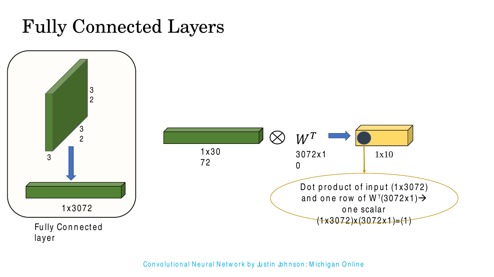
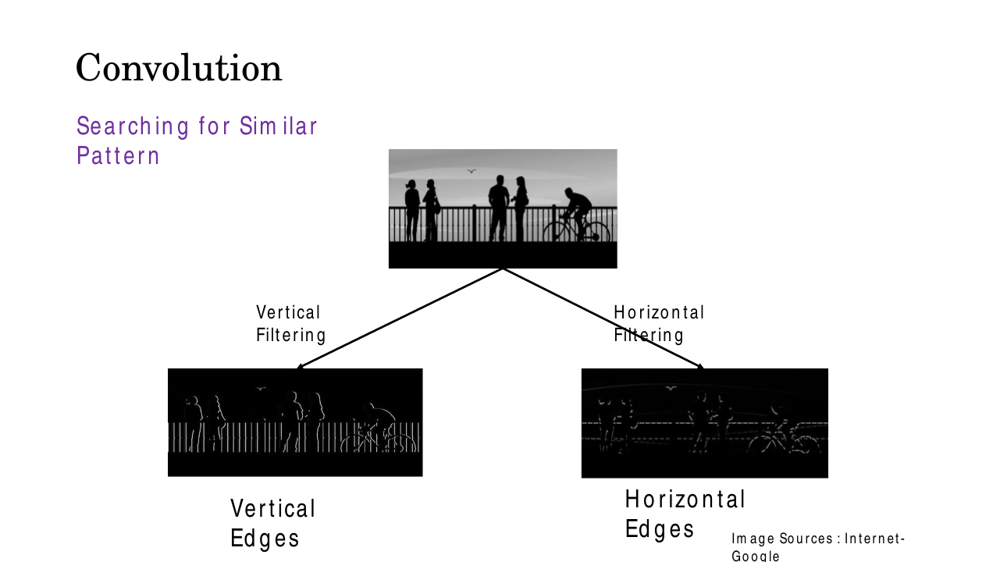
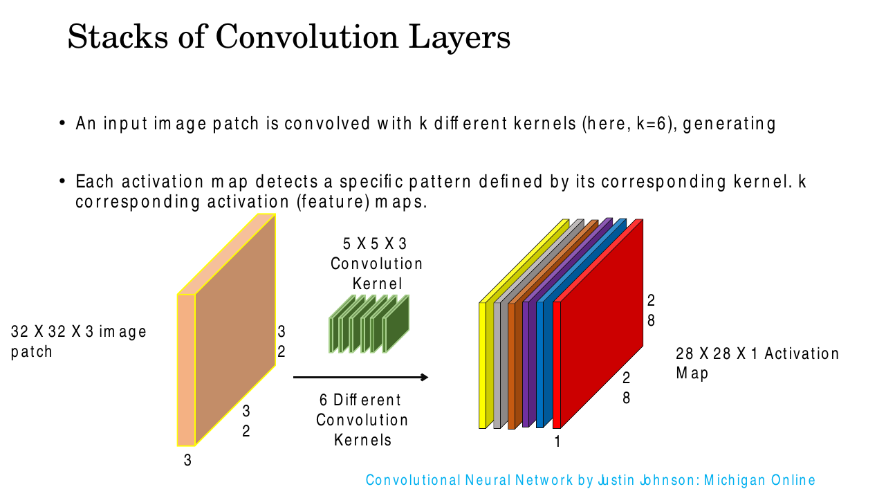
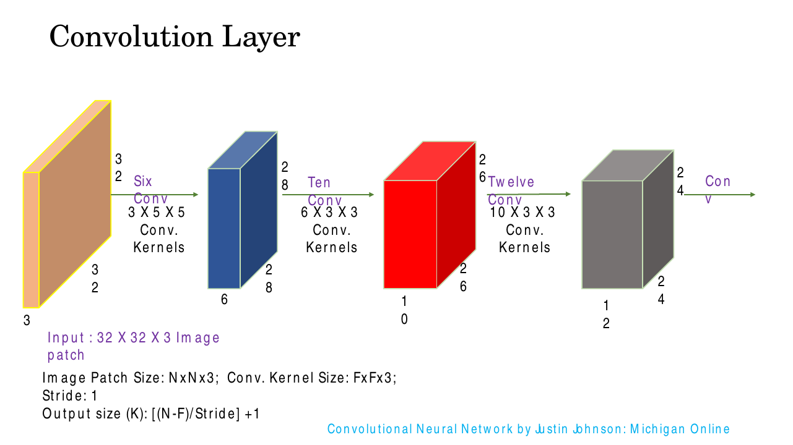
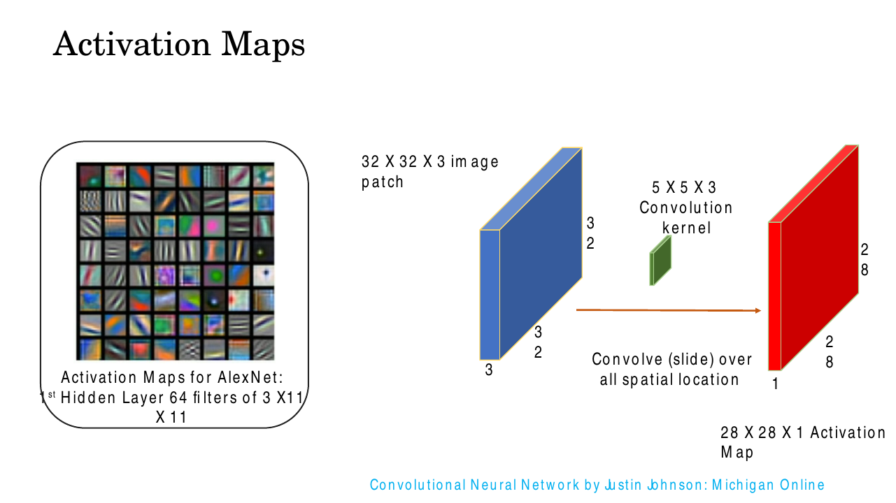
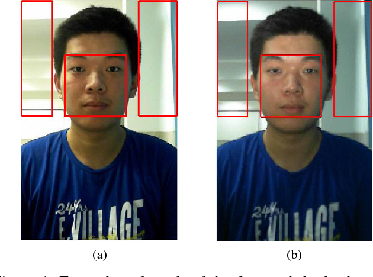
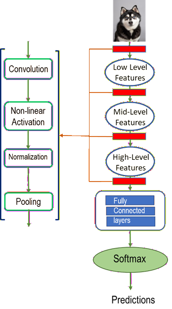

# Lec 11 — Convolutional Neural Networks I: Basics

> **Deck:** `W3L4_P1_CNN_Basics.pptx` · **Week 3** · **Playlist:** Lec 11
> **Prereqs:** [Lec 8 — MLP and Activations](../week-02/08-mlp-and-activations.md), [Lec 9 — Backpropagation](../week-02/09-backpropagation.md)
> **Feeds into:** [Lec 12 — CNN Architectures](12-cnn-architectures.md), [Lec 28 — ViT, DETR, Swin](../week-08/28-vit-detr-swin.md)

## Why this lecture exists

You can already build a multi-layer perceptron and train it with backpropagation. Point it at an image
and it falls over. Not because the idea is wrong but because of a counting problem: a dense layer
connects every input to every unit, and an image has a lot of inputs. One modest layer on one modest
photograph needs more weights than there are pixels in the whole training set. The network also learns
each position independently — an edge detector painstakingly learned in the top-left corner is useless
in the bottom-right, because those are different weights.

Convolution fixes both problems with one mechanism: a small bank of weights, slid across the image, so
the same detector is applied everywhere. This lecture is the arithmetic of that mechanism, and every
architecture from [Lec 12](12-cnn-architectures.md) to [Lec 28](../week-08/28-vit-detr-swin.md) is
built from the four numbers you learn to juggle here: kernel size, stride, padding, and depth.

## The ideas

### The parameter catastrophe

Take a standard ImageNet-sized input: $224\times224\times3$. Flatten it and you have

$$224 \times 224 \times 3 = 150{,}528 \text{ input values.}$$

Feed that to a dense layer with 1000 units — one per ImageNet class. Every input connects to every
unit, so the weight matrix $\mathbf{W}$ is $1000\times150{,}528$:

$$1000 \times 150{,}528 = 150{,}528{,}000 \text{ weights}, \quad +\,1000 \text{ biases} = 150{,}529{,}000 \text{ parameters.}$$

**Roughly 150 million parameters, for one layer.** Not a network — a layer. The deck makes the same
point at CIFAR scale: a $32\times32\times3$ image flattens to a $1\times3072$ vector, which meets a
$3072\times10$ weight matrix to produce 10 class scores.


*Fig. — The fully connected view. Flattening destroys spatial structure: pixel $(0,0)$ and pixel $(0,1)$ are neighbours in the image and arbitrary, unrelated coordinates in the 3072-vector. The network has to rediscover adjacency from data. Slide 17.*

Three ideas fix this, and they are the whole of CNNs:

1. **Local receptive fields.** The **receptive field** is the input region a single unit can see. In a
   dense layer it is the entire image. In a conv layer each unit looks at a small patch — $3\times3$,
   $5\times5$ — because *image statistics are locally consistent*: nearby pixels are highly correlated,
   distant ones mostly are not. A detector for "edge" never needed the whole picture.
2. **Parameter sharing (weight sharing).** The *same* small set of weights is applied at every
   position. One $3\times3$ edge detector, reused across all $224\times224$ locations, instead of a
   separate one per location. This is where the parameter count collapses.
3. **Translation equivariance.** Because the same weights slide everywhere, shifting the input shifts
   the output by the same amount: $f(\text{shift}(\mathbf{x})) = \text{shift}(f(\mathbf{x}))$. The
   network detects a cat's ear wherever the ear is, without ever having seen one in that corner.

The cost: a $3\times3$ conv layer with 64 filters on that same $224\times224\times3$ input needs
$(3\times3\times3+1)\times64 = 1{,}792$ parameters. Against 150,529,000. That is a factor of about
**84,000**, and it is the reason CNNs exist. Numerical N1 does the division in full.

> **Equivariance is not invariance.** Equivariance means the output *moves with* the input. Invariance
> means the output *does not change*. Convolution gives equivariance; pooling and the final global
> aggregation are what buy approximate invariance. MCQs swap these two words constantly.

### The convolution operation

A **kernel** (or **filter**) is a small matrix of learnable weights. To convolve it with an input:

1. Place the kernel over a patch of the input of the same size.
2. Multiply element-wise.
3. Sum all the products into a single number.
4. Slide the kernel one step and repeat.

The resulting grid of numbers is a **feature map** (the deck says **activation map** — same thing).
Large values mean "the pattern this kernel encodes is strongly present here".

The deck animates this over eight slides with an $8\times8$ input whose top half is 4 and bottom half
is 0, and the horizontal-edge kernel $\begin{bmatrix}1&1&1\\0&0&0\\-1&-1&-1\end{bmatrix}$. Here is the
finished result, which is all you need:

![An 8×8 input with the top four rows all 4 and bottom four rows all 0, a 3×3 kernel [[1,1,1],[0,0,0],[-1,-1,-1]], and the resulting 6×6 output whose rows 3 and 4 are 12 and whose other rows are 0](../../assets/slides/W3_W3L4_P1_CNN_Basics/s-14.png)
*Fig. — The output is 0 everywhere except the two rows straddling the brightness boundary, where it is 12. The kernel responds only where "bright above, dark below" is true — it has found the horizontal edge. Numerical N4 computes every cell by hand. Slides 7–14.*

Why that kernel finds horizontal edges: the top row of weights is $+1$, the bottom row is $-1$. The
output is (sum of the three pixels above) minus (sum of the three pixels below). In a flat region those
cancel to 0. At a bright-over-dark boundary they do not. Flip the kernel on its side and you get a
vertical-edge detector instead:


*Fig. — The same image through two different kernels. Vertical filtering lights up the railing uprights; horizontal filtering lights up the horizon line and the handrail. One kernel = one pattern detector. Slide 15.*

**The naming lie, and why nobody minds.** True mathematical convolution flips the kernel 180° before
the multiply-and-sum:

$$(f * g)[i,j] = \sum_{m}\sum_{n} f[m,n]\,g[i-m,\,j-n] \quad\text{(note the minus signs: the flip)}$$

What every deep-learning framework actually computes is **cross-correlation**, with no flip:

$$(f \star g)[i,j] = \sum_{m}\sum_{n} f[i+m,\,j+n]\,g[m,n]$$

This is harmless. The kernel's entries are *learned*, so if the flipped version were better the network
would simply learn the flipped weights — the two operations differ by a relabelling that training is
free to undo. The vocabulary stuck anyway: `nn.Conv2d` does cross-correlation and everyone calls it
convolution. **Expect this as an MCQ**; the answer is "cross-correlation, because the kernel is not
flipped, and it does not matter because the kernel is learned".

### The output-size formula

This is the single most examined piece of arithmetic in the course. Derive it once and never guess again.

Let the input have spatial size $H$ (do the same for $W$ separately), kernel size $K$, stride $S$ (how
far the kernel moves per step), and padding $P$ (rings of zeros added to *each* side).

After padding, the usable length is $H + 2P$ — $P$ on the left and $P$ on the right. A window of width
$K$ placed with its left edge at position $p$ (counting from 0) occupies positions $p$ through
$p + K - 1$, so it fits as long as

$$p + K - 1 \le H + 2P - 1 \quad\Longleftrightarrow\quad p \le H + 2P - K.$$

The kernel starts at $p = 0$ and advances by $S$, so the legal positions are $0, S, 2S, \dots$ up to
the largest multiple of $S$ not exceeding $H + 2P - K$. There are $\lfloor (H+2P-K)/S \rfloor$ such
steps after the first, plus the first one itself:

$$\boxed{\ H_{\text{out}} = \left\lfloor \frac{H - K + 2P}{S} \right\rfloor + 1\ }$$

The **$+1$ is for the starting position** and is the most common thing people drop. The **floor** is
the framework silently discarding a final partial window that does not fit; it only bites when $S > 1$.

The deck states a special case of this — $K_{\text{out}} = \lfloor (N-F)/\text{Stride}\rfloor + 1$ with
$P = 0$ — and works $N=32$, $F=5$, $S=1$:

$$\left\lfloor \frac{32-5}{1} \right\rfloor + 1 = 27 + 1 = 28.$$

![Slide showing a 32×32×3 image patch convolved with a 5×5×3 kernel at stride 1, producing a 28×28×1 activation map, with the formula [(N−F)/Stride]+1 worked out](../../assets/slides/W3_W3L4_P1_CNN_Basics/s-19.png)
*Fig. — The deck writes $N$ for input size, $F$ for kernel size and $K$ for output size. This book writes $H$, $K$, and $H_\text{out}$ — translate when you read the slides, because $F$ means *number of filters* everywhere else in this course. Slide 19.*

**Valid vs same padding.** Two conventions dominate:

| Mode | Padding | Output size | Effect |
|---|---|---|---|
| **`valid`** | $P = 0$ | $\lfloor (H-K)/S\rfloor + 1$ | No padding; output shrinks by $K-1$ each layer at $S=1$ |
| **`same`** | $P = \dfrac{K-1}{2}$ | $H$ (when $S = 1$) | Output matches input; only exact for **odd** $K$ |

Derive the `same` rule by setting $H_{\text{out}} = H$ with $S=1$:

$$H = H - K + 2P + 1 \;\Longrightarrow\; 2P = K - 1 \;\Longrightarrow\; P = \frac{K-1}{2}.$$

So $K=3 \Rightarrow P=1$; $K=5 \Rightarrow P=2$; $K=7 \Rightarrow P=3$. For even $K$, $(K-1)/2$ is not
an integer and you must pad asymmetrically — **this is why essentially every kernel you will ever see
is odd-sized.** Odd kernels also have a well-defined centre pixel, which makes "the output at position
$(i,j)$ describes input position $(i,j)$" literally true.

Without padding, a 10-layer stack of $3\times3$ convs shrinks a $32\times32$ input to $12\times12$ —
you run out of image before you run out of depth, and the border pixels get used far less often than
the middle ones. `same` padding is the default for exactly this reason.

**A table to burn in:**

| $H$ | $K$ | $S$ | $P$ | Computation | $H_{\text{out}}$ |
|---|---|---|---|---|---|
| 32 | 5 | 1 | 0 | $\lfloor 27/1\rfloor+1$ | 28 |
| 32 | 3 | 1 | 1 | $\lfloor 31/1\rfloor+1 = 31+1$ | 32 |
| 32 | 5 | 2 | 1 | $\lfloor 29/2\rfloor+1 = 14+1$ | 15 |
| 32 | 2 | 2 | 0 | $\lfloor 30/2\rfloor+1 = 15+1$ | 16 |
| 227 | 11 | 4 | 0 | $\lfloor 216/4\rfloor+1 = 54+1$ | 55 |
| 7 | 7 | 1 | 0 | $\lfloor 0/1\rfloor+1$ | 1 |

That last row is worth noticing: a kernel the same size as its input produces a single number. That is
how a conv layer can act as a dense layer.

### Depth: a kernel always spans the full input depth

Here is the rule readers get wrong more than any other in this chapter.

**A convolution kernel is 3-D. Its spatial extent is $K\times K$, but its depth is always exactly
$C_{\text{in}}$ — the full channel count of its input.** The kernel never slides in the depth
direction. It slides only across height and width.

So a "$3\times3$ kernel" applied to a 3-channel RGB input is really $3\times3\times3$:

$$3 \times 3 \times 3 = 27 \text{ weights}, \quad +\ 1 \text{ bias} = 28 \text{ parameters.}$$

One bias per kernel, not per weight and not per output position. And because the kernel covers all
channels at once, each multiply-and-sum collapses all 27 numbers into **one** scalar. A single
$5\times5\times3$ kernel on a $32\times32\times3$ input therefore produces a $28\times28\times\mathbf{1}$
map — depth 1, not 3. The slide labels this explicitly.

**Number of filters $F$ = number of output channels.** Use $F$ different kernels and you get $F$
independent feature maps, stacked into a volume of depth $F$:


*Fig. — Six kernels, six activation maps, one output volume of $28\times28\times6$. Each map answers one question about every location: "is my pattern here?" The depth of the output is a design choice; the spatial size is forced by the formula. Slide 20.*

Which gives the **parameter count of a conv layer**, the second formula you must know cold:

$$\boxed{\ \#\text{params} = (K \times K \times C_{\text{in}} + 1)\times F\ }$$

Read it as: (weights in one kernel $+$ its one bias) $\times$ (how many kernels). Note what is *absent*:
$H$ and $W$. **The parameter count of a conv layer does not depend on the input's spatial size.** The
same layer works on a $32\times32$ image and a $2000\times2000$ one with identical weights. That is
parameter sharing paying out, and it is why a CNN can be applied to an image size it never saw in
training.

### Stacking conv layers: receptive fields and hierarchy

Chain conv layers and the output of one becomes the $C_{\text{in}}$ of the next:


*Fig. — Trace the depths: the second layer's kernels are $6\times3\times3$ because the first layer handed it 6 channels; the third's are $10\times3\times3$. The kernel depth is never a free choice. Numerical N3 tracks every shape and parameter count. Slide 21.*

Two things grow as you stack.

**The receptive field grows.** A unit in layer 1 sees $K\times K$ input pixels. A unit in layer 2 sees a
$K\times K$ patch of layer-1 units, each of which saw $K\times K$ pixels — so it sees $5\times5$ input
pixels for $K=3$. The recursion, for stride-1 layers, is

$$R^{(l)} = R^{(l-1)} + (K^{(l)} - 1)$$

giving $3 \to 5 \to 7 \to 9$ for stacked $3\times3$ convs. With strides it is
$R^{(l)} = R^{(l-1)} + (K^{(l)}-1)\prod_{i<l} S^{(i)}$, and the growth is much faster. This is the
answer to "why do two $3\times3$ convs beat one $5\times5$": same receptive field, fewer parameters
($2\times(9C+1)F$ versus $25C F + F$), and an extra non-linearity in between.

**The features grow abstract.** Early kernels learn edges and colour blobs; middle layers combine edges
into textures and corners; later layers combine those into object parts; the deepest into whole objects.
Nobody designs this — it emerges from training. The first-layer filters of a trained network are
famously interpretable:


*Fig. — AlexNet's first hidden layer: 64 filters of size $3\times11\times11$. Oriented edge detectors and colour-opponent blobs, learned from scratch by gradient descent. Compare these to what classical computer vision hand-designed for forty years. Slide 22.*

### Pooling

Convolution answers "is this pattern present at this exact location?". Often you only need "is this
pattern present *around here*?" **Pooling** is the operator that throws away precise location and keeps
the response.

Pooling slides a window just like convolution, but instead of a learned weighted sum it applies a fixed
summary function. The deck covers two:

| Type | Rule | Keeps |
|---|---|---|
| **Max pooling** | take the largest value in the window | the strongest feature response |
| **Average pooling** | take the mean of the window | the overall level of response |

![Slide showing max pooling of a 4×4 grid to [[8,9],[7,6]] and average pooling of a different 4×4 grid to [[5,4],[7,3]], with a list of reasons for pooling](../../assets/slides/W3_W3L4_P1_CNN_Basics/s-24.png)
*Fig. — $2\times2$ windows at stride 2, so the four quadrants do not overlap and the map halves in each dimension. Max keeps 8 from $\{3,8,1,5\}$; average turns $\{2,4,5,9\}$ into 5. Numerical N5 does both by hand. Slides 24–31.*

Four reasons to pool, straight off the deck:

- **Reduces spatial dimensions.** $2\times2$ stride-2 pooling cuts the map area by $4\times$.
- **Speeds up computation.** Every later layer now processes a quarter of the positions.
- **Preserves important features.** Max pooling keeps the peak and discards only weaker neighbours.
- **Improves robustness to translation and noise.** Shift the input by a pixel inside a pooling window
  and the max usually does not change. This is where approximate **translation invariance** comes
  from — convolution gave equivariance, pooling converts some of it to invariance.

**Pooling has no learnable parameters.** None. Max and mean are fixed functions; there is nothing to
train, nothing in the gradient except routing. (Backprop through max-pool sends the whole gradient to
the argmax element and zero to the rest; through average-pool it splits the gradient evenly.) A layer
table that assigns parameters to a pooling layer is wrong, and exams test exactly this.

**The output-size formula applies unchanged**, with $K$ now the pool window:
$H_{\text{out}} = \lfloor (H - K + 2P)/S\rfloor + 1$. Pooling is almost always used with $P=0$ and
$S=K$ (non-overlapping), which reduces to $H_{\text{out}} = \lfloor H/K \rfloor$. Setting $S < K$ gives
**overlapping pooling**, which AlexNet used ($K=3$, $S=2$). And pooling acts **per channel**: it never
mixes channels, so $C_{\text{out}} = C_{\text{in}}$ always.

### Contrast normalization and LCN

A conv kernel computes a weighted sum of raw intensities, so if you brighten the image the response
scales with it. A detector tuned on a well-lit face fires weakly on the same face in shadow. **Contrast
normalization (CN)** rescales activations using local statistics so that *relative* structure survives
illumination change.

The specific scheme on the deck is **Local Contrast Normalization (LCN)**. For a neighbourhood
$N(x,y)$ around each position in feature map $I^k$:

$$I^{k+1}(x,y) = \frac{I^k(x,y) - m^k\big(N(x,y)\big)}{\sigma^k\big(N(x,y)\big)}$$

Subtract the local mean, divide by the local standard deviation. Both statistics come from a small
window around the pixel, not the whole image — that is what "local" means, and what separates LCN from
a global brightness correction. Every neighbourhood ends up centred at zero with unit spread, which
suppresses flat high-intensity regions and amplifies the edges and textures that carry information.


*Fig. — (a) non-flash, (b) flash. The pixel values inside the face box differ enormously between the two; the local structure — eye corners, nostril shadows, lip boundary — does not. LCN is a way to make the network see the second thing and not the first. Slide 34.*

LCN is a historical layer: it appeared in AlexNet-era networks (as "local response normalization", a
close cousin) and was dropped once **batch normalization** proved simpler. Learn it anyway — obscure-
but-stated items are exactly what short-answer questions key on. The line to memorise: *LCN subtracts
the local mean and divides by the local standard deviation, has no learnable parameters in its basic
form, and buys robustness to illumination and contrast variation.*

### The CNN processing pipeline

Assemble everything into the standard stage ordering:

$$\textbf{CONV} \to \textbf{ReLU} \to \textbf{NORM} \to \textbf{POOL} \quad\text{(repeat)} \quad\to \textbf{FLATTEN} \to \textbf{FC} \to \textbf{SOFTMAX}$$


*Fig. — The left column is one repeating block; the right column is what successive blocks produce. The loop arrow matters: the same four-stage block runs many times, and depth is what turns edges into objects. Slides 35–36.*

Stage by stage:

- **Convolution** extracts local patterns with learnable kernels. Linear.
- **Non-linear activation** (ReLU, or sigmoid in older designs), element-wise. Without it the stack
  collapses: composing linear maps gives a linear map, so a 50-layer linear CNN has the expressive
  power of one conv layer. ReLU's gradient behaviour is [Lec 13](13-vanishing-gradients-activations.md)'s subject.
- **Normalization** standardizes activations to stabilize training (LCN above; batch norm in practice).
- **Pooling** downsamples, cutting compute and adding translation tolerance.
- **Flatten** reshapes the final $H\times W\times C$ volume into one long vector — $24\times24\times12$
  becomes a 6,912-vector. No parameters, no arithmetic; just a reinterpretation of memory.
- **Fully connected layers** mix *everything with everything*. This is deliberate: by now the map is
  small and each position encodes a high-level concept, so global mixing is cheap and is exactly what
  classification needs — "whiskers here AND pointy ears there AND fur texture throughout ⟹ cat".
  Convolution can never do this, because it is local by construction.
- **Softmax** turns the final scores into class probabilities (defined in
  [Lec 8](../week-02/08-mlp-and-activations.md)).

The division of labour is clean: **conv + pool are the learned feature extractor; the FC head is the
classifier.** Classical pipelines hand-designed the features and learned only the classifier; a CNN
learns both end to end. The FC head is also where the parameters hide — in N3 the whole conv stack has
2,098 parameters and the single FC layer on top has 69,130. [Lec 12](12-cnn-architectures.md) shows how
the classic architectures attack that imbalance. CNNs built this way serve the three tasks the deck
names: **image classification** (one label per image), **object detection** (propose regions, then
classify), and **semantic segmentation** (a label per pixel).

## Worked numericals

### N1. Conv layer vs equivalent dense layer — the parameter ratio
**Given:** input $224\times224\times3$. Option A: a dense layer with 1000 units. Option B: a conv layer,
$K=3$, $F=64$, $S=1$, $P=1$.
**Find:** parameters in each, and the ratio.

1. Flattened input size: $224 \times 224 = 50{,}176$; $\times 3 = 150{,}528$.
2. Dense weights: $150{,}528 \times 1000 = 150{,}528{,}000$.
3. Dense biases: $1000$. Total $= 150{,}529{,}000$.
4. Conv — weights in one kernel: $K\times K\times C_{\text{in}} = 3\times3\times3 = 27$. Plus 1 bias $= 28$.
5. Conv total: $28 \times F = 28 \times 64 = 1{,}792$.
6. Ratio: $150{,}529{,}000 / 1{,}792 \approx 84{,}001$.
7. Output shapes: dense gives $1000$ numbers; conv gives $\lfloor(224-3+2)/1\rfloor+1 = 224$, so $224\times224\times64$ — *far more* output values, from 84,000× fewer parameters.

**Answer:** dense $= 150{,}529{,}000$ parameters; conv $= 1{,}792$. The conv layer uses about
$\mathbf{1/84{,}000}$ of the parameters and still produces a spatially structured output.

### N2. Output size with non-trivial stride and padding
**Given:** (i) input $32\times32\times3$, $K=5$, $S=2$, $P=1$, $F=8$.
(ii) input $227\times227\times3$, $K=11$, $S=4$, $P=0$, $F=96$.
**Find:** output shape and parameter count for each.

1. (i) Numerator: $H - K + 2P = 32 - 5 + 2(1) = 29$.
2. Divide and floor: $\lfloor 29/2 \rfloor = 14$. Add 1: $H_{\text{out}} = 15$.
3. The floor is doing real work here — $29/2 = 14.5$, and the half-window at the right edge is discarded.
4. Depth $= F = 8$. Output: $15\times15\times8$.
5. Parameters (i): $(5\times5\times3+1)\times8 = (75+1)\times8 = 76\times8 = 608$.
6. (ii) Numerator: $227 - 11 + 0 = 216$. $\lfloor 216/4\rfloor = 54$. $+1 = 55$. Output $55\times55\times96$.
7. Parameters (ii): $(11\times11\times3+1)\times96 = (363+1)\times96 = 364\times96 = 34{,}944$.

**Answer:** (i) $\mathbf{15\times15\times8}$, 608 parameters. (ii) $\mathbf{55\times55\times96}$,
34,944 parameters.

### N3. Shapes and parameters through a three-layer stack
**Given:** input $32\times32\times3$. Layer 1: 6 kernels, $K=5$. Layer 2: 10 kernels, $K=3$.
Layer 3: 12 kernels, $K=3$. All $S=1$, $P=0$. Then flatten and a dense layer to 10 classes.
**Find:** the shape after each layer, the parameters of each, and the total.

1. **Layer 1 shape:** $\lfloor(32-5+0)/1\rfloor + 1 = 27+1 = 28$. Depth $= 6$. → $\mathbf{28\times28\times6}$.
2. **Layer 1 params:** $C_{\text{in}} = 3$, so $(5\times5\times3+1)\times6 = 76\times6 = 456$.
3. **Layer 2 shape:** input is now $28\times28\times6$. $\lfloor(28-3)/1\rfloor+1 = 25+1 = 26$. Depth $= 10$. → $\mathbf{26\times26\times10}$.
4. **Layer 2 params:** $C_{\text{in}} = 6$ (the previous depth), so $(3\times3\times6+1)\times10 = (54+1)\times10 = 550$.
5. **Layer 3 shape:** $\lfloor(26-3)/1\rfloor+1 = 23+1 = 24$. Depth $=12$. → $\mathbf{24\times24\times12}$.
6. **Layer 3 params:** $C_{\text{in}} = 10$, so $(3\times3\times10+1)\times12 = (90+1)\times12 = 91\times12 = 1{,}092$.
7. **Conv total:** $456 + 550 + 1{,}092 = 2{,}098$.
8. **Flatten:** $24\times24\times12 = 576\times12 = 6{,}912$ values.
9. **Dense head:** $6{,}912\times10 + 10 = 69{,}120 + 10 = 69{,}130$.
10. **Network total:** $2{,}098 + 69{,}130 = 71{,}228$.

**Answer:** $32{\times}32{\times}3 \to 28{\times}28{\times}6 \to 26{\times}26{\times}10 \to 24{\times}24{\times}12 \to$ flatten 6,912 $\to$ 10.
Total $= \mathbf{71{,}228}$ parameters, of which **97% sit in the one fully connected layer**.

### N4. A 3×3 kernel convolved by hand
**Given:** input $\mathbf{X}$ is $8\times8$ with rows 1–4 all equal to 4 and rows 5–8 all equal to 0.
Kernel $\mathbf{W} = \begin{bmatrix}1&1&1\\0&0&0\\-1&-1&-1\end{bmatrix}$, $S=1$, $P=0$, no bias.
**Find:** the complete output feature map.

1. **Output size:** $\lfloor(8-3+0)/1\rfloor+1 = 5+1 = 6$, both dimensions. So a $6\times6$ map.
2. **Position (1,1)** — covers input rows 1–3, columns 1–3, every entry 4:
   $$4(1)+4(1)+4(1)\;+\;4(0)+4(0)+4(0)\;+\;4(-1)+4(-1)+4(-1) = 12 + 0 - 12 = 0.$$
3. **Position (2,1)** — input rows 2–4, all still 4: identical arithmetic, $12 + 0 - 12 = \mathbf{0}$.
4. **Position (3,1)** — input rows 3, 4, 5. Row 3 is 4s, row 4 is 4s, row 5 is 0s:
   $$4(1)+4(1)+4(1)\;+\;4(0)+4(0)+4(0)\;+\;0(-1)+0(-1)+0(-1) = 12 + 0 - 0 = \mathbf{12}.$$
5. **Position (4,1)** — input rows 4, 5, 6 = 4s, 0s, 0s:
   $$4(1)+4(1)+4(1) + 0 + 0(-1)\cdot3 = 12 + 0 - 0 = \mathbf{12}.$$
6. **Position (5,1)** — input rows 5, 6, 7, all 0: $0 + 0 - 0 = \mathbf{0}$.
7. **Position (6,1)** — input rows 6, 7, 8, all 0: $\mathbf{0}$.
8. **Columns.** Every row of the input is constant, so sliding horizontally changes nothing — all six
   columns of a given output row are equal.

**Answer:**

$$\mathbf{Y} = \begin{bmatrix}
0&0&0&0&0&0\\
0&0&0&0&0&0\\
12&12&12&12&12&12\\
12&12&12&12&12&12\\
0&0&0&0&0&0\\
0&0&0&0&0&0
\end{bmatrix}$$

The kernel fires only on the two output rows that straddle the brightness boundary. Exactly the deck's
figure, and exactly what the code in the next section prints.

### N5. Max pooling and average pooling, by hand, on the same matrix
**Given:** $\mathbf{M} = \begin{bmatrix}3&8&3&9\\1&5&2&5\\6&3&1&4\\7&5&2&6\end{bmatrix}$, window $K=2$, stride $S=2$, $P=0$.
**Find:** the max-pooled and average-pooled outputs, and the output size.

1. **Output size:** $\lfloor(4-2+0)/2\rfloor+1 = 1+1 = 2$. A $2\times2$ map, four non-overlapping quadrants.
2. Quadrants: top-left $\{3,8,1,5\}$, top-right $\{3,9,2,5\}$, bottom-left $\{6,3,7,5\}$, bottom-right $\{1,4,2,6\}$.
3. **Max:** $\max\{3,8,1,5\} = 8$; $\max\{3,9,2,5\} = 9$; $\max\{6,3,7,5\} = 7$; $\max\{1,4,2,6\} = 6$.
4. **Average:** $(3+8+1+5)/4 = 17/4 = 4.25$; $(3+9+2+5)/4 = 19/4 = 4.75$; $(6+3+7+5)/4 = 21/4 = 5.25$; $(1+4+2+6)/4 = 13/4 = 3.25$.
5. **Cross-check against the deck's own average example** $\begin{bmatrix}2&4&5&7\\5&9&1&3\\6&9&1&3\\8&5&2&6\end{bmatrix}$:
   $(2{+}4{+}5{+}9)/4 = 5$, $(5{+}7{+}1{+}3)/4 = 4$, $(6{+}9{+}8{+}5)/4 = 7$, $(1{+}3{+}2{+}6)/4 = 3$ → $\begin{bmatrix}5&4\\7&3\end{bmatrix}$, matching slide 24.
6. **Parameters used:** zero, in both cases.

**Answer:** max-pool $= \begin{bmatrix}8&9\\7&6\end{bmatrix}$, average-pool $= \begin{bmatrix}4.25&4.75\\5.25&3.25\end{bmatrix}$.
Max is always $\ge$ average cell-by-cell, and both layers have **0 learnable parameters**.

### N6. Padding needed for 'same' output
**Given:** three cases. (a) $H=28$, $K=5$, $S=1$. (b) $H=28$, $K=4$, $S=1$. (c) $H=32$, $K=3$, $S=2$,
target output 16.
**Find:** the padding $P$ in each case.

1. **(a)** Use $P=(K-1)/2 = (5-1)/2 = 2$. Verify: $\lfloor(28-5+4)/1\rfloor+1 = 27+1 = 28$. ✓
2. **(b)** $P = (4-1)/2 = 1.5$ — not an integer. Solve directly: need $28 = 28-4+2P+1 \Rightarrow 2P = 3$.
3. No symmetric integer padding works. Frameworks pad 1 on one side and 2 on the other (PyTorch's
   `padding='same'` does this; a plain integer `padding=` cannot). **This is why odd kernels are standard.**
4. **(c)** Set $\lfloor(32-3+2P)/2\rfloor+1 = 16 \Rightarrow \lfloor(29+2P)/2\rfloor = 15$.
5. That needs $30 \le 29+2P \le 31$, i.e. $0.5 \le P \le 1$. Take $P = 1$.
6. Verify: $\lfloor(32-3+2)/2\rfloor+1 = \lfloor31/2\rfloor+1 = 15+1 = 16$. ✓

**Answer:** (a) $P=2$. (b) impossible symmetrically; needs asymmetric padding $(1,2)$ — use odd $K$.
(c) $P=1$, giving exactly $16\times16$. Note that with $S>1$, "same" conventionally means
$\lceil H/S\rceil$, not $H$.

## Code

```python
import numpy as np

def conv2d(x, k, stride=1, pad=0):
    """Single-channel 2-D cross-correlation -- what DL calls 'convolution'."""
    if pad:
        x = np.pad(x, pad, mode='constant')          # zero-pad all four sides
    H, W = x.shape
    K = k.shape[0]
    out_h = (H - K) // stride + 1                    # <- the output-size formula
    out_w = (W - K) // stride + 1
    out = np.zeros((out_h, out_w))
    for i in range(out_h):                           # slide down
        for j in range(out_w):                       # slide across
            patch = x[i*stride : i*stride + K,
                      j*stride : j*stride + K]
            out[i, j] = np.sum(patch * k)            # multiply element-wise, then sum
    return out

# the deck's 8x8 input: top half bright (4), bottom half dark (0)
img = np.vstack([np.full((4, 8), 4.0), np.zeros((4, 8))])
kernel = np.array([[ 1.,  1.,  1.],                  # horizontal-edge detector
                   [ 0.,  0.,  0.],
                   [-1., -1., -1.]])

print(conv2d(img, kernel).astype(int))
# [[ 0  0  0  0  0  0]
#  [ 0  0  0  0  0  0]
#  [12 12 12 12 12 12]     <- exactly numerical N4
#  [12 12 12 12 12 12]
#  [ 0  0  0  0  0  0]
#  [ 0  0  0  0  0  0]]
print(conv2d(img, kernel).shape)            # (6, 6)      valid: (8-3)/1+1 = 6
print(conv2d(img, kernel, pad=1).shape)     # (8, 8)      same:  P=(3-1)/2=1
print(conv2d(img, kernel, stride=2).shape)  # (3, 3)      floor((8-3)/2)+1 = 3

def maxpool(x, K=2, S=2):
    oh, ow = (x.shape[0]-K)//S + 1, (x.shape[1]-K)//S + 1
    return np.array([[x[i*S:i*S+K, j*S:j*S+K].max() for j in range(ow)] for i in range(oh)])

def avgpool(x, K=2, S=2):
    oh, ow = (x.shape[0]-K)//S + 1, (x.shape[1]-K)//S + 1
    return np.array([[x[i*S:i*S+K, j*S:j*S+K].mean() for j in range(ow)] for i in range(oh)])

M = np.array([[3.,8.,3.,9.],[1.,5.,2.,5.],[6.,3.,1.,4.],[7.,5.,2.,6.]])
print(maxpool(M).astype(int))   # [[8 9]      <- numerical N5
                                #  [7 6]]
print(avgpool(M))               # [[4.25 4.75]
                                #  [5.25 3.25]]
```

Now the same facts through the real API, as a shape-and-parameter check:

```python
import torch, torch.nn as nn

x = torch.randn(1, 3, 32, 32)                    # PyTorch order: (batch, C, H, W)

c1 = nn.Conv2d(3,  6,  kernel_size=5)            # the N3 stack, layer by layer
c2 = nn.Conv2d(6,  10, kernel_size=3)
c3 = nn.Conv2d(10, 12, kernel_size=3)
h = c3(c2(c1(x)))
print(tuple(h.shape))                            # (1, 12, 24, 24)   <- matches N3
for name, layer in [("c1", c1), ("c2", c2), ("c3", c3)]:
    print(name, sum(p.numel() for p in layer.parameters()))
# c1 456     (5*5*3+1)*6
# c2 550     (3*3*6+1)*10
# c3 1092    (3*3*10+1)*12

same = nn.Conv2d(3, 64, kernel_size=3, padding=1)        # P=(K-1)/2 -> size preserved
print(tuple(same(x).shape), sum(p.numel() for p in same.parameters()))
# (1, 64, 32, 32) 1792        <- the conv side of numerical N1

strided = nn.Conv2d(3, 8, kernel_size=5, stride=2, padding=1)
print(tuple(strided(x).shape))                   # (1, 8, 15, 15)    <- numerical N2(i)

pool = nn.MaxPool2d(kernel_size=2, stride=2)
print(tuple(pool(x).shape), sum(p.numel() for p in pool.parameters()))
# (1, 3, 16, 16) 0            <- pooling has ZERO parameters, and C is unchanged

dense = nn.Linear(224*224*3, 1000)
print(sum(p.numel() for p in dense.parameters()))        # 150529000
```

`pool` reporting `0` parameters is the line to remember. Note also that `nn.Conv2d(3, 64, 3)` never
asks for the input's height or width — further proof that $H$ and $W$ do not enter the parameter count.

## Exam pack

### Must-memorise

| Item | Exactly this |
|---|---|
| Output size (conv **and** pool) | $H_{\text{out}} = \left\lfloor \dfrac{H - K + 2P}{S} \right\rfloor + 1$ |
| Conv parameter count | $(K \times K \times C_{\text{in}} + 1)\times F$ |
| Output depth | $C_{\text{out}} = F$, the number of filters |
| Kernel depth | always $C_{\text{in}}$ — a kernel spans the full input depth |
| Weights in one $3\times3$ kernel on 3 channels | $3\times3\times3 = 27$, plus 1 bias $= 28$ |
| `same` padding (odd $K$, $S=1$) | $P = \dfrac{K-1}{2}$ |
| `valid` padding | $P = 0$ |
| Pooling output depth | $C_{\text{out}} = C_{\text{in}}$ — pooling never mixes channels |
| Pooling parameters | **0** |
| Receptive field growth ($S=1$) | $R^{(l)} = R^{(l-1)} + (K^{(l)} - 1)$ |
| What DL calls convolution | cross-correlation — no kernel flip |
| Three CNN principles | local receptive fields, parameter sharing, translation equivariance |
| LCN | $I^{k+1}(x,y) = \dfrac{I^k(x,y) - m^k(N(x,y))}{\sigma^k(N(x,y))}$ |
| Pipeline | CONV → ReLU → NORM → POOL (repeat) → FLATTEN → FC → SOFTMAX |

### Numbers worth knowing

| Quantity | Value |
|---|---|
| $224\times224\times3$ flattened | 150,528 |
| Dense $150{,}528 \to 1000$ parameters | 150,529,000 (~150M) |
| $3\times3$, $F=64$ conv on 3 channels | 1,792 parameters |
| Parameter ratio dense : conv (above) | ~84,000 : 1 |
| Deck's example: $32\times32\times3$, $K=5$, $S=1$, $P=0$ | output $28\times28\times1$ |
| $32\times32\times3$ flattened (deck slide 17) | 3,072 |
| Deck's 3-layer stack | $32{\times}32{\times}3 \to 28{\times}28{\times}6 \to 26{\times}26{\times}10 \to 24{\times}24{\times}12$ |
| Parameters of that stack | 456 + 550 + 1,092 = 2,098 |
| AlexNet first layer (slide 22) | 64 filters of $3\times11\times11$ |
| Deck's max-pool example | $\begin{bmatrix}3&8&3&9\\1&5&2&5\\6&3&1&4\\7&5&2&6\end{bmatrix} \to \begin{bmatrix}8&9\\7&6\end{bmatrix}$ |
| Deck's average-pool example | $\begin{bmatrix}2&4&5&7\\5&9&1&3\\6&9&1&3\\8&5&2&6\end{bmatrix} \to \begin{bmatrix}5&4\\7&3\end{bmatrix}$ |
| Deck's headline figures (slide 36) | 96% ImageNet top-5; 152 ResNet layers; 60M parameters |
| Two stacked $3\times3$ convs | receptive field $5\times5$ |

### Likely MCQ traps

- **"A $3\times3$ kernel on a 3-channel input has 9 weights."** No — it has $3\times3\times3 = 27$
  weights plus 1 bias. The kernel always spans the full input depth. This is the most-missed item in
  the chapter.
- **"Convolving with one kernel on a 3-channel input gives a 3-channel output."** No — one kernel gives
  **one** output channel, because the sum collapses all input channels into a single number. Depth of
  the output $=$ number of filters, nothing else.
- **Forgetting the $+1$** in $\lfloor(H-K+2P)/S\rfloor + 1$. It accounts for the starting position. A
  $5\times5$ input with a $5\times5$ kernel gives $1$, not $0$.
- **Forgetting that $P$ is per side.** The formula uses $2P$ because padding is added on both the left
  and right (and top and bottom).
- **"Pooling layers have parameters."** They have zero. The window size and stride are hyperparameters,
  not learned weights.
- **"Pooling reduces the number of channels."** It does not. $C_{\text{out}} = C_{\text{in}}$ always;
  pooling acts independently within each channel.
- **Equivariance vs invariance.** Convolution is translation **equivariant** (output shifts with input).
  Pooling adds approximate translation **invariance** (output unchanged by small shifts).
- **"Deep learning convolution flips the kernel."** It does not — it is cross-correlation. The flip is
  in the textbook mathematical definition only, and it is irrelevant because the kernel is learned.
- **"The parameter count depends on image size."** For a conv layer it does not. For an FC layer it does
  — which is why FC layers dominate the parameter budget.
- **$P=(K-1)/2$ for even $K$.** Only valid for odd $K$. Even kernels cannot preserve size with symmetric
  integer padding.
- **"`same` padding means output $=$ input size."** Only when $S=1$. At stride $S$, `same` gives
  $\lceil H/S\rceil$.
- **LCN vs batch normalization.** LCN normalizes over a *spatial neighbourhood within one image*. Batch
  norm normalizes over the *batch*. Different axes entirely.

### Self-test

1. Input $64\times64\times16$, $K=3$, $S=1$, $P=1$, $F=32$. Give the output shape and the parameter count.
2. Input $100\times100\times3$, $K=7$, $S=3$, $P=0$. Output spatial size?
3. How many weights (excluding bias) does a single $5\times5$ kernel have on a 64-channel input?
4. What padding preserves spatial size for $K=7$, $S=1$?
5. A $12\times12\times8$ map goes through $2\times2$ max pooling at stride 2. Output shape and parameter count?
6. Why does deep learning use cross-correlation rather than true convolution, and why does it not matter?
7. Three stacked $3\times3$ conv layers, all stride 1. What is the receptive field of one output unit?
8. $8\times8$ input, $K=3$, $S=3$, $P=0$. Output size — and what happens to the last column of the input?
9. A conv layer has 2,432 parameters, 32 filters, and $K=5$. How many input channels did it have?
10. State one thing convolution can do that a dense layer cannot, and one thing a dense layer can do that convolution cannot.

<details><summary>Answers</summary>

1. $\lfloor(64-3+2)/1\rfloor+1 = 63+1 = 64$, so $\mathbf{64\times64\times32}$. Params $= (3\times3\times16+1)\times32 = (144+1)\times32 = 145\times32 = \mathbf{4{,}640}$.
2. $\lfloor(100-7)/3\rfloor+1 = \lfloor93/3\rfloor+1 = 31+1 = \mathbf{32}$, so $32\times32$.
3. $5\times5\times64 = \mathbf{1{,}600}$ weights (plus 1 bias).
4. $P = (7-1)/2 = \mathbf{3}$.
5. $\lfloor(12-2)/2\rfloor+1 = 5+1 = 6$, so $\mathbf{6\times6\times8}$ — depth unchanged — with $\mathbf{0}$ parameters.
6. Cross-correlation skips the 180° kernel flip, which saves an operation. It does not matter because the kernel weights are learned: whatever the flip would have produced, training can learn directly.
7. $3 \to 5 \to 7$, so $\mathbf{7\times7}$ input pixels.
8. $\lfloor(8-3)/3\rfloor+1 = \lfloor5/3\rfloor+1 = 1+1 = \mathbf{2}$. Windows start at columns 1 and 4, covering columns 1–6; **columns 7 and 8 are never seen** — the floor discarded them. Pad if you care about the border.
9. $(5\times5\times C_{\text{in}}+1)\times32 = 2432 \Rightarrow 25C_{\text{in}}+1 = 76 \Rightarrow 25C_{\text{in}} = 75 \Rightarrow C_{\text{in}} = \mathbf{3}$.
10. Convolution applies the same detector at every location with a parameter count independent of image size, and is translation equivariant — a dense layer is neither. A dense layer can combine information from opposite corners of the image in one step, which a local kernel can never do; that is exactly why the FC head exists.

</details>

## Beyond the slides

**Gap:** The deck's formula $\lfloor(N-F)/S\rfloor+1$ omits padding entirely — it only ever shows the
$P=0$ case.
**Why it matters:** Every modern architecture uses padding, and the exam form of the question almost
always includes $P$. Memorise $\lfloor(H-K+2P)/S\rfloor+1$, which reduces to the deck's version at $P=0$.

**Gap:** The deck never states the conv parameter-count formula, only shows kernel sizes in diagrams.
**Why it matters:** "How many parameters in this layer?" is a standard short-numerical question, and
$(K\times K\times C_{\text{in}}+1)\times F$ answers it in one line. The $+1$ bias and the $C_{\text{in}}$
factor are both routinely forgotten.

**Gap:** Receptive field is named (slide 16) but never quantified.
**Why it matters:** "Why stack two $3\times3$ convs instead of one $5\times5$?" is the standard
justification for [Lec 12](12-cnn-architectures.md)'s VGG design, and it needs the recursion
$R^{(l)} = R^{(l-1)} + (K^{(l)}-1)$.

**Gap:** The deck shows only max and average pooling, and does not mention **global average pooling** —
pooling a whole $H\times W\times C$ map down to $1\times1\times C$.
**Why it matters:** GAP replaced the giant FC head in GoogLeNet and ResNet precisely because of the
parameter imbalance shown in N3. You will meet it in [Lec 12](12-cnn-architectures.md) and
[Lec 14](../week-04/14-resnet.md), and knowing it is a pooling variant with zero parameters makes it
obvious why it helps.

**Gap:** No mention of how convolution is trained — the backward pass.
**Why it matters:** Nothing new is needed: a conv layer is a linear layer with tied weights, so
[Lec 9](../week-02/09-backpropagation.md)'s chain rule applies unchanged. The only wrinkle is that a
shared weight's gradient is the **sum** of its gradients over all the positions it was used at. Knowing
that one sentence prevents the common worry that CNNs need special training machinery.

## Cut from the slides

Slides 7–14 are eight frames of one animation showing a $3\times3$ kernel stepping across an $8\times8$
input; they are collapsed into the single completed frame (slide 14) plus numerical N4, which computes
every cell of the $6\times6$ output by hand — strictly more information than the animation carried.
Slides 24–31 are likewise eight identical frames of the pooling slide with the highlight circle moving;
they are collapsed into slide 24 plus numerical N5. Slides 1, 2, 38 and 39 are title, contents, summary
and "next lecture" — pure navigation. Slides 3, 4 and 16 restate the same prose definition of a CNN
(local connectivity + weight sharing) three times with different headings; it is taught once, in the
parameter-catastrophe section. Slides 4, 5, 35 and 36 all carry the identical CONV→ACT→NORM→POOL
pipeline figure; it appears once here, taken from the clean extracted asset. Slide 5's
conventional-ML-versus-deep-learning comparison is folded into one sentence in the pipeline section
rather than given a figure, because the point ("classical pipelines hand-design features, CNNs learn
them") is one line. Slide 32 is pure prose that slides 33–34 repeat with figures and the actual formula,
so only 33–34 survive. Slide 37's ILSVRC error-rate chart is **deliberately not reproduced** — that
table belongs to [Lec 14](../week-04/14-resnet.md); the three vision tasks it names are kept. One thing
the ownership map did not flag: the LCN *formula* exists only as an image on slide 34 and is invisible
in the text dump — it is transcribed in full above. Nothing mathematical was dropped.
