# Lec 12 — CNN Model Architectures: LeNet → GoogLeNet

> **Deck:** `W3L4_P2_CNN_Architectures.pptx` · **Week 3** · **Playlist:** Lec 12
> **Prereqs:** [Lec 11 — CNN Basics](11-cnn-basics.md)
> **Feeds into:** [Lec 13 — Vanishing Gradients and Activations](13-vanishing-gradients-activations.md), [Lec 14 — ResNet](../week-04/14-resnet.md), [Lec 15 — DenseNet, MobileNet, EfficientNet](../week-04/15-densenet-mobilenet-efficientnet.md)

## Why this lecture exists

[Lec 11](11-cnn-basics.md) gave you the pieces — convolution, stride, padding, pooling — but a pile
of pieces is not a network. Someone has to decide how many filters, of what size, in what order, and
every one of those choices costs memory, compute, and parameters. This lecture is the history of four
people making those choices well, over sixteen years: LeNet-5 in 1998, AlexNet in 2012, and then VGGNet
and GoogLeNet in the same year, 2014. Each contributes exactly one durable idea, and all four ideas are
still in the models you will meet in week 4 and beyond. Read this chapter as a sequence of answers to
one question — *given a fixed compute budget, what shape should a convolutional network be?* — because
that is the question the next three lectures also answer, just with newer tricks.

## The ideas

### LeNet-5 (LeCun et al., 1998) — proof that the idea works at all

LeNet-5 read handwritten digits on bank cheques. It takes a $32\times32$ **grayscale** image (one
channel, not three) and ends in 10 output units, one per digit class. The deck counts **seven trainable
layers**, alternating convolution and subsampling, then two dense stages:

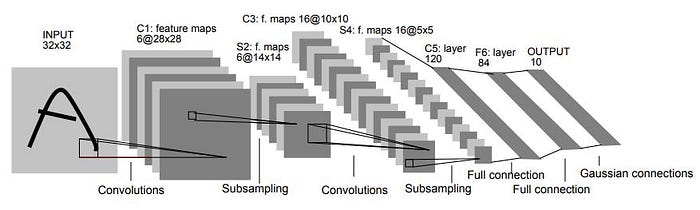
*Fig. — The template every later network copies: feature maps get deeper as they get spatially smaller. Width shrinks 32 → 28 → 14 → 10 → 5 → 1 while depth grows 1 → 6 → 16 → 120. Slide 3.*

| Layer | Type | Kernel / detail | Output volume |
|---|---|---|---|
| Input | — | $32\times32$ grayscale | $32\times32\times1$ |
| **C1** | Convolution, $F=6$ | $K=5$, $S=1$, $P=0$ | $28\times28\times6$ |
| **S2** | Average pooling (subsampling) | $2\times2$, $S=2$ | $14\times14\times6$ |
| **C3** | Convolution, $F=16$ | $K=5$, $S=1$, $P=0$ | $10\times10\times16$ |
| **S4** | Average pooling (subsampling) | $2\times2$, $S=2$ | $5\times5\times16$ |
| **C5** | Fully connected (as a $5\times5$ conv) | 120 units | $1\times1\times120$ |
| **F6** | Fully connected | 84 units | $84$ |
| Output | Fully connected (Gaussian/RBF) | 10 units | $10$ |

Every spatial number follows from the output-size formula [Lec 11](11-cnn-basics.md) drills:
$32-5+1 = 28$, then $28/2 = 14$, then $14-5+1 = 10$, then $10/2 = 5$, then $5-5+1 = 1$. The last one is
the point of **C5**: at $5\times5$ input a $5\times5$ kernel produces a single spatial position, so C5
is simultaneously a convolution and a fully connected layer. **F6** is unambiguously dense, 120 → 84.

Two details the exam likes. LeNet uses **sigmoid or tanh** activations, not ReLU — ReLU is AlexNet's
contribution. And it uses **average** pooling, not max pooling. The whole network is about 60 thousand
parameters, which is roughly one-thousandth of AlexNet. Its significance is the demonstration that
*hierarchical feature learning through weight-shared convolution* beats hand-designed features while
using far fewer parameters than a dense network on the same input.

### AlexNet (Krizhevsky, Sutskever & Hinton, 2012) — the same idea, scaled until it won

AlexNet is LeNet's shape with roughly 1000× the parameters, trained on 1.2 million ImageNet images.
It takes **$227\times227\times3$** RGB input and has **eight learnable layers**: five convolutional,
three fully connected, ending in a 1000-way softmax.

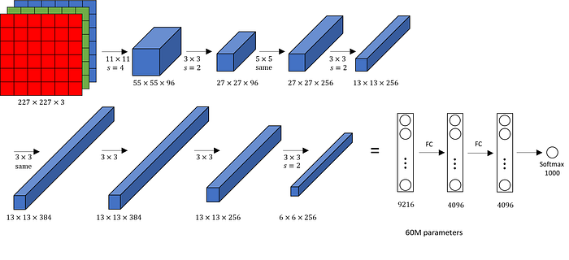
*Fig. — Follow the volumes, not the boxes. The $6\times6\times256$ final conv output flattens to 9216, which is the input width of FC6. That flatten is where 60M parameters mostly come from. Slide 8.*

| Layer | Type | Kernel / filters | Output volume |
|---|---|---|---|
| Input | — | — | $227\times227\times3$ |
| **CONV1** | Convolution | 96 filters, $K=11$, $S=4$, $P=0$ | $55\times55\times96$ |
| **MAXPOOL1** | Pooling | $3\times3$, $S=2$ | $27\times27\times96$ |
| **NORM1** | Normalization | Local Response Normalization (LRN) | $27\times27\times96$ |
| **CONV2** | Convolution | 256 filters, $K=5$, $S=1$, $P=2$ | $27\times27\times256$ |
| **MAXPOOL2** | Pooling | $3\times3$, $S=2$ | $13\times13\times256$ |
| **NORM2** | Normalization | LRN | $13\times13\times256$ |
| **CONV3** | Convolution | 384 filters, $K=3$, $S=1$, $P=1$ | $13\times13\times384$ |
| **CONV4** | Convolution | 384 filters, $K=3$, $S=1$, $P=1$ | $13\times13\times384$ |
| **CONV5** | Convolution | 256 filters, $K=3$, $S=1$, $P=1$ | $13\times13\times256$ |
| **MAXPOOL3** | Pooling | $3\times3$, $S=2$ | $6\times6\times256 = 9216$ |
| **FC6** | Fully connected | 4096 units (+ dropout) | $4096$ |
| **FC7** | Fully connected | 4096 units (+ dropout) | $4096$ |
| **FC8** | Fully connected | 1000 units → softmax | $1000$ |

The five innovations the deck lists, each with the reason it was needed:

- **ReLU activations.** $\max(0,x)$ instead of sigmoid/tanh: non-saturating, so gradients survive depth
  and training converged several times faster. The gradient argument is
  [Lec 13](13-vanishing-gradients-activations.md)'s.
- **Dropout** in FC6 and FC7, because 60M parameters on 1.2M images overfits violently. Mechanism in
  [Lec 10](../week-02/10-overfitting-and-regularization.md).
- **GPU training**, split across *two* GPUs that communicate only at certain layers — which is why the
  paper's figure is drawn as two parallel streams. This is what made the scale practical at all.
- **Local Response Normalization (LRN)**, a lateral-inhibition scheme normalising each activation by its
  neighbours across the channel axis; it appears as NORM1 and NORM2. Later architectures dropped it, so
  know it as *AlexNet's* idea.
- **Overlapping max pooling**: $3\times3$ windows with $S=2$. Because $S < K$ consecutive windows
  overlap, unlike LeNet's non-overlapping $2\times2$/$S=2$.

Data augmentation (translations, horizontal flips) and SGD round out the recipe. AlexNet won
ILSVRC-2012 with a **16.4% top-5 error** against 25.8% the year before — conventionally the start of
the deep-learning era in vision. The full winners table is [Lec 14](../week-04/14-resnet.md)'s.

The deck works CONV1 on the slide itself and you should memorise it: $(227-11)/4 + 1 = 55$, so the
output volume is $55\times55\times96$, and the parameter count is $(11\times11\times3)\times96 = 35\text{K}$
— note the $\times 3$ for input depth. Numerical N3 traces the rest.

### VGGNet (Simonyan & Zisserman, 2014) — one filter size, repeated

VGGNet takes **$224\times224\times3$** input and ends in **three fully connected layers** (4096, 4096,
1000-way softmax). VGG-16 has 16 weight layers (13 conv + 3 FC), VGG-19 has 19 (16 conv + 3 FC). All
convolutions are $K=3$, $S=1$, $P=1$ — which preserves spatial size exactly — and all pooling is
$2\times2$ max with $S=2$, which halves it. So the spatial resolution steps cleanly
$224 \to 112 \to 56 \to 28 \to 14 \to 7$ while depth doubles $64 \to 128 \to 256 \to 512 \to 512$.

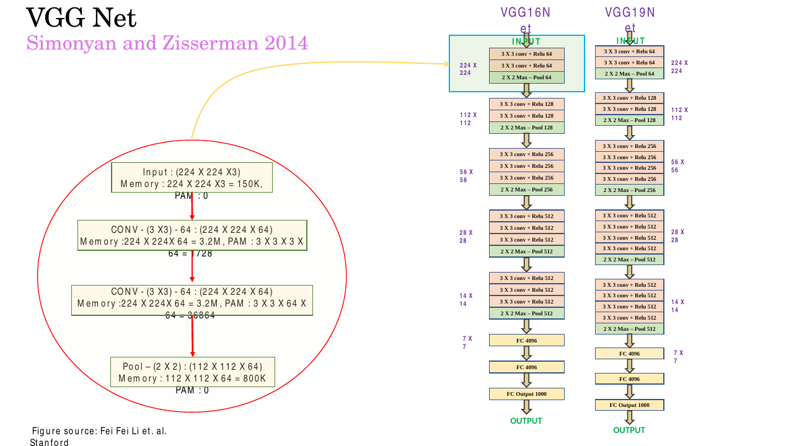
*Fig. — The deck's own per-layer memory/parameter annotation. $3\times3\times3\times64 = 1728$ for the first conv (input depth 3), then $3\times3\times64\times64 = 36{,}864$ for the second (input depth 64). Pooling has zero parameters. Slide 17.*

#### The effective receptive field

The **receptive field** of a unit is the region of the *input* that can influence it. For one
convolutional layer it is just the kernel: a $3\times3$ filter sees $3\times3$ pixels. Stack layers and
it grows, because each unit in layer 2 sees a $3\times3$ patch of layer 1, and each of *those* units
already saw a $3\times3$ patch of the input.

For stride-1 layers the growth rule is additive:

$$r_l = r_{l-1} + (K_l - 1)$$

starting from $r_0 = 1$. (With strides it becomes $r_l = r_{l-1} + (K_l-1)\prod_{i<l} S_i$ — each
layer's contribution is magnified by all the downsampling that happened before it.) So three stacked
$3\times3$ stride-1 layers give $1 \to 3 \to 5 \to 7$: the **same $7\times7$ effective receptive field
as a single $7\times7$ convolution**. In general, $n$ stacked $K\times K$ stride-1 layers reach
$n(K-1)+1$.

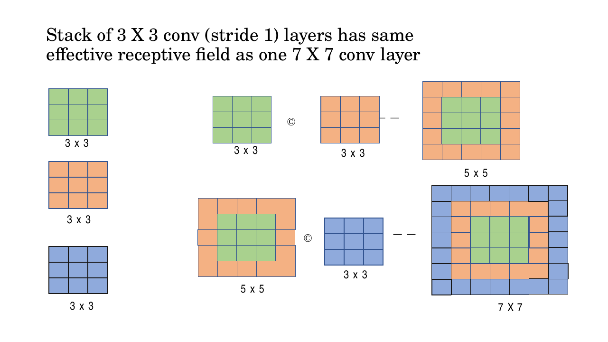
*Fig. — Read it as composition: $3\times3$ ⊙ $3\times3$ = $5\times5$, then ⊙ $3\times3$ = $7\times7$. The coloured rings show each layer adding a one-pixel border on every side, i.e. $+2$ per layer. Slide 14.*

#### Why the stack wins

If the receptive field is the same, why prefer three small layers? Two reasons, and the deck states
both.

**Parameter efficiency.** Count parameters per input–output channel pair, with $C$ channels in and $C$
out at every stage:

$$\text{three } 3\times3:\quad 3 \times (3^2 \cdot C^2) = 27C^2 \qquad\text{versus}\qquad \text{one } 7\times7:\quad 7^2 \cdot C^2 = 49C^2$$

That is a $1 - 27/49 = 44.9\%$ reduction — the deck rounds it to **approximately 45%**. Fewer
parameters means less memory, less compute, and less capacity to overfit.

**Increased non-linearity.** Each $3\times3$ convolution is followed by a ReLU. Three stacked layers
therefore apply **three** non-linear transformations where the single $7\times7$ applies one. A stack
of linear maps with nothing between them collapses into a single linear map; the ReLUs are what make
the deeper stack strictly more expressive, not merely cheaper. This is the more important of the two
arguments and the one students usually forget.

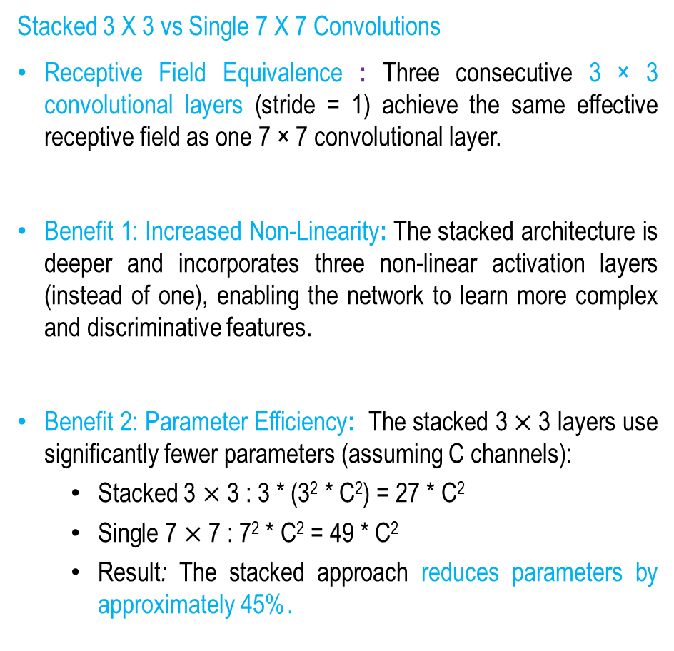
*Fig. — The deck's complete argument on one slide. Note both benefits are listed; an MCQ that offers only "fewer parameters" as the reason for $3\times3$ stacks is testing whether you remember the non-linearity half. Slide 15.*

VGG-16 scored **7.3% top-5 error** at ILSVRC-2014 with about **138 million parameters** — the largest
of the four. Numerical N5 shows where those parameters actually sit, and the answer motivates
everything GoogLeNet does next.

### GoogLeNet / Inception-v1 (Szegedy et al., 2014) — go wide, not only deep

VGG asks "how deep?" GoogLeNet asks a different question: *at any given layer, what filter size is
right?* Its answer is to refuse to choose. The **Inception module** runs $1\times1$, $3\times3$ and
$5\times5$ convolutions plus a $3\times3$ max-pooling branch **in parallel** on the same input, then
**concatenates all four outputs depth-wise** (along the channel axis). All branches use padding that
preserves spatial size, so the concatenation is legal: same $H\times W$, depths add.

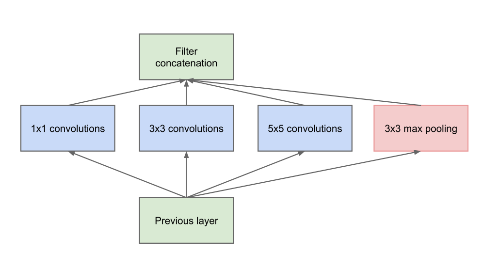
*Fig. — "Parallel" is the whole idea: the network sees the same input at several scales simultaneously and lets training decide which branch matters. Compare with a plain stack, where you commit to one $K$ per layer. Slide 23.*

The deck then asks: *what is the problem with this?* Two problems, both fatal.

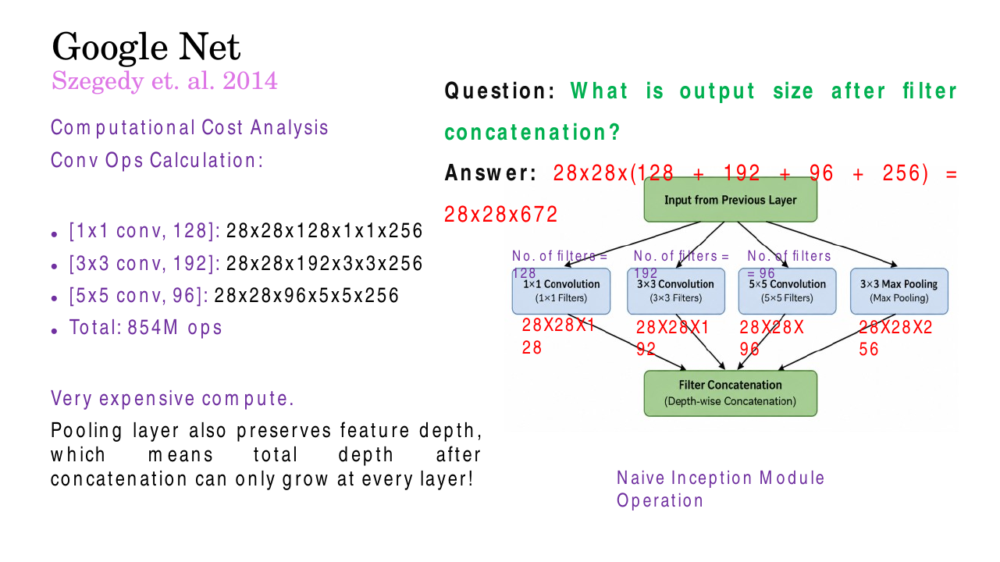
*Fig. — Both failures on one slide. 854M multiplies for **one** module, and an output deeper (672) than the input (256) because the pooling branch passes all 256 channels straight through. Slide 26.*

1. **Cost.** For a $28\times28\times256$ input with 128/192/96 filters, one module costs **854M**
   multiplies (N4). Stack nine of these and the network is unaffordable.
2. **Depth inflation.** The pooling branch cannot reduce channels — pooling acts spatially and
   preserves depth — so it contributes all 256 input channels to the output. Concatenation gives
   $28\times28\times(128+192+96+256) = 28\times28\times672$. The output is *deeper than the input*, so
   the next module's input depth is larger, so it costs more, and depth can only grow at every layer.

### $1\times1$ convolutions — the fix, and the most reusable idea on this deck

A **$1\times1$ convolution** is a convolution whose kernel covers exactly one spatial position but the
*full* input depth. On a $H\times W\times C_{\text{in}}$ volume, a single $1\times1$ filter has
$C_{\text{in}}$ weights; at each of the $H\times W$ positions it multiplies the $C_{\text{in}}$ channel
values by those weights and sums them to one number. It is a **linear combination across the channel
axis at each spatial position**, applied with the same weights everywhere.

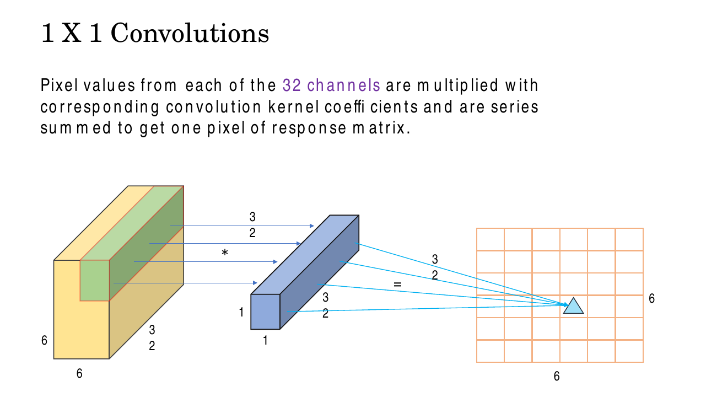
*Fig. — The arrows show the mechanism: 32 numbers in (one per channel, same pixel), one number out. Spatially nothing moves — the output grid is still $6\times6$. Slide 30.*

Use $F$ such filters and you get $H\times W\times F$ out. Three consequences follow immediately, and
they are the whole reason the operation exists:

- **Spatial dimensions are unchanged.** $K=1$, $S=1$, $P=0$ gives $H-1+0+1 = H$. Always.
- **The channel count becomes whatever you want.** $C_{\text{in}} \to F$, and $F$ is free. If
  $F < C_{\text{in}}$ this is **dimensionality reduction in the channel axis** — *not* spatial
  downsampling. That distinction is the single most examined point about $1\times1$ convolutions.
- **It is not a no-op.** Each output channel is a learned mixture of all input channels, followed by a
  ReLU. It adds cross-channel mixing and a non-linearity for very few parameters.

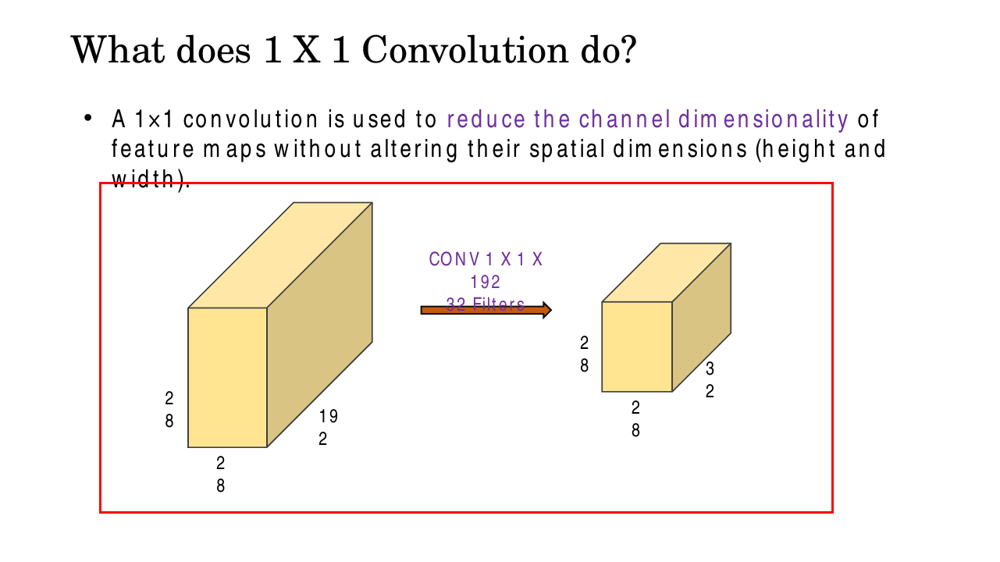
*Fig. — The deck's canonical example: $192$ channels become $32$, while $28\times28$ stays $28\times28$. Parameter cost is only $1\times1\times192\times32 = 6144$ weights. Slide 32.*

When a $1\times1$ convolution is placed *before* an expensive operation purely to shrink
$C_{\text{in}}$, it is called a **bottleneck layer**: a low-dimensional intermediate representation
that compresses the feature maps so the expensive layer has less to chew on. The deck's definition:
"a low-dimensional intermediate layer that reduces computational cost and the number of parameters by
compressing the input feature maps."

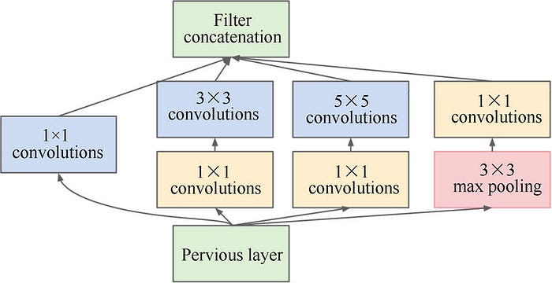
*Fig. — Note the asymmetry: the $1\times1$ bottlenecks go **before** the $3\times3$ and $5\times5$ convolutions (shrink the input), but **after** the max pool (shrink the output, since pooling cannot). Slide 22.*

Insert $1\times1$ convolutions with 64 filters before the $3\times3$ and $5\times5$ branches and after
the pooling branch, and the same module's cost drops from **854M to 358M** multiplies as the deck
states — while the concatenated depth drops from 672 to **480**, which is still more than 256 but no
longer runaway.

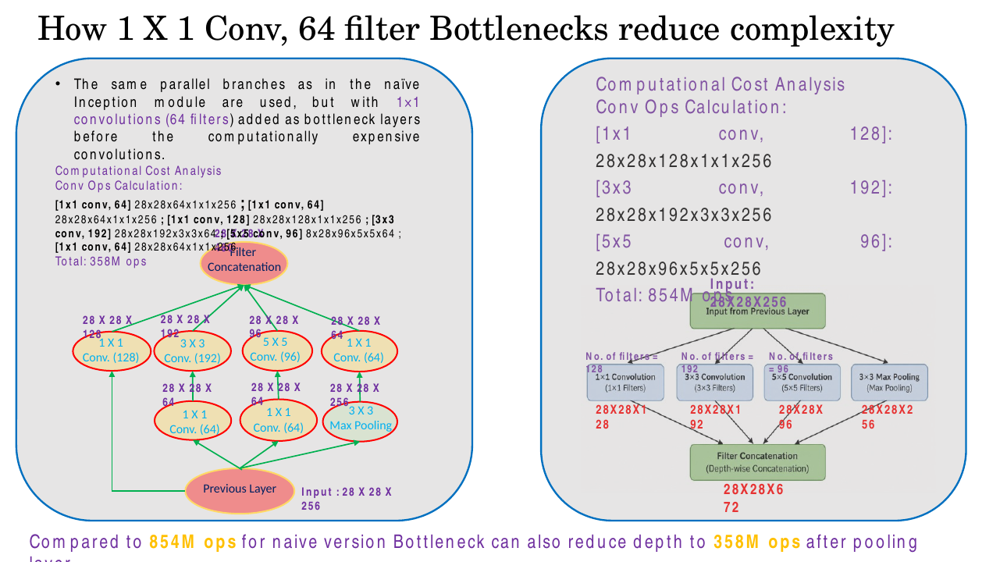
*Fig. — The comparison to memorise: 854M → 358M ops, 672 → 480 output channels, same four parallel branches. Slide 36.*

GoogLeNet stacks nine such modules, 22 learnable layers deep, and adds two more ideas:

- **Auxiliary classifiers.** Two small softmax heads attached to intermediate Inception modules during
  *training only*. Their losses are added (with weight 0.3) to the main loss, injecting gradient
  directly into the middle of the network so the early layers get a usable training signal. They are
  removed at inference. The problem they mitigate is [Lec 13](13-vanishing-gradients-activations.md)'s.
- **Global average pooling instead of FC layers.** Instead of flattening the final $7\times7\times1024$
  volume into a 50,176-vector and feeding dense layers, GoogLeNet averages each channel over its whole
  spatial extent, producing one number per channel — a 1024-vector — which feeds a single linear
  classifier. The deck is blunt: "there are no FC layers in this architecture." This is why GoogLeNet
  uses only **5 million parameters, about 12× fewer than AlexNet**, despite being far deeper.

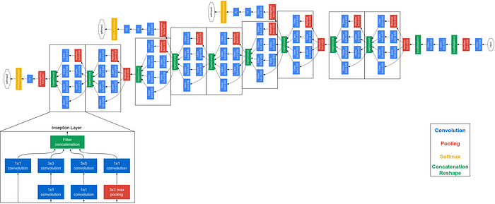
*Fig. — The two yellow softmax blocks hanging off the middle of the network are the auxiliary classifiers; they exist only during training. Slide 21.*

### The master comparison

| | **LeNet-5** | **AlexNet** | **VGG-16** | **GoogLeNet (Inception-v1)** |
|---|---|---|---|---|
| Year | 1998 | 2012 | 2014 | 2014 |
| Authors | LeCun et al. | Krizhevsky, Sutskever, Hinton | Simonyan & Zisserman | Szegedy et al. |
| Input | $32\times32\times1$ (grayscale) | $227\times227\times3$ | $224\times224\times3$ | $224\times224\times3$ |
| Learnable layers | 7 (deck's count) | 8 (5 conv + 3 FC) | 16 (13 conv + 3 FC); VGG-19 = 19 | 22 |
| Parameters | ~60 K | ~60 M | ~138 M | ~5 M |
| FC layers | C5, F6, output | FC6, FC7, FC8 | three (4096/4096/1000) | none — global average pooling |
| Activation | sigmoid / tanh | ReLU | ReLU | ReLU |
| Pooling | average, $2\times2$ $S$=2 | overlapping max, $3\times3$ $S$=2 | max, $2\times2$ $S$=2 | max, inside and between modules |
| ILSVRC top-5 error | n/a (MNIST-era) | **16.4%** (won 2012) | **7.3%** (2014 runner-up) | **6.7%** (won 2014) |
| Key innovation | convolution + pooling hierarchy works | ReLU, dropout, GPU, LRN, overlapping pooling | stacked $3\times3$ convolutions | Inception module + $1\times1$ bottlenecks + GAP |

## Worked numericals

### N1. Effective receptive field of a stack of 3×3 layers
**Given:** three convolutional layers, all $K=3$, $S=1$, applied in sequence.
**Find:** the receptive field of one unit in the third layer, measured on the input.

1. Rule for stride-1 layers: $r_l = r_{l-1} + (K_l - 1)$, with $r_0 = 1$ (one input pixel).
2. After layer 1: $r_1 = 1 + (3-1) = 3$. Receptive field $3\times3$.
3. After layer 2: $r_2 = 3 + 2 = 5$. Receptive field $5\times5$.
4. After layer 3: $r_3 = 5 + 2 = 7$. Receptive field $7\times7$.
5. Cross-check with the closed form for $n$ identical stride-1 layers: $n(K-1)+1 = 3(2)+1 = 7$. ✓
6. How many $3\times3$ layers to match an $11\times11$ kernel? $n(2)+1 = 11 \Rightarrow n = 5$.

**Answer:** **$7\times7$** — identical to one $7\times7$ convolution. Five stacked $3\times3$ layers
would be needed to match AlexNet's $11\times11$ CONV1.

### N2. Parameters: three stacked 3×3 convolutions versus one 7×7
**Given:** $C$ input channels and $C$ output channels at every stage (biases ignored, as the deck does).
**Find:** the parameter count of each option in general, and for $C = 64$.

1. One conv layer with kernel $K$, $C$ in, $C$ out has $K^2 C^2$ weights.
2. Single $7\times7$: $7^2 C^2 = 49C^2$.
3. Three $3\times3$: $3 \times (3^2 C^2) = 3 \times 9C^2 = 27C^2$.
4. Ratio: $27C^2 / 49C^2 = 0.5510$, so the stack uses 55.1% as many parameters.
5. Reduction: $1 - 0.5510 = 0.4490 \approx \mathbf{45\%}$ — independent of $C$, since $C^2$ cancels.
6. Concrete $C = 64$: $C^2 = 4096$.
7. Single $7\times7$: $49 \times 4096 = 200{,}704$ weights.
8. Three $3\times3$: $27 \times 4096 = 110{,}592$ weights.
9. Saving: $200{,}704 - 110{,}592 = 90{,}112$ weights.
10. And the stack applies **three** ReLUs instead of one, for the same $7\times7$ receptive field.

**Answer:** $27C^2$ versus $49C^2$ — a **~45% parameter reduction**. At $C=64$: **110,592 versus
200,704**, saving 90,112 weights *and* gaining two extra non-linearities.

### N3. Tracing volumes through AlexNet
**Given:** input $227\times227\times3$; the layer table above. Output size formula
$\lfloor (H - K + 2P)/S \rfloor + 1$.
**Find:** every spatial dimension, plus CONV1's parameter count.

1. CONV1 ($K=11, S=4, P=0$): $(227 - 11 + 0)/4 + 1 = 216/4 + 1 = 54 + 1 = 55$ → $55\times55\times96$.
2. CONV1 parameters: $11 \times 11 \times 3 \times 96 = 363 \times 96 = 34{,}848 \approx 35\text{K}$
   (plus 96 biases = 34,944). Note the $\times 3$ for input depth.
3. MAXPOOL1 ($3\times3$, $S=2$): $(55-3)/2 + 1 = 26+1 = 27$ → $27\times27\times96$. Zero parameters.
4. CONV2 ($K=5, S=1, P=2$): $(27 - 5 + 4)/1 + 1 = 26+1 = 27$ → $27\times27\times256$. Padding 2 with
   $K=5$ preserves size.
5. MAXPOOL2: $(27-3)/2 + 1 = 12+1 = 13$ → $13\times13\times256$.
6. CONV3/4/5 ($K=3,S=1,P=1$) all preserve size: $13\times13\times384$, $13\times13\times384$,
   $13\times13\times256$.
7. MAXPOOL3: $(13-3)/2 + 1 = 5+1 = 6$ → $6\times6\times256$.
8. Flatten: $6 \times 6 \times 256 = 9216$ features into FC6.
9. FC6 parameters alone: $9216 \times 4096 + 4096 = 37{,}748{,}736 + 4096 = 37{,}752{,}832$.

**Answer:** $55 \to 27 \to 27 \to 13 \to 13 \to 13 \to 13 \to 6$. CONV1 holds **34,848 weights**
(~35K) while FC6 alone holds **~37.75M** — over 60% of the whole network.

### N4. Inception module: naive versus 1×1 bottleneck multiply count
**Given:** module input $28\times28\times256$. Branches: $1\times1$ with 128 filters, $3\times3$ with
192, $5\times5$ with 96, and $3\times3$ max pooling. All convolutions are "same" (output stays
$28\times28$).
**Find:** total multiplies and the concatenated output depth, before and after inserting $1\times1$
bottlenecks with 64 filters.

Cost rule: one output element of a $K\times K$ conv costs $K^2 C_{\text{in}}$ multiplies, and there
are $H \times W \times F$ output elements. So **ops $= H \cdot W \cdot F \cdot K \cdot K \cdot C_{\text{in}}$**.

*Naive module:*

1. $1\times1$, 128: $28 \times 28 \times 128 \times 1 \times 1 \times 256 = 784 \times 128 \times 256 = 25{,}690{,}112 \approx 25.7\text{M}$
2. $3\times3$, 192: $28 \times 28 \times 192 \times 3 \times 3 \times 256 = 784 \times 192 \times 9 \times 256 = 346{,}816{,}512 \approx 346.8\text{M}$
3. $5\times5$, 96: $28 \times 28 \times 96 \times 5 \times 5 \times 256 = 784 \times 96 \times 25 \times 256 = 481{,}689{,}600 \approx 481.7\text{M}$
4. Total: $25.7 + 346.8 + 481.7 = \mathbf{854\text{M ops}}$.
5. Output depth: pooling passes all 256 channels through, so concatenation gives
   $28 \times 28 \times (128 + 192 + 96 + 256) = \mathbf{28\times28\times672}$ — deeper than the input.

*With $1\times1$, 64-filter bottlenecks (the deck's six terms):*

6. $1\times1$, 64 before the $3\times3$: $28\times28\times64\times1\times1\times256 = 12{,}845{,}056 \approx 12.8\text{M}$
7. $1\times1$, 64 before the $5\times5$: same, $\approx 12.8\text{M}$
8. $1\times1$, 128 direct branch: $28\times28\times128\times1\times1\times256 \approx 25.7\text{M}$
9. $3\times3$, 192 — now on **64** input channels: $28\times28\times192\times3\times3\times64 = 86{,}704{,}128 \approx 86.7\text{M}$ (was 346.8M — a $256/64 = 4\times$ cut)
10. $5\times5$, 96 — now on **64** channels: $28\times28\times96\times5\times5\times64 = 120{,}422{,}400 \approx 120.4\text{M}$ (was 481.7M — again $4\times$)
11. $1\times1$, 64 after the max pool: $\approx 12.8\text{M}$
12. Deck's stated total: **358M ops**.
13. Output depth: $28\times28\times(128+192+96+64) = \mathbf{28\times28\times480}$.

**Answer:** **854M → 358M multiplies** and **672 → 480 output channels**, for the same four parallel
branches and the same spatial size. The saving comes entirely from the $3\times3$ and $5\times5$
branches seeing 64 channels instead of 256. (See *Beyond the slides* — the six listed terms actually
sum to 271M; 358M is the figure the deck and its source quote, so quote 358M in the exam.)

### N5. Where VGG-16's 138M parameters actually live
**Given:** VGG-16, all convs $3\times3$ with the channel schedule 64,64 / 128,128 / 256,256,256 /
512,512,512 / 512,512,512, final conv volume $7\times7\times512$, then FC 4096 → 4096 → 1000.
**Find:** the parameter split between the conv stack and the FC head.

1. Conv weights per layer $= 3 \times 3 \times C_{\text{in}} \times C_{\text{out}}$, plus $C_{\text{out}}$ biases.
2. Block 1: $3{\cdot}3{\cdot}3{\cdot}64 = 1728$; $3{\cdot}3{\cdot}64{\cdot}64 = 36{,}864$. Subtotal 38,592.
3. Block 2: $3{\cdot}3{\cdot}64{\cdot}128 = 73{,}728$; $3{\cdot}3{\cdot}128{\cdot}128 = 147{,}456$. Subtotal 221,184.
4. Block 3: $294{,}912 + 589{,}824 + 589{,}824 = 1{,}474{,}560$.
5. Block 4: $1{,}179{,}648 + 2{,}359{,}296 + 2{,}359{,}296 = 5{,}898{,}240$.
6. Block 5: $3 \times 2{,}359{,}296 = 7{,}077{,}888$.
7. Conv weights total: $38{,}592 + 221{,}184 + 1{,}474{,}560 + 5{,}898{,}240 + 7{,}077{,}888 = 14{,}710{,}464$; with 4,224 biases, **14,714,688**.
8. FC6: input $7 \times 7 \times 512 = 25{,}088$, so $25{,}088 \times 4096 + 4096 = 102{,}764{,}544$.
9. FC7: $4096 \times 4096 + 4096 = 16{,}781{,}312$. FC8: $4096 \times 1000 + 1000 = 4{,}097{,}000$.
10. FC total: $123{,}642{,}856$. Grand total: $14{,}714{,}688 + 123{,}642{,}856 = 138{,}357{,}544$.

**Answer:** **~138.4M parameters, of which 89.4% (123.6M) are in the three FC layers** and only 10.6%
in all thirteen convolutional layers. FC6 alone is 102.8M. This is precisely the waste GoogLeNet
eliminates with global average pooling, and why it reaches 5M parameters while being deeper.

## Code

```python
import numpy as np

# --- a 1x1 convolution IS a matrix multiply across the channel axis -----
H, W, C_in, C_out = 6, 6, 32, 1          # the deck's slide-30 example
rng = np.random.default_rng(0)
x = rng.integers(0, 10, size=(H, W, C_in)).astype(float)   # input volume
k = rng.normal(size=(C_in, C_out))                         # 1x1 kernel: C_in -> C_out

# literal reading: at every spatial position, dot the 32-vector with the kernel
slow = np.zeros((H, W, C_out))
for i in range(H):
    for j in range(W):
        slow[i, j] = x[i, j, :] @ k        # 32 multiplies + 31 adds -> ONE number

# equivalent fast form: flatten space, one (H*W, C_in) @ (C_in, C_out) matmul
fast = (x.reshape(-1, C_in) @ k).reshape(H, W, C_out)

print("same result:", np.allclose(slow, fast))
print("shape in -> out:", x.shape, "->", fast.shape)
# same result: True
# shape in -> out: (6, 6, 32) -> (6, 6, 1)   <- spatial 6x6 untouched, depth 32 -> 1
```

```python
def conv_ops(H, W, F, K, C_in):
    """Multiplies for a 'same' conv: each of H*W*F outputs costs K*K*C_in multiplies."""
    return H * W * F * K * K * C_in

HW, C = 28, 256                      # Inception module input: 28 x 28 x 256
naive = {"1x1,128": conv_ops(HW, HW, 128, 1, C),
         "3x3,192": conv_ops(HW, HW, 192, 3, C),
         "5x5, 96": conv_ops(HW, HW,  96, 5, C)}
bott  = {"1x1, 64 pre-3x3": conv_ops(HW, HW,  64, 1, C),
         "1x1, 64 pre-5x5": conv_ops(HW, HW,  64, 1, C),
         "1x1,128 direct ": conv_ops(HW, HW, 128, 1, C),
         "3x3,192 on 64ch": conv_ops(HW, HW, 192, 3, 64),
         "5x5, 96 on 64ch": conv_ops(HW, HW,  96, 5, 64),
         "1x1, 64 post-pool": conv_ops(HW, HW, 64, 1, C)}
for name, d in (("NAIVE", naive), ("BOTTLENECK", bott)):
    print(name)
    for key, v in d.items():
        print(f"  {key:18s}{v/1e6:7.1f}M")
    print(f"  {'TOTAL':18s}{sum(d.values())/1e6:7.1f}M")
print("concat depth naive:", 128 + 192 + 96 + 256, " bottleneck:", 128 + 192 + 96 + 64)
# NAIVE        1x1,128  25.7M / 3x3,192 346.8M / 5x5, 96 481.7M / TOTAL  854.2M
# BOTTLENECK   12.8M, 12.8M, 25.7M, 86.7M, 120.4M, 12.8M        / TOTAL  271.4M
# concat depth naive: 672  bottleneck: 480
```

```python
# VGG-16: where do the 138M parameters live?
blocks = [(3, 64, 2), (64, 128, 2), (128, 256, 3), (256, 512, 3), (512, 512, 3)]
conv = 0
for c_in, c_out, n in blocks:
    for i in range(n):
        src = c_in if i == 0 else c_out
        conv += 3 * 3 * src * c_out + c_out          # weights + biases
fc = (7*7*512)*4096 + 4096 + 4096*4096 + 4096 + 4096*1000 + 1000
print(f"conv stack (13 layers): {conv:>12,d}")
print(f"FC head     (3 layers): {fc:>12,d}")
print(f"total                 : {conv+fc:>12,d}   FC share {100*fc/(conv+fc):.1f}%")
# conv stack (13 layers):   14,714,688
# FC head     (3 layers):  123,642,856
# total                 :  138,357,544   FC share 89.4%
```

## Exam pack

### Must-memorise

| Item | Exactly this |
|---|---|
| Receptive field growth (stride 1) | $r_l = r_{l-1} + (K_l - 1)$, $r_0 = 1$; $n$ identical layers → $n(K-1)+1$ |
| Three $3\times3$ ≡ one $7\times7$ | same effective receptive field, **three ReLUs instead of one** |
| VGG parameter argument | $3(3^2C^2) = 27C^2$ vs $7^2C^2 = 49C^2$ → ~45% fewer |
| $1\times1$ convolution | linear combination **across channels** at each spatial position; changes depth, **never** $H\times W$ |
| Bottleneck layer | a $1\times1$ conv placed before an expensive conv to cut $C_{\text{in}}$ |
| Conv multiply count | ops $= H \cdot W \cdot F \cdot K^2 \cdot C_{\text{in}}$ |
| Conv parameter count | $K^2 \cdot C_{\text{in}} \cdot F$ weights $+\,F$ biases |
| Inception module | $1\times1$, $3\times3$, $5\times5$, $3\times3$ max-pool **in parallel**, concatenated **depth-wise** |
| Depth after concatenation | sum of all four branch depths; pooling branch keeps $C_{\text{in}}$ |
| Global average pooling | average each channel over all $H\times W$ → one number per channel; replaces the FC head |
| Auxiliary classifiers | extra softmax heads at intermediate layers, **training only**, for gradient flow |

### Numbers worth knowing

| Quantity | Value | Where |
|---|---|---|
| LeNet-5 input | $32\times32$ grayscale, 7 trainable layers | slide 3 |
| LeNet-5 stages | C1 → S2 → C3 → S4 → **C5** → **F6** → output(10) | slides 3–4 |
| LeNet-5 activation / pooling | sigmoid or tanh / **average** pooling | slide 4 |
| AlexNet input | $227\times227\times3$ | slide 7 |
| AlexNet layers / parameters | 8 learnable (5 conv + 3 FC) / ~60M | slides 6–7 |
| AlexNet CONV1 | 96 filters, $11\times11$, $S=4$, $P=0$ → $55\times55\times96$, 35K params | slide 8 |
| AlexNet pooling | overlapping max, $3\times3$, $S=2$ | slide 8 |
| AlexNet top-5 error | **16.4%**, ILSVRC-2012 winner | slide 10 |
| VGG input / FC head | $224\times224\times3$ / three FC layers | slide 12 |
| VGG-16 / VGG-19 depth | 16 / 19 learnable layers | slide 11 |
| VGG parameters / top-5 | ~138M / **7.3%** | slides 12, 18 |
| VGG first conv params | $3\times3\times3\times64 = 1728$; second $= 36{,}864$ | slide 17 |
| $3\times3$ stack saving | $27C^2$ vs $49C^2$, **~45%** | slide 15 |
| GoogLeNet layers / parameters | **22** / **5M** (~12× fewer than AlexNet) | slides 19–20 |
| GoogLeNet top-5 error | **6.7%**, ILSVRC-2014 winner | slide 19 |
| Naive Inception cost | **854M ops** on $28\times28\times256$ | slide 25 |
| Naive Inception output | $28\times28\times672$ | slide 26 |
| Bottleneck Inception cost | **358M ops** | slides 35–36 |
| Bottleneck Inception output | $28\times28\times480$ | slide 35 |
| Deck's $1\times1$ example | $28\times28\times192$ → 32 filters → $28\times28\times32$ | slide 32 |

### Likely MCQ traps

- **"A $1\times1$ convolution reduces the spatial size."** No. It reduces (or expands) the **channel**
  dimension; $H$ and $W$ are untouched. Pooling and stride change spatial size.
- **"A $1\times1$ convolution does nothing / is an identity."** No. Each output channel is a learned
  weighted sum of *all* $C_{\text{in}}$ input channels, followed by a non-linearity.
- **"ReLU was introduced by VGG"** / **"LeNet used ReLU".** ReLU is AlexNet's (2012). LeNet (1998) used
  sigmoid or tanh.
- **"LeNet used max pooling."** It used **average** pooling (subsampling). AlexNet used overlapping max.
- **Confusing the input sizes.** AlexNet $227\times227$, VGG and GoogLeNet $224\times224$, LeNet
  $32\times32$. The $227$-versus-$224$ one-pixel difference is a favourite.
- **"GoogLeNet has three FC layers like VGG."** It has none — global average pooling then one linear
  classifier. VGG and AlexNet each have three.
- **"VGG has the fewest parameters because it uses small filters."** VGG has the **most** (~138M),
  because of its FC head (N5). Small filters make each *conv layer* cheap, not the whole network. For
  the same reason "deeper ⇒ more parameters" is false: GoogLeNet is 22 layers and 5M, AlexNet 8 and 60M.
- **"The Inception branches run in sequence."** They run in **parallel** on the same input and are
  concatenated along the channel axis. Nothing is summed (that is ResNet — [Lec 14](../week-04/14-resnet.md)).
- **"Auxiliary classifiers are used at test time."** Training only; discarded at inference.
- **"$27C^2$ vs $49C^2$ depends on $C$."** The ratio does not — $C^2$ cancels, so the ~45% saving holds
  for any channel count.

### Self-test

1. How many stacked $3\times3$ stride-1 conv layers give a $9\times9$ effective receptive field?
2. State the two benefits VGG claims for replacing one $7\times7$ with three $3\times3$ layers.
3. A $28\times28\times192$ volume passes through a $1\times1$ convolution with 64 filters. Give the
   output shape, the weight count, and the multiply count.
4. Why can a max-pooling branch inside an Inception module not reduce channel depth?
5. AlexNet CONV2 has 256 filters, $K=5$, $S=1$, $P=2$, acting on $27\times27\times96$. Output shape and
   parameter count?
6. Which architecture first replaced fully connected layers with global average pooling, and what did
   that do to its parameter count?
7. Order these by ILSVRC top-5 error, best first: AlexNet, VGG-16, GoogLeNet.
8. For a naive Inception module on $28\times28\times256$ with branch widths 128/192/96 plus pooling,
   what is the concatenated output depth, and why is that a problem?
9. True or false: a $1\times1$ convolution with 256 filters applied to a 256-channel input is useless.
10. Which of LeNet-5's layers is simultaneously a convolution and a fully connected layer, and why?

<details><summary>Answers</summary>

1. $n(3-1)+1 = 9 \Rightarrow n = 4$. Four layers.
2. (i) ~45% fewer parameters ($27C^2$ vs $49C^2$); (ii) three ReLU non-linearities instead of one, so a
   more expressive function for the same receptive field.
3. Output $28\times28\times64$ (spatial unchanged). Weights $= 1\times1\times192\times64 = 12{,}288$
   (+64 biases). Multiplies $= 28\times28\times64\times1\times1\times192 = 9{,}633{,}792 \approx 9.6$M.
4. Pooling is a spatial operation applied independently per channel, so it always outputs exactly as
   many channels as it receives. That is why GoogLeNet puts a $1\times1$ conv *after* the pooling branch.
5. $(27-5+4)/1+1 = 27$, so $27\times27\times256$. Parameters $= 5\times5\times96\times256 = 614{,}400$
   (+256 biases $= 614{,}656$).
6. GoogLeNet / Inception-v1. It cut the network to ~5M parameters, about 12× fewer than AlexNet, despite
   being 22 layers deep.
7. GoogLeNet 6.7% < VGG-16 7.3% < AlexNet 16.4%.
8. $128+192+96+256 = 672$, i.e. $28\times28\times672$. The output is deeper than the 256-channel input,
   so stacking modules makes depth — and therefore the next module's cost — grow without bound.
9. False. It still learns a full $256\times256$ mixing matrix across channels plus a ReLU; it adds
   cross-channel interaction and non-linearity cheaply, even with no dimension change.
10. **C5.** Its input is $5\times5\times16$ and its kernel is $5\times5$, so there is exactly one valid
    spatial position; the convolution touches every input unit once, which is precisely a dense layer.

</details>

## Beyond the slides

**Gap:** The deck lists six op-count terms for the bottleneck Inception module and states the total as
358M, but those six terms sum to about **271.4M** ($12.8 + 12.8 + 25.7 + 86.7 + 120.4 + 12.8$).
**Why it matters:** The 854M figure is self-consistent and correct; the 358M figure is inherited from
the widely-copied Stanford cs231n slide and does not match its own line items. **Quote 854M → 358M in
the exam**, because that is what the deck and every derivative source say — but know that the honest
arithmetic gives ~271M, so if you are asked to *compute* it term by term, show your work and you will
be right either way.

**Gap:** The deck says VGG "concludes with three fully connected layers" but never counts their
parameters, so the reader never learns that they are ~89% of the model.
**Why it matters:** Without that number, GoogLeNet's "no FC layers, 5M parameters" claim looks like
magic. With it, the whole 2014 → 2015 architecture trend (kill the FC head) is obvious. See N5.

**Gap:** LRN is named but not explained, and the deck does not say it was abandoned.
**Why it matters:** VGG's paper explicitly reports LRN gives no improvement while costing memory and
time; batch normalisation replaced it entirely from 2015 on. Know LRN as *AlexNet's* normalisation, now
historical, so you do not mis-attribute it to VGG or GoogLeNet.

**Gap:** The deck motivates auxiliary classifiers as "improving gradient propagation" without saying
what goes wrong without them.
**Why it matters:** The mechanism — gradients shrinking as they are multiplied back through 22 layers —
is [Lec 13](13-vanishing-gradients-activations.md)'s topic, and ResNet's skip connection is the better
answer that replaced auxiliary heads entirely ([Lec 14](../week-04/14-resnet.md)).

**Gap:** The deck gives no parameter counts for LeNet-5, and the original C3 layer uses a *sparse*
connection table (1,516 parameters) rather than full connectivity (2,416).
**Why it matters:** If an exam asks you to count LeNet's parameters it will almost certainly assume
full connectivity: $C1 = 5{\cdot}5{\cdot}1{\cdot}6+6 = 156$, $C3 = 5{\cdot}5{\cdot}6{\cdot}16+16 = 2416$,
$C5 = 5{\cdot}5{\cdot}16{\cdot}120+120 = 48{,}120$, $F6 = 120{\cdot}84+84 = 10{,}164$,
output $= 84{\cdot}10+10 = 850$. Either convention lands at "about 60K".

## Cut from the slides

Dropped slides 1, 2, 37 and 38 — title, contents, summary, next-lecture. Slide 5 is a padding explainer
owned by [Lec 11](11-cnn-basics.md); it survives here only as the $P=1$ that lets VGG's $3\times3$
convolutions preserve spatial size. Slides 9, 10 and 18 are the *same* ILSVRC winners bar chart repeated
with different callouts — its numbers are folded into the master comparison table, and the chart itself
belongs to [Lec 14](../week-04/14-resnet.md). Slides 11, 12, 16 and 17 repeat one VGG-16/VGG-19 column
diagram four times; only slide 17 is shown, since it alone carries the memory/parameter annotations.
Slides 22 and 33 duplicate the bottleneck-Inception figure, and 23/24 the naive one — each shown once.
Slides 27, 29, 30 and 31 are a four-step build-up of a single $1\times1$ convolution on a
$6\times6\times32$ volume, collapsed into the one frame (slide 30) that carries the full explanation.
Slides 25 and 26 are one cost-analysis slide with a second question revealed; both are answered in N4.
Nothing numerical was dropped.
