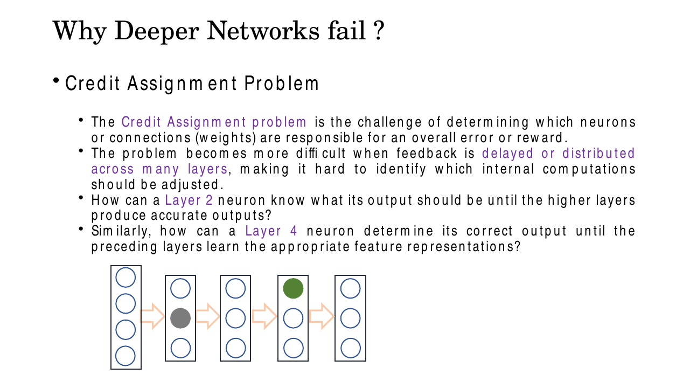
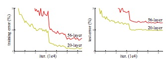
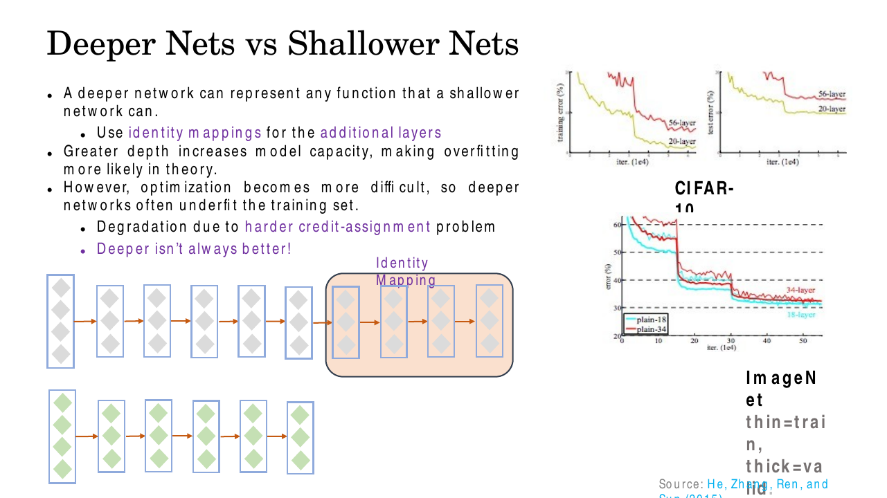
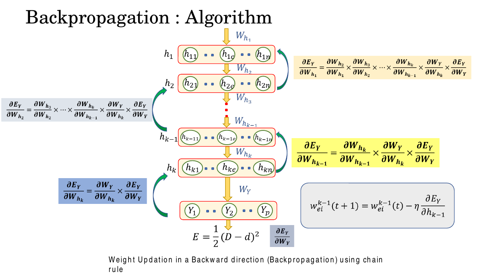
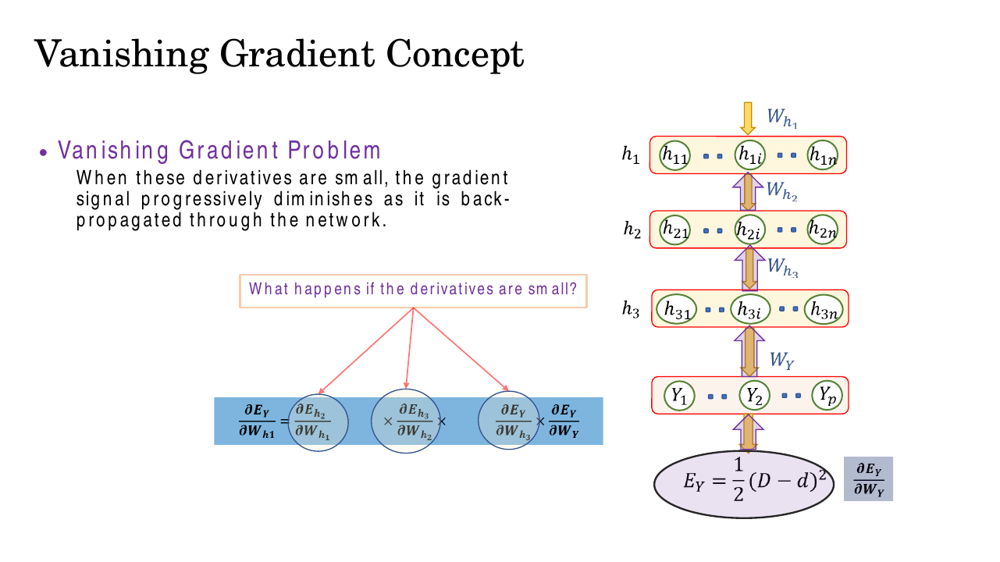
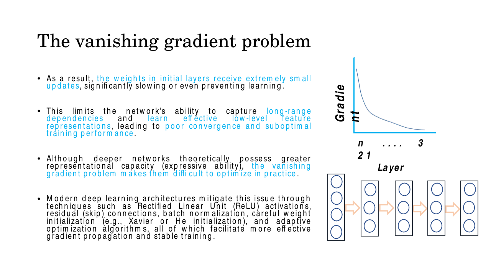
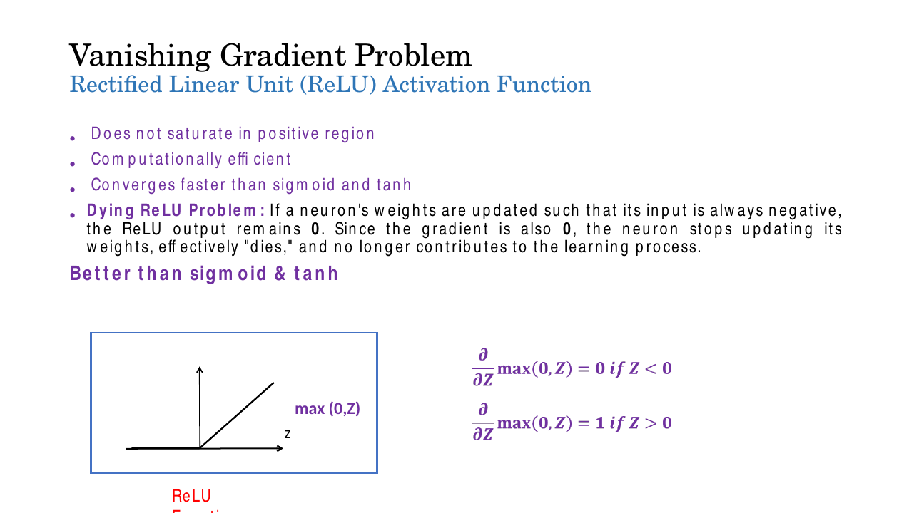
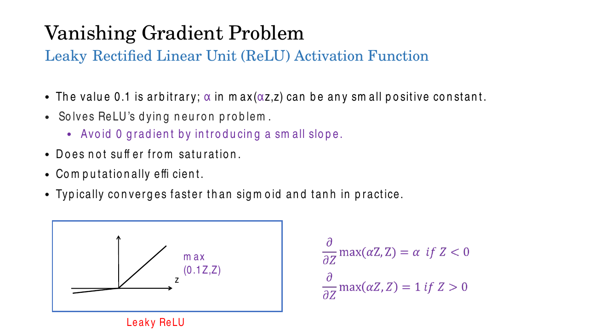
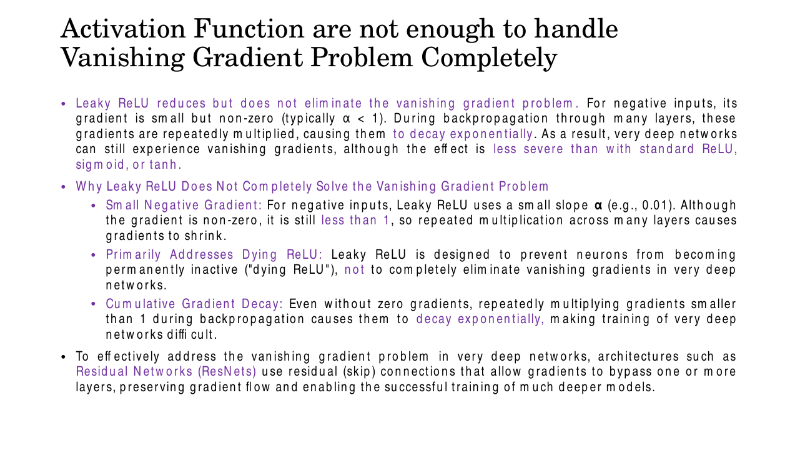
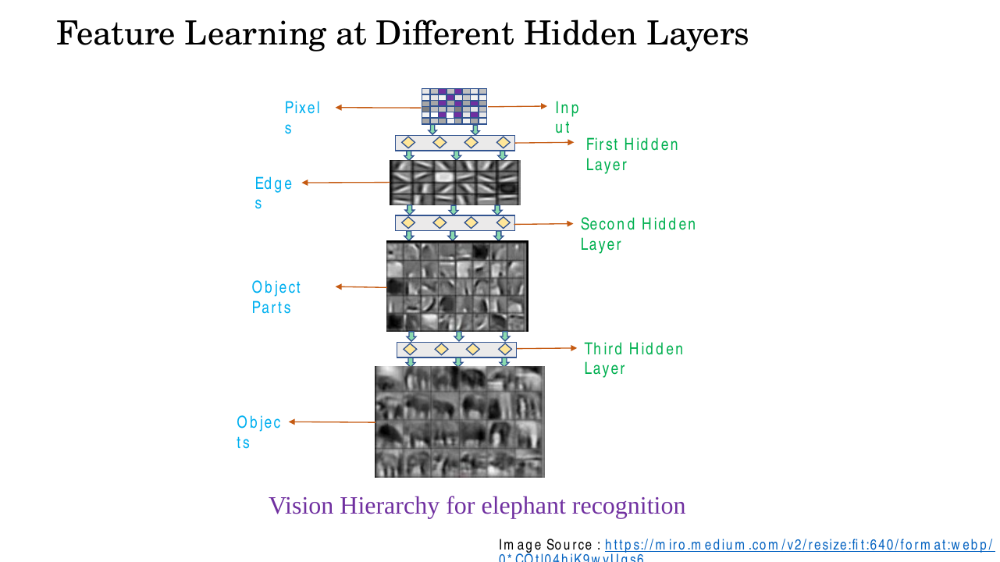

# Lec 13 — CNN Optimization: Vanishing Gradients and Activation Functions

> **Deck:** `W3L4_P3_CNN_Optimization.pptx` · **Week 3** · **Playlist:** Lec 13
> **Prereqs:** [Lec 9 — Backpropagation](../week-02/09-backpropagation.md), [Lec 11 — CNN Basics](11-cnn-basics.md)
> **Feeds into:** [Lec 14 — ResNet](../week-04/14-resnet.md), [Lec 18 — LSTM](../week-05/18-lstm.md)

## Why this lecture exists

You have just seen a decade of architectures get deeper — LeNet 5 layers, AlexNet 8, VGG 19, GoogLeNet
22 — with accuracy improving each time. The obvious next move is to keep stacking. It does not work.
Past a certain depth, plain networks get *worse*, and worse in a way that has nothing to do with the
usual culprit: they fail on the **training** set, where a bigger model should always win.

This chapter explains why. Backpropagation sends the error signal backwards as a *product* of one
factor per layer, and each factor carries an activation derivative. If those derivatives sit below 1,
the product collapses geometrically and the early layers stop learning. The whole activation-function
story — sigmoid, tanh, ReLU, Leaky ReLU — is really a story about keeping that one number near 1.
The deck's punchline is that even the best activation is not enough, which is the problem
[Lec 14](../week-04/14-resnet.md) exists to solve.

## The ideas

### The credit-assignment problem

Training a network means answering one question: *which weight is to blame for this error?* That is
the **credit-assignment problem** — deciding which neurons or connections are responsible for the
overall loss. In a 2-layer net the answer is nearly direct; in a 50-layer net it is not, because the
feedback is both **delayed** and **distributed**. The deck poses it as a chicken-and-egg: how can a
layer-2 neuron know what its output *should* be until the layers above it produce accurate outputs?
And how can a layer-4 neuron settle on its correct output until the layers below it have learned
usable features? Every layer is waiting on every other layer.


*Fig. — The two highlighted neurons are the question: neither can know its target until the other is already right. Backprop's answer is to push a numerical blame signal backwards — and that signal is what decays. Slide 27.*

Backpropagation ([Lec 9](../week-02/09-backpropagation.md)) is the algorithm that answers this
question. It does not fail logically; it fails *numerically*, and that is the subject of this chapter.

### The degradation problem — and why it is not overfitting

Take a 20-layer plain CNN and a 56-layer plain CNN, train both on CIFAR-10, and plot error against
iteration. The 56-layer net is worse. Not just on test error — **on training error too**.


*Fig. — Read the left panel first. The deeper net has **higher training error**. That single fact rules out overfitting as the explanation. He, Zhang, Ren and Sun (2015). Slide 4.*

This is the **degradation problem**, and the distinction you must be able to state is this:

| | Training error | Test error | Gap |
|---|---|---|---|
| **Overfitting** | very **low** | high | large |
| **Degradation** | **high** | high | small |

Overfitting means the model memorised the training set and failed to generalise — it is a
*generalisation* failure, covered in [Lec 10](../week-02/10-overfitting-and-regularization.md).
Degradation is an *optimisation* failure: the model never fit the training set in the first place.
If an exam gives you two nets and the deeper one has higher training error, the answer is degradation,
never overfitting.

The argument that nails it down is the **identity-mapping argument**, the most important paragraph on
this deck. A 56-layer network can represent *any* function a 20-layer network can: copy the 20 layers,
then make the extra 36 layers compute the identity $f(\mathbf{x}) = \mathbf{x}$. So the deeper net's
best achievable training error is, by construction, **less than or equal to** the shallower net's. It
nonetheless scores worse. The deeper net is therefore not failing because it *cannot* represent the
solution — it is failing because gradient descent cannot *find* it.


*Fig. — The ImageNet panel repeats the result on a harder dataset: plain-34 (red) sits above plain-18 (cyan) on both the thin train curves and the thick validation curves. Slide 25.*

### Backprop as a product across layers

Set the notation. A plain feedforward stack of $L$ layers computes

$$\mathbf{z}^{(l)} = \mathbf{W}^{(l)}\mathbf{a}^{(l-1)} + \mathbf{b}^{(l)}, \qquad \mathbf{a}^{(l)} = f\!\left(\mathbf{z}^{(l)}\right)$$

with $\mathbf{a}^{(0)} = \mathbf{x}$ and $f$ the activation, applied element-wise.
[Lec 9](../week-02/09-backpropagation.md) derives the backward recursion; this chapter uses its result.
Writing $\boldsymbol{\delta}^{(l)} = \partial\mathcal{L}/\partial\mathbf{z}^{(l)}$ for the error signal
arriving at layer $l$:

$$\boldsymbol{\delta}^{(l)} = \left(\mathbf{W}^{(l+1)\top}\boldsymbol{\delta}^{(l+1)}\right) \odot f'\!\left(\mathbf{z}^{(l)}\right), \qquad \frac{\partial\mathcal{L}}{\partial \mathbf{W}^{(l)}} = \boldsymbol{\delta}^{(l)}\,\mathbf{a}^{(l-1)\top}$$

where $\odot$ is element-wise multiplication. The deck writes this with $E_Y$ for the loss and
$W_{h_1}, W_{h_2}, \dots$ for the layer weights; translate those to $\mathcal{L}$ and
$\mathbf{W}^{(1)}, \mathbf{W}^{(2)}, \dots$ and the content is identical.


*Fig. — Look at the four boxed formulas. The one for the **last** hidden layer has two factors; the one for the **first** has $k+1$. The gradient at layer 1 is the longest product in the network, and that is the entire problem. Slide 8.*

### The vanishing gradient derivation

Slides 9–14 animate one point by adding a factor at a time. Here is the whole animation collapsed.

Unroll the recursion from the output down to layer $l$. Define the diagonal matrix
$\mathbf{D}^{(k)} = \mathrm{diag}\!\left(f'(\mathbf{z}^{(k)})\right)$. Then

$$\boxed{\ \boldsymbol{\delta}^{(l)} = \left[\prod_{k=l}^{L-1} \mathbf{D}^{(k)}\,\mathbf{W}^{(k+1)\top}\right] \boldsymbol{\delta}^{(L)}\ }$$

The gradient at an early layer is **a product of $L-l$ matrix factors**, not a sum. Products of many
numbers behave very differently from sums: a sum of small things is still something, a product of
small things is nothing.

Strip it to one unit per layer, which is what the exam will give you. With scalar weights $w^{(l)}$:

$$\frac{\partial\mathcal{L}}{\partial w^{(1)}} = \underbrace{\frac{\partial\mathcal{L}}{\partial a^{(L)}}}_{\text{output error}} \cdot \underbrace{\prod_{l=2}^{L}\left[f'\!\left(z^{(l)}\right) w^{(l)}\right]}_{L-1 \text{ identical-looking factors}} \cdot\ f'\!\left(z^{(1)}\right)\, x$$

Every factor has the same shape: **one activation derivative times one weight**. Call its typical
magnitude $\gamma$. Then

$$\left|\frac{\partial\mathcal{L}}{\partial w^{(1)}}\right| \sim \gamma^{\,L-1}$$

and the behaviour splits cleanly in three:

| Regime | Condition | What happens to $\gamma^{L-1}$ as $L$ grows |
|---|---|---|
| **Vanishing** | $\gamma < 1$ | decays geometrically to 0 |
| Stable | $\gamma \approx 1$ | roughly constant |
| **Exploding** | $\gamma > 1$ | grows geometrically to overflow |

There is no middle ground that survives depth, because $\gamma^{L-1}$ is an exponential in $L$.
$\gamma = 0.9$ looks harmless; at $L=100$ it is $2.7\times10^{-5}$.


*Fig. — The deck's own punchline slide, and the one to reproduce in an exam answer: the gradient at the first layer is a **product**, each circled factor contains an activation derivative, and small factors multiply into nothing. Slide 14.*

The practical consequence is uneven training speed. The last layers see a short product and learn
fast; the first layers see the longest product and barely move.


*Fig. — The $x$-axis runs **backwards** (layer $n$ on the left, layer 1 on the right). Gradient magnitude falls off a cliff as you move towards the input. Slide 7.*

### Exploding gradients, the mirror image

The same product with $\gamma > 1$ blows up instead. This happens when the weight matrices have large
spectral norm — common with ReLU, where $f' = 1$ contributes nothing to damping, and endemic in
recurrent networks, where the *same* matrix is reused at every step
([Lec 17](../week-05/17-bptt.md) owns the recurrent case). Symptoms: the loss suddenly becomes `NaN`,
or a single step throws the weights to absurd values.

The standard fix is **gradient clipping**, applied after computing the gradient and before the update.
Two variants:

- **Clip by norm** (the usual one). If $\|\mathbf{g}\| > \tau$, rescale
  $\mathbf{g} \leftarrow \tau\,\mathbf{g}/\|\mathbf{g}\|$. The **direction is preserved**; only the
  length is capped at the threshold $\tau$.
- **Clip by value.** Clamp each component into $[-\tau, \tau]$ independently. Simpler, but it *changes
  the direction* of the update, so it is the less principled choice.

Note the asymmetry: clipping fixes exploding gradients cheaply and completely, but **there is no
equivalent trick for vanishing gradients** — you cannot amplify a gradient that has already decayed to
$10^{-13}$, because the information in it is gone. Vanishing is the harder problem, which is why the
rest of this chapter is about it.

### Why sigmoid is the culprit: the number 0.25

The sigmoid is $\sigma(z) = \dfrac{1}{1+e^{-z}}$, squashing any input into $(0,1)$. Its derivative has
a famously tidy form:

$$\sigma'(z) = \sigma(z)\left[1 - \sigma(z)\right]$$

Write $s = \sigma(z)$. Then $\sigma' = s(1-s)$, a downward parabola in $s$ over $s \in (0,1)$. Maximise
it: $\frac{d}{ds}\left[s - s^2\right] = 1 - 2s = 0 \Rightarrow s = 0.5$, which is $z = 0$. The maximum
value is

$$\sigma'(0) = 0.5 \times 0.5 = \boxed{0.25}$$

**That 0.25 is the number to remember from this lecture.** It is not an average or a typical value —
it is the *ceiling*. The sigmoid derivative is never larger than a quarter, anywhere.

![Slide on the sigmoid problem: the S-curve, the bell-shaped derivative peaking at 0.25, the formula S'(Z)=S(Z)[1−S(Z)], and a gold diamond showing ∂L/∂Z = ∂L/∂S · ∂S/∂Z](../../assets/slides/W3_W3L4_P3_CNN_Optimization/s-17.png)
*Fig. — The gold diamond is the mechanism in one picture: whatever gradient $\partial\mathcal{L}/\partial S$ arrives from the right, it leaves on the left multiplied by $\partial S/\partial Z \le 0.25$. Every sigmoid is a 4× attenuator at best. Slide 17.*

Now feed that ceiling into the product. Assume the best case at every layer — every unit sits exactly
at $z=0$:

$$0.25^{10} = \frac{1}{4^{10}} = \frac{1}{1{,}048{,}576} \approx 9.5\times10^{-7}$$

**Ten sigmoid layers crush the gradient by six orders of magnitude, in the best case.** Reality is
worse, because units do not sit at $z=0$; they saturate towards 0 or 1, where $\sigma' \to 0$, and
the deck's phrase for this is that saturated neurons are "KILLING" the gradient.

There is also a trap hiding in the weights. The full factor is $|w|\cdot\sigma'$, so to keep
$\gamma \ge 1$ you would need $|w| \ge 1/0.25 = 4$. But weights that large drive $z$ far from zero,
which saturates the unit, which drives $\sigma'$ towards 0. Small weights vanish; large weights
saturate. **There is no escape** — the sigmoid cannot be rescued by initialisation.

The deck lists sigmoid's other sins (slide 18):

1. **Saturation at both tails.** $\sigma' \approx 0$ for $|z| \gtrsim 5$ on either side.
2. **Not zero-centred.** Outputs are all positive, so all inputs to the next layer are positive, so
   every weight into a given unit receives a gradient of the same sign at a given step. The update
   can only move all-up or all-down, producing a zig-zag path to the minimum.
3. **$e^x$ is expensive.** An exponential per unit per forward pass, versus a comparison for ReLU.

### tanh: better, but only by a factor of four

$$\tanh(z) = \frac{e^{z}-e^{-z}}{e^{z}+e^{-z}}, \qquad \tanh'(z) = 1 - \tanh^2(z) = \mathrm{sech}^2(z)$$

The deck writes the derivative as $(1+y)(1-y)$ with $y = \tanh(z)$ — expand it and you get $1-y^2$,
the same thing. Slide 19's three claims:

- **Squashes numbers to the range $[-1,1]$.** (Sigmoid's range is $[0,1]$.)
- **Zero-centred — better than the sigmoid.** This kills sin #2 above: outputs can be negative, so
  gradients into a unit are no longer sign-locked.
- **Still kills gradients.** It saturates at both tails exactly like the sigmoid.

The slide also states that tanh "is just a scaled version of the sigmoid", which is literally true:
$\tanh(z) = 2\sigma(2z) - 1$.

Maximum derivative: at $z=0$, $\tanh(0)=0$ so $\tanh'(0) = 1 - 0 = \mathbf{1}$. That is 4× sigmoid's
ceiling, and it is why tanh trains deeper nets than sigmoid. But 1 is reached at *exactly one point*.
At $z=1$, $\tanh'= 1-0.7616^2 = 0.42$; at $z=2$, $1-0.9640^2 = 0.071$. Over a realistic spread of
activations the mean derivative is well below 1, so the product still decays — just more slowly.
**tanh delays the vanishing gradient problem; it does not remove it.**

![Slide on tanh: the S-curve from −1 to 1, the bell-shaped derivative sech²(Z) peaking at 1, and the bullet list "Squashes to [−1 1] / Zero centred / Still kill gradients"](../../assets/slides/W3_W3L4_P3_CNN_Optimization/s-19.png)
*Fig. — Compare this bell with the sigmoid's on slide 17: same shape, same saturation, peak at 1 instead of 0.25. Four times better per layer, which at depth 20 is $4^{20} \approx 10^{12}$ times better overall — but still not 1. Slide 19.*

### ReLU: the breakthrough

$$f(z) = \max(0, z), \qquad f'(z) = \begin{cases} 1 & z > 0 \\ 0 & z < 0 \end{cases}$$

The derivative is **exactly 1** on the positive side. Not 0.97, not "close to 1" — identically 1, for
every positive input, no matter how large. A chain of ReLU units whose inputs are positive multiplies
the gradient by $1 \times 1 \times \cdots \times 1$ and passes it through **undamped**. That is the
whole breakthrough, and it is why deep nets became trainable.

The deck's four claims (slide 20):

- **Does not saturate in the positive region** — the function is unbounded above, so there is no tail
  for $f'$ to flatten in.
- **Computationally efficient** — one comparison, no exponential.
- **Converges faster than sigmoid and tanh** — empirically several times faster to a given loss.
- **Sparsity-inducing** — roughly half the units output exactly 0, which makes representations sparse
  and cheap.


*Fig. — The two derivative lines are the whole function. Note that $f'(0)$ is undefined — the kink — and frameworks arbitrarily define it as 0. Slide 20.*

**The dying ReLU problem.** The price of that hard zero on the left. If a unit's weights get updated
such that its pre-activation $z$ is negative *for every input in the dataset*, then its output is
always 0 and — crucially — its gradient is always 0 too. A zero gradient means zero update, so the
weights never change, so $z$ stays negative forever. The unit is **permanently dead**: it contributes
nothing to the forward pass and receives nothing on the backward pass, for the rest of training.
Unlike saturation, which is input-dependent and reversible, death is permanent. A large learning rate
makes it far more likely, because one oversized step can push a unit's bias deeply negative.

### Leaky ReLU, PReLU, ELU

Leaky ReLU removes the hard zero by giving the negative side a small slope:

$$f(z) = \max(\alpha z,\ z), \qquad f'(z) = \begin{cases} 1 & z > 0 \\ \alpha & z < 0 \end{cases}$$

The deck draws it as $\max(0.1z, z)$ and then says something precise that is worth quoting:
**"The value 0.1 is arbitrary; $\alpha$ in $\max(\alpha z, z)$ can be any small positive constant."**
Do not memorise 0.1 as *the* value — 0.01 is the more common default in practice, and the deck itself
uses 0.01 in its text on slide 22. What matters is $0 < \alpha < 1$.

Because $f'$ is now $\alpha \neq 0$ rather than $0$ on the negative side, a unit in the negative region
still receives gradient and can climb back out. That **solves the dying neuron problem**. The slide's
other claims — does not saturate, computationally efficient, converges faster than sigmoid and tanh —
all follow from the function being piecewise linear.


*Fig. — The only difference from slide 20 is that the left arm has a slope instead of lying flat. That tiny slope is the difference between a dead unit and a slow unit. Slide 21.*

Two variants the deck does not draw but that belong to the same family:

- **PReLU** (Parametric ReLU): identical to Leaky ReLU, except $\alpha$ is a **learned parameter**,
  trained by backprop alongside the weights (typically one $\alpha$ per channel). Removes the need to
  guess a value.
- **ELU** (Exponential Linear Unit): $f(z) = z$ for $z>0$ and $\alpha(e^{z}-1)$ for $z \le 0$, so
  $f'(z) = f(z) + \alpha$ on the negative side. Outputs saturate smoothly to $-\alpha$ instead of
  growing linearly, which pushes the mean activation towards zero. It costs an exponential, so it
  trades ReLU's speed for a better-centred output.

### Activation comparison table

| | Formula | Range | Derivative | Max $f'$ | Saturates? | Zero-centred? | Main problem |
|---|---|---|---|---|---|---|---|
| **Sigmoid** | $\dfrac{1}{1+e^{-z}}$ | $(0,1)$ | $\sigma(1-\sigma)$ | **0.25** | both tails | **no** | kills gradients; $e^x$ cost |
| **tanh** | $\dfrac{e^z-e^{-z}}{e^z+e^{-z}}$ | $(-1,1)$ | $1-\tanh^2 z$ | **1** (at $z=0$ only) | both tails | **yes** | still saturates |
| **ReLU** | $\max(0,z)$ | $[0,\infty)$ | 1 if $z>0$, 0 if $z<0$ | **1** (everywhere $z>0$) | negative side only | no | **dying ReLU** |
| **Leaky ReLU** | $\max(\alpha z, z)$ | $(-\infty,\infty)$ | 1 if $z>0$, $\alpha$ if $z<0$ | **1** | no | approximately | $\alpha<1$ still shrinks |
| **PReLU** | $\max(\alpha z, z)$, $\alpha$ learned | $(-\infty,\infty)$ | 1 or learned $\alpha$ | **1** | no | approximately | extra parameters |
| **ELU** | $z$ / $\alpha(e^z-1)$ | $(-\alpha,\infty)$ | 1 or $f(z)+\alpha$ | **1** | negative side (to $-\alpha$) | approximately | $e^x$ cost |

### The punchline: activations are not enough

This is the thesis of the lecture, stated on slide 22 as a heading:
**"Activation Functions are not enough to handle the Vanishing Gradient Problem completely."**

The deck argues it through Leaky ReLU, the best of the set:

1. **Small negative gradient.** On the negative side the gradient is $\alpha$, non-zero but still
   **less than 1**. Multiply it across many layers and it decays exponentially — the same product, the
   same geometry, just a gentler ratio. With $\alpha = 0.01$, ten negative-side layers give
   $10^{-20}$.
2. **It primarily addresses dying ReLU.** Leaky ReLU was designed to stop units going permanently
   inactive, *not* to eliminate vanishing gradients in very deep nets. Right fix, different problem.
3. **Cumulative gradient decay.** Even with no zero gradients anywhere, repeatedly multiplying
   anything below 1 decays exponentially. And the weight factors $\|\mathbf{W}^{(l)}\|$ are in the
   product too — the activation only controls one of the two terms.


*Fig. — The last bullet names the answer: residual (skip) connections let gradients **bypass** layers entirely rather than being attenuated by them. That is [Lec 14](../week-04/14-resnet.md)'s subject. Slide 22.*

The fix the deck points to is architectural: **residual (skip) connections**, which let gradients
bypass one or more layers so the long product is never formed.
[Lec 14](../week-04/14-resnet.md) derives how. The deck's full problem/solution lists for deep networks
(slide 26) are worth memorising as a pair: *problems* — vanishing/exploding gradients, internal
covariate shift, overfitting, computation cost; *solutions* — proper activation choice, batch
normalisation, parameter initialisation, dropout, weight sharing, data augmentation.

### What the early layers were supposed to learn

Why does it matter that the *first* layers are the ones that freeze? Because of what they hold. A
trained vision network learns a hierarchy: layer 1 responds to **edges**, layer 2 assembles them into
**textures and object parts**, layer 3 into whole **objects**. The deck shows the same hierarchy for
handwritten text: pixels → edges → strokes → letters → words.


*Fig. — Each level is built from the one below it. A vanishing gradient freezes the **bottom** of this stack, so the layers above are forced to build objects out of random untrained edge detectors. Slide 30.*

The hierarchy is built bottom-up, so a frozen bottom poisons everything above it. That is the real
cost of the vanishing gradient — not slow training, but a network that cannot learn its own
foundations.

## Worked numericals

### N1. The sigmoid derivative and its 0.25 ceiling
**Given:** $\sigma(z) = 1/(1+e^{-z})$, $\sigma'(z) = \sigma(z)[1-\sigma(z)]$.
**Find:** $\sigma'(z)$ at $z = 0, 1, 2, 4, 6$, and confirm the maximum.

1. $z=0$: $\sigma = 1/(1+1) = 0.5$, so $\sigma' = 0.5\times0.5 = \mathbf{0.2500}$.
2. $z=1$: $e^{-1}=0.3679$, $\sigma = 1/1.3679 = 0.7311$, so $\sigma' = 0.7311\times0.2689 = \mathbf{0.1966}$.
3. $z=2$: $e^{-2}=0.1353$, $\sigma = 1/1.1353 = 0.8808$, so $\sigma' = 0.8808\times0.1192 = \mathbf{0.1050}$.
4. $z=4$: $e^{-4}=0.0183$, $\sigma = 0.9820$, so $\sigma' = 0.9820\times0.0180 = \mathbf{0.0177}$.
5. $z=6$: $\sigma = 0.9975$, so $\sigma' = 0.9975\times0.0025 = \mathbf{0.0025}$.
6. Maximise algebraically: with $s = \sigma(z)$, $\sigma' = s - s^2$ and $d\sigma'/ds = 1-2s = 0$ gives $s = 0.5$, i.e. $z=0$, value $0.25$.
7. Symmetry check: $\sigma'(-2) = \sigma'(2) = 0.1050$, since $\sigma(-z) = 1-\sigma(z)$ leaves $s(1-s)$ unchanged.

**Answer:** $\sigma'$ peaks at exactly **0.25** at $z=0$ and falls off symmetrically — already down
$2.4\times$ at $|z|=2$ and $100\times$ at $|z|=6$.

### N2. Surviving gradient fraction through a sigmoid stack
**Given:** a plain net with sigmoid activations and weights scaled so each per-layer factor equals the
*best case* $\sigma'_{\max} = 0.25$. A gradient of magnitude $1.0$ leaves the output layer.
**Find:** the fraction surviving at depths 1, 2, 5, 10, 15, 20.

1. The surviving fraction after $d$ layers is $0.25^{d}$.
2. $0.25^{1}=2.50\times10^{-1}$ &nbsp; 3. $0.25^{2}=6.25\times10^{-2}$ &nbsp; 4. $0.25^{5}=1/1024=9.77\times10^{-4}$
5. $0.25^{10} = 1/1{,}048{,}576 = 9.54\times10^{-7}$
6. $0.25^{15} = 9.31\times10^{-10}$ &nbsp; 7. $0.25^{20} = 9.09\times10^{-13}$

| Depth $d$ | $0.25^{d}$ | Orders of magnitude lost |
|---|---|---|
| 1 | $2.5\times10^{-1}$ | 0.6 |
| 2 | $6.25\times10^{-2}$ | 1.2 |
| 5 | $9.77\times10^{-4}$ | 3.0 |
| **10** | $\mathbf{9.54\times10^{-7}}$ | **6.0** |
| 15 | $9.31\times10^{-10}$ | 9.0 |
| 20 | $9.09\times10^{-13}$ | 12.0 |

8. With $\eta = 0.01$ and a depth-20 gradient of $9.09\times10^{-13}$, one weight update is
   $\Delta w = 9.09\times10^{-15}$ — below `float32` resolution relative to a weight of order 0.1.

**Answer:** **$0.25^{10} \approx 9.5\times10^{-7}$** — ten sigmoid layers cost six orders of magnitude,
and this is the *optimistic* bound. At depth 20 the update is numerically indistinguishable from zero.

### N3. The same stack with ReLU
**Given:** the same net with ReLU, all pre-activations positive so $f' = 1$.
**Find:** the surviving fraction at depths 10 and 20, first with weight factor $|w|=1$, then $|w|=0.9$.

1. $|w|=1$: per-layer factor $= f' \times |w| = 1 \times 1 = 1$. Depth 10: $1^{10} = \mathbf{1.0}$. Depth 20: $1^{20} = \mathbf{1.0}$. **No decay at any depth.**
2. $|w|=0.9$: factor $= 1 \times 0.9 = 0.9$. $0.9^{10} = 0.3487$; $0.9^{20} = 0.1216$.
3. Compare at depth 20: ReLU $0.1216$ versus sigmoid $9.09\times10^{-13}$ — a ratio of $1.3\times10^{11}$.

**Answer:** ReLU with $|w|=1$ gives **exactly 1.0 at every depth**; even with $|w|=0.9$ it retains
**12%** at depth 20 where sigmoid retains $9\times10^{-11}$%. Removing the $0.25$ is the entire gain.

### N4. Exploding gradient and clipping
**Given:** a 10-layer ReLU stack with per-layer factor $\gamma = 1.8$ (large weights). Output-layer
gradient magnitude $0.5$. Learning rate $\eta = 0.01$. Clipping threshold $\tau = 5$.
**Find:** the gradient at layer 1, the weight update with and without clipping.

1. $1.8^{2} = 3.24$; $1.8^{4} = 3.24^2 = 10.4976$; $1.8^{5} = 10.4976\times1.8 = 18.8957$.
2. $1.8^{10} = 18.8957^2 = 357.05$.
3. Gradient at layer 1: $\|\mathbf{g}\| = 0.5 \times 357.05 = \mathbf{178.5}$.
4. Update without clipping: $\Delta w = \eta\|\mathbf{g}\| = 0.01 \times 178.5 = \mathbf{1.785}$ — larger than most weights, so the step overshoots wildly.
5. Clip by norm: $\|\mathbf{g}\| = 178.5 > \tau = 5$, so scale by $\tau/\|\mathbf{g}\| = 5/178.5 = 0.02801$.
6. Clipped gradient norm: $178.5 \times 0.02801 = \mathbf{5.00}$ — exactly $\tau$, direction unchanged.
7. Update with clipping: $\Delta w = 0.01 \times 5 = \mathbf{0.05}$.

**Answer:** The raw update is $1.785$; clipping at $\tau=5$ reduces it to $0.05$, a **35.7× reduction**,
while preserving the update direction exactly.

### N5. Identify the dying ReLU unit
**Given:** two ReLU units in layer 3, fed by a ReLU layer whose outputs are therefore non-negative and
observed to lie in $[0, 2]$ for every training input.
Unit A: $\mathbf{w}_A = [0.3,\ -0.8,\ -0.5]$, $b_A = -1.0$.
Unit B: $\mathbf{w}_B = [0.7,\ -0.2,\ 0.5]$, $b_B = -0.3$.
**Find:** which unit is dead.

1. $z$ is maximised by putting each input at whichever end of $[0,2]$ its weight prefers: $x_i = 2$ if $w_i > 0$, $x_i = 0$ if $w_i < 0$.
2. Unit A, best case: $z_A^{\max} = 0.3(2) + (-0.8)(0) + (-0.5)(0) - 1.0 = 0.6 - 1.0 = \mathbf{-0.4}$.
3. Since the *maximum possible* $z_A$ is $-0.4 < 0$, $z_A < 0$ for **every** input. Output $= \max(0,z_A) = 0$ always, and $f'(z_A) = 0$ always.
4. Zero gradient $\Rightarrow$ $\Delta\mathbf{w}_A = -\eta \cdot 0 = \mathbf{0}$ $\Rightarrow$ $\mathbf{w}_A$ and $b_A$ never change $\Rightarrow$ $z_A$ stays negative. Permanent.
5. Unit B, best case: $z_B^{\max} = 0.7(2) + (-0.2)(0) + 0.5(2) - 0.3 = 1.4 + 1.0 - 0.3 = \mathbf{+2.1} > 0$.
6. Unit B activates for at least some inputs, so it receives gradient and keeps learning.
7. With Leaky ReLU ($\alpha = 0.01$) unit A's derivative would be $0.01$ rather than $0$, so $\Delta\mathbf{w}_A \neq 0$ and it could recover.

**Answer:** **Unit A is dead** ($z_A \le -0.4 < 0$ for all inputs, so output and gradient are both
identically 0, permanently). Unit B is healthy. Leaky ReLU would revive A.

## Code

```python
import numpy as np

def sigmoid(z): return 1.0 / (1.0 + np.exp(-z))

def grad_norm_at_layer1(depth, act, n=64, seed=0):
    """Width-n plain chain. Forward once, then backprop and report ||dL/dx||."""
    rng = np.random.default_rng(seed)
    # Xavier for sigmoid, He for ReLU -- the standard scalings
    s = np.sqrt(1.0 / n) if act == "sigmoid" else np.sqrt(2.0 / n)
    W  = [rng.normal(0, s, size=(n, n)) for _ in range(depth)]
    a  = rng.normal(0, 1, size=n)
    fp = []                                     # cached f'(z) per layer
    for l in range(depth):
        z = W[l] @ a
        if act == "sigmoid":
            a = sigmoid(z);  fp.append(a * (1 - a))      # sigma' = s(1-s)
        else:
            a = np.maximum(0, z); fp.append((z > 0).astype(float))  # ReLU' = 0/1
    d = np.ones(n) / np.sqrt(n)                 # unit-norm gradient at the output
    for l in reversed(range(depth)):
        d = W[l].T @ (d * fp[l])                # delta propagated one layer back
    return np.linalg.norm(d)

print(" depth | 0.25^depth (sigmoid ceiling) | sigmoid ||grad|| | ReLU ||grad||")
for L in (1, 2, 5, 10, 20, 30):
    print(f" {L:5d} | {0.25**L:27.3e} | {grad_norm_at_layer1(L,'sigmoid'):16.3e} |"
          f" {grad_norm_at_layer1(L,'relu'):13.3e}")
```

```
 depth | 0.25^depth (sigmoid ceiling) | sigmoid ||grad|| | ReLU ||grad||
     1 |                   2.500e-01 |        2.222e-01 |     1.116e+00
     2 |                   6.250e-02 |        4.568e-02 |     1.436e+00
     5 |                   9.766e-04 |        6.090e-04 |     1.762e+00
    10 |                   9.537e-07 |        4.020e-07 |     3.944e+00
    20 |                   9.095e-13 |        2.125e-13 |     2.383e+00
    30 |                   8.674e-19 |        5.722e-20 |     2.265e+00
```

Two things to notice. First, the sigmoid column **tracks $0.25^{\text{depth}}$ almost exactly** — the
hand analysis in N2 is not a loose bound, it is what actually happens. Second, the ReLU column stays
$O(1)$ at every depth: it wanders, but it does not decay. At depth 30 the sigmoid gradient is
$5.7\times10^{-20}$ and the ReLU gradient is $2.3$, a gap of twenty orders of magnitude from a
one-line change to the activation.

## Exam pack

### Must-memorise

| Item | Exactly this |
|---|---|
| Backward recursion | $\boldsymbol{\delta}^{(l)} = \left(\mathbf{W}^{(l+1)\top}\boldsymbol{\delta}^{(l+1)}\right)\odot f'(\mathbf{z}^{(l)})$ |
| Gradient as a product | $\boldsymbol{\delta}^{(l)} = \left[\prod_{k=l}^{L-1}\mathbf{D}^{(k)}\mathbf{W}^{(k+1)\top}\right]\boldsymbol{\delta}^{(L)}$, $\mathbf{D}^{(k)}=\mathrm{diag}(f'(\mathbf{z}^{(k)}))$ |
| Decay law | $\left\lvert \partial\mathcal{L}/\partial w^{(1)}\right\rvert  \sim \gamma^{L-1}$; $\gamma<1$ vanishes, $\gamma>1$ explodes |
| Sigmoid | $\sigma(z) = 1/(1+e^{-z})$, range $(0,1)$ |
| Sigmoid derivative | $\sigma'(z) = \sigma(z)[1-\sigma(z)]$, **max $=0.25$ at $z=0$** |
| tanh derivative | $1-\tanh^2 z = \mathrm{sech}^2 z$, max $=1$ at $z=0$ |
| tanh ↔ sigmoid | $\tanh(z) = 2\sigma(2z)-1$ |
| ReLU | $f(z)=\max(0,z)$; $f'=1$ for $z>0$, $f'=0$ for $z<0$ |
| Leaky ReLU | $f(z)=\max(\alpha z, z)$; $f'=1$ for $z>0$, $f'=\alpha$ for $z<0$; **$\alpha$ is any small positive constant** |
| ELU | $f(z)=z$ for $z>0$, $\alpha(e^{z}-1)$ for $z\le0$ |
| Dying ReLU | input always negative $\Rightarrow$ output 0 **and** gradient 0 $\Rightarrow$ weights frozen permanently |
| Clip by norm | if $\|\mathbf{g}\|>\tau$ then $\mathbf{g}\leftarrow\tau\mathbf{g}/\|\mathbf{g}\|$ — direction preserved |
| Degradation | deeper plain net has **higher training error** than shallower — an optimisation failure, not overfitting |
| Identity-mapping argument | a deeper net can emulate a shallower one with identity layers, so its optimum is no worse; it still trains worse |

### Numbers worth knowing

| Quantity | Value |
|---|---|
| Max sigmoid derivative | **0.25** (at $z=0$, where $\sigma=0.5$) |
| Max tanh derivative | **1** (at $z=0$) |
| ReLU derivative for $z>0$ | **1** exactly |
| $0.25^{10}$ | $9.54\times10^{-7}$ ≈ **six orders of magnitude** |
| $0.25^{20}$ | $9.09\times10^{-13}$ |
| $0.25^{5}$ | $1/1024 = 9.77\times10^{-4}$ |
| Deck's Leaky ReLU slope drawn | $0.1$ (explicitly "arbitrary"); common default $0.01$ |
| Sigmoid range / tanh range | $(0,1)$ / $(-1,1)$ |
| Weight needed to offset $\sigma'_{\max}$ | $\mid w\mid  \ge 1/0.25 = 4$ |
| Deck's degradation experiment | CIFAR-10: **20-layer vs 56-layer**; ImageNet: **plain-18 vs plain-34** |
| Degradation source | He, Zhang, Ren and Sun, **2015** |
| Feature hierarchy (deck slide 30) | pixels → edges → object parts → objects |

### Likely MCQ traps

- **"Deeper nets fail because of overfitting."** False, and this is the single most examinable
  discrimination in the lecture. Overfitting lowers training error. Degradation raises it. If the
  deeper net's **training** error is higher, it is degradation.
- **"The maximum sigmoid derivative is 0.5."** No. $0.5$ is $\sigma(0)$, the function value. The
  *derivative* there is $0.5\times0.5 = 0.25$.
- **"tanh solves the vanishing gradient problem."** No. It is zero-centred and its peak derivative is
  1 instead of 0.25, so it is better — but it still saturates at both tails. It delays the problem.
- **"ReLU has derivative 1 everywhere."** Only for $z>0$. For $z<0$ it is 0, and at $z=0$ it is
  undefined (frameworks pick 0 by convention).
- **"Leaky ReLU eliminates vanishing gradients."** No — slide 22 exists to say otherwise. $\alpha<1$,
  so the product still decays; Leaky ReLU fixes **dying ReLU**, a different problem.
- **"Dying ReLU and saturation are the same thing."** No. Saturation is input-dependent and reversible
  (a different input unsaturates the unit). Death is permanent, because zero gradient means the
  weights can never change.
- **"The Leaky ReLU slope must be 0.1."** No — the deck says explicitly that 0.1 is arbitrary and
  $\alpha$ can be any small positive constant.
- **"The gradient at layer 1 is a sum of per-layer terms."** It is a **product**. Sums degrade
  gracefully; products collapse geometrically.
- **"Gradient clipping fixes vanishing gradients."** No — clipping only caps gradients that are too
  *large*. There is no corresponding cure for gradients that have already decayed.
- **"Sigmoid is zero-centred."** No, its outputs are all in $(0,1)$. tanh is the zero-centred one.

### Self-test

1. State the maximum value of $\sigma'(z)$, the value of $z$ at which it occurs, and the value of $\sigma(z)$ there.
2. A 12-layer sigmoid net achieves the maximum derivative at every layer. By what factor is the layer-1 gradient attenuated relative to the output?
3. Two networks, 18 and 34 layers, plain. The 34-layer has higher training *and* test error. Name the phenomenon and say what it is not.
4. Why does the identity-mapping argument prove the failure is optimisation and not representation?
5. A ReLU unit has $\mathbf{w} = [0.2, -0.6]$, $b = -0.5$, and its inputs are non-negative with maximum 1. Is it dead? Show the arithmetic.
6. A 6-layer chain has per-layer factor $1.5$ and output gradient $2.0$. Compute the layer-1 gradient, then the result of clipping by norm at $\tau = 10$.
7. Why does Leaky ReLU fix dying ReLU but not vanishing gradients?
8. Give two reasons, other than its derivative ceiling, that the deck lists against sigmoid.
9. tanh's maximum derivative is 1, four times sigmoid's. Over 20 layers, how much better is that in the best case?
10. What range does Leaky ReLU output over, and how does that differ from ReLU?

<details><summary>Answers</summary>

1. Max $\sigma' = 0.25$, at $z = 0$, where $\sigma(0) = 0.5$. ($0.5 \times 0.5 = 0.25$.)
2. $0.25^{12} = 1/4^{12} = 1/16{,}777{,}216 = 5.96\times10^{-8}$ — roughly $6\times10^{-8}$, i.e. seven orders of magnitude.
3. The **degradation problem**. It is **not** overfitting — overfitting would show *lower* training error for the bigger model.
4. Because the deeper net can represent everything the shallower net can (set the extra layers to identity), its optimal training error is provably no worse. If it nevertheless trains to a worse error, the optimiser is failing to find a solution that demonstrably exists.
5. $z^{\max} = 0.2(1) + (-0.6)(0) - 0.5 = 0.2 - 0.5 = -0.3 < 0$. Yes, dead — $z<0$ for every input, so output and gradient are both always 0.
6. $1.5^6 = 11.39$; gradient $= 2.0 \times 11.39 = 22.78$. Since $22.78 > 10$, scale by $10/22.78 = 0.4390$, giving a clipped norm of exactly $10$ with the direction unchanged.
7. Dying ReLU is caused by a gradient of exactly **zero**; $\alpha > 0$ removes the zero. Vanishing is caused by factors **less than one**; $\alpha < 1$ is still less than one, so the product still decays.
8. Not zero-centred (sign-locked gradients, zig-zag updates), and $e^x$ is expensive to compute. (Also: saturates at both tails.)
9. $(1/0.25)^{20} = 4^{20} \approx 1.1\times10^{12}$ — about a trillion times better. Still not enough, because 1 is reached only at $z=0$.
10. Leaky ReLU outputs $(-\infty, \infty)$; ReLU outputs $[0,\infty)$. Leaky ReLU can produce negative values, which is why its gradient on the negative side is non-zero.

</details>

## Beyond the slides

**Gap:** The deck never gives a *condition* for vanishing — it says "derivatives less than one" without
combining them with the weight magnitudes.
**Why it matters:** The per-layer factor is $f'(z)\cdot\|\mathbf{W}\|$, not $f'(z)$ alone. This is why
initialisation schemes exist: Xavier sets $\mathrm{Var}(w) = 1/n_{\text{in}}$ and He sets
$2/n_{\text{in}}$ precisely to push $\gamma$ towards 1. Without this you cannot explain why ReLU still
needs He initialisation.

**Gap:** Exploding gradients appear only as two words in the problem list on slide 26 and are never
explained or fixed.
**Why it matters:** It is the exact mirror of the vanishing case and the examinable pair. Gradient
clipping ($\mathbf{g} \leftarrow \tau\mathbf{g}/\|\mathbf{g}\|$) is the standard answer, and
[Lec 17](../week-05/17-bptt.md) relies on it for RNNs.

**Gap:** PReLU and ELU are not drawn, even though the deck's remedy set otherwise matches the standard
list.
**Why it matters:** Both are standard MCQ options. PReLU = Leaky ReLU with a *learned* $\alpha$;
ELU saturates smoothly to $-\alpha$ on the negative side. Knowing which one learns its parameter is
the discriminating detail.

**Gap:** The deck asserts $f'(0)$ implicitly by splitting ReLU's derivative into $z>0$ and $z<0$ and
saying nothing about $z=0$.
**Why it matters:** ReLU is not differentiable at the kink. In practice frameworks define $f'(0)=0$
(PyTorch and TensorFlow both do), and a question can key on this.

## Cut from the slides

Dropped the title slide (1), the Content slide (2), the Summary slide (23, a verbatim repeat of 2) and
the "Next: Residual Network" slide (24) — pure navigation. Slide 3's prose comparison of deep versus
shallow nets is background that slides 4–5 make quantitative, so it is folded into the degradation
section. Slides 9–13 are a five-step PowerPoint build-up adding one chain-rule factor at a time to the
same diagram; they are collapsed into the derivation above plus slide 14, the finished frame. Slide 15
restates slide 7 in words and is merged with it. Slide 16 previews the four activation plots that
slides 17–21 then show individually, so the individual slides are used. Slides 26–28 repeat the
degradation, credit-assignment and vanishing-gradient material from slides 4–7 as a recap placed after
the "Next lecture" slide; their unique content (slide 26's problem/solution lists, slide 27's
credit-assignment framing) is kept and the duplication dropped. Slide 29 is the handwritten-text
version of slide 30's feature hierarchy, so only slide 30 is shown and slide 29's pixels → edges →
strokes → letters → words chain is quoted in the text. Nothing mathematical was dropped.
