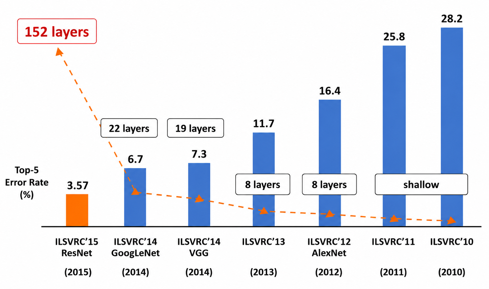
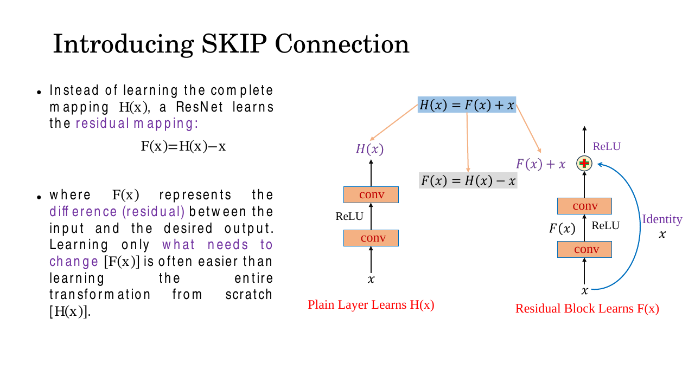
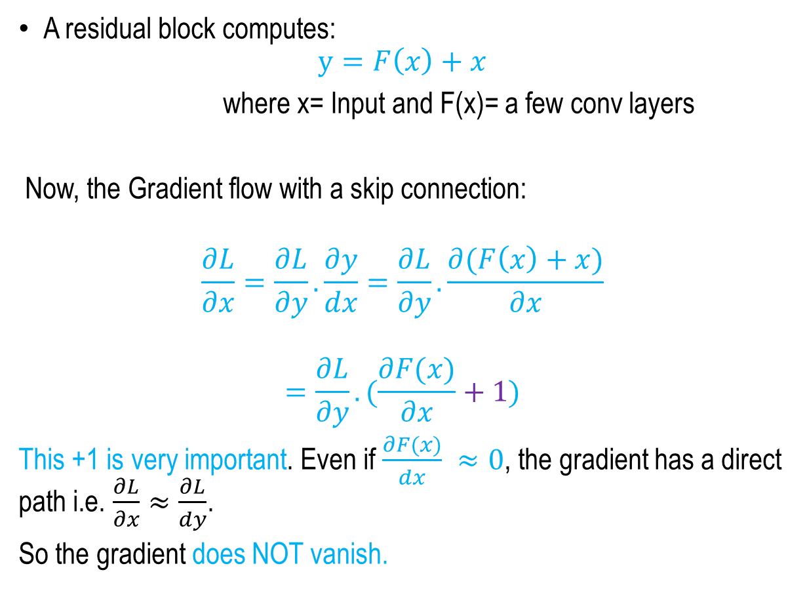
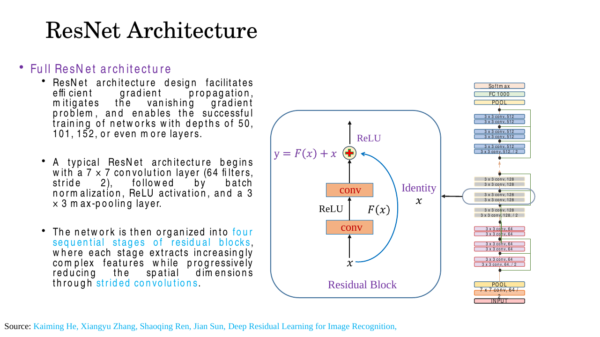
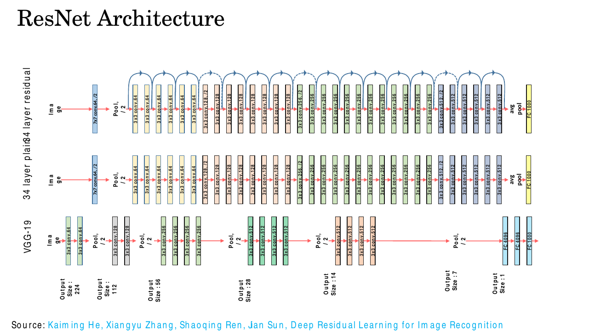
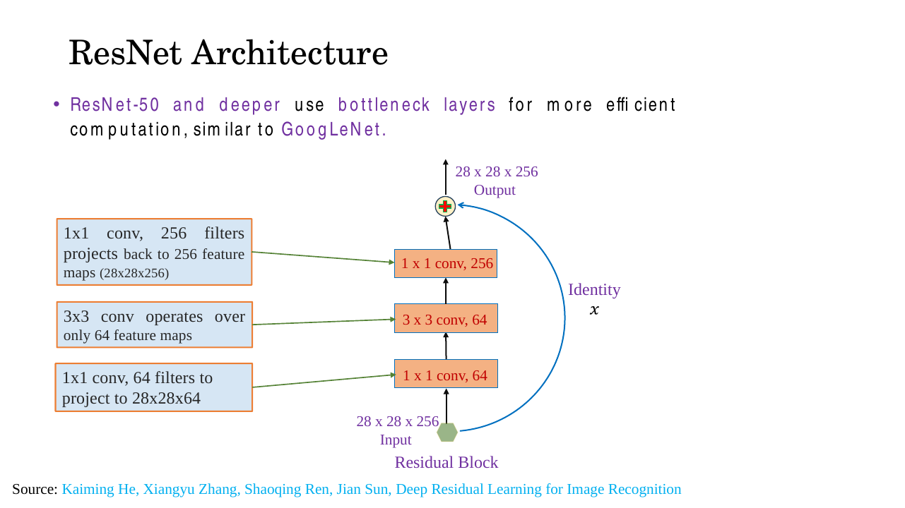

# Lec 14 — CNN with Residual Connections (ResNet)

> **Deck:** `W4L5_P1_ResNet.pptx` · **Week 4** · **Playlist:** Lec 14
> **Prereqs:** [Lec 13 — Vanishing Gradients and Activations](../week-03/13-vanishing-gradients-activations.md), [Lec 12 — CNN Architectures](../week-03/12-cnn-architectures.md)
> **Feeds into:** [Lec 15 — DenseNet, MobileNet, EfficientNet](15-densenet-mobilenet-efficientnet.md), [Lec 27 — Decoder and the Full Transformer](../week-07/27-decoder-and-full-transformer.md)

## Why this lecture exists

The previous chapter left you with a debt. It showed that backpropagating through $N$ layers
multiplies $N$ derivatives together, that each is smaller than 1, and that the product therefore dies
exponentially with depth. Then it offered ReLU and Leaky ReLU as repairs, and admitted they are
partial: a Leaky ReLU slope of $\alpha = 0.01$ is still less than 1, so fifty in series still
annihilate the signal. Worse, deep plain networks were observed to get *worse* training error than
shallow ones, which no activation-function tuning explains.

This lecture pays the debt. One architectural change — adding the block's input to its output —
turns the product of derivatives into a product of terms that each contain an explicit $+1$. That
single term is why a 152-layer network could be trained at all, and why it won ILSVRC 2015 at 3.6%
top-5 error, below the 5.1% a human scores.

## The ideas

### The scoreboard that frames everything

The deck opens with the full ILSVRC (ImageNet Large Scale Visual Recognition Challenge) timeline, and
it is the single most MCQ-dense object in the course. **This is the book's canonical version of the
table** — other chapters cite single rows from it.


*Fig. — Read it right-to-left: this chart runs backwards in time. The depth callouts are the real story — error falls exactly as depth rises, and the orange bar is 152 layers deep. Slide 3.*

| Year | Winner | Top-5 error (%) | Depth |
|---|---|---|---|
| 2010 | shallow (hand-crafted features + SVM) | 28.2 | shallow |
| 2011 | shallow | 25.8 | shallow |
| 2012 | **AlexNet** — first CNN-based winner | 16.4 | 8 |
| 2013 | OverFeat 13.6 / **Clarifai (ZFNet)** 11.7 | 11.7 | 8 |
| 2014 | VGG 7.3 / **GoogLeNet** 6.7 | 6.7 | 19 / 22 |
| 2015 | **ResNet** | 3.6 | 152 |
| — | **human benchmark** | 5.1 | — |

Two notes before an exam. This deck prints ResNet's error as **3.57**; the course's other chart
(Lec 1, slide 5) rounds it to **3.6** — the same number, not two results. And **the Lec 1 chart's
y-axis is mislabelled "Accuracy (Top-5 error)"** while this deck's is labelled correctly as "Top-5
Error Rate (%)". Always read these bars as error: lower is better.

The depth column is the argument. Going 8 → 19 → 22 bought large gains, so the obvious next move is
to go deeper still. That is exactly what did not work.

### Why deeper stopped working

Slide 4 names four challenges for deep networks, and they are not the same problem wearing four hats:

| Challenge | What actually breaks |
|---|---|
| **Vanishing gradients** | Backward signal decays exponentially with depth; early layers barely update |
| **Optimization problem** | Extra layers make the network *harder to train* — it fails to learn even the identity mapping |
| **Overfitting** | Capacity outruns the data ([Lec 10](../week-02/10-overfitting-and-regularization.md)) |
| **Internal covariate shift** | Each layer's input distribution keeps moving as the layers below it learn |

Row 2 is the one to stare at. It is the **degradation problem**, whose statement and evidence belong
to [Lec 13](../week-03/13-vanishing-gradients-activations.md): a 56-layer plain CNN has *higher
training error* than a 20-layer one. "Training", not "test" — degradation is therefore **not**
overfitting, and that discrimination is a standing exam trap. It is an optimization failure: the
solver cannot find a good solution that provably exists, namely the 20-layer net with the extra 36
layers computing the identity.

That is the crack ResNet widens. A stack of conv-ReLU layers is *bad at computing the identity* —
nothing in $\mathrm{ReLU}(\mathbf{W}\mathbf{x} + \mathbf{b})$ is naturally close to $\mathbf{x}$, so the
weights must be tuned to an exact configuration just to reproduce their input. Slide 5 makes the
companion point for the gradient story: Leaky ReLU's slope $\alpha$ is small but non-zero, which cures
*dying ReLU* without curing *vanishing gradients*, because any factor below 1 still decays
exponentially over $N$ multiplications. The activation catalogue is
[Lec 13](../week-03/13-vanishing-gradients-activations.md)'s; its verdict is what matters here —
activation functions are not enough.

### The residual reframing

Call the mapping you want a block to compute $H(\mathbf{x})$. A plain block tries to learn
$H(\mathbf{x})$ directly from scratch. A **residual block** instead learns the **residual**

$$F(\mathbf{x}) = H(\mathbf{x}) - \mathbf{x}$$

and reconstructs the answer by adding the input back:

$$\mathbf{y} = F(\mathbf{x}) + \mathbf{x}$$

The $+\mathbf{x}$ term is the **skip connection** (also called the **shortcut** or **identity
connection**) — a wire that carries $\mathbf{x}$ unchanged around the convolutions and meets them at
an element-wise addition.


*Fig. — Identical convolutions on both sides. The only difference is the blue wire and the red plus. Note that $F(x)$ names the output of the **conv branch only**, not the block. Slide 7.*

Why this is easier is the whole idea. Suppose the optimal $H$ for this block is close to the identity
— the common case once a network is deeper than the task needs. The plain block must drive
$\mathbf{W}$ to the exact values that make several non-linear layers reproduce their input, and there
is no "default" setting that does this. The residual block only needs $F(\mathbf{x}) \approx \mathbf{0}$,
and driving weights toward zero is what weight decay, small initialisation and gradient descent
already do by default — the easiest thing a layer can learn.

Residual learning does not change *what* the block can express: $F(\mathbf{x}) + \mathbf{x}$ and
$H(\mathbf{x})$ span the same set of functions. It changes the **preconditioning**, moving the
"do nothing" solution from a hard-to-reach point in weight space to the origin.

### Identity mapping, stated exactly

Slides 13–14 make this algebraic, in Andrew Ng's node notation. Take a base network whose output at
layer $l$ is $\mathbf{a}^{(l)}$, and bolt two extra layers on with a skip from $\mathbf{a}^{(l)}$:

$$\mathbf{z}^{(l+2)} = \mathbf{W}^{(l+2)}\mathbf{a}^{(l+1)} + \mathbf{b}^{(l+2)}$$
$$\mathbf{a}^{(l+2)} = g\!\left(\mathbf{z}^{(l+2)} + \mathbf{a}^{(l)}\right) = g\!\left(\mathbf{W}^{(l+2)}\mathbf{a}^{(l+1)} + \mathbf{b}^{(l+2)} + \mathbf{a}^{(l)}\right)$$

Now set $\mathbf{W}^{(l+2)} = \mathbf{0}$ and $\mathbf{b}^{(l+2)} = \mathbf{0}$. The first two terms
vanish and

$$\mathbf{a}^{(l+2)} = g\!\left(\mathbf{a}^{(l)}\right) = \mathbf{a}^{(l)}$$

the last step holding because $g = \mathrm{ReLU}$ and $\mathbf{a}^{(l)} \ge \mathbf{0}$ (it is itself
a ReLU output). The two extra layers have become a perfect identity.

![Two stacked diagrams: a base network ending at a^[l], and the same base network with two extra skip-connected layers appended, with the algebra showing that w=0, b=0 gives a^[l+2] = g(a^[l])](../../assets/slides/W4_W4L5_P1_ResNet/s-14.png)
*Fig. — The crossed-out line on the right is the slide's own animation: the weight and bias terms are struck through, leaving $g(a^{[l]})$. Slide 14.*

This is the direct cure for degradation. A deeper ResNet can **always** match a shallower one by
zeroing the residual branches of the surplus blocks — a solution that is easy to *reach*, not merely
one that exists — so extra depth can never hurt in principle. In the deck's wording the network "can
easily learn an identity mapping"; the word carrying the weight is *easily*.

### The gradient highway

This is the most examinable derivation in the chapter. Differentiate the block.


*Fig. — The deck's own derivation. Everything depends on the single $+1$ that falls out of differentiating $\mathbf{x}$ with respect to $\mathbf{x}$. Slide 12.*

For the block $\mathbf{y} = F(\mathbf{x}) + \mathbf{x}$, the chain rule gives the gradient of the loss
$\mathcal{L}$ at the block's input:

$$\frac{\partial \mathcal{L}}{\partial \mathbf{x}}
= \frac{\partial \mathcal{L}}{\partial \mathbf{y}} \cdot \frac{\partial \mathbf{y}}{\partial \mathbf{x}}
= \frac{\partial \mathcal{L}}{\partial \mathbf{y}} \cdot \frac{\partial\left(F(\mathbf{x}) + \mathbf{x}\right)}{\partial \mathbf{x}}
= \frac{\partial \mathcal{L}}{\partial \mathbf{y}} \cdot \left(\frac{\partial F(\mathbf{x})}{\partial \mathbf{x}} + 1\right)$$

(The deck writes $L$ for the loss; the book's symbol is $\mathcal{L}$. In vector form the $1$ is the
identity matrix $\mathbf{I}$.)

Contrast the two regimes:

| | Plain block | Residual block |
|---|---|---|
| Local factor | $\dfrac{\partial F}{\partial \mathbf{x}}$ | $\dfrac{\partial F}{\partial \mathbf{x}} + 1$ |
| If $\partial F/\partial \mathbf{x} \to 0$ | factor $\to 0$, signal destroyed | factor $\to 1$, signal passes **intact** |
| Through $N$ layers | pure product of small numbers | product of terms each $\approx 1$ |

That is the payoff Lec 13 promised: when the conv branch contributes nothing,
$\partial\mathcal{L}/\partial\mathbf{x} \approx \partial\mathcal{L}/\partial\mathbf{y}$ and the gradient
arrives at the earlier layer **unattenuated**.

Now stack $N$ blocks, $\mathbf{x}^{(i+1)} = \mathbf{x}^{(i)} + F_i(\mathbf{x}^{(i)})$. Applying the
chain rule across all of them:

$$\frac{\partial \mathcal{L}}{\partial \mathbf{x}^{(l)}}
= \frac{\partial \mathcal{L}}{\partial \mathbf{x}^{(L)}} \prod_{i=l}^{L-1}\left(1 + \frac{\partial F_i}{\partial \mathbf{x}^{(i)}}\right)$$

Expand the product and the structure becomes obvious:

$$\prod_{i=l}^{L-1}\left(1 + \frac{\partial F_i}{\partial \mathbf{x}^{(i)}}\right)
= \underbrace{1}_{\text{the highway}} + \sum_i \frac{\partial F_i}{\partial \mathbf{x}^{(i)}} + \sum_{i<j}\frac{\partial F_i}{\partial \mathbf{x}^{(i)}}\frac{\partial F_j}{\partial \mathbf{x}^{(j)}} + \cdots$$

The leading term is a bare $1$, independent of depth and of every weight in the network. It is the
**gradient highway**: a path from the loss to layer $l$ that passes through no multiplication at all.
The plain network's gradient is *only* the last term of that expansion — the full product — which is
precisely the quantity Lec 13 showed decaying to nothing.

![Skip connections drawn at node level: a[l+2] = g(z[l+2] + a[l]), with a plain CNN chain and a skip-connected CNN chain shown below](../../assets/slides/W4_W4L5_P1_ResNet/s-10.png)
*Fig. — The bottom two rows are the architectural picture: the plain chain has one serial path from image to classifier; the skip chain has many parallel ones. Slides 9–10.*

### Advantages, in the deck's order

| Advantage | Mechanism |
|---|---|
| **Mitigates vanishing gradients** | The $+1$ highway above |
| **Enables identity mappings** | Surplus blocks can zero out, so depth never degrades |
| **Faster convergence** | Better gradient flow = fewer epochs; less sensitive to initialisation |
| **Feature reuse** | Low-level features (edges, textures) and spatial detail survive to deep layers |
| **Implicit regularization** | Behaves like an ensemble of shallower networks |
| **Robustness to depth** | Add layers without optimization difficulty — **zero extra trainable parameters** |

Feature reuse works because the identity wire copies $\mathbf{x}$ forward verbatim, so a deep layer
still sees the raw early representation; [Lec 15](15-densenet-mobilenet-efficientnet.md) pushes this
to its limit by *concatenating* every earlier feature map. The regularization claim — each term in
that product expansion is one path through a shallower sub-network, which improves generalization and
reduces overfitting — is an application of
[Lec 10](../week-02/10-overfitting-and-regularization.md). And the last row hides a free MCQ mark:
**an identity skip connection adds no trainable parameters**; it is one element-wise addition.

### The full ResNet architecture


*Fig. — Every pair of 3×3 convs in the column is wrapped by one skip. The `/2` annotations mark the stride-2 convolutions that halve the spatial size at each stage boundary. Slides 17–22.*

The pipeline, in order:

1. **Stem** — one $7\times7$ convolution, 64 filters, stride 2, then batch normalization, ReLU, and a
   $3\times3$ max-pool (stride 2). A $224\times224$ input arrives at $56\times56\times64$.
2. **Four stages of residual blocks**, widths 64 → 128 → 256 → 512. The *first* block of every stage
   after the first uses **stride 2**, halving the spatial size and doubling the channels, so the
   resolution runs $56 \to 28 \to 14 \to 7$.
3. **Global average pooling** — collapses each final feature map to one number, giving one vector.
4. **One fully connected layer** to 1000 classes, then **softmax**. Note *one* FC layer; VGG used
   three, which is where most of VGG's parameters lived.


*Fig. — The 34-layer plain and 34-layer residual nets are **identical** except for the arrows. Notice some arrows are **dashed** — those are the stride-2 stage boundaries where the shortcut needs a projection. Slide 24.*

#### Basic block vs bottleneck block

| | Basic block | Bottleneck block |
|---|---|---|
| Used in | ResNet-18, ResNet-34 | ResNet-50, ResNet-101, ResNet-152 |
| Layers | $3\times3$, $3\times3$ | $1\times1$, $3\times3$, $1\times1$ |
| Shape | width held constant | squeeze → process → expand |


*Fig. — The expensive $3\times3$ convolution runs on 64 channels, not 256. The two $1\times1$ convolutions are cheap projections in and out. N2 prices this. Slide 23.*

The **bottleneck block** projects a 256-channel input down to 64 channels with a $1\times1$
convolution, does the real spatial work with a $3\times3$ convolution on just those 64 channels, then
projects back up to 256 with a second $1\times1$ so the skip addition still type-checks. The deck notes
this is GoogLeNet's trick; the $1\times1$ convolution and its cost arithmetic are
[Lec 12](../week-03/12-cnn-architectures.md)'s.

#### Handling a dimension mismatch on the shortcut

$\mathbf{y} = F(\mathbf{x}) + \mathbf{x}$ requires $F(\mathbf{x})$ and $\mathbf{x}$ to have **exactly
the same shape** — same height, width and channel count. Inside a stage they do, so the shortcut is a
free identity. At a stage boundary two things change at once: stride 2 halves $H$ and $W$, and the
filter count doubles $C$. The addition is then illegal.

The fix is a **projection shortcut**: a $1\times1$ convolution with $C_{\text{out}}$ filters and **the
same stride** on the skip path, downsampling and re-channelling the input to match.

$$\mathbf{y} = F(\mathbf{x}) + \mathbf{W}_s\mathbf{x}$$

Three facts to hold: the projection is used **only** where shapes disagree (elsewhere the shortcut is
a parameter-free identity); it is $1\times1$ with stride matching the block's stride; and on the
slide-24 diagram it is exactly the **dashed** arrows. N3 works the shapes.

#### The depth variants

| Model | Block type | Blocks per stage | Layer arithmetic |
|---|---|---|---|
| ResNet-18 | basic | 2, 2, 2, 2 | $1 + 2(8) + 1 = 18$ |
| ResNet-34 | basic | 3, 4, 6, 3 | $1 + 2(16) + 1 = 34$ |
| ResNet-50 | bottleneck | 3, 4, 6, 3 | $1 + 3(16) + 1 = 50$ |
| ResNet-101 | bottleneck | 3, 4, 23, 3 | $1 + 3(33) + 1 = 101$ |
| ResNet-152 | bottleneck | 3, 8, 36, 3 | $1 + 3(50) + 1 = 152$ |

ResNet-34 and ResNet-50 have **the same block layout**; only the block type differs. The $1$s are the
$7\times7$ stem and the final FC layer. Pooling layers, batch-norm layers, ReLUs and $1\times1$
projection shortcuts are **not counted** in the name.

## Worked numericals

### N1. Gradient flow: plain stack vs residual stack
**Given:** a network of $N$ layers. In the plain stack each layer has local derivative
$\partial F/\partial x = d$. In the residual stack the *conv branch* of each block has the same
derivative $d$, so the block's derivative is $1 + d$. Take $d = 0.1$.
**Find:** the gradient reaching the first layer, relative to the gradient at the output, for
$N = 10, 20, 50$.

1. Plain: $g_{\text{plain}}(N) = d^{N} = 0.1^{N}$.
2. Residual: $g_{\text{res}}(N) = (1+d)^{N} = 1.1^{N}$.
3. $N=10$: plain $= 10^{-10}$; residual $= 1.1^{10} = 2.594$.
4. $N=20$: plain $= 10^{-20}$; residual $= 1.1^{20} = 6.727$.
5. $N=50$: plain $= 10^{-50}$; residual $= 1.1^{50} = 117.4$.

| $N$ | Plain $0.1^N$ | Residual $1.1^N$ | Ratio |
|---|---|---|---|
| 10 | $1.00\times10^{-10}$ | 2.594 | $2.59\times10^{10}$ |
| 20 | $1.00\times10^{-20}$ | 6.727 | $6.73\times10^{20}$ |
| 50 | $1.00\times10^{-50}$ | 117.4 | $1.17\times10^{52}$ |

6. Now the extreme case, $d = 0$ (the conv branch contributes nothing at all — dead ReLUs, say).
   Plain: $0^{N} = 0$ for every $N$; the gradient is *exactly* dead. Residual: $1^{N} = 1$ for every
   $N$; the gradient arrives **perfectly intact at any depth**.

**Answer:** At $N=50$ the plain network delivers $10^{-50}$ of the gradient — below float64's
smallest normal number, so it is numerically zero and the first layer never trains. The residual
network delivers $117$, and in the worst case ($d=0$) still delivers exactly $1.0$. The $+1$ is the
difference between $0^{50}$ and $1^{50}$.

*Caveat worth stating in an exam:* a constant positive $d$ makes $(1+d)^N$ grow, which is why real
ResNets need batch normalization. With per-block derivatives of mixed sign and mean zero — the
realistic case, measured in the Code section — the residual product stays near $1.0$ at every depth
while the plain product still collapses.

### N2. Basic block vs bottleneck block, same input and output width
**Given:** input and output both $28\times28\times256$. Basic block $=$ two $3\times3$ convs, 256
filters each. Bottleneck block $= 1\times1$ (64 filters), $3\times3$ (64), $1\times1$ (256). Count
weights only; ignore biases and BN.
**Find:** parameter count of each, and the ratio.

1. Basic, conv 1: $3\times3\times256\times256 = 9 \times 65{,}536 = 589{,}824$.
2. Basic, conv 2: identical $= 589{,}824$.
3. Basic total $= 1{,}179{,}648$.
4. Bottleneck, $1\times1$ down: $1\times1\times256\times64 = 16{,}384$.
5. Bottleneck, $3\times3$ core: $3\times3\times64\times64 = 9\times4096 = 36{,}864$.
6. Bottleneck, $1\times1$ up: $1\times1\times64\times256 = 16{,}384$.
7. Bottleneck total $= 16{,}384 + 36{,}864 + 16{,}384 = 69{,}632$.
8. Ratio $= 1{,}179{,}648 / 69{,}632 = 16.94$.
9. Multiply–accumulates scale by the $28\times28 = 784$ output positions: basic
   $= 1{,}179{,}648 \times 784 = 9.25\times10^{8}$; bottleneck $= 69{,}632 \times 784 = 5.46\times10^{7}$
   — the same $16.9\times$ saving.

**Answer:** **1,179,648 vs 69,632 parameters — the bottleneck is 16.9× cheaper**, while having *more*
layers (3 vs 2). That is the entire reason ResNet-50/101/152 exist at all: three bottleneck layers
cost less than one basic layer at the same width.

### N3. Shape trace through a stride-2 residual block
**Given:** ResNet-34 entering stage 2. Input $56\times56\times64$. Block = $3\times3$ conv, 128
filters, stride 2, pad 1, then $3\times3$ conv, 128 filters, stride 1, pad 1.
**Find:** every intermediate shape, and whether the shortcut needs a projection.

1. Conv 1 spatial size: $\left\lfloor \frac{56 - 3 + 2(1)}{2} \right\rfloor + 1 = \left\lfloor \frac{55}{2} \right\rfloor + 1 = 27 + 1 = 28$. Output $= 28\times28\times128$.
2. Conv 2: $\left\lfloor \frac{28 - 3 + 2(1)}{1} \right\rfloor + 1 = 27 + 1 = 28$. Output $= 28\times28\times128$. So $F(\mathbf{x})$ is $28\times28\times128$.
3. The raw shortcut carries $\mathbf{x} = 56\times56\times64$. **Two mismatches:** spatial $56 \ne 28$ and channels $64 \ne 128$. The addition is illegal.
4. Projection: $1\times1$ conv, **128** filters, **stride 2**, pad 0. Size $= \left\lfloor \frac{56 - 1 + 0}{2} \right\rfloor + 1 = 27 + 1 = 28$. Output $= 28\times28\times128$. ✓
5. Projection cost: $1\times1\times64\times128 = 8{,}192$ weights (plus $2\times128 = 256$ BN parameters $= 8{,}448$ total).
6. The *next* block in stage 2 takes $28\times28\times128 \to 28\times28\times128$ with stride 1, so its shortcut is a plain identity: **0 parameters**.

**Answer:** $56\times56\times64 \to 28\times28\times128$, requiring a **$1\times1$ stride-2 projection
with 128 filters (8,192 weights)**. Both the stride and the filter count must match the main branch —
changing only the channels would leave the $56 \ne 28$ mismatch unfixed.

### N4. Layer count of ResNet-50 from its stage configuration
**Given:** stem $7\times7$ conv; four stages of bottleneck blocks with configuration
$[3, 4, 6, 3]$; global average pool; one FC layer.
**Find:** the total counted depth, and the feature-map size at each stage.

1. Blocks $= 3 + 4 + 6 + 3 = 16$.
2. Weighted conv layers inside blocks $= 16 \times 3 = 48$ (each bottleneck has three convs).
3. Add the stem conv ($+1$) and the FC layer ($+1$): $48 + 1 + 1 = 50$. ✓
4. Max-pool, global average pool, BN and ReLU contribute **0** to the count; so do the four
   $1\times1$ projection shortcuts.
5. Spatial sizes: input $224 \to$ stem $\left\lfloor \frac{224-7+6}{2}\right\rfloor + 1 = 112 \to$ max-pool $\left\lfloor \frac{112-3+2}{2}\right\rfloor + 1 = 56$.
6. Stages: $56 \to 28 \to 14 \to 7$, then global average pool $\to 1\times1\times2048$, then FC to 1000.
7. Cross-check ResNet-34, same $[3,4,6,3]$ layout but *basic* blocks: $16 \times 2 + 2 = 34$. ✓

**Answer:** **50 counted layers** $= 1 + 3(3{+}4{+}6{+}3) + 1$, with feature maps running
$112 \to 56 \to 56 \to 28 \to 14 \to 7 \to 1$. The final vector is **2048-dimensional** (bottleneck
stages expand 4×: 256, 512, 1024, 2048).

## Code

```python
import numpy as np

# Per-layer / per-residual-branch derivative, identical in both stacks.
for d in (0.10, 0.00):
    print(f"\n  dF/dx = {d:.2f}      plain = d^N          residual = (1+d)^N")
    print("  " + "-" * 58)
    for N in (10, 20, 50):
        plain = d ** N
        resid = (1.0 + d) ** N
        ratio = resid / plain if plain > 0 else float("inf")
        print(f"  N = {N:>2}   {plain:>14.3e}   {resid:>14.3e}   ratio {ratio:.2e}")

# Realistic case: per-block derivatives of mixed sign, mean 0, sd 0.1.
rng = np.random.default_rng(0)
print("\n  mixed-sign dF_i/dx ~ N(0, 0.1^2), averaged over 2000 draws")
print("  " + "-" * 58)
for N in (10, 20, 50):
    D = rng.normal(0.0, 0.1, size=(2000, N))
    plain = np.abs(np.prod(D, axis=1)).mean()
    resid = np.abs(np.prod(1.0 + D, axis=1)).mean()
    print(f"  N = {N:>2}   {plain:>14.3e}   {resid:>14.3e}")
```

```text
  dF/dx = 0.10      plain = d^N          residual = (1+d)^N
  ----------------------------------------------------------
  N = 10        1.000e-10        2.594e+00   ratio 2.59e+10
  N = 20        1.000e-20        6.727e+00   ratio 6.73e+20
  N = 50        1.000e-50        1.174e+02   ratio 1.17e+52

  dF/dx = 0.00      plain = d^N          residual = (1+d)^N
  ----------------------------------------------------------
  N = 10        0.000e+00        1.000e+00   ratio inf
  N = 20        0.000e+00        1.000e+00   ratio inf
  N = 50        0.000e+00        1.000e+00   ratio inf

  mixed-sign dF_i/dx ~ N(0, 0.1^2), averaged over 2000 draws
  ----------------------------------------------------------
  N = 10        1.062e-11        1.004e+00
  N = 20        4.285e-23        9.974e-01
  N = 50        4.000e-57        9.998e-01
```

The third block is the honest version of the argument: with mixed-sign, zero-mean per-block
derivatives the residual gradient sits at **1.00 at every depth** while the plain gradient falls to
$4\times10^{-57}$ at $N=50$. The $+1$ does not amplify — it *preserves*.

```python
import torch, torch.nn as nn

class BasicBlock(nn.Module):
    def __init__(self, c_in, c_out, stride=1):
        super().__init__()
        self.conv1 = nn.Conv2d(c_in,  c_out, 3, stride, padding=1, bias=False)
        self.bn1   = nn.BatchNorm2d(c_out)
        self.conv2 = nn.Conv2d(c_out, c_out, 3, 1,      padding=1, bias=False)
        self.bn2   = nn.BatchNorm2d(c_out)
        self.relu  = nn.ReLU(inplace=True)
        # projection ONLY when the shapes disagree
        self.skip = nn.Identity() if (stride == 1 and c_in == c_out) else nn.Sequential(
            nn.Conv2d(c_in, c_out, 1, stride, bias=False), nn.BatchNorm2d(c_out))

    def forward(self, x):
        out = self.relu(self.bn1(self.conv1(x)))
        out = self.bn2(self.conv2(out))
        return self.relu(out + self.skip(x))     # <-- the +x

x    = torch.randn(1, 64, 56, 56)
same = BasicBlock(64,  64, stride=1)
down = BasicBlock(64, 128, stride=2)
print("identity skip :", type(same.skip).__name__, "->", tuple(same(x).shape))
print("1x1 projection:", type(down.skip).__name__, "->", tuple(down(x).shape))
assert down(x).shape == (1, 128, 28, 28)
print("skip params   :", sum(p.numel() for p in same.skip.parameters()),
      "vs", sum(p.numel() for p in down.skip.parameters()))
```

```text
identity skip : Identity -> (1, 64, 56, 56)
1x1 projection: Sequential -> (1, 128, 28, 28)
skip params   : 0 vs 8448
```

The 8,448 is N3's $8{,}192$ convolution weights plus $256$ batch-norm parameters. The identity path
costs **zero**.

## Exam pack

### Must-memorise

| Item | Exactly this |
|---|---|
| Residual mapping | $F(\mathbf{x}) = H(\mathbf{x}) - \mathbf{x}$ |
| Residual block output | $\mathbf{y} = F(\mathbf{x}) + \mathbf{x}$ |
| Gradient through a block | $\dfrac{\partial\mathcal{L}}{\partial\mathbf{x}} = \dfrac{\partial\mathcal{L}}{\partial\mathbf{y}}\left(\dfrac{\partial F}{\partial\mathbf{x}} + 1\right)$ |
| Gradient through $N$ blocks | $\dfrac{\partial\mathcal{L}}{\partial\mathbf{x}^{(L)}}\prod_{i}\left(1 + \dfrac{\partial F_i}{\partial\mathbf{x}^{(i)}}\right)$ |
| Why the $+1$ matters | Even if $\partial F/\partial\mathbf{x}\to 0$, the factor $\to 1$, so the gradient has a direct unobstructed path and does **not** vanish |
| Identity mapping | $\mathbf{a}^{(l+2)} = g(\mathbf{W}^{(l+2)}\mathbf{a}^{(l+1)} + \mathbf{b}^{(l+2)} + \mathbf{a}^{(l)})$; with $\mathbf{W}^{(l+2)}=\mathbf{0},\ \mathbf{b}^{(l+2)}=\mathbf{0}$ this is $g(\mathbf{a}^{(l)}) = \mathbf{a}^{(l)}$ |
| Why residual is easier | If optimal $H \approx$ identity, the block only needs $F \to \mathbf{0}$ — far easier than fitting an identity through non-linear layers |
| Degradation problem | Deeper plain nets have higher **training** error — an optimization failure, **not** overfitting |
| Basic block | $3\times3$, $3\times3$ — ResNet-18/34 |
| Bottleneck block | $1\times1 \to 3\times3 \to 1\times1$ — ResNet-50/101/152 |
| Projection shortcut | $\mathbf{y} = F(\mathbf{x}) + \mathbf{W}_s\mathbf{x}$; a $1\times1$ conv matching the block's stride and output channels, used **only** on dimension mismatch |
| Stem | $7\times7$ conv, 64 filters, stride 2 → BN → ReLU → $3\times3$ max-pool stride 2 |
| Head | global average pooling → one FC(1000) → softmax |
| Identity shortcut cost | **zero** trainable parameters |

### Numbers worth knowing

| Quantity | Value |
|---|---|
| ILSVRC top-5 error: 2010 / 2011 | 28.2% / 25.8% |
| 2012 AlexNet (first CNN winner) | 16.4%, 8 layers |
| 2013 OverFeat / Clarifai | 13.6% / 11.7%, 8 layers |
| 2014 VGG / GoogLeNet | 7.3% (19 layers) / 6.7% (22 layers) |
| **2015 ResNet** | **3.6%** (deck prints 3.57), **152 layers** |
| Human benchmark | 5.1% |
| ResNet depths available | 18, 34, 50, 101, 152 |
| Blocks per stage: 18 / 34 and 50 / 101 / 152 | 2,2,2,2 · 3,4,6,3 · 3,4,23,3 · 3,8,36,3 |
| Number of stages | 4 |
| Stage widths (basic blocks) | 64, 128, 256, 512 |
| Stage output widths (bottleneck) | 256, 512, 1024, 2048 |
| Feature-map sizes, 224 input | 112 → 56 → 28 → 14 → 7 |
| Bottleneck example (slide 23) | $28\times28\times256 \to 64 \to 64 \to 256$ |
| Basic vs bottleneck params at 256 ch | 1,179,648 vs 69,632 (16.9×) |
| FC layers in ResNet vs VGG | 1 vs 3 |

### Likely MCQ traps

- **"The chart shows accuracy."** The Lec 1 version of this chart has a mislabelled y-axis reading
  "Accuracy (Top-5 error)". These bars are **error** — they fall over time, and 3.6% error means
  96.4% top-5 accuracy. This deck's own chart is labelled correctly as "Top-5 Error Rate (%)".
- **"Degradation is overfitting."** No. Degradation shows up in **training** error. Overfitting is a
  train/test *gap*. A 56-layer plain net that trains worse than a 20-layer one has not overfitted.
- **"The residual block learns $H(\mathbf{x})$."** The *block* outputs $H(\mathbf{x})$; the
  **conv branch** learns $F(\mathbf{x}) = H(\mathbf{x}) - \mathbf{x}$. The question usually asks what
  the *layers* learn.
- **"$F(\mathbf{x}) + \mathbf{x}$ is a concatenation."** It is **element-wise addition**, which is why
  the shapes must match exactly. Concatenation is DenseNet
  ([Lec 15](15-densenet-mobilenet-efficientnet.md)).
- **"Skip connections add parameters."** An identity shortcut adds **none**; only a projection
  shortcut does, and only where $H$, $W$ or $C$ changes (the dashed arrows on slide 24).
- **"A $1\times1$ conv with the right filter count fixes a stride-2 block."** Not unless it *also*
  uses stride 2. Both the channel and the spatial mismatch must be fixed.
- **"ResNet-50 has 50 convolution layers in its blocks."** It has 48 in blocks, plus the stem conv
  and the FC layer. Pooling, BN, ReLU and projection shortcuts are not counted.
- **"ResNet-34 and ResNet-50 have different stage layouts."** Both are $[3,4,6,3]$. The difference is
  basic (2 convs) vs bottleneck (3 convs) blocks.
- **"Leaky ReLU solves vanishing gradients."** It reduces it and fixes *dying ReLU*; its slope
  $\alpha < 1$ still decays exponentially over depth ([Lec 13](../week-03/13-vanishing-gradients-activations.md)).
- **"ResNet uses several FC layers like VGG."** One FC layer, after global average pooling.

### Self-test

1. Write the residual mapping and the block output equation.
2. Give the ILSVRC winner, top-5 error and depth for 2012, 2014 (GoogLeNet) and 2015.
3. Differentiate $\mathbf{y} = F(\mathbf{x}) + \mathbf{x}$ and say in one sentence why the result cannot vanish.
4. A plain layer and a residual branch both have local derivative 0.2. Compute the gradient factor through 30 of each.
5. Show algebraically that a skip-connected two-layer block becomes an identity when its weights and bias are zero. Which property of ReLU does the last step need?
6. Why is degradation not an overfitting problem? What measurement proves it?
7. A block maps $28\times28\times512$ to $14\times14\times1024$. What exactly must the shortcut be, and how many weights does it cost?
8. Count the layers of ResNet-101 from its $[3,4,23,3]$ bottleneck configuration.
9. At 512 input/output channels, how many weights does a basic block have? A bottleneck with a 128-channel waist?
10. Name the four stages of a ResNet and the spatial size at the output of each for a $224\times224$ input.

<details><summary>Answers</summary>

1. $F(\mathbf{x}) = H(\mathbf{x}) - \mathbf{x}$; $\mathbf{y} = F(\mathbf{x}) + \mathbf{x}$.
2. 2012 AlexNet, 16.4%, 8 layers. 2014 GoogLeNet, 6.7%, 22 layers. 2015 ResNet, 3.6%, 152 layers.
3. $\partial\mathbf{y}/\partial\mathbf{x} = \partial F/\partial\mathbf{x} + 1$; even if $\partial F/\partial\mathbf{x}\to 0$ the factor tends to 1, not 0, so the gradient passes through unattenuated.
4. Plain $= 0.2^{30} = 1.07\times10^{-21}$. Residual $= 1.2^{30} = 237.4$. Ratio $\approx 2.2\times10^{23}$.
5. $\mathbf{a}^{(l+2)} = g(\mathbf{W}^{(l+2)}\mathbf{a}^{(l+1)} + \mathbf{b}^{(l+2)} + \mathbf{a}^{(l)}) \to g(\mathbf{a}^{(l)})$ when $\mathbf{W}^{(l+2)}=\mathbf{0},\mathbf{b}^{(l+2)}=\mathbf{0}$; and $g(\mathbf{a}^{(l)}) = \mathbf{a}^{(l)}$ because ReLU is the identity on non-negative inputs, and $\mathbf{a}^{(l)}$ is itself a ReLU output.
6. Because the deeper net has higher **training** error, not just higher test error. Overfitting would show low training error with a large train–test gap.
7. A $1\times1$ convolution with **1024 filters and stride 2** (plus BN): $1\times1\times512\times1024 = 524{,}288$ weights.
8. $1 + 3(3+4+23+3) + 1 = 1 + 3(33) + 1 = 101$.
9. Basic: $2 \times 3\times3\times512\times512 = 2 \times 2{,}359{,}296 = 4{,}718{,}592$. Bottleneck: $512{\cdot}128 + 9{\cdot}128{\cdot}128 + 128{\cdot}512 = 65{,}536 + 147{,}456 + 65{,}536 = 278{,}528$ — a 16.9× saving again.
10. Widths 64, 128, 256, 512 (basic) with outputs $56\times56$, $28\times28$, $14\times14$, $7\times7$.

</details>

## Beyond the slides

**Gap:** The deck derives $\partial\mathbf{y}/\partial\mathbf{x} = \partial F/\partial\mathbf{x} + 1$
as though the addition were the last operation in the block. In the original ResNet, a **ReLU is
applied after the addition**, so the true factor is $g'(\cdot)\left(\partial F/\partial\mathbf{x} + 1\right)$.
**Why it matters:** the highway is not perfectly clean in ResNet-v1 — the post-addition ReLU can still
zero a gradient. He et al.'s 2016 follow-up ("pre-activation ResNet", v2) moves BN and ReLU *inside*
the residual branch so the shortcut is a pure identity, and that version trains 1000-layer networks.
If an exam asks "is the identity path completely unobstructed", the honest answer is "in v2, yes".

**Gap:** The $+1$ argument is stated as though it always saves you.
**Why it matters:** it fails in one place — if $\partial F/\partial\mathbf{x} \approx -1$, then
$1 + \partial F/\partial\mathbf{x} \approx 0$ and that block still blocks the gradient. The guarantee
is that gradients do not vanish *by default*, not that they cannot vanish. The Code section's
mixed-sign experiment is the realistic picture: the product sits near 1, it is not pinned there.

**Gap:** The deck shows only the projection solution for a dimension mismatch.
**Why it matters:** the paper tests three — (A) identity with zero-padded extra channels, keeping the
shortcut parameter-free; (B) projection **only** where dimensions change; (C) projection on **every**
shortcut. B is the standard choice and what every library implements; C is marginally better and
noticeably more expensive.

**Gap:** Batch normalization is mentioned once, in passing, inside the stem description.
**Why it matters:** every convolution in a real ResNet is followed by BN, and slide 4's fourth
challenge — internal covariate shift — is BN's job, not the skip connection's. The two mechanisms are
complementary: BN controls the *scale* of the forward and backward signal, skip connections control
its *path*. An MCQ that offers "skip connections solve internal covariate shift" is wrong.

## Cut from the slides

Dropped slides 1 (title), 2 and 25 (identical five-bullet "Content"/"Summary" lists) and 26 ("Next").
Slides 9–10 are one build-up animation of the same node diagram, so only the completed frame (10) is
reproduced; slides 13–14 likewise, with the algebra retyped in the book's notation. Slides 17–22 are
**six** renders of the same ResNet column diagram revealing one extra bullet each time — the figure
appears once (slide 19) and the six bullets are consolidated into the numbered pipeline. Slide 11's
generic vanishing-gradient illustration and slide 5's three-bullet Leaky-ReLU argument are owned by
[Lec 13](../week-03/13-vanishing-gradients-activations.md) and are compressed to a few sentences
rather than re-taught. Slide 6's prose on ResNet basics duplicates slides 7 and 17–22 and is folded
in; slides 8, 15 and 16 are one advantages list split three ways, merged into a single table. The
extracted asset `image2.png` is the 93×103 husky thumbnail used decoratively on slides 8 and 10 and is
not embedded. Nothing conceptual was dropped.
