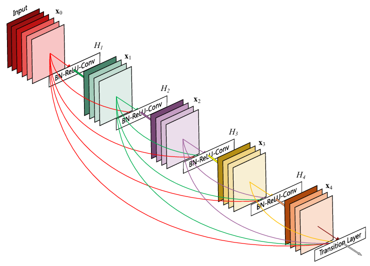
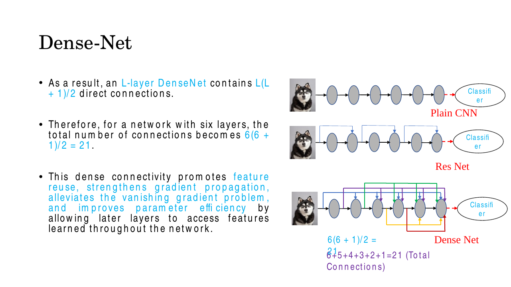
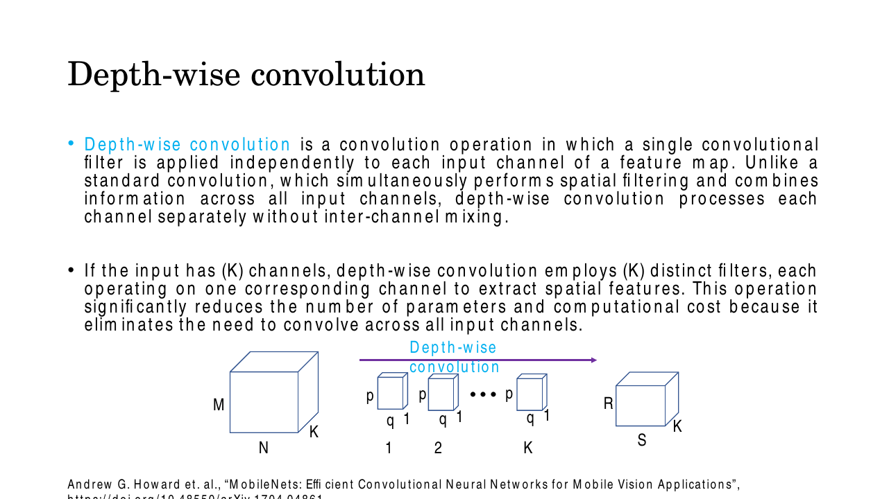
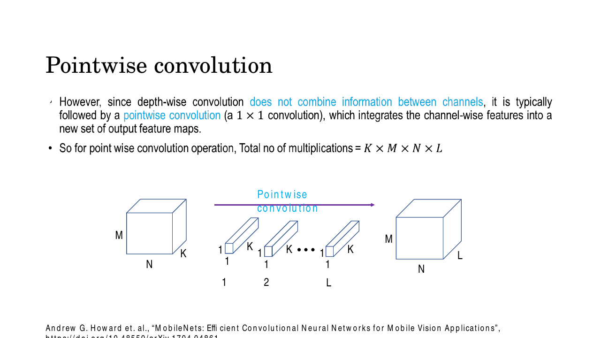
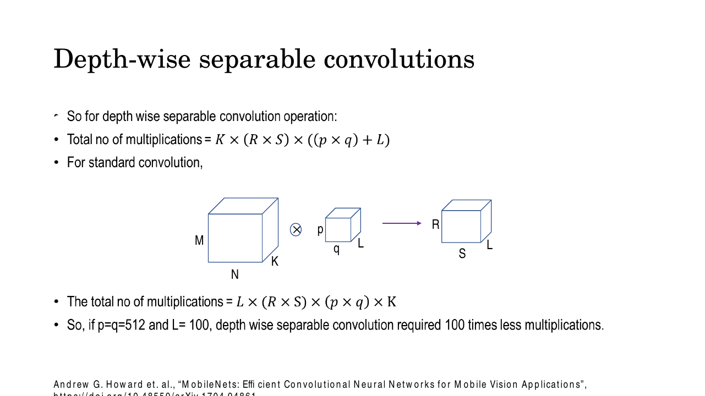
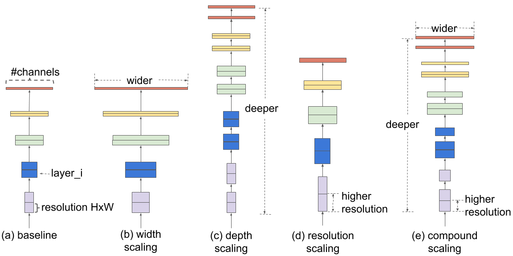
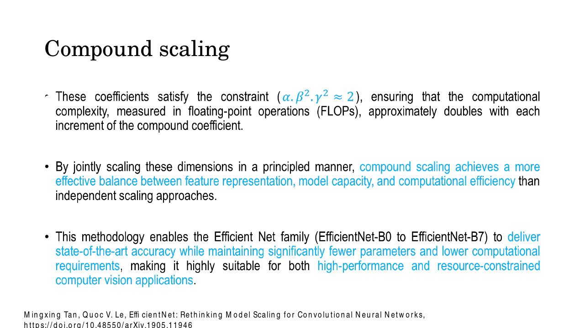

# Lec 15 — CNN Model Architectures II: DenseNet, MobileNet, EfficientNet

> **Deck:** `W4L5_P2_ModelArch.pptx` · **Week 4** · **Playlist:** Lec 15
> **Prereqs:** [Lec 14 — ResNet](14-resnet.md), [Lec 12 — CNN Architectures](../week-03/12-cnn-architectures.md)
> **Feeds into:** [Lec 28 — ViT, DETR, Swin](../week-08/28-vit-detr-swin.md)

## Why this lecture exists

ResNet settled one question: how do you train a network 150 layers deep without the gradient dying on
the way back? Once that was answered, the field stopped asking "can we go deeper?" and started asking
three sharper questions. Are we *wasting* parameters by making every layer re-learn features an earlier
layer already found? Can a convolution run on a phone, where you have a watt of power and no GPU? And
when you are handed more compute, *which* dimension of the network should you grow — layers, channels,
or input pixels? Those three questions produce DenseNet, MobileNet and EfficientNet. They are not
competitors; they optimise different things. Keep that framing and the three architectures stop being a
list to memorise and become three answers to three questions.

## The ideas

### Notation, because three conventions collide here

The deck, the MobileNet paper and this book all label convolution geometry differently. You may meet any
of them in an exam, so fix the mapping now.

| Thing | This book | MobileNet paper (used below) | The deck's slides |
|---|---|---|---|
| Input spatial size | $H \times W$ | $D_F \times D_F$ | $M \times N$ |
| Input channels | $C$ | $M$ | $K$ |
| Kernel size | $K \times K$ | $D_K \times D_K$ | $p \times q$ |
| Output channels (filters) | $F$ | $N$ | $L$ |
| Output spatial size | — | $D_F \times D_F$ (stride 1, 'same') | $R \times S$ |

This chapter uses the MobileNet-paper symbols, because the cost formula you must reproduce in the exam
is quoted in them everywhere. The deck's $K \times R \times S \times ((p\times q) + L)$ is that same
expression with the labels swapped.

### DenseNet: stop throwing features away

A plain CNN is a relay race. Layer $\ell$ sees only the output of layer $\ell-1$; whatever layer $\ell-2$
computed is gone unless layer $\ell-1$ chose to pass it on. **DenseNet** (Huang et al., CVPR 2017)
removes that bottleneck: inside a **dense block**, every layer receives the feature maps of *all*
preceding layers, **concatenated along the channel axis**.

$$\mathbf{x}_\ell = H_\ell\!\left(\left[\mathbf{x}_0, \mathbf{x}_1, \dots, \mathbf{x}_{\ell-1}\right]\right)$$

where $[\cdot]$ is channel-wise concatenation and $H_\ell$ is a composite function — batch norm, ReLU,
then a $3\times3$ convolution.


*Fig. — Growth rate $k=4$: every layer emits exactly 4 new feature maps, but reads everything emitted before it. Count the arrows arriving at $H_4$ — there are four, one per earlier tensor plus the block input. Slide 4.*

**Concatenation, not addition — the discriminating fact.** [Lec 14](14-resnet.md) owns the residual
mechanism; the contrast is what matters here:

| | ResNet | DenseNet |
|---|---|---|
| Combination | $\mathbf{x}_\ell = H_\ell(\mathbf{x}_{\ell-1}) + \mathbf{x}_{\ell-1}$ — **summed** | $\mathbf{x}_\ell = H_\ell([\mathbf{x}_0,\dots,\mathbf{x}_{\ell-1}])$ — **concatenated** |
| Channel count | unchanged along the block | grows by $k$ per layer |
| Earlier features | fused into one tensor, no longer separable | kept as distinct channels, available verbatim |
| Shape constraint | the two tensors must have identical channel counts | only spatial dimensions must match |

Summing destroys information: once you add two feature maps you cannot recover either. Concatenation
preserves both and lets the next layer decide, with its own learned weights, how much of each to use.
That is the whole argument for DenseNet.

**Growth rate $k$.** Each layer contributes exactly $k$ new feature maps — nothing more. If the block
input has $k_0$ channels, layer $\ell$ sees

$$C_\ell^{\text{in}} = k_0 + k\,(\ell - 1)$$

channels. DenseNet uses small $k$ (12, 24, 32), and this is exactly why it is parameter-efficient
despite having far more connections: a layer never has to *re-transmit* features that are already
reachable, so it can afford to be narrow. More wiring, fewer weights.

**Macro-architecture.** Concatenation requires matching spatial sizes, so you cannot downsample inside a
dense block. DenseNet therefore alternates:

```
input → initial convolution
      → Dense Block 1 → Transition → Dense Block 2 → Transition
      → Dense Block 3 → Transition → Dense Block 4
      → global average pooling → classifier
```

A **transition layer** is batch norm → a $1\times1$ convolution (which cuts the channel count — see
[Lec 12](../week-03/12-cnn-architectures.md) for why $1\times1$ convolutions do this cheaply) →
$2\times2$ average pooling (which halves $H$ and $W$).

#### The $L(L+1)/2$ connection count — derived

An $L$-layer plain CNN has $L$ direct connections: one arrow per adjacent pair. A dense block has far
more, and the count has a closed form.

Index the tensors inside the block $\mathbf{x}_0$ (the block input) through $\mathbf{x}_L$. Layer $\ell$
takes as input the concatenation of $\mathbf{x}_0, \dots, \mathbf{x}_{\ell-1}$ — that is **$\ell$
incoming connections**. Sum over every layer:

$$\text{connections} = \sum_{\ell=1}^{L} \ell = 1 + 2 + \dots + L$$

Now evaluate that sum. Write it forwards and backwards and add column by column:

$$\begin{aligned} S &= 1 + 2 + \dots + (L-1) + L \\ S &= L + (L-1) + \dots + 2 + 1 \\ \hline 2S &= \underbrace{(L+1) + (L+1) + \dots + (L+1)}_{L \text{ terms}} = L(L+1)\end{aligned}$$

$$\boxed{\ \text{connections} = \frac{L(L+1)}{2}\ }$$

Equivalently: a connection is a choice of an ordered pair $(i, j)$ with $0 \le i < j \le L$ from the
$L+1$ tensors, and there are $\binom{L+1}{2} = \frac{L(L+1)}{2}$ such pairs. The deck's example is
$L=6$: $6(6+1)/2 = 21$, which it also writes out as $6+5+4+3+2+1 = 21$.


*Fig. — The three wiring patterns side by side. Plain CNN: $L$ connections. ResNet: $L$ plus one skip per block. DenseNet: $L(L+1)/2$. Note the DenseNet count grows **quadratically** in depth while the plain count grows linearly. Slide 7.*

**What the dense wiring buys you.** Four benefits, all examinable:

- **Feature reuse** — later layers read early, low-level features directly, so nothing is re-learned.
- **Fewer parameters** — a direct consequence of the above, via the small growth rate $k$.
- **Strong gradient flow** — the loss has a short path to every layer, which alleviates the vanishing
  gradient problem ([Lec 13](../week-03/13-vanishing-gradients-activations.md)).
- **Implicit deep supervision** — because every layer connects almost directly to the classifier, each
  one receives a supervisory signal as if it had its own auxiliary loss, without any extra loss terms.

### MobileNet: factorise the convolution

**MobileNet** (Howard et al., 2017) targets a different constraint entirely: a phone, an embedded board,
an IoT camera. Its entire trick is one substitution — replace every standard convolution with a
**depthwise separable convolution**.

The observation that makes it work is stated plainly on slide 15: *a standard convolution does two jobs
at once.* It filters spatially (the $3\times3$ kernel looks at a neighbourhood) **and** it combines
channels (it sums across all $M$ input channels to produce one output value). Nothing forces those two
jobs into a single operation. Split them.

**Depthwise convolution** — spatial filtering only. One $D_K \times D_K$ filter per input channel,
applied to that channel alone. $M$ input channels in, $M$ filters, $M$ output channels out. No channel
mixing whatsoever.


*Fig. — Each little filter is depth 1 and handles exactly one channel. The output has the **same** channel count as the input — a depthwise convolution can never change the number of channels. Slide 11.*

**Pointwise convolution** — channel mixing only. This is a $1\times1$ convolution, which
[Lec 12](../week-03/12-cnn-architectures.md) owns: $N$ filters of shape $1\times1\times M$, each taking
a weighted sum across the $M$ channels at a single pixel. Zero spatial extent, full channel mixing, and
it is what sets the output channel count to $N$.


*Fig. — The filters are pencils, not cubes: $1\times1$ in space, full depth in channels. Slide 13 states the multiplication count directly as $K \times M \times N \times L$ (in this book's symbols, $M \cdot N \cdot D_F^2$). Slide 13.*

In MobileNet the pair is always run as: $3\times3$ depthwise → BN → ReLU → $1\times1$ pointwise → BN →
ReLU. Two convolutional layers where a plain network had one.

#### The cost reduction — derived

Assume stride 1 and 'same' padding, so the output is also $D_F \times D_F$ (the output-size formula and
the basic parameter count are [Lec 11](../week-03/11-cnn-basics.md)'s).

**Standard convolution.** One output value needs $D_K \cdot D_K \cdot M$ multiply-adds (the kernel
volume). There are $D_F \cdot D_F$ spatial positions and $N$ output channels:

$$\text{Cost}_{\text{std}} = D_K \cdot D_K \cdot M \cdot N \cdot D_F \cdot D_F$$

**Depthwise step.** One output value needs $D_K \cdot D_K$ multiply-adds — no sum over channels, because
there is no channel mixing. There are $D_F \cdot D_F$ positions and $M$ channels:

$$\text{Cost}_{\text{dw}} = D_K \cdot D_K \cdot M \cdot D_F \cdot D_F$$

**Pointwise step.** One output value needs $M$ multiply-adds, over $D_F \cdot D_F$ positions and $N$
output channels:

$$\text{Cost}_{\text{pw}} = M \cdot N \cdot D_F \cdot D_F$$

$$\text{Cost}_{\text{sep}} = D_K \cdot D_K \cdot M \cdot D_F \cdot D_F \;+\; M \cdot N \cdot D_F \cdot D_F$$

Now take the ratio. Factor $M \cdot D_F \cdot D_F$ out of the numerator:

$$\frac{\text{Cost}_{\text{sep}}}{\text{Cost}_{\text{std}}} = \frac{M D_F^2\left(D_K^2 + N\right)}{D_K^2 \cdot M \cdot N \cdot D_F^2} = \frac{D_K^2 + N}{D_K^2 N} = \boxed{\ \frac{1}{N} + \frac{1}{D_K^2}\ }$$


*Fig. — The deck's two formulas. Divide the first by the second and the $K$ and $R\times S$ cancel, leaving $\frac{(p\times q)+L}{(p\times q)\cdot L} = \frac{1}{L} + \frac{1}{p\times q}$ — identical to the boxed result above. Slide 14.*

Read the result. The $D_F^2$ cancelled, so **the saving does not depend on the feature-map size at all**.
For a $3\times3$ kernel, $1/D_K^2 = 1/9 = 0.1111$, and $1/N$ is tiny for any realistic channel count
($N = 128 \Rightarrow 0.0078$). So the ratio sits just above $1/9$ and below $1/8$: a depthwise separable
convolution costs roughly **one ninth** of a standard $3\times3$ convolution, i.e. **8–9× cheaper**. As
$N \to \infty$ the ratio approaches exactly $1/D_K^2$ from above — $1/9$ is the floor, never beaten.

MobileNetV1 ships 4.2M parameters and 569M multiply-adds at 70.6% ImageNet top-1, against VGG-16's 138M
parameters and 15.3B multiply-adds at 71.5% — one percentage point of accuracy for a 27× cut in
multiply-adds. V2 and V3 add inverted residual blocks, linear bottlenecks, squeeze-and-excitation and
architecture search.

### EfficientNet: scale all three dimensions at once

You have a trained network and twice the compute budget. You can make it **deeper** (more layers),
**wider** (more channels per layer), or feed it **higher resolution** images. Which?


*Fig. — (b), (c) and (d) each stretch one axis; (e) stretches all three together. ResNet scales depth; Wide-ResNet and MobileNet scale width; higher-resolution inputs capture finer detail. Each alone saturates. Slide 21.*

The empirical finding behind **EfficientNet** (Tan & Le, ICML 2019) is that single-dimension scaling
*saturates*: accuracy climbs steeply, then flattens while FLOPs keep rising. The reason is intuitive — a
higher-resolution input needs *more layers* to grow the receptive field enough to cover an object, and
*more channels* to hold the extra fine-grained patterns. Scaling one axis starves the other two.

**Compound scaling** fixes depth, width and resolution to one knob, the **compound coefficient** $\varphi$:

$$\text{depth } d = \alpha^{\varphi}, \qquad \text{width } w = \beta^{\varphi}, \qquad \text{resolution } r = \gamma^{\varphi}$$

subject to

$$\alpha \cdot \beta^2 \cdot \gamma^2 \approx 2, \qquad \alpha \ge 1,\ \beta \ge 1,\ \gamma \ge 1$$


*Fig. — The constraint is the whole point: it makes $\varphi$ a budget dial reading in doublings. $\varphi = 3$ means "give me $2^3 = 8\times$ the FLOPs, optimally distributed". Slide 23.*

**Why the squares.** Count the FLOPs of a convolutional layer: it is proportional to
(number of layers) $\times$ (input channels $\times$ output channels) $\times$ (spatial positions).

- **Depth** multiplies the layer count once → contributes $d^1$.
- **Width** multiplies *both* the input channel count and the output channel count → contributes $w^2$.
- **Resolution** multiplies *both* $H$ and $W$ → contributes $r^2$.

So total FLOPs scale as $d \cdot w^2 \cdot r^2 = (\alpha \cdot \beta^2 \cdot \gamma^2)^{\varphi}$, and
pinning $\alpha\beta^2\gamma^2$ to 2 makes that $2^{\varphi}$. Depth is linear and the other two are
quadratic — that asymmetry is exactly what the squares in the constraint encode.

**The family.** **EfficientNet-B0** is the $\varphi = 0$ baseline, found by neural architecture search
and built from **MBConv** blocks (mobile inverted bottleneck convolutions) — which contain depthwise
separable convolutions, inverted residual connections, linear bottlenecks and squeeze-and-excitation
attention, with Swish/SiLU activations and batch norm throughout. **B1 through B7** are B0 with
increasing $\varphi$. Nothing else changes: same blocks, same wiring, bigger numbers.

### Master comparison

| Architecture | Year | Core innovation | Optimises | Headline figure |
|---|---|---|---|---|
| ResNet ([Lec 14](14-resnet.md)) | 2015 | Identity skip connection, features **summed** | Trainability at depth | 152 layers; 3.6% ILSVRC top-5 error |
| DenseNet | 2017 | Every layer reads all previous, **concatenated** | Parameter efficiency, feature reuse | DenseNet-121: ~8.0M params vs ResNet-50's ~25.6M at comparable accuracy; $L(L+1)/2$ connections |
| MobileNet | 2017 | Depthwise separable convolution | Inference cost on mobile hardware | 4.2M params, 569M mult-adds, 70.6% top-1; $8$–$9\times$ cheaper convs |
| EfficientNet | 2019 | Compound scaling of depth/width/resolution | How to spend a compute budget | B0: 5.3M params, 0.39B FLOPs, 77.1% top-1. B7: 66M params, 84.3% top-1 |

## Worked numericals

### N1. Depthwise separable vs standard convolution — multiply-adds
**Given:** input $112 \times 112 \times 64$, so $D_F = 112$, $M = 64$; kernel $D_K = 3$; output channels
$N = 128$; stride 1, 'same' padding.
**Find:** multiply-adds for a standard convolution, for each separable step, and the ratio.

1. $D_F^2 = 112 \times 112 = 12{,}544$ spatial positions.
2. **Standard:** $D_K^2 M N D_F^2 = 9 \times 64 \times 128 \times 12{,}544$.
   $9 \times 64 = 576$; $576 \times 128 = 73{,}728$; $73{,}728 \times 12{,}544 = 924{,}844{,}032$.
3. **Depthwise:** $D_K^2 M D_F^2 = 9 \times 64 \times 12{,}544 = 576 \times 12{,}544 = 7{,}225{,}344$.
4. **Pointwise:** $M N D_F^2 = 64 \times 128 \times 12{,}544 = 8{,}192 \times 12{,}544 = 102{,}760{,}448$.
5. **Separable total:** $7{,}225{,}344 + 102{,}760{,}448 = 109{,}985{,}792$.
6. Ratio: $109{,}985{,}792 / 924{,}844{,}032 = 0.11892$.
7. Cross-check with the formula: $\frac{1}{N} + \frac{1}{D_K^2} = \frac{1}{128} + \frac{1}{9} = 0.0078125 + 0.111111 = 0.118924$. ✓
8. Speed-up: $1 / 0.118924 = 8.41$.

**Answer:** $9.25 \times 10^8$ vs $1.10 \times 10^8$ multiply-adds — the separable version costs
**11.89% as much, an 8.41× reduction**, squarely in the predicted $1/9$-to-$1/8$ band. Note the
pointwise step dominates (93.4% of the separable cost); the depthwise step is almost free.

### N2. Parameter counts for the same two blocks — and the ratio trap
**Given:** the same $D_K = 3$, $M = 64$, $N = 128$.
**Find:** weight counts, then recount including biases.

1. **Standard weights:** $D_K^2 M N = 9 \times 64 \times 128 = 73{,}728$.
2. **Depthwise weights:** $D_K^2 M = 9 \times 64 = 576$ (one $3\times3$ kernel per channel).
3. **Pointwise weights:** $1 \times 1 \times M \times N = 64 \times 128 = 8{,}192$.
4. **Separable weights:** $576 + 8{,}192 = 8{,}768$. Ratio $= 8{,}768 / 73{,}728 = 0.118924$.
5. This is **exactly** the multiply-add ratio, because $D_F^2$ is a common factor of every cost term and
   cancels out of both the weight ratio and the FLOP ratio identically.
6. Now add biases. Standard: $73{,}728 + 128 = 73{,}856$. Separable: $(576 + 64) + (8{,}192 + 128) = 640 + 8{,}320 = 8{,}960$.
7. New ratio: $8{,}960 / 73{,}856 = 0.12131 \Rightarrow 8.24\times$, not $8.41\times$.

**Answer:** weights-only ratio $= 0.1189$ (8.41×), **identical** to the FLOP ratio; with biases it drifts
to $0.1213$ (8.24×). The drift is because the separable block is *two* layers and therefore carries two
bias vectors (and in real MobileNet, two BatchNorm layers) where the standard block carries one. The
clean $1/N + 1/D_K^2$ result holds for weights and multiply-adds, not for a bias- or BN-inclusive count.

### N3. DenseNet connection count and channel growth
**Given:** dense blocks with $L = 5$ and $L = 10$ layers; separately, a block with input $k_0 = 24$
channels, growth rate $k = 12$, $L = 6$ layers.
**Find:** connection counts versus a plain CNN, and the per-layer input channel counts.

1. $L = 5$: $\frac{5 \times 6}{2} = \frac{30}{2} = 15$ connections. Plain CNN: 5. Factor $15/5 = 3.0\times$.
2. $L = 10$: $\frac{10 \times 11}{2} = \frac{110}{2} = 55$ connections. Plain CNN: 10. Factor $5.5\times$.
3. The ratio is $\frac{L(L+1)/2}{L} = \frac{L+1}{2}$ — it grows **linearly in $L$**, so the connection
   count grows quadratically while the plain count grows linearly.
4. Channels into layer $\ell$: $C_\ell^{\text{in}} = k_0 + k(\ell-1)$, giving
   $24,\ 36,\ 48,\ 60,\ 72,\ 84$ for $\ell = 1 \dots 6$.
5. Block output channels: $k_0 + kL = 24 + 12 \times 6 = 96$.
6. A transition layer with compression $\theta = 0.5$ would then emit $\lfloor 0.5 \times 96 \rfloor = 48$.

**Answer:** 15 connections at $L=5$, 55 at $L=10$ (vs 5 and 10 for a plain CNN). Layer inputs
$24 \to 84$ channels, block output 96.

### N4. Compound scaling at $\varphi = 2$
**Given:** $\alpha = 1.2$, $\beta = 1.1$, $\gamma = 1.15$ (EfficientNet's searched values), $\varphi = 2$,
baseline resolution $224 \times 224$.
**Find:** the constraint value, the three scale factors, and the FLOP multiplier.

1. Constraint check: $\alpha \beta^2 \gamma^2 = 1.2 \times 1.1^2 \times 1.15^2 = 1.2 \times 1.21 \times 1.3225$.
   $1.2 \times 1.21 = 1.452$; $1.452 \times 1.3225 = 1.9203$. Close to 2 — hence "$\approx 2$".
2. Depth: $d = 1.2^2 = 1.44$ → a 20-layer baseline becomes $\approx 29$ layers.
3. Width: $w = 1.1^2 = 1.21$ → a 32-channel layer becomes $\approx 39$ channels.
4. Resolution: $r = 1.15^2 = 1.3225$ → $224 \times 1.3225 = 296.2$, so $\approx 296 \times 296$ pixels.
5. FLOP multiplier: $d \cdot w^2 \cdot r^2 = 1.44 \times 1.4641 \times 1.74901$.
   $1.44 \times 1.4641 = 2.10830$; $2.10830 \times 1.74901 = 3.6874$.
6. Compare with $2^{\varphi} = 2^2 = 4$.

**Answer:** depth $\times1.44$, width $\times1.21$, resolution $\times1.32$, FLOPs $\times 3.687$ —
within 8% of the intended $2^\varphi = 4$. The gap is exactly $(1.9203/2)^2 = 0.9219$, the constraint's
own "$\approx$" squared. Equivalently, FLOP multiplier $= (\alpha\beta^2\gamma^2)^\varphi$.

## Code

Same output shape, radically different parameter count — this is the one thing to see with your own
eyes. In PyTorch a depthwise convolution is `Conv2d(M, M, K, groups=M)`: `groups=M` puts each input
channel in its own group so no mixing can occur.

```python
import torch
import torch.nn as nn

D_F, D_K, M, N = 112, 3, 64, 128          # map 112x112, 3x3 kernel, 64 in-ch, 128 out-ch
x = torch.randn(1, M, D_F, D_F)

standard = nn.Conv2d(M, N, D_K, padding=1, bias=False)

separable = nn.Sequential(
    nn.Conv2d(M, M, D_K, padding=1, groups=M, bias=False),   # depthwise: groups = in_channels
    nn.Conv2d(M, N, 1, bias=False),                          # pointwise: a 1x1 convolution
)

n = lambda m: sum(p.numel() for p in m.parameters())
ys, yp = standard(x), separable(x)

print("standard  out:", tuple(ys.shape), " params:", n(standard))
print("separable out:", tuple(yp.shape), " params:", n(separable))
print("  depthwise params:", n(separable[0]), " pointwise params:", n(separable[1]))
print(f"param ratio sep/std = {n(separable)/n(standard):.5f}  -> {n(standard)/n(separable):.3f}x fewer")
print(f"formula 1/N + 1/D_K^2 = {1/N + 1/D_K**2:.5f}")

std_mults = D_K*D_K*M*N*D_F*D_F
sep_mults = D_K*D_K*M*D_F*D_F + M*N*D_F*D_F
print(f"mult-adds  standard={std_mults:,}  separable={sep_mults:,}")
print(f"mult-add ratio = {sep_mults/std_mults:.5f}  -> {std_mults/sep_mults:.3f}x cheaper")
```

```
standard  out: (1, 128, 112, 112)  params: 73728
separable out: (1, 128, 112, 112)  params: 8768
  depthwise params: 576  pointwise params: 8192
param ratio sep/std = 0.11892  -> 8.409x fewer
formula 1/N + 1/D_K^2 = 0.11892
mult-adds  standard=924,844,032  separable=109,985,792
mult-add ratio = 0.11892  -> 8.409x cheaper
```

Identical output shapes `(1, 128, 112, 112)`, 8.4× fewer parameters, 8.4× fewer multiply-adds. The
depthwise half contributes 576 of the 8,768 parameters — 6.6%. Almost all the remaining cost is the
$1\times1$ mixing step, which is why MobileNetV2 and V3 attack *that* layer specifically.

The DenseNet and EfficientNet arithmetic in pure NumPy:

```python
import numpy as np

# --- DenseNet: channels into each layer, and the connection count ------
k0, k, L = 24, 12, 6          # block input channels, growth rate, layers in block
ch_in = [k0 + k*(l-1) for l in range(1, L+1)]
print("input channels per layer:", ch_in)        # grows by k each layer
print("block output channels    :", k0 + k*L)

conns = sum(range(1, L+1))                        # layer l has l incoming connections
print(f"dense connections = {conns}   L(L+1)/2 = {L*(L+1)//2}   plain CNN = {L}")

# --- EfficientNet compound scaling ------------------------------------
a, b, g, phi = 1.2, 1.1, 1.15, 2.0                # alpha, beta, gamma, compound coeff
print(f"alpha*beta^2*gamma^2 = {a*b**2*g**2:.4f}  (constraint ~ 2)")
d, w, r = a**phi, b**phi, g**phi
print(f"depth x{d:.4f}  width x{w:.4f}  resolution x{r:.4f}")
print(f"resolution 224 -> {224*r:.1f} px")
print(f"FLOP multiplier d*w^2*r^2 = {d*w**2*r**2:.4f}   vs 2^phi = {2**phi:.1f}")
```

```
input channels per layer: [24, 36, 48, 60, 72, 84]
block output channels    : 96
dense connections = 21   L(L+1)/2 = 21   plain CNN = 6
alpha*beta^2*gamma^2 = 1.9203  (constraint ~ 2)
depth x1.4400  width x1.2100  resolution x1.3225
resolution 224 -> 296.2 px
FLOP multiplier d*w^2*r^2 = 3.6874   vs 2^phi = 4.0
```

## Exam pack

### Must-memorise

| Item | Exactly this |
|---|---|
| DenseNet layer rule | $\mathbf{x}_\ell = H_\ell([\mathbf{x}_0, \mathbf{x}_1, \dots, \mathbf{x}_{\ell-1}])$ — **concatenation** |
| ResNet layer rule (contrast) | $\mathbf{x}_\ell = H_\ell(\mathbf{x}_{\ell-1}) + \mathbf{x}_{\ell-1}$ — **addition** |
| DenseNet connections | $\dfrac{L(L+1)}{2}$ for $L$ layers; plain CNN has $L$ |
| Growth rate | each layer emits exactly $k$ feature maps; layer $\ell$ input $= k_0 + k(\ell-1)$ |
| DenseNet $H_\ell$ | BN → ReLU → $3\times3$ Conv |
| Transition layer | BN → $1\times1$ Conv → $2\times2$ average pooling |
| Standard conv cost | $D_K \cdot D_K \cdot M \cdot N \cdot D_F \cdot D_F$ |
| Depthwise cost | $D_K \cdot D_K \cdot M \cdot D_F \cdot D_F$ |
| Pointwise cost | $M \cdot N \cdot D_F \cdot D_F$ |
| Cost ratio | $\dfrac{1}{N} + \dfrac{1}{D_K^2}$ — independent of $D_F$ |
| Depthwise output channels | **equal to input channels**, always |
| Pointwise = | a $1\times1$ convolution |
| Compound scaling | $d = \alpha^\varphi$, $w = \beta^\varphi$, $r = \gamma^\varphi$ |
| Compound constraint | $\alpha \cdot \beta^2 \cdot \gamma^2 \approx 2$, with $\alpha,\beta,\gamma \ge 1$ |
| FLOP scaling | $\propto d \cdot w^2 \cdot r^2 = 2^\varphi$ |

### Numbers worth knowing

| Quantity | Value |
|---|---|
| Deck's connection example | $L = 6 \Rightarrow 6(6+1)/2 = 21 = 6{+}5{+}4{+}3{+}2{+}1$ |
| Connections at $L=5$ / $L=10$ | 15 / 55 |
| Deck's dense-block figure | 5 layers, growth rate $k = 4$ |
| Typical DenseNet growth rates | $k = 12, 24, 32$ |
| Separable cost ratio, $3\times3$ | $\approx 1/9$ to $1/8$ → **8–9× cheaper** |
| Worked ratio ($D_K{=}3$, $N{=}128$) | $0.1189$ → $8.41\times$ |
| DenseNet-121 parameters | $\approx 8.0$M (ResNet-50: $\approx 25.6$M) |
| MobileNetV1 | 4.2M params, 569M mult-adds, 70.6% top-1 |
| VGG-16 (for contrast) | 138M params, 15.3B mult-adds, 71.5% top-1 |
| EfficientNet-B0 | 5.3M params, 0.39B FLOPs, 77.1% top-1, $224\times224$ |
| EfficientNet-B7 | 66M params, 84.3% top-1 |
| EfficientNet $\alpha, \beta, \gamma$ | $1.2,\ 1.1,\ 1.15$ (product $\alpha\beta^2\gamma^2 = 1.92$) |
| Years | DenseNet 2017 (CVPR) · MobileNet 2017 · EfficientNet 2019 (ICML) |
| EfficientNet family span | B0 through B7 |

### Likely MCQ traps

- **"DenseNet adds the feature maps of previous layers."** No — it **concatenates** them. ResNet adds.
  This single word is the most-asked discrimination on this lecture. Consequence: DenseNet's channel
  count *grows* through a block, ResNet's does not.
- **"More connections means more parameters."** False, and the point of the architecture. DenseNet has
  $L(L+1)/2$ connections yet *fewer* parameters than ResNet: the small growth rate $k$ keeps every layer
  narrow, because nothing needs re-learning.
- **"The cost saving depends on the feature-map size."** It does not. $D_F^2$ cancels; the ratio
  $1/N + 1/D_K^2$ depends only on kernel size and output channels.
- **"Depthwise separable convolution is exactly $1/9$ the cost."** The ratio is $1/N + 1/D_K^2$, which is
  *strictly greater* than $1/9$ for a $3\times3$ kernel, approaching $1/9$ only as $N \to \infty$.
  "Roughly 8–9×" is right; "exactly 9×" is wrong.
- **"Depthwise convolution changes the number of channels."** It cannot. $M$ in, $M$ filters, $M$ out.
  The **pointwise** step is what sets the output channel count to $N$.
- **"Pointwise convolution does spatial filtering."** No — it is $1\times1$, no spatial extent.
  Depthwise does space, pointwise does channels. Swapping the two is the classic error.
- **"$\alpha\beta\gamma \approx 2$."** The constraint is $\alpha \cdot \beta^2 \cdot \gamma^2 \approx 2$.
  Width and resolution are **squared**; depth is not.
- **"Transition layers sit inside dense blocks."** They sit *between* them. You cannot downsample inside
  a block, because concatenation requires matching spatial dimensions.
- **"EfficientNet-B7 is a different architecture from B0."** Same architecture, larger $\varphi$.
  Compound scaling changes numbers, not block types.
- **"Compound scaling scales all three by the same factor."** No — by the same *compound coefficient*
  $\varphi$, applied to three **different** bases $\alpha, \beta, \gamma$.

### Self-test

1. State the DenseNet layer equation and say in one word how it differs from ResNet's.
2. How many direct connections does a 7-layer dense block have? A 7-layer plain CNN?
3. A dense block has $k_0 = 32$, $k = 16$, 4 layers. How many channels enter layer 3, and how many leave the block?
4. Why can you not place a stride-2 convolution in the middle of a dense block?
5. Write the cost of a standard convolution and of its depthwise separable replacement, then the ratio.
6. For $D_K = 5$, $N = 256$: what fraction of the standard cost does the separable version use?
7. A depthwise convolution takes a $56\times56\times96$ input with $3\times3$ kernels. What is the output shape (stride 1, 'same'), and how many weights does it have?
8. Why does width appear squared in the FLOP count but depth does not?
9. With $\alpha = 1.3$, $\beta = 1.1$, $\gamma = 1.1$ and $\varphi = 1$, compute $d$, $w$, $r$ and the FLOP multiplier.
10. Name the one thing each of DenseNet, MobileNet and EfficientNet is primarily optimising.

<details><summary>Answers</summary>

1. $\mathbf{x}_\ell = H_\ell([\mathbf{x}_0,\dots,\mathbf{x}_{\ell-1}])$. The difference in one word: **concatenation** (ResNet sums).
2. $7 \times 8 / 2 = 28$ for the dense block; 7 for the plain CNN.
3. Layer 3 input $= 32 + 16 \times 2 = 64$ channels. Block output $= 32 + 16 \times 4 = 96$ channels.
4. Concatenation requires every tensor to have the same spatial size; downsampling would break that. Spatial reduction is done in the transition layers between blocks.
5. $D_K^2 M N D_F^2$ versus $D_K^2 M D_F^2 + M N D_F^2$; ratio $= \frac{1}{N} + \frac{1}{D_K^2}$.
6. $\frac{1}{256} + \frac{1}{25} = 0.003906 + 0.04 = 0.043906$, i.e. about **4.4%** of the cost — a 22.8× reduction. Bigger kernels save more.
7. Output $56\times56\times96$ — **unchanged channel count**. Weights $= 3 \times 3 \times 96 = 864$.
8. Width multiplies both the input and the output channel count of every layer, so it enters the per-layer cost twice; depth only multiplies the number of layers, so it enters once. Resolution is also squared, because it scales $H$ and $W$.
9. $d = 1.3$, $w = 1.1$, $r = 1.1$. FLOP multiplier $= 1.3 \times 1.21 \times 1.21 = 1.903$ — close to $2^1 = 2$. (Check: $\alpha\beta^2\gamma^2 = 1.3 \times 1.21 \times 1.21 = 1.903 \approx 2$. ✓)
10. DenseNet: parameter efficiency through feature reuse. MobileNet: inference cost on resource-constrained hardware. EfficientNet: how to allocate a given compute budget across depth, width and resolution.

</details>

## Beyond the slides

**Gap:** The deck's slide 14 illustrates the saving with "$p = q = 512$ and $L = 100$", concluding
"100 times less multiplications".
**Why it matters:** The arithmetic is internally consistent with the deck's own formula
($1/100 + 1/262{,}144 \approx 0.01$), but $p = q = 512$ describes a $512 \times 512$ *kernel*, which no
convolutional network has ever used. Do not carry that number into the exam. The figure the MobileNet
paper reports, and the one examiners use, is the $3\times3$ case: **8 to 9 times** fewer multiply-adds.

**Gap:** The deck never states DenseNet's bottleneck and compression variants.
**Why it matters:** "DenseNet-B" inserts a $1\times1$ conv producing $4k$ maps before each $3\times3$
conv; "DenseNet-C" multiplies the transition layer's output channels by $\theta < 1$ (usually 0.5).
"DenseNet-BC" has both, and every ImageNet result you will see quoted is a BC model. If a question names
a compression factor $\theta$, this is what it means.

**Gap:** MobileNet's own two hyperparameters — the **width multiplier** and the **resolution
multiplier** — are absent from the deck.
**Why it matters:** They thin every layer's channels and shrink the input image, giving a family of
MobileNets at different cost points, and they are the direct ancestor of EfficientNet's $\beta$ and
$\gamma$. Watch the symbol clash: MobileNet calls its width multiplier $\alpha$, EfficientNet calls its
*depth* base $\alpha$.

**Gap:** The deck asserts single-dimension scaling is "suboptimal" without saying why.
**Why it matters:** The reason is receptive-field and capacity matching — a higher-resolution image has
finer patterns and pixel-wise larger objects, so it needs more layers to see an object whole and more
channels to store the detail. Scaling one dimension leaves the other two as bottlenecks, which is why
each single-axis accuracy curve flattens.

## Cut from the slides

Dropped the title slide (1), the four identical "Content" slides (2, 3, 8, 16), the "Summary" slide (24)
which merely re-lists the three architecture names, and the "Next lecture" slide (25) — navigation, no
content. Slides 4 and 5 share one dense-block figure; shown once, with slide 5's macro-architecture text
redrawn as an ASCII diagram. Slides 6 and 7 share one three-panel comparison image; shown once, at
slide 7, where the $L(L+1)/2$ annotation appears. Slides 11 and 12 are a two-step build of the same
depthwise figure — only 11 is shown, because slide 12's addition (the count
$K \times R \times S \times p \times q$) is derived in full in the prose instead. Slide 15's closing
paragraph on MobileNetV2/V3 is compressed to one sentence: the deck names those features without
explaining any of them and no later chapter depends on them. Slides 19 and 20 restate the same scaling
argument twice; merged. Nothing mathematical was dropped.
