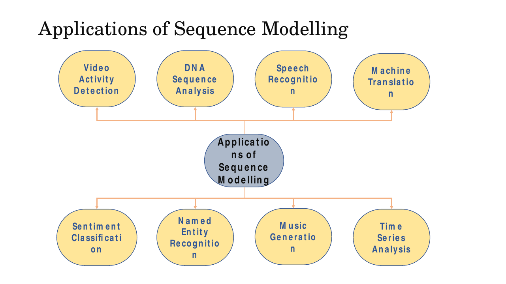
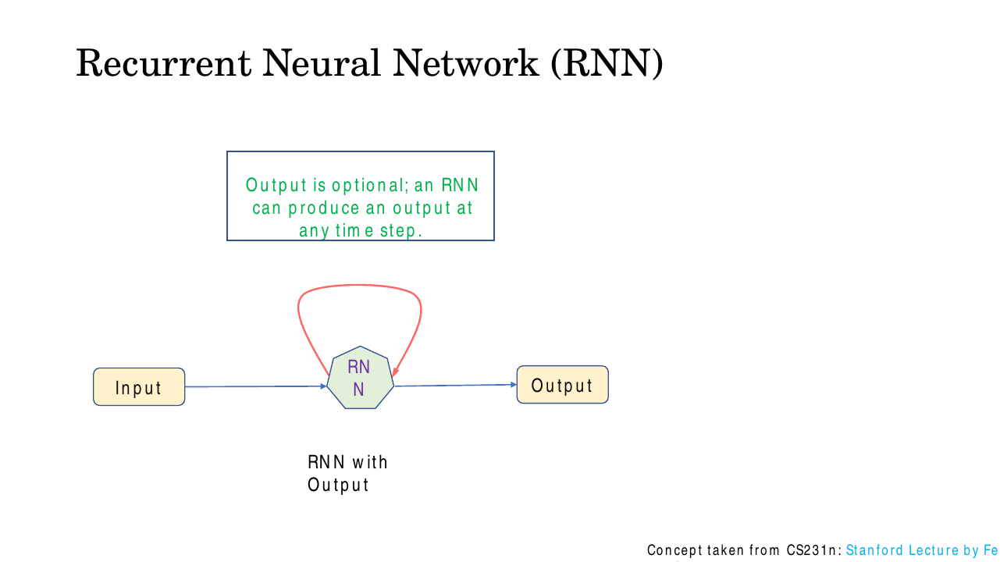
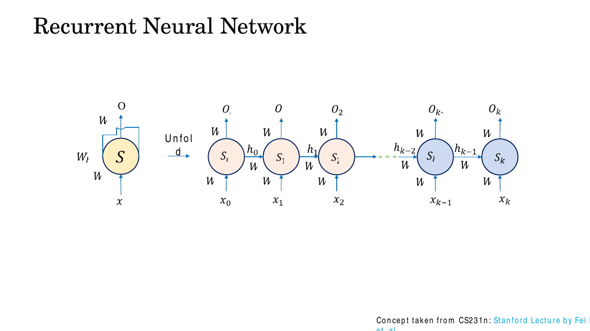
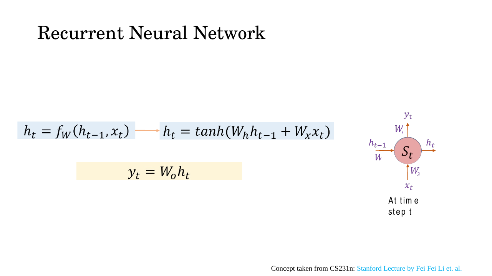
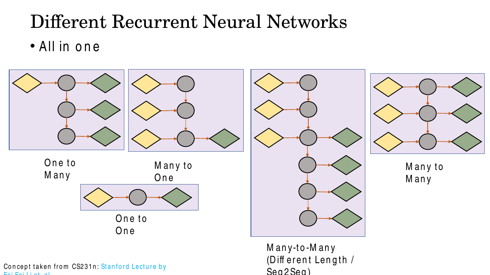
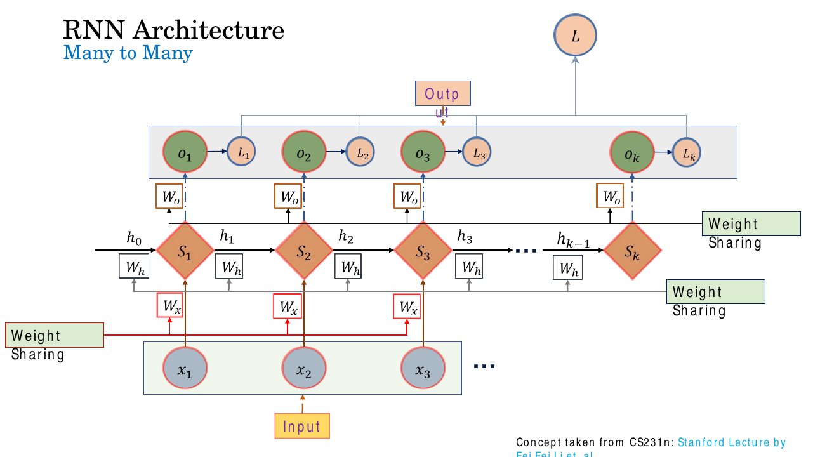
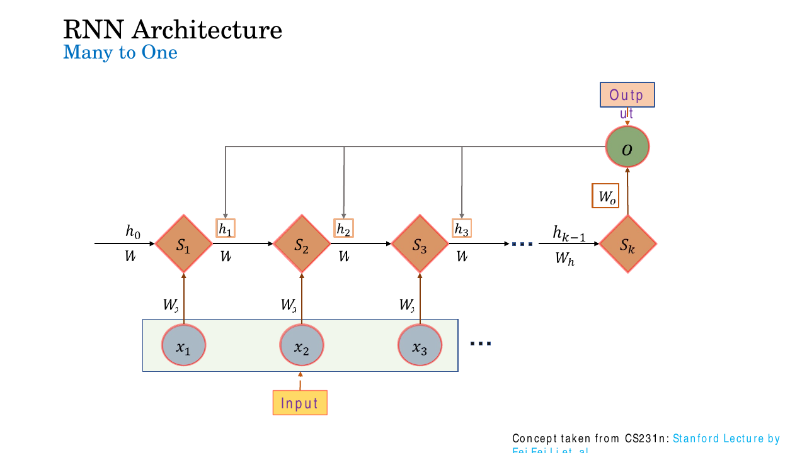
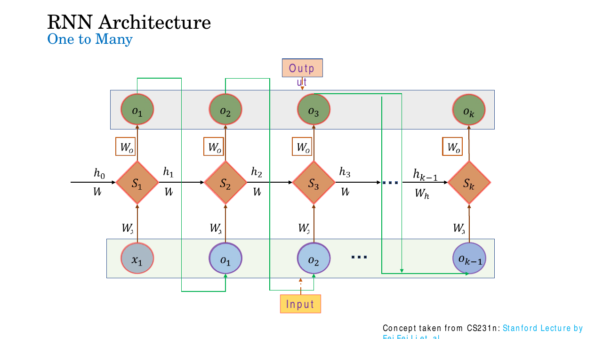

# Lec 16 — Sequential Modelling and Recurrent Neural Networks

> **Deck:** `W4L5_P3_SeqLearning.pptx` · **Week 4** · **Playlist:** Lec 16
> **Prereqs:** [Lec 9 — Backpropagation](../week-02/09-backpropagation.md), [Lec 11 — CNN Basics](../week-03/11-cnn-basics.md)
> **Feeds into:** [Lec 17 — BPTT](../week-05/17-bptt.md), [Lec 18 — LSTM](../week-05/18-lstm.md), [Lec 19 — GRU, Seq2Seq, Attention](../week-05/19-gru-seq2seq-attention.md)

## Why this lecture exists

Everything in the course so far has assumed a fixed-size input and no memory. An MLP takes a vector
of length $n$; a CNN takes an $H\times W\times C$ tensor. Hand either one a sentence of 7 words and
then a sentence of 40, and the architecture does not exist to accept both. Worse, flatten a sentence
into a bag of word vectors and you throw away order — "dog bites man" and "man bites dog" become the
same input, with opposite meanings.

Real data is full of order: video, speech, text, DNA, stock prices, ECG traces. This lecture
introduces the machinery that handles it. One cell, applied repeatedly, carrying a hidden state
forward. That single structural idea — **the same weights at every time step** — is what makes a
sequence model work, and it is also what makes it hard to train, which is Lec 17's subject.

## The ideas

### What a sequence model is

The deck's definition, worth learning in its words:

> **Sequence modelling** is a fundamental task in machine learning that involves learning **temporal
> dependencies** from **ordered** data such as text, speech, and time-series signals.

And the longer gloss: sequential models are algorithms designed to process and learn from ordered or
time-dependent data, **where the sequence of observations itself carries meaningful information**,
modelled by capturing dependencies between previous and current elements.

The named family is **RNN, LSTM, GRU, Transformer** — memorise the four, and notice that the course
covers them in exactly that order over Weeks 4–7.

### Why the machinery has to be different

A standard feed-forward network treats every input independently. That breaks on sequences in three
distinct ways, and the deck's five "why it matters" bullets collapse onto them:

| What a feed-forward net cannot do | Deck's phrasing | Concrete failure |
|---|---|---|
| Remember anything across inputs | **Captures temporal dependencies** | Forecasting tomorrow's price from today's alone |
| Use surrounding words to disambiguate | **Preserves context** | "bank" in *river bank* vs *savings bank* |
| Accept inputs of different length | **Handles variable-length inputs** | A 7-word and a 40-word review through one model |
| Carry information over a long gap | **Models long-term relationships** | "The *keys* … *are* on the table" — 20 words apart |
| Beat a memoryless baseline | **Improves prediction accuracy** | Using history instead of the current frame only |

Note the fourth row carefully: the deck credits *long-range* dependency handling to **LSTMs**
specifically, saying plain networks "struggle to capture" it. That is a deliberate forward reference
— the plain RNN you are about to build does *not* solve it, and [Lec 18](../week-05/18-lstm.md)
explains why gating does.

### Applications


*Fig. — Eight applications in two rows of four. The exam asks "which of these is **not** listed", so learn the set, not the gist. Slide 6.*

**Video activity detection · DNA sequence analysis · speech recognition · machine translation ·
sentiment classification · named entity recognition · music generation · time series analysis.**

The surrounding prose adds **language modelling, video summarization, handwriting recognition, stock
price prediction, weather forecasting and healthcare monitoring**.

### The recurrent cell


*Fig. — The red self-loop is the whole idea. Note the deck's caption: the output is **optional** — an RNN can emit at any time step, or at none. Slide 8.*

> **RNNs maintain an "internal state" that is updated as each element of the sequence is processed.**

That is the deck's definition of a **recurrent neural network** (a network whose output at a step is
fed back as part of its own input at the next step). Slide 7 draws the cell with no output arrow at
all and slide 8 adds one: the state is the essential part, the emission is a per-pattern choice.

### Unfolding: from a loop to a chain

A loop is impossible to differentiate as drawn. **Unfolding** (also called *unrolling*) rewrites it
as a feed-forward chain, one copy of the cell per time step.


*Fig. — Same network on both sides. The right-hand graph has $k$ nodes but exactly as many **parameters** as the left — every arrow labelled $W$ is the *same* $W$. Slide 9.*

Three things to read off this figure:

1. The unrolled graph is an ordinary **directed acyclic graph**, so ordinary backprop applies to it.
   Running backprop on this graph has a name, **backpropagation through time**, and belongs to
   [Lec 17](../week-05/17-bptt.md).
2. Its **depth equals the sequence length**. A 100-step sequence is a 100-layer network. This is the
   source of every training difficulty in Weeks 4–5.
3. The number of copies changes with the input; the number of parameters does not.

### The recurrence


*Fig. — The deck's annotated recurrence. The orange box bottom-left is the sentence to memorise. Slide 10.*

The abstract form first. At time step $t$ the new state is a function of the previous state and the
current input:

$$\mathbf{h}_t = f_{\mathbf{W}}(\mathbf{h}_{t-1}, \mathbf{x}_t)$$

Both arguments matter. Drop $\mathbf{h}_{t-1}$ and you have a per-step MLP with no memory; drop
$\mathbf{x}_t$ and you have a generator that ignores its input. The subscript $\mathbf{W}$ is doing
real work too: it says the *same* parameter set is used for every $t$.


*Fig. — The deck instantiates $f_{\mathbf{W}}$ as a single $\tanh$ over a sum of two matrix–vector products. Slide 11.*

Instantiating $f_\mathbf{W}$, in the book's notation:

$$\mathbf{h}_t = \tanh\!\left(\mathbf{W}_{hh}\,\mathbf{h}_{t-1} + \mathbf{W}_{xh}\,\mathbf{x}_t + \mathbf{b}_h\right)$$

$$\mathbf{y}_t = \mathbf{W}_{hy}\,\mathbf{h}_t + \mathbf{b}_y$$

**Notation translation.** The deck writes $\mathbf{W}_h$ for the recurrent matrix, $\mathbf{W}_x$ for
the input matrix and $\mathbf{W}_o$ for the output matrix; this book writes $\mathbf{W}_{hh}$,
$\mathbf{W}_{xh}$, $\mathbf{W}_{hy}$, where the subscript reads *from → to*. The deck also labels the
state node $S_t$ in its diagrams while calling its value $\mathbf{h}_t$ in the equations — $S_t$ is
the *node*, $\mathbf{h}_t$ is the *vector it emits*. Finally, **the deck omits the bias terms
entirely**; $\mathbf{b}_h$ and $\mathbf{b}_y$ above are standard and you must include them in any
parameter count. Outputs are $o_t$ in the deck's architecture figures and $y_t$ in its equations —
same thing.

Why $\tanh$? It is zero-centred and squashes to $[-1,1]$, keeping the state bounded however many
steps you run — a ReLU state can grow without limit when $\mathbf{W}_{hh}$ is applied 100 times. The
price is $\tanh'(z)\le 1$, half the vanishing-gradient story
([Lec 13](../week-03/13-vanishing-gradients-activations.md) owns the derivation; its recurrent form is
[Lec 17](../week-05/17-bptt.md)'s).

Shapes, which you need before you can count anything. With input dimension $d_x$, hidden dimension
$d_h$ and output dimension $d_y$:

| Object | Shape |
|---|---|
| $\mathbf{x}_t$ | $d_x \times 1$ |
| $\mathbf{h}_t$, $\mathbf{h}_{t-1}$, $\mathbf{b}_h$ | $d_h \times 1$ |
| $\mathbf{W}_{xh}$ | $d_h \times d_x$ |
| $\mathbf{W}_{hh}$ | $d_h \times d_h$ (always **square**) |
| $\mathbf{W}_{hy}$ | $d_y \times d_h$ |
| $\mathbf{y}_t$, $\mathbf{b}_y$ | $d_y \times 1$ |

$\mathbf{W}_{hh}$ being square is forced: it maps a state to a state. That squareness is exactly what
lets it be applied over and over.

### Parameter sharing — the fact everything else rests on


*Fig. — The deck's most important slide. Three horizontal lines, three callouts: every $\mathbf{W}_x$ is one matrix, every $\mathbf{W}_h$ is one matrix, every $\mathbf{W}_o$ is one matrix. Slide 23.*

There are not $k$ sets of weights in the unrolled graph. There is **one** set, drawn $k$ times. Three
consequences, and you should be able to state all three:

1. **One model handles any length.** The parameter count does not depend on $T$, so the same trained
   RNN runs on a 5-word sentence and a 500-word document. N2 and N4 price this out. A fixed-input MLP
   cannot do it at all.
2. **Statistics are pooled across positions.** A pattern learned at step 3 is available at step 90,
   because it lives in the same matrix. This is the temporal analogue of the CNN's translation
   invariance ([Lec 11](../week-03/11-cnn-basics.md)) — a CNN shares weights across *space*, an RNN
   shares them across *time*.
3. **The gradient multiplies one matrix repeatedly.** Propagating error from step $T$ back to step $1$
   passes through $\mathbf{W}_{hh}$ exactly $T-1$ times, so a factor like $\mathbf{W}_{hh}^{\,T-1}$
   appears. If its largest eigenvalue is below 1 the gradient dies; above 1 it explodes. That is
   [Lec 17](../week-05/17-bptt.md)'s derivation and [Lec 18](../week-05/18-lstm.md)'s cure — mentioned
   here only so you see that this benefit and that defect are the *same* structural fact.

### The hidden state is a fixed-size memory

$\mathbf{h}_t$ is a $d_h$-dimensional summary of everything the network has read up to and including
step $t$. It is a **lossy, fixed-capacity** summary: after 500 steps it is still $d_h$ numbers. That
is a feature — it is what keeps the model finite — and it is the bottleneck attention eventually
removes ([Lec 19](../week-05/19-gru-seq2seq-attention.md)).

By convention $\mathbf{h}_0 = \mathbf{0}$, meaning "nothing seen yet". The deck draws $h_0$ entering
$S_1$ from the left without saying what it is; a zero vector is the standard choice.

### The five input/output patterns

This taxonomy is the single most directly examinable thing in the lecture. The deck classifies RNNs
"based on the relationship between input and output sequences".


*Fig. — All five side by side. Count the yellow (input) and green (output) shapes in each; that count **is** the pattern name. Slide 18.*

| Pattern | Input → Output | Sequential? | Deck's example | Other examples |
|---|---|---|---|---|
| **One-to-one** | 1 → 1 | **No** — a vanilla NN | Vanilla neural network | Image classification, regression |
| **One-to-many** | 1 → $T$ | Yes | **Image captioning** (image → sentence) | Music generation from a genre tag |
| **Many-to-one** | $T$ → 1 | Yes | **Sentiment analysis** (text → sentiment) | Video activity recognition |
| **Many-to-many (same length)** | $T$ → $T$ | Yes | **Video frame labelling** (video → frame-wise segmentation) | POS tagging, named entity recognition |
| **Many-to-many (different length / seq2seq)** | $T_x$ → $T_y$ | Yes | **Machine translation** (Hindi → English) | Video summarization, speech-to-text |

Read the first row again: **one-to-one is on the list but is not a recurrent model.** It is included
as the degenerate case — no loop, no state. "Which of the five is not a true sequential model?" is a
free mark.

The discriminator between the two many-to-many rows is **whether the output length is tied to the
input length**. Frame labelling emits exactly one label per frame, so $T_y = T_x$ and the model emits
as it reads. Translation cannot: *"मुझे गाने सुनना अच्छा लगता है"* (6 tokens) becomes *"I enjoy listening
to songs"* (5 tokens), and in general you do not know $T_y$ until you are finished. So the network
must **read the whole input first, then write** — which is the encoder–decoder shape named *seq2seq*.
You now own that word as a pattern label; the architecture is
[Lec 19](../week-05/19-gru-seq2seq-attention.md)'s.

Now the three recurrent patterns as computational graphs. (Slides 19–33 build each of these one frame
at a time; the end state of each build is shown here.)


*Fig. — **Many-to-many.** One input in and one output out at every step. Note the loss structure: a local $\mathcal{L}_t$ per step, summed to a single $\mathcal{L}$. Slide 26.*

**Many-to-many (same length).** Input at every step, output at every step, $\mathcal{L} = \sum_t \mathcal{L}_t$.
Each $\mathbf{h}_t$ has seen $\mathbf{x}_1 \ldots \mathbf{x}_t$, so $\mathbf{y}_t$ is a prediction
conditioned on the whole past — but not the future, which is why bidirectional variants exist
([Lec 17](../week-05/17-bptt.md)).


*Fig. — **Many-to-one.** Every step consumes an input; only the last state is decoded. $\mathbf{h}_k$ is the whole sequence compressed to $d_h$ numbers. Slide 28.*

**Many-to-one.** Read everything, emit once: $\mathbf{y} = \mathbf{W}_{hy}\mathbf{h}_T + \mathbf{b}_y$,
computed only at $t=T$. The intermediate $\mathbf{h}_t$ are still computed — they are the path the
information travels — they are just not decoded. This is the classifier shape: sentiment, video
activity label, document topic.


*Fig. — **One-to-many.** Only $\mathbf{x}_1$ is a genuine input. The green arrows feed each output back in as the next step's input — this is what keeps the generation coherent. Slide 33.*

**One-to-many.** The real input enters once, at $t=1$; after that the network must manufacture its own
inputs. The deck's green feedback arrows make it explicit: $o_{t-1}$ becomes the input at step $t$.
For captioning, the image feature seeds $\mathbf{h}_1$ and each generated word is fed back to produce
the next, until an end-of-sequence token. Without the feedback the model would emit $T$ independent
words with no grammar between them.

### What this chapter deliberately stops short of

You now have the architecture and the forward pass. You do **not** yet have training.
[Lec 17](../week-05/17-bptt.md) covers backpropagation through time, truncated BPTT, bidirectional
RNNs, stacked/deep RNNs and the character-level walkthrough; [Lec 18](../week-05/18-lstm.md) covers
LSTM gating; [Lec 19](../week-05/19-gru-seq2seq-attention.md) covers GRU, seq2seq and attention. The
deck itself stops in the same place.

## Worked numericals

### N1. A three-step RNN forward pass by hand
**Given:** $d_x = d_h = d_y = 2$, $\mathbf{h}_0 = \mathbf{0}$, $\tanh$ activation, and

$$\mathbf{W}_{xh} = \begin{bmatrix}0.5 & -0.3\\ 0.1 & 0.8\end{bmatrix},\quad
\mathbf{W}_{hh} = \begin{bmatrix}0.2 & 0.4\\ -0.1 & 0.3\end{bmatrix},\quad
\mathbf{b}_h = \begin{bmatrix}0.1\\ -0.2\end{bmatrix}$$

$$\mathbf{W}_{hy} = \begin{bmatrix}1.0 & -1.0\\ 0.5 & 0.5\end{bmatrix},\quad
\mathbf{b}_y = \begin{bmatrix}0\\ 0.1\end{bmatrix},\qquad
\mathbf{x}_1=\begin{bmatrix}1\\0\end{bmatrix},\ \mathbf{x}_2=\begin{bmatrix}0\\1\end{bmatrix},\ \mathbf{x}_3=\begin{bmatrix}1\\1\end{bmatrix}$$

**Find:** $\mathbf{h}_1,\mathbf{h}_2,\mathbf{h}_3$ and $\mathbf{y}_1,\mathbf{y}_2,\mathbf{y}_3$ (4 d.p.).

**Step $t=1$.**

1. $\mathbf{W}_{xh}\mathbf{x}_1 = [0.5(1) + (-0.3)(0),\ 0.1(1)+0.8(0)]^\top = [0.5,\ 0.1]^\top$.
2. $\mathbf{W}_{hh}\mathbf{h}_0 = [0,\ 0]^\top$ (the initial state contributes nothing).
3. Pre-activation $\mathbf{a}_1 = [0.5+0+0.1,\ 0.1+0-0.2]^\top = [0.6,\ -0.1]^\top$.
4. $\mathbf{h}_1 = [\tanh 0.6,\ \tanh(-0.1)]^\top = [0.5370,\ -0.0997]^\top$.
5. $\mathbf{y}_1 = [1.0(0.5370) - 1.0(-0.0997),\ 0.5(0.5370)+0.5(-0.0997)+0.1]^\top = [0.6367,\ 0.3187]^\top$.

**Step $t=2$.**

6. $\mathbf{W}_{xh}\mathbf{x}_2 = [-0.3,\ 0.8]^\top$.
7. $\mathbf{W}_{hh}\mathbf{h}_1$: row 1 $= 0.2(0.5370)+0.4(-0.0997) = 0.1074 - 0.0399 = 0.0675$;
   row 2 $= -0.1(0.5370)+0.3(-0.0997) = -0.0537 - 0.0299 = -0.0836$.
8. $\mathbf{a}_2 = [-0.3+0.0675+0.1,\ 0.8-0.0836-0.2]^\top = [-0.1325,\ 0.5164]^\top$.
9. $\mathbf{h}_2 = [\tanh(-0.1325),\ \tanh(0.5164)]^\top = [-0.1317,\ 0.4749]^\top$.
10. $\mathbf{y}_2 = [-0.1317-0.4749,\ 0.5(-0.1317+0.4749)+0.1]^\top = [-0.6066,\ 0.2716]^\top$.

**Step $t=3$.**

11. $\mathbf{W}_{xh}\mathbf{x}_3 = [0.5-0.3,\ 0.1+0.8]^\top = [0.2,\ 0.9]^\top$.
12. $\mathbf{W}_{hh}\mathbf{h}_2$: row 1 $= 0.2(-0.1317)+0.4(0.4749) = -0.0263+0.1900 = 0.1636$;
    row 2 $= -0.1(-0.1317)+0.3(0.4749) = 0.0132+0.1425 = 0.1556$.
13. $\mathbf{a}_3 = [0.2+0.1636+0.1,\ 0.9+0.1556-0.2]^\top = [0.4636,\ 0.8556]^\top$.
14. $\mathbf{h}_3 = [\tanh 0.4636,\ \tanh 0.8556]^\top = [0.4331,\ 0.6940]^\top$.
15. $\mathbf{y}_3 = [0.4331-0.6940,\ 0.5(0.4331+0.6940)+0.1]^\top = [-0.2609,\ 0.6635]^\top$.

**Answer:** $\mathbf{h}_1 = [0.5370,\,-0.0997]$, $\mathbf{h}_2 = [-0.1317,\,0.4749]$,
$\mathbf{h}_3 = [0.4331,\,0.6940]$; $\mathbf{y}_1 = [0.6367,\,0.3187]$,
$\mathbf{y}_2 = [-0.6066,\,0.2716]$, $\mathbf{y}_3 = [-0.2609,\,0.6635]$.
The same five matrices/vectors were used at all three steps — that is the point of the exercise. For a
**many-to-one** model you would report $\mathbf{y}_3$ only; the first two rows of $\mathbf{y}$ would
never be computed.

### N2. Parameter count, and its independence from sequence length
**Given:** $d_x = 100$ (word embedding), $d_h = 256$, $d_y = 10$ classes, biases included.
**Find:** total trainable parameters, for $T = 5$ and for $T = 500$.

1. $\mathbf{W}_{xh}$: $d_h \times d_x = 256 \times 100 = 25{,}600$.
2. $\mathbf{W}_{hh}$: $d_h \times d_h = 256 \times 256 = 65{,}536$.
3. $\mathbf{b}_h$: $256$.
4. $\mathbf{W}_{hy}$: $d_y \times d_h = 10 \times 256 = 2{,}560$.
5. $\mathbf{b}_y$: $10$.
6. Total $= 25{,}600 + 65{,}536 + 256 + 2{,}560 + 10 = 93{,}962$.
7. For $T = 500$: repeat steps 1–6. Nothing in them mentions $T$. Total $= 93{,}962$.

**Answer:** **93,962 parameters, for every $T$.** The general formula is

$$\#\theta = d_h d_x + d_h^2 + d_h + d_y d_h + d_y$$

and the recurrent block $d_h^2 = 65{,}536$ is **70%** of it. Multiplying by $T$ is the classic trap:
the unrolled graph has $T$ copies of the *computation*, not of the *parameters*.

### N3. RNN versus the MLP that would be needed instead
**Given:** the same sequence, $T = 50$ steps of $d_x = 100$. An MLP must take the whole sequence
flattened: $50 \times 100 = 5{,}000$ inputs, one hidden layer of 256, 10 outputs.
**Find:** both parameter counts and the ratio.

1. MLP layer 1: $5{,}000 \times 256 = 1{,}280{,}000$ weights, $+256$ biases.
2. MLP layer 2: $256 \times 10 = 2{,}560$ weights, $+10$ biases.
3. MLP total $= 1{,}280{,}000 + 256 + 2{,}560 + 10 = 1{,}282{,}826$.
4. RNN total (N2) $= 93{,}962$.
5. Ratio $= 1{,}282{,}826 / 93{,}962 = 13.65$.
6. Comparing only the input-side blocks: $1{,}280{,}000 / 25{,}600 = \mathbf{50\times}$ — exactly $T$,
   because the RNN reuses one $\mathbf{W}_{xh}$ across all 50 steps.

**Answer:** **1,282,826 vs 93,962 — the RNN is 13.65× smaller**, and the saving on the input weights
is exactly $T = 50\times$. The non-parametric point is bigger: the MLP is **permanently locked to
$T=50$**. Give it 49 steps or 51 and it cannot run. The RNN runs on both.

### N4. Classify the task — the pattern quiz
**Given:** eight tasks. **Find:** the input/output pattern for each.

| # | Task | Pattern |
|---|---|---|
| 1 | Translate an English paragraph to Hindi | many-to-many (different length / seq2seq) |
| 2 | Decide whether a product review is positive | many-to-one |
| 3 | Caption a single photograph | one-to-many |
| 4 | Tag the part of speech of every word in a sentence | many-to-many (same length) |
| 5 | Classify one image as cat/dog | one-to-one |
| 6 | Recognise the activity in a video clip | many-to-one |
| 7 | Generate a melody from a single genre label | one-to-many |
| 8 | Segment every frame of a video | many-to-many (same length) |

**Answer:** 1 → MM-diff · 2 → M21 · 3 → 12M · 4 → MM-same · 5 → 121 · 6 → M21 · 7 → 12M ·
8 → MM-same. The two discriminations that decide most marks: **4 and 8 are same-length** because one
output is emitted per input element, whereas **1 is different-length** because output length is
unknown until decoding ends; and **5 is one-to-one**, the only non-recurrent entry.

## Code

```python
import numpy as np
np.set_printoptions(precision=4, suppress=True)

# --- the N1 network, exactly ---------------------------------------------
W_xh = np.array([[0.5, -0.3], [0.1,  0.8]])   # (d_h, d_x)
W_hh = np.array([[0.2,  0.4], [-0.1, 0.3]])   # (d_h, d_h)  SQUARE
b_h  = np.array([0.1, -0.2])
W_hy = np.array([[1.0, -1.0], [0.5,  0.5]])   # (d_y, d_h)
b_y  = np.array([0.0,  0.1])

X = [np.array([1., 0.]), np.array([0., 1.]), np.array([1., 1.])]

h = np.zeros(2)                                # h_0 = 0 : "nothing seen yet"
for t, x in enumerate(X, start=1):
    a = W_hh @ h + W_xh @ x + b_h              # SAME matrices every step
    h = np.tanh(a)                             # the recurrence
    y = W_hy @ h + b_y                         # optional per-step output
    print(f"t={t}  a={a}  h={h}  y={y}")
# t=1  a=[ 0.6 -0.1]  h=[ 0.537  -0.0997]  y=[0.6367 0.3187]
# t=2  a=[-0.1325  0.5164]  h=[-0.1317  0.4749]  y=[-0.6066  0.2716]
# t=3  a=[0.4636 0.8556]  h=[0.433 0.694]  y=[-0.261   0.6635]

# --- parameter count is independent of T ---------------------------------
def n_params(d_x, d_h, d_y):
    return d_h*d_x + d_h*d_h + d_h + d_y*d_h + d_y
print(n_params(100, 256, 10))                  # 93962  -- no T anywhere
print(5000*256 + 256 + 256*10 + 10)            # 1282826 -- the MLP for T=50
```

```python
import torch, torch.nn as nn
torch.manual_seed(0)

rnn  = nn.RNN(input_size=100, hidden_size=256, num_layers=1,
              nonlinearity='tanh', batch_first=True)
head = nn.Linear(256, 10)                      # this is W_hy, b_y

for T in (5, 500):                             # one model, two lengths
    x = torch.randn(2, T, 100)                 # (batch, time, d_x)
    out, h_T = rnn(x)                          # out = all h_t ; h_T = last
    print(f"T={T:3d}  out {tuple(out.shape)}  h_T {tuple(h_T.shape)}  "
          f"y {tuple(head(out).shape)}")
# T=  5  out (2, 5, 256)    h_T (1, 2, 256)  y (2, 5, 10)
# T=500  out (2, 500, 256)  h_T (1, 2, 256)  y (2, 500, 10)

for name, p in rnn.named_parameters():
    print(f"{name:12s} {str(tuple(p.shape)):12s} {p.numel()}")
# weight_ih_l0 (256, 100)   25600     <- W_xh
# weight_hh_l0 (256, 256)   65536     <- W_hh
# bias_ih_l0   (256,)       256       <- PyTorch keeps TWO bias vectors
# bias_hh_l0   (256,)       256
print(sum(p.numel() for p in rnn.parameters())
      + sum(p.numel() for p in head.parameters()))   # 94218
```

`h_T` is the many-to-one output; `out` is the many-to-many output. Same module, same weights — the
pattern is a choice about *which tensor you read*, not a different network.

## Exam pack

### Must-memorise

| Item | Exactly this |
|---|---|
| Sequence modelling | Learning **temporal dependencies** from **ordered** data (text, speech, time-series) |
| Sequential models named | **RNN, LSTM, GRU, Transformer** |
| RNN, one sentence | A network that maintains an **internal state** updated as each element of the sequence is processed |
| Abstract recurrence | $\mathbf{h}_t = f_{\mathbf{W}}(\mathbf{h}_{t-1}, \mathbf{x}_t)$ |
| State update | $\mathbf{h}_t = \tanh(\mathbf{W}_{hh}\mathbf{h}_{t-1} + \mathbf{W}_{xh}\mathbf{x}_t + \mathbf{b}_h)$ |
| Output | $\mathbf{y}_t = \mathbf{W}_{hy}\mathbf{h}_t + \mathbf{b}_y$ |
| The structural fact | **The same parameters and function are used at every time step** |
| Parameter count | $d_h d_x + d_h^2 + d_h + d_y d_h + d_y$ — **independent of $T$** |
| Five patterns | one-to-one · one-to-many · many-to-one · many-to-many (same length) · many-to-many (different length / seq2seq) |
| Non-recurrent pattern | **one-to-one** |
| Unfolding | Rewriting the loop as a feed-forward chain of $T$ copies sharing one weight set |
| Reason RNNs beat MLPs on sequences | Memory (state), order sensitivity, **variable-length** input |

### Numbers worth knowing

| Quantity | Value |
|---|---|
| Sequential models the deck names | 4 (RNN, LSTM, GRU, Transformer) |
| Applications on the fan diagram | 8 |
| Input/output patterns | **5** (4 families on slide 12, many-to-many split in two on slides 16–17) |
| Weight matrices in a vanilla RNN | 3 ($\mathbf{W}_{xh}, \mathbf{W}_{hh}, \mathbf{W}_{hy}$) |
| Bias vectors | 2 ($\mathbf{b}_h, \mathbf{b}_y$) — 3 in PyTorch's parameterisation |
| Shape of $\mathbf{W}_{hh}$ | $d_h \times d_h$, always square |
| N2 example total | 93,962 for $d_x{=}100, d_h{=}256, d_y{=}10$ |
| Share of params in $\mathbf{W}_{hh}$ there | 65,536 / 93,962 ≈ 70% |
| RNN vs flattened MLP at $T{=}50$ | 93,962 vs 1,282,826 → 13.65× |
| Usual $f$ | $\tanh$ |
| Usual $\mathbf{h}_0$ | $\mathbf{0}$ |

### Likely MCQ traps

- **"An RNN unrolled over $T$ steps has $T$ times the parameters."** No. $T$ copies of the
  *computation*, one copy of the *weights*. The count has no $T$ in it (N2).
- **"One-to-one is a recurrent model."** The deck explicitly calls it **not a true sequential model** —
  it is the vanilla NN, listed for completeness.
- **Video frame labelling vs machine translation.** Both are many-to-many. Frame labelling is
  *same length* (one label per frame); translation is *different length* (seq2seq).
- **Sentiment analysis as many-to-many.** It is **many-to-one** — many words in, one label out.
- **Image captioning as many-to-one.** Backwards. One image in, many words out: **one-to-many**.
- **"$\mathbf{W}_{hh}$ is $d_h \times d_x$."** No — $\mathbf{W}_{xh}$ is $d_h\times d_x$;
  $\mathbf{W}_{hh}$ is square $d_h\times d_h$. Mixing these up breaks every shape question.
- **"An RNN must produce an output at every step."** Slide 8 says the output is **optional**; the
  pattern decides which steps emit.
- **"The hidden state grows with the sequence."** It is fixed at $d_h$ for all $t$ — a fixed-size,
  lossy summary. That bound is why long-range memory fails without gating.
- **"Weight sharing is what causes vanishing gradients."** Half true, and the exam likes this. Sharing
  causes the *repeated multiplication* by $\mathbf{W}_{hh}$; whether that vanishes or explodes depends
  on its eigenvalues. Sharing is the mechanism, not the verdict.
- **"RNNs process the sequence in parallel."** They cannot: $\mathbf{h}_t$ requires $\mathbf{h}_{t-1}$.
  The dependency is strictly sequential — the deficiency Transformers remove.

### Self-test

1. State the recurrence for $\mathbf{h}_t$ and for $\mathbf{y}_t$, with all three weight matrices named and shaped.
2. Why must $\mathbf{W}_{hh}$ be square?
3. Name all five input/output patterns and give one example of each.
4. Which of the five is not a true sequential model, and why is it listed?
5. An RNN has $d_x = 50$, $d_h = 128$, $d_y = 4$. Count the parameters including biases. Does the answer change if $T$ goes from 10 to 1,000?
6. Give two tasks that are many-to-many same-length and one that is many-to-many different-length, and state the discriminator.
7. With $\mathbf{h}_0 = \mathbf{0}$, $\mathbf{W}_{xh} = [[1,0],[0,1]]$, $\mathbf{W}_{hh} = [[0.5,0],[0,0.5]]$, $\mathbf{b}_h = \mathbf{0}$, $\mathbf{x}_1 = [0.4, -0.2]^\top$, $\mathbf{x}_2 = [0.1, 0.1]^\top$: compute $\mathbf{h}_1$ and $\mathbf{h}_2$ to 4 d.p.
8. What is unfolding, and what does it make possible?
9. Why does a bag-of-words MLP fail on "dog bites man" vs "man bites dog"?
10. In one-to-many, what is fed into the network at step $t > 1$?

<details><summary>Answers</summary>

1. $\mathbf{h}_t = \tanh(\mathbf{W}_{hh}\mathbf{h}_{t-1} + \mathbf{W}_{xh}\mathbf{x}_t + \mathbf{b}_h)$ with $\mathbf{W}_{hh}: d_h\times d_h$, $\mathbf{W}_{xh}: d_h\times d_x$; $\mathbf{y}_t = \mathbf{W}_{hy}\mathbf{h}_t + \mathbf{b}_y$ with $\mathbf{W}_{hy}: d_y\times d_h$.
2. It maps a $d_h$-vector to a $d_h$-vector, and must be applicable at every step to its own previous output.
3. One-to-one (image classification) · one-to-many (image captioning) · many-to-one (sentiment analysis) · many-to-many same length (video frame labelling) · many-to-many different length (machine translation).
4. One-to-one. No loop and no state — it is the vanilla NN, listed as the degenerate corner of the taxonomy.
5. $128(50) + 128^2 + 128 + 4(128) + 4 = 6400 + 16384 + 128 + 512 + 4 = 23{,}428$. No — it is independent of $T$.
6. Same-length: POS tagging, per-frame video segmentation. Different-length: machine translation. Discriminator: whether output length is forced to equal input length (emit-as-you-read) or is determined only during decoding.
7. $\mathbf{a}_1 = [0.4, -0.2]$, $\mathbf{h}_1 = [\tanh 0.4, \tanh(-0.2)] = [0.3799, -0.1974]$. $\mathbf{a}_2 = [0.1 + 0.5(0.3799),\ 0.1 + 0.5(-0.1974)] = [0.2900, 0.0013]$, $\mathbf{h}_2 = [0.2821, 0.0013]$.
8. Rewriting the recurrent loop as a feed-forward chain with one cell copy per time step, all sharing the same weights. It turns the model into a DAG, so standard backprop applies — the basis of BPTT (Lec 17).
9. It has no notion of order; both sentences produce the same multiset of token vectors and therefore the same input, despite opposite meanings.
10. The previous step's output, $o_{t-1}$, fed back as the input (slide 33's green arrows).

</details>

## Beyond the slides

**Gap:** The deck's equations carry **no bias terms** — it writes $\mathbf{h}_t = \tanh(\mathbf{W}_h\mathbf{h}_{t-1} + \mathbf{W}_x\mathbf{x}_t)$ and $\mathbf{y}_t = \mathbf{W}_o\mathbf{h}_t$.
**Why it matters:** Every real implementation has $\mathbf{b}_h$ and $\mathbf{b}_y$, and parameter-count
questions expect them. Without a bias the state is pinned to $\tanh(0)=0$ when both inputs vanish.
Write the biases; if a question's answer key omits them, the difference is $d_h + d_y$.

**Gap:** The deck draws $h_0$ entering the first cell but never says what it is.
**Why it matters:** The convention is $\mathbf{h}_0 = \mathbf{0}$. Some numerical questions hand you a
non-zero $\mathbf{h}_0$ — read it off rather than assuming zeros.

**Gap:** PyTorch's `nn.RNN` stores **two** bias vectors (`bias_ih_l0` and `bias_hh_l0`), not one.
**Why it matters:** Their sum is mathematically the single $\mathbf{b}_h$ above, so the extra $d_h$
parameters are redundant. The N2 network counts 93,962 by hand but 94,218 in PyTorch — a 256
difference. If a question quotes a framework number, this is why it does not match your arithmetic.

**Gap:** The deck lists "handles variable-length inputs" as a benefit but never explains the
mechanism.
**Why it matters:** The mechanism *is* weight sharing. Because one $\mathbf{W}_{hh}$ serves all steps,
the loop can run any number of times. These are not two separate properties; one causes the other,
and saying so is what earns the short-answer mark.

**Gap:** Nothing on the deck mentions that the recurrence is **strictly sequential** in time.
**Why it matters:** $\mathbf{h}_t$ cannot be computed before $\mathbf{h}_{t-1}$, so an RNN cannot
parallelise over the time axis the way a CNN parallelises over space. This is the practical
limitation that motivates Transformers in Weeks 6–7, and it is independent of the gradient problem.

## Cut from the slides

Slides 1 and 34 are navigation (the "Summery" repeats slide 2's "Content" roadmap verbatim); note
only that slide 1 labels the deck "Lecture 6 Part 1" against its playlist position of Lec 16 — a
numbering artefact. Slides 4–5 are one "Why sequential modelling is important?" list split in two and
are merged into a single five-row table. Slide 12's four-column overview duplicates slides 13–17's
one-per-pattern treatment, so both are merged into the taxonomy table, keeping slide 18 as the only
side-by-side comparison. Slide 7 is dropped for slide 8, the same drawing plus the output arrow.

**The big compression:** slides 19–33 are fifteen animation frames building four unrolled diagrams one
element at a time — 19–23 the generic unrolled RNN, 24–26 many-to-many, 27–28 many-to-one, 29–33
one-to-many. Only the four end-state frames are reproduced (23, 26, 28, 33), one per pattern, since
every earlier frame in a run is a strict subset of its final one; nothing conceptual is lost. The deck
covers no **stacked/deep RNNs**, no bidirectional variant and no training procedure at all — those are
[Lec 17](../week-05/17-bptt.md)'s. The Mona Lisa thumbnail (`image60.png`) and the video-segmentation
strip (`image61.png`) are not embedded separately; slides 14 and 16 carry them in context and slide 18
supersedes both.
