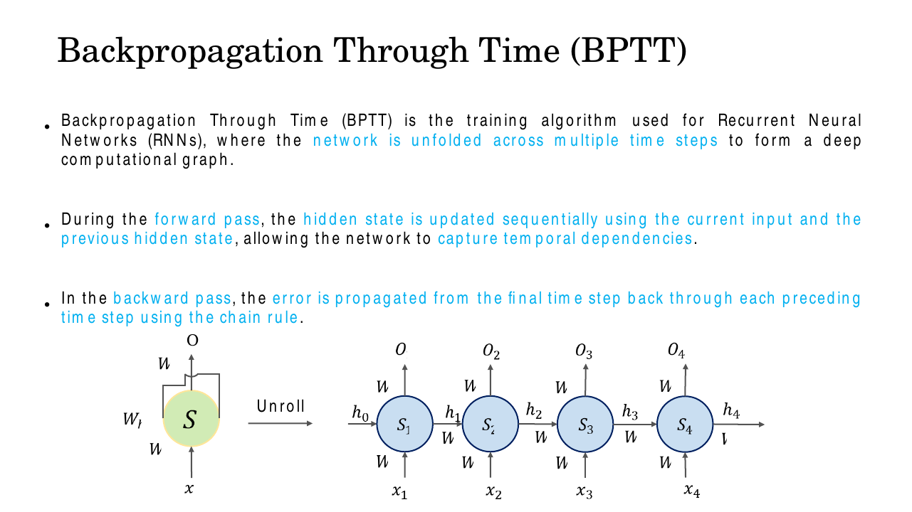
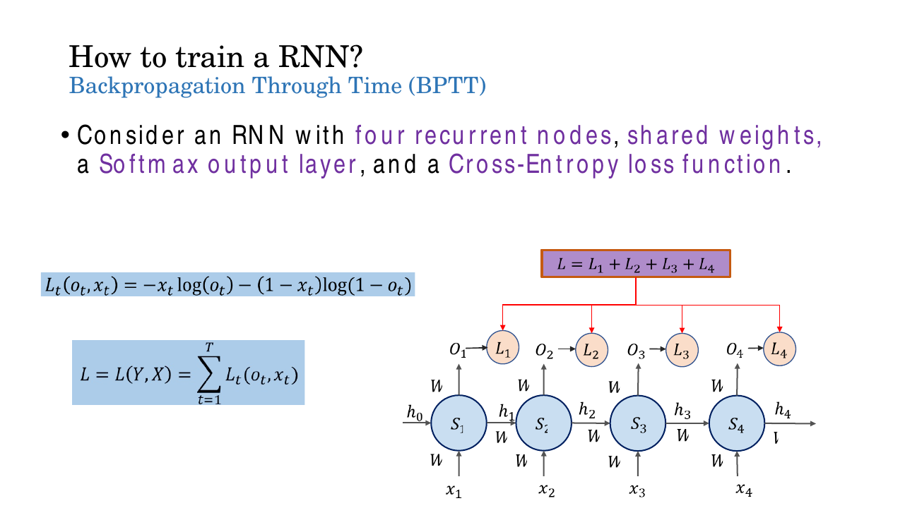
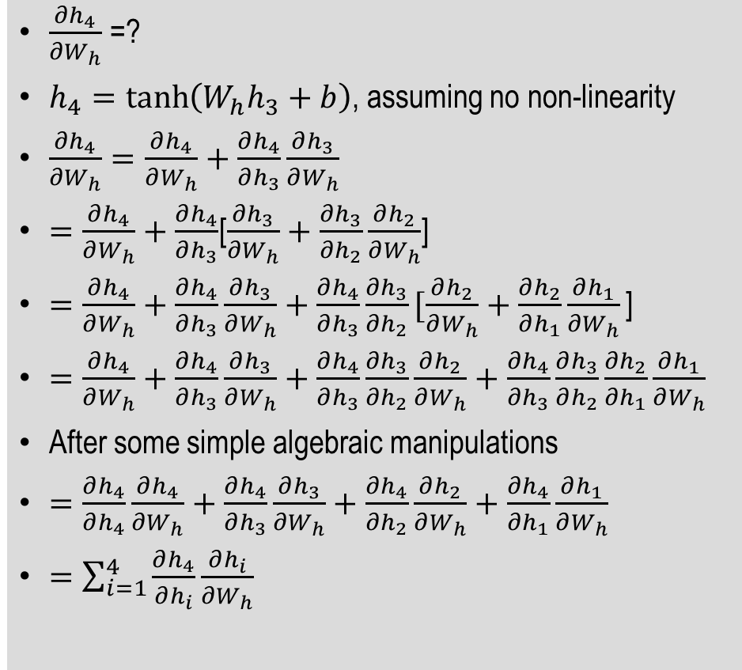
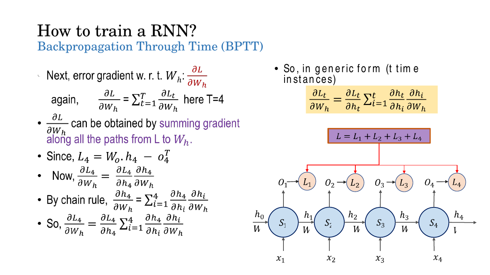
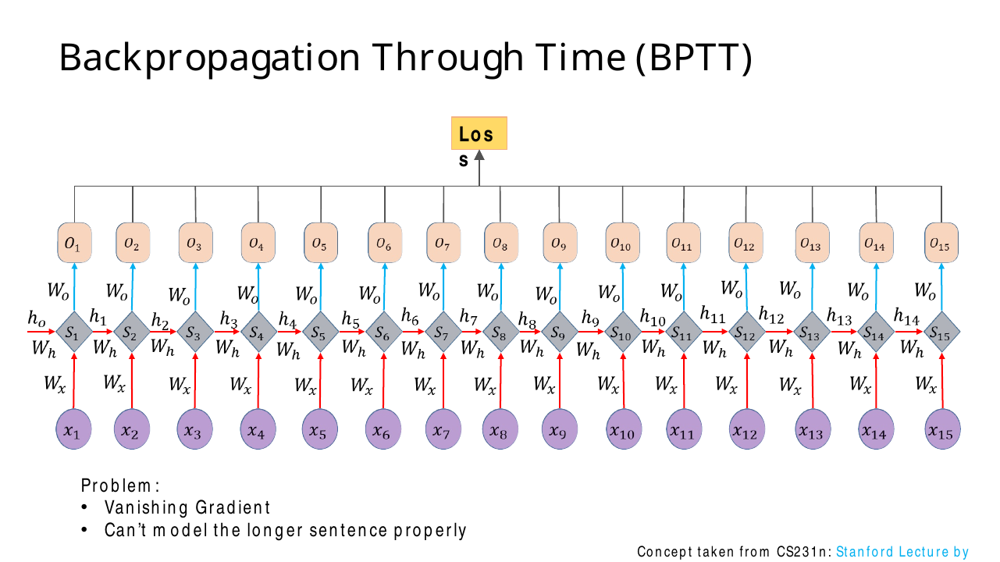
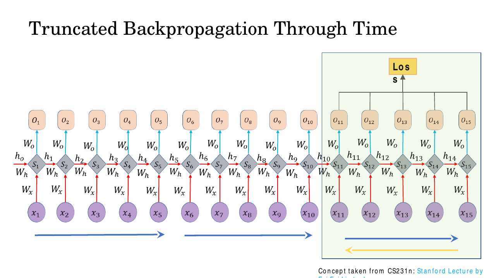
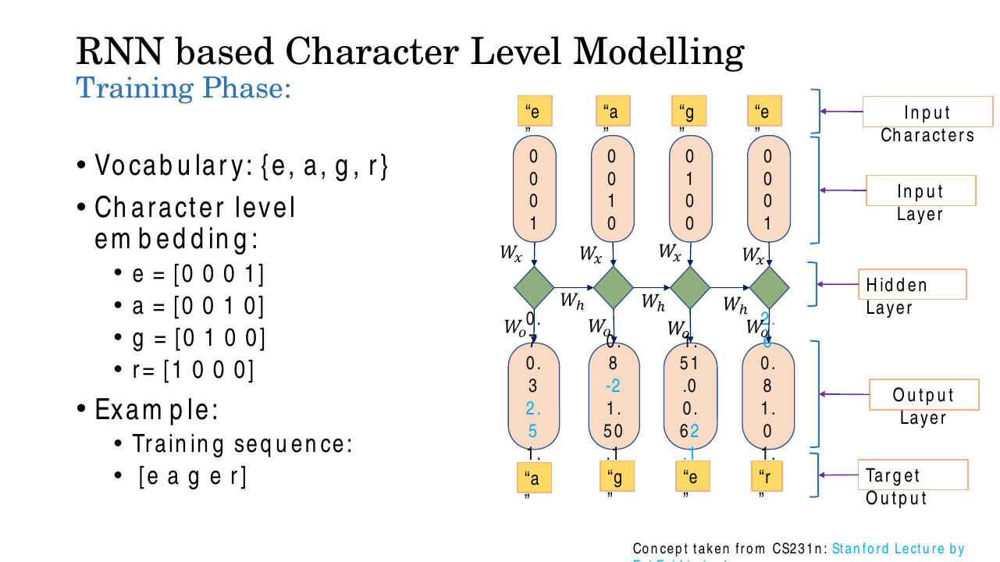
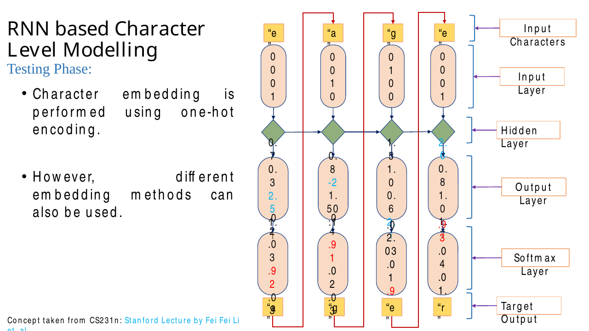
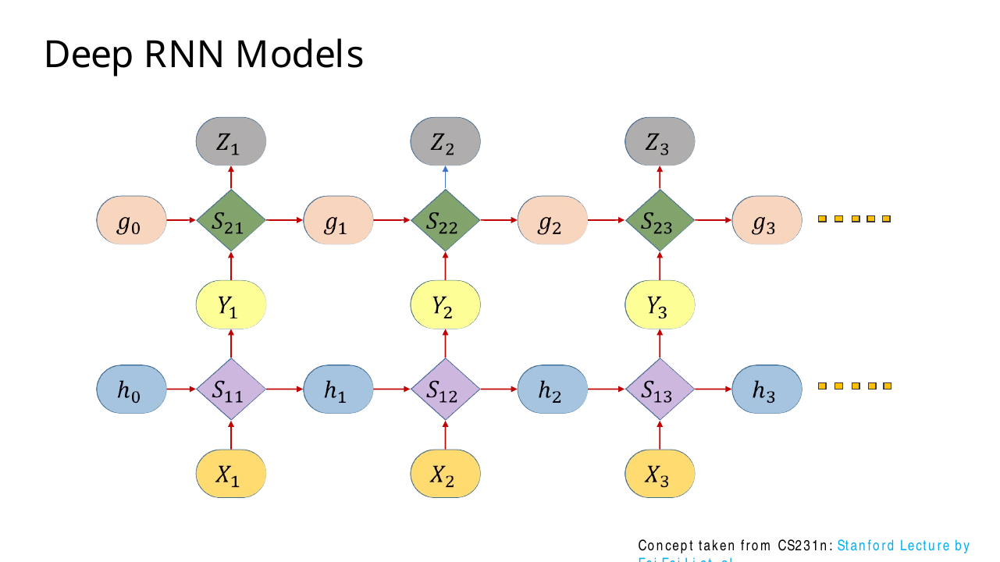
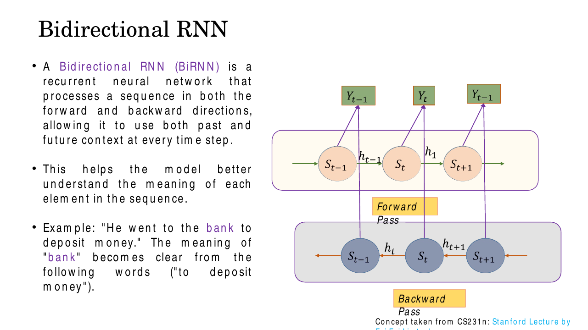

# Lec 17 — Training RNNs: Backpropagation Through Time

> **Deck:** `L6P2_BPTT_RNN.pptx` · **Week 5** · **Playlist:** Lec 17
> **Prereqs:** [Lec 16 — Sequence Modelling and RNNs](../week-04/16-sequence-modelling-and-rnn.md), [Lec 9 — Backpropagation](../week-02/09-backpropagation.md)
> **Feeds into:** [Lec 18 — LSTM](18-lstm.md), [Lec 19 — GRU, Seq2Seq, Attention](19-gru-seq2seq-attention.md)

## Why this lecture exists

[Lec 16](../week-04/16-sequence-modelling-and-rnn.md) built an RNN and ran it forward: a hidden state
carried along a sequence, one shared weight matrix applied at every step. It never said how those
weights get learned. That is this lecture. The answer sounds easy — unroll the recurrence into a
feed-forward graph and run ordinary backprop — and it almost is. But one fact changes everything:
the same matrix $\mathbf{W}_{hh}$ appears at every time step, so its gradient is not one number but a
**sum of contributions from every step**, and each contribution reaches back through a chain of
multiplications by that same matrix. Repeated multiplication by a fixed matrix either collapses to
zero or blows up. That single observation explains why vanilla RNNs cannot remember anything for long,
why we truncate training, why we clip gradients, and why the next lecture has to invent LSTM.

## The ideas

### The unrolled network: one matrix used $T$ times

Recall the recurrence compactly ([Lec 16](../week-04/16-sequence-modelling-and-rnn.md) owns its
derivation and the five input/output patterns):

$$\mathbf{h}_t = \tanh(\mathbf{W}_{hh}\mathbf{h}_{t-1} + \mathbf{W}_{xh}\mathbf{x}_t + \mathbf{b}), \qquad \mathbf{o}_t = \mathbf{W}_{hy}\mathbf{h}_t$$

The deck writes these three matrices as $W_h$, $W_x$, $W_o$; this book writes
$\mathbf{W}_{hh}, \mathbf{W}_{xh}, \mathbf{W}_{hy}$ to keep the source and target of each explicit.

**Backpropagation Through Time (BPTT)** is nothing more than: unfold the recurrence across $T$ steps
so it becomes an ordinary (very deep) feed-forward graph, then apply the chain rule backwards through
it exactly as [Lec 9](../week-02/09-backpropagation.md) derives. Forward runs left to right updating
$\mathbf{h}_t$; backward runs right to left, carrying error from the last step back through every
preceding one.


*Fig. — The unroll. Notice every arrow of the same colour is labelled with the **same** $W$ — four cells, but not four sets of weights. That is the whole difficulty in one picture. Slide 3.*

The deck's running example is $T = 4$: four recurrent nodes, a softmax output layer and a
cross-entropy loss.

### Step 1 — the total loss is a sum over time

Each time step emits a prediction, so each time step has its own loss $\mathcal{L}_t$, and the loss
you actually minimise is their sum:

$$\mathcal{L} = \mathcal{L}(\mathbf{Y}, \mathbf{X}) = \sum_{t=1}^{T}\mathcal{L}_t(\mathbf{o}_t, \mathbf{x}_t)$$


*Fig. — Four separate loss nodes, one total. Because the total is a **sum**, differentiation distributes over it — which is why every gradient below is also a sum. Slide 6.*

Because $\mathcal{L}$ is a sum, every gradient of $\mathcal{L}$ is the sum of the per-step gradients:

$$\frac{\partial\mathcal{L}}{\partial\mathbf{W}} = \sum_{t=1}^{T}\frac{\partial\mathcal{L}_t}{\partial\mathbf{W}} \qquad \text{for } \mathbf{W} \in \{\mathbf{W}_{hy}, \mathbf{W}_{hh}, \mathbf{W}_{xh}\}$$

**This is the defining equation of BPTT.** Gradients are *accumulated* across time steps and only then
applied as a single update. If you remember one line from this chapter, remember that one.

### Step 2 — the easy gradient: $\mathbf{W}_{hy}$

$\mathbf{W}_{hy}$ is used once per step and $\mathbf{o}_t$ depends on nothing but $\mathbf{h}_t$, so
there is no path through time:

$$\frac{\partial\mathcal{L}}{\partial\mathbf{W}_{hy}} = \sum_{t=1}^{T}\frac{\partial\mathcal{L}_t}{\partial\mathbf{W}_{hy}}$$

Still a sum — the matrix is shared — but each term is a plain one-layer backprop.

### Step 3 — the hard gradient: $\mathbf{W}_{hh}$ and the recursion through time

$\mathbf{W}_{hh}$ is different, and the difference is the lecture. $\mathcal{L}_4$ depends on
$\mathbf{h}_4$; $\mathbf{h}_4$ depends on $\mathbf{W}_{hh}$ directly *and* through $\mathbf{h}_3$,
which depends on it directly *and* through $\mathbf{h}_2$, and so on — four distinct paths from
$\mathcal{L}_4$ back to $\mathbf{W}_{hh}$. The deck expands them all:


*Fig. — Each line peels off one more time step. The recursion $\partial\mathbf{h}_t/\partial\mathbf{W} = \partial^{+}\mathbf{h}_t/\partial\mathbf{W} + (\partial\mathbf{h}_t/\partial\mathbf{h}_{t-1})(\partial\mathbf{h}_{t-1}/\partial\mathbf{W})$ unrolls into a sum with one term per earlier step. Slide 33 (a hidden bonus slide — the clearest derivation in the deck).*

Collapsing that expansion gives the generic form, for any number of time instances $t$:

$$\frac{\partial\mathcal{L}_t}{\partial\mathbf{W}_{hh}} = \frac{\partial\mathcal{L}_t}{\partial\mathbf{h}_t}\sum_{k=1}^{t}\frac{\partial\mathbf{h}_t}{\partial\mathbf{h}_k}\frac{\partial\mathbf{h}_k}{\partial\mathbf{W}_{hh}}$$

Read it in words: *the loss at step $t$ sends gradient back to every step $k \le t$; at each of those
steps $\mathbf{W}_{hh}$ was used, so each one contributes.* Then sum over $t$ as well, and you have
the full gradient.


*Fig. — The deck's phrasing is worth memorising verbatim: $\partial\mathcal{L}/\partial W_h$ is obtained by "summing gradient along all the paths from $L$ to $W_h$". Slide 10.*

$\mathbf{W}_{xh}$ gets the identical formula with $\mathbf{W}_{xh}$ substituted, since it too is shared
across steps (slide 11). The full algorithm: run forward over all $T$ steps caching every
$\mathbf{h}_t$; run backward over all $T$ steps accumulating the three gradients; apply **one**
gradient-descent update with the accumulated totals.

### Why gradients vanish or explode through time

Now look hard at the factor $\partial\mathbf{h}_t/\partial\mathbf{h}_k$ in that sum. It is not one
derivative; it is a chain of them:

$$\frac{\partial\mathbf{h}_t}{\partial\mathbf{h}_k} = \prod_{j=k+1}^{t}\frac{\partial\mathbf{h}_j}{\partial\mathbf{h}_{j-1}}, \qquad \frac{\partial\mathbf{h}_j}{\partial\mathbf{h}_{j-1}} = \mathrm{diag}\!\left(1 - \mathbf{h}_j^2\right)\mathbf{W}_{hh}$$

(the $\mathrm{diag}(1-\mathbf{h}_j^2)$ is $\tanh'$ evaluated at step $j$). So

$$\frac{\partial\mathbf{h}_t}{\partial\mathbf{h}_k} = \prod_{j=k+1}^{t}\mathrm{diag}(\tanh'_j)\,\mathbf{W}_{hh}$$

— a product of $t-k$ Jacobians, **each containing the same matrix $\mathbf{W}_{hh}$**. Take norms.
With $\gamma = \max_j\|\mathrm{diag}(\tanh'_j)\| \le 1$ (because $\tanh' \le 1$ everywhere) and
$\lambda_{\max}$ the largest singular value of $\mathbf{W}_{hh}$:

$$\left\|\frac{\partial\mathbf{h}_t}{\partial\mathbf{h}_k}\right\| \le (\gamma\,\lambda_{\max})^{\,t-k}$$

An exponential in the *temporal distance*. The verdict is decided entirely by one scalar:

| Condition | Behaviour of $\partial\mathbf{h}_t/\partial\mathbf{h}_k$ as $t-k$ grows | Symptom |
|---|---|---|
| $\gamma\lambda_{\max} < 1$ | $\to 0$ geometrically | **vanishing gradient** — early steps get no learning signal |
| $\gamma\lambda_{\max} > 1$ | $\to \infty$ geometrically | **exploding gradient** — `NaN` loss, weights thrown to nonsense |
| $\gamma\lambda_{\max} = 1$ | stays $O(1)$ | the razor's edge nobody lands on by accident |

**Contrast with the depth-wise version.** [Lec 13](../week-03/13-vanishing-gradients-activations.md)
owns the general story: a product of per-layer Jacobians, each shrunk by $\sigma' \le 0.25$. But there
layer $l$ has its *own* $\mathbf{W}^{(l)}$, so the product is of *different* matrices and the shrinkage
partly averages out. Here it is **one matrix raised to the power $t-k$** — no averaging, whatever
$\lambda_{\max}$ is you get it $t-k$ times over. That is why a 50-step RNN is harder to train than a
50-layer CNN.

Notice *what* vanishes. The total gradient does not become zero — the $k = t$ and $k = t-1$ terms are
perfectly healthy. What dies is the contribution from *distant* $k$, so the gradient becomes dominated
by the last few steps: the network learns short-range structure happily and is simply blind to
long-range structure. That is the deck's complaint on slide 13, "Can't model the longer sentence
properly."


*Fig. — Fifteen steps is already deep. Real text needs hundreds. The gradient reaching $S_1$ from the loss has been multiplied by $\mathbf{W}_{hh}$ fourteen times. Slide 13.*

### Gradient clipping — the fix for explosion

Explosion is the easy half, because it is *detectable*: compute the gradient, measure its norm, and if
it is absurd, shrink it. **Gradient clipping by norm**: given the full gradient vector $\mathbf{g}$
(all parameters concatenated) and a threshold $\theta$,

$$\mathbf{g} \leftarrow \mathbf{g} \ \text{ if } \|\mathbf{g}\| \le \theta; \qquad \mathbf{g} \leftarrow \frac{\theta}{\|\mathbf{g}\|}\,\mathbf{g} \ \text{ if } \|\mathbf{g}\| > \theta$$

The rescaling **preserves the direction** and caps only the magnitude — the direction of a huge
gradient is usually still informative, it is the step length that is lethal. Typical $\theta$ is 1 to
5. Clipping does **nothing** for vanishing gradients: you cannot amplify a signal already multiplied
into numerical zero. That asymmetry is the most examinable fact about clipping, and the reason
[Lec 18](18-lstm.md) exists.

### Truncated BPTT

Even setting gradients aside, full BPTT on a long sequence is infeasible:

- **Memory** grows linearly with $T$ — every $\mathbf{h}_t$ must be cached for the backward pass (N5
  puts a number on it).
- **Compute** per update grows linearly with $T$, and you get *one* update per sequence. On a
  million-character corpus treated as one sequence you would wait a million forward steps for a single
  weight change.

**Truncated BPTT** fixes both. The deck's two defining sentences:

> Run forward and backward through chunks of the sequence instead of whole sequence.
>
> Carry hidden states forward in time **forever**, but only backpropagate for some smaller number of
> steps.

The forward/backward distinction is the subtle part and it is where MCQs live:

| | Forward pass | Backward pass |
|---|---|---|
| Span | the **whole** sequence, chunk after chunk | **one chunk only** ($k$ steps) |
| Hidden state | $\mathbf{h}$ at a chunk boundary is **carried into** the next chunk | gradient is **cut** at the boundary, not carried |
| Consequence | the model still *sees* unlimited context | the model cannot *learn* dependencies longer than $k$ |


*Fig. — Blue arrows (forward) march across every chunk; the yellow backward arrow exists only inside the green box. The hidden state crosses boundaries; the gradient does not. Slide 16.*

The cost is permanent: **any dependency longer than the truncation window is never learned**, because
no gradient ever connects the two ends. If your task needs 200-step memory and you truncate at 25, no
amount of training will find it.

Slide 17 teases the **sequence-to-sequence (encoder–decoder)** model, a many-to-one encoder bolted to
a one-to-many decoder — see [Lec 19](19-gru-seq2seq-attention.md), which owns it.

### Character-level RNN: the training phase

This is the deck's worked example and the clearest thing on it. Vocabulary $\{e, a, g, r\}$,
$V = 4$. Each character is **one-hot encoded**: a vector of $V$ zeros with a single 1 at that
character's index.

| Character | One-hot |
|---|---|
| $r$ | $[1,0,0,0]^\top$ |
| $g$ | $[0,1,0,0]^\top$ |
| $a$ | $[0,0,1,0]^\top$ |
| $e$ | $[0,0,0,1]^\top$ |

Training sequence: `e a g e r`. The task is **next-character prediction**, so inputs are
`e, a, g, e` and targets are `a, g, e, r` — the same string shifted by one.


*Fig. — Five labelled rows: input characters → one-hot input layer → hidden layer → output layer (raw scores) → target output. The targets are the inputs shifted left by one. Slide 21.*

At each step: $\mathbf{h}_t = \tanh(\mathbf{W}_{hh}\mathbf{h}_{t-1} + \mathbf{W}_{xh}\mathbf{x}_t)$,
then $\mathbf{o}_t = \mathbf{W}_{hy}\mathbf{h}_t$ gives $V$ raw scores (**logits**), softmax turns them
into a distribution over the vocabulary, and cross-entropy against the one-hot target gives
$\mathcal{L}_t$. Sum the four, run BPTT, update once. N3 does step 1 end to end with the deck's numbers.

**Teacher forcing.** Look at what is fed in at step 3: the *true* character `g` from the training
string — **not** whatever the model predicted at step 2. Feeding the ground-truth previous token during
training is **teacher forcing**. It makes training stable, because every step gets a correct input
regardless of how badly the previous step did.

### Character-level RNN: the testing phase, and exposure bias

At test time there is no ground truth to feed. So the loop closes on itself:

1. Feed a seed character (here `e`).
2. Compute logits, apply softmax to get a distribution over the vocabulary.
3. **Sample** a character from that distribution (or take the argmax — "greedy" decoding).
4. One-hot encode the sampled character and feed it back in as the next input.
5. Repeat.


*Fig. — The red arrows are the whole difference from training: the model's **own** output becomes the next input. A softmax layer now sits between the output layer and the sampled character. Slide 28.*

This mode is called **free-running**, and the gap between it and teacher forcing has a name:
**exposure bias**. During training the model only ever saw correct prefixes; at test time it sees
prefixes it generated itself, containing its own mistakes — a distribution it was never trained on. One
wrong character produces a context the model has no experience of, making the next character more
likely to be wrong, so errors compound along the generated sequence. It is a structural weakness of
teacher-forced autoregressive training, not a bug in any particular model.

Why *sample* rather than always take the argmax? Greedy decoding is deterministic, so the same seed
always produces the same string and the model can get stuck in loops. Sampling gives diverse outputs,
which is what lets a character-level RNN *generate* rather than merely *complete*.

### Deep (stacked) RNNs

Stack recurrent layers vertically: the hidden-state sequence produced by layer 1 becomes the input
sequence to layer 2.

$$\mathbf{h}^{(1)}_t = f(\mathbf{W}^{(1)}_{hh}\mathbf{h}^{(1)}_{t-1} + \mathbf{W}^{(1)}_{xh}\mathbf{x}_t), \qquad \mathbf{h}^{(2)}_t = f(\mathbf{W}^{(2)}_{hh}\mathbf{h}^{(2)}_{t-1} + \mathbf{W}^{(2)}_{xh}\mathbf{h}^{(1)}_t)$$


*Fig. — Two recurrences running in parallel at different levels of abstraction. Each layer has its **own** $\mathbf{W}_{hh}$; sharing is across *time*, never across *depth*. Slide 29.*

Lower layers capture local structure (character shapes, morphemes), higher layers longer-range
structure. In practice 2–4 layers is the useful range: deeper stacks hit the ordinary depth-wise
vanishing-gradient problem *on top of* the temporal one. A stacked RNN is still causal, so it can run
in real time.

### Bidirectional RNNs

A plain RNN at step $t$ has seen $\mathbf{x}_1 \dots \mathbf{x}_t$ and nothing after. A
**bidirectional RNN** runs two independent recurrences — one left-to-right, one right-to-left — and
concatenates their hidden states at each position, so every output sees both past and future context.


*Fig. — Two separate chains, two separate sets of weights, one combined output per position. The backward chain's arrows genuinely point the other way. Slide 30.*

The deck's example is the right one: *"He went to the bank to deposit money."* The sense of **bank** is
fixed by words that come *after* it, and a forward-only RNN has already committed to a representation
of "bank" before it reads "deposit".

**The constraint that gets examined:** a bidirectional RNN needs the **entire sequence available
before it can produce any output**, because the backward chain starts at the end. That rules out
streaming and real-time generation — live transcription, autoregressive text generation, anything
where the future does not exist yet. It is fine offline: sentence classification, named-entity
tagging, offline translation.

| | Deep (stacked) RNN | Bidirectional RNN |
|---|---|---|
| Direction | forward only | forward **and** backward |
| Needs whole sequence first? | No | **Yes** |
| Usable for real-time generation? | Yes | **No** |
| Parameter cost vs. 1-layer | $\times$ number of layers | $\times 2$ |
| Adds | abstraction (depth) | future context |

## Worked numericals

### N1. Gradient survival through time for $\lambda_{\max} = 0.8$ vs $1.2$
**Given:** $\|\partial\mathbf{h}_t/\partial\mathbf{h}_k\| \approx \lambda_{\max}^{\,t-k}$ (taking
$\gamma \approx 1$, i.e. $\tanh$ operating near its linear region). Two networks: $\lambda_{\max}=0.8$
and $\lambda_{\max}=1.2$.
**Find:** the gradient magnitude surviving from step $t$ back to steps 5, 10, 20 and 50 earlier.

1. $0.8^5 = 0.32768$;  $1.2^5 = 2.48832$.
2. $0.8^{10} = (0.8^5)^2 = 0.32768^2 = 0.10737$;  $1.2^{10} = 2.48832^2 = 6.1917$.
3. $0.8^{20} = 0.10737^2 = 0.011529$;  $1.2^{20} = 6.1917^2 = 38.338$.
4. $0.8^{50}$: $\ln 0.8 = -0.22314$, $\times 50 = -11.157$, $e^{-11.157} = 1.427\times10^{-5}$.
5. $1.2^{50}$: $\ln 1.2 = 0.18232$, $\times 50 = 9.1161$, $e^{9.1161} = 9.10\times10^{3}$.

| Steps back $(t-k)$ | $\lambda_{\max}=0.8$ | $\lambda_{\max}=1.2$ |
|---|---|---|
| 5 | 0.328 | 2.49 |
| 10 | 0.107 | 6.19 |
| 20 | 0.0115 | 38.3 |
| 50 | $1.43\times10^{-5}$ | $9.10\times10^{3}$ |

**Answer:** at $\lambda_{\max}=0.8$ only $0.0014\%$ of the gradient survives 50 steps — the signal is
gone. At $\lambda_{\max}=1.2$ it is amplified **9,100×** — the update overflows. A 50% change in one
scalar flips total silence into total chaos.

### N2. BPTT gradient accumulation over 3 time steps
**Given:** a scalar RNN $h_t = w\,h_{t-1} + x_t$ with $w = 0.5$, $h_0 = 1$, inputs
$x = (1,1,1)$, targets $y = (1,2,3)$, loss $\mathcal{L}_t = \tfrac12(h_t-y_t)^2$.
**Find:** the three per-step contributions $\partial\mathcal{L}_t/\partial w$, their sum, and one SGD
step at $\eta = 0.1$.

1. Forward: $h_1 = 0.5(1)+1 = 1.5$; $h_2 = 0.5(1.5)+1 = 1.75$; $h_3 = 0.5(1.75)+1 = 1.875$.
2. Errors: $e_1 = 1.5-1 = 0.5$; $e_2 = 1.75-2 = -0.25$; $e_3 = 1.875-3 = -1.125$.
3. Recursion $d_t \equiv \partial h_t/\partial w = h_{t-1} + w\,d_{t-1}$, with $d_0 = 0$:
   $d_1 = 1 + 0.5(0) = 1$; $d_2 = 1.5 + 0.5(1) = 2.0$; $d_3 = 1.75 + 0.5(2.0) = 2.75$.
4. Sanity-check $d_3$ by path-summing instead (the deck's "sum over all paths"):
   $d_3 = 1\cdot h_2 + w\cdot h_1 + w^2\cdot h_0 = 1.75 + 0.5(1.5) + 0.25(1) = 1.75+0.75+0.25 = 2.75$ ✓
5. Contributions $\partial\mathcal{L}_t/\partial w = e_t\,d_t$:
   $t=1$: $(0.5)(1) = \mathbf{+0.5}$
   $t=2$: $(-0.25)(2.0) = \mathbf{-0.5}$
   $t=3$: $(-1.125)(2.75) = \mathbf{-3.09375}$
6. Accumulate: $\partial\mathcal{L}/\partial w = 0.5 - 0.5 - 3.09375 = -3.09375$.
7. Update: $w \leftarrow 0.5 - 0.1(-3.09375) = 0.5 + 0.309375 = 0.809375$.

**Answer:** per-step contributions $+0.5,\ -0.5,\ -3.09375$; summed gradient $-3.09375$; updated
$w = 0.809375$. Note that the first two contributions nearly cancel — you would get a badly wrong
answer by using any single step's gradient instead of the sum.

### N3. One character-level step: softmax and cross-entropy
**Given:** the deck's vocabulary $\{e,a,g,r\}$ with one-hot index order $(r,g,a,e)$. Input
$\mathbf{x}_1 = $ "e" $= [0,0,0,1]^\top$. The deck's output-layer scores at step 1 are
$\mathbf{o}_1 = [0.7,\ 0.3,\ 2.5,\ 1.1]^\top$. Target character: "a".
**Find:** the softmax distribution, the loss $\mathcal{L}_1$, and $\partial\mathcal{L}_1/\partial\mathbf{o}_1$.

1. Exponentiate: $e^{0.7}=2.0138$, $e^{0.3}=1.3499$, $e^{2.5}=12.1825$, $e^{1.1}=3.0042$.
2. Sum: $2.0138+1.3499+12.1825+3.0042 = 18.5503$.
3. Divide:
   $p(r) = 2.0138/18.5503 = 0.1086$
   $p(g) = 1.3499/18.5503 = 0.0728$
   $p(a) = 12.1825/18.5503 = \mathbf{0.6567}$
   $p(e) = 3.0042/18.5503 = 0.1620$
   (check: they sum to 1.0000 ✓)
4. Cross-entropy against the one-hot target "a" keeps only the target term:
   $\mathcal{L}_1 = -\sum_i y_i\ln p_i = -\ln(0.6567) = \mathbf{0.4205}$ nats.
5. Output-layer gradient is the softmax–cross-entropy shortcut $\mathbf{p}-\mathbf{y}$:
   $[0.1086,\ 0.0728,\ 0.6567-1,\ 0.1620] = [0.1086,\ 0.0728,\ -0.3433,\ 0.1620]$.

**Answer:** $\mathbf{p}_1 = [0.109,\ 0.073,\ 0.657,\ 0.162]$, $\mathcal{L}_1 = 0.4205$,
$\partial\mathcal{L}_1/\partial\mathbf{o}_1 = [0.109,\ 0.073,\ -0.343,\ 0.162]$. The model already
favours the right answer, and the gradient pushes "a" up while pushing the other three down — the
negative entry is always, and only, at the target index.

### N4. Gradient clipping by norm
**Given:** accumulated gradient $\mathbf{g} = [6,\ 8,\ 24]^\top$, clip threshold $\theta = 5$.
**Find:** the clipped gradient and its norm.

1. $\|\mathbf{g}\| = \sqrt{6^2+8^2+24^2} = \sqrt{36+64+576} = \sqrt{676} = 26$.
2. $26 > 5$, so clipping triggers.
3. Scale factor $= \theta/\|\mathbf{g}\| = 5/26 = 0.19231$.
4. $\mathbf{g}' = 0.19231\,[6,8,24]^\top = [1.1538,\ 1.5385,\ 4.6154]^\top$.
5. Verify: $\|\mathbf{g}'\| = 0.19231 \times 26 = 5.000$ ✓
6. Direction check: $\mathbf{g}'/\|\mathbf{g}'\| = [0.2308, 0.3077, 0.9231] = \mathbf{g}/\|\mathbf{g}\|$ ✓

**Answer:** $\mathbf{g}' = [1.154,\ 1.538,\ 4.615]^\top$, norm exactly 5, **same direction**. Only the
step length changed.

### N5. Memory: full BPTT vs truncated BPTT
**Given:** sequence length $T = 1000$, hidden size $n = 256$, batch $B = 32$, float32 (4 bytes).
Truncation window $k = 50$.
**Find:** hidden-state cache size for each, and the number of updates per sequence.

1. Full BPTT caches $\mathbf{h}_t$ for all $t$: $32 \times 1000 \times 256 = 8{,}192{,}000$ floats.
2. Bytes: $8{,}192{,}000 \times 4 = 32{,}768{,}000$ B $= \mathbf{32.77}$ **MB**.
3. Truncated keeps only one window: $32 \times 50 \times 256 = 409{,}600$ floats.
4. Bytes: $409{,}600 \times 4 = 1{,}638{,}400$ B $= \mathbf{1.64}$ **MB**.
5. Ratio: $32.768/1.6384 = 20\times$ less memory (exactly $T/k$).
6. Updates per sequence: full BPTT gives $1$; truncated gives $1000/50 = \mathbf{20}$.

**Answer:** 32.77 MB → 1.64 MB, a 20× reduction, *and* 20× more weight updates for the same amount of
forward computation. Truncation buys memory and optimisation speed; it pays with dependencies longer
than 50 steps, which become unlearnable.

## Code

A character-level RNN forward pass, then BPTT run **once per time-step loss** so you can see each
$\partial\mathcal{L}_t/\partial\mathbf{W}_{hh}$ separately before they are summed — the defining
accumulation of this chapter, made literal.

```python
import numpy as np
np.random.seed(0)

vocab = ['r', 'g', 'a', 'e']          # index order matches the deck's one-hot layout
V, n  = 4, 3                          # vocabulary size, hidden size
idx   = {c: i for i, c in enumerate(vocab)}

Wxh = np.random.randn(n, V) * 0.5     # input  -> hidden
Whh = np.random.randn(n, n) * 0.5     # hidden -> hidden   (the SHARED matrix)
Why = np.random.randn(V, n) * 0.5     # hidden -> output

seq, tgt = "eage", "ager"             # teacher forcing: inputs are the TRUE characters
xs = [np.eye(V)[:, idx[c]].reshape(V, 1) for c in seq]
ys = [idx[c] for c in tgt]
T  = len(seq)

def forward(Wxh, Whh, Why):
    hs, ps, loss = {-1: np.zeros((n, 1))}, {}, 0.0
    for t in range(T):
        hs[t] = np.tanh(Wxh @ xs[t] + Whh @ hs[t - 1])
        o = Why @ hs[t]
        e = np.exp(o - o.max()); ps[t] = e / e.sum()      # softmax
        loss += -np.log(ps[t][ys[t], 0])                  # cross-entropy
    return hs, ps, loss

hs, ps, loss = forward(Wxh, Whh, Why)
print(f"total loss  L = sum_t L_t = {loss:.4f}")

contribs = []
for t in range(T):                                   # one FULL backward pass per L_t
    do = ps[t].copy(); do[ys[t]] -= 1.0               # dL_t/do_t = p_t - y_t
    dh = Why.T @ do
    dWhh_t = np.zeros_like(Whh)
    for k in range(t, -1, -1):                        # walk back through time
        draw    = (1 - hs[k] ** 2) * dh               # through the tanh
        dWhh_t += draw @ hs[k - 1].T                  # W_hh is reused at EVERY k
        dh      = Whh.T @ draw                        # multiply by W_hh^T again
    contribs.append(dWhh_t)
    print(f"  ||dL_{t+1}/dWhh||_F = {np.linalg.norm(dWhh_t):.4f}")

dWhh = sum(contribs)                                  # <-- the accumulation
print("summed dL/dWhh =\n", np.round(dWhh, 4))

eps, num = 1e-5, np.zeros_like(Whh)                   # numerical gradient check
for i in range(n):
    for j in range(n):
        p_ = Whh.copy(); p_[i, j] += eps
        m_ = Whh.copy(); m_[i, j] -= eps
        num[i, j] = (forward(Wxh, p_, Why)[2] - forward(Wxh, m_, Why)[2]) / (2 * eps)
print("max |analytic - numeric| =", f"{np.abs(dWhh - num).max():.2e}")
```

```text
total loss  L = sum_t L_t = 6.0710
  ||dL_1/dWhh||_F = 0.0000
  ||dL_2/dWhh||_F = 0.7590
  ||dL_3/dWhh||_F = 0.4958
  ||dL_4/dWhh||_F = 0.9903
summed dL/dWhh =
 [[-0.0423  0.1468 -0.2971]
 [-0.4054 -0.3021  0.1251]
 [ 0.1102  0.0721  0.0724]]
max |analytic - numeric| = 9.81e-11
```

Three things to read off that output. First, $\partial\mathcal{L}_1/\partial\mathbf{W}_{hh}$ is
**exactly zero** — $\mathcal{L}_1$ depends on $\mathbf{h}_1 = \tanh(\mathbf{W}_{hh}\mathbf{h}_0 + \dots)$
and $\mathbf{h}_0 = \mathbf{0}$, so $\mathbf{W}_{hh}$ did nothing at step 1. Second, the four
contributions are genuinely different and none of them equals the total. Third, the numerical check
agreeing to $10^{-10}$ proves that the *sum* really is the true gradient — which is the one claim this
whole chapter rests on.

## Exam pack

### Must-memorise

| Item | Exactly this |
|---|---|
| BPTT, in one line | Unfold the RNN over $T$ steps into a feed-forward graph; apply the chain rule backwards |
| Total loss | $\mathcal{L} = \sum_{t=1}^{T}\mathcal{L}_t$ |
| **The defining equation** | $\dfrac{\partial\mathcal{L}}{\partial\mathbf{W}} = \sum_{t=1}^{T}\dfrac{\partial\mathcal{L}_t}{\partial\mathbf{W}}$ — gradients are **accumulated** over time steps, then one update |
| Generic per-step form | $\dfrac{\partial\mathcal{L}_t}{\partial\mathbf{W}_{hh}} = \dfrac{\partial\mathcal{L}_t}{\partial\mathbf{h}_t}\displaystyle\sum_{k=1}^{t}\dfrac{\partial\mathbf{h}_t}{\partial\mathbf{h}_k}\dfrac{\partial\mathbf{h}_k}{\partial\mathbf{W}_{hh}}$ |
| One-step Jacobian | $\partial\mathbf{h}_j/\partial\mathbf{h}_{j-1} = \mathrm{diag}(1-\mathbf{h}_j^2)\,\mathbf{W}_{hh}$ |
| Gradient through time | $\dfrac{\partial\mathbf{h}_t}{\partial\mathbf{h}_k} = \prod_{j=k+1}^{t}\mathrm{diag}(\tanh'_j)\mathbf{W}_{hh}$ — a product of $(t-k)$ Jacobians |
| Vanish / explode criterion | $\gamma\lambda_{\max} < 1 \Rightarrow$ vanish; $> 1 \Rightarrow$ explode ($\lambda_{\max}$ = largest singular value / spectral radius of $\mathbf{W}_{hh}$) |
| Gradient clipping | if $\|\mathbf{g}\| > \theta$: $\mathbf{g} \leftarrow (\theta/\|\mathbf{g}\|)\mathbf{g}$ — direction preserved |
| Truncated BPTT | Forward over the whole sequence carrying $\mathbf{h}$ across chunks; backward **within one chunk only** |
| Teacher forcing | Feed the **true** previous token during training |
| Free-running / exposure bias | At test time feed the model's **own** output; it never trained on its own mistakes, so errors compound |
| Bidirectional RNN | Two chains (forward + backward), outputs concatenated; **needs the whole sequence up front** |

### Numbers worth knowing

| Quantity | Value |
|---|---|
| Deck's running example length $T$ | 4 (slides 5–12); 15 in the vanishing-gradient figure (slide 13) |
| Deck's vocabulary | $\{e, a, g, r\}$, $V = 4$; sequence `e a g e r` |
| Deck's one-hot codes | $e=[0001]$, $a=[0010]$, $g=[0100]$, $r=[1000]$ |
| Deck's step-1 output scores | $[0.7, 0.3, 2.5, 1.1]$ → true softmax $[0.109, 0.073, 0.657, 0.162]$, $\mathcal{L}_1 = 0.4205$ |
| Weight matrices to differentiate | **3** — $\mathbf{W}_{xh}$, $\mathbf{W}_{hh}$, $\mathbf{W}_{hy}$ (deck: $W_x, W_h, W_o$) |
| $\max \tanh'$ | $1$ (at $0$); compare $\max\sigma' = 0.25$ |
| Typical clip threshold $\theta$ | 1–5 |
| Gradient surviving 50 steps at $\lambda_{\max}=0.8$ | $1.43\times10^{-5}$ |
| Gradient surviving 50 steps at $\lambda_{\max}=1.2$ | $9.10\times10^{3}$ |
| Typical useful stack depth | 2–4 layers |
| BiRNN parameter cost | $2\times$ a unidirectional RNN |

### Likely MCQ traps

- **"BPTT averages the per-step gradients."** No — it **sums** them. (Some implementations divide by
  $T$ afterwards for scale, but the algorithm is accumulation.)
- **"Each time step has its own weights, so BPTT updates $T$ matrices."** No — exactly three matrices,
  shared across all steps. One update, not $T$.
- **"Gradient clipping fixes vanishing gradients."** No. Clipping caps explosions only; vanishing needs
  architecture — gating ([Lec 18](18-lstm.md)) or skip connections.
- **"Clipping changes the gradient direction."** No — norm clipping rescales, leaving the direction
  untouched. (Element-wise *value* clipping does distort it; different method.)
- **"Truncated BPTT shortens the forward pass too."** No — forward pass and hidden state run through
  the entire sequence; only the **backward** pass is confined to a window.
- **"Truncated BPTT still learns long dependencies, just more slowly."** No. Dependencies longer than
  the window are **never** learned — there is no gradient path at all.
- **"A bidirectional RNN can be used for real-time generation."** No — the backward chain starts at the
  end of the sequence, so nothing can be output until the whole input exists. Classic trap.
- **"Deep RNN = bidirectional RNN."** Different axes: deep stacks *layers*, bidirectional adds a
  *reverse-time* pass. They combine.
- **"The vanishing problem here is the same as in deep CNNs."** Worse: a CNN multiplies *different*
  $\mathbf{W}^{(l)}$; an RNN raises the **same** $\mathbf{W}_{hh}$ to a power.
- **"Teacher forcing is used at test time as well."** No — at test time the model's own sampled output
  is fed back; the mismatch is exposure bias.
- **"Vanishing gradients give NaN."** No, that is explosion. Vanishing is **silent** — the model trains,
  the loss falls a little, and it simply never learns anything long-range.

### Self-test

1. Write the expression for $\partial\mathcal{L}/\partial\mathbf{W}_{hh}$ in terms of per-step losses, and say in one phrase why the sum appears.
2. An RNN runs for $T=6$ steps. How many times is $\mathbf{W}_{hh}$ used in the forward pass, and how many weight matrices are updated?
3. $\mathbf{W}_{hh}$ has largest singular value $0.9$. Roughly what fraction of a gradient survives 30 steps back?
4. $\|\mathbf{g}\| = 40$ and $\theta = 8$. Give the scale factor and $\|\mathbf{g}'\|$.
5. In truncated BPTT with window $k$, which quantity crosses chunk boundaries and which does not?
6. For logits $[1.0, 2.0, 3.0]$ with target index 3, compute the softmax and the cross-entropy loss.
7. Why can a bidirectional RNN not be used for streaming speech recognition?
8. Name the training-time and test-time input policies for an autoregressive RNN, and the problem caused by their mismatch.
9. True or false: gradient clipping is the standard remedy for the vanishing-gradient problem.
10. In the deck's example, the vocabulary is $\{e,a,g,r\}$ and the training string is `eager`. What are the four inputs and the four targets?

<details><summary>Answers</summary>

1. $\partial\mathcal{L}/\partial\mathbf{W}_{hh} = \sum_{t=1}^{T}\partial\mathcal{L}_t/\partial\mathbf{W}_{hh}$. The sum appears because $\mathcal{L} = \sum_t \mathcal{L}_t$ **and** because the same $\mathbf{W}_{hh}$ is reused at every step, so every step contributes a path.
2. Used 6 times; still only **3** matrices updated ($\mathbf{W}_{xh}, \mathbf{W}_{hh}, \mathbf{W}_{hy}$).
3. $0.9^{30}$. $\ln 0.9 = -0.10536$, $\times 30 = -3.161$, $e^{-3.161} \approx 0.0424$ — about **4%**.
4. Scale $= 8/40 = 0.2$; $\|\mathbf{g}'\| = 8$ exactly, direction unchanged.
5. The **hidden state** crosses boundaries (carried forward); the **gradient** does not (cut at the boundary).
6. $e^1=2.7183, e^2=7.3891, e^3=20.0855$; sum $=30.1929$; $p = [0.0900, 0.2447, 0.6652]$. $\mathcal{L} = -\ln(0.6652) = 0.4076$.
7. Its backward chain starts at the final time step, so no output can be produced until the entire utterance has been received — incompatible with streaming.
8. Training: **teacher forcing** (true previous token). Test: **free-running** (own sampled output). The mismatch is **exposure bias**, and it makes errors compound along the generated sequence.
9. **False.** Clipping only addresses exploding gradients. Vanishing needs gating (LSTM/GRU) or skip connections.
10. Inputs `e, a, g, e`; targets `a, g, e, r` — the string shifted left by one.

</details>

## Beyond the slides

**Gap:** The deck names the vanishing-gradient problem on slide 13 but never shows *why* — no Jacobian
product, no mention of $\mathbf{W}_{hh}$'s spectral radius.
**Why it matters:** Without the $\prod\mathrm{diag}(\tanh')\mathbf{W}_{hh}$ product you cannot answer
"what property of $\mathbf{W}_{hh}$ decides vanishing vs exploding", the most-asked question here. The
derivation is in *Why gradients vanish or explode through time*.

**Gap:** Gradient clipping is never mentioned, in any form.
**Why it matters:** It is the standard fix for exploding gradients and appears in every RNN codebase.
"How do you handle exploding gradients in an RNN?" has exactly one expected answer, and the deck does
not contain it.

**Gap:** The testing-phase slides show the output being fed back but never name **teacher forcing**,
**free-running** or **exposure bias**.
**Why it matters:** These are the standard terms, and the train/test mismatch is the reason generated
text drifts off the rails. The picture is on slide 28; the vocabulary is not.

**Gap:** The deck's printed softmax columns are **not** the softmax of its printed output-layer
columns. Scores $[0.7, 0.3, 2.5, 1.1]$ give $[0.109, 0.073, 0.657, 0.162]$, not the printed
$[.02,.03,.92,.03]$; at step 2 the printed softmax peaks at the *second* entry ("g") while the largest
printed score sits at the *third*, so the two columns disagree outright.
**Why it matters:** If an exam asks for a softmax, compute it — do not pattern-match the deck. The
printed probabilities are illustrative (sharpened to make the argmax obvious); the mechanism is
correct. N3 does the honest arithmetic.

**Gap:** Nothing on the truncation-window trade-off, nor that the hidden state must be **detached**
from the graph at chunk boundaries.
**Why it matters:** "Window too small → long dependencies unlearnable; too large → memory and
vanishing both return" is the exam-ready statement, and detaching the state is the one line every
truncated-BPTT implementation needs.

## Cut from the slides

Slides 1, 2, 31 and 32 are title, contents, summary and next-lecture cards — pure navigation, dropped.
Slides 4–13 are one build-up animation of a $T=4$ unrolled network, each frame adding a red arrow or a
bullet; compressed to three figures (slide 3 unroll, slide 6 summed loss, slide 10 generic backward
form) plus the hidden slide 33, which is **kept in full** — it states the
$\partial\mathbf{h}_4/\partial\mathbf{W}_h$ expansion more completely than any visible slide. Slide 11
($\mathbf{W}_x$ handled "similarly to $\mathbf{W}_h$") is one sentence here. Slides 14–16 animate
truncated BPTT growing from one chunk to three; only the complete three-chunk frame (16) is shown.
Slides 18–21 and 22–28 build the character-level training and testing diagrams row by row and column by
column; each run is collapsed to its final frame (21, 28) and converted into numerical N3 and the code
block. Slide 17 (seq2seq) is one sentence plus a link, since
[Lec 19](19-gru-seq2seq-attention.md) owns it. Nothing technical was dropped; the deck's inconsistent
softmax digits are flagged in *Beyond the slides* rather than reproduced.
