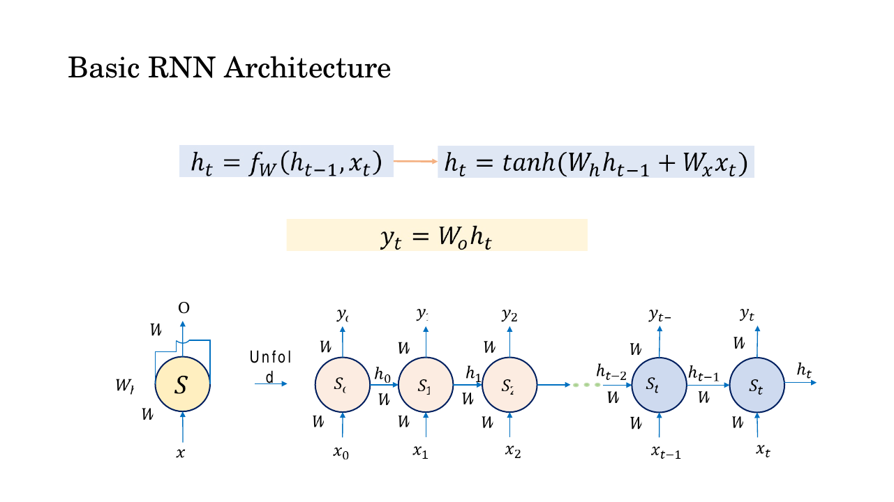
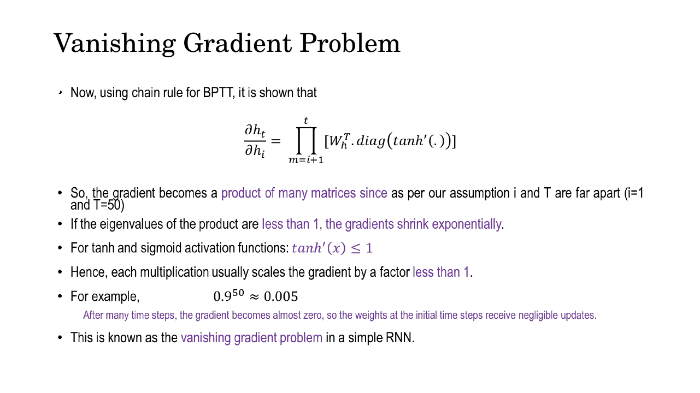
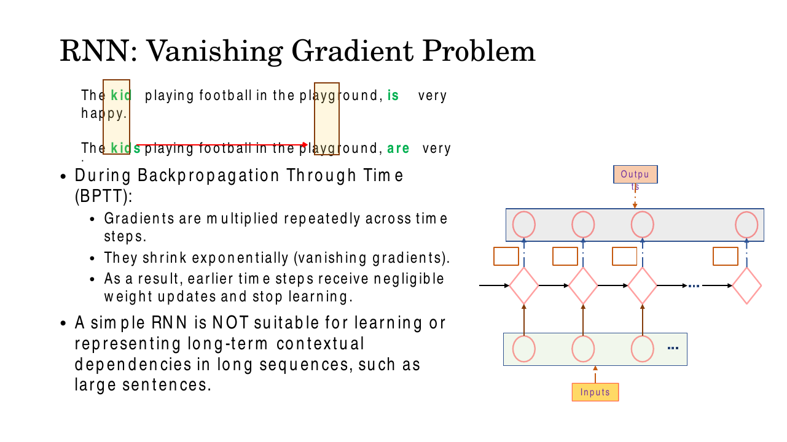
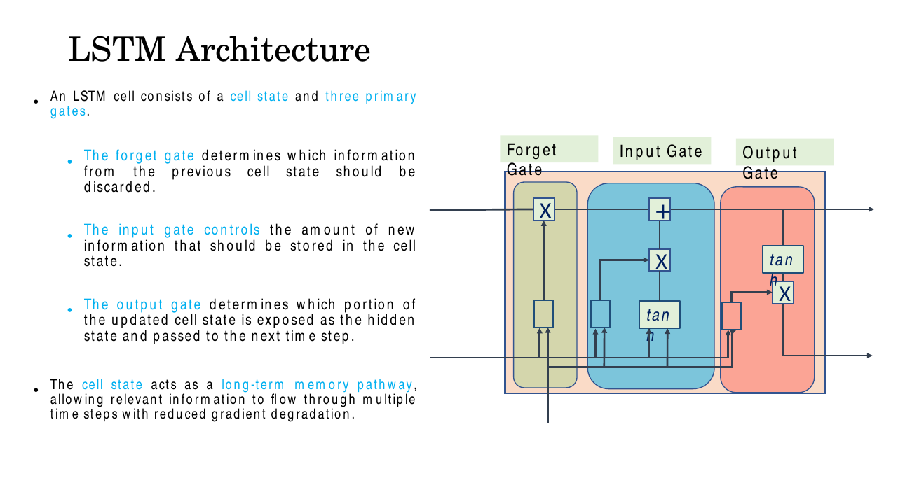
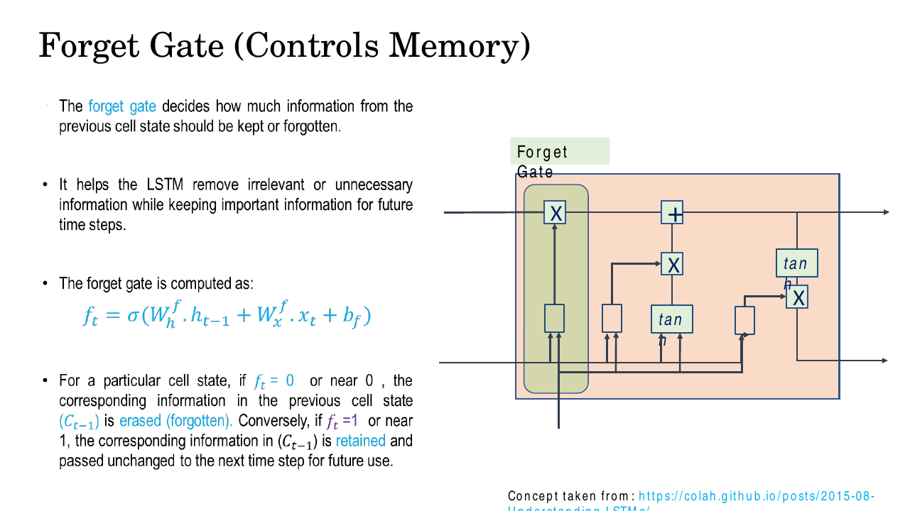
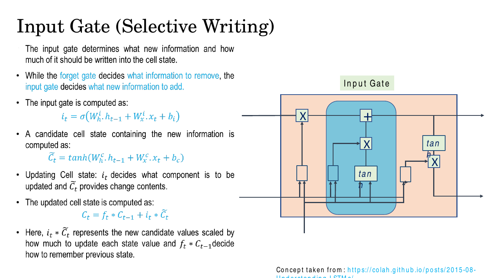
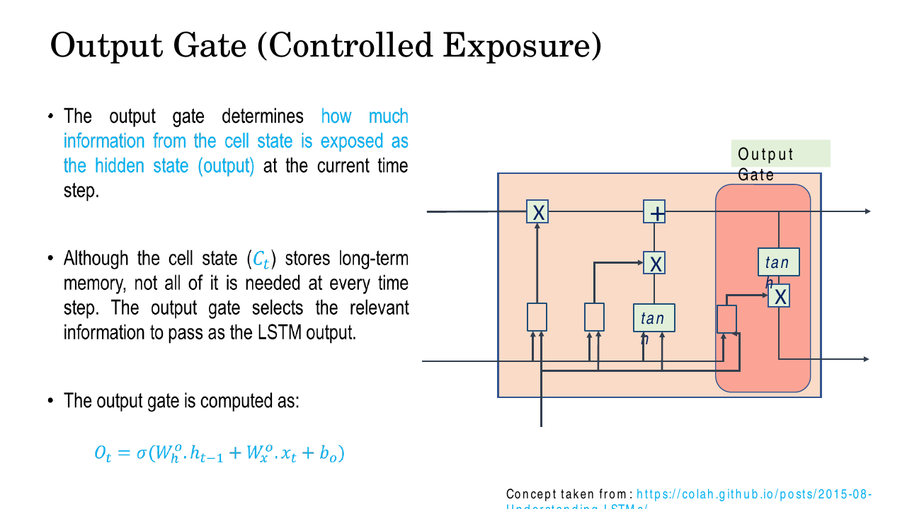
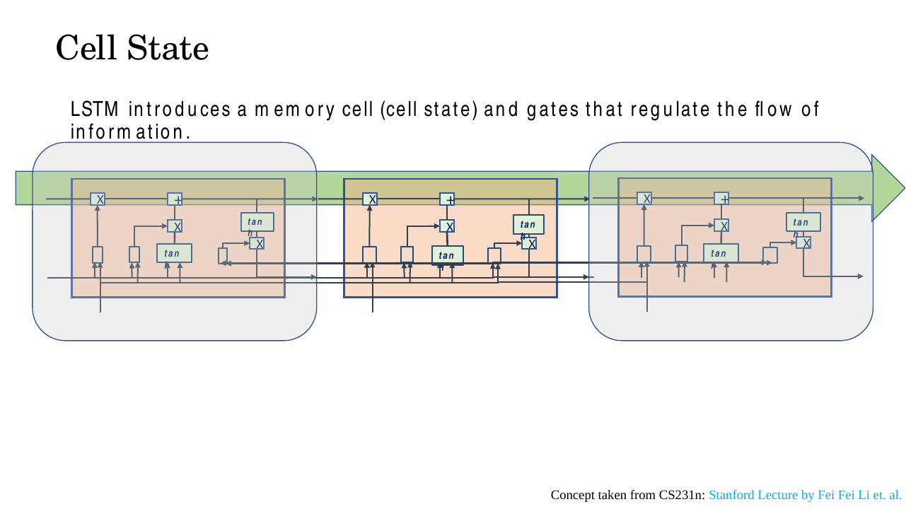
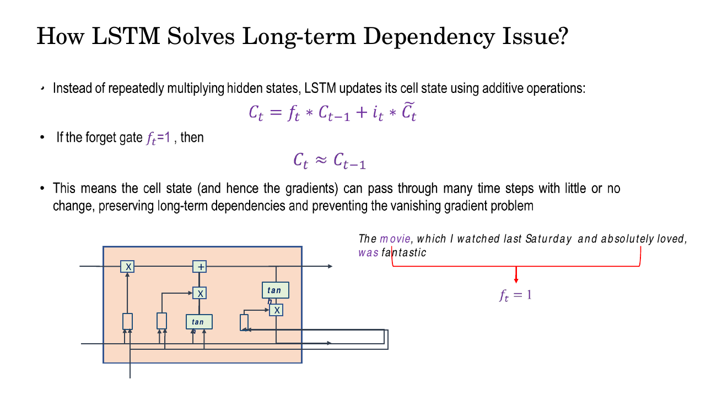

# Lec 18 — Long Short-Term Memory (LSTM)

> **Deck:** `L6P3_LSTM.pptx` · **Week 5** · **Playlist:** Lec 18
> **Prereqs:** [Lec 17 — BPTT](17-bptt.md), [Lec 16 — Sequence Modelling and RNNs](../week-04/16-sequence-modelling-and-rnn.md)
> **Feeds into:** [Lec 19 — GRU, Seq2Seq and Attention](19-gru-seq2seq-attention.md), [Lec 25 — Q/K/V and Self-Attention](../week-07/25-qkv-and-self-attention.md)

## Why this lecture exists

Lec 17 ended on a diagnosis, not a cure. Backpropagation through time multiplies the same recurrent
weight matrix once per time step, so the gradient reaching step 1 from step 50 is a 50-fold product;
if the factors sit below 1 the gradient is annihilated, and the early steps simply stop learning. The
deck's own arithmetic says it: $0.9^{50} \approx 0.005$. That is a training failure, but it is also a
*modelling* failure — a vanilla RNN overwrites its entire hidden state at every step, so there is no
place for information to sit still and wait. This lecture introduces the 1997 architecture that fixes
both at once by adding a second state vector that is *added to* rather than transformed, and three
learned gates that decide what gets erased, written and exposed. Everything in the rest of the course
that remembers something over a long range descends from this idea.

## The ideas

### What Lec 17 left you with

A vanilla RNN carries one state. At each step it folds the new input into it and squashes the result:

$$\mathbf{h}_t = \tanh(\mathbf{W}_h\mathbf{h}_{t-1} + \mathbf{W}_x\mathbf{x}_t + \mathbf{b}), \qquad \mathbf{y}_t = \mathbf{W}_o\mathbf{h}_t$$


*Fig. — Notice there is exactly one arrow carrying memory between cells, and it passes through a $\tanh$ and a matrix multiply every single step. That is the whole problem in one picture. Slide 3.*

The gradient of a late state with respect to an early one is therefore a product of identical factors
(the deck's slides 7 and 23–26 restate this; it is [Lec 17](17-bptt.md)'s to derive):

$$\frac{\partial \mathbf{h}_t}{\partial \mathbf{h}_i} = \prod_{m=i+1}^{t}\mathbf{W}_h^\top\,\mathrm{diag}\!\left(\tanh'(\cdot)\right)$$

Two facts make this lethal. The *same* $\mathbf{W}_h$ appears in every factor, so the product behaves
like a matrix power and is governed by the largest eigenvalue; and $\tanh'(x) \le 1$ always, so every
factor is scaled down as well. Below 1 the product decays geometrically — vanishing gradients. Above
1 it blows up — exploding gradients, which clipping handles. The same additive-path trick you are
about to see is what [Lec 14](../week-04/14-resnet.md) uses spatially, with skip connections, to let
gradients reach the bottom of a 152-layer network.


*Fig. — The one number to carry forward from Lec 17: a per-step factor of 0.9 leaves $0.9^{50}\approx 0.005$ of the gradient after 50 steps. Derivation is Lec 17's; here it is only the motivation. Slide 7 (repeated on slides 23–26).*

### The long-term dependency problem, made concrete

Forget gradients for a moment — there is an independent failure the deck makes vivid with one
sentence pair:

> The **kid** playing football in the playground, **is** very happy.
> The **kids** playing football in the playground, **are** very happy.


*Fig. — The only thing that distinguishes the two sentences is a letter eight words back. Everything in between — "playing football in the playground" — is identical, so the hidden state is overwritten eight times by information that is irrelevant to the agreement decision. Slide 9.*

To emit "is" rather than "are", the network must still know, eight words later, whether the subject was
singular. In a vanilla RNN every one of those eight intervening words gets folded into
$\mathbf{h}_t$ through a matrix multiply and a $\tanh$. There is no mechanism that says *hold this
one bit of information unchanged*. The number marker is not deliberately deleted; it is diluted, step
by step, until nothing is left. The deck gives a second instance of the same shape on slide 19 — *"The
movie, which I watched last Saturday and absolutely loved, was fantastic"* — where "was" agrees with
"movie", not with the nearer "loved".

So a simple RNN is biased toward recent inputs. That is a representational limit, not just an
optimisation one. The deck also notes a third, unrelated cost on slide 5: because $\mathbf{h}_t$ needs
$\mathbf{h}_{t-1}$, recurrent computation **cannot be parallelised across time**, which is slow on a
GPU. That limitation LSTM does *not* fix; it is the grievance that eventually produces the transformer
in [Lec 25](../week-07/25-qkv-and-self-attention.md).

### The idea: separate the memory from the output

Hochreiter and Schmidhuber's 1997 answer is to carry **two** vectors between time steps instead of one.

| | Symbol | Role | How it changes per step |
|---|---|---|---|
| **Cell state** | $\mathbf{C}_t$ | long-term memory | one element-wise multiply, one element-wise add. **No weight matrix on this path.** |
| **Hidden state** | $\mathbf{h}_t$ | short-term, the exposed output | recomputed from scratch each step as a filtered view of $\mathbf{C}_t$ |

This split is the single most confused point in the topic. $\mathbf{C}_t$ is the archive; $\mathbf{h}_t$
is what you choose to say out loud. Only $\mathbf{h}_t$ goes to the output layer and to the gates of
the next step; $\mathbf{C}_t$ stays inside the chain of cells.

Three **gates** regulate the traffic. A gate is a vector of numbers in $(0,1)$, the same length as
$\mathbf{C}_t$, produced by a sigmoid, and used as an element-wise multiplier: 0 means "block this
coordinate entirely", 1 means "let it through untouched", 0.5 means "halve it". Gates do not transform
information; they *meter* it.


*Fig. — Trace the top horizontal line: it enters as $\mathbf{C}_{t-1}$, meets one $\times$ (the forget gate) and one $+$ (the input gate's contribution) and leaves as $\mathbf{C}_t$. Nothing else touches it. The bottom line is $\mathbf{h}_{t-1}$, and it feeds all four sigmoid/tanh blocks. Slide 12.*

Throughout, $\odot$ means **element-wise (Hadamard) multiplication** — coordinate $k$ times coordinate
$k$, no summing, no matrix product. The deck writes it as $*$ or as a boxed $\times$; they are the
same operation. Also write $\mathbf{z}_t = [\mathbf{h}_{t-1}, \mathbf{x}_t]$ for the two inputs stacked
into one vector of length $n_h + n_x$; the deck keeps them separate as
$\mathbf{W}_h^f\mathbf{h}_{t-1} + \mathbf{W}_x^f\mathbf{x}_t$, which is identical arithmetic with the
one wide matrix split into two blocks.

One more symbol convention, book-wide: the LSTM cell state is written **capital** $\mathbf{C}_t$ here
and in every later chapter. The deck writes it lowercase, but lowercase $\mathbf{c}_t$ is reserved
throughout this book for the **attention context vector**
([Lec 19](19-gru-seq2seq-attention.md) onward), which is an entirely different object. Keeping them
visually distinct matters once you reach the chapters where both appear on the same page.

### Gate 1 — the forget gate: what to erase

$$\boxed{\ \mathbf{f}_t = \sigma\!\left(\mathbf{W}_f\,[\mathbf{h}_{t-1}, \mathbf{x}_t] + \mathbf{b}_f\right)\ }$$


*Fig. — The forget gate's output multiplies $\mathbf{C}_{t-1}$ directly. $f_{t,k}=0$ wipes coordinate $k$ of memory; $f_{t,k}=1$ passes it through completely unchanged. Slide 13.*

**Activation: sigmoid.** **Controls:** how much of each coordinate of the previous cell state survives.
In the kid/kids sentence, the coordinate holding "subject is singular" wants $f_{t,k} \approx 1$ for
every intervening word; a coordinate holding "the current word is a preposition" can be flushed
immediately. Because the gate is a *vector*, the cell can keep some coordinates and dump others in the
same step.

### Gate 2 — the input gate and the candidate: what to write

Writing takes two pieces: *what* to write and *how much* of it.

$$\mathbf{i}_t = \sigma\!\left(\mathbf{W}_i\,[\mathbf{h}_{t-1}, \mathbf{x}_t] + \mathbf{b}_i\right), \qquad \tilde{\mathbf{C}}_t = \tanh\!\left(\mathbf{W}_c\,[\mathbf{h}_{t-1}, \mathbf{x}_t] + \mathbf{b}_c\right)$$


*Fig. — Two separate blocks feed the second $\times$: a sigmoid (the gate, "how much") and a tanh (the candidate, "what"). Their product is what gets added to memory. Slide 14.*

$\tilde{\mathbf{C}}_t$ is the **candidate cell state** — the new content the cell is proposing to store,
computed from the same two inputs but with a $\tanh$, so its entries lie in $(-1,1)$ and can be
negative. $\mathbf{i}_t$ then decides, per coordinate, how much of that proposal actually lands.

### The cell state update — the equation to memorise

$$\boxed{\ \mathbf{C}_t = \mathbf{f}_t \odot \mathbf{C}_{t-1} \;+\; \mathbf{i}_t \odot \tilde{\mathbf{C}}_t\ }$$

Read it as two independent decisions: *keep this much of what I had*, **plus** *add this much of what
is new*. Nothing between them. In particular the two gates are not tied — unlike the GRU, which is
[Lec 19](19-gru-seq2seq-attention.md)'s to cover — so an LSTM can keep everything and add nothing
($\mathbf{f}_t=\mathbf{1}, \mathbf{i}_t=\mathbf{0}$), or clear memory and write fresh
($\mathbf{f}_t=\mathbf{0}, \mathbf{i}_t=\mathbf{1}$), or accumulate ($\mathbf{f}_t=\mathbf{i}_t=\mathbf{1}$).

| $\mathbf{f}_t$ | $\mathbf{i}_t$ | $\mathbf{C}_t$ becomes | Behaviour |
|---|---|---|---|
| 1 | 0 | $\mathbf{C}_{t-1}$ | **copy** — memory held perfectly |
| 0 | 1 | $\tilde{\mathbf{C}}_t$ | **overwrite** — old memory replaced |
| 1 | 1 | $\mathbf{C}_{t-1} + \tilde{\mathbf{C}}_t$ | **accumulate** |
| 0 | 0 | $\mathbf{0}$ | **erase** — cleared |

### Gate 3 — the output gate: what to expose

$$\mathbf{o}_t = \sigma\!\left(\mathbf{W}_o\,[\mathbf{h}_{t-1}, \mathbf{x}_t] + \mathbf{b}_o\right), \qquad \boxed{\ \mathbf{h}_t = \mathbf{o}_t \odot \tanh(\mathbf{C}_t)\ }$$


*Fig. — The output gate sits outside the cell-state line entirely. It reads the line but does not modify it — which is exactly why the memory path stays clean. Slide 15.*

The cell state is squashed through $\tanh$ first (slide 16), bringing it back into $(-1,1)$ so the
hidden state cannot blow up even if $\mathbf{C}_t$ has grown large through accumulation. Then
$\mathbf{o}_t$ filters it. The deck's phrasing is exact: the cell state stores long-term memory, but
*not all of it is needed at every time step*. An LSTM reading "The kid playing football…" keeps the
singular marker in $\mathbf{C}_t$ throughout but only needs to expose it when the verb slot arrives.

### Sigmoid versus tanh — the distinction the exam wants

| Role | Activation | Range | Why |
|---|---|---|---|
| **Gates** $\mathbf{f}_t, \mathbf{i}_t, \mathbf{o}_t$ | $\sigma$ | $(0,1)$ | A gate is a *fraction* — "how much to let through". 0 and 1 must both be reachable, and negatives are meaningless. |
| **Candidate** $\tilde{\mathbf{C}}_t$, and the squash on $\mathbf{C}_t$ | $\tanh$ | $(-1,1)$ | These are *values*, not fractions. Memory must be able to encode "this feature is strongly absent", which needs a sign. Zero-centred output also keeps the running sum from drifting. |

There are exactly **three sigmoids and two tanhs** in an LSTM cell. If a question offers "four
sigmoids" or "the candidate uses sigmoid", it is wrong.

### The conveyor belt and the constant error carousel


*Fig. — The green arrow is the point of the architecture: the cell state crosses three cells untouched by any weight matrix. Compare the slide-3 picture, where the memory arrow passes through a matrix multiply and a $\tanh$ every step. Slide 17.*

Now the derivation. The vanilla RNN's gradient path, as above, is a product of
$\mathbf{W}_h^\top\mathrm{diag}(\tanh'(\cdot))$ factors. Differentiate the LSTM's cell update along
the direct path instead:

$$\mathbf{C}_t = \mathbf{f}_t \odot \mathbf{C}_{t-1} + \mathbf{i}_t \odot \tilde{\mathbf{C}}_t \;\;\Longrightarrow\;\; \frac{\partial \mathbf{C}_t}{\partial \mathbf{C}_{t-1}} = \mathrm{diag}(\mathbf{f}_t)$$

and over $k$ steps,

$$\frac{\partial \mathbf{C}_t}{\partial \mathbf{C}_{t-k}} = \prod_{m=t-k+1}^{t}\mathrm{diag}(\mathbf{f}_m)$$

Compare the two products line by line:

| | Vanilla RNN | LSTM cell state |
|---|---|---|
| Per-step factor | $\mathbf{W}_h^\top\mathrm{diag}(\tanh'(\cdot))$ | $\mathrm{diag}(\mathbf{f}_t)$ |
| Same factor every step? | **Yes** — it is a matrix power, set by the spectral radius | **No** — $\mathbf{f}_t$ is recomputed from the data each step |
| Mixes coordinates? | Yes (full matrix) | **No** (diagonal — each memory slot decays independently) |
| Activation derivative in the path? | Yes, $\tanh' \le 1$, always shrinking | **No** |
| Controlled by learning? | Only indirectly, through $\mathbf{W}_h$ | **Directly** — the network learns to set $\mathbf{f}_t \to 1$ when it must remember |

That last row is the whole argument. The RNN's decay rate is a fixed property of one weight matrix
shared by every dependency in the dataset. The LSTM's decay rate is a *learned, per-coordinate,
per-time-step* number, and the gradient is multiplied by it rather than by a matrix. When the loss
needs information from 50 steps back, nothing stops the network from pushing those coordinates'
forget gates to $\approx 1$, at which point $\mathbf{C}_t \approx \mathbf{C}_{t-1}$ and the gradient
arrives essentially undiminished. This near-lossless loop is Hochreiter and Schmidhuber's **constant
error carousel (CEC)** — the error circulates in the cell instead of decaying out of it.


*Fig. — The deck's summary of the mechanism: set $\mathbf{f}_t = 1$ over the span you must bridge, and the cell state — along with the gradient flowing through it — passes through unchanged. Slide 20.*

Two honest caveats the deck does not state. First, $\mathbf{f}_t$ itself depends on
$\mathbf{h}_{t-1}$, which depends on $\mathbf{C}_{t-1}$, so the *full* Jacobian has extra terms
beyond $\mathrm{diag}(\mathbf{f}_t)$; the claim is not that gradients never vanish but that a direct,
uninterrupted path **exists** alongside the decaying ones — exactly the ResNet argument of
[Lec 14](../week-04/14-resnet.md) transplanted from depth to time. Second, since
$0 < f_{t,k} < 1$ strictly, this path cannot *explode* either, though other paths still can, so
gradient clipping remains standard practice.

## Worked numericals

### N1. A complete single-step LSTM forward pass by hand
**Given:** $n_x = 2$, $n_h = 2$. Inputs $\mathbf{h}_{t-1} = [0.5, -0.5]^\top$,
$\mathbf{x}_t = [1.0, 2.0]^\top$, $\mathbf{C}_{t-1} = [1.0, 2.0]^\top$. Stack
$\mathbf{z} = [\mathbf{h}_{t-1}, \mathbf{x}_t] = [0.5, -0.5, 1.0, 2.0]^\top$. Weights (each $2\times4$):

$$\mathbf{W}_f = \begin{bmatrix}1&1&1&0\\0&1&1&-1\end{bmatrix},\ \mathbf{b}_f=\begin{bmatrix}1.0\\0.5\end{bmatrix};\quad \mathbf{W}_i = \begin{bmatrix}2&0&1&0\\0&2&0&1\end{bmatrix},\ \mathbf{b}_i=\begin{bmatrix}-1.0\\-1.0\end{bmatrix}$$
$$\mathbf{W}_c = \begin{bmatrix}1&-1&0&0\\0&0&1&-1\end{bmatrix},\ \mathbf{b}_c=\begin{bmatrix}0.0\\0.5\end{bmatrix};\quad \mathbf{W}_o = \begin{bmatrix}1&0&0&0\\0&0&0&1\end{bmatrix},\ \mathbf{b}_o=\begin{bmatrix}0.0\\0.0\end{bmatrix}$$

**Find:** $\mathbf{f}_t, \mathbf{i}_t, \tilde{\mathbf{C}}_t, \mathbf{C}_t, \mathbf{o}_t, \mathbf{h}_t$.

1. Forget pre-activations: row 1 $= (1)(0.5)+(1)(-0.5)+(1)(1.0)+(0)(2.0) = 1.0$, $+b=1.0 \Rightarrow 2.0$.
   Row 2 $= 0 - 0.5 + 1.0 - 2.0 = -1.5$, $+0.5 \Rightarrow -1.0$.
2. $\mathbf{f}_t = [\sigma(2.0), \sigma(-1.0)] = [0.8808,\ 0.2689]$.
   ($\sigma(2)=1/(1+e^{-2})=1/1.1353=0.8808$; $\sigma(-1)=1/(1+e^{1})=1/3.7183=0.2689$.)
3. Input pre-activations: row 1 $= 1.0+0+1.0+0 = 2.0$, $-1.0 \Rightarrow 1.0$.
   Row 2 $= 0-1.0+0+2.0 = 1.0$, $-1.0 \Rightarrow 0.0$.
4. $\mathbf{i}_t = [\sigma(1.0), \sigma(0.0)] = [0.7311,\ 0.5000]$.
5. Candidate pre-activations: row 1 $= 0.5+0.5+0+0 = 1.0$, $+0 \Rightarrow 1.0$.
   Row 2 $= 0+0+1.0-2.0 = -1.0$, $+0.5 \Rightarrow -0.5$.
6. $\tilde{\mathbf{C}}_t = [\tanh(1.0), \tanh(-0.5)] = [0.7616,\ -0.4621]$.
7. Keep term: $\mathbf{f}_t \odot \mathbf{C}_{t-1} = [0.8808\times1.0,\ 0.2689\times2.0] = [0.8808,\ 0.5379]$.
8. Write term: $\mathbf{i}_t \odot \tilde{\mathbf{C}}_t = [0.7311\times0.7616,\ 0.5\times(-0.4621)] = [0.5568,\ -0.2311]$.
9. $\mathbf{C}_t = [0.8808+0.5568,\ 0.5379-0.2311] = [1.4376,\ 0.3068]$.
10. Output pre-activations: row 1 $= 0.5$, row 2 $= 2.0$. So $\mathbf{o}_t = [\sigma(0.5), \sigma(2.0)] = [0.6225,\ 0.8808]$.
11. $\tanh(\mathbf{C}_t) = [\tanh(1.4376), \tanh(0.3068)] = [0.8932,\ 0.2975]$.
12. $\mathbf{h}_t = \mathbf{o}_t \odot \tanh(\mathbf{C}_t) = [0.6225\times0.8932,\ 0.8808\times0.2975] = [0.5560,\ 0.2621]$.

**Answer:** $\mathbf{f}_t = [0.8808, 0.2689]$, $\mathbf{i}_t = [0.7311, 0.5000]$,
$\tilde{\mathbf{C}}_t = [0.7616, -0.4621]$, $\mathbf{C}_t = [1.4376, 0.3068]$,
$\mathbf{o}_t = [0.6225, 0.8808]$, $\mathbf{h}_t = [0.5560, 0.2621]$.
Note coordinate 2: a forget gate of 0.27 threw away 73% of the stored 2.0, and the negative candidate
pushed it down further — that slot was deliberately cleared.

### N2. Gradient surviving $k$ steps: gated versus ungated
**Given:** an LSTM coordinate whose forget gate holds steady at $f = 0.95$ (and a second at $f = 0.99$),
versus a vanilla RNN whose per-step gradient factor is $0.5$ (and the deck's $0.9$).
**Find:** the fraction of gradient surviving after 10, 20 and 50 steps.

1. LSTM path: $\partial c_t/\partial c_{t-k} = f^k$. RNN path: factor$^k$. Both are pure powers.
2. $0.95^{10} = 0.5987$; $0.95^{20} = 0.3585$; $0.95^{50} = 0.0769$.
3. $0.99^{10} = 0.9044$; $0.99^{20} = 0.8179$; $0.99^{50} = 0.6050$.
4. $0.5^{10} = 9.77\times10^{-4}$; $0.5^{20} = 9.54\times10^{-7}$; $0.5^{50} = 8.88\times10^{-16}$.
5. $0.9^{50} = 0.00515$ — the deck's own figure, stated as $\approx 0.005$.

| Per-step factor | $k=10$ | $k=20$ | $k=50$ |
|---|---|---|---|
| LSTM, $f=0.99$ | 0.904 | 0.818 | **0.605** |
| LSTM, $f=0.95$ | 0.599 | 0.359 | **0.0769** |
| RNN, $0.9$ | 0.349 | 0.122 | 0.00515 |
| RNN, $0.5$ | $9.8\times10^{-4}$ | $9.5\times10^{-7}$ | $8.9\times10^{-16}$ |

**Answer:** at 50 steps the $f=0.99$ LSTM slot retains **60.5%** of its gradient while the $0.5$-factor
RNN retains $8.9\times10^{-16}$ — a ratio of about $7\times10^{14}$. The crucial difference is not that
0.99 beats 0.5 arithmetically; it is that the LSTM *learns* its factor and can choose 0.99, whereas the
RNN's is whatever the shared $\mathbf{W}_h$ happens to be.

### N3. LSTM parameter count, and where the factor of 4 comes from
**Given:** input size $n_x = 100$, hidden size $n_h = 256$, one LSTM layer.
**Find:** the number of learnable parameters.

1. The cell computes **four** affine maps of $[\mathbf{h}_{t-1}, \mathbf{x}_t]$: three gates
   ($\mathbf{f}, \mathbf{i}, \mathbf{o}$) and one candidate ($\tilde{\mathbf{C}}$). That is the 4.
   A vanilla RNN computes **one**, so an LSTM has 4× an RNN's parameters at the same sizes.
2. Each map takes a vector of length $n_h + n_x = 256 + 100 = 356$ and returns one of length $n_h = 256$.
   So each weight matrix is $256 \times 356 = 91{,}136$ parameters.
3. Each map has a bias of length $n_h = 256$.
4. Per map: $91{,}136 + 256 = 91{,}392$.
5. Total: $4 \times 91{,}392 = 365{,}568$.

**Answer:** $4\big(n_h(n_h+n_x) + n_h\big) = 4(256 \times 356 + 256) = \mathbf{365{,}568}$ parameters.
Equivalently $4n_h(n_h + n_x + 1)$. For a vanilla RNN of the same sizes it would be
$256\times356+256 = 91{,}392$.

### N4. What a forget gate of 0 and of 1 actually do
**Given:** $\mathbf{C}_{t-1} = [2.0, -3.0]^\top$, $\mathbf{i}_t = [0.0, 0.0]^\top$ (no new writing),
and two scenarios: $\mathbf{f}_t = [1,1]^\top$ then $\mathbf{f}_t = [0,0]^\top$.
**Find:** $\mathbf{C}_t$ in each, and the gradient factor.

1. $\mathbf{f}_t = \mathbf{1}$: $\mathbf{C}_t = 1\odot[2.0,-3.0] + 0 = [2.0, -3.0] = \mathbf{C}_{t-1}$.
   Memory held exactly; $\partial\mathbf{C}_t/\partial\mathbf{C}_{t-1} = \mathrm{diag}(1,1) = \mathbf{I}$ —
   gradient passes with factor 1 no matter how many steps you chain.
2. $\mathbf{f}_t = \mathbf{0}$: $\mathbf{C}_t = 0\odot[2.0,-3.0] + 0 = [0, 0]$.
   Memory wiped; $\partial\mathbf{C}_t/\partial\mathbf{C}_{t-1} = \mathbf{0}$ — the gradient is cut dead
   at this step, which is *correct* behaviour, since nothing downstream depends on
   $\mathbf{C}_{t-1}$ any more.
3. Mixed, $\mathbf{f}_t = [1, 0]^\top$: $\mathbf{C}_t = [2.0, 0]$ — slot 1 remembered for ever, slot 2
   cleared, in the same step.

**Answer:** $\mathbf{f}_t=\mathbf{1}$ gives $\mathbf{C}_t = \mathbf{C}_{t-1}$ (perfect memory, gradient
factor 1); $\mathbf{f}_t=\mathbf{0}$ gives $\mathbf{C}_t = \mathbf{0}$ (full erase, gradient factor 0).
Because the gate is a vector, both happen simultaneously in different coordinates.

## Code

A single LSTM cell in NumPy, reproducing N1 exactly.

```python
import numpy as np

sigmoid = lambda z: 1.0 / (1.0 + np.exp(-z))

# --- state coming in ----------------------------------------------------
h_prev  = np.array([0.5, -0.5])      # short-term, exposed hidden state
C_prev  = np.array([1.0,  2.0])      # long-term cell state (the conveyor belt)
x_t     = np.array([1.0,  2.0])      # this step's input
z       = np.concatenate([h_prev, x_t])        # [h_{t-1}; x_t], length n_h+n_x = 4

# --- the four weight blocks: each is n_h x (n_h + n_x) = 2 x 4 ----------
W_f = np.array([[1., 1., 1., 0.], [0., 1., 1., -1.]]); b_f = np.array([1.0, 0.5])
W_i = np.array([[2., 0., 1., 0.], [0., 2., 0.,  1.]]); b_i = np.array([-1.0, -1.0])
W_C = np.array([[1., -1., 0., 0.], [0., 0., 1., -1.]]); b_C = np.array([0.0, 0.5])
W_o = np.array([[1., 0., 0., 0.], [0., 0., 0.,  1.]]); b_o = np.array([0.0, 0.0])

# --- the cell -----------------------------------------------------------
f_t    = sigmoid(W_f @ z + b_f)      # forget: how much of C_prev survives
i_t    = sigmoid(W_i @ z + b_i)      # input : how much of the candidate is written
C_tild = np.tanh(W_C @ z + b_C)      # candidate: a VALUE, so tanh not sigmoid
C_t    = f_t * C_prev + i_t * C_tild # * is element-wise -> this is the odot
o_t    = sigmoid(W_o @ z + b_o)      # output: how much of C_t is exposed
h_t    = o_t * np.tanh(C_t)

for name, v in [("f_t", f_t), ("i_t", i_t), ("C~_t", C_tild),
                ("C_t", C_t), ("o_t", o_t), ("h_t", h_t)]:
    print(f"{name:5s} = {np.round(v, 4)}")
```

```
f_t   = [0.8808 0.2689]
i_t   = [0.7311 0.5   ]
C~_t  = [ 0.7616 -0.4621]
C_t   = [1.4376 0.3068]
o_t   = [0.6225 0.8808]
h_t   = [0.556  0.2621]
```

Now confirm the 4× parameter formula against the real API.

```python
import torch, torch.nn as nn

n_x, n_h = 100, 256
lstm = nn.LSTM(input_size=n_x, hidden_size=n_h, num_layers=1)

for name, p in lstm.named_parameters():
    print(f"{name:14s} {tuple(p.shape)!s:12s} {p.numel():>7d}")

textbook = 4 * (n_h * (n_h + n_x) + n_h)     # one bias vector per gate
pytorch  = sum(p.numel() for p in lstm.parameters())
print("textbook formula :", textbook)
print("PyTorch actual   :", pytorch)
print("difference       :", pytorch - textbook, "= 4 * n_h (the duplicated bias)")
```

```
weight_ih_l0   (1024, 100)   102400
weight_hh_l0   (1024, 256)   262144
bias_ih_l0     (1024,)         1024
bias_hh_l0     (1024,)         1024
textbook formula : 365568
PyTorch actual   : 366592
difference       : 1024 = 4 * n_h (the duplicated bias)
```

The `1024` in every shape is $4 \times 256$ — PyTorch stacks the four gates into one fat matrix and
slices it, which is the factor of 4 made visible. The 1024-parameter discrepancy is explained below.

## Exam pack

### Must-memorise

| Item | Exactly this |
|---|---|
| Forget gate | $\mathbf{f}_t = \sigma(\mathbf{W}_f[\mathbf{h}_{t-1},\mathbf{x}_t]+\mathbf{b}_f)$ |
| Input gate | $\mathbf{i}_t = \sigma(\mathbf{W}_i[\mathbf{h}_{t-1},\mathbf{x}_t]+\mathbf{b}_i)$ |
| Candidate | $\tilde{\mathbf{C}}_t = \tanh(\mathbf{W}_c[\mathbf{h}_{t-1},\mathbf{x}_t]+\mathbf{b}_c)$ |
| **Cell state update** | $\mathbf{C}_t = \mathbf{f}_t \odot \mathbf{C}_{t-1} + \mathbf{i}_t \odot \tilde{\mathbf{C}}_t$ |
| Output gate | $\mathbf{o}_t = \sigma(\mathbf{W}_o[\mathbf{h}_{t-1},\mathbf{x}_t]+\mathbf{b}_o)$ |
| Hidden state | $\mathbf{h}_t = \mathbf{o}_t \odot \tanh(\mathbf{C}_t)$ |
| Gradient along cell state | $\partial\mathbf{C}_t/\partial\mathbf{C}_{t-1} = \mathrm{diag}(\mathbf{f}_t)$ |
| Vanilla RNN comparison | $\partial\mathbf{h}_t/\partial\mathbf{h}_i = \prod_m \mathbf{W}_h^\top\mathrm{diag}(\tanh'(\cdot))$ |
| CEC | Constant Error Carousel — the near-lossless gradient loop through $\mathbf{C}_t$ |
| Parameter count | $4\big(n_h(n_h+n_x)+n_h\big)$ |
| $\odot$ | element-wise (Hadamard) product |

### Numbers worth knowing

| Quantity | Value |
|---|---|
| Year LSTM was published | **1997** (Hochreiter & Schmidhuber) |
| Number of gates | **3** (forget, input, output) |
| Number of affine maps per cell | **4** (3 gates + 1 candidate) — the source of the 4× |
| Sigmoids per cell / tanhs per cell | **3** / **2** |
| State vectors carried between steps | **2** ($\mathbf{C}_t$ and $\mathbf{h}_t$) |
| Deck's vanishing example | $0.9^{50}\approx 0.005$ |
| Gate output range / candidate range | $(0,1)$ / $(-1,1)$ |
| LSTM params vs RNN params, same sizes | $4\times$ |
| Example: $n_x{=}100, n_h{=}256$ | 365,568 (textbook) / 366,592 (PyTorch) |

### Likely MCQ traps

- **"The candidate $\tilde{\mathbf{C}}_t$ uses sigmoid."** No — $\tanh$. Gates use sigmoid because they
  are fractions; the candidate is a value that must be able to be negative.
- **"LSTM has four gates."** Three. The candidate is not a gate; it carries content, not a fraction.
  But there *are* four weight matrices — the question wording decides the answer.
- **Confusing $\mathbf{C}_t$ with $\mathbf{h}_t$.** $\mathbf{C}_t$ is internal long-term memory and is
  never fed to the output layer; $\mathbf{h}_t$ is the exposed short-term output. Both are passed to
  the next time step.
- **"The forget gate decides what to add."** It decides what to *erase*. The input gate decides what
  to add.
- **"LSTM eliminates the vanishing gradient problem completely."** It *mitigates* it, by creating an
  additive, gated path. Gradients can still vanish through the other paths; clipping is still used for
  explosion.
- **"$\odot$ is matrix multiplication."** It is element-wise. $\mathbf{f}_t$ and $\mathbf{C}_{t-1}$
  have the same length, so a matrix product is not even defined.
- **"LSTM lets you parallelise over time."** It does not. The step-by-step dependency is unchanged;
  that is a transformer's advantage, not an LSTM's.
- **"$\mathbf{f}_t = 0$ means the gradient vanishes, which is a bug."** It is the intended behaviour —
  the network has decided that slot is no longer needed.
- **Parameter-count slip: forgetting the bias, or forgetting that the matrix is $n_h\times(n_h+n_x)$
  and not $n_h \times n_x$.** Both are standard distractors.

### Self-test

1. Write the cell-state update equation from memory, and say what each of the two terms means.
2. Which activation does each of $\mathbf{f}_t$, $\mathbf{i}_t$, $\tilde{\mathbf{C}}_t$, $\mathbf{o}_t$ use?
3. An LSTM has $n_x = 50$, $n_h = 128$. How many parameters?
4. $\mathbf{f}_t = [1, 0, 0.5]$, $\mathbf{C}_{t-1} = [4, 4, 4]$, $\mathbf{i}_t = [0,0,0]$. Find $\mathbf{C}_t$.
5. State $\partial\mathbf{C}_t/\partial\mathbf{C}_{t-1}$ and explain in one sentence why it beats the RNN's $\mathbf{W}_h^\top\mathrm{diag}(\tanh')$.
6. Why can the hidden state never exceed 1 in absolute value, however large $\mathbf{C}_t$ grows?
7. A forget gate holds at 0.98. What fraction of the gradient survives 30 steps?
8. Which of the two states, $\mathbf{C}_t$ or $\mathbf{h}_t$, is fed to the softmax output layer?
9. Why does an LSTM need both $\mathbf{i}_t$ and $\tilde{\mathbf{C}}_t$ rather than just one of them?
10. In "The kid playing football in the playground, is very happy", what should the forget gate do to the coordinate storing subject number, over the words "playing football in the playground"?

<details><summary>Answers</summary>

1. $\mathbf{C}_t = \mathbf{f}_t\odot\mathbf{C}_{t-1} + \mathbf{i}_t\odot\tilde{\mathbf{C}}_t$. First term: how much old memory to keep. Second: how much new content to write.
2. $\sigma$, $\sigma$, $\tanh$, $\sigma$.
3. $4(128\times(128+50) + 128) = 4(128\times178 + 128) = 4(22{,}784+128) = 4\times22{,}912 = 91{,}648$.
4. $[4, 0, 2]$.
5. $\mathrm{diag}(\mathbf{f}_t)$. It is diagonal (no coordinate mixing), carries no activation derivative, and is a *learned, per-step* number the network can drive to 1 — unlike the RNN's fixed shared matrix.
6. Because $\mathbf{h}_t = \mathbf{o}_t\odot\tanh(\mathbf{C}_t)$ with $\tanh \in (-1,1)$ and $\mathbf{o}_t \in (0,1)$.
7. $0.98^{30} = 0.545$, about 55%.
8. $\mathbf{h}_t$.
9. They answer different questions: $\tilde{\mathbf{C}}_t$ is *what* to write (signed, $\tanh$), $\mathbf{i}_t$ is *how much* of it to write (a fraction, $\sigma$). Collapsing them would force the magnitude and the admission rate to be the same number.
10. Hold it near 1 for every intervening word, so the singular marker reaches the verb slot intact.

</details>

## Beyond the slides

**Gap:** PyTorch's `nn.LSTM` has **two** bias vectors per gate (`bias_ih` and `bias_hh`), so its real
count is $4n_h(n_h+n_x) + 8n_h$, not the textbook $4n_h(n_h+n_x+1)$.
**Why it matters:** the two biases are mathematically redundant — they only ever appear summed — but
they exist for cuDNN compatibility. Our example differs by exactly $4n_h = 1024$. Exams ask for the
textbook formula; code gives the other. Know which is being asked.

**Gap:** the deck never mentions **forget-gate bias initialisation**. Standard practice (Gers et al.,
1999; Jozefowicz et al., 2015) is to initialise $\mathbf{b}_f$ to 1 rather than 0.
**Why it matters:** with $\mathbf{b}_f = 0$ the gate starts near $\sigma(0)=0.5$, so an untrained LSTM
halves its memory every step and forgets within ~10 steps — before it has had a chance to learn not to.
Starting at $\sigma(1) = 0.73$, or higher, biases the network toward remembering, and measurably speeds
up training on long sequences.

**Gap:** **peephole connections**, a 1999 variant the deck omits entirely.
**Why it matters:** in the vanilla cell, the gates see only $\mathbf{h}_{t-1}$ and $\mathbf{x}_t$ — they
cannot look at the memory they are controlling. Peepholes add a $\mathbf{C}_{t-1}$ (or $\mathbf{C}_t$
for the output gate) term inside each sigmoid, so gates can condition on the current memory contents.
They help on precise-timing tasks; most modern implementations drop them.

**Gap:** the deck's slide 5 lists "no parallelisation across time" as an RNN problem, then presents LSTM
as the solution to "the problems of simple RNN".
**Why it matters:** LSTM fixes vanishing gradients and long-term dependencies but makes the
sequential-computation problem *worse* (four matrix multiplies per step instead of one). That gap is
what motivates attention and transformers later in the course.

## Cut from the slides

Dropped the title slide (1), the "Content" list (2), the identical "Summery" list (21) and the
next-lecture slide (22). Slides 6–7 and 23–26 are the same Khapra-derived vanishing-gradient
derivation printed twice; I kept one recall figure and handed the derivation to
[Lec 17](17-bptt.md), which owns it. Slides 4, 5, 10 and 11 are continuous prose restating the
problem and the solution in general terms — distributed across "Why this lecture exists" and the
opening of "The ideas" rather than quoted block by block. Slides 15 and 16 are two animation frames
of one output-gate slide, shown as one figure plus the $\mathbf{h}_t$ equation inline; slides 19 and
20 repeat the "The movie … was fantastic" example, so I used 20 and kept the sentence from 19 as a
second illustration. Slide 18's main equation did not survive the slide export and was recovered
from the extracted figure `image48.png`. Finally, the deck splits each gate's affine map into
$\mathbf{W}_h^g$ and $\mathbf{W}_x^g$ and writes the cell state $C_t$; this chapter stacks them and
uses the book's $\mathbf{C}_t$ — identical arithmetic.
