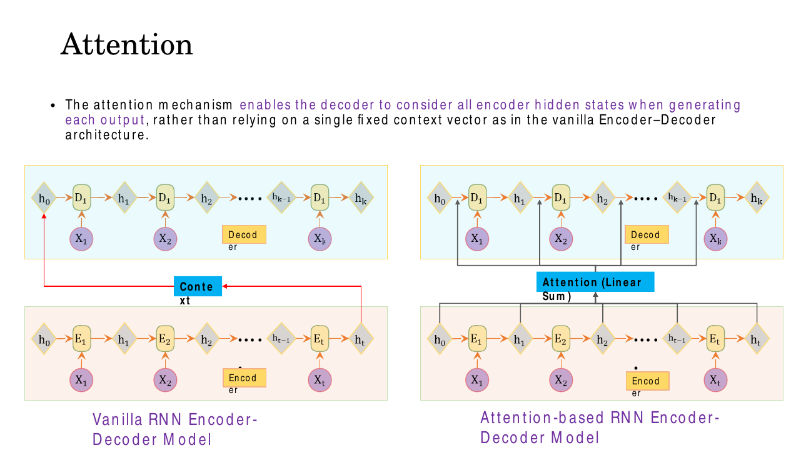
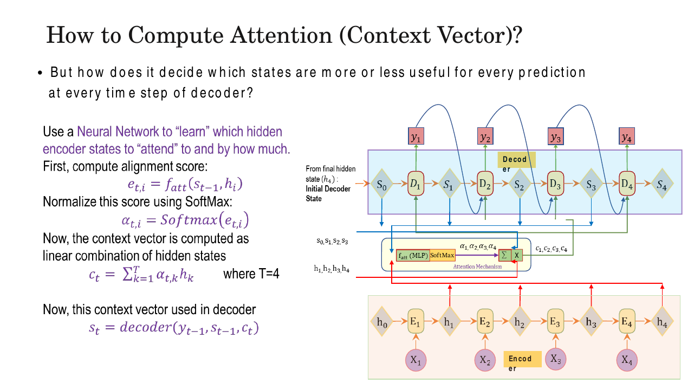
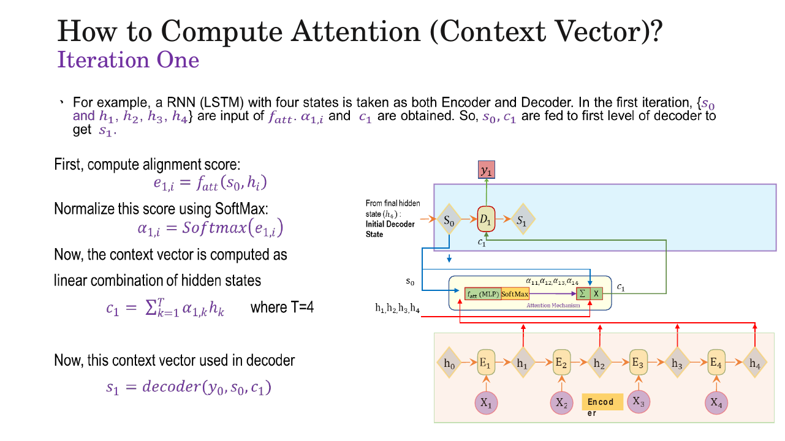
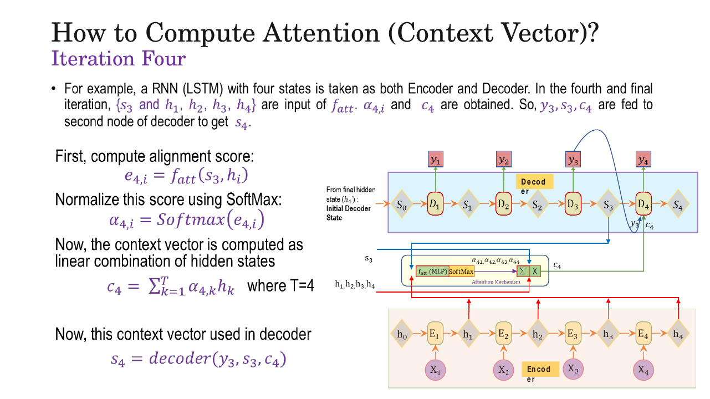
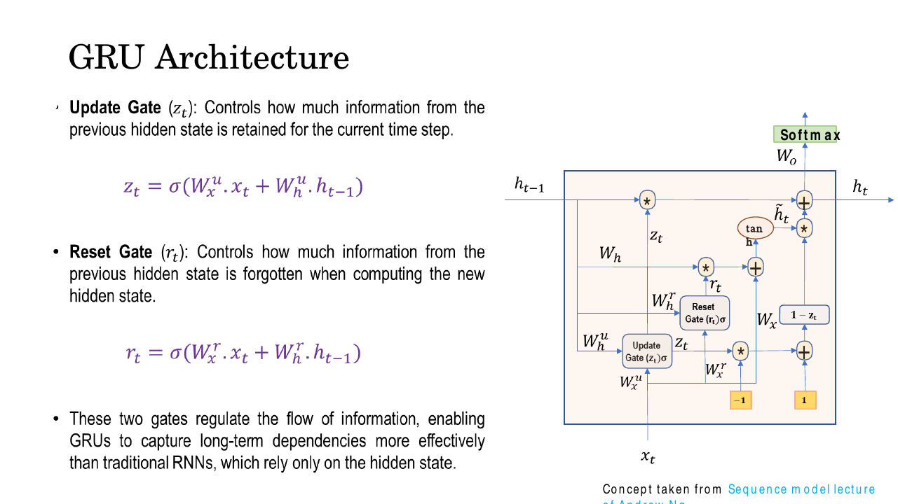
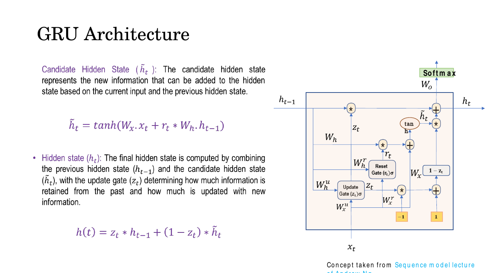
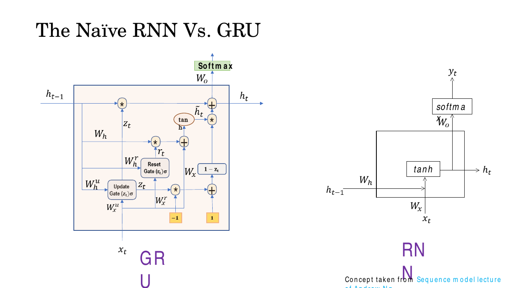
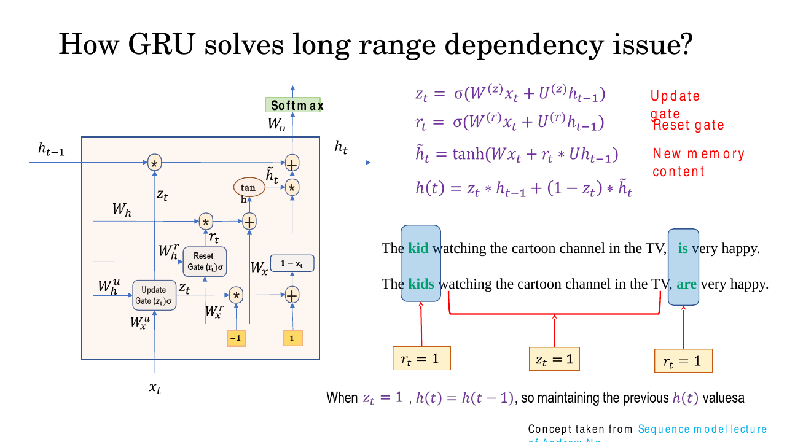

# Lec 19 — GRU, Seq2Seq, and Attention

> **Deck:** `L6P4_Seq_Model_2.pptx` · **Week 5** · **Playlist:** Lec 19
> **Prereqs:** [Lec 18 — LSTM](18-lstm.md), [Lec 17 — BPTT](17-bptt.md)
> **Feeds into:** [Lec 24 — Captioning and Spatial Attention](../week-06/24-captioning-and-spatial-attention.md), [Lec 25 — Q/K/V and Self-Attention](../week-07/25-qkv-and-self-attention.md)

## Why this lecture exists

Gating fixed the gradient. [Lec 18](18-lstm.md) gave the LSTM a cell state that lets error flow
backwards across hundreds of steps without dying. But gating did not fix *architecture*. The moment
you ask an RNN to map a sentence in one language to a sentence in another — different length,
different word order — you need two networks, an encoder and a decoder, joined by a single vector.
And that single vector is a wall: everything the source sentence says has to fit through it, no
matter how long the source is.

This lecture does three things. It builds the encoder–decoder (seq2seq) model, shows exactly why its
fixed-length context vector is a bottleneck, and then removes the bottleneck with **attention** — the
idea that every chapter from here to the end of the course is built on. It also introduces the
**GRU**, the LSTM's cheaper sibling.

## The ideas

### From one RNN to two: the seq2seq encoder–decoder

A plain RNN maps a sequence to a sequence *of the same length*, one output per input. Translation
does not work that way: "मैं एक छात्र हूँ" is four tokens, "I am a student" is four English tokens
plus a start symbol, and in general the lengths disagree. The fix is to split the job in two.

The **encoder** is a many-to-one RNN (or LSTM, or GRU). It reads the source tokens
$\mathbf{x}_1 \dots \mathbf{x}_T$ one at a time, updating a hidden state, and emits nothing. Its
*final* hidden state $\mathbf{h}_T$ is declared the **context vector** $\mathbf{c}$ — a fixed-size
summary of the whole source.

The **decoder** is a one-to-many RNN. It is initialised from $\mathbf{c}$ and then generates output
tokens $\mathbf{y}_1, \mathbf{y}_2, \dots$ one at a time, each step feeding its own previous output
back in as the next input, until it emits a stop symbol.


*Fig. — Follow the blue arrow. Everything the four pink encoder cells learned passes through that one blue column and nothing else. The dotted arrows on the right are the decoder feeding its own output back in as the next input. Slide 3.*

The deck writes the encoder states as $s_0, s_1, \dots, s_{t-1}$ on slide 4 and says the final one is
"expected to capture the essential information of the entire input sequence". Hold on to the words
*expected to* — the next slide is about how that expectation fails. (On slide 11 onwards the deck
switches to $\mathbf{h}_i$ for **encoder** states and $\mathbf{s}_t$ for **decoder** states. That is
the convention this chapter uses throughout, and you should use it too.)

### The fixed-length bottleneck

Here is the problem, and it is the single most important idea in this chapter.

The context vector has a size you chose at build time — 256, 512, whatever. It does not grow when the
sentence does. A 5-word source and a 100-word source are both compressed into the same number of
floats. So:

- **Information is lost by construction.** Compression into a fixed budget is lossy whenever the
  source carries more information than the budget holds.
- **The loss gets worse with length.** The source's information content grows roughly linearly in
  the number of tokens; the budget is constant. Performance degrades sharply for sentences longer
  than those seen in training (numerical N5 below puts numbers on this).
- **The decoder gets the same vector at every step.** When it is generating output word 7, it has no
  way to ask "which part of the source is word 7 about?" It sees one undifferentiated blob.
- **The encoder's last state is biased towards the end of the source.** Even with LSTM gating, a
  recurrent state recomputed $T$ times reflects recent inputs more strongly than the first word.

Slides 5 and 9 both state this, and the deck's phrase for it is **information bottleneck**. Memorise
that phrase; it is the standard exam wording.

### Attention: let the decoder look at everything

The repair is embarrassingly direct. Do not throw the intermediate encoder states away. Keep
**all** of $\mathbf{h}_1, \dots, \mathbf{h}_T$, and at every decoder step let the decoder build its
*own* summary of them, weighted towards whatever it needs right now.


*Fig. — Count the arrows. Left: one wire from the encoder to the decoder. Right: every encoder state feeds the attention block, and the attention block feeds every decoder cell. The deck labels it "Attention (Linear Sum)" because the output is literally a weighted sum. Slide 6.*

Three steps, in this order, at every decoder time step $t$:

**1. Score.** For each encoder position $i$, compute an **alignment score** (also called an *energy*)
measuring how relevant $\mathbf{h}_i$ is to what the decoder is about to produce:

$$e_{t,i} = f_{\text{att}}(\mathbf{s}_{t-1}, \mathbf{h}_i)$$

$f_{\text{att}}$ is a small learned neural network — the deck's diagram labels the box
`f_att (MLP)`. In Bahdanau's original formulation it is a one-hidden-layer MLP,

$$e_{t,i} = \mathbf{v}^\top \tanh\!\left(\mathbf{W}_s\mathbf{s}_{t-1} + \mathbf{W}_h\mathbf{h}_i\right)$$

which is why this is called **additive attention**: the two vectors are *added* inside a $\tanh$
rather than multiplied. $\mathbf{v}, \mathbf{W}_s, \mathbf{W}_h$ are learned by ordinary
backpropagation along with everything else — nobody hand-labels which source word aligns with which
target word. Note which decoder state goes in: $\mathbf{s}_{t-1}$, the state *before* the step you
are computing, because $\mathbf{s}_t$ does not exist yet.

**2. Normalise.** The raw scores are unbounded real numbers. Push them through
[softmax](../week-02/08-mlp-and-activations.md) across the encoder positions:

$$\alpha_{t,i} = \frac{\exp(e_{t,i})}{\sum_{k=1}^{T}\exp(e_{t,k})}$$

These are the **attention weights**. Two properties follow immediately from the definition and both
are examined: $\alpha_{t,i} > 0$ for every $i$, and

$$\sum_{i=1}^{T}\alpha_{t,i} = 1$$

The sum is over **encoder positions $i$**, not over decoder steps. Softmax turns scores into a
probability distribution over "where to look", so attention is a soft, differentiable selection: it
never picks exactly one state, it spreads a budget of 1 across all of them.

**3. Mix.** The **context vector** at step $t$ is the weighted sum:

$$\boxed{\ \mathbf{c}_t = \sum_{i=1}^{T}\alpha_{t,i}\,\mathbf{h}_i\ }$$

Because the weights are non-negative and sum to 1, $\mathbf{c}_t$ is a *convex combination* of the
encoder states — it lives inside their convex hull and has exactly the same dimensionality as a
single $\mathbf{h}_i$. The decoder then runs with it:

$$\mathbf{s}_t = \text{decoder}(\mathbf{y}_{t-1},\, \mathbf{s}_{t-1},\, \mathbf{c}_t)$$

Three inputs: the previous emitted token, the previous decoder state, and the freshly computed
context. The subscript $t$ on $\mathbf{c}_t$ is the whole point — unlike the vanilla model's single
$\mathbf{c}$, this is **recomputed from scratch at every decoder step**.


*Fig. — The three equations and the wiring on one slide. Red arrows carry $\mathbf{h}_1..\mathbf{h}_4$ into the attention block from below; blue arrows carry the decoder state $\mathbf{s}_{t-1}$ in from above; green arrows carry $\mathbf{c}_t$ back up into the decoder. The $\Sigma$ and $\times$ boxes are the weighted sum. Slide 11.*

### The four iterations, unrolled

Slides 12–15 animate one full decode of a four-token source with a four-token target. This is the
clearest thing on the deck. Here is the whole run, with only the subscripts changing:

| Iteration | Decoder state used for scoring | Scores | Weights | Context | Decoder call |
|---|---|---|---|---|---|
| 1 | $\mathbf{s}_0$ (= encoder's $\mathbf{h}_4$) | $e_{1,i}=f_{\text{att}}(\mathbf{s}_0,\mathbf{h}_i)$ | $\alpha_{1,1..4}$ | $\mathbf{c}_1=\sum_k \alpha_{1,k}\mathbf{h}_k$ | $\mathbf{s}_1=\text{decoder}(\mathbf{y}_0,\mathbf{s}_0,\mathbf{c}_1)$ |
| 2 | $\mathbf{s}_1$ | $e_{2,i}=f_{\text{att}}(\mathbf{s}_1,\mathbf{h}_i)$ | $\alpha_{2,1..4}$ | $\mathbf{c}_2=\sum_k \alpha_{2,k}\mathbf{h}_k$ | $\mathbf{s}_2=\text{decoder}(\mathbf{y}_1,\mathbf{s}_1,\mathbf{c}_2)$ |
| 3 | $\mathbf{s}_2$ | $e_{3,i}=f_{\text{att}}(\mathbf{s}_2,\mathbf{h}_i)$ | $\alpha_{3,1..4}$ | $\mathbf{c}_3=\sum_k \alpha_{3,k}\mathbf{h}_k$ | $\mathbf{s}_3=\text{decoder}(\mathbf{y}_2,\mathbf{s}_2,\mathbf{c}_3)$ |
| 4 | $\mathbf{s}_3$ | $e_{4,i}=f_{\text{att}}(\mathbf{s}_3,\mathbf{h}_i)$ | $\alpha_{4,1..4}$ | $\mathbf{c}_4=\sum_k \alpha_{4,k}\mathbf{h}_k$ | $\mathbf{s}_4=\text{decoder}(\mathbf{y}_3,\mathbf{s}_3,\mathbf{c}_4)$ |

Read down the columns and notice what is constant and what moves:

- **$\mathbf{h}_1, \mathbf{h}_2, \mathbf{h}_3, \mathbf{h}_4$ never change.** The encoder runs once.
  All four states stay in memory for the whole decode.
- **The decoder state changes every row**, so the scores change, so the weights change, so the
  context changes. Four decoder steps means four *different* context vectors.
- **$\mathbf{s}_0$ is still the encoder's final state.** Attention supplements the fixed context
  vector as an initialisation; it does not delete it.
- **The number of weights per step is $T$**, the source length — not the target length. A 4×4 decode
  produces 16 weights in total, arranged as a $4\times4$ matrix.


*Fig. — Iteration one. The decoder is one cell wide. The scoring input is $\mathbf{s}_0$ because there is no earlier decoder state. Slide 12.*


*Fig. — Iteration four. The decoder has grown but the encoder row at the bottom is identical to iteration one — and so are the four red arrows feeding the attention block. Only the blue arrow from the decoder has moved. Slide 15.*

### Why this actually fixes the bottleneck

Four distinct reasons, and an exam can key on any one of them:

1. **No fixed-size compression.** The decoder reads from a pool of $T$ vectors whose total size grows
   with $T$. The representation available to it is $T \times d$ numbers, not $d$ numbers.
2. **The path from any source position to any output position is length 1.** In the vanilla model,
   information from $\mathbf{x}_1$ reaches output $\mathbf{y}_4$ only by surviving $T$ encoder updates
   and then some decoder updates. With attention there is a direct weighted edge $\mathbf{h}_1 \to \mathbf{c}_4$.
   This $O(1)$ path length is why gradients flow cleanly back to early source positions, and it is the
   property that the Transformer later takes to its extreme.
3. **Step-specific relevance.** Different output words can look at different source words. That is
   what "alignment" means, and it is what a single shared context vector structurally cannot do.
4. **It is fully differentiable.** Because selection is a softmax-weighted average rather than a hard
   choice, $\partial\mathcal{L}/\partial e_{t,i}$ exists and $f_{\text{att}}$ trains end to end by
   ordinary backprop. No reinforcement learning, no discrete search.

### Attention weights are an interpretable alignment matrix

Collect every weight from the decode into a matrix $\mathbf{A}$ with $A_{t,i} = \alpha_{t,i}$: rows
are output steps, columns are source positions, and **every row sums to 1** (columns need not).
Plotted as a heatmap, this is the model telling you, without being asked, which source word it used
for each output word. For a translation pair with similar word order you see a bright diagonal; for a
pair with reordered grammar you see the diagonal break and jump, which is exactly where the
re-ordering happens. Slide 18 lists this as a headline benefit: *"greater interpretability by showing
which input elements the model attends to."*

This interpretability is free — it is a by-product of the mechanism, not an extra diagnostic you bolt
on. It is also why attention transfers so cleanly to vision, where the same weights become a spatial
map over image regions; [Lec 24](../week-06/24-captioning-and-spatial-attention.md) does that.

### The Gated Recurrent Unit

The GRU (Kyunghyun Cho, 2014) attacks the same two problems the LSTM does — vanishing gradients and
poor long-range memory — with less machinery. Where the [LSTM](18-lstm.md) has three gates and a
separate cell state $\mathbf{C}_t$ running alongside $\mathbf{h}_t$ (Lec 18 writes it $\mathbf{c}_t$; capitalised here only to keep it apart from the context vector $\mathbf{c}_t$ above), the GRU has **two gates and one
state**.

**Reset gate** $\mathbf{r}_t$ — how much of the previous hidden state to *forget* when forming the
new candidate:

$$\mathbf{r}_t = \sigma\!\left(\mathbf{W}_x^{r}\mathbf{x}_t + \mathbf{W}_h^{r}\mathbf{h}_{t-1}\right)$$

**Update gate** $\mathbf{z}_t$ — how much of the previous hidden state to *retain* into the new one:

$$\mathbf{z}_t = \sigma\!\left(\mathbf{W}_x^{u}\mathbf{x}_t + \mathbf{W}_h^{u}\mathbf{h}_{t-1}\right)$$

Both are sigmoids, so every component lies in $(0,1)$ and acts as a soft per-dimension valve.


*Fig. — The two gates have identical functional form and differ only in their weights; what makes them do different jobs is purely where their output is multiplied in. Slide 24.*

**Candidate hidden state** $\tilde{\mathbf{h}}_t$ — what the state *would* become if we rewrote it
entirely from this time step. The reset gate sits inside, gating the recurrent contribution only:

$$\tilde{\mathbf{h}}_t = \tanh\!\left(\mathbf{W}_x\mathbf{x}_t + \mathbf{r}_t \odot \mathbf{W}_h\mathbf{h}_{t-1}\right)$$

($\odot$ is element-wise multiplication.) If $\mathbf{r}_t \to \mathbf{0}$ the candidate ignores the
past completely and becomes a function of $\mathbf{x}_t$ alone — useful at a sentence boundary or any
point where history has become irrelevant.

**Final hidden state** — interpolate between old and new using the update gate:

$$\mathbf{h}_t = (1-\mathbf{z}_t)\odot\mathbf{h}_{t-1} + \mathbf{z}_t\odot\tilde{\mathbf{h}}_t$$

This is the convention of Cho's original paper: $\mathbf{z}_t$ is the fraction of **new** information
admitted. **The deck (slides 25 and 26) writes the complement**,
$\mathbf{h}_t = \mathbf{z}_t\odot\mathbf{h}_{t-1} + (1-\mathbf{z}_t)\odot\tilde{\mathbf{h}}_t$,
making $\mathbf{z}_t$ the fraction of **old** information retained — consistent with its own wording
"controls how much information from the previous hidden state is retained" and with PyTorch's
`nn.GRU`. The mechanism is identical; only the reading of $\mathbf{z}_t$ flips. **In the exam, use
the deck's version**, and read the gate's job off the sentence, not off the letter. Either way the
two coefficients sum to 1, so the GRU performs a *leaky interpolation* and cannot blow the state up.

That summing-to-1 is the **tied gate** that [Lec 18](18-lstm.md) flags: the GRU's "keep the old" and
"admit the new" fractions are forced to be complements, so it cannot keep everything *and* add
something new, while the LSTM's forget and input gates are independent and can do exactly that.
Fewer parameters, slightly less expressive — the trade in one line.


*Fig. — The two coefficients $\mathbf{z}_t$ and $1-\mathbf{z}_t$ always sum to 1, which is what makes this an interpolation rather than an accumulation — and is the main structural difference from the LSTM's cell-state addition. Slide 25.*

### Naive RNN vs GRU

Slide 23 puts them side by side, and the contrast is worth stating precisely.


*Fig. — The naive RNN on the right is one $\tanh$ box: $\mathbf{h}_t = \tanh(\mathbf{W}_x\mathbf{x}_t + \mathbf{W}_h\mathbf{h}_{t-1})$, no choice about what to keep. The GRU on the left adds two sigmoid gates and the $(1-\mathbf{z}_t)$ branch. Slide 23.*

A naive RNN **overwrites** its state every step: $\mathbf{h}_t = \tanh(\cdot)$, unconditionally.
Nothing in it can say "keep this and ignore the input". Backpropagating through $T$ such steps
multiplies $T$ Jacobians containing $\mathbf{W}_h$ and $\tanh'\le 1$, which is the vanishing/exploding
gradient story of [Lec 17](17-bptt.md). The GRU replaces that unconditional overwrite with a gated
interpolation, so a path through time can be made nearly multiplicative-by-1 whenever the gate says so.

### How GRU solves the long-range dependency problem

Slide 26 is the payoff, and the example is good enough to memorise:

> The **kid** watching the cartoon channel in the TV, **is** very happy.
> The **kids** watching the cartoon channel in the TV, **are** very happy.

To choose *is* versus *are* the network must remember the grammatical number of the subject across
nine irrelevant words. The deck annotates the sentence with the gate settings that make this work:
$\mathbf{r}_t = 1$ at **kid/kids** (fully admit the new, important information into the candidate),
$\mathbf{z}_t = 1$ through the distractor phrase (carry the state forward untouched), and
$\mathbf{r}_t = 1$ again at **is/are** where the stored number is finally used.


*Fig. — The caption states the mechanism exactly: "When $z_t = 1$, $h(t) = h(t-1)$, so maintaining the previous $h(t)$ value." Note this reading only holds under the deck's convention for $\mathbf{h}_t$. Slide 26.*

The gradient consequence is the important half. Under the deck's convention, if $\mathbf{z}_t = 1$
across a stretch then $\mathbf{h}_t = \mathbf{h}_{t-1}$ exactly, so
$\partial\mathbf{h}_t/\partial\mathbf{h}_{t-1} = \mathbf{I}$ — the gradient passes through that
stretch *unscaled*. No repeated multiplication by $\mathbf{W}_h$, no decay. This is the same trick as
the LSTM's constant error carousel, implemented with one gate instead of two.

### GRU vs LSTM — the comparison table

This is heavily examined. Know every row.

| | **GRU** | **LSTM** |
|---|---|---|
| Number of gates | **2** (reset $\mathbf{r}_t$, update $\mathbf{z}_t$) | **3** (forget, input, output) |
| Separate cell state? | **No** — $\mathbf{h}_t$ does both jobs | **Yes** — $\mathbf{C}_t$ carries memory, $\mathbf{h}_t$ is the exposed output |
| State vectors carried between steps | 1 | 2 |
| Weight blocks (each $\mathbf{W}_x,\mathbf{W}_h,\mathbf{b}$) | **3** ($\mathbf{r},\mathbf{z},\tilde{\mathbf{h}}$) | **4** ($\mathbf{f},\mathbf{i},\mathbf{o},\tilde{\mathbf{C}}$) |
| Parameters at the same hidden size | $3(nm+n^2+n)$ | $4(nm+n^2+n)$ — exactly **4/3 ×** the GRU |
| Output exposure | full state exposed every step | output gate controls how much of $\mathbf{C}_t$ is exposed |
| Training speed | faster (fewer params, fewer ops) | slower |
| Data efficiency | better on small datasets | needs more data to pay for its extra capacity |
| Typical strength | short/medium sequences, low-resource settings | very long sequences, where the extra control helps |
| Year / author | 2014, Cho et al. | 1997, Hochreiter & Schmidhuber |

The honest summary: on most benchmarks the two are within noise of each other, so the choice is made
on cost. Pick the GRU when you are compute- or data-limited; pick the LSTM when sequences are very
long and you can afford it.

The attention mechanism above is agnostic to all of this — the encoder can be an RNN, an LSTM or a
GRU, and $\mathbf{h}_i$ just means "whatever state that cell produced". That independence is a hint
about what comes next: if attention does not care what produced the states, perhaps you do not need
a recurrent encoder at all. [Lec 25](../week-07/25-qkv-and-self-attention.md) generalises exactly
this mechanism into the form the Transformer uses.

## Worked numericals

### N1. A complete attention computation at decoder step 1
**Given:** four encoder hidden states (2-dimensional, so the arithmetic is visible)

$$\mathbf{h}_1 = [1.0,\ 0.0],\quad \mathbf{h}_2 = [0.0,\ 1.0],\quad \mathbf{h}_3 = [0.5,\ 0.5],\quad \mathbf{h}_4 = [-1.0,\ 2.0]$$

and alignment scores produced by $f_{\text{att}}(\mathbf{s}_0, \mathbf{h}_i)$:
$e_{1,1}=2.0,\ e_{1,2}=1.0,\ e_{1,3}=0.1,\ e_{1,4}=0.0$.
**Find:** the attention weights $\alpha_{1,i}$ and the context vector $\mathbf{c}_1$.

1. Exponentiate every score:
   $e^{2.0}=7.38906$, $e^{1.0}=2.71828$, $e^{0.1}=1.10517$, $e^{0.0}=1.00000$.
2. Sum them: $7.38906+2.71828+1.10517+1.00000 = 12.21251$.
3. Divide each by the sum:
   $\alpha_{1,1} = 7.38906/12.21251 = 0.6050$
   $\alpha_{1,2} = 2.71828/12.21251 = 0.2226$
   $\alpha_{1,3} = 1.10517/12.21251 = 0.0905$
   $\alpha_{1,4} = 1.00000/12.21251 = 0.0819$
4. Check the constraint: $0.6050+0.2226+0.0905+0.0819 = 1.0000$ ✓
5. First component of the context vector:
   $c_{1,x} = 0.6050(1.0) + 0.2226(0.0) + 0.0905(0.5) + 0.0819(-1.0)$
   $= 0.6050 + 0 + 0.0452 - 0.0819 = 0.5683$
6. Second component:
   $c_{1,y} = 0.6050(0.0) + 0.2226(1.0) + 0.0905(0.5) + 0.0819(2.0)$
   $= 0 + 0.2226 + 0.0452 + 0.1638 = 0.4316$

**Answer:** $\boldsymbol{\alpha}_1 = [0.6050,\ 0.2226,\ 0.0905,\ 0.0819]$, summing to 1, and
$\mathbf{c}_1 = [0.5684,\ 0.4316]$. The context sits close to $\mathbf{h}_1$ because position 1 took
61% of the weight — but it is **not equal** to $\mathbf{h}_1$: all four states contributed.

### N2. The context vector changes at the next decoder step
**Given:** the same four $\mathbf{h}_i$. At step 2 the decoder state is now $\mathbf{s}_1$, so
$f_{\text{att}}$ returns different scores: $e_{2,\cdot} = (0.0,\ 0.5,\ 2.5,\ 1.0)$.
**Find:** $\boldsymbol{\alpha}_2$ and $\mathbf{c}_2$, and compare with step 1.

1. Exponentials: $e^{0}=1.00000$, $e^{0.5}=1.64872$, $e^{2.5}=12.18249$, $e^{1.0}=2.71828$.
2. Sum: $1.00000+1.64872+12.18249+2.71828 = 17.54949$.
3. Weights: $\alpha_{2,1}=0.0570$, $\alpha_{2,2}=0.0939$, $\alpha_{2,3}=0.6942$, $\alpha_{2,4}=0.1549$.
   Sum $= 1.0000$ ✓
4. $c_{2,x} = 0.0570(1.0)+0.0939(0.0)+0.6942(0.5)+0.1549(-1.0) = 0.0570+0.3471-0.1549 = 0.2492$
5. $c_{2,y} = 0.0570(0.0)+0.0939(1.0)+0.6942(0.5)+0.1549(2.0) = 0.0939+0.3471+0.3098 = 0.7508$
6. Distance moved: $\|\mathbf{c}_2-\mathbf{c}_1\| = \sqrt{(0.2492-0.5684)^2+(0.7508-0.4316)^2} = \sqrt{0.1019+0.1019} = 0.4515$.

**Answer:** $\mathbf{c}_2 = [0.2492,\ 0.7508]$, versus $\mathbf{c}_1 = [0.5684,\ 0.4316]$ — the
attention has swung from position 1 (61%) to position 3 (69%) and the context moved 0.45 units. A
vanilla seq2seq model would have used the *same* vector $\mathbf{h}_4 = [-1.0,\ 2.0]$ at both steps.
This is what "recomputed at every decoder step" means numerically.

### N3. One GRU step by hand
**Given:** a scalar-state GRU (hidden size 1) with
$W_x^{u}=0.6,\ W_h^{u}=0.8,\ W_x^{r}=-0.4,\ W_h^{r}=1.0,\ W_x=1.2,\ W_h=0.9$,
no biases, input $x_t = 1.0$, previous state $h_{t-1}=0.5$.
**Find:** $z_t$, $r_t$, $\tilde{h}_t$, $h_t$.

1. Update gate pre-activation: $0.6(1.0) + 0.8(0.5) = 0.6 + 0.4 = 1.0$.
   $z_t = \sigma(1.0) = 1/(1+e^{-1}) = 1/1.36788 = 0.7311$.
2. Reset gate pre-activation: $-0.4(1.0) + 1.0(0.5) = -0.4 + 0.5 = 0.1$.
   $r_t = \sigma(0.1) = 1/(1+0.90484) = 1/1.90484 = 0.5250$.
3. Candidate pre-activation: $W_x x_t + r_t\,W_h h_{t-1} = 1.2(1.0) + 0.5250(0.9)(0.5) = 1.2 + 0.2362 = 1.4362$.
   $\tilde{h}_t = \tanh(1.4362) = (4.2049-0.2378)/(4.2049+0.2378) = 3.9671/4.4427 = 0.8929$.
4. Deck convention: $h_t = z_t h_{t-1} + (1-z_t)\tilde{h}_t = 0.7311(0.5) + 0.2689(0.8929) = 0.3656 + 0.2401 = 0.6057$.
5. Cho convention: $h_t = (1-z_t)h_{t-1} + z_t\tilde{h}_t = 0.2689(0.5) + 0.7311(0.8929) = 0.1344 + 0.6528 = 0.7873$.

**Answer:** $z_t = 0.7311$, $r_t = 0.5250$, $\tilde{h}_t = 0.8929$, and
$h_t = \mathbf{0.6057}$ under the deck's formula ($0.7873$ under Cho's). Sanity checks: forcing
$z_t = 1$ in the deck's formula gives $h_t = h_{t-1} = 0.5$ exactly (perfect memory), and $z_t = 0$
gives $h_t = \tilde{h}_t = 0.8929$ (complete overwrite). Any answer outside
$[\min(h_{t-1},\tilde h_t), \max(h_{t-1},\tilde h_t)] = [0.5, 0.8929]$ is arithmetically impossible,
because the update is an interpolation.

### N4. Parameter counts: GRU vs LSTM vs vanilla RNN
**Given:** input size $m = 128$, hidden size $n = 256$, biases included.
**Find:** parameter counts for all three cells and the GRU:LSTM ratio.

1. One "block" means one set $\{\mathbf{W}_x\ (n\times m),\ \mathbf{W}_h\ (n\times n),\ \mathbf{b}\ (n)\}$:
   $nm + n^2 + n = (256)(128) + 256^2 + 256 = 32{,}768 + 65{,}536 + 256 = 98{,}560$.
2. Vanilla RNN has **1** block: $1 \times 98{,}560 = \mathbf{98{,}560}$.
3. GRU has **3** blocks ($\mathbf{r}_t$, $\mathbf{z}_t$, $\tilde{\mathbf{h}}_t$):
   $3 \times 98{,}560 = \mathbf{295{,}680}$.
4. LSTM has **4** blocks (forget, input, output, candidate cell):
   $4 \times 98{,}560 = \mathbf{394{,}240}$.
5. Ratio: $295{,}680 / 394{,}240 = 3/4 = 0.75$.
6. Saving: $394{,}240 - 295{,}680 = 98{,}560$ parameters, exactly **25%** fewer.

**Answer:** RNN 98,560 · GRU 295,680 · LSTM 394,240. The GRU always has exactly $3/4$ of the LSTM's
parameters at the same $(m,n)$, i.e. the LSTM has $4/3 \approx 1.33\times$ as many. The input and
hidden sizes cancel in the ratio, so **the 3:4 ratio holds for every layer size** — that is the fact
an MCQ will test.

### N5. Quantifying the information bottleneck
**Given:** a 512-dimensional context vector in float32; a source sentence of $L$ tokens drawn from a
vocabulary of $V = 32{,}000$.
**Find:** how the source's information demand compares with the context vector's usable capacity.

1. Information needed to specify one token: $\log_2 32{,}000 = 14.97$ bits.
2. A 50-token source therefore carries up to $50 \times 14.97 = \mathbf{748.3}$ bits.
3. Raw storage in the context vector: $512 \times 32 = 16{,}384$ bits — nominally plenty. But this
   over-counts badly: $\tanh$ activations are bounded in $[-1,1]$, they are learned under gradient
   noise, and the decoder must read them through a noisy linear map.
4. Take a realistic **4 effective bits per dimension** (16 reliably distinguishable levels):
   usable capacity $= 512 \times 4 = \mathbf{2{,}048}$ bits.
5. Crossover length: $2{,}048 / 14.97 = \mathbf{137}$ tokens. Beyond roughly 137 tokens the source
   demands more than the vector can hold, and loss is guaranteed. (Long before that, loss is already
   severe, because the encoder's compression is nowhere near information-optimal.)
6. The structural point: demand grows as $14.97L$ bits, supply is a constant $2{,}048$ bits. Bits
   available **per source token** are $2{,}048/L$ — at $L=50$ that is 41 bits/token, at $L=200$ it is
   10 bits/token, below the 14.97 needed to name the token at all.
7. With attention, the decoder reads from $L$ vectors, so supply is $L \times 2{,}048$ bits. At
   $L = 50$ that is $\mathbf{102{,}400}$ bits — $50\times$ more — and bits per source token stay
   **constant at 2,048 regardless of $L$**.

**Answer:** fixed context → $2{,}048/L$ bits per source token, falling as $1/L$; attention →
2,048 bits per source token, flat in $L$. That constancy, not the absolute numbers, is why attention
removes the bottleneck rather than merely widening it.

## Code

```python
import numpy as np

def softmax(e):
    e = e - e.max()                 # shift for numerical stability; the result is unchanged
    ex = np.exp(e)
    return ex / ex.sum()

# four encoder hidden states, stacked as rows: T = 4, hidden size 2
H = np.array([[ 1.0, 0.0],
              [ 0.0, 1.0],
              [ 0.5, 0.5],
              [-1.0, 2.0]])

def attend(scores, H):
    alpha = softmax(scores)         # step 2: normalise alignment scores over encoder positions
    c     = alpha @ H               # step 3: context = weighted sum of ALL encoder states
    return alpha, c

e1 = np.array([2.0, 1.0, 0.1, 0.0])     # step 1: scores f_att(s_0, h_i)
a1, c1 = attend(e1, H)
print("alpha_1 =", np.round(a1, 4), " sum =", round(a1.sum(), 6))
print("c_1     =", np.round(c1, 4))

e2 = np.array([0.0, 0.5, 2.5, 1.0])     # new decoder state -> new scores
a2, c2 = attend(e2, H)
print("alpha_2 =", np.round(a2, 4), " sum =", round(a2.sum(), 6))
print("c_2     =", np.round(c2, 4))
print("shift   =", round(np.linalg.norm(c2 - c1), 4))
print("fixed-context baseline would use h_4 =", H[-1], "at BOTH steps")
```

```
alpha_1 = [0.605  0.2226 0.0905 0.0819]  sum = 1.0
c_1     = [0.5684 0.4316]
alpha_2 = [0.057  0.0939 0.6942 0.1549]  sum = 1.0
c_2     = [0.2492 0.7508]
shift   = 0.4515
fixed-context baseline would use h_4 = [-1.  2.] at BOTH steps
```

```python
import numpy as np
sigmoid = lambda a: 1.0 / (1.0 + np.exp(-a))

def gru_step(x, h_prev, p):
    z       = sigmoid(p["Wxu"] * x + p["Whu"] * h_prev)       # update gate
    r       = sigmoid(p["Wxr"] * x + p["Whr"] * h_prev)       # reset gate
    h_tilde = np.tanh(p["Wx"] * x + r * p["Wh"] * h_prev)     # candidate: reset gates the PAST only
    h_deck  = z * h_prev + (1 - z) * h_tilde                  # deck / PyTorch convention
    h_cho   = (1 - z) * h_prev + z * h_tilde                  # Cho-2014 convention
    return z, r, h_tilde, h_deck, h_cho

p = dict(Wxu=0.6, Whu=0.8, Wxr=-0.4, Whr=1.0, Wx=1.2, Wh=0.9)
z, r, ht, h_deck, h_cho = gru_step(x=1.0, h_prev=0.5, p=p)
print(f"z_t = {z:.4f}   r_t = {r:.4f}   h~_t = {ht:.4f}")
print(f"h_t (deck convention) = {h_deck:.4f}")
print(f"h_t (Cho  convention) = {h_cho:.4f}")

for z_forced in (1.0, 0.0):                 # the two extremes of the interpolation
    print(f"deck convention, z_t={z_forced}: h_t = {z_forced*0.5 + (1-z_forced)*ht:.4f}")

def count(blocks, m, n):                    # blocks: RNN 1, GRU 3, LSTM 4
    return blocks * (n * m + n * n + n)
m, n = 128, 256
print("RNN", count(1, m, n), " GRU", count(3, m, n), " LSTM", count(4, m, n))
print("GRU/LSTM ratio =", count(3, m, n) / count(4, m, n))
```

```
z_t = 0.7311   r_t = 0.5250   h~_t = 0.8929
h_t (deck convention) = 0.6057
h_t (Cho  convention) = 0.7873
deck convention, z_t=1.0: h_t = 0.5000
deck convention, z_t=0.0: h_t = 0.8929
RNN 98560  GRU 295680  LSTM 394240
GRU/LSTM ratio = 0.75
```

## Exam pack

### Must-memorise

| Item | Exactly this |
|---|---|
| Alignment / energy score | $e_{t,i} = f_{\text{att}}(\mathbf{s}_{t-1}, \mathbf{h}_i)$ — $f_{\text{att}}$ is a learned MLP |
| Additive (Bahdanau) form | $e_{t,i} = \mathbf{v}^\top\tanh(\mathbf{W}_s\mathbf{s}_{t-1} + \mathbf{W}_h\mathbf{h}_i)$ |
| Attention weights | $\alpha_{t,i} = \dfrac{\exp(e_{t,i})}{\sum_{k=1}^{T}\exp(e_{t,k})}$ |
| Normalisation constraint | $\sum_{i=1}^{T}\alpha_{t,i} = 1$, $\alpha_{t,i} > 0$ — summed over **encoder** positions |
| Context vector | $\mathbf{c}_t = \sum_{i=1}^{T}\alpha_{t,i}\mathbf{h}_i$ — weighted sum of **all** encoder states |
| Decoder update | $\mathbf{s}_t = \text{decoder}(\mathbf{y}_{t-1}, \mathbf{s}_{t-1}, \mathbf{c}_t)$ |
| Vanilla seq2seq context | $\mathbf{c} = \mathbf{h}_T$, the encoder's **final** hidden state, fixed for all $t$ |
| GRU reset gate | $\mathbf{r}_t = \sigma(\mathbf{W}_x^{r}\mathbf{x}_t + \mathbf{W}_h^{r}\mathbf{h}_{t-1})$ |
| GRU update gate | $\mathbf{z}_t = \sigma(\mathbf{W}_x^{u}\mathbf{x}_t + \mathbf{W}_h^{u}\mathbf{h}_{t-1})$ |
| GRU candidate | $\tilde{\mathbf{h}}_t = \tanh(\mathbf{W}_x\mathbf{x}_t + \mathbf{r}_t\odot\mathbf{W}_h\mathbf{h}_{t-1})$ |
| GRU state (deck) | $\mathbf{h}_t = \mathbf{z}_t\odot\mathbf{h}_{t-1} + (1-\mathbf{z}_t)\odot\tilde{\mathbf{h}}_t$ |
| GRU state (Cho 2014) | $\mathbf{h}_t = (1-\mathbf{z}_t)\odot\mathbf{h}_{t-1} + \mathbf{z}_t\odot\tilde{\mathbf{h}}_t$ |
| Cell parameter count | blocks $\times\,(nm + n^2 + n)$; RNN 1, GRU 3, LSTM 4 blocks |
| The bottleneck, in words | the entire source is compressed into **one fixed-length context vector**; loss grows with sequence length |

### Numbers worth knowing

| Quantity | Value |
|---|---|
| GRU gates | **2** (reset, update) |
| LSTM gates | **3** (forget, input, output) |
| GRU weight blocks / LSTM weight blocks | 3 and 4 → ratio **3/4 = 0.75** |
| GRU state vectors carried between steps | **1** (no separate cell state) |
| LSTM state vectors carried between steps | **2** ($\mathbf{h}_t$ and $\mathbf{C}_t$) |
| GRU year / author | **2014**, Kyunghyun Cho et al. |
| LSTM year / authors | 1997, Hochreiter & Schmidhuber |
| Deck's worked example size | $T = 4$ encoder states, 4 decoder iterations → $4\times4 = 16$ attention weights |
| Weights per decoder step | $T$ = source length (not target length) |
| Params at $m=128$, $n=256$ | RNN 98,560 · GRU 295,680 · LSTM 394,240 |
| Range of a gate output | $(0,1)$, because it is a sigmoid |
| Range of $\tilde{\mathbf{h}}_t$ | $(-1,1)$, because it is a $\tanh$ |
| Path length source→output with attention | $O(1)$ |

### Likely MCQ traps

- **"Attention replaces the encoder's final hidden state."** No. $\mathbf{s}_0$ is still initialised
  from $\mathbf{h}_T$. Attention adds a *second*, per-step channel; it does not delete the first.
- **"There is one context vector."** With attention there are as many context vectors as decoder
  steps — $\mathbf{c}_1, \mathbf{c}_2, \mathbf{c}_3, \mathbf{c}_4$ in the deck's example. "One fixed
  context vector" describes the *vanilla* model, which is the thing being fixed.
- **Which decoder state is scored.** $e_{t,i}$ uses $\mathbf{s}_{t-1}$, not $\mathbf{s}_t$. The
  current state is what you are computing; it cannot be an input to its own computation.
- **What the $\alpha$ sum runs over.** $\sum_i \alpha_{t,i} = 1$ sums over **encoder positions** for a
  fixed decoder step. Columns of the alignment matrix do *not* sum to 1.
- **"The context vector is the largest $\mathbf{h}_i$ / the most-attended $\mathbf{h}_i$."** It is a
  weighted sum of **all** of them. Attention is soft; even a 0.08-weight state contributes.
- **Reset vs update gate.** Reset gates the **past inside the candidate**
  ($\tilde{\mathbf{h}}_t$); update gates the **mix of old and new** to form $\mathbf{h}_t$. Swapping
  them is the most common GRU error.
- **"$\mathbf{z}_t$ always means how much new information to admit."** Convention-dependent. The deck
  and PyTorch make $\mathbf{z}_t$ the *retain* fraction; Cho's paper makes it the *admit* fraction.
  Read the equation given in the question, never the letter alone.
- **"GRU has a cell state."** It does not. That is the LSTM's cell state $\mathbf{C}_t$. The GRU's single
  $\mathbf{h}_t$ serves as both memory and output.
- **"GRU is always better / always worse than LSTM."** Neither. GRU is cheaper and trains faster;
  LSTM often edges ahead on very long sequences. Benchmarks are usually close.
- **Parameter ratio direction.** GRU : LSTM is 3:4. The GRU has **fewer** parameters — 25% fewer, not
  25% more, and not 2/3.
- **"Attention makes the model non-differentiable because it selects."** The selection is a softmax
  weighting, so it is fully differentiable and trains by ordinary backprop.

### Self-test

1. In a vanilla RNN encoder–decoder, exactly which vector is the context vector?
2. Write the three equations of additive attention in order, with correct subscripts.
3. Scores for a decoder step are $e = (1.0,\ 1.0,\ 3.0)$. Compute the three attention weights.
4. For $T = 6$ encoder states and 9 decoder steps, how many attention weights are produced in total, and what does each row of the alignment matrix sum to?
5. State two reasons attention removes the fixed-length bottleneck.
6. Name the GRU's two gates and say precisely where each one is multiplied in.
7. A GRU and an LSTM both have input size 100 and hidden size 200. How many parameters does each have (biases included)?
8. Under the deck's convention, what does the GRU do when $\mathbf{z}_t = \mathbf{1}$, and why does that help long-range dependencies?
9. With $h_{t-1} = 0.2$, $\tilde h_t = 0.9$ and $z_t = 0.3$ in the deck's convention, compute $h_t$.
10. True or false: with attention, the encoder must be re-run once per decoder step.

<details><summary>Answers</summary>

1. The encoder's **final** hidden state $\mathbf{h}_T$. It is used unchanged at every decoder step.
2. $e_{t,i} = f_{\text{att}}(\mathbf{s}_{t-1},\mathbf{h}_i)$; $\alpha_{t,i} = \exp(e_{t,i})/\sum_k \exp(e_{t,k})$; $\mathbf{c}_t = \sum_i \alpha_{t,i}\mathbf{h}_i$.
3. $e^{1}=2.71828$ (twice), $e^{3}=20.0855$; sum $=25.5221$. Weights $=0.1065,\ 0.1065,\ 0.7870$ (sum 1.0000).
4. $6 \times 9 = 54$ weights. Each **row** (one decoder step) sums to 1; there are 9 rows of 6.
5. Any two of: no fixed-size compression (capacity grows with $T$); $O(1)$ path from any source position to any output; a different context per decoder step so relevance is step-specific; fully differentiable so alignment is learned.
6. **Reset** $\mathbf{r}_t$ multiplies $\mathbf{W}_h\mathbf{h}_{t-1}$ *inside* the candidate's $\tanh$. **Update** $\mathbf{z}_t$ multiplies $\mathbf{h}_{t-1}$ and $\tilde{\mathbf{h}}_t$ when forming $\mathbf{h}_t$.
7. One block $= (200)(100) + 200^2 + 200 = 20{,}000 + 40{,}000 + 200 = 60{,}200$. GRU $= 3\times60{,}200 = 180{,}600$; LSTM $= 4\times60{,}200 = 240{,}800$.
8. $\mathbf{h}_t = \mathbf{h}_{t-1}$ exactly — the state is copied forward untouched. Then $\partial\mathbf{h}_t/\partial\mathbf{h}_{t-1} = \mathbf{I}$, so the gradient crosses that stretch unscaled and information from far back survives.
9. $h_t = 0.3(0.2) + 0.7(0.9) = 0.06 + 0.63 = 0.69$.
10. False. The encoder runs **once**; its $T$ hidden states are stored and re-read at every decoder step. Only the scores, weights and context are recomputed.

</details>

## Beyond the slides

**Gap:** The deck writes $f_{\text{att}}$ as a black box labelled "MLP" and never gives its equation.
**Why it matters:** Without the concrete form
$e_{t,i} = \mathbf{v}^\top\tanh(\mathbf{W}_s\mathbf{s}_{t-1} + \mathbf{W}_h\mathbf{h}_i)$, the word
"additive" is unexplainable and you cannot count the mechanism's parameters or see that it is trained
jointly with the rest of the network.

**Gap:** The deck's GRU final-state equation is the complement of the one in Cho's 2014 paper, and it
never flags the discrepancy.
**Why it matters:** Both forms circulate in textbooks and exam papers. If you memorise one letter
instead of one mechanism you will get the question wrong half the time. Memorise: two coefficients
that sum to 1, one on $\mathbf{h}_{t-1}$ and one on $\tilde{\mathbf{h}}_t$; then read the question's
own wording to decide which is which.

**Gap:** Nothing is said about **bidirectional encoders**, although Bahdanau's paper uses one.
**Why it matters:** With a unidirectional encoder, $\mathbf{h}_i$ summarises positions $1..i$ only, so
"attend to position $i$" really means "attend to everything up to $i$" — which blunts the alignment.
Running a second RNN right-to-left and concatenating gives each $\mathbf{h}_i$ genuinely local,
position-specific meaning. This is why published attention heatmaps are as crisp as they are.

**Gap:** The computational cost of attention is never mentioned.
**Why it matters:** The decoder scores every encoder state at every step, so a $T$-token source and
an $M$-token target cost $O(TM)$ score evaluations — quadratic when $T \approx M$. That quadratic is
the price of removing the bottleneck, and it is the reason long-context efficiency is still an open
research problem.

**Gap:** The deck does not say what attention weights do at *training* time.
**Why it matters:** They are never supervised. There is no alignment label in the data; the weights
emerge purely because a good alignment lowers the translation loss. That is the strongest evidence
that attention is a learned mechanism and not a hand-designed heuristic.

## Cut from the slides

Dropped the title slide (1), the "Content" slide (2), the identical "Summery" slide (16) and the
"Next" slide (17) — pure navigation. Slides 7, 8, 9, 10, 18, 19 and 20 are seven text-only slides that
restate the same two claims (the fixed context vector is a bottleneck; attention scores → softmax →
weighted sum fixes it) in slightly different prose; they are compressed into "The fixed-length
bottleneck" and "Attention: let the decoder look at everything", with slide 18's interpretability
benefit kept separately because it is the one point those slides add. Slides 3 and 4 share the same
encoder–decoder figure, so it appears once. Slides 12, 13, 14 and 15 are four near-identical animation
frames differing only in subscripts; they are collapsed into the four-row iteration table plus the
first and last frames as figures, so nothing in the animation is lost but the repetition is. Slides 21,
24, 25, 26 and 23 all carry the same GRU block diagram; it is shown three times only where it is
annotated differently (RNN comparison, gate equations, candidate/final state, long-range example).
Slide 22's bullet list of naive-RNN limitations is folded into the "Naive RNN vs GRU" subsection.
Nothing mathematical was dropped.
