# Lec 20 — Generative AI for Vision Tasks I

> **Deck:** `L7P1_GenAICV_1.pptx` · **Week 5** · **Playlist:** Lec 20
> **Prereqs:** [Lec 3 — Generative Vision Models](../week-01/03-generative-vision-models.md), [Lec 11 — CNN Basics](../week-03/11-cnn-basics.md)
> **Feeds into:** [Lec 21 — GenAI Vision Tasks II](21-genai-vision-tasks-2.md), [Lec 28 — ViT, DETR, Swin](../week-08/28-vit-detr-swin.md)

## Why this lecture exists

Nineteen lectures of machinery have gone past — perceptrons, CNNs, ResNets, RNNs, attention — and
every one of them was a *mechanism*. None of them said what the mechanism is for. This lecture stops
and takes inventory: here are the tasks computer vision actually gets asked to do, here is why each
one is hard, and here is the specific place a generative model earns its keep in each.

It comes after the sequence-modelling block because that block ends the "how do we build a predictor"
arc. Before the course turns to building generators properly (Week 6 onwards), it needs you to
already know what you would point one at. The lecture carries almost no mathematics; its value is a
map, a vocabulary, and a set of distinctions — semantic versus instance segmentation, detection
versus classification — that the exam tests relentlessly.

## The ideas

### Computer vision, and what makes it hard

**Computer vision** is the field that extracts interpretation from visual data —
[Lec 1](../week-01/01-intro-cv-and-genai.md) owns the definition and the eye/brain↔camera/computer
parallel. The deck's application list is worth a glance as MCQ fodder: face recognition, medical
imaging, autonomous vehicles, surveillance and security, object detection, agriculture, manufacturing
(quality inspection), **OCR**, augmented reality, robotics. Ten items.

Then it spends eight slides on the part that matters. A naive vision system is a template matcher:
store a picture of a car, compare pixels. Every one of the seven challenges below is a different way
the pixels change while the *label* does not. That is the whole difficulty of vision in one sentence,
and it is why the field needed learned features rather than hand-written rules.

| # | Challenge | What varies | Deck's example | Why a pixel matcher dies |
|---|---|---|---|---|
| 1 | **Viewpoint variation** | Camera angle / position — shape, size, visible features, perspective; parts become hidden | A car from the front vs the same car from the side | Every pixel moves; no two views share a layout |
| 2 | **Scale variation** | Apparent size, set by distance from the camera | The same car near the camera vs far away | A fixed-size template matches at one distance only |
| 3 | **Deformation** (object deformities) | The object's own *shape* — it bends, stretches, moves, changes posture | A person sitting / standing / bending; the deck's deformed 3-D bunny | The object's geometry is not rigid, so no single shape model fits |
| 4 | **Occlusion** | How much of the object is visible — one object partially or completely blocks another | A face behind a sheet of paper or a hand; a person behind another person | Most of the evidence is simply absent |
| 5 | **Illumination changes** | Colour, brightness and visibility under different lighting | The same face in daylight, shadow, side-light, near darkness | Pixel intensities change more than identity does |
| 6 | **Background clutter** | The *surroundings*, not the object | A wolf in dry grass of the same texture and colour | Object and background statistics are indistinguishable |
| 7 | **Intra-class variation** | Appearance *within one class* — colour, shape, size, design | Auto-rickshaws (and cars) of wildly different designs, all class "rickshaw" | One template cannot cover a class; the model must learn shared features |

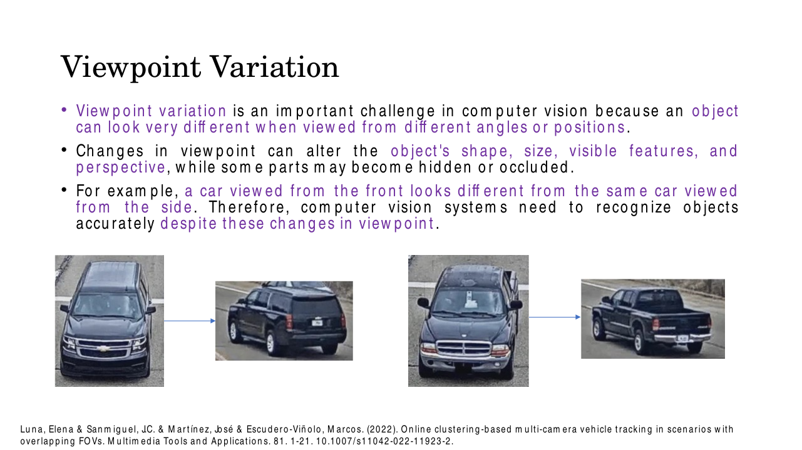
*Fig. — Viewpoint variation. The arrow joins two images of the **same** vehicle. Notice that essentially no pixel is shared between the two ends of an arrow, yet the required output label is identical. Slide 6.*

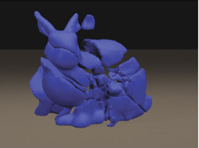
*Fig. — Deformation. The deck shows this beside the intact bunny: same object, same identity, different geometry. Deformation is about the object's own shape changing, which is what separates it from viewpoint variation (where the object is rigid and only the camera moves). Slide 8.*

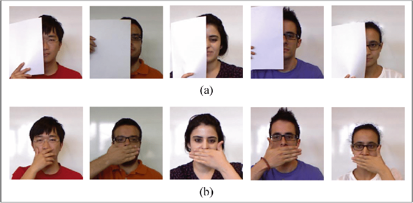
*Fig. — Occlusion, in its two degrees: a large rigid occluder (row a) and a small self-occlusion (row b). The task is still "recognise this person". Slide 9.*

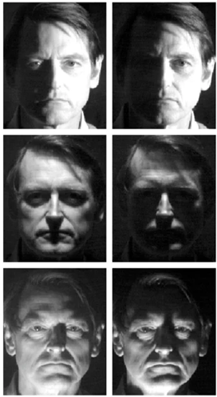
*Fig. — Illumination. Measured as raw pixel distance, two images of this **one** person differ more than two images of two different people under matched lighting. Slide 10.*

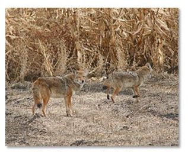
*Fig. — Background clutter. The animals are not occluded and not deformed; they are simply the same colour and texture as everything behind them. Slide 11.*

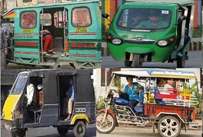
*Fig. — Intra-class variation: one class, no two examples alike. Note the deck's own slide text slips and calls this "interclass variation" — the title and the concept are both **intra**-class. Slide 12.*

### Why generative AI helps at all

Conventional vision is **discriminative**: it learns $p(y \mid \mathbf{x})$, a map from image to label.
Generative AI learns the distribution of images themselves, and the deck names four families — GANs,
VAEs, diffusion models, and Vision Transformers integrated with generative frameworks. How each
family works is [Lec 3](../week-01/03-generative-vision-models.md)'s; the taxonomy is Lec 22's.

Across slides 13–16 the deck claims four distinct contributions, and you should be able to name them
separately because MCQs separate them:

| Mechanism | What it produces | Which challenge it attacks |
|---|---|---|
| **Synthetic training data** | Whole new labelled images, generated from scratch | Data scarcity, class imbalance, rare cases |
| **Data augmentation** | Variants of existing images — relit, re-posed, re-backgrounded, partially occluded | Illumination, viewpoint, occlusion, clutter (challenges 1–6, directly) |
| **Representation / feature learning** | Latent features learned without labels, then reused by a classifier | Dependence on large labelled sets; supports semi- and unsupervised learning |
| **Direct generation of the output** | The answer *is* an image — a high-resolution image, a filled hole, a mask | Tasks whose output is itself visual (SR, inpainting, mask refinement) |

The first three improve a *discriminative* model you still have to train. Only the fourth makes the
generative model the deliverable. The deck's summary of the payoff: better data quality, more model
robustness, **lower annotation cost**, and realistic visual content. The economic argument behind
"lower annotation cost" is [Lec 2](../week-01/02-generative-vs-discriminative.md)'s.

### The master table

This is the chapter in one object. Learn it row by row.

| Task | Input | Output | Standard metric | How GenAI helps | Typical generative model |
|---|---|---|---|---|---|
| **Image classification** | One image | One class label (+ score) per image | Top-1 / top-5 **accuracy**, error rate | Synthesises training samples; fixes class imbalance; supplies latent features for semi-/unsupervised learning | GAN, VAE, diffusion |
| **Object detection** | One image | A set of $(\text{box},\ \text{class},\ \text{confidence})$ triples | **IoU** per box; **mAP** over the dataset | Generates object variations under new lighting / viewpoints / occlusion; augments and enhances images | GAN (e.g. augmentation GANs), diffusion |
| **Semantic segmentation** | One image | A class label for **every pixel**; instances of a class merged | **mIoU**, pixel accuracy | Domain adaptation, image-to-image translation, augmentation with paired image+mask | GAN, VAE, diffusion |
| **Instance segmentation** | One image | A mask **per object**, each with a class | **Mask mAP** (AP at IoU thresholds) | Sharpens object boundaries, recovers occluded regions, separates overlapping objects; SAM-style prompt-driven zero/few-shot | Diffusion, foundation models (SAM) |
| **Image super-resolution** | Low-resolution image | High-resolution image | **PSNR**, **SSIM** (+ perceptual scores) | Hallucinates plausible high-frequency texture that interpolation cannot recover | GAN (SRGAN/ESRGAN/Real-ESRGAN), diffusion (latent/SD-based) |
| **Image inpainting** | Image + mask of the missing region | Completed image | PSNR / SSIM on the hole; perceptual realism | Generates semantically and texturally consistent fill for large holes | GAN, diffusion (Stable-Diffusion inpainting), transformers |

> **A naming note the book must keep consistent.** [Lec 1](../week-01/01-intro-cv-and-genai.md)
> groups super-resolution, denoising, colorization and inpainting under one umbrella term,
> **image restoration**. This lecture treats super-resolution and inpainting as standalone tasks.
> Both framings are the deck's own and they do not conflict: restoration is the *category*, SR and
> inpainting are two *members* of it.

### Image classification

**Image classification** assigns an input image to one of several **predefined** categories. The
"predefined" is load-bearing: the label set is fixed before training, so the task is closed-set.
CNNs learn hierarchical features — edges → textures → shapes → objects — directly from labelled data
([Lec 11](../week-03/11-cnn-basics.md)); at inference the network extracts discriminative features
and a **classification layer followed by softmax** picks the most probable class.

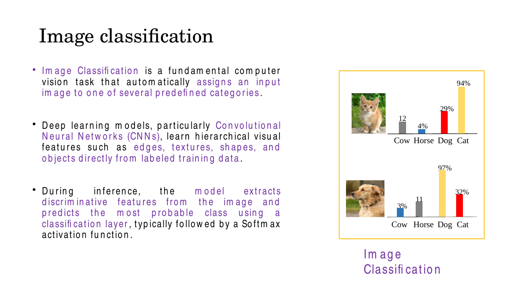
*Fig. — One label per image, scored over a fixed class list. Note the scores do **not** sum to 100% — these are per-class confidences as drawn, not a softmax distribution, which is a small inconsistency in the slide. Slide 17.*

Why it is hard: all seven challenges apply, and the model has only one global decision to make from
them. Where generative AI enters: synthetic samples for **limited datasets, class imbalance and noisy
data**; augmentation for better generalisation; and **latent representations** from a VAE or
diffusion model that let you train on far fewer labels (semi-supervised and unsupervised regimes).
The deck notes these are now routinely combined with CNN and transformer backbones.

### Object detection

**Object detection** predicts both the *location* and the *class* of one or more objects. The
formulation, which you should be able to write down: for each detected object the model outputs a
**bounding box** — four numbers, conventionally $(x_1, y_1, x_2, y_2)$ or $(x, y, w, h)$ — plus a
**class label** and a **confidence score**. Contrast with classification: one label for the whole
image versus a *variable-length set* of boxes.


*Fig. — The conventional detection pipeline. Two things to carry away: detection = **classification + localization** on proposed regions, and the proposal stage (sliding window, selective search, region proposals) is what modern one-stage detectors removed. Slide 21.*

The deck names three modern detectors: **YOLO, Faster R-CNN, SSD**. (DETR recasts detection as set
prediction with a transformer — [Lec 28](../week-08/28-vit-detr-swin.md).)

**Metrics.** A predicted box is scored against ground truth by **Intersection over Union**,

$$\text{IoU} = \frac{\text{area}(B_p \cap B_{gt})}{\text{area}(B_p \cup B_{gt})} \in [0,1]$$

A detection counts as a true positive if its IoU with an unmatched ground-truth box of the same class
exceeds a threshold, conventionally $0.5$. Sweeping the confidence threshold traces a
precision–recall curve; its area is the **average precision (AP)** for that class, and **mAP** is the
mean of AP over all classes. "mAP@0.5" means IoU threshold 0.5; "mAP@[.5:.95]" averages AP over IoU
thresholds 0.50, 0.55, …, 0.95 (the COCO convention).

Why it is hard: scale variation and occlusion hit detection harder than classification, because a
missed or badly-placed box is a hard failure, and small objects occupy few pixels. Generative AI
helps by **manufacturing labelled boxes** — when a GAN draws an object patch into a scene, you know
exactly where it is — and specifically by producing object variants under poor lighting, novel
backgrounds and **partial occlusion**, the three conditions the deck names. The deck's figure is an
"Object Generation Network": a generator takes noise $\mathbf{z}$ and a latent code $\mathbf{c}$ and
produces an object patch, while a discriminator judges real-vs-fake against patches cropped from real
target images.

### Semantic vs instance segmentation

Learn this pair as a contrast; it is examined more than anything else in the lecture.

**Semantic segmentation** assigns a class label to **every pixel**, grouping all pixels of the same
category together **without distinguishing individual objects**. Eight people in a crowd become one
connected "person" region.

**Instance segmentation** goes further: it identifies and **separates each individual object** within
the same class. Eight people become eight masks.

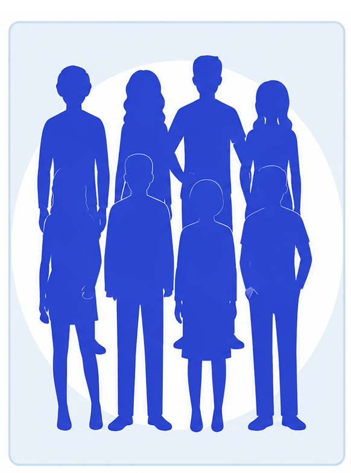
*Fig. — Semantic segmentation of the deck's crowd. One class, one colour; you cannot count the people from this output. Slide 25.*

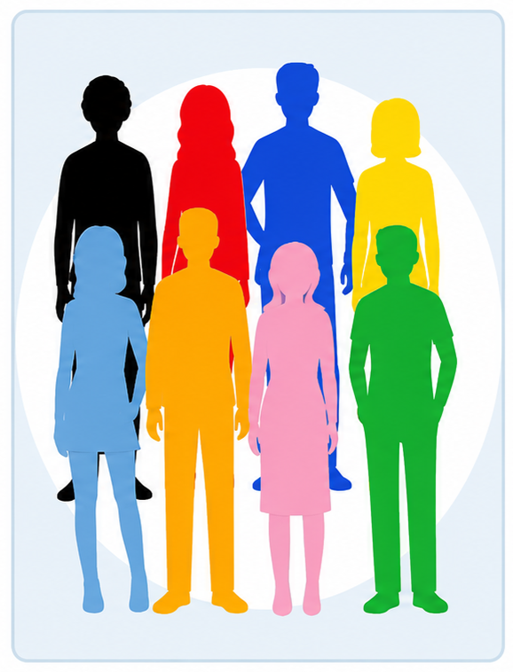
*Fig. — Instance segmentation of the same crowd. Same class for all eight, eight separate masks. Counting objects is now possible; from the previous figure it is not. Slide 25.*

| | Semantic | Instance |
|---|---|---|
| Labels | every pixel gets a class | every pixel of a *detected object* gets a class **and** an instance id |
| Separates two adjacent cars? | No — one "car" blob | Yes — two masks |
| Covers "stuff" (sky, road, grass)? | Yes | Typically no — instance methods target countable "things" |
| Can you count objects from the output? | No | Yes |
| Typical models (deck's list) | FCN, U-Net, DeepLab | Mask R-CNN |

The deck's model list for both tasks is **FCNs, U-Net, DeepLab, Mask R-CNN**; both are used in
autonomous driving and medical imaging.

Generative contributions split neatly along the same seam. For **semantic** segmentation: domain
adaptation (train on synthetic street scenes, deploy on real ones), image-to-image translation, and
augmentation — generating image/mask *pairs* is what makes this worth doing, since the mask is the
expensive part. For **instance** segmentation: better **boundary delineation**, **recovery of
occluded object regions**, and instance-aware representations that **separate overlapping objects**.
The deck singles out **SAM (Segment Anything Model)** and diffusion-based segmentation as
prompt-driven frameworks doing **zero-shot and few-shot** segmentation with minimal task-specific
supervision.

### Image super-resolution

**Image super-resolution (SR)** reconstructs a high-resolution image from a low-resolution input by
recovering lost spatial detail. It is *ill-posed*: many high-resolution images downsample to the same
low-resolution one, so the model must choose among them. That is exactly why a generative prior
helps — it supplies "which high-resolution image is most plausible".

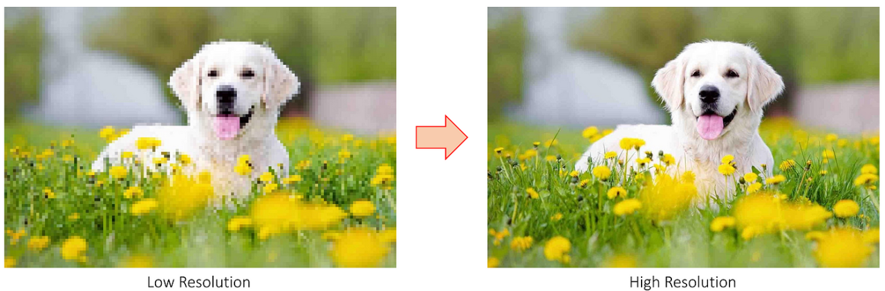
*Fig. — The task. Traditional interpolation would make the right-hand image larger but still blurred; the fur and petal texture is what has to be invented. Slide 29.*

- **Traditional methods** — interpolation and example-based approaches — produce **blurred** results
  with limited detail restoration.
- **Deep methods** named by the deck: **SRCNN, EDSR, ESRGAN, SwinIR**; plus Real-ESRGAN,
  Stable-Diffusion-based SR and **latent diffusion models** on the generative side.
- **Metrics:** **PSNR** (peak signal-to-noise ratio, in dB, from the MSE against ground truth) and
  **SSIM** (structural similarity, in $[-1,1]$, comparing luminance, contrast and structure).
- **Slide 31's generalisation point:** foundation models trained on large-scale datasets exhibit
  **strong generalisation**, enabling robust super-resolution *across diverse domains* — one model
  rather than one model per domain. Applications: medical imaging, satellite and remote sensing,
  surveillance, autonomous driving, digital photography, video restoration, scientific imaging,
  cultural heritage preservation.

### Image inpainting

**Image inpainting** reconstructs missing, damaged or unwanted regions of an image by generating
content that blends seamlessly with the surrounding pixels. Its stated objective is to preserve
**structural details, texture consistency and semantic information**. The input is an image *plus a
mask* of the region to fill — that mask is what distinguishes inpainting from SR.

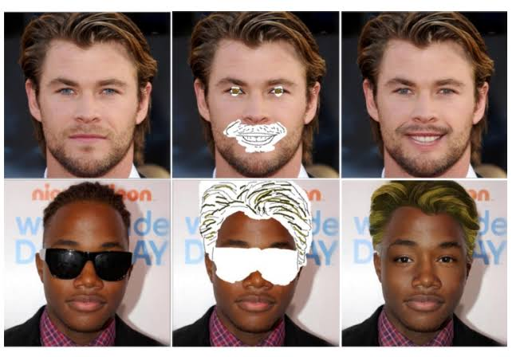
*Fig. — Input is image + mask (middle column); output is the completed image (right). The fill must be both texturally and semantically right — a mouth, not just skin-coloured noise. Slide 33.*

Traditional methods are **diffusion- and patch-based** (note: "diffusion" here means PDE-based
intensity propagation, **not** the diffusion generative model — a genuine terminology collision). They
work for small holes and **fail on complex scenes and large missing regions**. CNNs, transformers,
GANs and diffusion models learn contextual and semantic representations from large datasets and can
fill large areas photorealistically; **Stable-Diffusion-based inpainting** and transformer-guided
models achieve high-quality completion with minimal user input. Applications: image restoration,
object removal, photo editing, film and video post-production, medical imaging, cultural heritage
preservation, remote sensing, augmented reality.

The remaining tasks on this survey — image-to-image translation, medical image synthesis, anomaly
detection, 3D scene generation, face synthesis, style transfer and video generation — are
[Lec 21](21-genai-vision-tasks-2.md)'s.

## Worked numericals

### N1. IoU of two bounding boxes by hand
**Given:** predicted box $B_p = (50, 60, 200, 220)$ and ground truth $B_{gt} = (80, 100, 240, 260)$,
both in $(x_1, y_1, x_2, y_2)$ pixel coordinates.
**Find:** intersection area, union area, IoU, and the verdict at threshold 0.5.

1. $\text{area}(B_p) = (200-50)\times(220-60) = 150 \times 160 = 24{,}000$ px².
2. $\text{area}(B_{gt}) = (240-80)\times(260-100) = 160 \times 160 = 25{,}600$ px².
3. Intersection in $x$: from $\max(50,80)=80$ to $\min(200,240)=200$, width $=120$.
4. Intersection in $y$: from $\max(60,100)=100$ to $\min(220,260)=220$, height $=120$.
5. $\text{area}(\cap) = 120 \times 120 = 14{,}400$ px².
6. $\text{area}(\cup) = 24{,}000 + 25{,}600 - 14{,}400 = 35{,}200$ px². (Subtract the overlap once — adding the two areas double-counts it.)
7. $\text{IoU} = 14{,}400 / 35{,}200 = 0.4091$.

**Answer:** **IoU = 0.409.** Below 0.5, so this detection is a **false positive** at the standard
threshold — and it would also leave the ground-truth box unmatched, i.e. a false negative too. One
sloppy box costs you twice.

### N2. Precision, recall, F1 — and what mAP adds
**Given:** a detector evaluated at IoU 0.5 on one class returns TP $=70$, FP $=30$, FN $=20$.
**Find:** precision, recall, $F_1$; then the mAP for a two-class problem with AP$_\text{car}=0.82$,
AP$_\text{person}=0.64$.

1. $\text{Precision} = \dfrac{TP}{TP+FP} = \dfrac{70}{70+30} = \dfrac{70}{100} = 0.700$ — of what you reported, how much was right.
2. $\text{Recall} = \dfrac{TP}{TP+FN} = \dfrac{70}{70+20} = \dfrac{70}{90} = 0.7778$ — of what was there, how much you found.
3. $F_1 = \dfrac{2PR}{P+R} = \dfrac{2(0.700)(0.7778)}{0.700+0.7778} = \dfrac{1.0889}{1.4778} = 0.7368$.
4. Note $F_1 = 0.737$ sits *below* the arithmetic mean $(0.700+0.7778)/2 = 0.739$ — the harmonic mean always does, which is why it punishes imbalance between P and R.
5. $\text{mAP} = \dfrac{0.82 + 0.64}{2} = \dfrac{1.46}{2} = 0.730$.

**Answer:** **P = 0.700, R = 0.778, F₁ = 0.737, mAP = 0.730.** AP is the area under one class's
precision–recall curve, traced by sweeping the *confidence* threshold; mAP averages AP over classes.
P, R and $F_1$ are single-threshold numbers; AP and mAP are threshold-free, which is why detection
papers report mAP.

### N3. PSNR from a given MSE
**Given:** an 8-bit grayscale super-resolution output with MSE $=25$ against the ground truth
(peak value $L = 255$).
**Find:** PSNR in dB, and the PSNR if the MSE were 100 instead.

1. $\text{PSNR} = 10\log_{10}\dfrac{L^2}{\text{MSE}} = 10\log_{10}\dfrac{255^2}{25}$.
2. $255^2 = 65{,}025$.
3. $65{,}025 / 25 = 2601$.
4. $\log_{10} 2601 = 3.4151$.
5. $\text{PSNR} = 10 \times 3.4151 = 34.15$ dB.
6. For MSE $=100$: $65{,}025/100 = 650.25$, $\log_{10} 650.25 = 2.8131$, PSNR $= 28.13$ dB.
7. The gap: $34.15 - 28.13 = 6.02$ dB, and indeed $10\log_{10} 4 = 6.02$ — **quadrupling the MSE always costs exactly 6.02 dB**, regardless of the starting point.

**Answer:** **34.15 dB** at MSE 25; **28.13 dB** at MSE 100. Higher PSNR is better; MSE $\to 0$ sends
PSNR $\to \infty$, so PSNR is undefined for a perfect reconstruction.

### N4. Pixel accuracy and mean IoU for a segmentation
**Given:** a 3-class segmentation of a 500-pixel image. Rows are ground truth, columns are
prediction.

| GT ↓ / Pred → | road | car | background | row total |
|---|---|---|---|---|
| **road** | 90 | 5 | 5 | 100 |
| **car** | 10 | 70 | 20 | 100 |
| **background** | 5 | 15 | 280 | 300 |
| **col total** | 105 | 90 | 305 | 500 |

**Find:** pixel accuracy and mIoU.

1. Correct pixels $=$ trace $= 90 + 70 + 280 = 440$.
2. $\text{Pixel accuracy} = 440/500 = 0.880$.
3. Per class, $\text{IoU}_c = \dfrac{TP_c}{TP_c + FP_c + FN_c}$, with $FP_c = (\text{col sum}) - TP_c$ and $FN_c = (\text{row sum}) - TP_c$.
4. **road:** $TP=90$, $FP = 105-90 = 15$, $FN = 100-90 = 10$ → $90/115 = 0.7826$.
5. **car:** $TP=70$, $FP = 90-70 = 20$, $FN = 100-70 = 30$ → $70/120 = 0.5833$.
6. **background:** $TP=280$, $FP = 305-280 = 25$, $FN = 300-280 = 20$ → $280/325 = 0.8615$.
7. $\text{mIoU} = (0.7826 + 0.5833 + 0.8615)/3 = 2.2274/3 = 0.7425$.

**Answer:** **pixel accuracy = 0.880, mIoU = 0.742.** The gap is the lesson: 60% of the image is
background, so getting background right carries pixel accuracy. mIoU weights every class equally and
exposes the weak class (car, 0.583). This is why segmentation papers report mIoU and not accuracy.

### N5. Upscaling factor and output size for super-resolution
**Given:** a $256 \times 256$ RGB low-resolution input; the target output is $1024 \times 1024$.
**Find:** the upscaling factor, output pixel count, and how much of the output is invented.

1. Upscaling factor $s = 1024/256 = 4$, i.e. **×4 SR** (the factor is *linear*, per side).
2. Input pixels $= 256^2 = 65{,}536$.
3. Output pixels $= 1024^2 = 1{,}048{,}576$.
4. Ratio $= s^2 = 16$ — pixel count grows with the **square** of the stated factor.
5. Pixels with no direct source $= 1{,}048{,}576 - 65{,}536 = 983{,}040$, i.e. $15/16 = 93.75\%$ of the output.
6. For 3 channels the model emits $3 \times 1{,}048{,}576 = 3{,}145{,}728$ values from $196{,}608$ given ones.

**Answer:** **×4, 1,048,576 output pixels, 93.75% of them synthesised.** That number is the argument
for a generative prior: there is no interpolation scheme that can *recover* information for 15 out of
every 16 pixels — it can only be plausibly invented.

## Code

```python
import numpy as np

# --- 1. IoU for two boxes in (x1, y1, x2, y2) --------------------------
def iou(a, b):
    xA, yA = max(a[0], b[0]), max(a[1], b[1])      # top-left of overlap
    xB, yB = min(a[2], b[2]), min(a[3], b[3])      # bottom-right of overlap
    inter = max(0, xB - xA) * max(0, yB - yA)      # max(0, .) -> disjoint = 0
    area_a = (a[2] - a[0]) * (a[3] - a[1])
    area_b = (b[2] - b[0]) * (b[3] - b[1])
    union = area_a + area_b - inter                # overlap counted once
    return inter, union, inter / union

pred, gt = (50, 60, 200, 220), (80, 100, 240, 260)
i, u, v = iou(pred, gt)
print(f"inter {i}  union {u}  IoU {v:.4f}  verdict@0.5 = "
      f"{'TP' if v >= 0.5 else 'FP'}")
# inter 14400  union 35200  IoU 0.4091  verdict@0.5 = FP

# --- 2. PSNR, from a given MSE and from two actual images --------------
def psnr(mse, peak=255.0):
    return 10 * np.log10(peak ** 2 / mse)

for m in (25.0, 100.0):
    print(f"MSE {m:6.1f} -> PSNR {psnr(m):.2f} dB")
print(f"4x the MSE costs {psnr(25.) - psnr(100.):.2f} dB")
# MSE   25.0 -> PSNR 34.15 dB
# MSE  100.0 -> PSNR 28.13 dB
# 4x the MSE costs 6.02 dB

hr = np.array([[100, 150], [200, 250]], float)     # ground truth patch
sr = hr + np.array([[5, -5], [5, -5]], float)      # reconstruction, +-5 off
mse = np.mean((hr - sr) ** 2)                      # (25+25+25+25)/4 = 25
print(f"empirical MSE {mse:.1f} -> PSNR {psnr(mse):.2f} dB")
# empirical MSE 25.0 -> PSNR 34.15 dB

# --- 3. pixel accuracy and mIoU from a segmentation confusion matrix ---
cm = np.array([[90, 5, 5], [10, 70, 20], [5, 15, 280]], float)  # rows = GT
tp = np.diag(cm)
fp = cm.sum(axis=0) - tp          # predicted as c, truly something else
fn = cm.sum(axis=1) - tp          # truly c, predicted something else
ious = tp / (tp + fp + fn)
print(f"pixel acc {np.trace(cm) / cm.sum():.4f}   per-class IoU "
      f"{np.round(ious, 4)}   mIoU {ious.mean():.4f}")
# pixel acc 0.8800   per-class IoU [0.7826 0.5833 0.8615]   mIoU 0.7425
```

## Exam pack

### Must-memorise

| Item | Exactly this |
|---|---|
| CV challenges (7) | viewpoint variation · scale variation · **deformation** · occlusion · illumination changes · background clutter · intra-class variation |
| Viewpoint variation | An object looks very different from different **angles or positions**; alters shape, size, visible features, perspective |
| Scale variation | Same object at different **sizes**, depending on **distance from the camera** |
| Deformation | Shape/appearance changes when the object **bends, stretches, moves, changes posture** |
| Occlusion | One object **partially or completely blocks** another from view |
| Background clutter | Background contains many objects/patterns/**textures** that hide the main object |
| Intra-class variation | Objects of the **same category** have very different appearances |
| Image classification | Assigns an input image to **one of several predefined categories**; classification layer + **softmax** |
| Object detection | Predicts **bounding boxes + class labels + confidence scores**; = localization **+** classification |
| Detector names (deck) | **YOLO, Faster R-CNN, SSD** |
| **IoU** | $\text{area}(\cap)/\text{area}(\cup)$ of predicted and ground-truth boxes; TP if $\ge$ threshold (usually 0.5) |
| **mAP** | Mean over classes of AP; AP = area under that class's precision–recall curve |
| Precision / Recall / $F_1$ | $TP/(TP{+}FP)$ · $TP/(TP{+}FN)$ · $2PR/(P{+}R)$ |
| **Semantic segmentation** | Class label to **every pixel**, grouping all pixels of a category **without distinguishing individual objects** |
| **Instance segmentation** | Identifies and **separates each individual object** within the same class |
| Segmentation models (deck) | **FCN, U-Net, DeepLab, Mask R-CNN** |
| **mIoU** | Mean over classes of $TP/(TP+FP+FN)$ computed on pixels |
| Super-resolution | Reconstructs a **high-resolution** image from a **low-resolution** input by recovering lost spatial detail |
| SR models (deck) | **SRCNN, EDSR, ESRGAN, SwinIR**; Real-ESRGAN, latent/Stable-Diffusion SR |
| **PSNR** | $10\log_{10}(L^2/\text{MSE})$, $L=255$ for 8-bit; in **dB**, higher is better |
| **SSIM** | Structural similarity — luminance, contrast, structure; range $[-1,1]$, 1 = identical |
| Image inpainting | Reconstructs **missing/damaged/unwanted** regions with content that blends with surrounding pixels; preserves **structure, texture, semantics** |
| Traditional inpainting | **Diffusion- and patch-based**; good for **small** holes, fails on complex scenes |
| GenAI's four contributions | synthetic training data · data augmentation · representation/feature learning · direct generation of the output |
| Prompt-driven segmentation | **SAM (Segment Anything Model)** — zero-shot and few-shot |
| "Image restoration" | The deck's umbrella term covering **super-resolution, denoising, colorization, inpainting** |

### Numbers worth knowing

| Quantity | Value |
|---|---|
| Challenges of computer vision listed | **7** |
| CV applications listed on slide 4 | **10** |
| Tasks covered in Lec 20 (Part I) | **5** |
| Bounding-box parameters | **4** (plus class and confidence) |
| Standard IoU threshold for a TP | **0.5** |
| COCO mAP IoU sweep | 0.50 → 0.95 in steps of 0.05 (10 thresholds) |
| Peak value $L$ for 8-bit PSNR | **255**, $L^2 = 65{,}025$ |
| PSNR at MSE = 25 | **34.15 dB** |
| PSNR cost of 4× the MSE | **6.02 dB** |
| Generative families named on slide 13 | **4** — GANs, VAEs, diffusion models, ViTs in generative frameworks |
| Pixel growth for ×$s$ super-resolution | $s^2$ (×4 SR → 16× the pixels) |
| Worked example: pixel acc vs mIoU | 0.880 vs 0.742 |

### Likely MCQ traps

- **"Semantic segmentation separates individual objects."** It does **not**. Eight people → one
  "person" region. Only **instance** segmentation separates them. The one-line discriminator: *can you
  count the objects from the output?* Semantic no, instance yes.
- **"Instance segmentation labels every pixel."** It labels the pixels of detected *things*. Pixels of
  "stuff" (sky, road) are typically left unlabelled. Labelling **every** pixel is semantic.
- **Detection vs classification.** Classification outputs **one label for the image**; detection
  outputs **a set of boxes with labels and scores**. "Detection assigns one label per image" is false.
- **Detection vs segmentation.** Detection gives a **rectangle**; segmentation gives a **pixel mask**.
  A box is not a mask.
- **"IoU is intersection over the smaller box"** or "over the ground-truth area". It is intersection
  over **union**. And the union is $A + B - \cap$, not $A + B$ — forgetting to subtract the overlap is
  the single most common arithmetic slip.
- **"mAP means mean average precision over IoU thresholds."** Primarily it is the mean over
  **classes**. Averaging over IoU thresholds as well is the extra COCO convention, written
  mAP@[.5:.95].
- **"Higher MSE means higher PSNR."** Inverse — MSE is in the **denominator**. High PSNR = low error.
- **"PSNR ranks perceptual quality."** It does not. A blurry average-of-everything output can beat a
  sharp GAN output on PSNR while looking worse; this is the perception–distortion trade-off, and it is
  why SSIM and perceptual metrics are reported alongside.
- **"Pixel accuracy is a good segmentation metric."** It is dominated by the largest class. N4: 0.880
  accuracy, 0.742 mIoU, with one class at 0.583.
- **"×4 super-resolution gives 4× the pixels."** It gives $4^2 = 16\times$. The factor is per side.
- **Viewpoint vs deformation.** Viewpoint: the **object is rigid, the camera moves**. Deformation:
  the **object's own shape changes**. Occlusion is neither — information is *missing*, not transformed.
- **Intra-class vs inter-class variation.** *Intra*-class = differences **within** one class (the
  challenge named here; the deck's body text mistakenly writes "interclass"). *Inter*-class variation
  — differences *between* classes — is what makes classification possible, not what makes it hard.
- **The two "diffusions".** Traditional inpainting is *diffusion-based* in the PDE sense (propagating
  intensities inward). Diffusion **models** are the generative family. Same word, unrelated methods.
- **"GANs are the model of choice for every task."** Match the family: GAN/diffusion for SR and
  inpainting and synthetic data; VAE and diffusion for latent representations; foundation models (SAM)
  for prompt-driven segmentation.
- **"Generative modelling for classification means the generator classifies."** Usually it does not —
  it supplies **data** or **features** to a discriminative classifier. Only in SR, inpainting and mask
  generation is the generative model the output-producer.

### Self-test

1. List the seven challenges of computer vision, with the deck's example for each.
2. A photograph of a parked car taken from a drone directly overhead, versus the same car from the pavement. Which challenge is this, and which is it *not*?
3. Write the formulation of object detection: what exactly does the model output per object?
4. Compute IoU for $B_p=(0,0,10,10)$ and $B_{gt}=(5,5,15,15)$. Is it a TP at 0.5?
5. In one sentence each, define semantic and instance segmentation, and state the one test that tells them apart.
6. A detector returns TP = 40, FP = 10, FN = 50. Compute precision, recall and $F_1$. Which is the model's real problem?
7. An 8-bit SR output has MSE = 400. Compute PSNR.
8. Give the two standard metrics for super-resolution and say why both are reported.
9. Name four distinct mechanisms by which generative AI improves a downstream vision task, and say which one makes the generative model the deliverable rather than a helper.
10. Why does augmenting a detection dataset with GAN-generated objects cost nothing in annotation?

<details><summary>Answers</summary>

1. Viewpoint variation (car front vs side); scale variation (car near vs far); deformation (person sitting/standing/bending, the deformed bunny); occlusion (face behind paper or hand); illumination changes (same face in daylight vs low light); background clutter (wolf in matching forest/grass texture); intra-class variation (auto-rickshaws / cars of very different designs).
2. Viewpoint variation. It is *not* scale variation (that would be the same view at a different distance) and not deformation (the car's own shape has not changed).
3. A bounding box — four coordinates, $(x_1,y_1,x_2,y_2)$ or $(x,y,w,h)$ — plus a class label and a confidence score, for each of a variable number of objects.
4. Intersection: $x$ from 5 to 10 = 5, $y$ from 5 to 10 = 5, area 25. Areas 100 and 100, union $=100+100-25=175$. IoU $=25/175=0.143$. **No** — far below 0.5, a false positive.
5. Semantic: a class label for every pixel, with all instances of a class merged. Instance: a separate mask for each individual object. Test: can you count the objects from the output? Instance yes, semantic no.
6. $P = 40/50 = 0.800$; $R = 40/90 = 0.444$; $F_1 = 2(0.8)(0.444)/(1.244) = 0.711/1.244 = 0.571$. Recall — it is missing more than half the objects, while what it does report is mostly right.
7. $10\log_{10}(65{,}025/400) = 10\log_{10}(162.56) = 10(2.2111) = 22.11$ dB.
8. PSNR and SSIM. PSNR measures pixel-wise error and rewards blurry averages; SSIM measures structural agreement (luminance, contrast, structure), so it tracks perceived quality better. Reporting both exposes the perception–distortion trade-off.
9. Synthetic training data; data augmentation; representation/feature learning; direct generation of the output. The fourth — in SR, inpainting and mask generation the generative model *is* the system.
10. Because the generator places the object, so its bounding box (and class) is known by construction — the label falls out of the generative process instead of being drawn by a human.

</details>

## Beyond the slides

**Gap:** The deck defines five tasks and names zero evaluation metrics.
**Why it matters:** NPTEL numericals on this lecture will be IoU, mAP, PSNR and mIoU arithmetic —
there is nothing else computable here. Top-1/top-5 accuracy for classification, IoU and mAP for
detection, mIoU and pixel accuracy for segmentation, PSNR and SSIM for SR and inpainting. Memorise
the pairing of metric to task; that pairing alone is a standard MCQ.

**Gap:** **Panoptic segmentation** is never mentioned.
**Why it matters:** It is the natural third member of the segmentation family and appears in question
banks — panoptic = semantic **+** instance: every pixel gets a class label, *and* pixels belonging to
countable "things" additionally get an instance id, while "stuff" classes (sky, road) get class only.
If an option list offers a segmentation variant that does both, that is panoptic.

**Gap:** The deck says generated data "improves accuracy" without stating a limit.
**Why it matters:** A generator trained on $\mathcal{D}$ cannot add information absent from
$\mathcal{D}$. Synthetic data buys **coverage, balance and rare-case density**, not new information,
and there is a **sim-to-real gap** when generated images carry artefacts the real ones do not. Train
repeatedly on your own output and quality degrades.

**Gap:** "Super-resolution reconstructs lost detail" is stated as though detail were recoverable.
**Why it matters:** SR is **ill-posed** — many high-resolution images downsample to the same
low-resolution one (N5: 93.75% of a ×4 output has no source pixel). A generative model does not
*recover* the detail; it **invents a plausible** one. In forensic or medical use that distinction is
the whole safety argument.

## Cut from the slides

Dropped the title slide (1), the "Content" roadmap (2), the identical "Summary" slide (36) and the
"Next" slide (37) — slides 2 and 36 are the same bullet list twice. Slide 3's "What is Computer
Vision?" diagram and its definition belong to [Lec 1](../week-01/01-intro-cv-and-genai.md), which
owns them, so only the application list from slide 4 is kept here. Slides 13–16 are four slides of
continuous prose asserting the same claim ("generative AI improves downstream tasks") and are
compressed into the single four-mechanism table; slide 15's second half and slide 16 preview the
seven tasks of [Lec 21](21-genai-vision-tasks-2.md) and are left to that chapter. Each task's "what
it is" and "how GenAI helps" slide pair (17–19, 20–23, 24–27, 28–31, 32–35) is prose that restates
itself two or three times — in every case the distinct content is the definition, the named model
list and the application list, which are preserved in full in the master table and the Must-memorise
table; the repeated motivational sentences are not. Of the extracted figures, the magnifying-glass
icon (slide 21), the plain crowd photograph (slide 25, shown as "Original Image"), the cat and dog
thumbnails from slide 17 and the duplicate car photographs reused on slide 7 are decorative or
duplicated and are covered by the whole-slide renders instead. The GAN "Object Generation Network"
schematic on slide 23 is described in the detection section rather than embedded, since its internals
are [Lec 3](../week-01/03-generative-vision-models.md)'s material. Nothing conceptual was dropped.
