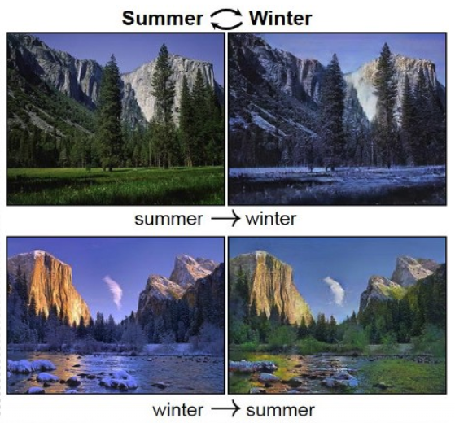
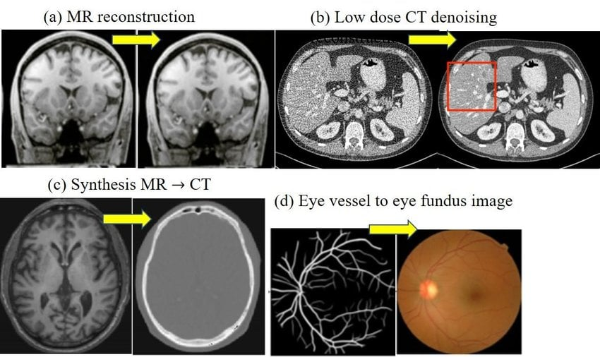
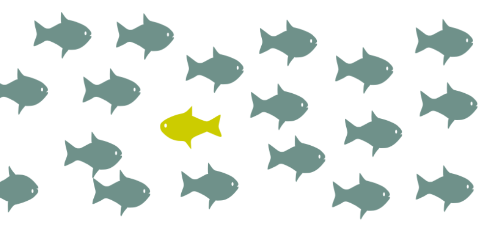
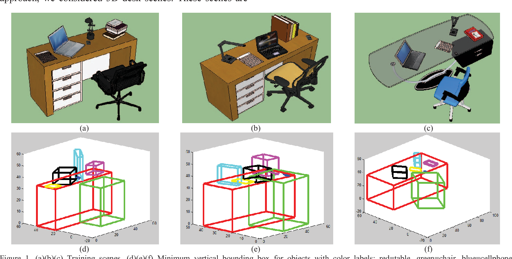
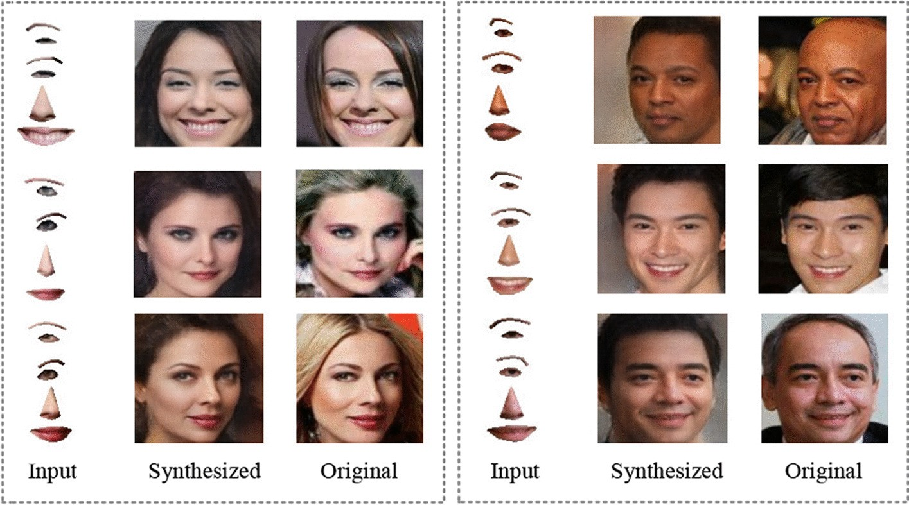
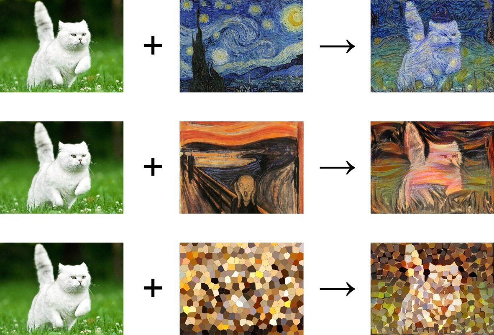
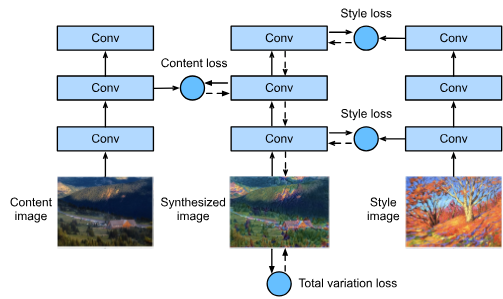

# Lec 21 — Generative AI for Vision Tasks II

> **Deck:** `L7P2_GenAICV_2.pptx` · **Week 5** · **Playlist:** Lec 21
> **Prereqs:** [Lec 20 — GenAI Vision Tasks I](20-genai-vision-tasks-1.md)
> **Feeds into:** [Lec 22 — Generative Taxonomy and MLE](../week-06/22-generative-taxonomy-and-mle.md)

## Why this lecture exists

[Lec 20](20-genai-vision-tasks-1.md) surveyed the tasks where generation *assists* an existing
discriminative pipeline — it augments a classifier, fills a hole, upsamples a patch. The output is
still judged against a ground truth that already exists somewhere. This half of the survey crosses a
line. Here the generated image **is** the deliverable: there is no ground-truth winter photograph of
that summer valley, no real CT scan for that MRI, no true next frame of a video that was never shot.
Once there is no target to regress to, supervised loss functions stop working, and the lecture's whole
job is to show you what replaces them — cycle consistency, reconstruction error as a score, adversarial
realism, temporal coherence. Seven tasks, each a case study in generating without a label.

## The ideas

The deck is organised as seven task pairs: one or two slides saying *what the task is*, then one or two
saying *how generative AI does it*. Here is the whole lecture in one table; the subsections then do the
part that is not list-shaped.

| Task | Input | Output | Key challenge | Model family typically used | Landmark system |
|---|---|---|---|---|---|
| **Image-to-image translation** | image in domain $A$ | image in domain $B$ | keep semantic content, change only domain; often **no paired data** | cGAN, diffusion, transformer | **Pix2Pix** (paired), **CycleGAN** (unpaired) |
| **Medical image synthesis** | noise, or a scan in another modality | anatomically plausible scan | no hallucinated pathology; scarce, private, imbalanced data | GAN, VAE, diffusion | MRI→CT CycleGAN; MedGAN |
| **Anomaly detection** | one test image | anomaly score (+ heat map) | **no labelled anomalies** to train on; rarity and class imbalance | VAE, GAN, diffusion, normalizing flow | AnoGAN / f-AnoGAN |
| **3D scene generation** | text, image, layout, or partial 3D | mesh / voxels / radiance field | multi-view geometric consistency; compute | GAN, VAE, diffusion, transformer | **NeRF**; DreamFusion |
| **Face synthesis** | $\mathbf{z}\sim\mathcal{N}(\mathbf{0},\mathbf{I})$, text, or face parts | photorealistic face | identity consistency + controllable attributes; misuse | GAN, diffusion | **StyleGAN / StyleGAN2** |
| **Style transfer** | content image + style image (or text) | stylized image | keep content *structure*, replace only *texture* | CNN optimisation, GAN, diffusion, ViT | Gatys neural style transfer |
| **Video generation** | text, image, or short clip | frame sequence | **temporal coherence** across frames; cost scales with frames | diffusion + transformer, GAN, VAE | text-to-video latent diffusion (Sora-class) |

Only **Pix2Pix** and **CycleGAN** are named on the deck; the other landmark systems are supplied here
because an MCQ naming a task usually offers a system name as a distractor. How each model family works
is [Lec 3](../week-01/03-generative-vision-models.md)'s survey, with full treatments in Weeks 8–12.

### Image-to-image translation — the paired/unpaired split

**Image-to-image (I2I) translation** transforms an image from one visual domain to another *while
preserving its underlying semantic content and structural information*. The cat stays in the same pose;
only the season changes.


*Fig. — The valley, the trees and the cliff are pixel-for-pixel in the same place in both columns. Only snow, foliage and colour temperature move. That invariance is the definition of the task. Slide 4.*

Unlike text-to-image, I2I **conditions on an existing image**: the source is an input, not a prompt.
Everything else follows from one practical question — *do you have aligned pairs?*

| | **Paired** | **Unpaired** |
|---|---|---|
| Training data | $\{(\mathbf{x}_i, \mathbf{y}_i)\}$ — same scene, both domains, pixel-aligned | two unaligned piles: $\{\mathbf{x}_i\}$ in $A$, $\{\mathbf{y}_j\}$ in $B$ |
| Landmark model | **Pix2Pix** (conditional GAN) | **CycleGAN** |
| Networks | one generator $G: A \to B$, one discriminator | **two** generators $G: A\to B$, $F: B\to A$, **two** discriminators |
| Supervision signal | adversarial loss **+ $\ell_1$ to the ground-truth $\mathbf{y}_i$** | adversarial loss **+ cycle-consistency loss** |
| Typical use | semantic map → scene, edges → handbag, sketch → photo | summer ↔ winter, horse ↔ zebra, photo ↔ Monet |
| Why you'd be forced into it | — | nobody can photograph the same valley in two seasons from the same tripod |

Pix2Pix minimises $\mathcal{L}_{\text{cGAN}}(G,D) + \lambda\,\mathbb{E}\big[\|\mathbf{y}-G(\mathbf{x})\|_1\big]$:
the $\ell_1$ term is possible *only* because $\mathbf{y}$ exists for that exact $\mathbf{x}$.

Unpaired data removes that term, and without it a generator can map every input to one convincing
winter photo and still fool the discriminator. **Cycle consistency** is the replacement: translate
forward, translate back, and demand you land where you started.

$$\mathcal{L}_{\text{cyc}}(G,F) = \mathbb{E}_{\mathbf{x}}\big[\|F(G(\mathbf{x})) - \mathbf{x}\|_1\big] + \mathbb{E}_{\mathbf{y}}\big[\|G(F(\mathbf{y})) - \mathbf{y}\|_1\big]$$

Both directions are required: a one-way constraint still lets $G$ throw away content that $F$ then
invents from scratch. Cycle consistency is *self*-supervision — the $\ell_1$ target is the input image
itself, so no label is consumed. N1 computes it by hand.

Deck applications: autonomous driving, medical imaging, remote sensing, digital content creation, AR,
computer graphics. Deck sub-tasks: **colorization, enhancement, semantic label-to-image synthesis,
day-to-night, sketch-to-photo, medical modality conversion**. Several of these (super-resolution,
inpainting, colorization, denoising) the course groups under the umbrella term **image restoration** and
treats in [Lec 20](20-genai-vision-tasks-1.md) — the same operations seen from the translation angle,
not a contradiction.

### Medical image synthesis

Generating realistic scans, or converting one modality to another.


*Fig. — (c) is the cross-modality case the exam likes: an MR slice in, a CT slice out, with no radiation dose paid. (d) runs label-map → realistic image, which is Pix2Pix's setting exactly. Slide 9.*

Four reasons this task is special, each a distinct MCQ:

| Pressure | What it means |
|---|---|
| **Limited annotated datasets** | expert radiologist annotation, not crowd labels — orders of magnitude more expensive |
| **Patient privacy** | synthetic scans carry no identifiable patient, so they can be shared where real ones legally cannot |
| **Class imbalance** | a rare tumour may appear in 50 of 50,000 scans; synthesis manufactures the minority class |
| **Cross-modality translation** | MRI↔CT, low-dose CT reconstruction, PET and ultrasound — buy one modality from another |

Named operations: cross-modal translation, reconstruction, super-resolution, noise reduction, data
augmentation — across **MRI, CT, PET and ultrasound**. The non-negotiable constraint is *anatomical and
pathological consistency*: a generator that invents a plausible-looking lesion has not augmented your
dataset, it has poisoned it.

### Anomaly detection — reconstruction error as the score

An **anomaly** (outlier, novelty) is an observation that deviates significantly from a system's expected
behaviour: equipment failure, fraud, cyberattack, medical abnormality.


*Fig. — The anomaly is defined entirely by what the rest of the data looks like. You never needed a labelled set of yellow fish to spot it. Slide 11.*

Classical baselines: **Isolation Forest, One-Class SVM, Local Outlier Factor**, plus statistical,
distance-based, density and clustering methods. Settings are **supervised, semi-supervised,
unsupervised**, depending on what labels exist. Listed difficulties: rarity of anomalous events, class
imbalance, high-dimensional data, evolving (drifting) distributions, and the **absence of labelled
anomaly samples**.

That last one kills the discriminative approach, and is why generative models fit so cleanly. The
mechanism, the most examinable idea in this section:

1. Train a generative model on **normal data only**. It learns $p(\mathbf{x})$ for normality.
2. At test time, reconstruct (or score) the sample.
3. Normal input → low reconstruction error / high likelihood. Anomalous input → the model has never
   seen anything like it, reconstructs it badly, and the **reconstruction error is the anomaly score**.
4. Threshold the score. Anything above the threshold is flagged.

Because the error is per-pixel, the same quantity also *localises* the defect — a free heat map, which
is why industrial inspection uses it. Families named: **VAEs, GANs, diffusion models, normalizing
flows**. Domains: image analysis, industrial inspection, cybersecurity, healthcare screening,
time-series monitoring. Setting the threshold is the whole engineering problem; N2 does it.

### 3D scene generation

Automatically creating three-dimensional environments — objects, spatial relationships, geometry,
textures and lighting — from text, images, scene layouts or partial 3D data.


*Fig. — Top row: the rendered scene. Bottom row: the same scene as a layout of labelled 3D boxes. Generation happens at the layout level first, then the geometry and texture are filled in. Slide 15.*

The contrast drawn is **procedural modelling and handcrafted rules** (manual, rigid) versus learned
spatial and semantic representations. Modern pipelines are text-to-3D and image-to-3D: a vision-language
model supplies the semantics, a diffusion model the appearance. **NeRF (neural radiance fields)** is the
representation that made this practical — instead of storing a mesh, a small network maps a 3-D point
and a viewing direction to a colour and a density, so the scene *is* the weights and new viewpoints are
rendered by querying it. Open problems: physical realism, object interactions, efficiency, large-scale
**interactive** environments. Applications: VR/AR, robotics, autonomous driving, gaming, digital twins,
architectural visualisation.

### Face synthesis

Generating realistic facial images while preserving identity, attributes and visual consistency.


*Fig. — Input is a handful of disembodied facial parts; output is a complete, consistent face. The "Original" column is the target, not an input — compare the pairs to judge identity preservation. Slide 19.*

Pre-deep-learning: **3D morphable models (3DMMs)**, statistical models, image-based rendering. The
modern progression runs **ProGAN → StyleGAN → StyleGAN2** — 1024×1024 photorealistic faces, and the
home of **latent-space attribute manipulation**: find the direction $\hat{\mathbf{d}}$ along which "age"
varies, then edit any face by walking along it, $\mathbf{z}' = \mathbf{z} + \alpha\hat{\mathbf{d}}$.
Controllable attributes listed: identity, expression, pose, age, hairstyle, lighting. N4 does the
arithmetic.

The ethics are examinable and the deck states them twice: identity consistency, controllable editing,
efficiency, **fairness across demographic groups**, and responsible deployment via **watermarking,
provenance tracking and synthetic media detection** — the deepfake problem. Applications: facial
recognition, virtual avatars, AR/VR, digital entertainment, facial reenactment, image restoration,
synthetic training data.

### Style transfer

Combine the **content** of one image with the **style** of another.


*Fig. — The cat's outline, pose and position survive all three transfers; the brushstrokes, palette and texture come entirely from the painting. Slide 23.*

The separation works because a CNN's layers specialise: deep feature maps encode **high-level semantic
content** (what is where), while the *correlations between* feature channels — colour, texture,
brushstrokes, repeated patterns — encode **low-level style**. Hold one fixed, optimise the other.


*Fig. — The middle stack is the image being generated; it is the *variable*, not the network. Content loss is taken at one deep layer, style losses at several layers, and total variation loss suppresses pixel noise. Slide 25.*

Read the figure carefully: it inverts the usual training picture. The conv weights are frozen and the
**synthesized image's pixels are the parameters being optimised** — which is why the original (Gatys)
method is slow, since every new image is a fresh optimisation. **Feed-forward** networks fixed that by
training one network per style to transfer in a single pass. Generative AI then adds GANs, diffusion,
ViTs and multimodal foundation models, whose contribution is **text-guided** style transfer: describe
the style in words instead of supplying an image. The standing challenge throughout is preserving the
content image's structural integrity while reproducing the style faithfully.

### Video generation

Synthesising temporally coherent sequences from text, images, audio, or existing frames. The deck's own
framing of why this is strictly harder: video requires modelling **both** the spatial appearance of each
frame **and** the temporal dynamics governing motion and object interactions *across* frames. Three
consequences:

- **Temporal coherence.** Generate frames independently and objects change identity, colour and position
  between them. The visible symptom is **flicker**.
- **Compute.** An extra dimension multiplies everything by the frame count — and if you let the model
  attend across frames rather than within them, the attention cost multiplies by the frame count
  *again*. N3 prices both.
- **Long-horizon drift.** Quality degrades over duration, which is why "long-duration video generation"
  is listed as an open problem.

Classical approaches: **optical flow estimation, frame interpolation, RNNs**. Modern: diffusion plus
transformers over spatiotemporal representations, with vision-language models driving **text-to-video**
and **image-to-video**. The responsible-deployment trio from face synthesis reappears verbatim.

### Which family wins which task

Read the master table's fifth column downwards and a pattern falls out. **GANs dominate where the output
is one high-fidelity image from a narrow domain** — faces, season swaps, stylisation — because
adversarial training optimises perceptual realism directly and samples in one forward pass. **VAEs
dominate where you need a score rather than a picture** — anomaly detection — because an explicit latent
plus a reconstruction term gives a calibrated error to threshold. **Diffusion dominates wherever the
output is high-dimensional, diverse, or text-conditioned** — medical synthesis, 3D, video — trading
sampling speed for stable training and mode coverage, exactly the trade you want at a million degrees of
freedom. **Transformers appear wherever the conditioning is language**, which is why text-to-3D and
text-to-video are the newest rows. Across both survey chapters the constant is that generation became
the *supervision signal*: cycle consistency, reconstruction error and adversarial realism are all ways
of training without the label you cannot afford.

## Worked numericals

### N1. Cycle-consistency loss computed by hand
**Given:** a $3\times3$ patch $\mathbf{x}$ from domain $A$ and the round-trip output $F(G(\mathbf{x}))$;
likewise $\mathbf{y}$ from $B$ and $G(F(\mathbf{y}))$. Cycle weight $\lambda = 10$.

$$\mathbf{x}=\begin{bmatrix}4&8&2\\6&1&9\\3&7&5\end{bmatrix}\quad F(G(\mathbf{x}))=\begin{bmatrix}4&8&3\\5&1&9\\4&7&4\end{bmatrix}\quad \mathbf{y}=\begin{bmatrix}2&6&4\\8&3&1\\5&0&7\end{bmatrix}\quad G(F(\mathbf{y}))=\begin{bmatrix}3&6&4\\8&5&1\\6&0&5\end{bmatrix}$$

**Find:** the forward and backward cycle losses (mean absolute error per pixel) and $\lambda\mathcal{L}_{\text{cyc}}$.

1. Forward absolute differences, element by element:
   row 1 $|4-4|,|8-8|,|3-2| = 0,0,1$; row 2 $|5-6|,|1-1|,|9-9| = 1,0,0$; row 3 $|4-3|,|7-7|,|4-5| = 1,0,1$.
2. Forward sum $= 0+0+1+1+0+0+1+0+1 = 4$. Per-pixel mean $= 4/9 = 0.4444$.
3. Backward differences: row 1 $1,0,0$; row 2 $0,2,0$; row 3 $1,0,2$.
4. Backward sum $= 6$. Per-pixel mean $= 6/9 = 0.6667$.
5. $\mathcal{L}_{\text{cyc}} = 0.4444 + 0.6667 = 1.1111$.
6. Weighted contribution to the total objective $= 10 \times 1.1111 = 11.1111$.

**Answer:** **forward 0.4444, backward 0.6667, $\mathcal{L}_{\text{cyc}} = 1.1111$, $\lambda\mathcal{L}_{\text{cyc}} = 11.11$.**
Note that $G(\mathbf{x})$ itself never enters the arithmetic — the loss compares the *round trip* to the
original, which is exactly why no paired ground truth is needed.

### N2. Anomaly threshold, then precision and recall
**Given:** reconstruction errors on five held-out **normal** images: $0.014, 0.018, 0.020, 0.022, 0.026$.
Threshold rule $\tau = \mu + 3\sigma$. Ten test samples (1 = true anomaly):

| | S1 | S2 | S3 | S4 | S5 | S6 | S7 | S8 | S9 | S10 |
|---|---|---|---|---|---|---|---|---|---|---|
| error | 0.018 | 0.025 | 0.041 | 0.030 | 0.036 | 0.052 | 0.021 | 0.033 | 0.027 | 0.029 |
| truth | 0 | 0 | 1 | 1 | 0 | 1 | 0 | 1 | 1 | 0 |

**Find:** $\tau$, the confusion counts, precision, recall, $F_1$; then repeat at $\tau = \mu+2\sigma$.

1. $\mu = (0.014+0.018+0.020+0.022+0.026)/5 = 0.100/5 = 0.020$.
2. Deviations $\times 10^{3}$: $-6,-2,0,+2,+6$. Squares: $36+4+0+4+36 = 80$. Variance $= 80/5 = 16$, so $\sigma = 4\times10^{-3} = 0.004$.
3. $\tau = 0.020 + 3(0.004) = \mathbf{0.032}$.
4. Flag error $> \tau$: S3 (0.041), S5 (0.036), S6 (0.052), S8 (0.033) — four flagged.
5. TP $=$ {S3, S6, S8} $= 3$; FP $=$ {S5} $= 1$; FN $=$ {S4 at 0.030, S9 at 0.027} $= 2$; TN $= 4$.
6. Precision $= 3/(3+1) = 0.75$. Recall $= 3/(3+2) = 0.60$.
7. $F_1 = 2(0.75)(0.60)/(0.75+0.60) = 0.90/1.35 = 0.6667$.
8. Lower the threshold to $\tau = 0.020+2(0.004) = 0.028$. Now also flagged: S4 (0.030) and S10 (0.029).
9. TP $= 4$, FP $= 2$ (S5, S10), FN $= 1$ (S9). Precision $= 4/6 = 0.6667$, recall $= 4/5 = 0.80$, $F_1 = 0.7273$.

**Answer:** **At $\tau=0.032$: P $=0.75$, R $=0.60$, $F_1=0.667$. At $\tau=0.028$: P $=0.667$, R $=0.80$, $F_1=0.727$.**
Lowering the threshold trades precision for recall — and for a Gaussian error distribution, $\mu+3\sigma$
one-sided flags about $0.13\%$ of genuinely normal samples, which is the false-alarm rate you are
implicitly choosing.

### N3. Compute cost of video versus image generation
**Given:** a 5-second clip at 24 fps, frames of $512\times512$ RGB. A diffusion model uses 50 denoising
steps. Patch size $16\times16$ for the transformer.
**Find:** the pixel multiplier, the network-evaluation multiplier, and the attention multiplier.

1. Frames $= 5 \times 24 = 120$.
2. Values per frame $= 512 \times 512 \times 3 = 786{,}432$.
3. Values per clip $= 120 \times 786{,}432 = 94{,}371{,}840 \approx 9.44\times10^{7}$ — a $\mathbf{120\times}$ pixel multiplier.
4. Denoising evaluations: one image needs 50; the clip needs $120 \times 50 = \mathbf{6{,}000}$.
5. Tokens per frame $= (512/16)^2 = 32^2 = 1{,}024$. Tokens per clip $= 120 \times 1{,}024 = 122{,}880$.
6. Per-frame (spatial-only) attention cost $\propto 120 \times 1{,}024^2 = 1.258\times10^{8}$.
7. Joint spatiotemporal attention cost $\propto 122{,}880^2 = 1.510\times10^{10}$.
8. Ratio $= (Fn)^2/(Fn^2) = F = \mathbf{120\times}$ on top of the per-frame cost.
9. For a 10 s 1080p clip at 30 fps: $300 \times 1920 \times 1080 \times 3 = 1.866\times10^{9}$ values, i.e. $1.866\times10^{9}/786{,}432 = \mathbf{2373\times}$ one $512^2$ image.

**Answer:** **120× the pixels, 6,000 network evaluations, and a further 120× if attention is joint
across frames (14,400× an image's spatial attention).** The extra dimension is linear in pixels but
*quadratic* in attention — which is why real systems factorise attention into spatial and temporal
passes instead of attending over everything at once.

### N4. Latent-space interpolation for attribute editing
**Given:** two latent codes of a face generator (4-D for arithmetic),
$\mathbf{z}_{\text{young}} = [0.8,\,-1.2,\,0.4,\,2.0]$ and $\mathbf{z}_{\text{old}} = [-0.4,\,0.6,\,1.6,\,-1.0]$.
**Find:** the interpolants at $\alpha = 0.25, 0.5, 0.75$ under $\mathbf{z}(\alpha) = (1-\alpha)\mathbf{z}_{\text{young}} + \alpha\mathbf{z}_{\text{old}}$;
the unit "age" direction; and the effect of applying it to a new face.

1. Direction $\mathbf{d} = \mathbf{z}_{\text{old}} - \mathbf{z}_{\text{young}} = [-1.2,\, 1.8,\, 1.2,\, -3.0]$.
   (Equivalently $\mathbf{z}(\alpha) = \mathbf{z}_{\text{young}} + \alpha\mathbf{d}$.)
2. $\alpha = 0.25$: $[0.8-0.3,\, -1.2+0.45,\, 0.4+0.3,\, 2.0-0.75] = [0.50,\, -0.75,\, 0.70,\, 1.25]$.
3. $\alpha = 0.50$: $[0.20,\, -0.30,\, 1.00,\, 0.50]$.
4. $\alpha = 0.75$: $[-0.10,\, 0.15,\, 1.30,\, -0.25]$.
5. $\|\mathbf{d}\| = \sqrt{1.44+3.24+1.44+9.00} = \sqrt{15.12} = 3.8884$, so
   $\hat{\mathbf{d}} = [-0.3086,\, 0.4629,\, 0.3086,\, -0.7715]$.
6. Apply to an unrelated face $\mathbf{z} = [1.0,\, 0.0,\, -0.5,\, 0.5]$ with $\alpha = 2$:
   $\mathbf{z}' = \mathbf{z} + 2\hat{\mathbf{d}} = [0.3828,\, 0.9258,\, 0.1172,\, -1.0430]$.
7. Norm check: $\|\mathbf{z}_{\text{young}}\| = 2.498$, $\|\mathbf{z}_{\text{old}}\| = 2.020$, but
   $\|\mathbf{z}(0.5)\| = \sqrt{0.04+0.09+1.00+0.25} = \sqrt{1.38} = 1.175$.

**Answer:** **Midpoint $\mathbf{z}(0.5) = [0.20, -0.30, 1.00, 0.50]$; unit age direction
$\hat{\mathbf{d}} = [-0.3086, 0.4629, 0.3086, -0.7715]$.** Step 7 is the trap: the linear midpoint's norm
is $1.175$ against an endpoint average of $2.259$ — **48% shorter**. Since the prior is
$\mathcal{N}(\mathbf{0},\mathbf{I})$, mid-interpolants are atypically close to the origin and decode to
blurry, over-average faces. This is why practical latent walks use **spherical** interpolation (slerp),
which preserves the norm.

## Code

```python
import numpy as np

# --- 1. cycle-consistency L1 loss (N1) ----------------------------------
x    = np.array([[4, 8, 2], [6, 1, 9], [3, 7, 5]], float)   # real A
FGx  = np.array([[4, 8, 3], [5, 1, 9], [4, 7, 4]], float)   # F(G(x))
y    = np.array([[2, 6, 4], [8, 3, 1], [5, 0, 7]], float)   # real B
GFy  = np.array([[3, 6, 4], [8, 5, 1], [6, 0, 5]], float)   # G(F(y))

l1 = lambda a, b: np.abs(a - b).mean()          # per-pixel mean |.|
fwd, bwd = l1(FGx, x), l1(GFy, y)
cyc = fwd + bwd
print(f"forward  ||F(G(x))-x||_1 : sum={np.abs(FGx-x).sum():.0f}  mean={fwd:.4f}")
print(f"backward ||G(F(y))-y||_1 : sum={np.abs(GFy-y).sum():.0f}  mean={bwd:.4f}")
print(f"L_cyc = {cyc:.4f}   lambda*L_cyc (lambda=10) = {10*cyc:.4f}")

# --- 2. anomaly scoring: threshold from the NORMAL error stats (N2) -----
normal_val = np.array([0.014, 0.018, 0.020, 0.022, 0.026])   # held-out normals
mu, sd     = normal_val.mean(), normal_val.std(ddof=0)
err   = np.array([0.018, 0.025, 0.041, 0.030, 0.036,
                  0.052, 0.021, 0.033, 0.027, 0.029])
truth = np.array([0, 0, 1, 1, 0, 1, 0, 1, 1, 0])             # 1 = anomaly

def score(tau):
    pred = (err > tau).astype(int)               # reconstruction error IS the score
    tp = int(((pred == 1) & (truth == 1)).sum())
    fp = int(((pred == 1) & (truth == 0)).sum())
    fn = int(((pred == 0) & (truth == 1)).sum())
    p, r = tp / (tp + fp), tp / (tp + fn)
    return tp, fp, fn, p, r, 2 * p * r / (p + r)

for k in (3, 2):                                  # tighten, then loosen
    tp, fp, fn, p, r, f1 = score(mu + k * sd)
    print(f"tau = mu+{k}sd = {mu + k*sd:.4f} | TP={tp} FP={fp} FN={fn} | "
          f"P={p:.4f} R={r:.4f} F1={f1:.4f}")
```

```text
forward  ||F(G(x))-x||_1 : sum=4  mean=0.4444
backward ||G(F(y))-y||_1 : sum=6  mean=0.6667
L_cyc = 1.1111   lambda*L_cyc (lambda=10) = 11.1111
tau = mu+3sd = 0.0320 | TP=3 FP=1 FN=2 | P=0.7500 R=0.6000 F1=0.6667
tau = mu+2sd = 0.0280 | TP=4 FP=2 FN=1 | P=0.6667 R=0.8000 F1=0.7273
```

## Exam pack

### Must-memorise

| Item | Exactly this |
|---|---|
| Image-to-image translation | Transforms an image from one visual domain to another **while preserving its underlying semantic content and structural information** |
| I2I vs text-to-image | I2I **conditions on an existing image**; text-to-image conditions on a prompt |
| **Pix2Pix** | **Paired** I2I; conditional GAN; adversarial loss **+ $\ell_1$ to the ground-truth pair** |
| **CycleGAN** | **Unpaired** I2I; **two** generators $G,F$ + **two** discriminators; adversarial **+ cycle-consistency** |
| Cycle-consistency loss | $\mathbb{E}_{\mathbf{x}}\|F(G(\mathbf{x}))-\mathbf{x}\|_1 + \mathbb{E}_{\mathbf{y}}\|G(F(\mathbf{y}))-\mathbf{y}\|_1$ — **both directions** |
| Medical synthesis motives | limited annotated data · patient privacy · class imbalance · cross-modality (MRI↔CT) |
| Anomaly detection mechanism | Train on **normal data only**; at test time **reconstruction error = anomaly score**; threshold it |
| Classical anomaly baselines | Isolation Forest, One-Class SVM, Local Outlier Factor |
| Anomaly difficulties | rarity · class imbalance · high dimensionality · evolving distributions · **no labelled anomalies** |
| NeRF | A network mapping (3-D point, view direction) → (colour, density); the scene *is* the weights |
| Latent attribute edit | $\mathbf{z}' = \mathbf{z} + \alpha\hat{\mathbf{d}}$ along a learned attribute direction |
| Style transfer separation | Deep features = **content**; feature-channel correlations (colour, texture, brushstrokes) = **style** |
| Gatys method | Conv weights **frozen**; the **synthesized image's pixels** are the optimised variables |
| Why video is harder | Must model spatial appearance **and** temporal dynamics across frames — coherence + cost |
| Classical video methods | optical flow, frame interpolation, RNNs |
| Responsible-deployment trio | watermarking · provenance tracking · synthetic media detection |

### Numbers worth knowing

| Quantity | Value |
|---|---|
| Tasks covered in Lec 21 | **7** |
| Generators / discriminators in CycleGAN | 2 / 2 |
| Generators / discriminators in Pix2Pix | 1 / 1 |
| Terms in the cycle-consistency loss | 2 (forward + backward) |
| Medical modalities named | 4 — MRI, CT, PET, ultrasound |
| Anomaly-detection label settings | 3 — supervised, semi-supervised, unsupervised |
| Classical anomaly algorithms named | 3 — Isolation Forest, One-Class SVM, LOF |
| Deep families named for anomalies | 4 — VAE, GAN, diffusion, normalizing flow |
| Typical anomaly threshold | $\mu + 3\sigma$ of the normal error distribution ($\approx 0.13\%$ false alarms) |
| Frames in a 5 s, 24 fps clip | 120 |
| Pixel multiplier, that clip vs one frame | 120× |
| Extra attention multiplier if joint across frames | 120× (so 14,400× total) |
| StyleGAN face resolution | 1024×1024 |

### Likely MCQ traps

- **"CycleGAN needs paired training images."** It is the opposite: **CycleGAN is the unpaired method**;
  **Pix2Pix** is the one that requires aligned pairs. This is the chapter's single most-asked fact.
- **"Cycle consistency replaces the adversarial loss."** No — it is *added to* it. Drop the adversarial
  term and $G = F = $ identity gets zero cycle loss while translating nothing.
- **"One direction of cycle consistency is enough."** Both $F(G(\mathbf{x}))\!\to\!\mathbf{x}$ and
  $G(F(\mathbf{y}))\!\to\!\mathbf{y}$ appear in the loss.
- **"Anomaly detectors are trained on anomalies."** They are trained on **normal data only**. The
  defining difficulty is that labelled anomalies do not exist.
- **"A low reconstruction error means an anomaly."** Backwards. **High** error = anomalous, because the
  model has never modelled anything like it.
- **"Lowering the anomaly threshold improves everything."** It raises recall and *lowers* precision —
  N2 shows $0.75\!\to\!0.667$ precision for $0.60\!\to\!0.80$ recall.
- **"Style transfer trains the network."** In the Gatys formulation the network is frozen and the
  *image* is optimised. Feed-forward style transfer is the variant that does train a network.
- **"Content comes from the style image."** Content = the photograph (structure, layout); style = the
  painting (colour, texture, brushstrokes).
- **"Video generation costs the same as image generation per frame."** Per frame yes, in total no:
  linear in frame count for pixels, and quadratic in total token count if attention is joint.
- **"Medical synthesis exists mainly to improve image resolution."** Its headline motives are **data
  scarcity, privacy and class imbalance**; enhancement is secondary.
- **"Linear interpolation between two latents is always safe."** Mid-interpolants have shrunken norm
  (N4: 48% shorter) and decode blurry — hence slerp.
- **"3D scene generation outputs a 2-D render."** It outputs a 3-D representation (mesh, voxels,
  radiance field); renders are produced *from* it, at any viewpoint.

### Self-test

1. State the difference between Pix2Pix and CycleGAN in one sentence, naming the data requirement of each.
2. Write the cycle-consistency loss and say why both terms are needed.
3. Why can Pix2Pix use an $\ell_1$ loss but CycleGAN cannot?
4. A generative anomaly detector is trained on 10,000 defect-free product photos. What is its training label set, and what is its test-time score?
5. Given normal reconstruction errors with $\mu = 0.05$, $\sigma = 0.01$, what is the $\mu+3\sigma$ threshold, and would a sample scoring $0.072$ be flagged?
6. Name four distinct reasons medical imaging specifically needs synthetic data.
7. In the CNN style-transfer diagram, which quantity is being optimised, and which is held fixed?
8. How many frames in a 4-second clip at 30 fps, and by what factor does its total pixel count exceed one frame?
9. Give the two things video generation must model that image generation does not have to.
10. Which model family would you reach for first for text-to-video, and why not a GAN?

<details><summary>Answers</summary>

1. Pix2Pix does **paired** translation and needs pixel-aligned $(\mathbf{x},\mathbf{y})$ examples; CycleGAN does **unpaired** translation from two unaligned collections.
2. $\mathbb{E}_{\mathbf{x}}\|F(G(\mathbf{x}))-\mathbf{x}\|_1 + \mathbb{E}_{\mathbf{y}}\|G(F(\mathbf{y}))-\mathbf{y}\|_1$. A single direction lets $G$ discard content that $F$ then re-invents; constraining both pins the content down.
3. $\ell_1$ needs a ground-truth target for that exact input. Paired data supplies one; unpaired data has none, so the input image itself becomes the target via the round trip.
4. Labels: none beyond "all normal" — it never sees a defect. Test-time score: the reconstruction error, thresholded.
5. $\tau = 0.05 + 3(0.01) = 0.08$. $0.072 < 0.08$, so **not** flagged (a false negative if it was truly defective).
6. Limited expert-annotated data; patient privacy / data-sharing restrictions; class imbalance for rare pathologies; cross-modality translation (e.g. MRI→CT) avoiding a second scan.
7. The **synthesized image's pixels** are optimised; the conv network's weights are frozen.
8. $4\times30 = 120$ frames; $120\times$ the pixels of one frame.
9. Temporal dynamics (motion and object interactions across frames) and the resulting temporal coherence, on top of per-frame spatial appearance.
10. A diffusion model, usually with a transformer backbone over spatiotemporal tokens — it covers modes stably at very high dimensionality and conditions naturally on text, whereas GANs become unstable and mode-collapse-prone at video scale.

</details>

## Beyond the slides

**Gap:** The deck names CycleGAN and Pix2Pix but never says what distinguishes them, and never writes
the cycle-consistency loss.
**Why it matters:** This is the one derivable idea in the lecture and the likeliest numerical. The deck
leaves you able to recite two product names and nothing else.

**Gap:** Anomaly detection is described as "higher reconstruction error" with no word on **how the
threshold is chosen**.
**Why it matters:** The threshold *is* the detector. Without the $\mu + k\sigma$ rule from the normal
error distribution you cannot answer a precision/recall question, which is the standard exam form.

**Gap:** No landmark systems are named for 3D (NeRF), faces (StyleGAN) or video, and no evaluation
metric (FID, SSIM, PSNR) appears anywhere in the lecture.
**Why it matters:** MCQ options routinely pair a task with a system name. "NeRF" and "StyleGAN" are the
two you would be expected to recognise; the metrics are how every claim of "superior visual realism" on
these slides is actually measured.

**Gap:** The deck repeats "reducing computational complexity" as an open problem without ever
quantifying the video cost.
**Why it matters:** N3 shows the cost is linear in frames for pixels but quadratic in tokens for joint
attention. That asymmetry is why production systems factorise attention, and it is a short-answer
question waiting to happen.

## Cut from the slides

Dropped the title slide (1), the "Content" roadmap (2), the identical "Summary" (30) and the "Next" (31)
— slides 2 and 30 print the same seven-item list twice. Each task occupies two to four slides saying the
same thing at three levels of generality ("X is important" / "generative AI does X" / "generative AI does
X well and research continues"); these are merged into one subsection per task. Application lists are
kept intact because they are MCQ-able; the sentence "recent advances improve realism, diversity,
scalability and controllability" is dropped, since it recurs near-verbatim for 3D, faces, style and
video. Slides 5–6 restate slide 3 with the applications re-ordered — only the new material (conditioning
on an image, the reconstruction/adversarial/perceptual loss trio, latent diffusion) is kept. Slide 17
adds only the open-problems list to slide 16, which is folded in. Overlap with
[Lec 20](20-genai-vision-tasks-1.md) — super-resolution, inpainting, segmentation, restoration — is
cross-referenced once, not re-taught. Nothing conceptual was dropped.
