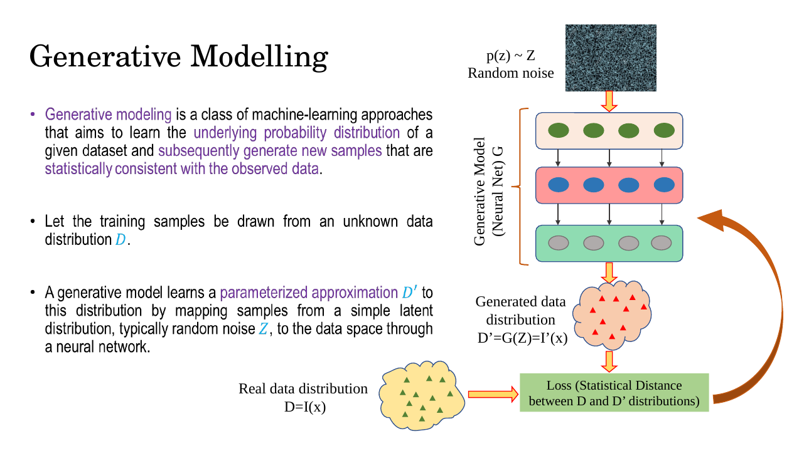
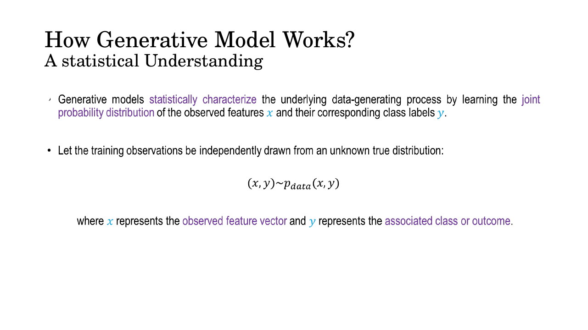
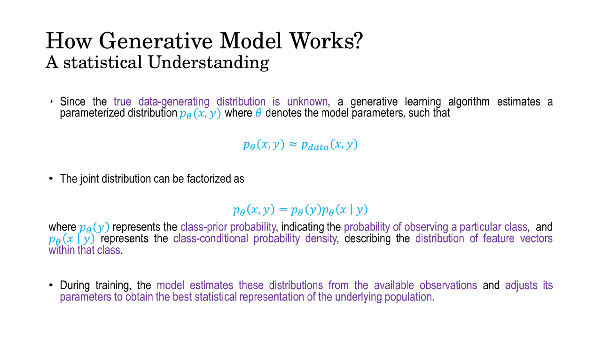
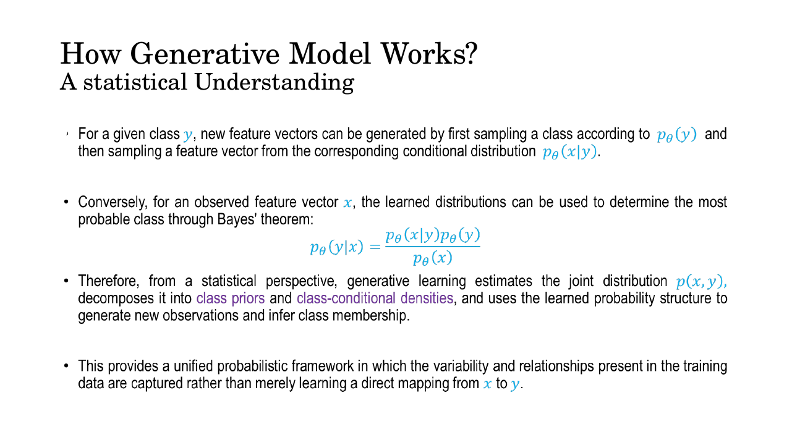
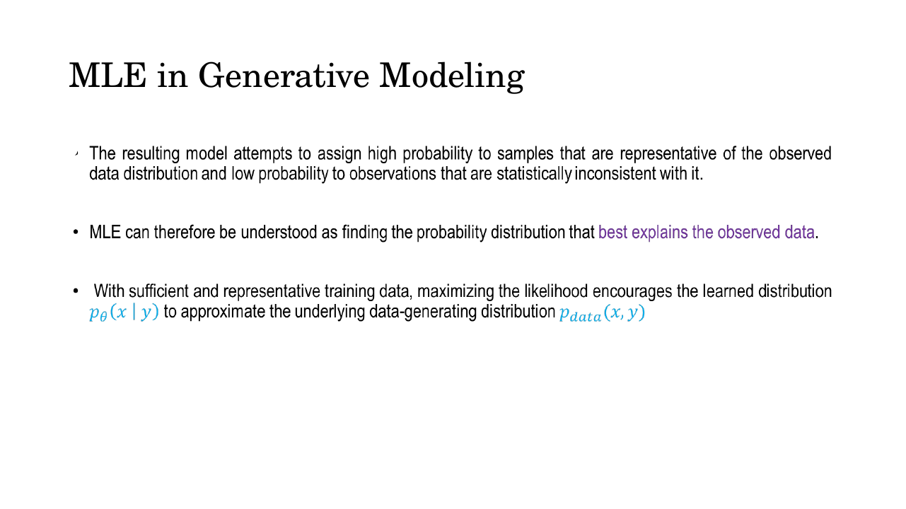
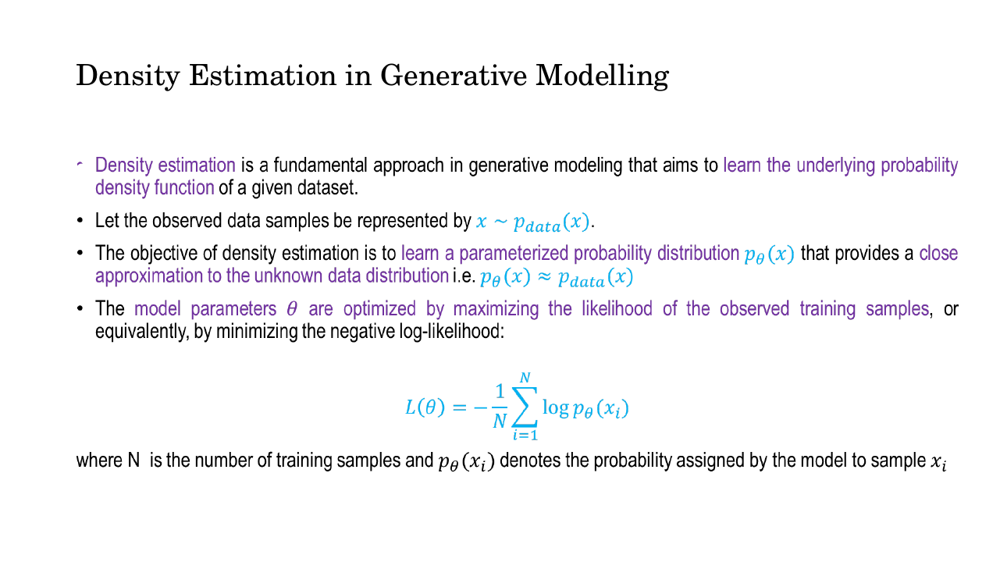
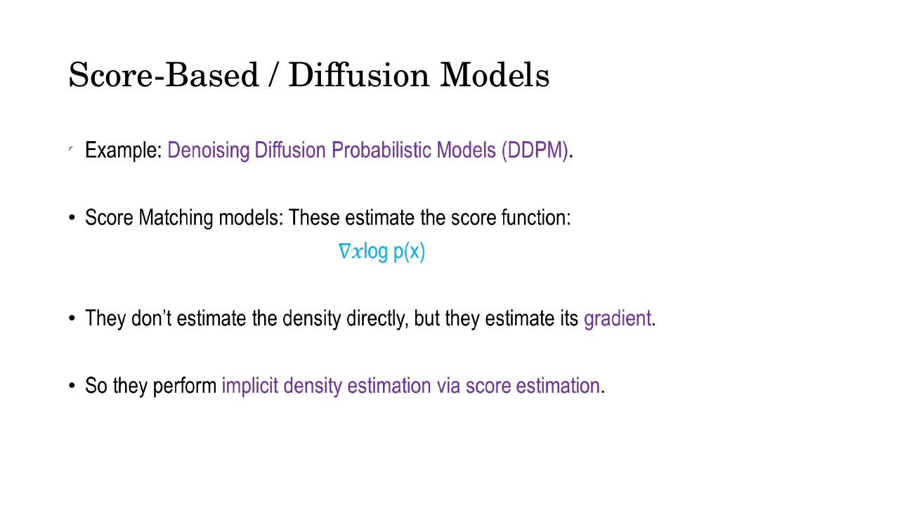

# Lec 22 — Generative Modelling: Taxonomy and Maximum Likelihood

> **Deck:** `L8P1_GenModel_Intro.pptx` · **Week 6** · **Playlist:** Lec 22
> **Prereqs:** [Lec 6 — Basic Probability II](../week-01/06-probability-2.md), [Lec 2 — Generative vs Discriminative Learning](../week-01/02-generative-vs-discriminative.md), [Lec 3 — Generative Vision Models: The Landscape](../week-01/03-generative-vision-models.md)
> **Feeds into:** [Lec 23 — Autoregressive Models: PixelRNN and PixelCNN](23-autoregressive-pixelrnn-pixelcnn.md), [Lec 29 — Autoencoders to VAE](../week-08/29-autoencoders-to-vae.md)

## Why this lecture exists

Week 1 gave you two things that have not yet been joined up. [Lec 3](../week-01/03-generative-vision-models.md)
named five families of generative model and described what each one *does*;
[Lec 6](../week-01/06-probability-2.md) taught maximum likelihood as a piece of statistics, with coins.
Neither said why those five families exist, or what any of them is actually optimising when it trains
on photographs. This lecture supplies the missing spine. One objective — maximise the likelihood the
model assigns to the training set — turns out to be computable exactly for some model designs,
computable only up to a bound for others, and not computable at all for a third group that sidesteps
it entirely. That single fork is the taxonomy, and the taxonomy is the table of contents for the
remaining eighteen lectures. Everything from here to diffusion is one of its leaves.

## The ideas

### The picture the deck opens with


*Fig. — The loop the whole lecture formalises. Notice the loss box: it measures a **statistical distance between distributions**, not a per-example error. That is the single structural difference from everything you did in Weeks 2–5. Slide 3.*

Read the diagram right to left: there is a real data distribution; the generator induces a second
distribution; a loss measures the gap; gradients flow backwards to close it. Slide 5 adds the payoff —
once trained, the model "can transform previously unseen random noise vectors into novel synthetic
samples that closely approximate the characteristics of the original dataset **while remaining distinct
from the observed training samples**". A model that memorised the training set would satisfy the first
clause and fail the second; that tension is what every generative metric in this course measures.

One notation warning. The deck writes the real distribution as $D$ and the generated one as $D'$. This
book reserves $\mathcal{D}$ for the **dataset** (the finite pile of images you hold) and writes
distributions as $p_{\text{data}}$ and $p_\theta$ — keep the symbols apart. The generator/noise framing
itself belongs to [Lec 2](../week-01/02-generative-vs-discriminative.md).

### The statistical picture: three objects, not one


*Fig. — The word doing the work is **unknown**. $p_{\text{data}}$ is never written down, never evaluated, never seen. All you ever get is samples from it. Slide 6.*

Separate three things that beginners collapse into one:

| Object | Symbol | What it is | Do you have it? |
|---|---|---|---|
| The true data distribution | $p_{\text{data}}(\mathbf{x}, y)$ | the process that produced every photograph that exists | **No.** Never. |
| The dataset | $\mathcal{D} = \{(\mathbf{x}_i, y_i)\}_{i=1}^{N}$ | $N$ independent draws from $p_{\text{data}}$ | Yes — this is all you have |
| The model | $p_\theta(\mathbf{x}, y)$ | a parameterised distribution you control | Yes — you choose its form and fit $\theta$ |

The dataset is a **finite sample** from an infinite population. Fifty thousand CIFAR images are not
"the distribution of 32×32 natural images"; they are 50,000 points drawn from it. Generative modelling
uses those points to build a $p_\theta$ that behaves like the population they came from.


*Fig. — $p_\theta(\mathbf{x}, y) = p_\theta(y)\,p_\theta(\mathbf{x} \mid y)$. The first factor is the **class prior**, the second the **class-conditional density**. This is the generative decomposition from [Lec 2](../week-01/02-generative-vs-discriminative.md), now with a $\theta$ attached. Slide 7.*

The approximation goal is written on the slide as plainly as it can be:

$$p_\theta(\mathbf{x}, y) \approx p_{\text{data}}(\mathbf{x}, y)$$

and when labels are absent — which is the usual case in image generation — it collapses to
$p_\theta(\mathbf{x}) \approx p_{\text{data}}(\mathbf{x})$. The rest of the lecture is about how to
make that $\approx$ precise and how to optimise it.


*Fig. — The same two learned factors run **both ways**. Forwards they sample; backwards, through Bayes, they classify. A discriminative model can only do the second. Slide 9.*

That bidirectionality is the deck's answer to "why learn the joint when you only want labels?" — you
get sampling *and* classification from one object.
[Lec 2](../week-01/02-generative-vs-discriminative.md) works the Bayes direction in full with naive
Bayes; here, just note that the arrow runs both ways.

### Maximum likelihood, as a generative objective

You already have the machinery. [Lec 6](../week-01/06-probability-2.md) established that for $N$ i.i.d.
observations the likelihood is the product $L(\theta) = \prod_i p(x_i \mid \theta)$, and that because
$\log$ is monotonically increasing you may maximise the **log**-likelihood instead — a sum, not a
product — without changing the argmax. That result is imported wholesale and is not re-derived here.

What *is* new is what the objective means when the data points are images.

![Slide: the MLE objective θ* = argmax Σ log p_θ(x_i, y_i), and using the factorisation, θ* = argmax Σ [log p_θ(y_i) + log p_θ(x_i|y_i)]](../../assets/slides/W6_L8P1_GenModel_Intro/s-12.png)
*Fig. — The deck writes $\underset{\theta}{argmax}$ stacked; this book writes $\arg\max_\theta$. Note the second line: the log turns the *product* of prior and class-conditional into a *sum*, so the two factors are fitted additively. Slide 12.*

$$\theta^{*} = \arg\max_{\theta} \ \prod_{i=1}^{N} p_\theta(\mathbf{x}_i, y_i) \;=\; \arg\max_{\theta} \ \sum_{i=1}^{N} \log p_\theta(\mathbf{x}_i, y_i)$$

and with the factorisation substituted,

$$\theta^{*} = \arg\max_{\theta} \ \sum_{i=1}^{N} \big[\log p_\theta(y_i) + \log p_\theta(\mathbf{x}_i \mid y_i)\big]$$

The deck names the product $L(\theta \mid D) = \prod_i p_\theta(x_i, y_i)$ — note the deck's $D$ here is
the dataset $\mathcal{D}$, the *other* meaning of its overloaded symbol.

**What this means for an image.** Take $\mathbf{x}$ to be a 28×28 greyscale digit: a point in
$\mathbb{R}^{784}$. The model assigns one non-negative number to every such point — a density over a
784-dimensional space. Maximising $\sum_i \log p_\theta(\mathbf{x}_i)$ asks the model to pile that
density up on the few thousand points in your training set. Because densities integrate to 1, piling it
up *there* necessarily drains it from somewhere else, and the "somewhere else" is the vast majority of
$\mathbb{R}^{784}$ that looks like static. One knob does two jobs: high probability on things that look
like data, and — forced by normalisation — low probability on things that do not.


*Fig. — "High probability to representative samples, low probability to inconsistent ones." The second half comes free from normalisation — you never write it into the loss. Slide 13.*

**Why this is the right target, not just a convenient one.** [Lec 6](../week-01/06-probability-2.md)
records the identity: maximising the likelihood is equivalent to minimising
$D_{\mathrm{KL}}(p_{\text{data}} \,\|\, p_\theta)$. That is the formal content of the loss box on slide
3 — the "statistical distance between distributions". Maximising likelihood is not a heuristic; it
*literally* minimises a divergence between your model and the truth, estimated from the only thing you
have. That is why the taxonomy is organised around it: every family below is distinguished by how far
it can get towards computing this one quantity.

Equivalently, and this is the form you see in code, minimise the mean **negative log-likelihood**:

$$\mathcal{L}(\theta) = -\frac{1}{N}\sum_{i=1}^{N} \log p_\theta(\mathbf{x}_i)$$

The $1/N$ is cosmetic (it makes the number comparable across dataset sizes) and the minus sign turns a
maximisation into the minimisation your optimiser expects. Slide 17 writes it in exactly this form.

### Why it is called "generative"

Slide 14 answers the naming question in four lines. Once $p_\theta(\mathbf{x}, y)$ is learned you can:

- **generate labels**: $y \sim p_\theta(y)$
- **generate data given a label**: $\mathbf{x} \sim p_\theta(\mathbf{x} \mid y)$
- **generate unconditional samples**: $\mathbf{x} \sim p_\theta(\mathbf{x})$

and therefore "the model is described as the **data-generating process**". That is the whole
justification for the word: a model is generative if you can *draw from it*. Note what is not required —
nothing here says the model must be a neural network, must use noise, or must produce images. Naive
Bayes is generative by this test, and [Lec 2](../week-01/02-generative-vs-discriminative.md) works it
out in full.

### Density estimation, and what a density buys you


*Fig. — The unsupervised form of the objective: no $y$ anywhere. This is the version that matters for image generation. Slide 17.*

**Density estimation** is the task of learning the probability density function behind a dataset. The
deck's slide 18 makes a point worth extracting, because it is the answer to "why not just train a GAN
and be done":

> Once the probability density has been learned, the model can be used not only to estimate the
> **likelihood of new observations** but also, depending on the generative architecture, to generate
> new samples.

Sampling is one use of a density. It is not the only one, and the others are where a learned
$p_\theta(\mathbf{x})$ earns its keep:

| Use | How the density is used | Example |
|---|---|---|
| **Sampling** | draw $\mathbf{x} \sim p_\theta$ | generate a face that has never existed |
| **Anomaly / outlier detection** | flag $\mathbf{x}$ when $p_\theta(\mathbf{x})$ is below a threshold | a manufacturing defect, a fraudulent transaction |
| **Outlier scoring / ranking** | sort candidates by $\log p_\theta(\mathbf{x})$ | triage the 100 strangest scans for a radiologist |
| **Compression** | short codes for high-probability $\mathbf{x}$ (Shannon) | the density *is* the optimal code |
| **Model comparison** | compare $\sum_i \log p_\theta(\mathbf{x}_i)$ on held-out data | pick between two trained models |

Every one of these needs a *number* out of the model, not a sample. A model that only samples cannot do
any of them. That is the practical stake in the explicit/implicit split. Slide 18 adds that density
estimation matters precisely when the data are "complex, multimodal, or nonlinear" — a single Gaussian
cannot represent a dataset with two clusters, which is what makes the problem need neural networks.

### The taxonomy

This is the centrepiece. The deck presents it twice, and the two presentations do not agree — so take
them in order.

**Slide 15's framing — "three main types".**


*Fig. — Three top-level buckets. The VAE placement here is loose — see below. Slide 15.*

**Slide 16's framing — the Goodfellow tree.** This is the canonical diagram, adapted from Ian
Goodfellow's 2017 NIPS tutorial on GANs, and it is the one an exam will key on.


*Fig. — Memorise this shape. Two levels of binary split, then leaves. Attribution on the slide: adapted from Ian Goodfellow, "Tutorial on Generative Adversarial Networks", 2017. Slide 16.*

Here is the same tree as text, with the deck's leaves plus the extra families named on slides 15 and 22:

```
                           Generative Models
                                   │
                ┌──────────────────┴──────────────────┐
                │                                     │
        EXPLICIT DENSITY                      IMPLICIT DENSITY
   (writes p_θ(x) down; can                (never writes p_θ(x) down;
    evaluate a likelihood)                   only samples from it)
                │                                     │
      ┌─────────┴─────────┐                 ┌─────────┴─────────┐
      │                   │                 │                   │
  TRACTABLE           APPROXIMATE         DIRECT           MARKOV CHAIN
   DENSITY              DENSITY             │                   │
      │                   │                GAN                 GSN
      │         ┌─────────┴─────────┐
      │         │                   │
      │   MARKOV CHAIN         VARIATIONAL
      │         │                   │
      │   Boltzmann Machine        VAE  (optimises the ELBO)
      │     (RBM, DBM)
      │
   Fully Visible Belief Nets (FVBN)
   NADE
   MADE
   PixelRNN / PixelCNN
   Change-of-variable models (nonlinear ICA) = Normalizing Flows
   Gaussian Mixture Models            [slide 22]

            ┌──────────────────────────────────────┐
            │  SCORE-BASED / DIFFUSION             │  [slide 15, slide 25]
            │  the deck gives these their own      │
            │  top-level bucket: "implicit density │
            │  estimation via score estimation"    │
            │  DDPM · score matching               │
            └──────────────────────────────────────┘
```

And as a table — this is the form most MCQs take:

| Family | Branch | Writes $p_\theta(\mathbf{x})$? | Exact likelihood? | Trained by |
|---|---|---|---|---|
| Fully Visible Belief Nets (FVBN) | explicit → tractable | yes | **yes** | exact MLE |
| NADE, MADE | explicit → tractable | yes | **yes** | exact MLE |
| PixelRNN, PixelCNN | explicit → tractable | yes | **yes** | exact MLE |
| Normalizing Flows (change-of-variable / nonlinear ICA) | explicit → tractable | yes | **yes** | exact MLE |
| Gaussian Mixture Model | explicit → tractable | yes | yes | MLE via EM |
| Variational Autoencoder | explicit → approximate → **variational** | yes | **no** — lower bound | maximise the ELBO |
| Boltzmann Machine / RBM | explicit → approximate → **Markov chain** | yes (unnormalised) | **no** — intractable $Z$ | MCMC (contrastive divergence) |
| GAN | implicit → **direct** | **no** | n/a | adversarial minimax |
| GSN (generative stochastic network) | implicit → **Markov chain** | **no** | n/a | sampling chain |
| DDPM / score matching | deck: score-based bucket | estimates $\nabla_{\mathbf{x}} \log p(\mathbf{x})$ | n/a | denoising / score matching |

Now the three branches in words.

**Explicit density.** The model *defines* $p_\theta(\mathbf{x})$ as a formula you can evaluate. Slide 20
spells out the contract: an explicit density model "defines a tractable probability density function,
allows likelihood computation, and is usually trained via maximum likelihood (or a bound on it)". Feed
in any image, get a number out — and that number is what makes the five uses in the table above possible.


*Fig. — The deck's own split of "explicit" into tractable and approximate, with one named example each. The chain-rule product is the identity you already know. Slide 21.*

**Explicit → tractable.** You can compute $\log p_\theta(\mathbf{x})$ exactly, so you run plain MLE with
no approximation anywhere. Two tricks get you there. The first is the chain rule, already met in
[Lec 6](../week-01/06-probability-2.md) and shown as a figure in
[Lec 3](../week-01/03-generative-vision-models.md):

$$p(\mathbf{x}) = \prod_{i=1}^{d} p(x_i \mid x_{<i})$$

This is not new and it is not an assumption — it is an exact identity holding for any joint over any
ordering. What is new on this deck is the sentence under it: "**each conditional is modelled by a neural
network**." Order the pixels raster-scan, give each conditional a network, and the product of $d$
tractable one-dimensional conditionals is a tractable $d$-dimensional density. That is an
**autoregressive** model; [Lec 23](23-autoregressive-pixelrnn-pixelcnn.md) builds PixelRNN and PixelCNN
out of it. The second trick is a change of variables through an invertible map — slide 22 says
normalizing flows "explicitly calculate the probability density using an invertible transformation and
the change-of-variables formula", the same leaf the tree labels "change of variable models (nonlinear
ICA)". [Lec 3](../week-01/03-generative-vision-models.md) describes how flows work; your job here is to
know they sit in **explicit–tractable**.

**Explicit → approximate.** The model still defines $p_\theta(\mathbf{x})$, but evaluating it requires a
quantity you cannot compute. Two distinct reasons, which is why the tree splits this node again:

- **Variational (VAE).** A latent-variable model defines
  $p_\theta(\mathbf{x}) = \int p_\theta(\mathbf{x} \mid \mathbf{z})\,p(\mathbf{z})\,d\mathbf{z}$. The
  integral runs over every point of a continuous latent space and has no closed form, so you optimise a
  **lower bound** on $\log p_\theta(\mathbf{x})$ — the ELBO — instead. Slide 22 says it exactly: VAEs
  "define explicit probability distributions … although the true data likelihood is generally optimized
  through a variational lower bound rather than computed directly". That is *why* the VAE is
  approximate-density: not because the density is undefined, but because the integral that evaluates it
  is intractable. [Lec 29](../week-08/29-autoencoders-to-vae.md) sets up the intractable posterior and
  [Lec 30](../week-08/30-elbo-and-reparameterization.md) derives the bound.
- **Markov chain (Boltzmann machine).** An energy-based model writes
  $p_\theta(\mathbf{x}) = \frac{1}{Z}e^{-E_\theta(\mathbf{x})}$, where the normaliser
  $Z = \sum_{\mathbf{x}} e^{-E_\theta(\mathbf{x})}$ sums over every possible configuration —
  $2^{784}$ of them for a binary 28×28 image. You cannot compute $Z$, so you approximate the gradient by
  running a Markov chain (Gibbs sampling / contrastive divergence). Same branch, different
  intractability.


*Fig. — "They never compute $p(x)$." Underline it. This is the verbatim source of the most-asked question on this lecture. Slide 24.*

**Implicit density.** The model never writes $p_\theta(\mathbf{x})$ down at all. It provides a
**sampling procedure** and nothing else: draw $\mathbf{z} \sim p(\mathbf{z})$, push it through a
network, $\mathbf{x} = G_\theta(\mathbf{z})$. The induced distribution $p_g(\mathbf{x})$ exists
mathematically but you have no formula for it and cannot evaluate it anywhere. Slide 23 states the
consequence: the generator is trained so $p_g$ becomes similar to $p_{\text{data}}$, "however the model
does not necessarily provide an analytical expression for $p_g(\mathbf{x})$". With no likelihood to
maximise, you need a different signal for "are these distributions close?" — which is what the
discriminator supplies. The GAN minimax objective is Lec 33–34 territory;
[Lec 3](../week-01/03-generative-vision-models.md) gives the teaser. **Direct** on the tree means the
sample comes out in one forward pass; **Markov chain** (GSN) means it comes out of an iterative chain.


*Fig. — The **score** is the gradient of the log-density with respect to the input, $\nabla_{\mathbf{x}}\log p(\mathbf{x})$ — not with respect to parameters. Slide 25.*

**Score-based / diffusion.** The deck gives these a bucket of their own, and its framing is specific:
they estimate the **score function**

$$s_\theta(\mathbf{x}) \approx \nabla_{\mathbf{x}} \log p(\mathbf{x})$$

"They don't estimate the density directly, but they estimate its **gradient**. So they perform implicit
density estimation via score estimation." The attraction: the gradient of a log-density does not depend
on the normaliser, because differentiating $\log p = -E_\theta(\mathbf{x}) - \log Z$ with respect to
$\mathbf{x}$ kills the $\log Z$ term ($Z$ is constant in $\mathbf{x}$). The intractable quantity
vanishes from the problem instead of being approximated. You then sample by walking uphill along the
estimated score. Lec 31–32 cover the mechanics.

### Reconciling slide 15 with slide 16

The two presentations genuinely disagree, and an exam can quote either, so hold both:

| Model | Slide 15 says | Slide 16 (Goodfellow tree) says | Which to answer |
|---|---|---|---|
| Autoregressive | explicit | explicit → tractable | both agree |
| Normalizing flows | explicit | explicit → tractable (as "change of variable") | both agree |
| VAE | explicit, flat | explicit → **approximate** → variational | **give the tree's answer** — it is strictly more informative and both call it explicit |
| GAN | implicit | implicit → direct | both agree |
| Diffusion / score-based | its own third bucket, "implicit via score estimation" | absent from the tree (it predates them) | quote the deck: **score-based**, described as implicit-via-score |

The deck is loose in two places. First, slide 15 lists VAEs under "Explicit Density Models: these are
**true density estimators**" without flagging that the VAE's likelihood is a bound — slide 22 corrects
this and slide 21 contradicts it outright, putting "Latent Variable Models (Approximate Likelihood):
Variational Auto-encoder" in its own category. Take slide 21/22 as the deck's considered position:
**VAE = explicit, approximate, variational**. Second, calling diffusion "implicit" is defensible on its
own terms (a DDPM samples without ever evaluating $p_\theta$), but modern treatments usually place
diffusion under explicit-approximate, since DDPM training maximises a variational bound of exactly the
ELBO kind. For this course, **answer with the deck**.

## Worked numericals

### N1. MLE fit of a Gaussian density to a tiny dataset
This is the generative-modelling twin of the Bernoulli MLE in
[Lec 6 N4](../week-01/06-probability-2.md): same procedure, but the thing being fitted is a **density
over data**, i.e. a one-dimensional generative model $p_\theta(x)$, not a coin bias.

**Given:** eight observations $\mathcal{D} = \{2, 4, 4, 4, 5, 5, 7, 9\}$ ($N = 8$), modelled as
$p_\theta(x) = \mathcal{N}(\mu, \sigma^2)$ with $\theta = (\mu, \sigma^2)$ both unknown.
**Find:** $\hat{\mu}_{\mathrm{MLE}}$ and $\hat{\sigma}^2_{\mathrm{MLE}}$.

1. The Gaussian density is $p_\theta(x) = \frac{1}{\sqrt{2\pi\sigma^2}}\exp\!\left(-\frac{(x-\mu)^2}{2\sigma^2}\right)$.
2. Log-likelihood of the whole dataset: $\ell(\mu,\sigma^2) = \sum_{i=1}^{8}\log p_\theta(x_i) = -\frac{N}{2}\log(2\pi\sigma^2) - \frac{1}{2\sigma^2}\sum_i (x_i-\mu)^2$.
3. Differentiate with respect to $\mu$: $\dfrac{\partial\ell}{\partial\mu} = \dfrac{1}{\sigma^2}\sum_i (x_i - \mu)$. Set to zero: $\sum_i x_i - N\mu = 0$.
4. So $\hat{\mu} = \frac{1}{N}\sum_i x_i = \frac{2+4+4+4+5+5+7+9}{8} = \frac{40}{8} = 5$.
5. Deviations from $\hat\mu = 5$: $-3, -1, -1, -1, 0, 0, 2, 4$. Squares: $9, 1, 1, 1, 0, 0, 4, 16$. Sum $= 32$.
6. Differentiate with respect to $\sigma^2$: $\dfrac{\partial\ell}{\partial\sigma^2} = -\dfrac{N}{2\sigma^2} + \dfrac{1}{2\sigma^4}\sum_i (x_i-\hat\mu)^2 = 0$.
7. Multiply through by $2\sigma^4$: $-N\sigma^2 + \sum_i (x_i-\hat\mu)^2 = 0$, so $\hat{\sigma}^2 = \frac{1}{N}\sum_i (x_i-\hat\mu)^2 = \frac{32}{8} = 4$, and $\hat\sigma = 2$.

**Answer:** $\hat{\mu}_{\mathrm{MLE}} = 5$, $\hat{\sigma}^2_{\mathrm{MLE}} = 4$. The fitted generative
model is $p_\theta(x) = \mathcal{N}(5, 4)$; sampling from it produces new numbers that were not in
$\mathcal{D}$. **Note the divisor $N$, not $N-1$** — the MLE variance is the *biased* estimator, and
swapping in the unbiased $32/7 = 4.571$ is a classic trap.

### N2. Which model does MLE prefer? Comparing log-likelihoods on the same data
**Given:** the same eight points, and three candidate generative models:
A $= \mathcal{N}(5, 4)$ (the MLE fit), B $= \mathcal{N}(6, 4)$, C $= \mathcal{N}(5, 9)$.
**Find:** $\sum_i \log p_\theta(x_i)$ for each, and the likelihood ratio between the best and the worst.

1. For a Gaussian, $\sum_i \log p(x_i) = -\frac{N}{2}\log(2\pi\sigma^2) - \frac{1}{2\sigma^2}\sum_i (x_i-\mu)^2$. Everything reduces to two numbers: $\log(2\pi\sigma^2)$ and $\sum_i (x_i-\mu)^2$.
2. Useful shortcut for the sum of squares about any $\mu$: $\sum_i (x_i-\mu)^2 = \sum_i (x_i-\bar{x})^2 + N(\bar{x}-\mu)^2 = 32 + 8(5-\mu)^2$.
3. **Model A**, $\mu=5,\sigma^2=4$: $2\pi\sigma^2 = 25.133$, $\log = 3.2242$; first term $= -4(3.2242) = -12.8967$. Sum of squares $= 32 + 0 = 32$; second term $= -32/8 = -4$.
   $\;\ell_A = -12.8967 - 4 = \mathbf{-16.897}$.
4. **Model B**, $\mu=6,\sigma^2=4$: same first term $-12.8967$. Sum of squares $= 32 + 8(1)^2 = 40$; second term $= -40/8 = -5$.
   $\;\ell_B = -12.8967 - 5 = \mathbf{-17.897}$.
5. **Model C**, $\mu=5,\sigma^2=9$: $2\pi\sigma^2 = 56.549$, $\log = 4.0354$; first term $= -4(4.0354) = -16.141$. Sum of squares $= 32$; second term $= -32/18 = -1.778$.
   $\;\ell_C = -16.141 - 1.778 = \mathbf{-17.918}$.
6. Ranking: $\ell_A > \ell_B > \ell_C$. A is best, exactly as N1 guarantees.
7. Likelihood ratio A over B: $\exp(\ell_A - \ell_B) = \exp(1.000) = 2.718$. The data are $e$ times more probable under A than under B.

**Answer:** $\ell_A = -16.897$, $\ell_B = -17.897$, $\ell_C = -17.918$. MLE picks **A**, and the
difference of 1 nat means a $2.72\times$ likelihood ratio. Two things to carry away: log-likelihoods are
**negative** for continuous densities and that is fine, and a *difference* of log-likelihoods is a
*ratio* of likelihoods.

### N3. The taxonomy classification drill
**Given:** eleven named models. **Find:** for each, its branch of the taxonomy.
Answer in the form explicit-tractable / explicit-approximate (variational or Markov chain) /
implicit (direct or Markov chain) / score-based.

| # | Model | Your answer |
|---|---|---|
| 1 | PixelRNN | ? |
| 2 | Generative Adversarial Network | ? |
| 3 | Variational Autoencoder | ? |
| 4 | RealNVP (a normalizing flow) | ? |
| 5 | Restricted Boltzmann Machine | ? |
| 6 | NADE | ? |
| 7 | MADE | ? |
| 8 | Fully Visible Belief Net | ? |
| 9 | Generative Stochastic Network (GSN) | ? |
| 10 | DDPM | ? |
| 11 | Gaussian Mixture Model | ? |

<details><summary>Answers</summary>

| # | Model | Branch | Why |
|---|---|---|---|
| 1 | PixelRNN | **explicit → tractable** | chain-rule product of exactly-evaluable conditionals |
| 2 | GAN | **implicit → direct** | never computes $p(\mathbf{x})$; one forward pass $\mathbf{x}=G(\mathbf{z})$ |
| 3 | VAE | **explicit → approximate → variational** | $p_\theta(\mathbf{x})$ needs an intractable integral over $\mathbf{z}$; optimises the ELBO |
| 4 | RealNVP | **explicit → tractable** | the tree's "change of variable models (nonlinear ICA)" leaf |
| 5 | RBM | **explicit → approximate → Markov chain** | partition function $Z$ intractable; trained by MCMC |
| 6 | NADE | **explicit → tractable** | autoregressive; named on the tree |
| 7 | MADE | **explicit → tractable** | masked autoencoder giving exact autoregressive likelihood |
| 8 | FVBN | **explicit → tractable** | the original fully-visible chain-rule model |
| 9 | GSN | **implicit → Markov chain** | samples from a learned transition operator; no density |
| 10 | DDPM | **score-based / diffusion** | the deck's own bucket: "implicit density estimation via score estimation" |
| 11 | GMM | **explicit → tractable** | slide 22 lists it; the mixture density is a closed form you can evaluate |

Score 11/11 and you have the most examinable artifact in the course.
</details>

**Answer:** see the table above — and note the pattern that compresses it: *if you can write a formula
and plug an image into it, it is explicit; if the formula needs an integral or a partition function you
cannot do, it is approximate; if there is no formula at all, only a sampler, it is implicit.*

### N4. Log-likelihood of a small discrete image, and why logs are mandatory
**Given:** a factorised (per-pixel independent) binary model. On a 4×4 image (16 pixels) it assigns
probability $0.9$ to the observed value at 10 of the pixels and $0.6$ at the other 6.
**Find:** (a) the raw product $p_\theta(\mathbf{x})$ and $\log p_\theta(\mathbf{x})$; (b) the same for a
28×28 image (784 pixels) with the identical mix of per-pixel probabilities; (c) the bits per pixel.

1. Factorised model: $p_\theta(\mathbf{x}) = \prod_{i=1}^{16} p_\theta(x_i)$.
2. Raw product: $(0.9)^{10}(0.6)^{6} = 0.348678 \times 0.046656 = 0.016269$.
3. Log-likelihood: $10\ln 0.9 + 6\ln 0.6 = 10(-0.105361) + 6(-0.510826) = -1.0536 - 3.0650 = -4.1186$ nats.
4. Check: $e^{-4.1186} = 0.016269$. ✓
5. A 784-pixel image is $784/16 = 49$ copies of that 16-pixel block, so $\log p_\theta(\mathbf{x}) = 49 \times (-4.1186) = -201.81$ nats.
6. Convert to base 10: $-201.81 / \ln 10 = -201.81/2.3026 = -87.65$, so $p_\theta(\mathbf{x}) \approx 10^{-87.65} \approx 2.2 \times 10^{-88}$.
7. The smallest positive `float32` (subnormal) is about $1.4\times10^{-45}$. $2.2\times10^{-88}$ is far below it, so the raw product evaluates to **exactly 0.0** — and $\log 0 = -\infty$, which destroys the gradient.
8. Bits per pixel: $\dfrac{201.81}{784 \times \ln 2} = \dfrac{201.81}{543.4} = 0.371$ bits/pixel.

**Answer:** 16 pixels — $p_\theta = 0.016269$, $\log p_\theta = -4.119$ nats. 784 pixels —
$p_\theta \approx 2.2\times10^{-88}$ (underflows `float32` to 0), $\log p_\theta = -201.81$ nats
$= 0.371$ bits/pixel. The log form is numerically ordinary at every scale; the product is unusable past
a few hundred pixels. **This is why every likelihood-based generative model is trained in log space** —
not for algebraic convenience, but because the alternative is literally zero.

## Code

```python
import numpy as np

# A tiny "dataset" of 1-D observations drawn from some unknown p_data.
x = np.array([2., 4., 4., 4., 5., 5., 7., 9.])
N = len(x)

# --- 1. The analytic MLE for a Gaussian model p_theta(x) = N(mu, sigma^2) ---
mu_hat     = x.mean()                    # d(log L)/d(mu) = 0
sigma2_hat = ((x - mu_hat) ** 2).mean()  # divide by N, NOT N-1 -- MLE is biased
print(f"analytic  : mu_hat = {mu_hat:.4f}   sigma2_hat = {sigma2_hat:.4f}")

def loglik(mu, s2):
    """Total log-likelihood sum_i log p_theta(x_i) of the whole dataset."""
    return (-0.5 * N * np.log(2 * np.pi * s2)
            - ((x - mu) ** 2).sum() / (2 * s2))

# --- 2. Brute-force argmax over a parameter grid -----------------------
mus  = np.linspace(0.0, 10.0, 1001)      # step 0.01
s2s  = np.linspace(0.1, 10.0, 991)       # step 0.01
grid = np.array([[loglik(m, s) for s in s2s] for m in mus])
i, j = np.unravel_index(grid.argmax(), grid.shape)
print(f"grid argmax: mu* = {mus[i]:.4f}   sigma2* = {s2s[j]:.4f}")
print(f"best log-likelihood on grid = {grid[i, j]:.4f}")

# --- 3. MLE really is the best: compare three candidate models ---------
for name, (m, s) in {"A  N(5,4)": (5., 4.),
                     "B  N(6,4)": (6., 4.),
                     "C  N(5,9)": (5., 9.)}.items():
    print(f"{name}: sum log p = {loglik(m, s):8.4f}")

# --- 4. Why logs: a factorised 784-pixel model underflows outright -----
logp = 49 * (10 * np.log(0.9) + 6 * np.log(0.6))   # 49 copies of a 16-pixel block
print(f"log-likelihood of the 784-pixel image = {logp:.2f} nats")
print("raw product in float32 =", np.float32(np.exp(logp)))
print(f"bits per pixel = {-logp / 784 / np.log(2):.4f}")
```

```text
analytic  : mu_hat = 5.0000   sigma2_hat = 4.0000
grid argmax: mu* = 5.0000   sigma2* = 4.0000
best log-likelihood on grid = -16.8967
A  N(5,4): sum log p = -16.8967
B  N(6,4): sum log p = -17.8967
C  N(5,9): sum log p = -17.9182
log-likelihood of the 784-pixel image = -201.81 nats
raw product in float32 = 0.0
bits per pixel = 0.3714
```

The grid search knows nothing about calculus — it just evaluates $\sum_i \log p_\theta(x_i)$ at a
million $(\mu,\sigma^2)$ pairs and reports the winner. It lands on exactly the closed form from N1,
which is the point: **MLE is the search for the parameters that score highest on the training data**,
and the derivative is only a shortcut for doing that search. For PixelCNN or a VAE the closed form does
not exist and gradient descent replaces the grid, but the quantity being maximised is unchanged.

## Exam pack

### Must-memorise

| Item | Exactly this |
|---|---|
| The modelling goal | $p_\theta(\mathbf{x}) \approx p_{\text{data}}(\mathbf{x})$; $p_{\text{data}}$ is **unknown** and only sampled |
| Dataset | $\mathcal{D} = \{(\mathbf{x}_i, y_i)\}_{i=1}^{N}$, drawn i.i.d. from $p_{\text{data}}$ |
| MLE objective (product) | $\theta^{*} = \arg\max_\theta \prod_{i=1}^{N} p_\theta(\mathbf{x}_i, y_i)$ |
| MLE objective (log) | $\theta^{*} = \arg\max_\theta \sum_{i=1}^{N} \log p_\theta(\mathbf{x}_i, y_i)$ |
| Factorised form | $\theta^{*} = \arg\max_\theta \sum_i [\log p_\theta(y_i) + \log p_\theta(\mathbf{x}_i \mid y_i)]$ |
| Generative decomposition | $p_\theta(\mathbf{x}, y) = p_\theta(y)\,p_\theta(\mathbf{x}\mid y)$ = class prior × class-conditional density |
| NLL loss (slide 17) | $\mathcal{L}(\theta) = -\frac{1}{N}\sum_{i=1}^{N}\log p_\theta(\mathbf{x}_i)$ |
| MLE $\equiv$ KL | maximising likelihood $\equiv$ minimising $D_{\mathrm{KL}}(p_{\text{data}}\,\|\,p_\theta)$ ([Lec 6](../week-01/06-probability-2.md)) |
| Autoregressive factorisation | $p(\mathbf{x}) = \prod_{i=1}^{d} p(x_i \mid x_{<i})$ — an **exact identity**, each conditional a neural net |
| Explicit density | model **defines and can evaluate** $p_\theta(\mathbf{x})$ |
| Implicit density | model **never computes** $p_\theta(\mathbf{x})$; provides a sampling procedure only |
| Tractable vs approximate | exact likelihood vs a bound/approximation |
| Implicit GAN form | $\mathbf{x} = G(\mathbf{z})$ where $\mathbf{z}\sim p(\mathbf{z})$ |
| Score function | $\nabla_{\mathbf{x}}\log p(\mathbf{x})$ — gradient w.r.t. the **input**, not the parameters |
| Gaussian MLE | $\hat\mu = \frac1N\sum x_i$, $\hat\sigma^2 = \frac1N\sum(x_i-\hat\mu)^2$ (divisor $N$) |
| Why it is "generative" | you can draw $y\sim p_\theta(y)$, $\mathbf{x}\sim p_\theta(\mathbf{x}\mid y)$, $\mathbf{x}\sim p_\theta(\mathbf{x})$ — the model *is* the data-generating process |

### Numbers worth knowing

| Quantity | Value |
|---|---|
| Top-level branches on the Goodfellow tree (slide 16) | **2** — explicit density, implicit density |
| Top-level types on slide 15 | **3** — explicit, implicit, score-based/diffusion |
| Sub-branches of explicit density | **2** — tractable, approximate |
| Sub-branches of approximate density | **2** — Markov chain, variational |
| Sub-branches of implicit density | **2** — direct, Markov chain |
| Tractable-density leaves named on slide 16 | FVBN, NADE, MADE, PixelRNN, change-of-variable (nonlinear ICA) — **5** |
| Approximate-density leaves | Boltzmann Machine (Markov chain), VAE (variational) |
| Implicit-density leaves | GAN (direct), GSN (Markov chain) |
| Tree attribution | Ian Goodfellow, *Tutorial on Generative Adversarial Networks*, **2017** |
| Deck's N1/N2 dataset fit | $\hat\mu = 5$, $\hat\sigma^2 = 4$, $\ell_{\max} = -16.897$ |
| Partition function size, binary 28×28 | $2^{784}$ configurations — why $Z$ is intractable |

### Likely MCQ traps

- **"Is a GAN explicit or implicit density?" → implicit, direct branch.** This is the single most likely
  question on the lecture. A GAN *has* a distribution $p_g$; it just never writes it down. "Has a
  distribution" is not the criterion — "can evaluate the density" is.
- **"VAEs are explicit, so they compute exact likelihoods." False.** They are explicit **and
  approximate**: explicit because $p_\theta(\mathbf{x})$ is defined, approximate because the integral
  over $\mathbf{z}$ is intractable and you optimise the ELBO instead. Slide 15 is sloppy here; slides
  21–22 are correct.
- **Normalizing flows placed under "approximate".** No — flows are **explicit and tractable**, because
  the change-of-variables formula gives an exact likelihood. On the tree they are the leaf labelled
  "change of variable models (nonlinear ICA)", which is the same thing under an older name.
- **PixelRNN classed as implicit because it uses an RNN.** The architecture is irrelevant to the
  taxonomy. Only "can you evaluate $p_\theta(\mathbf{x})$ exactly?" matters, and for PixelRNN you can.
- **Boltzmann machines placed with VAEs under "variational".** Both are approximate-density, but the
  Boltzmann machine is the **Markov chain** sub-branch and the VAE the **variational** one. The tree
  splits that node for a reason.
- **"The dataset is the data distribution."** No. $\mathcal{D}$ is a finite sample; $p_{\text{data}}$ is
  the population. The whole difficulty of generalisation lives in that gap.
- **$\hat\sigma^2 = \frac{1}{N-1}\sum(x_i-\hat\mu)^2$ as the MLE.** No. The MLE divides by $N$ and is
  biased; $N-1$ is the unbiased *sample* variance, which is a different estimator.
- **"Log-likelihoods must be negative" / "likelihoods must be ≤ 1".** For discrete models probabilities
  are $\le 1$ so log-likelihoods are $\le 0$. For continuous **densities** $p_\theta(x)$ may exceed 1 at
  a point, so a log-likelihood can be positive. Densities integrate to 1; they are not bounded by 1.
- **The score $\nabla_{\mathbf{x}}\log p(\mathbf{x})$ confused with the gradient $\nabla_\theta$.** The
  score in score matching differentiates with respect to the **data**, which is precisely why the
  normalising constant drops out.
- **"Generative models can only generate."** They also classify (via Bayes, slide 9), detect anomalies,
  score outliers and compress — provided the density is explicit.
- **The chain rule treated as an approximation.** It is exact and assumption-free; it holds for any
  ordering. What is approximate is the *neural network* fitted to each conditional.

### Self-test

1. State the MLE objective for a generative model in both product and log form.
2. A model is explicit-density. What can you do with it that you cannot do with an implicit one? Name two uses.
3. Classify: PixelCNN, GAN, VAE, RBM, normalizing flow, GSN.
4. Why is the VAE "approximate density" rather than "tractable density"? Answer in one sentence naming the specific obstacle.
5. Why is the Boltzmann machine intractable? Name the quantity.
6. Fit $\mathcal{N}(\mu,\sigma^2)$ by MLE to $\{1, 3, 5, 7\}$, then say which divisor you used and why.
7. Two models give $\sum_i\log p_\theta(\mathbf{x}_i) = -340$ and $-343$. Which does MLE prefer, and by what likelihood ratio?
8. What exactly does "the model assigns high probability to the training data" force the model to do to the rest of the input space, and why?
9. Slide 15 and slide 16 place the VAE differently. State both placements and say which you would answer with.
10. What does the score function differentiate with respect to, and what convenient thing does that eliminate?

<details><summary>Answers</summary>

1. $\theta^{*} = \arg\max_\theta \prod_{i=1}^{N} p_\theta(\mathbf{x}_i, y_i) = \arg\max_\theta \sum_{i=1}^{N} \log p_\theta(\mathbf{x}_i, y_i)$.
2. Evaluate a likelihood for a new point. Hence: anomaly/outlier detection, outlier ranking, compression, and principled model comparison on held-out data (any two).
3. PixelCNN explicit-tractable; GAN implicit-direct; VAE explicit-approximate-variational; RBM explicit-approximate-Markov chain; normalizing flow explicit-tractable; GSN implicit-Markov chain.
4. Because $p_\theta(\mathbf{x}) = \int p_\theta(\mathbf{x}\mid\mathbf{z})p(\mathbf{z})d\mathbf{z}$ has no closed form, so training maximises the ELBO — a lower bound — instead of the exact log-likelihood.
5. The partition function $Z = \sum_{\mathbf{x}} e^{-E_\theta(\mathbf{x})}$, a sum over all $2^{d}$ configurations.
6. $\hat\mu = 16/4 = 4$. Deviations $-3,-1,1,3$; squares $9,1,1,9 = 20$; $\hat\sigma^2 = 20/4 = 5$. Divisor $N=4$, because the MLE variance is the biased estimator; $N-1$ would give $6.67$ and is a different estimator.
7. The first ($-340 > -343$). Ratio $e^{3} \approx 20.09$.
8. It forces low probability everywhere else, because a density integrates to 1, so mass placed on the data manifold must be removed from the rest of the space. You never write that half into the loss.
9. Slide 15: explicit density, flat, alongside autoregressive models and flows. Slide 16 (and 21–22): explicit → approximate → variational. Answer with the tree, "explicit–approximate (variational)", since both agree it is explicit and the tree is strictly more informative.
10. With respect to the input $\mathbf{x}$, not $\theta$. It eliminates the normalising constant $Z$, which is constant in $\mathbf{x}$ and so has zero gradient.

</details>

## Beyond the slides

**Gap:** The deck states $p_\theta \approx p_{\text{data}}$ and separately writes the MLE objective, but
never says they are the same statement.
**Why it matters:** The link is the identity $\arg\max_\theta \mathbb{E}_{p_{\text{data}}}[\log p_\theta(\mathbf{x})] = \arg\min_\theta D_{\mathrm{KL}}(p_{\text{data}}\,\|\,p_\theta)$,
recorded in [Lec 6](../week-01/06-probability-2.md). Without it, "maximise likelihood" looks like a
convention. With it, it is provably the right thing to do, and the loss box on slide 3 has a name.

**Gap:** Nothing says *which* direction of KL maximum likelihood minimises, or what the choice costs.
**Why it matters:** MLE minimises $D_{\mathrm{KL}}(p_{\text{data}}\,\|\,p_\theta)$, which is infinite
wherever the data has mass and the model has none. The model is therefore punished hard for missing a
mode and barely at all for inventing one — so likelihood-trained models (VAEs especially) are **mode-covering**
and produce blurry averages. GANs, which do not minimise this direction, are **mode-seeking** and produce
sharp but incomplete samples. This single asymmetry explains the most-repeated empirical fact in the course.

**Gap:** The deck never gives a unit for likelihood, so "$-201.81$" means nothing comparable.
**Why it matters:** The standard reporting unit is **bits per dimension** (bits/pixel):
$-\log_2 p_\theta(\mathbf{x})/d$, i.e. divide the NLL in nats by $d\ln 2$ as in N4. It makes models with
different image sizes comparable and is the number every autoregressive and flow paper quotes. Expect to
see it from [Lec 23](23-autoregressive-pixelrnn-pixelcnn.md) onward.

**Gap:** "Tractable" is used without a definition of how tractable.
**Why it matters:** PixelRNN's likelihood is exact but *sampling* costs $d$ sequential forward passes —
784 for MNIST, 3072 for CIFAR. "Tractable density" constrains only likelihood *evaluation*, not sampling
speed. A GAN with no density at all samples in one pass. This trade-off is why the taxonomy's branches
are each still an active research area rather than one having won.

**Gap:** The deck's score-based bucket is asserted, not justified against the tree.
**Why it matters:** Most of the current literature classifies diffusion under explicit-approximate,
because DDPM training maximises a variational bound. The deck's "implicit via score estimation" is a
defensible alternative reading, but if you meet the other classification elsewhere you should not
conclude that one of them is simply wrong. Answer with the deck for this exam.

## Cut from the slides

Dropped the title slide (1), the Content slide (2), the Summary slide (26) which repeats slide 2
verbatim, and the "next lecture" slide (27). Slides 3, 4 and 5 are the *same* pipeline diagram under a
rotating headline with text accumulating alongside; they are merged into one figure plus the slide-5
prose, which is the only part that adds content. Slides 19 and 20 both define explicit density
estimation and both restate the MLE product — compressed into the single "explicit density" paragraph,
with slide 20's three-point contract quoted. Slide 18 is pure prose about density estimation with no
new formula; its substance is folded into the density-estimation table. The extracted-figure pool
(`assets/figures/W6_L8P1_GenModel_Intro/`) was checked and deliberately not used: all twenty images are
flat PNG screenshots of whole slide bodies — identical content to the renders, with the slide titles
cropped off — except `image2.png`, which is only the stock noise texture from the pipeline diagram.
The slide renders are strictly better here. Nothing mathematical was dropped.
