# Lec 23 — Autoregressive Generative Models: FVBN, PixelRNN, PixelCNN

> **Deck:** `L8P2_AutoReg.pptx` · **Week 6** · **Playlist:** Lec 23
> **Prereqs:** [Lec 22 — Generative Taxonomy and MLE](22-generative-taxonomy-and-mle.md), [Lec 18 — LSTM](../week-05/18-lstm.md), [Lec 11 — CNN Basics](../week-03/11-cnn-basics.md)
> **Feeds into:** [Lec 25 — Q/K/V and Self-Attention](../week-07/25-qkv-and-self-attention.md), [Lec 28 — ViT, DETR, Swin](../week-08/28-vit-detr-swin.md)

## Why this lecture exists

Lec 22 left you with a taxonomy and an empty box. It said generative models split into *explicit
density* (you write down $p_\theta(\mathbf{x})$ and maximise it) and *implicit density* (you only
learn to sample), and that explicit density splits again into *tractable* and *approximate*. The
tractable box was named but not filled. This lecture fills it.

The filling is one idea: impose an **order** on the pixels of an image, and the chain rule of
probability turns the impossibly high-dimensional joint $p(\mathbf{x})$ into a product of ordinary
one-variable conditionals that a neural network can model. Nothing is approximated. You get the
exact likelihood of any image, which is what "tractable density" means. The price — and it is a
brutal one — is that generation must then happen one pixel at a time, and this chapter makes that
cost numerical so you can see exactly why the field moved on.

## The ideas

### The identity you already have

The chain rule of probability is not new to you. You met it as a probability result in
[Lec 6](../week-01/06-probability-2.md), and [Lec 3](../week-01/03-generative-vision-models.md)
already showed the factorised form on a slide when surveying the model families. It says that for
*any* ordered list of random variables, with no independence assumptions whatsoever:

$$p(x_1, x_2, \dots, x_n) = p(x_1)\,p(x_2 \mid x_1)\,p(x_3 \mid x_1, x_2)\cdots p(x_n \mid x_1, \dots, x_{n-1})$$

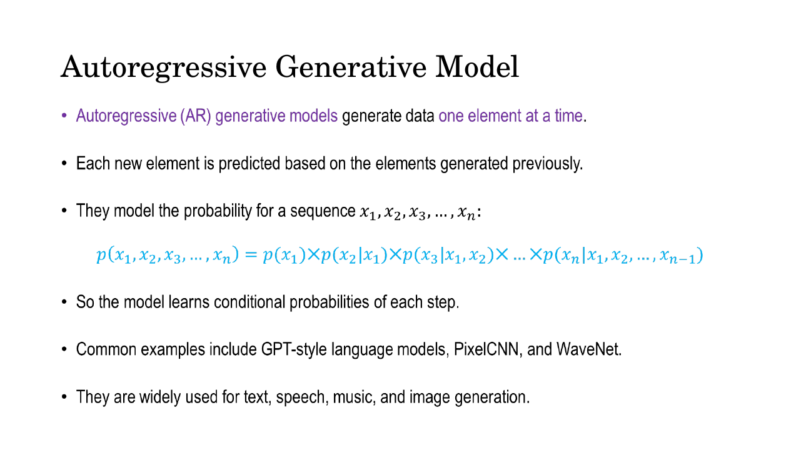
*Fig. — Notice there is no approximation sign: this is an identity, true for every joint distribution. Everything in this lecture is a consequence of *using* it rather than proving it. Slide 3.*

What is new is what the identity *buys you*. An **autoregressive model** is one that chooses an
ordering of the variables, models each conditional factor with a neural network, and multiplies them
back together. "Auto-regressive" literally means *regressing a variable on earlier values of itself*.
The deck's compact form is

$$p(\mathbf{x}) = \prod_{i=1}^{n} p(x_i \mid x_1, x_2, \dots, x_{i-1})$$

which is often written $\prod_i p(x_i \mid x_{<i})$, where $x_{<i}$ is shorthand for "every variable
before index $i$".

Three things are worth pinning down, because MCQs live on all three.

- **The ordering is a modelling choice, not a fact about images.** Images have no natural
  one-dimensional order; raster-scan (left-to-right within a row, top-to-bottom across rows) is the
  convention PixelRNN and PixelCNN adopt. A different order gives a different model but an equally
  valid factorisation.
- **No independence is assumed.** Contrast Naive Bayes
  ([Lec 2](../week-01/02-generative-vs-discriminative.md)), which *throws away* the conditioning and
  assumes $p(\mathbf{x}\mid y)=\prod_i p(x_i\mid y)$. Autoregressive models keep every dependency.
- **This is why they are tractable-density.** You can evaluate $p(\mathbf{x})$ exactly in one pass:
  compute each conditional, take the product. A VAE can only bound its likelihood
  ([Lec 30](../week-08/30-elbo-and-reparameterization.md)) and a GAN cannot evaluate it at all. See
  [Lec 22](22-generative-taxonomy-and-mle.md) for where each family sits.

### Generation: predict, sample, append, repeat

The deck motivates the mechanism with text, where the order is obvious. Given the prompt "The cat is",
the model outputs a **probability distribution over the next token**, not a token. One token
("sleeping") is drawn from it, appended, and the lengthened sequence fed back in. For images the loop
is identical once you have flattened the image into a sequence of pixels, patches or tokens:

1. Start with an empty canvas (or a partially filled one, for inpainting).
2. Feed everything generated so far into the network.
3. It outputs a distribution over the *next* element's value — for 8-bit pixels, a 256-way softmax
   ([Lec 8](../week-02/08-mlp-and-activations.md) owns softmax).
4. Sample one value from that distribution, write it into the canvas, and go back to step 2.

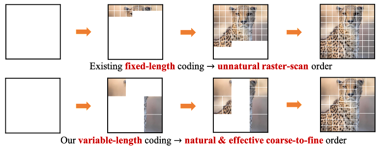
*Fig. — The canvas fills in, one element per network pass; the lower row is a later variant that orders tokens coarse-to-fine instead. The picture only exists once the final element lands. Slide 5.*

Sampling, not arg-maxing, is what makes the output **diverse**: run the loop twice from the same
empty canvas and you get two different images, because step 4 is stochastic.

### Advantages and the one fatal limitation

| | |
|---|---|
| **Advantages** | Captures complex spatial relationships between image components |
| | Provides a clear probabilistic framework — an explicit, exact likelihood |
| | Can be conditioned on text, labels or other images |
| | Generates diverse and realistic visual content |
| | Training is stable: it is plain maximum likelihood, no adversarial game |
| **Limitations** | Sequential generation is computationally expensive and slow |
| | Large images require many tokens |
| | High-quality generation needs substantial data and compute |

The first limitation deserves a number rather than an adjective. To generate an $H \times W$ image you
need $H \times W$ **sequential forward passes** — pass $i$ cannot start until pass $i-1$ has produced
its pixel, because that pixel is part of pass $i$'s input. A $256\times256$ image is 65,536 passes; a
GAN or VAE produces the same image in **one**. Numerical N2 turns this into wall-clock seconds.
Crucially the cost is **not fixable by buying a bigger GPU**: batching improves throughput but the
latency for any single image is still 65,536 serial steps, because the dependency chain is inherent
to the factorisation.

### Fully Visible Belief Networks

A **Fully Visible Belief Network (FVBN)** is the formal name for this construction: an autoregressive
probabilistic generative model in which **all variables in the input are treated as visible** — there
are no latent variables anywhere — and the joint distribution is factorised into a sequence of
conditional probabilities.

"Fully visible" is the contrast that gives the name its meaning. A VAE has a hidden $\mathbf{z}$ you
never observe, and that hidden variable is what forces you to integrate, and therefore to approximate.
An FVBN has nothing hidden: every $x_i$ is a pixel you can read off the training image, nothing needs
integrating out, and the likelihood stays exact.

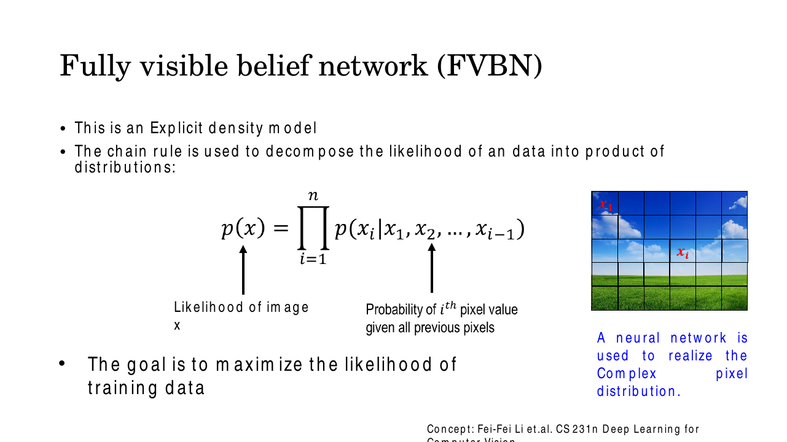
*Fig. — Memorise the annotation: the left side is the likelihood of the **whole image**; each right-hand factor is the probability of **one pixel value** given all previous pixels. The photo's grid shows $x_1$ top-left and $x_i$ partway through the raster scan. Slide 10.*

**Training is maximum likelihood.** You maximise the probability the model assigns to the training
images — equivalently, minimise the negative log-likelihood, which is where the product becomes a sum:

$$\theta^\star = \arg\max_\theta \sum_{\mathbf{x}\in\mathcal{D}} \log p_\theta(\mathbf{x})
= \arg\max_\theta \sum_{\mathbf{x}\in\mathcal{D}} \sum_{i=1}^{n} \log p_\theta(x_i \mid x_{<i})$$

The log-likelihood machinery itself is [Lec 6](../week-01/06-probability-2.md)'s and its application to
generative models is [Lec 22](22-generative-taxonomy-and-mle.md)'s; what is specific here is the inner
sum. Because each $\log p_\theta(x_i\mid x_{<i})$ is a 256-way softmax cross-entropy, training an FVBN
is a pile of classification problems — one per pixel — solved simultaneously.

**The complex conditional is realised by a neural network.** $p(x_i \mid x_1,\dots,x_{i-1})$ is a
function of up to a few thousand preceding values; no lookup table could store it (numerical N1 gives
the size), so a network with shared weights is what makes it representable at all. PixelRNN and
PixelCNN are two different answers to "which network?".

### PixelRNN

PixelRNN (van den Oord, Kalchbrenner and Kavukcuoglu, Google DeepMind, **ICML 2016**) estimates the
joint distribution of natural images by scanning **one row at a time and one pixel at a time within
each row**, starting from the top-left corner, and uses an **RNN or LSTM** to carry the dependency on
everything already generated. LSTM internals are [Lec 18](../week-05/18-lstm.md)'s; what matters here
is that the recurrent state is the mechanism by which $x_i$ gets to see $x_1,\dots,x_{i-1}$ without
anyone writing out an explicit $(i-1)$-argument function.

The deck writes the factorisation over an $n\times n$ image with the product running to $n^2$, which
is worth copying exactly:

$$p(\mathbf{x}) = \prod_{i=1}^{n^2} p(x_i \mid x_1, x_2, \dots, x_{i-1})$$

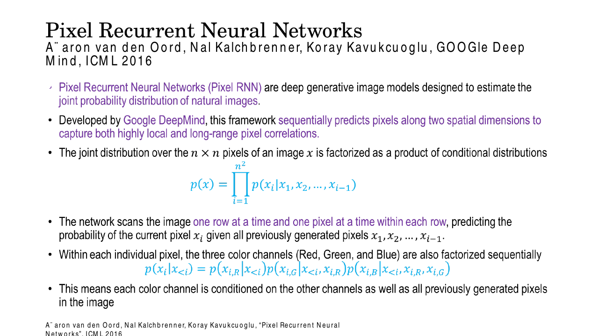
*Fig. — Two factorisations stacked: the outer runs over $n^2$ pixel positions, the inner splits each colour pixel into three sub-steps. The upper limit $n^2$ (not $n$) is an easy MCQ to miss. Slide 12.*

**Colour pixels factorise too.** Inside one pixel the three channels are generated in order:

$$p(x_i \mid x_{<i}) = p(x_{i,R}\mid x_{<i})\;p(x_{i,G}\mid x_{<i}, x_{i,R})\;p(x_{i,B}\mid x_{<i}, x_{i,R}, x_{i,G})$$

Green is conditioned on the red value *of the same pixel*, and blue on both. So an RGB image of $n^2$
pixels is really a chain of $3n^2$ conditionals, and generation takes $3n^2$ sequential sub-steps if
you are strict about it.

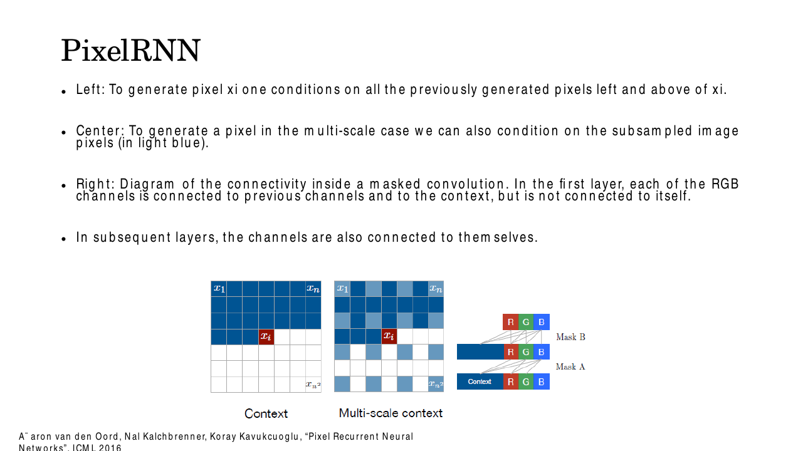
*Fig. — Left: the context for $x_i$ is every pixel **above** it plus those **left of it in its own row**. Right: the channel wiring that defines the two mask types — in the first layer (Mask A) R, G and B connect to the context and to *previous* channels but **not to themselves**; in later layers (Mask B) they also connect to themselves. Slide 16.*

That right-hand panel is the deck's own statement of the **mask A / mask B** distinction, and the
cleanest way to remember it: *mask A never lets a value see itself; mask B does*.

### PixelCNN and masked convolution

PixelRNN is accurate but slow to *train* as well as to sample, because the recurrence serialises the
training pass too. **PixelCNN** is the deck's "simplified, fully convolutional alternative of fifteen
layers that preserves spatial resolution and uses masked convolutions to capture a bounded receptive
field" — recurrence replaced by a stack of convolutions.

The problem this creates is immediate. A standard convolution kernel is symmetric about its centre:
sitting on pixel $x_i$ it reads the pixels to the right of $x_i$ and below it, which at generation time
**do not exist yet**. Worse, at training time they *do* exist — so a network allowed to look at them
would learn to predict $x_i$ by reading $x_i$ (or its neighbours) straight off the input, score a
perfect training likelihood, and generate nothing but noise. That is *seeing the future*, and it is
the failure mode to be able to explain.

**A masked convolution is an ordinary convolution whose kernel has been multiplied element-wise by a
fixed binary mask that zeroes every weight pointing at a not-yet-generated pixel** — that is, every
weight below the centre or to the right of the centre within the centre row. The mask is not learned.
It is applied to the weights before every forward pass, so the zeroed weights also receive zero
gradient and stay zero forever.

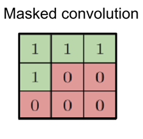
*Fig. — The deck's mask for a $3\times3$ kernel; green = kept, red = zeroed. The centre is **0**, so this is specifically a **type-A** mask: four of nine weights survive. Slide 13.*

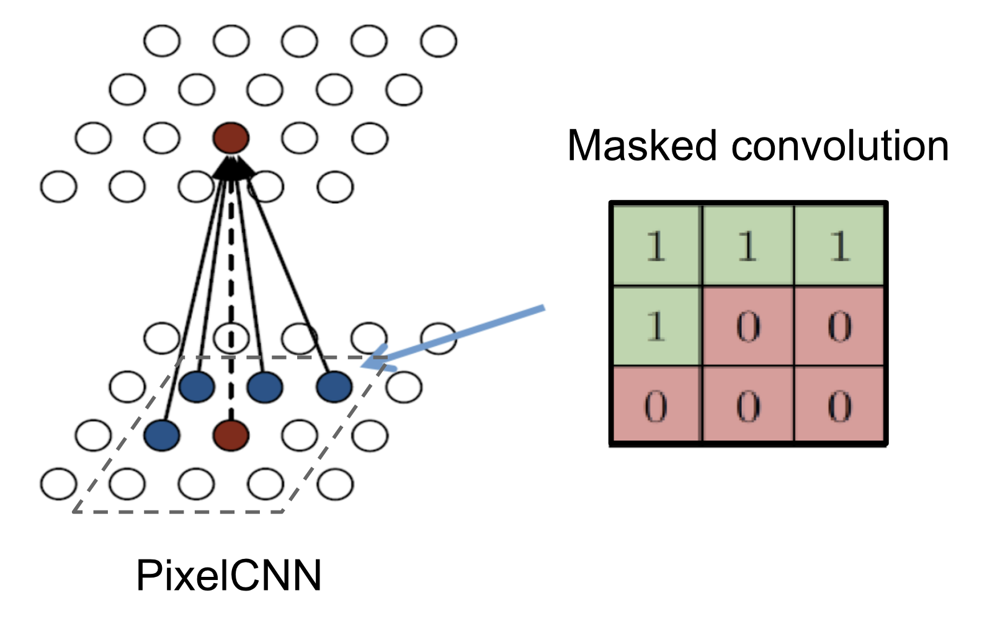
*Fig. — The same mask as wiring. Only the filled blue units inside the dashed footprint are connected, and the red unit directly below the output — the current position — is **not**. Again type A. Slide 14.*

Written as a grid for a $5\times5$ kernel, with the centre marked $\star$:

```
        mask A                     mask B
   (first layer only)        (all later layers)

   1  1  1  1  1             1  1  1  1  1
   1  1  1  1  1             1  1  1  1  1
   1  1  ★0  0  0            1  1  ★1  0  0
   0  0  0  0  0             0  0  0  0  0
   0  0  0  0  0             0  0  0  0  0

   12 of 25 weights          13 of 25 weights
```

**Why two mask types.** In the **first** layer the input *is* the image, so a non-zero centre weight
would let the network read $x_i$ itself when predicting $x_i$ — the cheat. Hence **type A excludes the
centre**. In **every later** layer the input is a feature map, and the feature at position $i$ was
itself computed from strictly-previous pixels only; reading it is therefore legal and in fact
necessary, because if every layer excluded its own position the context would shift one pixel further
left at each layer and the model would lose exactly the pixels nearest to $x_i$. Hence **type B
includes the centre**. The same logic applies channel-wise, which is the mask A / mask B panel on
slide 16.

| | Mask A | Mask B |
|---|---|---|
| Centre position | **excluded** (weight forced to 0) | **included** |
| Used in | the **first** convolutional layer only | **all subsequent** layers |
| Channel wiring | R, G, B see context + *previous* channels, not themselves | channels also see themselves |
| Surviving weights, $k\times k$ | $(k^2-1)/2$ | $(k^2+1)/2$ |
| Using it in the wrong layer | first layer with B ⇒ the model cheats, likelihood collapses to nonsense | later layers with A ⇒ context is needlessly shifted, quality drops |

### The asymmetry — the punchline

This is the sentence to carry out of the lecture:

> **Training is parallel. Generation is strictly sequential.**

At **training** time the whole true image is already known, so you push it through the masked
convolutional stack **once** and every output position $i$ simultaneously produces
$p_\theta(x_i\mid x_{<i})$. The mask is what makes this legitimate — without it the parallel
computation would be contaminated by future pixels. The deck says exactly this: *"While generation
remains sequential, PixelCNN allows for complete parallelization of the pixel computations during
training and evaluation."*

At **generation** time there is no true image. Pixel $x_{i}$ must be sampled before it can be fed in
as context for $x_{i+1}$, so you run the *entire* network once per pixel and the mask buys you nothing
— the parallelism it enabled has nothing to parallelise over.

| | Training | Generation |
|---|---|---|
| Is the true image available? | yes | no |
| Network passes per image | **1** | **$n^2$** (or $3n^2$ with channel factorisation) |
| Parallel over pixels? | **yes** (masked conv) | **no** |
| Why | masking makes it safe to compute all conditionals at once | pixel $i$ is an input to the prediction of pixel $i+1$ |

You will meet this asymmetry again almost immediately. **Masked self-attention in
[Lec 25](../week-07/25-qkv-and-self-attention.md) is the same idea in a different layer type** —
a causal mask that zeroes the attention weights pointing at future positions, so a Transformer decoder
trains in parallel and generates one token at a time. If you understand masked convolution you already
understand why GPT is slow to sample and fast to train.

### The three architecture variants

Slide 19 puts the three side by side, and this comparison is explicitly on the deck, which makes it
prime exam material.

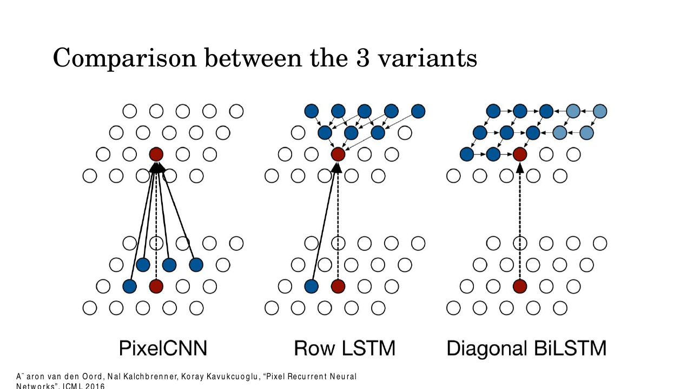
*Fig. — Read the top halves. PixelCNN connects to a small bounded fan; Row LSTM to a triangle widening upward; Diagonal BiLSTM's two sweeps (dark blue leftward, light blue rightward) cover the whole region above. Slide 19.*

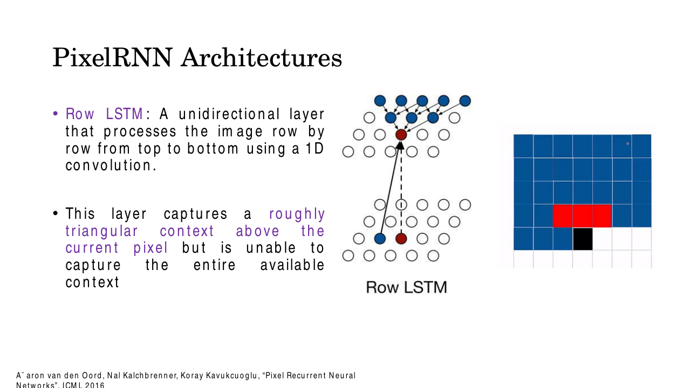
*Fig. — The state-to-state transition is a 1-D convolution across the row above, so the context accumulates as a widening triangle. The white cells to the upper right are context the layer provably cannot reach. Slide 17.*

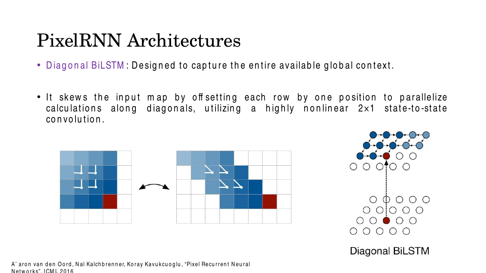
*Fig. — The skew is the trick: offsetting row $r$ by $r$ positions turns a diagonal dependency into a columnwise one, so a whole diagonal computes at once. State-to-state is a $2\times1$ convolution. Slide 18.*

| | **Row LSTM** | **Diagonal BiLSTM** | **PixelCNN** |
|---|---|---|---|
| Mechanism | unidirectional LSTM, row by row, top to bottom | two LSTMs sweeping along diagonals, one per direction | stack of masked convolutions, no recurrence |
| State-to-state op | 1-D convolution along the row | $2\times1$ convolution, on a **skewed** map | $k\times k$ masked 2-D convolution |
| Receptive-field shape | roughly **triangular**, widening upward | the **entire** available context above and left | **bounded** — a fixed trapezoid that grows with depth |
| Context captured | partial — "unable to capture the entire available context" | complete | partial, bounded by depth |
| Training speed | slow (recurrent over rows) | slowest (recurrent over $2n$ diagonals) | **fastest** — fully parallel |
| Generation speed | sequential | sequential | sequential |
| Typical likelihood | middle | **best** | worst |

Two discriminations the exam will want. **Diagonal BiLSTM is the one designed to capture the entire
available global context**; Row LSTM is the one that cannot. And **PixelCNN is the fast one only at
training time** — all three generate sequentially, and no architecture choice changes that.

### Applications, drawbacks, results

Because PixelRNN gives an explicit likelihood rather than just samples, it can do jobs a GAN cannot.
The deck lists four:

| Application | Why the explicit likelihood enables it |
|---|---|
| Image generation | sample the chain from an empty canvas |
| **Density estimation** for images | evaluate $p(\mathbf{x})$ directly — outlier detection, model comparison |
| Image completion / **inpainting** | condition on the observed pixels, continue the chain over the missing ones |
| **Lossless image compression** | an exact $p(\mathbf{x})$ plugs straight into arithmetic coding; code length $\approx -\log_2 p(\mathbf{x})$ bits |

The drawbacks are the mirror image: **very slow generation (pixel by pixel)**, **computationally
expensive**, and **hard to scale to very large images**.

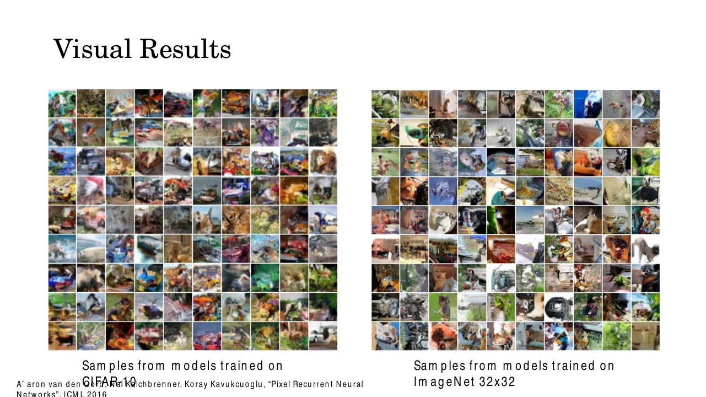
*Fig. — Look at the resolution before you judge the quality: these are $32\times32$. Local texture and colour statistics are convincing; global object structure is not. That gap is what the next generation of models had to close. Slide 22.*

## Worked numericals

### N1. The chain rule written out for a 2×2 image, then counted for 32×32×3
**Given:** a $2\times2$ greyscale image, pixels numbered in raster order
$x_1$ (top-left), $x_2$ (top-right), $x_3$ (bottom-left), $x_4$ (bottom-right).
**Find:** the full factorisation; then the number of factors for a $32\times32$ RGB image.

1. Chain rule with $n=4$, in raster order:

$$p(\mathbf{x}) = \underbrace{p(x_1)}_{\text{unconditional}}\;
\underbrace{p(x_2\mid x_1)}_{\text{1 condition}}\;
\underbrace{p(x_3\mid x_1,x_2)}_{\text{2 conditions}}\;
\underbrace{p(x_4\mid x_1,x_2,x_3)}_{\text{3 conditions}}$$

2. Name them: the first pixel is drawn from a marginal with nothing to condition on; the second from
   the distribution of the top-right pixel given the top-left; the third from the bottom-left given
   the whole top row; the fourth from the bottom-right given everything else.
3. Factor count for a $32\times32$ image, pixel-level: $32\times32 = \mathbf{1024}$ factors.
4. With the RGB sub-factorisation (red, then green given red, then blue given red and green):
   $1024 \times 3 = \mathbf{3072}$ factors.
5. The last factor conditions on $3072 - 1 = \mathbf{3071}$ preceding values.
6. Why a network is unavoidable: that last conditional, stored as a table over 8-bit values, would
   need $256^{3071}$ rows. For comparison, the number of atoms in the observable universe is about
   $10^{80}$, and $256^{3071} = 2^{24568} \approx 10^{7396}$.

**Answer:** $p(\mathbf{x})=p(x_1)p(x_2\mid x_1)p(x_3\mid x_1,x_2)p(x_4\mid x_1,x_2,x_3)$;
**1024** pixel factors (**3072** counting channels) for $32\times32\times3$; a tabular conditional is
impossible, hence "a neural network is used to realize the complex pixel distribution".

### N2. The wall-clock cost of sequential generation
**Given:** a trained PixelCNN. One forward pass through the whole network takes **10 ms**. Pixels are
generated one at a time (all three channels emitted together).
**Find:** the time to generate one image at $32\times32$, $64\times64$ and $256\times256$, and the
slowdown versus a one-pass model.

1. Passes needed $= H\times W$, because each pixel needs the previous ones as input.
2. $32\times32$: $1024$ passes $\times\,0.010$ s $= \mathbf{10.24}$ s.
3. $64\times64$: $4096$ passes $\times\,0.010$ s $= \mathbf{40.96}$ s.
4. $256\times256$: $65{,}536$ passes $\times\,0.010$ s $= \mathbf{655.36}$ s $=$ **10 min 55 s**.
5. Scaling check: doubling the side length quadruples the pixel count, so the time is **quadratic in
   side length** — $10.24 \to 40.96 \to 163.84 \to 655.36$ s.
6. A GAN or VAE needs **one** pass: 0.010 s. The slowdown at $256\times256$ is
   $655.36 / 0.010 = \mathbf{65{,}536\times}$ — exactly the pixel count, as it must be.
7. If you are strict about the RGB factorisation, triple it: $3\times65{,}536 = 196{,}608$ passes
   $= 1966$ s $\approx$ **32.8 min** for one $256\times256$ image.
8. Batching 64 images does **not** help latency. The 65,536 steps are a dependency chain; the GPU can
   widen each step but cannot skip one.

**Answer:** 10.24 s / 40.96 s / 655.36 s. At $256\times256$ an autoregressive model is **65,536×
slower to sample** than a single-pass generator — which is why these models were abandoned for
high-resolution synthesis.

### N3. Building type-A and type-B masks for a 5×5 kernel by hand
**Given:** a $5\times5$ convolution kernel. Index rows and columns $1..5$; the centre is $(3,3)$.
**Find:** both masks, drawn, and the count of surviving weights.

1. Rule: a weight survives iff the pixel it points at comes **strictly before** the centre pixel in
   raster order. Type B additionally keeps the centre itself.
2. Rows 1 and 2 are entirely above the centre row ⇒ all 10 weights survive.
3. Row 3, columns 1 and 2, are left of the centre in the same row ⇒ 2 more survive. Running total 12.
4. Row 3 column 3 is the centre: **0 for type A, 1 for type B**.
5. Row 3 columns 4–5 are to the right, and rows 4–5 are below ⇒ all 12 are zeroed.

```
   col:  1  2  3  4  5          col:  1  2  3  4  5
row 1    1  1  1  1  1        row 1    1  1  1  1  1
row 2    1  1  1  1  1        row 2    1  1  1  1  1
row 3    1  1  0  0  0        row 3    1  1  1  0  0
row 4    0  0  0  0  0        row 4    0  0  0  0  0
row 5    0  0  0  0  0        row 5    0  0  0  0  0
         MASK A  (12/25)               MASK B  (13/25)
```

6. Totals: **A = 12 of 25** (48 %), **B = 13 of 25** (52 %).
7. General formula: $(k^2-1)/2$ for A and $(k^2+1)/2$ for B. Check on the deck's $3\times3$ figure:
   $(9-1)/2 = 4$ ones with a zero centre — exactly what the slide draws, confirming the deck's grid
   is a **type-A** mask.
8. Parameter consequence: a $5\times5$ masked conv with 128 input and 128 output channels holds
   $5\times5\times128\times128 = 409{,}600$ weights, of which only
   $409{,}600 \times 12/25 = \mathbf{196{,}608}$ are ever non-zero under mask A.

**Answer:** A keeps **12/25**, B keeps **13/25**; in general $(k^2\mp1)/2$. The deck's $3\times3$
diagram is a type-A mask (4 of 9).

### N4. Likelihood of a tiny binary image, in product and log form
**Given:** a $2\times2$ binary image with raster-order values $\mathbf{x}=(1,0,1,1)$ and a trained
model supplying
$p(x_1{=}1)=0.6$, $p(x_2{=}1\mid x_1{=}1)=0.8$, $p(x_3{=}1\mid x_1{=}1,x_2{=}0)=0.5$,
$p(x_4{=}1\mid x_1{=}1,x_2{=}0,x_3{=}1)=0.9$.
**Find:** $p(\mathbf{x})$, $\log p(\mathbf{x})$, and the negative log-likelihood in bits per pixel.

1. Pick out the factor for the value the image **actually has**. $x_2 = 0$, so the needed factor is
   $p(x_2{=}0\mid x_1{=}1) = 1 - 0.8 = 0.2$. (The other three are already stated for value 1.)
2. Product form:
   $p(\mathbf{x}) = 0.6 \times 0.2 \times 0.5 \times 0.9$.
3. $0.6\times0.2 = 0.12$; $0.12\times0.5 = 0.06$; $0.06\times0.9 = \mathbf{0.054}$.
4. Log form (natural log), term by term:
   $\ln 0.6 = -0.5108$, $\ln 0.2 = -1.6094$, $\ln 0.5 = -0.6931$, $\ln 0.9 = -0.1054$.
5. Sum: $-0.5108 - 1.6094 - 0.6931 - 0.1054 = \mathbf{-2.9188}$ nats.
6. Check: $e^{-2.9188} = 0.054$ ✓ — the product and the sum agree, which is the whole point of taking
   logs.
7. Convert to bits: $2.9188 / \ln 2 = 2.9188/0.6931 = 4.2109$ bits for the image.
8. Per pixel: $4.2109/4 = \mathbf{1.053}$ bits/dim — the standard reporting metric for these models.

**Answer:** $p(\mathbf{x}) = 0.054$, $\log p(\mathbf{x}) = -2.9188$ nats,
NLL $= 1.053$ **bits per dimension**. Lower bits/dim means a better model; it is also literally the
average number of bits an arithmetic coder would spend per pixel.

### N5. Receptive field after stacking masked convolutions
**Given:** a PixelCNN whose layers are all masked $3\times3$ convolutions, type B after the first,
stride 1, 'same' padding. Measure positions as offsets $(\text{row},\text{col})$ from the output pixel,
with negative rows meaning "above".
**Find:** the shape and size of the receptive field after $L$ layers, and what it misses.

1. One layer reaches offsets $\{(-1,-1),(-1,0),(-1,1),(0,-1),(0,0)\}$ — five positions.
2. Stacking adds reaches, so after $L$ layers the field spans **$L$ rows up** and at most **$L$
   columns** either way.
3. The shape is *not* the full causal region. At row offset $-r$ the field runs from column $-L$ only
   up to column $+r$: to get $r$ rows up you have already spent $r$ of your $L$ layers, and each of
   those could move at most one column right. So the field is a **wedge**, wide at the top and
   narrowing to the current pixel.
4. Size: $\sum_{r=0}^{L}(L + r + 1) = (L+1)^2 + \tfrac{L(L+1)}{2}$.
   For $L=4$: $25 + 10 = \mathbf{35}$ positions.
5. The true causal region inside the same bounding box is
   $L(2L+1) + (L+1) = 2L^2+2L+1$; for $L=4$ that is $32+8+1 = 41$.
6. Missing positions $= 41 - 35 = \mathbf{6}$ — the **blind spot**, a triangular wedge to the
   **upper right**. In general it has $L(L-1)/2$ cells.
7. For the deck's **fifteen-layer** PixelCNN: field $= 16^2 + 120 = 376$ positions, causal region
   $= 481$, blind spot $= 15\times14/2 = \mathbf{105}$ positions it can never see.

**Answer:** after $L$ masked $3\times3$ layers the receptive field is a wedge of
$(L+1)^2 + L(L+1)/2$ positions — 35 at $L=4$, 376 at $L=15$ — and it permanently misses
$L(L-1)/2$ legal context pixels in the upper right. That is the **blind spot**, and it is why Gated
PixelCNN was invented.

## Code

```python
import numpy as np

def make_mask(k, kind):
    """Causal mask for a k x k kernel. kind='A' excludes the centre, 'B' keeps it."""
    m = np.zeros((k, k), dtype=int)
    c = k // 2
    m[:c, :] = 1          # every row strictly above the centre row
    m[c, :c] = 1          # the centre row, strictly left of the centre
    if kind == 'B':
        m[c, c] = 1       # type B also sees the centre position itself
    return m

for kind in ('A', 'B'):
    M = make_mask(5, kind)
    print(f"mask {kind}  (surviving weights = {M.sum()} of {M.size})")
    print('\n'.join(' '.join(str(v) for v in row) for row in M), '\n')

def masked_conv(img, w, mask=None):
    """Single-channel 'same'-padded correlation; mask=None means an ordinary conv."""
    k = w.shape[0]; c = k // 2
    wm = w if mask is None else w * mask
    p = np.pad(img, c)
    H, W = img.shape
    return np.array([[np.sum(p[i:i+k, j:j+k] * wm) for j in range(W)] for i in range(H)])

rng = np.random.default_rng(0)
img = rng.random((7, 7))
w   = rng.random((5, 5))
A   = make_mask(5, 'A')

out      = masked_conv(img, w, A)
out_open = masked_conv(img, w)              # no mask: the cheating version

img2 = img.copy()
img2[3, 4] = 99.0                           # a FUTURE pixel: same row, right of (3,3)
out2      = masked_conv(img2, w, A)
out2_open = masked_conv(img2, w)

print("masked   output at (3,3):", round(out[3, 3], 6), "->", round(out2[3, 3], 6))
print("unmasked output at (3,3):", round(out_open[3, 3], 6), "->", round(out2_open[3, 3], 6))

# every output at or before (3,3) in raster order must be untouched
idx  = [(i, j) for i in range(7) for j in range(7)]
upto = idx[:idx.index((3, 3)) + 1]
print("all outputs up to (3,3) unchanged:",
      all(np.isclose(out[i, j], out2[i, j]) for i, j in upto))
```

```text
mask A  (surviving weights = 12 of 25)
1 1 1 1 1
1 1 1 1 1
1 1 0 0 0
0 0 0 0 0
0 0 0 0 0

mask B  (surviving weights = 13 of 25)
1 1 1 1 1
1 1 1 1 1
1 1 1 0 0
0 0 0 0 0
0 0 0 0 0

masked   output at (3,3): 2.502013 -> 2.502013
unmasked output at (3,3): 6.542907 -> 15.492639
all outputs up to (3,3) unchanged: True
```

Read the last three lines carefully, because they *are* the lecture. Setting a future pixel to a wild
value leaves the masked output at $(3,3)$ bit-for-bit identical, and leaves every earlier output
identical too. The unmasked convolution's output more than doubles — it was reading the future, and
would have learned to cheat.

## Exam pack

### Must-memorise

| Item | Exactly this |
|---|---|
| Chain-rule factorisation | $p(\mathbf{x}) = \prod_{i=1}^{n} p(x_i \mid x_1,\dots,x_{i-1})$ |
| Same, deck's $n\times n$ image form | $p(\mathbf{x}) = \prod_{i=1}^{n^2} p(x_i \mid x_{<i})$ — upper limit is $n^2$ |
| RGB sub-factorisation | $p(x_i\mid x_{<i}) = p(x_{i,R}\mid x_{<i})\,p(x_{i,G}\mid x_{<i},x_{i,R})\,p(x_{i,B}\mid x_{<i},x_{i,R},x_{i,G})$ |
| FVBN definition | autoregressive generative model, **all variables visible** (no latents), joint factorised into a sequence of conditionals |
| FVBN training objective | maximise $\sum_{\mathbf{x}\in\mathcal{D}}\sum_i \log p_\theta(x_i\mid x_{<i})$ — plain MLE |
| Where it sits in the taxonomy | explicit density → **tractable** density |
| Masked convolution | ordinary conv whose kernel is multiplied by a fixed binary mask zeroing all weights pointing **below or to the right** of the centre |
| Why mask | to avoid seeing the future context — otherwise the autoregressive property is violated and the model cheats |
| Mask A | centre **excluded**; **first layer only** |
| Mask B | centre **included**; **all later layers** |
| Surviving weights, $k\times k$ | A: $(k^2-1)/2$ · B: $(k^2+1)/2$ |
| The asymmetry | training **parallel** (masking), generation **strictly sequential** |
| Generation cost | $n^2$ forward passes for an $n\times n$ image ($3n^2$ with channel factorisation) |
| Diagonal BiLSTM's purpose | capture the **entire available global context** |
| Row LSTM's weakness | roughly triangular context — **cannot** capture the entire context |

### Numbers worth knowing

| Quantity | Value |
|---|---|
| PixelRNN paper | van den Oord, Kalchbrenner, Kavukcuoglu — Google DeepMind — **ICML 2016** |
| PixelCNN depth, per the deck | **fifteen** layers, fully convolutional, preserves spatial resolution |
| Diagonal BiLSTM state-to-state kernel | $2\times1$, on a **skewed** input map |
| Row LSTM state-to-state op | **1-D** convolution along the row |
| Row skew offset in Diagonal BiLSTM | each row shifted by **one** position |
| Type-A mask on $3\times3$ (deck's figure) | 4 ones of 9 |
| Type-A / type-B on $5\times5$ | 12 / 25 and 13 / 25 |
| Passes to sample $32\times32$ | 1024 (3072 if channel-sequential) |
| Passes to sample $256\times256$ | 65,536 (196,608 if channel-sequential) |
| Deck's sample resolutions | CIFAR-10 ($32\times32$) and ImageNet $32\times32$ |
| Deck's example AR models | PixelRNN, PixelCNN, Transformer, GPT (slide 3 adds WaveNet) |
| PixelRNN applications | generation, density estimation, inpainting/completion, lossless compression |

### Likely MCQ traps

- **"PixelCNN is faster than PixelRNN, therefore it generates faster."** False. PixelCNN is faster to
  **train and evaluate**, because masking lets all conditionals be computed in one parallel pass.
  Generation is sequential for both, and for every autoregressive model ever built.
- **"Masking makes generation parallel."** Backwards. Masking makes *training* parallel. At generation
  time there is nothing to parallelise, because pixel $i$ is an input to pixel $i+1$.
- **"Mask A is used throughout the network."** No — mask A is the **first layer only**. Using A
  everywhere needlessly shifts the context away from the pixel being predicted.
- **"Mask B in the first layer is fine."** It is not. The first layer's input is the image, so a
  non-zero centre weight lets the model read $x_i$ when predicting $x_i$.
- **"The mask zeroes pixels above and to the left."** Reversed. Above-and-left is the **kept** region;
  below-and-right is zeroed.
- **"Autoregressive models assume pixels are independent."** The exact opposite. The chain rule
  assumes nothing. *Naive Bayes* is the one that assumes independence.
- **"Autoregressive models have a latent variable."** No. "Fully visible" means precisely that there
  is none — which is why the likelihood is exact rather than bounded.
- **"These are implicit density models."** No. They are **explicit and tractable**. GANs are implicit;
  VAEs are explicit but approximate.
- **"Row LSTM captures the full context."** No — that is **Diagonal BiLSTM**. Row LSTM's context is
  roughly triangular and incomplete.
- **Upper limit of the product.** For an $n\times n$ image it is $n^2$, not $n$. With RGB it is $3n^2$
  conditionals.
- **"Sampling uses the most probable pixel value."** It draws from the predicted distribution. Always
  taking the argmax would make every generated image identical.

### Self-test

1. Write the chain-rule factorisation of a $2\times2$ image in raster order, all four factors.
2. A model is explicit-density and tractable. Which family is it, and name one model from it.
3. Why is a Fully Visible Belief Network called "fully visible", and what does that buy you?
4. How many forward passes are needed to sample a $64\times64$ RGB image if the three channels are
   generated sequentially?
5. Draw the type-B mask for a $7\times7$ kernel and count its surviving weights.
6. State in one sentence why mask A must be used in the first layer but not later.
7. Which PixelRNN variant captures the entire available context, and what trick lets it do so?
8. A friend says "PixelCNN parallelises image generation". Correct them in two sentences.
9. Given $p(x_1{=}0)=0.3$, $p(x_2{=}1\mid x_1{=}0)=0.4$, compute $p(x_1{=}0, x_2{=}1)$ and its
   natural log.
10. Why can an autoregressive model do lossless compression when a GAN cannot?

<details><summary>Answers</summary>

1. $p(\mathbf{x})=p(x_1)\,p(x_2\mid x_1)\,p(x_3\mid x_1,x_2)\,p(x_4\mid x_1,x_2,x_3)$.
2. The **autoregressive / FVBN** family — PixelRNN, PixelCNN (also GPT, WaveNet). See
   [Lec 22](22-generative-taxonomy-and-mle.md).
3. Every variable in the factorisation is an observed pixel; there are no latent variables. Nothing
   has to be integrated out, so the likelihood is **exact**, not a bound.
4. $64\times64\times3 = 12{,}288$ passes.
5. Rows 1–3 all ones (21), row 4 columns 1–3 ones (3), plus the centre $(4,4)$ for type B $= 25$.
   Check with the formula: $(49+1)/2 = 25$ of 49.
6. The first layer's input is the image itself, so its centre weight would read the very pixel being
   predicted; later layers read features that were already computed from strictly-previous pixels, so
   reading the centre is legal and keeps the context from drifting leftward.
7. **Diagonal BiLSTM**. It **skews** the input map — offsetting each row by one position — so that
   diagonals line up as columns and a $2\times1$ state-to-state convolution can sweep them, with two
   directions covering everything above and left.
8. PixelCNN parallelises the *training* computation: with the true image available, masked convolutions
   produce every pixel's conditional in one pass. Generation is still one network pass per pixel,
   because each sampled pixel is an input to the next.
9. $0.3\times0.4 = 0.12$; $\ln 0.12 = \ln 0.3 + \ln 0.4 = -1.2040 - 0.9163 = -2.1203$.
10. Arithmetic coding needs an explicit probability for each symbol to allocate code lengths
    ($\approx -\log_2 p$ bits). An autoregressive model supplies exactly that for every pixel; a GAN
    never computes a probability at all.

</details>

## Beyond the slides

**Gap:** The deck never mentions the **blind spot** of naive masked convolution.
**Why it matters:** As numerical N5 shows, stacking masked $k\times k$ convolutions gives a wedge-shaped
receptive field that permanently misses a triangle of legal context to the upper right — 105 positions
for the deck's own fifteen-layer PixelCNN. That is a modelling defect, not a subtlety, and it is the
reason **Gated PixelCNN** (van den Oord et al., NeurIPS 2016) exists: it splits the masked convolution
into a **vertical stack** (everything above) and a **horizontal stack** (the current row) and combines
them, covering the full context with no blind spot. It also uses a gated activation
$\tanh(\mathbf{W}_f * \mathbf{x}) \odot \sigma(\mathbf{W}_g * \mathbf{x})$, borrowing from
[Lec 18](../week-05/18-lstm.md), and closes most of the likelihood gap to PixelRNN.

**Gap:** The deck does not mention **PixelCNN++** (Salimans et al., ICLR 2017).
**Why it matters:** It is the version people actually used, and its three changes are each exam-sized.
(i) Replace the 256-way softmax over pixel values with a **discretised logistic mixture**, which knows
intensity 127 is close to 128 where a softmax treats them as unrelated classes. (ii) Condition the
colour channels with a simple linear dependency instead of a full network. (iii) Add **downsampling
and skip connections** so the receptive field grows without enormous depth.

**Gap:** The deck gives no likelihood numbers, so the claim "Diagonal BiLSTM is best" is unquantified.
**Why it matters:** The paper reports negative log-likelihood in **bits per dimension** on CIFAR-10, with
Diagonal BiLSTM $\approx 3.00$, Row LSTM $\approx 3.06$ and PixelCNN $\approx 3.14$ — lower is better.
The ordering is what to remember; treat the exact decimals as approximate, since they are from the
paper and not from the deck. Bits/dim is just $-\log_2 p(\mathbf{x})$ divided by the number of
sub-pixels, which is the quantity you computed in N4.

**Gap:** Nothing is said about **teacher forcing** or the resulting exposure bias.
**Why it matters:** During training the model always conditions on *true* previous pixels; during generation
it conditions on its own *samples*. Errors therefore compound along the chain — one bad pixel early in
the raster becomes part of the context for every later pixel. This is the standard explanation for why
the slide-22 samples have plausible local texture but incoherent global structure.

**Gap:** The ordering is presented as if raster-scan were obligatory.
**Why it matters:** It is an arbitrary choice that imposes a strange prior: the pixel directly above a given
pixel is its spatial neighbour but is $n$ steps away in the sequence. Later work (and the lower row of
the slide-5 figure) uses coarse-to-fine or learned orderings precisely to avoid this. Knowing the
ordering is a free parameter is what makes the later VQ-VAE / Transformer-over-tokens designs
([Lec 28](../week-08/28-vit-detr-swin.md)) make sense.

## Cut from the slides

Dropped the title slide (1), the "Content" slide (2), the near-duplicate FVBN heading slide (7, which
carries only $p(\mathbf{x}) = p(x_1,\dots,x_n)$ before the chain rule is applied — folded into the FVBN
section as the starting point), the "Summary" slide (23) and the "Next: Transformers" slide (24).
Slides 8, 9 and 10 state the FVBN definition, its MLE training and the chain-rule decomposition with
substantial overlap; they are merged into one subsection, keeping slide 10's annotated equation figure
as the clearest of the three. Slide 11's list of example autoregressive models duplicates the closing
bullet of slide 3, so it is cited once. Slides 13 and 14 are both titled "PixelCNN" and show the same
masked-convolution figure; the text is merged, and both figure crops are kept only because one shows
the mask grid and the other the connectivity. Slides 15 and 16 are both "PixelRNN" and share the
context diagram; slide 16's render is the one kept, for its multi-scale and mask A/B panels. Nothing
mathematical or examinable was dropped — in particular the two equations that exist only as images,
the $n^2$ product and the RGB sub-factorisation on slide 12, are both reproduced in full, as is slide
19's three-way comparison.
