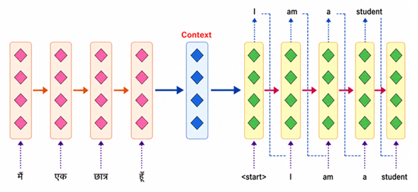
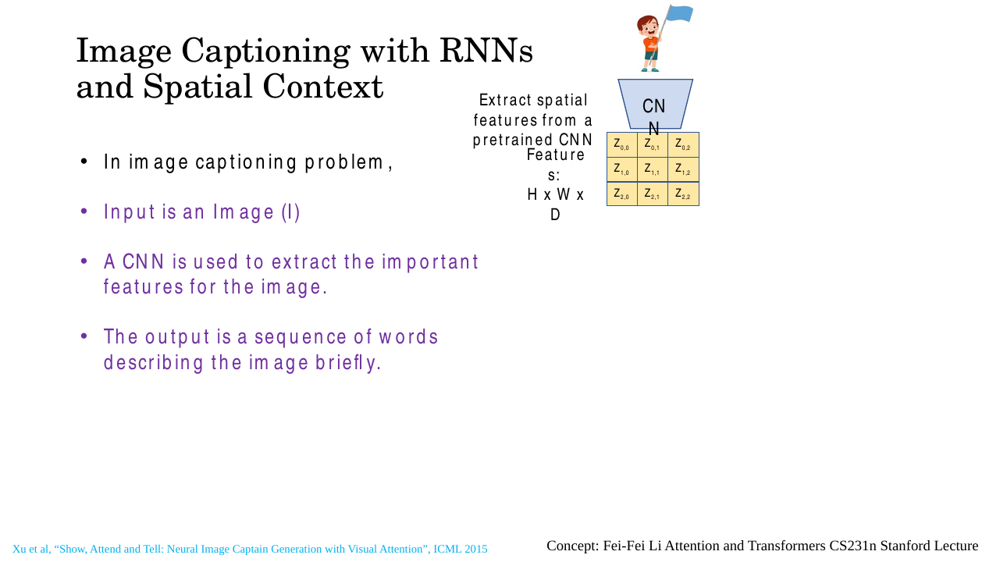
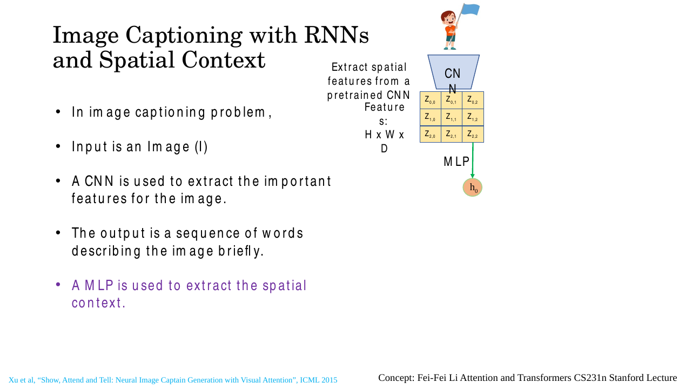
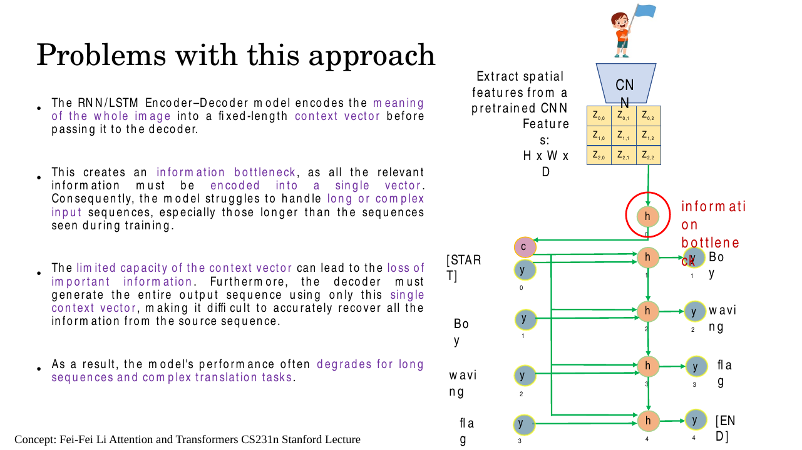
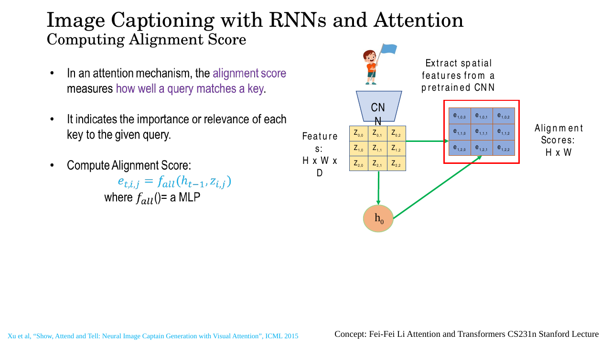
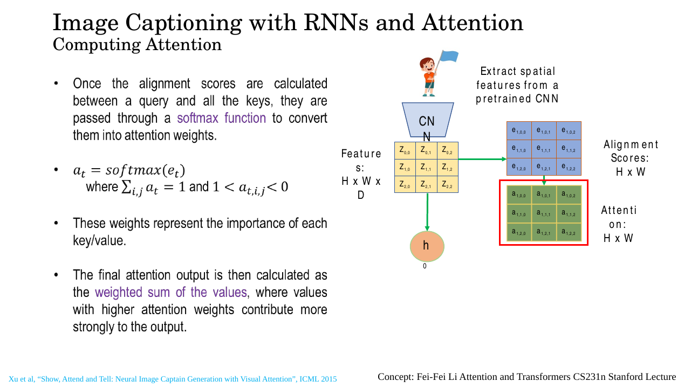
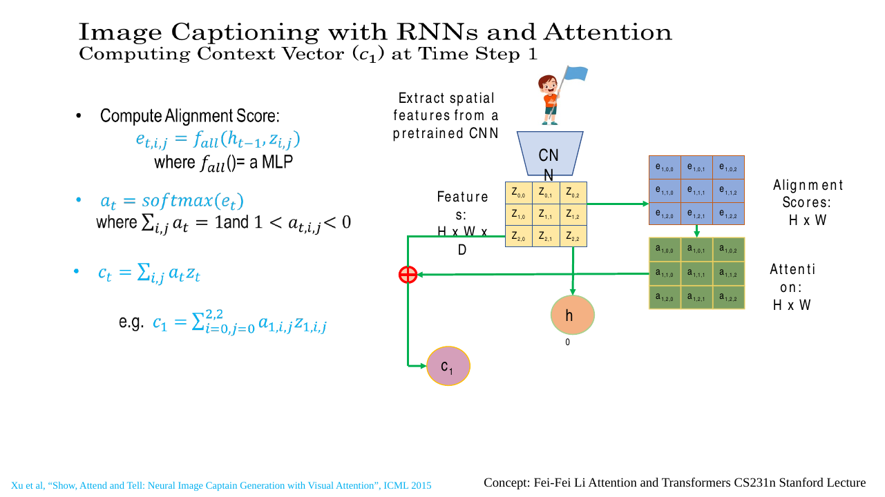
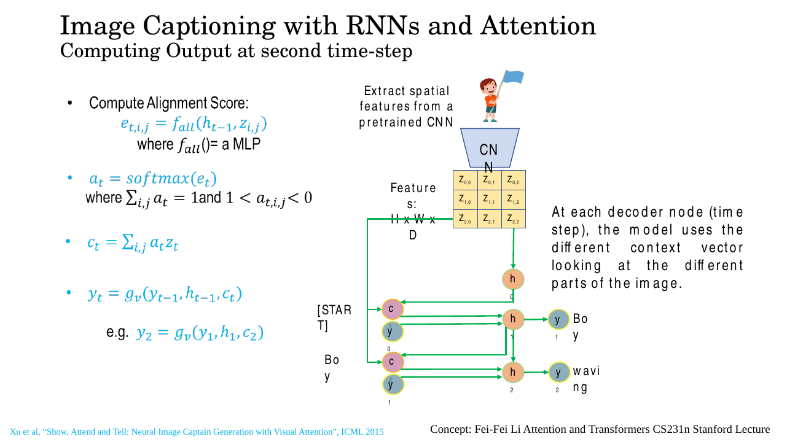

# Lec 24 — Image Captioning and Spatial Attention (Transformers I)

> **Deck:** `L8P3_Transformer-1.pptx` · **Week 6** · **Playlist:** Lec 24
> **Prereqs:** [Lec 19 — GRU, Seq2Seq and Attention](../week-05/19-gru-seq2seq-attention.md), [Lec 11 — CNN Basics](../week-03/11-cnn-basics.md)
> **Feeds into:** [Lec 25 — Q/K/V and Self-Attention](../week-07/25-qkv-and-self-attention.md)

## Why this lecture exists

[Lec 19](../week-05/19-gru-seq2seq-attention.md) diagnosed a failure in sequence-to-sequence
translation: the encoder squeezes an entire sentence into one fixed-length context vector, the decoder
has nothing else to look at, and long inputs degrade. Attention over the encoder's hidden states fixed
it. This lecture shows that the *identical* failure appears in vision. Swap the source sentence for an
image and the encoder RNN for a CNN, and you get image captioning — where the standard recipe pools the
whole picture into one vector before a word is ever emitted. A caption like "boy waving flag" needs the
boy for one word and the flag for another, and one vector cannot serve both.

The fix is the same mechanism, pointed at a different kind of thing: instead of attending over a
*sequence of hidden states indexed by time*, you attend over a *grid of feature vectors indexed by
space*. That single substitution is the whole lecture, and it is the last step before attention gets
written down in its general form.

## The ideas

### Image captioning as a task

**Image captioning** takes an image $I$ and emits a sequence of words describing it. The deck's framing
(slide 5) is three lines: the input is an image, a CNN extracts features from it, and the output is a
short sequence of words. It is an encoder–decoder problem whose two halves live in different modalities
— a CNN encoder for vision, an RNN or LSTM decoder for language. The skeleton is
[Lec 19](../week-05/19-gru-seq2seq-attention.md)'s; only the encoder changes.


*Fig. — The deck opens with the sequence case to set up the analogy: everything the encoder saw funnels through the single blue "Context" column. Replace the pink encoder column with a CNN and you have image captioning. Slide 3.*

### The CNN encoder produces a grid, not a vector

Run an image through a pretrained CNN and stop *before* the fully connected layers. What you have is
not a vector — it is a tensor of shape $H \times W \times D$: a spatial grid $H$ cells tall and $W$
cells wide, where each cell holds a $D$-dimensional vector. The deck labels these cells
$Z_{0,0}, Z_{0,1}, \dots, Z_{2,2}$ on a $3\times3$ grid and calls the whole thing "Features: H × W × D".


*Fig. — Nine cells, each one a $D$-dimensional vector. Notice there is no flattening and no pooling here — the spatial layout survives. Slide 5.*

Each cell $\mathbf{z}_{i,j} \in \mathbb{R}^{D}$ is called an **annotation vector**: it summarises what
the network saw in one patch of the image, and its position $(i,j)$ in the grid tells you *where* that
patch was. Because of how convolution and pooling stack, cell $(i,j)$ has a receptive field (the input
region one unit can see — see [Lec 11](../week-03/11-cnn-basics.md)) covering a specific rectangle of
the original image. The grid is a coarse, low-resolution map of the picture with a rich vector at every
position instead of three colour channels.

Xu et al. used VGG, taking the `conv5_3` output for a $224\times224$ input. Four max-pools of stride 2
have halved the resolution four times, so the grid is $14 \times 14$, and that layer has 512 filters, so

$$14 \times 14 \times 512 \quad\Longrightarrow\quad 196 \text{ locations}, \text{ each a } 512\text{-dim vector}$$

**That is the sentence to internalise.** A $14\times14\times512$ tensor *is* a set of 196 vectors — it
looks like an image only because of how we draw it. [Lec 19](../week-05/19-gru-seq2seq-attention.md)
attended over a list of encoder hidden states $\mathbf{h}_1,\dots,\mathbf{h}_T$; you are about to attend
over a list of 196 annotation vectors, and the mechanism cannot tell the difference. Numerical N3
computes the grid size from scratch.

### The baseline: one vector for the whole image

The deck's first architecture (slides 6–10) is the pre-attention recipe, usually called **Show and Tell**.
An MLP reads the entire feature grid and collapses it into the decoder's initial hidden state
$\mathbf{h}_0$, from which a single **context vector** $\mathbf{c}$ is formed.


*Fig. — Nine vectors in, one vector out. Everything spatial about the image is now mixed into $\mathbf{h}_0$ and cannot be unmixed. Slide 6.*

The decoder then unrolls exactly as in [Lec 19](../week-05/19-gru-seq2seq-attention.md). Slides 7–10
animate it one word at a time: `[START]` plus $\mathbf{c}$ emit "Boy"; "Boy" plus $\mathbf{c}$ emit
"waving"; then "flag"; then `[END]`, and generation stops. **The same $\mathbf{c}$ is fed to every single
step** — the point those four near-identical slides are building toward.

### The bottleneck, now in vision

Slide 11 draws a red ring around $\mathbf{h}_0$ and labels it **information bottleneck**.


*Fig. — The red ring is the whole argument. Every pixel of information the decoder will ever use has to pass through that one circle. Slide 11.*

The deck's four bullets are: the whole image is squeezed into a fixed-length vector; that vector's
capacity is limited, so a busy street scene gets the same budget as a blank wall; the decoder must
produce the entire caption from it alone, with no way to re-read the source; and performance therefore
degrades on long or complex inputs.

Those are word-for-word the complaints [Lec 19](../week-05/19-gru-seq2seq-attention.md) made about
translation — the deck even leaves the phrase "complex translation tasks" in a slide about pictures,
because the argument transfers without modification. **The bottleneck is not a property of language. It
is a property of forcing a variable-size input through a fixed-size summary.**

There is a second, vision-specific reason the single vector hurts. Different words in one caption need
different *parts* of the image. In "a dog catching a frisbee", the word "dog" is justified by one region
and "frisbee" by another, and "catching" by the relation between them. A pooled vector has already
averaged those regions together, so the decoder cannot consult one without the other.

### Spatial attention, step 1: score every location

Attention's answer (slide 13) is: stop compressing, and let the decoder look at the full grid at every
step, deciding each time which parts matter.

At decoding step $t$, you have the decoder's previous hidden state $\mathbf{h}_{t-1}$ — this is the thing
that knows what has been said so far and therefore what should come next. Score it against every
annotation vector:

$$e_{t,i,j} = f_{\text{att}}\!\left(\mathbf{h}_{t-1},\ \mathbf{z}_{i,j}\right)$$

where $f_{\text{att}}$ is a small MLP (the deck says so explicitly: "where $f_{att}()$ = a MLP"). The
output $e_{t,i,j}$ is a **scalar** — one number per grid cell — called the **alignment score**. It
measures how relevant location $(i,j)$ is to what the decoder is about to produce.


*Fig. — Both green arrows matter: the score needs the feature **and** the decoder state. The output grid is $H\times W$, not $H\times W\times D$ — the $D$ dimension has been scored away. Slide 15.*

Read the deck's subscripts carefully: in $e_{1,0,0}$ the **first** index is the decoding time step
$t=1$, the **second** is the grid row $i$, and the **third** is the grid column $j$. So $e_{1,0,0}$ reads
"how much does the top-left patch matter for the first word". Nine cells
$e_{1,0,0}\dots e_{1,2,2}$ make the score grid for step 1; nine fresh ones $e_{2,i,j}$ are computed for
step 2. For the $14\times14$ grid there would be 196 of them per step.

One notation reconciliation before going further, because this deck and
[Lec 19](../week-05/19-gru-seq2seq-attention.md) label the same objects with different letters.

| Object | Lec 19 (sequences) | This deck | This chapter |
|---|---|---|---|
| thing attended over | encoder state $\mathbf{h}_i$ | $Z_{i,j}$ / $z_{i,j}$ | $\mathbf{z}_{i,j}$ (bold — it is a vector) |
| decoder state | $\mathbf{s}_{t-1}$ | $h_{t-1}$ | $\mathbf{h}_{t-1}$ |
| attention weight | $\alpha_{t,i}$ | $a_{t,i,j}$ | $\alpha_{t,i,j}$ |
| alignment score | $e_{t,i}$ | $e_{t,i,j}$ | $e_{t,i,j}$ |

Lec 19 had to call the decoder state $\mathbf{s}$ because $\mathbf{h}$ was already taken by the encoder's
recurrent states. Here the encoder is a CNN and its output is $\mathbf{z}_{i,j}$, so $\mathbf{h}$ is free
and the deck gives it to the decoder. Same quantity, different letter — do not let it confuse you.

The substantive difference is only this: Lec 19 wrote the alignment score with a single index, $e_{t,i}$,
because its encoder states formed a 1-D list; here the index is an $(i,j)$ pair. **That is the only
structural change.** Everything else is identical — in particular, $f_{\text{att}}$ is still the
additive/Bahdanau MLP scorer that Lec 19 derived, $e_{t,i,j} = \mathbf{v}^\top\tanh(\mathbf{W}_z\mathbf{z}_{i,j} + \mathbf{W}_h\mathbf{h}_{t-1})$,
and this chapter does not re-derive it.

### Step 2: softmax over all locations

Raw scores are unbounded real numbers and cannot weight anything. Pass them through a softmax
([Lec 8](../week-02/08-mlp-and-activations.md) owns it) to get **attention weights**:

$$\alpha_{t,i,j} = \frac{\exp\!\left(e_{t,i,j}\right)}{\displaystyle\sum_{i'=0}^{H-1}\sum_{j'=0}^{W-1}\exp\!\left(e_{t,i',j'}\right)}$$

The deck writes this compactly as $\boldsymbol{\alpha}_t = \mathrm{softmax}(e_t)$ with the conditions
$\sum_{i,j} \alpha_{t,i,j} = 1$ and $0 < \alpha_{t,i,j} < 1$.


*Fig. — Note the normalisation is over the **whole grid at once**, not per row or per column. One softmax, nine (or 196) inputs. Slide 16.*

> **Error on the deck.** Slides 16, 17, 19 and 20 all print the condition as
> $1 < a_{t,i,j} < 0$ — an inequality no number can satisfy. The operands are transposed; the correct
> statement is $0 < \alpha_{t,i,j} < 1$. A softmax output is a probability. Expect an MCQ on exactly this.

Two consequences you should be able to state without thinking:

- The weights form a **probability distribution over spatial locations**. $\alpha_{t,i,j}$ is literally "the
  probability that location $(i,j)$ is the one that matters for word $t$".
- Because they sum to 1, attention is **competitive**: raising the weight on one location necessarily
  lowers it elsewhere. Softmax forces a choice. This is why the resulting maps are peaked rather than
  uniform grey.

### Step 3: the context vector is the weighted sum

Finally, collapse the grid into one vector *using those weights*:

$$\mathbf{c}_t = \sum_{i=0}^{H-1}\sum_{j=0}^{W-1} \alpha_{t,i,j}\,\mathbf{z}_{i,j}$$


*Fig. — The red $\oplus$ node is where the weighted sum happens; both the yellow feature grid and the green attention grid feed into it. The three blue equations on this slide are the entire mechanism. Slide 17.*

The deck's version reads $c_t = \sum_{i,j} a_t z_t$ with the example
$c_1 = \sum_{i=0,j=0}^{2,2} \alpha_{1,i,j} z_{1,i,j}$. Two things to repair: the summand needs its full
$(i,j)$ indices, and the features carry **no** $t$ index — $\mathbf{z}_{i,j}$ is computed once from the
image and reused at every step. Only the weights change with $t$. Use the boxed form above.

Check the shapes. Each $\mathbf{z}_{i,j}$ is $D$-dimensional and each $\alpha_{t,i,j}$ is a scalar, so
$\mathbf{c}_t$ is $D$-dimensional — the *same size as one annotation vector*, and the same size as the
baseline's single context vector. **Attention does not make the context bigger.** It makes it
*step-dependent*. That is the entire gain, and it is free of any dimensional cost.

Two sanity checks worth memorising:

- If the weights are uniform ($\alpha_{t,i,j} = 1/(HW)$ everywhere), $\mathbf{c}_t$ is exactly the global
  average pool. **Average pooling is the special case of attention with a flat distribution.**
- If one weight is 1 and the rest 0, $\mathbf{c}_t$ is exactly one annotation vector — the model has
  picked a single patch. Soft attention never quite reaches this; hard attention starts there.

So $\mathbf{c}_t$ always lies inside the convex hull of the 196 annotation vectors. Attention chooses a
point in that hull, once per word.

### Step 4: the decoder loop with attention wired in

Now run it. The deck animates the loop across slides 18–22:

1. $\mathbf{h}_0$ comes from the MLP over the grid, as before.
2. $\mathbf{h}_0$ scores the grid → $\alpha_{1,i,j}$ → $\mathbf{c}_1$.
3. $\mathbf{c}_1$, $\mathbf{h}_0$ and $y_0 = $ `[START]` produce $\mathbf{h}_1$ and the word $y_1 = $ "Boy".
4. $\mathbf{h}_1$ scores the grid *again*, giving a **different** map $\alpha_{2,i,j}$ → $\mathbf{c}_2$.
5. $\mathbf{c}_2$, $\mathbf{h}_1$ and $y_1$ produce $y_2 = $ "waving". And so on until `[END]`.

The deck gives the output rule as

$$y_t = g_v\!\left(y_{t-1},\ \mathbf{h}_{t-1},\ \mathbf{c}_t\right)$$

with the worked instance $y_2 = g_v(y_1, \mathbf{h}_1, \mathbf{c}_2)$. All three arguments matter: the
previous word, the recurrent state, and the *fresh* context vector.


*Fig. — The four blue lines on this slide are the complete algorithm: score, softmax, weighted sum, emit. Memorise them in that order. Slide 20.*

Note the off-by-one that the exam likes: $\mathbf{c}_t$ is built from $\mathbf{h}_{t-1}$, **not**
$\mathbf{h}_t$. It has to be — $\mathbf{h}_t$ does not exist yet when you need $\mathbf{c}_t$ to compute
it. Same convention as [Lec 19](../week-05/19-gru-seq2seq-attention.md).

### The payoff: the attention map is a picture

Here is what makes this result famous rather than merely useful. The attention weights $\alpha_{t,i,j}$ form
an $H\times W$ grid of numbers that sum to 1 — a $14\times14$ greyscale image. Upsample it to the input
resolution and overlay it on the photograph, and you are looking at **where the model looked when it
produced word $t$**. One map per word.

The deck's slide 23 states the expected behaviour for its running example: for the caption
"Boy waving flag", the model focuses on the boy region while generating "Boy", then *shifts* to the flag
region while generating "flag".

![Slide 23: the complete attention-captioning diagram with alignment-score and attention grids feeding four decoder steps emitting Boy / waving / flag / [END], alongside the bullets about shifting focus](../../assets/slides/W6_L8P3_Transformer-1/s-23.png)
*Fig. — The full assembled system, and the claim that justifies it: attention makes captioning **spatially aware**. Each decoder step has its own purple $\mathbf{c}$ circle fed by its own attention map. Slide 23.*

Schematically, with darker meaning higher weight, that shift looks like numerical N2 below:

```
   word "Boy"  (t = 1)          word "flag"  (t = 2)
   .  █  .                      .  .  ▒
   .  ▓  .          -->         .  .  █
   .  .  .                      .  .  ▓
   53.9% of the mass            58.6% of the mass
   on the top-centre cell       on the right-middle cell
```

The deck names three gains explicitly: **accuracy**, **interpretability** and **contextual relevance**.
The middle one is unusual — most deep models give you no such window — and it exposes failures too: when
a captioner says "frisbee" while attending to a patch of grass, you know the word came from the language
model's priors rather than from the image.

### Soft versus hard attention

Xu et al. proposed **two** variants, and the distinction is heavily examined. The deck shows only the
first.

**Soft (deterministic) attention** is everything above: $\mathbf{c}_t = \sum_{i,j} \alpha_{t,i,j}\mathbf{z}_{i,j}$,
a weighted average over *all* locations. Every annotation vector contributes something, in proportion to
its weight.

**Hard (stochastic) attention** treats the weights as the parameters of a categorical distribution and
*samples one location*:

$$(i^\star, j^\star) \sim \mathrm{Multinoulli}\big(\{\alpha_{t,i,j}\}\big), \qquad \mathbf{c}_t = \mathbf{z}_{i^\star,j^\star}$$

The context vector is one annotation vector, picked at random with probability $\alpha_{t,i,j}$. The model
attends to exactly one patch, not a blend.

| | Soft attention | Hard attention |
|---|---|---|
| $\mathbf{c}_t$ | $\sum_{i,j} \alpha_{t,i,j}\mathbf{z}_{i,j}$ — weighted average | $\mathbf{z}_{i^\star,j^\star}$ — one sampled location |
| Locations used per step | all $HW$ of them | exactly 1 |
| Deterministic? | yes | no — stochastic |
| Differentiable? | **yes**, end to end | **no** — sampling has no gradient |
| Trained by | plain backpropagation | **REINFORCE** (score-function gradient estimator) |
| Gradient variance | low | high; needs a baseline and an entropy term |
| Compute per step | touches all 196 vectors | touches 1 vector |
| Also called | deterministic attention | stochastic attention |

**Why hard attention needs REINFORCE.** The chain rule needs $\partial \mathbf{c}_t/\partial \alpha_{t,i,j}$.
For soft attention that derivative is just $\mathbf{z}_{i,j}$ and everything flows. For hard attention
$\mathbf{c}_t$ is produced by a *sampling* operation; perturbing $\alpha_{t,i,j}$ slightly does not change the
sampled index at all until it suddenly does, so the derivative is zero almost everywhere and undefined
at the jumps. There is no gradient to propagate. The standard escape is the score-function
(REINFORCE) estimator: treat the choice of location as an action, treat the resulting log-likelihood of
the caption as a reward, and push up the log-probability of locations that led to good captions.
It is unbiased but high-variance, which is why Xu et al. add a moving-average baseline and an entropy
bonus. Hard attention scored marginally better on MS COCO in the paper's tables, but soft attention is
what nearly everyone uses: "trainable by plain backprop" wins.

A useful way to hold the relationship: soft attention is the **expectation** of hard attention.
$\mathbb{E}[\mathbf{z}_{i^\star,j^\star}] = \sum_{i,j} \alpha_{t,i,j}\mathbf{z}_{i,j} = \mathbf{c}_t^{\text{soft}}$.
Soft attention computes the average instead of sampling from it.

### What actually changed, and what did not

The spine of this chapter in one table:

| | [Lec 19](../week-05/19-gru-seq2seq-attention.md): sequence attention | Lec 24: spatial attention |
|---|---|---|
| What is attended over | encoder hidden states $\mathbf{h}_1 \dots \mathbf{h}_T$ | annotation vectors $\mathbf{z}_{i,j}$ from a CNN grid |
| How many items | $T$ = sentence length (variable) | $H\!\times\!W$ = 196 for a $14\!\times\!14$ grid (fixed) |
| Index | one index, time $i$ | two indices, row $i$ and column $j$ |
| Produced by | a recurrent encoder, sequentially | a CNN, in parallel |
| Ordering | inherent — position $i$ means "the $i$-th word" | 2-D layout; "before/after" is meaningless |
| Scorer | additive MLP on $(\mathbf{h}_{t-1}, \mathbf{h}_i)$ | additive MLP on $(\mathbf{h}_{t-1}, \mathbf{z}_{i,j})$ — same function |
| Softmax over | $T$ values | $H \times W$ values, flattened |
| Context vector | $\mathbf{c}_t = \sum_i \alpha_{t,i}\mathbf{h}_i$ | $\mathbf{c}_t = \sum_{i,j} \alpha_{t,i,j}\mathbf{z}_{i,j}$ |
| Visualised as | a word-to-word alignment matrix | a heat map overlaid on the image |

Everything in the right column that is not a renaming sits in the first four rows; the mechanism —
score, normalise, weighted-sum — is untouched. That is the point: attention does not care *what* it
attends over, only that there is a finite set of vectors and a way to score each one against the
decoder's current state. Which is precisely why [Lec 25](../week-07/25-qkv-and-self-attention.md) can
drop both the RNN and the CNN and write the mechanism in a form that works for any set of vectors.

## Worked numericals

### N1. A complete spatial attention step over a 3×3 grid
**Given:** a $3\times3$ feature grid with $D=2$ annotation vectors (small $D$ so every number is
visible; the arithmetic is identical for $D=512$):

| | $j=0$ | $j=1$ | $j=2$ |
|---|---|---|---|
| $i=0$ | $\mathbf{z}_{0,0}=[1,0]$ | $\mathbf{z}_{0,1}=[2,1]$ | $\mathbf{z}_{0,2}=[0,1]$ |
| $i=1$ | $\mathbf{z}_{1,0}=[1,1]$ | $\mathbf{z}_{1,1}=[0,2]$ | $\mathbf{z}_{1,2}=[1,2]$ |
| $i=2$ | $\mathbf{z}_{2,0}=[2,0]$ | $\mathbf{z}_{2,1}=[0,0]$ | $\mathbf{z}_{2,2}=[1,1]$ |

and the alignment scores produced by $f_{\text{att}}(\mathbf{h}_0, \mathbf{z}_{i,j})$ at step $t=1$:

$$e_1 = \begin{bmatrix} 1 & 3 & 0 \\ 0 & 2 & 1 \\ -1 & 0 & 0\end{bmatrix}$$

**Find:** all nine attention weights $\alpha_{1,i,j}$, verify they sum to 1, and compute $\mathbf{c}_1$.

1. Exponentiate every score. $e^{1}=2.71828$, $e^{3}=20.08554$, $e^{0}=1$, $e^{2}=7.38906$, $e^{-1}=0.36788$:

$$\exp(e_1) = \begin{bmatrix} 2.71828 & 20.08554 & 1.00000 \\ 1.00000 & 7.38906 & 2.71828 \\ 0.36788 & 1.00000 & 1.00000\end{bmatrix}$$

2. Sum all nine (this is the single softmax denominator — **one sum over the whole grid**):
   $2.71828 + 20.08554 + 1 + 1 + 7.38906 + 2.71828 + 0.36788 + 1 + 1 = 37.27904$.
3. Divide each entry by $37.27904$:

| $\alpha_{1,i,j}$ | $j=0$ | $j=1$ | $j=2$ |
|---|---|---|---|
| $i=0$ | $2.71828/37.27904 = 0.0729$ | $20.08554/37.27904 = 0.5388$ | $1/37.27904 = 0.0268$ |
| $i=1$ | $0.0268$ | $7.38906/37.27904 = 0.1982$ | $0.0729$ |
| $i=2$ | $0.36788/37.27904 = 0.0099$ | $0.0268$ | $0.0268$ |

4. Check the normalisation:
   $0.0729+0.5388+0.0268+0.0268+0.1982+0.0729+0.0099+0.0268+0.0268 = 1.0000$ ✓
5. First component of the context vector,
   $c_{1}^{(1)} = \sum_{i,j} \alpha_{1,i,j}\,z^{(1)}_{i,j}$:
   $(0.0729)(1)+(0.5388)(2)+(0.0268)(0)+(0.0268)(1)+(0.1982)(0)+(0.0729)(1)+(0.0099)(2)+(0.0268)(0)+(0.0268)(1)$
   $= 0.0729 + 1.0775 + 0 + 0.0268 + 0 + 0.0729 + 0.0197 + 0 + 0.0268 = 1.2968$.
6. Second component:
   $(0.0729)(0)+(0.5388)(1)+(0.0268)(1)+(0.0268)(1)+(0.1982)(2)+(0.0729)(2)+(0.0099)(0)+(0.0268)(0)+(0.0268)(1)$
   $= 0 + 0.5388 + 0.0268 + 0.0268 + 0.3964 + 0.1458 + 0 + 0 + 0.0268 = 1.1615$.

**Answer:** $\mathbf{c}_1 = [1.2968,\ 1.1615]$, with 53.9% of the attention mass on cell $(0,1)$ and
only 1.0% on cell $(2,0)$. Note $\mathbf{c}_1$ is 2-dimensional — the same size as one annotation
vector, not nine times bigger.

### N2. The attention map shifts between consecutive words
**Given:** the same grid as N1. At step $t=2$ the decoder state is $\mathbf{h}_1$ (it has already said
"Boy"), and the scorer now returns

$$e_2 = \begin{bmatrix} 0 & 0 & 1 \\ -1 & 0 & 3 \\ -1 & -1 & 2\end{bmatrix}$$

**Find:** $\alpha_{2,i,j}$ and $\mathbf{c}_2$; compare with step 1.

1. Exponentials: $\begin{bmatrix}1 & 1 & 2.71828\\ 0.36788 & 1 & 20.08554\\ 0.36788 & 0.36788 & 7.38906\end{bmatrix}$.
2. Denominator: $1+1+2.71828+0.36788+1+20.08554+0.36788+0.36788+7.38906 = 34.29651$.
3. Weights:

| $\alpha_{2,i,j}$ | $j=0$ | $j=1$ | $j=2$ |
|---|---|---|---|
| $i=0$ | 0.0292 | 0.0292 | 0.0793 |
| $i=1$ | 0.0107 | 0.0292 | **0.5856** |
| $i=2$ | 0.0107 | 0.0107 | 0.2155 |

   Sum $= 1.0000$ ✓
4. $c_2^{(1)} = (0.0292)(1)+(0.0292)(2)+(0.0793)(0)+(0.0107)(1)+(0.0292)(0)+(0.5856)(1)+(0.0107)(2)+(0.0107)(0)+(0.2155)(1) = 0.9207$.
5. $c_2^{(2)} = (0.0292)(0)+(0.0292)(1)+(0.0793)(1)+(0.0107)(1)+(0.0292)(2)+(0.5856)(2)+(0.0107)(0)+(0.0107)(0)+(0.2155)(1) = 1.5642$.
6. Peak moved from cell $(0,1)$ to cell $(1,2)$. Total variation between the maps:
   $\tfrac12\sum_{i,j}|\alpha_{1,i,j}-\alpha_{2,i,j}| = \tfrac12(1.5093) = 0.755$ — about 75% of the probability
   mass relocated in one step.

**Answer:** $\mathbf{c}_2 = [0.9207,\ 1.5642]$, peak at $(1,2)$. Two different words, two different
context vectors, **from the same unchanged feature grid**. This is exactly what the baseline cannot do:
there, $\mathbf{c}_1 = \mathbf{c}_2$ by construction.

### N3. Feature-grid size and the number of attention locations
**Given:** a $224\times224\times3$ input through a VGG-style network: blocks of $3\times3$ convolutions
with stride $S=1$, pad $P=1$, each block followed by a $2\times2$ max-pool with stride $S=2$, $P=0$.
Attention is applied at the output of the fourth pooling stage, where the layer has $F=512$ filters.
**Find:** the grid dimensions and the number of attention locations.

1. The conv layers preserve size. By [Lec 11](../week-03/11-cnn-basics.md)'s formula with $K=3, S=1, P=1$:
   $\lfloor (224 - 3 + 2)/1 \rfloor + 1 = \lfloor 223 \rfloor + 1 = 224$. Unchanged, as designed.
2. Each pool halves it. With $K=2, S=2, P=0$: $\lfloor (H-2)/2 \rfloor + 1 = H/2$ for even $H$.
3. Apply four times: $224 \to 112 \to 56 \to 28 \to \mathbf{14}$.
4. Depth is the filter count of that layer: $D = 512$.
5. Feature tensor: $14 \times 14 \times 512$.
6. Attention locations: $H \times W = 14 \times 14 = \mathbf{196}$, each a $512$-dim annotation vector.
7. Each location's receptive field covers roughly $224/14 = 16\times16$ input pixels of *stride*
   (the actual receptive field is far larger and overlapping, but the spatial *sampling* is every 16 px).

**Answer:** a $14\times14\times512$ grid, giving **196 attention locations**. The softmax at every
decoding step therefore normalises over 196 numbers. Had you taken the fifth pool as well you would get
$7\times7 = 49$ locations — coarser maps, cheaper attention.

### N4. Cost of attending over 196 locations versus one pooled vector
**Given:** $D = 512$, decoder hidden size 512, and an additive scorer
$e_{t,i,j} = \mathbf{v}^\top \tanh(\mathbf{W}_z\mathbf{z}_{i,j} + \mathbf{W}_h\mathbf{h}_{t-1})$ with
$\mathbf{W}_z, \mathbf{W}_h \in \mathbb{R}^{512\times512}$ and $\mathbf{v}\in\mathbb{R}^{512}$. A caption
is 20 words. Compare against a global-average-pool baseline.
**Find:** extra parameters, per-step multiply–accumulates (MACs), and memory.

1. **Parameters.** $\mathbf{W}_z$: $512\times512 = 262{,}144$. $\mathbf{W}_h$: $262{,}144$.
   $\mathbf{v}$: $512$. Total $= 262{,}144 + 262{,}144 + 512 = \mathbf{524{,}800}$.
   The baseline's average pool has **zero** parameters.
2. **Precompute, once per image.** $\mathbf{W}_z\mathbf{z}_{i,j}$ does not depend on $t$, so compute it
   for all locations once: $196 \times 512 \times 512 = 51{,}380{,}224 \approx 51.4$M MACs.
3. **Per decoding step.** $\mathbf{W}_h\mathbf{h}_{t-1}$: $512\times512 = 262{,}144$.
   Dot with $\mathbf{v}$ at each location: $196 \times 512 = 100{,}352$.
   Weighted sum for $\mathbf{c}_t$: $196 \times 512 = 100{,}352$.
   Total $= 262{,}144 + 100{,}352 + 100{,}352 = 462{,}848 \approx 0.46$M MACs per word.
4. **Whole 20-word caption.** $51{,}380{,}224 + 20 \times 462{,}848 = 60{,}637{,}184 \approx \mathbf{60.6}$M MACs.
5. **Baseline.** Average-pooling the grid costs $196\times512 = 100{,}352$ additions, once, and nothing
   per step. Ratio $\approx 604\times$.
6. **Memory.** Attention must keep all 196 annotation vectors alive for the whole caption:
   $196\times512 = 100{,}352$ floats $= 401{,}408$ bytes $\approx 392$ KB at fp32. The baseline keeps
   512 floats $= 2$ KB. Ratio $196\times$.

**Answer:** $+524{,}800$ parameters, $\approx 60.6$M MACs per caption versus $\approx 0.1$M, and
$196\times$ the activation memory. Put that in perspective: the VGG forward pass that produced the grid
is itself about 20 **G**MACs, so attention adds roughly **0.3%** to the total cost of captioning one
image. That is why nobody argues about it.

## Code

```python
import numpy as np

# 3x3 feature grid, D = 2 (a real CNN grid is 14x14 with D = 512; same code)
Z = np.array([[[1., 0.], [2., 1.], [0., 1.]],     # row i = 0
              [[1., 1.], [0., 2.], [1., 2.]],     # row i = 1
              [[2., 0.], [0., 0.], [1., 1.]]])    # row i = 2
H, W, D = Z.shape

def spatial_attention(e, Z):
    """e: (H,W) alignment scores -> (weights (H,W), context (D,))"""
    ex = np.exp(e - e.max())          # subtract max: numerically safe, same answer
    a  = ex / ex.sum()                # softmax over ALL H*W locations at once
    c  = (a[:, :, None] * Z).sum(axis=(0, 1))   # weighted sum of annotation vectors
    return a, c

def show(a, tag):
    print(f"{tag}  (sum = {a.sum():.6f})")
    for row in a:
        print("   " + "  ".join(f"{v:5.3f}" for v in row))

# step t = 1, scored against h_0 -> the model looks top-centre ("Boy")
e1 = np.array([[1., 3., 0.], [0., 2., 1.], [-1., 0., 0.]])
a1, c1 = spatial_attention(e1, Z)
show(a1, "attention map, t = 1");  print("   context c1 =", np.round(c1, 4), "\n")

# step t = 2, scored against h_1 -> the map shifts right ("flag")
e2 = np.array([[0., 0., 1.], [-1., 0., 3.], [-1., -1., 2.]])
a2, c2 = spatial_attention(e2, Z)
show(a2, "attention map, t = 2");  print("   context c2 =", np.round(c2, 4), "\n")

peak = lambda a: tuple(int(v) for v in np.unravel_index(a.argmax(), (H, W)))
print("peak location t=1:", peak(a1), "  peak location t=2:", peak(a2))
print("L1 shift between the two maps:", round(np.abs(a1 - a2).sum(), 4))
```

```text
attention map, t = 1  (sum = 1.000000)
   0.073  0.539  0.027
   0.027  0.198  0.073
   0.010  0.027  0.027
   context c1 = [1.2968 1.1615]

attention map, t = 2  (sum = 1.000000)
   0.029  0.029  0.079
   0.011  0.029  0.586
   0.011  0.011  0.215
   context c2 = [0.9207 1.5642]

peak location t=1: (0, 1)   peak location t=2: (1, 2)
L1 shift between the two maps: 1.5093
```

Three things to take from the output. The maps print as **grids**, and that is not cosmetic — the
spatial layout is the reason you can overlay them on a photograph. The weights sum to exactly 1 at both
steps, because one softmax normalised all nine. And `spatial_attention` never referenced $H$ or $W$ as
anything but "two axes to sum over": change `Z` to shape `(14, 14, 512)` and the function is unchanged.

## Exam pack

### Must-memorise

| Item | Exactly this |
|---|---|
| Feature grid | CNN output $H \times W \times D$; $HW$ locations, each a $D$-dim **annotation vector** $\mathbf{z}_{i,j}$ |
| Alignment score | $e_{t,i,j} = f_{\text{att}}(\mathbf{h}_{t-1}, \mathbf{z}_{i,j})$, $f_{\text{att}}$ = an MLP; output is a **scalar** |
| Attention weights | $\alpha_{t,i,j} = \dfrac{\exp(e_{t,i,j})}{\sum_{i',j'}\exp(e_{t,i',j'})}$ — softmax over **all** $HW$ cells |
| Normalisation | $\sum_{i,j} \alpha_{t,i,j} = 1$ and $0 < \alpha_{t,i,j} < 1$ |
| Context vector | $\mathbf{c}_t = \sum_{i,j} \alpha_{t,i,j}\,\mathbf{z}_{i,j}$ — dimension $D$, same as one $\mathbf{z}_{i,j}$ |
| Output rule (deck) | $y_t = g_v(y_{t-1}, \mathbf{h}_{t-1}, \mathbf{c}_t)$ |
| Soft attention | weighted average over all locations; **differentiable**; plain backprop |
| Hard attention | sample one location from $\mathrm{Multinoulli}(\boldsymbol{\alpha}_t)$; **non-differentiable**; needs **REINFORCE** |
| Soft = expectation of hard | $\mathbb{E}[\mathbf{z}_{i^\star,j^\star}] = \sum_{i,j}\alpha_{t,i,j}\mathbf{z}_{i,j}$ |
| Baseline failure | one fixed $\mathbf{c}$ for all steps $\Rightarrow$ **information bottleneck** |
| Uniform-weight case | $\alpha_{t,i,j} = 1/(HW)$ everywhere $\Rightarrow$ $\mathbf{c}_t$ = global average pool |
| Paper | Xu et al., *"Show, Attend and Tell: Neural Image Caption Generation with Visual Attention"*, **ICML 2015** |

### Numbers worth knowing

| Quantity | Value |
|---|---|
| Deck's illustrative grid | $3\times3$, cells $Z_{0,0}$ … $Z_{2,2}$ |
| Xu et al. feature tensor | $14 \times 14 \times 512$ (VGG `conv5` on a $224\times224$ input) |
| Number of attention locations | $14\times14 = \mathbf{196}$ |
| Annotation vector dimension | $D = 512$ |
| Context vector dimension | $D = 512$ — **unchanged** by attention |
| Attention weights per decoding step | 196 (one per location), summing to 1 |
| Grid if you take one more pooling stage | $7\times7 = 49$ locations |
| Downsampling factor to the $14\times14$ grid | $16\times$ ($2^4$, four stride-2 pools) |
| Deck's running caption | "Boy waving flag" → 4 decoder steps including `[END]` |
| Year / venue of *Show, Attend and Tell* | 2015, ICML |

### Likely MCQ traps

- **The deck's printed range "$1 < a_{t,i,j} < 0$".** Transposed and impossible. Attention weights are
  probabilities: $0 < \alpha_{t,i,j} < 1$, summing to 1.
- **Softmax applied per row of the grid.** No. One softmax over all $H\times W$ cells jointly. Per-row
  softmaxes would give $H$ distributions summing to $H$, not 1.
- **"Attention makes the context vector bigger."** No. $\mathbf{c}_t$ is $D$-dimensional either way. What
  changes is that there is now a *different* $\mathbf{c}_t$ per step instead of one shared $\mathbf{c}$.
- **"The feature vectors $\mathbf{z}_{i,j}$ are recomputed each step."** No — the CNN runs **once**.
  Only the weights $\alpha_{t,i,j}$ depend on $t$. The deck's "$z_{1,i,j}$" notation on slide 17 misleads here.
- **$\mathbf{c}_t$ built from $\mathbf{h}_t$.** No — from $\mathbf{h}_{t-1}$. $\mathbf{h}_t$ has not been
  computed yet; $\mathbf{c}_t$ is one of its inputs.
- **"Hard attention is soft attention with a sharper softmax", or "hard attention trains by backprop".**
  Both false. A sharp softmax is still a differentiable *average*; hard attention **samples**, which kills
  the gradient, so it is trained with REINFORCE (the score-function estimator).
- **Confusing the alignment score with the attention weight.** $e_{t,i,j}$ is an unbounded real number;
  $\alpha_{t,i,j}$ is its softmax, in $(0,1)$. A question asking "which can be negative?" means $e$.
- **"Show and Tell" vs "Show, Attend and Tell".** The first is the single-context baseline (slides 4–10);
  the second (Xu et al., 2015) is the attention version. The deck cites Xu et al. on *all* the slides,
  including the baseline ones, which is a labelling artefact — judge by whether a per-step $\mathbf{c}_t$
  is present.
- **Attention output is an image.** The *map* $\alpha_{t,i,j}$ is an $H\times W$ image; the context vector
  $\mathbf{c}_t$ is not. You upsample the map for visualisation, never the context vector.

### Self-test

1. A CNN outputs a $7\times7\times2048$ feature tensor. How many attention locations are there and what
   is the dimension of each annotation vector?
2. For that tensor, how many numbers does the softmax at one decoding step normalise over?
3. Alignment scores on a $2\times2$ grid are $[[0, \ln 3],[\ln 2, 0]]$. Compute the four attention weights.
4. Using the weights from Q3 and $\mathbf{z}_{0,0}=[1,0]$, $\mathbf{z}_{0,1}=[0,1]$,
   $\mathbf{z}_{1,0}=[1,1]$, $\mathbf{z}_{1,1}=[2,2]$, compute $\mathbf{c}$.
5. State one reason hard attention cannot be trained by ordinary backpropagation, and name the algorithm
   used instead.
6. Why must the attention weights be recomputed at every decoding step rather than once per image?
7. A $224\times224$ image passes through five stride-2 pooling stages. What grid size results, and how
   many attention locations?
8. True or false: increasing $D$ from 512 to 1024 doubles the number of attention weights per step.
9. Give the one-line change that turns Lec 19's sequence attention into this lecture's spatial attention.
10. If all 196 attention weights are equal, what does $\mathbf{c}_t$ reduce to?

<details><summary>Answers</summary>

1. $7\times7 = 49$ locations, each a $2048$-dimensional annotation vector.
2. 49 — one score per location. $D$ plays no part in the softmax.
3. Exponentials: $e^0=1$, $e^{\ln 3}=3$, $e^{\ln 2}=2$, $e^0=1$. Sum $=7$. Weights
   $= [[1/7, 3/7],[2/7, 1/7]] = [[0.143, 0.429],[0.286, 0.143]]$. They sum to 1 ✓.
4. First component: $(1/7)(1)+(3/7)(0)+(2/7)(1)+(1/7)(2) = (1+0+2+2)/7 = 5/7 \approx 0.714$.
   Second: $(1/7)(0)+(3/7)(1)+(2/7)(1)+(1/7)(2) = (0+3+2+2)/7 = 7/7 = 1.000$.
   $\mathbf{c} = [0.714,\ 1.000]$.
5. The context vector comes from sampling a discrete location, so it is a non-differentiable function of
   the weights — the gradient is zero almost everywhere. REINFORCE (the score-function estimator) is used.
6. Because different words need different image regions. The weights depend on $\mathbf{h}_{t-1}$, which
   changes every step; the features $\mathbf{z}_{i,j}$ do not and are computed once.
7. $224/2^5 = 7$, so a $7\times7$ grid and 49 locations.
8. False. The number of weights is $H\times W$, independent of $D$. Doubling $D$ doubles the size of each
   annotation vector and of $\mathbf{c}_t$, not the number of weights.
9. Replace the single index over encoder hidden states $\mathbf{h}_i$ with a pair of indices over CNN grid
   cells $\mathbf{z}_{i,j}$; score, softmax and weighted-sum are unchanged.
10. The global average pool of the feature grid — the same vector at every step, i.e. the pre-attention
    baseline.

</details>

## Beyond the slides

**Gap:** The deck never mentions **hard attention**, even though it is half of the paper it cites on
every slide.
**Why it matters:** The soft/hard distinction is the most examinable fact about *Show, Attend and Tell*,
and it is the course's first instance of "this operation is not differentiable, so we need a different
gradient estimator" — an idea that returns for discrete latent variables.

**Gap:** Two printing errors recur across the deck. Slides 16, 17, 19 and 20 all state
$1 < a_{t,i,j} < 0$, which no number satisfies; and slide 17 writes $c_1 = \sum a_{1,i,j} z_{1,i,j}$,
giving the *features* a time index.
**Why it matters:** The correct condition is $0 < \alpha_{t,i,j} < 1$ — memorise the slide and you fail the
MCQ that quotes it. And the CNN runs **once per image**, so $\mathbf{z}_{i,j}$ has no $t$; believing
otherwise obscures the key asymmetry (weights change with $t$, features do not) and inflates the cost
analysis in N4 by a factor of the caption length.

**Gap:** No concrete grid size is ever given; the deck uses an abstract "$H \times W \times D$" and a toy
$3\times3$ picture.
**Why it matters:** The examinable version of this question is "$224\times224$ input, what are the grid
dimensions and how many attention locations?". You need $14\times14\times512 \Rightarrow 196$, and the
[Lec 11](../week-03/11-cnn-basics.md) arithmetic that produces it (numerical N3).

**Gap:** Xu et al.'s two training refinements — the **doubly stochastic regulariser** (penalise
$\sum_t \alpha_{t,i,j}$ for deviating from 1, so that every region gets attended to at some point in the
caption) and the **gating scalar** $\beta_t = \sigma(f_\beta(\mathbf{h}_{t-1}))$ that scales
$\mathbf{c}_t$ so the decoder can downweight the image for function words like "a" and "the".
**Why it matters:** They explain why real attention maps look clean rather than collapsing onto one
salient blob, and the gate is a direct answer to "how does the model caption words that have no visual
referent?".

## Cut from the slides

Dropped the title slide (1), the "Content" slide (2), the identical "Summary" slide (24) and the
"Next lecture" slide (25) — navigation only. Slides 7–10 are a four-frame animation of the *baseline*
decoder emitting "Boy / waving / flag / `[END]`" one word at a time, with the diagram growing by one
node each slide; they are compressed into the numbered list in "The baseline" plus slide 11's final
frame, which contains all four plus the bottleneck annotation. Slides 18, 19, 21 and 22 are the same
animation for the *attention* decoder and are likewise collapsed into the five-step list in "Step 4",
with slides 20 and 23 kept as figures because they add the output equation $y_t = g_v(\cdot)$ and the
shifting-focus claim respectively. Slides 12 and 13 are prose-only and restate the same
point ("attention weights the inputs by relevance instead of averaging them"); they are merged into the
motivation for spatial attention. Slide 4's prose duplicates slide 3's; only the captioning-specific
sentence was kept. The boy-with-flag clipart appears on 20 of the 25 slides and is shown once.
Nothing mathematical was dropped.

Two scope notes. Slide 3's sequence-to-sequence figure is [Lec 19](../week-05/19-gru-seq2seq-attention.md)'s
material, recalled here in one figure as the starting point and not re-derived. Slides 15 and 16 use the
words "query", "key" and "value" informally when describing the alignment score; that vocabulary is made
formal in [Lec 25](../week-07/25-qkv-and-self-attention.md), which generalises the mechanism you just
learned so that it no longer needs an RNN or a CNN on either side — and that generalisation is the
Transformer.
