# Lec 25 — Transformers II: Q/K/V and Self-Attention

> **Deck:** `L8P4_Transformer-2.pptx` · **Week 7** · **Playlist:** Lec 25
> **Prereqs:** [Lec 24 — Captioning and Spatial Attention](../week-06/24-captioning-and-spatial-attention.md), [Lec 19 — GRU, Seq2Seq and Attention](../week-05/19-gru-seq2seq-attention.md), [Lec 4 — Linear Algebra](../week-01/04-linear-algebra.md)
> **Feeds into:** [Lec 26 — Encoder and Positional Encoding](26-encoder-and-positional-encoding.md), [Lec 27 — Decoder and the Full Transformer](27-decoder-and-full-transformer.md), [Lec 28 — ViT, DETR, Swin](../week-08/28-vit-detr-swin.md)

## Why this lecture exists

You have now seen attention twice: once bolted onto an RNN decoder to pick encoder states
([Lec 19](../week-05/19-gru-seq2seq-attention.md)), and once bolted onto a CNN feature grid to pick
image regions while generating a caption ([Lec 24](../week-06/24-captioning-and-spatial-attention.md)).
Both times it was an accessory, and both times the mechanism was identical — only the *things being
attended to* changed. That repetition is the clue: if the mechanism does not care whether its inputs
are RNN states or CNN cells, you can strip the RNN and the CNN away and keep only the mechanism. What
is left is a layer that takes a set of vectors in, gives a set of vectors out, and does nothing but
similarity-weighted lookup.

This lecture performs that stripping. Everything in the rest of the course — the encoder, the decoder,
ViT, DETR, Swin, every large language model — is this one layer, repeated.

## The ideas

### Where we start: attention in image captioning

Recall the captioning set-up. A pretrained CNN turns an image into a grid of feature vectors
$\mathbf{z}_{i,j}$ of shape $H \times W \times D$. The decoder's hidden state $\mathbf{h}$ (dimension
$D$) acts as a question — *what should I look at to produce the next word?* — and the layer answers in
three steps: score every grid cell against $\mathbf{h}$, softmax the scores into weights, and take the
weighted sum of the cells. The whole treatment of that case belongs to
[Lec 24](../week-06/24-captioning-and-spatial-attention.md); here it is just the launch pad.

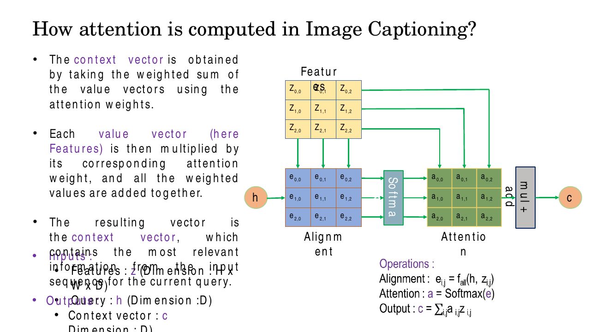
*Fig. — The three operations, in the order you must memorise them: alignment $e_{i,j} = f_{\text{att}}(\mathbf{h}, \mathbf{z}_{i,j})$ → attention $\mathbf{a} = \mathrm{softmax}(\mathbf{e})$ → output $\mathbf{c} = \sum_{i,j} a_{i,j}\mathbf{z}_{i,j}$. Every later box in this chapter is a relabelling of this picture. Slide 6.*

Notice what the grid is actually doing. Each cell plays **two** roles at once. It is compared against
the query (so it behaves like a *key*), and it is also what gets summed into the output (so it behaves
like a *value*). Hold that thought; undoing that coincidence is the whole content of slides 11–17.

### Step 1: forget the grid, keep the set

The grid structure was never used. The scores were computed cell by cell and the softmax ran over all
cells regardless of where they sat. So flatten it: replace the $H\times W$ grid with an unordered set
of $N$ input vectors stacked as a matrix $\mathbf{X}$ of shape $N \times D$. Keep one query vector
$\mathbf{h}$ of dimension $D$. The layer now reads:

$$e_i = f_{\text{att}}(\mathbf{h}, \mathbf{x}_i), \qquad \mathbf{a} = \mathrm{softmax}(\mathbf{e}), \qquad \mathbf{c} = \sum_i a_i \mathbf{x}_i$$

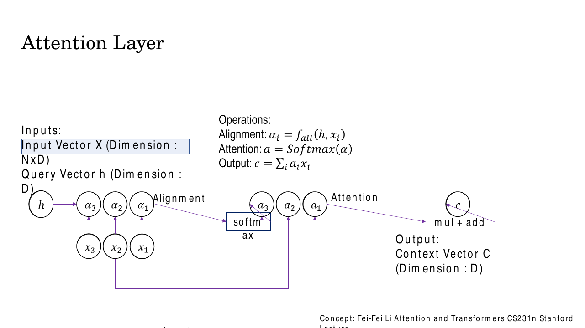
*Fig. — The same machine with the image thrown away. Inputs $\mathbf{X}$ ($N\times D$), query $\mathbf{h}$ ($D$), output context vector $\mathbf{c}$ ($D$). This is **attention as a general operation**: a lookup over a set of things, by similarity. Slide 7.*

This is the definition worth carrying out of the chapter: **attention is a soft lookup**. A Python
dictionary looks up one key exactly and returns one value. Attention compares a query against *every*
key, converts the comparisons into a probability distribution, and returns the correspondingly
weighted blend of *every* value. It is a dictionary with fractional retrieval.

### Step 2: make the scoring function a dot product

$f_{\text{att}}$ was a small MLP in the Bahdanau/additive formulation — a learned layer with its own
parameters, derived in [Lec 19](../week-05/19-gru-seq2seq-attention.md). The deck now simply replaces
it with a dot product:

$$e_i = \mathbf{h} \cdot \mathbf{x}_i$$

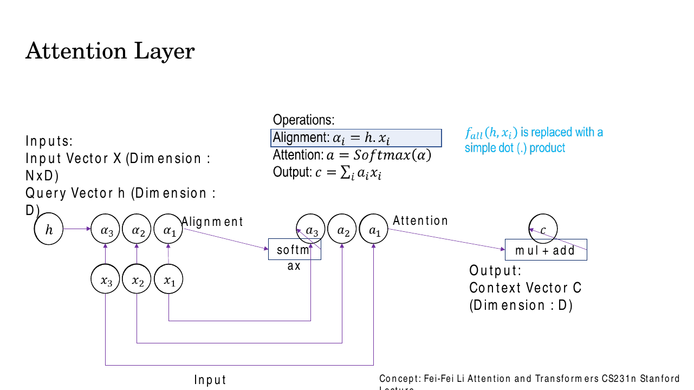
*Fig. — The single most consequential substitution in the course. The learned scoring MLP disappears and is replaced by an operation with **zero parameters** that a GPU can run as one matrix multiply. Slide 8.*

Why is this allowed? Because of [Lec 4](../week-01/04-linear-algebra.md): the dot product
$\mathbf{x}\cdot\mathbf{y} = \|\mathbf{x}\|\|\mathbf{y}\|\cos\theta$ *already is* a similarity measure.
Large positive means pointing the same way, zero means orthogonal, large negative means opposed. We do
not need to learn a similarity function if the vectors live in a space where geometric alignment
already means semantic relatedness — and we can simply *train the projections* so that it does. That
is the trade the transformer makes, and it is why attention is cheap.

| | Additive (Bahdanau) | Dot-product |
|---|---|---|
| Score | $\mathbf{w}^\top\tanh(\mathbf{W}_1\mathbf{h}+\mathbf{W}_2\mathbf{x}_i)$ | $\mathbf{h}\cdot\mathbf{x}_i$ |
| Parameters in the scorer | yes ($\mathbf{W}_1,\mathbf{W}_2,\mathbf{w}$) | **none** |
| Requires equal dims? | no | yes |
| Cost for $N$ items | $N$ small MLP passes | **one** matrix multiply |
| Owner | [Lec 19](../week-05/19-gru-seq2seq-attention.md) | this chapter |

Additive attention is slightly more accurate at small dimension; dot-product attention is far faster
because it is a single BLAS call. At scale, speed wins.

### Step 3: divide by $\sqrt{d_k}$ — the course's most examinable detail

Making the scorer a dot product introduces a problem that the deck devotes a whole slide to. Write the
score as a sum over $d_k$ terms:

$$e = \mathbf{q}\cdot\mathbf{k} = \sum_{m=1}^{d_k} q_m k_m$$

Suppose, as is roughly true after standard initialisation, that the components $q_m$ and $k_m$ are
independent with mean 0 and variance 1. Then each product term has mean $\mathbb{E}[q_m k_m] = 0$ and
variance $\mathrm{Var}(q_m k_m) = \mathbb{E}[q_m^2]\mathbb{E}[k_m^2] = 1$. Variances of independent
terms add, so

$$\mathbb{E}[e] = 0, \qquad \mathrm{Var}(e) = d_k, \qquad \text{standard deviation} = \sqrt{d_k}$$

**The typical magnitude of a raw score grows like $\sqrt{d_k}$.** At $d_k = 512$ a perfectly ordinary
score is around $\pm 22.6$. Feed scores of that size into a softmax and $e^{22.6} \approx 6.7\times10^9$
swamps everything else: one position receives essentially all the weight and the rest receive numbers
like $10^{-10}$. That is a **saturated** softmax, and saturation is fatal for learning, because the
softmax Jacobian $\partial a_i/\partial e_j = a_i(\delta_{ij} - a_j)$ is proportional to
$a_i(1-a_i)$, which collapses to zero when $a_i \to 1$. No gradient flows back to the projections, and
the layer stops learning. (The softmax itself, including its derivative and the numerically stable
max-shift, is [Lec 8](../week-02/08-mlp-and-activations.md)'s.)

The fix is to cancel the growth exactly. Dividing by $\sqrt{d_k}$ gives

$$\mathrm{Var}\!\left(\frac{e}{\sqrt{d_k}}\right) = \frac{\mathrm{Var}(e)}{d_k} = \frac{d_k}{d_k} = 1$$

so the scaled scores have unit variance **whatever $d_k$ is**, and the softmax stays in its responsive
region. Numerical N3 does this with actual numbers for $d_k = 4, 64, 512$; it is the single most
likely numerical on this topic.

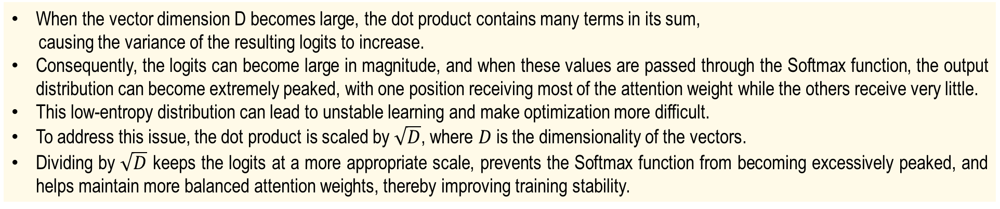
*Fig. — The deck's own statement of the argument. Note the chain it asserts: many terms → high variance → large logits → peaked (low-entropy) softmax → unstable optimisation. Quote this chain back on a short-answer question. Slide 9. (The deck writes $D$ where this book writes $d_k$.)*

### Step 4: many queries at once, so the whole layer is two matrix multiplies

So far there is one query. But in a sentence of $M$ tokens, *every* token wants its own context. So
stack the queries into a matrix $\mathbf{Q}$ of shape $M \times d_k$. Nothing changes conceptually;
each query independently scores all $N$ inputs. What changes is that the scores are now a **matrix**:

$$e_{ij} = \frac{\mathbf{q}_i \cdot \mathbf{k}_j}{\sqrt{d_k}} \quad \Longleftrightarrow \quad \mathbf{E} = \frac{\mathbf{Q}\mathbf{K}^\top}{\sqrt{d_k}}$$

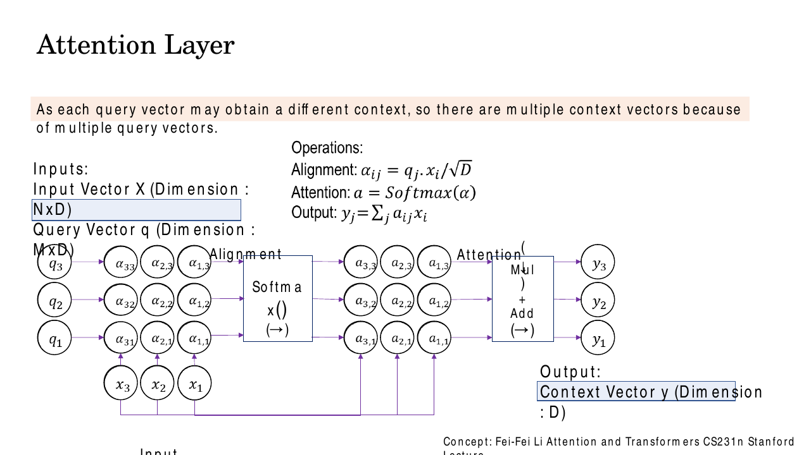
*Fig. — "As each query vector may obtain a different context, there are multiple context vectors because of multiple query vectors." The scores become a full $M\times N$ grid, and the softmax runs **along one axis only** — over the keys, separately for each query. Slide 10.*

That softmax axis is worth dwelling on. $\mathbf{Q}\mathbf{K}^\top$ is an $M\times N$ matrix in which
row $i$ holds the dot products of query $i$ against *all* keys — exactly the grid of similarities
[Lec 4](../week-01/04-linear-algebra.md) promised you. Softmax is applied **row-wise**, so each row
becomes a probability distribution summing to 1 over the keys. Multiply by $\mathbf{V}$ ($N \times
d_v$) and row $i$ of the result is the weighted blend of value vectors that query $i$ asked for. The
whole layer collapses to:

$$\boxed{\ \mathrm{Attention}(\mathbf{Q},\mathbf{K},\mathbf{V}) = \mathrm{softmax}\!\left(\frac{\mathbf{Q}\mathbf{K}^\top}{\sqrt{d_k}}\right)\mathbf{V}\ }$$

Shapes, which an exam will test directly: $[M\times d_k]\cdot[d_k\times N] = [M\times N]$, softmax
preserves shape, then $[M\times N]\cdot[N\times d_v] = [M\times d_v]$. **The output has the shape of
the values, not the keys.**

### Step 5: three roles, three projections — Query, Key, Value

Back to the coincidence from the captioning case: the same vector $\mathbf{x}_i$ was used both for
scoring and for summing. The deck's slide 11 is explicit that this is a *limitation*, and the fix is
the conceptual heart of the lecture.

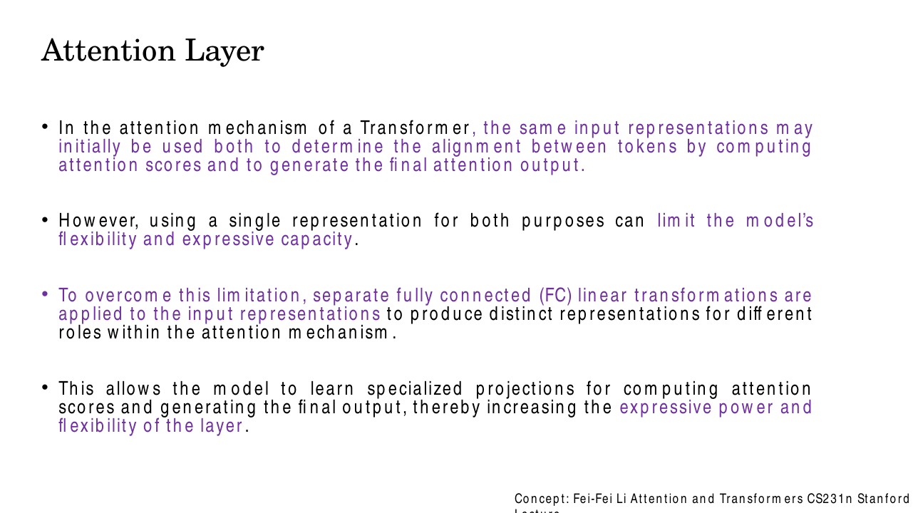
*Fig. — Read the second bullet twice. One representation serving two purposes is a constraint, not an economy: whatever makes a token easy to **find** need not be what you want to **retrieve** from it. Slide 11.*

So apply three different learned linear layers to the same input $\mathbf{x}$:

$$\mathbf{q} = \mathbf{x}\mathbf{W}^Q, \qquad \mathbf{k} = \mathbf{x}\mathbf{W}^K, \qquad \mathbf{v} = \mathbf{x}\mathbf{W}^V$$

Three roles, in plain words:

| Role | Shape of its matrix | The question it answers |
|---|---|---|
| **Query** $\mathbf{q}$ | $d_{\text{model}} \times d_k$ | *What am I looking for?* |
| **Key** $\mathbf{k}$ | $d_{\text{model}} \times d_k$ | *What do I advertise about myself?* |
| **Value** $\mathbf{v}$ | $d_{\text{model}} \times d_v$ | *What do I actually hand over if selected?* |

The library analogy is exact. The query is your search phrase; the key is the title on a book's spine,
short and designed to be matched against; the value is the book's contents, what you actually take
away. Nobody would insist that a spine and its contents be the same text. Three roles, three encodings.

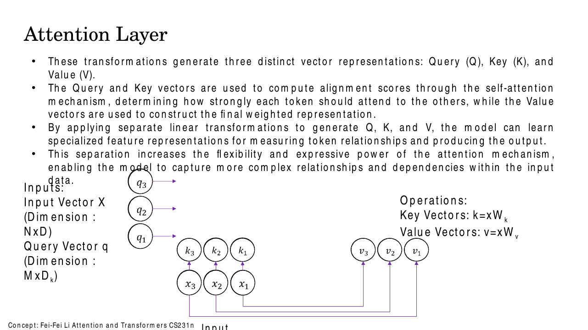
*Fig. — The deck introduces $\mathbf{W}^K$ and $\mathbf{W}^V$ first, while the query still arrives from outside. Each $\mathbf{x}_i$ now spawns two different vectors. Slide 13.*

Two consequences, both examinable:

- **$\mathbf{W}^Q$ and $\mathbf{W}^K$ must share the output dimension $d_k$**, because $\mathbf{q}$ and
  $\mathbf{k}$ get dotted together. $\mathbf{W}^V$ is free to use a different $d_v$, and then the
  layer's output dimension is $d_v$ — the deck makes this point twice (slides 14 and 16): the layer is
  no longer tied to its input dimensionality.
- The projections are **where all the learning happens**. Scaled dot-product attention itself has zero
  parameters. Every parameter in an attention layer lives in $\mathbf{W}^Q, \mathbf{W}^K, \mathbf{W}^V$
  (and $\mathbf{W}^O$, below). Training does not learn *how to compare*; it learns *what to compare*.

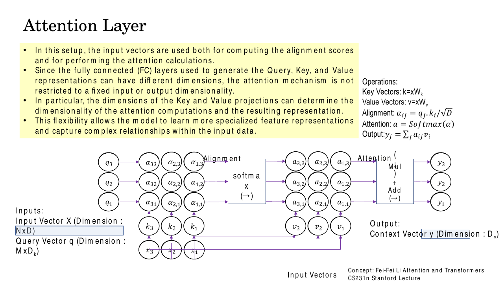
*Fig. — The complete general attention layer. Operations panel, right: $\mathbf{k}=\mathbf{x}\mathbf{W}^K$, $\mathbf{v}=\mathbf{x}\mathbf{W}^V$, $\alpha_{ij} = \mathbf{q}_j\!\cdot\!\mathbf{k}_i/\sqrt{D}$, $\mathbf{a}=\mathrm{softmax}(\alpha)$, $\mathbf{y}_j = \sum_i a_{ij}\mathbf{v}_i$. Slide 14.*

> **Deck notation warning.** The deck writes $\alpha_{ij} = \mathbf{q}_j \cdot \mathbf{k}_i/\sqrt{D}$ —
> the **first** index runs over keys and the **second** over queries, the transpose of the convention
> everywhere else (including this book, where row = query). It also prints the output as
> $y_j = \sum_j a_{ij}v_i$, reusing $j$ as both the free index and the summation index; the correct
> statement is $\mathbf{y}_j = \sum_i a_{ij}\mathbf{v}_i$. Both are typographical, not conceptual.

### Self-attention: the queries come from the inputs too

One thing still arrives from outside: the queries. Slide 20 deletes that input — literally, by striking
it through — and generates the queries from the same $\mathbf{X}$ with a third projection
$\mathbf{W}^Q$.

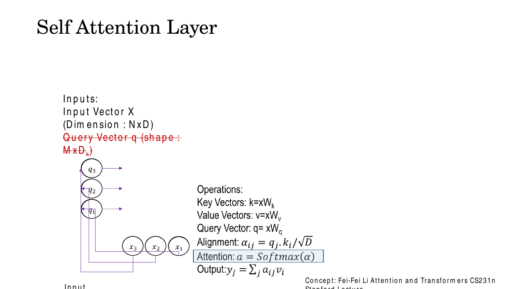
*Fig. — The red strike-through is the definition of self-attention: there is no external query any more. The layer's only input is $\mathbf{X}$. Slide 20.*

**Self-attention** is attention in which $\mathbf{Q}$, $\mathbf{K}$ and $\mathbf{V}$ are all computed
from the *same* input sequence:

$$\mathbf{Q} = \mathbf{X}\mathbf{W}^Q, \quad \mathbf{K} = \mathbf{X}\mathbf{W}^K, \quad \mathbf{V} = \mathbf{X}\mathbf{W}^V, \qquad \mathbf{Y} = \mathrm{softmax}\!\left(\frac{\mathbf{Q}\mathbf{K}^\top}{\sqrt{d_k}}\right)\mathbf{V}$$

Now $M = N$: the score matrix is square, $N\times N$, and every position attends to every position
**including itself** (the diagonal entry $e_{ii}$ is a real score competing with the others, not a
special case). The output $\mathbf{y}_i$ is a context-aware re-encoding of token $i$ — the same token,
rewritten in light of the whole sequence.

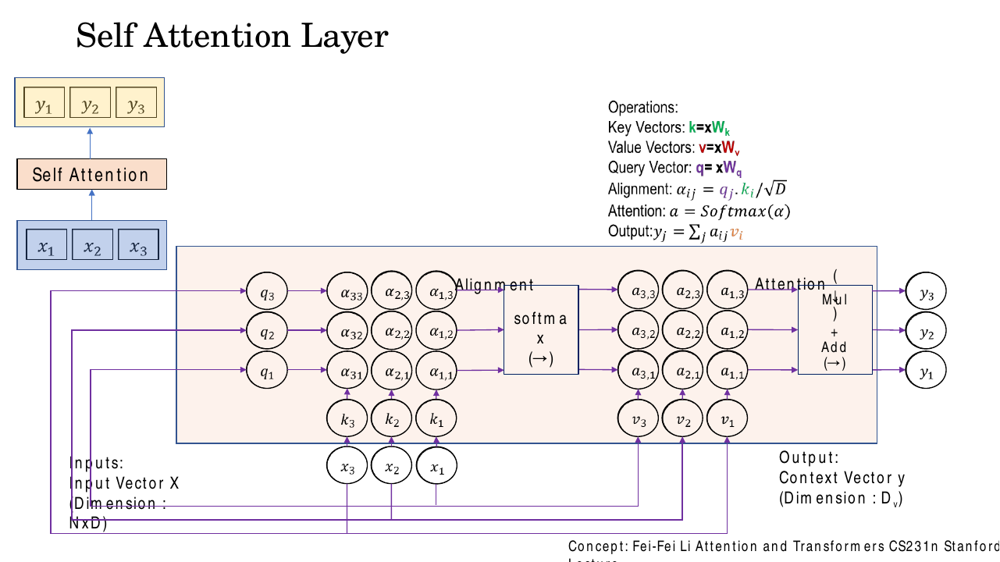
*Fig. — Top left is the abstraction you should carry forward: **sequence in, sequence out, same length**. Everything inside the pink box is the machinery you just built. Slide 22.*

The contrast the deck draws on slide 18 is the examinable one:

| | Where $\mathbf{Q}$ comes from | Where $\mathbf{K},\mathbf{V}$ come from | Example |
|---|---|---|---|
| **Self-attention** | sequence A | sequence A | encoder layers; GPT's decoder |
| **Cross-attention** | sequence A (e.g. decoder) | sequence B (e.g. encoder) | translation; captioning (Lec 24) |

**Cross-attention** — the general case where the queries and the keys/values come from different
sequences — is named here and handed in full to
[Lec 27](27-decoder-and-full-transformer.md). Note the logical direction: self-attention is the
*special case*, not the general one. Lec 24's captioning attention was already cross-attention, with
$\mathbf{Q}$ from the decoder state and $\mathbf{K},\mathbf{V}$ from the CNN grid.

### Masked self-attention: enforcing causality with $-\infty$

Self-attention lets position 2 read position 5. For an encoder that is exactly what you want. For a
**generator** it is cheating: if you are training a model to predict token $t+1$ from tokens
$1 \ldots t$, and the layer can see token $t+1$, it will learn to copy the answer and will fail
completely at generation time, when the future genuinely does not exist.

The fix is to kill the forbidden scores before the softmax:

$$e_{ij}^{\text{masked}} = \begin{cases} \dfrac{\mathbf{q}_i\cdot\mathbf{k}_j}{\sqrt{d_k}} & j \le i \\ -\infty & j > i \end{cases}$$

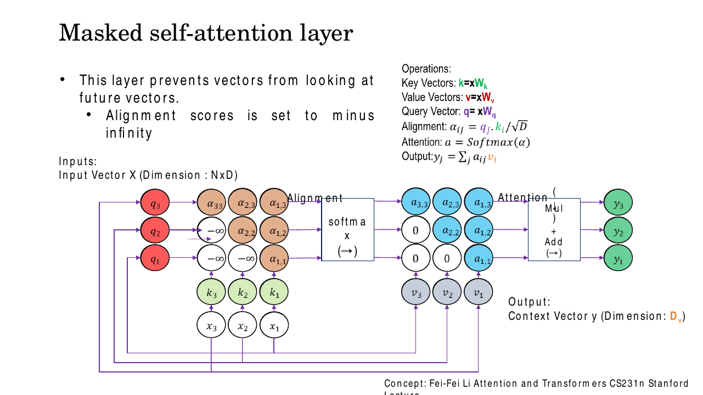
*Fig. — Follow one row. Query $q_1$ has $-\infty$ against $k_2$ and $k_3$; after the softmax those two cells read exactly **0**, so $y_1$ depends on $v_1$ alone. The triangular structure of the weight matrix is the autoregressive property made visible. Slide 24.*

**Why $-\infty$ and not $0$?** Because the mask is applied *before* the softmax, to the scores, not
after it, to the weights. A score of 0 is not "no attention" — it is a perfectly ordinary score, and
$e^0 = 1$ gives the masked position a healthy share of the weight. The number whose exponential is zero
is $-\infty$: $e^{-\infty} = 0$, so the position contributes nothing to the numerator *and* nothing to
the denominator, and the remaining weights still sum to exactly 1. Masking after the softmax instead
would zero the weights but leave the row summing to less than 1 — you would have to renormalise by
hand, and the gradients would be wrong. In code the $-\infty$ is usually a large finite negative number
such as $-10^9$, which is numerically identical after exponentiation.

You have met this idea before in a different costume: [Lec 23](../week-06/23-autoregressive-pixelrnn-pixelcnn.md)'s
**masked convolution** zeroes the kernel weights over not-yet-generated pixels for exactly the same
reason. Masked attention is the sequence version of the same autoregressive discipline.

### Multi-head self-attention: several relations at once

One attention layer produces one weight distribution per query. That forces every kind of relationship
in a sentence to be squeezed into a single ranking. The deck's example makes the problem concrete:

> "The cat sat on the mat because **it** was tired."

To resolve "it", a model must link it to "cat" — a coreference relation. But simultaneously it should
track that "sat" is the verb whose subject is "cat", that "mat" is nearby and positionally relevant,
and that "tired" is semantically associated with an animate thing. One softmax distribution cannot
express all four rankings at once: attention weights are a zero-sum budget summing to 1, so putting
weight on "cat" necessarily takes it away from "sat".

The answer is to run $h$ attention layers in parallel — **heads** — each with its own
$\mathbf{W}^Q_i, \mathbf{W}^K_i, \mathbf{W}^V_i$, and let them specialise. The deck's slide 27 lists
exactly the specialisations observed in practice: head 1 grammatical ("it" → "cat"), head 2 positional
(nearby words), head 3 semantic ("tired" ↔ "cat"), head 4 verb–subject.

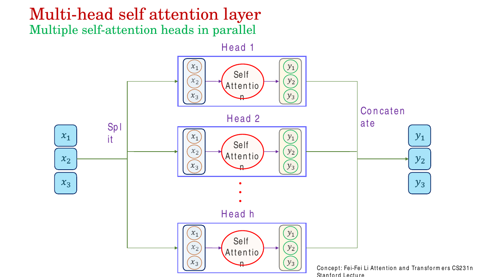
*Fig. — Split → $h$ independent self-attention heads in parallel → concatenate. The heads never talk to each other; the only mixing happens in the output projection that follows the concatenation. Slide 28.*

$$\mathrm{head}_i = \mathrm{Attention}(\mathbf{X}\mathbf{W}^Q_i,\ \mathbf{X}\mathbf{W}^K_i,\ \mathbf{X}\mathbf{W}^V_i)$$
$$\mathrm{MultiHead}(\mathbf{X}) = \mathrm{Concat}(\mathrm{head}_1,\dots,\mathrm{head}_h)\,\mathbf{W}^O$$

**The dimensional bookkeeping is the part exams test.** Heads do not each use the full width. With
$d_{\text{model}} = 512$ and $h = 8$ the standard choice is

$$d_k = d_v = \frac{d_{\text{model}}}{h} = \frac{512}{8} = 64$$

Each head therefore projects $512 \to 64$, attends in a 64-dimensional space, and emits a
64-dimensional vector per token. Concatenating 8 of those gives $8 \times 64 = 512$ again, so
$\mathbf{W}^O$ is $512\times512$ and the layer's output width matches its input width — which is what
lets you stack these layers. Because the per-head width shrinks by exactly the factor $h$, **the total
cost of $h$ heads is about the same as one head of full width**: you buy diversity for free. Full
arithmetic in numerical N4.

$\mathbf{W}^O$ is not decoration. Without it the output would be $h$ independent blocks bolted
together with no channel allowed to mix information across heads; $\mathbf{W}^O$ is the learned linear
layer that fuses the heads' findings into one representation.

### What self-attention cannot do: order

Look hard at $\mathrm{softmax}(\mathbf{Q}\mathbf{K}^\top/\sqrt{d_k})\mathbf{V}$ and ask where position
enters. It does not. Permute the rows of $\mathbf{X}$ and every score $\mathbf{q}_i\cdot\mathbf{k}_j$
is unchanged — it is a dot product between two token representations, with no reference to $i$ or $j$
as numbers. The output rows are permuted identically, and nothing else changes. Formally, for any
permutation matrix $\mathbf{P}$,

$$\mathrm{SelfAttn}(\mathbf{P}\mathbf{X}) = \mathbf{P}\cdot\mathrm{SelfAttn}(\mathbf{X})$$

Self-attention is **permutation-equivariant**, and as a set function **permutation-invariant**:
"the cat ate the fish" and "the fish ate the cat" produce identical sets of output vectors. An RNN
could never have this problem, because its recurrence is sequential by construction; a CNN could never
have it, because its kernels are spatially indexed. Attention buys parallelism and unlimited range and
pays for it with total blindness to order.

The remedy is to inject position into the token representations *before* they reach the layer, which
is **positional encoding** — the opening subject of
[Lec 26](26-encoder-and-positional-encoding.md). State the problem here; the solution is Lec 26's.
Likewise the surrounding furniture of a real transformer block — residual connections, Add & Norm,
layer normalisation, the position-wise feed-forward network — is all Lec 26's. This chapter ends at
the attention layer's boundary.

## Worked numericals

### N1. A complete self-attention forward pass, 3 tokens, $d_k = d_v = 2$
**Given:** three token embeddings of width $d_{\text{model}} = 3$, stacked as $\mathbf{X}$, and three
projection matrices:

$$\mathbf{X} = \begin{bmatrix}1&0&1\\1&0&0\\0&1&0\end{bmatrix},\quad
\mathbf{W}^Q = \begin{bmatrix}1&1\\2&0\\0&1\end{bmatrix},\quad
\mathbf{W}^K = \begin{bmatrix}1&0\\0&1\\0&1\end{bmatrix},\quad
\mathbf{W}^V = \begin{bmatrix}1&0\\0&1\\1&1\end{bmatrix}$$

**Find:** $\mathbf{Q},\mathbf{K},\mathbf{V}$, the scaled score matrix, the attention weights, and the
output $\mathbf{Y}$.

1. **Project.** $\mathbf{Q} = \mathbf{X}\mathbf{W}^Q$. Row 1: $\mathbf{x}_1 = [1,0,1]$ picks rows 1 and
   3 of $\mathbf{W}^Q$: $[1,1]+[0,1] = [1,2]$. Row 2: $[1,0,0]$ picks row 1: $[1,1]$. Row 3: $[0,1,0]$
   picks row 2: $[2,0]$.
   $$\mathbf{Q} = \begin{bmatrix}1&2\\1&1\\2&0\end{bmatrix}$$
2. Same arithmetic for the other two:
   $$\mathbf{K} = \mathbf{X}\mathbf{W}^K = \begin{bmatrix}1&1\\1&0\\0&1\end{bmatrix}, \qquad
   \mathbf{V} = \mathbf{X}\mathbf{W}^V = \begin{bmatrix}2&1\\1&0\\0&1\end{bmatrix}$$
   (Check row 1 of $\mathbf{V}$: row 1 + row 3 of $\mathbf{W}^V = [1,0]+[1,1] = [2,1]$. ✓)
3. **Raw scores** $\mathbf{Q}\mathbf{K}^\top$, entry $(i,j) = \mathbf{q}_i\cdot\mathbf{k}_j$:
   $\mathbf{q}_1\!\cdot\!\mathbf{k}_1 = (1)(1)+(2)(1) = 3$; $\mathbf{q}_1\!\cdot\!\mathbf{k}_2 = (1)(1)+(2)(0) = 1$;
   $\mathbf{q}_1\!\cdot\!\mathbf{k}_3 = (1)(0)+(2)(1) = 2$;
   $\mathbf{q}_2\!\cdot\!\mathbf{k}_{1,2,3} = 2, 1, 1$; $\mathbf{q}_3\!\cdot\!\mathbf{k}_{1,2,3} = 2, 2, 0$.
   $$\mathbf{Q}\mathbf{K}^\top = \begin{bmatrix}3&1&2\\2&1&1\\2&2&0\end{bmatrix}$$
4. **Scale** by $\sqrt{d_k} = \sqrt{2} = 1.4142$:
   $$\frac{\mathbf{Q}\mathbf{K}^\top}{\sqrt 2} = \begin{bmatrix}2.1213&0.7071&1.4142\\1.4142&0.7071&0.7071\\1.4142&1.4142&0\end{bmatrix}$$
5. **Softmax row 1.** Exponentials: $e^{2.1213} = 8.3421$, $e^{0.7071} = 2.0281$, $e^{1.4142} = 4.1133$.
   Sum $= 8.3421+2.0281+4.1133 = 14.4835$. Weights: $8.3421/14.4835 = 0.5760$,
   $2.0281/14.4835 = 0.1400$, $4.1133/14.4835 = 0.2840$. (Sum $= 1.0000$ ✓.)
6. **Softmax row 2.** $e^{1.4142}=4.1133$, $e^{0.7071}=2.0281$, $e^{0.7071}=2.0281$; sum $= 8.1695$.
   Weights $= 0.5035,\ 0.2483,\ 0.2483$.
7. **Softmax row 3.** $4.1133,\ 4.1133,\ e^0 = 1$; sum $= 9.2265$. Weights $= 0.4458,\ 0.4458,\ 0.1084$.
   $$\mathbf{A} = \begin{bmatrix}0.5760&0.1400&0.2840\\0.5035&0.2483&0.2483\\0.4458&0.4458&0.1084\end{bmatrix}$$
8. **Multiply by $\mathbf{V}$.** Row 1:
   $0.5760[2,1] + 0.1400[1,0] + 0.2840[0,1] = [1.1520+0.1400+0,\ 0.5760+0+0.2840] = [1.2920, 0.8600]$.
9. Row 2: $0.5035[2,1]+0.2483[1,0]+0.2483[0,1] = [1.0070+0.2483,\ 0.5035+0.2483] = [1.2553, 0.7518]$.
10. Row 3: $0.4458[2,1]+0.4458[1,0]+0.1084[0,1] = [0.8916+0.4458,\ 0.4458+0.1084] = [1.3374, 0.5542]$.

**Answer:** $\mathbf{Y} = \begin{bmatrix}1.2920&0.8600\\1.2553&0.7518\\1.3374&0.5542\end{bmatrix}$,
shape $3\times d_v = 3\times2$. Token 1 attends 57.6 % to itself because its query $[1,2]$ aligns best
with its own key $[1,1]$ (score 3, the largest in the matrix).

### N2. The same sequence with a causal mask
**Given:** the scaled score matrix from N1 step 4, and a causal mask forbidding $j > i$.
**Find:** the masked attention weights and output.

1. Set every entry above the diagonal to $-\infty$:
   $$\mathbf{E}^{\text{masked}} = \begin{bmatrix}2.1213&-\infty&-\infty\\1.4142&0.7071&-\infty\\1.4142&1.4142&0\end{bmatrix}$$
2. **Row 1.** $e^{2.1213} = 8.3421$, $e^{-\infty} = 0$, $e^{-\infty} = 0$. Sum $= 8.3421$.
   Weights $= [1, 0, 0]$. A single visible key always gets weight exactly 1.
3. **Row 2.** $e^{1.4142} = 4.1133$, $e^{0.7071} = 2.0281$, $0$. Sum $= 6.1414$.
   Weights $= 4.1133/6.1414 = 0.6698$ and $2.0281/6.1414 = 0.3302$, then $0$.
4. **Row 3.** Nothing is masked (position 3 may see all of 1, 2, 3), so the row is unchanged from N1:
   $[0.4458, 0.4458, 0.1084]$.
   $$\mathbf{A}^{\text{masked}} = \begin{bmatrix}1.0000&0&0\\0.6698&0.3302&0\\0.4458&0.4458&0.1084\end{bmatrix}$$
   — **lower triangular**, every row still summing to 1.
5. Outputs. Row 1: $1.0\,[2,1] = [2.0000, 1.0000]$ — identical to $\mathbf{v}_1$.
6. Row 2: $0.6698[2,1]+0.3302[1,0] = [1.3396+0.3302,\ 0.6698] = [1.6698, 0.6698]$.
7. Row 3: unchanged from N1, $[1.3374, 0.5542]$.

**Answer:** $\mathbf{Y}^{\text{masked}} = \begin{bmatrix}2.0000&1.0000\\1.6698&0.6698\\1.3374&0.5542\end{bmatrix}$.
Compare row 1 with N1's $[1.2920, 0.8600]$: unmasked, token 1 leaked 42 % of its weight from the
future. Note also that row 2's surviving weights **re-normalised** from $0.5035 : 0.2483$ to
$0.6698 : 0.3302$ — the same ratio $2.0281/4.1133$, rescaled to sum to 1.

### N3. Why $\sqrt{d_k}$: scores, saturation and dead gradients at $d_k = 4, 64, 512$
**Given:** query and key components i.i.d. with mean 0, variance 1.
**Find:** the typical score magnitude and the softmax weights, with and without scaling, for three keys
whose scores are one standard deviation apart: $[+\sigma, 0, -\sigma]$.

1. $\mathrm{Var}(\mathbf{q}\cdot\mathbf{k}) = d_k$, so $\sigma = \sqrt{d_k}$:
   $\sqrt{4} = 2$, $\sqrt{64} = 8$, $\sqrt{512} = 22.63$.
2. **$d_k = 4$, unscaled**, scores $[2, 0, -2]$: $e^2 = 7.389,\ e^0 = 1,\ e^{-2} = 0.135$; sum $= 8.524$;
   weights $[0.8668, 0.1173, 0.0159]$. Peaked but alive.
3. **$d_k = 64$, unscaled**, scores $[8, 0, -8]$: $e^8 = 2980.96,\ 1,\ 3.35\times10^{-4}$;
   sum $= 2981.96$; weights $[0.99966,\ 3.35\times10^{-4},\ 1.1\times10^{-7}]$.
4. **$d_k = 512$, unscaled**, scores $[22.63, 0, -22.63]$: $e^{22.63} = 6.71\times10^{9}$;
   sum $\approx 6.71\times10^{9}$; weights $[1 - 1.5\times10^{-10},\ 1.5\times10^{-10},\ \approx 0]$.
   The softmax has become a hard argmax.
5. **The gradient consequence.** The softmax Jacobian's diagonal is $a_i(1-a_i)$:
   $d_k=4$: $0.8668 \times 0.1332 = 0.1155$. $d_k=64$: $3.35\times10^{-4}$.
   $d_k=512$: $1.5\times10^{-10}$. The usable gradient has fallen by nine orders of magnitude.
6. **Scaled**, divide every score by $\sqrt{d_k}$ and they become $[1, 0, -1]$ **for all three $d_k$**:
   $e^1 = 2.718,\ 1,\ e^{-1} = 0.368$; sum $= 4.086$; weights $[0.6652, 0.2447, 0.0900]$, with
   $a_1(1-a_1) = 0.2227$.

**Answer:** unscaled weights on the top key go $0.867 \to 0.99966 \to 1 - 1.5\times10^{-10}$ as $d_k$
grows $4 \to 64 \to 512$, and the gradient scale collapses from $0.116$ to $1.5\times10^{-10}$. With
the $1/\sqrt{d_k}$ scaling, all three give the identical healthy distribution
$[0.665, 0.245, 0.090]$ — the point of the division is that the layer's behaviour becomes
**independent of $d_k$**.

### N4. Multi-head bookkeeping and parameter count, $d_{\text{model}} = 512$, $h = 8$
**Given:** the standard base-transformer configuration.
**Find:** per-head dimensions, every matrix shape, and the total parameter count of the multi-head
self-attention sub-layer (ignore biases first, then include them).

1. Per-head width: $d_k = d_v = d_{\text{model}}/h = 512/8 = 64$.
2. Per head: $\mathbf{W}^Q_i, \mathbf{W}^K_i, \mathbf{W}^V_i$ are each $512 \times 64$.
   Parameters per head $= 3 \times 512 \times 64 = 98{,}304$.
3. Across $h = 8$ heads: $8 \times 98{,}304 = 786{,}432$. Equivalently, stack the heads' matrices
   side by side into three $512\times512$ matrices: $3 \times 512 \times 512 = 786{,}432$. ✓
   (This identity is why multi-head attention is implemented as one big matmul plus a reshape.)
4. Concatenation: $8$ heads $\times\ 64 = 512$, so $\mathbf{W}^O$ is $512 \times 512 = 262{,}144$.
5. Total $= 786{,}432 + 262{,}144 = 1{,}048{,}576 = 2^{20}$, i.e. $4 \times 512^2$.
6. With biases (one per output unit on each of the four projections):
   $+\,4 \times 512 = 2{,}048$, giving $1{,}050{,}624$.
7. **Compare one full-width head** ($d_k = d_v = 512$, $h=1$): $\mathbf{W}^Q,\mathbf{W}^K,\mathbf{W}^V,\mathbf{W}^O$
   are each $512\times512$, total $4\times512^2 = 1{,}048{,}576$ — *exactly the same*.

**Answer:** $d_k = d_v = 64$; three $512\times512$ stacked projections plus one $512\times512$ output
projection; $\mathbf{1{,}048{,}576}$ parameters (1.05 M with biases). Multi-head attention costs the
same as single-head attention of the same model width — the heads partition the width rather than
multiplying it.

### N5. Self-attention vs recurrence: $O(n^2 d)$ against $O(n d^2)$
**Given:** sequence length $n$, representation width $d$.
**Find:** the dominant multiply-add count for each layer type and the crossover point.

1. **Self-attention.** $\mathbf{Q}\mathbf{K}^\top$ is $[n\times d]\cdot[d\times n]$: $n^2 d$
   multiply-adds. $\mathbf{A}\mathbf{V}$ is $[n\times n]\cdot[n\times d]$: another $n^2 d$.
   Total $\Theta(n^2 d)$, plus $4nd^2$ for the four projections.
2. **Recurrent layer.** $n$ time steps, each a $[1\times d]\cdot[d\times d]$ matrix–vector product:
   $n d^2$. Total $\Theta(n d^2)$.
3. **Crossover:** $n^2 d = n d^2 \iff n = d$. Self-attention is cheaper when $n < d$.
4. Concrete at $d = 512$:

   | $n$ | self-attention $n^2 d$ | recurrent $n d^2$ | cheaper |
   |---|---|---|---|
   | 64 | $2.10\times10^{6}$ | $1.68\times10^{7}$ | self-attention, $8\times$ |
   | 512 | $1.34\times10^{8}$ | $1.34\times10^{8}$ | tie — the crossover |
   | 4096 | $8.59\times10^{9}$ | $1.07\times10^{9}$ | recurrent, $8\times$ |

5. The FLOP count is not the whole story. The **sequential** operation count is $O(1)$ for
   self-attention (all positions computed in one parallel matmul) against $O(n)$ for recurrence, and
   the **maximum path length** between any two positions is $O(1)$ against $O(n)$ — which is why
   self-attention has no vanishing-gradient-over-time problem
   ([Lec 17](../week-05/17-bptt.md)).

**Answer:** self-attention is $\Theta(n^2d)$ per layer, recurrence is $\Theta(nd^2)$; they cross at
$n = d$. For typical $d = 512$ and sentence lengths well under 512 tokens, self-attention is both
cheaper *and* fully parallel. Its $n^2$ term is what makes very long sequences (and high-resolution
images, [Lec 28](../week-08/28-vit-detr-swin.md)) expensive.

## Code

```python
import numpy as np

def softmax(s, axis=-1):
    s = s - s.max(axis=axis, keepdims=True)      # Lec 8's stability shift
    e = np.exp(s)
    return e / e.sum(axis=axis, keepdims=True)

def scaled_dot_product_attention(Q, K, V, mask=None):
    """softmax(QK^T / sqrt(d_k)) V, with an optional boolean mask (True = forbidden)."""
    d_k = Q.shape[-1]
    scores = Q @ K.swapaxes(-1, -2) / np.sqrt(d_k)   # [.., M, N] grid of similarities
    if mask is not None:
        scores = np.where(mask, -np.inf, scores)     # BEFORE the softmax, so e^-inf = 0
    A = softmax(scores)                              # row-wise: each row sums to 1
    return A @ V, A

# ---- exactly the N1 inputs -------------------------------------------------
X  = np.array([[1., 0., 1.], [1., 0., 0.], [0., 1., 0.]])   # 3 tokens, d_model = 3
WQ = np.array([[1., 1.], [2., 0.], [0., 1.]])               # d_model x d_k
WK = np.array([[1., 0.], [0., 1.], [0., 1.]])
WV = np.array([[1., 0.], [0., 1.], [1., 1.]])

Q, K, V = X @ WQ, X @ WK, X @ WV                   # the three roles, one input
print("Q =", Q.tolist())        # Q = [[1.0, 2.0], [1.0, 1.0], [2.0, 0.0]]
print("QK^T =", (Q @ K.T).tolist())
# QK^T = [[3.0, 1.0, 2.0], [2.0, 1.0, 1.0], [2.0, 2.0, 0.0]]

Y, A = scaled_dot_product_attention(Q, K, V)
print(np.round(A, 4)); print("row sums:", A.sum(1)); print(np.round(Y, 4))
# [[0.576  0.14   0.284 ]
#  [0.5035 0.2483 0.2483]
#  [0.4458 0.4458 0.1084]]
# row sums: [1. 1. 1.]
# [[1.292  0.86  ]
#  [1.2552 0.7517]
#  [1.3374 0.5542]]

# ---- the masked (causal) variant ------------------------------------------
n = X.shape[0]
causal = np.triu(np.ones((n, n), dtype=bool), k=1)   # True strictly above diagonal
Ym, Am = scaled_dot_product_attention(Q, K, V, mask=causal)
print(np.round(Am, 4)); print(np.round(Ym, 4))
# [[1.     0.     0.    ]      <- lower triangular, rows still sum to 1
#  [0.6698 0.3302 0.    ]
#  [0.4458 0.4458 0.1084]]
# [[2.     1.    ]
#  [1.6698 0.6698]
#  [1.3374 0.5542]]

# ---- multi-head wrapper: one big matmul + a reshape ------------------------
def multi_head(X, WQ, WK, WV, WO, h):
    n = X.shape[0]
    Q, K, V = X @ WQ, X @ WK, X @ WV               # all [n, d_model]
    d_k = Q.shape[1] // h                          # 512 // 8 = 64
    split = lambda M: M.reshape(n, h, d_k).transpose(1, 0, 2)   # [h, n, d_k]
    heads, _ = scaled_dot_product_attention(split(Q), split(K), split(V))
    return heads.transpose(1, 0, 2).reshape(n, h * d_k) @ WO    # concat, then W^O

rng = np.random.default_rng(0)
d_model, h, n = 512, 8, 10
Xb = rng.normal(size=(n, d_model))
Ws = [rng.normal(scale=0.02, size=(d_model, d_model)) for _ in range(4)]
print("output shape:", multi_head(Xb, *Ws, h).shape,
      "| per-head d_k:", d_model // h,
      "| params:", 4 * d_model * d_model)
# output shape: (10, 512) | per-head d_k: 64 | params: 1048576
```

Three things to notice. The masking is one line and happens *before* `softmax`. The multi-head version
never builds eight separate weight matrices — it builds four $512\times512$ ones and `reshape`s, which
is why N4's two parameter counts agree. And `scaled_dot_product_attention` is written once and called
for both cases, because single-head and multi-head are the same function at different shapes.

## Exam pack

### Must-memorise

| Item | Exactly this |
|---|---|
| Scaled dot-product attention | $\mathrm{Attention}(\mathbf{Q},\mathbf{K},\mathbf{V}) = \mathrm{softmax}\!\left(\dfrac{\mathbf{Q}\mathbf{K}^\top}{\sqrt{d_k}}\right)\mathbf{V}$ |
| The three projections | $\mathbf{Q}=\mathbf{X}\mathbf{W}^Q$, $\mathbf{K}=\mathbf{X}\mathbf{W}^K$, $\mathbf{V}=\mathbf{X}\mathbf{W}^V$ |
| Role of each | Q = what I seek · K = what I advertise · V = what I hand over |
| Why $\sqrt{d_k}$ | $\mathrm{Var}(\mathbf{q}\!\cdot\!\mathbf{k}) = d_k$ for unit-variance components; dividing by $\sqrt{d_k}$ restores unit variance and stops softmax saturation |
| Shapes | $[M\times d_k][d_k\times N]\to[M\times N]$, then $[M\times N][N\times d_v]\to[M\times d_v]$ |
| Softmax axis | row-wise, over the **keys**; each row sums to 1 |
| Self-attention | $\mathbf{Q},\mathbf{K},\mathbf{V}$ all from the **same** sequence; score matrix is $N\times N$ |
| Cross-attention | $\mathbf{Q}$ from one sequence, $\mathbf{K},\mathbf{V}$ from another ([Lec 27](27-decoder-and-full-transformer.md)) |
| Causal mask | $e_{ij} \leftarrow -\infty$ for $j>i$, applied **before** softmax, since $e^{-\infty}=0$ |
| Multi-head | $\mathrm{Concat}(\mathrm{head}_1,\dots,\mathrm{head}_h)\mathbf{W}^O$, $\ \mathrm{head}_i = \mathrm{Attention}(\mathbf{X}\mathbf{W}^Q_i,\mathbf{X}\mathbf{W}^K_i,\mathbf{X}\mathbf{W}^V_i)$ |
| Per-head width | $d_k = d_v = d_{\text{model}}/h$ |
| Permutation | self-attention is permutation-equivariant — **no notion of order** |
| Complexity | self-attention $\Theta(n^2 d)$ per layer, $O(1)$ sequential steps; recurrence $\Theta(n d^2)$, $O(n)$ sequential |

### Numbers worth knowing

| Quantity | Value |
|---|---|
| $d_{\text{model}}$ in the base transformer | 512 |
| $h$ (heads) in the base transformer | 8 |
| $d_k = d_v$ per head | $512/8 = 64$ |
| Shape of each $\mathbf{W}^Q_i,\mathbf{W}^K_i,\mathbf{W}^V_i$ | $512\times64$ |
| Shape of stacked $\mathbf{W}^Q$ and of $\mathbf{W}^O$ | $512\times512$ |
| Parameters in one multi-head self-attention sub-layer | $4\times512^2 = 1{,}048{,}576$ ($\approx$ 1.05 M with biases) |
| Scaling divisor | $\sqrt{d_k}$, e.g. $\sqrt{64} = 8$, $\sqrt{512} = 22.63$ |
| Typical raw score std dev at $d_k = 512$ | $\pm 22.6$ |
| Masked score value | $-\infty$ (in code, $\approx -10^9$) |
| Attention weight on a masked position | exactly 0 |
| Crossover of $n^2d$ and $nd^2$ | $n = d$ |
| Heads named on slide 27 | 4 (grammatical, positional, semantic, verb–subject) |
| Deck's example sentence | "The cat sat on the mat because it was tired." |

### Likely MCQ traps

- **"$\mathbf{Q}$, $\mathbf{K}$, $\mathbf{V}$ are three different inputs."** No — in self-attention
  they are three different *linear projections of the same input*. The difference lives entirely in
  $\mathbf{W}^Q, \mathbf{W}^K, \mathbf{W}^V$.
- **"Scale by $d_k$."** No — by $\sqrt{d_k}$. Dividing by $d_k$ would over-correct and shrink the
  variance to $1/d_k$. The standard deviation, not the variance, is what you are cancelling.
- **"We divide by $\sqrt{d_k}$ to keep numbers small / to avoid overflow."** Partly true but not the
  reason. The reason is **gradient**: a saturated softmax has Jacobian $a_i(1-a_i)\to 0$, so training
  stalls. Say "vanishing gradients through a peaked softmax", not "overflow".
- **"Mask by setting scores to 0."** No — to $-\infty$. $e^0 = 1$ leaves a masked position with real
  weight. The masking happens **before** the softmax, which is exactly why the value must be $-\infty$.
- **"Multi-head attention has $h$ times the parameters of single-head."** No — each head uses
  $d_{\text{model}}/h$ dimensions, so the totals match ($4d_{\text{model}}^2$ either way).
- **"Softmax is applied over the whole score matrix."** No — row-wise, per query. The matrix's rows
  sum to 1; its columns do not.
- **"Self-attention output has dimension $d_k$."** No — $d_v$. $d_k$ is fixed by needing
  $\mathbf{q}\cdot\mathbf{k}$ to be legal; $d_v$ is independent and sets the output width.
- **"Self-attention knows the word order."** No. It is permutation-equivariant; order must be injected
  by positional encoding ([Lec 26](26-encoder-and-positional-encoding.md)).
- **"Masked self-attention is used in the encoder."** No — in the **decoder** (GPT-style
  autoregressive generation). Encoders use unmasked self-attention and see the whole sequence.
- **"Each token attends to all tokens *except* itself."** No — including itself. In N1 token 1 gives
  itself the largest weight (0.576).
- **"Attention is $O(n)$ because it is one matrix multiply."** No — it is $O(n^2 d)$; one matrix
  multiply can still be quadratic in $n$.
- **Confusing $\mathbf{W}^O$ with $\mathbf{W}^V$.** $\mathbf{W}^V$ makes the values *before* attention;
  $\mathbf{W}^O$ mixes the concatenated heads *after*.

### Self-test

1. $\mathbf{Q}$ is $4\times 64$, $\mathbf{K}$ is $10\times64$, $\mathbf{V}$ is $10\times32$. What are
   the shapes of $\mathbf{Q}\mathbf{K}^\top$ and of the attention output?
2. Two keys give a query raw scores 6 and 2, with $d_k = 4$. Compute the two attention weights.
3. Why must $\mathbf{W}^Q$ and $\mathbf{W}^K$ produce the same dimension, while $\mathbf{W}^V$ need not?
4. State the variance argument for $\sqrt{d_k}$ in two sentences.
5. In masked self-attention, what is the attention weight of the *last* token on the *first* token —
   zero, or possibly non-zero?
6. $d_{\text{model}} = 768$, $h = 12$. Give $d_k$ and the total parameter count of the multi-head
   self-attention sub-layer, excluding biases.
7. You permute the input tokens of a self-attention layer. What happens to the output?
8. A sequence has $n = 1000$ and $d = 256$. Which is cheaper per layer, self-attention or a recurrent
   layer, and by what factor?
9. Why can't one attention head represent both "it → cat" and "sat → cat" at full strength?
10. In the captioning attention of Lec 24, which of Q, K, V came from the CNN and which from the
    decoder? Is that self- or cross-attention?

<details><summary>Answers</summary>

1. $\mathbf{Q}\mathbf{K}^\top$ is $4\times10$; the output is $4\times32$ ($M\times d_v$).
2. Scale: $6/\sqrt4 = 3$, $2/\sqrt4 = 1$. $e^3 = 20.086$, $e^1 = 2.718$; sum $= 22.804$. Weights
   $= 0.8808$ and $0.1192$.
3. Because $\mathbf{q}$ and $\mathbf{k}$ are dotted together, which requires equal length. $\mathbf{v}$
   is only ever summed with scalar weights, so its width $d_v$ is free and becomes the output width.
4. With unit-variance independent components, $\mathbf{q}\cdot\mathbf{k}$ is a sum of $d_k$
   unit-variance terms, so its variance is $d_k$ and its typical magnitude $\sqrt{d_k}$. Dividing by
   $\sqrt{d_k}$ restores unit variance, keeping the softmax out of its saturated, zero-gradient region.
5. Possibly non-zero — the last token may see everything before it. It is the *first* token that sees
   only itself (weight 1 on itself, 0 on all others).
6. $d_k = 768/12 = 64$. Parameters $= 4 \times 768^2 = 2{,}359{,}296$.
7. The output rows are permuted the same way and are otherwise identical — permutation-equivariance.
   The layer cannot tell the orders apart, which is why positional encoding is needed.
8. Self-attention $= n^2d = 1000^2\times256 = 2.56\times10^{8}$; recurrent $= nd^2 = 1000\times256^2
   = 6.55\times10^{7}$. The recurrent layer is cheaper, by the factor $n/d = 1000/256 = 3.9$. (Since
   $n > d$ here, we are past the crossover.)
9. Because the attention weights of one head are a single softmax distribution summing to 1 — a
   zero-sum budget. Giving "cat" more weight for the query "it" necessarily takes weight from other
   keys. Separate heads each get their own budget.
10. $\mathbf{K}$ and $\mathbf{V}$ came from the CNN feature grid, $\mathbf{Q}$ from the decoder hidden
    state. Different sources, so it is **cross-attention**.

</details>

## Beyond the slides

**Gap:** The deck never writes the compact matrix form
$\mathrm{softmax}(\mathbf{Q}\mathbf{K}^\top/\sqrt{d_k})\mathbf{V}$ — it only gives the element-wise
rules $\alpha_{ij} = \mathbf{q}_j\!\cdot\!\mathbf{k}_i/\sqrt{D}$ and $\mathbf{y}_j = \sum_i a_{ij}\mathbf{v}_i$.
**Why it matters:** The matrix form is the version every paper, every exam question and every library
uses, and it is the version that makes the shapes checkable. Learn it as the primary statement and the
element-wise rules as its expansion.

**Gap:** Permutation invariance is never mentioned, anywhere on the deck.
**Why it matters:** It is the entire motivation for positional encoding, which is the first topic of
[Lec 26](26-encoder-and-positional-encoding.md). Without knowing *why* positional encoding exists you
will memorise a sine formula with no hook to hang it on. State it as: self-attention sees a **set**,
not a sequence.

**Gap:** The deck gives no computational-complexity comparison against recurrence.
**Why it matters:** "Self-attention is $O(n^2d)$, recurrence is $O(nd^2)$, and self-attention needs
$O(1)$ sequential steps against $O(n)$" is the standard justification for the architecture and a
common short-answer question. It is also the reason Swin exists
([Lec 28](../week-08/28-vit-detr-swin.md)): images have huge $n$.

**Gap:** $\mathbf{W}^O$ appears on slide 27 only as "passed through a linear layer", with no symbol,
shape, or reason.
**Why it matters:** Without $\mathbf{W}^O$ the heads' outputs are never mixed, and the layer's output
width would be pinned to $h \cdot d_v$. It is a real, counted parameter block — a quarter of the
sub-layer's parameters in N4.

**Gap:** The deck does not say that the $-\infty$ is implemented as a large finite negative number.
**Why it matters:** A literal $-\infty$ in floating point produces `nan` if an entire row is masked,
and PyTorch's `masked_fill(mask, float('-inf'))` is a well-known source of that bug. In practice
$-10^9$ is used, and after exponentiation the two are indistinguishable.

## Cut from the slides

Dropped the title slide (1), the "Content" slide (2), the "Summary" slide (29, which repeats slide 2
verbatim) and the "Next: Transformers III" slide (30) — pure navigation. Slides 3–6 are a four-step
build-up animation of *one* captioning-attention diagram; since
[Lec 24](../week-06/24-captioning-and-spatial-attention.md) owns that material, they are compressed
into the single completed figure (slide 6) plus two sentences. Slides 7, 8 and 9 are likewise the same
diagram with one line added each time; all three are kept because each adds a genuinely new operation
(generalisation to a set, the dot-product substitution, the $\sqrt{D}$ scaling). Slide 12 is slide 10
redrawn with boxes around the input vectors and adds nothing, so it is dropped. Slides 15 and 16
restate slide 11's and 14's prose about Q/K/V projections nearly word for word under a new heading;
their content is merged into one section and only slide 11 is shown. Slide 17 adds only the green
reminder "recall that the query vector was a function of the input vectors,
$h_i = f^{i}_{\text{RNN}}(x_i, h_{i-1})$" — that bridge back to [Lec 19](../week-05/19-gru-seq2seq-attention.md)
is stated in prose instead of as a figure. Slides 19 and 21 are prose restatements of slides 18 and 20;
their substance is folded in. Slide 19's phrase "regardless of their distance in the image" is a
copy-paste slip in a text-sequence context — read it as "in the sequence". Nothing mathematical was
dropped: every equation that appears on any slide of this deck appears in this chapter.
