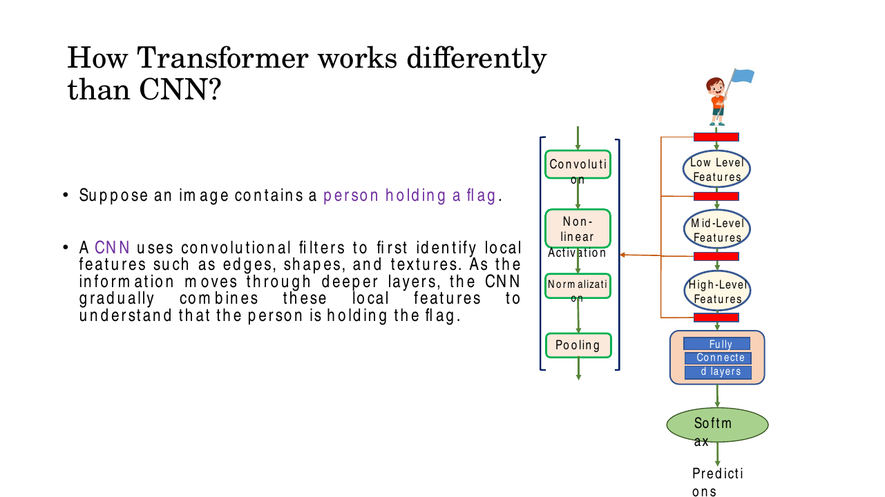
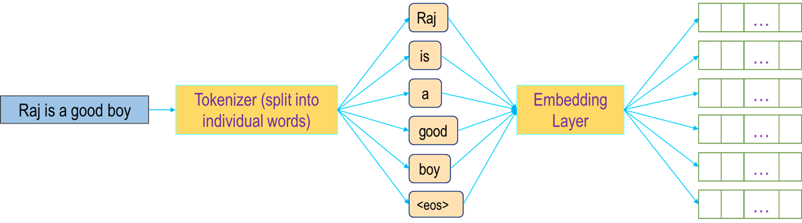
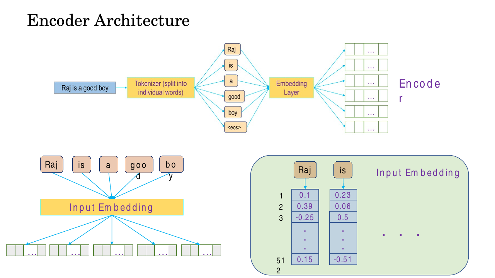
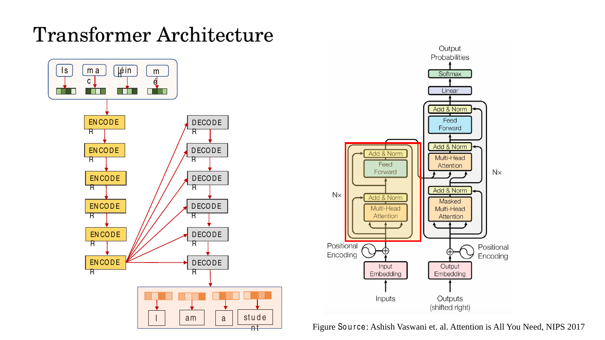
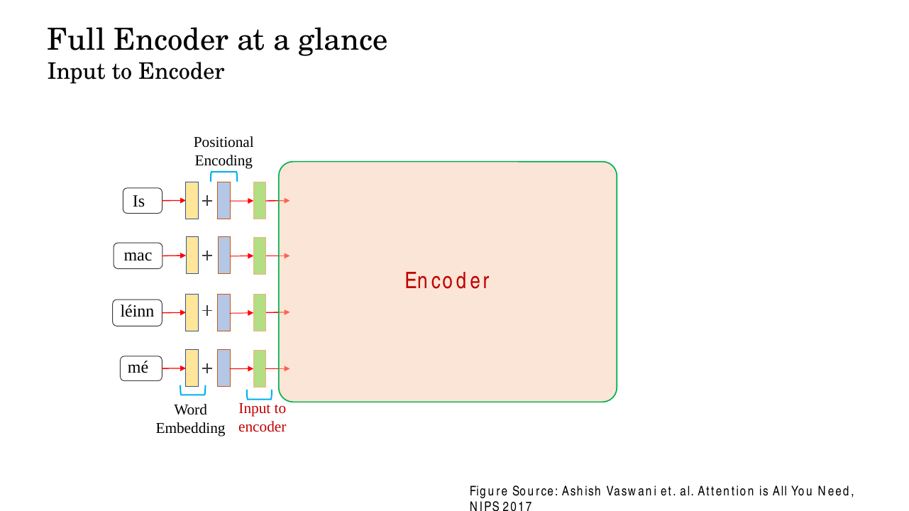

# Lec 26 — Transformers III: The Encoder and Positional Encoding

> **Deck:** `L8P5_Transformer-3.pptx` · **Week 7** · **Playlist:** Lec 26
> **Prereqs:** [Lec 25 — Q/K/V and Self-Attention](25-qkv-and-self-attention.md)
> **Feeds into:** [Lec 27 — The Decoder and the Full Transformer](27-decoder-and-full-transformer.md), [Lec 28 — ViT, DETR and Swin](../week-08/28-vit-detr-swin.md)

## Why this lecture exists

Lec 25 left you with a debt. Self-attention lets every token look at every other token in one step,
which is wonderful — but it is **permutation-invariant**. Shuffle the input tokens and the output
tokens shuffle with them, unchanged. A self-attention layer sees a *bag* of vectors, not a *sequence*
of them. So "dog bites man" and "man bites dog" come out of the layer carrying exactly the same
information, and no amount of stacking fixes it.

This lecture pays the debt. You add position back in explicitly, as a vector, before the first
attention layer ever runs. Then you assemble the pieces from Lec 25 into the thing they were always
heading towards: the **encoder block**, and a stack of six of them. By the end you can draw the
encoder from memory, count its parameters, and compute a positional-encoding vector by hand.

## The ideas

### The two halves, and which one you are learning

The Transformer has exactly two components. The **encoder** converts an input sequence into
**contextualised representations** — one output vector per input token, each one now aware of every
other token. The **decoder** consumes those representations and generates the output sequence
autoregressively. This chapter owns the encoder; the decoder, cross-attention and the joined-up
picture belong to [Lec 27](27-decoder-and-full-transformer.md).

![The complete Transformer architecture from Vaswani et al.: left column is the encoder (input embedding, positional encoding, N× [multi-head attention, Add and Norm, feed forward, Add and Norm]); right column is the decoder, topped by Linear and Softmax](../../assets/figures/W7_L8P5_Transformer-3/image1.png)
*Fig. — The canonical diagram. Everything in the **left** column is yours this chapter: Input Embedding, the ⊕ with Positional Encoding, and the N× stack. Note the ⊕ symbol — positional encoding is **added**, and the diagram says so. Slide 10.*

The deck frames the encoder algebraically as $\mathbf{c} = T_w(\mathbf{z})$, where $\mathbf{z}$ is the
input sequence and $T_w(\cdot)$ is the encoder. For a vision task $\mathbf{z}$ comes from flattening a
pretrained CNN's $H \times W \times D$ feature grid into a sequence of $HW$ vectors; the encoder
returns the same number of vectors $\mathbf{c}$, each now globally informed.

![Pipeline: a CNN extracts an H×W×D spatial feature grid from an image of a boy waving a flag; the grid is flattened into the sequence z00…z22, fed to a Transformer Encoder producing c00…c22, which a Transformer Decoder turns into the caption "boy waving flag [END]"](../../assets/slides/W7_L8P5_Transformer-3/s-09.png)
*Fig. — Read the shapes: the encoder is **sequence-in, sequence-out, same length**. Nine feature vectors in, nine contextualised vectors out. That shape-preservation is exactly why you can stack encoders. Slide 9.*

### How a Transformer differs from a CNN

This is the framing the deck builds the whole lecture on, and it is the bridge to Week 8.

Take an image of a person holding a flag. A **CNN** sees it through small local kernels. Layer 1 finds
edges; layer 2 combines edges into textures and corners; deeper layers combine those into object
parts; only near the top does a unit's **receptive field** (the input region one unit can see) grow
large enough to contain both the hand and the flag at once. The relationship "this hand holds that
flag" is assembled *gradually*, over many layers, and only because the two things eventually fall
inside one receptive field.


*Fig. — The CNN's hierarchy is its strength and its constraint: local first, global only later. Long-range relations are reachable only by going deep. Slide 7.*

A **Transformer** divides the image into patches, treats each patch as a token, and runs
self-attention. At the very first layer every patch can attend to every other patch, so the patch
containing the hand can be linked to the patch containing the flag **immediately**, regardless of how
far apart they are. There is no receptive field to grow: the receptive field is the whole input, from
layer one.

| | CNN | Transformer |
|---|---|---|
| Primitive | local kernel sliding over the input | token attending to all tokens |
| Receptive field at layer 1 | the kernel, e.g. $3\times3$ | **everything** |
| How long-range relations form | gradually, by stacking layers | directly, in one attention step |
| Built-in assumption (inductive bias) | locality + translation equivariance | almost none — must be learned |
| Natural strength | local patterns, textures, edges | relationships between distant regions |
| Data appetite | modest | large, because it assumes less |

The deck's closing line is worth keeping: *modern vision systems often combine ideas from both*. The
Transformer's weak inductive bias is why it beats CNNs given enough data and loses when data is
scarce — a trade you meet again when Swin reintroduces locality in
[Lec 28](../week-08/28-vit-detr-swin.md).

### Transformer for vision tasks — the one-slide preview

Slide 6 sketches the recipe Lec 28 will fill in: split the image into fixed-size patches (e.g.
$16\times16$ pixels), turn each patch into a vector by a learned linear map, add positional
information so the model knows where each patch sat, and push the sequence through encoder layers.
The patch-embedding mechanics, the `[CLS]` token and the specific models (ViT, DETR, Swin) are
**owned by [Lec 28](../week-08/28-vit-detr-swin.md)**. What matters here is that the *encoder you are
about to build is the same object* in the vision case; only the tokeniser changes.

### Input embedding: from symbols to vectors

A Transformer does arithmetic. Words are not arithmetic. **Input embedding** is the bridge.

The text is first **tokenised** — split into units, which may be whole words, subwords, or
characters. Each distinct token in the vocabulary is then mapped to a **dense, fixed-dimensional
vector** of length $d_{\text{model}}$ by a **learnable embedding matrix**
$\mathbf{E} \in \mathbb{R}^{V \times d_{\text{model}}}$, where $V$ is the vocabulary size. Looking up
token $t$ means taking row $t$ of $\mathbf{E}$ — equivalently, multiplying a one-hot vector by
$\mathbf{E}$, which is why an embedding layer is just a linear layer with a one-hot input.


*Fig. — Note the `<eos>` token: special markers are part of the vocabulary and get embeddings like any other token. Slide 18.*

Three properties to be exact about:

- **It is learned, not fixed.** $\mathbf{E}$ is trained by backpropagation along with everything else.
  Nothing tells it in advance that "king" and "queen" are related; the training signal does.
- **It is dense, not one-hot.** One-hot vectors are $V$-dimensional and mutually orthogonal, so
  every pair of distinct tokens is equally dissimilar. A dense vector lets tokens with similar usage
  sit close together, which is what makes the dot products attention runs on
  ([Lec 25](25-qkv-and-self-attention.md)) meaningful.
- **$d_{\text{model}}$ is fixed throughout the model.** The deck uses $d_{\text{model}} = 512$,
  matching Vaswani et al. Every vector flowing through the encoder has this width.


*Fig. — The deck's concrete numbers: each token becomes a column of 512 real numbers. Those exact values are what the embedding matrix stores and learns. Slide 18.*

### Positional encoding: the problem

Here is the debt from Lec 25, stated precisely.

Self-attention computes, for every pair of tokens, a compatibility score from their vectors, then
mixes the value vectors by the resulting weights. **Nothing in that computation refers to an index.**
If you permute the rows of the input matrix, the score matrix is permuted the same way in both
dimensions, and the output is permuted identically. Formally, for any permutation matrix $\mathbf{P}$,

$$\mathrm{SelfAttn}(\mathbf{P}\mathbf{X}) = \mathbf{P}\,\mathrm{SelfAttn}(\mathbf{X})$$

This is **permutation equivariance**, and it means the layer treats its input as a *set*.

Make it concrete. The sentence "dog bites man" is the set $\{\mathbf{e}_d, \mathbf{e}_b,
\mathbf{e}_m\}$ of embeddings. The sentence "man bites dog" is the **same set**. Run both through
self-attention and the representation attached to *dog* is bit-for-bit identical in the two
sentences — same neighbours, same scores, same output. Yet one is an ordinary Tuesday and the other
is news, and the architecture as built cannot tell them apart. An RNN never had this problem, because
it consumed tokens one at a time and order was baked into the computation; the Transformer threw away
sequential processing to get parallelism, and this is the bill.

The fix is to make each token's vector depend on *where it sits*, **before** attention runs.


*Fig. — The two jobs positional encoding does, per the deck: give **absolute** position of each word, and make **relative** distance (close vs distant) recoverable. Note "vector size 512" on both rows and the **+**, not a concatenation. Slide 22.*

### Positional encoding: added, not concatenated

Get this right, because it is a reliable MCQ.

$$\mathbf{x}_{\text{pos}} = \mathbf{e}_{\text{token}} + \mathbf{p}_{\text{pos}}, \qquad
\mathbf{e},\mathbf{p},\mathbf{x} \in \mathbb{R}^{d_{\text{model}}}$$

The positional vector has **the same width** as the token embedding and is added element-wise. The
input to the encoder is therefore still $d_{\text{model}}$-dimensional; nothing grows.

Why addition and not concatenation? Concatenating a $d_p$-dimensional position vector would widen the
input to $d_{\text{model}} + d_p$, enlarging every downstream weight matrix, and would permanently
reserve $d_p$ dimensions for position that can never carry content. Addition keeps the width fixed
and lets the learned projections *choose* how much of each dimension to spend on position versus
meaning. It works because $d_{\text{model}}$ is large: 512 dimensions have room for two superimposed
signals, and the first linear layer can separate them.

> **Deck erratum — flag this.** Slide 23's first bullet reads *"Concatenate special positional
> encoding $p_j$ to each input vector $x_j$"*. That word is wrong, and it contradicts the deck's own
> slides 20, 22 and 24, which all show a **+**, as does the Vaswani diagram's ⊕. The bullet is
> inherited from a Stanford CS231n slide where "concatenate" is used loosely. **In the original
> Transformer, and for every exam answer: positional encodings are ADDED.**

### Positional encoding: the sinusoidal scheme

Vaswani et al. define, for position $pos$ and dimension index $i$,

$$PE_{(pos,\,2i)} = \sin\!\left(\frac{pos}{10000^{2i/d_{\text{model}}}}\right), \qquad
PE_{(pos,\,2i+1)} = \cos\!\left(\frac{pos}{10000^{2i/d_{\text{model}}}}\right)$$

Every symbol:

| Symbol | Meaning | Range |
|---|---|---|
| $pos$ | the token's index in the sequence, counted from 0 | $0, 1, 2, \dots, L-1$ |
| $i$ | the **dimension-pair** index, not the dimension itself | $0, 1, \dots, \tfrac{d_{\text{model}}}{2}-1$ |
| $2i$ | an **even** dimension of the PE vector — gets **sine** | |
| $2i+1$ | an **odd** dimension of the PE vector — gets **cosine** | |
| $10000$ | the base that sets how fast wavelengths grow | fixed constant |
| $d_{\text{model}}$ | embedding width, 512 in the paper | fixed |

Dimensions come in **sin/cos pairs sharing one frequency**. Writing
$\omega_i = 1/10000^{2i/d_{\text{model}}}$, the vector is

$$\mathbf{p}(pos) = \big[\sin(\omega_0 pos),\ \cos(\omega_0 pos),\ \sin(\omega_1 pos),\ \cos(\omega_1 pos),\ \dots,\ \sin(\omega_{d/2-1} pos),\ \cos(\omega_{d/2-1} pos)\big]^\top$$

which is exactly the column vector the deck prints on slide 23.

![Slide 23: left bullets define pos: N → R^d and p_j = pos(j); right lists "Options for pos(.)" — 1. Learn a lookup table with T×d parameters; 2. Design a fixed function, with the column vector p(t) = [sin(ω₁t), cos(ω₁t), sin(ω₂t), cos(ω₂t), …, sin(ω_{d/2}t), cos(ω_{d/2}t)] and ω_k = 1/1000^{2k/d}](../../assets/slides/W7_L8P5_Transformer-3/s-23.png)
*Fig. — The deck's two options, side by side: **learned lookup table** vs **fixed sinusoidal function**. Note the printed base is $1000$; Vaswani's is $10{,}000$ — see the erratum below. Slide 23.*

> **Two more deck slips on slide 23.** (1) It writes $\omega_k = 1/1000^{2k/d}$ — a dropped zero. The
> published constant is $10{,}000$. Use $10{,}000$. (2) It indexes $k = 1 \dots d/2$ (one-based),
> which would make the first frequency $10000^{2/d}$ rather than $1$. Vaswani indexes $i = 0 \dots
> d/2 - 1$ so that the first pair has $\omega_0 = 1$ exactly. Use the zero-based form; an exam
> expects $PE_{(pos,0)} = \sin(pos)$.

### Why sinusoids? Four reasons, and the fourth is the real one

**1. Every position gets a unique pattern.** The frequencies are all different and irrational
multiples of each other, so the combined vector across $d_{\text{model}}/2$ frequencies does not
repeat for any realistic sequence length. Think of it as a continuous analogue of binary counting: the
fastest dimension flips quickly like the low bit, the slowest crawls like the high bit, and the
combination identifies the position.

**2. It is bounded in $[-1, 1]$.** Position 5 and position 5000 perturb the embedding by the same
magnitude. A naive encoding $p = pos$ would grow without limit and swamp the embedding; a normalised
one $p = pos/L$ would mean different things at different sequence lengths. Sinusoids dodge both.

**3. It extrapolates.** The formula is a *function*, defined for every real $pos$, so you can
evaluate it at position 3000 even if training never saw a sequence longer than 512. A learned lookup
table simply has no row there. This is the practical reason the paper preferred sinusoids.

**4. $\mathbf{p}(pos + k)$ is a LINEAR function of $\mathbf{p}(pos)$.** This is the deep reason, and
it falls straight out of the angle-addition identities. For one frequency pair,

$$\begin{bmatrix}\sin(\omega(pos+k))\\ \cos(\omega(pos+k))\end{bmatrix}
=\begin{bmatrix}\cos(\omega k) & \sin(\omega k)\\ -\sin(\omega k) & \cos(\omega k)\end{bmatrix}
\begin{bmatrix}\sin(\omega\,pos)\\ \cos(\omega\,pos)\end{bmatrix}$$

Check the top row: $\cos(\omega k)\sin(\omega pos) + \sin(\omega k)\cos(\omega pos) =
\sin(\omega(pos+k))$. ✓ The $2\times2$ block is a **rotation by angle $\omega k$**, and crucially it
depends on $k$ **only** — not on $pos$. Stack those blocks down the diagonal and you get one fixed
matrix $\mathbf{M}_k \in \mathbb{R}^{d \times d}$ with

$$\mathbf{p}(pos+k) = \mathbf{M}_k\,\mathbf{p}(pos) \quad \text{for every } pos$$

Why this matters: the model's weight matrices are *linear* maps. A linear map can therefore implement
"shift attention 3 positions to the left" as a single matrix, uniformly, everywhere in the sequence.
Relative position becomes cheap to learn. With an arbitrary learned table, no such structure exists
and the model must memorise every pairwise relation separately.

### The alternative: learned positional embeddings

The deck's option 1 on slide 23: *learn a lookup table*. Allocate a matrix of $T \times d$ parameters
where $T$ is the maximum sequence length, treat row $t$ as $\mathbf{p}(t)$, and train it by
backpropagation like any other parameter. For $T = 512$, $d = 512$ that is $262{,}144$ extra
parameters.

| | Sinusoidal (fixed) | Learned lookup table |
|---|---|---|
| Parameters | **0** — computed once from a formula, never trained | $T \times d$ |
| Beyond length $T$ | works; the function is defined everywhere | **fails** — no row exists |
| Relative shifts | linear, via a fixed rotation $\mathbf{M}_k$ | no built-in structure |
| Flexibility | none; the pattern is imposed | can fit quirks of the data |
| Used by | original Transformer (2017) | BERT, GPT-2, **ViT** |

Vaswani et al. tried both and reported **nearly identical** quality, choosing sinusoids for the
extrapolation property. Note the deck's slide 22 annotation on the positional row: *"computed once,
Not learned"* — that is the sinusoidal choice, and it is the one this course examines. Lec 28 will
note that ViT uses *learned* 1-D position embeddings instead.

### Assembling the encoder block

Now put it together. One encoder block, in order:

```
 x (L x d_model) --+--> Multi-Head Self-Attention --> (+) --> LayerNorm --+--> FFN --> (+) --> LayerNorm --> out
                   |                                  ^                  |            ^
                   +----------- residual -------------+                  +- residual -+
```

The four stages, named exactly:

1. **Multi-head self-attention.** Each token builds a query, a key and a value, scores itself against
   every token, and mixes values accordingly; $h$ such mechanisms run in parallel and their outputs
   are concatenated and projected. This is a named black box here —
   [Lec 25](25-qkv-and-self-attention.md) derives all of it, including the $\sqrt{d_k}$ scaling.
2. **Add & Norm.** *Add* is a residual (skip) connection: the block's input is added to its output,
   $\mathbf{x} + \mathrm{Sublayer}(\mathbf{x})$ — the same gradient-highway idea ResNet introduced in
   [Lec 14](../week-04/14-resnet.md), reused unchanged. *Norm* is **layer normalization**, which
   standardises each token's vector across its own $d_{\text{model}}$ features (not across the batch)
   and then rescales it by learned $\gamma, \beta$.
   **[Lec 27](27-decoder-and-full-transformer.md) owns why both are necessary** — do not expect the
   justification here.
3. **Position-wise feed-forward network.** A two-layer MLP applied **independently and identically to
   every position**: expand $d_{\text{model}} \to d_{ff}$, apply a non-linearity, project back
   $d_{ff} \to d_{\text{model}}$. In the paper $d_{ff} = 2048 = 4 \times 512$. Its internal structure
   and purpose are again [Lec 27](27-decoder-and-full-transformer.md)'s.
4. **Add & Norm** again, identically.


*Fig. — The deck's best asset. Notice the **red arrows that bypass** each sub-layer: those are the residual connections. Notice too that the multi-head attention box spans all four tokens (tokens interact) while the feed-forward box is drawn per token (they do not). That asymmetry is the whole design. Slide 13.*

Two structural facts that explain everything about the block:

- **Shape is preserved end to end.** Input $(L, d_{\text{model}})$, output $(L, d_{\text{model}})$.
  That is what makes the block stackable — and it is forced by the residual connection, since you can
  only add two tensors of identical shape.
- **Attention is the only place tokens talk to each other.** The FFN, the layer norms and the
  residual adds are all strictly per-token. Mixing happens in exactly one sub-layer.

### Stacking: N = 6

The encoder is this block repeated $N$ times, each with its **own independent parameters** — weights
are *not* shared between blocks. Vaswani et al. use $N = 6$ for both encoder and decoder, which is why
the deck draws six boxes.


*Fig. — $N = 6$ on each side. Every arrow from the **top** encoder fans out to **all six** decoders — the encoder's final output is what the decoder consumes, not its intermediate layers. Slide 12.*

Why stack at all, if layer one already sees everything? Because each layer refines the
*representation*, not the *range*: layer 2 attends over already-contextualised vectors, so it can
condition on relationships layer 1 discovered. Depth buys compositional reasoning, not reach.

### The encoder's output, and the complete input path

What leaves the stack is one vector per input token, same count and width as went in, but now
**contextualised**: the vector at the position of *bank* differs depending on whether the sentence
mentioned a river or a loan. These are slide 9's $\mathbf{c}$ vectors. The decoder reads them through
cross-attention ([Lec 27](27-decoder-and-full-transformer.md)); a classifier reads them through a
pooled head ([Lec 28](../week-08/28-vit-detr-swin.md)).


*Fig. — The complete input path in one picture: token → embedding → **+** positional encoding → encoder. Three steps, and the middle one is the only arithmetic. Slide 24.*

## Worked numericals

### N1. Compute the positional-encoding vectors for $pos = 0, 1, 2$
**Given:** $d_{\text{model}} = 8$, base $= 10{,}000$.
**Find:** $\mathbf{p}(0)$, $\mathbf{p}(1)$, $\mathbf{p}(2)$, all eight components each.

1. The pair index runs $i = 0, 1, 2, 3$ (since $d_{\text{model}}/2 = 4$). The frequencies are
   $\omega_i = 1/10000^{2i/8} = 1/10000^{i/4}$:
   - $i=0$: $10000^{0} = 1 \Rightarrow \omega_0 = 1$
   - $i=1$: $10000^{0.25} = 10 \Rightarrow \omega_1 = 0.1$
   - $i=2$: $10000^{0.5} = 100 \Rightarrow \omega_2 = 0.01$
   - $i=3$: $10000^{0.75} = 1000 \Rightarrow \omega_3 = 0.001$

   (The round numbers are not luck: $10000 = 10^4$, so $10000^{i/4} = 10^{i}$.)
2. **$pos = 0$:** every argument is $0$, so $\sin 0 = 0$ and $\cos 0 = 1$ in every pair:
   $$\mathbf{p}(0) = [0,\ 1,\ 0,\ 1,\ 0,\ 1,\ 0,\ 1]$$
3. **$pos = 1$:** arguments are $1, 0.1, 0.01, 0.001$ radians.
   - $\sin(1) = 0.8415$, $\cos(1) = 0.5403$
   - $\sin(0.1) = 0.0998$, $\cos(0.1) = 0.9950$
   - $\sin(0.01) = 0.0100$, $\cos(0.01) = 1.0000$
   - $\sin(0.001) = 0.0010$, $\cos(0.001) = 1.0000$
   $$\mathbf{p}(1) = [0.8415,\ 0.5403,\ 0.0998,\ 0.9950,\ 0.0100,\ 1.0000,\ 0.0010,\ 1.0000]$$
4. **$pos = 2$:** arguments are $2, 0.2, 0.02, 0.002$ radians.
   - $\sin(2) = 0.9093$, $\cos(2) = -0.4161$
   - $\sin(0.2) = 0.1987$, $\cos(0.2) = 0.9801$
   - $\sin(0.02) = 0.0200$, $\cos(0.02) = 0.9998$
   - $\sin(0.002) = 0.0020$, $\cos(0.002) = 1.0000$
   $$\mathbf{p}(2) = [0.9093,\ -0.4161,\ 0.1987,\ 0.9801,\ 0.0200,\ 0.9998,\ 0.0020,\ 1.0000]$$

**Answer:** as above. Read off the three structural facts an examiner wants: **even index → sine, odd
index → cosine**; $\mathbf{p}(0)$ alternates $0,1,0,1,\dots$ exactly; and the **leftmost pair changes
fast while the rightmost pair barely moves** — dimension 6 went from $0$ to $0.001$ to $0.002$ while
dimension 0 went from $0$ to $0.84$ to $0.91$.

### N2. Prove the point: the same token at two positions
**Given:** the token *dog* has embedding
$\mathbf{e} = [0.2,\ -0.1,\ 0.5,\ 0.3,\ -0.4,\ 0.1,\ 0.0,\ 0.2]$, $d_{\text{model}} = 8$.
**Find:** the encoder inputs for *dog* at $pos = 0$ ("dog bites man") and at $pos = 2$
("man bites dog"), and show they differ.

1. At $pos = 0$, add $\mathbf{p}(0) = [0,1,0,1,0,1,0,1]$ component-wise:
   $$\mathbf{x}_0 = [0.2+0,\ -0.1+1,\ 0.5+0,\ 0.3+1,\ -0.4+0,\ 0.1+1,\ 0.0+0,\ 0.2+1]$$
   $$\mathbf{x}_0 = [0.2000,\ 0.9000,\ 0.5000,\ 1.3000,\ -0.4000,\ 1.1000,\ 0.0000,\ 1.2000]$$
2. At $pos = 2$, add $\mathbf{p}(2)$ from N1:
   - $0.2 + 0.9093 = 1.1093$
   - $-0.1 + (-0.4161) = -0.5161$
   - $0.5 + 0.1987 = 0.6987$
   - $0.3 + 0.9801 = 1.2801$
   - $-0.4 + 0.0200 = -0.3800$
   - $0.1 + 0.9998 = 1.0998$
   - $0.0 + 0.0020 = 0.0020$
   - $0.2 + 1.0000 = 1.2000$
   $$\mathbf{x}_2 = [1.1093,\ -0.5161,\ 0.6987,\ 1.2801,\ -0.3800,\ 1.0998,\ 0.0020,\ 1.2000]$$
3. Difference $\mathbf{x}_2 - \mathbf{x}_0 = \mathbf{p}(2) - \mathbf{p}(0) =
   [0.9093,\ -1.4161,\ 0.1987,\ -0.0199,\ 0.0200,\ -0.0002,\ 0.0020,\ 0.0000]$ — not the zero vector.
4. Cosine similarity: $\mathbf{x}_0 \cdot \mathbf{x}_2 = 4.5726$,
   $\|\mathbf{x}_0\| = 2.3664$, $\|\mathbf{x}_2\| = 2.5333$, so
   $\cos\theta = 4.5726/(2.3664 \times 2.5333) = 0.7627$.

**Answer:** $\mathbf{x}_0 \neq \mathbf{x}_2$, with cosine similarity $0.763$ — clearly the same word
(not orthogonal) but clearly not the same vector. Self-attention can now tell "dog bites man" from
"man bites dog". Note that **the difference is entirely $\mathbf{p}(2) - \mathbf{p}(0)$ and does not
depend on $\mathbf{e}$ at all** — every token gets the same positional offset at a given position.

### N3. Wavelengths form a geometric progression
**Given:** $PE_{(pos, 2i)} = \sin(\omega_i\, pos)$ with $\omega_i = 1/10000^{2i/d_{\text{model}}}$.
**Find:** the wavelength $\lambda_i$ as a function of $i$, and its value at the extremes for
$d_{\text{model}} = 512$.

1. A sinusoid $\sin(\omega\,pos)$ repeats when $\omega\,\lambda = 2\pi$, so
   $\lambda_i = 2\pi/\omega_i = 2\pi \cdot 10000^{2i/d_{\text{model}}}$.
2. Smallest, at $i = 0$: $\lambda_0 = 2\pi \cdot 10000^{0} = 2\pi \approx 6.283$ positions.
3. Largest, at $i = d/2 - 1 = 255$: exponent $= 2(255)/512 = 510/512 = 0.99609$, so
   $10000^{0.99609} = 9646.6$ and $\lambda_{255} = 2\pi \times 9646.6 \approx 60{,}611$ positions.
4. Ratio between consecutive pairs: $\lambda_{i+1}/\lambda_i = 10000^{2/512} = 10000^{0.003906}
   = 1.0366$ — a constant factor, i.e. **geometric**.
5. Sanity landmarks: $i = 64 \Rightarrow 10000^{0.25} = 10$, $\lambda = 62.8$;
   $i = 128 \Rightarrow 10000^{0.5} = 100$, $\lambda = 628.3$.
6. For the small $d_{\text{model}} = 8$ of N1 the progression is clean:
   $\lambda = 2\pi,\ 20\pi,\ 200\pi,\ 2000\pi$, i.e. $6.28,\ 62.8,\ 628,\ 6283$ — a factor of **10**
   per pair.

**Answer:** $\lambda_i = 2\pi\cdot 10000^{2i/d_{\text{model}}}$, running geometrically from
$2\pi \approx 6.28$ to just under $10000\cdot 2\pi \approx 62{,}832$ (precisely $60{,}611$ at
$i = 255$). Fast dimensions resolve neighbouring positions; slow dimensions encode coarse location in
a long document.

### N4. Parameter count of one encoder block, and of the 6-block stack
**Given:** $d_{\text{model}} = 512$, $h = 8$ heads (so $d_k = d_v = 512/8 = 64$), $d_{ff} = 2048$,
biases included, two layer norms per block.
**Find:** parameters in one encoder block, then in $N = 6$ blocks.

1. **Attention projections.** Across all $h$ heads the query projections together form one matrix of
   shape $d_{\text{model}} \times (h\,d_k) = 512 \times 512$, because $8 \times 64 = 512$. Same for
   keys and values. Plus the output projection $\mathbf{W}^O$, also $512\times512$. That is four
   $512\times512$ matrices:
   $$4 \times (512 \times 512 + 512) = 4 \times (262{,}144 + 512) = 4 \times 262{,}656 = 1{,}050{,}624$$
2. **FFN, first layer** ($512 \to 2048$): $512 \times 2048 + 2048 = 1{,}048{,}576 + 2{,}048
   = 1{,}050{,}624$.
3. **FFN, second layer** ($2048 \to 512$): $2048 \times 512 + 512 = 1{,}048{,}576 + 512
   = 1{,}049{,}088$.
4. FFN total $= 1{,}050{,}624 + 1{,}049{,}088 = 2{,}099{,}712$.
5. **Layer norms.** Each has a scale $\gamma$ and shift $\beta$, both of length $d_{\text{model}}$:
   $2 \times 512 = 1{,}024$ per norm. Two norms: $2{,}048$.
6. **One block** $= 1{,}050{,}624 + 2{,}099{,}712 + 2{,}048 = 3{,}152{,}384 \approx 3.15$ M.
7. **Six blocks** $= 6 \times 3{,}152{,}384 = 18{,}914{,}304 \approx 18.9$ M.

**Answer:** one encoder block has **3,152,384 parameters**; the $N=6$ encoder stack has
**18,914,304**. Two facts worth memorising: the **FFN holds almost exactly twice the parameters of
the attention sub-layer** ($2{,}099{,}712 / 1{,}050{,}624 = 1.998$), and the **layer norms are
negligible** (2,048 out of 3.15 M, under 0.07%). If an exam ignores biases the block comes to
$4(512^2) + 2(512 \cdot 2048) + 2048 = 3{,}147{,}776$. **Positional encoding contributes zero
parameters** — it is a formula, not a weight.

### N5. Tensor shapes through one encoder block
**Given:** batch $B = 32$ sequences, length $L = 10$ tokens, $d_{\text{model}} = 512$, $h = 8$,
$d_k = 64$, $d_{ff} = 2048$, vocabulary $V = 30{,}000$.
**Find:** the shape at every stage.

| Stage | Shape | Note |
|---|---|---|
| token ids | $(32, 10)$ | integers |
| after embedding lookup | $(32, 10, 512)$ | $\mathbf{E}$ is $(30000, 512)$ |
| positional encoding table | $(10, 512)$ | **no batch dimension** |
| after adding PE | $(32, 10, 512)$ | PE broadcasts across the batch |
| $\mathbf{Q},\mathbf{K},\mathbf{V}$ after projection | $(32, 10, 512)$ each | |
| reshaped into heads | $(32, 8, 10, 64)$ | $512 = 8\times64$ |
| attention score matrix | $(32, 8, 10, 10)$ | $L\times L$ per head — **quadratic in $L$** |
| per-head output | $(32, 8, 10, 64)$ | |
| heads concatenated | $(32, 10, 512)$ | |
| after $\mathbf{W}^O$ | $(32, 10, 512)$ | |
| after Add & Norm | $(32, 10, 512)$ | add requires identical shapes |
| after FFN layer 1 | $(32, 10, 2048)$ | the expansion |
| after FFN layer 2 | $(32, 10, 512)$ | back down |
| after Add & Norm | $(32, 10, 512)$ | **block output = block input shape** |

**Answer:** input $(32,10,512)$, output $(32,10,512)$. The only places the shape deviates are inside
the heads and inside the FFN expansion, and both return. The score tensor $(32,8,10,10)$ is the one
that scales as $O(L^2)$ — at $L = 10$ it holds $32 \times 8 \times 100 = 25{,}600$ numbers; at
$L = 1000$ it would hold $256$ million, which is why long sequences are expensive.

## Code

```python
import numpy as np

def positional_encoding(seq_len, d_model, base=10000.0):
    """Vaswani et al. sinusoidal PE. Returns a (seq_len, d_model) matrix."""
    pos   = np.arange(seq_len)[:, None]          # (L, 1)   position index
    i     = np.arange(d_model // 2)[None, :]     # (1, d/2) dimension-PAIR index
    omega = 1.0 / base ** (2 * i / d_model)      # (1, d/2) angular frequencies
    pe = np.zeros((seq_len, d_model))
    pe[:, 0::2] = np.sin(pos * omega)            # EVEN dims <- sine
    pe[:, 1::2] = np.cos(pos * omega)            # ODD  dims <- cosine
    return pe

np.set_printoptions(precision=4, suppress=True, linewidth=120)
PE = positional_encoding(seq_len=6, d_model=8)
print("PE matrix (rows = positions, cols = dimensions):")
print(PE)

# --- the whole point: same token, two positions -> two different vectors ---
dog = np.array([0.2, -0.1, 0.5, 0.3, -0.4, 0.1, 0.0, 0.2])   # one token embedding
x0, x2 = dog + PE[0], dog + PE[2]                            # ADDED, not concatenated
print("\ndog@pos0 :", np.round(x0, 4))
print("dog@pos2 :", np.round(x2, 4))
print("identical?", np.allclose(x0, x2))
cos = x0 @ x2 / (np.linalg.norm(x0) * np.linalg.norm(x2))
print(f"cosine similarity = {cos:.4f}")

# --- PE(pos+k) is a LINEAR function of PE(pos) -----------------------------
d_model, k = 8, 3
P = positional_encoding(12, d_model)
M = np.zeros((d_model, d_model))                 # block-diagonal rotation matrix
for i in range(d_model // 2):
    w = 1.0 / 10000.0 ** (2 * i / d_model)
    c, s = np.cos(w * k), np.sin(w * k)
    M[2*i:2*i+2, 2*i:2*i+2] = [[c, s], [-s, c]]  # depends on k ONLY, not on pos
print("\nM @ PE(1) == PE(4)? ", np.allclose(M @ P[1], P[4]))
print("M @ PE(7) == PE(10)?", np.allclose(M @ P[7], P[10]))
print("max |PE| =", np.abs(P).max())             # bounded, as promised
```

Expected output:

```
PE matrix (rows = positions, cols = dimensions):
[[ 0.      1.      0.      1.      0.      1.      0.      1.    ]
 [ 0.8415  0.5403  0.0998  0.995   0.01    1.      0.001   1.    ]
 [ 0.9093 -0.4161  0.1987  0.9801  0.02    0.9998  0.002   1.    ]
 [ 0.1411 -0.99    0.2955  0.9553  0.03    0.9996  0.003   1.    ]
 [-0.7568 -0.6536  0.3894  0.9211  0.04    0.9992  0.004   1.    ]
 [-0.9589  0.2837  0.4794  0.8776  0.05    0.9988  0.005   1.    ]]

dog@pos0 : [ 0.2  0.9  0.5  1.3 -0.4  1.1  0.   1.2]
dog@pos2 : [ 1.1093 -0.5161  0.6987  1.2801 -0.38    1.0998  0.002   1.2   ]
identical? False
cosine similarity = 0.7627

M @ PE(1) == PE(4)?  True
M @ PE(7) == PE(10)? True
max |PE| = 1.0
```

Read the printed grid column by column. Column 0 swings across the full $[-1,1]$ range in six
positions; column 6 has crawled from $0$ to $0.005$. That is the geometric wavelength progression of
N3 made visible, and it is why a single PE vector carries both fine and coarse positional information
at once. The two `True`s confirm reason 4: **one** matrix $\mathbf{M}_3$ shifts *any* position forward
by 3.

## Exam pack

### Must-memorise

| Item | Exactly this |
|---|---|
| Sinusoidal PE, even dims | $PE_{(pos,2i)} = \sin\!\big(pos / 10000^{2i/d_{\text{model}}}\big)$ |
| Sinusoidal PE, odd dims | $PE_{(pos,2i+1)} = \cos\!\big(pos / 10000^{2i/d_{\text{model}}}\big)$ |
| How PE enters | $\mathbf{x} = \mathbf{e}_{\text{token}} + \mathbf{p}_{\text{pos}}$ — **ADDED**, same width |
| Frequency | $\omega_i = 1/10000^{2i/d_{\text{model}}}$, $i = 0,\dots,\tfrac{d}{2}-1$ |
| Wavelength | $\lambda_i = 2\pi\cdot 10000^{2i/d_{\text{model}}}$; geometric from $2\pi$ to $\approx 10000\cdot 2\pi$ |
| Linear-shift property | $\mathbf{p}(pos+k) = \mathbf{M}_k\,\mathbf{p}(pos)$, $\mathbf{M}_k$ a rotation depending on $k$ alone |
| Encoder block order | MHSA → **Add & Norm** → position-wise FFN → **Add & Norm** |
| Residual form | $\mathrm{LayerNorm}(\mathbf{x} + \mathrm{Sublayer}(\mathbf{x}))$ |
| Encoder's job | input sequence → **contextualised representations**, same length |
| Permutation property | self-attention alone is permutation-equivariant; PE is what breaks it |
| Input embedding | learnable $\mathbf{E}\in\mathbb{R}^{V\times d_{\text{model}}}$; row lookup = one-hot × $\mathbf{E}$ |
| Encoder as a map | $\mathbf{c} = T_w(\mathbf{z})$ (the deck's notation) |

### Numbers worth knowing

| Quantity | Value |
|---|---|
| $d_{\text{model}}$ (paper and deck) | **512** |
| Heads $h$ | 8, so $d_k = d_v = 512/8 = 64$ |
| $d_{ff}$ | **2048** $= 4\times d_{\text{model}}$ |
| Blocks $N$ | **6** encoder, 6 decoder |
| PE base constant | **10,000** (the deck misprints 1000) |
| PE value range | $[-1, 1]$, always |
| Parameters added by sinusoidal PE | **0** |
| Parameters in a learned PE table | $T \times d_{\text{model}}$ (e.g. $512\times512 = 262{,}144$) |
| Attention sub-layer parameters (one block) | 1,050,624 |
| FFN parameters (one block) | 2,099,712 |
| LayerNorm parameters (one block, 2 norms) | 2,048 |
| **One encoder block** | **3,152,384** ($\approx$ 3.15 M) |
| **Six-block encoder stack** | **18,914,304** ($\approx$ 18.9 M) |
| $\mathbf{p}(0)$ for any $d_{\text{model}}$ | $[0,1,0,1,0,1,\dots]$ |
| Attention score tensor | $(B, h, L, L)$ — $O(L^2)$ |
| ViT patch size (preview) | $16\times16$ |

### Likely MCQ traps

- **"Positional encodings are concatenated to the embeddings."** False — they are **added**, and the
  PE vector has exactly $d_{\text{model}}$ components so that it can be. The deck's own slide 23
  bullet says "concatenate" and is wrong; slides 20, 22, 24 and the Vaswani ⊕ all say add.
- **"Even dimensions get cosine."** No. **Even $\to$ sine, odd $\to$ cosine.** Remember
  $\mathbf{p}(0) = [0,1,0,1,\dots]$: it starts with $\sin 0 = 0$.
- **"$i$ in $10000^{2i/d}$ is the dimension index."** It is the **pair** index, running only to
  $d/2 - 1$. Dimensions $2i$ and $2i+1$ share one frequency.
- **"The positional encoding is learned."** Not in the original Transformer — it is a fixed formula
  with **zero parameters** (the deck writes "computed once, Not learned"). A *learned lookup table* is
  the stated alternative, used by BERT and ViT.
- **"Add & Norm means batch normalization."** It is **layer** normalization — statistics over the
  features of one token, independent of batch size. Different operation, different axis.
- **Block order.** It is attention **then** FFN, with a norm after each. Not FFN first, and not one
  shared norm at the end.
- **"Deeper encoders see further."** No. Every layer already sees the entire sequence. Depth adds
  representational refinement, not range — unlike a CNN, where depth genuinely is what grows the
  receptive field.
- **"Self-attention is permutation-invariant, so Transformers cannot model order."** Half right. The
  attention layer is; the *model* is not, precisely because PE is added first. State both halves.
- **"The six encoder blocks share weights."** They do not — six independent parameter sets, which is
  why the stack costs $6\times$ a block. Output length always equals input length, $L$ in and $L$ out.
- **"Sinusoidal PE is chosen because it is more accurate."** No — Vaswani et al. report
  near-identical results to learned embeddings. It is chosen for **extrapolation** to unseen lengths
  and for the linear relative-shift property.

### Self-test

1. Why does self-attention alone fail to distinguish "dog bites man" from "man bites dog"?
2. For $d_{\text{model}} = 8$, write $\mathbf{p}(0)$ in full.
3. Which trigonometric function goes in dimension 5 of the PE vector, and what is its frequency if
   $d_{\text{model}} = 16$?
4. Give the wavelength of the fastest and slowest PE dimension for $d_{\text{model}} = 512$.
5. State the four components of an encoder block in order.
6. How many parameters does sinusoidal positional encoding add? How many does a learned table add for
   $T = 1024$, $d_{\text{model}} = 768$?
7. An encoder block has $d_{\text{model}} = 256$, $h = 4$, $d_{ff} = 1024$. Count its parameters
   (biases included, two layer norms).
8. Why can $\mathbf{p}(pos+k) = \mathbf{M}_k\mathbf{p}(pos)$ be called "the real reason" for choosing
   sinusoids?
9. A batch of 16 sequences of length 20 enters a 6-block encoder with $d_{\text{model}} = 512$,
   $h = 8$. What shape leaves the stack, and what shape is the attention score tensor inside one block?

<details><summary>Answers</summary>

1. The two sentences are the same multiset of embeddings. Self-attention is permutation-equivariant —
   $\mathrm{SelfAttn}(\mathbf{PX}) = \mathbf{P}\,\mathrm{SelfAttn}(\mathbf{X})$ — so each word's output
   representation is identical in both, and the layer sees a set, not a sequence.
2. $\mathbf{p}(0) = [0, 1, 0, 1, 0, 1, 0, 1]$ — every $\sin 0 = 0$, every $\cos 0 = 1$.
3. Dimension 5 is **odd**, so **cosine**. Odd dimension $5 = 2i+1 \Rightarrow i = 2$, so
   $\omega_2 = 1/10000^{4/16} = 1/10000^{0.25} = 1/10 = 0.1$.
4. Fastest: $\lambda_0 = 2\pi \approx 6.28$ positions. Slowest: $\lambda_{255} = 2\pi\cdot
   10000^{510/512} = 2\pi \times 9646.6 \approx 60{,}611$ positions.
5. Multi-head self-attention → Add & Norm → position-wise feed-forward network → Add & Norm.
6. Sinusoidal: **0**. Learned table: $1024 \times 768 = 786{,}432$.
7. Attention $4\times(256^2 + 256) = 4 \times 65{,}792 = 263{,}168$. FFN
   $(256\cdot1024 + 1024) + (1024\cdot256 + 256) = 263{,}168 + 262{,}400 = 525{,}568$.
   LayerNorms $2 \times 2 \times 256 = 1{,}024$. Total $= 263{,}168 + 525{,}568 + 1{,}024 =
   \mathbf{789{,}760}$.
8. Because every weight matrix in the network is a linear map, so a relative shift of $k$ positions is
   something the model can implement with a single matrix that works at every position. Relative
   position therefore becomes cheap to learn, instead of having to be memorised pair by pair.
9. Output $(16, 20, 512)$ — shape is preserved by every block. Score tensor $(16, 8, 20, 20)$.

</details>

## Beyond the slides

**Gap:** The deck never gives the sinusoidal formula in Vaswani's indexed form
$PE_{(pos,2i)}/PE_{(pos,2i+1)}$ — only the stacked column vector $p(t)$ with $\omega_k$, and with a
mistyped base of $1000$.
**Why it matters:** The examinable form is the indexed one, with base $10{,}000$ and zero-based $i$.
Reproducing the deck's version verbatim would lose marks and would give wrong numbers (base 1000
changes every wavelength by a factor of $10^{2i/d}$).

**Gap:** The deck never states the linear-shift property $\mathbf{p}(pos+k) = \mathbf{M}_k\,
\mathbf{p}(pos)$, nor the boundedness and extrapolation arguments.
**Why it matters:** "Why *sinusoids* rather than any other unique code?" is the standard short-answer
question, and these three properties are the answer. Without them the choice looks arbitrary.

**Gap:** Embedding scaling. The paper multiplies the embedding output by $\sqrt{d_{\text{model}}}$
before adding the positional encoding — $\sqrt{512} \approx 22.6$.
**Why it matters:** Embeddings are typically initialised with variance around $1/d_{\text{model}}$, so
without the scale-up the PE values (bounded by 1) would **dominate** the semantic signal. The deck
omits it; real implementations do not.

**Gap:** Pre-norm versus post-norm. The deck and the 2017 paper both place normalization *after* the
residual add: $\mathrm{LayerNorm}(\mathbf{x} + \mathrm{Sublayer}(\mathbf{x}))$ — "post-norm".
**Why it matters:** Nearly every modern Transformer uses **pre-norm**,
$\mathbf{x} + \mathrm{Sublayer}(\mathrm{LayerNorm}(\mathbf{x}))$, because post-norm needs a learning
rate warm-up to train stably at depth. For this exam quote post-norm, the deck's order, but know the
variant exists. [Lec 27](27-decoder-and-full-transformer.md) takes the normalization story further.

**Gap:** The quadratic cost of self-attention is never mentioned.
**Why it matters:** The $(B, h, L, L)$ score tensor is $O(L^2)$ in both time and memory. This single
fact explains why ViT uses $16\times16$ patches rather than pixels (a $224\times224$ image is 50,176
pixels but only 196 patches) and why Swin windows attention — both in
[Lec 28](../week-08/28-vit-detr-swin.md).

## Cut from the slides

Dropped slides 1, 2, 5, 25 and 26 — title, contents, a section divider, summary and "next lecture" —
which are pure navigation. Slides 3 and 4 restate what attention and multi-head attention are; that
material is [Lec 25](25-qkv-and-self-attention.md)'s and is referenced here in a sentence rather than
repeated, and the extracted `image2.png` showing the scaled dot-product formula is deliberately **not**
embedded for the same reason. Slide 11 redraws slides 9 and 10 together with no new content, so it is
merged into the slide-9 figure. Slides 14, 15, 16, 19 and 24 are a five-step PowerPoint build-up of one "Full Encoder at a glance"
diagram, so only the complete version (slide 13) and the final input-path step (slide 24) are shown. Slide 6's vision
preview is compressed to a short forward-looking subsection because its details belong to
[Lec 28](../week-08/28-vit-detr-swin.md). Slide 10's encoder/decoder definition is folded into the
opening subsection. The extracted `image6.png` (the bare $p(t)$ column vector) duplicates the
right-hand half of slide 23 and is covered by that figure. Nothing mathematical was dropped; the two
deck errors — "concatenate" on slide 23 and the base printed as $1000$ — are corrected in place rather
than silently inherited.
