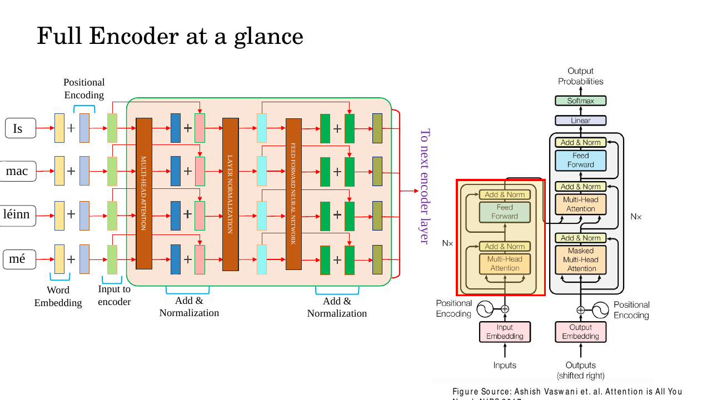
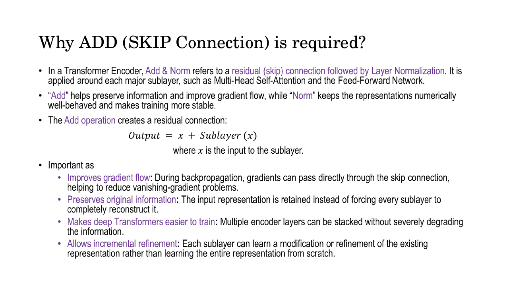
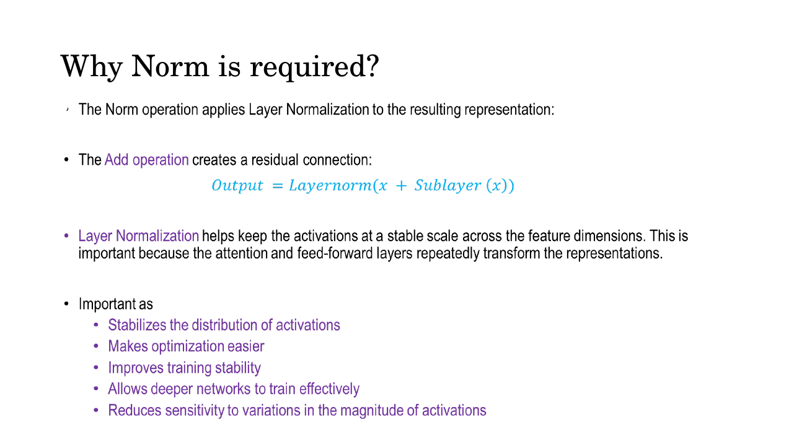
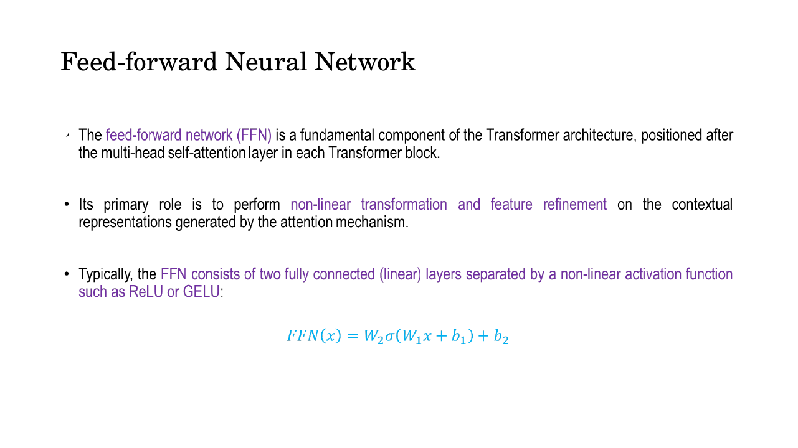
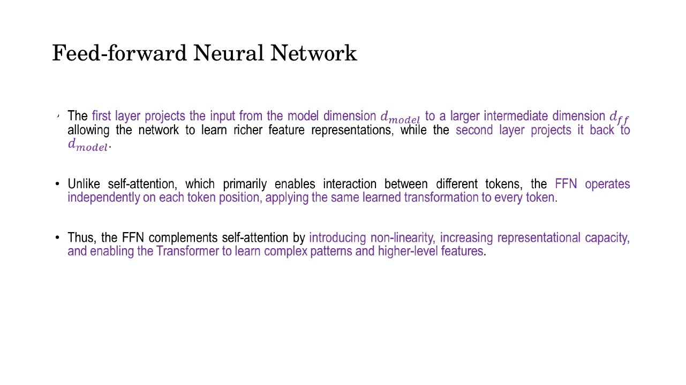
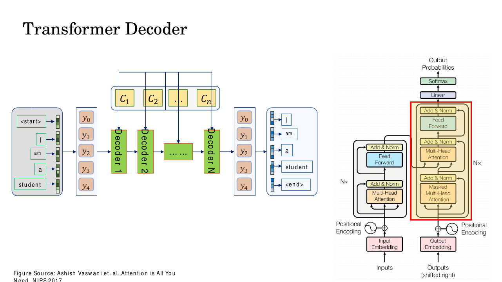
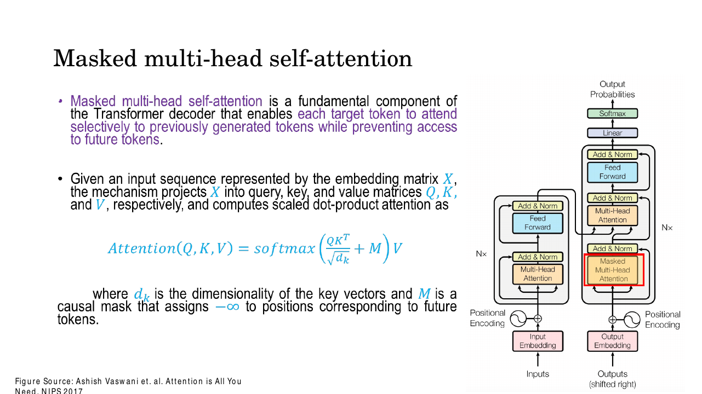
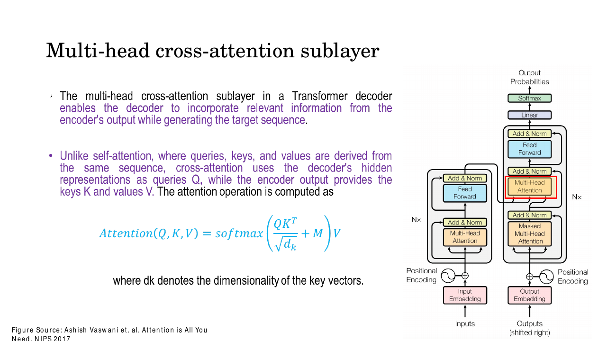
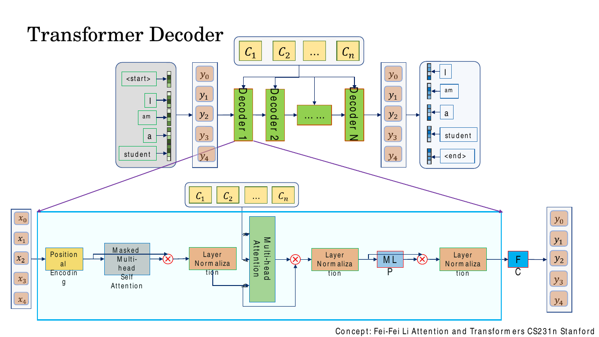
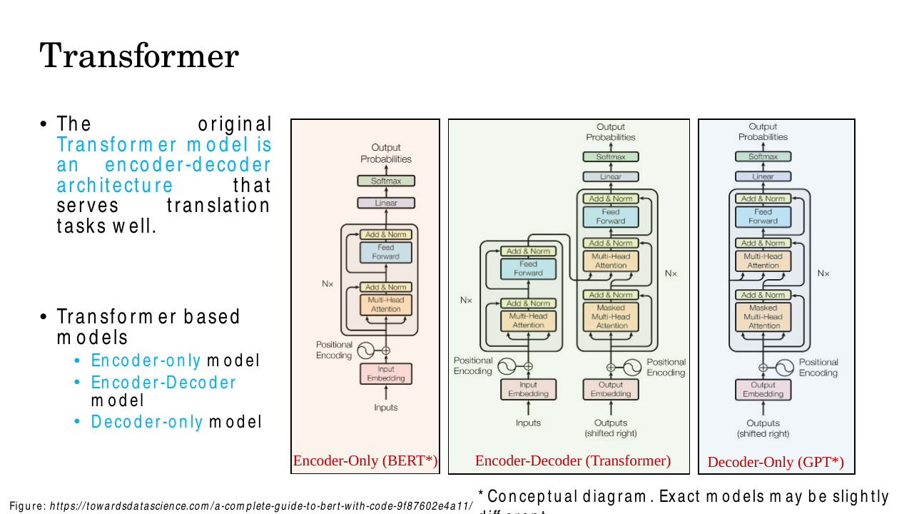

# Lec 27 — Transformers IV: The Decoder and the Full Architecture

> **Deck:** `L8P6_Transformer-4.pptx` · **Week 7** · **Playlist:** Lec 27
> **Prereqs:** [Lec 25 — Q/K/V and Self-Attention](25-qkv-and-self-attention.md), [Lec 26 — Encoder and Positional Encoding](26-encoder-and-positional-encoding.md)
> **Feeds into:** [Lec 28 — ViT, DETR, Swin](../week-08/28-vit-detr-swin.md)

## Why this lecture exists

Lec 26 left the encoder with two boxes drawn but not explained: **Add & Norm** and the
**feed-forward network**. You were told where they sit and promised the reasoning later. This is
later. And the encoder on its own only *reads* — it turns a source sentence into a pile of context
vectors and stops. Nothing so far can *write*. Translation, captioning and every generative use of a
Transformer need a second stack that emits one token at a time, consults the encoder's output while
doing it, and is forbidden from peeking at the token it has not produced yet. That stack is the
**decoder**, and the one new mechanism inside it — **cross-attention** — is the hinge the whole
encoder–decoder architecture turns on. By the end of this chapter you can draw the complete 2017
Transformer from memory and count its parameters.

## The ideas

### Where we are: the encoder, minus two boxes

Recall the encoder block from [Lec 26](26-encoder-and-positional-encoding.md): embed the tokens, add
positional encoding, run multi-head self-attention, then — the parts we deferred — Add & Norm, a
feed-forward network, and Add & Norm again.


*Fig. — Follow the thin red arrows: each jumps **around** a sublayer and rejoins at a `+`. Those are the skip connections. The deck's example is the Irish sentence *"Is mac léinn mé"* — four tokens in, four out, same width, every time. That shape invariance is what lets you stack these blocks six deep. Slide 17.*

### Add & Norm, part 1: why the skip connection

The deck's slide 11 asks the question directly. The **Add** half of Add & Norm is a **residual (skip)
connection** — the sublayer's input is added, unchanged, to the sublayer's output:

$$\text{Output} = \mathbf{x} + \text{Sublayer}(\mathbf{x})$$

Four reasons, all on the slide, and all worth having in exact words:

- **Gradient flow.** Differentiating gives $\partial(\mathbf{x} + \mathcal{F}(\mathbf{x}))/\partial\mathbf{x} = \mathbf{I} + \partial\mathcal{F}/\partial\mathbf{x}$. The $\mathbf{I}$ term is an **additive highway**: even if the sublayer's own Jacobian shrinks towards zero, the gradient from above still passes through at full strength. The derivation is [Lec 14](../week-04/14-resnet.md)'s.
- **Information preservation.** The input survives to the next layer. Without the skip, every sublayer would have to *reconstruct* everything useful about its input as well as add something new.
- **Deep stacks become trainable.** This is why it matters *here*. The base model stacks 6 encoder and 6 decoder blocks of two or three sublayers each, so a gradient travelling from the loss to the input embedding passes through roughly 30 sublayers — a 30-factor product of Jacobians, exactly the vanishing-gradient regime ([Lec 13](../week-03/13-vanishing-gradients-activations.md)).
- **Incremental refinement.** Each sublayer learns a *correction* $\mathcal{F}(\mathbf{x})$ to an already-sensible representation rather than one from scratch. A sublayer with nothing to contribute learns $\mathcal{F} \approx \mathbf{0}$ and degenerates harmlessly to the identity.


*Fig. — The four bullets are the examinable list. "Allows incremental refinement" is the one students forget: a residual block only has to learn the **difference**, not the whole function. Slide 11.*

One mechanical consequence: the addition requires the sublayer's output to have **exactly the same
shape as its input**. That is the real reason every sublayer in a Transformer — attention and FFN
alike — maps $d_{\text{model}} \to d_{\text{model}}$.

### Add & Norm, part 2: why normalisation

The **Norm** half applies **layer normalization** to the sum, so the complete operation is

$$\text{Output} = \mathrm{LayerNorm}\big(\mathbf{x} + \text{Sublayer}(\mathbf{x})\big)$$

Why normalise at all? Attention and the FFN repeatedly multiply the representation by learned
matrices, and nothing constrains the scale of the result: after six blocks the activations can drift
to magnitudes of $10^3$ or collapse towards $10^{-3}$, depending on initialisation. Both are bad —
large activations saturate downstream softmaxes, small ones kill the gradient signal. The deck's
list:

- **stabilises the distribution of activations**,
- **makes optimisation easier** (the loss surface becomes better-conditioned, so a single learning rate works across all layers),
- **improves training stability**,
- **allows deeper networks to train effectively**,
- **reduces sensitivity to variations in the magnitude of activations** — and therefore to the initialisation you happened to draw.


*Fig. — Read the formula carefully: the norm is applied **after** the add, to the sum. `LayerNorm(x + Sublayer(x))`, not `LayerNorm(x) + Sublayer(x)`. Slide 12.*

### Layer normalization: the formula

For a single token's feature vector $\mathbf{a} = [a_1, \dots, a_d]$ with $d = d_{\text{model}}$:

$$\mu = \frac{1}{d}\sum_{i=1}^{d} a_i, \qquad \sigma^2 = \frac{1}{d}\sum_{i=1}^{d}(a_i - \mu)^2$$

$$\hat{a}_i = \frac{a_i - \mu}{\sqrt{\sigma^2 + \epsilon}}, \qquad y_i = \gamma_i\,\hat{a}_i + \beta_i$$

Three things to take from this.

**The statistics are computed across the feature dimension, for one token, independently.** Token 3
of sentence 7 has its own $\mu$ and $\sigma^2$, from its own 512 numbers. No other token and no other
sentence is involved.

**$\epsilon$** is a small constant (typically $10^{-5}$) inside the square root, stopping division by
zero when a token's features happen to be all equal.

**$\gamma$ and $\beta$ are learned parameters**, one pair per feature, so $2d_{\text{model}}$ numbers
per LayerNorm. They exist because forcing every representation to zero mean and unit variance is a
*constraint* the data may not want. With $\gamma$ and $\beta$ the layer can learn to undo the
normalisation entirely ($\gamma_i = \sigma, \beta_i = \mu$ recovers the input), so normalisation costs
nothing in representational power while handing the optimiser a far better-conditioned problem.

### Why layer norm and not batch norm

Both compute a mean and a variance and both standardise; they differ in **what they average over**.
Arrange the activations as a tensor of shape (batch $B$, sequence length $T$, features $d$).

- **Batch norm** computes $\mu,\sigma^2$ for each *feature*, averaging over the batch and sequence axes. One statistic per feature, shared across every token in the batch.
- **Layer norm** computes $\mu,\sigma^2$ for each *token*, averaging over the feature axis. One statistic per token, shared with nothing.

```
       features (d) ------->
     +---------------------------+
  t0 |###########################|   LayerNorm: average along a ROW
  t1 |###########################|   (one token, all its features)
  t2 |###########################|
     +---------------------------+
        |  |  |  |  |  |  |  |
        v  v  v  v  v  v  v  v
     BatchNorm: average down a COLUMN, across every token in every
     sentence in the batch.
```

Why that difference is fatal for batch norm in a Transformer:

| Problem | Batch norm | Layer norm |
|---|---|---|
| **Different sequence lengths** | Column statistics are contaminated by padding, by an amount depending on which sentences shared the batch | Each real token normalises itself; padding is never normalised |
| **Small or size-1 batches** | $\sigma^2$ from few samples is noisy; batch size 1 is meaningless | Identical at batch size 1 and 1024 |
| **Train/test mismatch** | Needs running averages of $\mu,\sigma^2$ swapped in at test time — two behaviours | Same computation both times; no running statistics |
| **Autoregressive generation** | At step $t$ there is one sequence of length $t$; batch statistics are unavailable | Works unchanged, token by token |
| **Coupling between examples** | A sentence's output depends on its batch-mates | Each token depends only on itself |

The one-line answer for an exam: **layer norm normalises across the feature dimension of each token
independently, which makes it insensitive to batch size and to variable sequence length — exactly the
two things batch norm cannot tolerate.**

### Post-norm versus pre-norm

The deck and the 2017 paper use **post-norm**,
$\mathrm{LayerNorm}(\mathbf{x} + \text{Sublayer}(\mathbf{x}))$: the norm sits *on* the residual path,
interrupting the identity highway at every block. Modern implementations overwhelmingly use
**pre-norm**, $\mathbf{x} + \text{Sublayer}(\mathrm{LayerNorm}(\mathbf{x}))$, where the residual
stream is never touched and the highway runs clean from input to output. Pre-norm trains without a
learning-rate warm-up and is markedly more stable past about 12 layers; post-norm usually reaches
slightly better final quality when it converges at all. **For this course, post-norm is the answer** —
it is what is on the slide and in the paper.

### The position-wise feed-forward network

The second deferred box. After attention, every block applies a small two-layer MLP:

$$\mathrm{FFN}(\mathbf{x}) = \max(0,\ \mathbf{x}\mathbf{W}_1 + \mathbf{b}_1)\,\mathbf{W}_2 + \mathbf{b}_2$$

The deck writes the same thing with column vectors and a generic activation,
$\mathrm{FFN}(\mathbf{x}) = \mathbf{W}_2\,\sigma(\mathbf{W}_1\mathbf{x} + \mathbf{b}_1) + \mathbf{b}_2$,
and notes the activation is "ReLU or GELU". The original paper uses ReLU, hence the $\max(0,\cdot)$
([Lec 13](../week-03/13-vanishing-gradients-activations.md) owns ReLU).


*Fig. — Two linear layers, one non-linearity between them. That is the entire FFN. Slide 14.*

**The dimensions.** $\mathbf{W}_1$ is $d_{\text{model}} \times d_{\text{ff}}$ and $\mathbf{W}_2$ is
$d_{\text{ff}} \times d_{\text{model}}$. In the base model $d_{\text{model}} = 512$ and
$d_{\text{ff}} = 2048$, so the FFN **expands 4×, applies the non-linearity in the wide space, then
projects back**. The wide middle is where the capacity lives: the FFN holds roughly two-thirds of a
block's parameters (see N3).

**"Position-wise" is the word that carries the content, and the detail most often missed.** The *same*
$\mathbf{W}_1, \mathbf{b}_1, \mathbf{W}_2, \mathbf{b}_2$ are applied to **every token independently**.
Token 1 and token 40 go through identical weights and never interact inside the FFN. Equivalently:
the FFN is a $1\times1$ convolution along the sequence, a single MLP broadcast over the time axis.


*Fig. — "The FFN operates independently on each token position, applying the same learned transformation to every token." Memorise that sentence; it is the definition of position-wise. Slide 15.*

**Why it is there at all.** Attention is a *mixing* operation: it computes a weighted average of the
value vectors. However clever the weights, the output is a **convex combination of the values**, and
the values are themselves a *linear* projection of the input — so with its attention weights held
fixed, an attention sublayer is a linear map, and stacking linear maps gives a linear map. The FFN
supplies the per-position **non-linear** transformation that attention structurally cannot:

| Sublayer | Mixes across positions? | Non-linear? |
|---|---|---|
| Multi-head attention | **Yes** — that is its whole job | No (linear in $\mathbf{V}$, given the weights) |
| Position-wise FFN | **No** — each position in isolation | **Yes** (ReLU in the middle) |

Those two together are the Transformer block. Everything else is plumbing.

### The decoder: what problem it solves

The encoder reads the whole source at once and emits context vectors
$\mathbf{c}_1, \dots, \mathbf{c}_n$. The decoder's job is to **produce the target sequence one token
at a time**, conditioned on (a) what it has already produced and (b) those context vectors.


*Fig. — The two input streams. Bottom-left: the target sequence shifted right, beginning with `<start>`. Top: the encoder's context vectors $\mathbf{c}_1 \dots \mathbf{c}_n$, which fan out to **every** decoder layer. Output is shifted one step: feed `<start> I am a student`, predict `I am a student <end>`. Slide 19.*

A decoder block therefore takes **two** inputs where an encoder block takes one: the sequence
$\mathbf{x}$ from the previous decoder layer, and the context set $\mathbf{c}$ from the encoder. Its
token inputs are embedded and get positional encoding exactly as
[Lec 26](26-encoder-and-positional-encoding.md) describes — same sinusoids, target side instead of
source side.

### Sublayer 1: masked multi-head self-attention

The first sublayer lets each target position attend to the target positions **before it, and itself,
and nothing after**. The mechanism — add a mask $\mathbf{M}$ of $0$ and $-\infty$ to the scores
before the softmax, so forbidden positions receive weight exactly zero — belongs to
[Lec 25](25-qkv-and-self-attention.md). The deck writes the masked form as

$$\mathrm{Attention}(\mathbf{Q},\mathbf{K},\mathbf{V}) = \mathrm{softmax}\!\left(\frac{\mathbf{Q}\mathbf{K}^\top}{\sqrt{d_k}} + \mathbf{M}\right)\mathbf{V}$$

What matters here is **why the decoder needs it**: the **autoregressive property**. The model is
trained to predict token $t+1$ from tokens $1..t$. During training the entire target sentence sits in
memory at once — that is what makes Transformers parallel — so without a mask, position $t$ would see
position $t+1$, the very token it is being asked to predict. Training accuracy would be perfect and
the model worthless at test time, when the future genuinely does not exist. The causal mask makes the
parallel training computation produce *exactly* the numbers a sequential one would.


*Fig. — The highlighted box is the **bottom** attention block of the decoder — the first thing the target embeddings hit. $\mathbf{M}$ assigns $-\infty$ to future positions. Slide 22.*

Note which attention sublayers are masked: **only this one**. The encoder's self-attention is
unmasked (the source sentence is fully available, and a word may legitimately depend on a later
word). Cross-attention is unmasked (all source positions are visible at all times).

### Sublayer 2: multi-head cross-attention — the bridge

This is the new idea, and the single most examinable fact in the chapter.

**Cross-attention uses the same scaled dot-product machinery as self-attention, but the queries and
the keys/values come from different places:**

$$\mathbf{Q} = \mathbf{H}_{\text{dec}}\mathbf{W}^Q, \qquad \mathbf{K} = \mathbf{H}_{\text{enc}}\mathbf{W}^K, \qquad \mathbf{V} = \mathbf{H}_{\text{enc}}\mathbf{W}^V$$

> **Q from the decoder. K and V from the encoder.** Say it three times.

In self-attention, $\mathbf{Q}, \mathbf{K}, \mathbf{V}$ are three projections of *one* sequence; in
cross-attention they are projections of *two*. Read it semantically: the decoder position asks a
question ("I am about to emit a verb — which source word is it?"), that question is matched against a
key for every source position, and the answer is assembled from the source values. It is the
retrieval reading of attention from [Lec 25](25-qkv-and-self-attention.md), with the query desk and
the filing cabinet in different rooms.


*Fig. — "Unlike self-attention, where queries, keys, and values are derived from the same sequence, cross-attention uses the decoder's hidden representations as queries $\mathbf{Q}$, while the encoder output provides the keys $\mathbf{K}$ and values $\mathbf{V}$." This sentence is the chapter. The highlighted box is the **middle** attention block in the decoder. Slide 24.*

**The shape consequence, which is the concept made visible.** Let the source have $S$ tokens and the
target prefix $T$ tokens. Then $\mathbf{Q}$ is $T \times d_k$ while $\mathbf{K}$ is $S \times d_k$, so

$$\mathbf{Q}\mathbf{K}^\top \ \text{is}\ T \times S$$

a **rectangular** matrix — not square, unlike every self-attention matrix you have seen. Row $i$ is
the distribution over source positions that target position $i$ attends to, and it **sums to 1 across
the $S$ source positions**. Multiplying by $\mathbf{V}$ ($S \times d_v$) gives a $T \times d_v$
output: one context vector per *target* position, the $S$ axis summed away. N1 and N4 make this
concrete.

Three further facts from slide 25:

- It is **multi-head**: $h$ independent $(\mathbf{W}^Q, \mathbf{W}^K, \mathbf{W}^V)$ triples, concatenated and passed through $\mathbf{W}^O$, so different heads latch onto different source–target relationships.
- The same encoder output $\mathbf{H}_{\text{enc}}$ feeds **all $N$ decoder layers**. The encoder runs once; its output is reused six times.
- The result goes through a residual connection and layer normalization like every other sublayer.

This is also where the Transformer's descent from the Bahdanau alignment of
[Lec 19](../week-05/19-gru-seq2seq-attention.md) is clearest — same idea (let the decoder look back
at the source), different scoring function, no recurrence.

### Sublayer 3: the FFN, and the three Add & Norms

The third sublayer is the same position-wise FFN, same $d_{\text{ff}} = 2048$ expansion. Every one of
the three sublayers is wrapped in Add & Norm. The full block, in order:

```
x  ──► Masked multi-head self-attention ──► Add & Norm ──►
   ──► Multi-head CROSS-attention  (K,V from encoder)  ──► Add & Norm ──►
   ──► Position-wise feed-forward network             ──► Add & Norm ──►  out
```


*Fig. — The expanded block (bottom) against the stack (top). Trace the arrow from the $\mathbf{c}$ boxes: it enters **only** the middle attention block, and it enters as keys and values. The circled symbols on the residual paths are drawn as $\otimes$ on the slide but are **additions** — compare the `+` signs on slide 17. Slide 21.*

### Encoder block versus decoder block

| | Encoder block | Decoder block |
|---|---|---|
| Sublayers | **2** | **3** |
| Sublayer 1 | Multi-head self-attention, **unmasked** | Multi-head self-attention, **masked (causal)** |
| Sublayer 2 | Position-wise FFN | Multi-head **cross-attention** — Q from decoder, K/V from encoder, **unmasked** |
| Sublayer 3 | — | Position-wise FFN |
| Add & Norm count | 2 | **3** |
| Inputs | one sequence | **two**: previous decoder layer + encoder output |
| Attention matrix shape | $S \times S$ | $T\times T$ (masked) and $T \times S$ (cross) |
| Sees the future? | Yes, freely | **No**, in sublayer 1 |
| Params (base model) | 3,150,336 | 4,199,936 |

### The full architecture


*Fig. — The whole machine. Left stack ×6, right stack ×6, and the arrow from the top of the encoder entering the **middle** attention block of every decoder layer. The decoder's input is labelled "Outputs (shifted right)" — that shift is the `<start>` token. Slides 22/24/29.*

Reading it bottom to top:

1. **Source tokens** → input embedding ($d_{\text{model}} = 512$) → + positional encoding.
2. **$N = 6$ encoder blocks** → $\mathbf{H}_{\text{enc}}$, shape $S \times 512$.
3. **Target tokens, shifted right** → output embedding → + positional encoding.
4. **$N = 6$ decoder blocks**, each consuming $\mathbf{H}_{\text{enc}}$ at its cross-attention sublayer.
5. **Final linear projection** $512 \to |\mathcal{V}|$: each target position's 512-d vector becomes one logit per vocabulary word.
6. **Softmax** over the vocabulary ([Lec 8](../week-02/08-mlp-and-activations.md)) → a next-token distribution at every position.

The deck's framing: *"the original Transformer model is an encoder-decoder architecture that serves
translation tasks well."* That is what it was built for — WMT English→German — and the shape follows
from the task: read all of one language, write all of another.

### Autoregressive decoding, `<start>`, and teacher forcing

**At training time** you already know the whole target, so you feed it at once as
`<start> I am a student` and ask the model to predict `I am a student <end>` at the matching
positions. Feeding the *ground-truth* previous tokens rather than the model's own guesses is
**teacher forcing**; it is what makes the causal mask necessary and training a *single* forward pass.

**At inference time** the target does not exist yet, so you build it:

1. Run the encoder once. Keep $\mathbf{H}_{\text{enc}}$.
2. Feed `<start>`; take the output distribution at position 1, pick a token (`I`).
3. Feed `<start> I`; take the distribution at position 2, pick `am`.
4. Feed `<start> I am`. … and so on, stopping when the sampled token is `<end>`.

That is $T$ sequential decoder passes for a $T$-token output, against the encoder's **one**. This
asymmetry is where Transformer inference cost lives: the encoder is fully parallel, and so is the
decoder *at training time*, but the decoder is fundamentally serial when generating. N5 counts it.
Note too the wasted work in step 4 — recomputing keys and values that step 3 already had.
Production code keeps a **KV cache** so each step computes only the new position.

### Three families of Transformer

Slide 29's taxonomy, which [Lec 28](../week-08/28-vit-detr-swin.md) builds on:

| Family | Stacks | Attention | Model | Good at |
|---|---|---|---|---|
| **Encoder-only** | encoder ×$N$ | bidirectional self-attention, unmasked | BERT | understanding: classification, tagging, retrieval — ViT is this shape |
| **Encoder–decoder** | both | all three kinds | original Transformer, T5 | sequence-to-sequence: translation, summarisation, captioning |
| **Decoder-only** | decoder ×$N$, **cross-attention removed** | masked self-attention only | GPT | free-running generation |


*Fig. — Compare the middle and right diagrams: the decoder-only stack has **two** sublayers, not three, because with no encoder there is nothing to cross-attend to. A decoder-only block is a masked-attention block plus an FFN. Slide 29.*

## Worked numericals

### N1. Cross-attention: 2 decoder queries against 4 encoder positions
**Given:** a decoder with $T = 2$ target positions and an encoder output of $S = 4$ source positions,
$d_k = d_v = 2$. After projection,

$$\mathbf{Q}_{\text{dec}} = \begin{bmatrix}1&0\\0&2\end{bmatrix}_{2\times2},\quad
\mathbf{K}_{\text{enc}} = \begin{bmatrix}1&0\\0&1\\1&1\\-1&0\end{bmatrix}_{4\times2},\quad
\mathbf{V}_{\text{enc}} = \begin{bmatrix}1&0\\0&1\\1&1\\2&-1\end{bmatrix}_{4\times2}$$

**Find:** the $2\times4$ attention matrix and the context output.

1. **Shapes first.** $\mathbf{Q}\mathbf{K}^\top$ is $[2\times\mathbf{2}]\cdot[\mathbf{2}\times4] = [2\times4]$. Two rows (target), four columns (source). Not square — that asymmetry *is* cross-attention.
2. **Raw scores** $\mathbf{Q}\mathbf{K}^\top$. Row 1 ($\mathbf{q}_1 = [1,0]$): $[1\cdot1+0\cdot0,\ 1\cdot0+0\cdot1,\ 1\cdot1+0\cdot1,\ 1\cdot(-1)+0\cdot0] = [1,\ 0,\ 1,\ -1]$. Row 2 ($\mathbf{q}_2 = [0,2]$): $[0,\ 2,\ 2,\ 0]$.
3. **Scale** by $\sqrt{d_k} = \sqrt{2} = 1.4142$ (the reason for this divisor is [Lec 25](25-qkv-and-self-attention.md)'s):
 row 1 $= [0.7071,\ 0,\ 0.7071,\ -0.7071]$; row 2 $= [0,\ 1.4142,\ 1.4142,\ 0]$.
4. **Softmax row 1.** $e^{0.7071} = 2.0281$, $e^{0} = 1$, $e^{0.7071} = 2.0281$, $e^{-0.7071} = 0.4931$. Sum $= 5.5493$.
 $\boldsymbol{\alpha}_1 = [2.0281,\ 1,\ 2.0281,\ 0.4931]/5.5493 = [0.3655,\ 0.1802,\ 0.3655,\ 0.0889]$. Sum $= 1.000$ ✓
5. **Softmax row 2.** $e^{0} = 1$, $e^{1.4142} = 4.1133$, $e^{1.4142} = 4.1133$, $e^{0} = 1$. Sum $= 10.2266$.
 $\boldsymbol{\alpha}_2 = [0.0978,\ 0.4022,\ 0.4022,\ 0.0978]$. Sum $= 1.000$ ✓
6. **Context, row 1** $= \sum_j \alpha_{1j}\mathbf{v}_j$:
 first component $= 0.3655(1) + 0.1802(0) + 0.3655(1) + 0.0889(2) = 0.3655 + 0 + 0.3655 + 0.1778 = 0.9086$;
 second $= 0.3655(0) + 0.1802(1) + 0.3655(1) + 0.0889(-1) = 0 + 0.1802 + 0.3655 - 0.0889 = 0.4568$.
7. **Context, row 2**: first $= 0.0978 + 0 + 0.4022 + 0.1956 = 0.6956$; second $= 0 + 0.4022 + 0.4022 - 0.0978 = 0.7066$.

**Answer:** $\mathbf{A} = \begin{bmatrix}0.3655&0.1802&0.3655&0.0889\\0.0978&0.4022&0.4022&0.0978\end{bmatrix}$ ($2\times4$),
output $= \begin{bmatrix}0.9086&0.4568\\0.6956&0.7066\end{bmatrix}$ ($2\times2$).
**Four source positions went in, two target context vectors came out.** The $S = 4$ axis is summed
away; the output always has one row per *target* position. Rows sum to 1 across the **source**.

### N2. Layer normalization by hand
**Given:** one token's activation vector $\mathbf{a} = [2, 4, 4, 4, 5, 5, 7, 9]$ ($d = 8$), with
$\gamma_i = 2$ and $\beta_i = 1$ for every feature, $\epsilon = 10^{-5}$.
**Find:** the normalised output.

1. **Mean:** $\mu = (2+4+4+4+5+5+7+9)/8 = 40/8 = 5$.
2. **Deviations:** $[-3, -1, -1, -1, 0, 0, 2, 4]$.
3. **Squared deviations:** $[9, 1, 1, 1, 0, 0, 4, 16]$, summing to $32$.
4. **Variance:** $\sigma^2 = 32/8 = 4$. (Divide by $d$, not $d-1$ — this is the population form.)
5. **Denominator:** $\sqrt{4 + 10^{-5}} = 2.0000025 \approx 2$.
6. **Normalise:** $\hat{\mathbf{a}} = [-3,-1,-1,-1,0,0,2,4]/2 = [-1.5, -0.5, -0.5, -0.5, 0, 0, 1, 2]$. Check: mean $= 0$, variance $= (2.25+0.25+0.25+0.25+0+0+1+4)/8 = 8/8 = 1$ ✓
7. **Scale and shift:** $y_i = 2\hat{a}_i + 1$:
 $[2(-1.5)+1,\ 2(-0.5)+1,\ 2(-0.5)+1,\ 2(-0.5)+1,\ 1,\ 1,\ 2(1)+1,\ 2(2)+1]$.

**Answer:** $\mathbf{y} = [-2,\ 0,\ 0,\ 0,\ 1,\ 1,\ 3,\ 5]$.
After $\gamma,\beta$ the mean is $\beta = 1$ and the standard deviation is $|\gamma| = 2$, as you can
verify. Nothing about any other token or any other sentence entered this calculation — that is layer
norm.

### N3. Parameter count of the full base Transformer
**Given:** $d_{\text{model}} = 512$, $h = 8$ (so $d_k = d_v = 64$), $d_{\text{ff}} = 2048$, $N = 6$
encoder + $6$ decoder blocks, shared vocabulary $|\mathcal{V}| = 37{,}000$, tied embedding/output
weights, sinusoidal (parameter-free) positional encoding, no biases on attention projections.
**Find:** the total.

1. **One multi-head attention sublayer.** $\mathbf{W}^Q, \mathbf{W}^K, \mathbf{W}^V$ are each $512\times512$ (the $h$ per-head $512\times64$ blocks concatenated), plus the output projection $\mathbf{W}^O$ at $512\times512$. So $4 \times 512 \times 512 = 4 \times 262{,}144 = \mathbf{1{,}048{,}576}$. **The head count does not change this** — splitting 512 into 8×64 is a reshape, not extra parameters.
2. **One FFN.** $\mathbf{W}_1: 512\times2048 = 1{,}048{,}576$; $\mathbf{b}_1: 2048$; $\mathbf{W}_2: 2048\times512 = 1{,}048{,}576$; $\mathbf{b}_2: 512$. Total $= \mathbf{2{,}099{,}712}$.
3. **One LayerNorm.** $\gamma$ and $\beta$, each of length 512: $\mathbf{1{,}024}$.
4. **One encoder block** $= 1{,}048{,}576 + 2{,}099{,}712 + 2(1{,}024) = \mathbf{3{,}150{,}336}$.
5. **One decoder block** $= 2(1{,}048{,}576) + 2{,}099{,}712 + 3(1{,}024) = 2{,}097{,}152 + 2{,}099{,}712 + 3{,}072 = \mathbf{4{,}199{,}936}$.
6. **Encoder stack** $= 6 \times 3{,}150{,}336 = 18{,}902{,}016$.
7. **Decoder stack** $= 6 \times 4{,}199{,}936 = 25{,}199{,}616$.
8. **Both stacks** $= 18{,}902{,}016 + 25{,}199{,}616 = 44{,}101{,}632$.
9. **Embeddings.** One shared matrix $37{,}000 \times 512 = 18{,}944{,}000$, used for the source embedding, the target embedding **and** the final linear projection (weight tying). Positional encoding adds 0.
10. **Total** $= 44{,}101{,}632 + 18{,}944{,}000 = 63{,}045{,}632$.

**Answer:** $\approx 63.0$M parameters, against the paper's stated **65M** for the base model. The
gap is vocabulary-dependent: at $|\mathcal{V}| = 41{,}000$ the same arithmetic gives
$44{,}101{,}632 + 20{,}992{,}000 = 65{,}093{,}632 \approx 65$M.
Two proportions worth carrying: **the FFN is 67% of an encoder block** ($2.10$M of $3.15$M), and
**embeddings are 30% of the whole model**. The LayerNorms, which get all the conceptual airtime, are
$0.03\%$.

### N4. Tensor shapes end to end through a decoder block
**Given:** batch $B = 2$, source length $S = 7$, target length $T = 5$, $d_{\text{model}} = 512$,
$h = 8$ ($d_{\text{head}} = 64$), $d_{\text{ff}} = 2048$, $|\mathcal{V}| = 37{,}000$. Encoder output
is $(2, 7, 512)$.
**Find:** every intermediate shape.

| Step | Shape |
|---|---|
| Target token ids | $(2, 5)$ |
| Output embedding $+$ positional encoding | $(2, 5, 512)$ |
| Masked self-attn $\mathbf{Q},\mathbf{K},\mathbf{V}$ per head | $(2, 8, 5, 64)$ each |
| Masked self-attn scores (**square**, causally masked) | $(2, 8, 5, 5)$ |
| Heads concatenated, $\times\mathbf{W}^O$, Add & Norm | $(2, 5, 512)$ |
| **Cross-attn $\mathbf{Q}$ — from the decoder** | $(2, 8, \mathbf{5}, 64)$ |
| **Cross-attn $\mathbf{K},\mathbf{V}$ — from the encoder** | $(2, 8, \mathbf{7}, 64)$ |
| **Cross-attn scores — rectangular**, softmax over the last axis | $(2, 8, \mathbf{5}, \mathbf{7})$ |
| Context $= \mathbf{A}\mathbf{V}$, concatenated, $\times\mathbf{W}^O$, Add & Norm | $(2, 5, 512)$ |
| FFN hidden (the 4× expansion) | $(2, 5, 2048)$ |
| FFN output, Add & Norm; and after all 6 blocks | $(2, 5, 512)$ |
| Final linear $512 \to 37{,}000$, then softmax | $(2, 5, 37{,}000)$ |

**Answer:** the only place $S = 7$ and $T = 5$ meet is the cross-attention score tensor
$(2, 8, 5, 7)$ — $2\times8\times5\times7 = 560$ scores. Everywhere else the decoder stream stays
$(2, 5, \cdot)$: **cross-attention consumes the source length and does not propagate it.** That is why
source and target may have completely different lengths without any padding tricks.

### N5. Forward passes: encoder once, decoder twenty times
**Given:** a source of 12 tokens, a generated target of 20 tokens, $N = 6$ blocks per stack.
**Find:** the forward-pass counts at training and at inference.

1. **Encoder, always:** **1** pass. All 12 source positions are processed simultaneously; there is no sequential dependency.
2. **Decoder at training (teacher forcing):** **1** pass. The full 20-token target is fed at once and the causal mask makes position $t$ behave as if it had only seen $1..t$.
3. **Decoder at inference:** **20** passes — one per emitted token. Step $t$ processes a prefix of length $t$.
4. **Decoder blocks executed at inference:** $20 \times 6 = 120$.
5. **Self-attention score entries computed, naive re-run:** step $t$ builds a $t \times t$ matrix, so $\sum_{t=1}^{20} t^2 = \frac{20 \cdot 21 \cdot 41}{6} = 2870$ per head per layer.
6. **With a KV cache:** step $t$ computes only the new query's row, $1 \times t$, so $\sum_{t=1}^{20} t = \frac{20 \cdot 21}{2} = 210$ — a $13.7\times$ saving.
7. **Cross-attention:** the encoder's $\mathbf{K},\mathbf{V}$ never change during generation, so they are computed **once** and reused for all 20 steps. Each step costs a $1 \times 12$ score row.

**Answer:** training $= 1$ encoder pass $+\ 1$ decoder pass. Inference $= 1$ encoder pass $+\ 20$
decoder passes. The 20× gap between training and inference cost is the structural price of
autoregression, and it is unchanged from the RNN days — what the Transformer removed is the
sequential bottleneck in *training*, not in *generation*.

## Code

```python
import numpy as np
np.set_printoptions(precision=4, suppress=True)

def softmax(z, axis=-1):
    z = z - z.max(axis=axis, keepdims=True)      # stabilise; see Lec 8
    e = np.exp(z)
    return e / e.sum(axis=axis, keepdims=True)

# ---- 1. CROSS-ATTENTION: Q from the decoder, K and V from the encoder (N1) ----
Q_dec = np.array([[1., 0.],                      # 2 TARGET positions, d_k = 2
                  [0., 2.]])
K_enc = np.array([[ 1., 0.],                     # 4 SOURCE positions, d_k = 2
                  [ 0., 1.],
                  [ 1., 1.],
                  [-1., 0.]])
V_enc = np.array([[1.,  0.],                     # 4 SOURCE positions, d_v = 2
                  [0.,  1.],
                  [1.,  1.],
                  [2., -1.]])
d_k = Q_dec.shape[1]
scores = Q_dec @ K_enc.T / np.sqrt(d_k)          # (2,2)@(2,4) -> (2,4): NOT square
A   = softmax(scores)                            # row-wise, over the 4 source keys
ctx = A @ V_enc                                  # (2,4)@(4,2) -> (2,2)
print("scores ", scores.shape, "\n", scores)
print("attn   ", A.shape, " row sums", A.sum(1), "\n", A)
print("context", ctx.shape, "\n", ctx)
# scores  (2, 4)
#  [[ 0.7071  0.      0.7071 -0.7071]
#   [ 0.      1.4142  1.4142  0.    ]]
# attn    (2, 4)  row sums [1. 1.]
#  [[0.3655 0.1802 0.3655 0.0889]
#   [0.0978 0.4022 0.4022 0.0978]]
# context (2, 2)
#  [[0.9086 0.4568]
#   [0.6956 0.7066]]

# ---- 2. LAYER NORMALIZATION over the feature axis of one token (N2) ----
def layer_norm(x, gamma, beta, eps=1e-5):
    mu  = x.mean(axis=-1, keepdims=True)         # LAST axis = features, never the batch
    var = x.var(axis=-1, keepdims=True)
    return gamma * (x - mu) / np.sqrt(var + eps) + beta

x = np.array([2., 4., 4., 4., 5., 5., 7., 9.])   # one token, d_model = 8
print("mean", x.mean(), "var", x.var(), "std", x.std())
print("normed", layer_norm(x, 1.0, 0.0))
print("gamma=2, beta=1:", layer_norm(x, 2.0, 1.0))
# mean 5.0 var 4.0 std 2.0
# normed [-1.5 -0.5 -0.5 -0.5  0.   0.   1.   2. ]
# gamma=2, beta=1: [-2.  0.  0.  0.  1.  1.  3.  5.]

# batch-independence: put the same token in a wildly different batch -> same output
batch = np.stack([x, 100 * x, x - 50])
print("row 0 unchanged:", np.allclose(layer_norm(batch, 1., 0.)[0], layer_norm(x, 1., 0.)))
# row 0 unchanged: True        <- batch norm would FAIL this test

# ---- 3. SHAPE TRACE through one decoder block (N4) ----
B, S_len, T_len, d_model, h, d_ff, Vo = 2, 7, 5, 512, 8, 2048, 37000
d_head = d_model // h
for name, shp in [
    ("target embedding + PE",         (B, T_len, d_model)),
    ("masked self-attn scores",       (B, h, T_len, T_len)),   # square: target vs target
    ("masked self-attn out",          (B, T_len, d_model)),
    ("cross-attn Q (from DECODER)",   (B, h, T_len, d_head)),
    ("cross-attn K,V (from ENCODER)", (B, h, S_len, d_head)),
    ("cross-attn scores",             (B, h, T_len, S_len)),   # RECTANGULAR: 5 x 7
    ("cross-attn out",                (B, T_len, d_model)),
    ("FFN hidden (4x expansion)",     (B, T_len, d_ff)),
    ("block output",                  (B, T_len, d_model)),
    ("logits after final Linear",     (B, T_len, Vo)),
]:
    print(f"{name:32s} {shp}")
# prints each pair above; the only tensor carrying BOTH lengths is
# "cross-attn scores  (2, 8, 5, 7)"  ->  2*8*5*7 = 560 scores.
```

The `row 0 unchanged: True` line is the whole layer-norm-versus-batch-norm argument in one assertion.
Multiply one batch member by 100 and layer norm does not move the others by a hair; batch norm would
shift every one of them.

## Exam pack

### Must-memorise

| Item | Exactly this |
|---|---|
| Residual (Add) | $\text{Output} = \mathbf{x} + \text{Sublayer}(\mathbf{x})$ |
| Add & Norm (post-norm, the paper's) | $\mathrm{LayerNorm}(\mathbf{x} + \text{Sublayer}(\mathbf{x}))$ |
| Pre-norm (modern) | $\mathbf{x} + \text{Sublayer}(\mathrm{LayerNorm}(\mathbf{x}))$ |
| Layer norm statistics | $\mu = \frac1d\sum_i a_i$, $\sigma^2 = \frac1d\sum_i (a_i-\mu)^2$ — **over features, one token** |
| Layer norm output | $y_i = \gamma_i \dfrac{a_i-\mu}{\sqrt{\sigma^2+\epsilon}} + \beta_i$ |
| LayerNorm parameter count | $2d_{\text{model}}$ ($\gamma$ and $\beta$) |
| LN vs BN, one line | LN normalises across **features per token**; BN across the **batch per feature** |
| Position-wise FFN | $\mathrm{FFN}(\mathbf{x}) = \max(0,\ \mathbf{x}\mathbf{W}_1+\mathbf{b}_1)\mathbf{W}_2+\mathbf{b}_2$ |
| Deck's FFN form | $\mathbf{W}_2\,\sigma(\mathbf{W}_1\mathbf{x}+\mathbf{b}_1)+\mathbf{b}_2$ (column convention, ReLU or GELU) |
| "Position-wise" | The **same** FFN weights applied **independently** to every token position |
| Masked attention | $\mathrm{softmax}\!\big(\tfrac{\mathbf{Q}\mathbf{K}^\top}{\sqrt{d_k}} + \mathbf{M}\big)\mathbf{V}$, $\mathbf{M}=-\infty$ on future positions |
| **Cross-attention** | $\mathbf{Q}$ from the **decoder**; $\mathbf{K},\mathbf{V}$ from the **encoder output** |
| Cross-attention score shape | $T \times S$ (target rows × source columns) — **rectangular** |
| Decoder block order | masked self-attn → A&N → cross-attn → A&N → FFN → A&N |
| Decoder output head | Linear $d_{\text{model}} \to \mid \mathcal{V}\mid $, then softmax |
| Teacher forcing | Feed the ground-truth previous tokens during training; one parallel pass |

### Numbers worth knowing

| Quantity | Value |
|---|---|
| $d_{\text{model}}$ | 512 |
| $d_{\text{ff}}$ | 2048 ( = $4 \times d_{\text{model}}$) |
| $h$ (heads) | 8, so $d_k = d_v = 64$ |
| $N$ | 6 encoder blocks **and** 6 decoder blocks |
| $\epsilon$ in LayerNorm | $\approx 10^{-5}$ |
| Sublayers per encoder block | 2 |
| Sublayers per decoder block | **3** |
| Add & Norm per decoder block | **3** |
| Masked attention sublayers in the whole model | 6 (the decoder's self-attention only) |
| Params: one attention sublayer | $4 \times 512^2 = 1{,}048{,}576$ |
| Params: one FFN | $2{,}099{,}712$ |
| Params: one LayerNorm | $1{,}024$ |
| Params: encoder block / decoder block | $3{,}150{,}336$ / $4{,}199{,}936$ |
| Params: base model total | $\approx 63$M computed at $\mid \mathcal{V}\mid =37{,}000$; paper states **65M** |
| Forward passes to emit $T$ tokens | $1$ encoder $+\ T$ decoder |
| Paper | Vaswani et al., *Attention Is All You Need*, NIPS **2017** |

### Likely MCQ traps

- **"In cross-attention, the queries come from the encoder."** Backwards, and the single most common error. **Q is from the decoder; K and V are from the encoder.** Mnemonic: the decoder asks, so it supplies the question (query); the encoder is consulted, so it supplies the index (keys) and the content (values).
- **"All three attention sublayers are masked."** Exactly one is: the decoder's *self*-attention. Encoder self-attention and cross-attention are both unmasked — the whole source is visible from the first target token. (The deck prints $\mathbf{M}$ on slide 24 too; that is a copy-paste slip.)
- **"The decoder block has two sublayers like the encoder."** Three — cross-attention is the difference, and it brings a third Add & Norm with it.
- **"Transformers use batch normalization"** / **"layer norm normalises over the batch."** Both wrong. Layer norm, over the **feature** dimension of a single token; batch-independence is why it was chosen.
- **"Layer norm has no learnable parameters."** It has $\gamma$ and $\beta$ — $2d_{\text{model}} = 1024$ in the base model.
- **"The FFN lets tokens exchange information."** It does not. Attention mixes across positions; the FFN is strictly per-position. Swapping the two is a stock MCQ.
- **"Each position has its own FFN."** *Position-wise* means the same weights are reused at every position, like a $1\times1$ convolution. Different blocks have different FFNs; different positions do not.
- **"Add & Norm means LayerNorm(x) + Sublayer(x)."** The add comes first: $\mathrm{LayerNorm}(\mathbf{x} + \text{Sublayer}(\mathbf{x}))$.
- **"More heads means more attention parameters."** No. $h$ partitions $d_{\text{model}}$; the count is $4d_{\text{model}}^2$ whether $h$ is 1, 8 or 64.
- **"The encoder runs once per generated token."** Once per **sentence**. Only the decoder is re-run.
- **"The cross-attention matrix is square."** Only when $T = S$ by coincidence. In general $T \times S$, rows summing to 1 across the **source**.
- **"Positional encoding is only added to the encoder."** The decoder's target embeddings get it too — see [Lec 26](26-encoder-and-positional-encoding.md).
- **"GPT is encoder-only, BERT is decoder-only."** Reversed. BERT = encoder-only, GPT = decoder-only, original Transformer = encoder–decoder.

### Self-test

1. In the decoder's cross-attention sublayer, where do $\mathbf{Q}$, $\mathbf{K}$ and $\mathbf{V}$ each come from?
2. A source sentence has 9 tokens, the target prefix has 4. What is the shape of the cross-attention score matrix, and along which axis does the softmax normalise?
3. Name the three sublayers of a decoder block, in order. How many Add & Norm operations does it contain?
4. Give two reasons layer norm is used instead of batch norm in a Transformer.
5. Apply layer norm with $\gamma = 1, \beta = 0$ to $[1, 2, 3, 4]$.
6. What does "position-wise" mean, and why is a non-linearity needed after attention at all?
7. How many parameters are in one encoder block of the base model? Which sublayer dominates?
8. The model must emit a 15-token translation of a 10-token sentence. How many encoder and decoder forward passes at inference? How many at training?
9. Which attention sublayers in the full Transformer are masked, and why exactly those?
10. Write the post-norm and pre-norm forms of Add & Norm. Which did the 2017 paper use, and why must every sublayer preserve its input's dimension?

<details><summary>Answers</summary>

1. $\mathbf{Q}$ from the decoder's own hidden representations (output of the masked-self-attention Add & Norm); $\mathbf{K}$ and $\mathbf{V}$ from the **encoder stack's output**, projected by $\mathbf{W}^K$ and $\mathbf{W}^V$.
2. $4 \times 9$ ($T \times S$). Softmax normalises along the **source** axis (length 9), so each of the 4 rows sums to 1.
3. Masked multi-head self-attention → multi-head cross-attention → position-wise FFN. **Three** Add & Norms, one after each.
4. Any two of: independent of batch size (works at batch size 1, hence at generation time); unaffected by variable sequence lengths and padding; identical at train and test, with no running statistics; a token's output never depends on which other examples share its batch.
5. $\mu = 2.5$, deviations $[-1.5,-0.5,0.5,1.5]$, $\sigma^2 = (2.25+0.25+0.25+2.25)/4 = 1.25$, $\sigma = 1.118$. Output $= [-1.342, -0.447, 0.447, 1.342]$.
6. The identical $\mathbf{W}_1,\mathbf{W}_2$ (and biases) are applied separately to every token; no information crosses positions inside the FFN. The non-linearity is needed because attention output is a weighted average of values that are themselves a linear projection of the input — with weights held fixed it is a linear map, and stacking linear maps gives a linear map.
7. $1{,}048{,}576$ (attention) $+ 2{,}099{,}712$ (FFN) $+ 2{,}048$ (two LayerNorms) $= 3{,}150{,}336$. The **FFN** dominates at about 67%.
8. Inference: 1 encoder pass + 15 decoder passes. Training: 1 encoder pass + 1 decoder pass, thanks to teacher forcing plus the causal mask.
9. Only the decoder's self-attention, to preserve the autoregressive property — during training the full target is in memory, so without the mask position $t$ would read position $t+1$, the token it must predict. Encoder self-attention and cross-attention are both allowed the whole source.
10. Post-norm $\mathrm{LayerNorm}(\mathbf{x}+\text{Sublayer}(\mathbf{x}))$; pre-norm $\mathbf{x}+\text{Sublayer}(\mathrm{LayerNorm}(\mathbf{x}))$. The paper and deck use **post-norm**. Dimensions must match because $\mathbf{x} + \text{Sublayer}(\mathbf{x})$ is only defined when both terms have identical shape.

</details>

## Beyond the slides

**Gap:** The deck never gives the layer-norm formula, nor contrasts it with batch norm — it names the
operation and lists its benefits.
**Why it matters:** "Compute layer norm on this vector" is a standard short-numerical, and you need
$\mu$, $\sigma^2$, $\epsilon$ and the fact that $\gamma,\beta$ are *learned*. The batch-norm contrast
is the highest-frequency Transformer MCQ outside cross-attention, and it is the reason layer norm is
in the architecture at all. N2 and the comparison table fill both holes.

**Gap:** $d_{\text{model}} = 512$, $d_{\text{ff}} = 2048$, $h = 8$, $N = 6$ appear nowhere on this
deck — slide 7 uses a 4-head toy with a 6-word sentence and explicitly says so.
**Why it matters:** Every parameter-count question keys on the real base-model numbers. Do not carry
the slide-7 toy ($h = 4$, $d_k = 128$) into an exam.

**Gap:** Post-norm versus pre-norm is not mentioned.
**Why it matters:** Every Transformer you will meet in code (GPT-2 onward, ViT, PyTorch's
`norm_first=True`) is pre-norm. Knowing both, and knowing the course examines post-norm, stops you
"correcting" the right answer.

**Gap:** The KV cache, and the fact that inference re-runs the decoder from scratch at every step
without one.
**Why it matters:** It explains why the Transformer's famous parallelism applies to *training* only.
N5 quantifies it: 2870 score entries versus 210 for a 20-token generation.

**Gap:** The deck prints the causal mask $\mathbf{M}$ inside the attention formula on the
*cross-attention* slide (24) as well as slide 22.
**Why it matters:** That is a copy-paste error. Cross-attention is **not** causally masked — the
decoder may attend to every source position from its very first step. Only padding masks apply there.

## Cut from the slides

Dropped slides 1 (title), 2 and 30 (identical "Content"/"Summary" lists) and 31 ("Next: Vision
Transformers") — pure navigation. Slides 3–9 recap material this chapter does not own: slide 3 is the
encoder diagram from [Lec 26](26-encoder-and-positional-encoding.md), slides 4–6 restate Q/K/V
projection and scaled dot-product attention, and slides 7–9 restate multi-head attention with its
4-head toy and the "The cat sat on the mat because it was tired" head-specialisation story — all of
that is [Lec 25](25-qkv-and-self-attention.md)'s, referenced here rather than repeated. Slides 10, 13
and 16 are three frames of one build-up animation of the encoder diagram, collapsed into the finished
figure from slide 17. Slides 26–28 restate the FFN, residual and layer-norm material of slides 11–12
and 14–15 in the decoder's context, so they are merged into the decoder-block section rather than
taught twice. Slides 18, 20, 23 and 25 are prose paragraphs distributed into the three
decoder-sublayer subsections. Nothing architectural or numerical was dropped; one deck error is
flagged in *Beyond the slides* (the causal mask on slide 24) and one drawing slip in a figure caption
(the residual joins on slide 21 are drawn as $\otimes$ but are additions).
