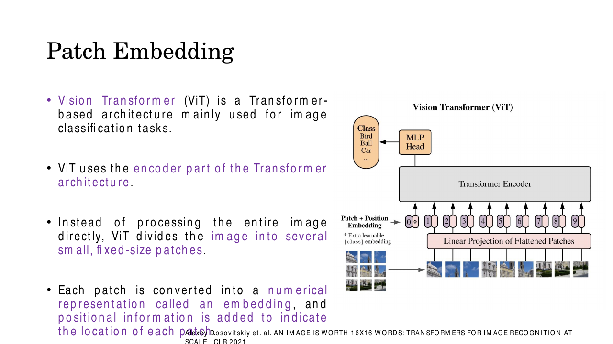
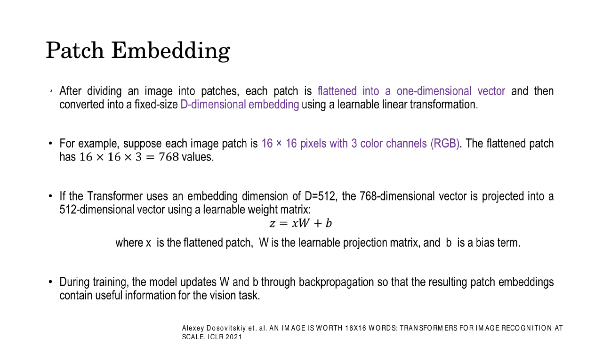
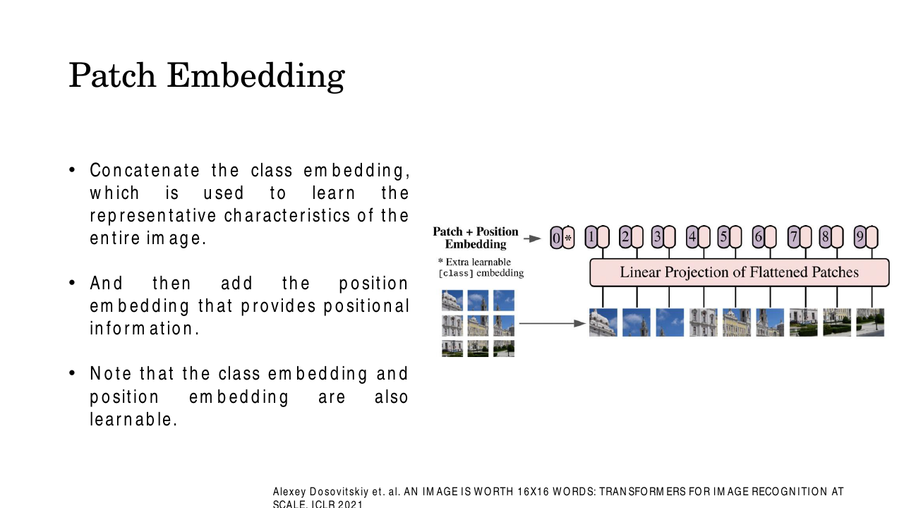
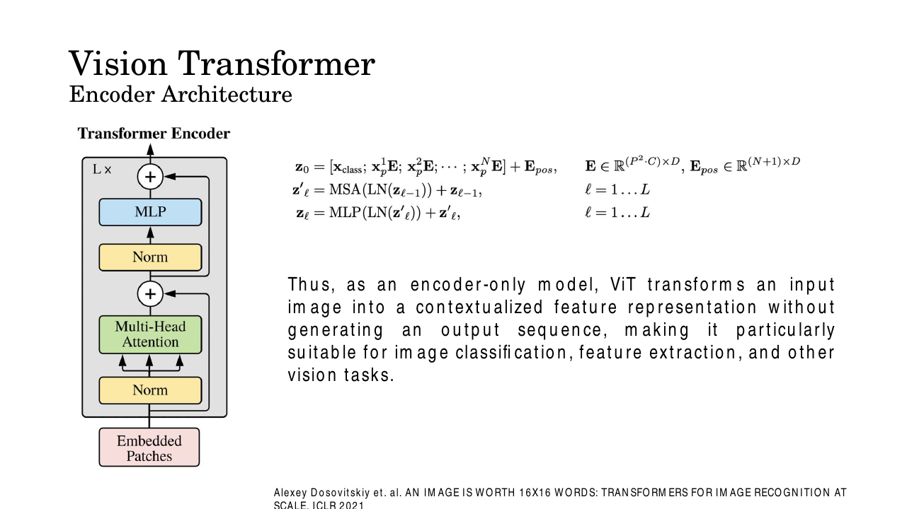
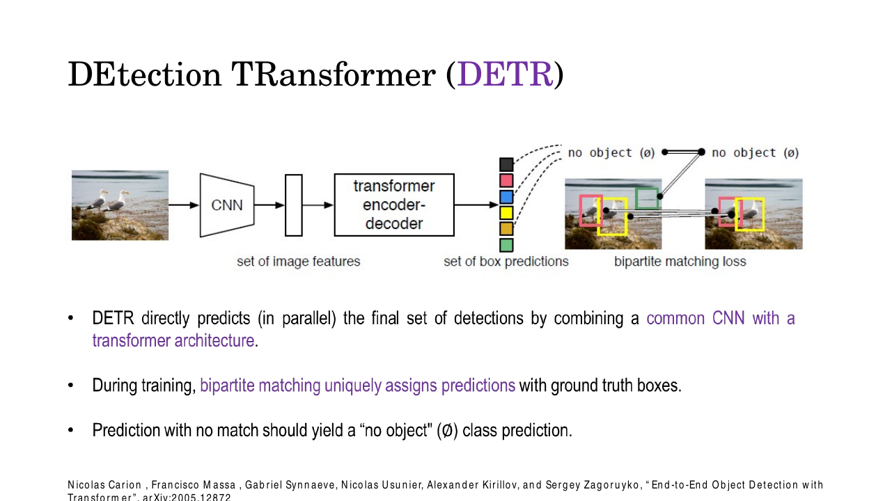
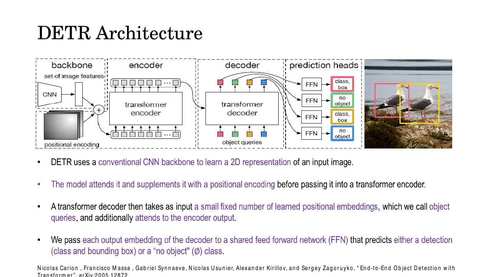
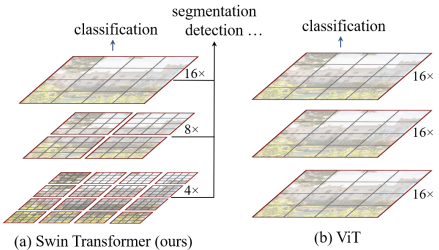

# Lec 28 — Vision Transformers: ViT, DETR, Swin

> **Deck:** `L8P7_VIT.pptx` · **Week 8** · **Playlist:** Lec 28
> **Prereqs:** [Lec 27 — Decoder and the Full Transformer](../week-07/27-decoder-and-full-transformer.md), [Lec 25 — Q/K/V and Self-Attention](../week-07/25-qkv-and-self-attention.md), [Lec 11 — CNN Basics](../week-03/11-cnn-basics.md)
> **Feeds into:** [Lec 29 — Autoencoders to VAE](29-autoencoders-to-vae.md)

## Why this lecture exists

Four lectures built the Transformer on sentences. This is a computer vision course, so the obvious
question is: point it at an image. The obvious answer — treat every pixel as a token — dies on
arithmetic, because self-attention costs $O(n^2)$ in the number of tokens and a 224×224 image has
50,176 pixels. That single number is the hinge of the whole lecture. Everything here is an answer to
"what do you make a token, and which tokens are allowed to talk to each other?" ViT says: make a
16×16 patch a token, and let them all talk. DETR says: keep a CNN, and make the *outputs* tokens.
Swin says: let tokens talk only inside a local window, and slide the window. Three answers, three
architectures, one constraint.

## The ideas

### The computation that forces every design choice

Self-attention, $\mathrm{softmax}(\mathbf{Q}\mathbf{K}^\top/\sqrt{d_k})\mathbf{V}$
([Lec 25](../week-07/25-qkv-and-self-attention.md)), builds an $n \times n$ grid of dot products —
every token's query against every token's key. That is $n^2$ pairwise interactions per head per layer.
In a 30-word sentence $n^2 = 900$ and nobody cares. In a 224×224 RGB image, the standard ImageNet crop,

$$n = 224 \times 224 = 50{,}176 \text{ pixel tokens} \quad\Longrightarrow\quad n^2 = 2{,}517{,}630{,}976 \approx 2.5\times10^9$$

2.5 **billion** pairwise scores per head per layer. At 4 bytes each the score matrix alone is 10.07 GB
— one head, one layer, one image; a 12-layer, 12-head model would need 144 of them. This is not
"slow", it is impossible. So you must reduce $n$, and because the cost is quadratic a modest reduction
in tokens buys an enormous reduction in compute. That leverage is the whole trick (N1).

### ViT: an image is a sentence of patches

The Vision Transformer (Dosovitskiy et al., *An Image is Worth 16×16 Words*, ICLR 2021) takes the
blunt route. Cut the image into a grid of fixed-size, **non-overlapping** squares called **patches**,
treat each patch as one token, and feed the resulting sequence into a standard Transformer *encoder*.
Nothing else about the Transformer changes.


*Fig. — Read bottom-up: patches → linear projection → add position embeddings → encoder → the token in slot 0 goes to the MLP head. The `0*` token sits left of the patch tokens and comes from nowhere in the image — that is [CLS]. Slide 5.*

#### Patch embedding — the one mechanism to get exactly right

Let the image be $H \times W \times C$ and the patch side be $P$. Three steps:

1. **Split.** The grid is $\frac{H}{P} \times \frac{W}{P}$ patches, so the sequence length is
   $$N = \frac{HW}{P^2}$$
   For $H = W = 224$, $P = 16$: $N = (224/16)^2 = 14^2 = 196$. Memorise the derivation, not the 196 —
   the exam will change $P$. Note $P$ must divide $H$ and $W$, which is why ViT resolutions are always
   multiples of the patch size.
2. **Flatten.** Stretch each $P \times P \times C$ block into one vector of length $P^2C$: for
   $P{=}16$, $C{=}3$, that is $16 \times 16 \times 3 = 768$ values. Flattening destroys the spatial
   structure *inside* the patch; the model must relearn it.
3. **Project.** Multiply by a single learnable matrix $\mathbf{E} \in \mathbb{R}^{(P^2C) \times d_{\text{model}}}$
   shared by every patch, and add a bias:
   $$\mathbf{z} = \mathbf{x}\mathbf{E} + \mathbf{b}$$
   The deck writes the embedding width as $D$; that is our $d_{\text{model}}$, and its worked example
   uses $D = 512$. ViT-Base happens to use $d_{\text{model}} = 768$, which coincidentally equals
   $P^2C$ — keep the roles separate: 768 *in* is "pixels in a patch", 768 *out* is "width of the model".


*Fig. — The deck's own arithmetic. $\mathbf{E}$ is **shared across all patches** — one matrix applied 196 times, not 196 matrices. Slide 7.*

#### Patch embedding is literally a convolution

Steps 1–3 describe something you already know. Take a convolution with kernel $K = P$, stride $S = P$,
padding 0 and $F = d_{\text{model}}$ filters: each filter covers exactly one patch, the stride equals
the kernel so windows never overlap, and each filter's dot product with the patch is one component of
the embedding. [Lec 11](../week-03/11-cnn-basics.md)'s output-size formula gives
$\lfloor (224-16+0)/16 \rfloor + 1 = 14$ per side — the same grid. So **patch embedding ≡
`Conv2d(3, d_model, kernel_size=16, stride=16)` plus a flatten**, which is how every implementation
does it (a GPU convolution beats slicing and matrix-multiplying). The code below shows the two paths
agreeing exactly.

#### The [CLS] token

The encoder returns $N$ output vectors, one per patch, but classification needs *one* vector for the
whole image. Averaging the 196 works; ViT instead borrows BERT's trick and prepends a single
**learnable** vector $\mathbf{x}_{\text{class}} \in \mathbb{R}^{d_{\text{model}}}$ — the
**[CLS] token** — which is a free parameter, identical for every image and corresponding to no region
of the picture. Since every token reads every other, [CLS] spends $L$ layers pulling information out
of the patches, and its final-layer output $\mathbf{z}_L^0$ is the *only* thing handed to the head.
The sequence is therefore $N+1$ long: **197**, not 196. Off-by-one here is a classic exam trap.

#### Positional embeddings — learned, not sinusoidal

Self-attention is permutation-equivariant — shuffle the input tokens and the outputs shuffle with
them, unchanged in content — so without position information ViT cannot tell a face from the same face
with its patches scrambled. As in [Lec 26](../week-07/26-encoder-and-positional-encoding.md),
position is **added**, not concatenated:

$$\mathbf{z}_0 = [\,\mathbf{x}_{\text{class}};\ \mathbf{x}_p^1\mathbf{E};\ \mathbf{x}_p^2\mathbf{E};\ \cdots;\ \mathbf{x}_p^N\mathbf{E}\,] + \mathbf{E}_{pos}, \qquad \mathbf{E}_{pos} \in \mathbb{R}^{(N+1)\times d_{\text{model}}}$$

Two differences from Lec 26 worth stating precisely:

- **Learned, not sinusoidal.** $\mathbf{E}_{pos}$ is a plain parameter matrix trained by
  backpropagation — slide 8 says so ("the class embedding and position embedding are also learnable").
  Lec 26's fixed $\sin/\cos$ scheme is not used. Consequence: the table has a fixed number of rows, so
  changing input resolution changes $N$ and the rows no longer fit; fine-tuning at higher resolution
  requires 2-D interpolation of the learned table.
- **1-D.** Row $i$ means "I am the $i$-th patch in raster order", not "row 3, column 7". The paper
  tried 2-D embeddings and found no benefit — the model learns the 2-D structure from data anyway.


*Fig. — Order of operations: project patches → **concatenate** [CLS] in front → **add** $\mathbf{E}_{pos}$ to all $N{+}1$ tokens, [CLS] included. Slide 8.*

#### The encoder stack, and ViT's pre-norm

ViT is **encoder-only** — no decoder, no cross-attention, no output sequence; the deck is emphatic
about this on slides 9–11. Each of the $L$ identical blocks is the standard encoder block from
[Lec 27](../week-07/27-decoder-and-full-transformer.md): multi-head self-attention, residual add and
layer normalisation, a position-wise MLP, residual add and normalisation. With one change:

$$\mathbf{z}'_\ell = \mathrm{MSA}\big(\mathrm{LN}(\mathbf{z}_{\ell-1})\big) + \mathbf{z}_{\ell-1}, \qquad \ell = 1\ldots L$$
$$\mathbf{z}_\ell = \mathrm{MLP}\big(\mathrm{LN}(\mathbf{z}'_\ell)\big) + \mathbf{z}'_\ell, \qquad \ell = 1\ldots L$$

Look at where LN sits. The original Transformer is **post-norm**, $\mathrm{LN}(x + \text{Sublayer}(x))$ —
normalisation *after* the residual add. ViT is **pre-norm**, $x + \text{Sublayer}(\mathrm{LN}(x))$ —
normalisation *before* the sublayer, outside the residual path. The skip branch is then a clean
identity all the way through the stack, the same gradient-highway argument that makes ResNet work
([Lec 14](../week-04/14-resnet.md)). Pre-norm trains without learning-rate warm-up and is far more
stable at depth, which is why every Transformer after 2020, ViT included, uses it.


*Fig. — Trace the ⊕ arrows: each residual connection starts **before** its Norm box, so the skip path never passes through a LayerNorm. That is the visual signature of pre-norm. Slide 11.*

The MLP is applied independently to each token, one hidden layer, usually $4\times$ wider than
$d_{\text{model}}$ (768 → 3072 → 768 in ViT-Base), with a GELU nonlinearity.

#### The classification head

Slice out token 0 after the final block and push it through the head:

$$\hat{\mathbf{y}} = \mathrm{softmax}\big(\mathbf{W}_{\text{head}}\,\mathrm{LN}(\mathbf{z}_L^0) + \mathbf{b}_{\text{head}}\big)$$

During pretraining the head is a one-hidden-layer MLP; for fine-tuning it becomes one linear layer to
the new class count. The 196 patch outputs are discarded for classification — but they are exactly
what you keep to use ViT as a feature extractor.

#### Erratum: ViT is **not** an autoregressive model

[Lec 3's deck](../week-01/03-generative-vision-models.md) (slide 15) lists Vision Transformer among
*autoregressive* generative models. That is loose, and worth correcting in your own notes before the
exam. An autoregressive model factorises a density as $p(\mathbf{x}) = \prod_i p(x_i \mid x_{<i})$ and
generates one element at a time conditioned on what it already produced — PixelRNN and PixelCNN
([Lec 23](../week-06/23-autoregressive-pixelrnn-pixelcnn.md)) are the real examples.

ViT does none of that. It is **encoder-only and discriminative**: it consumes the whole image at once
with *unmasked* self-attention — every patch sees every other, including "later" ones — and emits
$p(y \mid \mathbf{x})$. No masking, no sampling loop, no density over images. The confusion is
understandable, since the Transformer family does contain famous autoregressive members (GPT, the
Transformer decoder, Image GPT) and ViT shares their building blocks — but sharing a block does not
share the factorisation. Asked to classify ViT, answer **discriminative encoder-only classifier**.

#### The no-free-lunch result: ViT versus the CNN

The single most examinable conceptual point in the lecture. A convolution hard-codes two assumptions
about images — its **inductive biases** (prior beliefs baked into the architecture rather than
learned, [Lec 11](../week-03/11-cnn-basics.md)):

- **Locality** — a unit sees only a small neighbourhood, so nearby pixels are assumed to be the
  relevant ones.
- **Translation equivariance** — the same kernel slides everywhere, so a shifted object produces a
  correspondingly shifted response. A cat is a cat in any corner.

ViT throws both away: self-attention is global from layer 1 and the only spatial prior left is a
learned position table. The consequence, measured in the ViT paper:

| Pretraining set | Size | Who wins |
|---|---|---|
| ImageNet-1k | 1.3 M images | **ResNet (BiT) clearly beats ViT** |
| ImageNet-21k | 14 M images | roughly comparable |
| JFT-300M | 303 M images | **ViT clearly beats ResNet** |

*Inductive bias is a substitute for data.* The CNN's assumptions are correct about images, so on a
small dataset they spare the model from discovering them and the CNN starts ahead. ViT must learn
locality and translation behaviour from scratch, which takes enormous numbers of examples — but once
it has, it is not *limited* by those assumptions and can model relationships a convolution's receptive
field cannot reach. "No free lunch; buy the missing bias with data." In practice: never train a ViT
from scratch on a few thousand images — fine-tune a pretrained one.

### DETR: making the *outputs* the tokens

Detection as a *task* — boxes, classes, IoU, mAP — belongs to
[Lec 20](../week-05/20-genai-vision-tasks-1.md). What is new here is the architecture.

Classical detectors (Faster R-CNN, YOLO, SSD) emit thousands of candidates tied to a dense grid of
**anchors** (pre-defined box shapes at every location), score them all, then run **non-maximum
suppression (NMS)** — a hand-written post-process deleting overlapping duplicates. Both are heuristics
with their own hyperparameters, and NMS is not differentiable, so the pipeline is not end-to-end.

DETR (Carion et al., 2020) deletes both, casting detection as **direct set prediction**: output a
*set* of exactly $N$ predictions in one parallel shot, $N$ fixed (100 in the paper) and larger than
the most objects you expect. Any prediction not matched to a real object is trained to emit the
special class $\varnothing$, "no object".


*Fig. — The two seagulls get one box each; the remaining predictions are supervised toward $\varnothing$. Nothing between "set of box predictions" and the loss resembles NMS. Slide 13.*

#### The four stages


*Fig. — The object queries (coloured squares feeding the decoder) are learned parameters, not derived from the image. Slide 14.*

1. **CNN backbone.** A ResNet-50 turns the image into a $2048 \times \frac{H_0}{32} \times \frac{W_0}{32}$
   feature map; a 1×1 convolution cuts the channels to $d_{\text{model}} = 256$ and the spatial grid is
   flattened to $HW$ tokens. DETR keeps the CNN — it is a hybrid, not a pure Transformer.
2. **Transformer encoder.** 6 encoder layers over those tokens, with a fixed sinusoidal 2-D positional
   encoding added at every attention layer.
3. **Transformer decoder.** 6 decoder layers with self-attention over the queries and cross-attention
   into the encoder output ([Lec 27](../week-07/27-decoder-and-full-transformer.md) owns both). Its
   input is $N = 100$ **object queries**: learned $d_{\text{model}}$-dimensional vectors, one per output
   slot, identical for every image — each a learned "question" (*is there an object roughly here,
   roughly this size?*). Self-attention among the queries lets them negotiate so two do not claim the
   same seagull. Crucially the decoder is **not masked and not autoregressive**: all 100 outputs come
   out in parallel.
4. **Prediction heads.** A shared 3-layer FFN per query emits a box $(c_x, c_y, w, h)$ in normalised
   coordinates, plus a linear layer emitting a distribution over the $K$ classes **plus** $\varnothing$.

#### Bipartite matching — the piece that makes it work

The problem the design hinges on: your model emits 100 predictions in arbitrary order and the ground
truth has, say, 2 objects in arbitrary order. A set has no order, so which prediction is penalised for
missing which object? Matching by index punishes the model for a permutation it was never asked to
produce.

DETR's answer: **find the best one-to-one assignment first, score it second**. Pad the ground truth
with $\varnothing$ up to size $N$, build the $N \times N$ cost matrix whose entry $(i,j)$ is the cost
of explaining ground truth $j$ with prediction $i$, and solve

$$\hat{\sigma} = \arg\min_{\sigma \in \mathfrak{S}_N} \sum_{j=1}^{N} \mathcal{L}_{\text{match}}\big(\mathbf{y}_j,\ \hat{\mathbf{y}}_{\sigma(j)}\big)$$

where $\mathfrak{S}_N$ is the set of all permutations of $N$ elements, and the matching cost combines
the predicted probability of the true class with a box distance ($\ell_1$ plus generalised IoU).

Searching all $N!$ permutations is hopeless. The **Hungarian algorithm** solves this assignment
problem in $O(N^3)$ and returns the *global* optimum — which a greedy "take the cheapest pair, then
the next cheapest" rule does not (N5 shows greedy losing by 20%). The matching runs with gradients
detached: it is a combinatorial step, not a learned one.

With $\hat{\sigma}$ fixed, the **Hungarian loss** is ordinary supervised learning:

$$\mathcal{L}_{\text{Hungarian}} = \sum_{j=1}^{N} \Big[ -\log \hat{p}_{\hat{\sigma}(j)}(c_j) + \mathbb{1}_{\{c_j \neq \varnothing\}}\, \mathcal{L}_{\text{box}}\big(\mathbf{b}_j, \hat{\mathbf{b}}_{\hat{\sigma}(j)}\big) \Big]$$

Note the indicator: the box loss applies only to matched real objects, never to the $\varnothing$
slots (which have no box). The $\varnothing$ class's log-probability term is down-weighted 10× because
it otherwise dominates.

**Why this removes NMS.** One-to-one matching means exactly one prediction is ever rewarded for a
given object; every other prediction landing on it is explicitly pushed toward $\varnothing$.
Duplicate suppression becomes part of the *training objective* instead of a post-process. Anchors are
unnecessary because the learned queries discover their own spatial specialisations. The result is the
first genuinely end-to-end differentiable detector — the deck's headline claim and DETR's prime exam
material. The costs: ~500 COCO epochs (10× a Faster R-CNN schedule) and weak small-object performance,
because the encoder sees a single coarse $1/32$-resolution map. Which is the gap Swin fills.

### Swin: local windows and a feature pyramid

Swin ("**S**hifted **win**dow", Liu et al., ICCV 2021) attacks the complexity problem head-on and
fixes ViT's single-resolution defect at the same time.

#### Windowed self-attention (W-MSA)

Partition the feature map into non-overlapping **windows** of $M \times M$ tokens ($M = 7$ throughout
the paper) and compute self-attention **independently inside each window**: a token attends to the 48
others in its window and nobody else. For an $h \times w$ token grid with $C$ channels the paper's own
cost formulas are

$$\Omega(\text{MSA}) = 4hwC^2 + 2(hw)^2 C, \qquad \Omega(\text{W-MSA}) = 4hwC^2 + 2M^2hwC$$

The first term — the $\mathbf{Q},\mathbf{K},\mathbf{V},\mathbf{O}$ projections — is identical and
linear in $hw$ for both. The whole difference is the second term. Global is $(hw)^2$: **quadratic** in
tokens, hence quadratic in image area. Windowed is $M^2 hw$: **linear**, because $M$ is a constant —
you run $hw/M^2$ separate attentions whose count grows linearly while each one's cost stays fixed.

The ratio of attention terms is exactly $hw/M^2$, the number of windows: $3136/49 = 64\times$ cheaper on
a 56×56 grid, and the saving *grows* with resolution (N4). That is what makes Transformers usable on
1024×1024 detection inputs at all.

#### Shifted windows (SW-MSA)

Fixed windows have an obvious flaw: information never crosses a boundary, so the model is 64
unconnected ViTs. The fix is cheap — in **alternating** blocks, shift the window grid by
$\lfloor M/2 \rfloor$ tokens (3, for $M = 7$) down and to the right, so tokens in different windows at
layer $\ell$ share a window at layer $\ell+1$.

```
layer L  (W-MSA, regular grid)        layer L+1  (SW-MSA, grid shifted by M/2)
  +-----+-----+-----+                   +--+-----+-----+--+
  |  A  |  B  |  C  |                   |  |     |     |  |
  +-----+-----+-----+        --->       +--+--P--+--Q--+--+
  |  D  |  E  |  F  |                   |  |     |     |  |
  +-----+-----+-----+                   +--+-----+-----+--+
 a token in A never                    window P straddles the old A|B seam,
 sees one in B                         so A and B tokens now interact
```

Swin blocks therefore come in **pairs**, which is why every stage has an even number of layers
(2, 2, 6, 2 for Swin-T):

$$\hat{\mathbf{z}}^{\ell} = \text{W-MSA}(\mathrm{LN}(\mathbf{z}^{\ell-1})) + \mathbf{z}^{\ell-1}, \qquad
\hat{\mathbf{z}}^{\ell+1} = \text{SW-MSA}(\mathrm{LN}(\mathbf{z}^{\ell})) + \mathbf{z}^{\ell}$$

each followed by the usual MLP sublayer. Shifting creates partial windows at the borders; Swin handles
them with a cyclic shift plus masked attention so the window count — and the cost — is unchanged. Two
windowed blocks still cost far less than one global block, and they communicate across windows.

#### Hierarchical feature maps by patch merging

ViT has **one** resolution: the 14×14 token grid at layer 1 is the 14×14 grid at layer 12 — fine for
"what class is this image", useless for segmentation (needs fine detail) or detection (needs many
scales). Every CNN since LeNet builds a pyramid instead: high resolution and few channels early, low
resolution and many channels late.

Swin rebuilds that pyramid. It starts from small **4×4** patches (56×56 tokens from a 224×224 image),
then between stages applies **patch merging**: concatenate each $2\times2$ group of neighbouring tokens
to get $4C$ channels, then a linear layer down to $2C$. Resolution halves per side, width doubles —
exactly the CNN's trade.

| Stage | Token grid (224 input) | Downsample | Channels (Swin-T) | Blocks |
|---|---|---|---|---|
| 1 | 56 × 56 | 4× | 96 | 2 |
| 2 | 28 × 28 | 8× | 192 | 2 |
| 3 | 14 × 14 | 16× | 384 | 6 |
| 4 | 7 × 7 | 32× | 768 | 2 |


*Fig. — Grey grid = tokens, red outline = attention scope. Left (Swin): many small windows, three resolutions, so the "segmentation / detection" arrow exists. Right (ViT): one red box over everything, one resolution, only "classification". Slide 20.*

Those multi-scale outputs plug straight into an FPN or U-Net-style decoder, which is why Swin became a
**general-purpose backbone** — drop it in wherever a ResNet was, for classification, detection or
segmentation alike. Plain ViT cannot do that unmodified.

### The four architectures, side by side

| | CNN (ResNet) | ViT | DETR | Swin |
|---|---|---|---|---|
| What it is for | classification / backbone | image classification | object detection | general-purpose backbone |
| Token / unit | pixel neighbourhood | 16×16 patch | CNN feature cell + $N$ object queries | 4×4 patch, merged upward |
| Attention scope | none (local conv) | **global**, all $N{+}1$ tokens | global over the feature map | **local window** ($7{\times}7$), shifted alternately |
| Cost in image area | linear | **quadratic** | quadratic in the coarse map | **linear** |
| Inductive bias | locality + translation equivariance | almost none (learned 1-D positions) | CNN backbone's bias + set prediction | locality + hierarchy, restored |
| Feature maps | hierarchical pyramid | single resolution | single coarse resolution | **hierarchical pyramid** |
| Needs huge pretraining? | no | **yes** (JFT-300M to beat CNNs) | no (CNN backbone pretrained) | no |
| Hand-designed post-process | NMS for detection | — | **none** (bipartite matching) | NMS if used with a classical head |

## Worked numericals

### N1. Why pixels cannot be tokens, and how much patching saves
**Given:** a 224×224×3 image. Self-attention costs $n^2$ pairwise scores per head per layer.
**Find:** $n$ and $n^2$ for pixel tokens; the same for 16×16 patch tokens; the reduction factor; and the memory for one score matrix in fp32.

1. Pixel tokens: $n = 224 \times 224 = 50{,}176$. (Channels do not multiply the count — a pixel's 3 channels form one token's feature vector.)
2. Pairwise interactions: $n^2 = 50{,}176^2 = 2{,}517{,}630{,}976 \approx 2.52\times10^9$.
3. Memory for that one matrix at 4 bytes per float: $2{,}517{,}630{,}976 \times 4 = 10{,}070{,}523{,}904$ bytes $= 10.07$ GB. Per head. Per layer.
4. Patch tokens with $P = 16$: $N = (224/16)^2 = 14^2 = 196$.
5. Pairwise interactions: $196^2 = 38{,}416$. With the [CLS] token, $197^2 = 38{,}809$.
6. Reduction factor: $2{,}517{,}630{,}976 / 38{,}416 = 65{,}536$.
7. Sanity check in symbols: tokens fall by $P^2$, so $n^2$ falls by $P^4 = 16^4 = 65{,}536$. ✓

**Answer:** 50,176 pixel tokens → $2.52\times10^9$ interactions and a 10.07 GB attention matrix,
infeasible. 196 patch tokens → 38,416 interactions: a **65,536× reduction**, equal to $P^4$.

### N2. Patch counts and patch-embedding parameters
**Given:** patch embedding $\mathbf{E} \in \mathbb{R}^{(P^2C)\times d_{\text{model}}}$ with bias, $C = 3$.
**Find:** $N$ and sequence length for three configurations; then the embedding, position and [CLS] parameter counts for ViT-Base/16 at 224.

1. ViT-B/16 at 224: $N = (224/16)^2 = 14^2 = 196$; sequence length $= N + 1 = \mathbf{197}$.
2. ViT-B/32 at 224: $N = (224/32)^2 = 7^2 = 49$; sequence $= \mathbf{50}$. Four times fewer tokens, so $\approx 16\times$ cheaper attention — and coarser.
3. ViT-B/16 at 384 (the fine-tuning resolution): $N = (384/16)^2 = 24^2 = 576$; sequence $= \mathbf{577}$. Compared with 197 tokens, attention cost rises by $(577/197)^2 \approx 8.6\times$.
4. Flattened patch dimension: $P^2C = 16 \times 16 \times 3 = 768$.
5. Projection weights to $d_{\text{model}} = 768$: $768 \times 768 = 589{,}824$; plus 768 biases $= \mathbf{590{,}592}$.
6. Position embeddings: $(N+1) \times d_{\text{model}} = 197 \times 768 = \mathbf{151{,}296}$.
7. [CLS] token: one vector of width 768 $= \mathbf{768}$.
8. Deck's variant with $D = 512$: $768 \times 512 + 512 = 393{,}216 + 512 = 393{,}728$.

**Answer:** 196 / 49 / 576 patches (197 / 50 / 577 tokens). Patch embedding 590,592, position table
151,296, [CLS] 768 — 742,656 parameters before a single encoder block.

### N3. ViT-Base parameter count from scratch
**Given:** ViT-Base: $L = 12$ blocks, $d_{\text{model}} = 768$, $h = 12$ heads, MLP hidden 3072, $N+1 = 197$ tokens.
**Find:** total parameters.

1. **Attention projections.** $\mathbf{W}_Q, \mathbf{W}_K, \mathbf{W}_V, \mathbf{W}_O$ are each $768\times768$. Multi-head splits $d_{\text{model}}$ across the 12 heads ($d_k = 768/12 = 64$), so the heads cost no extra parameters. Four matrices: $4 \times (768 \times 768 + 768) = 4 \times 590{,}592 = 2{,}362{,}368$.
2. **MLP.** First layer $768 \times 3072 + 3072 = 2{,}362{,}368$. Second layer $3072 \times 768 + 768 = 2{,}360{,}064$. Total $4{,}722{,}432$.
3. **Two LayerNorms**, each with a scale and a shift of width 768: $2 \times 2 \times 768 = 3{,}072$.
4. **One block:** $2{,}362{,}368 + 4{,}722{,}432 + 3{,}072 = 7{,}087{,}872$.
5. **Twelve blocks:** $12 \times 7{,}087{,}872 = 85{,}054{,}464$.
6. **Add the front end** (from N2): $+590{,}592 + 151{,}296 + 768 = 85{,}797{,}120$.
7. **Final LayerNorm** before the head: $+1{,}536 = 85{,}798{,}656$.
8. **A 1000-class linear head:** $768 \times 1000 + 1000 = 769{,}000 \Rightarrow 86{,}567{,}656$.

**Answer:** $\approx 85.8$ M for the representation body, $\approx 86.6$ M with an ImageNet head — the
quoted **86 M**. Note 99% of it sits in the 12 encoder blocks.

### N4. Global versus windowed attention cost
**Given:** Swin's formulas $\Omega(\text{MSA}) = 4hwC^2 + 2(hw)^2C$ and $\Omega(\text{W-MSA}) = 4hwC^2 + 2M^2hwC$. Take a stage-1 feature map $h = w = 56$, $C = 96$, window $M = 7$.
**Find:** both attention terms, their ratio, and what happens when the image side doubles.

1. Tokens: $hw = 56 \times 56 = 3{,}136$. Windows: $3136/49 = 64$.
2. Global attention term: $2 \times 3136^2 \times 96 = 2 \times 9{,}834{,}496 \times 96 = 1{,}888{,}223{,}232 \approx 1.89\times10^9$.
3. Windowed attention term: $2 \times 49 \times 3136 \times 96 = 98 \times 3136 \times 96 = 29{,}503{,}488 \approx 2.95\times10^7$.
4. Ratio: $1{,}888{,}223{,}232 / 29{,}503{,}488 = \mathbf{64.0}$ — exactly the number of windows, $hw/M^2$.
5. Shared projection term: $4 \times 3136 \times 96^2 = 115{,}605{,}504$. Totals: global $2.00\times10^9$, windowed $1.45\times10^8$, an overall $13.8\times$ saving.
6. Now double the image side (112×112 tokens, $hw = 12{,}544$, so $4\times$ the pixels). Global: $2 \times 12544^2 \times 96 = 30{,}211{,}571{,}712$ — that is $16\times$ step 2, i.e. **quadratic** in area.
7. Windowed: $2 \times 49 \times 12544 \times 96 = 118{,}013{,}952$ — exactly $4\times$ step 3, i.e. **linear** in area.
8. New ratio: $30{,}211{,}571{,}712 / 118{,}013{,}952 = 256$, again $hw/M^2 = 12544/49$.

**Answer:** global $1.89\times10^9$ vs windowed $2.95\times10^7$, a **64× saving** that grows to
**256×** when the image side doubles. The ratio is always $hw/M^2$ — the precise sense in which
windowing turns quadratic cost into linear.

### N5. Bipartite matching by hand
**Given:** 3 predictions $p_1, p_2, p_3$ and 3 ground-truth boxes $g_1, g_2, g_3$, with matching cost

| | $g_1$ | $g_2$ | $g_3$ |
|---|---|---|---|
| $p_1$ | 4 | 1 | 3 |
| $p_2$ | 2 | 0 | 5 |
| $p_3$ | 3 | 2 | 2 |

**Find:** the optimal one-to-one assignment and its total cost; compare with a greedy choice.

1. Enumerate all $3! = 6$ permutations: $(1\!\to\!1,2\!\to\!2,3\!\to\!3) = 4+0+2 = 6$; $(1,3,2) = 4+5+2 = 11$; $(2,1,3) = 1+2+2 = 5$; $(2,3,1) = 1+5+3 = 9$; $(3,1,2) = 3+2+2 = 7$; $(3,2,1) = 3+0+3 = 6$.
2. Minimum is **5**, at $p_1 \to g_2,\ p_2 \to g_1,\ p_3 \to g_3$.
3. Now the Hungarian route, which is what scales. **Row-reduce** (subtract each row's minimum: 1, 0, 2): rows become $[3,0,2]$, $[2,0,5]$, $[1,0,0]$.
4. **Column-reduce** (column minima 1, 0, 0): $\begin{bmatrix}2&0&2\\1&0&5\\0&0&0\end{bmatrix}$. Total subtracted so far $= (1+0+2) + 1 = 4$.
5. Cover all zeros with as few lines as possible: column 2 and row 3 suffice — **2 lines < 3**, so no complete zero-assignment exists yet.
6. Smallest uncovered entry is $1$ (at row 2, column 1). Subtract it from every uncovered entry, add it to every doubly-covered entry: $\begin{bmatrix}1&0&1\\0&0&4\\0&1&0\end{bmatrix}$. Running total subtracted $= 4 + 1 = 5$.
7. Now 3 independent zeros exist: $(p_1, g_2), (p_2, g_1), (p_3, g_3)$. Read the assignment off.
8. Cost in the original matrix: $1 + 2 + 2 = 5$. ✓ (And it equals the total reduction, 5 — a useful check.)
9. **Greedy comparison:** grab the globally cheapest cell first, $p_2 \to g_2$ at cost 0. Then $p_1$ must take $g_1$ (4) or $g_3$ (3), and $p_3$ takes whatever is left: $3 + 3 = 6$ or $4 + 2 = 6$. Greedy totals **6**.

**Answer:** optimal assignment $p_1 \to g_2,\ p_2 \to g_1,\ p_3 \to g_3$, **total cost 5**; greedy
gives 6. The cheapest *individual* pair is not in the optimal set — exactly why DETR runs the
Hungarian algorithm ($O(N^3)$) rather than a greedy rule.

## Code

```python
import numpy as np
rng = np.random.default_rng(0)

# --- 1. an image becomes a sequence of patch embeddings ------------------
C, H, W, P, D = 3, 224, 224, 16, 768          # RGB, 224x224, 16x16 patches, d_model=768
img = rng.standard_normal((C, H, W)).astype(np.float32)

nh, nw = H // P, W // P                       # 14 x 14 grid of patches
N = nh * nw                                   # 196 patches
print("patch grid:", nh, "x", nw, "->", N, "patches")

# cut the image into non-overlapping PxP blocks, flatten each to (C*P*P,)
patches = (img.reshape(C, nh, P, nw, P)       # (C, 14, 16, 14, 16)
              .transpose(1, 3, 0, 2, 4)       # (14, 14, C, 16, 16)  <- patch-major
              .reshape(N, C * P * P))         # (196, 768)
print("flattened patches:", patches.shape)

# the learnable linear projection  z = xE + b  (ONE matrix, shared by all patches)
E = rng.standard_normal((C * P * P, D)).astype(np.float32) * 0.02
b = np.zeros(D, dtype=np.float32)
z_patch = patches @ E + b                     # (196, 768)

# prepend the [CLS] token, then ADD the learned position embeddings
cls   = rng.standard_normal((1, D)).astype(np.float32) * 0.02
E_pos = rng.standard_normal((N + 1, D)).astype(np.float32) * 0.02
z0 = np.concatenate([cls, z_patch], axis=0) + E_pos
print("z0 (sequence into the encoder):", z0.shape)
print("patch-embed params:", C*P*P*D + D, " pos params:", (N+1)*D, " cls params:", D)

# --- 2. the same thing as a convolution, kernel = stride = P ------------
W_conv = E.T.reshape(D, C, P, P)              # reuse the SAME weights, reshaped
conv_out = np.empty((D, nh, nw), dtype=np.float32)
for i in range(nh):
    for j in range(nw):
        blk = img[:, i*P:(i+1)*P, j*P:(j+1)*P]            # (C, P, P) -- stride P, no overlap
        conv_out[:, i, j] = (W_conv * blk).sum(axis=(1, 2, 3)) + b
z_conv = conv_out.reshape(D, N).T             # (196, 768), same patch order
print("conv == linear :", np.allclose(z_conv, z_patch, atol=1e-3))

# --- 3. global vs windowed attention cost (Swin's own formulas) ---------
def omega(h, w, Cch, M=None):
    proj = 4 * h * w * Cch**2                                     # Q,K,V,O projections
    attn = 2 * (h*w)**2 * Cch if M is None else 2 * M**2 * h * w * Cch
    return attn

print(f"\n{'feat map':>10} {'C':>5} {'global attn':>16} {'7x7 window':>14} {'ratio':>7}")
for (h, w, Cch) in [(56, 56, 96), (28, 28, 192), (14, 14, 384), (112, 112, 96)]:
    ag, aw = omega(h, w, Cch), omega(h, w, Cch, M=7)
    print(f"{h:>4}x{w:<5} {Cch:>5} {ag:>16,} {aw:>14,} {ag/aw:>7.1f}")
```

```
patch grid: 14 x 14 -> 196 patches
flattened patches: (196, 768)
z0 (sequence into the encoder): (197, 768)
patch-embed params: 590592  pos params: 151296  cls params: 768
conv == linear : True

  feat map     C      global attn     7x7 window   ratio
  56x56       96    1,888,223,232     29,503,488    64.0
  28x28      192      236,027,904     14,751,744    16.0
  14x14      384       29,503,488      7,375,872     4.0
 112x112      96   30,211,571,712    118,013,952   256.0
```

Three things. The sequence is **197** long, not 196 — [CLS] is real. `conv == linear : True` proves
patch embedding is a stride-16 convolution: the two paths share weights and agree to float precision.
And the ratio column is always $hw/M^2$ — windowing saves more the bigger the feature map, which is
the whole argument for Swin.

## Exam pack

### Must-memorise

| Item | Exactly this |
|---|---|
| Number of patches | $N = \dfrac{HW}{P^2}$; for $224{\times}224$, $P{=}16$: $N = 14^2 = 196$ |
| Sequence length into the ViT encoder | $N + 1$ (patches **plus** [CLS]) = 197 |
| Flattened patch dimension | $P^2 C$; for $P{=}16, C{=}3$: $768$ |
| Patch projection | $\mathbf{z} = \mathbf{x}\mathbf{E} + \mathbf{b}$, $\mathbf{E}\in\mathbb{R}^{(P^2C)\times d_{\text{model}}}$, shared across patches |
| Patch embedding ≡ convolution | kernel $K = P$, stride $S = P$, padding 0, $F = d_{\text{model}}$ filters |
| ViT input | $\mathbf{z}_0 = [\mathbf{x}_{\text{class}}; \mathbf{x}_p^1\mathbf{E};\cdots;\mathbf{x}_p^N\mathbf{E}] + \mathbf{E}_{pos}$ |
| ViT block (pre-norm) | $\mathbf{z}'_\ell = \mathrm{MSA}(\mathrm{LN}(\mathbf{z}_{\ell-1})) + \mathbf{z}_{\ell-1}$; $\mathbf{z}_\ell = \mathrm{MLP}(\mathrm{LN}(\mathbf{z}'_\ell)) + \mathbf{z}'_\ell$ |
| ViT position embeddings | **learned 1-D**, added not concatenated; not sinusoidal |
| ViT architecture class | **encoder-only, discriminative** — not autoregressive, not generative |
| ViT's missing inductive biases | locality and translation equivariance |
| Attention complexity | $O(n^2 d)$ in tokens; $O((HW)^2)$ in image area for global, $O(M^2 HW)$ for windowed |
| DETR pipeline | CNN backbone → Transformer encoder → decoder with $N$ object queries → per-query FFN (class + box) |
| DETR matching | Hungarian algorithm, optimal **one-to-one** bipartite assignment, $O(N^3)$ |
| DETR set objective | $\hat{\sigma} = \arg\min_{\sigma}\sum_j \mathcal{L}_{\text{match}}(\mathbf{y}_j, \hat{\mathbf{y}}_{\sigma(j)})$ |
| DETR's headline claim | **no anchor boxes, no NMS** — fully end-to-end |
| Swin cost formulas | $\Omega(\text{MSA}) = 4hwC^2 + 2(hw)^2C$; $\Omega(\text{W-MSA}) = 4hwC^2 + 2M^2hwC$ |
| W-MSA / SW-MSA | regular windows then windows shifted by $\lfloor M/2 \rfloor$, in **alternating** blocks |
| Patch merging | concat $2{\times}2$ tokens ($4C$) → linear to $2C$; resolution halves, width doubles |
| Swin's two wins | **linear** complexity in image size + **hierarchical** multi-scale features |

### Numbers worth knowing

| Quantity | Value |
|---|---|
| Pixel tokens in a 224×224 image | 50,176 |
| Pairwise interactions for pixel tokens | $2.52 \times 10^9$ (10.07 GB in fp32) |
| Patches at $P = 16$, 224×224 | 196 (197 tokens with [CLS]) |
| Patches at $P = 32$, 224×224 | 49 (50 tokens) |
| Reduction in interactions from patching | $P^4 = 65{,}536\times$ |
| ViT-Base: $L$, $d_{\text{model}}$, heads, MLP, params | 12, 768, 12, 3072, **86 M** |
| ViT-Base patch-embedding params | 590,592 |
| ViT paper's crossover dataset | **JFT-300M** (303 M images); ViT loses on ImageNet-1k (1.3 M) |
| DETR object queries $N$ | **100** |
| DETR encoder / decoder layers, $d_{\text{model}}$ | 6 / 6, 256 |
| Swin window size $M$ | **7** (shift $\lfloor 7/2 \rfloor = 3$) |
| Swin initial patch size | 4×4 (not 16×16) |
| Swin-T stage channels / blocks | 96, 192, 384, 768 / 2, 2, 6, 2 |
| Window-attention saving on a 56×56, $M{=}7$ map | $64\times$ |
| Year / venue | ViT ICLR 2021 · DETR ECCV 2020 · Swin ICCV 2021 |

### Likely MCQ traps

- **"ViT is an autoregressive generative model."** False — and the Lec 3 deck says so, which is the
  trap. ViT is an **encoder-only discriminative classifier** with *unmasked* self-attention; it models
  $p(y \mid \mathbf{x})$, not $p(\mathbf{x})$, and generates nothing. Autoregressive vision models are
  PixelRNN / PixelCNN / Image GPT.
- **"ViT uses an encoder *and* a decoder"** / **"the input sequence is 196 long"**. Both false. ViT is
  encoder-only (DETR is the one with both), and it is 196 *patches* but **197 tokens** because of
  [CLS]; $\mathbf{E}_{pos}$ has $N+1$ rows.
- **"ViT uses sinusoidal positional encoding."** False — ViT's are **learned**, and 1-D. The sinusoidal
  scheme is the original Transformer's ([Lec 26](../week-07/26-encoder-and-positional-encoding.md)).
  DETR, confusingly, *does* use fixed sinusoidal encodings for its spatial features — but its object
  queries are learned.
- **"Position embeddings are concatenated."** False — **added** elementwise, so the width stays
  $d_{\text{model}}$. [CLS] is the thing that gets concatenated.
- **Patch size vs patch count.** Larger $P$ → **fewer** patches, inverse-square: $P = 32$ gives 49, not 196.
- **"ViT always beats CNNs."** False — it loses at ImageNet-1k scale and only wins after
  JFT-300M-scale pretraining, because it lacks locality and translation-equivariance biases.
- **"ViT has no convolution at all."** The patch embedding *is* a stride-$P$ convolution; the honest
  claim is no convolution **inside the encoder**.
- **"DETR still needs NMS."** False — that is its selling point. One-to-one matching puts duplicate
  suppression in the loss.
- **"DETR's decoder is autoregressive."** False — all $N$ queries decode **in parallel**, no causal mask.
- **"Bipartite matching is learned."** No — the Hungarian algorithm is a classical combinatorial
  solver run with gradients detached; only the loss computed afterwards is differentiable. And greedy
  is not equivalent to it (N5: greedy 6, optimum 5).
- **"Shifting the windows costs extra."** No. The shifted partition has the same window count (cyclic
  shift plus masking), so the cost is identical.
- **Swin's patch size is 4×4**, not 16×16; the 16× downsample comes from merging, not initial patching.
  And attention is *always* windowed — the 7×7 final grid merely happens to equal one window.

### Self-test

1. A 384×384 RGB image is split into 32×32 patches. How many patches, how long is the ViT input sequence, and what is each patch's flattened dimension?
2. State the convolution hyperparameters implementing patch embedding for $P = 16$, $d_{\text{model}} = 1024$, $C = 3$, and count its parameters.
3. Why does ViT prepend a [CLS] token instead of averaging the patch outputs?
4. Write ViT's two per-block update equations and say how they differ from the original post-norm Transformer.
5. ViT beats a ResNet pretrained on JFT-300M but loses on ImageNet-1k. Explain in two sentences.
6. Classify ViT: generative or discriminative; encoder-only, decoder-only or encoder–decoder. Justify in one line.
7. DETR predicts $N = 100$ boxes for an image with 3 objects. What happens to the other 97 during training?
8. Name DETR's assignment algorithm, its complexity, and the two classical components it makes unnecessary.
9. For a 28×28 token grid with $C = 192$, $M = 7$, compute the global and windowed attention terms and their ratio.
10. What is patch merging, what does it do to resolution and width, and why must Swin blocks come in pairs?

<details><summary>Answers</summary>

1. $N = (384/32)^2 = 12^2 = 144$ patches; sequence length $144 + 1 = 145$; each flattened patch has $32 \times 32 \times 3 = 3{,}072$ values.
2. `Conv2d(in=3, out=1024, kernel_size=16, stride=16, padding=0)`. Parameters $= 16\times16\times3\times1024 + 1024 = 768 \times 1024 + 1024 = 786{,}432 + 1{,}024 = 787{,}456$.
3. It is a learnable slot belonging to no region, so over $L$ layers it learns *which* patches to aggregate and with what weights, instead of a fixed uniform average. (Mean-pooling also works; [CLS] is the BERT-inherited default.)
4. $\mathbf{z}'_\ell = \mathrm{MSA}(\mathrm{LN}(\mathbf{z}_{\ell-1})) + \mathbf{z}_{\ell-1}$; $\mathbf{z}_\ell = \mathrm{MLP}(\mathrm{LN}(\mathbf{z}'_\ell)) + \mathbf{z}'_\ell$. LN sits *before* each sublayer, outside the residual path (pre-norm); the original applies $\mathrm{LN}(x + \text{Sublayer}(x))$ (post-norm).
5. ViT lacks the CNN's locality and translation-equivariance biases, so on 1.3 M images it must learn from data what convolution assumes for free. With 303 M images it learns those regularities *and* is not constrained by them, so it overtakes.
6. **Discriminative, encoder-only.** One unmasked forward pass from image to $p(y \mid \mathbf{x})$; it never factorises or samples a distribution over images, and has no decoder.
7. The Hungarian assignment matches them to padded $\varnothing$ entries and they are trained to predict $\varnothing$. No box loss applies to them, and their classification term is down-weighted 10×.
8. The **Hungarian algorithm**, $O(N^3)$, optimal one-to-one bipartite matching. It removes **anchor boxes** and **non-maximum suppression**.
9. $hw = 784$. Global $2 \times 784^2 \times 192 = 236{,}027{,}904$; windowed $2 \times 49 \times 784 \times 192 = 14{,}751{,}744$; ratio $16 = 784/49$, the window count.
10. Concatenate each $2\times2$ group of neighbouring tokens ($4C$ channels), then a linear layer to $2C$: resolution halves per side, width doubles. Blocks pair because cross-window flow needs W-MSA followed by SW-MSA — a lone W-MSA block leaves windows isolated — so every stage has an even block count.

</details>

## Beyond the slides

**Gap:** The deck never states the $O(n^2)$ cost of self-attention, so it never explains *why* patching
exists — slide 5 just asserts "instead of processing the entire image directly".
**Why it matters:** The 50,176-to-196 computation motivates ViT, Swin's windows, and DETR's choice to
keep a downsampling CNN. Without it the three architectures look like arbitrary preferences instead of
three answers to one constraint.

**Gap:** The deck never says patch embedding is a convolution with kernel = stride = patch size.
**Why it matters:** It is how every implementation works, it ties this lecture back to
[Lec 11](../week-03/11-cnn-basics.md), and it sharpens the "ViT has no convolutions" claim into
something defensible.

**Gap:** The deck calls positional embeddings "learnable" but never contrasts them with the sinusoidal
scheme of [Lec 26](../week-07/26-encoder-and-positional-encoding.md), nor says they are 1-D.
**Why it matters:** Otherwise the book appears to contradict itself two lectures apart. It also
explains why ViT cannot change input resolution without interpolating the position table.

**Gap:** The deck never mentions the large-scale-pretraining result, presenting ViT as simply "an
important alternative to CNNs".
**Why it matters:** It is the paper's central empirical finding and the most examinable point about
ViT. Without it a reader concludes ViT is strictly better than a CNN — false at every data scale they
are likely to work at.

**Gap:** "Shifted window" is mentioned in passing (slide 18) with no figure of the shift.
**Why it matters:** The shift is the only reason windowed attention is not 64 disconnected models. The
ASCII figure above fills the hole; the shift is $\lfloor M/2 \rfloor = 3$ and it forces blocks into pairs.

## Cut from the slides

Dropped the title slide (1), the "Content" slide (2) and the "Next: Lecture 9" slide (22) — pure
navigation. Slides 3–4 are prose-only ViT description, restated more precisely by slides 5–7, so they
are folded into the ViT opening. Slide pairs 5/6 and 9/10/11 each repeat the *same* embedded figure
with continuation text (the ViT overview diagram, the encoder-block diagram); each figure appears once,
from the render that carries it most clearly. Slides 19 and 21 are **verbatim duplicates** — the same
four sentences on hierarchy and linear complexity — taught once. Slide 12's abstract and slides 15–17
restate the same four DETR claims at different lengths and are merged into one narrative. Slides 8 and
11 embed `.emf`/`.wmf` vector graphics that did not extract, so those are cited from slide renders.
Nothing technical was dropped; the additions (complexity arithmetic, pre-norm, the Hungarian
walk-through, the patch-merging table) fill gaps the deck leaves open.
