# Lec 29 — From Autoencoders to the Variational Autoencoder

> **Deck:** `L9P1_VAE-1.pptx` · **Week 8** · **Playlist:** Lec 29
> **Prereqs:** [Lec 6 — Probability II](../week-01/06-probability-2.md), [Lec 22 — Generative Taxonomy and MLE](../week-06/22-generative-taxonomy-and-mle.md), [Lec 8 — MLP and Activations](../week-02/08-mlp-and-activations.md)
> **Feeds into:** [Lec 30 — ELBO and Reparameterization](30-elbo-and-reparameterization.md)

## Why this lecture exists

You already know how to squeeze an image into a short vector and rebuild it: that is an autoencoder,
and it is just two MLPs glued back to back. The obvious next thought is "so make up a short vector
yourself, push it through the decoder, and you have generated an image." That thought is wrong, and
*why* it is wrong is the single most important idea in this chapter. A plain autoencoder scatters its
training images across the latent space as isolated points with no distributional structure, so almost
every vector you invent lands in a hole where the decoder has never been trained and produces noise.

The variational autoencoder fixes this by refusing to map an input to a point at all. It maps each
input to a *distribution*. This chapter builds that idea, then recasts it as a formal latent-variable
model — at which point you will be able to see for yourself that the quantity you want to maximise is
an integral nobody can compute. Lec 30 solves that problem; this one earns it.

## The ideas

### Where the VAE sits, before we start

[Lec 22](../week-06/22-generative-taxonomy-and-mle.md) sorted generative models by how they handle the
density $p_\theta(\mathbf{x})$. The deck opens by reprinting that tree and circling one leaf.

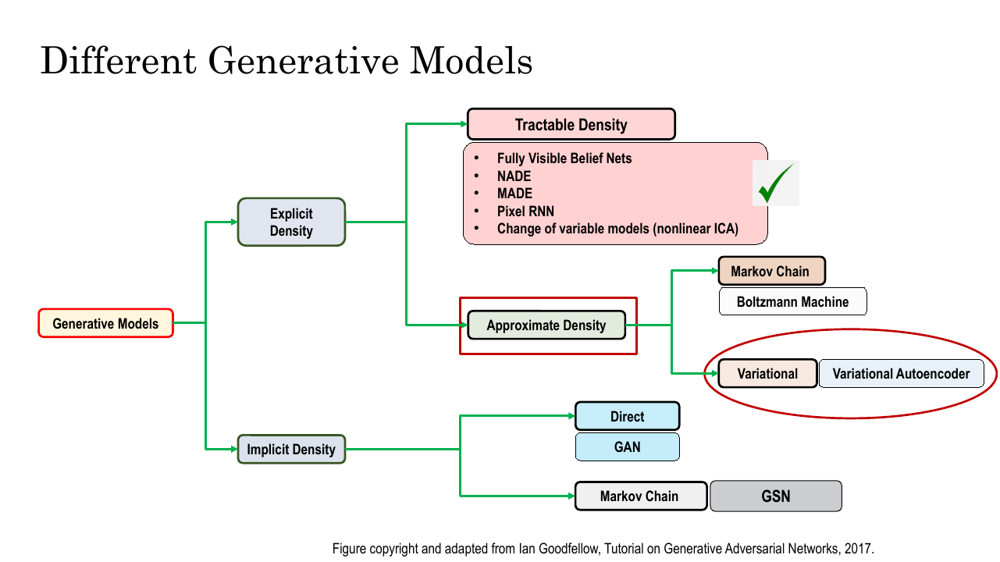
*Fig. — The VAE is **explicit density, approximate**: it writes down a formula for $p_\theta(\mathbf{x})$, but that formula cannot be evaluated, so training optimises a bound instead. Right now that is a claim; by the end of this chapter it is a conclusion. Slide 3.*

### The plain autoencoder

An **autoencoder (AE)** is a network trained to copy its input to its output through a narrow middle. The
**encoder** maps the input $\mathbf{x}$ to a low-dimensional **latent code** $\mathbf{z}$; the **decoder**
maps $\mathbf{z}$ back to a reconstruction $\hat{\mathbf{x}}$.

$$\mathbf{z} = f_\phi(\mathbf{x}), \qquad \hat{\mathbf{x}} = g_\theta(\mathbf{z})$$

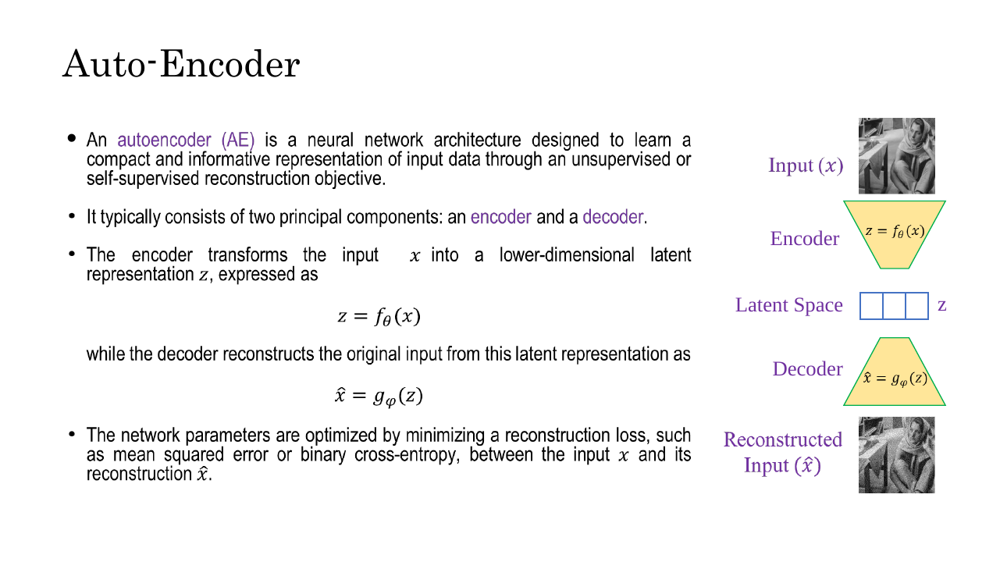
*Fig. — The two trapezoids point at each other. Everything the decoder will ever know about the input has to fit through the row of boxes in the middle. Slide 4.*

> **Symbol warning.** The deck writes the AE encoder as $f_\theta$ and the decoder as $g_\varphi$, then
> three slides later writes the VAE encoder as $q_\phi$ and the decoder as $p_\theta$ — the roles of
> $\theta$ and $\phi$ silently swap. This book uses the contract's convention throughout: **$\phi$ is
> always the encoder, $\theta$ is always the decoder**, in both halves of the chapter.

Training is **unsupervised** — self-supervised, if you prefer, since the label is the input itself. The
loss is a **reconstruction loss**: mean squared error for real-valued pixels, binary cross-entropy for
pixels scaled to $[0,1]$.

$$\mathcal{L}_{\text{AE}} = \frac{1}{N}\sum_{i=1}^{N}\big\|\mathbf{x}^{(i)} - g_\theta\big(f_\phi(\mathbf{x}^{(i)})\big)\big\|^2$$

No labels are needed, which is why autoencoders are everywhere: dimensionality reduction, feature
extraction, denoising, anomaly detection, representation learning. A **convolutional autoencoder (CAE)**
swaps the MLP layers for the convolutions of [Lec 11](../week-03/11-cnn-basics.md) so spatial structure
is exploited rather than flattened away.

### The bottleneck, and why narrowness is the whole point

Copying an input to the output is trivial. If the latent layer were as wide as the input, the network
could learn the identity function — pass every pixel through untouched — and score a perfect loss while
learning nothing. The **bottleneck** is what makes the task hard enough to be useful.

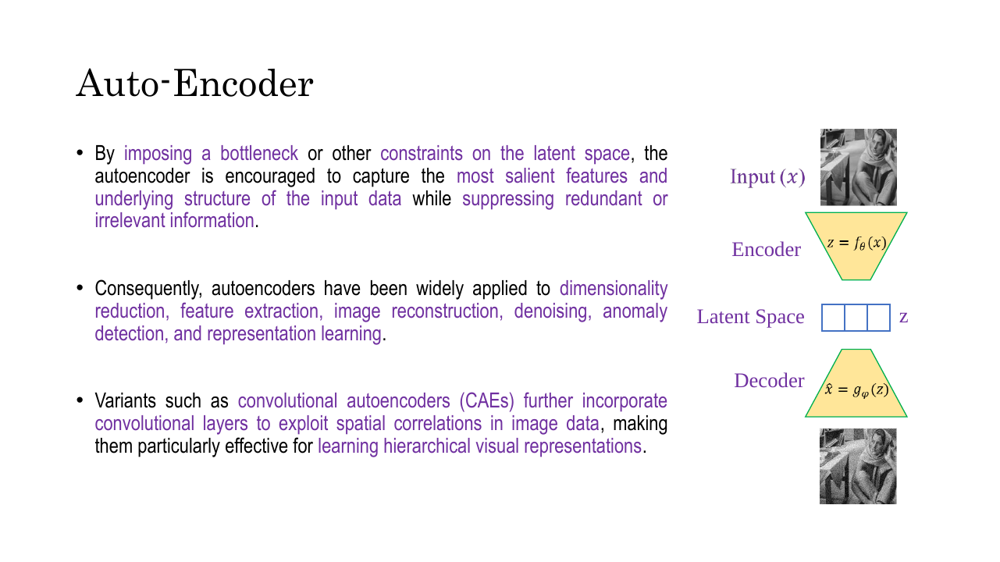
*Fig. — Keep the deck's phrasing verbatim: "capture the most salient features and underlying structure of the input data while suppressing redundant or irrelevant information." That is a compression argument, not a generation argument. Slide 5.*

The reasoning is an information argument. A $28\times28$ MNIST digit lives in $\mathbb{R}^{784}$, but the
*set of things that look like digits* does not fill $\mathbb{R}^{784}$ — pixels in a digit are massively
correlated, so that set is a thin curved sheet inside it. Force 784 numbers through a 32-number channel
and the only way to keep the loss low is to spend those 32 on what actually varies — stroke thickness,
slant, which digit it is — and discard the rest. The bottleneck buys structure by making copying impossible.

Two names you must be able to tell apart:

| Term | Condition | Consequence |
|---|---|---|
| **Undercomplete** | $\dim(\mathbf{z}) < \dim(\mathbf{x})$ | forced compression; this is the useful case |
| **Overcomplete** | $\dim(\mathbf{z}) \ge \dim(\mathbf{x})$ | the identity map is available; learns nothing unless regularised |

An overcomplete autoencoder is not useless, but it needs a *different* constraint in place of narrowness
— sparsity on the code, noise on the input (the denoising autoencoder), a penalty on the encoder's
Jacobian. That is what the deck's "a bottleneck **or other constraints**" is pointing at. Without one,
you have trained an expensive copy machine.

### Why an autoencoder is not a generative model

This is the pivot of the lecture. The deck states the conclusion in three bullets; the argument behind
them is what you need.

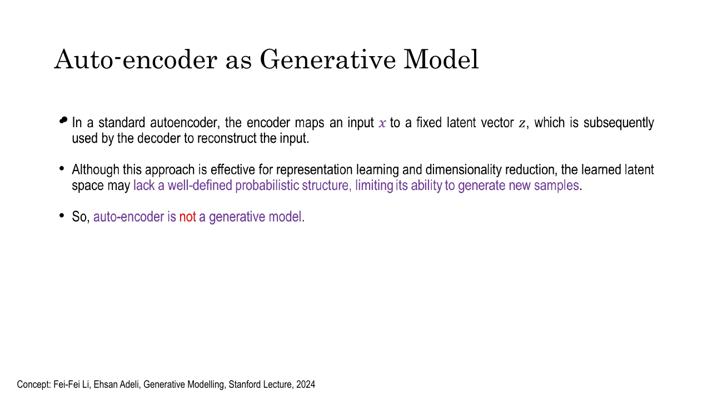
*Fig. — "Lack a well-defined probabilistic structure" is the whole indictment: the AE never learns a distribution over $\mathbf{z}$, so there is nothing to sample from. Slide 6.*

Train an autoencoder on 60,000 MNIST digits with a 32-dimensional latent space. Training produces exactly
60,000 points in $\mathbb{R}^{32}$ — one per image, each the output of the deterministic $f_\phi$. Now try
to generate:

1. **Where do you sample $\mathbf{z}$ from?** You have no distribution. The loss never asked the encoder
   to put the codes anywhere in particular — a thin shell at radius 40, three disconnected blobs, a
   crumpled sheet, all score identically, because reconstruction only cares that *each individual* code
   decodes back to *its own* image.
2. **Suppose you guess.** Draw $\mathbf{z} \sim \mathcal{N}(\mathbf{0},\mathbf{I})$ and decode. Nothing
   makes that region of $\mathbb{R}^{32}$ overlap where the codes actually live, so the decoder is being
   evaluated far outside its training distribution. It returns something; that something is noise.
3. **Suppose you sample between two real codes.** Even this fails. Sixty thousand points in a continuous
   32-dimensional space occupy *zero volume*; between them is holes, and nothing in the objective ever
   penalised the decoder for mapping the gap between a 4 and a 9 to grey mush.

The deck's two-panel figure makes the point visually, and it is the image to remember for the exam.

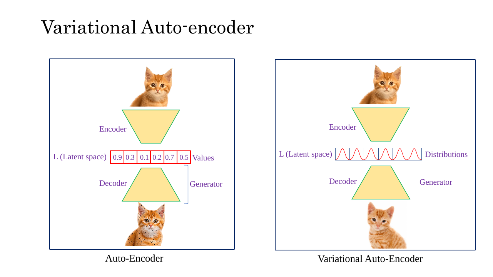
*Fig. — Left the latent space holds **Values**, right **Distributions**. The speckled cat is the deck drawing "decoded from a point the model does not really own". One word changes and the model goes from compressor to generator. Slide 11.*

Verdict: an autoencoder is a **compressor**, not a generator — it learns $\mathbf{x} \to \mathbf{z} \to
\hat{\mathbf{x}}$ and nothing about $p(\mathbf{z})$. [Lec 3](../week-01/03-generative-vision-models.md)
gave this as a one-line teaser; now you have the argument.

### The VAE's answer: encode to a distribution

Flip the one broken thing. Instead of mapping $\mathbf{x}$ to a point, map it to a **Gaussian over the
latent space** — a mean vector $\boldsymbol{\mu}(\mathbf{x})$ and a variance vector
$\boldsymbol{\sigma}^2(\mathbf{x})$, one entry each per latent dimension:

$$q_\phi(\mathbf{z}\mid\mathbf{x}) = \mathcal{N}\big(\boldsymbol{\mu}(\mathbf{x}),\ \mathrm{diag}(\boldsymbol{\sigma}^2(\mathbf{x}))\big)$$

> **Notation clash — read this once.** The Week-1 probability deck writes $\mathcal{N}(\mu, \sigma)$ with
> the **standard deviation** second, and this deck's diagrams copy the habit ($N(\mu_x, \sigma_x)$). **This
> book always writes $\mathcal{N}(\mu, \sigma^2)$ — variance second**, matching the body text of slides 7
> and 8 ($N(\mu(x), \sigma^2(x))$). $\mathcal{N}(0,1)$ is safe either way; $\mathcal{N}(2, 9)$ means
> variance 9, standard deviation 3.

Why does this repair generation? Because a distribution has *width*. Each training image now claims a
fuzzy blob of latent space, and on every pass the decoder must reconstruct that image from a *different*
sample out of the blob — so it is forced to map the whole blob, not a point, to something that looks
like the image. Blobs from similar images overlap, the overlaps tile the space, and the holes close.
Sampling becomes meaningful because the space is continuous and populated by construction.

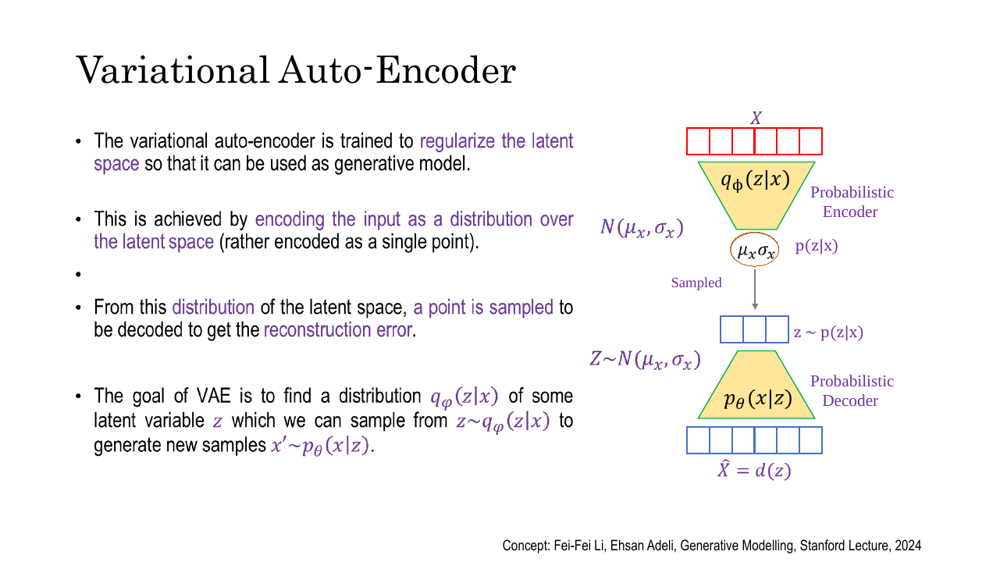
*Fig. — "Trained to **regularize** the latent space so it can be used as a generative model." The regulariser is the KL term, derived in [Lec 30](30-elbo-and-reparameterization.md); what matters here is that it is the *goal*, not a side effect. Slide 10.*

### Encoding → sampling → decoding

The deck lays the forward pass out in three named stages.

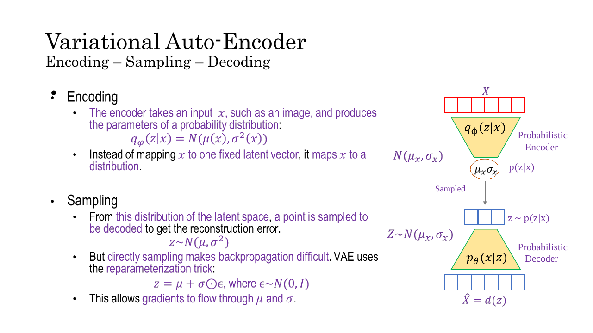
*Fig. — Read the right-hand column top to bottom: input, encoder, a tiny oval holding only $\boldsymbol{\mu}$ and $\boldsymbol{\sigma}$, a sampled $\mathbf{z}$, decoder, output. That oval is the entire difference from slide 4. Slide 8.*

**Encoding.** The encoder is an ordinary MLP or CNN ([Lec 8](../week-02/08-mlp-and-activations.md),
[Lec 11](../week-03/11-cnn-basics.md)) whose final layer has $2d$ outputs for a $d$-dimensional latent
space: the first $d$ read as $\boldsymbol{\mu}$, the second $d$ as $\log\boldsymbol{\sigma}^2$. No sigmoid
or softmax on this head — a plain linear layer.

**Why log-variance and not variance.** A variance must be strictly positive, but a linear layer's output
is any real number and nothing stops it emitting $-0.4$. Rather than clamping, have the network emit
$\log\sigma_j^2$ and recover $\sigma_j^2 = \exp(\log\sigma_j^2)$: since $\exp(\cdot) > 0$ for every real
input, positivity is automatic and the output stays unconstrained. It is also numerically kinder —
variances in a trained VAE routinely sit near $10^{-3}$, a cramped region in linear space and an ordinary
$-6.9$ in log space. The deck omits this; it is standard practice and highly examinable (numerical N4).

**Sampling.** Draw one $\mathbf{z} \sim q_\phi(\mathbf{z}\mid\mathbf{x})$, dimension by dimension:
$z_j = \mu_j + \sigma_j\varepsilon_j$ with $\varepsilon_j \sim \mathcal{N}(0,1)$. Writing the sample as a
deterministic function of $\boldsymbol{\mu}$, $\boldsymbol{\sigma}$ plus external noise is what makes
backpropagation through the sampling step possible — the **reparameterization trick**, named on slides 7
and 8 and derived in [Lec 30](30-elbo-and-reparameterization.md).

**Decoding.** The decoder consumes $\mathbf{z}$ and reconstructs. Note the shift in reading: it does not
output "the image", it outputs the **parameters of a distribution over images**,
$p_\theta(\mathbf{x}\mid\mathbf{z})$ — Bernoulli means for $[0,1]$ pixels, Gaussian means with a fixed
variance for real-valued ones. That is why the pixel-wise cross-entropy you would write anyway *is* a
negative log-likelihood.

### The statistical formulation

Everything above was mechanism. Now the same model written as statistics — the part Lec 30 runs on.

**The assumption.** The training data $\{\mathbf{x}^{(i)}\}_{i=1}^{N}$ was generated by an unobserved
**latent variable** $\mathbf{z}$ — for a face image, think pose, expression, lighting, hair colour. You
never observe those; you observe pixels. The generative story runs one way:

$$p(\mathbf{z}) \longrightarrow \mathbf{z} \longrightarrow p_\theta(\mathbf{x}\mid\mathbf{z}) \longrightarrow \mathbf{x}$$

Two distributions define the model completely.

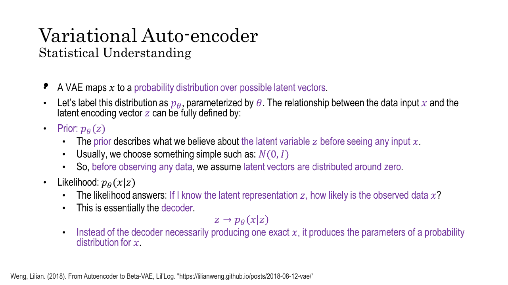
*Fig. — The deck writes the prior as $p_\theta(\mathbf{z})$, which is misleading: it is fixed, not learned, and carries no parameters. Slide 13.*

**The prior $p(\mathbf{z}) = \mathcal{N}(\mathbf{0}, \mathbf{I})$.** What you believe before seeing any
data: centred at the origin, unit variance in every dimension, dimensions independent. Why a standard
normal?

- It is **simple and fixed** — zero parameters to learn, so all the modelling capacity goes into the
  decoder.
- It is **easy to sample from**: at test time you draw $\mathbf{z} \sim \mathcal{N}(\mathbf{0},\mathbf{I})$
  and decode, and that is the whole generation procedure.
- Its **isotropic diagonal covariance** ($\boldsymbol{\Sigma} = \mathbf{I}$) makes the latent dimensions
  uncorrelated and equally scaled — the bottom row of [Lec 6](../week-01/06-probability-2.md)'s
  covariance-matrix table, and a reasonable default for "independent attributes".
- Its **KL divergence against another diagonal Gaussian has a closed form**, which is what makes the
  training loss computable at all. That closed form belongs to [Lec 30](30-elbo-and-reparameterization.md).

A fair objection: how can a spherical Gaussian describe something as structured as "the attributes of a
face"? Because the *decoder* is a deep network, and a flexible enough map can push a sphere of Gaussian
noise onto almost any shape. Simplicity in $\mathbf{z}$ is paid for by complexity in the decoder — the
deck's slide-18 point exactly: "Choose prior $p(z)$ simple, e.g. Gaussian. Conditional $p(x\mid z)$ is
complex. It can be represented with a neural network."

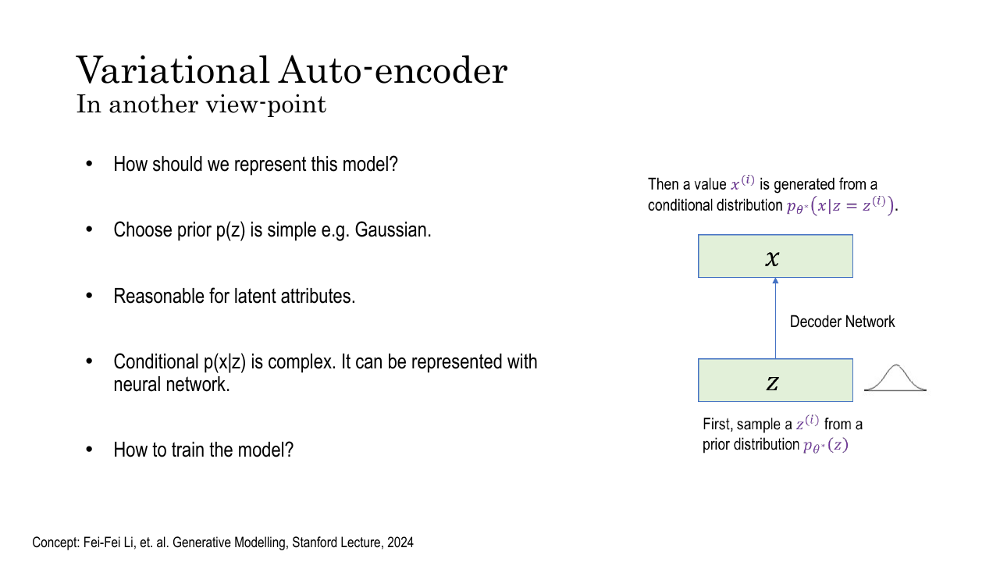
*Fig. — The division of labour: the prior is handed to you, the likelihood is learned. The closing question, "How to train the model?", is the cliffhanger. Slide 18.*

**The likelihood $p_\theta(\mathbf{x}\mid\mathbf{z})$** is the decoder: given a latent code, how probable
is this image? Deep network, parameters $\theta$, trained.

### The objective, and the integral that kills it

You want the parameters that make the observed data as probable as possible — maximum likelihood, as
[Lec 6](../week-01/06-probability-2.md) set it up and
[Lec 22](../week-06/22-generative-taxonomy-and-mle.md) applied it. The deck writes both forms:

$$\theta^{*} = \arg\max_\theta \prod_{i=1}^{n} p_\theta(\mathbf{x}^{(i)}) \qquad\Longleftrightarrow\qquad \theta^{*} = \arg\max_\theta \sum_{i=1}^{n} \log p_\theta(\mathbf{x}^{(i)})$$

The product underflows and is awkward to differentiate; the log turns it into a sum and leaves the argmax
unchanged. Nothing new there.

The new part is that $p_\theta(\mathbf{x})$ is not something the model hands you. It hands you
$p(\mathbf{z})$ and $p_\theta(\mathbf{x}\mid\mathbf{z})$, whose product is the joint
$p_\theta(\mathbf{x},\mathbf{z}) = p_\theta(\mathbf{x}\mid\mathbf{z})\,p(\mathbf{z})$. To get the marginal
over $\mathbf{x}$ you must **marginalise $\mathbf{z}$ away** — for a continuous variable, integrate:

$$\boxed{\ p_\theta(\mathbf{x}) = \int p_\theta(\mathbf{x}\mid\mathbf{z})\,p(\mathbf{z})\,d\mathbf{z}\ }$$

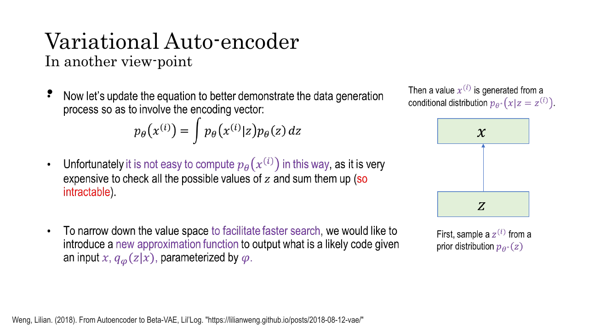
*Fig. — The deck's words: "very expensive to check all the possible values of $z$ and sum them up (so **intractable**)". Its last bullet already names the fix, $q_\phi(\mathbf{z}\mid\mathbf{x})$. Slide 17.*

Read the integral literally and the problem is obvious. It runs over **every possible value of
$\mathbf{z}$** in a continuous $d$-dimensional space, and its integrand contains a deep network, so there
is no closed form — you cannot integrate a stack of ReLUs and matrix multiplies the way you integrate a
polynomial. Numerical integration then dies on dimension: a grid with only 10 points per axis costs
$10^d$ decoder evaluations, 100 at $d=2$ and $10^{20}$ at $d=20$. Numerical N5 turns that into roughly
**three thousand years** — per image, per gradient step. That is what "intractable" means, concretely.
The marginalisation section of [Lec 6](../week-01/06-probability-2.md) flagged this exact integral in its
harmless two-variable form; here it is in the wild.

### And therefore the posterior is intractable too

The decoder runs $\mathbf{z} \to \mathbf{x}$; an encoder must run the other way — given an observed image,
which latent codes could plausibly have produced it? That is the **true posterior**
$p_\theta(\mathbf{z}\mid\mathbf{x})$, and Bayes' rule says what it is:

$$p_\theta(\mathbf{z}\mid\mathbf{x}) = \frac{p_\theta(\mathbf{x}\mid\mathbf{z})\,p(\mathbf{z})}{p_\theta(\mathbf{x})}$$

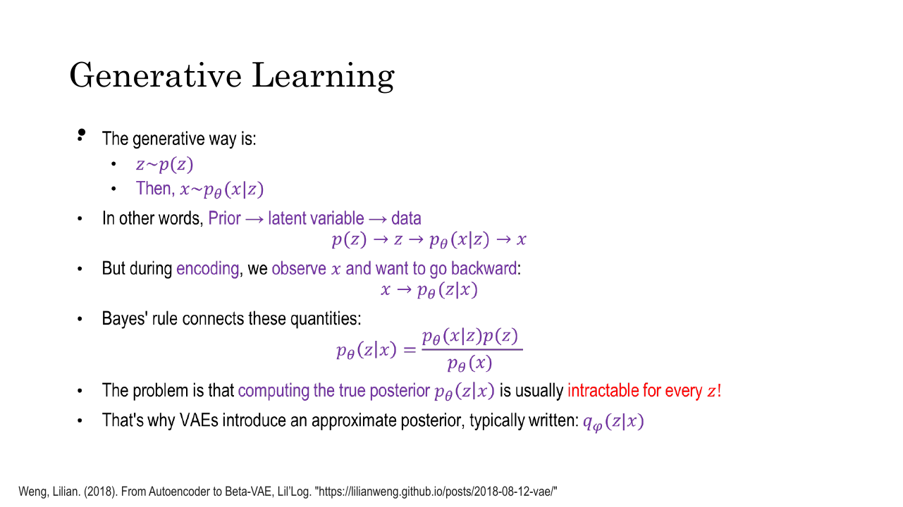
*Fig. — Look at the denominator: it is the integral from the previous slide, so the posterior inherits its intractability. Slide 15.*

The numerator is fine: the decoder gives $p_\theta(\mathbf{x}\mid\mathbf{z})$ for any $\mathbf{z}$, and
$p(\mathbf{z}) = \mathcal{N}(\mathbf{0},\mathbf{I})$ evaluates in one line. The denominator is
$p_\theta(\mathbf{x})$ — the integral you just established cannot be computed. So **the intractability
propagates**: no marginal means no normaliser, which means you cannot evaluate the posterior at any
$\mathbf{z}$ — and the posterior is precisely what an encoder would have to compute. Exam phrasing: *the
true posterior is intractable because its denominator is the intractable marginal likelihood.*

### The problem formulation — and where this chapter stops

The deck's last substantive slide states the whole situation in six lines: latent $\mathbf{z}$, observed
$\mathbf{x}$, the model $p_\theta(\mathbf{x},\mathbf{z}) = p_\theta(\mathbf{x}\mid\mathbf{z})p(\mathbf{z})$,
the goal of maximising $p_\theta(\mathbf{x})$, and the integral that blocks it.

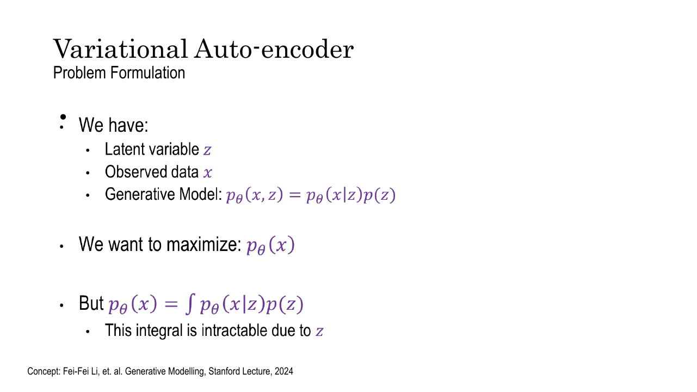
*Fig. — Everything you own from this lecture, on one slide. Note that the deck's integral is missing its $d\mathbf{z}$; write it in. Slide 19.*

The escape route is stated on slides 15 and 17 and it is one sentence long: **stop trying to compute the
true posterior and approximate it with something you choose yourself.** Introduce a second network, with
its own parameters $\phi$, that emits a distribution

$$q_\phi(\mathbf{z}\mid\mathbf{x}) \approx p_\theta(\mathbf{z}\mid\mathbf{x})$$

and pick its family so that everything downstream stays computable. The choice is a **diagonal
Gaussian** — exactly the $\boldsymbol{\mu}$, $\boldsymbol{\sigma}^2$ head from the Encoding–Sampling–Decoding
section, which is why that mechanism was introduced before the statistics that justify it. Diagonal
rather than full-covariance for [Lec 6](../week-01/06-probability-2.md)'s reasons: $O(d)$ numbers instead
of $O(d^2)$, every formula factorises over dimensions, and the density is a product of $d$ 1-D Gaussians
you can evaluate by hand (numerical N3).

That closes the loop on the taxonomy slide. The VAE is **explicit density** because it genuinely writes
$p_\theta(\mathbf{x}) = \int p_\theta(\mathbf{x}\mid\mathbf{z})p(\mathbf{z})\,d\mathbf{z}$ — unlike a GAN,
which never writes a density at all. It is **approximate** because that expression cannot be evaluated,
so training optimises a tractable lower bound built from $q_\phi$ instead.

**Which is where this chapter ends.** You have the model, the obstruction and the shape of the fix.
Turning $q_\phi$ into a trainable objective — the variational lower bound (ELBO), the two-term loss, the
closed-form KL for diagonal Gaussians, and the reparameterization trick that lets gradients cross the
sampling step — is the entire content of [Lec 30](30-elbo-and-reparameterization.md).

## Worked numericals

### N1. Autoencoder parameter count and compression ratio
**Given:** a fully-connected autoencoder on MNIST with layer sizes $784 \to 128 \to 32 \to 128 \to 784$,
every layer having a bias.
**Find:** the compression ratio, the bottleneck ratio, and the total parameter count.

1. A dense layer $a \to b$ has $ab$ weights and $b$ biases, so $ab + b$ parameters
   ([Lec 8](../week-02/08-mlp-and-activations.md)).
2. Encoder layer 1, $784 \to 128$: $784 \times 128 + 128 = 100{,}352 + 128 = 100{,}480$.
3. Encoder layer 2, $128 \to 32$: $128 \times 32 + 32 = 4{,}096 + 32 = 4{,}128$.
   Encoder total $= 100{,}480 + 4{,}128 = 104{,}608$.
4. Decoder layer 1, $32 \to 128$: $32 \times 128 + 128 = 4{,}096 + 128 = 4{,}224$.
5. Decoder layer 2, $128 \to 784$: $128 \times 784 + 784 = 100{,}352 + 784 = 101{,}136$.
   Decoder total $= 4{,}224 + 101{,}136 = 105{,}360$.
6. Total $= 104{,}608 + 105{,}360 = 209{,}968$.
7. Compression ratio $= 784 / 32 = 24.5$, i.e. **24.5 : 1**.
8. Bottleneck ratio $= 32/784 = 0.0408 = 4.08\%$ of the input dimension.
9. In float32: one image is $784 \times 4 = 3{,}136$ bytes, one code is $32 \times 4 = 128$ bytes. And
   $32 < 784$, so this autoencoder is **undercomplete**.

**Answer:** **209,968 parameters**; compression **24.5 : 1**; bottleneck **4.08 %**; undercomplete.
Note the encoder and decoder are *not* equal in size (104,608 vs 105,360) — mirroring the layer widths
does not mirror the parameter count, because the biases are not symmetric.

### N2. The autoencoder's generative failure, in arithmetic
**Given:** a 2-D-latent autoencoder has encoded training image A to $\mathbf{z}_A = [3.0, -1.0]$ and
image B to $\mathbf{z}_B = [-2.0, 2.5]$. You want to generate something "between" them.
**Find:** the midpoint, its distance from the training codes, and whether anything guarantees it decodes
to a valid image. Then repeat for a VAE whose encoder emits $\boldsymbol{\sigma}^2 = [4.0, 4.0]$ at A.

1. Midpoint: $\mathbf{z}_m = \tfrac12(\mathbf{z}_A + \mathbf{z}_B) = [\tfrac{3-2}{2}, \tfrac{-1+2.5}{2}] = [0.5,\ 0.75]$.
2. $\|\mathbf{z}_A - \mathbf{z}_B\| = \sqrt{5.0^2 + 3.5^2} = \sqrt{25 + 12.25} = \sqrt{37.25} = 6.103$.
3. $\|\mathbf{z}_A - \mathbf{z}_m\| = \sqrt{2.5^2 + 1.75^2} = \sqrt{6.25 + 3.0625} = \sqrt{9.3125} = 3.052$ —
   and the same from B, by symmetry.
4. **The autoencoder case.** $g_\theta$ saw $\mathbf{z}_A$ and $\mathbf{z}_B$ and nothing else on the
   line joining them, so the reconstruction loss contributed *zero* gradient at $\mathbf{z}_m$. With
   $N = 60{,}000$ images the decoder is constrained at exactly 60,000 points of $\mathbb{R}^{2}$ — a set
   of **measure zero**, occupying zero area, so a randomly drawn $\mathbf{z}$ hits one with probability 0.
5. $g_\theta(\mathbf{z}_m)$ is therefore pure extrapolation 3.05 units from the nearest supervised point.
   It returns an image, but no term in the objective ever asked it to be a valid one.
6. **The VAE case.** The encoder emits $\boldsymbol{\mu}_A = [3.0,-1.0]$,
   $\boldsymbol{\sigma}^2 = [4.0,4.0]$, so $\sigma_1 = \sigma_2 = 2$. Squared Mahalanobis distance of the
   midpoint from A's distribution:
   $r^2 = \dfrac{(0.5-3.0)^2}{4.0} + \dfrac{(0.75+1.0)^2}{4.0} = \dfrac{6.25}{4} + \dfrac{3.0625}{4} = 1.5625 + 0.7656 = 2.3281$.
7. Peak density of this diagonal Gaussian: $\dfrac{1}{2\pi\sigma_1\sigma_2} = \dfrac{1}{2\pi \cdot 4} = 0.039789$.
8. Density at the midpoint: $0.039789 \times e^{-2.3281/2} = 0.039789 \times e^{-1.1641} = 0.039789 \times 0.3122 = 0.012423$.
9. Ratio to the peak: $e^{-1.1641} = 0.312$. Each training pass draws a fresh $\mathbf{z}$ from this
   Gaussian, so the decoder was trained to reconstruct image A from the midpoint region at **about 31 %
   of the rate** it was trained from the mode itself.

**Answer:** $\mathbf{z}_m = [0.5, 0.75]$, 3.052 from each code. In the autoencoder nothing constrains
$g_\theta$ there — the training set has measure zero and the midpoint is a hole. In the VAE the midpoint
has density **0.0124**, 31 % of the peak, so it sits inside the region the decoder was actively trained
on. *That* is the difference between a point and a distribution.

### N3. Evaluating a 2-D diagonal Gaussian — what the encoder emits
**Given:** $q_\phi(\mathbf{z}\mid\mathbf{x}) = \mathcal{N}(\boldsymbol{\mu}, \mathrm{diag}(\boldsymbol{\sigma}^2))$
with $\boldsymbol{\mu} = [1.0, -2.0]$ and $\boldsymbol{\sigma}^2 = [0.25, 4.0]$.
**Find:** the density at $\mathbf{z} = [1.0,-2.0]$, $[1.5,-2.0]$ and $[0.0, 0.0]$.

1. Because the covariance is **diagonal**, the density factorises into a product of independent 1-D
   Gaussians — no matrix inverse, no determinant:
   $$q(\mathbf{z}) = \prod_{j=1}^{d}\frac{1}{\sqrt{2\pi\sigma_j^2}}\exp\!\left(-\frac{(z_j-\mu_j)^2}{2\sigma_j^2}\right)$$
2. The normalising constant is shared by all three evaluations:
   $\dfrac{1}{\sqrt{2\pi(0.25)}}\cdot\dfrac{1}{\sqrt{2\pi(4.0)}} = \dfrac{1}{2\pi\sqrt{0.25 \times 4.0}} = \dfrac{1}{2\pi\sqrt{1}} = \dfrac{1}{6.2832} = 0.159155$.
3. At $\mathbf{z} = [1.0,-2.0]$ — the mode — both squared terms are 0, so the exponent is $e^0 = 1$:
   $q = 0.159155$.
4. At $\mathbf{z} = [1.5,-2.0]$: dim 1 gives $\dfrac{(1.5-1.0)^2}{2(0.25)} = \dfrac{0.25}{0.5} = 0.5$;
   dim 2 gives 0. So $q = 0.159155 \times e^{-0.5} = 0.159155 \times 0.60653 = 0.096533$.
5. At $\mathbf{z} = [0.0,0.0]$: dim 1 gives $\dfrac{(0-1)^2}{2(0.25)} = \dfrac{1}{0.5} = 2.0$;
   dim 2 gives $\dfrac{(0+2)^2}{2(4.0)} = \dfrac{4}{8} = 0.5$. Exponent sum $= 2.5$, so
   $q = 0.159155 \times e^{-2.5} = 0.159155 \times 0.082085 = 0.013064$.
6. Log-density check at $[0,0]$:
   $\log q = -\tfrac12\big[\log(2\pi \cdot 0.25) + \log(2\pi \cdot 4) + 2.0 \cdot 2 + 0.5 \cdot 2\big]
   = -\tfrac12[0.4516 + 3.2242 + 4 + 1] = -\tfrac12(8.6758) = -4.3379$, and $e^{-4.3379} = 0.013064$. ✓

**Answer:** $q([1,-2]) = 0.159155$ (the maximum), $q([1.5,-2]) = 0.096533$, $q([0,0]) = 0.013064$. A
half-unit step in the **tight** dimension ($\sigma^2 = 0.25$) costs more density than a two-unit step in
the loose one ($\sigma^2 = 4$): the variance vector says which directions the model is confident about.

### N4. Sampling from an encoder's output, by hand
**Given:** for one input image the encoder's $2d$-dimensional output head reads
$[\,0.5,\ -1.2,\ 2.0\,\mid\,0.0,\ -2.0,\ 1.386294\,]$, with the first three numbers read as
$\boldsymbol{\mu}$ and the last three as $\log\boldsymbol{\sigma}^2$. A random draw
$\boldsymbol{\varepsilon} = [-0.3,\ 1.5,\ 0.8]$ is taken from $\mathcal{N}(\mathbf{0},\mathbf{I})$.
**Find:** $\boldsymbol{\sigma}^2$, $\boldsymbol{\sigma}$, and the resulting latent sample $\mathbf{z}$.

1. Split the head: $\boldsymbol{\mu} = [0.5, -1.2, 2.0]$, $\log\boldsymbol{\sigma}^2 = [0.0, -2.0, 1.386294]$.
2. Exponentiate to get variances: $\sigma_1^2 = e^{0} = 1.0$; $\sigma_2^2 = e^{-2.0} = 0.135335$;
   $\sigma_3^2 = e^{1.386294} = 4.0$ (since $\ln 4 = 1.386294$).
3. Square-root to get standard deviations: $\sigma_1 = 1.0$, $\sigma_2 = \sqrt{0.135335} = 0.367879$,
   $\sigma_3 = 2.0$.
4. Sample dimension by dimension, $z_j = \mu_j + \sigma_j \varepsilon_j$:
   - $z_1 = 0.5 + 1.0 \times (-0.3) = 0.5 - 0.3 = 0.2$
   - $z_2 = -1.2 + 0.367879 \times 1.5 = -1.2 + 0.551819 = -0.648181$
   - $z_3 = 2.0 + 2.0 \times 0.8 = 2.0 + 1.6 = 3.6$
5. Check: $\varepsilon_3 = 0.8$ is 0.8 standard deviations above the mean and $3.6 = 2.0 + 0.8\sigma_3$. ✓
   Dimension 2 has the smallest $\sigma$, so even a $1.5\sigma$ draw moves it only 0.55.

**Answer:** $\boldsymbol{\sigma}^2 = [1.0,\ 0.1353,\ 4.0]$, $\boldsymbol{\sigma} = [1.0,\ 0.3679,\ 2.0]$,
$\mathbf{z} = [0.2,\ -0.6482,\ 3.6]$. Had the network emitted $-2.0$ as a *variance* the model would be
broken; emitted as a *log*-variance it is a perfectly valid $\sigma^2 = 0.135$.

### N5. Why the marginalisation integral is hopeless
**Given:** you want to evaluate $p_\theta(\mathbf{x}) = \int p_\theta(\mathbf{x}\mid\mathbf{z})p(\mathbf{z})\,d\mathbf{z}$
numerically on a grid, with 10 grid points per latent dimension. Assume an absurdly optimistic
$10^{9}$ decoder evaluations per second.
**Find:** the cost at $d = 2, 10, 20$ and 128.

1. A $d$-dimensional grid with 10 points per axis has $10^d$ cells, so the integral costs $10^d$ decoder
   forward passes.
2. $d = 2$: $10^2 = 100$ passes $= 10^{-7}$ s. Free.
3. $d = 10$: $10^{10}$ passes $= 10$ s. Already too slow to do once per gradient step.
4. $d = 20$: $10^{20}$ passes $= 10^{20}/10^{9} = 10^{11}$ s.
5. Convert: $10^{11}\,\text{s} \div 3.156\times10^{7}\,\text{s/yr} = 3.17\times10^{3}$ years.
6. And that is **one** $p_\theta(\mathbf{x}^{(i)})$ for **one** image at **one** value of $\theta$;
   training 60,000 images for 100 epochs multiplies it by $6\times10^{6}$.
7. $d = 128$, an ordinary VAE latent size: $10^{128}$ passes. The observable universe holds about
   $10^{80}$ atoms.
8. Ten points per axis is also a *terrible* grid — it resolves the prior's $[-3,3]$ range at $0.6\sigma$
   spacing. A respectable 100 points per axis squares every number above.

**Answer:** $d = 20$ needs $10^{20}$ evaluations $\approx$ **3,170 years** at a billion per second, for a
single image and a single gradient step. There is no closed form and no numerical escape — hence
"intractable", and hence the need for $q_\phi(\mathbf{z}\mid\mathbf{x})$.

## Code

```python
import numpy as np

# ---------- 1. the encoder head: one vector, split into mu and log-variance
d_z  = 3
head = np.array([0.5, -1.2, 2.0, 0.0, -2.0, 1.386294])   # raw network output: 2*d_z numbers
mu, log_var = head[:d_z], head[d_z:]
var   = np.exp(log_var)      # exp() is positive for ANY real input -> no constraint needed
sigma = np.sqrt(var)
print("mu      ", np.round(mu, 4))        # mu       [ 0.5 -1.2  2. ]
print("log var ", np.round(log_var, 4))   # log var  [ 0.     -2.      1.3863]
print("var     ", np.round(var, 4))       # var      [1.     0.1353 4.    ]
print("sigma   ", np.round(sigma, 4))     # sigma    [1.     0.3679 2.    ]

# ---------- 2. one sample from that diagonal Gaussian, with a fixed eps
eps = np.array([-0.3, 1.5, 0.8])          # a draw from N(0, I)
z   = mu + sigma * eps                    # elementwise; this is worked numerical N4
print("z       ", np.round(z, 4))         # z        [ 0.2    -0.6482  3.6   ]

# ---------- 3. density of a 2-D diagonal Gaussian
def diag_gauss_pdf(z, mu, var):
    """N(z; mu, diag(var)) = product of d independent 1-D Gaussians."""
    return np.prod(np.exp(-(z - mu)**2 / (2*var)) / np.sqrt(2*np.pi*var))

mu2, var2 = np.array([1.0, -2.0]), np.array([0.25, 4.0])
for zt in ([1.0, -2.0], [1.5, -2.0], [0.0, 0.0]):
    print(f"q({zt}) = {diag_gauss_pdf(np.array(zt), mu2, var2):.6f}")
# q([1.0, -2.0]) = 0.159155      <- the mode
# q([1.5, -2.0]) = 0.096532
# q([0.0, 0.0]) = 0.013064

# ---------- 4. why the marginal integral is hopeless: 10 grid points per dim
EVALS_PER_SEC, SEC_PER_YEAR = 1e9, 3.156e7
for d in (2, 5, 10, 20, 128):
    n = 10.0 ** d
    print(f"d={d:4d}  evals={n:8.0e}  seconds={n/EVALS_PER_SEC:8.0e}"
          f"  years={n/EVALS_PER_SEC/SEC_PER_YEAR:8.0e}")
# d=   2  evals=   1e+02  seconds=   1e-07  years=   3e-15
# d=   5  evals=   1e+05  seconds=   1e-04  years=   3e-12
# d=  10  evals=   1e+10  seconds=   1e+01  years=   3e-07
# d=  20  evals=   1e+20  seconds=   1e+11  years=   3e+03     <- 3,170 years
# d= 128  evals=  1e+128  seconds=  1e+119  years=  3e+111

# ---------- 5. autoencoder parameter count and compression ratio
dims   = [784, 128, 32, 128, 784]
params = sum(a*b + b for a, b in zip(dims[:-1], dims[1:]))
print("AE params:", params, "| compression 784:32 =", 784/32,
      "| bottleneck =", round(100*32/784, 2), "%")
# AE params: 209968 | compression 784:32 = 24.5 | bottleneck = 4.08 %
```

Two things to notice. Block 1 shows why log-variance is the right parameterisation: the raw outputs
include $-2.0$, nonsense as a variance and ordinary as a log-variance. Block 4 shows the cliff — fine at
$d=10$, catastrophic at $d=20$, because each extra latent dimension multiplies the work by 10.

## Exam pack

### Must-memorise

| Item | Exactly this |
|---|---|
| Autoencoder | encoder $\mathbf{z} = f_\phi(\mathbf{x})$, decoder $\hat{\mathbf{x}} = g_\theta(\mathbf{z})$ |
| AE loss | reconstruction only: MSE or binary cross-entropy between $\mathbf{x}$ and $\hat{\mathbf{x}}$ |
| Undercomplete | $\dim(\mathbf{z}) < \dim(\mathbf{x})$ — the useful case |
| Overcomplete | $\dim(\mathbf{z}) \ge \dim(\mathbf{x})$ — identity map available, needs another constraint |
| Why AE is not generative | the latent space has no probabilistic structure, so there is nothing to sample from |
| VAE encoder | $q_\phi(\mathbf{z}\mid\mathbf{x}) = \mathcal{N}(\boldsymbol{\mu}(\mathbf{x}), \mathrm{diag}(\boldsymbol{\sigma}^2(\mathbf{x})))$ |
| VAE decoder | $p_\theta(\mathbf{x}\mid\mathbf{z})$ — the likelihood |
| Prior | $p(\mathbf{z}) = \mathcal{N}(\mathbf{0}, \mathbf{I})$ — fixed, not learned |
| Joint | $p_\theta(\mathbf{x},\mathbf{z}) = p_\theta(\mathbf{x}\mid\mathbf{z})\,p(\mathbf{z})$ |
| Marginal (the objective) | $p_\theta(\mathbf{x}) = \int p_\theta(\mathbf{x}\mid\mathbf{z})\,p(\mathbf{z})\,d\mathbf{z}$ |
| MLE objective | $\theta^{*} = \arg\max_\theta \sum_{i=1}^{n}\log p_\theta(\mathbf{x}^{(i)})$ |
| True posterior | $p_\theta(\mathbf{z}\mid\mathbf{x}) = \dfrac{p_\theta(\mathbf{x}\mid\mathbf{z})p(\mathbf{z})}{p_\theta(\mathbf{x})}$ |
| Why the posterior is intractable | its denominator is the intractable marginal |
| The fix (this chapter's endpoint) | approximate it with a diagonal-Gaussian $q_\phi(\mathbf{z}\mid\mathbf{x})$ |
| Encoder head size | $2d$ outputs for latent dim $d$: $d$ for $\boldsymbol{\mu}$, $d$ for $\log\boldsymbol{\sigma}^2$ |
| Recovering variance | $\sigma_j^2 = \exp(\log\sigma_j^2) > 0$ for any real network output |
| Diagonal Gaussian density | $\prod_j \frac{1}{\sqrt{2\pi\sigma_j^2}}\exp\!\big(-\frac{(z_j-\mu_j)^2}{2\sigma_j^2}\big)$ |
| Taxonomy slot | explicit density, **approximate** (variational) |

### Numbers worth knowing

| Quantity | Value |
|---|---|
| Deck's AE latent code example (slide 11) | 0.9, 0.3, 0.1, 0.2, 0.7, 0.5 — six **values** |
| Deck's VAE latent code (slide 11) | six **distributions**, same six slots |
| $784 \to 128 \to 32 \to 128 \to 784$ AE parameters | 209,968 |
| Its compression ratio / bottleneck | 24.5 : 1 / 4.08 % |
| Grid integration at $d=20$, 10 points per axis | $10^{20}$ evaluations ≈ 3,170 years at $10^9$/s |
| Grid integration at $d=2$ | $10^{2} = 100$ evaluations |
| Encoder output count for latent dim $d$ | $2d$ |
| Peak density of $\mathcal{N}([1,-2], \mathrm{diag}[0.25,4])$ | $1/(2\pi) = 0.159155$ |
| $\log\sigma^2 = 1.386294 \Rightarrow \sigma^2, \sigma$ | 4.0, 2.0 |
| Prior used by every standard VAE | $\mathcal{N}(\mathbf{0},\mathbf{I})$ |

### Likely MCQ traps

- **"An autoencoder is a generative model."** False — the headline claim of slide 6. It is a compressor,
  and becomes generative only once the latent space is given probabilistic structure.
- **"A VAE differs from an AE because it is deeper / convolutional / uses a different reconstruction
  loss."** No. The one difference is that the encoder outputs a **distribution** ($\boldsymbol{\mu}$ and
  $\boldsymbol{\sigma}^2$) instead of a point.
- **$\mathcal{N}(\mu,\sigma)$ versus $\mathcal{N}(\mu,\sigma^2)$.** The Week-1 deck and this deck's
  diagrams put the standard deviation second; this book and the slide body text put the **variance**
  second. $\mathcal{N}(0,4)$ here means $\sigma = 2$.
- **"The encoder outputs $\sigma$."** It outputs $\log\sigma^2$ in every standard implementation, so
  that the value is unconstrained in sign. Converting needs **two** steps: exponentiate, then square-root.
- **"The prior is learned."** It is not. $p(\mathbf{z}) = \mathcal{N}(\mathbf{0},\mathbf{I})$ is fixed and
  parameter-free. The deck's slide 13 writes $p_\theta(z)$, which is sloppy — slide 19 correctly writes $p(z)$.
- **"$p_\theta(\mathbf{x}\mid\mathbf{z})$ is the encoder."** No — it is the **decoder**, read as a
  likelihood. Check the left of the bar: the encoder produces $\mathbf{z}$, so the encoder is
  $q_\phi(\mathbf{z}\mid\mathbf{x})$.
- **"The marginal is intractable because the decoder is non-linear."** Partly — but the examinable reason
  is that the integral runs over **all** of a continuous, high-dimensional $\mathbf{z}$ space. Dimension
  is the killer.
- **"Only the marginal is intractable; the posterior is fine."** The posterior is intractable *because*
  of the marginal — the marginal is its denominator.
- **"A VAE is an implicit-density model."** No. It writes $p_\theta(\mathbf{x})$ down explicitly; it is
  explicit-but-approximate. GANs are the implicit family.
- **Bottleneck ratio vs compression ratio.** $32/784 = 4.08\%$ is the bottleneck ratio; $784/32 = 24.5$
  is the compression ratio. They are reciprocals, and the question will specify one.

### Self-test

1. State in one sentence why a plain autoencoder cannot generate new images.
2. An autoencoder has layers $1024 \to 256 \to 64 \to 256 \to 1024$, all with biases. How many parameters?
3. What are the two numbers a VAE encoder emits per latent dimension, and why is the second one a logarithm?
4. If an encoder emits $\log\sigma^2 = -4.0$ for some dimension, what are $\sigma^2$ and $\sigma$?
5. Write the marginal likelihood of a latent-variable model and say why it is intractable.
6. Write Bayes' rule for $p_\theta(\mathbf{z}\mid\mathbf{x})$ and name the intractable factor.
7. Why is $\mathcal{N}(\mathbf{0},\mathbf{I})$ chosen as the prior? Give three reasons.
8. Evaluate $\mathcal{N}(\mathbf{z}; [0,0], \mathrm{diag}[1,1])$ at $\mathbf{z} = [1,1]$.
9. Where does the VAE sit in the generative taxonomy, and what does each half of the label mean?

<details><summary>Answers</summary>

1. It maps inputs to arbitrary isolated points with no distributional structure, so there is no
   distribution to sample $\mathbf{z}$ from and the gaps between training codes decode to garbage.
2. $(1024{\cdot}256+256) + (256{\cdot}64+64) + (64{\cdot}256+256) + (256{\cdot}1024+1024)
   = 262{,}400 + 16{,}448 + 16{,}640 + 263{,}168 = \mathbf{558{,}656}$.
3. $\mu_j$ and $\log\sigma_j^2$. The log form is unconstrained in sign, so a plain linear layer can emit
   any real number and $\sigma_j^2 = \exp(\cdot)$ is positive automatically.
4. $\sigma^2 = e^{-4} = 0.018316$, $\sigma = e^{-2} = 0.135335$.
5. $p_\theta(\mathbf{x}) = \int p_\theta(\mathbf{x}\mid\mathbf{z})p(\mathbf{z})\,d\mathbf{z}$. The
   integral runs over every $\mathbf{z}$ in a continuous high-dimensional space, has no closed form
   because the integrand contains a deep network, and costs $10^d$ evaluations on a 10-point grid.
6. $p_\theta(\mathbf{z}\mid\mathbf{x}) = p_\theta(\mathbf{x}\mid\mathbf{z})p(\mathbf{z})/p_\theta(\mathbf{x})$.
   The denominator $p_\theta(\mathbf{x})$ is the intractable marginal.
7. Simple and parameter-free; trivially sampleable at generation time; diagonal/isotropic so dimensions
   are independent and formulas factorise; and its KL against a diagonal Gaussian has a closed form.
   (Any three.)
8. $\frac{1}{2\pi}e^{-(1+1)/2} = 0.159155 \times e^{-1} = 0.159155 \times 0.367879 = \mathbf{0.05855}$.
9. **Explicit density, approximate.** Explicit: it writes a formula for $p_\theta(\mathbf{x})$ (unlike a
   GAN). Approximate: that formula cannot be evaluated, so training optimises a bound instead.

</details>

## Beyond the slides

**Gap:** The deck says the encoder outputs "$\mu$ and $\sigma^2$" and never mentions that real
implementations emit $\log\sigma^2$.
**Why it matters:** Every VAE does this, and the exam can ask you to convert
$\log\sigma^2 \to \sigma^2 \to \sigma$ — two steps, easy to do one and stop. The reason, that $\exp$ is
positive for any real input so no positivity constraint is needed, is a clean two-mark answer.

**Gap:** "Undercomplete" and "overcomplete" are never named; the deck says only "bottleneck or other
constraints".
**Why it matters:** Both terms are standard and highly MCQ-able, and "or other constraints" is meaningless
until you know an overcomplete AE can learn the identity map and so needs sparsity, input noise or a
Jacobian penalty in place of narrowness.

**Gap:** The deck never says what makes the integral hard *quantitatively* — only "very expensive".
**Why it matters:** "$10^d$ grid evaluations, so $10^{20}$ and three thousand years at $d = 20$" is the
difference between repeating a word and understanding it, and it is the best possible motivation for Lec 30.

**Gap:** The deck's own labelling is unreliable — slide 13 writes the prior as $p_\theta(\mathbf{z})$ as
though it were learned (slide 19 correctly writes $p(\mathbf{z})$), and the diagrams on slides 8–10 call
the sampled distribution $p(z\mid x)$ with parameters $N(\mu_x,\sigma_x)$.
**Why it matters:** The prior is **fixed**; if it were learned the Lec 30 KL term would have a moving
target and its closed form would not apply. And you cannot sample from
$p_\theta(\mathbf{z}\mid\mathbf{x})$ — that is the intractable object this whole chapter is about. You
sample from $q_\phi(\mathbf{z}\mid\mathbf{x})$, whose second parameter is a *variance*. Trust the slide
bodies, not the diagram labels.

## Cut from the slides

Dropped slides 1, 2, 20 and 21 — title, "Content", summary and "next lecture", with slide 20 a verbatim
copy of slide 2. Slides 8 and 9 are one build animation of the same Encoding–Sampling–Decoding figure (9
adds only the "Decoding" bullet), so 9 is folded into 8; slide 10 repeats the identical diagram and is
kept only for its "regularize the latent space" text. Slide 7 names the reparameterization trick and
slide 8 repeats its formula — both deferred to [Lec 30](30-elbo-and-reparameterization.md), which owns
it, and present here as a single forward reference, not a derivation. Slide 12's assumption bullets are
absorbed into the opening of the statistical section rather than listed. The deck's **order** of slides
15 and 16–17 is reversed here: slide 15 announces the posterior's intractability before slide 17
establishes the marginal it depends on, which is backwards as an argument, so the marginal comes first.
Slide 16's MLE recap is compressed to two lines, since [Lec 6](../week-01/06-probability-2.md) owns MLE
and the log-likelihood trick in full. Nothing mathematical was dropped.
