# Lec 30 — The ELBO and the Reparameterization Trick

> **Deck:** `L9P2_VAE-2.pptx` · **Week 8** · **Playlist:** Lec 30
> **Prereqs:** [Lec 29 — Autoencoders to VAE](29-autoencoders-to-vae.md), [Lec 6 — Probability II](../week-01/06-probability-2.md)
> **Feeds into:** none yet — diffusion models (Weeks 9–12) take over from here.

## Why this lecture exists

[Lec 29](29-autoencoders-to-vae.md) built a latent-variable generative model and then walked into a
wall. You want to maximise $\log p_\theta(\mathbf{x})$, but computing it means integrating over every
possible latent code, and the posterior $p_\theta(\mathbf{z}\mid\mathbf{x})$ you would need to do that
efficiently is itself unavailable. The chapter ended on the proposal: give up on the exact posterior
and approximate it with something you *can* compute.

This lecture cashes that proposal in. It turns "approximate the posterior" into a concrete, trainable
objective — the **ELBO** — shows that maximising it does two useful things at once, splits it into the
two terms you actually code up, and then fixes the one remaining obstacle: a random sampling step
sitting in the middle of the network, blocking gradients. Everything in the VAE that works, works
because of what is on these slides.

## The ideas

### Where Lec 29 left you

Three facts carry over, and nothing else from Lec 29 is needed:

1. The generative model is $p_\theta(\mathbf{x},\mathbf{z}) = p_\theta(\mathbf{x}\mid\mathbf{z})\,p(\mathbf{z})$ — draw a latent code $\mathbf{z}$ from a simple prior, push it through a decoder network to get data.
2. The quantity you want to maximise, the **evidence** $p_\theta(\mathbf{x}) = \int p_\theta(\mathbf{x}\mid\mathbf{z})p(\mathbf{z})\,d\mathbf{z}$, is intractable — there is no closed form and the integral runs over all of $\mathbb{R}^J$.
3. By Bayes, $p_\theta(\mathbf{z}\mid\mathbf{x}) = p_\theta(\mathbf{x}\mid\mathbf{z})p(\mathbf{z}) / p_\theta(\mathbf{x})$, so the posterior inherits that same intractable denominator and is just as unavailable.

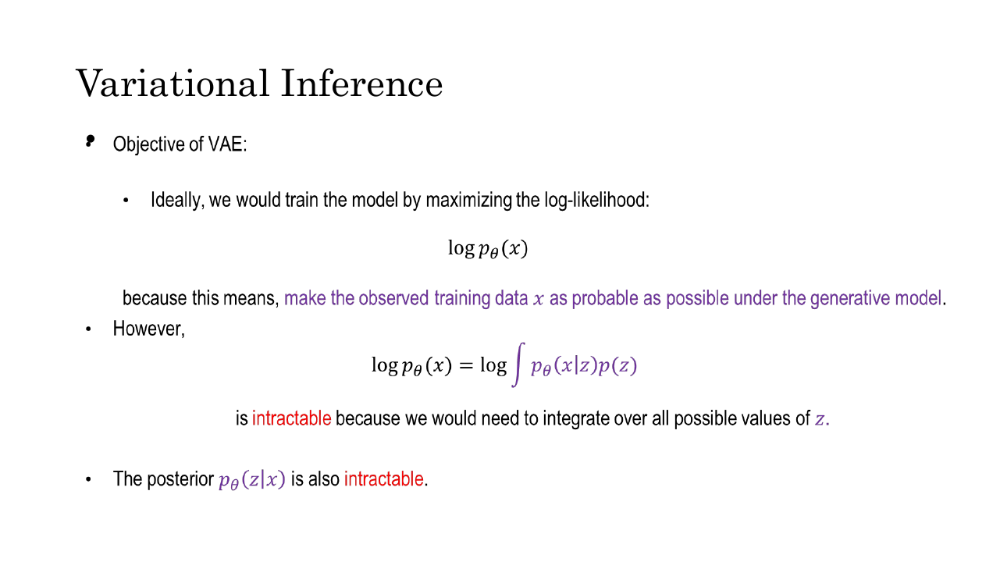
*Fig. — The two red words are the entire problem. Everything that follows is machinery for getting a usable training signal without ever evaluating either of these quantities. Slide 4.*

A note on symbols. The deck writes the prior as $p_\theta(\mathbf{z})$; the prior has no learnable
parameters in a standard VAE, so this book writes it $p(\mathbf{z})$. The deck also writes
$\mathcal{N}(\mu_x, \sigma_x)$ on slide 5 with the **standard deviation** in the second slot — the
loose convention the Week-1 probability deck uses — but switches to the variance by slide 19, so it
contradicts itself. **This book always writes $\mathcal{N}(\mu, \sigma^2)$: second argument is the
variance.** Read every deck formula accordingly.

### Variational inference: replace what you cannot have with the nearest thing you can

You cannot evaluate $p_\theta(\mathbf{z}\mid\mathbf{x})$. **Variational inference** is the move of
replacing an intractable distribution with the closest member of a family you *can* handle, where
"closest" means minimising KL divergence. Three parts, since the name hides them:

- **A tractable family.** Distributions you can sample from, evaluate the density of, and
  differentiate. Diagonal Gaussians are the usual choice: a mean vector and a variance vector.
- **A member of it, indexed by parameters** — $q_\phi(\mathbf{z}\mid\mathbf{x})$, with $\phi$ the
  parameters you tune.
- **A notion of closeness** — the KL divergence, defined and shown non-negative and asymmetric in
  [Lec 6](../week-01/06-probability-2.md). Carry forward just this: $D_{\mathrm{KL}}(q\,\|\,p) \ge 0$
  always, with equality **if and only if** $q = p$.

Inference — asking "which $\mathbf{z}$ produced this $\mathbf{x}$?" — therefore stops being an
integration problem and becomes an **optimisation** problem: find the $\phi$ minimising
$D_{\mathrm{KL}}(q_\phi(\mathbf{z}\mid\mathbf{x}) \,\|\, p_\theta(\mathbf{z}\mid\mathbf{x}))$. That is
what "variational" means — you vary a function's parameters to optimise a quantity.

**Why is this a sensible move at all?** Three reasons, and you should be able to state them. (i)
Optimisation is something you already know how to do — gradient descent and backpropagation
([Lec 9](../week-02/09-backpropagation.md)) — and high-dimensional integration is not. (ii) The
approximation is honest about its own error: we will show that the gap between what you can compute
and what you want is *exactly* the KL you are minimising, so training drives the approximation error
down as a side effect. (iii) $q_\phi$ is **amortised** — instead of a separate optimisation per
training image, one neural network maps any $\mathbf{x}$ to the parameters of its $q$ in a single
forward pass. That network is the encoder.

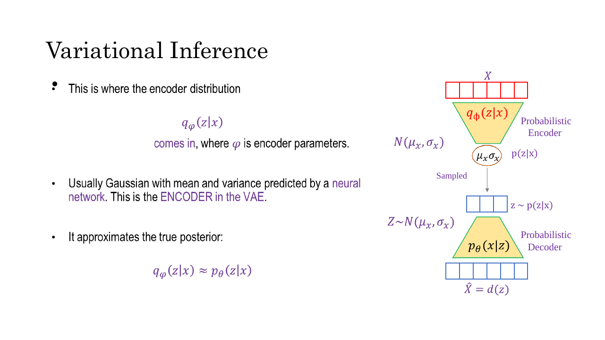
*Fig. — Read the right-hand column top to bottom: this is the whole VAE. The orange oval holding $\mu_x, \sigma_x$ is where the stochastic step lives, and it is the thing the reparameterization trick will have to fix. Slide 5.*

### The probabilistic encoder

$q_\phi(\mathbf{z}\mid\mathbf{x})$ is called the **probabilistic encoder** (the deck's term; also
"recognition model" or "inference network"). Concretely, for a $J$-dimensional latent space:

$$q_\phi(\mathbf{z}\mid\mathbf{x}) = \mathcal{N}\!\big(\mathbf{z};\ \boldsymbol{\mu}_\phi(\mathbf{x}),\ \mathrm{diag}(\boldsymbol{\sigma}^2_\phi(\mathbf{x}))\big)$$

A neural network takes $\mathbf{x}$ and emits two $J$-vectors, $\boldsymbol{\mu}_\phi(\mathbf{x})$ and
$\log\boldsymbol{\sigma}^2_\phi(\mathbf{x})$, which fully specify a Gaussian — this input's approximate
posterior. Three design choices are doing real work.

**Why Gaussian?** You need four things from $q$ at once: a closed-form density, cheap sampling, a
closed-form KL against the prior, and differentiability in its parameters. The Gaussian is the only
standard distribution that gives all four without effort. Nothing deeper is claimed — the true
posterior is almost certainly not Gaussian, and that mismatch is a real source of error (see
*Beyond the slides*).

**Why diagonal?** A full $J\times J$ covariance has $J(J+1)/2$ free parameters — 8,256 numbers per
image at $J=128$ — and the network would have to guarantee they form a positive-definite matrix. A
diagonal covariance needs only $J$ numbers and is automatically valid. The cost is that the latent
dimensions become conditionally independent given $\mathbf{x}$
([Lec 6](../week-01/06-probability-2.md) owns the covariance matrix).

**Why $\log\sigma^2$ rather than $\sigma^2$?** An output layer is unconstrained, but a variance must be
strictly positive. Read the output as $\log\sigma^2$ and $\sigma^2 = \exp(\log\sigma^2) > 0$ for free —
no clipping, no softplus, no negative variance crashing the loss. This is why every VAE implementation
has a variable called `logvar`.

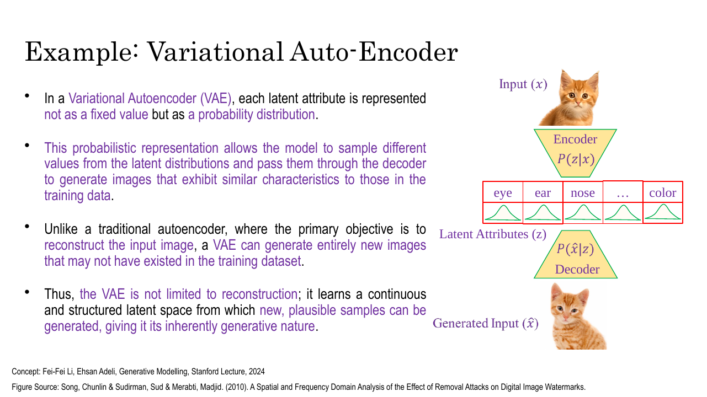
*Fig. — The one-picture difference between an autoencoder and a VAE. Slide 7 (the plain AE) has a single number per attribute — "eye = 0.2". Here each attribute is a whole bell curve, so you can draw a slightly different "eye" every time and still get a plausible cat. Slide 8.*

### Deriving the ELBO

The deck's route, slides 9–10, is **multiply-and-divide, then Jensen**. Every step is below.

**Step 1 — write the evidence as a marginalisation.** By the sum rule
([Lec 6](../week-01/06-probability-2.md)),

$$\log p_\theta(\mathbf{x}) = \log \int p_\theta(\mathbf{x},\mathbf{z})\, d\mathbf{z} \tag{1}$$

This is exact and completely useless: the integral is the thing you cannot do.

**Step 2 — multiply and divide by $q_\phi$.** Since $q_\phi(\mathbf{z}\mid\mathbf{x})$ is a probability
density, it is non-zero wherever we care, so we may insert $q_\phi/q_\phi = 1$ inside the integral:

$$\log p_\theta(\mathbf{x}) = \log \int q_\phi(\mathbf{z}\mid\mathbf{x})\, \frac{p_\theta(\mathbf{x},\mathbf{z})}{q_\phi(\mathbf{z}\mid\mathbf{x})}\, d\mathbf{z} \tag{2}$$

Still exact. Nothing has been approximated — we have multiplied by one.

**Step 3 — recognise an expectation.** An integral of the form $\int q(\mathbf{z}) f(\mathbf{z})\,d\mathbf{z}$
*is* the expectation of $f$ under $q$. So:

$$\log p_\theta(\mathbf{x}) = \log\ \mathbb{E}_{\mathbf{z}\sim q_\phi(\mathbf{z}\mid\mathbf{x})}\!\left[\frac{p_\theta(\mathbf{x},\mathbf{z})}{q_\phi(\mathbf{z}\mid\mathbf{x})}\right] \tag{3}$$

This is the pivot. An expectation under a distribution you can sample from is estimable by Monte Carlo
— draw samples, average — and (3)'s expectation is over $q_\phi$, a diagonal Gaussian you built
yourself. Still exact; (3) is just (2) renamed.

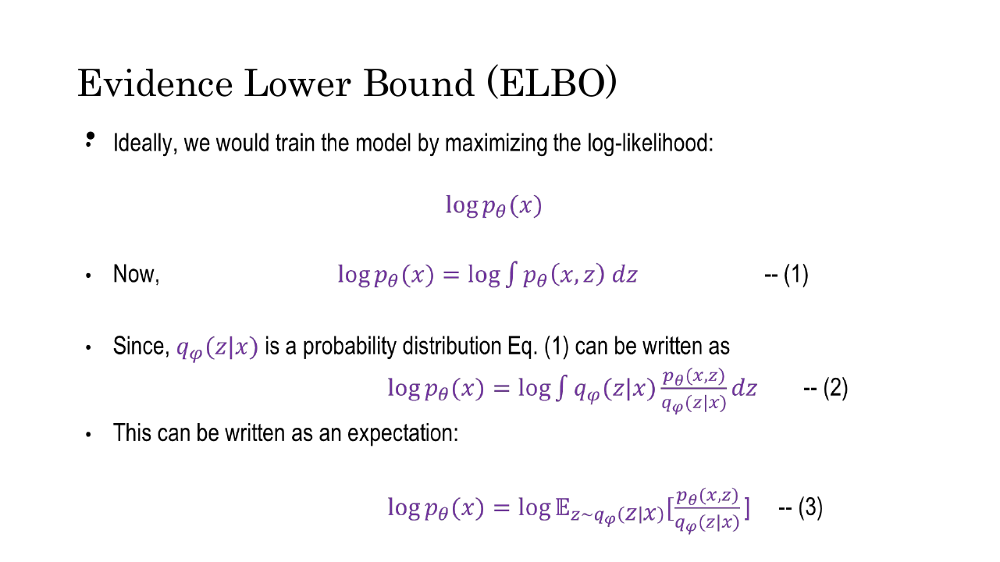
*Fig. — Equations (1) → (2) → (3) are all exact rewrites. No inequality has appeared yet; the approximation enters only on the next slide. Slide 9.*

**Step 4 — apply Jensen's inequality.** The $\log$ sits *outside* the expectation in (3), which is
awkward: you cannot estimate $\log \mathbb{E}[\cdot]$ by averaging samples without bias. We want it
inside. **Jensen's inequality** for a concave function says that the function of an average is at
least the average of the function:

$$\log \mathbb{E}[Y] \ \ge\ \mathbb{E}[\log Y]$$

Why concavity gives this: $\log$ curves downward, so a chord joining two points on the curve lies
*below* it. $\mathbb{E}[\log Y]$ is an average of heights on the curve — a point on a chord — while
$\log\mathbb{E}[Y]$ is the curve's own height above the averaged input. Curve above chord, hence
$\ge$. Equality holds exactly when $Y$ is constant.

Apply it with $Y = p_\theta(\mathbf{x},\mathbf{z})/q_\phi(\mathbf{z}\mid\mathbf{x})$:

$$\log p_\theta(\mathbf{x}) \ \ge\ \mathbb{E}_{\mathbf{z}\sim q_\phi(\mathbf{z}\mid\mathbf{x})}\!\left[\log\frac{p_\theta(\mathbf{x},\mathbf{z})}{q_\phi(\mathbf{z}\mid\mathbf{x})}\right] \tag{4}$$

The right-hand side is the **Evidence Lower BOund**:

$$\boxed{\ \mathcal{L}_{\mathrm{ELBO}}(\theta,\phi;\mathbf{x}) = \mathbb{E}_{\mathbf{z}\sim q_\phi(\mathbf{z}\mid\mathbf{x})}\!\left[\log\frac{p_\theta(\mathbf{x},\mathbf{z})}{q_\phi(\mathbf{z}\mid\mathbf{x})}\right]\ } \tag{5}$$

Parse the name: the **evidence** is $\log p_\theta(\mathbf{x})$ (standard Bayesian terminology for the
data's marginal likelihood), and this is a **lower bound** on it. You cannot compute the evidence, but
you can compute — and maximise — something guaranteed to sit underneath it.

![Slide applying Jensen's inequality to give log p(x) ≥ E[log p(x,z)/q(z|x)], naming the right-hand side the Evidence Lower Bound](../../assets/slides/W8_L9P2_VAE-2/s-10.png)
*Fig. — Jensen's is the only inequality in the entire derivation. Everything before it and everything after it is an identity. Slide 10.*

### The identity that explains everything

Jensen's gives you the bound but tells you nothing about how loose it is. Slides 17–18 supply the
missing piece, and it is the single most important equation in this chapter. The deck says "after some
algebraic manipulation"; here is the manipulation, in four lines.

Start from the KL divergence between your approximation and the true posterior — the thing variational
inference actually wants to minimise:

$$D_{\mathrm{KL}}\big(q_\phi(\mathbf{z}\mid\mathbf{x}) \,\|\, p_\theta(\mathbf{z}\mid\mathbf{x})\big) = \mathbb{E}_{q_\phi}\!\left[\log q_\phi(\mathbf{z}\mid\mathbf{x}) - \log p_\theta(\mathbf{z}\mid\mathbf{x})\right]$$

Substitute Bayes' rule, $p_\theta(\mathbf{z}\mid\mathbf{x}) = p_\theta(\mathbf{x},\mathbf{z})/p_\theta(\mathbf{x})$,
so $\log p_\theta(\mathbf{z}\mid\mathbf{x}) = \log p_\theta(\mathbf{x},\mathbf{z}) - \log p_\theta(\mathbf{x})$:

$$= \mathbb{E}_{q_\phi}\!\left[\log q_\phi(\mathbf{z}\mid\mathbf{x}) - \log p_\theta(\mathbf{x},\mathbf{z}) + \log p_\theta(\mathbf{x})\right]$$

The term $\log p_\theta(\mathbf{x})$ does not depend on $\mathbf{z}$, so it is a constant with respect
to the expectation and comes straight out:

$$= -\,\mathbb{E}_{q_\phi}\!\left[\log\frac{p_\theta(\mathbf{x},\mathbf{z})}{q_\phi(\mathbf{z}\mid\mathbf{x})}\right] + \log p_\theta(\mathbf{x}) \;=\; -\mathcal{L}_{\mathrm{ELBO}} + \log p_\theta(\mathbf{x})$$

Rearrange:

$$\boxed{\ \log p_\theta(\mathbf{x}) = \mathcal{L}_{\mathrm{ELBO}} + D_{\mathrm{KL}}\big(q_\phi(\mathbf{z}\mid\mathbf{x}) \,\|\, p_\theta(\mathbf{z}\mid\mathbf{x})\big)\ }$$

Four consequences fall out of this one line, and an exam will test at least two.

**1. It re-proves the bound, without Jensen.** $D_{\mathrm{KL}} \ge 0$, so
$\mathcal{L}_{\mathrm{ELBO}} \le \log p_\theta(\mathbf{x})$. Two routes to the same result; this one is
strictly more informative.

**2. It names the gap.** The amount by which the ELBO falls short of the true log-evidence is *exactly*
the KL between your approximate posterior and the true posterior. The slack in the bound **is** the
posterior-approximation error — nothing else contributes.

**3. It explains why maximising a mere bound is a good idea.** Fix $\theta$ and raise the ELBO by
tuning $\phi$: the left-hand side cannot move, so the KL must fall by exactly the amount the ELBO rose
— $q_\phi$ gets closer to the true posterior. Now tune $\theta$: the ELBO pushes up on
$\log p_\theta(\mathbf{x})$ from below. **One gradient step on one objective fits the data and improves
the posterior approximation simultaneously.** That is why the VAE is trainable end to end.

**4. It says when the bound is tight.** $D_{\mathrm{KL}} = 0$ if and only if
$q_\phi(\mathbf{z}\mid\mathbf{x}) = p_\theta(\mathbf{z}\mid\mathbf{x})$ — at which point the ELBO
*equals* $\log p_\theta(\mathbf{x})$ and you are doing exact maximum likelihood. A diagonal-Gaussian
family almost certainly does not contain the true posterior, so a permanent gap remains and
$\log p_\theta(\mathbf{x})$ is always underestimated. Worked numerically in **N4**.

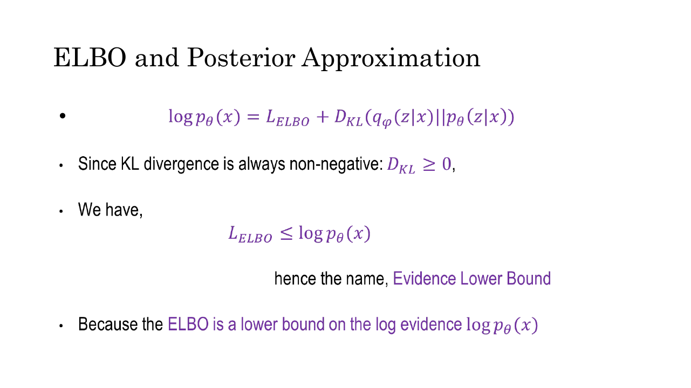
*Fig. — If you memorise one equation from this lecture, memorise the top line. It contains the bound, the gap, the tightness condition and the justification for the whole method. Slide 18.*

### Expanding the ELBO into two terms

Equation (5) is compact but not implementable — it has a joint density in it and no obvious connection
to an encoder and a decoder. Slides 11–12 take it apart. Factorise the joint the generative way,
$p_\theta(\mathbf{x},\mathbf{z}) = p_\theta(\mathbf{x}\mid\mathbf{z})\,p(\mathbf{z})$:

$$\mathcal{L}_{\mathrm{ELBO}} = \mathbb{E}_{q_\phi}\!\left[\log\frac{p_\theta(\mathbf{x}\mid\mathbf{z})\,p(\mathbf{z})}{q_\phi(\mathbf{z}\mid\mathbf{x})}\right]$$

Split the log of a product into a sum of logs:

$$= \mathbb{E}_{q_\phi}\!\left[\log p_\theta(\mathbf{x}\mid\mathbf{z}) + \log p(\mathbf{z}) - \log q_\phi(\mathbf{z}\mid\mathbf{x})\right]$$

Expectation is linear, so split it:

$$= \underbrace{\mathbb{E}_{q_\phi}\!\left[\log p_\theta(\mathbf{x}\mid\mathbf{z})\right]}_{\text{involves the decoder}} \;-\; \underbrace{\mathbb{E}_{q_\phi}\!\left[\log q_\phi(\mathbf{z}\mid\mathbf{x}) - \log p(\mathbf{z})\right]}_{\text{involves only the encoder and the prior}}$$

Recombine the second bracket into a single log of a ratio — and that ratio, averaged under $q_\phi$,
is by definition the KL divergence:

$$\mathbb{E}_{q_\phi}\!\left[\log\frac{q_\phi(\mathbf{z}\mid\mathbf{x})}{p(\mathbf{z})}\right] = D_{\mathrm{KL}}\big(q_\phi(\mathbf{z}\mid\mathbf{x})\,\|\,p(\mathbf{z})\big)$$

giving the form you will actually code:

$$\boxed{\ \mathcal{L}_{\mathrm{ELBO}} = \mathbb{E}_{q_\phi(\mathbf{z}\mid\mathbf{x})}\!\left[\log p_\theta(\mathbf{x}\mid\mathbf{z})\right] - D_{\mathrm{KL}}\big(q_\phi(\mathbf{z}\mid\mathbf{x})\,\|\,p(\mathbf{z})\big)\ }$$

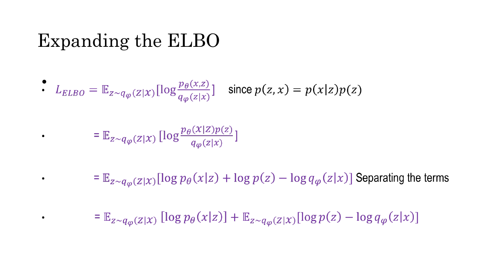
*Fig. — Three mechanical steps: factorise the joint, split the log, split the expectation. No new ideas, just algebra — but it is the algebra that turns one opaque expectation into an encoder term and a decoder term. Slide 11.*

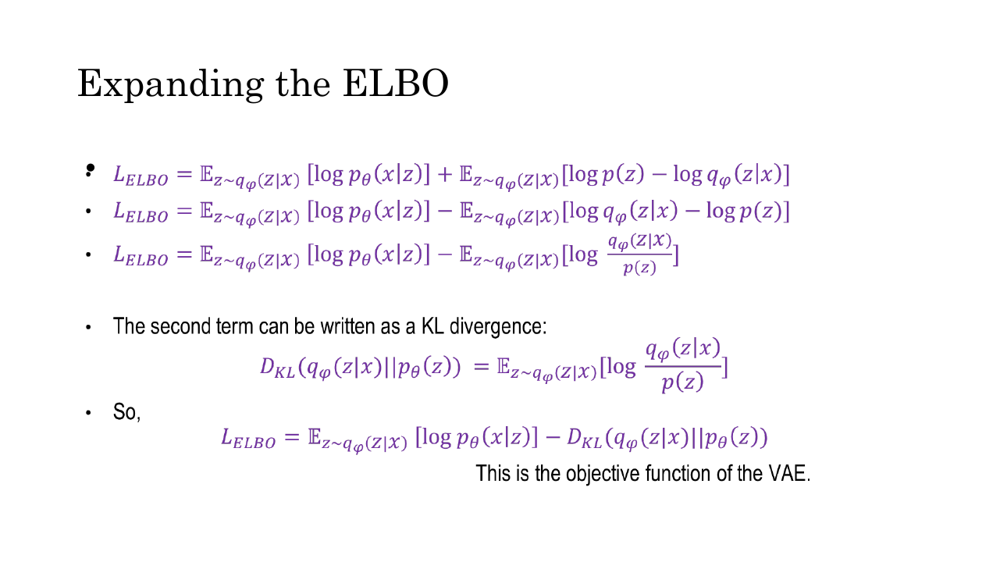
*Fig. — Watch the sign flip between the second and third lines: $\log p(\mathbf{z}) - \log q_\phi$ becomes $-(\log q_\phi - \log p(\mathbf{z}))$, which is why the KL enters with a minus. Getting this sign backwards is the most common derivation error. Slide 12.*

**Be careful which KL is which.** Two different KL divergences appear in this chapter and they are not
the same object:

| Appears in | Written | Computable? | Role |
|---|---|---|---|
| The tightness identity | $D_{\mathrm{KL}}(q_\phi(\mathbf{z}\mid\mathbf{x})\,\|\,p_\theta(\mathbf{z}\mid\mathbf{x}))$ | **No** — needs the intractable posterior | Explains the gap; never evaluated |
| The ELBO's second term | $D_{\mathrm{KL}}(q_\phi(\mathbf{z}\mid\mathbf{x})\,\|\,p(\mathbf{z}))$ | **Yes** — closed form, both Gaussian | Actually computed every training step |

The second argument is the **prior** in one and the **posterior** in the other. An MCQ will swap them.

### Term 1: the reconstruction term

$$\mathbb{E}_{q_\phi(\mathbf{z}\mid\mathbf{x})}\!\left[\log p_\theta(\mathbf{x}\mid\mathbf{z})\right]$$

In words: encode $\mathbf{x}$, draw a code $\mathbf{z}$ from the resulting distribution, and ask how
much probability the decoder assigns to the *original* $\mathbf{x}$ given that code. High means good
reconstruction — hence the name, and hence the alternative name "likelihood term". In practice you
estimate the expectation with a **single sample** per training example; mini-batch SGD already averages
over many examples, so one sample each gives an unbiased gradient at acceptable variance.

The loss you actually write depends entirely on which distribution you choose for
$p_\theta(\mathbf{x}\mid\mathbf{z})$ — and this is where MSE and binary cross-entropy come from. Neither
is an arbitrary choice; each **is** $-\log p_\theta(\mathbf{x}\mid\mathbf{z})$ for a particular decoder.

**Continuous data → Gaussian decoder → MSE.** Let the decoder emit a mean image
$\hat{\mathbf{x}} = f_\theta(\mathbf{z})$ and take $p_\theta(\mathbf{x}\mid\mathbf{z}) = \mathcal{N}(\mathbf{x};\hat{\mathbf{x}}, \sigma^2\mathbf{I})$
with $\sigma^2$ fixed. Then

$$\log p_\theta(\mathbf{x}\mid\mathbf{z}) = -\frac{1}{2\sigma^2}\sum_{i=1}^{D}(x_i - \hat{x}_i)^2 \;-\; \frac{D}{2}\log(2\pi\sigma^2)$$

The second term has no $\theta$ and no $\phi$, so it contributes nothing to any gradient. Drop it, and
maximising $\log p_\theta(\mathbf{x}\mid\mathbf{z})$ is **exactly** minimising $\sum_i (x_i-\hat{x}_i)^2$
— squared error. Fixing $\sigma^2 = \tfrac12$ makes the leading constant 1 and gives plain summed MSE.

**Binary or $[0,1]$-normalised data → Bernoulli decoder → BCE.** Let the decoder emit a per-pixel
probability $\hat{x}_i \in (0,1)$ through a sigmoid, each pixel an independent Bernoulli:

$$p_\theta(\mathbf{x}\mid\mathbf{z}) = \prod_{i=1}^{D} \hat{x}_i^{\,x_i}(1-\hat{x}_i)^{1-x_i} \quad\Longrightarrow\quad \log p_\theta(\mathbf{x}\mid\mathbf{z}) = \sum_{i=1}^{D}\Big[x_i\log\hat{x}_i + (1-x_i)\log(1-\hat{x}_i)\Big]$$

The negative of that is **binary cross-entropy**, which
[Lec 8](../week-02/08-mlp-and-activations.md) owns. BCE is not a heuristic for images — it is the exact
negative log-likelihood of a Bernoulli decoder. Use it when pixels are binary (or scaled to $[0,1]$ and
treated as Bernoulli means, as every MNIST VAE does); use MSE when the data is genuinely continuous.

### Term 2: the KL regulariser

$$D_{\mathrm{KL}}\big(q_\phi(\mathbf{z}\mid\mathbf{x})\,\|\,p(\mathbf{z})\big), \qquad p(\mathbf{z}) = \mathcal{N}(\mathbf{0},\mathbf{I})$$

This measures how far the encoder's output for this input has drifted from the standard normal prior.
It carries a minus sign in the ELBO, so maximising the ELBO means **minimising** it: the encoder is
pushed to keep every input's latent distribution close to $\mathcal{N}(\mathbf{0},\mathbf{I})$.

The prior choice is deliberate. At generation time you have no $\mathbf{x}$ to encode — you draw
$\mathbf{z} \sim p(\mathbf{z})$ and decode. That only produces sensible images if the region of latent
space the decoder was *trained* on is the region $p(\mathbf{z})$ puts mass on. The KL term is what
enforces that agreement.

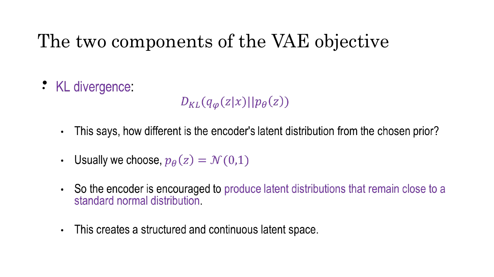
*Fig. — "Structured and continuous" is the payoff. Continuous means no holes: any $\mathbf{z}$ you draw lands somewhere the decoder understands. Slide 14.*

### The tension between the two terms

The two terms want opposite things, and understanding the tug-of-war is worth more than memorising
either formula.

**Pure reconstruction (KL weight → 0).** With nothing holding it back, the encoder shrinks every
$\sigma_j$ toward zero — so $\mathbf{z}$ becomes a deterministic function of $\mathbf{x}$ with no noise
to corrupt it — and spreads different inputs' means arbitrarily far apart, since well-separated codes
decode unambiguously. The result is a **plain autoencoder**: excellent reconstructions, and a latent
space of isolated spikes with vast empty regions between them. Sample
$\mathbf{z}\sim\mathcal{N}(\mathbf{0},\mathbf{I})$ and you land in a hole the decoder has never seen,
producing noise. This is exactly the failure [Lec 29](29-autoencoders-to-vae.md) diagnosed.

**Pure KL (reconstruction weight → 0).** The KL is minimised, at zero, when
$q_\phi(\mathbf{z}\mid\mathbf{x}) = \mathcal{N}(\mathbf{0},\mathbf{I})$ *for every input* — which the
encoder achieves by ignoring $\mathbf{x}$ entirely. The latent then carries zero information, and the
decoder emits the same blurry average image regardless. This degenerate state is **posterior
collapse**; in practice it arrives partially, individual latent dimensions switching off one at a time.

**The balance.** A well-trained VAE lands in between: each input gets a Gaussian blob of nonzero width,
and neighbouring blobs overlap slightly. That overlap is what makes the space *continuous* — walk from
one code to another and the decoded images morph smoothly, because every point on the path is inside
some training example's blob. The sampling noise does the work: because $\mathbf{z}$ jitters each pass,
the decoder must produce a sensible image for a *neighbourhood* around each code, not a single point.

### Why KL divergence is used in the VAE loss

Slide 21 devotes a whole slide to this, as four bullets. Each deserves a justification.

| The deck's bullet | Why it is true |
|---|---|
| **Regularises the latent space** | A penalty on how far $q_\phi$ may stray from a fixed reference — structurally the same idea as the weight penalties in [Lec 10](../week-02/10-overfitting-and-regularization.md), but constraining a *distribution* rather than a parameter vector. |
| **Prevents overfitting** | Without it the encoder can memorise, giving each training image its own isolated spike. The KL caps how much information $\mathbf{z}$ may carry about $\mathbf{x}$, so only reusable structure survives. |
| **Ensures smooth interpolation** | Driving all posteriors toward one shared prior makes their blobs overlap, so the straight line between two codes stays in populated territory the whole way. |
| **Makes sampling possible** | Generation draws $\mathbf{z}\sim\mathcal{N}(\mathbf{0},\mathbf{I})$ with no encoder involved, which only works if the aggregate of all encoder outputs resembles $\mathcal{N}(\mathbf{0},\mathbf{I})$. The bullet that matters most — it is the difference between a generative model and a compressor. |

Add one the deck omits: **KL is used because it is the term the derivation produces.** You do not
choose it — expanding the ELBO hands you $\mathbb{E}_q[\log q_\phi - \log p]$, which *is* a KL
divergence by definition. The four bullets are post-hoc explanations of why the thing the maths gave
you happens to be desirable.

Note the direction: it is the **reverse** KL, $D_{\mathrm{KL}}(q\,\|\,p)$, approximation first. KL is
asymmetric ([Lec 6](../week-01/06-probability-2.md)), and this direction is *mode-seeking* — it heavily
penalises $q$ putting mass where $p$ has none but tolerates $q$ missing parts of $p$. One reason VAE
samples come out blurry and conservative.

### The closed-form KL for a diagonal Gaussian against $\mathcal{N}(\mathbf{0},\mathbf{I})$

For the ELBO to be computable, the KL term needs a closed form. It has one — the main practical reason
for choosing Gaussians everywhere. **The deck never states this formula, but it is the one you will be
asked to compute.**

Derive it in one dimension first, with $q = \mathcal{N}(\mu,\sigma^2)$ and $p = \mathcal{N}(0,1)$:

$$\log q(z) = -\tfrac12\log(2\pi\sigma^2) - \frac{(z-\mu)^2}{2\sigma^2}, \qquad \log p(z) = -\tfrac12\log(2\pi) - \frac{z^2}{2}$$

Subtract; the $\log 2\pi$ terms cancel:

$$\log q(z) - \log p(z) = -\tfrac12\log\sigma^2 - \frac{(z-\mu)^2}{2\sigma^2} + \frac{z^2}{2}$$

Now take the expectation under $q$, using two facts about a $\mathcal{N}(\mu,\sigma^2)$ variable:
$\mathbb{E}_q[(z-\mu)^2] = \sigma^2$ (that is the definition of variance) and
$\mathbb{E}_q[z^2] = \sigma^2 + \mu^2$ (from $\mathrm{Var} = \mathbb{E}[z^2] - \mathbb{E}[z]^2$):

$$D_{\mathrm{KL}} = -\tfrac12\log\sigma^2 - \frac{\sigma^2}{2\sigma^2} + \frac{\sigma^2+\mu^2}{2} = -\tfrac12\log\sigma^2 - \tfrac12 + \tfrac12\sigma^2 + \tfrac12\mu^2$$

Factor out $-\tfrac12$:

$$D_{\mathrm{KL}}\big(\mathcal{N}(\mu,\sigma^2)\,\|\,\mathcal{N}(0,1)\big) = -\tfrac12\left(1 + \log\sigma^2 - \mu^2 - \sigma^2\right)$$

Because the covariance is diagonal, the $J$ latent dimensions are independent and KL is additive over
independent components, so you simply sum:

$$\boxed{\ D_{\mathrm{KL}}\big(q_\phi(\mathbf{z}\mid\mathbf{x})\,\|\,\mathcal{N}(\mathbf{0},\mathbf{I})\big) = -\frac{1}{2}\sum_{j=1}^{J}\left(1 + \log\sigma_j^2 - \mu_j^2 - \sigma_j^2\right)\ }$$

Read the four terms:

| Term | What it does |
|---|---|
| $-\mu_j^2$ | Penalises the mean drifting from 0. Grows quadratically — it is an $\ell_2$ pull toward the origin. |
| $-\sigma_j^2$ | Penalises variance *larger* than 1. Grows linearly. |
| $\log\sigma_j^2$ | Penalises variance *smaller* than 1 — as $\sigma_j \to 0$, $\log\sigma_j^2 \to -\infty$, so (after the $-\tfrac12$) the KL $\to +\infty$. This is the term that forbids the collapse-to-a-point cheat. |
| $1$ | The constant that makes the total exactly zero at $\mu_j=0,\sigma_j^2=1$. |

Check that claim: at $\mu_j = 0$ and $\sigma_j^2 = 1$, the bracket is $1 + \log 1 - 0 - 1 = 1 + 0 - 0 - 1 = 0$,
so the KL is zero. Correct — KL is zero exactly when the two distributions coincide, and here they do.
Worked out in full in **N1**.

**Note on $\sigma$ versus $\sigma^2$.** This formula is written in terms of the **variance**. Since
networks emit `logvar` $= \log\sigma^2$, the implementation is a direct transcription:
`-0.5 * sum(1 + logvar - mu.pow(2) - logvar.exp())`. If a question hands you $\sigma$ instead, square
it first. Substituting $\sigma$ where $\sigma^2$ belongs is the single most common arithmetic error on
this formula.

### The VAE loss

Optimisers minimise. The ELBO is something you want to maximise. So the **VAE loss** is just the
negative ELBO (slide 16):

$$\mathcal{L}_{\mathrm{VAE}}(\theta,\phi) = -\,\mathbb{E}_{q_\phi(\mathbf{z}\mid\mathbf{x})}\!\left[\log p_\theta(\mathbf{x}\mid\mathbf{z})\right] + D_{\mathrm{KL}}\big(q_\phi(\mathbf{z}\mid\mathbf{x})\,\|\,p(\mathbf{z})\big)$$

$$\theta^*,\phi^* = \arg\min_{\theta,\phi}\ \mathcal{L}_{\mathrm{VAE}}$$

This is the VAE's exact position in the taxonomy of
[Lec 22](../week-06/22-generative-taxonomy-and-mle.md): an **explicit, approximate-density** model —
explicit because it writes down $p_\theta(\mathbf{x})$, approximate because it optimises a bound on it
rather than the thing itself.

Both signs flip. The reconstruction term, previously maximised, becomes a positive error (MSE or BCE)
to be minimised; the KL, previously subtracted, becomes a positive penalty to be minimised. Both are
now non-negative quantities you drive down — which is why the loss in code is always
`recon_loss + kl_loss`. As the deck puts it: minimising the loss maximises the lower bound on the
probability of generating real data samples.

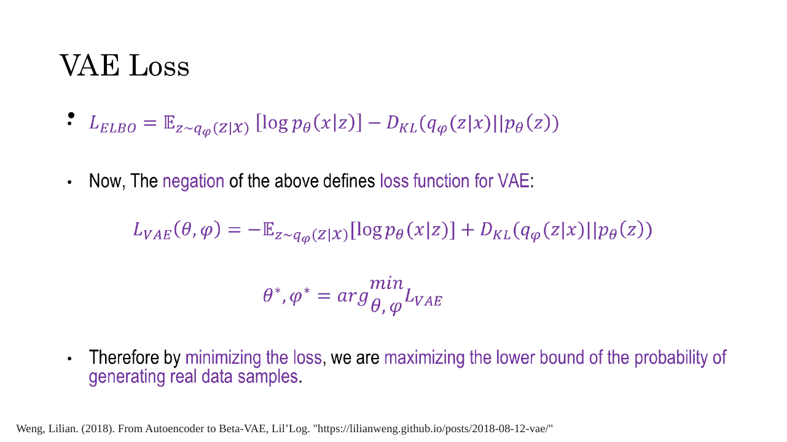
*Fig. — Note that a single loss trains both networks at once: $\theta$ (decoder) and $\phi$ (encoder) are optimised jointly by the same gradient step. Slide 16.*

### The reparameterization trick

One obstacle remains, and without fixing it none of the above can actually be trained.

**The problem.** The forward pass encodes $\mathbf{x}$ to $(\boldsymbol{\mu},\boldsymbol{\sigma})$,
**samples** $\mathbf{z}\sim\mathcal{N}(\boldsymbol{\mu},\mathrm{diag}(\boldsymbol{\sigma}^2))$, then
decodes. Backpropagation ([Lec 9](../week-02/09-backpropagation.md)) applies the chain rule backwards
through a graph of differentiable operations — and "draw a random number" is not one. It is not even a
function: call it twice with the same inputs and you get different outputs. There is no
$\partial\mathbf{z}/\partial\boldsymbol{\mu}$ to compute, because $\mathbf{z}$ is not a function of
$\boldsymbol{\mu}$ in any calculus sense.

The consequence is severe. Gradient from the reconstruction loss travels back through the decoder to
$\mathbf{z}$, hits the sampling node, and **stops**. The encoder parameters $\phi$ sit upstream of that
node and receive nothing. The encoder never learns.

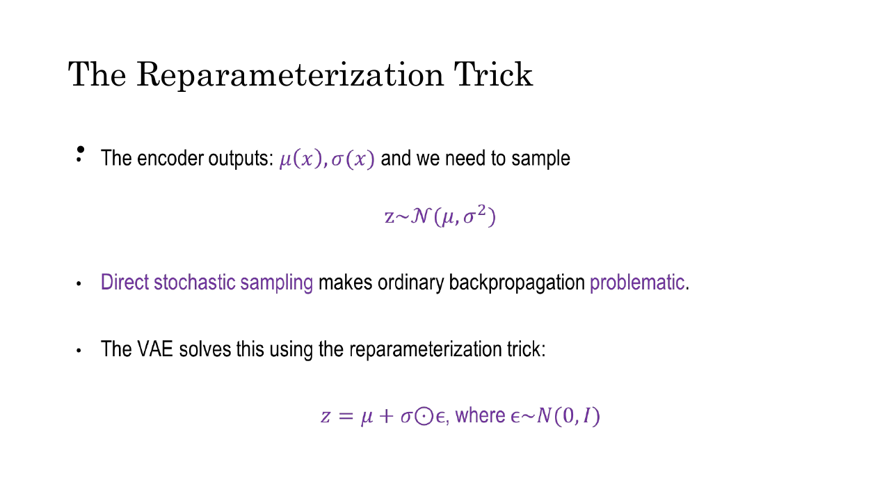
*Fig. — Note that this slide writes $\mathcal{N}(\mu,\sigma^2)$ with the variance, unlike slide 5. The $\odot$ is element-wise (Hadamard) multiplication, which is what you need because the covariance is diagonal. Slide 19.*

**The fix.** Instead of sampling $\mathbf{z}$ directly, sample an auxiliary variable from a *fixed*
distribution and transform it:

$$\boldsymbol{\epsilon} \sim \mathcal{N}(\mathbf{0},\mathbf{I}), \qquad \mathbf{z} = \boldsymbol{\mu} + \boldsymbol{\sigma} \odot \boldsymbol{\epsilon}$$

where $\odot$ is element-wise multiplication.

**Why the distribution is unchanged.** Fix one dimension; $\epsilon_j$ has mean 0 and variance 1, and
$z_j = \mu_j + \sigma_j\epsilon_j$ is an affine function of a Gaussian, hence Gaussian, with

$$\mathbb{E}[z_j] = \mu_j + \sigma_j\cdot 0 = \mu_j, \qquad \mathrm{Var}(z_j) = \sigma_j^2 \cdot \mathrm{Var}(\epsilon_j) = \sigma_j^2$$

(using $\mathrm{Var}(a + bX) = b^2\mathrm{Var}(X)$). So $z_j \sim \mathcal{N}(\mu_j,\sigma_j^2)$,
exactly what you wanted. **Nothing is lost statistically** — this is the same random variable,
generated differently, and it is how `np.random.normal(mu, sigma)` works internally anyway.

**Why gradients now flow.** The randomness has been moved out of the parameterised path. Compare:

```
BEFORE  (sampling node blocks the gradient)

    x ──► [encoder φ] ──► μ, σ ──╳──► z ──► [decoder θ] ──► x̂ ──► loss
                                  ▲
                          z ~ N(μ, σ²)
                      stochastic node: no derivative exists
                      ∂z/∂μ undefined — gradient dies here
                      φ receives NOTHING


AFTER   (reparameterized: the random draw is an input, not an operation)

    ε ~ N(0, I)  ──────────────┐   (an input; no parameters; constant w.r.t. φ)
                               ▼
    x ──► [encoder φ] ──► μ, σ ──► z = μ + σ⊙ε ──► [decoder θ] ──► x̂ ──► loss
          ◄──────────────────────────────────────────────────────────────┘
                        gradient flows all the way back:
                        ∂z/∂μ = 1        ∂z/∂σ = ε
```

With $\boldsymbol{\epsilon}$ fixed for this forward pass, $\mathbf{z}$ is a plain deterministic,
differentiable function of $\boldsymbol{\mu}$ and $\boldsymbol{\sigma}$. Per dimension:

$$\frac{\partial z_j}{\partial \mu_j} = 1, \qquad \frac{\partial z_j}{\partial \sigma_j} = \epsilon_j$$

Ordinary derivatives, which autodiff handles without special cases. The chain rule now reaches $\phi$:

$$\frac{\partial \mathcal{L}}{\partial \phi} = \frac{\partial \mathcal{L}}{\partial \mathbf{z}}\cdot\frac{\partial \mathbf{z}}{\partial(\boldsymbol{\mu},\boldsymbol{\sigma})}\cdot\frac{\partial(\boldsymbol{\mu},\boldsymbol{\sigma})}{\partial \phi}$$

The deck summarises this as the graph $x \to (\mu,\sigma) \to z \to \hat{x}$ with
$z = \mu + \sigma\epsilon$. The randomness still exists — you get a different $\mathbf{z}$ every
forward pass — but it now enters as a *leaf of the graph*, like a data input, rather than as a node on
the path from $\phi$ to the loss. Worked numerically in **N3**.

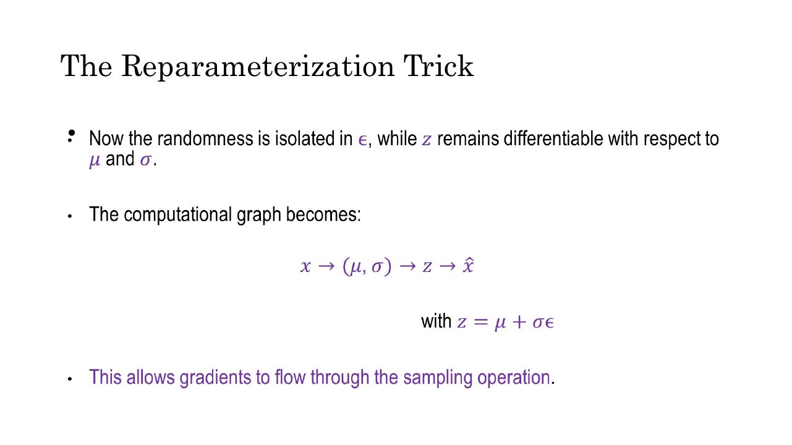
*Fig. — "The randomness is isolated in $\epsilon$" is the sentence to remember. $\epsilon$ has no parameters, so nothing needs to differentiate through it. Slide 20.*

In code you get $\boldsymbol{\sigma}$ from the network's `logvar` output as
$\boldsymbol{\sigma} = \exp(\tfrac12\log\boldsymbol{\sigma}^2)$ — the half because
$\sqrt{\sigma^2} = \exp(\tfrac12\log\sigma^2)$. Forget it and you put $\sigma^2$ where $\sigma$
belongs: a silent bug that still trains, just badly.

### Applications

Slide 22 lists five:

| Application | Why the VAE suits it |
|---|---|
| **Image generation** | The point of the construction — draw $\mathbf{z}\sim\mathcal{N}(\mathbf{0},\mathbf{I})$, decode, get a novel image. |
| **Anomaly detection** | Train only on normal data; an anomalous input reconstructs badly, so the loss value itself is the anomaly score. |
| **Drug discovery** | Molecules encode into a continuous space, so you can optimise a property by gradient ascent *in latent space* and decode — impossible over discrete molecular graphs. |
| **Representation learning** | $\boldsymbol{\mu}_\phi(\mathbf{x})$ is a compact, smooth, denoised feature vector for a downstream classifier. |
| **Semi-supervised learning** | The ELBO needs no labels, so the encoder trains on unlabelled data; a small labelled set then suffices for a classifier on top. |

## Worked numericals

### N1. The closed-form KL term for a 3-dimensional latent
**Given:** an encoder emits $\boldsymbol{\mu} = [0.5,\ -1.0,\ 0.0]$ and
$\boldsymbol{\sigma}^2 = [0.25,\ 1.0,\ 4.0]$ (so $\boldsymbol{\sigma} = [0.5,\ 1.0,\ 2.0]$).
**Find:** $D_{\mathrm{KL}}(q_\phi(\mathbf{z}\mid\mathbf{x})\,\|\,\mathcal{N}(\mathbf{0},\mathbf{I}))$.

Use $D_{\mathrm{KL}} = -\tfrac12\sum_{j}(1 + \log\sigma_j^2 - \mu_j^2 - \sigma_j^2)$. Compute the
bracket for each dimension separately.

1. **$j=1$:** $\mu_1^2 = 0.5^2 = 0.25$; $\log\sigma_1^2 = \log 0.25 = -1.386294$.
   Bracket $= 1 + (-1.386294) - 0.25 - 0.25 = -0.886294$.
2. **$j=2$:** $\mu_2^2 = (-1.0)^2 = 1.0$; $\log\sigma_2^2 = \log 1 = 0$.
   Bracket $= 1 + 0 - 1.0 - 1.0 = -1.000000$.
3. **$j=3$:** $\mu_3^2 = 0$; $\log\sigma_3^2 = \log 4 = +1.386294$.
   Bracket $= 1 + 1.386294 - 0 - 4.0 = -1.613706$.
4. Sum the brackets: $-0.886294 - 1.000000 - 1.613706 = -3.500000$.
   (The two $\log$ terms cancel exactly, since $\log 0.25 = -\log 4$.)
5. Multiply by $-\tfrac12$: $D_{\mathrm{KL}} = -0.5 \times (-3.5) = 1.75$.

**Answer:** $D_{\mathrm{KL}} = 1.75$ nats.

Sanity reading: dimension 2 ($\mu=-1$, $\sigma^2=1$) contributes $0.5$ purely from the shifted mean;
dimension 3 ($\sigma^2=4$) contributes $0.807$ for being four times too wide; dimension 1 contributes
$0.443$ for being too narrow *and* slightly off-centre. Every dimension is penalised, none is free.

**Now the zero case.** Set $\boldsymbol{\mu} = [0,0,0]$, $\boldsymbol{\sigma}^2 = [1,1,1]$:

6. Each bracket: $1 + \log 1 - 0^2 - 1 = 1 + 0 - 0 - 1 = 0$.
7. Sum $= 0 + 0 + 0 = 0$; $D_{\mathrm{KL}} = -0.5 \times 0 = 0$.

**Answer:** $D_{\mathrm{KL}} = 0$ **exactly**, as it must be — $q$ *is* the prior, and KL is zero if
and only if the two distributions are identical. This is the quickest check that you have written the
formula down correctly.

### N2. The full VAE loss for one example
**Given:** a 5-pixel binary image $\mathbf{x} = [1, 0, 1, 1, 0]$; the decoder outputs probabilities
$\hat{\mathbf{x}} = [0.9,\ 0.2,\ 0.8,\ 0.6,\ 0.1]$; the encoder outputs a 2-dimensional
$\boldsymbol{\mu} = [0.2,\ -0.5]$, $\boldsymbol{\sigma}^2 = [0.9,\ 1.5]$.
**Find:** $\mathcal{L}_{\mathrm{VAE}} = \text{BCE} + D_{\mathrm{KL}}$.

**Part A — the reconstruction term (binary cross-entropy).**
$\text{BCE} = -\sum_i [x_i\log\hat{x}_i + (1-x_i)\log(1-\hat{x}_i)]$. For $x_i=1$ the term is
$-\log\hat{x}_i$; for $x_i=0$ it is $-\log(1-\hat{x}_i)$.

1. $i=1$: $x=1$, $\hat{x}=0.9$ → $-\log 0.9 = 0.105361$.
2. $i=2$: $x=0$, $\hat{x}=0.2$ → $-\log(1-0.2) = -\log 0.8 = 0.223144$.
3. $i=3$: $x=1$, $\hat{x}=0.8$ → $-\log 0.8 = 0.223144$.
4. $i=4$: $x=1$, $\hat{x}=0.6$ → $-\log 0.6 = 0.510826$.
5. $i=5$: $x=0$, $\hat{x}=0.1$ → $-\log 0.9 = 0.105361$.
6. $\text{BCE} = 0.105361 + 0.223144 + 0.223144 + 0.510826 + 0.105361 = 1.167834$.

Notice pixel 4 contributes nearly half the total: it should be 1 and the decoder only committed 0.6.
Cross-entropy punishes confident-and-wrong far harder than mildly-uncertain.

**Part B — the KL term.**

7. $j=1$: $1 + \log 0.9 - 0.2^2 - 0.9 = 1 - 0.105361 - 0.04 - 0.9 = -0.045361$.
8. $j=2$: $1 + \log 1.5 - (-0.5)^2 - 1.5 = 1 + 0.405465 - 0.25 - 1.5 = -0.344535$.
9. Sum $= -0.389896$; $D_{\mathrm{KL}} = -0.5 \times (-0.389896) = 0.194948$.

**Part C — total.**

10. $\mathcal{L}_{\mathrm{VAE}} = 1.167834 + 0.194948 = 1.362782$ (unrounded: $1.362781$).

**Answer:** $\mathcal{L}_{\mathrm{VAE}} \approx 1.3628$ nats, of which $1.1678$ (86%) is reconstruction
and $0.1949$ (14%) is the KL penalty. The corresponding ELBO is $-1.3628$ — negative, as log-densities
of discrete data usually are.

### N3. The reparameterization trick, and the gradients it unlocks
**Given:** an encoder emits $\boldsymbol{\mu} = [2.0,\ -1.0]$ and
$\log\boldsymbol{\sigma}^2 = [-1.2,\ 0.4]$. The drawn noise is
$\boldsymbol{\epsilon} = [0.7,\ -1.5]$.
**Find:** $\mathbf{z}$, then $\partial z_j/\partial\mu_j$, $\partial z_j/\partial\sigma_j$ and
$\partial z_j/\partial(\log\sigma_j^2)$.

1. Convert log-variance to standard deviation: $\sigma_j = \exp(\tfrac12\log\sigma_j^2)$.
   $\sigma_1 = e^{-0.6} = 0.548812$, $\sigma_2 = e^{0.2} = 1.221403$.
2. Apply $z_j = \mu_j + \sigma_j\epsilon_j$:
   $z_1 = 2.0 + 0.548812\times 0.7 = 2.0 + 0.384168 = 2.384168$.
3. $z_2 = -1.0 + 1.221403\times(-1.5) = -1.0 - 1.832104 = -2.832104$.
4. **Gradient w.r.t. the mean:** $z_j = \mu_j + (\text{term with no }\mu_j)$, so
   $\partial z_j/\partial\mu_j = 1$ — for both dimensions, always, regardless of the noise drawn.
5. **Gradient w.r.t. the standard deviation:** $\partial z_j/\partial\sigma_j = \epsilon_j$, so
   $\partial z_1/\partial\sigma_1 = 0.7$ and $\partial z_2/\partial\sigma_2 = -1.5$.
6. **Gradient w.r.t. what the network actually emits.** By the chain rule, with
   $\sigma_j = \exp(\tfrac12 \log\sigma_j^2)$ we get $\partial\sigma_j/\partial(\log\sigma_j^2) = \tfrac12\sigma_j$, so
   $$\frac{\partial z_j}{\partial(\log\sigma_j^2)} = \epsilon_j\cdot\tfrac12\sigma_j$$
   $j=1$: $0.7\times 0.5\times 0.548812 = 0.192084$. $j=2$: $-1.5\times 0.5\times 1.221403 = -0.916052$.

**Answer:** $\mathbf{z} = [2.384168,\ -2.832104]$, with
$\partial\mathbf{z}/\partial\boldsymbol{\mu} = [1,\ 1]$ and
$\partial\mathbf{z}/\partial\boldsymbol{\sigma} = [0.7,\ -1.5]$.

Every one of those derivatives is a finite, computable number. Before reparameterization not one of
them existed, so $\partial\mathcal{L}/\partial\phi$ was undefined and the encoder could not be trained.
That is the entire content of the trick.

### N4. Verifying the ELBO is a lower bound, and that the gap is the posterior KL
**Given:** a toy model with a **discrete** latent $z \in \{1,2\}$, so everything is computable exactly.
Prior $p(z{=}1)=p(z{=}2)=0.5$; likelihoods $p(x\mid z{=}1)=0.8$, $p(x\mid z{=}2)=0.2$ for the one
observed $x$. The variational approximation is $q(z{=}1)=0.6,\ q(z{=}2)=0.4$.
**Find:** $\log p(x)$, the ELBO, and $D_{\mathrm{KL}}(q\,\|\,p(z\mid x))$; confirm the identity.

1. **Exact evidence** by marginalising: $p(x) = 0.5(0.8) + 0.5(0.2) = 0.4 + 0.1 = 0.5$.
   So $\log p(x) = \log 0.5 = -0.693147$.
2. **True posterior** by Bayes: $p(z{=}1\mid x) = 0.4/0.5 = 0.8$, $p(z{=}2\mid x) = 0.1/0.5 = 0.2$.
3. **ELBO** $= \sum_z q(z)\log\dfrac{p(x\mid z)p(z)}{q(z)}$:
   - $z=1$: $0.6\log\dfrac{0.8\times0.5}{0.6} = 0.6\log\dfrac{0.4}{0.6} = 0.6\log 0.666667 = 0.6(-0.405465) = -0.243279$
   - $z=2$: $0.4\log\dfrac{0.2\times0.5}{0.4} = 0.4\log 0.25 = 0.4(-1.386294) = -0.554518$
   - Total: $\mathcal{L}_{\mathrm{ELBO}} = -0.797797$.
4. **Check the bound:** $-0.797797 \le -0.693147$. ✓ The ELBO sits below the log-evidence.
5. **The posterior KL:** $D_{\mathrm{KL}}(q\,\|\,p(z\mid x)) = 0.6\log\dfrac{0.6}{0.8} + 0.4\log\dfrac{0.4}{0.2}$
   $= 0.6(-0.287682) + 0.4(0.693147) = -0.172609 + 0.277259 = 0.104650$.
6. **Check the identity:** $\mathcal{L}_{\mathrm{ELBO}} + D_{\mathrm{KL}} = -0.797797 + 0.104650 = -0.693147 = \log p(x)$. ✓
7. **Tightness.** Now set $q$ equal to the true posterior, $q = (0.8, 0.2)$:
   $0.8\log\dfrac{0.4}{0.8} + 0.2\log\dfrac{0.1}{0.2} = 0.8(-0.693147) + 0.2(-0.693147) = -0.693147$.

**Answer:** $\log p(x) = -0.693147$, $\mathcal{L}_{\mathrm{ELBO}} = -0.797797$, gap $= 0.104650$ —
and the gap equals $D_{\mathrm{KL}}(q\,\|\,p(z\mid x))$ to every decimal place. At $q = p(z\mid x)$ the
gap is 0 and the ELBO equals the log-evidence exactly. Both claims of the identity, verified.

### N5. What the KL term does as $\sigma \to 0$ and as the latent grows
**Given:** a single latent dimension with $\mu = 0$, so the KL reduces to
$D_{\mathrm{KL}} = -\tfrac12(1 + \log\sigma^2 - \sigma^2) = \tfrac12(\sigma^2 - 1 - \log\sigma^2)$.
**Find:** the value at a range of $\sigma$, and the behaviour at the two extremes.

| $\sigma$ | $\sigma^2$ | $\log\sigma^2$ | $D_{\mathrm{KL}} = \tfrac12(\sigma^2 - 1 - \log\sigma^2)$ |
|---|---|---|---|
| $1$ | $1$ | $0$ | $\tfrac12(1-1-0) = 0$ |
| $0.5$ | $0.25$ | $-1.386294$ | $\tfrac12(0.25-1+1.386294) = 0.318147$ |
| $0.1$ | $0.01$ | $-4.605170$ | $\tfrac12(0.01-1+4.605170) = 1.807585$ |
| $0.01$ | $0.0001$ | $-9.210340$ | $\tfrac12(0.0001-1+9.210340) = 4.105220$ |
| $0.001$ | $10^{-6}$ | $-13.815511$ | $\tfrac12(10^{-6}-1+13.815511) = 6.407756$ |
| $10$ | $100$ | $4.605170$ | $\tfrac12(100-1-4.605170) = 47.197415$ |

1. **As $\sigma\to 0$** (the encoder trying to collapse to a point, i.e. become a plain autoencoder),
   the $-\log\sigma^2 = -2\log\sigma$ term dominates and $D_{\mathrm{KL}} \to +\infty$. The penalty
   diverges, so a deterministic encoder is infinitely expensive. The divergence is only *logarithmic*,
   though — ten times narrower costs about $\log 100 / 2 \approx 2.3$ extra nats, not a catastrophe —
   which is why real VAEs do shrink $\sigma$ noticeably when reconstruction is hard.
2. **As $\sigma\to\infty$**, the $\tfrac12\sigma^2$ term dominates and the penalty grows *linearly in
   the variance* — far more aggressively. Over-wide posteriors are punished much harder than over-narrow
   ones.
3. **The minimum** is at $\sigma = 1$ exactly: $\frac{d}{d\sigma^2}\left[\tfrac12(\sigma^2 - 1 - \log\sigma^2)\right] = \tfrac12(1 - 1/\sigma^2) = 0 \Rightarrow \sigma^2 = 1$.
4. **Growing the latent dimension.** The KL is a sum over independent dimensions. If every dimension
   sits at $\sigma_j = 0.1, \mu_j = 0$, the total is $J \times 1.807585$:
   $J=1 \to 1.81$; $J=10 \to 18.08$; $J=100 \to 180.76$. It scales **linearly in $J$**.

**Answer:** $D_{\mathrm{KL}} \to +\infty$ as $\sigma\to 0$ (logarithmically) and as $\sigma\to\infty$
(linearly in $\sigma^2$), with a unique minimum of exactly 0 at $\sigma=1$; the total scales linearly
with the latent dimension $J$.

The practical consequence of point 4: as $J$ grows the KL term grows with it while the reconstruction
term does not, so the balance tips toward the regulariser. The model responds by shutting unneeded
dimensions off — driving them to $\mu_j=0,\sigma_j=1$, where they cost nothing and carry nothing. That
is **posterior collapse**, dimension by dimension, and it is why a VAE with a 512-dimensional latent
often uses only a few dozen of them.

## Code

```python
import numpy as np

# ---------------------------------------------------------------------
# 1. Closed-form KL(N(mu, sigma^2) || N(0, I)) for a diagonal Gaussian
#    D_KL = -0.5 * sum_j (1 + log(sigma_j^2) - mu_j^2 - sigma_j^2)
# ---------------------------------------------------------------------
def kl_diag_gaussian(mu, logvar):
    """mu, logvar: arrays of shape (J,). Returns a scalar in nats."""
    return -0.5 * np.sum(1.0 + logvar - mu**2 - np.exp(logvar))

# --- reproduces worked numerical N1 ---
mu  = np.array([0.5, -1.0, 0.0])
var = np.array([0.25, 1.0, 4.0])
logvar = np.log(var)

per_dim = 1.0 + logvar - mu**2 - var          # the bracket, dimension by dimension
print("brackets:", np.round(per_dim, 6))      # brackets: [-0.886294 -1.       -1.613706]
print("sum     :", per_dim.sum())             # sum     : -3.5
print("KL      :", kl_diag_gaussian(mu, logvar))   # KL      : 1.75

# --- the zero case: q IS the prior ---
print("KL at mu=0, var=1:", kl_diag_gaussian(np.zeros(3), np.zeros(3)))
# KL at mu=0, var=1: -0.0       <- exactly zero (NumPy prints the signed zero)

# ---------------------------------------------------------------------
# 2. The reparameterization sampler (reproduces N3)
# ---------------------------------------------------------------------
def reparameterize(mu, logvar, eps):
    """z = mu + sigma * eps, with sigma = exp(0.5 * logvar). eps is an INPUT."""
    sigma = np.exp(0.5 * logvar)
    return mu + sigma * eps, sigma

mu3, logvar3 = np.array([2.0, -1.0]), np.array([-1.2, 0.4])
eps3 = np.array([0.7, -1.5])                  # the drawn noise, held fixed
z, sigma = reparameterize(mu3, logvar3, eps3)
print("sigma:", np.round(sigma, 6))           # sigma: [0.548812 1.221403]
print("z    :", np.round(z, 6))               # z    : [ 2.384168 -2.832104]

# the gradients that the trick makes available
print("dz/dmu   :", np.ones_like(mu3))        # dz/dmu   : [1. 1.]
print("dz/dsigma:", eps3)                     # dz/dsigma: [ 0.7 -1.5]
print("dz/dlogvar:", np.round(0.5 * sigma * eps3, 6))  # dz/dlogvar: [ 0.192084 -0.916052]

# sanity: the trick really does give the right distribution
rng = np.random.default_rng(0)
samples = mu3 + np.exp(0.5*logvar3) * rng.standard_normal((200000, 2))
print("empirical mean:", np.round(samples.mean(0), 3))   # empirical mean: [ 2.001 -1.001]
print("empirical var :", np.round(samples.var(0), 3))    # empirical var : [0.302 1.495]
print("target var    :", np.round(np.exp(logvar3), 3))   # target var    : [0.301 1.492]

# ---------------------------------------------------------------------
# 3. Full single-sample VAE loss (reproduces N2)
# ---------------------------------------------------------------------
def vae_loss(x, x_hat, mu, logvar):
    bce = -np.sum(x*np.log(x_hat) + (1-x)*np.log(1-x_hat))   # reconstruction
    kl  = kl_diag_gaussian(mu, logvar)                       # regulariser
    return bce + kl, bce, kl

x     = np.array([1., 0., 1., 1., 0.])
x_hat = np.array([0.9, 0.2, 0.8, 0.6, 0.1])
total, bce, kl = vae_loss(x, x_hat, np.array([0.2, -0.5]), np.log([0.9, 1.5]))
print(f"BCE = {bce:.6f}  KL = {kl:.6f}  loss = {total:.6f}")
# BCE = 1.167834  KL = 0.194948  loss = 1.362781
print(f"ELBO = {-total:.6f}")        # ELBO = -1.362781
```

```python
# ---------------------------------------------------------------------
# 4. Verifying the ELBO identity on a discrete toy model (reproduces N4)
# ---------------------------------------------------------------------
import numpy as np

p_z   = np.array([0.5, 0.5])     # prior over z in {1,2}
p_x_z = np.array([0.8, 0.2])     # likelihood p(x|z) for the observed x
q     = np.array([0.6, 0.4])     # our (deliberately wrong) approximation

p_x       = (p_z * p_x_z).sum()                 # exact evidence by marginalising
posterior = p_z * p_x_z / p_x                   # exact posterior by Bayes
elbo      = (q * np.log(p_x_z * p_z / q)).sum()
kl_post   = (q * np.log(q / posterior)).sum()

print(f"log p(x) = {np.log(p_x):.6f}")          # log p(x) = -0.693147
print(f"ELBO     = {elbo:.6f}")                 # ELBO     = -0.797797
print(f"KL gap   = {kl_post:.6f}")              # KL gap   = 0.104650
print(f"ELBO+KL  = {elbo + kl_post:.6f}")       # ELBO+KL  = -0.693147   <- equals log p(x)
print("bound holds:", elbo <= np.log(p_x))      # bound holds: True

# tight exactly when q == the true posterior
tight = (posterior * np.log(p_x_z * p_z / posterior)).sum()
print(f"ELBO at q = posterior: {tight:.6f}")    # ELBO at q = posterior: -0.693147
```

How this is written in practice. PyTorch, and the only line that matters is the one marked:

```python
import torch
import torch.nn.functional as F

def vae_loss_torch(x, x_hat, mu, logvar):
    """x, x_hat: (B, D) in [0,1].  mu, logvar: (B, J).  Returns a per-batch-mean scalar."""
    # reconstruction: Bernoulli decoder -> binary cross-entropy, summed over pixels
    recon = F.binary_cross_entropy(x_hat, x, reduction='none').sum(dim=1)

    # >>> THE KL LINE <<<  -0.5 * sum(1 + logvar - mu^2 - exp(logvar))
    kl = -0.5 * torch.sum(1 + logvar - mu.pow(2) - logvar.exp(), dim=1)

    return (recon + kl).mean()          # loss = -ELBO, averaged over the batch

def reparameterize_torch(mu, logvar):
    std = torch.exp(0.5 * logvar)       # sigma = exp(logvar / 2)
    eps = torch.randn_like(std)         # epsilon ~ N(0, I) -- a leaf, carries no grad
    return mu + std * eps               # differentiable in mu and std

# --- check it against the NumPy numbers from N2 ---
x      = torch.tensor([[1., 0., 1., 1., 0.]])
x_hat  = torch.tensor([[0.9, 0.2, 0.8, 0.6, 0.1]])
mu     = torch.tensor([[0.2, -0.5]], requires_grad=True)
logvar = torch.tensor([[0.9, 1.5]]).log().requires_grad_(True)

loss = vae_loss_torch(x, x_hat, mu, logvar)
print(f"loss = {loss.item():.6f}")      # loss = 1.362781   <- matches N2
loss.backward()
print("grad wrt mu:", mu.grad)          # grad wrt mu: tensor([[ 0.2000, -0.5000]])

# gradients really do reach mu through the sampler
mu2  = torch.tensor([[2.0, -1.0]], requires_grad=True)
lv2  = torch.tensor([[-1.2, 0.4]], requires_grad=True)
z    = reparameterize_torch(mu2, lv2)
z.sum().backward()
print("dz/dmu:", mu2.grad)              # dz/dmu: tensor([[1., 1.]])   <- exactly N3's result
```

The `kl` line is the formula from this chapter transcribed symbol for symbol:
`1 + logvar - mu.pow(2) - logvar.exp()` is $1 + \log\sigma_j^2 - \mu_j^2 - \sigma_j^2$, summed over the
latent dimension and multiplied by $-\tfrac12$. And `dz/dmu` coming back as exactly $[1, 1]$ is the
reparameterization trick working: without it, `mu2.grad` would be `None`.

## Exam pack

### Must-memorise

| Item | Exactly this |
|---|---|
| The evidence | $\log p_\theta(\mathbf{x}) = \log\int p_\theta(\mathbf{x}\mid\mathbf{z})p(\mathbf{z})\,d\mathbf{z}$ — intractable |
| Jensen's inequality (concave) | $\log\mathbb{E}[Y] \ge \mathbb{E}[\log Y]$ |
| ELBO (compact form) | $\mathcal{L}_{\mathrm{ELBO}} = \mathbb{E}_{q_\phi(\mathbf{z}\mid\mathbf{x})}\!\left[\log\frac{p_\theta(\mathbf{x},\mathbf{z})}{q_\phi(\mathbf{z}\mid\mathbf{x})}\right]$ |
| **The key identity** | $\log p_\theta(\mathbf{x}) = \mathcal{L}_{\mathrm{ELBO}} + D_{\mathrm{KL}}(q_\phi(\mathbf{z}\mid\mathbf{x})\,\|\,p_\theta(\mathbf{z}\mid\mathbf{x}))$ |
| Consequence | $D_{\mathrm{KL}}\ge 0 \Rightarrow \mathcal{L}_{\mathrm{ELBO}} \le \log p_\theta(\mathbf{x})$; tight iff $q_\phi = p_\theta(\mathbf{z}\mid\mathbf{x})$ |
| ELBO (two-term form) | $\mathcal{L}_{\mathrm{ELBO}} = \mathbb{E}_{q_\phi}[\log p_\theta(\mathbf{x}\mid\mathbf{z})] - D_{\mathrm{KL}}(q_\phi(\mathbf{z}\mid\mathbf{x})\,\|\,p(\mathbf{z}))$ |
| VAE loss | $\mathcal{L}_{\mathrm{VAE}} = -\mathbb{E}_{q_\phi}[\log p_\theta(\mathbf{x}\mid\mathbf{z})] + D_{\mathrm{KL}}(q_\phi\,\|\,p(\mathbf{z}))$ — minimise |
| **Closed-form KL** | $D_{\mathrm{KL}} = -\dfrac{1}{2}\sum_{j=1}^{J}\left(1 + \log\sigma_j^2 - \mu_j^2 - \sigma_j^2\right)$ |
| Prior | $p(\mathbf{z}) = \mathcal{N}(\mathbf{0},\mathbf{I})$ |
| Encoder | $q_\phi(\mathbf{z}\mid\mathbf{x}) = \mathcal{N}(\boldsymbol{\mu}_\phi(\mathbf{x}), \mathrm{diag}(\boldsymbol{\sigma}^2_\phi(\mathbf{x})))$ |
| **Reparameterization** | $\mathbf{z} = \boldsymbol{\mu} + \boldsymbol{\sigma}\odot\boldsymbol{\epsilon}$, $\boldsymbol{\epsilon}\sim\mathcal{N}(\mathbf{0},\mathbf{I})$ |
| Its gradients | $\partial z_j/\partial\mu_j = 1$, $\partial z_j/\partial\sigma_j = \epsilon_j$ |
| sigma from logvar | $\sigma = \exp(\tfrac12\log\sigma^2)$ |
| Recon term, Gaussian decoder | $-\log p_\theta(\mathbf{x}\mid\mathbf{z}) \propto \sum_i(x_i-\hat{x}_i)^2$ → MSE |
| Recon term, Bernoulli decoder | $-\log p_\theta(\mathbf{x}\mid\mathbf{z}) = -\sum_i[x_i\log\hat{x}_i + (1-x_i)\log(1-\hat{x}_i)]$ → BCE |

### Numbers worth knowing

| Quantity | Value |
|---|---|
| KL for $\boldsymbol{\mu}=[0.5,-1,0]$, $\boldsymbol{\sigma}^2=[0.25,1,4]$ | $1.75$ nats (N1) |
| KL when $\boldsymbol{\mu}=\mathbf{0}$, $\boldsymbol{\sigma}^2=\mathbf{1}$ | exactly $0$ |
| KL at $\mu=0$, $\sigma=0.1$ (one dim) | $1.8076$ |
| KL at $\mu=0$, $\sigma=10$ (one dim) | $47.197$ |
| $\sigma$ minimising the KL term | $\sigma = 1$ (minimum value 0) |
| Parameters the encoder emits per latent dim | $2$ — one mean, one log-variance |
| Free parameters: diagonal vs full covariance, $J$ dims | $J$ vs $J(J+1)/2$ |
| Monte Carlo samples per example in practice | $1$ |
| Deck's listed VAE applications | 5: image generation, anomaly detection, drug discovery, representation learning, semi-supervised learning |
| Deck's listed reasons for the KL term | 4: regularises latent space, prevents overfitting, smooth interpolation, makes sampling possible |
| $\mathbb{E}[z^2]$ for $z\sim\mathcal{N}(\mu,\sigma^2)$ | $\sigma^2 + \mu^2$ |

### Likely MCQ traps

- **"The ELBO is an upper bound on the log-likelihood."** False — *lower*. The name says so.
  $\mathcal{L}_{\mathrm{ELBO}} \le \log p_\theta(\mathbf{x})$, always.
- **Swapping the two KL divergences.** The term *in the loss* is against the **prior**,
  $D_{\mathrm{KL}}(q_\phi\,\|\,p(\mathbf{z}))$, and is computable. The term in the *tightness identity*
  is against the **true posterior** $p_\theta(\mathbf{z}\mid\mathbf{x})$, and is not. Check the second
  argument.
- **Writing the closed-form KL with $\sigma$ where $\sigma^2$ belongs.** The formula is
  $1 + \log\sigma_j^2 - \mu_j^2 - \sigma_j^2$. If given $\sigma = 0.5$, use $\sigma^2 = 0.25$.
- **Sign errors in the closed-form KL.** The overall factor is $-\tfrac12$, and $\log\sigma_j^2$ is the
  only bracket term *added* alongside the 1. A negative KL means you flipped a sign.
- **"The reparameterization trick removes the randomness."** No — you still draw a fresh
  $\boldsymbol{\epsilon}$ every forward pass. It *relocates* the randomness to an input node so it no
  longer sits on the path from $\phi$ to the loss.
- **"The reparameterization trick changes the distribution of z, so it is an approximation."** No.
  $\boldsymbol{\mu} + \boldsymbol{\sigma}\odot\boldsymbol{\epsilon}$ has mean $\boldsymbol{\mu}$ and
  variance $\boldsymbol{\sigma}^2$ exactly. It is the same random variable.
- **"$\partial z/\partial\sigma = 1$."** No — $\partial z/\partial\mu = 1$ and
  $\partial z/\partial\sigma = \epsilon$. They are different.
- **"Jensen's inequality gives $\mathbb{E}[\log Y]\ge\log\mathbb{E}[Y]$."** Backwards for a concave
  function. Concave ⟹ $\log\mathbb{E}[Y] \ge \mathbb{E}[\log Y]$. (The inequality reverses for convex
  functions such as $x^2$.)
- **"MSE and BCE are arbitrary choices of reconstruction loss."** They are the negative
  log-likelihoods of a Gaussian and a Bernoulli decoder respectively. The choice of loss *is* the
  choice of $p_\theta(\mathbf{x}\mid\mathbf{z})$.
- **"Maximising the ELBO only fits the data."** It does two things at once: raises
  $\log p_\theta(\mathbf{x})$ and shrinks the posterior-approximation KL.
- **"The encoder outputs $\sigma$."** It outputs $\log\sigma^2$, so that the value is unconstrained and
  the variance is automatically positive. Then $\sigma = \exp(\tfrac12\log\sigma^2)$ — note the
  $\tfrac12$.
- **"Dropping the KL term just makes training easier."** It turns the VAE into a plain autoencoder,
  which [Lec 29](29-autoencoders-to-vae.md) shows is not generative.

### Self-test

1. State the key identity relating $\log p_\theta(\mathbf{x})$, the ELBO and a KL divergence. What is
   the gap between the ELBO and the log-evidence equal to?
2. Why is the ELBO a *lower* bound rather than an upper one? Give both arguments (Jensen's and the
   identity).
3. An encoder outputs $\boldsymbol{\mu} = [1, 0]$ and $\boldsymbol{\sigma}^2 = [1, 0.5]$. Compute the
   KL term.
4. The encoder outputs $\log\sigma^2 = 2.0$ and $\mu = -1.0$; the drawn noise is $\epsilon = 0.5$.
   Compute $z$ and $\partial z/\partial\sigma$.
5. A VAE is trained with the KL term accidentally multiplied by 0. Describe what you get and what
   happens when you sample $\mathbf{z}\sim\mathcal{N}(\mathbf{0},\mathbf{I})$ and decode.
6. The same VAE is trained with the reconstruction term multiplied by 0. What does the encoder learn?
   What is the KL term's value at the optimum?
7. Why can backpropagation not pass through $\mathbf{z}\sim\mathcal{N}(\boldsymbol{\mu},\boldsymbol{\sigma}^2)$,
   and precisely which parameters are starved of gradient as a result?
8. Your decoder outputs unbounded real values for a continuous dataset. Which reconstruction loss is
   the correct negative log-likelihood, and what decoder distribution does it assume?
9. For a one-dimensional latent with $\mu = 0$, at what $\sigma$ is the KL term minimised, and what is
   its value there? What happens as $\sigma \to 0$?
10. True or false: if $q_\phi(\mathbf{z}\mid\mathbf{x})$ could exactly equal
    $p_\theta(\mathbf{z}\mid\mathbf{x})$, maximising the ELBO would be identical to exact maximum
    likelihood.

<details><summary>Answers</summary>

1. $\log p_\theta(\mathbf{x}) = \mathcal{L}_{\mathrm{ELBO}} + D_{\mathrm{KL}}(q_\phi(\mathbf{z}\mid\mathbf{x})\,\|\,p_\theta(\mathbf{z}\mid\mathbf{x}))$.
   The gap is exactly that KL — the posterior-approximation error.
2. (i) Jensen's: $\log$ is concave, so $\log\mathbb{E}[Y]\ge\mathbb{E}[\log Y]$, and the ELBO is the
   right-hand side. (ii) The identity: the difference is a KL divergence, and KL $\ge 0$.
3. $j=1$: $1 + \log 1 - 1 - 1 = -1$. $j=2$: $1 + \log 0.5 - 0 - 0.5 = 1 - 0.693147 - 0.5 = -0.193147$.
   Sum $= -1.193147$; $D_{\mathrm{KL}} = -0.5(-1.193147) = 0.596574$.
4. $\sigma = \exp(0.5\times 2.0) = e^{1} = 2.718282$. $z = -1.0 + 2.718282\times 0.5 = 0.359141$.
   $\partial z/\partial\sigma = \epsilon = 0.5$.
5. A plain autoencoder. The encoder shrinks every $\sigma_j$ toward 0 and scatters the means, leaving a
   latent space of isolated spikes with empty gaps. Sampling from the prior lands in a region never
   seen in training, so the decoder emits noise — the model is not generative.
6. The encoder learns to ignore $\mathbf{x}$ entirely and outputs $\mathcal{N}(\mathbf{0},\mathbf{I})$
   for every input. The KL term is then exactly 0. This is total posterior collapse; the latent carries
   no information.
7. Sampling is a stochastic node, not a differentiable function — the same inputs produce different
   outputs, so $\partial\mathbf{z}/\partial\boldsymbol{\mu}$ does not exist. The gradient stops at that
   node, so the **encoder** parameters $\phi$ receive nothing. ($\theta$, downstream of the sample, is
   unaffected.)
8. MSE (summed squared error), which is the negative log-likelihood of a Gaussian decoder
   $\mathcal{N}(\hat{\mathbf{x}}, \sigma^2\mathbf{I})$ with fixed $\sigma^2$, up to an additive
   constant.
9. Minimised at $\sigma = 1$, where $D_{\mathrm{KL}} = 0$. As $\sigma\to 0$ the $-\log\sigma^2$ term
   diverges and $D_{\mathrm{KL}}\to +\infty$ (logarithmically).
10. True. The KL gap would be 0, so $\mathcal{L}_{\mathrm{ELBO}} = \log p_\theta(\mathbf{x})$ and
    maximising one is maximising the other. In practice the diagonal-Gaussian family does not contain
    the true posterior, so a gap always remains.

</details>

## Beyond the slides

**Gap:** The deck never states the closed-form KL between a diagonal Gaussian and
$\mathcal{N}(\mathbf{0},\mathbf{I})$, even though the whole ELBO is unusable without it.
**Why it matters:** It is the only part of the VAE loss you can be asked to *compute by hand*, which
makes it the most likely numerical question on this topic. Derived and drilled above; the one-line
implementation is `-0.5 * sum(1 + logvar - mu**2 - exp(logvar))`.

**Gap:** Posterior collapse is never named, though slides 13–14 set up the tension that causes it.
**Why it matters:** It is the standard VAE failure mode and a favourite short-answer question — the KL
term overpowers the reconstruction term, the encoder outputs the prior for every input, and the decoder
emits a blurry average. Standard mitigations: **KL annealing** (ramp the KL weight 0→1 over the first
few epochs so the decoder learns to use $\mathbf{z}$ before the penalty bites) and **free bits** (exempt
a small per-dimension KL budget).

**Gap:** $\beta$-VAE is not mentioned, although the deck's own reference (Lilian Weng's post) is titled
"From Autoencoder to Beta-VAE".
**Why it matters:** $\beta$-VAE simply adds a weight:
$\mathcal{L} = \mathbb{E}_{q_\phi}[\log p_\theta(\mathbf{x}\mid\mathbf{z})] - \beta\, D_{\mathrm{KL}}(q_\phi\,\|\,p(\mathbf{z}))$.
$\beta=1$ is the plain VAE; $\beta>1$ pushes harder toward the prior and tends to produce
**disentangled** latent dimensions (one axis controls one factor of variation) at the cost of blurrier
reconstructions; $\beta\to 0$ degenerates to a plain autoencoder. This single knob makes the
reconstruction/KL tension explicit and is extremely MCQ-able.

**Gap:** The deck never says how $\mathbb{E}_{q_\phi}[\log p_\theta(\mathbf{x}\mid\mathbf{z})]$ is
actually evaluated.
**Why it matters:** With a **single Monte Carlo sample** per training example — one
$\boldsymbol{\epsilon}$, one $\mathbf{z}$, one decode. That is why the reparameterization trick is
indispensable rather than convenient: exactly one sample stands between $\phi$ and the loss.

**Gap:** Nothing is said about the limits of a diagonal-Gaussian $q$.
**Why it matters:** The true posterior is generally neither Gaussian nor axis-aligned, so
$D_{\mathrm{KL}}(q_\phi\,\|\,p_\theta(\mathbf{z}\mid\mathbf{x}))$ never reaches zero and the ELBO
permanently *underestimates* $\log p_\theta(\mathbf{x})$ — one reason VAE samples are blurry next to
GANs. It motivates richer posterior families and ultimately diffusion models, which keep the
variational framing but use a long chain of simple conditionals instead of one Gaussian.

## Cut from the slides

Dropped slide 1 (title), slides 2 and 23 (identical "Content"/"Summary" lists) and slide 24 ("Next:
Diffusion Models") — pure navigation. Slide 3 restates the latent-variable setup
[Lec 29](29-autoencoders-to-vae.md) owns, so it is compressed into the three recap bullets rather than
re-derived. Slides 6 and 7 are both the Lec-29 autoencoder picture under new headings; only slide 8,
which shows the distributions-instead-of-values contrast, is kept. Slide 13's reconstruction-term
bullets and slide 15's statement of the objective are both restated by slides 14 and 16 respectively,
so only the later of each pair is shown. Slide 17 is prose setup for the identity slide 18 states, so
the two are merged and the "some algebraic manipulation" the deck skips is derived in full. Slide 21's
four-bullet "Why KL?" answer is kept and expanded into a justified table.

The extracted-figure pool for this deck (`assets/figures/W8_L9P2_VAE-2/`) is almost entirely PNG
screenshots of slide *bodies* — same content as the renders, cropped — plus the two cat photographs.
The whole-slide renders are therefore used throughout; nothing was lost by preferring them. Nothing
mathematical from any slide was dropped.
</content>
</invoke>
